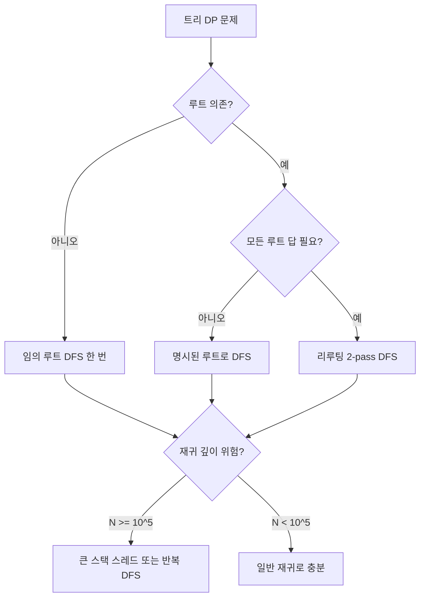

# Dynamic Programming 심화

## 들어가며

기본 DP 문서에서 메모이제이션 vs 타뷸레이션, LIS, LCS, 0-1 배낭, 편집 거리, 슬라이딩 윈도우 메모리 최적화까지는 정리했다. 이 문서는 그 다음 단계, 즉 코딩테스트 후반부와 면접 두 번째 라운드에서 나오는 패턴을 다룬다. 비트마스킹 DP, 구간 DP, 트리 DP 세 가지가 핵심이고, 여기에 Knuth 최적화·분할 정복 DP 최적화 같은 점화식 자체를 빠르게 만드는 기법을 덧붙인다.

처음 이 패턴들을 만났을 때 가장 어려웠던 부분은 코드가 아니라 "상태를 어떻게 정의할지"였다. 일반 1D DP는 `dp[i]`가 i번째까지의 답이라는 식으로 직관이 통하는데, 비트마스킹은 상태가 집합이 되고 구간 DP는 상태가 (왼쪽, 오른쪽) 두 인덱스가 된다. 트리 DP는 부모-자식 의존성이라 후위 순회에 익숙해져야 한다. 이 상태 설계만 익혀두면 코드는 항상 비슷한 모양이다.

실무에서 이런 DP를 직접 짤 일은 거의 없다. 그러나 라우팅 최적화, 작업 스케줄링, 트리 구조 비용 계산(예: 조직도 기반 권한 전파, 카테고리 트리 누적 합산) 같은 곳에서 똑같은 사고가 그대로 적용된다. 면접에서 외판원 순회나 트리 독립집합이 나왔을 때 멍해지지 않으려면 패턴을 손에 익혀둬야 한다.

## 비트마스킹 DP

### 상태 정의

비트마스킹 DP는 부분집합을 정수의 비트로 표현해서 `dp[mask]`처럼 상태를 잡는 방식이다. 원소 N개가 있을 때 부분집합은 2^N개이므로 N이 20을 넘어가면 상태 수만 100만이 넘어 메모리가 위험해진다. 실전에서는 N ≤ 20이 안전선이고, N = 16~18이 면접 단골이다.

흔한 형태는 두 가지다. 하나는 `dp[mask]`로 끝나는 형태(부분집합 합·SOS DP 류), 다른 하나는 `dp[mask][last]`처럼 마지막에 사용한 원소를 추가 차원으로 두는 형태(외판원 순회 류). 후자는 상태 수가 O(2^N · N), 전이 비용이 O(N)이라 전체가 O(2^N · N²)이 된다. N = 16이면 약 1,700만 연산이라 Java로 충분히 돈다.

### 비트 연산 기본기

비트마스킹 DP에 들어가기 전에 이 정도는 반사적으로 나와야 한다.

```java
// i번째 비트가 켜져 있는지
boolean visited = (mask & (1 << i)) != 0;

// i번째 비트를 켠 새 마스크
int next = mask | (1 << i);

// i번째 비트를 끈 새 마스크
int cleared = mask & ~(1 << i);

// 전체 집합 (N개 원소)
int full = (1 << n) - 1;

// 켜진 비트 개수
int count = Integer.bitCount(mask);
```

`Integer.bitCount`는 내부적으로 비트 트릭으로 구현되어 있어 빠르다. 직접 루프 돌면서 세면 N배 느려진다. 자주 호출되는 곳에서 직접 세지 말 것.

### 외판원 순회(TSP) 점화식

도시 N개, 0번에서 출발해서 모든 도시를 한 번씩 방문하고 0번으로 돌아오는 최소 비용을 구한다. 완전 탐색이면 (N-1)!이라 N = 12만 돼도 4억이 넘어 끝나지 않는다. 비트마스킹 DP로 O(2^N · N²)으로 줄인다.

`dp[mask][i]` = 현재까지 mask에 포함된 도시들을 방문했고, 마지막으로 도시 i에 있을 때의 최소 비용.

```java
public class TSP {
    static final int INF = Integer.MAX_VALUE / 2;
    int n;
    int[][] cost;
    int[][] dp;

    int solve(int mask, int pos) {
        if (mask == (1 << n) - 1) {
            return cost[pos][0] == 0 ? INF : cost[pos][0];
        }
        if (dp[mask][pos] != -1) return dp[mask][pos];

        int best = INF;
        for (int next = 0; next < n; next++) {
            if ((mask & (1 << next)) != 0) continue;  // 이미 방문
            if (cost[pos][next] == 0) continue;       // 간선 없음

            int sub = solve(mask | (1 << next), next);
            if (sub != INF) {
                best = Math.min(best, cost[pos][next] + sub);
            }
        }
        return dp[mask][pos] = best;
    }

    int run(int[][] graph) {
        n = graph.length;
        cost = graph;
        dp = new int[1 << n][n];
        for (int[] row : dp) Arrays.fill(row, -1);
        return solve(1, 0);  // 0번 도시에서 시작, mask는 0번만 켜진 상태
    }
}
```

여기서 가장 헷갈리는 부분은 시작 상태다. 시작이 0번이라면 mask는 `1`(0번 비트만 켜짐), pos는 0이다. mask = 0으로 시작해버리면 0번을 두 번 방문하는 경로가 답으로 나올 수 있다. 이런 실수가 디버깅하기 까다로워서, 시작점은 점화식 호출부에서 명시적으로 켜두는 게 안전하다.

복귀 비용(`cost[pos][0]`)을 종료 조건에 넣은 것도 흔히 빼먹는다. TSP는 출발지로 돌아와야 하는데, "모든 도시 방문 = 답" 으로 잡으면 복귀 비용이 빠진다. 시작 도시를 0이 아니라 다른 곳으로 잡는 변형 문제도 있는데, 이때는 시작 도시를 파라미터화해서 호출하거나 출발지 결정을 상태에 넣어야 한다.

### 복잡도 분석

상태 수가 2^N · N, 전이가 O(N)이라 시간은 O(2^N · N²). 메모리는 상태 수 그대로 O(2^N · N). N = 16에서 메모리는 16 · 65,536 = 약 100만 셀, 정수형 4바이트라면 4MB 정도다. Java 기본 힙 안에서 충분히 돈다.

N = 20부터는 메모리 1,600만 셀(약 64MB)이 되어 빠듯해진다. 이때는 `dp[mask][pos]`를 `int[][]` 대신 `int[]` 평탄화로 두면 캐시 친화적이고 약간 더 빠르다.

### 부분집합 합 DP (SOS DP)

`dp[mask]`만 쓰는 형태다. 가장 흔한 예는 "mask의 모든 부분집합에 대한 값을 합산"하는 문제. 단순히 모든 부분집합을 순회하면 `for sub = mask; sub; sub = (sub - 1) & mask` 트릭으로 O(3^N) 전체 순회가 가능하지만, SOS DP를 쓰면 O(2^N · N)으로 줄어든다.

```java
int[] dp = original.clone();
for (int i = 0; i < n; i++) {
    for (int mask = 0; mask < (1 << n); mask++) {
        if ((mask & (1 << i)) != 0) {
            dp[mask] += dp[mask ^ (1 << i)];
        }
    }
}
// dp[mask] = sum of original[sub] for all sub ⊆ mask
```

이 패턴이 갑자기 등장하면 처음에는 왜 되는지 잘 안 보인다. 핵심은 차원별로 "i번째 비트가 켜진 mask는 i번째 비트가 꺼진 mask의 값을 흡수한다"는 것이고, 이 흡수를 N번 반복하면 모든 부분집합 합이 채워진다. 외판원이나 일반 비트마스킹 DP보다 등장 빈도는 낮지만 한 번 이해해두면 비슷한 변형 문제는 다 풀린다.

## 구간 DP

### 상태 정의

구간 DP는 `dp[l][r]`로 "구간 [l, r]의 최적값"을 정의하는 패턴이다. 분할 지점 k를 [l, r) 사이에서 잡고, 좌측과 우측을 작은 구간으로 쪼개서 재귀적으로 결합한다.

```
dp[l][r] = min/max over k in [l, r) { dp[l][k] + dp[k+1][r] + 결합비용(l, k, r) }
```

상태가 O(N²), 전이가 O(N)이므로 일반 구간 DP는 O(N³)이다. N = 500까지는 약 1억 연산이라 Java로 1~2초에 돈다. N = 1000부터는 빠듯하니 Knuth 최적화 같은 추가 기법이 필요해진다.

### 순회 순서가 중요한 이유

구간 DP의 의존 관계를 보면 `dp[l][r]`은 자기보다 짧은 구간(`dp[l][k]`, `dp[k+1][r]`)에 의존한다. 그래서 길이가 작은 구간부터 큰 구간 순으로 채워야 한다.

```java
// 잘못된 순서: l, r 인덱스 순으로 채우면 의존 관계가 깨진다
for (int l = 0; l < n; l++) {
    for (int r = l; r < n; r++) {
        // dp[l][k]는 채워졌지만 dp[k+1][r]은 아직 안 채워짐
    }
}

// 올바른 순서: 길이별로 채운다
for (int len = 2; len <= n; len++) {
    for (int l = 0; l + len - 1 < n; l++) {
        int r = l + len - 1;
        for (int k = l; k < r; k++) {
            dp[l][r] = Math.min(dp[l][r], dp[l][k] + dp[k + 1][r] + mergeCost(l, k, r));
        }
    }
}
```

처음 구간 DP를 짤 때 가장 많이 하는 실수가 이 순회 순서다. 길이별 순회를 안 하면 `dp[k+1][r]`이 아직 0(혹은 초기값)인 상태에서 참조되어 답이 0으로 나온다. 디버깅하다 보면 점화식이 맞는데 답이 이상해서 한참 헤맨다.

Top-down으로 짜면 이 문제는 자동으로 해결된다. 재귀가 의존 순서를 알아서 풀어주기 때문이다. 구간 DP를 처음 익힐 때는 Top-down이 더 쉽고, 익숙해진 다음 Bottom-up으로 옮겨도 늦지 않다.

### 두 가지 분할점 순회 비교

구간 DP에서 분할점 k를 잡는 방식은 크게 두 가지다.

첫째, `dp[l][r] = min { dp[l][k] + dp[k+1][r] + 결합비용 }` (행렬 체인 곱셈 류). k가 l과 r 사이에서 좌우 두 구간으로 나뉜다.

둘째, `dp[l][r] = min { dp[l+1][r], dp[l][r-1] } + 추가비용` (회문 분할 류). 분할점이 양 끝에서 한 칸씩 줄어드는 형태다.

이 둘은 비슷해 보이지만 성격이 다르다. 첫째는 결합 순서를 결정하는 문제(행렬 곱셈, 돌 합치기), 둘째는 양 끝을 비교하면서 줄여나가는 문제(회문 부분 수열, 회문 분할)다. 점화식이 헷갈리면 문제 유형부터 먼저 분류해서 어느 패턴인지 정해야 한다.

### 팰린드롬 분할 예제

문자열 S가 주어졌을 때, 모든 부분 문자열이 회문이 되도록 자르는 최소 자르기 횟수를 구한다.

```java
public int minCut(String s) {
    int n = s.length();
    boolean[][] isPalin = new boolean[n][n];

    // 회문 여부 전처리: 구간 DP로 채운다
    for (int i = 0; i < n; i++) isPalin[i][i] = true;
    for (int len = 2; len <= n; len++) {
        for (int l = 0; l + len - 1 < n; l++) {
            int r = l + len - 1;
            if (s.charAt(l) != s.charAt(r)) continue;
            if (len == 2) isPalin[l][r] = true;
            else isPalin[l][r] = isPalin[l + 1][r - 1];
        }
    }

    // 자르기 횟수 DP: dp[i] = s[0..i]를 회문 조각으로 나누는 최소 자르기 수
    int[] dp = new int[n];
    for (int i = 0; i < n; i++) {
        if (isPalin[0][i]) {
            dp[i] = 0;
            continue;
        }
        dp[i] = Integer.MAX_VALUE;
        for (int j = 1; j <= i; j++) {
            if (isPalin[j][i]) {
                dp[i] = Math.min(dp[i], dp[j - 1] + 1);
            }
        }
    }
    return dp[n - 1];
}
```

이 문제는 회문 여부를 구간 DP로 전처리하고, 그 위에서 자르기 횟수를 1D DP로 푸는 구조다. 회문 여부 전처리를 생략하고 매번 `s.substring(j, i+1)`을 비교하면 O(N³)이 아니라 O(N⁴)이 되어 타임아웃이 난다. 구간 DP는 종종 전처리에 사용되니, 본 점화식 옆에 회문/부분합 같은 보조 테이블이 같이 등장하면 의심해볼 만하다.

### 돌 합치기 (행렬 체인 곱셈)

N개의 돌이 일렬로 있고, 인접한 두 돌을 합칠 때 합친 돌의 무게가 비용이 된다. 모든 돌을 하나로 합치는 최소 비용을 구한다. 행렬 체인 곱셈과 본질적으로 같은 문제다.

```java
public int mergeStones(int[] stones) {
    int n = stones.length;
    int[] prefix = new int[n + 1];
    for (int i = 0; i < n; i++) prefix[i + 1] = prefix[i] + stones[i];

    int[][] dp = new int[n][n];
    for (int len = 2; len <= n; len++) {
        for (int l = 0; l + len - 1 < n; l++) {
            int r = l + len - 1;
            dp[l][r] = Integer.MAX_VALUE;
            int rangeSum = prefix[r + 1] - prefix[l];
            for (int k = l; k < r; k++) {
                dp[l][r] = Math.min(dp[l][r], dp[l][k] + dp[k + 1][r] + rangeSum);
            }
        }
    }
    return dp[0][n - 1];
}
```

여기서 `rangeSum`이 합치는 비용으로 들어가는데, 부분합 배열을 안 만들면 매번 O(N)으로 합을 다시 계산해야 해서 O(N⁴)이 된다. 구간 DP에서 부분합은 거의 필수 짝꿍이다.

### Knuth 최적화

특정 형태의 구간 DP는 O(N³)에서 O(N²)로 줄어든다. 점화식이 다음 조건을 만족할 때다.

- `dp[l][r] = min over k in [l, r) { dp[l][k] + dp[k+1][r] } + w(l, r)`
- 비용 함수 `w(l, r)`이 사각형 부등식(quadrangle inequality)을 만족: `w(a, c) + w(b, d) ≤ w(a, d) + w(b, c)` (a ≤ b ≤ c ≤ d)
- `w(l, r)`이 monotone: `a ≤ b ≤ c ≤ d`이면 `w(b, c) ≤ w(a, d)`

이 조건이 만족되면 최적 분할점 `opt[l][r]`이 `opt[l][r-1] ≤ opt[l][r] ≤ opt[l+1][r]` 범위 안에 있다는 게 증명된다. 이 단조성을 이용해 분할점 탐색 범위를 줄여 전체가 O(N²)이 된다.

```java
// Knuth 최적화 적용
int[][] dp = new int[n + 1][n + 1];
int[][] opt = new int[n + 1][n + 1];

for (int i = 0; i < n; i++) opt[i][i + 1] = i;

for (int len = 2; len <= n; len++) {
    for (int l = 0; l + len <= n; l++) {
        int r = l + len;
        dp[l][r] = Integer.MAX_VALUE;
        for (int k = opt[l][r - 1]; k <= opt[l + 1][r]; k++) {
            int v = dp[l][k] + dp[k][r] + w(l, r);
            if (v < dp[l][r]) {
                dp[l][r] = v;
                opt[l][r] = k;
            }
        }
    }
}
```

실전에서 Knuth 최적화를 알아채는 신호는 N이 1,000~5,000 정도인 구간 DP 문제다. 1,000³ = 10억은 안 되고, 5,000² = 2,500만은 충분히 도니까. 다만 조건을 잘못 검증하고 적용하면 틀린 답이 나온다. 보통 문제 출제자가 의도한 경우에만 사용하고, 일반 구간 DP에 무작정 적용하면 안 된다.

### 분할 정복 DP 최적화

또 다른 흔한 최적화로 분할 정복 DP가 있다. 점화식이 `dp[i][j] = min over k { dp[i-1][k] + cost(k, j) }` 형태이고, 최적 분할점 `opt(j)`가 j에 대해 단조 증가할 때 O(N²)에서 O(N log N)으로 줄어든다.

핵심 아이디어는 j의 중간값을 잡고 그 최적 k를 찾으면 좌측 j들의 최적 k는 그 이하, 우측 j들의 최적 k는 그 이상으로 분할 정복할 수 있다는 것이다.

```java
void solve(int level, int lo, int hi, int optLo, int optHi) {
    if (lo > hi) return;
    int mid = (lo + hi) / 2;
    int bestK = optLo;
    int bestVal = Integer.MAX_VALUE;

    for (int k = optLo; k <= Math.min(mid - 1, optHi); k++) {
        int v = dp[level - 1][k] + cost(k, mid);
        if (v < bestVal) {
            bestVal = v;
            bestK = k;
        }
    }
    dp[level][mid] = bestVal;

    solve(level, lo, mid - 1, optLo, bestK);
    solve(level, mid + 1, hi, bestK, optHi);
}
```

이 패턴은 직접 손으로 짜기보다 "단조성 만족 여부"를 빠르게 판별하는 게 중요하다. cost 함수가 사각형 부등식 비슷한 성질을 가지면 보통 단조성이 성립한다. 검증은 N이 작을 때 무식하게 모든 k를 다 확인해서 최적 k가 j에 대해 단조 증가하는지 출력해보는 식으로 한다.

## 트리 DP

### 후위 순회 패턴

트리 DP의 기본 골격은 항상 같다. 루트에서 시작해서 DFS로 내려가면서, 자식의 결과를 먼저 계산한 후 현재 노드의 결과를 만든다. 후위 순회 그대로다.

```java
List<List<Integer>> tree;
int[] dp;

void dfs(int node, int parent) {
    dp[node] = baseValue(node);
    for (int child : tree.get(node)) {
        if (child == parent) continue;  // 부모 방향으로는 안 내려간다
        dfs(child, node);
        dp[node] = combine(dp[node], dp[child]);
    }
}
```

`parent` 파라미터를 빼먹으면 부모 방향으로도 재귀가 들어가서 무한 루프에 빠진다. 트리가 양방향 인접 리스트로 들어올 때 항상 부모를 인자로 받아 차단하는 게 안전한 습관이다.

### 트리에서의 독립집합

대표 예제다. 트리의 각 노드에 가중치가 있고, 인접한 두 노드를 동시에 고를 수 없을 때 가중치 합의 최댓값을 구한다.

상태를 `dp[node][0]` = node를 안 골랐을 때 서브트리 최댓값, `dp[node][1]` = node를 골랐을 때 서브트리 최댓값으로 잡는다.

```java
int[][] dp;
int[] weight;
List<List<Integer>> tree;

void dfs(int node, int parent) {
    dp[node][0] = 0;
    dp[node][1] = weight[node];

    for (int child : tree.get(node)) {
        if (child == parent) continue;
        dfs(child, node);
        dp[node][0] += Math.max(dp[child][0], dp[child][1]);  // 안 고름: 자식은 자유
        dp[node][1] += dp[child][0];                          // 고름: 자식은 못 고름
    }
}

int solve(int n) {
    dp = new int[n][2];
    dfs(0, -1);
    return Math.max(dp[0][0], dp[0][1]);
}
```

면접에서 자주 묻는 변형은 가중치가 없는 버전(최대 독립집합 크기), 트리가 양방향이 아니라 단방향(부모-자식 관계가 명시된 경우)인 버전, 노드 대신 간선을 고르는 버전 등이다. 상태 정의만 바뀌고 후위 순회 골격은 그대로다.

### 트리의 지름

지름은 트리에서 가장 먼 두 노드의 거리다. DFS 두 번으로도 풀 수 있지만, DP로 푸는 방식이 더 일반화하기 좋다.

```java
int diameter = 0;

int dfs(int node, int parent) {
    int first = 0, second = 0;  // 가장 긴 경로, 두 번째로 긴 경로
    for (int child : tree.get(node)) {
        if (child == parent) continue;
        int depth = dfs(child, node) + 1;
        if (depth > first) {
            second = first;
            first = depth;
        } else if (depth > second) {
            second = depth;
        }
    }
    diameter = Math.max(diameter, first + second);
    return first;
}
```

핵심은 각 노드에서 "가장 긴 두 경로의 합"이 그 노드를 거치는 지름 후보가 된다는 것. 자식이 둘 이상일 때 1등과 2등을 합쳐야 하니, 단순히 1등만 추적하면 틀린다.

가중치 간선이 있는 트리에서는 `depth + 1` 대신 `depth + weight(node, child)`로 바꾸면 그대로 동작한다.

### 리루팅 테크닉 (Re-rooting)

표준 트리 DP는 루트를 하나 정해놓고 답을 구한다. 그런데 "모든 노드를 루트로 했을 때의 답"이 필요한 문제가 있다. 가장 흔한 예가 "각 노드에서 다른 모든 노드까지의 거리 합". 모든 노드마다 DFS를 새로 돌리면 O(N²)이 되어 N = 10⁵에서 못 푼다.

리루팅은 두 단계다. 첫째, 임의의 루트를 잡고 일반 트리 DP로 모든 서브트리 정보를 계산한다. 둘째, 루트를 한 노드씩 옮길 때 변화량만 계산해서 전체를 O(N)으로 만든다.

```java
int n;
long[] subSum;   // subSum[v] = v를 루트로 하는 서브트리의 거리 합 (v 기준)
int[] subSize;   // subSize[v] = v를 루트로 하는 서브트리의 노드 수
long[] answer;   // answer[v] = v를 전체 트리의 루트로 봤을 때 거리 합

void dfs1(int node, int parent) {
    subSize[node] = 1;
    subSum[node] = 0;
    for (int child : tree.get(node)) {
        if (child == parent) continue;
        dfs1(child, node);
        subSize[node] += subSize[child];
        subSum[node] += subSum[child] + subSize[child];
    }
}

void dfs2(int node, int parent) {
    for (int child : tree.get(node)) {
        if (child == parent) continue;
        // node에서 child로 루트를 옮길 때
        // child 쪽 서브트리는 1만큼 가까워지고 (subSize[child]개 노드)
        // 나머지 노드는 1만큼 멀어진다 (n - subSize[child]개 노드)
        answer[child] = answer[node] - subSize[child] + (n - subSize[child]);
        dfs2(child, node);
    }
}

long[] solve(int size) {
    n = size;
    subSum = new long[n];
    subSize = new int[n];
    answer = new long[n];
    dfs1(0, -1);
    answer[0] = subSum[0];
    dfs2(0, -1);
    return answer;
}
```

리루팅의 핵심은 "한 칸 옮길 때 변화량을 점화식으로 표현할 수 있느냐"다. 거리 합처럼 깔끔하게 떨어지지 않는 문제(예: 트리 위에서의 최댓값 추적)는 변화 공식이 복잡해져서 실수하기 쉽다. 단조 자료구조나 multiset 같은 보조 자료구조가 결합되는 경우도 있다.

### 흔한 실수와 디버깅 포인트

트리 DP에서 자주 마주치는 함정들이다.

**루트 결정 실수.** 양방향 인접 리스트 트리에서 임의로 루트를 잡았는데, 결과가 루트에 의존하는 점화식이라면 틀린다. 트리의 지름처럼 루트와 무관한 답이라면 괜찮지만, 서브트리 누적 합 같은 건 루트가 바뀌면 답도 바뀐다. 문제가 "트리"라고만 적혀 있고 루트 표시가 없으면 보통 임의 루트로 두고 풀어도 되지만, "각 노드를 루트로 했을 때"가 들어가면 리루팅이 필요하다.

**재귀 깊이 폭발.** N = 10⁵에 가까운 트리가 한 줄(편향 트리)로 들어오면 재귀 깊이가 10만이 된다. Java 기본 스택은 보통 512KB라 1만~2만 깊이에서 StackOverflowError가 난다. 대안은 두 가지다. 별도 스레드를 큰 스택으로 만들어 그 안에서 DFS를 돌리거나, 명시적 스택으로 반복문 DFS를 짠다.

```java
// 큰 스택 스레드로 회피
Thread t = new Thread(null, () -> {
    dfs(0, -1);
}, "dfs", 1 << 26);  // 64MB 스택
t.start();
t.join();
```

**메모리 폭발.** `dp[node][state]`의 state 차원이 클 때 흔하다. 예를 들어 `dp[node][k]` (k = 서브트리에서 고른 노드 수)로 잡으면 메모리가 O(N²)이 된다. N = 10⁵면 메모리 100억으로 즉시 터진다. 이런 문제는 보통 N이 작거나(N ≤ 5000 정도) 차원 압축이 필요하다.

**자식 누적 순서 의존성.** 점화식에 자식들을 누적할 때 순서가 영향을 주는 경우(예: 선택형 누적)는 처음에 잡은 점화식이 무순서를 가정했는지 다시 확인해야 한다. 보통은 `for child in children { dp[node] = combine(dp[node], dp[child]) }` 식으로 누적 순서가 결과에 영향을 안 주는 게 일반적이지만, 0-1 배낭처럼 자식별로 "고를지 말지"가 누적되는 경우는 순서를 명확히 잡아야 한다.

**서브트리 사이즈 계산 누락.** 리루팅이나 가중치 트리에서 `subSize`를 따로 계산해두지 않으면 나중에 N - subSize 같은 식이 안 나온다. 트리 DP 짤 때는 거의 항상 서브트리 사이즈를 같이 추적해두는 게 안전하다.



## 상태 압축과 메모리 최적화

비트마스킹·구간·트리 DP 모두 메모리가 빠듯해질 수 있다. 메모리 압축 기법 몇 가지를 정리한다.

### 슬라이딩 윈도우 한 차원 줄이기

기본 DP 문서에서 다룬 0-1 배낭의 슬라이딩 윈도우 최적화는 구간 DP에는 적용이 어렵다. 구간 DP는 `dp[l][r]`이 자기보다 짧은 모든 구간에 의존해서 전체 2D 배열을 유지해야 한다.

반면 비트마스킹 DP에서 `dp[mask]`가 한 단계 작은 mask에만 의존한다면 차원을 줄일 수 있다. 다만 외판원처럼 `dp[mask][pos]`에서 pos가 mask와 강하게 결합된 경우는 압축이 어렵다.

### int 대신 short, byte

값의 범위가 작으면 `int` 대신 `short`(2바이트)나 `byte`(1바이트)를 쓰면 메모리가 절반~1/4로 줄어든다. 캐시 히트율도 올라가서 속도도 빨라진다. 다만 오버플로우 위험이 있어서 신중해야 한다.

```java
// 메모리 절약: 답이 -32768 ~ 32767 범위면
short[][] dp = new short[1 << n][n];
```

### Top-down에서 HashMap 사용

상태 공간이 크지만 도달 가능한 상태가 적을 때, 전체 배열 대신 HashMap을 쓰면 메모리를 도달한 상태만큼만 쓴다. 비트마스킹 DP에서 가지치기가 많은 경우 효과적이다.

```java
Map<Long, Integer> memo = new HashMap<>();

int solve(int mask, int pos) {
    long key = ((long) mask << 5) | pos;  // mask는 32비트, pos는 5비트로 가정
    Integer cached = memo.get(key);
    if (cached != null) return cached;
    // ...
}
```

키를 long으로 인코딩할 때 비트 시프트가 헷갈리니 주의. mask가 N비트, pos가 log N비트라면 `(mask << log N) | pos` 식으로 합친다. 시프트 양을 잘못 잡으면 다른 상태의 키가 겹쳐서 캐시가 오염된다.

## 마치며

비트마스킹·구간·트리 DP는 일반 1D/2D DP에 비해 상태 설계가 한 단계 더 추상적이라 처음에 막막하다. 그러나 각 패턴마다 골격이 정해져 있어서 한두 문제 정리하고 나면 그 다음부터는 같은 모양이 반복된다. 외판원·돌 합치기·트리 독립집합 세 개만 손으로 짜보면 이 세 패턴의 80%는 잡힌다.

실무에서는 직접 짤 일이 거의 없지만, 비트마스킹은 권한 집합·플래그 조합 처리에, 구간 DP는 시간 구간 누적 비용 계산에, 트리 DP는 카테고리/조직도 누적 합산에 사고가 그대로 옮겨간다. 알고리즘이 곧 실무라는 말은 거짓이지만, "상태를 어떻게 쪼개서 저장하느냐"는 발상은 시스템 설계에서도 그대로 통한다.

Knuth 최적화·분할 정복 DP 최적화 같은 고급 기법은 면접에서 먼저 묻는 경우는 드물고, 보통 "더 빨리 풀 수 있느냐"라는 후속 질문에 나온다. 일단 O(N³) 구간 DP를 빠르게 짤 수 있는 수준을 만들고, 추가로 단조성·사각형 부등식 같은 키워드만 머리에 넣어두면 면접 자리에서 막히지 않는다.
