# Greedy 문제 패턴 모음 (코딩테스트/면접 빈출)

## 들어가며

기본 개념과 증명은 [Greedy.md](Greedy.md)에서, 매트로이드와 근사 같은 이론은 [Greedy_Deep_Dive.md](Greedy_Deep_Dive.md)에서 다뤘다. 이 문서는 그 두 개에서 일부러 뺀 부분, 그러니까 실제 코딩테스트와 면접에서 반복적으로 나오는 그리디 문제 패턴을 정리한다.

5년 동안 면접관으로도 들어가 보고 후보자로도 풀어본 경험을 정리하면, 그리디 문제는 크게 10개 정도의 패턴이 돌아가면서 나온다. LeetCode Hot 100, 프로그래머스 카카오 기출, 백준 골드 구간을 보면 같은 골격에 살만 다른 문제가 계속 나온다. 그러니까 "이 문제는 어떤 패턴인가"를 빠르게 분류하는 감각이 풀이 시간을 결정한다.

각 패턴마다 그리디 기준이 왜 성립하는지 한 줄로 짚고, Java 코드를 붙이고, 내가 실제로 틀렸던 반례와 헷갈리는 형제 문제를 적는다. "이 문제 풀어봤는데 비슷한 거 못 풀겠다"의 원인은 보통 형제 문제와의 차이를 못 잡아서다.

## 1. 인터벌 스케줄링 패턴

### 1-1. 활동 선택 (Activity Selection)

가장 많은 회의를 잡으려면 **종료 시간 기준 오름차순 정렬** 후 끝나는 시간이 빠른 것부터 선택하면서 다음 회의 시작이 그 종료보다 크거나 같은지만 본다.

기준 정당화: 가장 빨리 끝나는 회의 A를 골랐을 때, A를 포함하는 최적해가 반드시 존재한다. 최적해 OPT가 A 대신 B로 시작하면, B의 종료시간 ≥ A의 종료시간이므로 OPT의 B를 A로 바꿔도 뒤따르는 회의들이 그대로 들어갈 수 있다.

```java
public int maxMeetings(int[][] meetings) {
    Arrays.sort(meetings, Comparator.comparingInt(a -> a[1]));
    int count = 0, lastEnd = Integer.MIN_VALUE;
    for (int[] m : meetings) {
        if (m[0] >= lastEnd) {
            count++;
            lastEnd = m[1];
        }
    }
    return count;
}
```

자주 빠지는 반례: 시작 시간 기준으로 정렬하면 무너진다. `[(0,30), (5,10), (15,20)]`에서 시작시간 정렬은 `(0,30)` 하나만 잡지만 종료시간 정렬은 `(5,10), (15,20)` 둘을 잡는다.

같은 입력에 정렬 기준만 바꿨을 때 `lastEnd`가 어떻게 달라지는지 나란히 놓은 것이다. 시작 시간 정렬은 첫 회의가 30까지 자리를 차지해 뒤 회의가 모두 버려진다.

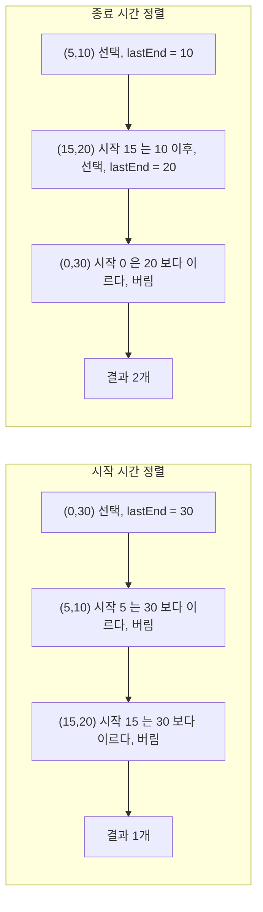

#### 조용히 틀리는 경우: 동률과 길이 0인 회의

끝나는 시간이 같을 때 보조 정렬이 필요 없다고 생각하기 쉽다. 시작 시간이 다른 두 회의가 같은 시각에 끝나면 어느 쪽을 골라도 뒤 회의에 주는 영향은 같으니 개수는 같다. 이 논리는 길이 0인 회의(시작 = 종료)가 없을 때만 성립한다.

`[(2,2), (1,2)]`를 종료 시각만으로 정렬하고 입력 순서가 그대로 유지되면 `(2,2)`가 먼저 온다. `(2,2)`를 잡으면 `lastEnd = 2`이고, 다음 `(1,2)`는 시작 1이 2보다 작아서 버려진다. 답은 1이다. `(1,2)`를 먼저 잡았다면 `(2,2)`의 시작 2가 `lastEnd` 2 이상이라 둘 다 잡혀서 답은 2다. `Arrays.sort`는 객체 배열에서 안정 정렬이라, 동률의 결과가 입력 순서에 그대로 달려 있다.

무작위로 만든 구간 20,000묶음(길이 0 포함)에서 종료 시각만으로 정렬한 코드는 2,081묶음을 틀렸고, `종료 오름차순, 종료가 같으면 시작 오름차순` 정렬은 부분집합 전수 탐색과 20,000묶음 모두 일치했다. 백준 1931번 회의실 배정은 시작과 종료가 같은 회의를 허용하고, 이 보조 정렬을 빼면 틀리는 문제로 유명하다. 문제에 실린 샘플에는 길이 0인 회의가 없어서, 샘플은 통과하고 제출에서 틀린다.

```java
Arrays.sort(meetings, (a, b) -> a[1] != b[1]
        ? Integer.compare(a[1], b[1])
        : Integer.compare(a[0], b[0]));
```

정렬 비교자에서 `a[1] - b[1]`처럼 뺄셈을 쓰는 습관도 값 범위가 int 끝에 가까우면 오버플로로 순서가 뒤집힌다. `Integer.compare`를 쓰면 이 문제가 없다.

### 1-2. 인터벌 파티셔닝 (Minimum Number of Meeting Rooms)

같은 회의들을 동시에 진행할 수 있는 최소 회의실 개수를 구하는 문제다. 1-1과 골격이 똑같이 보이지만 답이 다르다. 1-1은 "한 방에서 몇 개 잡을까", 1-2는 "다 잡으려면 방이 몇 개 필요한가".

기준 정당화: 시작 시간 정렬 후 우선순위 큐로 가장 빨리 끝나는 방을 추적한다. 새 회의 시작 ≥ 큐 top 종료면 그 방을 재사용, 아니면 새 방을 만든다. 어느 시점이든 큐 크기가 그때 동시 진행 중인 회의 수다.

```java
public int minMeetingRooms(int[][] intervals) {
    if (intervals.length == 0) return 0;
    Arrays.sort(intervals, Comparator.comparingInt(a -> a[0]));
    PriorityQueue<Integer> endTimes = new PriorityQueue<>();
    endTimes.offer(intervals[0][1]);
    for (int i = 1; i < intervals.length; i++) {
        if (intervals[i][0] >= endTimes.peek()) {
            endTimes.poll();
        }
        endTimes.offer(intervals[i][1]);
    }
    return endTimes.size();
}
```

자주 빠지는 반례: `[(0,30), (5,10), (15,20)]`에서 답은 2다. `(0,30)`이 깔려 있는 동안 `(5,10)`이 들어와서 방 2개, `(15,20)`이 들어올 때 `(5,10)`이 끝났으니 그 방을 재사용해서 여전히 2다. 정답은 "동시 회의 최대 수"이고, 그게 큐 크기의 최댓값이 된다.

아래 시퀀스 다이어그램은 회의 5개 `(0,30) (5,10) (15,20) (18,25) (22,40)`을 시작 시각 순으로 넣었을 때 힙이 어떻게 변하는지 보여준다. `poll`이 일어나는 자리가 방을 재사용하는 자리고, 힙 크기는 `poll` 뒤에 `offer`가 바로 이어지니 줄어들지 않는다. 그래서 반환값을 `endTimes.size()` 하나로 써도 동시 진행 최대 수와 같다.

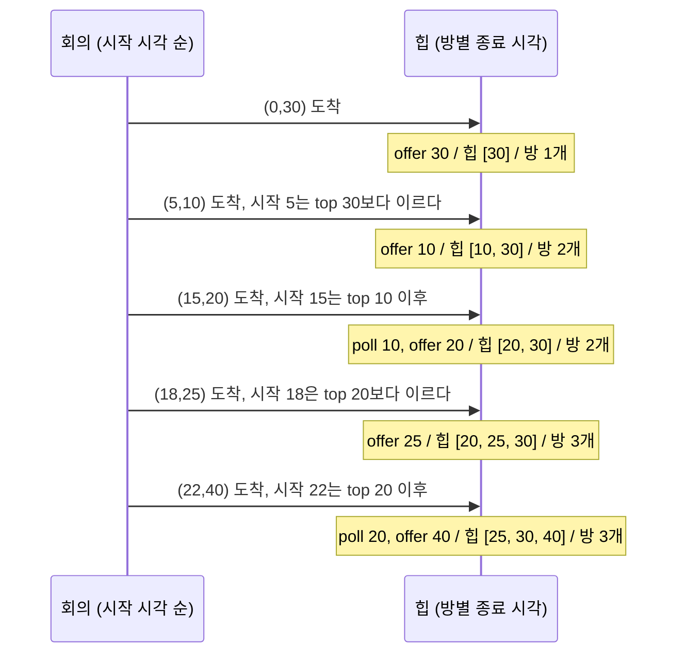

이벤트 정렬(시작 +1, 종료 -1) 방식으로도 풀 수 있다. 시작과 종료를 분리해서 시간순 정렬하고 누적 합의 최댓값을 답으로 잡는다. 같은 시각에 종료가 시작보다 먼저 처리돼야 하니 정렬 키에서 종료를 우선 처리해야 한다(종료 -1을 먼저, 시작 +1을 나중).

#### 조용히 틀리는 경우: 맞닿은 회의의 비교 연산자

`[(0,5), (5,10)]`처럼 앞 회의가 끝나는 순간 다음 회의가 시작하는 입력에서 갈린다. 방은 1개면 된다. 코드의 `>=`를 `>`로 쓰면 `endTimes.peek()`이 5이고 시작도 5라서 재사용 조건이 거짓이 되고, 답이 2로 나온다. 이벤트 정렬 방식도 마찬가지다. 같은 시각 5에서 종료(-1)를 먼저 처리하면 최댓값이 1이고, 시작(+1)을 먼저 처리하면 2가 된다. 둘 다 실행해서 확인했다.

문제마다 "끝나는 시각에 바로 시작 가능한가"가 다르게 정의되어 있다. LeetCode 253(Meeting Rooms II)과 435(Non-overlapping Intervals)는 맞닿아도 겹치지 않는 것으로 본다. 다른 사이트에서 옮겨 온 문제는 이 정의를 지문에서 먼저 읽어야 한다. 샘플 두세 개는 대개 이 경계를 건드리지 않아서 통과하고, 숨은 테스트에서만 틀린다.

비슷한 문제 헷갈리는 케이스: Minimum Platforms(GeeksforGeeks)는 1-2와 정확히 같은 문제다. 도착/출발 배열이 분리돼 있는 형태일 뿐, 인터벌 파티셔닝이 본질이다. 그런데 LeetCode "Non-overlapping Intervals"는 1-1과 같은 종료시간 정렬 패턴이고 답이 "전체 - 활동 선택 결과"가 된다. 이름과 형태가 살짝 달라도 결국 같은 두 패턴 안에 들어간다.

## 2. Gas Station (주유소 순회)

원형으로 늘어선 주유소를 한 바퀴 돌 때, 어디서 출발하면 한 번도 빈 탱크가 되지 않을지 찾는다. 총 주유량 ≥ 총 소비량이면 답이 반드시 존재한다는 게 출발점이다.

기준 정당화: `tank = gas[i] - cost[i]`를 누적할 때 음수가 되는 순간 그 구간 안의 어떤 i에서 출발해도 실패한다. 누적합이 음수가 된 시점의 다음 인덱스에서 다시 시작하면 된다. 전체 합이 ≥ 0이라는 조건 아래서, 마지막으로 리셋된 시작점이 정답이다.

```java
public int canCompleteCircuit(int[] gas, int[] cost) {
    int total = 0, tank = 0, start = 0;
    for (int i = 0; i < gas.length; i++) {
        int diff = gas[i] - cost[i];
        total += diff;
        tank += diff;
        if (tank < 0) {
            start = i + 1;
            tank = 0;
        }
    }
    return total >= 0 ? start : -1;
}
```

이 문제는 LeetCode 134번이다. 코드가 한 번만 훑는데도 맞는 이유는 두 가지 사실이 겹치기 때문이다. 하나는 총합이 0 이상이면 답이 존재한다는 것이고, 다른 하나는 출발점 `s`에서 `j`까지 가다가 처음 탱크가 음수가 됐다면 `s+1`부터 `j`까지 어디서 출발해도 `j`를 못 넘는다는 것이다. `s`에서 출발해 `k`(`s < k <= j`)에 도착했을 때 탱크는 0 이상이었으니, 빈 탱크로 `k`에서 출발하는 쪽이 항상 같거나 더 나쁘다. 그래서 후보를 `j+1`로 통째로 건너뛰어도 답을 잃지 않는다.

아래 도식은 코드가 매 칸마다 하는 판단을 그린 것이다. 탱크가 음수가 되면 출발점을 다음 칸으로 밀고 탱크를 비운다. 루프가 끝나면 `total`로 한 번 더 걸러낸다.

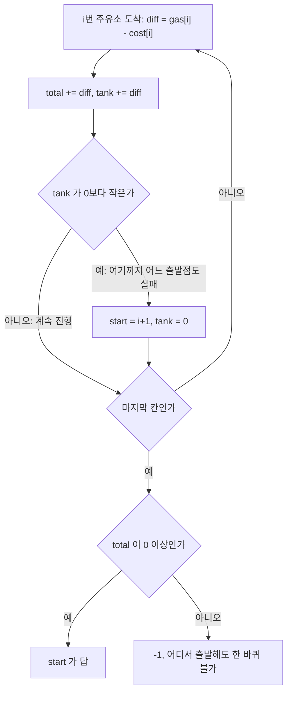

`gas=[1,2,3,4,5], cost=[3,4,5,1,2]`(답 3)를 코드에 넣고 매 단계의 값을 찍은 결과다.

| i | diff | total | tank (리셋 후) | start | 비고 |
|---|---|---|---|---|---|
| 0 | -2 | -2 | 0 | 1 | tank가 -2가 되어 리셋 |
| 1 | -2 | -4 | 0 | 2 | 리셋 |
| 2 | -2 | -6 | 0 | 3 | 리셋 |
| 3 | 3 | -3 | 3 | 3 | 이후 음수 없음 |
| 4 | 3 | 0 | 6 | 3 | total = 0이라 답은 3 |

`total`은 중간에 음수여도 상관없고, 마지막에 0 이상이기만 하면 된다. 위 표에서 `total`이 -6까지 내려갔다가 0으로 돌아왔다. 판정에 쓰는 값은 마지막 `total` 하나다.

#### 조용히 틀리는 경우: 총합 검증 누락과 int 누적

`gas=[2,3,4], cost=[3,4,3]`은 총합이 -1이라 답이 없다. `total` 검사 없이 `start`만 반환하면 이 입력에서 2를 돌려준다. 리셋 로직만 보면 인덱스 2에서 탱크가 다시 0 이상이 되어 그럴듯해 보이기 때문에, 손으로 몇 개 넣어 봐서는 눈치채기 어렵다. 코드에서는 `total >= 0 ? start : -1`이 이걸 막는다.

또 하나는 누적 변수의 자료형이다. LeetCode 제약(`n <= 10^5`, 값 `<= 10^4`)에서는 int로 충분하다. 값 범위가 10억대인 변형에서는 그렇지 않다. `gas`가 전부 `1_000_000_000`, `cost`가 전부 1인 주유소 5개를 넣으면 실제 `total`은 4,999,999,995인데 int로 누적하면 705,032,699가 된다. 이 입력은 부호가 우연히 맞아서 답이 같지만, 양수와 음수가 섞이면 부호가 뒤집혀 `-1`과 `start`가 엇갈릴 수 있다. `total`과 `tank`는 long으로 선언한다.

#### 헷갈리는 형제 문제

백준의 "주유소"(13305번)는 원형이 아니라 직선이고, 각 도시에서 기름값이 다른 상황이다. 이건 "지금까지 본 가장 싼 가격으로 다음 구간을 채운다"는 다른 패턴이다. 같이 묶어 외워두면 면접에서 변형이 나와도 빠르게 분류된다. 이 문제도 총 비용이 int를 넘기 쉬워서 long이 필요하다.

## 3. Jump Game I, II

### 3-1. Jump Game I (도달 가능성)

각 위치의 최대 점프 거리가 주어질 때 마지막 칸에 도달 가능한지 본다.

기준 정당화: 지금까지 도달 가능한 최대 인덱스 `reach`를 추적하면서, 현재 위치 i가 `reach`보다 크면 거기 못 간다. 그게 아니라면 `reach = max(reach, i + nums[i])`로 갱신한다. 마지막 인덱스까지 `reach`가 따라가면 도달 가능.

```java
public boolean canJump(int[] nums) {
    int reach = 0;
    for (int i = 0; i < nums.length; i++) {
        if (i > reach) return false;
        reach = Math.max(reach, i + nums[i]);
        if (reach >= nums.length - 1) return true;
    }
    return true;
}
```

자주 빠지는 반례: `[3,2,1,0,4]`에서 인덱스 3에 도달은 하지만 거기서 점프 0이라 4번을 못 간다. `reach`가 i를 못 따라잡는 순간이 정확히 그 시점이다.

`if (i > reach) return false;` 한 줄을 빼먹으면 이 입력이 오히려 `true`로 나온다. 인덱스 4에서 `reach = max(3, 4 + 4)`가 되어 도달할 수 없는 칸에서 출발한 점프가 `reach`에 반영되기 때문이다. 갱신 전에 "지금 서 있는 칸에 애초에 올 수 있었는가"를 먼저 확인해야 한다.

### 3-2. Jump Game II (최소 점프 횟수)

마지막 칸까지 가는 최소 점프 횟수다. 여기서 BFS로 풀 수도 있지만 그리디가 O(n)이라 더 빠르다.

기준 정당화: 현재 점프로 갈 수 있는 범위 `currentEnd`를 정해놓고, 그 범위 안에서 다음에 갈 수 있는 가장 먼 곳 `farthest`를 추적한다. i가 `currentEnd`에 도달하면 점프 횟수를 1 늘리고 `currentEnd = farthest`로 갱신한다. 이게 BFS의 레벨 단위 확장과 똑같다.

```java
public int jump(int[] nums) {
    int jumps = 0, currentEnd = 0, farthest = 0;
    for (int i = 0; i < nums.length - 1; i++) {
        farthest = Math.max(farthest, i + nums[i]);
        if (i == currentEnd) {
            jumps++;
            currentEnd = farthest;
        }
    }
    return jumps;
}
```

이 코드는 배열을 BFS의 레벨 단위로 자르는 것과 같다. 점프 k번으로 닿을 수 있는 칸의 집합이 한 레벨이고, 그 레벨 안의 칸들이 다음에 뻗을 수 있는 가장 먼 곳이 다음 레벨의 끝이다. 큐를 쓰지 않고 레벨의 끝(`currentEnd`)과 다음 레벨의 끝 후보(`farthest`)만 들고 다니니 O(n)에 O(1) 공간이다. `[2,3,1,1,4]`에서 레벨이 어떻게 갈리는지 그린 것이다.

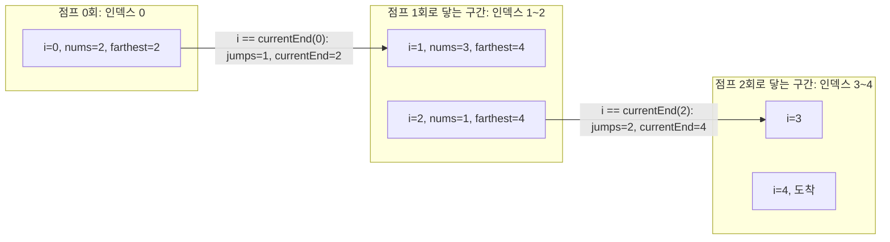

구간 하나 안에서는 `farthest`만 갱신하고, `i`가 `currentEnd`에 닿는 순간에만 점프 횟수를 올리면서 구간을 넘긴다. 이 동작을 코드에서 직접 찍은 값이다.

| i | nums[i] | farthest | currentEnd | jumps | 비고 |
|---|---|---|---|---|---|
| 0 | 2 | 2 | 2 | 1 | i == 0(옛 currentEnd), 점프 1회 확정 |
| 1 | 3 | 4 | 2 | 1 | 같은 구간 안, farthest만 갱신 |
| 2 | 1 | 4 | 4 | 2 | i == 2(옛 currentEnd), 점프 2회 확정 |
| 3 | 1 | 4 | 4 | 2 | 마지막 인덱스 4는 이미 currentEnd 안 |

#### 조용히 틀리는 경우: 루프 끝 인덱스와 도달 불가 입력

루프 종료 조건이 `i < nums.length - 1`이라는 점이 중요하다. 마지막 인덱스에 도달했는데 거기서 또 점프 횟수를 한 번 더 세면 1이 추가로 붙는다. `[2,3,1,1,4]`에서 답은 2(0→1→4)인데, `i < nums.length`로 돌리면 3이 나온다. 마지막 칸은 "도착한 곳"이지 "떠나는 곳"이 아니다.

LeetCode 45번은 마지막 칸에 반드시 도달할 수 있다고 보장한다. 이 보장이 없는 입력에서는 코드가 예외 없이 숫자를 돌려준다. `[1,0,1]`을 넣으면 실제로는 인덱스 1에서 막혀 도달이 불가능한데 2를 반환하고, `[1,0,0,1]`도 2를 반환한다. `currentEnd`가 제자리에 멈춰도 `i == currentEnd`가 한 번은 참이 되기 때문이다. 도달 불가 판정이 필요한 변형이면 3-1의 `canJump`를 먼저 돌리거나, `farthest == i`에서 멈추는 검사를 넣어야 한다.

#### 헷갈리는 형제 문제

Jump Game III, IV는 그래프 BFS가 답이지 그리디가 아니다. 점프 거리가 양방향이거나 동일 값 인덱스로 워프하는 식의 변형이 들어오는 순간 그리디 가정이 깨진다. 패턴 분류할 때 "점프 방향이 단방향이고, 각 위치의 거리가 고정되어 있나"를 먼저 본다.

## 4. Candy Distribution (사탕 분배)

`ratings`가 주어지고, 각 아이는 최소 1개 이상의 사탕을 받아야 하며 평점이 옆 아이보다 높으면 사탕도 더 많아야 한다. 총 사탕 최소.

기준 정당화: 한 번에 양쪽 조건을 만족시키기 어려우니까, **왼쪽→오른쪽으로 한 번 훑고, 오른쪽→왼쪽으로 한 번 더 훑어서 둘의 max**를 취한다. 왼쪽 패스는 "왼쪽 이웃보다 평점이 높으면 +1", 오른쪽 패스는 "오른쪽 이웃보다 평점이 높으면 +1". 두 결과의 max가 양쪽 조건을 모두 만족하는 최소값이 된다.

```java
public int candy(int[] ratings) {
    int n = ratings.length;
    int[] candies = new int[n];
    Arrays.fill(candies, 1);
    for (int i = 1; i < n; i++) {
        if (ratings[i] > ratings[i - 1]) candies[i] = candies[i - 1] + 1;
    }
    for (int i = n - 2; i >= 0; i--) {
        if (ratings[i] > ratings[i + 1]) candies[i] = Math.max(candies[i], candies[i + 1] + 1);
    }
    int sum = 0;
    for (int c : candies) sum += c;
    return sum;
}
```

LeetCode 135번이다. 두 패스가 각각 무엇을 책임지는지 배열로 보면 이해가 빠르다. 아래는 `ratings=[1,3,2,2,1]`을 코드에 넣고 패스마다 찍은 값이다. 왼쪽 패스는 "왼쪽 이웃보다 높으면 왼쪽 값 + 1"만 보고, 오른쪽 패스는 "오른쪽 이웃보다 높으면 오른쪽 값 + 1"만 본다.

| 인덱스 | 0 | 1 | 2 | 3 | 4 | 합 |
|---|---|---|---|---|---|---|
| ratings | 1 | 3 | 2 | 2 | 1 | |
| 초기값 | 1 | 1 | 1 | 1 | 1 | 5 |
| 좌→우 패스 후 | 1 | 2 | 1 | 1 | 1 | 6 |
| 우→좌 패스만 단독 | 1 | 2 | 1 | 2 | 1 | 7 |
| 두 결과의 max (최종) | 1 | 2 | 1 | 2 | 1 | 7 |

아래 도식은 위 표의 `ratings=[1,3,2,2,1]`이 초기값에서 최종값까지 가는 순서다. 두 번째 패스가 첫 번째 패스의 결과 위에 `max`로 덧씌운다는 점을 보면 된다.

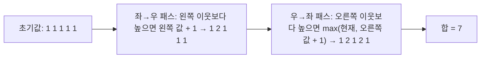

좌→우 패스만 하면 인덱스 3이 1로 남는다. 평점 2인 인덱스 3은 오른쪽의 평점 1 이웃보다 높은데, 왼쪽 패스는 오른쪽을 보지 않아서 이 관계를 놓친다. 우→좌 패스가 인덱스 3을 2로 올린다. 인덱스 2는 오른쪽 이웃(평점 2)과 같아서 어느 쪽 패스에서도 올라가지 않고 1로 남는다.

LeetCode 예제 `[1,2,87,87,87,2,1]`은 양쪽 패스가 서로 다른 자리를 채우는 예다.

| 인덱스 | 0 | 1 | 2 | 3 | 4 | 5 | 6 | 합 |
|---|---|---|---|---|---|---|---|---|
| ratings | 1 | 2 | 87 | 87 | 87 | 2 | 1 | |
| 좌→우 패스 단독 | 1 | 2 | 3 | 1 | 1 | 1 | 1 | 10 |
| 우→좌 패스 단독 | 1 | 1 | 1 | 1 | 3 | 2 | 1 | 10 |
| max (최종) | 1 | 2 | 3 | 1 | 3 | 2 | 1 | 13 |

가운데 87 세 개는 서로 평점이 같아서 양쪽 어느 패스도 올리지 않고, 인덱스 3은 1로 남는다. 최종 합은 13이다.

#### 조용히 틀리는 경우: 덮어쓰기와 동률, int 합

가장 흔한 실수는 우→좌 패스에서 `max`를 안 쓰고 대입하는 것이다. `candies[i] = candies[i + 1] + 1`로 쓰면 왼쪽 패스가 이미 올려 둔 값을 깎아 버린다. `ratings=[1,2,3,1]`에서 왼쪽 패스는 `[1,2,3,1]`이지만, 덮어쓰기 버전은 인덱스 2를 `candies[3] + 1 = 2`로 내려서 `[1,2,2,1]`(합 6)이 된다. 평점이 3인 아이가 평점 2인 이웃과 같은 사탕을 받으니 조건 위반이다. 정답은 `[1,2,3,1]`, 합 7이다. `max`를 쓰면 이 문제가 없고, 예외가 나지 않아서 샘플 몇 개로는 걸리지 않는다.

평점이 같은 경우도 자주 틀린다. "더 높은 평점에는 더 많은 사탕"이지 "다른 평점에는 다른 사탕"이 아니다. 평점이 같으면 사탕 수는 무관하므로 둘 다 1을 줘도 된다. `[1,2,2]`는 `[1,2,1]`로 합 4다. 같은 평점도 다르게 주려고 하면 답이 부풀어 오른다.

마지막으로 합산 자료형이다. LeetCode의 `n <= 2 * 10^4`에서는 최대 합이 약 2억이라 int로 충분하다. 평점이 순증가하는 길이 100,000 배열을 넣으면 실제 합은 5,000,050,000이고 int로 누적하면 705,082,704가 나온다. 제약이 다른 사이트의 변형 문제에서는 합을 long으로 잡는다.

O(1) 공간으로도 풀 수 있는 슬로프(slope) 카운팅 풀이가 있는데, 면접에서는 두 패스 풀이를 먼저 보여주고 추가 질문이 들어오면 슬로프로 넘어가는 게 안전하다.

## 5. Task Scheduler (쿨다운 큐)

같은 종류 작업 사이에 n초 쿨다운이 있을 때 모든 작업을 끝내는 최소 시간이다. 우선순위 큐와 그리디의 결합 패턴 중 가장 자주 나온다.

기준 정당화: 매 시점마다 **남은 횟수가 가장 많은 작업을 먼저 처리**하면 쿨다운으로 인한 idle을 최소화한다. 가장 많이 남은 게 늦게 처리되면 마지막에 그것만 남아서 강제 idle이 생긴다.

```java
public int leastInterval(char[] tasks, int n) {
    int[] freq = new int[26];
    for (char t : tasks) freq[t - 'A']++;
    PriorityQueue<Integer> pq = new PriorityQueue<>(Collections.reverseOrder());
    for (int f : freq) if (f > 0) pq.offer(f);

    int time = 0;
    while (!pq.isEmpty()) {
        List<Integer> temp = new ArrayList<>();
        for (int i = 0; i <= n; i++) {
            if (!pq.isEmpty()) {
                int f = pq.poll();
                if (f > 1) temp.add(f - 1);
            }
            time++;
            if (pq.isEmpty() && temp.isEmpty()) break;
        }
        for (int f : temp) pq.offer(f);
    }
    return time;
}
```

위 코드는 `n + 1`칸짜리 사이클을 반복한다. 사이클 안에서 꺼낸 작업은 `temp`에 보관했다가 사이클이 끝나야 큐로 돌아가서 쿨다운이 지켜진다. 도식에서 `temp`가 큐로 돌아가는 위치와 `break`가 걸리는 조건을 보면 된다.

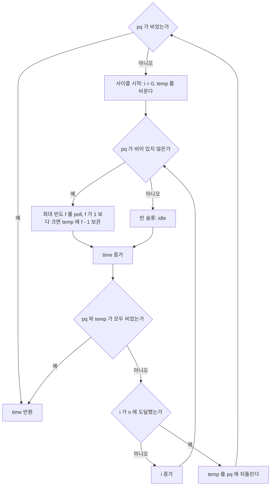

수식 풀이도 있다. `(maxFreq - 1) * (n + 1) + (가장 많은 빈도를 가진 작업 종류 수)`와 `tasks.length` 중 큰 값이 답이다. 면접에서 시간이 부족하면 수식 풀이로 가고, 시간이 있으면 큐 시뮬레이션을 보여주면서 "왜 수식이 성립하는가"를 설명하는 흐름이 좋다.

자주 빠지는 반례: 큐 시뮬레이션을 짜면서 idle 처리를 놓치기 쉽다. 슬롯이 비어 있는데 큐도 비어 있으면 그게 진짜 마지막이고, 시뮬레이션을 더 돌리면 안 된다. 위 코드의 `if (pq.isEmpty() && temp.isEmpty()) break;`가 그 처리다. 빼먹으면 마지막 사이클에서 쿨다운만큼 idle이 추가로 카운트된다.

수식 풀이에서 조용히 틀리는 지점은 "가장 많은 빈도를 가진 작업 종류 수"를 빼먹는 것이다. LeetCode 621번 예제 `AAABBB`, n=2에서 A와 B가 둘 다 빈도 3이라 마지막 줄에 두 작업이 함께 온다(`A B _ A B _ A B`). 이 종류 수를 더하지 않고 `(maxFreq - 1) * (n + 1)`만 쓰면 6이 나오고, 정답은 8이다. 수식과 큐 시뮬레이션을 무작위 5,000건(작업 최대 12개, 종류 4개, n은 0~3)으로 대조했을 때 불일치는 0건이었다. n=0이면 `tasks.length`가 더 커서 그 값이 답이 된다(`AAABBB`, n=0은 6).

비슷한 문제 헷갈리는 케이스: LeetCode "Reorganize String"이 같은 패턴이다. 같은 문자가 인접하지 않게 재배열하라는 문제인데, 빈도수 큰 것부터 한 칸씩 띄워가며 배치하는 게 그리디 핵심이다. Task Scheduler에서 idle을 다른 작업으로 채우는 것과 같은 발상이다.

## 6. 우선순위 큐 + 그리디 결합

### 6-1. Reorganize String

```java
public String reorganizeString(String s) {
    int[] count = new int[26];
    for (char c : s.toCharArray()) count[c - 'a']++;
    PriorityQueue<int[]> pq = new PriorityQueue<>((a, b) -> b[1] - a[1]);
    for (int i = 0; i < 26; i++) {
        if (count[i] > 0) pq.offer(new int[]{i, count[i]});
    }
    StringBuilder sb = new StringBuilder();
    int[] prev = null;
    while (!pq.isEmpty()) {
        int[] cur = pq.poll();
        sb.append((char) ('a' + cur[0]));
        cur[1]--;
        if (prev != null && prev[1] > 0) pq.offer(prev);
        prev = cur;
    }
    return sb.length() == s.length() ? sb.toString() : "";
}
```

아래 도식은 루프 한 바퀴의 흐름이다. 방금 쓴 문자(`cur`)는 바로 큐에 돌려놓지 않고 `prev`에 두었다가 다음 바퀴에 돌려놓는다. 이 한 박자 지연이 인접 회피를 만든다.

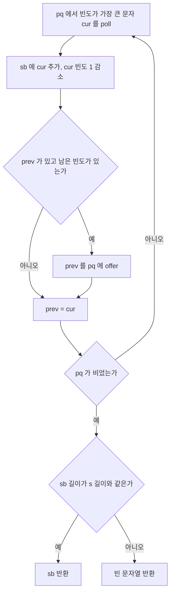

기준 정당화: 가장 많은 문자를 먼저 쓰고, 직전에 쓴 문자는 한 박자 쉬게 만든다(`prev`로 한 사이클 보류). 최대 빈도 문자가 `(n+1)/2`를 넘으면 어떤 배치로도 인접 회피가 불가능하니 빈 문자열 반환.

자주 빠지는 반례: `"aaab"`는 답이 없다(`a`가 3개, 길이 4의 절반인 2를 넘음). 이걸 검증 안 하면 무한 루프나 잘못된 결과가 나온다. 코드에서 `sb.length() == s.length()` 체크가 그 안전장치다.

LeetCode 767번이고, 입력에서 미리 불가능 여부를 판정하는 풀이가 많다. 그때 임계값을 `n / 2`로 쓰면 홀수 길이에서 틀린다. `"aab"`는 `a`가 2개이고 길이 3의 절반(정수 나눗셈 1)을 넘지만 `"aba"`로 배치된다. 올바른 조건은 최대 빈도 `<= (n + 1) / 2`다. 길이 7 이하 문자열 3,000건으로 두 임계값을 대조했을 때 `(n + 1) / 2`는 코드의 실제 결과와 전부 일치했고, `n / 2`는 1,149건이 어긋났다. 큐 기반 코드는 이 임계값 없이도 맞지만, 사전 판정을 붙일 때 이 값이 자주 틀린다.

### 6-2. K번째 큰 합 (Find K Pairs with Smallest Sums)

두 정렬 배열 `nums1`, `nums2`에서 합이 가장 작은 k 쌍을 찾는다.

기준 정당화: 최소 힙에 `(0,0)`부터 시작해서 매번 꺼낸 `(i,j)`에서 `(i+1,j)`와 `(i,j+1)`을 추가하는 식으로 BFS처럼 확장한다. 단, 같은 `(i,j)`가 중복 들어가지 않도록 visited 처리가 필요하다.

```java
public List<List<Integer>> kSmallestPairs(int[] nums1, int[] nums2, int k) {
    PriorityQueue<int[]> pq = new PriorityQueue<>((a, b) -> 
        (nums1[a[0]] + nums2[a[1]]) - (nums1[b[0]] + nums2[b[1]]));
    Set<Long> visited = new HashSet<>();
    List<List<Integer>> result = new ArrayList<>();
    pq.offer(new int[]{0, 0});
    visited.add(0L);
    while (k-- > 0 && !pq.isEmpty()) {
        int[] cur = pq.poll();
        int i = cur[0], j = cur[1];
        result.add(Arrays.asList(nums1[i], nums2[j]));
        if (i + 1 < nums1.length && visited.add((long)(i + 1) * nums2.length + j)) {
            pq.offer(new int[]{i + 1, j});
        }
        if (j + 1 < nums2.length && visited.add((long) i * nums2.length + j + 1)) {
            pq.offer(new int[]{i, j + 1});
        }
    }
    return result;
}
```

자주 빠지는 반례: visited 처리를 안 하면 같은 쌍이 두 번 큐에 들어가서 결과에 중복이 생긴다. visited 키를 `i*N+j`로 만들 때 N이 큰 경우 int 오버플로 조심. long 캐스팅이 필요하다.

LeetCode 373번이다. 위 코드의 비교자는 `int` 두 합을 빼서 순서를 정한다. 값이 20억 근처면 합이 int를 넘고 뺄셈도 넘친다. 이 확장 순서에서 실제로 순서가 뒤집히는 입력을 무작위로 두 차례, 각 20만 건씩 돌려 찾아봤지만 만들지 못했다. 합이 넘치고 뺄셈도 넘쳐서 부호가 우연히 상쇄되는 경우가 많았다. 재현하지 못했어도 이건 값 범위에 기대는 코드이므로, 합을 `long`으로 올려 `Long.compare`로 비교하는 쪽이 안전하다.
## 7. 두 포인터 + 그리디

### 7-1. Container With Most Water

높이 배열에서 두 막대 사이에 담을 수 있는 물의 최대량.

기준 정당화: 양 끝에서 시작해서 **더 짧은 쪽 포인터를 안쪽으로 옮긴다**. 더 긴 쪽을 옮기면 가로 길이는 줄고, 높이는 어차피 더 짧은 쪽에 막혀 있으니 면적이 무조건 줄어든다. 짧은 쪽을 옮기면 높이가 늘어날 가능성이 있다.

```java
public int maxArea(int[] height) {
    int left = 0, right = height.length - 1, max = 0;
    while (left < right) {
        int area = Math.min(height[left], height[right]) * (right - left);
        max = Math.max(max, area);
        if (height[left] < height[right]) left++;
        else right--;
    }
    return max;
}
```

매 반복에서 하는 일은 면적 갱신과 짧은 쪽 포인터 이동 둘뿐이다. 도식에서 분기가 높이 비교 하나로 정해진다는 점을 보면 된다.

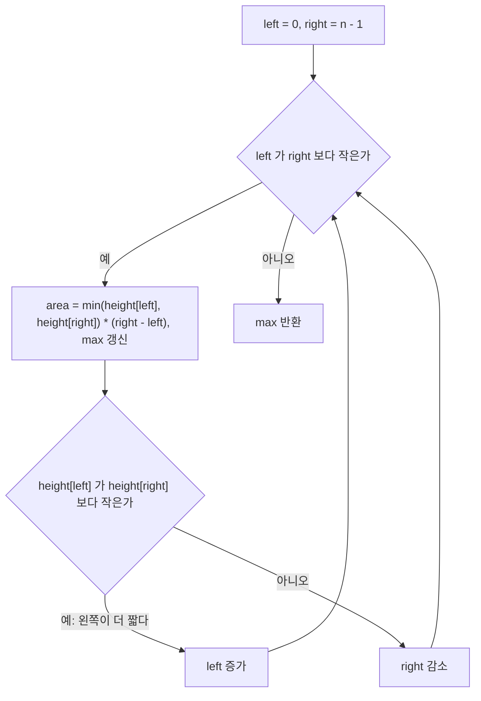

자주 빠지는 반례: 두 막대 높이가 같을 때 어느 쪽을 옮겨도 결과에 영향 없다. 양쪽 다 옮기면(`left++; right--;`) 한 칸씩 둘 다 움직이지만 답은 같다.

LeetCode 11번이고, 이 풀이에서 조용히 틀리는 곳은 면적 계산의 자료형이다. 제약(높이 `<= 10^4`, 길이 `<= 10^5`)에서는 면적이 최대 10^9라 int에 들어간다. 높이가 10만인 막대 100,001개를 넣으면 실제 면적은 10,000,000,000인데 `Math.min(...) * (right - left)`를 int로 계산하면 1,410,065,408이 나온다. 최댓값 비교가 이 잘린 값으로 진행되니 예외 없이 틀린 답이 나온다. 변형 문제에서는 곱하기 전에 `(long)`으로 올린다.

비슷한 문제 헷갈리는 케이스: Trapping Rain Water는 같은 두 포인터 패턴이지만 그리디 기준이 다르다. "더 낮은 쪽의 max를 추적하면서 그것보다 낮은 칸은 max에서 자기 높이 뺀 만큼 채운다"가 핵심이라, 단순히 짧은 쪽을 옮기는 패턴이 아니다. 둘을 같은 패턴으로 묶지 않도록 주의한다.

### 7-2. Boats to Save People

각 사람의 몸무게가 주어지고, 배 한 척에 최대 두 명 + 무게 제한 limit, 모두 태우는 최소 배 수.

기준 정당화: 정렬 후 양 끝 두 포인터. **가장 무거운 사람과 가장 가벼운 사람을 짝짓되 limit를 넘으면 무거운 사람만 혼자**. 가벼운 사람을 두 명 모아서 한 배에 태우는 것보다, 가벼운 사람을 무거운 사람과 짝지어주는 게 항상 낫거나 같다(교환 논증).

```java
public int numRescueBoats(int[] people, int limit) {
    Arrays.sort(people);
    int left = 0, right = people.length - 1, boats = 0;
    while (left <= right) {
        if (people[left] + people[right] <= limit) left++;
        right--;
        boats++;
    }
    return boats;
}
```

한 반복마다 배가 정확히 한 척 늘고, 가벼운 사람은 짝이 맞을 때만 함께 탄다. 도식에서 `left == right`인 마지막 한 명이 어느 분기로 가는지도 함께 보면 된다.

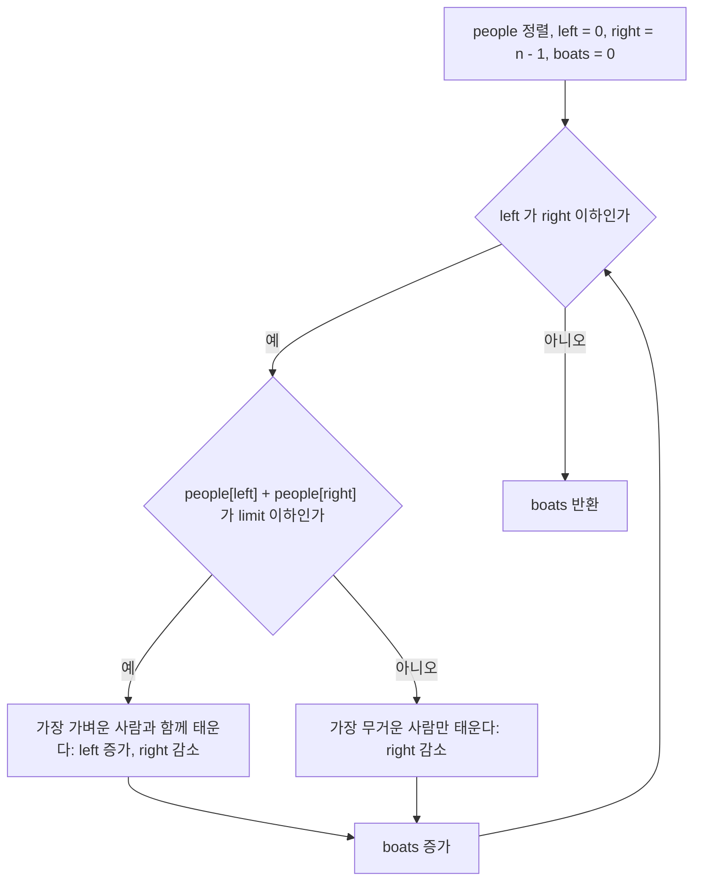

자주 빠지는 반례: `left == right`인 경우(혼자 남은 사람) 처리. 위 코드는 `left <= right` 조건으로 한 명 남았을 때도 boats++가 되어 정확하다. `left < right`로 잘못 쓰면 마지막 한 명이 누락된다.

LeetCode 881번이다. `[3,2,2,1]`, limit 3이면 3척이고 `[3,5,3,4]`, limit 5면 4척이다. 길이 6 이하 무작위 배열 3,000건을 부분집합 DP로 구한 정답과 대조했을 때 불일치는 0건이었다. 이 풀이가 성립하는 근거는 "한 배에 최대 두 명"이라는 제약 하나다. 세 명 이상 태울 수 있게 바뀌면 배 수를 최소로 하는 문제가 빈 패킹(bin packing)이 되어, 무거운 사람과 가벼운 사람을 짝짓는 그리디가 최적을 보장하지 못한다. 지문의 "최대 두 명"을 놓치고 변형 문제에 같은 코드를 붙이면 통과하는 케이스가 있어서 더 늦게 발견한다.

정렬 때문에 입력 배열이 바뀐다는 점도 실무에서는 걸린다. `Arrays.sort(people)`가 인자로 받은 배열을 그 자리에서 정렬하니, 호출한 쪽이 원래 순서를 이후에 쓴다면 복사본을 정렬해야 한다.

## 8. 주식 매매 시리즈

### 8-1. Best Time to Buy and Sell Stock (1회 거래)

기준 정당화: 지금까지 본 최저가를 기억하면서 매일 "오늘 팔면 얼마 남나"를 비교한다.

```java
public int maxProfit(int[] prices) {
    int minPrice = Integer.MAX_VALUE, profit = 0;
    for (int p : prices) {
        minPrice = Math.min(minPrice, p);
        profit = Math.max(profit, p - minPrice);
    }
    return profit;
}
```

### 8-2. Best Time to Buy and Sell Stock II (다회 거래)

기준 정당화: 가격이 오르는 모든 인접 구간을 합치는 게 최적이다. `prices[i] > prices[i-1]`인 모든 i에서 `prices[i] - prices[i-1]`을 더한다. 이건 "산-골짜기" 패턴을 한 번에 잡는 트릭으로, 어느 구간을 묶어 거래해도 결과는 같다.

```java
public int maxProfit(int[] prices) {
    int profit = 0;
    for (int i = 1; i < prices.length; i++) {
        if (prices[i] > prices[i - 1]) profit += prices[i] - prices[i - 1];
    }
    return profit;
}
```

자주 빠지는 반례: "한 번에 한 주만, 다음 매수 전에 매도해야 한다"는 제약을 잊고 모든 양의 차이를 더하면 같은 결과인데 그게 우연이 아니다. `[1,2,3,4]`를 1→4 한 번에 거래해도 3이고, 1→2→3→4로 잘게 나눠도 1+1+1=3이다. 이걸 이해하지 못하고 DP로 풀려고 하면 시간이 날아간다.

### 8-3. Best Time to Buy and Sell Stock with Cooldown

이건 DP 문제다. 그리디로 풀리지 않는다. 매도 후 다음 날 매수 금지가 들어가면 "지금 팔까 말까"가 미래의 매수 가능성에 영향을 주기 때문에 그리디 가정이 깨진다. 8-1, 8-2와 형제처럼 보이지만 패턴이 완전히 다르다.

아래 상태 전이는 코드의 `hold`, `sold`, `rest` 세 변수가 뜻하는 것이다. `sold`에서는 반드시 `rest`를 거쳐야 `hold`로 갈 수 있고, 이 강제 경유가 쿨다운이다. 8-2의 합산 방식에는 이 경유 제약을 표현할 자리가 없다.

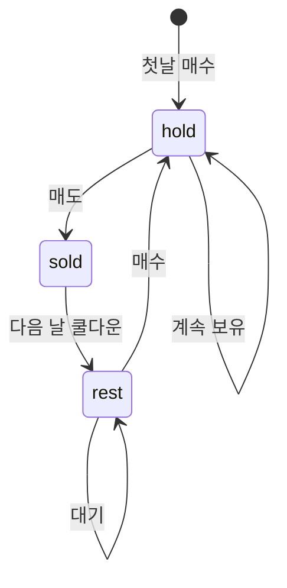

```java
public int maxProfit(int[] prices) {
    int hold = -prices[0], sold = 0, rest = 0;
    for (int i = 1; i < prices.length; i++) {
        int prevSold = sold;
        sold = hold + prices[i];
        hold = Math.max(hold, rest - prices[i]);
        rest = Math.max(rest, prevSold);
    }
    return Math.max(sold, rest);
}
```

LeetCode 309번이고, `[1,2,3,0,2]`의 답은 3이다. 8-2의 "오르는 구간 합산" 코드를 그대로 쓰면 4가 나온다. 1→2→3에서 파는 날 바로 다음 날 다시 사면 안 되는데, 합산은 이 제약을 모르기 때문이다. 샘플 하나에서 바로 걸리니 다행인 경우고, 제약을 안 읽고 8-2 코드를 붙이면 그때 틀린다.

#### 수수료 있는 거래는 그리디로도 풀린다

"수수료 있는 다회 거래"(LeetCode 714)는 수수료가 들어가도 산-골짜기 합산이 그대로 통하지 않는다. `[1,3,2,8,4,9]`, fee 2의 답은 8이다. 인접한 두 날의 오른 폭이 fee보다 큰 구간만 골라 합산하는 순진한 방식은 7을 낸다. 1→3(+2, fee와 같아서 제외), 2→8(+6에서 -2 = 4), 4→9(+5에서 -2 = 3)로 세기 때문이다. 실제로는 1에 사서 8에 팔고(+7에서 -2 = 5) 4에 사서 9에 파는(+3) 쪽이 낫다. 인접한 날끼리만 비교하면 1에서 8까지 이어서 들고 가는 선택지가 보이지 않는다. 이 방식은 길이 7 이하, 값 0~9, fee 0~3 무작위 20,000건 중 3,447건에서 DP와 달랐다.

DP로 가는 것이 안전하다.

```java
public int maxProfit(int[] prices, int fee) {
    int hold = -prices[0], cash = 0;
    for (int i = 1; i < prices.length; i++) {
        int nextCash = Math.max(cash, hold + prices[i] - fee);
        hold = Math.max(hold, cash - prices[i]);
        cash = nextCash;
    }
    return cash;
}
```

같은 문제를 그리디로도 풀 수 있고, 같은 20,000건에서 DP와 불일치가 0건이었다. 매수가를 `가격 + fee`로 잡아 두고, 더 싼 매수가가 나오면 갈아타고, 매수가보다 비싸게 팔 수 있으면 일단 판 뒤 매수가를 오늘 가격으로 올려서 "내일 더 오르면 이 매도를 취소하고 이어서 판 셈"으로 만든다.

```java
public int maxProfit(int[] prices, int fee) {
    int buy = prices[0] + fee, profit = 0;
    for (int i = 1; i < prices.length; i++) {
        if (prices[i] + fee < buy) buy = prices[i] + fee;
        else if (prices[i] > buy) { profit += prices[i] - buy; buy = prices[i]; }
    }
    return profit;
}
```

`buy = prices[i]`로 올리는 줄이 빠지면 오른 구간마다 수수료를 다시 내는 셈이 된다. 이 그리디는 증명이 까다로워서 면접에서 그리디로 밀고 나갔다가 "왜 맞냐"는 질문에 막히기 쉽다. 검증이 안 되는 시간이면 위의 DP를 쓰고, 8-3처럼 상태가 늘어나는 변형(쿨다운 + 수수료 등)은 그리디로 가지 않는다.

## 9. 문자열 그리디

### 9-1. Remove K Digits

n자리 숫자에서 k개를 빼서 가장 작은 수를 만든다.

기준 정당화: 스택을 쓴다. 들어오는 숫자가 스택 top보다 작으면, k가 남아 있는 한 top을 빼낸다. 큰 숫자가 앞에 있으면 자릿수가 큰 자리에서 큰 값이 차지하니까 무조건 손해다. 단조 증가 스택을 만들어가면서 k를 소진하는 게 핵심.

```java
public String removeKdigits(String num, int k) {
    Deque<Character> stack = new ArrayDeque<>();
    for (char c : num.toCharArray()) {
        while (!stack.isEmpty() && k > 0 && stack.peek() > c) {
            stack.pop();
            k--;
        }
        stack.push(c);
    }
    while (k-- > 0 && !stack.isEmpty()) stack.pop();
    StringBuilder sb = new StringBuilder();
    while (!stack.isEmpty()) sb.append(stack.pollLast());
    while (sb.length() > 1 && sb.charAt(0) == '0') sb.deleteCharAt(0);
    return sb.length() == 0 ? "0" : sb.toString();
}
```

숫자 하나를 읽을 때의 분기는 아래와 같다. 안쪽 루프는 pop을 반복하고, 조건이 깨지면 그때 push한다. 도식 맨 아래가 스택 뒤처리다.

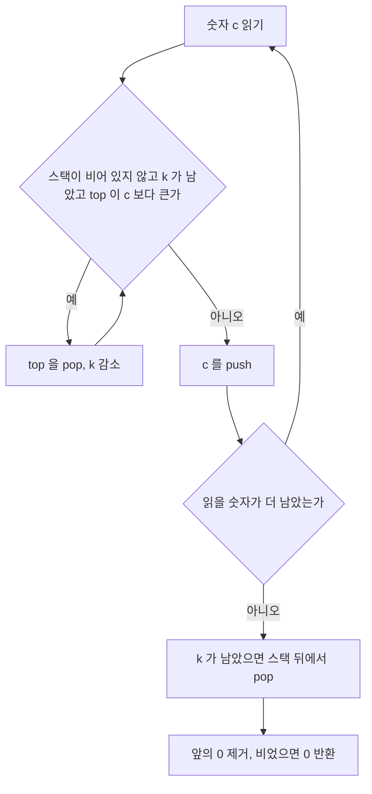

LeetCode 402번이다. 스택이 단조 증가를 유지하는 과정을 `num="1432219"`, `k=3`으로 따라가 보면 pop이 언제 일어나는지 보인다. 스택은 왼쪽이 바닥이다.

| 읽은 숫자 | 스택 top보다 작은가 | pop한 숫자 | push 후 스택 | 남은 k |
|---|---|---|---|---|
| 1 | 스택 비어 있음 | 없음 | 1 | 3 |
| 4 | 4 > 1, 아니오 | 없음 | 14 | 3 |
| 3 | top 4보다 작다 | 4 | 13 | 2 |
| 2 | top 3보다 작다 | 3 | 12 | 1 |
| 2 | top 2와 같다, pop 안 함 | 없음 | 122 | 1 |
| 1 | top 2보다 작다 | 2 | 121 | 0 |
| 9 | k가 0이라 pop 불가 | 없음 | 1219 | 0 |

최종 결과는 `"1219"`다. 4, 3, 2를 하나씩 지운 것이 아니라 4, 3, 두 번째 2를 지우고 첫 번째 2가 남는다. 같은 숫자끼리는 어느 쪽을 지워도 결과가 같아서 상관없다.

자주 빠지는 반례: k가 다 안 쓰인 채 단조 증가 상태로 끝나는 경우(`"12345", k=2`). 이때는 뒤에서 k개를 더 잘라야 한다. 앞에 0이 붙는 경우(`"10200", k=1`)는 스택이 `"0200"`이 되니 leading zero 제거가 필요하고 최종 답은 `"200"`이다. 모두 빼버리면 빈 문자열이 되니 `"0"` 반환도 잊지 말 것(`"10", k=2` → `"0"`).

#### 조용히 틀리는 경우: 숫자로 바꿔서 다루기

`num`의 길이는 최대 10^5자리다. 중간에 `Long.parseLong`이나 `Integer.parseInt`로 바꿔서 비교하면 18자리를 넘는 순간 예외가 나거나, 예외를 삼키면 조용히 잘못된 값이 된다. 이 문제는 끝까지 문자열로만 다룬다. 위 코드의 leading zero 제거는 `sb.deleteCharAt(0)`를 반복하는데, 맨 앞을 지울 때마다 나머지 글자가 한 칸씩 밀리니 0이 길게 이어진 입력에서는 느려질 수 있다. 시작 인덱스를 세워 두고 한 번에 `substring`하는 쪽이 낫다.

k를 덜 쓰고 끝나는 경우의 뒤쪽 pop(`while (k-- > 0 ...)`)은 대표 샘플 `"1432219"`에서 검증되지 않는다. 이 샘플은 중간에 k를 모두 써서 뒤쪽 pop이 실행되지 않기 때문이다. 이 줄을 지워도 그 샘플은 통과하고 `"12345"`, k=2 같은 오름차순 입력에서 처음 틀린다. 길이 6 이하 무작위 문자열 3,000건을 전수 탐색과 대조했을 때 위 코드는 불일치 0건이었다.

### 9-2. Largest Number

정수 배열을 이어 붙여 만들 수 있는 가장 큰 수.

기준 정당화: 두 문자열 a, b를 비교할 때 `a+b vs b+a`로 정렬한다. `[3, 30]`에서 30+3 = "303"보다 3+30 = "330"이 크니까 3이 앞에 와야 한다. 단순 사전순 정렬이나 숫자 크기 정렬은 틀린다.

```java
public String largestNumber(int[] nums) {
    String[] strs = new String[nums.length];
    for (int i = 0; i < nums.length; i++) strs[i] = String.valueOf(nums[i]);
    Arrays.sort(strs, (a, b) -> (b + a).compareTo(a + b));
    if (strs[0].equals("0")) return "0";
    StringBuilder sb = new StringBuilder();
    for (String s : strs) sb.append(s);
    return sb.toString();
}
```

자주 빠지는 반례: 모든 입력이 0인 경우(`[0,0,0]`)는 결과가 `"000"`이 되면 안 되고 `"0"`이어야 한다. 정렬 후 첫 원소가 `"0"`이면 전부 0이라는 뜻이므로 `"0"` 한 자리만 반환.

LeetCode 179번이고 정렬 기준을 잘못 고르면 조용히 틀린다. `[3,30,34,5,9]`의 답은 `"9534330"`이다. 문자열을 사전순 내림차순으로 정렬하면 `"30"`이 `"3"`보다 뒤로 가야 할 것 같지만 사전순으로는 `"3"`이 `"30"`의 접두어라 `"30"`이 더 크다고 판정해서 `"9534303"`이 된다. 두 결과를 코드로 찍어서 확인했다. 숫자를 그대로 쓴 채 정렬하면 `[10,2]`에서 10이 앞에 와서 `"102"`가 되는데 정답은 `"210"`이다. 이어 붙인 두 결과(`a+b`, `b+a`)를 서로 비교해야 하고, 이걸 정수로 바꾸면 자릿수가 커서 오버플로가 나니 문자열 그대로 비교한다.

비교 함수의 정당성을 면접에서 물어보면 교환 논증으로 답한다. "임의의 두 수 a, b를 인접하게 놓고 순서를 바꿨을 때 어느 쪽이 큰지 보면, 그게 정렬 기준이고 그 기준이 transitive하다"가 핵심이다. transitive 증명은 문자열 비교의 사전순 성질에서 나온다.

## 10. 정리: 문제를 만났을 때 분류 순서

면접/시험에서 그리디 문제처럼 보이는 게 나오면 내가 거치는 순서다. 위에서부터 질문을 하나씩 던지고, 처음으로 "예"가 나오는 가지를 따라간다. 한 문제가 여러 질문에 걸리는 경우가 있어서 순서를 정해 둔다. 인터벌 파티셔닝은 힙을 쓰지만 구간 질문에 먼저 걸리기 때문에 우선순위 큐 가지가 아니라 1-2 패턴으로 간다.

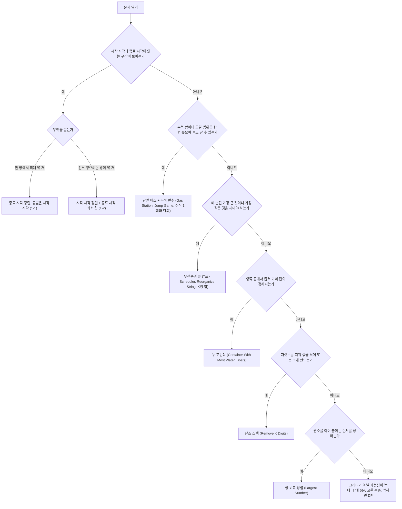

노드마다 괄호 안의 이름은 본문에서 다룬 문제다. 분기 뒤에도 확인할 것이 하나씩 남는다.

구간 가지에서는 정렬 키가 시작인지 종료인지가 패턴을 가른다. 두 번째 가지의 Gas Station, Jump Game, 주식 매매 1회는 단일 패스 + 누적 변수로 끝난다. 다만 쿨다운이나 수수료가 붙은 주식 문제는 이 가지에 들어오는 것처럼 보이지만 상태가 늘어나서 DP가 된다. 우선순위 큐 가지는 빈도수가 중요한 문제(같은 작업 쿨다운, 문자 재배열)가 들어온다. 두 포인터 가지에서는 Trapping Rain Water처럼 비슷해 보이지만 다른 패턴도 있으니 "짧은 쪽을 옮기는 게 왜 정당한가"를 머릿속에서 한 번 굴려본다. 단조 스택은 "k개 제거", "큰 자리부터 작게/크게"라는 키워드가 신호다.

마지막 가지는 그리디가 아닐 가능성이 높다. 그러면 DP나 백트래킹으로 갈아타야 하는데, 가장 흔한 함정이 "그리디로 잘 될 것 같은데?"라는 직관에 매달려서 30분을 날리는 경우다. 처음 5분 안에 반례가 안 떠오르면 그때부터는 [Greedy.md](Greedy.md)에서 다룬 교환 논증을 머릿속으로 한 번 돌려보고, 막히면 DP로 넘어간다.

## 마치며

여기 정리한 10개 패턴이 코딩테스트 그리디 문제의 80% 이상을 커버한다. 나머지 20%는 매트로이드나 근사 영역으로 들어가는데 그건 [Greedy_Deep_Dive.md](Greedy_Deep_Dive.md) 쪽 내용이고, 코딩테스트보다는 알고리즘 대회나 시스템 설계 면접에서 더 자주 나온다.

패턴을 외우는 것보다 "왜 이 기준이 정답인지" 한 줄 설명을 같이 외우는 게 더 오래 간다. 면접에서 코드만 짜고 끝나는 일은 거의 없고, "왜 이 정렬 키죠?", "다른 기준이면 안 되나요?"가 반드시 따라온다. 그때 교환 논증 한 줄로 답할 수 있으면 통과 확률이 크게 올라간다.
