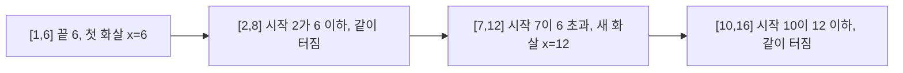
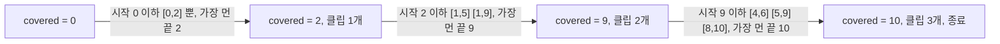
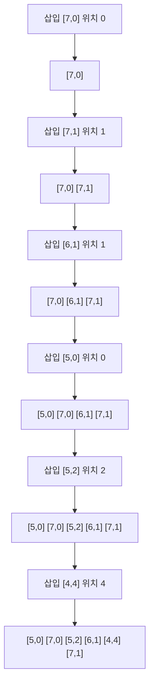
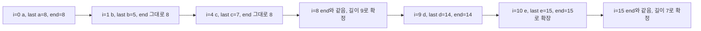
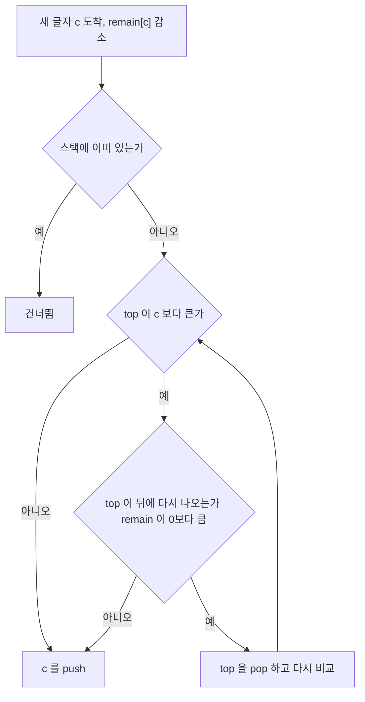
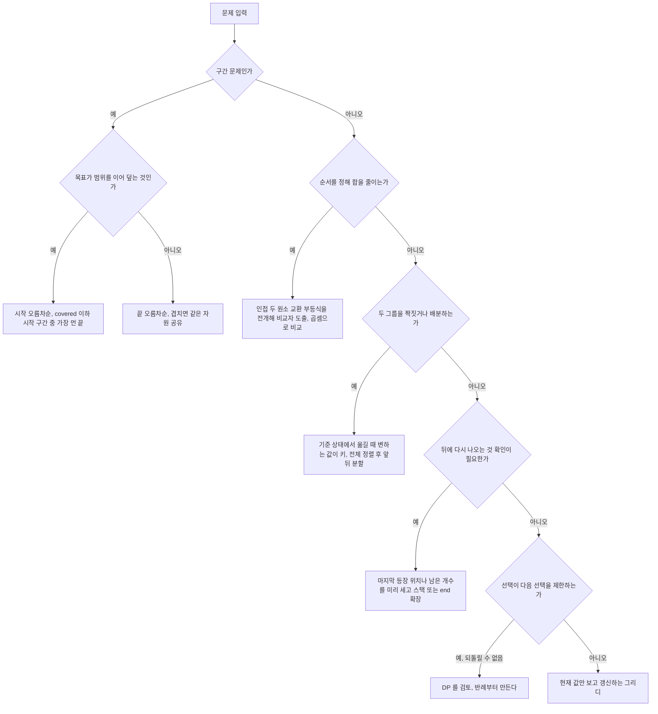

# Greedy 정렬·구간 덮기 패턴

[Greedy_Problem_Patterns.md](Greedy_Problem_Patterns.md)는 활동 선택, 회의실, Gas Station, Jump Game, 주식 시리즈를 다뤘고 [Greedy_Deep_Dive.md](Greedy_Deep_Dive.md)는 매트로이드와 교환 논증을 다뤘다. 이 문서는 두 문서에 없는 문제를 모은다. 구간을 덮거나 찌르는 문제, 가중 완료 시간, 정렬한 뒤 짝을 맞추는 문제, 마지막 등장 위치로 자르는 문제, 사전순 스택, 부호 전환과 잔돈 문제다.

그리디 풀이는 정렬 한 줄이 전부인 경우가 많다. 그래서 그 한 줄이 틀렸을 때 디버깅이 어렵다. 샘플 입력은 통과하고, 제출하면 히든 케이스 몇 개에서만 떨어진다. 이 문서의 코드는 전부 `/tmp`에서 컴파일해 실행했고(JDK 17), 틀린 정렬 기준이 어떤 입력에서 깨지는지 출력으로 확인했다.

## 구간 덮기와 점 찌르기

구간 문제에서 첫 번째 결정은 시작 시각으로 정렬할지 끝 시각으로 정렬할지다. 처음에는 감으로 골랐고, 반례를 몇 번 맞고 나서 기준을 세웠다. 구간들을 한 점으로 처리하는 문제는 끝 시각으로, 구간을 이어 붙여 목표 범위를 채우는 문제는 시작 시각으로 정렬한다.

| 문제 | 정렬 기준 | 한 번에 보는 것 | 새 자원을 쓰는 조건 |
|---|---|---|---|
| Minimum Number of Arrows (점 찌르기) | 끝 오름차순 | 지금 화살 위치에 걸리는 구간 전부 | 시작이 화살 위치보다 큼 |
| Video Stitching ([0,T] 덮기) | 시작 오름차순 | 지금 덮은 곳에서 이어지는 구간 중 가장 멀리 가는 것 | 덮은 곳에서 이어지는 구간이 없으면 실패 |
| 회의실 배정(기존 문서) | 시작 오름차순 + 힙 | 가장 일찍 끝나는 방 | 끝이 새 시작보다 큼 |

### 점 찌르기는 끝점이 빠른 구간부터

풍선이 `[start, end]` 구간이고 화살 하나가 x 좌표에서 수직으로 올라가 `start <= x <= end`인 풍선을 전부 터뜨린다. 끝점이 가장 빠른 풍선은 어떤 화살이든 그 끝점 이하의 x에서 맞아야 한다. 그 범위에서 가장 오른쪽인 끝점 자체에 쏘면 뒤따르는 풍선들과 겹칠 가능성이 가장 크다. 끝점 순으로 정렬하면 "지금 화살 위치를 넘는 시작점이 나오면 새 화살"이라는 한 줄 규칙이 된다.

아래 도식은 `[[10,16],[2,8],[1,6],[7,12]]`를 끝점 순으로 세운 뒤 화살이 놓이는 과정이다. 화살 위치가 6에서 12로 바뀌는 지점이 시작점 7이 6을 넘는 자리다.



### 영상 잇기는 시작 시각 순으로 가장 멀리

Video Stitching은 클립 구간들로 `[0, T]`를 빈틈없이 덮는 최소 클립 수를 구한다. 이 문제에 끝 시각 정렬을 그대로 쓰면 틀린다. 끝이 빠른 클립을 "이어 붙일 수 있으면 바로 붙이는" 식이 되어 짧은 클립을 여러 개 쌓기 때문이다. 시작 시각으로 정렬하고, 지금 덮은 지점(`covered`) 이하에서 시작하는 클립을 전부 훑어 가장 멀리 가는 끝을 고른다. 그 클립 하나만 쓰면 되므로 개수가 하나 늘고, `covered`가 그 끝으로 넘어간다.

`clips = [[0,2],[4,6],[8,10],[1,9],[1,5],[5,9]]`, `T = 10`에서 덮은 지점이 2, 9, 10으로 움직이는 과정이다.



`[0,1]`과 `[1,2]`처럼 끝과 시작이 같은 값에서 맞닿는 클립은 이어 붙는 것으로 본다. 그래서 조건이 `s[i][0] <= covered`다. `<`로 쓰면 맞닿은 클립을 못 붙여서 `-1`이 잘못 나온다. 반대로 점 찌르기에서 맞닿은 풍선 `[1,2]`, `[2,3]`은 x=2 한 점에 같이 걸리므로 하나로 처리한다. 두 문제 모두 "닿는 점이 같은 자원을 공유하는가"를 먼저 묻고 부등호를 정한다. 외운 부등호가 문제마다 방향이 뒤집힌다는 걸 이 두 문제를 연달아 풀다가 확인했다.

정수 칸을 덮는 문제라면 이야기가 달라진다. `[0,1]`과 `[2,3]`이 0, 1, 2, 3 칸을 빈틈없이 덮으므로 이어 붙는 조건이 `start <= covered + 1`이 된다. 연속 구간인지 이산 칸인지는 문제 문구에서 먼저 확인한다.

```java
import java.util.Arrays;

public class CoverPatterns {
    // 풍선 터뜨리기: 끝점이 빠른 풍선부터 보고, 화살은 그 끝점에 쏜다
    static int arrows(int[][] balloons, boolean touchingShares) {
        int[][] s = balloons.clone();
        Arrays.sort(s, (a, b) -> Integer.compare(a[1], b[1]));
        int count = 1;
        long shot = s[0][1];
        for (int i = 1; i < s.length; i++) {
            boolean hit = touchingShares ? s[i][0] <= shot : s[i][0] < shot;
            if (!hit) {
                count++;
                shot = s[i][1];
            }
        }
        return count;
    }

    // 정렬 비교자를 뺄셈으로 쓴 버전. 값이 int 범위 끝에 있으면 순서가 뒤집힌다
    static int arrowsSubtractComparator(int[][] balloons) {
        int[][] s = balloons.clone();
        Arrays.sort(s, (a, b) -> a[1] - b[1]);
        int count = 1;
        long shot = s[0][1];
        for (int i = 1; i < s.length; i++) {
            if (s[i][0] > shot) {
                count++;
                shot = s[i][1];
            }
        }
        return count;
    }

    // 영상 잇기: 시작 시각 순으로 보면서, 현재 덮은 지점 이하에서 시작하는 클립 중 가장 멀리 가는 것을 고른다
    static int videoStitching(int[][] clips, int T) {
        int[][] s = clips.clone();
        Arrays.sort(s, (a, b) -> Integer.compare(a[0], b[0]));
        int count = 0, covered = 0, i = 0;
        while (covered < T) {
            int far = covered;
            while (i < s.length && s[i][0] <= covered) {
                far = Math.max(far, s[i][1]);
                i++;
            }
            if (far == covered) return -1;
            count++;
            covered = far;
        }
        return count;
    }

    // 끝 시각 순으로 정렬해서 "이어 붙일 수 있으면 바로 붙이는" 버전. 틀린다
    static int videoStitchingByEnd(int[][] clips, int T) {
        int[][] s = clips.clone();
        Arrays.sort(s, (a, b) -> Integer.compare(a[1], b[1]));
        int count = 0, covered = 0;
        for (int[] c : s) {
            if (c[0] <= covered && c[1] > covered) {
                count++;
                covered = c[1];
            }
            if (covered >= T) return count;
        }
        return -1;
    }

    public static void main(String[] args) {
        int[][] b1 = {{10, 16}, {2, 8}, {1, 6}, {7, 12}};
        int[][] b2 = {{1, 2}, {2, 3}, {3, 4}, {4, 5}};
        int[][] b3 = {{-2147483646, -2147483645}, {2147483646, 2147483647}};
        System.out.println("b1 = " + arrows(b1, true));
        System.out.println("b2 닿으면 공유 = " + arrows(b2, true) + ", 닿으면 분리 = " + arrows(b2, false));
        System.out.println("b3 Integer.compare = " + arrows(b3, true)
                + ", 뺄셈 비교자 = " + arrowsSubtractComparator(b3));

        int[][] clips = {{0, 2}, {4, 6}, {8, 10}, {1, 9}, {1, 5}, {5, 9}};
        System.out.println("stitch T=10 -> " + videoStitching(clips, 10));
        System.out.println("stitch 빈 구멍 -> " + videoStitching(new int[][]{{0, 1}, {1, 2}}, 5));
        int[][] c4 = {{0, 5}, {0, 1}, {1, 4}, {3, 5}, {2, 9}};
        System.out.println("시작 기준 = " + videoStitching(c4, 9) + ", 끝 기준 = " + videoStitchingByEnd(c4, 9));
    }
}
```

실행 결과다.

```text
b1 = 2
b2 닿으면 공유 = 2, 닿으면 분리 = 4
b3 Integer.compare = 2, 뺄셈 비교자 = 1
stitch T=10 -> 3
stitch 빈 구멍 -> -1
시작 기준 = 2, 끝 기준 = 4
```

세 가지 실수가 한 번에 드러난다. `b2`에서 닿는 구간을 분리하면 답이 2가 아니라 4가 된다. `b3`은 좌표가 `int` 끝에 있는 입력인데, 정렬 비교자를 `a[1] - b[1]`로 쓰면 뺄셈이 넘쳐서 순서가 뒤집히고 화살이 1개로 나온다. 예외도 안 나고 그냥 틀린 답이 나온다. 좌표 범위가 `int` 전체라면 비교자는 `Integer.compare`로 쓴다. 마지막 줄은 `c4`에서 시작 기준이 2(`[0,5]`, `[2,9]`), 끝 기준이 4를 내는 경우로, 끝 시각 정렬이 영상 잇기에 맞지 않는다는 증거다. `far == covered` 검사를 빼면 빈틈이 있는 입력에서 무한 루프가 되니, `-1` 반환 경로는 항상 테스트 입력으로 한 번 밟아 본다.

## 가중 완료 시간 최소화와 Smith 규칙

작업마다 가중치 `w`와 처리 시간 `p`가 있고 한 대의 기계에서 순서대로 처리한다. 작업 i의 완료 시각을 `C_i`라 할 때 `sum(w_i * C_i)`를 최소로 만드는 순서를 찾는다. 서버 배치 큐에서 우선순위가 다른 작업을 어떤 순서로 돌릴지 정하는 문제와 구조가 같다.

### 두 작업 인접 교환

정렬 기준은 인접한 두 작업만 바꿔 보면 나온다. 시각 `t`에서 a, b 두 작업이 연달아 있다고 하자.

- `a → b`: `w_a(t + p_a) + w_b(t + p_a + p_b)`
- `b → a`: `w_b(t + p_b) + w_a(t + p_b + p_a)`

두 식의 차는 `w_b * p_a - w_a * p_b`다. `a → b`가 더 작으려면 `w_a * p_b > w_b * p_a`, 정리하면 `w_a / p_a > w_b / p_b`다. 인접한 두 작업 중 이 부등식이 깨진 쌍이 있으면 바꿔서 손해가 없고, 버블 정렬처럼 계속 바꾸면 비율 내림차순이 된다. 이 기준이 Smith's rule이고, 처리 시간 대비 가중치가 큰 작업을 먼저 한다는 뜻이다.

### 정렬 기준 후보를 반례로 걸러내기

처음에는 "짧은 것 먼저"와 "가중치 큰 것 먼저"가 떠오른다. 그다음 "가중치에서 시간을 뺀 값"이 그럴듯해 보인다. 후보마다 반례를 만들어 걸러낸 결과다.

| 후보 | 반례 입력 (w, p) | 결과 | 전수 탐색 최솟값 |
|---|---|---|---|
| p 오름차순 | A(3,5) B(1,1) C(4,8) D(5,2) | BDAC, 104 | 101 |
| w 내림차순 | 위와 같음 | DCAB, 111 | 101 |
| (w - p) 내림차순 | X(3,5) Y(1,2) | YX, 23 | 22 (XY) |
| w / p 내림차순 | 위 두 입력 모두 | DBAC 101, XY 22 | 최솟값과 일치 |

세 번째 후보가 가장 위험하다. 첫 번째 입력에서는 최솟값과 같은 순서(DBAC)가 나와서 통과한다. 반례는 작업이 두 개일 때 나온다. X는 w-p = -2, Y는 -1이라 Y가 먼저 놓이는데, 비율은 X가 3/5 = 0.6, Y가 1/2 = 0.5라 X가 먼저여야 한다. 차이 기준은 단위가 섞인 값(가중치와 시간의 차)이라 교환 논증에서 나온 식과 대응이 없다. 후보를 고를 때는 교환 부등식을 직접 전개해서 나온 형태와 같은지 먼저 본다.

### 비교자는 곱셈으로

`Double.compare(b.w / (double) b.p, a.w / (double) a.p)`로 써도 대부분 통과한다. 문제는 값이 커졌을 때다. `w1=3037000498, p1=3037000499`와 `w2=3037000497, p2=3037000498`은 `double` 나눗셈이 같은 값을 내지만 실제 비율은 다르다. 곱셈으로 비교하면 `w1*p2 - w2*p1 = 1`이라 첫 번째가 더 크다는 것이 정확히 나온다. `long` 곱셈은 두 값 모두 약 3.03e9까지만 안전하다(곱이 `Long.MAX_VALUE` 안에 들어가야 한다). 그보다 크면 `Math.multiplyHigh`나 `BigInteger`로 넘어간다.

처리 시간이 0인 작업은 나눗셈이면 `Infinity`, `w`까지 0이면 `NaN`이 나온다. 곱셈 비교자는 `p = 0`인 작업을 자연스럽게 맨 앞에 놓는다. 대신 `w = 0`, `p = 0`인 작업 하나가 다른 모든 작업과 "같다"로 비교되어 추이성이 깨진다. 이 작업이 비용에 영향을 주지는 않지만 정렬 결과를 흔들어 다른 작업의 순서를 틀리게 만든다. 아래 코드에서 같은 무작위 입력으로 확인했다. 그런 작업은 정렬 전에 걸러낸다.

```java
import java.util.*;

public class SmithRule {
    record Job(String name, long w, long p) {}

    static long cost(List<Job> order) {
        long t = 0, sum = 0;
        for (Job j : order) {
            t += j.p();
            sum += j.w() * t;
        }
        return sum;
    }

    static List<Job> sorted(List<Job> jobs, Comparator<Job> cmp) {
        List<Job> r = new ArrayList<>(jobs);
        r.sort(cmp);
        return r;
    }

    // w_a/p_a > w_b/p_b 를 w_a*p_b > w_b*p_a 로 바꿔 비교한다
    static final Comparator<Job> SMITH = (a, b) -> Long.compare(b.w() * a.p(), a.w() * b.p());
    static final Comparator<Job> SHORTEST = Comparator.comparingLong(Job::p);
    static final Comparator<Job> HEAVIEST = (a, b) -> Long.compare(b.w(), a.w());
    static final Comparator<Job> DIFF = (a, b) -> Long.compare(b.w() - b.p(), a.w() - a.p());

    static String names(List<Job> l) {
        StringBuilder sb = new StringBuilder();
        for (Job j : l) sb.append(j.name());
        return sb.toString();
    }

    static long brute(List<Job> jobs) {
        long[] best = {Long.MAX_VALUE};
        permute(new ArrayList<>(jobs), 0, best);
        return best[0];
    }

    static void permute(List<Job> a, int k, long[] best) {
        if (k == a.size()) {
            best[0] = Math.min(best[0], cost(a));
            return;
        }
        for (int i = k; i < a.size(); i++) {
            Collections.swap(a, k, i);
            permute(a, k + 1, best);
            Collections.swap(a, k, i);
        }
    }

    public static void main(String[] args) {
        List<Job> jobs = List.of(new Job("A", 3, 5), new Job("B", 1, 1), new Job("C", 4, 8), new Job("D", 5, 2));
        Map<String, Comparator<Job>> candidates = new LinkedHashMap<>();
        candidates.put("짧은 순", SHORTEST);
        candidates.put("가중치 큰 순", HEAVIEST);
        candidates.put("w-p 큰 순", DIFF);
        candidates.put("w/p 큰 순", SMITH);
        candidates.forEach((k, v) -> {
            List<Job> r = sorted(jobs, v);
            System.out.println(k + " " + names(r) + " " + cost(r));
        });
        System.out.println("전수 탐색 " + brute(jobs));

        List<Job> two = List.of(new Job("X", 3, 5), new Job("Y", 1, 2));
        System.out.println("w-p " + names(sorted(two, DIFF)) + " " + cost(sorted(two, DIFF))
                + " / w/p " + names(sorted(two, SMITH)) + " " + cost(sorted(two, SMITH)));

        long w1 = 3037000498L, p1 = 3037000499L, w2 = 3037000497L, p2 = 3037000498L;
        System.out.println("나눗셈 같다고 판정 " + ((double) w1 / p1 == (double) w2 / p2)
                + ", 곱셈 비교 " + Long.compare(w1 * p2, w2 * p1));

        List<Job> zero = List.of(new Job("Z", 2, 0), new Job("M", 9, 3), new Job("N", 1, 1));
        System.out.println("p=0 포함 " + names(sorted(zero, SMITH)) + " " + cost(sorted(zero, SMITH)) + " / 전수 " + brute(zero));

        for (int minW : new int[]{1, 0}) {
            Random rnd = new Random(42);
            int mismatch = 0;
            for (int t = 0; t < 2000; t++) {
                int n = 1 + rnd.nextInt(7);
                List<Job> rj = new ArrayList<>();
                for (int i = 0; i < n; i++) rj.add(new Job("J" + i, minW + rnd.nextInt(20), rnd.nextInt(10)));
                if (cost(sorted(rj, SMITH)) != brute(rj)) mismatch++;
            }
            System.out.println("w 최소값 " + minW + ", p 는 0 포함, 무작위 2000건 불일치 " + mismatch);
        }
    }
}
```

```text
짧은 순 BDAC 104
가중치 큰 순 DCAB 111
w-p 큰 순 DBAC 101
w/p 큰 순 DBAC 101
전수 탐색 101
w-p YX 23 / w/p XY 22
나눗셈 같다고 판정 true, 곱셈 비교 1
p=0 포함 ZMN 31 / 전수 31
w 최소값 1, p 는 0 포함, 무작위 2000건 불일치 0
w 최소값 0, p 는 0 포함, 무작위 2000건 불일치 13
```

마지막 두 줄이 `(0, 0)` 작업의 영향이다. 가중치를 1 이상으로 제한하면 2000건이 전부 전수 탐색과 일치하고, 0을 허용하면 13건이 어긋난다. 어긋난 13건은 전부 `w = 0`, `p = 0`인 작업을 포함했다(별도로 확인한 결과다). 작은 입력으로 전수 탐색과 대조하는 테스트는 정렬 기준을 바꿀 때마다 돌린다. 샘플 몇 개보다 이 방식이 실수를 훨씬 빨리 잡는다.

## 정렬한 뒤 짝을 맞추는 문제

정렬 후 배정 문제는 정렬 키가 하나 정해지면 나머지는 단순한 루프다. 어려운 부분은 왜 그 키인지다. 세 문제 모두 처음 풀 때 다른 키를 골랐다가 고쳤다.

### Assign Cookies

아이마다 만족하는 최소 쿠키 크기 `g`, 쿠키 크기 `s`가 있을 때 만족시킬 수 있는 아이의 최대 수를 구한다. 작은 쿠키부터 순서대로 보면서, 가장 덜 까다로운 아이가 만족하면 배정한다. 작은 쿠키는 큰 아이에게 쓸모가 없고 작은 아이에게는 남는 쿠키 중 가장 아깝지 않은 쓰임이기 때문이다.

아이만 정렬하고 쿠키를 정렬하지 않는 실수가 있다. `g = [1, 2]`, `s = [2, 1]`이면 쿠키 2가 아이 1에게 먼저 가고, 다음 쿠키 1은 아이 2를 만족시키지 못해서 1명이 된다. 쿠키를 정렬하면 쿠키 1이 아이 1에게, 쿠키 2가 아이 2에게 가서 2명이다. 두 배열을 모두 정렬해야 투 포인터가 성립한다.

### Two City Scheduling

2n명을 A시와 B시에 n명씩 보낼 때 총비용을 최소로 한다. 처음에 A 비용 오름차순으로 정렬하고 앞 n명을 A로 보냈는데 틀렸다. 정렬 키를 `a - b`로 바꿔야 한다. 모두 B로 보낸다고 가정하면 기본 비용이 `sum(b)`이고, A로 옮기면 사람마다 `a - b`만큼 늘거나 준다. 총비용은 `sum(b) + (A로 보낸 n명의 a - b 합)`이므로 `a - b`가 작은 n명을 고르면 된다. `sum(b)`는 배정과 무관한 상수다. 위 유도가 정렬 키를 결정한다.

비용이 `[[259,770],[448,54],[926,667],[184,139],[840,118],[577,469]]`이면 차이 기준은 1859, A 비용 기준은 2145다. 샘플 4쌍으로는 같은 값이 나와서 이 실수가 한동안 안 잡혔다.

### Queue Reconstruction by Height

`[h, k]`는 키가 h이고 앞에 키가 h 이상인 사람이 정확히 k명 있다는 뜻이다. 키 내림차순으로 정렬하고 같은 키는 k 오름차순으로 정렬한 뒤, 각 사람을 결과 리스트의 k번째 위치에 끼워 넣는다. 키 큰 사람부터 놓는 이유는 뒤에 오는 더 작은 사람이 앞의 큰 사람에게 보이지 않기 때문이다. 큰 사람을 먼저 배치해 두면 작은 사람을 끼워 넣어도 이미 놓은 사람의 k가 바뀌지 않는다.

같은 키 안에서는 k가 작은 사람이 앞에 있어야 한다. `[7,0]`, `[7,1]` 순서로 넣으면 `[7,1]`이 `[7,0]` 뒤에 자리를 잡는다. 순서를 뒤집어 `[7,1]`을 먼저 넣으면 리스트가 비어 있어서 k=1 위치에 넣을 수 없다. 코드에서는 `Math.min(x[1], out.size())`로 감싸서 예외는 피했는데, 그러면 위치가 어긋난 채로 조용히 틀린 결과를 낸다.

아래 도식은 정렬된 순서 `[7,0] [7,1] [6,1] [5,0] [5,2] [4,4]`를 하나씩 삽입하는 과정이다. 삽입 위치가 앞으로 당겨질 때 뒤의 사람들이 밀려나지만 k는 유지된다는 점을 보면 된다.



리스트 중간 삽입이 `O(n)`이라 전체가 `O(n²)`이다. 이 문제의 입력 크기(2000명 안팎)에서는 문제없다. 규모가 훨씬 커지면 구간 트리나 펜윅 트리로 "빈 자리 중 k번째"를 찾는 방식으로 바꿔야 한다.

```java
import java.util.*;

public class AssignPatterns {
    static int cookies(int[] g, int[] s, boolean sortCookies) {
        int[] gg = g.clone(), ss = s.clone();
        Arrays.sort(gg);
        if (sortCookies) Arrays.sort(ss);
        int child = 0;
        for (int cookie : ss) {
            if (child < gg.length && gg[child] <= cookie) child++;
        }
        return child;
    }

    static int twoCity(int[][] costs, boolean byDiff) {
        int[][] c = costs.clone();
        if (byDiff) Arrays.sort(c, (x, y) -> Integer.compare(x[0] - x[1], y[0] - y[1]));
        else Arrays.sort(c, (x, y) -> Integer.compare(x[0], y[0]));
        int n = c.length / 2, total = 0;
        for (int i = 0; i < c.length; i++) total += i < n ? c[i][0] : c[i][1];
        return total;
    }

    // 키 내림차순, 같은 키는 k 오름차순으로 정렬한 뒤 k 위치에 끼워 넣는다
    static int[][] reconstruct(int[][] people, boolean tallFirst, boolean kAscOnTie) {
        int[][] p = people.clone();
        Arrays.sort(p, (a, b) -> {
            if (a[0] != b[0]) return tallFirst ? Integer.compare(b[0], a[0]) : Integer.compare(a[0], b[0]);
            return kAscOnTie ? Integer.compare(a[1], b[1]) : Integer.compare(b[1], a[1]);
        });
        List<int[]> out = new ArrayList<>();
        for (int[] x : p) out.add(Math.min(x[1], out.size()), x);
        return out.toArray(new int[0][]);
    }

    static boolean valid(int[][] q) {
        for (int i = 0; i < q.length; i++) {
            int c = 0;
            for (int j = 0; j < i; j++) if (q[j][0] >= q[i][0]) c++;
            if (c != q[i][1]) return false;
        }
        return true;
    }

    public static void main(String[] args) {
        int[] g = {1, 2}, s = {2, 1};
        System.out.println("쿠키 정렬 O " + cookies(g, s, true) + ", 정렬 X " + cookies(g, s, false));

        int[][] tc = {{259, 770}, {448, 54}, {926, 667}, {184, 139}, {840, 118}, {577, 469}};
        System.out.println("차이 기준 " + twoCity(tc, true) + ", A 비용 기준 " + twoCity(tc, false));

        int[][] people = {{7, 0}, {4, 4}, {7, 1}, {5, 0}, {6, 1}, {5, 2}};
        int[][] ok = reconstruct(people, true, true);
        System.out.println("키 내림차순, k 오름차순 " + Arrays.deepToString(ok) + " " + valid(ok));
        int[][] asc = reconstruct(people, false, true);
        System.out.println("키 오름차순 " + Arrays.deepToString(asc) + " " + valid(asc));
        int[][] tie = reconstruct(people, true, false);
        System.out.println("동키 k 내림차순 " + Arrays.deepToString(tie) + " " + valid(tie));
    }
}
```

```text
쿠키 정렬 O 2, 정렬 X 1
차이 기준 1859, A 비용 기준 2145
키 내림차순, k 오름차순 [[5, 0], [7, 0], [5, 2], [6, 1], [4, 4], [7, 1]] true
키 오름차순 [[7, 0], [7, 1], [5, 0], [6, 1], [4, 4], [5, 2]] false
동키 k 내림차순 [[5, 0], [7, 0], [6, 1], [5, 2], [4, 4], [7, 1]] false
```

`valid`는 결과 배열에서 각 사람 앞에 키가 같거나 큰 사람이 정확히 k명인지 세는 검증 함수다. 정렬 기준을 바꿔 가며 실험할 때는 정답 배열을 손으로 쓰는 것보다 이런 검증기를 두는 쪽이 낫다. 정답이 여러 개일 수 있는 문제(이 문제는 하나지만 비슷한 문제들은 그렇지 않다)에서 특히 그렇다.

## 마지막 등장 위치로 구획 나누기

Partition Labels는 문자열을 잘라서 각 글자가 한 조각에만 나오게 하고, 조각 수를 최대로 만든다. 글자마다 마지막 등장 위치를 미리 구해 두고, 왼쪽에서 오른쪽으로 훑으면서 "현재 조각이 최소한 여기까지는 가야 한다"는 끝 지점 `end`를 늘려 간다. `i`가 `end`와 만나는 순간 그 안의 모든 글자가 조각 안에서 끝났으므로 자른다.

`"ababcbacadefegdehijhklij"`의 첫 조각이 만들어지는 과정이다. `a`의 마지막 위치가 8이라 `end`가 처음부터 8로 잡히고, `b`(5)와 `c`(7)는 이미 `end`보다 작아서 확장하지 못한다.



처음 짠 코드는 `end`를 최댓값으로 갱신하지 않고 현재 글자의 마지막 위치로 덮어썼다. `i == last[현재 글자]`일 때 자르는 형태다. `"abab"`에서 `i=2`(a의 마지막)에서 잘려 `[3, 1]`이 나오지만 `b`가 두 조각에 걸친다. 최댓값으로 확장하면 `[4]`가 된다. 샘플 입력은 다행히 전부 통과해서 이 버그를 처음에는 못 봤고, 직접 만든 작은 입력을 손으로 추적하다가 알았다. 문자열 `"eccbbbbdec"`은 첫 글자 `e`가 맨 끝(9)에도 나와서 `[10]`, 즉 자르지 못하는 입력이다. 구획 문제는 "자를 수 없는 입력"과 "글자 하나짜리 조각만 나오는 입력"을 꼭 넣어 본다.

이 구조는 구간 병합 문제와 같다. 글자마다 `[첫 등장, 마지막 등장]` 구간을 만들고 겹치는 구간을 합치면 같은 조각이 나온다. 마지막 등장 위치만 쓰는 방식은 정렬이 필요 없어서 `O(n)`이다.

## 사전순 최소 부분 수열과 남은 개수

Lexicographically Smallest Subsequence of Distinct Characters(중복 글자 제거 문제)는 문자열에서 각 글자를 정확히 한 번씩만 포함하는 부분 수열 중 사전순으로 가장 작은 것을 구한다. 스택을 쓰는 방식은 Remove K Digits와 같다. 새 글자가 스택 맨 위보다 작으면 위 글자를 버리고 새 글자를 넣는다. 다른 점은 버려도 되는 조건이다. 버린 글자가 뒤에 다시 나와야 한다. 이 조건이 없으면 글자가 통째로 사라진다.

그래서 세 가지를 관리한다. 글자별 남은 개수(`remain`), 스택에 이미 들어 있는지(`in`), 스택 자체다. 처리 순서는 다음 도식과 같다.



`remain[c]--`를 `in[c]` 검사보다 먼저 해야 한다. 이미 스택에 있어서 건너뛰는 글자도 문자열에서 한 번 소비된 것이라 남은 개수에서 빠져야 한다. 순서를 뒤집으면 건너뛴 글자의 개수가 줄지 않아 다음 pop 판단이 어긋난다.

`"cbacdcbc"`를 한 글자씩 추적한 표다.

| 읽은 글자 | 동작 | 스택 |
|---|---|---|
| c | push | c |
| b | c가 뒤에 더 있어서 pop, push | b |
| a | b가 뒤에 더 있어서 pop, push | a |
| c | push | ac |
| d | push | acd |
| c | 이미 있음, 건너뜀 | acd |
| b | d는 뒤에 없어서 pop 불가, push | acdb |
| c | 이미 있음, 건너뜀 | acdb |

`b`를 읽는 시점이 핵심이다. `d`가 `b`보다 크지만 `d`는 문자열 끝까지 더 나오지 않아서 버리면 결과에서 `d`가 사라진다. 그래서 `acdb`가 된다. `"bcac"`에서는 남은 개수를 확인하지 않으면 `a`를 읽을 때 `b`, `c`를 모두 pop해 `"ac"`가 되고 `b`가 빠진다. 올바른 결과는 `"bac"`이다.

```java
import java.util.*;

public class LabelsAndStack {
    static List<Integer> partition(String s, boolean useMaxEnd) {
        int[] last = new int[26];
        for (int i = 0; i < s.length(); i++) last[s.charAt(i) - 'a'] = i;
        List<Integer> res = new ArrayList<>();
        int start = 0, end = 0;
        for (int i = 0; i < s.length(); i++) {
            int lc = last[s.charAt(i) - 'a'];
            end = useMaxEnd ? Math.max(end, lc) : lc;
            if (i == end) {
                res.add(end - start + 1);
                start = i + 1;
            }
        }
        return res;
    }

    static String smallest(String s, boolean checkRemain) {
        int[] remain = new int[26];
        for (char c : s.toCharArray()) remain[c - 'a']++;
        boolean[] in = new boolean[26];
        StringBuilder st = new StringBuilder();
        for (char c : s.toCharArray()) {
            remain[c - 'a']--;
            if (in[c - 'a']) continue;
            while (st.length() > 0) {
                char top = st.charAt(st.length() - 1);
                boolean canPop = top > c && (!checkRemain || remain[top - 'a'] > 0);
                if (!canPop) break;
                in[top - 'a'] = false;
                st.setLength(st.length() - 1);
            }
            st.append(c);
            in[c - 'a'] = true;
        }
        return st.toString();
    }

    public static void main(String[] args) {
        System.out.println(partition("ababcbacadefegdehijhklij", true));
        System.out.println(partition("eccbbbbdec", true));
        System.out.println("abab 올바른 확장 " + partition("abab", true) + ", 현재 글자 기준 " + partition("abab", false));

        System.out.println(smallest("cbacdcbc", true) + " " + smallest("bcabc", true));
        System.out.println("bcac 남은 개수 확인 " + smallest("bcac", true) + ", 확인 없음 " + smallest("bcac", false));
    }
}
```

```text
[9, 7, 8]
[10]
abab 올바른 확장 [4], 현재 글자 기준 [3, 1]
acdb abc
bcac 남은 개수 확인 bac, 확인 없음 ac
```

글자가 소문자 26종이라 배열로 충분했지만, 유니코드 문자열이나 임의의 키를 다룰 때는 `HashMap<Character, Integer>`로 바꾼다. `remain > 0` 조건은 "이 글자가 뒤에 다시 나온다"의 다른 표현이므로, 마지막 등장 위치 배열로 `last[top] > i`로 써도 같다.

## 부호 전환 수열과 잔돈 문제

### Wiggle Subsequence

원소 사이의 차이가 양수와 음수로 번갈아 나오는 가장 긴 부분 수열의 길이를 구한다. 배열에서 올라가다가 내려가는 꼭짓점과 내려가다 올라가는 꼭짓점의 개수를 세면 되고, DP 없이 `O(n)`에 끝난다. 이전 차이(`prevDiff`)의 부호가 바뀔 때만 카운트를 올린다.

실수는 `prevDiff` 갱신 시점이다. 매 반복마다 `prevDiff = diff`로 덮어쓰면 같은 값이 끼었을 때(차이 0) 방향 정보가 날아간다. `[1, 2, 2, 3]`은 계속 올라가는 배열이라 답이 2인데, 차이가 `+1, 0, +1`이라 0에서 `prevDiff`가 0이 되고 다음 `+1`이 부호 전환으로 잡혀 3이 나온다. 카운트가 늘 때만 `prevDiff`를 갱신해야 한다.

초기값도 주의한다. `prevDiff = 0`으로 시작하고 조건을 `prevDiff <= 0`(오르막), `prevDiff >= 0`(내리막)으로 쓰면 첫 차이가 어느 방향이든 카운트된다. 초기값을 0으로 두고 `prevDiff < 0`처럼 등호를 뺀 채로 쓰면 `[1, 2]`가 1로 나온다.

### Lemonade Change

5, 10, 20달러 지폐만 받고 잔돈을 내주는 문제다. 20달러가 들어오면 15달러를 돌려줘야 하는데 방법이 두 가지다. 10 + 5를 내주거나 5 세 장을 내준다. 10달러 지폐는 20달러 잔돈에만 쓰이고 5달러는 10달러 잔돈과 20달러 잔돈 모두에 쓰이므로, 5달러가 더 귀한 자원이다. 그래서 10 + 5를 먼저 쓴다.

입력 `[5, 5, 5, 5, 10, 20, 10]`을 보면 차이가 드러난다. 5달러 네 장을 받고 10달러를 받아 5달러 세 장이 남고 10달러가 한 장이다. 20달러가 들어왔을 때 10 + 5를 쓰면 5달러 두 장이 남고 다음 10달러 손님에게 5달러 한 장을 준다. 5 세 장을 먼저 쓰면 5달러가 0장, 10달러가 1장이 되어 마지막 10달러 손님에게 줄 5달러가 없다.

```java
public class SignAndChange {
    // 부호가 바뀔 때만 센다. prevDiff 는 카운트가 늘 때만 갱신한다
    static int wiggle(int[] nums) {
        if (nums.length < 2) return nums.length;
        int count = 1, prevDiff = 0;
        for (int i = 1; i < nums.length; i++) {
            int diff = nums[i] - nums[i - 1];
            if ((diff > 0 && prevDiff <= 0) || (diff < 0 && prevDiff >= 0)) {
                count++;
                prevDiff = diff;
            }
        }
        return count;
    }

    // prevDiff 를 매번 갱신하면 같은 값이 끼었을 때 방향 정보가 지워진다
    static int wiggleAlwaysUpdate(int[] nums) {
        if (nums.length < 2) return nums.length;
        int count = 1, prevDiff = 0;
        for (int i = 1; i < nums.length; i++) {
            int diff = nums[i] - nums[i - 1];
            if ((diff > 0 && prevDiff <= 0) || (diff < 0 && prevDiff >= 0)) count++;
            prevDiff = diff;
        }
        return count;
    }

    // 20달러를 받을 때 10+5 를 먼저 쓰는지(tenFirst) 5*3 을 먼저 쓰는지 고른다
    static boolean lemonade(int[] bills, boolean tenFirst) {
        int five = 0, ten = 0;
        for (int b : bills) {
            if (b == 5) {
                five++;
            } else if (b == 10) {
                if (five == 0) return false;
                five--;
                ten++;
            } else {
                boolean canTenFive = ten > 0 && five > 0;
                boolean canThreeFive = five >= 3;
                if (tenFirst && canTenFive) { ten--; five--; }
                else if (canThreeFive) five -= 3;
                else if (canTenFive) { ten--; five--; }
                else return false;
            }
        }
        return true;
    }

    public static void main(String[] args) {
        System.out.println(wiggle(new int[]{1, 7, 4, 9, 2, 5}) + " "
                + wiggle(new int[]{1, 17, 5, 10, 13, 15, 10, 5, 16, 8}) + " "
                + wiggle(new int[]{1, 2, 3, 4, 5, 6, 7, 8, 9}));
        int[] plateau = {1, 2, 2, 3};
        System.out.println("plateau 올바름 " + wiggle(plateau) + ", 매번 갱신 " + wiggleAlwaysUpdate(plateau));

        int[] bills = {5, 5, 5, 5, 10, 20, 10};
        System.out.println("10+5 먼저 " + lemonade(bills, true) + ", 5*3 먼저 " + lemonade(bills, false));
    }
}
```

```text
6 7 2
plateau 올바름 2, 매번 갱신 3
10+5 먼저 true, 5*3 먼저 false
```

잔돈 문제는 액면 조합이 5, 10, 20처럼 서로 배수 관계라서 그리디가 성립한다. 액면이 임의로 바뀌면 다음 절의 동전 문제처럼 깨진다.

## 정렬 기준을 정하는 판단 흐름

문제를 받으면 그리디를 먼저 시도할지, 정렬 키를 무엇으로 잡을지 정해야 한다. 지금까지 정리한 기준을 도식으로 묶었다.



작은 입력으로 전수 탐색과 대조하는 테스트를 미리 짜는 습관이 어떤 이론 지식보다 도움이 된다. 위 흐름에서 정렬 키를 정한 뒤 3분 안에 무작위 입력 몇천 건으로 비교하면, 앞 절의 `(w - p)` 같은 후보는 바로 걸러진다.

## 그리디가 아니라 DP인 경계 사례

정렬 키가 그럴듯해서 그리디로 밀어붙였다가 DP로 넘어가야 했던 문제들이다. 셋 다 "지금 가장 좋아 보이는 것을 고르면 나중에 되돌릴 수 없다"는 공통점이 있다.

| 문제 | 그리디 기준 | 반례 입력 | 그리디 | DP |
|---|---|---|---|---|
| 동전 거스름돈 | 큰 액면부터 | 동전 `{1,3,4}`, 금액 6 | 3개 (4+1+1) | 2개 (3+3) |
| 가중 구간 스케줄링 | 끝 시각 순으로 겹치지 않게 | `[0,4,w=1]`, `[0,10,w=100]`, `[5,9,w=1]` | 2 | 100 |
| 0/1 배낭 | 가치/무게 비율 큰 순 | 무게 `{1,10}`, 가치 `{2,15}`, 용량 10 | 2 | 15 |

동전 문제는 `{1, 5, 10, 25}` 같은 액면 체계에서는 그리디가 맞아서, 63원은 그리디와 DP가 둘 다 6개다. 그래서 샘플 입력은 통과하고 특수한 액면 조합에서 깨진다. 액면이 문제에 주어진 값이 아니라 입력으로 들어온다면 DP로 간다.

가중 구간은 구간 선택 문제(가중치 없음)와 같은 정렬을 쓰기 때문에 가장 속기 쉽다. 끝이 4인 구간을 먼저 고르면 가중치 100짜리를 못 고른다. 가중치가 있으면 "지금 선택이 뒤를 얼마나 막는가"를 가치로 환산해야 해서, 끝 시각 순으로 정렬한 뒤 `dp[i] = max(dp[i-1], dp[p(i)] + w_i)`로 푼다. 자세한 유도는 [Greedy_Deep_Dive.md](Greedy_Deep_Dive.md)의 가중 구간 절에 있다.

배낭은 분할 가능한 경우(분수 배낭)에만 비율 정렬이 맞다. 물건을 쪼갤 수 없으면 비율이 높은 작은 물건이 용량을 잘게 남겨서 큰 물건이 들어갈 자리를 없앤다.

```java
import java.util.*;

public class NotGreedy {
    static int coinGreedy(int[] coins, int amount) {
        int[] c = coins.clone();
        Arrays.sort(c);
        int cnt = 0;
        for (int i = c.length - 1; i >= 0; i--) {
            cnt += amount / c[i];
            amount %= c[i];
        }
        return amount == 0 ? cnt : -1;
    }

    static int coinDp(int[] coins, int amount) {
        int INF = Integer.MAX_VALUE;
        int[] dp = new int[amount + 1];
        Arrays.fill(dp, INF);
        dp[0] = 0;
        for (int a = 1; a <= amount; a++)
            for (int c : coins)
                if (a >= c && dp[a - c] != INF) dp[a] = Math.min(dp[a], dp[a - c] + 1);
        return dp[amount] == INF ? -1 : dp[amount];
    }

    // {시작, 끝, 가중치}
    static int weightedGreedy(int[][] iv) {
        int[][] s = iv.clone();
        Arrays.sort(s, (a, b) -> Integer.compare(a[1], b[1]));
        int last = Integer.MIN_VALUE, sum = 0;
        for (int[] x : s) {
            if (x[0] >= last) {
                sum += x[2];
                last = x[1];
            }
        }
        return sum;
    }

    static int weightedDp(int[][] iv) {
        int[][] s = iv.clone();
        Arrays.sort(s, (a, b) -> Integer.compare(a[1], b[1]));
        int n = s.length;
        int[] dp = new int[n + 1];
        for (int i = 1; i <= n; i++) {
            int p = 0;
            for (int j = i - 1; j >= 1; j--) {
                if (s[j - 1][1] <= s[i - 1][0]) { p = j; break; }
            }
            dp[i] = Math.max(dp[i - 1], dp[p] + s[i - 1][2]);
        }
        return dp[n];
    }

    static int knapsackByRatio(int[] w, int[] v, int cap) {
        Integer[] idx = new Integer[w.length];
        for (int i = 0; i < idx.length; i++) idx[i] = i;
        Arrays.sort(idx, (a, b) -> Long.compare((long) v[b] * w[a], (long) v[a] * w[b]));
        int total = 0;
        for (int i : idx) {
            if (w[i] <= cap) {
                cap -= w[i];
                total += v[i];
            }
        }
        return total;
    }

    static int knapsackDp(int[] w, int[] v, int cap) {
        int[] dp = new int[cap + 1];
        for (int i = 0; i < w.length; i++)
            for (int c = cap; c >= w[i]; c--) dp[c] = Math.max(dp[c], dp[c - w[i]] + v[i]);
        return dp[cap];
    }

    public static void main(String[] args) {
        System.out.println("동전 {1,3,4} 6원: 그리디 " + coinGreedy(new int[]{1, 3, 4}, 6)
                + ", DP " + coinDp(new int[]{1, 3, 4}, 6));
        System.out.println("동전 {1,5,10,25} 63원: 그리디 " + coinGreedy(new int[]{1, 5, 10, 25}, 63)
                + ", DP " + coinDp(new int[]{1, 5, 10, 25}, 63));
        int[][] iv = {{0, 4, 1}, {0, 10, 100}, {5, 9, 1}};
        System.out.println("가중 구간: 그리디 " + weightedGreedy(iv) + ", DP " + weightedDp(iv));
        int[] w = {1, 10}, v = {2, 15};
        System.out.println("0/1 배낭: 비율 그리디 " + knapsackByRatio(w, v, 10) + ", DP " + knapsackDp(w, v, 10));
    }
}
```

```text
동전 {1,3,4} 6원: 그리디 3, DP 2
동전 {1,5,10,25} 63원: 그리디 6, DP 6
가중 구간: 그리디 2, DP 100
0/1 배낭: 비율 그리디 2, DP 15
```

그리디인지 DP인지 확신이 안 설 때는 반례를 찾는 데 시간을 쓴다. 값이 작은 입력 3~4개를 손으로 만들어 전수 탐색과 비교하고, 하나라도 어긋나면 DP나 다른 접근으로 간다. 이 문서의 나머지 패턴이 그리디로 맞는 이유는 교환 논증이 성립하기 때문이고, 위 세 문제는 교환하면 이미 쓴 자원이 되돌아오지 않는다.
