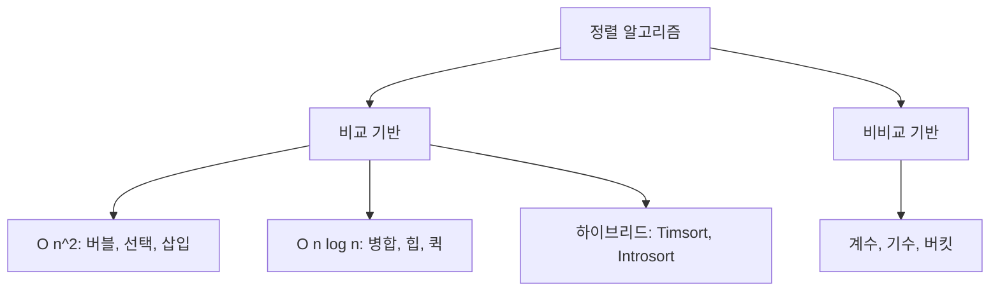

# 정렬 알고리즘

정렬은 알고리즘 교과서에 빠지지 않고 등장하지만, 실무에서 직접 정렬 함수를 구현하는 일은 거의 없다. 대부분 언어 표준 라이브러리에 들어 있는 `sort`를 호출하면 끝난다. 그런데 이 표준 라이브러리가 내부적으로 어떻게 동작하는지를 모르면, 가끔 발생하는 이상한 성능 저하나 정렬 결과가 예상과 다른 상황에서 원인을 찾기 어렵다. 5년 정도 서버를 만들면서 정렬 때문에 디버깅한 경험을 정리해보면, 결국 매번 부딪히는 문제는 비슷하다. "왜 이 정렬은 안정 정렬이 아닌가", "왜 거의 정렬된 데이터에서 더 빨라지는가", "왜 1만 건일 때는 빠른데 100만 건이면 느려지는가" 같은 것들이다.

이 문서는 알고리즘별 동작 원리와 트레이드오프, 안정성, 그리고 Java/Python/C++ 같은 언어들이 내부적으로 어떤 정렬을 쓰는지를 다룬다. 면접용 암기보다는 실무에서 어떤 정렬을 언제 골라야 하는지를 판단하는 근거를 만드는 것이 목표다.

## 정렬을 분류하는 기준

정렬 알고리즘을 비교할 때 시간 복잡도만 보는 사람이 많은데, 실무에서는 그것만으로는 부족하다. 적어도 네 가지 축으로 봐야 한다.

첫 번째는 **시간 복잡도**다. 평균과 최악을 분리해서 봐야 한다. 퀵 정렬은 평균 O(n log n)이지만 최악은 O(n²)이다. 평균만 보고 채택했다가 특정 입력 패턴에서 서비스가 죽는 사례가 종종 있다.

두 번째는 **공간 복잡도**다. 제자리(in-place) 정렬인지 추가 메모리가 필요한지를 본다. 병합 정렬은 O(n) 추가 메모리를 쓴다. 메모리가 빠듯한 임베디드나 거대한 데이터를 다루는 배치에서는 이게 문제가 된다.

세 번째는 **안정성(stability)** 이다. 같은 키 값을 가진 원소들의 상대 순서가 정렬 후에도 유지되는가? 단순히 숫자만 정렬할 때는 의미 없지만, 객체를 여러 키로 다단계 정렬할 때 매우 중요하다. 예를 들어 사용자 목록을 먼저 가입일로 정렬한 다음, 다시 등급으로 정렬했을 때 같은 등급 안에서 가입일 순서가 유지되려면 두 번째 정렬이 안정 정렬이어야 한다.

네 번째는 **입력 패턴에 대한 적응성(adaptive)** 이다. 이미 거의 정렬된 데이터에서 더 빠르게 동작하는가? 삽입 정렬과 Timsort는 적응적이고, 표준 퀵 정렬은 그렇지 않다. 실제 데이터는 완전히 무작위인 경우가 드물다. 로그 데이터나 시계열 데이터는 거의 정렬되어 있는 경우가 많아서, 이 특성을 활용하는 정렬이 훨씬 빠르다.



비교 기반 정렬의 이론적 하한은 O(n log n)이다. 이건 결정 트리로 증명할 수 있는데, 비교 한 번으로 얻는 정보가 1비트이고 n!개의 순열을 구분하려면 log₂(n!) ≈ n log n번의 비교가 필요하다는 논리다. 그래서 비교 기반으로는 O(n log n)보다 빠를 수 없다. 더 빠르게 만들려면 비교 외의 정보, 예를 들어 키의 자릿수나 값의 범위를 활용해야 한다. 그게 기수 정렬이나 계수 정렬이다.

## 단순 정렬: 버블, 선택, 삽입

이 세 정렬은 평균 O(n²)이라 큰 데이터에는 못 쓴다. 그런데 작은 데이터(보통 16개 이하)에서는 오히려 O(n log n) 정렬보다 빠르다. 캐시 친화적이고 분기 예측이 잘 맞고 함수 호출 오버헤드가 없기 때문이다. 그래서 Timsort나 Introsort 같은 하이브리드 정렬은 작은 구간에 도달하면 삽입 정렬로 전환한다.

### 버블 정렬 (Bubble Sort)

인접한 두 원소를 비교해서 큰 것을 뒤로 보내는 작업을 반복한다. 이름 그대로 큰 값이 거품처럼 위로 떠오른다. 한 번의 패스(pass)가 끝나면 가장 큰 원소가 맨 뒤에 자리 잡는다. 다음 패스에서는 마지막 원소를 제외하고 다시 반복한다.

```python
def bubble_sort(arr):
    n = len(arr)
    for i in range(n):
        swapped = False
        for j in range(0, n - i - 1):
            if arr[j] > arr[j + 1]:
                arr[j], arr[j + 1] = arr[j + 1], arr[j]
                swapped = True
        if not swapped:
            break
    return arr
```

`swapped` 플래그가 있는 이유는 이미 정렬된 배열을 만나면 한 번의 패스 후에 종료하기 위해서다. 이 최적화가 있으면 이미 정렬된 입력에 대해 O(n)이 된다. 안정 정렬이고, 제자리 정렬이며, 추가 메모리는 O(1)이다.

실무에서 버블 정렬을 쓸 일은 사실상 없다. 교육 목적 외에는 같은 단순 정렬 중에서도 삽입 정렬이 거의 항상 더 빠르다. 비교 횟수는 비슷하지만 스왑 횟수가 훨씬 많기 때문이다.

### 선택 정렬 (Selection Sort)

매 패스마다 남은 부분에서 최소값을 찾아 맨 앞과 교환한다.

```python
def selection_sort(arr):
    n = len(arr)
    for i in range(n):
        min_idx = i
        for j in range(i + 1, n):
            if arr[j] < arr[min_idx]:
                min_idx = j
        arr[i], arr[min_idx] = arr[min_idx], arr[i]
    return arr
```

선택 정렬의 특징은 스왑 횟수가 항상 정확히 n-1번이라는 점이다. 비교 횟수는 O(n²)이지만 스왑이 적기 때문에, 스왑 비용이 매우 비싼 환경(예: 디스크에 있는 큰 객체를 정렬할 때)에서는 의미가 있다. 단점은 안정 정렬이 아니라는 점이다. 같은 값이 두 개 있을 때 뒤쪽 원소가 앞으로 가는 과정에서 상대 순서가 깨질 수 있다.

이미 정렬된 입력이든 무작위 입력이든 항상 O(n²)이다. 적응적이지 않다. 그래서 입력 분포를 모르고 최악의 경우 시간을 보장하고 싶을 때만 의미가 있는데, 이런 요구사항이라면 보통 힙 정렬을 쓴다.

### 삽입 정렬 (Insertion Sort)

카드 게임에서 손에 든 카드를 정렬하는 방식이다. 한 장씩 뽑아서 이미 정렬된 부분의 적절한 위치에 끼워넣는다.

```python
def insertion_sort(arr):
    for i in range(1, len(arr)):
        key = arr[i]
        j = i - 1
        while j >= 0 and arr[j] > key:
            arr[j + 1] = arr[j]
            j -= 1
        arr[j + 1] = key
    return arr
```

삽입 정렬은 작은 데이터에 대해 가장 실용적이다. 거의 정렬된 데이터에서 O(n)에 가까운 성능을 낸다. 이미 정렬되어 있다면 각 원소마다 비교를 한 번만 하고 끝나기 때문이다. 안정 정렬이고 제자리 정렬이다.

Timsort, Introsort, std::sort 같은 거의 모든 실무 정렬은 부분 배열의 크기가 일정 임계값(보통 16~32) 이하가 되면 삽입 정렬로 전환한다. 이건 삽입 정렬이 작은 데이터에서 빠르다는 사실을 활용한 최적화다.

삽입 정렬의 또 다른 장점은 온라인 알고리즘이라는 점이다. 데이터가 한 번에 다 주어지지 않고 스트리밍으로 들어오는 상황에서, 새 원소가 들어올 때마다 정렬된 상태를 유지할 수 있다.

## 분할 정복 정렬: 병합과 퀵

두 알고리즘 모두 분할 정복(divide and conquer) 패러다임을 따르지만, 분할과 병합 단계의 비중이 정반대다. 병합 정렬은 분할이 단순하고 병합이 복잡하다. 퀵 정렬은 분할(파티셔닝)이 복잡하고 병합이 없다.

### 병합 정렬 (Merge Sort)

배열을 절반으로 나눈 다음 각각을 재귀적으로 정렬하고, 두 정렬된 배열을 병합한다.

```python
def merge_sort(arr):
    if len(arr) <= 1:
        return arr
    mid = len(arr) // 2
    left = merge_sort(arr[:mid])
    right = merge_sort(arr[mid:])
    return merge(left, right)

def merge(left, right):
    result = []
    i = j = 0
    while i < len(left) and j < len(right):
        if left[i] <= right[j]:
            result.append(left[i])
            i += 1
        else:
            result.append(right[j])
            j += 1
    result.extend(left[i:])
    result.extend(right[j:])
    return result
```

병합 정렬은 항상 O(n log n)을 보장한다. 최악 케이스가 없다는 게 가장 큰 장점이다. 그리고 안정 정렬이다. `<=` 비교를 쓰는 이유가 그것이다. 같은 값이면 왼쪽 원소를 먼저 가져오기 때문에 상대 순서가 유지된다. 만약 `<`로 바꾸면 오른쪽이 먼저 들어오게 되어 안정성이 깨진다.

단점은 추가 메모리를 O(n) 쓴다는 점이다. 인플레이스 병합 정렬도 있긴 하지만 구현이 복잡하고 상수항이 커서 실무에서는 거의 쓰이지 않는다.

병합 정렬이 진가를 발휘하는 곳은 외부 정렬(external sort)이다. 메모리에 다 안 들어가는 거대한 데이터를 정렬할 때, 청크 단위로 메모리에서 정렬하고 디스크에 쓴 다음, 여러 정렬된 청크를 병합하는 방식으로 처리한다. 데이터베이스의 정렬 연산(`ORDER BY`)이나 MapReduce의 셔플 단계가 이 방식을 쓴다.

연결 리스트(linked list)를 정렬할 때도 병합 정렬이 가장 자연스럽다. 임의 접근이 안 되는 자료구조에서는 퀵 정렬의 파티셔닝이 비효율적이다. 반면 병합은 순차 접근만 하면 되므로 연결 리스트와 잘 맞는다. 추가 메모리도 필요 없다(노드 포인터만 다시 연결하면 된다).

### 퀵 정렬 (Quick Sort)

피벗(pivot)을 하나 골라서 피벗보다 작은 값은 왼쪽으로, 큰 값은 오른쪽으로 옮기는 파티셔닝(partitioning)을 한다. 그런 다음 왼쪽과 오른쪽 부분 배열에 대해 재귀적으로 같은 작업을 한다.

```python
def quick_sort(arr, low=0, high=None):
    if high is None:
        high = len(arr) - 1
    if low < high:
        pi = partition(arr, low, high)
        quick_sort(arr, low, pi - 1)
        quick_sort(arr, pi + 1, high)
    return arr

def partition(arr, low, high):
    pivot = arr[high]
    i = low - 1
    for j in range(low, high):
        if arr[j] <= pivot:
            i += 1
            arr[i], arr[j] = arr[j], arr[i]
    arr[i + 1], arr[high] = arr[high], arr[i + 1]
    return i + 1
```

퀵 정렬은 평균 O(n log n)이지만 최악은 O(n²)이다. 최악은 피벗을 매번 가장 작거나 가장 큰 값으로 골랐을 때 발생한다. 위 코드처럼 마지막 원소를 피벗으로 쓰면, 이미 정렬된 입력이 들어왔을 때 O(n²)이 된다. 이게 실무에서 큰 문제가 된다. 정렬된 데이터를 다시 정렬하는 일은 의외로 많기 때문이다.

피벗 선택 전략에 따라 성능이 크게 달라진다. 대표적인 방법들이다.

- **첫 번째/마지막 원소**: 가장 단순하지만 정렬된 입력에서 최악
- **무작위 선택**: 적대적 입력에 강하다. 평균은 같지만 분산이 줄어든다
- **median-of-three**: 첫 번째, 중간, 마지막의 중앙값을 쓴다. 거의 정렬된 입력에 효과적이다
- **median-of-medians (BFPRT)**: 이론적으로 최악 O(n log n)을 보장하지만 상수항이 커서 실무에서는 잘 안 쓴다

퀵 정렬의 장점은 캐시 친화적이고 제자리 정렬이라는 점이다. 평균적으로는 병합 정렬보다 빠르다. 비교와 스왑 외에 추가 메모리 할당이 없기 때문이다(재귀 호출 스택 O(log n)은 있다).

단점은 안정 정렬이 아니라는 점이다. 파티셔닝 과정에서 같은 값이 여러 개 있으면 상대 순서가 깨진다. 그래서 `Arrays.sort(int[])`는 퀵 정렬을 쓰지만 `Arrays.sort(Object[])`는 병합 정렬 계열을 쓴다. 객체는 안정성이 필요한 경우가 많기 때문이다.

같은 값이 많은 데이터에서 표준 퀵 정렬은 비효율적이다. 같은 값들이 한쪽으로 쏠리면서 균형이 깨진다. 이를 해결하기 위해 3-way 파티셔닝(Dutch National Flag)을 쓴다. 작은 값, 같은 값, 큰 값 세 구역으로 나누어 같은 값 구역은 더 이상 재귀 호출하지 않는다. Java의 `Arrays.sort(int[])`가 쓰는 Dual-Pivot Quicksort는 이와 비슷한 발상으로, 두 개의 피벗으로 세 구역으로 나눈다.

```python
def quick_sort_3way(arr, low, high):
    if low >= high:
        return
    lt, gt = low, high
    pivot = arr[low]
    i = low + 1
    while i <= gt:
        if arr[i] < pivot:
            arr[lt], arr[i] = arr[i], arr[lt]
            lt += 1
            i += 1
        elif arr[i] > pivot:
            arr[i], arr[gt] = arr[gt], arr[i]
            gt -= 1
        else:
            i += 1
    quick_sort_3way(arr, low, lt - 1)
    quick_sort_3way(arr, gt + 1, high)
```

## 힙 정렬 (Heap Sort)

이진 힙(binary heap) 자료구조를 활용한 정렬이다. 최대 힙을 만든 다음 루트(최대값)를 빼서 맨 뒤로 보내고, 다시 힙 속성을 복원하는 작업을 반복한다.

```python
def heap_sort(arr):
    n = len(arr)
    for i in range(n // 2 - 1, -1, -1):
        heapify(arr, n, i)
    for i in range(n - 1, 0, -1):
        arr[0], arr[i] = arr[i], arr[0]
        heapify(arr, i, 0)
    return arr

def heapify(arr, n, i):
    largest = i
    left = 2 * i + 1
    right = 2 * i + 2
    if left < n and arr[left] > arr[largest]:
        largest = left
    if right < n and arr[right] > arr[largest]:
        largest = right
    if largest != i:
        arr[i], arr[largest] = arr[largest], arr[i]
        heapify(arr, n, largest)
```

힙 정렬은 항상 O(n log n)을 보장한다. 퀵 정렬처럼 최악 O(n²)이 없다. 그리고 제자리 정렬이라 추가 메모리도 O(1)이다(재귀를 반복문으로 풀면). 이론적으로는 거의 완벽해 보이지만, 실무에서 힙 정렬은 퀵 정렬보다 느린 경우가 많다.

이유는 캐시 효율성이다. 힙 정렬은 부모-자식 인덱스가 멀리 떨어져 있어서(인덱스 i의 자식은 2i+1, 2i+2) 메모리 접근 패턴이 흩어진다. 반면 퀵 정렬은 연속된 메모리 영역을 다루기 때문에 캐시 히트가 잘 맞는다. 현대 CPU에서 캐시 미스는 일반 명령어보다 수십 배 느리기 때문에, 알고리즘 복잡도가 같아도 실제 성능 차이가 크다.

또한 힙 정렬은 안정 정렬이 아니다. 그리고 적응적이지도 않다. 거의 정렬된 입력이든 역순 입력이든 같은 시간이 걸린다.

힙 정렬이 빛나는 곳은 우선순위 큐가 필요한 경우다. 정렬이 목적이 아니라 동적으로 최대값/최소값을 빼야 하는 상황에서 힙 자료구조가 유용하다. 또 Introsort에서 퀵 정렬의 재귀 깊이가 너무 깊어졌을 때 폴백(fallback)으로 힙 정렬로 전환한다. 이건 최악 케이스를 회피하기 위한 영리한 설계다.

## 비비교 정렬: 계수, 기수, 버킷

비교 기반 정렬의 하한 O(n log n)을 깰 수 있는 방법은 비교 외의 정보를 활용하는 것이다. 단, 입력에 대한 가정이 필요하다.

### 계수 정렬 (Counting Sort)

키의 범위가 작을 때 쓴다. 각 값의 출현 횟수를 세어서 누적 배열을 만든 다음, 출력 위치를 계산한다.

```python
def counting_sort(arr, max_val):
    count = [0] * (max_val + 1)
    for num in arr:
        count[num] += 1
    for i in range(1, max_val + 1):
        count[i] += count[i - 1]
    output = [0] * len(arr)
    for num in reversed(arr):
        count[num] -= 1
        output[count[num]] = num
    return output
```

시간 복잡도는 O(n + k)다. k는 값의 범위. n과 k가 비슷하면 O(n)이지만 k가 n보다 훨씬 크면 메모리만 낭비된다. 시험 점수(0~100)나 나이(0~120) 같은 좁은 범위 정수에 적합하다.

뒤에서부터 순회하면서 출력 배열을 채우는 이유는 안정성을 유지하기 위해서다. 같은 값이 여러 개일 때 원래 순서대로 뒷자리부터 채워야 한다.

### 기수 정렬 (Radix Sort)

자릿수별로 안정 정렬을 반복한다. LSD(Least Significant Digit) 방식이 일반적이다. 가장 낮은 자릿수부터 차례로 정렬한다.

```python
def radix_sort(arr):
    if not arr:
        return arr
    max_val = max(arr)
    exp = 1
    while max_val // exp > 0:
        arr = counting_sort_by_digit(arr, exp)
        exp *= 10
    return arr

def counting_sort_by_digit(arr, exp):
    n = len(arr)
    output = [0] * n
    count = [0] * 10
    for num in arr:
        count[(num // exp) % 10] += 1
    for i in range(1, 10):
        count[i] += count[i - 1]
    for i in range(n - 1, -1, -1):
        digit = (arr[i] // exp) % 10
        count[digit] -= 1
        output[count[digit]] = arr[i]
    return output
```

시간 복잡도는 O(d × (n + b))다. d는 자릿수, b는 진법(보통 10 또는 256). 32비트 정수라면 d=10(base 10) 또는 d=4(base 256)다. 거대한 정수 배열을 정렬할 때 비교 정렬보다 빠를 수 있다.

기수 정렬의 안정성이 핵심이다. 각 자릿수 정렬이 안정적이지 않으면 전체 알고리즘이 무너진다. 그래서 내부 정렬로 계수 정렬을 쓴다.

문자열 정렬에도 쓸 수 있는데, 가변 길이 문자열은 처리가 까다롭다. MSD(Most Significant Digit) 방식이 사전순 정렬에 적합하다.

### 버킷 정렬 (Bucket Sort)

값을 여러 버킷으로 나눠 담은 다음, 각 버킷을 정렬하고 합친다. 입력이 균등 분포일 때 평균 O(n)이지만, 분포가 치우치면 한 버킷에 다 몰려 O(n²)이 된다. 부동소수점 [0, 1) 범위 데이터에 자주 쓴다.

## 안정성(Stability)이 중요한 이유

안정 정렬은 같은 키 값을 가진 원소들의 입력 순서가 출력에서도 유지된다는 보장이다. 단일 키 정렬에서는 의미가 없지만 다단계 정렬에서 결정적이다.

예를 들어 학생 목록을 (학년, 이름) 순으로 정렬하고 싶다고 하자. 두 가지 방법이 있다.

방법 1: (학년, 이름) 튜플로 한 번에 정렬한다. 이건 항상 옳게 동작한다.

방법 2: 먼저 이름으로 정렬하고, 그 다음 학년으로 정렬한다. 이 방법은 두 번째 정렬이 안정 정렬일 때만 옳게 동작한다. 같은 학년 안에서 이름 순서가 깨지지 않아야 하기 때문이다. 만약 학년 정렬에 퀵 정렬이나 힙 정렬을 쓰면 이름 순서가 무작위로 바뀐다.

데이터베이스의 `ORDER BY` 절에서 여러 컬럼을 지정하면 안정 정렬이 보장되어야 한다. 그래서 대부분의 DB는 안정 정렬을 쓴다.

| 정렬 | 안정성 |
|------|--------|
| 버블 | 안정 |
| 선택 | 비안정 |
| 삽입 | 안정 |
| 병합 | 안정 |
| 퀵 | 비안정 |
| 힙 | 비안정 |
| 계수 | 안정 |
| 기수 | 안정 |

비안정 정렬을 안정으로 만드는 방법은 있다. 원래 인덱스를 키에 추가해서 (원래키, 인덱스) 튜플로 정렬하면 된다. 단, 메모리와 비교 비용이 늘어난다.

## 언어별 내장 정렬: Timsort와 Introsort

표준 라이브러리 정렬은 단순한 한 가지 알고리즘이 아니라 여러 알고리즘을 조합한 하이브리드다. 가장 널리 쓰이는 두 가지가 Timsort와 Introsort다.

### Timsort

Python의 `sorted()`와 `list.sort()`, Java의 `Arrays.sort(Object[])`와 `Collections.sort()`, Android, V8 (JavaScript) 등이 쓴다. 2002년 Tim Peters가 Python을 위해 개발했다.

Timsort의 핵심 아이디어는 "실제 데이터는 부분적으로 정렬되어 있다"는 관찰에서 출발한다. 데이터에서 이미 정렬된 부분(run)을 찾아내고, 이런 run들을 병합 정렬로 합친다.

동작 방식을 단순화해서 설명하면:

1. 배열을 순회하며 자연 run(이미 오름차순 또는 내림차순인 부분)을 찾는다. 내림차순이면 뒤집어서 오름차순으로 만든다.
2. run의 길이가 minrun(보통 32~64)보다 짧으면 삽입 정렬로 minrun까지 확장한다.
3. run들을 스택에 쌓고, 특정 invariant를 유지하면서 인접한 run들을 병합한다.

invariant는 "스택의 최상단에서 두 번째 run이 가장 위 run보다 길어야 한다"는 식의 조건들로, 균형 잡힌 병합을 보장한다.

Timsort의 강점은 실제 데이터에서의 성능이다. 완전히 정렬된 데이터는 O(n)에 처리한다. 거의 정렬된 데이터에서도 매우 빠르다. 그리고 안정 정렬이다. 약점은 구현이 복잡하고 추가 메모리를 O(n) 쓴다는 점이다. 그리고 무작위 데이터에서는 표준 퀵 정렬보다 약간 느리다.

```python
data = [5, 2, 8, 1, 9, 3, 7, 4, 6]
sorted_data = sorted(data)
```

Python에서 위 코드는 내부적으로 Timsort를 호출한다. 객체 정렬도 항상 안정 정렬이 보장되므로, 다단계 정렬을 안전하게 쓸 수 있다.

```python
students = [{"name": "Alice", "grade": 2}, {"name": "Bob", "grade": 1}]
students.sort(key=lambda s: s["name"])
students.sort(key=lambda s: s["grade"])
```

이렇게 두 번 정렬해도 같은 학년 내에서 이름 순서가 유지된다. Python의 sort가 안정 정렬이기 때문이다.

### Introsort

C++의 `std::sort`, .NET의 `Array.Sort`(일부 버전)가 쓴다. 1997년 David Musser가 발표했다. 이름은 "Introspective Sort"의 줄임말이다.

Introsort는 퀵 정렬의 빠른 평균 성능과 힙 정렬의 보장된 최악 성능, 삽입 정렬의 작은 데이터 효율성을 결합한다. 동작 방식:

1. 퀵 정렬로 시작한다.
2. 재귀 깊이가 2 × log₂(n)을 넘으면 힙 정렬로 전환한다. 이건 퀵 정렬이 최악 케이스로 흐른다는 신호다.
3. 부분 배열의 크기가 임계값(보통 16) 이하가 되면 삽입 정렬로 전환한다.

이 설계로 평균은 퀵 정렬만큼 빠르고 최악도 O(n log n)을 보장한다. 단점은 안정 정렬이 아니라는 점이다. 그래서 C++에는 안정 정렬이 필요하면 `std::stable_sort`라는 별도 함수가 있다(이건 병합 정렬 계열을 쓴다).

### Java의 Dual-Pivot Quicksort

Java의 `Arrays.sort(int[])` 같은 원시 타입 정렬은 Dual-Pivot Quicksort를 쓴다. Vladimir Yaroslavskiy가 2009년에 제안한 방식이다. 두 개의 피벗을 사용해서 배열을 세 구역으로 나눈다(피벗1보다 작음, 두 피벗 사이, 피벗2보다 큼). 단일 피벗 퀵 정렬보다 비교 횟수와 캐시 미스가 줄어든다.

원시 타입은 안정성이 의미 없으므로(같은 정수 두 개는 구별할 수 없다) 비안정 정렬이어도 문제가 없다. 객체 정렬에는 Timsort를 쓴다.

### Go의 정렬

Go의 `sort.Sort`는 Pattern-defeating Quicksort(pdqsort) 변형을 쓴다(1.19부터). 이건 Introsort에 추가 최적화를 더한 것으로, 적대적 입력 패턴을 탐지해서 셔플로 회피한다.

## 실무에서 정렬을 고를 때

대부분의 경우 언어 표준 라이브러리 정렬을 쓰면 된다. 직접 구현해야 하는 상황은 매우 드물고, 직접 구현하면 표준 라이브러리보다 빠르기 어렵다. 그래도 어떤 표준 함수를 쓸지, 또는 특수한 상황에서 어떤 알고리즘을 골라야 할지 판단해야 할 때가 있다.

**일반적인 객체 정렬이 필요하고 안정성이 중요하다.** Timsort 계열을 쓴다. Java라면 `Collections.sort` 또는 `List.sort`, Python이라면 `sorted` 또는 `list.sort`. 명시적으로 안정성을 의식하지 않아도 자연스럽게 보장된다.

**원시 타입 정렬, 안정성 불필요.** Dual-Pivot Quicksort나 Introsort를 쓴다. Java의 `Arrays.sort(int[])`, C++의 `std::sort`. 메모리 추가 할당 없이 빠르다.

**거의 정렬된 데이터.** Timsort가 압도적으로 빠르다. 무작위 데이터에서 비등하던 정렬들이 정렬된 데이터에서는 큰 차이가 난다.

**값의 범위가 작은 정수.** 계수 정렬을 직접 구현할 가치가 있다. 예를 들어 0~255 범위 픽셀 값, 0~100 범위 점수 등.

**고정 길이 정수나 문자열, 거대한 데이터.** 기수 정렬을 고려한다. 단, 캐시 효율성과 구현 복잡도 때문에 항상 비교 정렬보다 빠르진 않다. 벤치마크 후 결정한다.

**메모리에 안 들어가는 거대한 데이터.** 외부 정렬(External Merge Sort)을 쓴다. 청크 단위로 메모리에서 정렬하고 디스크에 쓴 다음, k-way 병합으로 합친다. 데이터베이스나 빅데이터 프레임워크에 맡기는 것이 보통이다.

**부분 정렬만 필요하다(상위 K개).** 전체 정렬은 낭비다. 힙(우선순위 큐)을 쓰거나 Quickselect를 쓴다. K가 작으면 크기 K의 최소 힙으로 O(n log K), 중간값처럼 정확한 위치가 필요하면 Quickselect로 평균 O(n).

**스트리밍 데이터.** 삽입 정렬이나 정렬된 자료구조(Tree, SkipList)를 쓴다. 매번 다시 정렬하지 말고 새 원소가 들어올 때 정렬된 상태를 유지한다.

**최악 시간 복잡도 보장이 절대적으로 중요하다.** 힙 정렬이나 병합 정렬을 쓴다. 퀵 정렬은 평균은 빠르지만 적대적 입력으로 O(n²)이 가능하다. 사용자 입력이 들어오는 서비스에서 정렬 알고리즘이 공격 벡터가 된 사례도 있다(2003년 Crosby & Wallach의 "Denial of Service via Algorithmic Complexity Attacks").

## 자주 부딪히는 함정

**비교 함수가 strict weak ordering을 위반한다.** 비교 함수가 일관성이 없으면 정렬 결과가 예측 불가능해지고, 심하면 무한 루프나 크래시가 발생한다. 두 원소를 비교할 때 a < b와 b < a가 모두 true이면 안 된다. 동등한 경우 정확히 0(또는 둘 다 false)을 반환해야 한다. Java의 `TimSort` 구현은 이런 위반을 감지하면 `IllegalArgumentException`을 던진다.

**부동소수점 비교에서 NaN.** NaN은 자기 자신과도 비교가 false다. NaN이 섞인 배열을 정렬하면 결과가 망가진다. 정렬 전에 NaN을 걸러내거나 별도 처리해야 한다.

**객체 비교에서 mutable 키.** 정렬 중에 객체의 키 값이 바뀌면 결과가 망가진다. Set이나 PriorityQueue에 들어 있는 객체의 정렬 키를 바꾸는 것도 같은 문제다. 정렬에 쓰이는 키는 immutable로 다뤄야 한다.

**대용량 객체의 정렬.** 객체 자체를 옮기지 말고 인덱스나 포인터를 정렬한다. 객체 복사 비용이 비교 비용보다 훨씬 클 때 효과적이다. C++의 `std::sort`로 큰 구조체를 정렬하면 스왑마다 큰 메모리 복사가 발생한다. 인덱스만 정렬한 다음 마지막에 한 번 재배치하면 메모리 이동을 최소화할 수 있다.

**Unicode 문자열 정렬.** 단순 코드포인트 비교는 사람이 기대하는 사전순과 다르다. 한글 자모, 결합 문자, 대소문자 등 고려할 게 많다. ICU나 Collator 같은 로케일 인지 비교를 써야 한다.

**병렬 정렬.** Java의 `Arrays.parallelSort`, C++17의 `std::sort(std::execution::par, ...)` 같은 병렬 정렬은 큰 데이터에서 빠르지만, 작은 데이터에서는 스레드 오버헤드 때문에 오히려 느리다. 그리고 결과의 안정성이 보장되지 않는 경우가 있다. 문서를 확인해야 한다.
