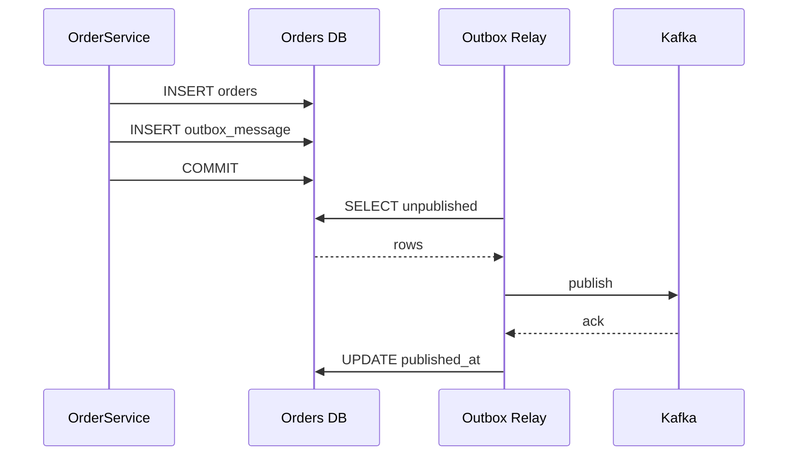
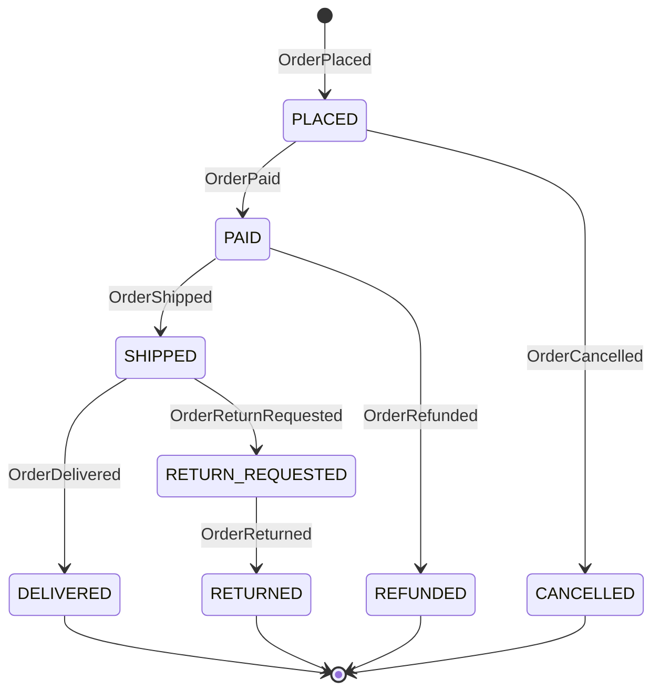
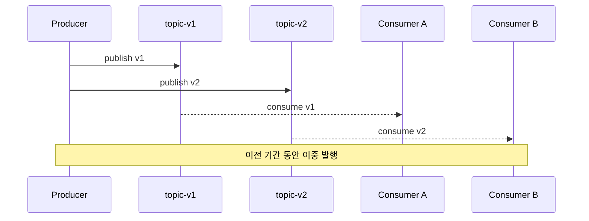

# 도메인 이벤트 (Domain Event)

## 이 문서의 위치

Aggregate 내부의 상태 변경을 "사건"으로 모델링하는 게 도메인 이벤트다. Aggregate 경계, Repository 같은 기본 빌딩 블록은 [DDD_Building_Blocks.md](DDD_Building_Blocks.md)에서 다룬다. 여기서는 이벤트를 언제 발행하고, 트랜잭션과 어떻게 엮고, 외부 시스템으로 안전하게 흘려보내는지를 파고든다.

실무에서 도메인 이벤트는 두 가지 문제를 동시에 풀려고 한다. 하나는 Aggregate 간 결합도를 낮추는 일이다. 주문 Aggregate가 포인트 Aggregate를 직접 호출하면 두 Aggregate의 트랜잭션 경계가 엉킨다. 주문이 "OrderPlaced"라는 사건만 발행하고 포인트 쪽이 이를 구독하는 구조면 서로 몰라도 된다. 다른 하나는 서비스 간 결합도를 낮추는 일이다. MSA로 가면 Kafka, RabbitMQ 같은 브로커를 통해 이벤트가 넘어간다. 같은 단어(이벤트)가 맥락에 따라 프로세스 내부 이벤트를 가리키기도 하고 메시지 브로커 위의 이벤트를 가리키기도 하니 문서 안에서 구분해서 읽어야 한다.

---

## 도메인 이벤트란

도메인 이벤트는 "도메인에서 의미 있는 일이 일어났다"는 사실을 과거형으로 기록한 불변 객체다. 핵심은 세 가지다.

- **과거에 일어난 일**이다. 명령(Command)이 아니다. `PlaceOrder`는 명령이고 `OrderPlaced`가 이벤트다.
- **불변**이다. 발행된 이벤트는 수정하지 않는다. 잘못 발행했으면 `OrderPlacementCorrected` 같은 새 이벤트를 발행한다.
- **자기 완결적**이다. 이벤트를 받은 쪽이 DB를 다시 조회하지 않아도 처리할 수 있을 만큼 맥락이 들어 있어야 한다. 이 원칙은 페이로드 설계에서 다시 다룬다.

도메인 이벤트와 기술적 이벤트(예: 시스템 로그, 감사 로그)는 다르다. 도메인 이벤트는 비즈니스 용어로 지어져야 하고, 도메인 전문가가 들었을 때 "아 그 사건"이라고 이해할 수 있어야 한다. `UserTableUpdated` 같은 이름은 도메인 이벤트가 아니라 기술 로그다.

---

## Aggregate 내부에서 이벤트 발행

### 왜 Aggregate에서 발행하나

이벤트 발행을 서비스 계층에 두면 도메인 규칙과 발행 시점이 어긋나기 쉽다. 주문 취소는 Aggregate 내부의 상태 전이 규칙(결제 완료 여부, 배송 시작 여부 등)을 통과해야만 성립한다. 이 규칙이 통과됐다는 사실은 Aggregate만 확실히 안다. 그래서 이벤트 발행 지점도 Aggregate 안에 두는 게 자연스럽다.

다만 Aggregate가 직접 `Kafka`나 `ApplicationEventPublisher`를 호출하면 순수한 도메인 객체가 인프라에 의존하게 된다. 이를 피하려고 Aggregate는 이벤트를 "모아두기만" 하고, 저장 시점에 꺼내서 발행한다. Spring Data JPA의 `@DomainEvents` 방식이 이 패턴이다.

### Spring Data JPA의 @DomainEvents

`AbstractAggregateRoot`를 상속하거나 `@DomainEvents`, `@AfterDomainEventPublication` 두 애노테이션을 직접 붙이면 된다. Repository가 `save()`를 호출할 때 Spring Data가 알아서 이벤트를 꺼내 `ApplicationEventPublisher`로 흘려보낸다.

```java
@Entity
public class Order extends AbstractAggregateRoot<Order> {

    @Id
    private Long id;

    @Enumerated(EnumType.STRING)
    private OrderStatus status;

    public static Order place(Long userId, List<OrderLine> lines) {
        Order order = new Order(userId, lines);
        order.status = OrderStatus.PLACED;
        order.registerEvent(new OrderPlaced(order.id, userId, order.totalAmount()));
        return order;
    }

    public void cancel(String reason) {
        if (status != OrderStatus.PLACED) {
            throw new IllegalStateException("배송 준비 중이거나 완료된 주문은 취소할 수 없다");
        }
        this.status = OrderStatus.CANCELLED;
        registerEvent(new OrderCancelled(this.id, reason));
    }
}
```

`registerEvent()`로 쌓아둔 이벤트는 `save()`가 성공하고 나서 `ApplicationEventPublisher.publishEvent()`로 자동 발행된다. 여기서 중요한 건 "save()가 호출된 시점"이지 "트랜잭션이 커밋된 시점"이 아니다. 이 차이 때문에 `TransactionalEventListener`가 필요해진다.

### ApplicationEventPublisher를 직접 쓰는 경우

Aggregate가 JPA Entity가 아니거나 다른 이유로 `@DomainEvents`를 못 쓸 때는 서비스 계층에서 직접 발행한다. 이때는 "Aggregate에서 이벤트를 꺼내서 퍼블리셔에 넘긴다"는 흐름을 유지해야 한다.

```java
@Service
@RequiredArgsConstructor
public class OrderService {

    private final OrderRepository orderRepository;
    private final ApplicationEventPublisher eventPublisher;

    @Transactional
    public Order placeOrder(PlaceOrderCommand cmd) {
        Order order = Order.place(cmd.userId(), cmd.lines());
        orderRepository.save(order);
        order.pullEvents().forEach(eventPublisher::publishEvent);
        return order;
    }
}
```

`pullEvents()`는 Aggregate에서 내부 큐를 비우면서 꺼내는 메서드로 직접 구현한다. 이 패턴의 단점은 개발자가 발행을 까먹을 수 있다는 점이다. 그래서 가능하면 `@DomainEvents`를 쓰는 쪽이 안전하다.

---

## 트랜잭션과 이벤트 발행 시점

### 동기 이벤트 리스너의 함정

`@EventListener`만 붙인 리스너는 퍼블리셔와 같은 스레드, 같은 트랜잭션에서 실행된다. 주문 생성 트랜잭션 안에서 `OrderPlaced` 리스너가 동작하면, 리스너에서 예외가 나면 주문 자체가 롤백된다. 포인트 적립 처리 하나 실패했다고 주문이 통째로 취소되는 상황이 벌어진다.

반대로 트랜잭션이 아직 커밋되지 않았는데 외부 시스템에 알림을 보냈다고 치자. 그 뒤에 DB 커밋이 실패해서 주문이 생성되지 않으면 외부 시스템에만 "주문이 접수됐다"는 잘못된 사실이 남는다. 이 둘 사이에서 선택하는 게 `TransactionalEventListener`의 Phase다.

### BEFORE_COMMIT vs AFTER_COMMIT vs AFTER_ROLLBACK

`@TransactionalEventListener`는 phase 속성으로 발행 시점을 고를 수 있다.

| Phase | 시점 | 쓰임 |
|-------|------|------|
| `BEFORE_COMMIT` | 커밋 직전 | 같은 트랜잭션 안에서 DB 추가 쓰기가 필요할 때 (Outbox 기록) |
| `AFTER_COMMIT` | 커밋 직후 (기본값) | 외부 시스템 호출, 알림, Kafka 발행 |
| `AFTER_ROLLBACK` | 롤백 직후 | 실패 보상, 로깅 |
| `AFTER_COMPLETION` | 커밋/롤백 어느 쪽이든 끝난 뒤 | 정리 작업 |

```java
@Component
public class OrderEventHandlers {

    @TransactionalEventListener(phase = TransactionPhase.AFTER_COMMIT)
    public void sendOrderConfirmationEmail(OrderPlaced event) {
        emailSender.send(event.userId(), "주문이 접수되었습니다");
    }

    @TransactionalEventListener(phase = TransactionPhase.BEFORE_COMMIT)
    public void writeOutbox(OrderPlaced event) {
        outboxRepository.save(OutboxMessage.from(event));
    }
}
```

AFTER_COMMIT의 치명적인 약점이 하나 있다. 리스너 자체가 실패하면 DB는 이미 커밋된 상태라 롤백할 수 없다. Kafka 발행이 네트워크 문제로 실패했다면 주문은 생성됐는데 이벤트는 없는 상태가 된다. 이 구멍을 막으려고 Outbox 패턴을 쓴다.

BEFORE_COMMIT도 문제가 있다. 리스너에서 예외가 나면 원본 트랜잭션이 통째로 롤백된다. 그래서 BEFORE_COMMIT 리스너에서는 외부 API를 절대 호출하지 않고, 같은 DB에 쓰는 작업만 한다. 이게 Outbox 패턴의 핵심 아이디어다.

### @Async와 조합할 때 주의점

AFTER_COMMIT 리스너에 `@Async`를 붙이면 별도 스레드에서 실행된다. 이때 리스너 안에서 `@Transactional`을 열면 완전히 새로운 트랜잭션이 시작되므로, 원본 커밋 결과를 조회할 수 있는지 반드시 확인해야 한다. 읽기 복제본(read replica)을 쓰는 환경에서는 복제 지연 때문에 "방금 커밋한 주문이 안 보이는" 상황이 생긴다. 이 경우 페이로드에 필요한 데이터를 전부 담아서 리스너가 DB를 다시 읽지 않아도 되게 설계해야 한다.

---

## 이벤트 유실 방지: Outbox 패턴

### 이중 쓰기 문제

"DB에 주문을 저장하고, Kafka에 `OrderPlaced`를 발행한다"는 두 작업은 원자적으로 묶을 수 없다. DB와 Kafka는 서로 다른 저장소고 분산 트랜잭션(XA)은 실무에서 거의 쓰지 않는다. 그래서 다음 네 가지 실패 시나리오가 나온다.

1. DB 커밋 성공 → Kafka 발행 성공 (정상)
2. DB 커밋 성공 → Kafka 발행 실패 (이벤트 유실)
3. DB 커밋 실패 → Kafka 발행 성공 (유령 이벤트)
4. DB 커밋 실패 → Kafka 발행 실패 (정상, 둘 다 안 된 상태)

2번과 3번을 동시에 막으려면 "DB 트랜잭션 안에서만" 이벤트를 저장하고, 그 저장된 이벤트를 나중에 별도 프로세스가 읽어서 Kafka로 보내는 구조가 필요하다. 이게 Outbox 패턴이다.

### Outbox 테이블 구조

```sql
CREATE TABLE outbox_message (
    id BIGINT AUTO_INCREMENT PRIMARY KEY,
    aggregate_type VARCHAR(100) NOT NULL,
    aggregate_id VARCHAR(100) NOT NULL,
    event_type VARCHAR(100) NOT NULL,
    payload JSON NOT NULL,
    created_at DATETIME(6) NOT NULL,
    published_at DATETIME(6) NULL,
    INDEX idx_outbox_unpublished (published_at, id)
);
```

주문을 저장할 때 같은 트랜잭션에서 `outbox_message`에도 한 행을 쓴다. BEFORE_COMMIT 리스너가 적합한 지점이 이 쓰기다. 이 둘은 같은 DB의 같은 트랜잭션이라 원자성이 보장된다.



Outbox Relay는 두 가지 방식으로 구현한다.

- **Polling 방식**: 별도 스케줄러가 주기적으로 `published_at IS NULL`인 행을 읽어 Kafka로 발행한다. 구현이 쉽지만 폴링 지연이 있다.
- **CDC(Change Data Capture) 방식**: Debezium 같은 도구가 MySQL의 binlog, Postgres의 WAL을 읽어 자동으로 Kafka에 흘린다. 지연이 적고 애플리케이션 코드가 단순해지지만 인프라 부담이 있다.

### 중복 발행과 멱등성

Outbox 패턴은 "최소 한 번(at-least-once)" 발행을 보장한다. Relay가 Kafka에 발행한 뒤 `published_at` 업데이트 직전에 프로세스가 죽으면 같은 이벤트를 다시 발행한다. 소비자 쪽에서 멱등성을 반드시 확보해야 한다. 이벤트에 고유 ID(`eventId`)를 담고, 소비자는 처리한 이벤트 ID를 기록해서 중복을 걸러내는 게 일반적이다.

---

## 동기 vs 비동기 이벤트 처리의 트레이드오프

### 같은 프로세스 내부 이벤트

Spring의 `ApplicationEventPublisher`로 발행하는 건 기본적으로 같은 JVM 안에서만 도는 이벤트다. 이때 선택지는 다음과 같다.

- **동기 + 같은 트랜잭션**: 한 Aggregate의 변경이 다른 Aggregate에도 즉시 반영되어야 하면 선택한다. 다만 이 경우엔 "굳이 이벤트로 풀어야 하는가"를 먼저 의심해야 한다. 도메인 서비스에서 두 Aggregate를 함께 조작하는 편이 명시적일 때가 많다.
- **동기 + 분리된 트랜잭션**: AFTER_COMMIT 리스너가 같은 스레드에서 돈다. 원본 트랜잭션은 이미 끝났고 리스너가 실패해도 원본에 영향 없다. 하지만 리스너가 오래 걸리면 원본 요청의 응답도 같이 늦어진다.
- **비동기**: `@Async`로 별도 스레드에서 돈다. 응답 시간은 빨라지지만 리스너 실패를 추적하기 어렵다. 스레드 풀 고갈이 생길 수 있다.

### 프로세스 경계를 넘는 이벤트

Kafka, RabbitMQ로 나가는 순간 이 이벤트는 다른 서비스, 다른 팀, 다른 언어가 구독한다. 이때는 다음을 고정해야 한다.

- **전달 보증 수준**: at-most-once는 사실상 쓸 일이 없다. at-least-once가 기본이고, exactly-once는 Kafka Transactions + Idempotent Producer를 엮어야 근사치로 달성된다.
- **순서 보장**: Kafka의 파티션 키를 `aggregateId`로 잡으면 같은 Aggregate의 이벤트는 순서가 보장된다. 다른 Aggregate 사이의 순서는 보장되지 않는다.
- **스키마 진화**: 한 번 배포된 이벤트는 구독자들이 각자 다른 속도로 업그레이드한다. 하위 호환을 깨면 다른 팀 서비스가 터진다.

동기냐 비동기냐의 결정은 결국 "이 사건을 받지 못했을 때 시스템이 얼마나 망가지는가"에 달렸다. 결제와 재고처럼 일관성이 치명적인 구간은 Outbox로 묶고, 알림·추천 같은 부가 기능은 비동기로 풀어도 된다.

---

## 이벤트 이름 규칙과 페이로드 설계

### 이름은 과거 시제 동사로

이벤트는 일어난 일이므로 이름은 반드시 과거 시제로 짓는다.

- `OrderPlaced`, `OrderCancelled`, `OrderShipped`, `OrderDelivered`
- `PaymentApproved`, `PaymentFailed`, `PaymentRefunded`
- `UserRegistered`, `UserEmailChanged`

피해야 할 이름의 예:
- `OrderPlace`(시제가 명령형), `PlaceOrder`(이건 Command다), `OrderUpdate`(무엇이 어떻게 바뀌었는지 없음), `OrderEvent`(도메인 의미 없음).

`OrderUpdated`처럼 포괄적인 이름은 안 쓰는 게 낫다. "주문의 무엇이 바뀌었는가"가 비즈니스적으로 다른 사건이다. 배송지 변경이면 `OrderShippingAddressChanged`, 수량 변경이면 `OrderQuantityAdjusted`처럼 쪼갠다. 처음엔 귀찮지만 구독자가 필요한 이벤트만 골라 받을 수 있어서 장기적으로 이득이다.

### 페이로드 설계의 세 가지 선택지

페이로드에 뭘 담을지는 실무에서 자주 논쟁이 되는 부분이다. 세 방식이 있다.

**1. ID만 담기 (Thin Event)**

```json
{ "eventId": "e-123", "orderId": 9001, "occurredAt": "2026-04-17T10:00:00Z" }
```

구독자가 필요할 때 API로 다시 조회해서 최신 상태를 본다. 페이로드가 작고 스키마 변경 부담이 적다. 단점은 구독자가 매번 원본 서비스에 쿼리를 해야 한다는 점이다. 이벤트 시점과 조회 시점 사이에 상태가 바뀌면 구독자가 "현재 상태"를 보게 되어 이벤트 시점의 사실을 재구성할 수 없다.

**2. 변경분만 담기 (Delta Event)**

```json
{
  "eventId": "e-124",
  "orderId": 9001,
  "changes": { "status": { "from": "PLACED", "to": "CANCELLED" }, "reason": "고객 요청" }
}
```

무엇이 어떻게 바뀌었는지 명확하다. 이벤트 소싱이나 감사 로그에 적합하다. 단점은 구독자가 원본 상태를 따로 관리하고 있어야 의미가 있다는 점이다.

**3. 전체 상태 담기 (Fat Event / Event-Carried State Transfer)**

```json
{
  "eventId": "e-125",
  "orderId": 9001,
  "userId": 42,
  "items": [{ "productId": 10, "quantity": 2, "price": 15000 }],
  "totalAmount": 30000,
  "status": "PLACED",
  "occurredAt": "2026-04-17T10:00:00Z"
}
```

구독자는 원본 서비스를 호출하지 않아도 자기 로컬에 복제본을 유지할 수 있다. 원본이 다운되어도 구독자는 계속 일한다. MSA에서 가장 자주 쓰는 방식이다. 단점은 페이로드가 커지고, 민감한 정보가 넓게 퍼질 수 있으며, 스키마 변경의 파급이 크다는 점이다.

실무 기준을 하나 주자면, 같은 프로세스 내부 이벤트는 Thin으로 가도 되지만 Kafka로 나가는 서비스 간 이벤트는 Fat을 권장한다. 네트워크 호출을 줄이고 구독자의 독립성을 높이는 쪽이 장기적으로 안정적이다.

### 공통 메타데이터

어떤 페이로드 방식을 쓰든 다음은 필수다.

- `eventId`: UUID. 중복 제거용.
- `eventType`: `OrderPlaced` 같은 이벤트 이름. 소비자가 라우팅할 때 쓴다.
- `eventVersion`: `1`, `2`처럼 스키마 버전. 호환성 판단용.
- `occurredAt`: 이벤트가 발생한 시각. 발행 시각과 다를 수 있다.
- `aggregateId`, `aggregateType`: 어느 Aggregate에서 나온 이벤트인지.

---

## 주문 도메인의 실제 이벤트 예제

주문 Aggregate 하나만 봐도 나올 수 있는 이벤트가 여러 개다. 상태 전이를 사건 단위로 잘게 쪼개는 감각을 잡는 게 중요하다.



각 이벤트의 구독자 예시:

- `OrderPlaced`: 재고 서비스(예약), 포인트 서비스(사용 처리), 쿠폰 서비스(소진 처리), 알림 서비스(주문 확인 메일)
- `OrderCancelled`: 재고 서비스(예약 해제), 포인트 서비스(환원), 쿠폰 서비스(복구), 결제 서비스(취소 요청)
- `OrderPaid`: 재고 서비스(확정), 배송 서비스(배송 준비), 분석 서비스(매출 집계)
- `OrderShipped`: 알림 서비스(배송 시작 SMS), 고객 서비스(배송 추적 정보 연결)
- `OrderDelivered`: 포인트 서비스(적립), 리뷰 서비스(리뷰 요청 스케줄링)

주문 서비스는 이 구독자들을 알 필요가 없다. 이벤트만 발행하면 나머지는 각자 알아서 구독한다. 이 덕에 "리뷰 요청 기능을 추가한다"는 요구가 와도 주문 서비스 코드를 건드리지 않는다.

### 취소 이벤트의 실무 함정

`OrderCancelled` 이벤트를 발행했는데 포인트 환원 리스너가 늦게 실행되는 사이, 고객이 또 다른 주문을 시도하면서 방금 취소한 주문의 포인트를 기대한다. 이런 시나리오가 생긴다. 해결책은 크게 두 방향이다.

- **사가(Saga) 도입**: 취소 전체를 한 사가로 묶고, 포인트 환원이 끝난 뒤에야 주문 상태를 최종 `CANCELLED`로 보내는 방식. 단계를 세분화해서 `OrderCancellationStarted`, `OrderPointsRefunded`, `OrderCancelled` 식으로 이벤트를 쪼갠다.
- **UX 쪽 타협**: 취소 직후에는 "환원 처리 중"이라는 상태를 사용자에게 보여주고, 환원이 끝난 뒤 `OrderCancelled`를 띄운다.

어느 쪽이든 "이벤트가 눈 깜짝할 사이에 처리된다"는 가정을 코드 어딘가에 박아두면 언젠가 프로덕션에서 터진다.

---

## Kafka 연동 시 직렬화와 버전 관리

### 직렬화 포맷 선택

JSON, Protobuf, Avro가 주로 쓰인다.

- **JSON**: 사람이 읽기 쉽고 도구가 많다. 스키마 강제가 약해서 오타나 필드 누락이 런타임에 터진다. 페이로드가 크다.
- **Avro**: Kafka 생태계에서 가장 많이 쓰인다. Schema Registry와 짝지어 쓰며 스키마 진화 규칙이 엄격하다. 바이너리라 페이로드가 작다.
- **Protobuf**: gRPC를 이미 쓰고 있다면 자연스럽다. Avro와 비교해 스키마 강제성은 비슷하나 Schema Registry 지원이 더 늦게 들어왔다.

선택 기준은 "이 이벤트를 얼마나 많은 팀이 구독하느냐"다. 팀이 많아질수록 Schema Registry 기반 Avro/Protobuf가 안전하다. 내부용에서 JSON으로 시작했다가 나중에 Avro로 옮기는 경우가 흔한데, 옮길 때 기존 토픽을 새 토픽으로 복제하면서 스키마를 바꾸는 게 일반적이다.

### Schema Registry와 호환성 레벨

Confluent Schema Registry 기준으로 호환성 규칙이 몇 가지 있다.

- **BACKWARD**(기본값): 새 스키마로 옛 데이터를 읽을 수 있어야 한다. 필드 추가는 기본값이 있으면 OK, 필드 삭제는 필수가 아니었어야 한다.
- **FORWARD**: 옛 스키마로 새 데이터를 읽을 수 있어야 한다.
- **FULL**: BACKWARD + FORWARD.
- **NONE**: 아무 검사도 안 함. 쓰지 말 것.

MSA에서는 구독자들이 프로듀서보다 늦게 업그레이드된다. 그래서 BACKWARD 호환이 가장 중요하다. 새 필드를 추가하는 건 기본값만 있으면 안전하고, 기존 필드의 타입을 바꾸거나 이름을 바꾸면 호환성이 깨진다. 이름을 바꾸고 싶으면 새 필드를 추가하고, 기존 필드는 deprecated로 두었다가 한참 뒤에 제거한다.

### 버전 관리 실전 패턴

이벤트 스키마가 크게 바뀌어야 할 때가 온다. 두 가지 방법이 있다.

**1. 같은 토픽에 버전 필드로 구분**

페이로드에 `eventVersion` 필드를 두고 소비자가 분기한다. 이벤트 수가 적고 변경 폭도 크지 않을 때 쓴다.

```java
public void handle(OrderPlaced event) {
    if (event.version() == 1) {
        handleV1(event);
    } else if (event.version() == 2) {
        handleV2(event);
    }
}
```

**2. 새 토픽으로 분리**

`order-placed-v1`, `order-placed-v2`로 토픽을 나눈다. 호환성이 완전히 깨지는 변경이 있을 때 쓴다. 프로듀서는 한동안 두 토픽에 이중 발행하고, 모든 구독자가 v2로 이전하면 v1 토픽을 닫는다.



어느 방식이든 핵심은 "소비자에게 이전 기간을 충분히 준다"는 점이다. 한 주 안에 이전하라고 하면 반드시 누군가 놓친다. 분기 단위로 잡는 게 현실적이다.

### 파티션 키는 aggregateId로

Kafka에서 순서 보장은 같은 파티션 안에서만 된다. 같은 Aggregate의 이벤트는 반드시 순서가 보장되어야 하므로 파티션 키를 `aggregateId`(주문 ID)로 잡는다.

```java
producer.send(new ProducerRecord<>(
    "orders",
    String.valueOf(event.orderId()),
    serializer.serialize(event)
));
```

`orderId`를 키로 쓰면 같은 주문의 `OrderPlaced → OrderPaid → OrderShipped`는 반드시 같은 파티션으로 들어가 순서가 보장된다. 다만 파티션 키의 분포가 한쪽으로 쏠리면 특정 파티션이 핫스팟이 되므로, ID 생성 방식이 어느 정도 균등한지 확인해야 한다.

---

## 실무에서 자주 틀리는 지점

**이벤트를 Command로 쓰는 실수**: `SendEmailEvent`, `UpdateStockEvent` 같은 이름은 이벤트가 아니라 명령이다. 이벤트는 일어난 일을 알리는 것이고, 그 결과로 뭘 할지는 구독자가 결정한다. 이름부터 `EmailRequested`, `StockChanged`로 바꾸면 사고가 바뀐다.

**AFTER_COMMIT에서 외부 API 호출을 감싸지 않음**: 커밋된 뒤에 Kafka가 죽어 있으면 이벤트는 영원히 유실된다. 직접 Kafka를 호출하지 말고 Outbox에 쓰고, Relay가 책임지게 한다.

**페이로드에 엔티티를 그대로 직렬화**: JPA Entity를 그대로 담으면 프록시, Lazy 로딩 상태, 순환 참조가 섞여 들어간다. 별도의 이벤트 DTO를 만든다. Entity와 이벤트 페이로드는 라이프사이클이 다르므로 분리하는 게 원칙이다.

**트랜잭션 안에서 무거운 리스너를 동기로 실행**: BEFORE_COMMIT이든 일반 `@EventListener`든 리스너가 오래 걸리면 커넥션을 오래 잡는다. DB 커넥션 풀 고갈로 번진다. 무거운 작업은 무조건 AFTER_COMMIT + 비동기로 뺀다.

**이벤트를 도메인 로직의 주요 흐름으로 쓰기**: 주문 처리의 핵심 로직을 이벤트 체인으로 엮으면 디버깅이 지옥이 된다. "이벤트가 도착하지 않으면 주문이 완성되지 않는" 구조는 피한다. 부가적인 사이드 이펙트만 이벤트로 푼다는 원칙이 흔들리지 않아야 한다.

**단일 토픽에 모든 이벤트를 몰아넣기**: 관리 편하자고 `order-events` 토픽 하나에 모든 주문 관련 이벤트를 밀어 넣으면 구독자가 필요 없는 이벤트까지 파싱해야 한다. 이벤트별로 토픽을 분리하든, 최소한 Header에 `eventType`을 넣어 구독자가 선택 소비할 수 있게 한다.
