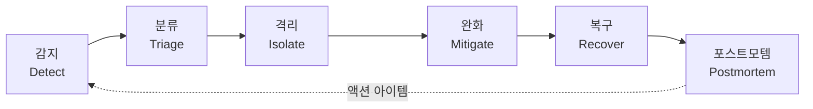
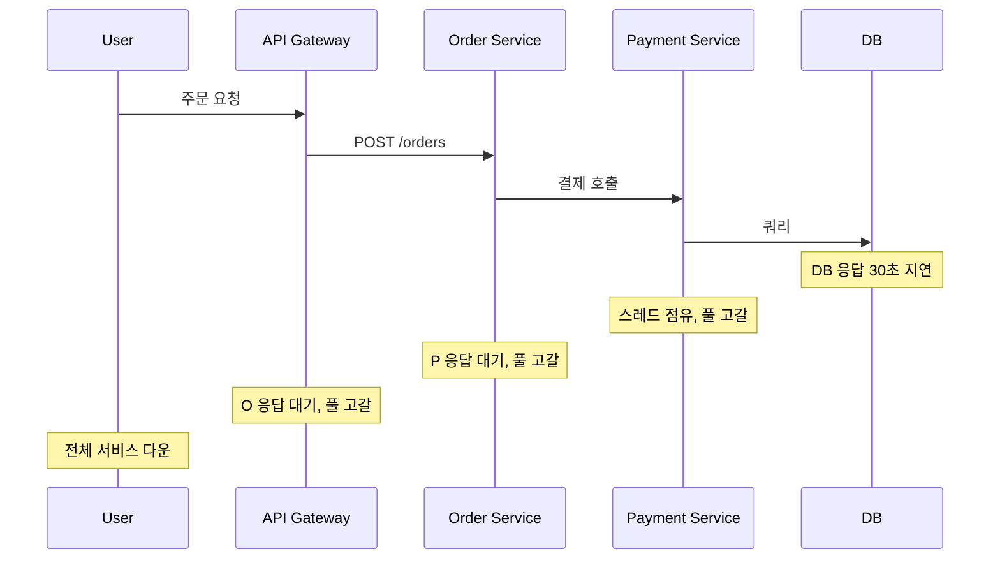

# 마이크로서비스 운영 및 장애 대응 심화 가이드

기존 문서가 로그 수집 위주로 작성되어 있어 실제 장애가 났을 때 해야 할 일을 정리하지 못했다. 이 문서는 인시던트가 터졌을 때 어떻게 움직여야 하는지, 무엇을 미리 준비해 둬야 하는지, 사후에 무엇을 남겨야 하는지를 다룬다. 5년 넘게 MSA 운영을 하면서 겪은 케이스 기반으로 정리한다.

## 인시던트 라이프사이클

장애 대응을 단계로 나눠 보면 항상 같은 흐름을 탄다. 감지(Detect) → 분류(Triage) → 격리(Isolate) → 완화(Mitigate) → 복구(Recover) → 포스트모템(Postmortem). 이 사이클을 머리에 박아 두면 새벽 3시에 PagerDuty가 울려도 다음에 뭘 해야 할지 헤매지 않는다.



각 단계에서 가장 자주 실수하는 부분은 분류와 격리를 건너뛰고 바로 완화로 가는 것이다. 원인을 모르는 상태에서 재기동부터 하면 증거가 사라지고, 같은 장애가 1시간 뒤에 다시 터진다.

### 감지 단계의 함정

감지가 늦으면 대응 시간 전체가 늘어난다. MTTD(Mean Time To Detect)를 줄이는 게 핵심인데, 사용자가 먼저 알려서 감지하는 케이스가 30%를 넘으면 모니터링을 다시 설계해야 한다. 보통 다음 세 가지가 빠져 있다.

- 비즈니스 메트릭 알림이 없다. CPU/메모리만 보고 결제 성공률은 안 본다.
- 외부 의존성(써드파티 API, DB) 알림이 우리 서비스 알림과 분리되어 있어 상관관계 파악이 안 된다.
- 알림 임계치가 너무 높게 잡혀 있어 실제로 사용자가 영향받기 시작할 때 알림이 안 온다.

### 분류와 격리

분류 단계에서는 영향 범위(blast radius)를 빠르게 추정한다. 한 서비스의 한 인스턴스인지, 한 리전 전체인지, 특정 사용자 그룹인지에 따라 격리 방식이 달라진다. 격리는 "장애가 더 퍼지지 않게 막는 것"이지 "고치는 것"이 아니다. 트래픽 라우팅을 끊거나, 비정상 인스턴스를 LB에서 제거하거나, 의존하는 다운스트림 호출을 일시적으로 fallback으로 돌리는 작업이다.

## SLI, SLO, SLA와 에러 버짓

운영의 기준선은 SLI/SLO다. 기준선이 없으면 "느려졌다"가 알림이 되고, 알림이 너무 많아지면 무뎌진다.

### 정의 정리

- **SLI (Service Level Indicator)**: 서비스 품질을 측정하는 지표. 예: 5xx 응답 비율, p99 레이턴시, 가용성
- **SLO (Service Level Objective)**: 내부적으로 약속한 목표치. 예: "지난 30일 동안 5xx 비율 0.1% 이하"
- **SLA (Service Level Agreement)**: 외부 고객과의 계약. SLO보다 보수적으로 잡는다

SLA는 법적 책임이 따르므로 SLO보다 마진을 둬야 한다. 보통 SLA 99.9%면 SLO는 99.95%로 잡는다.

### 에러 버짓 운영

99.9% SLO면 30일 기준 약 43분의 다운타임이 허용된다. 이게 에러 버짓이다. 에러 버짓을 어떻게 쓰느냐가 팀 문화를 만든다.

- 버짓이 남아 있으면 → 새 기능 배포, 실험, 리팩토링 가능
- 버짓을 절반 이상 소진했으면 → 배포 빈도 줄이고 안정화 작업 우선
- 버짓을 다 썼으면 → 신규 배포 동결, 안정화 작업만

이 룰을 명문화하지 않으면 PM이 "이번 주에 꼭 배포해야 한다"고 밀어붙이고 SRE는 매번 진다. 에러 버짓 정책을 조직이 동의해야 의미가 있다.

### Prometheus로 SLO 측정

```yaml
# prometheus/rules/slo.yml
groups:
  - name: payment-service-slo
    interval: 30s
    rules:
      - record: payment:request_total:rate5m
        expr: sum(rate(http_server_requests_seconds_count{service="payment"}[5m]))

      - record: payment:request_errors:rate5m
        expr: sum(rate(http_server_requests_seconds_count{service="payment",status=~"5.."}[5m]))

      - record: payment:availability:ratio_30d
        expr: |
          1 - (
            sum(increase(http_server_requests_seconds_count{service="payment",status=~"5.."}[30d]))
            /
            sum(increase(http_server_requests_seconds_count{service="payment"}[30d]))
          )

      - alert: PaymentSLOBurnRateHigh
        expr: |
          (
            sum(rate(http_server_requests_seconds_count{service="payment",status=~"5.."}[1h]))
            /
            sum(rate(http_server_requests_seconds_count{service="payment"}[1h]))
          ) > (14.4 * 0.001)
        for: 2m
        labels:
          severity: page
        annotations:
          summary: "Payment 서비스 에러 버짓 빠른 소진"
          description: "1시간 burn rate가 14.4배를 넘었다. 2일 안에 30일 버짓을 다 쓴다."
```

Multi-window, multi-burn-rate 알림 패턴이 핵심이다. 짧은 윈도우(1시간)에서 빠른 소진을 감지하고, 긴 윈도우(6시간)에서 느린 소진을 감지한다. 한쪽만 두면 false positive가 늘거나 늦게 감지된다.

## 온콜과 알림 피로도

온콜은 사람을 갈아 넣는 일이라 잘못 설계하면 팀이 무너진다. 매주 한두 명이 새벽에 깨고, 깨어났는데 실제로 할 일이 없으면 다음 주에 그만둔다고 말한다. 알림 피로도(alert fatigue)는 SRE의 가장 큰 적이다.

### 알림 분류 원칙

알림은 세 가지로만 나눈다.

- **Page (즉시 호출)**: 지금 사람이 깨어나서 행동해야 한다. SLO를 깨고 있거나, 깨기 직전이다.
- **Ticket (티켓)**: 다음 영업일에 처리해도 된다. 추세가 나빠지고 있거나, 용량 계획이 필요하다.
- **Log (기록만)**: 사람이 보지 않는다. 사후 분석용으로 남긴다.

CPU 80% 같은 알림은 절대 Page여서는 안 된다. 사용자가 영향받지 않는 알림은 Page에서 빼야 한다. "이 알림이 울리면 내가 뭘 할 수 있는가?"에 답할 수 없으면 그 알림은 만들지 말아야 한다.

### PagerDuty/Opsgenie 설정 패턴

스케줄링은 보통 1주 단위 로테이션에 백업 온콜을 둔다. Primary가 5분 안에 ack 안 하면 Secondary로 에스컬레이션, 다시 5분 후 매니저로 에스컬레이션. 이 시간을 너무 짧게 잡으면 화장실 다녀온 사이에 매니저까지 깨운다.

```yaml
# opsgenie escalation policy 예시 (개념적)
escalation_policy:
  name: payment-team-escalation
  rules:
    - delay: 0m
      target: { type: schedule, name: payment-primary-oncall }
    - delay: 5m
      target: { type: schedule, name: payment-secondary-oncall }
    - delay: 15m
      target: { type: user, name: payment-team-lead }
    - delay: 30m
      target: { type: user, name: engineering-manager }
```

알림 피로도를 측정해야 줄일 수 있다. 매주 다음 지표를 본다.

- 페이지 수 (특히 영업외 시간)
- Actionable rate (실제로 행동을 요했던 페이지 비율)
- 같은 알림의 반복 발생 횟수

Actionable rate가 50% 이하면 알림 룰을 다시 설계해야 한다. 같은 알림이 한 주에 5번 이상 반복되면 자동화 대상이다.

## 런북과 자동화

런북은 "이 알림이 울리면 무엇을 보고 무엇을 해야 하는지" 적어 둔 문서다. 알림에는 반드시 런북 링크가 붙어 있어야 한다. 새벽에 깬 사람이 검색해서 찾게 하면 안 된다.

### 좋은 런북의 구조

```markdown
# Payment Service 5xx 급증 대응

## 알림 의미
1시간 동안 5xx 비율이 SLO 임계치(0.1%)를 14.4배 초과했다.

## 첫 5분 내 확인
1. Grafana 대시보드: https://grafana.internal/d/payment-overview
2. 5xx 응답을 내는 엔드포인트 확인:
   ```
   topk(5, sum by (uri) (rate(http_server_requests_seconds_count{service="payment",status=~"5.."}[5m])))
   ```
3. 최근 1시간 내 배포 확인: kubectl rollout history deployment/payment -n prod

## 가장 흔한 원인
- DB 커넥션 풀 고갈 → 런북 PAY-002
- 외부 PG사 응답 지연 → 런북 PAY-003
- 최근 배포 회귀 → 즉시 롤백 (kubectl rollout undo)

## 완화 조치
[구체적인 명령어]

## 에스컬레이션
30분 내 완화 안 되면 #incident-payment 채널로 IC(Incident Commander) 호출
```

런북에서 같은 작업을 반복적으로 한다면 그건 자동화해야 한다. "DB 커넥션 풀이 고갈됐을 때 인스턴스를 재기동한다"가 매번 나오면 Kubernetes의 liveness probe로 자동화한다.

### 자동화 임계점

자동 복구를 어디까지 허용할지 정해야 한다. 너무 적극적이면 잘못된 판단으로 멀쩡한 서비스를 죽이고, 너무 보수적이면 사람이 새벽마다 깨야 한다. 일반적인 가이드는 다음과 같다.

- 같은 패턴 알림이 분기당 3회 이상 → 자동화 검토
- 자동화 액션은 "롤백, 재기동, 트래픽 차단"처럼 격리/완화 단계만 허용
- 진단/원인 분석은 자동화하지 말고 사람이 한다

## 카나리와 블루그린 롤백 시나리오

배포 시 장애를 줄이는 가장 강력한 도구는 빠른 롤백이다. 롤백이 5분 걸리는 환경에서는 어떤 카나리도 의미가 없다.

### 카나리 자동 롤백

카나리는 신규 버전에 5~10% 트래픽을 보내고 메트릭을 비교한 뒤 점진적으로 늘린다. 메트릭이 나빠지면 자동 롤백.

```yaml
# Argo Rollouts 카나리 예시
apiVersion: argoproj.io/v1alpha1
kind: Rollout
metadata:
  name: payment
spec:
  strategy:
    canary:
      analysis:
        templates:
          - templateName: success-rate
        startingStep: 2
        args:
          - name: service-name
            value: payment
      steps:
        - setWeight: 5
        - pause: { duration: 5m }
        - setWeight: 25
        - pause: { duration: 10m }
        - setWeight: 50
        - pause: { duration: 10m }
        - setWeight: 100
---
apiVersion: argoproj.io/v1alpha1
kind: AnalysisTemplate
metadata:
  name: success-rate
spec:
  args:
    - name: service-name
  metrics:
    - name: success-rate
      interval: 1m
      successCondition: result[0] >= 0.99
      failureLimit: 3
      provider:
        prometheus:
          address: http://prometheus.monitoring:9090
          query: |
            sum(rate(http_server_requests_seconds_count{service="{{args.service-name}}",status!~"5.."}[2m]))
            /
            sum(rate(http_server_requests_seconds_count{service="{{args.service-name}}"}[2m]))
```

자동 롤백 임계치는 보수적으로 잡는다. 잠깐의 노이즈로 자주 롤백되면 배포 자체를 안 하게 된다. 5xx 비율, p99 레이턴시, 비즈니스 메트릭(주문 성공률 등) 세 가지를 모두 봐야 한다.

### 블루그린의 함정

블루그린은 깔끔해 보이지만 실제로는 함정이 많다.

- DB 마이그레이션이 양 버전 모두 호환되어야 한다. 한 번에 컬럼 삭제하면 롤백 불가능
- 캐시가 양쪽으로 분리되어 있으면 cache stampede 위험
- 세션 스티키니스가 걸려 있으면 트래픽 전환이 즉시 안 된다
- 외부 시스템(메시지 큐 컨슈머 그룹) 전환은 자동이 안 된다

블루그린을 쓸 거면 "expand-contract" 패턴으로 스키마를 다룬다. 컬럼 추가는 신버전 배포 전, 컬럼 삭제는 구버전 트래픽이 0이 된 후 충분히 지나서.

## 카스케이딩 장애와 격리

MSA에서 가장 무서운 건 한 서비스의 문제가 다른 서비스로 전파되는 카스케이딩 장애다. 다운스트림 서비스가 느려지면 업스트림의 스레드가 점유되고, 그게 또 다른 업스트림으로 퍼진다.



이걸 막는 패턴이 Bulkhead와 Circuit Breaker다.

### Bulkhead 동작 점검

Bulkhead는 리소스를 격리해서 한 부분의 문제가 다른 부분으로 번지지 않게 한다. 스레드 풀이나 세마포어로 구현한다.

```java
// Resilience4j Bulkhead
@Bulkhead(name = "paymentService", type = Bulkhead.Type.THREADPOOL,
          fallbackMethod = "paymentFallback")
public CompletableFuture<PaymentResult> processPayment(PaymentRequest req) {
    return CompletableFuture.supplyAsync(() -> paymentClient.process(req));
}

public CompletableFuture<PaymentResult> paymentFallback(PaymentRequest req, Throwable t) {
    log.warn("Payment fallback triggered: {}", t.getMessage());
    return CompletableFuture.completedFuture(PaymentResult.deferred(req.getId()));
}
```

```yaml
# application.yml
resilience4j:
  thread-pool-bulkhead:
    instances:
      paymentService:
        max-thread-pool-size: 20
        core-thread-pool-size: 10
        queue-capacity: 50
        keep-alive-duration: 20ms
```

Bulkhead가 동작하는지 확인하려면 부하 테스트로 의도적으로 한 의존성에 지연을 주입해 보고, 다른 엔드포인트가 영향을 받지 않는지 확인해야 한다. 이걸 안 하면 설정만 해 두고 실제로는 격리 안 되는 케이스를 놓친다.

### Circuit Breaker 상태 모니터링

Circuit Breaker는 CLOSED → OPEN → HALF_OPEN 상태를 오간다. 이 상태 변화가 알림에 잡혀야 한다.

```java
@Configuration
public class CircuitBreakerConfig {

    @Bean
    public CircuitBreakerRegistry circuitBreakerRegistry(MeterRegistry meterRegistry) {
        CircuitBreakerConfig config = CircuitBreakerConfig.custom()
            .slidingWindowType(SlidingWindowType.COUNT_BASED)
            .slidingWindowSize(100)
            .failureRateThreshold(50)
            .slowCallRateThreshold(50)
            .slowCallDurationThreshold(Duration.ofSeconds(2))
            .waitDurationInOpenState(Duration.ofSeconds(30))
            .permittedNumberOfCallsInHalfOpenState(10)
            .minimumNumberOfCalls(20)
            .build();

        CircuitBreakerRegistry registry = CircuitBreakerRegistry.of(config);

        TaggedCircuitBreakerMetrics.ofCircuitBreakerRegistry(registry)
            .bindTo(meterRegistry);

        registry.getEventPublisher()
            .onEntryAdded(entry -> {
                CircuitBreaker cb = entry.getAddedEntry();
                cb.getEventPublisher().onStateTransition(event -> {
                    log.warn("CircuitBreaker {} state transition: {} -> {}",
                        cb.getName(),
                        event.getStateTransition().getFromState(),
                        event.getStateTransition().getToState());
                });
            });

        return registry;
    }
}
```

Prometheus 알림 룰:

```yaml
- alert: CircuitBreakerOpen
  expr: resilience4j_circuitbreaker_state{state="open"} == 1
  for: 1m
  labels:
    severity: page
  annotations:
    summary: "Circuit breaker {{ $labels.name }} 가 OPEN 상태"
    runbook: "https://wiki.internal/runbooks/cb-open"
```

Circuit Breaker가 한 번 OPEN되는 것은 정상이다(그게 일이니까). 문제는 자주 OPEN되거나 OPEN 상태에서 못 빠져나오는 경우다. failureRateThreshold가 너무 낮으면 노이즈로도 OPEN되고, waitDurationInOpenState가 너무 짧으면 다운스트림이 회복할 시간을 안 준다.

## 분산 추적 기반 RCA

장애 원인 분석(Root Cause Analysis)에서 분산 추적은 결정적이다. 한 요청이 10개 서비스를 거치는 환경에서 어디가 느린지 로그만으로 찾는 건 불가능하다.

### 추적 데이터로 RCA하는 순서

1. 영향받은 사용자/요청의 trace ID를 확보한다 (에러 응답에 X-Trace-Id 헤더로 노출)
2. Jaeger/Tempo에서 trace를 펼친다
3. 가장 시간을 많이 쓴 span을 찾는다
4. 그 span의 자식 span을 펼쳐서 원인이 자기 자신인지 다운스트림인지 본다
5. 같은 시간대에 비슷한 패턴의 trace가 더 있는지 확인한다 (단발성인지 시스템적인지 판별)

trace ID가 응답에 안 들어 있으면 사용자 신고를 받았을 때 추적을 못 한다. API Gateway에서 모든 응답에 trace ID를 박는 것은 운영 필수다.

### Spring Boot에서 trace ID 노출

```java
@Component
public class TraceIdResponseFilter extends OncePerRequestFilter {

    @Override
    protected void doFilterInternal(HttpServletRequest req, HttpServletResponse res,
                                     FilterChain chain) throws ServletException, IOException {
        Span currentSpan = Span.current();
        if (currentSpan != null && currentSpan.getSpanContext().isValid()) {
            res.setHeader("X-Trace-Id", currentSpan.getSpanContext().getTraceId());
        }
        chain.doFilter(req, res);
    }
}
```

## 포스트모템

장애가 끝나면 가장 중요한 건 포스트모템이다. 비난 없는(blameless) 포스트모템이어야 솔직하게 쓴다. "누가 잘못했는가"가 아니라 "어떤 시스템적 원인이 사람이 그 결정을 하게 만들었는가"를 본다.

### 포스트모템 템플릿

```markdown
# Payment Service Outage 2026-04-15

## 요약
- 발생: 2026-04-15 14:23 KST
- 복구: 2026-04-15 15:08 KST
- 영향 시간: 45분
- 영향 범위: 결제 요청의 약 60%가 5xx 응답
- 추정 영향 매출: 약 1,200만원
- Severity: SEV-2

## 타임라인 (KST)
- 14:23 - DB 커넥션 풀 고갈 알림 발생
- 14:25 - Primary 온콜 ack
- 14:31 - 분산 추적에서 외부 PG사 호출 응답 시간 30초로 확인
- 14:38 - PG사 fallback으로 트래픽 전환 시도, 회로 차단기 OPEN 확인
- 14:52 - PG사 측 인시던트 확인, 재시도 정책 비활성화
- 15:08 - 정상 응답률 99% 회복

## 근본 원인
외부 PG사 응답 지연(30초)이 발생했고, 우리 측 retry 정책이 지수 백오프 없이
즉시 3회 재시도하도록 되어 있어 retry storm이 발생했다. 결과적으로 PG사 호출용
스레드 풀이 고갈되었고, 동기 호출이 DB 커넥션을 점유한 채 대기하면서
DB 커넥션 풀까지 고갈되었다.

## 무엇이 잘 됐나
- 알림이 SLO 위반 즉시 발생
- 분산 추적으로 8분 만에 원인 식별
- 카나리 배포 덕분에 문제 인지 후 즉시 격리 가능

## 무엇이 안 됐나
- Retry 정책에 백오프와 jitter가 빠져 있었음
- PG사 호출에 Bulkhead가 없어 다른 결제 메서드까지 영향
- 런북에 PG사 장애 시나리오가 없어 IC가 즉석에서 판단

## 액션 아이템
| ID | 항목 | 담당 | 우선순위 | 마감 |
|----|------|------|---------|------|
| AI-1 | Resilience4j retry에 exponential backoff + jitter 적용 | @kim | P0 | 2026-04-22 |
| AI-2 | PG사별 Bulkhead 분리 | @lee | P1 | 2026-05-06 |
| AI-3 | PG사 장애 시나리오 런북 작성 | @park | P1 | 2026-04-29 |
| AI-4 | PG사 응답 시간 SLO 별도 측정 추가 | @kim | P2 | 2026-05-13 |
```

### 액션 아이템 추적

포스트모템에서 가장 자주 실패하는 부분이 액션 아이템 후속 조치다. 적어 놓고 까먹는다. JIRA나 Linear에 별도 라벨(`postmortem-action`)로 묶고, 매주 SRE 위클리에서 진행 상황을 본다. 60일 넘게 미해결이면 우선순위 재논의.

## 부하 테스트와 capacity planning

운영 중인 서비스의 한계를 모르면 트래픽이 두 배 들어왔을 때 어떻게 될지 예측할 수 없다.

### 부하 테스트 시나리오

세 가지 시나리오를 돌린다.

- **Smoke test**: 매 배포 후 가벼운 부하로 정상 동작 확인
- **Load test**: 예상 피크 트래픽의 1.5배로 SLO 유지되는지 확인
- **Stress test**: 시스템이 무너지는 지점을 찾기 위해 점진적으로 부하 증가

```javascript
// k6 부하 테스트 예시
import http from 'k6/http';
import { check, sleep } from 'k6';

export const options = {
  stages: [
    { duration: '2m', target: 100 },   // ramp-up
    { duration: '5m', target: 100 },   // 정상 부하
    { duration: '2m', target: 500 },   // 피크
    { duration: '5m', target: 500 },   // 피크 유지
    { duration: '5m', target: 1000 },  // stress
    { duration: '3m', target: 0 },     // ramp-down
  ],
  thresholds: {
    http_req_duration: ['p(95)<500', 'p(99)<2000'],
    http_req_failed: ['rate<0.01'],
  },
};

export default function () {
  const res = http.post('https://api.staging/orders', JSON.stringify({
    productId: 'P-1234',
    quantity: 1,
  }), {
    headers: { 'Content-Type': 'application/json' },
  });

  check(res, {
    'status is 200': (r) => r.status === 200,
    'response time < 500ms': (r) => r.timings.duration < 500,
  });

  sleep(1);
}
```

### Capacity planning

부하 테스트 결과를 바탕으로 다음을 계산한다.

- 인스턴스당 처리 가능 RPS
- 현재 트래픽 대비 헤드룸(보통 50% 이상 권장)
- 자동 스케일링 임계치와 최대 인스턴스 수
- DB 커넥션 풀 크기 (인스턴스 수 × 풀 크기 < DB max_connections × 0.7)

DB 커넥션 풀 계산은 의외로 자주 틀린다. 인스턴스가 50개고 풀이 20이면 1000개의 커넥션이 필요한데, RDS 인스턴스 max_connections가 1000이면 다른 서비스/배치가 못 쓴다.

## 장애 시 통신 프로토콜

기술적 대응만큼 중요한 게 커뮤니케이션이다. 잘못 새어 나간 한 마디가 나중에 신뢰 문제로 돌아온다.

### Incident Commander 역할

장애가 SEV-2 이상이면 IC를 명시적으로 지정한다. IC는 직접 디버깅하지 않는다. 다음을 한다.

- 누가 무엇을 하는지 조율
- 외부 커뮤니케이션 (CS팀, 경영진)
- 5~10분마다 진행 상황 업데이트
- 장애 종료 선언

엔지니어가 IC를 겸하면 디버깅에 집중하지 못해 둘 다 못한다.

### Slack 인시던트 채널 운영

장애별로 임시 채널(#incident-2026-04-15-payment)을 만들고 모든 의사결정과 시도를 기록한다. DM이나 음성 통화로 결정하면 나중에 포스트모템 작성이 불가능하다.

채널 명명 규칙, 자동 채널 생성, IC 봇 같은 도구는 incident.io나 Rootly 같은 SaaS로 자동화하거나 사내 봇으로 만들어 둔다.

### Statuspage 업데이트

외부 사용자에게 보이는 statuspage는 다음 원칙으로 업데이트한다.

- 5분 안에 첫 공지 (정확한 원인을 모르더라도 "조사 중" 공지)
- 30분마다 업데이트
- 추측하지 않고 사실만 (원인을 모르면 "조사 중"으로 둔다)
- 복구 후 RCA 요약 공지 (보통 24~48시간 후)

"DB 문제로 보입니다"라고 추측해서 올렸다가 실제로는 네트워크 문제였던 적이 있다. 사용자는 그걸 기억하고 다음에 비슷한 공지가 올라오면 안 믿는다.

## 실제 장애 케이스 분석

### 케이스 1: DB 커넥션 풀 고갈

증상: 갑자기 5xx 급증, 헬스체크는 통과, 로그에 "could not get connection from pool" 에러.

원인: 새로 추가된 엔드포인트에서 트랜잭션을 닫지 않고 있었다. `@Transactional` 메서드 내부에서 외부 API를 호출하고 있어, 외부 API가 느려질 때 트랜잭션이 길어지고 커넥션이 반환되지 않았다.

```java
// 잘못된 패턴
@Transactional
public Order createOrder(OrderRequest req) {
    Order order = orderRepository.save(req.toOrder());
    PaymentResult result = paymentClient.process(order);  // 외부 호출이 트랜잭션 안에서
    order.markPaid(result.getId());
    return order;
}

// 수정 후
public Order createOrder(OrderRequest req) {
    Order order = saveOrder(req);
    PaymentResult result = paymentClient.process(order);  // 트랜잭션 밖
    return updateOrderPayment(order.getId(), result);
}

@Transactional
protected Order saveOrder(OrderRequest req) {
    return orderRepository.save(req.toOrder());
}

@Transactional
protected Order updateOrderPayment(Long orderId, PaymentResult result) {
    Order order = orderRepository.findById(orderId).orElseThrow();
    order.markPaid(result.getId());
    return order;
}
```

교훈: 트랜잭션 안에서 외부 호출 금지. HikariCP의 `leakDetectionThreshold`를 설정해 두면 이런 케이스를 사전에 잡을 수 있다.

### 케이스 2: 메모리 누수

증상: 매일 새벽 3시쯤 OOM으로 인스턴스 재기동, 점진적인 메모리 증가 패턴.

원인: 로컬 캐시(Caffeine)에 사용자별 세션 객체를 캐싱했는데 TTL을 안 걸었다. 사용자가 늘면서 캐시가 무한 증가.

해결: `expireAfterAccess`와 `maximumSize` 설정 추가. 운영 중에는 힙 덤프를 떠서 어떤 객체가 메모리를 차지하는지 확인하는 게 가장 빠르다.

```java
Cache<String, UserSession> cache = Caffeine.newBuilder()
    .maximumSize(10_000)
    .expireAfterAccess(Duration.ofMinutes(30))
    .recordStats()
    .build();

// Micrometer 연동
CaffeineCacheMetrics.monitor(meterRegistry, cache, "user-session-cache");
```

교훈: 모든 캐시는 크기 제한과 만료 정책이 있어야 한다. JVM 인스턴스의 힙 사용량을 시계열로 보고, 우상향 패턴이면 누수를 의심한다.

### 케이스 3: 다운스트림 지연 전파

증상: A 서비스가 느려지자 B, C, D 서비스까지 모두 느려지면서 전체 응답 시간 증가.

원인: 서비스 간 호출에 타임아웃이 없거나 너무 길었다. A가 30초 걸리면 B의 스레드가 30초 동안 점유되고, B를 호출하는 C도 마찬가지.

```java
// 클라이언트 타임아웃 설정 (WebClient)
@Bean
public WebClient paymentWebClient() {
    HttpClient httpClient = HttpClient.create()
        .responseTimeout(Duration.ofSeconds(3))
        .option(ChannelOption.CONNECT_TIMEOUT_MILLIS, 1000)
        .doOnConnected(conn -> conn
            .addHandlerLast(new ReadTimeoutHandler(3))
            .addHandlerLast(new WriteTimeoutHandler(3)));

    return WebClient.builder()
        .clientConnector(new ReactorClientHttpConnector(httpClient))
        .baseUrl("http://payment-service")
        .build();
}
```

타임아웃은 다운스트림의 p99 레이턴시 + 마진 정도로 잡는다. 다운스트림이 응답해도 의미 없는 시간(예: 사용자가 이미 페이지를 떠난 후)이 지나면 타임아웃하는 게 맞다.

교훈: 모든 외부 호출(서비스 간, DB, 캐시, 외부 API)에 타임아웃을 명시한다. 기본값 무한 대기는 운영에서 절대 안 된다.

### 케이스 4: Retry storm

증상: 다운스트림이 살짝 느려졌을 뿐인데 다운스트림 부하가 5배 증가하면서 완전히 죽음.

원인: 모든 인스턴스가 같은 retry 정책(즉시 3회 재시도)을 갖고 있어, 다운스트림이 느려지면 동시에 모두 재시도. 다운스트림 부하가 N배(N=재시도 횟수+1)로 폭증.

해결: Exponential backoff + jitter.

```java
RetryConfig config = RetryConfig.custom()
    .maxAttempts(3)
    .intervalFunction(IntervalFunction.ofExponentialRandomBackoff(
        Duration.ofMillis(500),  // 초기 대기
        2.0,                      // 배수
        0.5                       // jitter
    ))
    .retryOnException(ex -> ex instanceof IOException)
    .retryOnResult(response -> ((HttpResponse) response).statusCode() >= 500)
    .build();

Retry retry = Retry.of("payment-call", config);
```

추가로 retry budget(전체 호출 중 최대 N%만 재시도) 패턴을 적용하면 더 안전하다. Envoy/Istio에서 제공하는 retry budget 설정을 활용할 수 있다.

교훈: Retry는 항상 백오프와 jitter를 함께. 멱등하지 않은 작업에는 retry 금지(중복 결제 사고).

## Spring Boot Actuator 헬스체크 커스터마이징

Kubernetes liveness/readiness probe는 헬스체크 엔드포인트의 정확성에 의존한다. 잘못 만들면 멀쩡한 인스턴스가 죽거나, 죽은 인스턴스로 트래픽이 간다.

### Liveness vs Readiness

- **Liveness**: "이 프로세스가 살아 있는가" - 실패하면 컨테이너 재기동
- **Readiness**: "이 프로세스가 트래픽을 받을 준비가 됐는가" - 실패하면 LB에서 제외

Liveness에 DB 체크를 넣으면 안 된다. DB 일시 장애로 모든 인스턴스가 재기동되면서 더 큰 장애가 된다. Liveness는 프로세스 자체의 데드락이나 OOM 같은 회복 불가능한 상태만 체크해야 한다.

### Spring Boot 설정

```yaml
# application.yml
management:
  endpoint:
    health:
      probes:
        enabled: true
      group:
        liveness:
          include: livenessState
        readiness:
          include: readinessState, db, redis, externalPg
  health:
    livenessstate:
      enabled: true
    readinessstate:
      enabled: true
```

```java
@Component
public class ExternalPgHealthIndicator implements HealthIndicator {

    private final PaymentGatewayClient client;
    private final CircuitBreaker circuitBreaker;

    @Override
    public Health health() {
        if (circuitBreaker.getState() == CircuitBreaker.State.OPEN) {
            return Health.outOfService()
                .withDetail("reason", "Circuit breaker OPEN")
                .build();
        }

        try {
            boolean ok = client.ping();
            return ok ? Health.up().build()
                      : Health.down().withDetail("reason", "ping failed").build();
        } catch (Exception e) {
            return Health.down(e).build();
        }
    }
}
```

### Kubernetes probe 설정

```yaml
spec:
  containers:
    - name: payment
      livenessProbe:
        httpGet:
          path: /actuator/health/liveness
          port: 8080
        initialDelaySeconds: 60
        periodSeconds: 10
        timeoutSeconds: 3
        failureThreshold: 3
      readinessProbe:
        httpGet:
          path: /actuator/health/readiness
          port: 8080
        initialDelaySeconds: 20
        periodSeconds: 5
        timeoutSeconds: 3
        failureThreshold: 2
      startupProbe:
        httpGet:
          path: /actuator/health/liveness
          port: 8080
        periodSeconds: 10
        failureThreshold: 30  # 5분간 시작 시간 허용
```

`startupProbe`를 따로 두는 게 핵심이다. JVM 워밍업에 1~2분 걸리는 서비스에 liveness `initialDelaySeconds`를 길게 잡으면 실제 운영 중 회복 시간이 늘어난다. startupProbe로 시작을 봐주고, 시작 후에는 liveness를 짧은 주기로 본다.

`failureThreshold`도 중요하다. 너무 낮으면 일시적 GC 멈춤으로 컨테이너가 죽고, 너무 높으면 진짜 죽었을 때 회복이 늦다. 보통 liveness는 3, readiness는 2.

## Resilience4j 메트릭 노출

Resilience4j의 모든 컴포넌트는 Micrometer로 메트릭을 노출할 수 있다. 이걸 안 하면 Circuit Breaker가 OPEN되어도 모른다.

```java
@Configuration
public class ResilienceMetricsConfig {

    @Bean
    public TaggedCircuitBreakerMetrics circuitBreakerMetrics(
            CircuitBreakerRegistry registry, MeterRegistry meterRegistry) {
        TaggedCircuitBreakerMetrics metrics =
            TaggedCircuitBreakerMetrics.ofCircuitBreakerRegistry(registry);
        metrics.bindTo(meterRegistry);
        return metrics;
    }

    @Bean
    public TaggedRetryMetrics retryMetrics(
            RetryRegistry registry, MeterRegistry meterRegistry) {
        TaggedRetryMetrics metrics = TaggedRetryMetrics.ofRetryRegistry(registry);
        metrics.bindTo(meterRegistry);
        return metrics;
    }

    @Bean
    public TaggedBulkheadMetrics bulkheadMetrics(
            BulkheadRegistry registry, MeterRegistry meterRegistry) {
        TaggedBulkheadMetrics metrics = TaggedBulkheadMetrics.ofBulkheadRegistry(registry);
        metrics.bindTo(meterRegistry);
        return metrics;
    }
}
```

노출되는 주요 메트릭과 그라파나 대시보드에 꼭 그려야 할 것들:

- `resilience4j_circuitbreaker_state`: 상태(closed/open/half_open)
- `resilience4j_circuitbreaker_calls`: 성공/실패/slow 호출 수
- `resilience4j_circuitbreaker_failure_rate`: 실패율
- `resilience4j_retry_calls`: 재시도 횟수
- `resilience4j_bulkhead_available_concurrent_calls`: 사용 가능한 슬롯 수

특히 `available_concurrent_calls`가 0에 가까워지는 패턴은 곧 격리가 발동한다는 신호다. 이걸 알림으로 잡으면 본격적인 장애 전에 대응할 수 있다.

## 운영을 잘하기 위한 마음가짐

기술적 도구를 다 갖춰도 운영 문화가 없으면 장애는 반복된다. 마지막으로 몇 가지.

비난 없는 문화. 사람이 잘못한 게 아니라 시스템이 그 실수를 허용한 거다. "왜 그 사람이 그 결정을 했을까"를 물어야 한다.

작게 자주 배포. 한 번에 큰 변경을 배포하면 문제가 생겼을 때 원인을 찾기 어렵다. 작은 변경을 자주 배포하면 회귀를 빨리 찾는다.

장애 훈련. 분기에 한 번씩 game day를 한다. 의도적으로 인스턴스를 죽이거나 네트워크 지연을 주입하고 팀이 대응하는 걸 본다. Chaos Engineering까지 안 가더라도, 런북이 실제로 동작하는지 확인하는 시간을 가져야 한다.

지표를 측정한다. MTTD, MTTR, 알림 actionable rate, 에러 버짓 소진율. 측정하지 않으면 개선됐는지 모른다.
