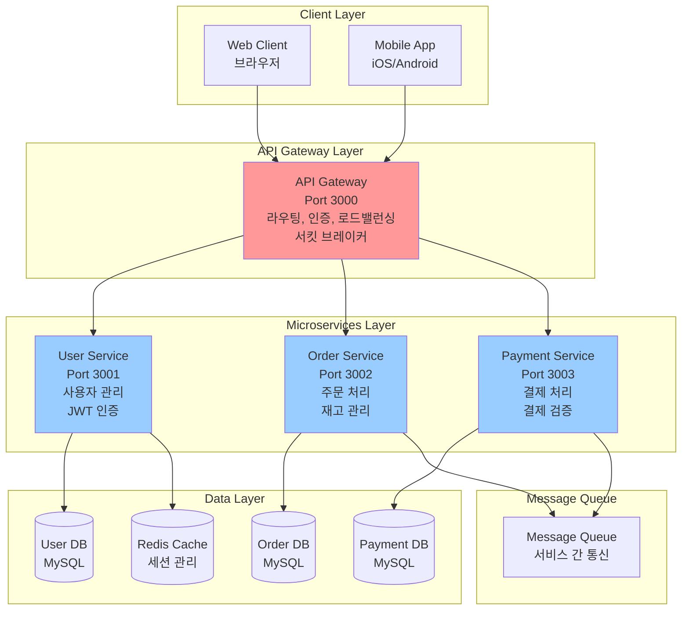

# 마이크로서비스 아키텍처 실습 프로젝트

## 📋 프로젝트 개요

이 프로젝트는 Node.js 기반의 마이크로서비스 아키텍처를 실습하기 위한 완전한 예제입니다. 
전자상거래 플랫폼을 모델로 하여 사용자 관리, 주문 처리, 결제 서비스를 분리된 마이크로서비스로 구현합니다.

## 🏗️ 아키텍처 구성

### 마이크로서비스 아키텍처 다이어그램



### 기존 ASCII 다이어그램

```
┌─────────────────┐    ┌─────────────────┐    ┌─────────────────┐
│   API Gateway   │    │   User Service  │    │  Order Service  │
│    (Port 3000)  │    │   (Port 3001)   │    │   (Port 3002)   │
└─────────────────┘    └─────────────────┘    └─────────────────┘
         │                       │                       │
         └───────────────────────┼───────────────────────┘
                                 │
                    ┌─────────────────┐
                    │ Payment Service │
                    │   (Port 3003)   │
                    └─────────────────┘
```

## 🚀 서비스 구성

### 1. API Gateway (포트: 3000)
- 모든 클라이언트 요청의 진입점
- 라우팅 및 로드밸런싱
- 인증 및 인가 처리
- 서킷 브레이커 패턴 적용

### 2. User Service (포트: 3001)
- 사용자 등록, 로그인, 프로필 관리
- JWT 토큰 기반 인증
- 사용자 데이터 관리

### 3. Order Service (포트: 3002)
- 주문 생성, 조회, 수정, 취소
- 주문 상태 관리
- 재고 확인 및 관리

### 4. Payment Service (포트: 3003)
- 결제 처리 및 검증
- 결제 내역 관리
- 결제 상태 추적

## 🔧 기술 스택

- **Runtime**: Node.js 18+
- **Framework**: Express.js
- **Database**: MongoDB (각 서비스별 독립)
- **Message Queue**: Redis Pub/Sub
- **Service Communication**: gRPC, HTTP REST
- **Authentication**: JWT
- **Containerization**: Docker & Docker Compose
- **Monitoring**: Winston (로깅)

## 📁 프로젝트 구조

```
microservices-practice-project/
├── api-gateway/           # API Gateway 서비스
├── user-service/          # 사용자 관리 서비스
├── order-service/         # 주문 관리 서비스
├── payment-service/       # 결제 처리 서비스
├── shared/               # 공통 라이브러리
│   ├── proto/           # gRPC 프로토콜 버퍼
│   ├── utils/           # 공통 유틸리티
│   └── types/           # TypeScript 타입 정의
├── docker-compose.yml    # 전체 스택 실행 환경
└── README.md
```

## 🛠️ 설치 및 실행

### 1. 의존성 설치
```bash
# 각 서비스별로 의존성 설치
cd api-gateway && npm install
cd ../user-service && npm install
cd ../order-service && npm install
cd ../payment-service && npm install
```

### 2. 환경 변수 설정
```bash
# .env 파일을 각 서비스 디렉토리에 복사하고 설정
cp .env.example .env
```

### 3. Docker Compose로 전체 스택 실행
```bash
# 전체 서비스 및 인프라 실행
docker-compose up -d

# 로그 확인
docker-compose logs -f
```

### 4. 개별 서비스 실행 (개발 모드)
```bash
# 각 터미널에서 개별 실행
npm run dev:gateway
npm run dev:user
npm run dev:order
npm run dev:payment
```

## 🧪 API 테스트

### 사용자 등록
```bash
curl -X POST http://localhost:3000/api/users/register \
  -H "Content-Type: application/json" \
  -d '{
    "email": "user@example.com",
    "password": "password123",
    "name": "John Doe"
  }'
```

### 주문 생성
```bash
curl -X POST http://localhost:3000/api/orders \
  -H "Content-Type: application/json" \
  -H "Authorization: Bearer YOUR_JWT_TOKEN" \
  -d '{
    "items": [
      {
        "productId": "product-1",
        "quantity": 2,
        "price": 29.99
      }
    ],
    "shippingAddress": {
      "street": "123 Main St",
      "city": "Seoul",
      "zipCode": "12345"
    }
  }'
```

### 결제 처리
```bash
curl -X POST http://localhost:3000/api/payments \
  -H "Content-Type: application/json" \
  -H "Authorization: Bearer YOUR_JWT_TOKEN" \
  -d '{
    "orderId": "order-123",
    "amount": 59.98,
    "paymentMethod": "credit_card",
    "cardDetails": {
      "number": "4111111111111111",
      "expiry": "12/25",
      "cvv": "123"
    }
  }'
```

## 📊 모니터링 및 로깅

- **API Gateway**: 모든 요청/응답 로깅
- **각 서비스**: 비즈니스 로직 및 에러 로깅
- **Redis**: 메시지 큐 상태 모니터링
- **MongoDB**: 데이터베이스 연결 상태 확인

## 🔄 서비스 간 통신

### 1. HTTP REST API
- 동기적 통신
- 서비스 간 직접 호출
- JSON 기반 데이터 교환

### 2. gRPC
- 고성능 이진 프로토콜
- 스트리밍 지원
- 강타입 인터페이스

### 3. Redis Pub/Sub
- 비동기 이벤트 처리
- 이벤트 기반 아키텍처
- 서비스 간 느슨한 결합

## 🛡️ 보안 및 인증

- JWT 토큰 기반 인증
- API Gateway에서 중앙 집중식 인증
- 서비스 간 통신 시 토큰 검증
- HTTPS 통신 (프로덕션 환경)

## 📈 확장성 고려사항

- 수평적 확장 지원
- 로드밸런싱
- 서킷 브레이커 패턴
- 헬스체크 엔드포인트
- 메트릭 수집

## 🐛 문제 해결

### 일반적인 문제들

1. **포트 충돌**: 각 서비스가 다른 포트를 사용하는지 확인
2. **데이터베이스 연결**: MongoDB가 실행 중인지 확인
3. **Redis 연결**: Redis 서버가 실행 중인지 확인
4. **환경 변수**: .env 파일이 올바르게 설정되었는지 확인

### 로그 확인
```bash
# 특정 서비스 로그 확인
docker-compose logs -f user-service

# 모든 서비스 로그 확인
docker-compose logs -f
```

## 📚 학습 목표

이 프로젝트를 통해 다음을 학습할 수 있습니다:

1. **마이크로서비스 아키텍처 설계**
2. **서비스 간 통신 패턴**
3. **API Gateway 패턴**
4. **서킷 브레이커 패턴**
5. **이벤트 기반 아키텍처**
6. **Docker 컨테이너화**
7. **분산 시스템 모니터링**

## 🔗 관련 문서

- [마이크로서비스 운영 및 장애 대응 가이드](../마이크로서비스_운영_및_장애_대응_가이드.md)
- [멀티레포 vs 모노레포 비교](../멀티%20레포.md)
- [시스템 설계 및 아키텍처 패턴 가이드](../시스템_설계_및_아키텍처_패턴_가이드.md)
