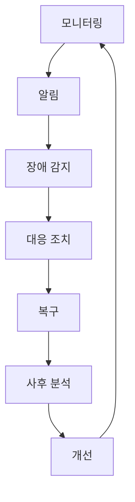
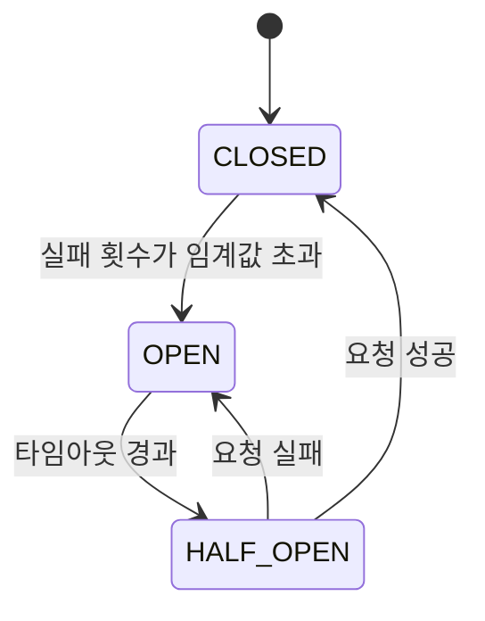

# 마이크로서비스 운영 및 장애 대응

## 📋 목차
1. [마이크로서비스 운영 개요](#마이크로서비스-운영-개요)
2. [서킷 브레이커 패턴 구현](#서킷-브레이커-패턴-구현)
3. [분산 추적 및 로그 집계](#분산-추적-및-로그-집계)
4. [모니터링 및 메트릭 수집](#모니터링-및-메트릭-수집)
5. [장애 전파 방지 및 격리 전략](#장애-전파-방지-및-격리-전략)
6. [무중단 배포 전략](#무중단-배포-전략)
7. [실제 장애 사례 분석 및 대응 방법](#실제-장애-사례-분석-및-대응-방법)
8. [SLI/SLO/SLA 기반 안정성 관리](#slislosla-기반-안정성-관리)

### 📌 통합된 기존 파일들
이 문서는 다음 기존 파일들의 내용을 통합하여 정리한 것입니다:
- **MSA 아키텍처**: 마이크로서비스 설계 원칙, 서비스 간 통신, 서킷 브레이커 기본 구현
- **무중단 배포**: Blue-Green 배포 전략, 트래픽 전환, 롤백 방법
- **분산 추적**: OpenTelemetry 기반 분산 추적, 트레이스 수집 및 분석
- **서비스 메시**: Istio 기반 관찰 가능성, 메트릭 수집, 로그 집계
- **벌크헤드**: 장애 격리 전략, 리소스 분리, 스레드 풀 관리
- **시스템 설계**: Circuit Breaker 패턴, 장애 대응 전략

---

## 마이크로서비스 운영 개요

마이크로서비스 운영은 분산 시스템의 복잡성을 관리하고, 장애 상황에서 신속한 대응을 위한 체계적인 접근 방식입니다. 단일 모놀리식 아키텍처와 달리, 마이크로서비스는 독립적으로 배포 가능한 여러 서비스로 구성되어 있어 각 서비스의 상태를 실시간으로 모니터링하고 관리하는 것이 중요합니다.

### 운영의 핵심 목표

#### 1. 가용성 (Availability)
99.9% 이상의 서비스 가용성을 유지하는 것이 목표입니다. 이는 연간 약 8.76시간의 다운타임만 허용된다는 의미입니다.

**가용성 계산법:**
```
가용성(%) = (전체 시간 - 다운타임) / 전체 시간 × 100

예시:
- 99.9% (Three 9s): 연간 8.76시간 다운타임
- 99.99% (Four 9s): 연간 52.56분 다운타임
- 99.999% (Five 9s): 연간 5.26분 다운타임
```

**가용성 향상 전략:**
- 다중 가용 영역(Multi-AZ) 배포
- 자동 장애 조치(Auto Failover)
- 헬스체크 및 자동 복구
- 서킷 브레이커 패턴 적용

#### 2. 안정성 (Reliability)
장애 상황에서의 신속한 복구와 데이터 일관성 유지가 핵심입니다.

**안정성 지표:**
- MTBF (Mean Time Between Failures): 평균 장애 간격
- MTTR (Mean Time To Recovery): 평균 복구 시간
- Error Budget: 허용 가능한 오류 범위

#### 3. 관찰 가능성 (Observability)
시스템 상태의 실시간 모니터링과 문제 진단 능력을 의미합니다.

**관찰 가능성의 3대 요소:**
- **Metrics (메트릭)**: 수치화된 시스템 성능 지표
- **Logs (로그)**: 시스템 이벤트 및 오류 기록
- **Traces (추적)**: 요청의 전체 흐름 추적

#### 4. 확장성 (Scalability)
트래픽 증가에 따라 시스템 성능을 유지하면서 처리 용량을 늘릴 수 있는 능력입니다.

**확장 전략:**
- 수평 확장 (Horizontal Scaling): 서버 대수 증가
- 수직 확장 (Vertical Scaling): 서버 성능 향상
- 자동 스케일링 (Auto Scaling): 부하에 따른 자동 조정

### 운영 모델

마이크로서비스 운영은 지속적인 개선 사이클을 따릅니다:



**각 단계별 세부 활동:**

1. **모니터링**: 메트릭 수집, 로그 집계, 분산 추적
2. **알림**: 임계값 기반 알림, 이상 징후 탐지
3. **장애 감지**: 헬스체크, 서비스 메시 모니터링
4. **대응 조치**: 자동 복구, 수동 개입, 트래픽 전환
5. **복구**: 서비스 재시작, 롤백, 스케일 아웃
6. **사후 분석**: 근본 원인 분석, 타임라인 재구성
7. **개선**: 프로세스 개선, 자동화 강화, 문서화

### 운영 성숙도 모델

마이크로서비스 운영의 성숙도는 다음 단계로 발전합니다:

| 레벨 | 단계 | 특징 | 주요 활동 |
|------|------|------|-----------|
| 0 | 수동 운영 | 수동 배포, 사후 대응 | 기본 모니터링 구축 |
| 1 | 자동화 시작 | CI/CD 파이프라인 구축 | 자동화된 배포 프로세스 |
| 2 | 능동적 모니터링 | 알림 시스템, 로그 집계 | 실시간 모니터링 대시보드 |
| 3 | 예측적 운영 | 이상 징후 탐지, 자동 복구 | 머신러닝 기반 예측 |
| 4 | 자율 운영 | 자가 치유, 자동 최적화 | 완전 자동화된 운영 |

---

## 서킷 브레이커 패턴 구현

서킷 브레이커는 외부 서비스 호출 시 발생할 수 있는 장애가 전체 시스템으로 전파되는 것을 방지하는 패턴입니다. 전기 회로의 차단기처럼 동작하여, 연속적인 실패가 감지되면 요청을 차단하고 빠르게 실패 응답을 반환합니다.

### 서킷 브레이커 상태 전이

서킷 브레이커는 3가지 상태를 가지며, 상황에 따라 상태가 전이됩니다:



**상태별 동작 방식:**

#### 1. CLOSED (닫힘 상태)
- **정상 동작 상태**: 모든 요청이 정상적으로 처리됩니다
- **실패 카운팅**: 실패한 요청의 수를 추적합니다
- **전이 조건**: 실패 횟수가 설정된 임계값을 초과하면 OPEN 상태로 전이
- **예시**: 최근 10개 요청 중 5개 이상 실패 시 → OPEN

#### 2. OPEN (열림 상태)
- **차단 동작**: 모든 요청을 즉시 실패 처리하여 빠르게 응답
- **시스템 보호**: 장애가 있는 서비스에 추가 부하를 주지 않음
- **타임아웃**: 설정된 시간(예: 30초) 동안 OPEN 상태 유지
- **전이 조건**: 타임아웃이 지나면 HALF_OPEN 상태로 전이

#### 3. HALF_OPEN (반열림 상태)
- **시험 동작**: 제한된 수의 요청만 허용하여 서비스 복구 여부 확인
- **복구 확인**: 요청이 성공하면 서비스가 복구된 것으로 판단
- **전이 조건**:
  - 요청 성공 → CLOSED 상태로 전이 (정상 복구)
  - 요청 실패 → OPEN 상태로 재전이 (아직 장애 중)

### 서킷 브레이커 설정 매트릭스

적절한 서킷 브레이커 설정은 서비스 특성에 따라 다릅니다:

| 서비스 유형 | 실패 임계값 | 타임아웃 | 재시도 횟수 | 비고 |
|------------|-----------|---------|-----------|------|
| 핵심 서비스 (결제, 인증) | 3-5회 | 10-30초 | 2-3회 | 보수적 설정 |
| 일반 API | 5-10회 | 30-60초 | 3-5회 | 표준 설정 |
| 분석/리포팅 | 10-20회 | 60-120초 | 5-10회 | 관대한 설정 |
| 외부 서비스 | 2-3회 | 5-10초 | 1-2회 | 엄격한 설정 |

### 서킷 브레이커 라이브러리 비교

#### 1. Hystrix (Netflix)

**특징:**
- Netflix에서 개발한 가장 널리 알려진 서킷 브레이커 라이브러리
- 2018년부터 유지보수 모드로 전환되었지만, 여전히 많이 사용됨
- Thread Pool Isolation과 Semaphore Isolation 두 가지 격리 전략 제공

**핵심 개념:**
- **Command Pattern**: 모든 외부 호출을 HystrixCommand로 래핑
- **Thread Pool Isolation**: 각 서비스별로 별도의 스레드 풀 할당
- **Fallback 메커니즘**: 실패 시 대체 로직 자동 실행
- **Request Collapsing**: 여러 개의 동일한 요청을 하나로 합침
- **Real-time Monitoring**: Hystrix Dashboard를 통한 실시간 모니터링

**주요 설정 값:**
```
circuitBreakerRequestVolumeThreshold: 20
  → 서킷이 열릴지 판단하기 위한 최소 요청 수

circuitBreakerSleepWindowInMilliseconds: 5000
  → OPEN 상태 유지 시간 (5초)

circuitBreakerErrorThresholdPercentage: 50
  → 오류율이 50%를 초과하면 서킷 OPEN

timeout: 3000
  → 3초 이상 걸리면 타임아웃으로 처리
```

**장점:**
- 성숙한 라이브러리로 검증된 안정성
- 풍부한 문서와 커뮤니티 지원
- Dashboard를 통한 시각화

**단점:**
- 더 이상 active하게 개발되지 않음
- 스레드 풀 기반이라 리소스 오버헤드가 큼
- 설정이 복잡함

#### 2. Resilience4j

**특징:**
- Hystrix의 대안으로 개발된 경량화 라이브러리
- Java 8 함수형 프로그래밍 스타일 지원
- Spring Boot와의 뛰어난 통합성
- 모듈형 설계로 필요한 기능만 선택적으로 사용 가능

**핵심 모듈:**
- **CircuitBreaker**: 서킷 브레이커 기능
- **RateLimiter**: 요청 속도 제한
- **Retry**: 재시도 메커니즘
- **Bulkhead**: 동시 실행 제한
- **TimeLimiter**: 타임아웃 처리
- **Cache**: 응답 캐싱

**동작 원리:**
```
1. Sliding Window 방식으로 최근 N개 요청 추적
   - Count-based: 최근 100개 요청 기준
   - Time-based: 최근 10초 기준

2. 실패율 계산
   - 실패율 = 실패한 요청 수 / 전체 요청 수

3. 임계값 초과 시 OPEN 전이
   - failureRateThreshold: 50% 이상 실패 시
   - slowCallRateThreshold: 느린 요청 비율 임계값

4. OPEN 상태에서 대기
   - waitDurationInOpenState: 5초 대기

5. HALF_OPEN으로 전이하여 테스트
   - permittedNumberOfCallsInHalfOpenState: 3개 요청 테스트
```

**장점:**
- 가볍고 빠름 (스레드 풀 불필요)
- 함수형 프로그래밍 스타일로 직관적
- Active하게 개발 및 유지보수됨
- 메모리 효율적

**단점:**
- Hystrix만큼의 레거시 지원 부족
- Dashboard가 기본 제공되지 않음 (Micrometer와 통합 필요)

#### 3. 서킷 브레이커 구현 시 핵심 고려사항

**Sliding Window 방식 선택:**

| 방식 | 설명 | 사용 사례 | 장점 | 단점 |
|------|------|---------|------|------|
| Count-based | 최근 N개 요청 기준 | 트래픽이 일정한 서비스 | 구현 간단 | 트래픽 변화에 민감 |
| Time-based | 최근 N초 요청 기준 | 트래픽이 불규칙한 서비스 | 트래픽 변화에 강함 | 메모리 사용량 많음 |

**Failure Detection 전략:**

1. **Exception-based**: 예외 발생 시 실패로 간주
   - 적용: 대부분의 일반적인 케이스
   - 예시: `IOException`, `TimeoutException`

2. **Response-based**: 응답 코드로 판단
   - 적용: HTTP 기반 통신
   - 예시: 5xx 에러는 실패, 4xx는 성공으로 간주

3. **Latency-based**: 응답 시간으로 판단
   - 적용: 성능이 중요한 서비스
   - 예시: 2초 이상 걸리면 실패로 간주

**Fallback 전략:**

```
1. 캐시된 데이터 반환
   → 최근 성공 응답을 캐시에 저장하고 실패 시 반환

2. 기본값 반환
   → 빈 배열, null, 기본 객체 등 반환

3. 대체 서비스 호출
   → 백업 서비스나 다른 엔드포인트 호출

4. 부분 응답 반환
   → 전체 데이터가 아닌 최소한의 데이터만 반환

5. 에러 응답과 함께 Graceful Degradation
   → 사용자에게 서비스 일시 중단 안내
```

---

## 분산 추적 및 로그 집계

### 분산 추적의 필요성

마이크로서비스 아키텍처에서는 하나의 사용자 요청이 여러 서비스를 거쳐 처리됩니다. 예를 들어, "주문 생성" 요청은 다음과 같이 흐를 수 있습니다:

```
사용자 → API Gateway → 주문 서비스 → 상품 서비스 → 재고 서비스 → 결제 서비스 → 알림 서비스
```

이때 어느 구간에서 지연이 발생했는지, 어떤 서비스에서 오류가 발생했는지 파악하기 어렵습니다. 분산 추적은 이러한 요청의 전체 경로를 추적하여 성능 병목과 오류 지점을 찾아냅니다.

### 분산 추적의 핵심 개념

#### 1. Trace (트레이스)
하나의 사용자 요청이 전체 시스템을 통과하는 전체 여정을 의미합니다.

```
Trace ID: abc123
├─ Span: API Gateway (200ms)
│  └─ Span: 인증 체크 (50ms)
├─ Span: 주문 서비스 (150ms)
│  ├─ Span: DB 조회 (80ms)
│  └─ Span: 상품 서비스 호출 (70ms)
└─ Span: 결제 서비스 (300ms)
   ├─ Span: 결제 검증 (100ms)
   └─ Span: 외부 PG 호출 (200ms)
```

#### 2. Span (스팬)
Trace 내부의 개별 작업 단위입니다. 각 Span은 다음 정보를 포함합니다:

- **Span ID**: 고유 식별자
- **Parent Span ID**: 부모 Span과의 관계
- **Operation Name**: 작업 이름 (예: "GET /users/:id")
- **Start Time / Duration**: 시작 시간과 소요 시간
- **Tags**: 메타데이터 (서비스명, HTTP 메서드 등)
- **Logs**: 이벤트 로그
- **Status**: 성공/실패 상태

#### 3. Context Propagation (컨텍스트 전파)
서비스 간 Trace 정보를 전달하는 메커니즘입니다.

**HTTP 헤더를 통한 전파:**
```
X-Trace-ID: abc123
X-Span-ID: span456
X-Parent-Span-ID: span123
```

각 서비스는 이 헤더를 받아 자신의 Span을 생성하고, 다음 서비스 호출 시 다시 전달합니다.

### OpenTelemetry 표준

OpenTelemetry는 분산 추적의 사실상 표준으로, 다음 세 가지 관찰 가능성 데이터를 통합 관리합니다:

#### 1. Traces (추적)
요청의 전체 흐름을 추적

#### 2. Metrics (메트릭)
시스템 성능 지표 (RPS, 응답 시간, 오류율 등)

#### 3. Logs (로그)
이벤트 및 오류 기록

**OpenTelemetry의 장점:**
- **벤더 중립적**: Jaeger, Zipkin, DataDog 등 다양한 백엔드 지원
- **자동 계측**: 프레임워크 및 라이브러리 자동 추적
- **표준화**: W3C Trace Context 표준 준수
- **언어 독립적**: 다양한 프로그래밍 언어 지원

### 분산 추적 시스템 비교

| 특성 | Jaeger | Zipkin | AWS X-Ray |
|------|--------|--------|-----------|
| 개발사 | Uber | Twitter | Amazon |
| 백엔드 저장소 | Cassandra, Elasticsearch | Cassandra, MySQL, Elasticsearch | AWS 관리형 |
| 샘플링 전략 | 확률 기반, 적응형 | 확률 기반 | 적응형 |
| UI | 강력한 대시보드 | 기본적인 UI | AWS Console 통합 |
| 비용 | 무료 (오픈소스) | 무료 (오픈소스) | 사용량 기반 과금 |
| 배포 복잡도 | 중간 | 낮음 | 매우 낮음 |
| 확장성 | 매우 높음 | 높음 | 자동 확장 |

### 샘플링 전략

모든 요청을 추적하면 오버헤드가 크므로, 샘플링을 통해 일부만 추적합니다.

#### 1. Probability Sampling (확률 기반)
```
샘플링 비율: 1% → 100개 요청 중 1개만 추적
```

**사용 사례:**
- 트래픽이 매우 많은 서비스
- 전체적인 경향 파악이 목적

#### 2. Rate Limiting Sampling (속도 제한)
```
최대 초당 10개 Trace만 수집
```

**사용 사례:**
- 백엔드 저장소 용량 제한이 있을 때
- 비용 절감이 필요한 경우

#### 3. Adaptive Sampling (적응형)
```
정상 요청: 1% 샘플링
느린 요청 (P95 초과): 100% 샘플링
오류 요청: 100% 샘플링
```

**사용 사례:**
- 문제 상황을 확실히 포착하고 싶을 때
- 가장 권장되는 방식

#### 4. Tail-based Sampling (후처리 기반)
```
전체 Trace 완료 후, 중요한 Trace만 선별적으로 저장
```

**선별 기준:**
- 오류가 발생한 Trace
- 임계값을 초과한 느린 Trace
- 특정 사용자/고객의 Trace

**사용 사례:**
- 저장 공간 최적화
- 중요한 데이터만 보관

### ELK Stack을 통한 로그 집계

ELK Stack은 Elasticsearch, Logstash, Kibana의 조합으로, 분산된 로그를 중앙에서 수집하고 분석하는 시스템입니다.

#### ELK Stack 구성 요소

**1. Elasticsearch**
- **역할**: 로그 데이터 저장 및 검색
- **특징**: 
  - 분산 검색 엔진
  - 실시간 검색 및 분석
  - 확장 가능한 인덱싱
  - JSON 기반 RESTful API

**2. Logstash**
- **역할**: 로그 수집, 변환, 전송
- **처리 과정**:
  1. **Input**: 다양한 소스에서 로그 수집 (파일, 네트워크, DB 등)
  2. **Filter**: 로그 파싱 및 구조화 (Grok 패턴 활용)
  3. **Output**: Elasticsearch로 전송

**3. Kibana**
- **역할**: 로그 시각화 및 대시보드
- **기능**:
  - 실시간 로그 검색
  - 대시보드 생성
  - 알림 설정
  - 트렌드 분석

**4. Filebeat/Fluentd (선택사항)**
- **역할**: 경량 로그 수집기
- **장점**: Logstash보다 가볍고 리소스 효율적

#### 구조화된 로깅 (Structured Logging)

전통적인 비구조화 로그:
```
2025-11-01 10:23:45 [ERROR] User login failed for email: user@example.com
```

구조화된 로그 (JSON):
```json
{
  "timestamp": "2025-11-01T10:23:45.123Z",
  "level": "ERROR",
  "service": "auth-service",
  "message": "User login failed",
  "context": {
    "email": "user@example.com",
    "ip": "192.168.1.100",
    "reason": "invalid_password",
    "attempts": 3
  },
  "traceId": "abc123",
  "spanId": "xyz789"
}
```

**구조화 로깅의 장점:**
- **검색 용이**: 특정 필드로 정확한 검색 가능
- **집계 가능**: 서비스별, 오류 유형별 통계
- **자동 파싱**: Grok 패턴 불필요
- **컨텍스트 풍부**: 추가 정보 포함 용이

#### 로그 레벨 전략

| 레벨 | 용도 | 예시 | 프로덕션 사용 |
|------|------|------|-------------|
| FATAL | 시스템 종료를 야기하는 치명적 오류 | DB 연결 완전 실패 | ✓ |
| ERROR | 기능 실패 (하지만 시스템은 동작) | API 호출 실패, 처리 오류 | ✓ |
| WARN | 잠재적 문제 상황 | 재시도 발생, 느린 응답 | ✓ |
| INFO | 주요 이벤트 | 요청 처리, 서비스 시작/종료 | ✓ |
| DEBUG | 상세 디버깅 정보 | 변수 값, 중간 단계 | ✗ |
| TRACE | 매우 상세한 추적 정보 | 모든 함수 호출 | ✗ |

**프로덕션 권장 설정:**
- 기본: INFO 레벨
- 문제 발생 시: 특정 서비스만 DEBUG로 동적 변경
- 성능 중요 구간: WARN 이상만 기록

### 로그 수집 아키텍처 패턴

#### 1. Direct Shipping (직접 전송)
```
애플리케이션 → Elasticsearch
```

**장점**: 단순한 구조
**단점**: 
- Elasticsearch 장애 시 로그 유실
- 애플리케이션 성능 영향

#### 2. Centralized Logging (중앙 집중형)
```
애플리케이션 → Logstash → Elasticsearch
```

**장점**: 
- 로그 변환 및 필터링 가능
- 버퍼링으로 안정성 향상

**단점**: Logstash가 SPOF

#### 3. Distributed Logging (분산형)
```
애플리케이션 → Filebeat → Kafka → Logstash → Elasticsearch
```

**장점**:
- Kafka가 버퍼 역할 (유실 방지)
- 확장성 높음
- 백프레셔 처리 가능

**단점**: 아키텍처 복잡도 증가

#### 4. Sidecar Pattern (사이드카)
```
애플리케이션 → (같은 Pod) → Fluentd → Elasticsearch
```

**장점**:
- 애플리케이션과 로그 수집기 독립적
- Kubernetes 환경에 최적화
- 다양한 목적지 지원

**단점**: 추가 리소스 필요

### 로그 보관 및 관리 전략

#### 보관 기간 정책

| 로그 유형 | Hot Storage | Warm Storage | Cold Storage |
|----------|-------------|--------------|--------------|
| 접근 로그 | 7일 | 30일 | 1년 |
| 애플리케이션 로그 | 14일 | 90일 | 1년 |
| 오류 로그 | 30일 | 180일 | 2년 |
| 보안/감사 로그 | 90일 | 1년 | 7년 |

**Storage Tier 설명:**
- **Hot**: SSD 기반, 빠른 검색 (최근 데이터)
- **Warm**: HDD 기반, 중간 속도 (중요도 높은 과거 데이터)
- **Cold**: S3/Glacier, 느리지만 저렴 (장기 보관)

#### 로그 집계 시 고려사항

**1. 로그 볼륨 관리**
```
일 처리량 = RPS × 평균 로그 크기 × 86400초

예시:
- RPS: 1000
- 평균 로그 크기: 1KB
- 일 처리량: 1000 × 1KB × 86400 = 86.4GB/일
```

**2. 인덱싱 전략**
- **Time-based Index**: 날짜별 인덱스 생성 (`logs-2025.11.01`)
- **Service-based Index**: 서비스별 인덱스 (`logs-user-service`)
- **Hybrid**: 서비스 + 날짜 조합 (`logs-user-service-2025.11.01`)

**3. 샘플링**
```
트래픽이 매우 높은 경우:
- 성공 로그: 1% 샘플링
- 오류 로그: 100% 수집
- 느린 요청: 100% 수집
```

---

## 모니터링 및 메트릭 수집

마이크로서비스 환경에서는 수십~수백 개의 서비스가 분산되어 있어, 체계적인 모니터링이 필수적입니다. Prometheus, Grafana를 활용한 메트릭 수집과 시각화, 그리고 알림 시스템 구축이 핵심입니다.

### 핵심 메트릭 유형

마이크로서비스 모니터링에서 추적해야 할 핵심 메트릭은 다음과 같습니다:

#### 1. Golden Signals (Google SRE)

| 메트릭 | 설명 | 측정 방법 | 임계값 예시 |
|-------|------|---------|-----------|
| **Latency** | 요청 처리 시간 | P50, P95, P99 응답 시간 | P95 < 200ms |
| **Traffic** | 초당 요청 수 | RPS (Requests Per Second) | - |
| **Errors** | 오류 발생률 | 오류율 (%) | < 1% |
| **Saturation** | 리소스 사용률 | CPU, 메모리, 디스크 사용률 | CPU < 70% |

#### 2. RED 메트릭 (요청 기반)

```
R (Rate): 초당 요청 수
E (Errors): 실패한 요청 수
D (Duration): 요청 처리 시간
```

#### 3. USE 메트릭 (리소스 기반)

```
U (Utilization): 리소스 사용률
S (Saturation): 리소스 포화도
E (Errors): 오류 발생 수
```

### Prometheus 메트릭 수집

#### 1. Prometheus 설정

```yaml
# prometheus.yml
global:
  scrape_interval: 15s
  evaluation_interval: 15s
  external_labels:
    cluster: 'production'
    region: 'ap-northeast-2'

# 알림 규칙 파일
rule_files:
  - 'alerts/*.yml'

# Alertmanager 설정
alerting:
  alertmanagers:
    - static_configs:
        - targets:
            - 'alertmanager:9093'

# 스크랩 대상 설정
scrape_configs:
  # Node Exporter (시스템 메트릭)
  - job_name: 'node-exporter'
    static_configs:
      - targets:
          - 'node-exporter:9100'
    relabel_configs:
      - source_labels: [__address__]
        target_label: instance
        regex: '([^:]+):.*'
        replacement: '${1}'

  # 마이크로서비스 메트릭
  - job_name: 'microservices'
    kubernetes_sd_configs:
      - role: pod
    relabel_configs:
      - source_labels: [__meta_kubernetes_pod_annotation_prometheus_io_scrape]
        action: keep
        regex: true
      - source_labels: [__meta_kubernetes_pod_annotation_prometheus_io_path]
        action: replace
        target_label: __metrics_path__
        regex: (.+)
      - source_labels: [__address__, __meta_kubernetes_pod_annotation_prometheus_io_port]
        action: replace
        regex: ([^:]+)(?::\d+)?;(\d+)
        replacement: $1:$2
        target_label: __address__

  # Application 메트릭
  - job_name: 'user-service'
    static_configs:
      - targets:
          - 'user-service:9090'
    metrics_path: '/metrics'
    
  - job_name: 'order-service'
    static_configs:
      - targets:
          - 'order-service:9090'
    metrics_path: '/metrics'

  - job_name: 'payment-service'
    static_configs:
      - targets:
          - 'payment-service:9090'
    metrics_path: '/metrics'
```

#### 2. 애플리케이션 메트릭 수집 전략

**Prometheus 메트릭 타입:**

1. **Counter (카운터)**
   - 계속 증가하는 값 (절대 감소하지 않음)
   - 예시: 총 요청 수, 오류 수, 완료된 작업 수
   - 사용: `rate()` 함수로 초당 증가율 계산

2. **Gauge (게이지)**
   - 증가/감소 가능한 값
   - 예시: 현재 활성 연결 수, CPU 사용률, 메모리 사용량
   - 사용: 현재 값 직접 조회

3. **Histogram (히스토그램)**
   - 값의 분포 추적 (버킷으로 구분)
   - 예시: 응답 시간 분포 (0-100ms, 100-500ms, 500ms+)
   - 사용: 백분위수 계산 (P50, P95, P99)

4. **Summary (요약)**
   - Histogram과 유사하지만 클라이언트 측에서 백분위수 계산
   - 예시: 응답 시간의 P95, P99
   - 주의: 서버 부하가 높고 집계가 어려움

**메트릭 명명 규칙:**
```
<namespace>_<subsystem>_<name>_<unit>

예시:
- http_request_duration_seconds
- http_requests_total
- process_cpu_seconds_total
- database_connections_active
```

**레이블 사용 전략:**
```
좋은 예시:
http_requests_total{method="GET", endpoint="/api/users", status="200"}

나쁜 예시:
http_requests_total{user_id="12345"}  ← 카디널리티 폭발!
```

**카디널리티 주의사항:**
- 레이블 값이 무한정 증가하면 메모리 문제 발생
- 예시: user_id, session_id, trace_id 등은 레이블로 사용 금지
- 권장: service, method, endpoint, status_code 등 제한된 값만 사용

**비즈니스 메트릭 수집:**
```
기술 메트릭:
- http_requests_total
- http_request_duration_seconds
- database_query_duration_seconds

비즈니스 메트릭:
- orders_created_total
- payment_processed_total
- user_signups_total
- revenue_total_usd
```

### Grafana 대시보드 구성

#### 1. 서비스 개요 대시보드

주요 패널 구성:

```json
{
  "dashboard": {
    "title": "마이크로서비스 개요",
    "panels": [
      {
        "title": "요청 속도 (RPS)",
        "targets": [
          {
            "expr": "sum(rate(http_requests_total[5m])) by (service)"
          }
        ]
      },
      {
        "title": "응답 시간 (P95)",
        "targets": [
          {
            "expr": "histogram_quantile(0.95, sum(rate(http_request_duration_seconds_bucket[5m])) by (service, le))"
          }
        ]
      },
      {
        "title": "오류율",
        "targets": [
          {
            "expr": "sum(rate(http_requests_total{status_code=~\"5..\"}[5m])) by (service) / sum(rate(http_requests_total[5m])) by (service) * 100"
          }
        ]
      },
      {
        "title": "CPU 사용률",
        "targets": [
          {
            "expr": "100 - (avg by (instance) (rate(node_cpu_seconds_total{mode=\"idle\"}[5m])) * 100)"
          }
        ]
      },
      {
        "title": "메모리 사용률",
        "targets": [
          {
            "expr": "(1 - (node_memory_MemAvailable_bytes / node_memory_MemTotal_bytes)) * 100"
          }
        ]
      },
      {
        "title": "활성 연결 수",
        "targets": [
          {
            "expr": "sum(active_connections) by (service)"
          }
        ]
      }
    ]
  }
}
```

#### 2. PromQL 쿼리 예시

**요청 처리량 (Throughput):**
```promql
# 5분간 평균 RPS
sum(rate(http_requests_total[5m])) by (service)

# 서비스별, 엔드포인트별 RPS
sum(rate(http_requests_total[5m])) by (service, route)
```

**응답 시간 (Latency):**
```promql
# P50 응답 시간
histogram_quantile(0.5, sum(rate(http_request_duration_seconds_bucket[5m])) by (le))

# P95 응답 시간
histogram_quantile(0.95, sum(rate(http_request_duration_seconds_bucket[5m])) by (le))

# P99 응답 시간
histogram_quantile(0.99, sum(rate(http_request_duration_seconds_bucket[5m])) by (le))
```

**오류율 (Error Rate):**
```promql
# 전체 오류율
sum(rate(http_requests_total{status_code=~"5.."}[5m])) / sum(rate(http_requests_total[5m])) * 100

# 서비스별 오류율
sum(rate(http_requests_total{status_code=~"5.."}[5m])) by (service) / sum(rate(http_requests_total[5m])) by (service) * 100
```

**리소스 사용률:**
```promql
# CPU 사용률
100 - (avg by (instance) (rate(node_cpu_seconds_total{mode="idle"}[5m])) * 100)

# 메모리 사용률
(1 - (node_memory_MemAvailable_bytes / node_memory_MemTotal_bytes)) * 100

# 디스크 사용률
(node_filesystem_size_bytes - node_filesystem_avail_bytes) / node_filesystem_size_bytes * 100
```

### 알림 규칙 설정

#### 1. Prometheus Alert Rules

```yaml
# alerts/service-alerts.yml
groups:
  - name: service_alerts
    interval: 30s
    rules:
      # 높은 오류율 알림
      - alert: HighErrorRate
        expr: |
          sum(rate(http_requests_total{status_code=~"5.."}[5m])) by (service) 
          / 
          sum(rate(http_requests_total[5m])) by (service) > 0.05
        for: 5m
        labels:
          severity: critical
          team: platform
        annotations:
          summary: "{{ $labels.service }}의 오류율이 5%를 초과했습니다"
          description: "{{ $labels.service }}의 현재 오류율: {{ $value | humanizePercentage }}"
      
      # 높은 응답 시간 알림
      - alert: HighLatency
        expr: |
          histogram_quantile(0.95, 
            sum(rate(http_request_duration_seconds_bucket[5m])) by (service, le)
          ) > 1
        for: 5m
        labels:
          severity: warning
          team: platform
        annotations:
          summary: "{{ $labels.service }}의 P95 응답 시간이 1초를 초과했습니다"
          description: "{{ $labels.service }}의 현재 P95 응답 시간: {{ $value }}초"
      
      # 서비스 다운 알림
      - alert: ServiceDown
        expr: up{job=~".*-service"} == 0
        for: 1m
        labels:
          severity: critical
          team: platform
        annotations:
          summary: "{{ $labels.job }} 서비스가 다운되었습니다"
          description: "{{ $labels.instance }}가 1분 이상 응답하지 않습니다"
      
      # 높은 CPU 사용률 알림
      - alert: HighCPUUsage
        expr: |
          100 - (avg by (instance) (rate(node_cpu_seconds_total{mode="idle"}[5m])) * 100) > 80
        for: 10m
        labels:
          severity: warning
          team: infrastructure
        annotations:
          summary: "{{ $labels.instance }}의 CPU 사용률이 높습니다"
          description: "현재 CPU 사용률: {{ $value | printf \"%.2f\" }}%"
      
      # 높은 메모리 사용률 알림
      - alert: HighMemoryUsage
        expr: |
          (1 - (node_memory_MemAvailable_bytes / node_memory_MemTotal_bytes)) * 100 > 85
        for: 10m
        labels:
          severity: warning
          team: infrastructure
        annotations:
          summary: "{{ $labels.instance }}의 메모리 사용률이 높습니다"
          description: "현재 메모리 사용률: {{ $value | printf \"%.2f\" }}%"
      
      # 디스크 사용률 알림
      - alert: HighDiskUsage
        expr: |
          (node_filesystem_size_bytes - node_filesystem_avail_bytes) 
          / node_filesystem_size_bytes * 100 > 85
        for: 10m
        labels:
          severity: warning
          team: infrastructure
        annotations:
          summary: "{{ $labels.instance }}의 디스크 사용률이 높습니다"
          description: "{{ $labels.mountpoint }} 디스크 사용률: {{ $value | printf \"%.2f\" }}%"
```

#### 2. Alertmanager 설정

```yaml
# alertmanager.yml
global:
  resolve_timeout: 5m
  slack_api_url: 'https://hooks.slack.com/services/YOUR/WEBHOOK/URL'

# 알림 라우팅 규칙
route:
  receiver: 'default'
  group_by: ['alertname', 'cluster', 'service']
  group_wait: 10s
  group_interval: 10s
  repeat_interval: 12h
  
  routes:
    # Critical 알림은 즉시 전송
    - match:
        severity: critical
      receiver: 'critical-alerts'
      group_wait: 0s
      repeat_interval: 5m
    
    # Warning 알림은 그룹화하여 전송
    - match:
        severity: warning
      receiver: 'warning-alerts'
      group_wait: 30s
      repeat_interval: 1h
    
    # Infrastructure 팀 알림
    - match:
        team: infrastructure
      receiver: 'infrastructure-team'

# 알림 수신자 설정
receivers:
  - name: 'default'
    slack_configs:
      - channel: '#alerts'
        title: '알림: {{ .GroupLabels.alertname }}'
        text: '{{ range .Alerts }}{{ .Annotations.summary }}\n{{ end }}'
  
  - name: 'critical-alerts'
    slack_configs:
      - channel: '#critical-alerts'
        title: '🚨 긴급: {{ .GroupLabels.alertname }}'
        text: '{{ range .Alerts }}{{ .Annotations.description }}\n{{ end }}'
        send_resolved: true
    pagerduty_configs:
      - service_key: 'YOUR_PAGERDUTY_KEY'
  
  - name: 'warning-alerts'
    slack_configs:
      - channel: '#warnings'
        title: '⚠️ 경고: {{ .GroupLabels.alertname }}'
        text: '{{ range .Alerts }}{{ .Annotations.summary }}\n{{ end }}'
  
  - name: 'infrastructure-team'
    email_configs:
      - to: 'infrastructure@company.com'
        from: 'alertmanager@company.com'
        smarthost: 'smtp.gmail.com:587'
        auth_username: 'alertmanager@company.com'
        auth_password: 'your-password'

# 알림 억제 규칙
inhibit_rules:
  # 서비스가 다운되면 해당 서비스의 다른 알림 억제
  - source_match:
      alertname: 'ServiceDown'
    target_match_re:
      alertname: '(HighErrorRate|HighLatency)'
    equal: ['service']
  
  # Critical 알림이 발생하면 Warning 알림 억제
  - source_match:
      severity: 'critical'
    target_match:
      severity: 'warning'
    equal: ['alertname', 'service']
```

### 모니터링 대시보드 구성 매트릭스

서비스 유형별로 모니터링해야 할 핵심 메트릭:

| 서비스 유형 | 핵심 메트릭 | 알림 임계값 | 모니터링 주기 |
|-----------|-----------|-----------|-------------|
| API Gateway | RPS, P95 Latency, Error Rate | Error > 1%, Latency > 500ms | 1분 |
| 인증 서비스 | Login Success Rate, Token Generation Time | Success < 99% | 1분 |
| 결제 서비스 | Transaction Success Rate, Processing Time | Success < 99.9% | 30초 |
| 데이터베이스 | Connection Pool, Query Time, Deadlocks | Pool > 80%, Query > 1s | 1분 |
| 메시지 큐 | Queue Depth, Processing Rate, Consumer Lag | Depth > 10000 | 1분 |
| 캐시 | Hit Rate, Eviction Rate, Memory Usage | Hit < 80%, Memory > 90% | 5분 |

---

## 장애 전파 방지 및 격리 전략

### 1. 벌크헤드 패턴 (Bulkhead Pattern)

벌크헤드는 배의 격벽처럼 시스템을 독립적인 구획으로 나누어, 한 구획의 장애가 전체로 퍼지는 것을 방지하는 패턴입니다.

#### 벌크헤드 패턴의 필요성

**장애 전파 시나리오:**
```
결제 서비스 장애 발생
→ 모든 스레드가 결제 서비스 호출에 대기
→ 다른 기능(상품 조회, 사용자 정보)도 처리 불가
→ 전체 시스템 마비
```

**벌크헤드 적용 후:**
```
결제 서비스 장애 발생
→ 결제 전용 스레드 풀만 고갈
→ 다른 기능은 독립적인 스레드 풀 사용
→ 일부 기능은 정상 동작
```

#### 벌크헤드 구현 전략

**1. Thread Pool Isolation (스레드 풀 격리)**

```
전체 스레드: 100개
├─ 결제 서비스: 30개 스레드
├─ 상품 서비스: 30개 스레드
├─ 사용자 서비스: 20개 스레드
└─ 기타 서비스: 20개 스레드
```

**장점:**
- 완벽한 격리
- 한 서비스 장애가 다른 서비스에 영향 없음

**단점:**
- 스레드 오버헤드 (컨텍스트 스위칭)
- 메모리 사용량 증가
- 스레드 풀 크기 조정 복잡

**2. Semaphore Isolation (세마포어 격리)**

```
동시 실행 제한:
- 결제 서비스: 최대 10개 동시 호출
- 상품 서비스: 최대 20개 동시 호출
- 사용자 서비스: 최대 15개 동시 호출
```

**장점:**
- 가벼움 (스레드 생성 불필요)
- 메모리 효율적

**단점:**
- 타임아웃 시 스레드가 계속 점유
- 완벽한 격리는 아님

#### 벌크헤드 크기 결정

**공식:**
```
스레드 풀 크기 = (Peak RPS × P99 Response Time) × 안전 계수

예시:
- Peak RPS: 100
- P99 Response Time: 0.5초
- 안전 계수: 1.5
- 스레드 풀 크기 = 100 × 0.5 × 1.5 = 75개
```

**Little's Law 활용:**
```
동시 실행 수 = Throughput × Latency

예시:
- Throughput: 50 RPS
- Latency: 0.2초
- 필요 동시 실행 수 = 50 × 0.2 = 10개
```

#### 벌크헤드 적용 시나리오

| 서비스 유형 | 격리 전략 | 이유 |
|------------|---------|------|
| 외부 API 호출 | Thread Pool | 타임아웃 길고 불안정 |
| DB 쿼리 | Semaphore | 빠르고 안정적 |
| 캐시 조회 | 격리 불필요 | 매우 빠름 |
| 비동기 작업 | Thread Pool | 시간 예측 어려움 |
| 내부 서비스 | Semaphore | 신뢰도 높음 |

### 2. 타임아웃 전략

타임아웃은 무한 대기를 방지하고 리소스를 적시에 해제하는 중요한 메커니즘입니다.

#### 타임아웃 설정 원칙

**계층별 타임아웃 설정:**
```
클라이언트 타임아웃 > 서비스 타임아웃 > DB 타임아웃

예시:
- 클라이언트 → API Gateway: 30초
- API Gateway → 마이크로서비스: 25초
- 마이크로서비스 → DB: 20초
- DB 쿼리 실행: 15초
```

이렇게 설정하면 하위 레벨에서 먼저 타임아웃이 발생하여 상위 레벨에 적절한 오류 응답을 전달할 수 있습니다.

**서비스 유형별 권장 타임아웃:**

| 서비스 유형 | 연결 타임아웃 | 읽기 타임아웃 | 전체 타임아웃 |
|------------|-------------|------------|-------------|
| 내부 서비스 | 1초 | 5초 | 10초 |
| 외부 API | 3초 | 10초 | 30초 |
| DB 쿼리 | 500ms | 5초 | 10초 |
| 캐시 조회 | 100ms | 500ms | 1초 |
| 파일 업로드 | 5초 | 60초 | 120초 |

### 3. 재시도 전략

재시도는 일시적 장애를 극복하기 위한 전략이지만, 잘못 사용하면 시스템 부하를 증가시킬 수 있습니다.

#### 재시도 대상 판단

**재시도 가능한 오류:**
- 네트워크 타임아웃
- 연결 거부 (일시적)
- HTTP 5xx 에러 (일부)
- 읽기 전용 작업 실패

**재시도 불가능한 오류:**
- HTTP 4xx 에러 (클라이언트 오류)
- 인증/인가 실패
- 비즈니스 로직 오류
- 멱등성이 보장되지 않는 쓰기 작업

#### 재시도 패턴

**1. Fixed Delay (고정 지연)**
```
1차 시도 실패 → 1초 대기 → 재시도
2차 시도 실패 → 1초 대기 → 재시도
3차 시도 실패 → 1초 대기 → 재시도
```

**장점**: 구현 간단
**단점**: 동시 재시도로 서버 부하 집중 (Thundering Herd)

**2. Exponential Backoff (지수 백오프)**
```
1차 시도 실패 → 1초 대기 → 재시도
2차 시도 실패 → 2초 대기 → 재시도
3차 시도 실패 → 4초 대기 → 재시도
4차 시도 실패 → 8초 대기 → 재시도
```

**공식**: `대기 시간 = 기본 지연 × 2^(시도 횟수 - 1)`

**장점**: 서버 회복 시간 제공
**단점**: 여전히 동시 재시도 가능

**3. Exponential Backoff with Jitter (지터 추가)**
```
1차 시도 실패 → 0.8~1.2초 대기 → 재시도
2차 시도 실패 → 1.6~2.4초 대기 → 재시도
3차 시도 실패 → 3.2~4.8초 대기 → 재시도
```

**공식**: `대기 시간 = (기본 지연 × 2^(시도 횟수)) × (0.8 ~ 1.2 랜덤)`

**장점**: 
- 재시도 분산으로 Thundering Herd 방지
- 가장 권장되는 방식

**단점**: 구현이 약간 복잡

#### 재시도 설정 매트릭스

| 서비스 유형 | 최대 재시도 | 초기 지연 | 최대 지연 | 백오프 |
|------------|-----------|---------|---------|-------|
| 핵심 서비스 | 5회 | 100ms | 5초 | Exponential + Jitter |
| 일반 서비스 | 3회 | 500ms | 10초 | Exponential + Jitter |
| 외부 API | 2회 | 1초 | 30초 | Exponential |
| 비동기 작업 | 10회 | 1초 | 300초 | Exponential + Jitter |

#### 멱등성 (Idempotency) 보장

재시도를 안전하게 하려면 멱등성이 보장되어야 합니다.

**멱등한 연산:**
```
GET /api/users/123      ← 여러 번 호출해도 같은 결과
PUT /api/users/123      ← 전체 교체는 멱등
DELETE /api/users/123   ← 이미 삭제되어도 같은 결과
```

**비멱등 연산:**
```
POST /api/orders        ← 매번 새 주문 생성
PUT /api/users/123/balance/increment  ← 누적 증가
```

**비멱등 연산을 멱등하게 만들기:**
```
POST /api/orders
Headers:
  Idempotency-Key: uuid-12345

서버에서 같은 Idempotency-Key가 오면 기존 결과 반환
```

## 무중단 배포 전략 (Zero-Downtime Deployment Strategies)

### 1. Blue-Green 배포

```yaml
# blue-green-deployment.yaml
apiVersion: apps/v1
kind: Deployment
metadata:
  name: app-blue
  labels:
    version: blue
spec:
  replicas: 3
  selector:
    matchLabels:
      app: microservice-app
      version: blue
  template:
    metadata:
      labels:
        app: microservice-app
        version: blue
    spec:
      containers:
      - name: app
        image: microservice-app:blue-v1.0.0
        ports:
        - containerPort: 3000
---
apiVersion: v1
kind: Service
metadata:
  name: app-service
spec:
  selector:
    app: microservice-app
    version: blue  # 현재 Blue 환경을 가리킴
  ports:
  - port: 80
    targetPort: 3000
```

```bash
# Blue-Green 배포 스크립트
#!/bin/bash

NAMESPACE="microservices"
APP_NAME="microservice-app"
NEW_VERSION="green-v1.0.1"

echo "🚀 Blue-Green 배포 시작..."

# 1. Green 환경 배포
echo "📦 Green 환경 배포 중..."
kubectl apply -f green-deployment.yaml

# 2. Green 환경 헬스 체크
echo "🏥 Green 환경 헬스 체크 중..."
for i in {1..30}; do
  if kubectl get pods -l version=green --no-headers | grep -q "Running"; then
    echo "✅ Green 환경 준비 완료"
    break
  fi
  echo "⏳ 대기 중... ($i/30)"
  sleep 10
done

# 3. 트래픽 전환
echo "🔄 트래픽을 Green으로 전환 중..."
kubectl patch service app-service -p '{"spec":{"selector":{"version":"green"}}}'

# 4. Green 환경 안정성 확인
echo "🔍 Green 환경 안정성 확인 중..."
sleep 60

# 5. Blue 환경 정리 (선택적)
read -p "Blue 환경을 정리하시겠습니까? (y/n): " -n 1 -r
echo
if [[ $REPLY =~ ^[Yy]$ ]]; then
  echo "🧹 Blue 환경 정리 중..."
  kubectl delete deployment app-blue
fi

echo "✅ Blue-Green 배포 완료!"
```

### 2. Canary 배포

```yaml
# canary-deployment.yaml
apiVersion: apps/v1
kind: Deployment
metadata:
  name: app-canary
  labels:
    version: canary
spec:
  replicas: 1  # 소수의 인스턴스로 시작
  selector:
    matchLabels:
      app: microservice-app
      version: canary
  template:
    metadata:
      labels:
        app: microservice-app
        version: canary
    spec:
      containers:
      - name: app
        image: microservice-app:canary-v1.0.1
        ports:
        - containerPort: 3000
---
# 트래픽 분할을 위한 Virtual Service (Istio)
apiVersion: networking.istio.io/v1alpha3
kind: VirtualService
metadata:
  name: app-virtual-service
spec:
  http:
  - match:
    - headers:
        canary-user:
          exact: "true"
    route:
    - destination:
        host: app-service
        subset: canary
      weight: 100
  - route:
    - destination:
        host: app-service
        subset: stable
      weight: 90
    - destination:
        host: app-service
        subset: canary
      weight: 10
```

```javascript
// Canary 배포를 위한 프론트엔드 라우팅
class CanaryRouter {
  constructor() {
    this.canaryPercentage = 10; // 10% 트래픽을 canary로
    this.canaryUsers = new Set(); // 캐시된 canary 사용자
  }
  
  shouldRouteToCanary(userId) {
    // 특별 헤더가 있는 경우
    if (this.isCanaryUser(userId)) {
      return true;
    }
    
    // 퍼센트 기반 라우팅
    const hash = this.hashUserId(userId);
    return hash % 100 < this.canaryPercentage;
  }
  
  hashUserId(userId) {
    let hash = 0;
    for (let i = 0; i < userId.length; i++) {
      hash = ((hash << 5) - hash + userId.charCodeAt(i)) & 0xffffffff;
    }
    return Math.abs(hash);
  }
  
  isCanaryUser(userId) {
    return this.canaryUsers.has(userId);
  }
  
  addCanaryUser(userId) {
    this.canaryUsers.add(userId);
  }
}
```

### 3. Rolling 배포

```yaml
# rolling-deployment.yaml
apiVersion: apps/v1
kind: Deployment
metadata:
  name: app-rolling
spec:
  replicas: 5
  strategy:
    type: RollingUpdate
    rollingUpdate:
      maxUnavailable: 1  # 최대 1개 인스턴스만 동시에 다운
      maxSurge: 1        # 최대 1개 인스턴스만 동시에 추가
  selector:
    matchLabels:
      app: microservice-app
  template:
    metadata:
      labels:
        app: microservice-app
    spec:
      containers:
      - name: app
        image: microservice-app:rolling-v1.0.1
        livenessProbe:
          httpGet:
            path: /health
            port: 3000
          initialDelaySeconds: 30
          periodSeconds: 10
        readinessProbe:
          httpGet:
            path: /ready
            port: 3000
          initialDelaySeconds: 5
          periodSeconds: 5
```

## 실제 장애 사례 분석 및 대응 방법 (Real Incident Case Analysis and Response Methods)

### 1. 데이터베이스 연결 풀 고갈 사례

#### 문제 상황
```javascript
// 문제가 있는 코드
class DatabaseService {
  constructor() {
    this.pool = new Pool({
      connectionLimit: 10,
      acquireTimeoutMillis: 30000
    });
  }
  
  async query(sql, params) {
    // 연결을 제대로 반환하지 않음
    const connection = await this.pool.getConnection();
    const result = await connection.query(sql, params);
    // connection.release() 누락!
    return result;
  }
}
```

#### 해결 방안
```javascript
class ImprovedDatabaseService {
  constructor() {
    this.pool = new Pool({
      connectionLimit: 20,
      acquireTimeoutMillis: 5000,
      timeout: 30000,
      idleTimeoutMillis: 300000
    });
    
    // 연결 풀 모니터링
    setInterval(() => {
      console.log('Pool status:', {
        total: this.pool.totalConnections,
        idle: this.pool.idleConnections,
        queued: this.pool.queuedRequests
      });
    }, 10000);
  }
  
  async query(sql, params) {
    let connection;
    try {
      connection = await this.pool.getConnection();
      const result = await connection.query(sql, params);
      return result;
    } catch (error) {
      console.error('Database query failed:', error);
      throw error;
    } finally {
      if (connection) {
        connection.release();
      }
    }
  }
  
  async withTransaction(operation) {
    let connection;
    try {
      connection = await this.pool.getConnection();
      await connection.beginTransaction();
      
      const result = await operation(connection);
      
      await connection.commit();
      return result;
    } catch (error) {
      if (connection) {
        await connection.rollback();
      }
      throw error;
    } finally {
      if (connection) {
        connection.release();
      }
    }
  }
}
```

### 2. 메모리 누수 사례

#### 문제 상황
```javascript
// 메모리 누수가 있는 코드
class EventService {
  constructor() {
    this.eventHandlers = new Map();
  }
  
  subscribe(eventType, handler) {
    // 메모리 누수: 구독 해제가 없음
    if (!this.eventHandlers.has(eventType)) {
      this.eventHandlers.set(eventType, []);
    }
    this.eventHandlers.get(eventType).push(handler);
  }
  
  // unsubscribe 메서드가 없음!
}
```

#### 해결 방안
```javascript
class ImprovedEventService {
  constructor() {
    this.eventHandlers = new Map();
    this.weakRefs = new WeakMap(); // WeakMap으로 참조 관리
  }
  
  subscribe(eventType, handler) {
    if (!this.eventHandlers.has(eventType)) {
      this.eventHandlers.set(eventType, new Set());
    }
    
    const handlerSet = this.eventHandlers.get(eventType);
    handlerSet.add(handler);
    
    // WeakMap을 사용하여 정리 추적
    this.weakRefs.set(handler, { eventType, handlerSet });
    
    // 자동 정리 기능
    return {
      unsubscribe: () => this.unsubscribe(eventType, handler)
    };
  }
  
  unsubscribe(eventType, handler) {
    const handlerSet = this.eventHandlers.get(eventType);
    if (handlerSet) {
      handlerSet.delete(handler);
      
      // 빈 Set 정리
      if (handlerSet.size === 0) {
        this.eventHandlers.delete(eventType);
      }
    }
    
    this.weakRefs.delete(handler);
  }
  
  // 정기적인 메모리 정리
  cleanup() {
    const beforeSize = this.eventHandlers.size;
    
    for (const [eventType, handlers] of this.eventHandlers) {
      if (handlers.size === 0) {
        this.eventHandlers.delete(eventType);
      }
    }
    
    const afterSize = this.eventHandlers.size;
    console.log(`Cleaned up ${beforeSize - afterSize} empty event types`);
  }
}
```

### 3. 장애 대응 체크리스트

```javascript
class IncidentResponseChecklist {
  static async handleIncident(incident) {
    console.log('🚨 장애 대응 시작:', incident);
    
    // 1. 초기 대응 (0-5분)
    await this.initialResponse(incident);
    
    // 2. 문제 조사 (5-15분)
    await this.investigateIssue(incident);
    
    // 3. 해결 시도 (15-30분)
    await this.attemptResolution(incident);
    
    // 4. 사후 분석 (30분 이후)
    await this.postIncidentAnalysis(incident);
  }
  
  static async initialResponse(incident) {
    console.log('1️⃣ 초기 대응 단계');
    
    // 알림 발송
    await this.sendAlert(incident);
    
    // 영향 범위 파악
    const impact = await this.assessImpact(incident);
    
    // 우선순위 결정
    const priority = this.calculatePriority(incident, impact);
    
    console.log(`우선순위: ${priority}, 영향: ${impact}`);
  }
  
  static async investigateIssue(incident) {
    console.log('2️⃣ 문제 조사 단계');
    
    // 로그 수집
    const logs = await this.collectLogs(incident);
    
    // 메트릭 확인
    const metrics = await this.checkMetrics(incident);
    
    // 트레이스 추적
    const traces = await this.analyzeTraces(incident);
    
    console.log('조사 완료:', { logs: logs.length, metrics, traces });
  }
  
  static async attemptResolution(incident) {
    console.log('3️⃣ 해결 시도 단계');
    
    const resolutionSteps = [
      '서비스 재시작',
      '로드 밸런서에서 제거',
      '롤백 배포',
      '리소스 스케일링',
      '설정 변경'
    ];
    
    for (const step of resolutionSteps) {
      console.log(`시도 중: ${step}`);
      const result = await this.executeResolutionStep(step, incident);
      
      if (result.success) {
        console.log(`✅ 해결 완료: ${step}`);
        break;
      } else {
        console.log(`❌ 실패: ${step}, 다음 단계 시도`);
      }
    }
  }
  
  static async postIncidentAnalysis(incident) {
    console.log('4️⃣ 사후 분석 단계');
    
    // 원인 분석
    const rootCause = await this.analyzeRootCause(incident);
    
    // 영향도 분석
    const impactAnalysis = await this.analyzeImpact(incident);
    
    // 개선 사항 도출
    const improvements = await this.deriveImprovements(incident);
    
    // 보고서 생성
    await this.generateIncidentReport({
      incident,
      rootCause,
      impactAnalysis,
      improvements
    });
  }
}
```

---

## SLI/SLO/SLA 기반 안정성 관리

서비스 안정성을 정량적으로 관리하기 위해서는 SLI, SLO, SLA 개념을 명확히 이해하고 적용해야 합니다.

### SLI/SLO/SLA 개념

#### 1. SLI (Service Level Indicator)
서비스 수준을 측정하는 구체적인 지표입니다.

**일반적인 SLI:**
- **가용성**: `성공한 요청 수 / 전체 요청 수 × 100`
- **응답 시간**: `P95, P99 응답 시간`
- **처리량**: `초당 처리된 요청 수`
- **오류율**: `실패한 요청 수 / 전체 요청 수 × 100`

**SLI 측정 예시:**
```javascript
class SLIMetrics {
  constructor() {
    this.totalRequests = 0;
    this.successfulRequests = 0;
    this.failedRequests = 0;
    this.responseTimes = [];
    this.windowStart = Date.now();
    this.windowSize = 3600000; // 1시간
  }

  recordRequest(success, responseTime) {
    this.totalRequests++;
    
    if (success) {
      this.successfulRequests++;
    } else {
      this.failedRequests++;
    }
    
    this.responseTimes.push(responseTime);
    
    // 시간 윈도우 초과 시 리셋
    if (Date.now() - this.windowStart > this.windowSize) {
      this.reset();
    }
  }

  getAvailability() {
    if (this.totalRequests === 0) return 100;
    return (this.successfulRequests / this.totalRequests) * 100;
  }

  getErrorRate() {
    if (this.totalRequests === 0) return 0;
    return (this.failedRequests / this.totalRequests) * 100;
  }

  getP95ResponseTime() {
    if (this.responseTimes.length === 0) return 0;
    const sorted = this.responseTimes.sort((a, b) => a - b);
    const index = Math.ceil(sorted.length * 0.95) - 1;
    return sorted[index];
  }

  getP99ResponseTime() {
    if (this.responseTimes.length === 0) return 0;
    const sorted = this.responseTimes.sort((a, b) => a - b);
    const index = Math.ceil(sorted.length * 0.99) - 1;
    return sorted[index];
  }

  getSLIReport() {
    return {
      availability: this.getAvailability(),
      errorRate: this.getErrorRate(),
      p95ResponseTime: this.getP95ResponseTime(),
      p99ResponseTime: this.getP99ResponseTime(),
      totalRequests: this.totalRequests,
      windowStart: new Date(this.windowStart).toISOString(),
      windowEnd: new Date().toISOString()
    };
  }

  reset() {
    this.totalRequests = 0;
    this.successfulRequests = 0;
    this.failedRequests = 0;
    this.responseTimes = [];
    this.windowStart = Date.now();
  }
}
```

#### 2. SLO (Service Level Objective)
서비스가 달성해야 할 목표 수준입니다.

**SLO 설정 매트릭스:**

| 서비스 등급 | 가용성 목표 | P95 응답시간 | 오류율 목표 | Error Budget (월간) |
|------------|-----------|------------|-----------|-----------------|
| Critical (결제, 인증) | 99.95% | < 100ms | < 0.1% | 21.6분 |
| High (주요 API) | 99.9% | < 200ms | < 0.5% | 43.2분 |
| Medium (일반 기능) | 99.5% | < 500ms | < 1% | 3.6시간 |
| Low (분석, 리포팅) | 99% | < 1000ms | < 2% | 7.2시간 |

**SLO 추적 코드:**
```javascript
class SLOTracker {
  constructor(sloConfig) {
    this.config = sloConfig;
    this.sliMetrics = new SLIMetrics();
    this.errorBudget = this.calculateInitialErrorBudget();
  }

  calculateInitialErrorBudget() {
    const totalMinutesInMonth = 43200; // 30일
    const allowedDowntimePercentage = (100 - this.config.availabilityTarget) / 100;
    return totalMinutesInMonth * allowedDowntimePercentage;
  }

  checkSLOCompliance() {
    const currentSLI = this.sliMetrics.getSLIReport();
    
    const compliance = {
      availability: {
        target: this.config.availabilityTarget,
        actual: currentSLI.availability,
        compliant: currentSLI.availability >= this.config.availabilityTarget
      },
      responseTime: {
        target: this.config.p95Target,
        actual: currentSLI.p95ResponseTime,
        compliant: currentSLI.p95ResponseTime <= this.config.p95Target
      },
      errorRate: {
        target: this.config.errorRateTarget,
        actual: currentSLI.errorRate,
        compliant: currentSLI.errorRate <= this.config.errorRateTarget
      }
    };

    // Error Budget 계산
    const usedErrorBudget = this.calculateUsedErrorBudget(currentSLI);
    compliance.errorBudget = {
      total: this.errorBudget,
      used: usedErrorBudget,
      remaining: this.errorBudget - usedErrorBudget,
      percentage: ((this.errorBudget - usedErrorBudget) / this.errorBudget) * 100
    };

    return compliance;
  }

  calculateUsedErrorBudget(sli) {
    const downtimePercentage = (100 - sli.availability) / 100;
    const totalMinutesInWindow = (Date.now() - this.sliMetrics.windowStart) / 60000;
    return totalMinutesInWindow * downtimePercentage;
  }

  shouldBlockDeployment() {
    const compliance = this.checkSLOCompliance();
    
    // Error Budget이 20% 미만 남았으면 배포 차단
    if (compliance.errorBudget.percentage < 20) {
      console.warn('⚠️ Error Budget 부족으로 배포가 차단되었습니다');
      return true;
    }

    // SLO 미달 시 배포 차단
    if (!compliance.availability.compliant || 
        !compliance.responseTime.compliant || 
        !compliance.errorRate.compliant) {
      console.warn('⚠️ SLO 미달로 배포가 차단되었습니다');
      return true;
    }

    return false;
  }
}

// 사용 예시
const sloConfig = {
  serviceName: 'payment-service',
  availabilityTarget: 99.95,
  p95Target: 100,
  errorRateTarget: 0.1
};

const sloTracker = new SLOTracker(sloConfig);

// 배포 전 SLO 체크
if (sloTracker.shouldBlockDeployment()) {
  throw new Error('SLO 미달로 배포가 차단되었습니다');
}
```

#### 3. SLA (Service Level Agreement)
고객과 약속한 서비스 수준이며, 법적 구속력이 있습니다.

**SLA 구성 요소:**
- **가용성 약속**: "월 99.9% 이상 가용성 보장"
- **성능 약속**: "API 응답 시간 P95 500ms 이하"
- **보상 조건**: SLA 미달 시 서비스 크레딧 제공

**SLA 위반 시 보상 매트릭스:**

| 가용성 | 보상 (서비스 크레딧) |
|-------|-----------------|
| 99.95% 이상 | 없음 |
| 99.0% ~ 99.95% | 월 이용료의 10% |
| 95.0% ~ 99.0% | 월 이용료의 25% |
| 95.0% 미만 | 월 이용료의 50% |

### Error Budget 관리

Error Budget은 SLO 목표 달성을 위해 허용되는 오류의 양입니다.

**Error Budget 계산:**
```
Error Budget = (1 - SLO 목표) × 전체 시간

예시:
- SLO: 99.9% 가용성
- Error Budget: (1 - 0.999) × 30일 = 43.2분/월
```

**Error Budget 활용 전략:**

```javascript
class ErrorBudgetPolicy {
  constructor(monthlyBudget) {
    this.monthlyBudget = monthlyBudget; // 분 단위
    this.used = 0;
  }

  getStatus() {
    const remaining = this.monthlyBudget - this.used;
    const percentage = (remaining / this.monthlyBudget) * 100;

    if (percentage > 50) {
      return {
        status: 'HEALTHY',
        action: '새로운 기능 배포 가능',
        deploymentFrequency: 'NORMAL'
      };
    } else if (percentage > 20) {
      return {
        status: 'WARNING',
        action: '배포 시 신중하게 검토 필요',
        deploymentFrequency: 'REDUCED'
      };
    } else {
      return {
        status: 'CRITICAL',
        action: '새로운 배포 중단, 안정화에 집중',
        deploymentFrequency: 'FROZEN'
      };
    }
  }

  recordDowntime(minutes) {
    this.used += minutes;
    console.log(`Error Budget 사용: ${minutes}분 (총 ${this.used}/${this.monthlyBudget}분)`);
    
    const status = this.getStatus();
    console.log(`현재 상태: ${status.status} - ${status.action}`);
  }

  reset() {
    this.used = 0;
    console.log('Error Budget 리셋됨 (새 월 시작)');
  }
}

// 사용 예시
const errorBudget = new ErrorBudgetPolicy(43.2); // 99.9% SLO = 43.2분/월

// 장애 발생 시
errorBudget.recordDowntime(15); // 15분 다운타임 발생

// 배포 전 확인
const status = errorBudget.getStatus();
if (status.deploymentFrequency === 'FROZEN') {
  console.log('Error Budget 부족으로 배포 중단');
}
```

### SLO 대시보드 구성

**Grafana SLO 대시보드:**
```json
{
  "dashboard": {
    "title": "SLO 모니터링",
    "panels": [
      {
        "title": "가용성 추이",
        "targets": [{
          "expr": "sum(rate(http_requests_total{status_code!~\"5..\"}[30d])) / sum(rate(http_requests_total[30d])) * 100"
        }],
        "thresholds": [
          { "value": 99.9, "color": "green" },
          { "value": 99.5, "color": "yellow" },
          { "value": 0, "color": "red" }
        ]
      },
      {
        "title": "Error Budget 잔여량",
        "targets": [{
          "expr": "error_budget_remaining_percentage"
        }],
        "thresholds": [
          { "value": 50, "color": "green" },
          { "value": 20, "color": "yellow" },
          { "value": 0, "color": "red" }
        ]
      },
      {
        "title": "P95 응답 시간",
        "targets": [{
          "expr": "histogram_quantile(0.95, sum(rate(http_request_duration_seconds_bucket[5m])) by (le))"
        }],
        "thresholds": [
          { "value": 0.5, "color": "green" },
          { "value": 1.0, "color": "yellow" },
          { "value": 2.0, "color": "red" }
        ]
      }
    ]
  }
}
```

---

## 결론

마이크로서비스 운영 및 장애 대응은 시스템의 안정성과 가용성을 보장하는 핵심 요소입니다. 단순히 장애에 대응하는 것을 넘어, 사전에 예방하고 신속하게 복구하며, 지속적으로 개선하는 체계적인 접근이 필요합니다.

### 핵심 원칙 요약

#### 1. 예방 (Prevention)
- **서킷 브레이커**: 장애 전파 차단
- **벌크헤드 패턴**: 리소스 격리
- **타임아웃 및 재시도**: 무한 대기 방지
- **적절한 설정**: 서비스 특성에 맞는 임계값 설정

#### 2. 관찰 (Observation)
- **분산 추적**: 요청 흐름 추적
- **로그 집계**: 중앙화된 로그 관리
- **메트릭 수집**: Prometheus 기반 모니터링
- **대시보드 구성**: Grafana 시각화

#### 3. 격리 (Isolation)
- **장애 도메인 분리**: 마이크로서비스 단위 격리
- **스레드 풀 분리**: 벌크헤드 패턴
- **네트워크 분리**: 서비스 메시 활용
- **데이터베이스 분리**: 서비스별 독립 DB

#### 4. 복구 (Recovery)
- **자동 복구**: 헬스체크 기반 재시작
- **롤백 전략**: 신속한 이전 버전 복구
- **무중단 배포**: Blue-Green, Canary 배포
- **트래픽 제어**: 점진적 트래픽 전환

#### 5. 학습 (Learning)
- **사후 분석**: Postmortem 작성
- **근본 원인 분석**: 5 Whys, Fishbone Diagram
- **개선 활동**: Action Item 추적
- **문서화**: 장애 대응 플레이북 작성

### 운영 성숙도 로드맵

**레벨 0 → 레벨 1: 자동화 기반 구축**
- CI/CD 파이프라인 구축
- 기본 모니터링 도구 도입
- 수동 배포에서 자동 배포로 전환

**레벨 1 → 레벨 2: 능동적 모니터링**
- 알림 시스템 구축
- 로그 집계 및 분석
- 실시간 대시보드 구성

**레벨 2 → 레벨 3: 예측적 운영**
- 이상 징후 자동 탐지
- 머신러닝 기반 예측
- 자동 복구 메커니즘

**레벨 3 → 레벨 4: 자율 운영**
- 자가 치유 시스템
- 자동 스케일링 최적화
- AIOps 적용

### 실무 적용 시 주의사항

#### 1. 단계적 도입
모든 패턴을 한 번에 적용하지 말고, 서비스의 중요도와 트래픽에 따라 우선순위를 정하여 단계적으로 도입합니다.

**우선순위:**
1. **필수**: 헬스체크, 기본 모니터링, 로그 수집
2. **중요**: 서킷 브레이커, 분산 추적, 알림
3. **권장**: 벌크헤드, 캐나리 배포, SLO 관리
4. **선택**: 서비스 메시, 카오스 엔지니어링

#### 2. 팀 역량 고려
도구와 패턴을 도입하기 전에 팀의 이해도와 운영 역량을 고려해야 합니다.

#### 3. 비용 대비 효과
모니터링과 로깅에 소요되는 비용을 고려하여 적절한 수준을 유지합니다.

#### 4. 문서화 및 공유
장애 대응 경험과 노하우를 문서화하고 팀 전체와 공유합니다.

---

## 참고 자료

### 공식 문서
- [Google SRE Book](https://sre.google/books/) - 구글의 SRE 모범 사례
- [Prometheus Documentation](https://prometheus.io/docs/) - Prometheus 모니터링 시스템
- [Grafana Documentation](https://grafana.com/docs/) - Grafana 대시보드
- [OpenTelemetry](https://opentelemetry.io/) - 분산 추적 표준
- [Kubernetes Documentation](https://kubernetes.io/docs/) - 컨테이너 오케스트레이션

### 패턴 및 모범 사례
- [Microservices Patterns (Chris Richardson)](https://microservices.io/patterns/) - 마이크로서비스 패턴 카탈로그
- [Circuit Breaker Pattern (Martin Fowler)](https://martinfowler.com/bliki/CircuitBreaker.html) - 서킷 브레이커 패턴
- [The Twelve-Factor App](https://12factor.net/) - 현대적인 애플리케이션 구축 방법론
- [AWS Well-Architected Framework](https://aws.amazon.com/architecture/well-architected/) - AWS 아키텍처 모범 사례

### 도구 및 라이브러리
- [Hystrix](https://github.com/Netflix/Hystrix) - Netflix의 서킷 브레이커 라이브러리
- [Resilience4j](https://resilience4j.readme.io/) - 경량화된 장애 허용 라이브러리
- [Jaeger](https://www.jaegertracing.io/) - 분산 추적 시스템
- [ELK Stack](https://www.elastic.co/elastic-stack) - 로그 수집 및 분석
- [Istio](https://istio.io/) - 서비스 메시

### 블로그 및 아티클
- [Netflix Tech Blog](https://netflixtechblog.com/) - Netflix의 기술 블로그
- [Uber Engineering Blog](https://eng.uber.com/) - Uber의 엔지니어링 블로그
- [AWS Architecture Blog](https://aws.amazon.com/blogs/architecture/) - AWS 아키텍처 블로그
- [Martin Kleppmann's Blog](https://martin.kleppmann.com/) - 분산 시스템 전문가의 블로그

### 서적
- **"Site Reliability Engineering"** (Betsy Beyer et al.) - Google SRE 실무서
- **"Building Microservices"** (Sam Newman) - 마이크로서비스 설계 및 구축
- **"Release It!"** (Michael T. Nygard) - 프로덕션 환경에서의 안정성 패턴
- **"Designing Data-Intensive Applications"** (Martin Kleppmann) - 데이터 중심 애플리케이션 설계
- **"The Phoenix Project"** (Gene Kim et al.) - DevOps 문화와 실천

### 커뮤니티 및 컨퍼런스
- [KubeCon + CloudNativeCon](https://www.cncf.io/kubecon-cloudnativecon-events/) - 클라우드 네이티브 컨퍼런스
- [SREcon](https://www.usenix.org/conferences/byname/925) - SRE 전문 컨퍼런스
- [DevOps Enterprise Summit](https://events.itrevolution.com/) - 엔터프라이즈 DevOps
- [CNCF Slack](https://slack.cncf.io/) - Cloud Native Computing Foundation 커뮤니티

---

**마지막 업데이트**: 2025년 11월 1일
