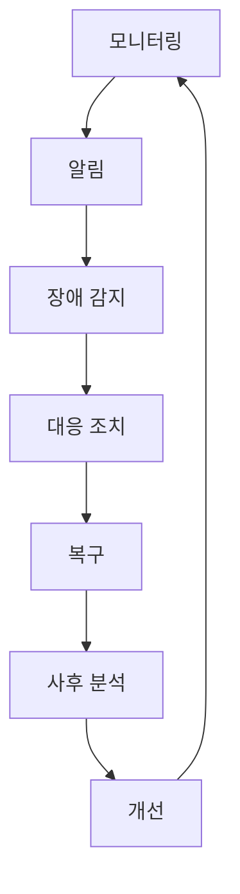

# 마이크로서비스 운영 및 장애 대응 가이드 (Microservices Operations and Incident Response Guide)

## 목차 (Table of Contents)
1. [마이크로서비스 운영 개요 (Microservices Operations Overview)](#마이크로서비스-운영-개요)
2. [서킷 브레이커 패턴 구현 (Circuit Breaker Pattern Implementation)](#서킷-브레이커-패턴-구현)
3. [분산 추적 및 로그 집계 (Distributed Tracing and Log Aggregation)](#분산-추적-및-로그-집계)
4. [장애 전파 방지 및 격리 전략 (Failure Propagation Prevention and Isolation Strategies)](#장애-전파-방지-및-격리-전략)
5. [무중단 배포 전략 (Zero-Downtime Deployment Strategies)](#무중단-배포-전략)
6. [실제 장애 사례 분석 및 대응 방법 (Real Incident Case Analysis and Response Methods)](#실제-장애-사례-분석-및-대응-방법)

### 📌 통합된 기존 파일들
이 가이드는 다음 기존 파일들의 내용을 통합하여 더 체계적으로 정리한 것입니다:
- **MSA 아키텍처**: 마이크로서비스 설계 원칙, 서비스 간 통신, 서킷 브레이커 기본 구현
- **무중단 배포**: Blue-Green 배포 전략, 트래픽 전환, 롤백 방법
- **분산 추적**: OpenTelemetry 기반 분산 추적, 트레이스 수집 및 분석
- **서비스 메시**: Istio 기반 관찰 가능성, 메트릭 수집, 로그 집계
- **벌크헤드**: 장애 격리 전략, 리소스 분리, 스레드 풀 관리
- **시스템 설계**: Circuit Breaker 패턴, 장애 대응 전략

## 마이크로서비스 운영 개요 (Microservices Operations Overview)

마이크로서비스 운영은 분산 시스템의 복잡성을 관리하고, 장애 상황에서 신속한 대응을 위한 체계적인 접근 방식입니다.

### 운영의 핵심 목표

1. **가용성 (Availability)**: 99.9% 이상의 서비스 가용성 유지
2. **안정성 (Reliability)**: 장애 상황에서의 신속한 복구
3. **관찰 가능성 (Observability)**: 시스템 상태의 실시간 모니터링
4. **확장성 (Scalability)**: 트래픽 증가에 따른 유연한 대응

### 운영 모델 (Operations Model)



## 서킷 브레이커 패턴 구현 (Circuit Breaker Pattern Implementation)

### 1. Hystrix 기반 구현

```javascript
const HystrixCommand = require('hystrixjs').commandFactory;

// Hystrix 서킷 브레이커 설정
const paymentServiceCommand = HystrixCommand.getOrCreate('PaymentService')
  .circuitBreakerRequestVolumeThreshold(20)
  .circuitBreakerSleepWindowInMilliseconds(5000)
  .circuitBreakerErrorThresholdPercentage(50)
  .timeout(3000)
  .run(async () => {
    const response = await fetch('http://payment-service/api/process', {
      method: 'POST',
      body: JSON.stringify(paymentData)
    });
    
    if (!response.ok) {
      throw new Error(`Payment failed: ${response.status}`);
    }
    
    return await response.json();
  })
  .fallbackTo(() => {
    // 폴백 처리
    return {
      success: false,
      message: 'Payment service is temporarily unavailable'
    };
  });

// 사용 예시
async function processPayment(paymentData) {
  try {
    const result = await paymentServiceCommand.execute();
    return result;
  } catch (error) {
    console.error('Payment processing failed:', error);
    throw error;
  }
}
```

### 2. Resilience4j 기반 구현

```javascript
const { CircuitBreaker, Retry, Timeout } = require('resilience4js');

// 서킷 브레이커 설정
const circuitBreaker = new CircuitBreaker({
  failureRateThreshold: 50,
  waitDurationInOpenState: 5000,
  minimumNumberOfCalls: 20,
  slidingWindowSize: 10
});

// 재시도 설정
const retry = new Retry({
  maxAttempts: 3,
  waitDuration: 1000,
  exponentialBackoffMultiplier: 2
});

// 타임아웃 설정
const timeout = new Timeout({
  duration: 3000
});

// 서비스 호출 래핑
async function callUserService(userId) {
  const decoratedFunction = circuitBreaker.decorate(
    retry.decorate(
      timeout.decorate(async () => {
        const response = await fetch(`http://user-service/api/users/${userId}`);
        return await response.json();
      })
    )
  );
  
  return await decoratedFunction();
}
```

### 3. 커스텀 서킷 브레이커

```javascript
class AdvancedCircuitBreaker {
  constructor(options = {}) {
    this.failureThreshold = options.failureThreshold || 5;
    this.timeout = options.timeout || 60000;
    this.resetTimeout = options.resetTimeout || 30000;
    this.monitoringPeriod = options.monitoringPeriod || 10000;
    
    this.state = 'CLOSED'; // CLOSED, OPEN, HALF_OPEN
    this.failureCount = 0;
    this.successCount = 0;
    this.lastFailureTime = null;
    this.metrics = {
      totalRequests: 0,
      failedRequests: 0,
      successfulRequests: 0
    };
  }
  
  async execute(operation, fallback = null) {
    this.metrics.totalRequests++;
    
    if (this.state === 'OPEN') {
      if (this.shouldAttemptReset()) {
        this.state = 'HALF_OPEN';
        console.log('Circuit breaker transitioning to HALF_OPEN');
      } else {
        this.metrics.failedRequests++;
        if (fallback) {
          return await fallback();
        }
        throw new Error('Circuit breaker is OPEN');
      }
    }
    
    try {
      const result = await this.withTimeout(operation, this.timeout);
      this.onSuccess();
      return result;
    } catch (error) {
      this.onFailure();
      if (fallback && this.state === 'OPEN') {
        return await fallback();
      }
      throw error;
    }
  }
  
  onSuccess() {
    this.successCount++;
    this.metrics.successfulRequests++;
    
    if (this.state === 'HALF_OPEN') {
      this.state = 'CLOSED';
      this.failureCount = 0;
      console.log('Circuit breaker transitioning to CLOSED');
    }
  }
  
  onFailure() {
    this.failureCount++;
    this.lastFailureTime = Date.now();
    this.metrics.failedRequests++;
    
    if (this.failureCount >= this.failureThreshold) {
      this.state = 'OPEN';
      console.log('Circuit breaker transitioning to OPEN');
    }
  }
  
  shouldAttemptReset() {
    return Date.now() - this.lastFailureTime >= this.resetTimeout;
  }
  
  async withTimeout(operation, timeout) {
    return Promise.race([
      operation(),
      new Promise((_, reject) => 
        setTimeout(() => reject(new Error('Operation timeout')), timeout)
      )
    ]);
  }
  
  getMetrics() {
    return {
      state: this.state,
      failureCount: this.failureCount,
      successCount: this.successCount,
      metrics: this.metrics
    };
  }
}
```

## 분산 추적 및 로그 집계 (Distributed Tracing and Log Aggregation)

### 1. OpenTelemetry 기반 분산 추적

```javascript
const { NodeTracerProvider } = require('@opentelemetry/sdk-node');
const { getNodeAutoInstrumentations } = require('@opentelemetry/auto-instrumentations-node');
const { JaegerExporter } = require('@opentelemetry/exporter-jaeger');

// OpenTelemetry 설정
const tracerProvider = new NodeTracerProvider({
  resource: new Resource({
    [SemanticResourceAttributes.SERVICE_NAME]: 'user-service',
    [SemanticResourceAttributes.SERVICE_VERSION]: '1.0.0'
  })
});

const jaegerExporter = new JaegerExporter({
  endpoint: 'http://jaeger:14268/api/traces'
});

tracerProvider.addSpanProcessor(new BatchSpanProcessor(jaegerExporter));
tracerProvider.register();

// 자동 계측 활성화
registerInstrumentations({
  instrumentations: [getNodeAutoInstrumentations()]
});

// 수동 추적
const tracer = trace.getTracer('user-service');

async function createUser(userData) {
  const span = tracer.startSpan('createUser');
  
  try {
    span.setAttributes({
      'user.email': userData.email,
      'user.name': userData.name
    });
    
    const user = await userRepository.save(userData);
    span.setStatus({ code: SpanStatusCode.OK });
    
    return user;
  } catch (error) {
    span.setStatus({ 
      code: SpanStatusCode.ERROR, 
      message: error.message 
    });
    span.recordException(error);
    throw error;
  } finally {
    span.end();
  }
}
```

### 2. ELK Stack 로그 집계

#### Logstash 설정
```ruby
# logstash.conf
input {
  beats {
    port => 5044
  }
}

filter {
  if [fields][service] {
    mutate {
      add_tag => ["microservice"]
    }
  }
  
  grok {
    match => { "message" => "%{TIMESTAMP_ISO8601:timestamp} \[%{DATA:level}\] %{DATA:service} %{GREEDYDATA:log_message}" }
  }
  
  date {
    match => [ "timestamp", "ISO8601" ]
  }
}

output {
  elasticsearch {
    hosts => ["elasticsearch:9200"]
    index => "microservices-%{+YYYY.MM.dd}"
  }
}
```

#### Node.js 로깅 설정
```javascript
const winston = require('winston');
const { ElasticsearchTransport } = require('winston-elasticsearch');

const logger = winston.createLogger({
  level: 'info',
  format: winston.format.combine(
    winston.format.timestamp(),
    winston.format.errors({ stack: true }),
    winston.format.json()
  ),
  defaultMeta: {
    service: 'user-service',
    version: '1.0.0'
  },
  transports: [
    new winston.transports.Console({
      format: winston.format.simple()
    }),
    new ElasticsearchTransport({
      clientOpts: { node: 'http://elasticsearch:9200' },
      index: 'microservices-logs'
    })
  ]
});

// 구조화된 로깅
logger.info('User created successfully', {
  userId: user.id,
  email: user.email,
  duration: Date.now() - startTime,
  traceId: trace.getActiveSpan()?.spanContext().traceId
});
```

### 3. 로그 분석 및 모니터링

```javascript
class LogAnalyzer {
  constructor(elasticsearchClient) {
    this.es = elasticsearchClient;
  }
  
  async analyzeErrorPatterns(timeRange = '1h') {
    const query = {
      index: 'microservices-*',
      body: {
        query: {
          bool: {
            must: [
              { range: { '@timestamp': { gte: `now-${timeRange}` } } },
              { term: { level: 'error' } }
            ]
          }
        },
        aggs: {
          errors_by_service: {
            terms: { field: 'service.keyword' },
            aggs: {
              error_types: {
                terms: { field: 'log_message.keyword' }
              }
            }
          }
        }
      }
    };
    
    const response = await this.es.search(query);
    return response.aggregations.errors_by_service.buckets;
  }
  
  async getServiceHealthMetrics(serviceName) {
    const query = {
      index: `microservices-*`,
      body: {
        query: {
          bool: {
            must: [
              { term: { service: serviceName } },
              { range: { '@timestamp': { gte: 'now-1h' } } }
            ]
          }
        },
        aggs: {
          response_times: {
            percentiles: {
              field: 'duration',
              percents: [50, 95, 99]
            }
          },
          error_rate: {
            filters: {
              filters: {
                errors: { term: { level: 'error' } },
                all: { match_all: {} }
              }
            }
          }
        }
      }
    };
    
    return await this.es.search(query);
  }
}
```

## 장애 전파 방지 및 격리 전략 (Failure Propagation Prevention and Isolation Strategies)

### 1. 벌크헤드 패턴 (Bulkhead Pattern)

```javascript
class BulkheadIsolation {
  constructor() {
    this.threadPools = new Map();
    this.maxPoolSize = 10;
    this.queueSize = 100;
  }
  
  createThreadPool(name, maxSize = this.maxPoolSize) {
    const pool = {
      name,
      maxSize,
      active: 0,
      queue: [],
      tasks: new Set()
    };
    
    this.threadPools.set(name, pool);
    return pool;
  }
  
  async execute(taskName, operation) {
    const pool = this.threadPools.get(taskName);
    
    if (!pool) {
      throw new Error(`Thread pool '${taskName}' not found`);
    }
    
    return new Promise((resolve, reject) => {
      const task = { operation, resolve, reject };
      
      if (pool.active < pool.maxSize) {
        this.executeTask(pool, task);
      } else if (pool.queue.length < this.queueSize) {
        pool.queue.push(task);
      } else {
        reject(new Error(`Thread pool '${taskName}' is full`));
      }
    });
  }
  
  async executeTask(pool, task) {
    pool.active++;
    pool.tasks.add(task);
    
    try {
      const result = await task.operation();
      task.resolve(result);
    } catch (error) {
      task.reject(error);
    } finally {
      pool.active--;
      pool.tasks.delete(task);
      
      // 큐에서 다음 작업 처리
      if (pool.queue.length > 0) {
        const nextTask = pool.queue.shift();
        this.executeTask(pool, nextTask);
      }
    }
  }
  
  getPoolMetrics(name) {
    const pool = this.threadPools.get(name);
    if (!pool) return null;
    
    return {
      name: pool.name,
      active: pool.active,
      maxSize: pool.maxSize,
      queued: pool.queue.length,
      queueSize: this.queueSize,
      utilization: (pool.active / pool.maxSize) * 100
    };
  }
}

// 사용 예시
const bulkhead = new BulkheadIsolation();

// 각 기능별로 독립적인 스레드 풀 생성
bulkhead.createThreadPool('payment', 5);
bulkhead.createThreadPool('notification', 3);
bulkhead.createThreadPool('analytics', 2);

// 결제 처리는 최대 5개 동시 실행
async function processPayment(paymentData) {
  return bulkhead.execute('payment', async () => {
    return await paymentService.process(paymentData);
  });
}

// 알림 발송은 최대 3개 동시 실행
async function sendNotification(userId, message) {
  return bulkhead.execute('notification', async () => {
    return await notificationService.send(userId, message);
  });
}
```

### 2. 타임아웃 및 재시도 전략

```javascript
class ResilienceStrategies {
  static async withTimeout(operation, timeoutMs = 5000) {
    return Promise.race([
      operation(),
      new Promise((_, reject) => 
        setTimeout(() => reject(new Error('Operation timeout')), timeoutMs)
      )
    ]);
  }
  
  static async withRetry(operation, maxRetries = 3, delay = 1000) {
    let lastError;
    
    for (let i = 0; i <= maxRetries; i++) {
      try {
        return await operation();
      } catch (error) {
        lastError = error;
        
        if (i === maxRetries) {
          break;
        }
        
        // 지수 백오프
        const waitTime = delay * Math.pow(2, i);
        await new Promise(resolve => setTimeout(resolve, waitTime));
      }
    }
    
    throw lastError;
  }
  
  static async withFallback(operation, fallbackOperation) {
    try {
      return await operation();
    } catch (error) {
      console.warn('Primary operation failed, using fallback:', error.message);
      return await fallbackOperation();
    }
  }
}

// 사용 예시
async function resilientServiceCall(serviceUrl, data) {
  return ResilienceStrategies.withFallback(
    // 주요 작업
    () => ResilienceStrategies.withTimeout(
      () => ResilienceStrategies.withRetry(
        async () => {
          const response = await fetch(serviceUrl, {
            method: 'POST',
            body: JSON.stringify(data)
          });
          
          if (!response.ok) {
            throw new Error(`Service call failed: ${response.status}`);
          }
          
          return await response.json();
        },
        3, // 최대 3회 재시도
        1000 // 1초부터 시작
      ),
      5000 // 5초 타임아웃
    ),
    // 폴백 작업
    async () => {
      return {
        success: false,
        message: 'Service temporarily unavailable',
        cached: true,
        timestamp: Date.now()
      };
    }
  );
}
```

## 무중단 배포 전략 (Zero-Downtime Deployment Strategies)

### 1. Blue-Green 배포

```yaml
# blue-green-deployment.yaml
apiVersion: apps/v1
kind: Deployment
metadata:
  name: app-blue
  labels:
    version: blue
spec:
  replicas: 3
  selector:
    matchLabels:
      app: microservice-app
      version: blue
  template:
    metadata:
      labels:
        app: microservice-app
        version: blue
    spec:
      containers:
      - name: app
        image: microservice-app:blue-v1.0.0
        ports:
        - containerPort: 3000
---
apiVersion: v1
kind: Service
metadata:
  name: app-service
spec:
  selector:
    app: microservice-app
    version: blue  # 현재 Blue 환경을 가리킴
  ports:
  - port: 80
    targetPort: 3000
```

```bash
# Blue-Green 배포 스크립트
#!/bin/bash

NAMESPACE="microservices"
APP_NAME="microservice-app"
NEW_VERSION="green-v1.0.1"

echo "🚀 Blue-Green 배포 시작..."

# 1. Green 환경 배포
echo "📦 Green 환경 배포 중..."
kubectl apply -f green-deployment.yaml

# 2. Green 환경 헬스 체크
echo "🏥 Green 환경 헬스 체크 중..."
for i in {1..30}; do
  if kubectl get pods -l version=green --no-headers | grep -q "Running"; then
    echo "✅ Green 환경 준비 완료"
    break
  fi
  echo "⏳ 대기 중... ($i/30)"
  sleep 10
done

# 3. 트래픽 전환
echo "🔄 트래픽을 Green으로 전환 중..."
kubectl patch service app-service -p '{"spec":{"selector":{"version":"green"}}}'

# 4. Green 환경 안정성 확인
echo "🔍 Green 환경 안정성 확인 중..."
sleep 60

# 5. Blue 환경 정리 (선택적)
read -p "Blue 환경을 정리하시겠습니까? (y/n): " -n 1 -r
echo
if [[ $REPLY =~ ^[Yy]$ ]]; then
  echo "🧹 Blue 환경 정리 중..."
  kubectl delete deployment app-blue
fi

echo "✅ Blue-Green 배포 완료!"
```

### 2. Canary 배포

```yaml
# canary-deployment.yaml
apiVersion: apps/v1
kind: Deployment
metadata:
  name: app-canary
  labels:
    version: canary
spec:
  replicas: 1  # 소수의 인스턴스로 시작
  selector:
    matchLabels:
      app: microservice-app
      version: canary
  template:
    metadata:
      labels:
        app: microservice-app
        version: canary
    spec:
      containers:
      - name: app
        image: microservice-app:canary-v1.0.1
        ports:
        - containerPort: 3000
---
# 트래픽 분할을 위한 Virtual Service (Istio)
apiVersion: networking.istio.io/v1alpha3
kind: VirtualService
metadata:
  name: app-virtual-service
spec:
  http:
  - match:
    - headers:
        canary-user:
          exact: "true"
    route:
    - destination:
        host: app-service
        subset: canary
      weight: 100
  - route:
    - destination:
        host: app-service
        subset: stable
      weight: 90
    - destination:
        host: app-service
        subset: canary
      weight: 10
```

```javascript
// Canary 배포를 위한 프론트엔드 라우팅
class CanaryRouter {
  constructor() {
    this.canaryPercentage = 10; // 10% 트래픽을 canary로
    this.canaryUsers = new Set(); // 캐시된 canary 사용자
  }
  
  shouldRouteToCanary(userId) {
    // 특별 헤더가 있는 경우
    if (this.isCanaryUser(userId)) {
      return true;
    }
    
    // 퍼센트 기반 라우팅
    const hash = this.hashUserId(userId);
    return hash % 100 < this.canaryPercentage;
  }
  
  hashUserId(userId) {
    let hash = 0;
    for (let i = 0; i < userId.length; i++) {
      hash = ((hash << 5) - hash + userId.charCodeAt(i)) & 0xffffffff;
    }
    return Math.abs(hash);
  }
  
  isCanaryUser(userId) {
    return this.canaryUsers.has(userId);
  }
  
  addCanaryUser(userId) {
    this.canaryUsers.add(userId);
  }
}
```

### 3. Rolling 배포

```yaml
# rolling-deployment.yaml
apiVersion: apps/v1
kind: Deployment
metadata:
  name: app-rolling
spec:
  replicas: 5
  strategy:
    type: RollingUpdate
    rollingUpdate:
      maxUnavailable: 1  # 최대 1개 인스턴스만 동시에 다운
      maxSurge: 1        # 최대 1개 인스턴스만 동시에 추가
  selector:
    matchLabels:
      app: microservice-app
  template:
    metadata:
      labels:
        app: microservice-app
    spec:
      containers:
      - name: app
        image: microservice-app:rolling-v1.0.1
        livenessProbe:
          httpGet:
            path: /health
            port: 3000
          initialDelaySeconds: 30
          periodSeconds: 10
        readinessProbe:
          httpGet:
            path: /ready
            port: 3000
          initialDelaySeconds: 5
          periodSeconds: 5
```

## 실제 장애 사례 분석 및 대응 방법 (Real Incident Case Analysis and Response Methods)

### 1. 데이터베이스 연결 풀 고갈 사례

#### 문제 상황
```javascript
// 문제가 있는 코드
class DatabaseService {
  constructor() {
    this.pool = new Pool({
      connectionLimit: 10,
      acquireTimeoutMillis: 30000
    });
  }
  
  async query(sql, params) {
    // 연결을 제대로 반환하지 않음
    const connection = await this.pool.getConnection();
    const result = await connection.query(sql, params);
    // connection.release() 누락!
    return result;
  }
}
```

#### 해결 방안
```javascript
class ImprovedDatabaseService {
  constructor() {
    this.pool = new Pool({
      connectionLimit: 20,
      acquireTimeoutMillis: 5000,
      timeout: 30000,
      idleTimeoutMillis: 300000
    });
    
    // 연결 풀 모니터링
    setInterval(() => {
      console.log('Pool status:', {
        total: this.pool.totalConnections,
        idle: this.pool.idleConnections,
        queued: this.pool.queuedRequests
      });
    }, 10000);
  }
  
  async query(sql, params) {
    let connection;
    try {
      connection = await this.pool.getConnection();
      const result = await connection.query(sql, params);
      return result;
    } catch (error) {
      console.error('Database query failed:', error);
      throw error;
    } finally {
      if (connection) {
        connection.release();
      }
    }
  }
  
  async withTransaction(operation) {
    let connection;
    try {
      connection = await this.pool.getConnection();
      await connection.beginTransaction();
      
      const result = await operation(connection);
      
      await connection.commit();
      return result;
    } catch (error) {
      if (connection) {
        await connection.rollback();
      }
      throw error;
    } finally {
      if (connection) {
        connection.release();
      }
    }
  }
}
```

### 2. 메모리 누수 사례

#### 문제 상황
```javascript
// 메모리 누수가 있는 코드
class EventService {
  constructor() {
    this.eventHandlers = new Map();
  }
  
  subscribe(eventType, handler) {
    // 메모리 누수: 구독 해제가 없음
    if (!this.eventHandlers.has(eventType)) {
      this.eventHandlers.set(eventType, []);
    }
    this.eventHandlers.get(eventType).push(handler);
  }
  
  // unsubscribe 메서드가 없음!
}
```

#### 해결 방안
```javascript
class ImprovedEventService {
  constructor() {
    this.eventHandlers = new Map();
    this.weakRefs = new WeakMap(); // WeakMap으로 참조 관리
  }
  
  subscribe(eventType, handler) {
    if (!this.eventHandlers.has(eventType)) {
      this.eventHandlers.set(eventType, new Set());
    }
    
    const handlerSet = this.eventHandlers.get(eventType);
    handlerSet.add(handler);
    
    // WeakMap을 사용하여 정리 추적
    this.weakRefs.set(handler, { eventType, handlerSet });
    
    // 자동 정리 기능
    return {
      unsubscribe: () => this.unsubscribe(eventType, handler)
    };
  }
  
  unsubscribe(eventType, handler) {
    const handlerSet = this.eventHandlers.get(eventType);
    if (handlerSet) {
      handlerSet.delete(handler);
      
      // 빈 Set 정리
      if (handlerSet.size === 0) {
        this.eventHandlers.delete(eventType);
      }
    }
    
    this.weakRefs.delete(handler);
  }
  
  // 정기적인 메모리 정리
  cleanup() {
    const beforeSize = this.eventHandlers.size;
    
    for (const [eventType, handlers] of this.eventHandlers) {
      if (handlers.size === 0) {
        this.eventHandlers.delete(eventType);
      }
    }
    
    const afterSize = this.eventHandlers.size;
    console.log(`Cleaned up ${beforeSize - afterSize} empty event types`);
  }
}
```

### 3. 장애 대응 체크리스트

```javascript
class IncidentResponseChecklist {
  static async handleIncident(incident) {
    console.log('🚨 장애 대응 시작:', incident);
    
    // 1. 초기 대응 (0-5분)
    await this.initialResponse(incident);
    
    // 2. 문제 조사 (5-15분)
    await this.investigateIssue(incident);
    
    // 3. 해결 시도 (15-30분)
    await this.attemptResolution(incident);
    
    // 4. 사후 분석 (30분 이후)
    await this.postIncidentAnalysis(incident);
  }
  
  static async initialResponse(incident) {
    console.log('1️⃣ 초기 대응 단계');
    
    // 알림 발송
    await this.sendAlert(incident);
    
    // 영향 범위 파악
    const impact = await this.assessImpact(incident);
    
    // 우선순위 결정
    const priority = this.calculatePriority(incident, impact);
    
    console.log(`우선순위: ${priority}, 영향: ${impact}`);
  }
  
  static async investigateIssue(incident) {
    console.log('2️⃣ 문제 조사 단계');
    
    // 로그 수집
    const logs = await this.collectLogs(incident);
    
    // 메트릭 확인
    const metrics = await this.checkMetrics(incident);
    
    // 트레이스 추적
    const traces = await this.analyzeTraces(incident);
    
    console.log('조사 완료:', { logs: logs.length, metrics, traces });
  }
  
  static async attemptResolution(incident) {
    console.log('3️⃣ 해결 시도 단계');
    
    const resolutionSteps = [
      '서비스 재시작',
      '로드 밸런서에서 제거',
      '롤백 배포',
      '리소스 스케일링',
      '설정 변경'
    ];
    
    for (const step of resolutionSteps) {
      console.log(`시도 중: ${step}`);
      const result = await this.executeResolutionStep(step, incident);
      
      if (result.success) {
        console.log(`✅ 해결 완료: ${step}`);
        break;
      } else {
        console.log(`❌ 실패: ${step}, 다음 단계 시도`);
      }
    }
  }
  
  static async postIncidentAnalysis(incident) {
    console.log('4️⃣ 사후 분석 단계');
    
    // 원인 분석
    const rootCause = await this.analyzeRootCause(incident);
    
    // 영향도 분석
    const impactAnalysis = await this.analyzeImpact(incident);
    
    // 개선 사항 도출
    const improvements = await this.deriveImprovements(incident);
    
    // 보고서 생성
    await this.generateIncidentReport({
      incident,
      rootCause,
      impactAnalysis,
      improvements
    });
  }
}
```

## 결론

마이크로서비스 운영 및 장애 대응은 시스템의 안정성과 가용성을 보장하는 핵심 요소입니다. 서킷 브레이커, 분산 추적, 장애 격리 전략, 무중단 배포 등을 통해 지속적으로 개선해나가야 합니다.

### 핵심 원칙 요약

1. **예방**: 서킷 브레이커와 벌크헤드로 장애 전파 방지
2. **관찰**: 분산 추적과 로그 집계로 시스템 상태 파악
3. **격리**: 장애의 영향을 최소화하는 격리 전략
4. **복구**: 신속한 롤백과 무중단 배포
5. **학습**: 사후 분석을 통한 지속적 개선

이러한 원칙들을 바탕으로 안정적이고 신뢰할 수 있는 마이크로서비스 시스템을 운영하세요.
