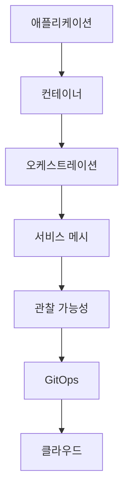

# 클라우드 네이티브 개발 가이드 (Cloud Native Development Guide)

## 목차 (Table of Contents)
1. [클라우드 네이티브 개발 개요 (Cloud Native Development Overview)](#클라우드-네이티브-개발-개요)
2. [12-Factor App 원칙 적용 (12-Factor App Principles Implementation)](#12-factor-app-원칙-적용)
3. [컨테이너화 전략 및 모범 사례 (Containerization Strategy and Best Practices)](#컨테이너화-전략-및-모범-사례)
4. [서비스 메시 (Istio) 고급 활용 (Advanced Service Mesh (Istio) Usage)](#서비스-메시-istio-고급-활용)
5. [GitOps 워크플로우 구현 (GitOps Workflow Implementation)](#gitops-워크플로우-구현)
6. [클라우드 비용 최적화 전략 (Cloud Cost Optimization Strategies)](#클라우드-비용-최적화-전략)

### 📌 통합된 기존 파일들
이 가이드는 다음 기존 파일들의 내용을 통합하여 더 체계적으로 정리한 것입니다:
- **GitOps**: GitOps 워크플로우, ArgoCD 설정, 자동 동기화, 멀티 환경 관리
- **Docker**: 컨테이너화 전략, Dockerfile 작성법, Docker 명령어 가이드, Multi-stage 빌드, 보안 모범사례, Docker Compose 고급 설정, 실제 Node.js 프로덕션 예제
- **Kubernetes**: 컨테이너 오케스트레이션, HPA, VPA, 네트워크 정책, Pod 보안 정책
- **AWS 컨테이너**: EKS, ECS, Fargate 클라우드 컨테이너 서비스 비교 및 활용

## 클라우드 네이티브 개발 개요 (Cloud Native Development Overview)

클라우드 네이티브 개발은 클라우드 환경에서 최적화된 애플리케이션을 구축하는 접근 방식으로, 확장성, 유연성, 회복력을 핵심으로 합니다.

### 클라우드 네이티브의 핵심 원칙

1. **컨테이너화 (Containerization)**: 애플리케이션을 컨테이너로 패키징
2. **마이크로서비스 (Microservices)**: 작고 독립적인 서비스로 분해
3. **자동화 (Automation)**: CI/CD 파이프라인을 통한 자동화
4. **관찰 가능성 (Observability)**: 모니터링, 로깅, 추적
5. **탄력성 (Resilience)**: 장애 복구 및 자동 스케일링

### 클라우드 네이티브 스택



## 12-Factor App 원칙 적용 (12-Factor App Principles Implementation)

12-Factor App은 클라우드 환경에서 실행되는 SaaS 애플리케이션을 위한 방법론입니다.

### 1. 코드베이스 (Codebase)

```javascript
// 단일 코드베이스, 다중 배포
// .env.development
NODE_ENV=development
DATABASE_URL=postgresql://localhost:5432/myapp_dev
REDIS_URL=redis://localhost:6379

// .env.staging
NODE_ENV=staging
DATABASE_URL=postgresql://staging-db:5432/myapp_staging
REDIS_URL=redis://staging-redis:6379

// .env.production
NODE_ENV=production
DATABASE_URL=postgresql://prod-db:5432/myapp_prod
REDIS_URL=redis://prod-redis:6379
```

### 2. 의존성 (Dependencies)

```javascript
// package.json - 명시적 의존성 선언
{
  "name": "myapp",
  "version": "1.0.0",
  "dependencies": {
    "express": "^4.18.2",
    "pg": "^8.11.0",
    "redis": "^4.6.0"
  },
  "engines": {
    "node": ">=18.0.0",
    "npm": ">=8.0.0"
  }
}

// Dockerfile - 시스템 의존성 관리
FROM node:18-alpine

# 시스템 의존성 설치
RUN apk add --no-cache \
    postgresql-client \
    curl

WORKDIR /app
COPY package*.json ./
RUN npm ci --only=production
```

### 3. 설정 (Config)

```javascript
// config/index.js - 환경별 설정 관리
const config = {
  development: {
    port: process.env.PORT || 3000,
    database: {
      url: process.env.DATABASE_URL,
      pool: { min: 2, max: 10 }
    },
    redis: {
      url: process.env.REDIS_URL,
      retryDelayOnFailover: 100
    }
  },
  production: {
    port: process.env.PORT || 3000,
    database: {
      url: process.env.DATABASE_URL,
      pool: { min: 5, max: 20 },
      ssl: { rejectUnauthorized: false }
    },
    redis: {
      url: process.env.REDIS_URL,
      retryDelayOnFailover: 100,
      enableReadyCheck: false
    }
  }
};

module.exports = config[process.env.NODE_ENV || 'development'];
```

### 4. 백엔드 서비스 (Backing Services)

```javascript
// services/database.js - 백엔드 서비스를 리소스로 취급
const { Pool } = require('pg');

class DatabaseService {
  constructor() {
    this.pool = new Pool({
      connectionString: process.env.DATABASE_URL,
      ssl: process.env.NODE_ENV === 'production' ? { rejectUnauthorized: false } : false
    });
  }
  
  async query(text, params) {
    const client = await this.pool.connect();
    try {
      const result = await client.query(text, params);
      return result;
    } finally {
      client.release();
    }
  }
}

// services/cache.js - Redis를 백엔드 서비스로 사용
const redis = require('redis');

class CacheService {
  constructor() {
    this.client = redis.createClient({
      url: process.env.REDIS_URL
    });
  }
  
  async get(key) {
    return await this.client.get(key);
  }
  
  async set(key, value, ttl = 3600) {
    return await this.client.setEx(key, ttl, value);
  }
}
```

### 5. 빌드, 릴리스, 실행 (Build, Release, Run)

```yaml
# .github/workflows/ci-cd.yml
name: CI/CD Pipeline

on:
  push:
    branches: [main, develop]

jobs:
  build:
    runs-on: ubuntu-latest
    steps:
      - uses: actions/checkout@v3
      
      - name: Setup Node.js
        uses: actions/setup-node@v3
        with:
          node-version: '18'
          cache: 'npm'
      
      - name: Install dependencies
        run: npm ci
      
      - name: Run tests
        run: npm test
      
      - name: Build application
        run: npm run build
      
      - name: Build Docker image
        run: docker build -t myapp:${{ github.sha }} .
      
      - name: Push to registry
        run: docker push myapp:${{ github.sha }}
```

### 6. 프로세스 (Processes)

```javascript
// app.js - 상태 비저장 프로세스
const express = require('express');
const app = express();

// 상태를 외부 저장소에 저장
app.use(session({
  store: new RedisStore({ url: process.env.REDIS_URL }),
  secret: process.env.SESSION_SECRET,
  resave: false,
  saveUninitialized: false
}));

// 헬스체크 엔드포인트
app.get('/health', (req, res) => {
  res.json({
    status: 'healthy',
    timestamp: new Date().toISOString(),
    uptime: process.uptime()
  });
});

// 그레이스풀 셧다운
process.on('SIGTERM', () => {
  console.log('SIGTERM received, shutting down gracefully');
  server.close(() => {
    console.log('Process terminated');
  });
});
```

## 컨테이너화 전략 및 모범 사례 (Containerization Strategy and Best Practices)

### 1. Docker 기본 개념

Docker는 **컨테이너 기반 가상화 기술**로, 애플리케이션을 **가볍고, 이식성이 뛰어난 컨테이너 환경**에서 실행할 수 있도록 도와줍니다.

#### Docker 이미지와 컨테이너의 관계
- **Docker 이미지**: 애플리케이션과 그 실행에 필요한 모든 파일들이 담긴 패키지
- **Docker 컨테이너**: 이미지를 실행한 상태 (실제로 동작하는 애플리케이션)
- **Dockerfile**: 이미지를 만드는 방법을 정의한 텍스트 파일

#### Docker의 장점
1. **환경 일관성**: 개발자의 컴퓨터와 서버에서 동일한 환경으로 실행
2. **배포 간편성**: 애플리케이션과 필요한 모든 것을 하나의 패키지로 묶어서 배포
3. **확장성**: 같은 이미지로 여러 개의 컨테이너를 쉽게 실행
4. **버전 관리**: 애플리케이션의 실행 환경까지 코드로 관리

### 2. Dockerfile 작성법

#### 기본 명령어

```dockerfile
# FROM - 시작점 설정
FROM node:18-alpine

# WORKDIR - 작업 폴더 설정
WORKDIR /usr/src/app

# COPY - 파일 복사
COPY package*.json ./
COPY . .

# RUN - 명령어 실행
RUN npm install

# EXPOSE - 포트 설정
EXPOSE 8080

# CMD - 실행 명령어
CMD ["node", "server.js"]
```

#### Dockerfile 명령어 상세 설명

| 명령어 | 설명 | 예시 |
|--------|------|------|
| **FROM** | 베이스 이미지 지정 | `FROM node:18-alpine` |
| **WORKDIR** | 작업 디렉토리 설정 | `WORKDIR /app` |
| **COPY** | 파일/폴더 복사 | `COPY package*.json ./` |
| **RUN** | 명령어 실행 | `RUN npm install` |
| **EXPOSE** | 포트 노출 | `EXPOSE 3000` |
| **CMD** | 컨테이너 시작 명령어 | `CMD ["node", "app.js"]` |
| **ENV** | 환경 변수 설정 | `ENV NODE_ENV=production` |
| **USER** | 사용자 변경 | `USER node` |

### 3. Multi-stage 빌드 최적화

```dockerfile
# Dockerfile.optimized
# 의존성 설치 스테이지
FROM node:18-alpine AS deps
RUN apk add --no-cache libc6-compat
WORKDIR /app

# 의존성 파일만 복사하여 캐시 최적화
COPY package*.json ./
COPY yarn.lock* package-lock.json* pnpm-lock.yaml* ./

# 패키지 매니저에 따른 설치
RUN \
  if [ -f yarn.lock ]; then yarn --frozen-lockfile; \
  elif [ -f package-lock.json ]; then npm ci; \
  elif [ -f pnpm-lock.yaml ]; then yarn global add pnpm && pnpm i --frozen-lockfile; \
  else echo "Lockfile not found." && exit 1; \
  fi

# 빌드 스테이지
FROM node:18-alpine AS builder
WORKDIR /app

# 의존성 복사
COPY --from=deps /app/node_modules ./node_modules
COPY . .

# 환경 변수 설정
ENV NEXT_TELEMETRY_DISABLED 1

# 애플리케이션 빌드
RUN npm run build

# 프로덕션 스테이지
FROM node:18-alpine AS runner
WORKDIR /app

ENV NODE_ENV production
ENV NEXT_TELEMETRY_DISABLED 1

# 비루트 사용자 생성
RUN addgroup --system --gid 1001 nodejs
RUN adduser --system --uid 1001 nextjs

# 필요한 파일만 복사
COPY --from=builder /app/public ./public
COPY --from=builder --chown=nextjs:nodejs /app/.next/standalone ./
COPY --from=builder --chown=nextjs:nodejs /app/.next/static ./.next/static

# 비루트 사용자로 전환
USER nextjs

# 포트 노출
EXPOSE 3000

ENV PORT 3000
ENV HOSTNAME "0.0.0.0"

# 헬스체크 추가
HEALTHCHECK --interval=30s --timeout=3s --start-period=5s --retries=3 \
  CMD curl -f http://localhost:3000/health || exit 1

# 애플리케이션 실행
CMD ["node", "server.js"]
```

### 2. 보안 강화

```dockerfile
# Dockerfile.secure
FROM node:18-alpine AS base

# 보안 업데이트
RUN apk update && apk upgrade

# 비루트 사용자 생성
RUN addgroup -g 1001 -S nodejs
RUN adduser -S nextjs -u 1001

# 작업 디렉토리 설정
WORKDIR /app

# 의존성 설치
COPY package*.json ./
RUN npm ci --only=production && npm cache clean --force

# 소스 코드 복사
COPY --chown=nextjs:nodejs . .

# 비루트 사용자로 전환
USER nextjs

# 포트 노출
EXPOSE 3000

# 보안 헤더 설정
ENV NODE_OPTIONS="--max-old-space-size=512"

# 애플리케이션 실행
CMD ["node", "index.js"]
```

### 4. Docker 명령어 가이드

#### 이미지 관련 명령어

```bash
# 이미지 빌드
docker build -t myapp:latest .

# 이미지 목록 확인
docker images

# 이미지 삭제
docker rmi myapp:latest

# 이미지 강제 삭제
docker rmi -f myapp:latest
```

#### 컨테이너 관련 명령어

```bash
# 컨테이너 실행
docker run -d -p 8080:80 --name mycontainer myapp:latest

# 실행 중인 컨테이너 확인
docker ps

# 모든 컨테이너 확인 (중지된 것 포함)
docker ps -a

# 컨테이너 중지
docker stop mycontainer

# 컨테이너 시작
docker start mycontainer

# 컨테이너 재시작
docker restart mycontainer

# 컨테이너 삭제
docker rm mycontainer

# 실행 중인 컨테이너 강제 삭제
docker rm -f mycontainer
```

#### 볼륨 및 네트워크 관리

```bash
# 볼륨 생성
docker volume create myvolume

# 볼륨 목록 확인
docker volume ls

# 볼륨 삭제
docker volume rm myvolume

# 네트워크 목록 확인
docker network ls

# 네트워크 생성
docker network create mynetwork

# 컨테이너를 네트워크에 연결
docker network connect mynetwork mycontainer

# 네트워크 삭제
docker network rm mynetwork
```

#### 로그 및 디버깅

```bash
# 컨테이너 로그 확인
docker logs mycontainer

# 실시간 로그 확인
docker logs -f mycontainer

# 컨테이너 내부 접속
docker exec -it mycontainer /bin/bash

# 컨테이너 상태 확인
docker inspect mycontainer
```

### 5. Docker Compose 고급 설정

```yaml
# docker-compose.prod.yml
version: '3.8'

services:
  # 웹 애플리케이션
  web:
    build:
      context: .
      dockerfile: Dockerfile.prod
      target: production
    container_name: nodejs-app
    restart: unless-stopped
    ports:
      - "3000:3000"
    environment:
      - NODE_ENV=production
      - DATABASE_URL=${DATABASE_URL}
      - REDIS_URL=${REDIS_URL}
      - JWT_SECRET=${JWT_SECRET}
    volumes:
      - app-logs:/app/logs
    networks:
      - app-network
    depends_on:
      - db
      - redis
    healthcheck:
      test: ["CMD", "curl", "-f", "http://localhost:3000/health"]
      interval: 30s
      timeout: 10s
      retries: 3
      start_period: 40s
    deploy:
      resources:
        limits:
          cpus: '1.0'
          memory: 1G
        reservations:
          cpus: '0.5'
          memory: 512M
    logging:
      driver: "json-file"
      options:
        max-size: "10m"
        max-file: "3"

  # 데이터베이스
  db:
    image: postgres:15-alpine
    container_name: postgres-db
    restart: unless-stopped
    environment:
      - POSTGRES_DB=${DB_NAME}
      - POSTGRES_USER=${DB_USER}
      - POSTGRES_PASSWORD=${DB_PASSWORD}
    volumes:
      - postgres-data:/var/lib/postgresql/data
      - ./init-scripts:/docker-entrypoint-initdb.d
    networks:
      - app-network
    ports:
      - "5432:5432"
    healthcheck:
      test: ["CMD-SHELL", "pg_isready -U ${DB_USER} -d ${DB_NAME}"]
      interval: 10s
      timeout: 5s
      retries: 5

  # Redis 캐시
  redis:
    image: redis:7-alpine
    container_name: redis-cache
    restart: unless-stopped
    command: redis-server --appendonly yes --requirepass ${REDIS_PASSWORD}
    volumes:
      - redis-data:/data
    networks:
      - app-network
    ports:
      - "6379:6379"
    healthcheck:
      test: ["CMD", "redis-cli", "--raw", "incr", "ping"]
      interval: 10s
      timeout: 3s
      retries: 5

volumes:
  postgres-data:
  redis-data:
  app-logs:

networks:
  app-network:
    driver: bridge
```

### 6. Docker 보안 모범사례

#### 보안 강화 Dockerfile

```dockerfile
# Dockerfile.secure
FROM node:18-alpine AS base

# 보안 업데이트
RUN apk update && apk upgrade

# 비루트 사용자 생성
RUN addgroup -g 1001 -S nodejs
RUN adduser -S nextjs -u 1001

# 작업 디렉토리 설정
WORKDIR /app

# 의존성 설치
COPY package*.json ./
RUN npm ci --only=production && npm cache clean --force

# 소스 코드 복사
COPY --chown=nextjs:nodejs . .

# 비루트 사용자로 전환
USER nextjs

# 포트 노출
EXPOSE 3000

# 보안 헤더 설정
ENV NODE_OPTIONS="--max-old-space-size=512"

# 애플리케이션 실행
CMD ["node", "index.js"]
```

#### .dockerignore 파일

```dockerignore
# 의존성
node_modules
npm-debug.log*
yarn-debug.log*
yarn-error.log*

# 환경 변수
.env
.env.local
.env.development.local
.env.test.local
.env.production.local

# Git
.git
.gitignore

# IDE
.vscode
.idea

# OS
.DS_Store
Thumbs.db

# 로그
logs
*.log

# 테스트
coverage
.nyc_output

# 빌드 아티팩트
dist
build
```

### 7. 실제 Node.js 프로덕션 예제

#### Express.js 애플리케이션 Dockerfile

```dockerfile
# Dockerfile.production
FROM node:18-alpine AS base

# 시스템 의존성 설치
RUN apk add --no-cache \
    dumb-init \
    curl

# 비루트 사용자 생성
RUN addgroup -g 1001 -S nodejs
RUN adduser -S nodejs -u 1001

# 작업 디렉토리 설정
WORKDIR /app

# 의존성 설치 스테이지
FROM base AS deps
COPY package*.json ./
RUN npm ci --only=production && npm cache clean --force

# 빌드 스테이지
FROM base AS builder
COPY package*.json ./
RUN npm ci
COPY . .
RUN npm run build

# 프로덕션 스테이지
FROM base AS runner
ENV NODE_ENV=production

# 필요한 파일만 복사
COPY --from=deps /app/node_modules ./node_modules
COPY --from=builder /app/dist ./dist
COPY --from=builder /app/package*.json ./

# 비루트 사용자로 전환
USER nodejs

# 포트 노출
EXPOSE 3000

# 헬스체크
HEALTHCHECK --interval=30s --timeout=3s --start-period=5s --retries=3 \
  CMD curl -f http://localhost:3000/health || exit 1

# 애플리케이션 실행
ENTRYPOINT ["dumb-init", "--"]
CMD ["node", "dist/index.js"]
```

#### package.json 설정

```json
{
  "name": "nodejs-production-app",
  "version": "1.0.0",
  "description": "Production-ready Node.js application",
  "main": "dist/index.js",
  "scripts": {
    "start": "node dist/index.js",
    "dev": "nodemon src/index.js",
    "build": "tsc",
    "test": "jest",
    "lint": "eslint src/**/*.ts",
    "health": "curl -f http://localhost:3000/health || exit 1"
  },
  "engines": {
    "node": ">=18.0.0",
    "npm": ">=8.0.0"
  },
  "dependencies": {
    "express": "^4.18.2",
    "helmet": "^7.0.0",
    "compression": "^1.7.4",
    "cors": "^2.8.5"
  },
  "devDependencies": {
    "@types/node": "^20.0.0",
    "@types/express": "^4.17.17",
    "typescript": "^5.0.0",
    "nodemon": "^2.0.22",
    "jest": "^29.5.0"
  }
}
```

#### 프로덕션 애플리케이션 코드

```javascript
// src/index.js
const express = require('express');
const helmet = require('helmet');
const compression = require('compression');
const cors = require('cors');

const app = express();
const PORT = process.env.PORT || 3000;

// 보안 미들웨어
app.use(helmet());
app.use(compression());
app.use(cors());
app.use(express.json({ limit: '10mb' }));

// 헬스체크 엔드포인트
app.get('/health', (req, res) => {
  res.json({
    status: 'healthy',
    timestamp: new Date().toISOString(),
    uptime: process.uptime(),
    memory: process.memoryUsage(),
    version: process.env.npm_package_version || '1.0.0'
  });
});

// API 라우트
app.get('/api/status', (req, res) => {
  res.json({ message: 'API is running' });
});

// 에러 핸들링
app.use((err, req, res, next) => {
  console.error(err.stack);
  res.status(500).json({ error: 'Something went wrong!' });
});

// 404 핸들링
app.use('*', (req, res) => {
  res.status(404).json({ error: 'Route not found' });
});

// 그레이스풀 셧다운
process.on('SIGTERM', () => {
  console.log('SIGTERM received, shutting down gracefully');
  server.close(() => {
    console.log('Process terminated');
    process.exit(0);
  });
});

process.on('SIGINT', () => {
  console.log('SIGINT received, shutting down gracefully');
  server.close(() => {
    console.log('Process terminated');
    process.exit(0);
  });
});

const server = app.listen(PORT, '0.0.0.0', () => {
  console.log(`Server running on port ${PORT}`);
});

module.exports = app;
```

#### Docker Compose 프로덕션 설정

```yaml
# docker-compose.production.yml
version: '3.8'

services:
  app:
    build:
      context: .
      dockerfile: Dockerfile.production
    container_name: nodejs-app
    restart: unless-stopped
    ports:
      - "3000:3000"
    environment:
      - NODE_ENV=production
      - PORT=3000
    volumes:
      - app-logs:/app/logs
    networks:
      - app-network
    healthcheck:
      test: ["CMD", "curl", "-f", "http://localhost:3000/health"]
      interval: 30s
      timeout: 10s
      retries: 3
      start_period: 40s
    deploy:
      resources:
        limits:
          cpus: '1.0'
          memory: 1G
        reservations:
          cpus: '0.5'
          memory: 512M
    logging:
      driver: "json-file"
      options:
        max-size: "10m"
        max-file: "3"

volumes:
  app-logs:

networks:
  app-network:
    driver: bridge
```

## 서비스 메시 (Istio) 고급 활용 (Advanced Service Mesh (Istio) Usage)

### 1. Istio 설치 및 설정

```bash
# Istio 설치
curl -L https://istio.io/downloadIstio | sh -
cd istio-1.19.0
export PATH=$PWD/bin:$PATH

# Istio 설치 (demo 프로필)
istioctl install --set values.defaultRevision=default

# 네임스페이스에 사이드카 자동 주입 활성화
kubectl label namespace default istio-injection=enabled
```

### 2. 트래픽 관리

```yaml
# virtual-service.yaml
apiVersion: networking.istio.io/v1alpha3
kind: VirtualService
metadata:
  name: nodejs-app
spec:
  http:
  - match:
    - headers:
        canary-user:
          exact: "true"
    route:
    - destination:
        host: nodejs-app
        subset: canary
      weight: 100
  - route:
    - destination:
        host: nodejs-app
        subset: stable
      weight: 90
    - destination:
        host: nodejs-app
        subset: canary
      weight: 10
---
apiVersion: networking.istio.io/v1alpha3
kind: DestinationRule
metadata:
  name: nodejs-app
spec:
  host: nodejs-app
  trafficPolicy:
    connectionPool:
      tcp:
        maxConnections: 100
      http:
        http1MaxPendingRequests: 10
        maxRequestsPerConnection: 2
    circuitBreaker:
      consecutiveErrors: 3
      interval: 30s
      baseEjectionTime: 30s
  subsets:
  - name: stable
    labels:
      version: stable
  - name: canary
    labels:
      version: canary
```

### 3. 보안 정책 (mTLS)

```yaml
# security-policy.yaml
apiVersion: security.istio.io/v1beta1
kind: PeerAuthentication
metadata:
  name: default
  namespace: default
spec:
  mtls:
    mode: STRICT
---
apiVersion: security.istio.io/v1beta1
kind: AuthorizationPolicy
metadata:
  name: nodejs-app-policy
  namespace: default
spec:
  selector:
    matchLabels:
      app: nodejs-app
  rules:
  - from:
    - source:
        principals: ["cluster.local/ns/default/sa/nodejs-app"]
    to:
    - operation:
        methods: ["GET", "POST"]
        paths: ["/api/*"]
```

### 4. 관찰 가능성

```yaml
# telemetry-config.yaml
apiVersion: telemetry.istio.io/v1alpha1
kind: Telemetry
metadata:
  name: nodejs-app-metrics
  namespace: default
spec:
  selector:
    matchLabels:
      app: nodejs-app
  metrics:
  - providers:
    - name: prometheus
  - overrides:
    - match:
        metric: ALL_METRICS
      tagOverrides:
        request_protocol:
          value: "http"
        response_code:
          value: "200"
---
apiVersion: telemetry.istio.io/v1alpha1
kind: Telemetry
metadata:
  name: nodejs-app-tracing
  namespace: default
spec:
  selector:
    matchLabels:
      app: nodejs-app
  tracing:
  - providers:
    - name: jaeger
  - overrides:
    - match:
        metric: ALL_METRICS
      tagOverrides:
        request_protocol:
          value: "http"
        response_code:
          value: "200"
```

## GitOps 워크플로우 구현 (GitOps Workflow Implementation)

### 1. Git 저장소 구조

```
gitops-repository/
├── apps/
│   ├── nodejs-app/
│   │   ├── base/
│   │   │   ├── deployment.yaml
│   │   │   ├── service.yaml
│   │   │   ├── configmap.yaml
│   │   │   └── kustomization.yaml
│   │   └── overlays/
│   │       ├── dev/
│   │       │   ├── kustomization.yaml
│   │       │   └── configmap.yaml
│   │       ├── staging/
│   │       │   ├── kustomization.yaml
│   │       │   └── configmap.yaml
│   │       └── production/
│   │           ├── kustomization.yaml
│   │           └── configmap.yaml
│   └── redis/
│       ├── deployment.yaml
│       └── service.yaml
├── infrastructure/
│   ├── namespaces/
│   ├── network-policies/
│   └── rbac/
└── argocd/
    ├── applications/
    └── projects/
```

### 2. ArgoCD Application 정의

```yaml
# argocd-applications/nodejs-app-dev.yaml
apiVersion: argoproj.io/v1alpha1
kind: Application
metadata:
  name: nodejs-app-dev
  namespace: argocd
  finalizers:
    - resources-finalizer.argocd.argoproj.io
spec:
  project: default
  source:
    repoURL: https://github.com/your-org/gitops-repository
    targetRevision: HEAD
    path: apps/nodejs-app/overlays/dev
  destination:
    server: https://kubernetes.default.svc
    namespace: dev
  syncPolicy:
    automated:
      prune: true
      selfHeal: true
    syncOptions:
    - CreateNamespace=true
    - PrunePropagationPolicy=foreground
    - PruneLast=true
  revisionHistoryLimit: 10
```

### 3. Kustomization 설정

```yaml
# apps/nodejs-app/base/kustomization.yaml
apiVersion: kustomize.config.k8s.io/v1beta1
kind: Kustomization

resources:
  - deployment.yaml
  - service.yaml
  - configmap.yaml

commonLabels:
  app: nodejs-app
  version: v1.0.0

images:
  - name: nodejs-app
    newTag: latest
```

```yaml
# apps/nodejs-app/overlays/dev/kustomization.yaml
apiVersion: kustomize.config.k8s.io/v1beta1
kind: Kustomization

namespace: dev

resources:
  - ../../base

patchesStrategicMerge:
  - configmap.yaml

commonLabels:
  environment: dev

images:
  - name: nodejs-app
    newTag: dev-latest
```

### 4. CI/CD 파이프라인

```yaml
# .github/workflows/gitops.yml
name: GitOps Pipeline

on:
  push:
    branches: [main, develop]
  pull_request:
    branches: [main]

jobs:
  build-and-push:
    runs-on: ubuntu-latest
    steps:
      - uses: actions/checkout@v3
      
      - name: Setup Node.js
        uses: actions/setup-node@v3
        with:
          node-version: '18'
          cache: 'npm'
      
      - name: Install dependencies
        run: npm ci
      
      - name: Run tests
        run: npm test
      
      - name: Build application
        run: npm run build
      
      - name: Build Docker image
        run: |
          docker build -t ${{ secrets.REGISTRY }}/nodejs-app:${{ github.sha }} .
          docker build -t ${{ secrets.REGISTRY }}/nodejs-app:latest .
      
      - name: Push to registry
        run: |
          docker push ${{ secrets.REGISTRY }}/nodejs-app:${{ github.sha }}
          docker push ${{ secrets.REGISTRY }}/nodejs-app:latest
      
      - name: Update GitOps repository
        run: |
          git clone https://github.com/your-org/gitops-repository.git
          cd gitops-repository
          
          # 이미지 태그 업데이트
          if [ "${{ github.ref }}" = "refs/heads/main" ]; then
            sed -i "s/newTag: .*/newTag: ${{ github.sha }}/" apps/nodejs-app/overlays/production/kustomization.yaml
          else
            sed -i "s/newTag: .*/newTag: ${{ github.sha }}/" apps/nodejs-app/overlays/dev/kustomization.yaml
          fi
          
          git config --local user.email "action@github.com"
          git config --local user.name "GitHub Action"
          git add .
          git commit -m "Update nodejs-app image to ${{ github.sha }}"
          git push
```

## 클라우드 비용 최적화 전략 (Cloud Cost Optimization Strategies)

### 1. 리소스 최적화

```yaml
# deployment-optimized.yaml
apiVersion: apps/v1
kind: Deployment
metadata:
  name: nodejs-app
spec:
  replicas: 3
  selector:
    matchLabels:
      app: nodejs-app
  template:
    metadata:
      labels:
        app: nodejs-app
    spec:
      containers:
      - name: nodejs-app
        image: nodejs-app:latest
        resources:
          requests:
            memory: "256Mi"
            cpu: "250m"
          limits:
            memory: "512Mi"
            cpu: "500m"
        env:
        - name: NODE_ENV
          value: "production"
        - name: NODE_OPTIONS
          value: "--max-old-space-size=512"
        livenessProbe:
          httpGet:
            path: /health
            port: 3000
          initialDelaySeconds: 30
          periodSeconds: 10
        readinessProbe:
          httpGet:
            path: /ready
            port: 3000
          initialDelaySeconds: 5
          periodSeconds: 5
```

### 2. HPA (Horizontal Pod Autoscaler)

```yaml
# hpa.yaml
apiVersion: autoscaling/v2
kind: HorizontalPodAutoscaler
metadata:
  name: nodejs-app-hpa
spec:
  scaleTargetRef:
    apiVersion: apps/v1
    kind: Deployment
    name: nodejs-app
  minReplicas: 2
  maxReplicas: 10
  metrics:
  - type: Resource
    resource:
      name: cpu
      target:
        type: Utilization
        averageUtilization: 70
  - type: Resource
    resource:
      name: memory
      target:
        type: Utilization
        averageUtilization: 80
  behavior:
    scaleDown:
      stabilizationWindowSeconds: 300
      policies:
      - type: Percent
        value: 50
        periodSeconds: 60
    scaleUp:
      stabilizationWindowSeconds: 60
      policies:
      - type: Percent
        value: 100
        periodSeconds: 60
```

### 3. VPA (Vertical Pod Autoscaler)

```yaml
# vpa.yaml
apiVersion: autoscaling.k8s.io/v1
kind: VerticalPodAutoscaler
metadata:
  name: nodejs-app-vpa
spec:
  targetRef:
    apiVersion: apps/v1
    kind: Deployment
    name: nodejs-app
  updatePolicy:
    updateMode: "Auto"
  resourcePolicy:
    containerPolicies:
    - containerName: nodejs-app
      minAllowed:
        cpu: 100m
        memory: 128Mi
      maxAllowed:
        cpu: 1000m
        memory: 1Gi
      controlledResources: ["cpu", "memory"]
```

### 4. 클러스터 자동 스케일링

```yaml
# cluster-autoscaler.yaml
apiVersion: apps/v1
kind: Deployment
metadata:
  name: cluster-autoscaler
  namespace: kube-system
spec:
  replicas: 1
  selector:
    matchLabels:
      app: cluster-autoscaler
  template:
    metadata:
      labels:
        app: cluster-autoscaler
    spec:
      containers:
      - image: k8s.gcr.io/autoscaling/cluster-autoscaler:v1.21.0
        name: cluster-autoscaler
        command:
        - ./cluster-autoscaler
        - --v=4
        - --stderrthreshold=info
        - --cloud-provider=aws
        - --skip-nodes-with-local-storage=false
        - --expander=least-waste
        - --node-group-auto-discovery=asg:tag=k8s.io/cluster-autoscaler/enabled,k8s.io/cluster-autoscaler/your-cluster-name
        - --balance-similar-node-groups
        - --scale-down-enabled=true
        - --scale-down-delay-after-add=10m
        - --scale-down-unneeded-time=10m
        resources:
          limits:
            cpu: 100m
            memory: 300Mi
          requests:
            cpu: 100m
            memory: 300Mi
```

### 5. 비용 모니터링

```javascript
// cost-monitoring.js
const AWS = require('aws-sdk');
const cloudwatch = new AWS.CloudWatch();

class CostMonitor {
  constructor() {
    this.metrics = {
      cpuUtilization: [],
      memoryUtilization: [],
      requestCount: [],
      errorRate: []
    };
  }
  
  async collectMetrics() {
    const endTime = new Date();
    const startTime = new Date(endTime.getTime() - 300000); // 5분 전
    
    const params = {
      Namespace: 'AWS/ECS',
      MetricName: 'CPUUtilization',
      Dimensions: [
        {
          Name: 'ServiceName',
          Value: 'nodejs-app'
        }
      ],
      StartTime: startTime,
      EndTime: endTime,
      Period: 300,
      Statistics: ['Average']
    };
    
    const data = await cloudwatch.getMetricStatistics(params).promise();
    return data.Datapoints;
  }
  
  async optimizeResources() {
    const metrics = await this.collectMetrics();
    const avgCpu = metrics.reduce((sum, point) => sum + point.Average, 0) / metrics.length;
    
    if (avgCpu < 30) {
      console.log('CPU 사용률이 낮습니다. 리소스를 줄일 수 있습니다.');
      // HPA 스케일 다운 트리거
    } else if (avgCpu > 80) {
      console.log('CPU 사용률이 높습니다. 리소스를 늘려야 합니다.');
      // HPA 스케일 업 트리거
    }
  }
}

module.exports = CostMonitor;
```

### 6. 스팟 인스턴스 활용

```yaml
# node-pool-spot.yaml
apiVersion: v1
kind: ConfigMap
metadata:
  name: node-pool-config
  namespace: kube-system
data:
  node-pool.yaml: |
    apiVersion: eksctl.io/v1alpha5
    kind: ClusterConfig
    
    metadata:
      name: my-cluster
      region: us-west-2
    
    nodeGroups:
    - name: spot-nodes
      instanceType: t3.medium
      spot: true
      minSize: 2
      maxSize: 10
      desiredCapacity: 3
      labels:
        node-type: spot
      taints:
      - key: spot-instance
        value: "true"
        effect: NoSchedule
      tags:
        k8s.io/cluster-autoscaler/enabled: "true"
        k8s.io/cluster-autoscaler/my-cluster: "true"
```

## 결론

클라우드 네이티브 개발은 현대적인 애플리케이션 개발의 핵심 접근 방식입니다. 12-Factor App 원칙을 따르고, 컨테이너화를 통해 일관된 배포 환경을 구축하며, 서비스 메시와 GitOps를 통해 운영의 복잡성을 관리할 수 있습니다.

### 핵심 원칙 요약

1. **12-Factor App**: 클라우드 환경에 최적화된 애플리케이션 설계
2. **컨테이너화**: 일관된 배포 환경과 확장성 확보
3. **서비스 메시**: 마이크로서비스 간 통신 관리 및 관찰 가능성
4. **GitOps**: 선언적 인프라 관리 및 자동화된 배포
5. **비용 최적화**: 리소스 효율성과 자동 스케일링

이러한 원칙들을 바탕으로 확장 가능하고 안정적인 클라우드 네이티브 애플리케이션을 구축하세요.
