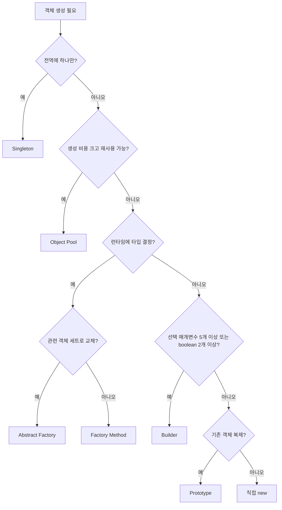

# 생성 패턴 (Creational Patterns)

생성 패턴은 객체를 어떻게 만들지를 캡슐화한다. 호출하는 쪽이 구체 클래스를 직접 `new`로 찍어내지 않아도 되게 하는 것이 목적이다.

Node.js 백엔드에서 반복적으로 나타나는 상황들 — 데이터베이스 연결 관리, API 클라이언트 생성, 환경별 설정 분기, 복잡한 요청 객체 조립 — 은 대부분 생성 패턴 중 하나로 정리된다.

## 객체 생성이 문제가 되는 순간

### 매개변수 폭발

```javascript
// 9개 매개변수 생성자는 순서를 외울 수 없다
const user = new User(
    "홍길동",
    "hong@example.com",
    "010-1234-5678",
    "서울시 강남구",
    "개발자",
    true,
    false,
    "2023-01-01",
    "ACTIVE"
);
```

세 번째가 전화번호인지 주소인지 코드 리뷰에서 바로 보이지 않는다. 여섯 번째와 일곱 번째 불리언이 뒤바뀌어도 타입 에러가 없다. 런타임에서만 잘못된 동작으로 나타난다.

### 구체 클래스에 직접 의존

```javascript
class OrderService {
    async processOrder() {
        const dbConnection = new MySQLConnection(); // MySQL에 묶임
        const logger = new FileLogger();            // 파일 로깅에 묶임
        const emailService = new SendGridService(); // SendGrid에 묶임
    }
}
```

데이터베이스를 PostgreSQL로 바꾸거나 로깅 시스템을 교체할 때마다 `OrderService` 내부를 수정해야 한다. 테스트에서 실제 MySQL 없이는 `OrderService`를 인스턴스화할 수도 없다.

### 런타임 타입 분기의 확산

```javascript
function createPaymentProcessor(type) {
    if (type === "card") return new CardPaymentProcessor();
    if (type === "bank") return new BankPaymentProcessor();
    if (type === "kakao") return new KakaoPayProcessor();
    throw new Error('Unsupported payment type');
}
```

결제 수단이 추가될 때마다 이 분기문을 찾아서 고쳐야 한다. 같은 분기가 서비스 레이어와 어드민 레이어에 따로 복사되어 있으면, 새 카드사 추가 시 두 곳을 동시에 수정해야 한다.

---

## 패턴 목록

### 1. Singleton Pattern

애플리케이션 전체에서 단 하나의 인스턴스만 존재하도록 보장하는 패턴. 데이터베이스 연결 풀, Redis 클라이언트, 로깅 시스템, 전역 설정 관리에 쓴다.

→ 상세: [[Singleton_Pattern]]

### 2. Factory Method Pattern

객체 생성 인터페이스를 정의하되 어떤 클래스를 생성할지는 서브클래스가 결정하는 패턴. 결제 모듈, 알림 서비스, 데이터베이스 드라이버처럼 런타임에 타입이 결정되는 경우에 쓴다.

→ 상세: [[Factory Method]]

### 3. Abstract Factory Pattern

관련 객체들의 집합을 일관성 있게 생성하는 패턴. 환경별 인프라 조합(DB + Cache + Logger), 결제 시스템 조합처럼 연관된 여러 객체를 함께 생성할 때 쓴다.

→ 상세: [[Abstract_Factory_Pattern]]

### 4. Builder Pattern

복잡한 객체의 생성 과정을 단계별로 분리하는 패턴. HTTP 요청 구성, 동적 SQL 쿼리 생성, 이메일 메시지 구성처럼 선택적 매개변수가 많은 객체에 쓴다.

→ 상세: [[Builder_Pattern]]

### 5. Prototype Pattern

기존 객체를 복제해 새 객체를 만드는 패턴. 복잡한 설정 객체를 기반으로 변형된 버전을 만들거나, 생성 비용이 큰 객체를 재사용할 때 쓴다.

→ 상세: [[Prototype_Pattern]]

### 6. Object Pool Pattern

미리 생성해 둔 객체 집합을 빌려주고 반납받는 방식으로 재사용하는 패턴. 생성 비용이 크거나(DB 커넥션, TLS 핸드셰이크) 동시 사용 수를 제한해야 할 때(외부 API 레이트 리밋) 쓴다.

생성 패턴 교재에는 빠져 있는 경우가 많은데, 실무에서는 오히려 가장 먼저 만나는 패턴이다. pg-pool, generic-pool, axios의 `http.Agent`가 전부 이 패턴의 구현체다.

```javascript
const { Pool } = require('pg');

const pool = new Pool({
    host: process.env.DB_HOST,
    max: 20,                      // 풀 최대 크기
    idleTimeoutMillis: 30000,
    connectionTimeoutMillis: 2000,
});

async function getUser(id) {
    const client = await pool.connect();  // 빌리기
    try {
        const result = await client.query(
            'SELECT * FROM users WHERE id = $1', [id]
        );
        return result.rows[0];
    } finally {
        client.release();  // 반납 — finally 없으면 풀이 고갈된다
    }
}
```

HTTP 클라이언트도 같은 방식이다. axios에서 `http.Agent`를 공유하지 않으면 요청마다 TCP 커넥션을 새로 맺는다.

```javascript
const http = require('http');
const axios = require('axios');

const agent = new http.Agent({
    keepAlive: true,
    maxSockets: 50,
    maxFreeSockets: 10,
});

const client = axios.create({
    httpAgent: agent,
    baseURL: 'http://internal-service',
});
```

Object Pool의 실질적인 위험은 `release()` 누락이다. 예외가 터질 때 `finally` 없이 반납 코드가 건너뛰어지면 풀이 천천히 고갈된다. 트래픽 증가 시 갑자기 커넥션 대기 타임아웃이 터지는 원인의 상당수가 이 누락이다.

---

## 패턴 오남용 사례

### 단순 객체에 Builder

필드가 2~3개인 객체에 Builder를 붙이면 코드만 늘어난다.

```javascript
// 오남용 — 이런 객체에 빌더는 불필요하다
class PointBuilder {
    setX(x) { this.x = x; return this; }
    setY(y) { this.y = y; return this; }
    build() { return { x: this.x, y: this.y }; }
}

// 직접 생성이 더 낫다
const point = { x: 3, y: 7 };
```

Builder가 필요한 시점은 선택적 필드가 있거나 boolean 매개변수가 2개 이상일 때다. 그 이하면 객체 리터럴이나 구조 분해 기본값으로 충분하다.

### 교체 계획 없는 Abstract Factory 도입

"나중에 환경이 늘어날 수 있다"는 이유로 Abstract Factory를 미리 만들면, 실제 교체가 없는 1년 동안 유지보수할 코드만 늘어난다. 한 번 Abstract Factory로 설계하면 새 팩토리 메서드가 생길 때마다 인터페이스, 구현체, 테스트 픽스처를 전부 건드려야 한다.

현재 두 개 이상의 팩토리가 실제로 필요한 시점에 추가한다. 하나일 때는 Factory Method로 충분하다.

### Singleton을 내부에서 직접 꺼내기

Singleton 자체가 문제가 아니라, 비즈니스 로직이 전역 인스턴스를 내부에서 직접 참조하는 것이 문제다.

```javascript
// 나쁜 패턴 — 테스트 시 DB를 Mock으로 교체할 수 없다
class OrderService {
    async createOrder(data) {
        const db = DatabaseSingleton.getInstance();
        return db.insert('orders', data);
    }
}

// 생성자 주입으로 분리하면 Mock 주입이 가능하다
class OrderService {
    constructor(db) {
        this.db = db;
    }
    async createOrder(data) {
        return this.db.insert('orders', data);
    }
}
```

앞 테스트가 남긴 전역 상태가 뒤 테스트에 영향을 준다. CI에서 테스트 순서가 바뀌면 통과/실패가 달라진다. `beforeEach`에서 초기화를 꼼꼼히 해야 하는데, 이 수고는 주입으로 바꾸면 사라진다.

### 레지스트리 없는 Factory Method 장기 운영

타입이 추가될 때마다 팩토리 파일을 직접 열어 `if/else`를 고치는 구조는 장기적으로 유지보수가 어렵다. 레지스트리 패턴으로 분리하면 팩토리 파일을 건드리지 않고 새 타입을 등록할 수 있다.

```javascript
// 레지스트리 방식 — 새 타입은 등록만 한다
const registry = new Map([
    ['card', CardProcessor],
    ['bank', BankProcessor],
]);

function createProcessor(type) {
    const Cls = registry.get(type);
    if (!Cls) throw new Error(`Unknown processor type: ${type}`);
    return new Cls();
}

// 새 타입 추가 시 팩토리 파일은 건드리지 않는다
registry.set('kakao', KakaoProcessor);
```

---

## 패턴 조합 사례

단일 패턴만으로는 해결이 안 되는 경우가 실무에서 자주 나온다.

### Singleton + Factory Method

팩토리 인스턴스 자체를 Singleton으로 관리한다. 결제 프로세서 팩토리가 여러 곳에서 각자 생성되면 레지스트리 Map이 중복 생성되고, 나중에 등록한 타입이 먼저 생성된 팩토리에는 반영되지 않는다.

```javascript
class PaymentProcessorFactory {
    static #instance = null;
    #registry = new Map();

    static getInstance() {
        if (!this.#instance) {
            this.#instance = new PaymentProcessorFactory();
        }
        return this.#instance;
    }

    register(type, ProcessorClass) {
        this.#registry.set(type, ProcessorClass);
    }

    create(type) {
        const Cls = this.#registry.get(type);
        if (!Cls) throw new Error(`Unknown type: ${type}`);
        return new Cls();
    }
}

// 부트스트랩에서 등록
const factory = PaymentProcessorFactory.getInstance();
factory.register('card', CardProcessor);
factory.register('kakao', KakaoProcessor);

// 서비스 레이어에서는 같은 인스턴스를 받는다
const processor = PaymentProcessorFactory.getInstance().create('card');
```

### Builder + Prototype

Builder로 기본 설정 객체를 만들어두고, 환경별 변형은 Prototype으로 복제해 오버라이드한다. DB 설정처럼 공통 기반에서 조금씩 다른 버전이 여럿 필요할 때 쓴다.

```javascript
// Builder로 기본 설정 생성
const baseConfig = new DatabaseConfigBuilder()
    .setPort(5432)
    .setPool({ min: 2, max: 10 })
    .setConnectTimeout(5000)
    .build();

// Prototype으로 환경별 복제 (Node.js 17+)
const prodConfig = structuredClone(baseConfig);
prodConfig.host = process.env.DB_HOST;
prodConfig.pool.max = 50;

const stagingConfig = structuredClone(baseConfig);
stagingConfig.host = process.env.STAGING_DB_HOST;
```

`structuredClone`은 Node.js 17+에서 내장 지원된다. 이전 버전이면 `JSON.parse(JSON.stringify(obj))`를 쓰되, 함수나 `Date` 객체가 포함된 경우 별도 처리가 필요하다.

### Abstract Factory + Object Pool

외부 서비스 클라이언트를 환경별 팩토리로 생성하면서, 클라이언트 풀은 Object Pool로 관리한다. Kafka 프로듀서나 gRPC 채널처럼 생성 비용이 크고 환경별로 구현이 다른 경우에 이 조합이 나온다.

```javascript
class ProductionMQFactory {
    createConsumer(topic) {
        return new KafkaConsumer({ brokers: process.env.KAFKA_BROKERS, topic });
    }

    createProducerPool() {
        return genericPool.createPool({
            create: () => new KafkaProducer({ brokers: process.env.KAFKA_BROKERS }),
            destroy: (producer) => producer.disconnect(),
        }, { min: 2, max: 10 });
    }
}

class TestMQFactory {
    createConsumer(topic) {
        return new InMemoryConsumer(topic);
    }

    createProducerPool() {
        return genericPool.createPool({
            create: () => new InMemoryProducer(),
            destroy: () => Promise.resolve(),
        }, { min: 1, max: 3 });
    }
}
```

---

## 패턴 전환 시점

### if/else에서 Factory Method로

다음 중 하나라도 해당되면 Factory Method로 전환한다.

- 같은 타입 분기 로직이 2개 이상의 파일에 복사되어 있다
- 새 타입 추가 시 수정해야 할 파일이 2곳 이상이다
- 타입 목록이 런타임에 동적으로 결정된다 (플러그인 시스템, 서드파티 확장)

타입이 2~3개이고 한 곳에만 있으면 `if/else`를 굳이 걷어낼 필요는 없다. 분기가 퍼지기 시작할 때가 전환 시점이다.

### Factory Method에서 Abstract Factory로

- 생성하는 객체들이 서로 연관되어 있고 세트로 교체된다 (개발 환경은 인메모리 DB + 콘솔 로거, 프로덕션은 PostgreSQL + CloudWatch)
- 팩토리가 생성하는 객체 타입이 2개 이상이고 이 조합이 고정되어야 한다

조합 전체가 아니라 하나의 객체만 교체할 때는 Factory Method가 더 단순하다.

### 직접 new에서 Builder로

- boolean 매개변수가 2개 이상이다 (순서를 바꿔도 타입 에러가 없다)
- 선택적 매개변수가 5개를 넘는다
- 동일한 클래스지만 다양한 구성으로 생성하는 경우가 3가지 이상 나온다

### Object Pool이 필요한 시점

- 커넥션 생성 로그에 요청마다 `connect` 호출이 찍힌다
- DB 슬로우 쿼리가 없는데 응답 시간이 높다 (생성 오버헤드가 원인인 경우)
- 외부 서비스에서 커넥션 수 초과 에러가 난다
- 동시 요청 수에 비례해 커넥션 수가 증가한다

---

## 패턴 비교

| 패턴 | 구현 비용 | 테스트 격리 | 전환 신호 | 주의사항 |
|------|----------|------------|----------|---------|
| Singleton | 10줄 이하 | `beforeEach` 초기화 필요 | 동일 자원이 여러 곳에서 별도 생성될 때 | 의존성 내부 직접 참조 금지 |
| Factory Method | 서브클래스 1개 추가 | Mock 팩토리 주입 가능 | 타입 분기가 2개 파일에 복사될 때 | 타입 추가마다 서브클래스 증가 |
| Abstract Factory | 인터페이스 3개+ 설계 | 팩토리 교체로 전체 Mock | 관련 객체 세트가 함께 교체될 때 | Factory Method 하나로 충분할 때 도입 금지 |
| Builder | 메서드 체이닝 구현 | 필요 필드만 세팅 가능 | boolean 2개+, 선택 필드 5개+ | 단순 객체에 적용 금지 |
| Prototype | `clone()` 구현 | 복사본이 원본과 독립 | 기본 설정의 변형 버전이 여러 개일 때 | deep clone 누락 시 공유 버그 |
| Object Pool | 풀 라이브러리 연동 | Mock 클라이언트로 풀 구성 | 생성 비용 큰 자원, 동시 사용 제한 필요 | `release()` 누락 시 풀 고갈 |

---

## 의사결정 다이어그램


