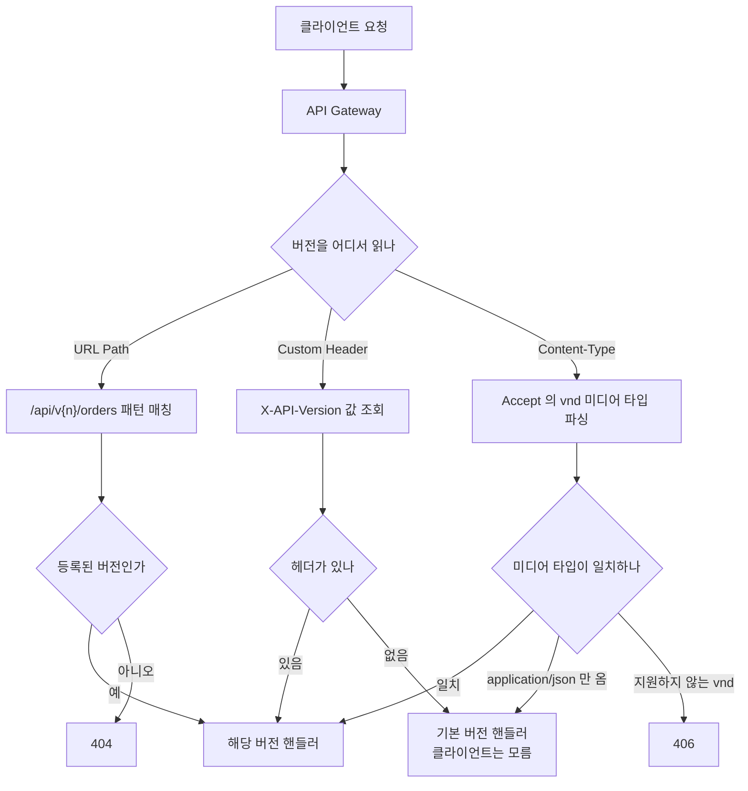
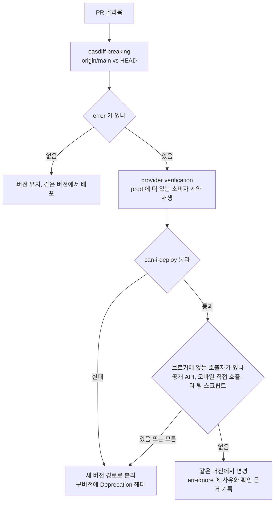
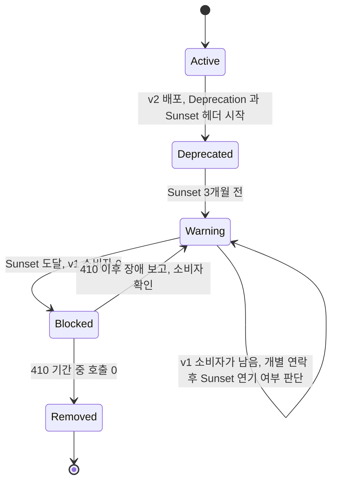

# API 버전 관리

## 개요

MSA 환경에서 API 변경은 일상이다. 서비스 하나가 바뀔 때 해당 API를 호출하는 클라이언트가 수십 개일 수 있고, 모바일 앱처럼 강제 업데이트가 어려운 클라이언트도 있다. API를 바꿨는데 구버전 클라이언트가 깨지면 장애다.

API 버전 관리는 기존 클라이언트를 깨뜨리지 않으면서 API를 변경하는 방법이다. 버전을 어디에 명시할지, 스키마가 바뀌면 어떻게 대응할지, 언제 구버전을 폐기할지를 다룬다.

버전을 올릴지 말지, 구버전을 언제 끊을지는 사람이 감으로 정하면 틀린다. 이 문서의 뒤쪽 두 절에서 그 판단을 도구에 맡기는 방법을 다룬다. 스키마 변경이 breaking인지는 OpenAPI 명세 비교([OpenAPI Breaking Change 검증 자동화](../../Backend/API/Open_API_Breaking_Change_Detection.md))와 소비자 계약 검증([Service Contract Testing](Service_Contract_Testing.md))의 결과로 가르고, Sunset 날짜는 브로커에 쌓인 소비자의 배포 기록으로 정한다.

---

## 버전 관리 방식 비교

API 버전을 명시하는 방식은 크게 세 가지가 있다.

### URL Path 방식

URL 경로에 버전 번호를 넣는 방식이다.

```
GET /api/v1/orders/123
GET /api/v2/orders/123
```

가장 직관적이고 널리 사용된다. 브라우저에서 바로 확인 가능하고, 로그에서 어떤 버전으로 호출했는지 바로 보인다.

```java
@RestController
@RequestMapping("/api/v1/orders")
public class OrderV1Controller {

    @GetMapping("/{id}")
    public OrderV1Response getOrder(@PathVariable Long id) {
        Order order = orderService.findById(id);
        return OrderV1Response.from(order);
    }
}

@RestController
@RequestMapping("/api/v2/orders")
public class OrderV2Controller {

    @GetMapping("/{id}")
    public OrderV2Response getOrder(@PathVariable Long id) {
        Order order = orderService.findById(id);
        return OrderV2Response.from(order);
    }
}
```

단점은 버전이 올라갈 때마다 컨트롤러가 늘어난다는 점이다. v1과 v2의 로직이 거의 같은데 응답 형식만 다른 경우에도 별도 컨트롤러를 만들게 된다. 서비스가 10개이고 각각 v1, v2를 유지하면 컨트롤러가 20개다.

실무에서 많이 쓰이는 이유는 디버깅이 쉽기 때문이다. 로그에 `/api/v1/orders`가 찍히면 어떤 버전인지 바로 안다. API Gateway에서 라우팅할 때도 URL 패턴 매칭만 하면 돼서 설정이 단순하다.

### Custom Header 방식

HTTP 헤더에 버전 정보를 넣는 방식이다.

```
GET /api/orders/123
X-API-Version: 1

GET /api/orders/123
X-API-Version: 2
```

URL이 깔끔하게 유지된다. REST 원칙에 더 가깝다는 의견이 있다. 같은 리소스를 가리키는 URL이 하나니까.

```java
@RestController
@RequestMapping("/api/orders")
public class OrderController {

    @GetMapping("/{id}")
    public ResponseEntity<?> getOrder(
            @PathVariable Long id,
            @RequestHeader(value = "X-API-Version", defaultValue = "1") int version) {

        Order order = orderService.findById(id);

        if (version == 2) {
            return ResponseEntity.ok(OrderV2Response.from(order));
        }
        return ResponseEntity.ok(OrderV1Response.from(order));
    }
}
```

문제는 헤더를 빠뜨리는 클라이언트가 많다는 점이다. 프론트엔드 개발자가 Axios 인터셉터에 헤더를 넣어놓고 잊어버리면, 나중에 다른 API 호출할 때 헤더가 빠진다. `defaultValue`를 설정하지 않으면 500 에러가 난다.

브라우저에서 직접 테스트할 때 헤더를 넣기 번거롭고, Swagger 문서에서 버전 전환이 직관적이지 않다.

### Content-Type(Accept Header) 방식

`Accept` 헤더에 미디어 타입을 지정하는 방식이다. Content Negotiation이라고도 부른다.

```
GET /api/orders/123
Accept: application/vnd.mycompany.order.v1+json

GET /api/orders/123
Accept: application/vnd.mycompany.order.v2+json
```

GitHub API가 이 방식을 쓴다. HTTP 표준에 가장 부합하고, 같은 리소스에 대해 다양한 표현을 제공한다는 REST 원래 의도와 맞는다.

```java
@RestController
@RequestMapping("/api/orders")
public class OrderController {

    @GetMapping(value = "/{id}", produces = "application/vnd.mycompany.order.v1+json")
    public OrderV1Response getOrderV1(@PathVariable Long id) {
        Order order = orderService.findById(id);
        return OrderV1Response.from(order);
    }

    @GetMapping(value = "/{id}", produces = "application/vnd.mycompany.order.v2+json")
    public OrderV2Response getOrderV2(@PathVariable Long id) {
        Order order = orderService.findById(id);
        return OrderV2Response.from(order);
    }
}
```

현실적인 문제가 크다. 프론트엔드 개발자가 `application/vnd.mycompany.order.v2+json`을 매번 타이핑하는 건 실수를 유발한다. API 클라이언트 라이브러리에서 Accept 헤더를 자동으로 `application/json`으로 설정하는 경우가 있어서, 의도치 않게 버전 매칭이 안 되는 경우가 생긴다.

### 요청이 버전을 만나는 지점

세 방식은 Gateway가 버전을 읽는 위치가 다르고, 버전 정보가 없거나 틀렸을 때 떨어지는 곳도 다르다. 아래 도식에서 볼 것은 각 방식의 마지막 분기다. URL Path는 매칭이 안 되면 404로 끝나서 클라이언트가 바로 알아채지만, 헤더 방식은 기본 버전으로 조용히 떨어져서 클라이언트가 틀린 버전을 받고도 모른다.



### 방식별 비교

| 기준 | URL Path | Custom Header | Content-Type |
|------|----------|---------------|--------------|
| 직관성 | 높음 | 보통 | 낮음 |
| 디버깅 | 로그에서 바로 확인 | 헤더 로깅 필요 | 헤더 로깅 필요 |
| Gateway 라우팅 | URL 매칭으로 단순 | 헤더 기반 라우팅 필요 | 헤더 파싱 필요 |
| REST 원칙 준수 | 낮음 | 보통 | 높음 |
| 클라이언트 실수 가능성 | 낮음 | 헤더 누락 | 미디어 타입 오타 |
| 잘못된 버전 요청의 결과 | 404로 바로 드러남 | 기본 버전으로 조용히 응답 | 기본 버전 또는 406 |
| 캐싱 | URL별 캐싱 용이 | Vary 헤더 필요 | Vary 헤더 필요 |
| 구버전 호출자 찾기 | 접근 로그 경로를 grep | 헤더를 로그에 남겨둔 경우만 가능 | 헤더를 로그에 남겨둔 경우만 가능 |
| Pact 계약에서 버전이 놓이는 곳 | `request.path` | `request.headers` | `request.headers`의 Accept |
| 한 문서에서 두 버전 노출 | 경로가 달라 OpenAPI 명세에 자연스럽게 공존 | 같은 경로·메서드라 명세에서 구분이 어려움 | 같은 경로라 media type별 응답으로 따로 적어야 함 |

표의 마지막 세 행은 실제로 운영해 보면 체감이 크다. 구버전 호출자를 찾는 일은 폐기 때 반드시 하는데, 헤더 방식은 로그 포맷에 헤더를 넣어두지 않았으면 과거 호출을 복원할 수 없다. 계약 테스트 쪽에서는 URL Path면 버전이 경로 문자열에 박혀서 pact 파일만 훑어도 누가 v1을 부르는지 나오고, 헤더 방식이면 소비자 테스트가 헤더를 빠뜨렸을 때 계약이 기본 버전을 검증해 버린다. 명세 쪽에서는 헤더 방식이 같은 경로·메서드의 두 버전을 한 파일에 나눠 적기 어려워서, 버전별로 명세 파일을 따로 두는 팀이 많다.

대부분의 팀에서 URL Path 방식을 쓴다. 디버깅과 운영 편의성이 다른 장점을 압도한다. REST 순수주의자가 아니라면 URL Path를 기본으로 쓰고, 특별한 이유가 있을 때만 다른 방식을 고려한다.

---

## 하위 호환성 유지

버전을 올리지 않고 기존 API를 수정하려면 하위 호환성을 지켜야 한다. 하위 호환성이 깨지면 구버전 클라이언트가 동작하지 않는다.

### 하위 호환이 되는 변경

**필드 추가**는 안전하다. 응답에 새 필드를 추가해도 기존 클라이언트는 모르는 필드를 무시한다. JSON 파서가 알 수 없는 필드를 만나면 그냥 넘어간다.

```json
// v1 응답
{
  "orderId": 123,
  "amount": 50000,
  "status": "PAID"
}

// 필드 추가 후 (하위 호환됨)
{
  "orderId": 123,
  "amount": 50000,
  "status": "PAID",
  "deliveryDate": "2026-04-05"
}
```

**선택적 요청 파라미터 추가**도 안전하다. 기존 클라이언트가 보내지 않으면 기본값을 사용하면 된다.

```java
@GetMapping("/orders")
public List<OrderResponse> getOrders(
        @RequestParam(required = false) String status,
        @RequestParam(required = false, defaultValue = "createdAt") String sortBy) {  // 새로 추가
    // 기존 클라이언트는 sortBy를 안 보내고, 기본값 createdAt 적용
}
```

**새 엔드포인트 추가**도 안전하다. 기존 엔드포인트에 영향이 없다.

### 하위 호환이 깨지는 변경

**필드 삭제나 이름 변경**은 깨진다. 클라이언트가 `userName` 필드를 읽고 있는데 `name`으로 바꾸면 클라이언트에서 null이 된다.

```json
// 변경 전
{ "userName": "홍길동" }

// 필드 이름 변경 (하위 호환 깨짐)
{ "name": "홍길동" }
```

이 경우 양쪽 다 내려주는 방법이 있다.

```json
{
  "userName": "홍길동",
  "name": "홍길동"
}
```

일정 기간 두 필드를 모두 내려주다가, 구버전 클라이언트가 충분히 사라지면 `userName`을 제거한다.

**필드 타입 변경**도 깨진다.

```json
// 변경 전: amount가 숫자
{ "amount": 50000 }

// 변경 후: amount가 객체
{ "amount": { "value": 50000, "currency": "KRW" } }
```

클라이언트가 `response.amount + 1000` 같은 코드를 쓰고 있으면 타입 에러가 난다. 이런 변경은 새 버전으로 올려야 한다.

**필수 요청 파라미터 추가**도 깨진다. 기존 클라이언트가 해당 파라미터를 보내지 않으니까 400 에러가 난다.

### Jackson에서 하위 호환을 위한 설정

Java/Spring 기준으로, 클라이언트가 보낸 JSON에 서버가 모르는 필드가 있을 때 에러가 나지 않게 설정한다.

```java
@Configuration
public class JacksonConfig {

    @Bean
    public ObjectMapper objectMapper() {
        ObjectMapper mapper = new ObjectMapper();
        // 모르는 필드가 와도 에러 안 냄
        mapper.configure(DeserializationFeature.FAIL_ON_UNKNOWN_PROPERTIES, false);
        return mapper;
    }
}
```

Spring Boot에서는 `application.yml`로도 설정 가능하다.

```yaml
spring:
  jackson:
    deserialization:
      fail-on-unknown-properties: false
```

이 설정이 빠져있으면 클라이언트가 새 필드를 보낼 때 서버에서 역직렬화 에러가 발생한다. MSA에서 서비스 간 통신할 때 특히 문제가 되는데, A 서비스가 필드를 추가했는데 B 서비스의 DTO에는 해당 필드가 없으면 B 서비스가 에러를 뱉는다.

---

## 버전을 올릴지 계약 테스트와 명세 비교로 가른다

앞에서 정리한 "깨지는 변경 / 안 깨지는 변경" 목록은 사람이 외워서 쓰는 규칙이다. 리뷰에서 빠뜨리는 경우가 실제로 많다. 필드 추가가 안전하다는 말은 응답에서만 맞고 요청에서는 필수 필드 추가가 곧바로 깨진다. 응답 enum 값 추가는 서버 입장에서는 추가일 뿐인데 클라이언트의 `switch`에서는 예외가 된다. 이 판정을 PR마다 기계가 내리게 하면 "이 변경이 새 버전을 요구하는가"를 논쟁할 일이 줄어든다.

판정에 쓰는 도구는 둘이고 보는 대상이 다르다.

- oasdiff는 이전 명세와 현재 명세를 비교한다. 명세에 있는 모든 필드·값을 기준으로 보기 때문에 보수적이다. 아무도 안 쓰는 필드를 지워도 error를 낸다.
- 계약 테스트(Pact)는 브로커에 등록된 소비자가 실제로 쓰는 요청과 응답만 검증한다. 소비자가 안 쓰는 필드는 지워도 통과하고, 소비자가 단언한 값의 의미가 바뀌면 명세로는 안 보이는 변경도 잡는다.

oasdiff의 변경 유형별 판정 전체는 [OpenAPI Breaking Change 검증 자동화](../../Backend/API/Open_API_Breaking_Change_Detection.md)에 표로 있고, 소비자 계약과 `can-i-deploy`의 동작은 [Service Contract Testing](Service_Contract_Testing.md)에 있다. 여기서는 두 도구의 판정이 갈리는 변경만 모아서 본다.

| 변경 | oasdiff | 계약 테스트 | 판단 |
|---|---|---|---|
| 응답 필수 필드 삭제 | error | 그 필드를 쓰는 소비자 계약이 있으면 실패, 없으면 통과 | 소비자가 쓰면 새 버전. 아무도 안 쓰면 같은 버전에서 지울 수 있다 |
| 요청 필수 필드 추가 | error | 소비자의 기존 요청을 재생하면 provider가 400을 내서 실패 | 새 버전, 또는 서버 기본값으로 필수를 늦춘다 |
| 응답 enum 값 추가 | error | 계약 예시에 새 값이 안 나오므로 대개 통과 | 소비자가 모르는 값을 처리하는지에 달렸다. 계약이 이걸 못 본다 |
| 필드 의미 변경(금액 단위 원 → 센트) | 못 잡음 | 소비자 테스트가 값까지 단언했으면 실패 | 명세로는 안 보이므로 계약 쪽에서만 잡힌다 |
| 응답 선택 필드 추가 | info | 통과 | 같은 버전 |

세 번째 줄이 두 도구의 사각지대가 겹치는 곳이다. oasdiff는 error를 내지만 억울한 오탐일 수 있고, 계약 테스트는 통과하지만 소비자 코드가 `valueOf`로 파싱하고 있다면 운영에서 터진다. 이 경우는 도구가 아니라 소비자 쪽 파싱 규칙(모르는 값은 `UNKNOWN`으로 처리)을 약속하는 수밖에 없다.

### 판정 흐름

두 도구를 직렬로 붙인다. 명세 비교가 먼저 돌아서 깨끗하면 바로 끝나고, error가 나왔을 때만 소비자 계약을 확인한다. 도식에서 볼 부분은 가운데 가지다. oasdiff가 error를 냈는데 prod 소비자 계약이 통과한 경우, 곧바로 "같은 버전에서 진행"으로 가지 않고 브로커 밖의 호출자를 한 번 더 확인한다.



CI에서는 이 흐름을 스크립트 하나로 묶는다. provider 쪽 verification 결과가 이 커밋 기준으로 게시되어 있어야 `can-i-deploy`가 답을 낸다. 게시 순서가 뒤집히면 `no verification result`로 실패한다.

```bash
#!/usr/bin/env bash
set -u

if oasdiff breaking origin/main:openapi.yaml HEAD:openapi.yaml --fail-on ERR; then
  echo "breaking 없음. 버전을 올릴 필요 없다."
  exit 0
fi

if pact-broker can-i-deploy \
     --pacticipant order-service --version "$GIT_SHA" \
     --to-environment production; then
  echo "명세는 breaking 이지만 prod 의 소비자 계약은 통과했다. 브로커 밖 호출자를 확인한 뒤 같은 버전에서 진행한다."
  exit 0
fi

echo "prod 소비자의 계약이 깨진다. 새 버전 경로로 분리한다."
exit 1
```

두 번째 분기에서 `exit 0`을 내는 게 불안하면 이 지점에서 리뷰어 승인 라벨을 요구하도록 바꾼다. 스크립트가 "통과"를 내도 그 의미는 "브로커에 등록된 소비자는 안 깨진다"까지다. 계약 테스트는 브로커에 등록된 소비자만 본다. 소비자 목록이 불완전한 공개 API에서는 이 통과를 근거로 같은 버전에서 필드를 지우면 안 된다. 그런 API는 명세 비교의 error를 그대로 존중해서 새 버전으로 간다. 같은 이유로 `record-deployment` 기록이 비어 있는 환경에서는 `can-i-deploy` 통과가 아무것도 비교하지 않은 결과일 수 있다.

---

## 스키마 변경 시 기존 클라이언트 대응

실무에서 자주 겪는 시나리오별 대응 방법이다.

### 응답 필드 구조 변경

주소 정보를 단일 문자열에서 구조화된 객체로 바꿔야 하는 경우.

```json
// 기존
{ "address": "서울시 강남구 테헤란로 123" }

// 변경하고 싶은 형태
{
  "address": {
    "city": "서울시",
    "district": "강남구",
    "street": "테헤란로 123"
  }
}
```

방법 1: 새 필드명으로 추가하고, 기존 필드도 유지한다.

```json
{
  "address": "서울시 강남구 테헤란로 123",
  "addressDetail": {
    "city": "서울시",
    "district": "강남구",
    "street": "테헤란로 123"
  }
}
```

방법 2: 새 API 버전을 만든다. 구조가 크게 바뀌면 이 쪽이 깔끔하다.

### Enum 값 변경

주문 상태에 새 값이 추가되는 경우.

```java
// 기존: PENDING, PAID, SHIPPED, DELIVERED
// 추가: REFUND_REQUESTED, REFUNDED
public enum OrderStatus {
    PENDING, PAID, SHIPPED, DELIVERED,
    REFUND_REQUESTED, REFUNDED  // 새로 추가
}
```

Enum 값 추가는 하위 호환이 되는 것처럼 보이지만, 클라이언트 쪽에서 문제가 생길 수 있다. 클라이언트가 Enum을 파싱할 때 알 수 없는 값이 오면 에러를 내는 경우가 있다.

```java
// 클라이언트 측 - 이렇게 하면 새 Enum 값에서 에러남
OrderStatus status = OrderStatus.valueOf(response.getStatus());

// 안전한 방식 - 모르는 값은 UNKNOWN 처리
public static OrderStatus fromString(String value) {
    try {
        return OrderStatus.valueOf(value);
    } catch (IllegalArgumentException e) {
        return OrderStatus.UNKNOWN;
    }
}
```

서버 쪽에서도 Jackson 설정을 해둔다.

```java
@JsonEnumDefaultValue
UNKNOWN;  // Enum에 추가

// ObjectMapper 설정
mapper.enable(DeserializationFeature.READ_UNKNOWN_ENUM_VALUES_USING_DEFAULT_VALUE);
```

### 필수 필드가 새로 생기는 경우

기존 API에서 선택이었던 `phoneNumber`가 필수가 되어야 하는 경우. 기존 클라이언트는 이 필드를 안 보내고 있다.

바로 필수로 바꾸면 기존 클라이언트가 깨진다. 단계적으로 진행해야 한다.

1단계: 서버에서 `phoneNumber`가 없으면 기본값을 넣거나, 별도 로직으로 채운다.

```java
public Order createOrder(CreateOrderRequest request) {
    if (request.getPhoneNumber() == null) {
        // 회원 정보에서 가져오기
        String phone = memberService.getPhone(request.getMemberId());
        request.setPhoneNumber(phone);
    }
    // ...
}
```

2단계: 클라이언트에 공지하고 마이그레이션 기간을 준다. API 문서에 "이 필드는 다음 버전부터 필수입니다"라고 명시한다.

3단계: 마이그레이션 기간이 끝나면 필수로 변경한다. 또는 새 버전에서 필수로 만든다.

---

## Deprecation 절차

구버전 API를 폐기하는 과정이다. 갑자기 끊으면 장애가 나니까 단계적으로 진행한다.

### 폐기 예고

응답 헤더에 폐기 예정 정보를 넣는다. IETF RFC 8594에 정의된 `Deprecation` 헤더와 `Sunset` 헤더를 사용한다.

```java
@GetMapping("/api/v1/orders/{id}")
public ResponseEntity<OrderV1Response> getOrder(@PathVariable Long id) {
    Order order = orderService.findById(id);
    OrderV1Response response = OrderV1Response.from(order);

    return ResponseEntity.ok()
            .header("Deprecation", "true")
            .header("Sunset", "Tue, 16 Feb 2027 00:00:00 GMT")
            .header("Link", "</api/v2/orders/{id}>; rel=\"successor-version\"")
            .body(response);
}
```

- `Deprecation: true` — 이 API는 폐기 예정이다
- `Sunset` — 이 날짜 이후로 사용할 수 없다
- `Link` — 대체할 새 버전의 위치

### 모니터링 기반 폐기

폐기를 결정하기 전에 구버전 API 호출량을 모니터링해야 한다.

```java
@Aspect
@Component
public class ApiVersionMetrics {

    private final MeterRegistry meterRegistry;

    @Around("@annotation(apiVersion)")
    public Object trackVersion(ProceedingJoinPoint joinPoint, ApiVersion apiVersion) throws Throwable {
        meterRegistry.counter("api.calls",
                "version", apiVersion.value(),
                "endpoint", joinPoint.getSignature().getName()
        ).increment();
        return joinPoint.proceed();
    }
}
```

Grafana 같은 모니터링 도구에서 v1 호출량 추이를 보고, 충분히 줄어들었을 때 폐기를 진행한다.

### 폐기 단계

**1단계 — 공지 (폐기 3~6개월 전)**

- API 문서에 Deprecated 표시
- 응답 헤더에 Deprecation, Sunset 추가
- 클라이언트 팀에 직접 공지

**2단계 — 경고 (폐기 1~3개월 전)**

- 응답에 경고 메시지 추가
- 호출량 모니터링 강화
- 아직 마이그레이션하지 않은 클라이언트 팀에 개별 연락

```java
@GetMapping("/api/v1/orders/{id}")
public ResponseEntity<OrderV1Response> getOrder(@PathVariable Long id) {
    // 응답에 경고 포함
    OrderV1Response response = OrderV1Response.from(orderService.findById(id));
    response.setWarning("This API version will be removed on 2027-02-16. Please migrate to /api/v2/orders.");

    return ResponseEntity.ok()
            .header("Deprecation", "true")
            .header("Sunset", "Tue, 16 Feb 2027 00:00:00 GMT")
            .body(response);
}
```

**3단계 — 차단 (폐기일 이후)**

바로 404를 내리지 않고, 먼저 429(Too Many Requests)나 301(Redirect)로 전환하는 팀도 있다.

```java
@GetMapping("/api/v1/orders/{id}")
public ResponseEntity<Void> getOrder(@PathVariable Long id) {
    return ResponseEntity.status(HttpStatus.GONE)  // 410 Gone
            .header("Link", "</api/v2/orders/" + id + ">; rel=\"successor-version\"")
            .build();
}
```

`410 Gone`을 쓰면 "이 리소스는 영구적으로 사라졌다"는 의미다. `404 Not Found`와 다르게, 클라이언트에게 의도적인 제거임을 알려준다.

### 폐기 단계의 전이 조건

위 세 단계를 상태로 그리면 날짜가 아니라 소비자 상황이 전이를 막는다는 점이 보인다. 도식에서 볼 것은 Warning 상태의 자기 전이다. Sunset 날짜가 와도 v1 소비자가 남아 있으면 Blocked로 못 넘어가고 날짜를 미뤄야 한다.



### Sunset 날짜를 소비자 배포 기록으로 정하기

앞 절의 호출량 메트릭만으로 Sunset을 정하면 호출 주기가 긴 소비자를 놓친다. 월말 정산 배치처럼 한 달에 사흘만 부르는 소비자는 평소 대시보드에서 호출이 0에 가깝게 보인다. 호출량이 줄었다는 근거로 폐기를 진행했다가 정산일에 410이 쏟아지는 사고가 이 유형이다.

호출량은 "최근에 누가 불렀나"를 알려주고, Pact Broker의 배포 기록은 "지금 prod에 떠 있는 코드가 무엇을 부르게 되어 있나"를 알려준다. 호출 주기와 상관없이 prod에 배포된 소비자 버전의 계약에 v1 경로가 있으면 그 소비자는 v1을 부른다. [Service Contract Testing](Service_Contract_Testing.md)에서 다룬 `record-deployment`가 이 목록의 원천이다.

order-service의 v1을 폐기하는 상황을 예로 든다. 아래 pact 네 개는 이 문서를 위해 만든 예시 데이터이고, 오늘은 2026-10-08이다. 브로커에서 prod 배포 버전의 계약만 가져오는 호출은 이렇게 쓴다. 이 호출은 이 문서에서 직접 돌리지 않았고, provider verification이 쓰는 for-verification 엔드포인트의 selector를 그대로 가져온 것이다.

```bash
curl -s -X POST "$PACT_BROKER_URL/pacts/provider/order-service/for-verification" \
  -H "Authorization: Bearer $PACT_BROKER_TOKEN" -H "Content-Type: application/json" \
  -d '{"consumerVersionSelectors":[{"deployedOrReleased":true}],"providerVersionBranch":"main"}' \
  | jq -r '._embedded.pacts[]._links.self.href'
```

받은 계약 파일에서 v1 경로를 부르는 interaction만 뽑는다. 아래 스크립트는 로컬 pact 파일과 배포 목록 파일로 돌려서 확인했다.

```bash
#!/usr/bin/env bash
# 사용: v1-callers.sh <pact 디렉터리> <deployed.json> <경로 접두사>
dir=$1; deployed=$2; prefix=$3
for f in "$dir"/*.json; do
  jq -r --slurpfile d "$deployed" --arg p "$prefix" '
    .consumer.name as $c
    | ([ $d[0][] | select(.consumer == $c) | .version ] | first // "-") as $v
    | .interactions[] | select(.request.path | startswith($p))
    | [$c, $v, .request.method, .request.path] | @tsv' "$f"
done | sort | column -t -s$'\t'
```

```text
$ ./v1-callers.sh pacts deployed.json /api/v1/
admin-web           -        GET  /api/v1/orders
mobile-bff          a91c3e2  GET  /api/v1/orders/123
settlement-service  5be07d1  GET  /api/v1/orders/123
settlement-service  5be07d1  GET  /api/v1/orders/123/items
```

`notification-service`는 v2만 부르는 계약이라 목록에 없다. 나머지 세 행에서 판단할 것이 갈린다.

| 소비자 | 배포 버전 | 읽는 법 | 일정에 미치는 영향 |
|---|---|---|---|
| mobile-bff | a91c3e2 | 같은 계약에 v2 조회도 있다. 이전 중이고 v1 한 곳이 남았다 | 한 번의 배포로 끝나서 가장 빠르다 |
| settlement-service | 5be07d1 | v1 두 곳을 부른다. 월 1회 정산 배치라 호출량 대시보드에는 안 보인다 | 새 버전 배포 후에도 정산일이 와야 v2 호출을 확인할 수 있다 |
| admin-web | 기록 없음 | 계약은 있는데 prod 배포 기록이 없다 | 배포 전인지 기록 누락인지 팀에 물어야 한다 |

admin-web은 판단을 잘못 내리기 쉬운 행이다. 배포 기록이 없다고 호출이 없다는 뜻이 아니다. 아직 prod에 안 나간 신규 화면일 수도 있지만, 배포 스크립트에 `record-deployment`가 빠져 있어서 브로커가 모르는 것일 수도 있다. 소비자 팀에 확인하기 전까지는 호출하는 쪽으로 가정하고 마이그레이션 대상에 넣는다. 이 가정이 틀려도 비용은 공지 한 통이고, 반대로 가정하면 비용은 장애다.

일정은 가장 느린 소비자에 맞춘다. settlement-service가 v2로 바꾼 코드를 11월 안에 배포하더라도 그 코드가 실제 정산에서 v2를 정상 호출했는지는 12월 1~3일 정산이 돌아야 확인된다. 한 번만 보면 불안해서 1월 정산까지 두 번을 본다. 그래서 Sunset을 2027-02-16으로 잡고, 2026-10-12에 헤더와 공지를 시작하면 공지부터 Sunset까지 약 4개월이다.

```java
return ResponseEntity.ok()
        .header("Deprecation", "true")
        .header("Sunset", "Tue, 16 Feb 2027 00:00:00 GMT")
        .header("Link", "</api/v2/orders/" + id + ">; rel=\"successor-version\"")
        .body(response);
```

날짜가 다가오면 같은 스크립트를 다시 돌린다. settlement-service가 v2를 배포하고 `record-deployment`를 부르면 브로커는 그 소비자의 prod 버전을 새 버전으로 보기 때문에, v1 경로를 부르던 행이 목록에서 사라진다. 목록이 비면 Sunset 도달 후 Blocked로 넘어가고, 안 비면 날짜를 미룬다. Sunset을 미루는 일은 소비자에게 약속을 바꾸는 것이므로 헤더 날짜만 몰래 고치지 말고 공지를 같이 낸다.

이 방법에는 한계가 두 가지 있다. 브로커에 계약을 올리지 않는 소비자(타 팀 스크립트, 외부 파트너, 계약을 안 쓰는 레거시)는 목록에 나오지 않는다. 그런 호출자는 접근 로그와 호출량 메트릭으로 따로 찾아야 한다. 헤더 방식 버전 관리를 쓰면 위 스크립트의 경로 접두사 필터가 안 먹는다. `request.headers`에서 버전 값을 찾도록 필터를 바꿔야 하고, 소비자 테스트가 헤더를 빠뜨린 계약은 기본 버전으로 분류된다.

---

## Gateway에서의 버전 라우팅 처리

API Gateway가 버전별로 요청을 적절한 서비스 인스턴스로 라우팅하는 방법이다.

### URL Path 기반 라우팅

Spring Cloud Gateway 기준으로 URL에 포함된 버전 정보로 라우팅한다.

```yaml
spring:
  cloud:
    gateway:
      routes:
        - id: order-v1
          uri: lb://order-service-v1
          predicates:
            - Path=/api/v1/orders/**
          filters:
            - StripPrefix=2  # /api/v1 제거 후 전달

        - id: order-v2
          uri: lb://order-service-v2
          predicates:
            - Path=/api/v2/orders/**
          filters:
            - StripPrefix=2
```

서비스 인스턴스를 버전별로 따로 띄우는 방식이다. v1과 v2가 완전히 다른 배포 단위가 된다. 독립 배포가 가능하지만 인프라 비용이 두 배다.

### 같은 서비스에서 버전 처리

인프라 비용을 줄이려면 하나의 서비스 인스턴스에서 여러 버전을 처리한다. Gateway는 단순 라우팅만 하고, 서비스 내부에서 버전을 분기한다.

```yaml
spring:
  cloud:
    gateway:
      routes:
        - id: order-service
          uri: lb://order-service
          predicates:
            - Path=/api/v{version}/orders/**
```

서비스 내부에서 버전별 컨트롤러를 분리하거나, 하나의 컨트롤러에서 버전을 파라미터로 받아 분기한다.

### Header 기반 라우팅

Custom Header 방식을 쓸 경우, Gateway에서 헤더 값으로 라우팅한다.

```yaml
spring:
  cloud:
    gateway:
      routes:
        - id: order-v1
          uri: lb://order-service-v1
          predicates:
            - Path=/api/orders/**
            - Header=X-API-Version, 1

        - id: order-v2
          uri: lb://order-service-v2
          predicates:
            - Path=/api/orders/**
            - Header=X-API-Version, 2

        - id: order-default
          uri: lb://order-service-v1
          predicates:
            - Path=/api/orders/**
          # 헤더가 없으면 v1로 라우팅
```

주의할 점은 라우팅 규칙의 순서다. Spring Cloud Gateway는 위에서부터 매칭하므로, 구체적인 조건(헤더 있음)을 위에, 기본 라우팅(헤더 없음)을 아래에 배치해야 한다.

### Nginx에서 버전 라우팅

Nginx를 API Gateway로 쓰는 경우.

```nginx
upstream order_v1 {
    server order-v1-service:8080;
}

upstream order_v2 {
    server order-v2-service:8080;
}

server {
    listen 80;

    # URL Path 기반
    location /api/v1/orders {
        proxy_pass http://order_v1;
    }

    location /api/v2/orders {
        proxy_pass http://order_v2;
    }

    # Header 기반
    location /api/orders {
        set $target order_v1;

        if ($http_x_api_version = "2") {
            set $target order_v2;
        }

        proxy_pass http://$target;
    }
}
```

### 카나리 배포와 버전 라우팅 결합

새 버전을 배포할 때 트래픽을 점진적으로 전환하는 방식이다. Gateway에서 가중치 기반 라우팅을 설정한다.

```yaml
spring:
  cloud:
    gateway:
      routes:
        - id: order-v2-canary
          uri: lb://order-service-v2
          predicates:
            - Path=/api/v2/orders/**
            - Weight=order-v2, 10  # 10% 트래픽

        - id: order-v2-stable
          uri: lb://order-service-v1
          predicates:
            - Path=/api/v2/orders/**
            - Weight=order-v2, 90  # 90% 트래픽은 아직 v1으로
```

처음에 10%만 v2로 보내고, 에러율과 응답 시간을 모니터링하면서 비율을 올린다. 문제가 생기면 다시 100% v1으로 돌린다.

---

## 실무에서 겪는 문제들

### 버전이 무한히 늘어나는 문제

"하위 호환이 깨질 때마다 버전을 올리자"는 원칙을 세워놓으면, 시간이 지나면서 v1, v2, v3, v4... 가 쌓인다. 각 버전을 유지보수해야 하니까 코드가 복잡해진다.

실무에서는 동시에 유지하는 버전을 최대 2~3개로 제한한다. 새 버전이 나오면 가장 오래된 버전의 폐기 절차를 시작한다.

### 내부 서비스 간 버전 관리

클라이언트-서버 간 버전 관리는 당연히 하는데, 내부 서비스 간에도 버전 관리가 필요한지는 팀마다 의견이 갈린다.

내부 서비스는 배포를 직접 컨트롤할 수 있으니까, 스키마가 바뀌면 호출하는 쪽도 같이 배포하는 방식이 있다. 서비스 수가 적을 때는 이 방식이 간단하다.

서비스가 많아지면 내부에서도 버전 관리를 해야 한다. 주문 서비스 API를 바꿨는데, 결제, 배송, 알림, 정산 서비스가 전부 호출하고 있으면 동시 배포가 현실적으로 어렵다. 이때는 외부 API와 마찬가지로 하위 호환성을 유지하면서 점진적으로 변경한다.

### API 문서 버전 관리

Swagger(OpenAPI)를 쓸 때 버전별 문서를 분리해야 한다.

```java
@Configuration
public class SwaggerConfig {

    @Bean
    public GroupedOpenApi v1Api() {
        return GroupedOpenApi.builder()
                .group("v1")
                .pathsToMatch("/api/v1/**")
                .build();
    }

    @Bean
    public GroupedOpenApi v2Api() {
        return GroupedOpenApi.builder()
                .group("v2")
                .pathsToMatch("/api/v2/**")
                .build();
    }
}
```

Swagger UI에서 드롭다운으로 버전을 선택할 수 있게 된다. Deprecated 엔드포인트는 `@Deprecated` 어노테이션을 달면 Swagger에서 취소선으로 표시된다.

```java
@Deprecated
@Operation(summary = "주문 조회 (v1)", deprecated = true,
           description = "이 API는 2027-02-16에 폐기됩니다. /api/v2/orders를 사용하세요.")
@GetMapping("/api/v1/orders/{id}")
public OrderV1Response getOrder(@PathVariable Long id) {
    // ...
}
```
