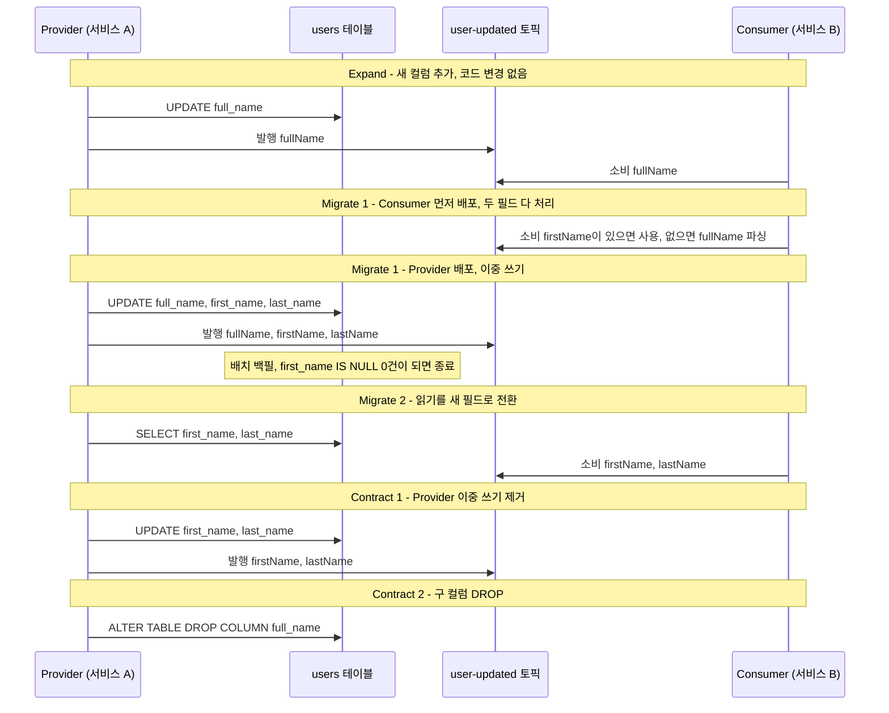
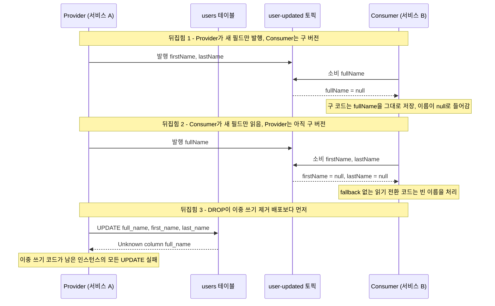

# Expand-Migrate-Contract 패턴

MSA 환경에서 DB 스키마를 변경하면 배포가 복잡해진다. 서비스를 한 번에 내려서 마이그레이션하는 Big Bang 방식은 모놀리스에서나 통하는 방법이다. 여러 서비스가 같은 DB를 바라보거나, 한 서비스를 여러 인스턴스로 배포하는 상황에서 컬럼 이름을 바꾸거나 테이블 구조를 바꾸면 롤링 배포 중에 반드시 오류가 발생한다.

Expand-Migrate-Contract(이하 EMC)는 스키마 변경을 세 단계로 나눠서 언제든 롤백할 수 있게 만드는 방법이다.

---

## 왜 이 패턴이 필요한가

서비스 A와 서비스 B가 모두 `users` 테이블의 `full_name` 컬럼을 읽는 상황에서, 이것을 `first_name`과 `last_name`으로 분리한다고 가정하자.

단순하게 접근하면 이렇게 된다.

1. `full_name` 컬럼 삭제, `first_name`/`last_name` 컬럼 추가
2. 서비스 A, B 코드를 새 컬럼으로 바꿔서 배포

문제는 배포 중간 상태다. 새 코드가 배포되기 전에 DB 스키마가 먼저 바뀌면, 아직 롤링 배포 중인 구 버전 인스턴스들이 `full_name`을 읽으려다 실패한다. 반대로 코드를 먼저 배포하면 새 컬럼이 없어서 실패한다.

EMC는 이 문제를 단계별로 해결한다.

```
[Expand]   DB에 새 컬럼 추가 (구 컬럼 유지)
[Migrate]  데이터 마이그레이션 + 이중 쓰기
[Contract] 구 컬럼 제거
```

각 단계 사이에 모든 서비스가 새 상태에 맞게 배포되어야 다음 단계로 넘어간다. 한 단계가 끝나면 그 상태가 stable하기 때문에 언제든 멈출 수 있다.

아래 상태도는 단계 전이와 각 전이에서 일어나는 배포·DB 작업을 보여준다. 화살표가 되돌아가는 방향이 롤백이고, Contract 중 `full_name` DROP 이후에는 되돌아가는 화살표가 없다.

```mermaid
stateDiagram-v2
    direction LR
    state "시작 - full_name만 읽고 쓴다" as S0
    state "Expand 완료 - 새 컬럼 추가, 아무도 안 쓴다" as S1
    state "Migrate 1 - 이중 쓰기, 읽기는 full_name" as S2
    state "Migrate 2 - 백필 끝, 읽기를 새 컬럼으로 전환" as S3
    state "Contract 1 - 이중 쓰기 코드 제거" as S4
    state "Contract 2 - full_name DROP" as S5

    [*] --> S0
    S0 --> S1: DB ADD COLUMN, 서비스 배포 없음
    S1 --> S2: 서비스 A, B 배포
    S2 --> S3: 배치 백필 후 서비스 A, B 읽기 전환 배포
    S3 --> S4: 서비스 A, B 배포
    S4 --> S5: DB DROP COLUMN
    S1 --> S0: 컬럼 삭제
    S2 --> S1: 서비스 이전 버전으로 롤백
    S3 --> S2: 읽기 전환 롤백
    S4 --> S3: 서비스 이전 버전으로 롤백
    S5 --> [*]
```



이중 쓰기 제거(S4)가 DROP(S5)보다 앞이다. 순서를 뒤집으면 어디서 깨지는지는 뒤의 다중 서비스 절에서 시퀀스로 본다.

단계마다 구 컬럼과 새 컬럼에 누가 무엇을 하는지는 이 표로 정리된다.

| 단계 | 쓰기 | 읽기 | DB 상태 |
|---|---|---|---|
| 시작 | `full_name` | `full_name` | 구 컬럼만 |
| Expand | `full_name` | `full_name` | 새 컬럼 NULL로 추가 |
| Migrate 1 | `full_name` + 새 컬럼 | `full_name` | 새 컬럼이 신규 쓰기부터 채워지는 중 |
| Migrate 2 | `full_name` + 새 컬럼 | 새 컬럼 | 백필 완료, `first_name IS NULL` 0건 |
| Contract 1 | 새 컬럼 | 새 컬럼 | 구 컬럼은 남아 있지만 아무도 안 쓴다 |
| Contract 2 | 새 컬럼 | 새 컬럼 | 구 컬럼 DROP |

---

## 1단계: Expand

기존 구조를 건드리지 않고 새 컬럼을 추가한다. 이 단계에서의 마이그레이션 스크립트는 항상 안전하다. 컬럼 추가는 MySQL/PostgreSQL 모두 온라인으로 가능하다.

```sql
-- Expand: 새 컬럼 추가 (NOT NULL 제약 없이, 기본값도 없이)
ALTER TABLE users
    ADD COLUMN first_name VARCHAR(100),
    ADD COLUMN last_name  VARCHAR(100);
```

`NOT NULL`을 걸지 않는 이유가 있다. 구 버전 서비스는 아직 `first_name`/`last_name`을 채우지 않는다. Expand 단계 직후에는 새 컬럼이 전부 NULL이고, 그 상태로 구 코드가 INSERT/UPDATE를 해도 오류가 나지 않아야 한다.

이 단계에서 서비스 코드는 바꾸지 않는다. DB만 변경하고 배포는 없다.

---

## 2단계: Migrate

두 가지 작업이 동시에 진행된다.

- 기존 데이터를 새 컬럼으로 복사 (배치)
- 새로 들어오는 쓰기에서 구 컬럼과 새 컬럼을 함께 채움 (이중 쓰기)

### 이중 쓰기(Dual Write) 구현

서비스 코드를 수정해서 쓰기 시점에 두 컬럼을 모두 채운다.

```java
@Service
public class UserService {

    @Transactional
    public User updateName(Long userId, String firstName, String lastName) {
        User user = userRepository.findById(userId)
            .orElseThrow(() -> new EntityNotFoundException("User not found: " + userId));

        // 구 컬럼: 호환성 유지
        user.setFullName(firstName + " " + lastName);

        // 신 컬럼: 새 구조에 맞게 채움
        user.setFirstName(firstName);
        user.setLastName(lastName);

        return userRepository.save(user);
    }
}
```

읽기는 아직 구 컬럼(`full_name`)에서 한다. 새 컬럼을 읽으려면 모든 데이터가 마이그레이션 완료된 이후여야 한다.

### 기존 데이터 배치 마이그레이션

```java
@Component
public class NameMigrationJob {

    private final JdbcTemplate jdbcTemplate;

    public void migrate() {
        int batchSize = 1000;
        Long lastId = 0L;

        while (true) {
            List<Map<String, Object>> rows = jdbcTemplate.queryForList(
                "SELECT id, full_name FROM users WHERE id > ? AND first_name IS NULL LIMIT ?",
                lastId, batchSize
            );

            if (rows.isEmpty()) break;

            for (Map<String, Object> row : rows) {
                Long id = (Long) row.get("id");
                String fullName = (String) row.get("full_name");
                String[] parts = splitName(fullName);

                jdbcTemplate.update(
                    "UPDATE users SET first_name = ?, last_name = ? WHERE id = ?",
                    parts[0], parts[1], id
                );

                lastId = id;
            }
        }
    }

    private String[] splitName(String fullName) {
        if (fullName == null || !fullName.contains(" ")) {
            return new String[]{fullName, ""};
        }
        int idx = fullName.indexOf(" ");
        return new String[]{fullName.substring(0, idx), fullName.substring(idx + 1)};
    }
}
```

배치를 한 번에 전부 돌리지 않고 ID 기준으로 페이지네이션하는 이유는, 대용량 테이블에서 한 번에 UPDATE를 날리면 락 경합이 심해져서 서비스에 영향을 준다. 1000건 단위로 나눠서 처리하면 각 UPDATE 트랜잭션이 짧게 끝나고, 중간에 멈춰도 마지막 처리한 ID부터 재시작할 수 있다.

### 마이그레이션 진행 확인

```sql
-- 전체 대비 마이그레이션 완료 비율
SELECT
    COUNT(*) AS total,
    SUM(CASE WHEN first_name IS NOT NULL THEN 1 ELSE 0 END) AS migrated,
    ROUND(SUM(CASE WHEN first_name IS NOT NULL THEN 1 ELSE 0 END) * 100.0 / COUNT(*), 2) AS pct
FROM users;
```

이 쿼리로 마이그레이션 진행률을 모니터링한다. 100%가 되면 다음 단계로 넘어갈 수 있다.

배치 마이그레이션과 이중 쓰기가 둘 다 완료된 시점, 즉 `first_name IS NULL`인 레코드가 0건이 된 시점에, 읽기도 새 컬럼으로 전환한다.

```java
// Migrate 단계 후반: 읽기를 새 컬럼으로 전환
public String getFullName(User user) {
    // 새 컬럼으로 읽기 전환
    return user.getFirstName() + " " + user.getLastName();
}
```

---

## 3단계: Contract

모든 서비스가 새 컬럼으로 읽고 쓰는 상태가 확인되면 구 컬럼을 제거한다. 순서는 서비스 코드에서 이중 쓰기를 먼저 걷어내 배포하고, 그다음에 컬럼을 DROP한다.

```java
@Transactional
public User updateName(Long userId, String firstName, String lastName) {
    User user = userRepository.findById(userId)
        .orElseThrow(() -> new EntityNotFoundException("User not found: " + userId));

    // 이중 쓰기 제거: 새 컬럼만 사용
    user.setFirstName(firstName);
    user.setLastName(lastName);

    return userRepository.save(user);
}
```

이 코드가 모든 인스턴스에 나간 뒤에 컬럼을 지운다.

```sql
-- Contract: 구 컬럼 제거
ALTER TABLE users DROP COLUMN full_name;
```

DROP을 먼저 하면 `setFullName`이 남아 있는 인스턴스의 UPDATE가 `Unknown column 'full_name'`으로 실패한다. Hibernate는 매핑된 컬럼을 전부 SQL에 넣기 때문에 `full_name`을 안 건드리는 요청도 같이 죽는다.

Contract 단계는 되돌릴 수 없다. 컬럼을 DROP하면 데이터가 사라지기 때문에, 이 단계 전에 모든 서비스의 배포가 완료됐는지 반드시 확인해야 한다.

---

## 다중 서비스 환경에서의 이중 쓰기

서비스가 여러 개일 때 이중 쓰기는 더 복잡하다. 서비스 A는 이중 쓰기를 하고 있는데, 서비스 B는 아직 구 컬럼만 쓴다면, B가 업데이트한 레코드의 새 컬럼은 NULL이 된다.

이 상황을 처리하는 방법이 두 가지 있다.

**방법 1: DB 트리거로 동기화**

```sql
-- full_name이 바뀌면 first_name/last_name도 자동으로 채움
CREATE TRIGGER sync_name_split
BEFORE INSERT OR UPDATE ON users
FOR EACH ROW
BEGIN
    IF NEW.full_name IS NOT NULL AND (NEW.first_name IS NULL OR NEW.last_name IS NULL) THEN
        SET NEW.first_name = SUBSTRING_INDEX(NEW.full_name, ' ', 1);
        SET NEW.last_name  = SUBSTRING(NEW.full_name, LENGTH(SUBSTRING_INDEX(NEW.full_name, ' ', 1)) + 2);
    END IF;
END;
```

트리거를 쓰면 서비스 배포 순서에 상관없이 데이터 일관성이 유지된다. 다만 트리거는 디버깅이 어렵고, DB 레벨에서 비즈니스 로직이 생기는 것을 싫어하는 팀도 있다.

**방법 2: 서비스 배포 순서 조율**

트리거를 쓰지 않으면 서비스 배포 순서를 명확히 정해야 한다.

```
1. DB Expand (컬럼 추가)
2. 서비스 A 배포 (이중 쓰기 시작)
3. 서비스 B 배포 (이중 쓰기 시작)
4. 배치 마이그레이션 실행
5. 서비스 A 배포 (새 컬럼으로 읽기 전환)
6. 서비스 B 배포 (새 컬럼으로 읽기 전환)
7. 서비스 A, B 배포 (이중 쓰기 코드 제거)
8. DB Contract (구 컬럼 제거)
```

단계가 많아지지만, 어느 시점이든 구 컬럼 또는 새 컬럼 중 하나는 반드시 유효한 데이터를 갖고 있다. 이중 쓰기 제거(7)가 DROP(8)보다 먼저여야 한다.

### Kafka 이벤트와 이중 쓰기

이벤트 기반 아키텍처에서는 한 가지가 더 있다. 서비스 A가 이벤트를 발행하고 서비스 B가 그 이벤트를 소비해서 DB에 쓰는 경우, 이벤트 스키마도 바꿔야 한다.

이때도 같은 원칙이 적용된다. 이벤트에 구 필드와 새 필드를 함께 넣어서 발행하고, 소비자는 두 필드를 모두 처리할 수 있게 만든다.

```java
// 이벤트 발행 (Migrate 단계)
public class UserUpdatedEvent {
    // 구 필드: 구 버전 소비자를 위해 유지
    @Deprecated
    private String fullName;

    // 신 필드
    private String firstName;
    private String lastName;
}

// 이벤트 소비 (Migrate 단계)
@KafkaListener(topics = "user-updated")
public void handleUserUpdated(UserUpdatedEvent event) {
    // 새 필드가 있으면 새 필드 사용, 없으면 구 필드에서 파싱
    String firstName = event.getFirstName() != null
        ? event.getFirstName()
        : splitName(event.getFullName())[0];
    String lastName = event.getLastName() != null
        ? event.getLastName()
        : splitName(event.getFullName())[1];

    // 처리 로직
}
```

아래 시퀀스는 Provider(서비스 A, `users` 테이블 소유)와 Consumer(서비스 B, 이벤트로만 이름을 받는다)의 배포 순서가 맞을 때 단계별로 어떤 필드가 오가는지 보여준다. 볼 곳은 두 군데다. Migrate 1에서 Consumer가 먼저 나가고, Contract에서 Provider가 이중 쓰기를 걷어낸 뒤에 DROP이 실행된다.



배포 순서가 뒤집히면 세 군데에서 깨진다. 아래 시퀀스는 각각 어느 메시지에서 실패하는지 보여준다. 앞의 두 개는 오류가 나지 않고 null이 조용히 들어가서, 장애가 한참 뒤에 데이터 불일치로 드러난다.



뒤집힘 2는 Migrate 1에서 본 fallback 코드(`getFirstName() != null ? ... : splitName(...)`)가 있으면 막힌다. fallback을 빼고 새 필드만 읽는 코드는 Provider가 이중 쓰기로 나가고 Kafka의 이전 메시지가 다 소비된 뒤에 배포한다. 토픽에 구 형식 메시지가 남아 있는 동안은 새 필드가 없는 메시지가 계속 들어온다.

---

## 단계별 롤백 시나리오

### Expand 단계 롤백

컬럼 추가만 했고 서비스 배포는 없다. 롤백은 컬럼만 삭제하면 된다.

```sql
ALTER TABLE users
    DROP COLUMN first_name,
    DROP COLUMN last_name;
```

데이터가 없으니 손실 없이 롤백된다.

### Migrate 단계 롤백

이중 쓰기 중에 문제가 생기면 이전 서비스 버전으로 롤백한다. 구 버전은 `full_name`만 쓰니까 새 컬럼은 NULL로 남아도 구 컬럼에는 영향이 없다. DB는 Expand 상태 그대로 유지하면 된다.

배치 마이그레이션이 진행 중이었다면 그냥 멈추면 된다. `WHERE first_name IS NULL` 조건으로 마이그레이션이 안 된 레코드를 식별할 수 있으니까 언제든 재시작할 수 있다.

### Contract 단계 롤백

Contract 단계, 즉 `DROP COLUMN` 이후에는 롤백이 없다. DB 백업에서 복원하는 것 말고는 방법이 없다.

Contract에 진입하기 전에 모든 서비스의 새 버전 배포가 끝났는지, 새 컬럼이 NULL인 레코드가 0건인지 확인한다. 새 컬럼으로만 읽는 상태를 최소 1주일은 유지해서 월말 배치나 주간 리포트처럼 드물게 도는 코드가 구 컬럼을 읽지 않는지도 거른다.

---

## Spring Boot에서의 JPA Entity 변경

EMC를 JPA Entity와 함께 쓸 때 주의할 부분이 있다.

```java
@Entity
@Table(name = "users")
public class User {

    @Id
    @GeneratedValue(strategy = GenerationType.IDENTITY)
    private Long id;

    // Expand/Migrate 단계: 두 컬럼 모두 매핑
    @Column(name = "full_name")
    @Deprecated
    private String fullName;

    @Column(name = "first_name")
    private String firstName;

    @Column(name = "last_name")
    private String lastName;
}
```

JPA의 `ddl-auto`를 `validate` 또는 `none`으로 설정해야 한다. `update`나 `create`로 쓰면 Hibernate가 스키마를 임의로 변경할 수 있다. 프로덕션에서 `ddl-auto=update`를 쓰는 곳은 없겠지만, 스테이징 환경에서 실수하는 경우가 있다.

```yaml
spring:
  jpa:
    hibernate:
      ddl-auto: validate
```

`validate`를 쓰면 Entity 매핑과 실제 DB 스키마가 다를 때 애플리케이션 시작 시점에 바로 오류를 뱉는다. Expand 이후 Entity에 새 컬럼을 추가하지 않았다면 여기서 걸린다.

### Flyway와 함께 쓸 때

스키마 변경을 Flyway로 관리한다면, 각 단계를 별도 버전으로 분리한다.

```
V1__expand_users_name.sql      -- Expand: first_name, last_name 컬럼 추가
V2__migrate_users_name.sql     -- 필요하면 초기 마이그레이션 SQL
V3__contract_users_name.sql    -- Contract: full_name 컬럼 제거
```

V3는 V2가 완전히 적용되고 모든 서비스가 새 컬럼으로 전환된 후에야 실행한다. Flyway 버전 파일이 있다고 해서 바로 실행하는 것이 아니라, 단계별로 조율하면서 적용해야 한다.

---

## 실제로 겪는 문제들

**배치 마이그레이션 도중 데드락**

배치 UPDATE와 서비스의 실시간 UPDATE가 같은 레코드를 두고 충돌하면 데드락이 생긴다. 배치 사이즈를 줄이고, 배치 실행 주기를 낮 시간대를 피해서 잡는다. 또는 `FOR UPDATE SKIP LOCKED`를 써서 잠긴 레코드는 건너뛴다.

```sql
-- PostgreSQL에서 잠긴 레코드 건너뛰기
SELECT id FROM users
WHERE first_name IS NULL
ORDER BY id
LIMIT 1000
FOR UPDATE SKIP LOCKED;
```

**이중 쓰기 중 데이터 불일치**

애플리케이션이 `full_name`은 업데이트했는데 `first_name`/`last_name`은 업데이트하지 못하고 죽었다면, 두 컬럼이 불일치한다. 배치 마이그레이션 쿼리를 `first_name IS NULL`만 조건으로 걸면 이런 케이스를 잡지 못한다.

주기적으로 불일치 레코드를 점검하는 쿼리를 돌린다.

```sql
-- 이중 쓰기 불일치 탐지
SELECT id, full_name, first_name, last_name
FROM users
WHERE first_name IS NOT NULL
  AND CONCAT(first_name, ' ', last_name) != full_name;
```

**Contract 후 롤백 상황**

Contract를 실행하고 나서 구 버전 서비스가 일부 인스턴스에 남아 있으면 `full_name` 컬럼을 찾다가 오류를 낸다. 롤링 배포 중에 Contract를 실행하면 이런 일이 생긴다. Contract는 반드시 모든 인스턴스가 새 버전으로 배포 완료된 후에 실행해야 한다.

---

EMC는 패턴이 간단한 것처럼 보이지만, 다중 서비스가 엮이고 이벤트 스키마까지 바꿔야 할 때는 조율해야 할 포인트가 많다. 중요한 것은 각 단계가 끝난 후의 상태가 독립적으로 stable해야 한다는 점이다. 언제든 멈출 수 있고, 언제든 롤백할 수 있는 상태를 유지하면서 다음 단계로 넘어가야 한다.

---

## 단계 통과 조건을 can-i-deploy로 확인

이벤트 필드가 소비자 계약에 들어 있으면 뒤집힘 1, 2는 배포 전에 걸린다. Consumer가 새 필드만 읽는 버전(Migrate 2)은 Provider의 새 필드 발행 버전이 prod에 `record-deployment`로 기록돼 있어야 `can-i-deploy`를 통과하고, Provider가 `fullName` 발행을 끊는 버전(Contract 1)은 prod에 `fullName`을 요구하는 소비자 계약이 남아 있으면 `can-i-deploy`에서 막힌다.
컬럼 DROP(뒤집힘 3)은 계약에 안 잡히는 DB 내부 변경이라 `can-i-deploy`가 막아주지 못한다. 이 단계는 Contract 1 배포가 모든 인스턴스에 끝났는지로 직접 확인한다. 명령어와 브로커 기록 누락으로 미탐이 나는 경우는 [Service Contract Testing](Service_Contract_Testing.md)에 있다.
