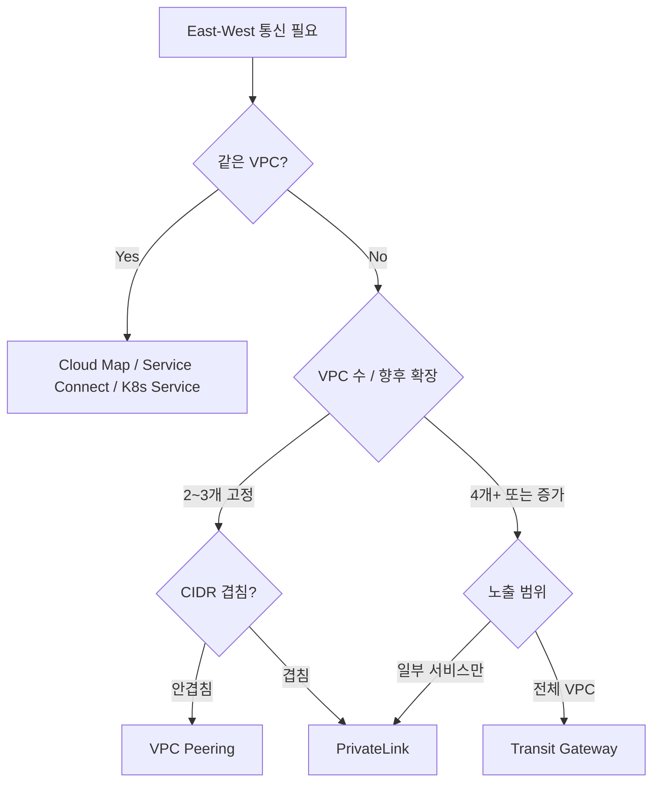

# AWS VPC를 MSA에서 어떻게 설계할 것인가

VPC 자체는 어렵지 않다. 서브넷 자르고 라우트 테이블 붙이고 NAT 박으면 끝이다. 문제는 서비스가 30개를 넘어가는 순간부터 시작된다. ECS Task가 ENI 하나씩 잡으면서 /24 서브넷이 일주일 만에 IP가 동난다거나, 신규 결제 도메인 팀이 자기네 계정에 별도 VPC를 파고 합류하는데 CIDR이 겹쳐서 Peering이 안 되거나, AZ 간 트래픽 비용이 컴퓨트보다 더 나오는 일이 흔하다.

기존 [VPC.md](../../AWS/Network/VPC.md), [PrivateLink.md](../../AWS/Network/PrivateLink.md), [Transit_Gateway.md](../../AWS/Network/Transit_Gateway.md), [VPC_Peering.md](../../AWS/Network/VPC_Peering.md), [VPC_Endpoints.md](../../AWS/Network/VPC_Endpoints.md) 문서가 각 자원의 동작을 다룬다면, 이 문서는 MSA 환경에서 그것들을 언제 어떻게 조합하는지에 집중한다.

---

## 단일 VPC vs 멀티 VPC: 처음 결정해야 하는 것

서비스가 5~10개 정도라면 단일 VPC + 서브넷 분리로 충분하다. 운영 부담이 가장 낮고, 라우팅 테이블이 평면적이라 트러블슈팅도 빠르다. 문제는 조직이 커지면서 발생한다.

### 단일 VPC를 유지하기 어려운 시점

- **서비스 팀이 8개 이상으로 늘어났을 때**: 보안 그룹 변경 한 번으로 전체가 영향받는다. 라우트 테이블 한 줄 잘못 건드리면 멀쩡한 결제 서비스가 죽는다.
- **규제 요건이 도메인별로 다를 때**: PCI DSS 적용받는 결제 도메인과 일반 백오피스를 같은 VPC에 두면 PCI 감사 범위가 VPC 전체로 확장된다. 감사 비용이 그대로 늘어난다.
- **CIDR이 부족해질 때**: `/16` 한 개로 시작했는데 ECS Fargate가 awsvpc 모드로 Task당 ENI 하나씩 잡기 시작하면 `/16`도 빠르게 마른다. Secondary CIDR을 붙일 수는 있는데 라우팅이 점점 복잡해진다.

### Landing Zone 구조: 실무에서 자주 쓰이는 형태

AWS Control Tower나 자체 구축이든 결국 비슷한 그림이 된다.

```
Management Account (조직 루트)
├── Security Account (GuardDuty, Security Hub 위임)
├── Log Archive Account (CloudTrail, VPC Flow Logs 중앙 수집)
├── Network Account (Transit Gateway, Route53 Resolver, 공유 VPC Endpoint)
│   └── Egress VPC (NAT Gateway 집중)
│   └── Inspection VPC (Network Firewall)
├── Shared Services Account (CI/CD, Artifact, 공유 DB)
└── Workload Accounts (도메인/환경별)
    ├── payment-prod
    ├── payment-stg
    ├── order-prod
    └── order-stg
```

핵심은 **NAT Gateway와 VPC Endpoint를 Network 계정에 모으는 것**이다. 워크로드 VPC마다 NAT를 두면 AZ별 NAT 비용이 도메인 수만큼 곱해진다. Egress VPC 하나에 NAT를 두고 Transit Gateway로 트래픽을 모으면 NAT 시간당 비용은 한 자리수로 묶인다.

다만 트레이드오프가 있다. Egress VPC를 거치면 NAT 처리량(45 Gbps 한계)이 전사 병목이 된다. 데이터 전송량이 큰 도메인(미디어, 분석)은 자체 NAT를 두는 편이 낫다.

### 계정 분리 vs VPC 분리

같은 계정 안에 VPC만 여러 개 두는 것과, 계정 자체를 분리하는 것은 다른 문제다.

- **계정 분리**: IAM 경계가 자연스럽게 생긴다. 폭주한 람다가 다른 도메인 리소스를 만질 수 없다. 비용 분리도 깔끔하다.
- **VPC 분리**: 같은 IAM 권한 안이라 휴먼 에러로 도메인 경계를 넘기 쉽다. 비용 태그로 강제 분리해야 한다.

5년차 이상 팀이라면 처음부터 계정 분리로 가는 게 낫다. 나중에 계정을 쪼개는 작업은 진짜 지옥이다. RDS 스냅샷 공유, KMS 키 재발급, IAM Role 재구성, 모든 자동화 스크립트 수정이 동반된다.

---

## 서브넷 IP 고갈: MSA에서 가장 빈번한 사고

### ENI 하나당 IP 하나라는 사실

EC2든 ECS Fargate든 Lambda(VPC 모드)든 RDS든, VPC 내부에 붙는 것은 전부 ENI를 통해 IP를 소비한다. ECS Fargate를 awsvpc 모드로 돌리면 Task 하나당 ENI 하나, 즉 IP 하나가 잡힌다. EC2 위 ECS도 awsvpc 모드면 Task별로 ENI를 따로 잡는다(bridge 모드는 인스턴스 IP 공유).

### 실제로 IP가 어떻게 빠지는지 계산

`/24` 서브넷은 사용 가능한 IP가 251개다(AWS 예약 5개 빠짐). 50개 서비스가 각각 평균 5개 Task, 거기에 Blue/Green 배포 중 일시적으로 2배로 늘어난다면:

```
50 서비스 × 5 Task × 2배(배포 중) = 500 IP
```

서브넷 하나로는 부족하다. 거기에 RDS, ElastiCache, ALB의 ENI까지 합치면 더 빠르게 마른다. Lambda VPC 호출이 폭증하면 Lambda Hyperplane ENI가 더 잡힌다(다행히 최근에는 공유 ENI라 예전만큼 심하지 않다).

### Secondary CIDR로 IP 늘릴 때 주의점

VPC에 CIDR을 추가로 붙일 수 있다(RFC 1918 범위 안에서 또는 100.64.0.0/10 CG-NAT 범위). 다만:

- **Peering된 다른 VPC와 CIDR이 겹치면 안 된다.** Peering은 CIDR 충돌을 허용하지 않는다.
- **Transit Gateway 라우팅 테이블에도 별도로 전파해야 한다.** 추가 CIDR이 자동으로 보이는 게 아니다.
- **DNS Resolver 규칙도 다시 봐야 한다.** Inbound/Outbound Endpoint가 두 CIDR 모두에서 접근 가능한지.
- **100.64.0.0/10을 추가 CIDR로 쓰면 NAT가 거의 강제된다.** Carrier-Grade NAT 영역이라 외부 통신 시 변환이 필요하다.

가장 안전한 접근은 처음부터 `/16` 두 개를 예약해 두는 것이다. 운영 중 IP가 부족해서 Secondary CIDR을 박는 순간 라우팅 테이블 변경의 폭발 반경이 크다.

### Pod/Task 밀집 시 Prefix Delegation

EKS를 쓴다면 IP Prefix Delegation을 켜는 게 표준이 됐다. ENI 하나에 `/28` Prefix(16 IP)를 받아서 Pod에 분배한다. ENI 한계(인스턴스 타입별 다름)에 막혀서 Pod 밀도가 안 올라가는 문제를 해결한다.

```yaml
# aws-node DaemonSet 환경 변수
env:
  - name: ENABLE_PREFIX_DELEGATION
    value: "true"
  - name: WARM_PREFIX_TARGET
    value: "1"
```

Prefix Delegation을 켜면 ENI당 IP가 늘어나지만, 서브넷에 `/28` 단위 빈 공간이 충분히 있어야 한다. 작은 서브넷에서는 오히려 단편화로 실패한다.

---

## East-West 통신: 어떻게 연결할 것인가

서비스 간 통신은 동일 VPC인지, 다른 VPC인지, 다른 계정인지에 따라 선택지가 달라진다.

### 같은 VPC 안: Service Discovery로 충분

같은 VPC 안 서비스끼리는 ECS Service Connect나 Cloud Map(Private DNS Namespace)으로 해결된다. ALB를 굳이 사이에 둘 필요가 없다.

```
order-service.internal → Cloud Map → 10.0.12.34, 10.0.12.56, 10.0.12.78
```

ALB를 East-West에 박는 패턴은 비용도 비싸고 추가 홉이 생긴다. ALB 시간당 비용 + LCU + Cross-AZ 트래픽이 합쳐진다. 외부 진입점(North-South)에만 ALB/NLB를 쓰고 내부는 DNS 기반 디스커버리가 정석이다.

EKS면 Kubernetes Service + CoreDNS로 자연스럽게 풀린다. ClusterIP 서비스가 곧 East-West 라우팅이다.

### 다른 VPC: 무엇을 쓸지 선택 기준

선택지는 VPC Peering, PrivateLink, Transit Gateway 셋이다. 결정 기준은 다음과 같다.

**VPC Peering을 쓸 때**
- VPC가 2~3개 정도로 적고 앞으로도 그럴 때
- 전체 CIDR을 서로 노출해도 보안상 문제없을 때(같은 팀 소유, 같은 신뢰 경계)
- 트래픽 비용을 최소화하고 싶을 때(Peering 자체 시간당 비용은 없음, 데이터 전송만 과금)

Peering은 비추이적이다. A-B, B-C가 있다고 A-C가 통신되지 않는다. 메시 토폴로지가 N(N-1)/2로 폭발하므로 4~5개 이상 되면 관리가 안 된다.

**PrivateLink를 쓸 때**
- 일부 서비스만 노출하고 싶을 때(엔드포인트 단위 노출)
- CIDR이 겹쳐도 통신해야 할 때(PrivateLink는 양쪽 CIDR을 합치지 않음)
- SaaS형으로 다른 팀/조직에 서비스를 제공할 때
- 양방향이 아니라 단방향(소비자 → 공급자)만 필요할 때

PrivateLink는 NLB 뒤에 서비스를 놓고 Endpoint Service로 노출한다. 소비자 VPC에는 Interface Endpoint(ENI)가 생긴다. 시간당 비용과 GB당 비용이 붙어서 트래픽이 많으면 Peering보다 비싸진다.

**Transit Gateway를 쓸 때**
- VPC가 4개 이상이고 더 늘어날 예정일 때
- 멀티 계정 환경에서 허브-스포크가 필요할 때
- On-prem과 Direct Connect/VPN으로 연결할 때
- 라우팅 도메인을 분리하고 싶을 때(라우팅 테이블 여러 개로 격리)

TGW는 시간당 비용이 비싸다(Attachment당 + GB당). 다만 운영 단순성으로 그 비용을 상쇄한다. 신규 VPC를 붙일 때 Attachment 하나 만들면 끝이다.

### 의사결정 흐름



실무에서는 혼합이 흔하다. 백본은 TGW로 묶고, SaaS 연동이나 외부 노출은 PrivateLink로 가는 식이다.

---

## AZ 간 트래픽 비용: 컴퓨트보다 비싸지는 순간

AZ 간 트래픽은 GB당 양방향으로 과금된다. 인-AZ는 무료다. MSA에서 서비스 호출이 체인을 이루면 한 요청이 AZ를 여러 번 횡단한다.

```
Client → ALB(AZ-a) → svc-A(AZ-b) → svc-B(AZ-c) → svc-C(AZ-a) → RDS(AZ-b)
```

한 요청이 5번 AZ를 넘는다. 1KB 응답에 5KB 횡단 트래픽이 발생한다. 트래픽이 늘면 트래픽 비용만 월 수천 달러가 나온다.

### Topology-aware Routing

EKS 1.27+는 Topology Aware Hints를 표준 기능으로 지원한다. Service에 어노테이션을 붙이면 같은 AZ Pod로 우선 라우팅한다.

```yaml
apiVersion: v1
kind: Service
metadata:
  name: order-service
  annotations:
    service.kubernetes.io/topology-mode: Auto
```

ECS Service Connect도 비슷하게 Availability Zone Affinity 옵션이 있다. 같은 AZ Task로 먼저 보낸다.

주의할 점은 AZ 간 Pod 분포가 균등하지 않으면 부하 쏠림이 생긴다. 한 AZ에 Pod이 1개, 다른 AZ에 10개면 1개짜리 AZ의 Pod이 그 AZ의 모든 트래픽을 받는다. PodTopologySpreadConstraints로 분포를 강제해야 한다.

### Zonal Shift

특정 AZ에 장애가 의심될 때 ALB 트래픽을 해당 AZ에서 즉시 빼낼 수 있는 기능이다. Route53 ARC의 일부다.

```bash
aws arc-zonal-shift start-zonal-shift \
  --resource-identifier arn:aws:elasticloadbalancing:... \
  --away-from use1-az2 \
  --expires-in 1h \
  --comment "Suspected AZ-2 degradation"
```

자동화된 ASG/CloudWatch 알람과 묶어두면 AZ 부분 장애 때 사람 손 안 타고 트래픽을 회피한다. 다만 RDS나 ElastiCache 같은 백엔드는 Zonal Shift 대상이 아니라서 별도 페일오버 로직이 필요하다.

---

## VPC Endpoint: AWS 서비스 호출을 NAT 없이

워크로드가 S3, Secrets Manager, ECR, CloudWatch Logs를 호출하는 트래픽이 NAT Gateway를 통과하면 비용이 폭증한다. NAT는 GB당 과금되는데, 컨테이너 이미지 풀이나 로그 전송은 트래픽이 크다.

### Gateway Endpoint와 Interface Endpoint

- **Gateway Endpoint**: S3, DynamoDB만 지원. 라우트 테이블에 prefix list 라우트가 추가되는 방식. 시간당 비용 없음. 데이터 전송 비용 없음.
- **Interface Endpoint(PrivateLink)**: 그 외 거의 모든 서비스. ENI가 생성됨. 시간당 비용 + GB당 비용. 다만 NAT보다 싸다.

ECR을 예로 들면, Fargate Task가 컨테이너 이미지를 풀할 때 다음 엔드포인트가 필요하다.

- `com.amazonaws.region.ecr.api` (Interface)
- `com.amazonaws.region.ecr.dkr` (Interface)
- `com.amazonaws.region.s3` (Gateway, ECR 레이어 저장소)
- `com.amazonaws.region.logs` (Interface, CloudWatch Logs)
- `com.amazonaws.region.secretsmanager` (Interface, Task 환경변수용)

다섯 개 모두 없으면 NAT를 타고 이미지가 다운로드된다. ECR 레이어가 큰 이미지(500MB+)를 자주 푸시-풀하면 NAT 비용이 진짜 무섭게 나온다.

### 공유 엔드포인트 패턴

매 워크로드 VPC마다 Interface Endpoint를 만들면 시간당 비용이 누적된다. Network 계정의 Egress VPC에 엔드포인트를 한 번 만들고, Route53 Resolver의 Private Hosted Zone으로 PrivateLink DNS 이름을 워크로드 VPC들에 전파한다.

다만 DNS 이름이 자동으로 안 되는 케이스가 있다. `Private DNS Name` 옵션이 활성화되지 않은 PrivateLink 서비스는 Endpoint Service DNS를 명시적으로 써야 한다.

### Endpoint 정책 함정

VPC Endpoint에 정책을 붙이면 그 엔드포인트를 통한 호출만 제한된다. 정책을 잘못 쓰면 응답이 503으로 돌아온다.

```json
{
  "Statement": [{
    "Effect": "Allow",
    "Principal": "*",
    "Action": "s3:GetObject",
    "Resource": "arn:aws:s3:::my-app-bucket/*"
  }]
}
```

이 정책은 `s3:GetObject`만 허용한다. `s3:ListBucket`이 빠져 있어서 `aws s3 ls`나 SDK의 prefix 탐색이 403이 된다. 그런데 일부 클라이언트는 403을 503으로 마스킹해서 트러블슈팅이 꼬인다.

엔드포인트 정책은 최소 필요 권한 + 자주 쓰는 액션을 명시적으로 열어두는 게 안전하다. 처음에는 Allow `*`로 두고 CloudTrail로 실제 호출되는 액션을 본 다음 좁히는 게 빠르다.

---

## Security Group 체이닝: IP 하드코딩 회피

Security Group의 소스로 다른 SG를 지정할 수 있다. CIDR이 아니라 SG ID를 참조한다. 이게 MSA에서 핵심이다.

### 잘못된 방식

```
order-service SG inbound:
  - port 8080 from 10.0.12.0/24  (svc-A 서브넷)
  - port 8080 from 10.0.13.0/24  (svc-B 서브넷)
  - port 8080 from 10.0.14.0/24  (svc-C 서브넷)
```

새 서비스 붙을 때마다 SG를 수정해야 한다. 서비스가 다른 서브넷으로 이동하면 깨진다. 보안 그룹은 점점 IP의 무덤이 된다.

### 올바른 방식: SG-to-SG 참조

```
order-service SG inbound:
  - port 8080 from sg-svc-A
  - port 8080 from sg-svc-B
  - port 8080 from sg-svc-C
```

서비스가 어디로 옮겨가든 SG만 따라다니면 통신이 유지된다. Auto Scaling으로 새 인스턴스가 떠도 SG가 자동 적용되므로 추가 작업이 없다.

### 한계: 다른 VPC 참조

같은 VPC, 또는 Peering된 VPC에서만 SG 참조가 된다. Transit Gateway로 연결된 VPC끼리는 SG 참조가 안 된다(TGW를 통과하면 SG ID가 의미를 잃는다). 이 경우 CIDR로 돌아가야 한다.

해결책은 두 가지다.

1. **CIDR을 깔끔하게 유지**: 도메인별 CIDR 블록을 미리 설계해서 `10.10.0.0/12`는 결제, `10.20.0.0/12`는 주문 식으로 큰 블록으로 끊는다. SG에서 CIDR 한 줄로 처리된다.
2. **Network Firewall이나 Inspection VPC**: TGW 허브에 Inspection VPC를 끼워서 L4/L7 규칙으로 제어한다. SG보다 비싸지만 정책이 중앙화된다.

### Prefix List

CIDR 묶음을 Managed Prefix List로 만들면 SG에 Prefix List ID로 등록할 수 있다. Prefix List를 수정하면 그 List를 쓰는 모든 SG가 자동 반영된다. 사내 VPN CIDR 변경 같은 경우에 유용하다.

---

## 서비스 메시와 VPC 레이어 책임 분리

App Mesh, Istio, Linkerd 같은 서비스 메시를 도입할 때 흔히 하는 실수가 VPC 레이어 정책과 메시 정책을 섞어 쓰는 것이다.

### 책임 경계

- **VPC/SG**: L3/L4 도달성. "이 SG는 이 SG에서 8080으로 들어올 수 있다."
- **서비스 메시**: L7 트래픽 제어. mTLS, 카나리 라우팅, 재시도/타임아웃, Circuit Breaker.

VPC 레이어를 너무 빡빡하게 잠가두면 메시의 동적 라우팅이 깨진다. 새 버전 카나리 배포를 메시에서 99/1로 분기했는데 SG가 신버전 Pod의 IP를 막고 있으면 1%가 전부 실패한다.

기본 원칙은 다음과 같다.
- VPC SG는 **클러스터/서비스 단위로 큰 그물을 친다**. 같은 클러스터 안 모든 Pod는 SG로 허용.
- 그 안의 세밀한 정책은 메시 또는 Kubernetes NetworkPolicy에 맡긴다.

### App Mesh vs Istio: VPC 관점에서

App Mesh는 ACM Private CA와 통합돼서 mTLS 인증서가 IAM 권한으로 발급된다. ENI는 추가로 안 잡는다(Envoy 사이드카는 Task ENI 공유). 다만 동적 라우팅 기능이 Istio에 비해 약하다.

Istio는 sidecar 주입으로 Pod마다 Envoy가 붙는다. Pod IP 하나만 쓰지만 컨테이너 수가 늘어서 CPU/메모리 오버헤드가 있다. Ambient Mesh로 가면 사이드카가 없어지면서 ZTunnel이 노드에 하나만 뜬다.

---

## 멀티 계정 MSA: Transit Gateway 허브 토폴로지

계정이 10개를 넘기는 순간 Peering 메시는 더 이상 답이 없다. TGW 허브로 가야 한다.

### 기본 토폴로지

```
            ┌─────────────────────────┐
            │  Transit Gateway Hub    │
            │  (Network Account)      │
            └────────────┬────────────┘
                         │
        ┌────────────────┼────────────────┐
        │                │                │
   ┌────▼────┐      ┌────▼────┐      ┌────▼────┐
   │payment  │      │order    │      │shared   │
   │  VPC    │      │  VPC    │      │services │
   │         │      │         │      │  VPC    │
   └─────────┘      └─────────┘      └─────────┘
```

각 워크로드 VPC는 TGW Attachment 하나로 허브에 붙는다. TGW Route Table을 여러 개 만들어 라우팅 도메인을 분리한다.

### 라우팅 도메인 분리 예시

- **Production Route Table**: 운영 VPC들만 서로 보임. Staging은 안 보임.
- **Staging Route Table**: 스테이징 VPC들끼리, 그리고 Shared Services로만.
- **Inspection Route Table**: 모든 트래픽이 Inspection VPC를 거치도록 강제.

TGW Route Table은 사실상 라우팅 격벽이다. SG로 막는 게 아니라 라우팅 자체가 없어서 도달이 안 되는 구조다. 잘못된 SG 한 줄로 운영-스테이징이 통신되는 사고를 원천 차단한다.

### RAM(Resource Access Manager)로 TGW 공유

TGW는 한 계정에 있고, 다른 계정의 VPC는 RAM으로 공유받아서 Attachment를 만든다. Attachment 요청을 TGW 소유 계정이 수락해야 활성화된다. 이 수락 단계가 거버넌스 통제점이 된다.

### 비용 함정

TGW는 Attachment당 시간당 비용 + 처리 GB당 비용이 나온다. 작은 VPC 수십 개를 다 붙이면 Attachment 비용만 월 수천 달러다. 환경(dev/stg) 분리는 계정 단위로 하되 TGW Attachment는 prod만 두고 stg는 따로 묶는 식으로 비용을 조절한다.

---

## 운영 중 VPC 변경의 위험: 무엇이 바꿀 수 없는지

운영 중인 VPC에서 못 바꾸는 것들이 있다. 미리 알고 설계해야 한다.

### CIDR은 변경 불가

VPC의 Primary CIDR은 만들 때 한 번 정한 뒤 못 바꾼다. Secondary CIDR을 추가하거나 제거하는 것만 가능하다. CIDR 변경이 정말 필요하면 새 VPC를 만들고 워크로드를 옮기는 마이그레이션이다. 데이터베이스 IP가 바뀌므로 애플리케이션 재구성, DNS TTL 단축, 단계적 트래픽 전환이 필요하다. 보통 3~6개월 프로젝트가 된다.

### 서브넷 AZ는 변경 불가

서브넷은 만들 때 AZ가 고정된다. AZ를 옮기려면 새 서브넷을 만들고 ENI를 이전해야 한다. RDS는 Multi-AZ 서브넷 그룹을 수정하는 식으로 옮길 수 있는데, ALB는 새 ALB를 만들어서 DNS 전환을 해야 한다.

### 라우팅 테이블 수정의 폭발 반경

라우트 한 줄 추가/삭제가 즉시 모든 서브넷 트래픽에 반영된다. 잘못된 라우트로 default route(0.0.0.0/0)를 IGW 대신 다른 곳으로 보내면 외부 통신이 전부 끊긴다.

라우팅 테이블은 변경 전에 반드시 다음을 확인한다.
- 어떤 서브넷이 이 라우팅 테이블을 쓰는가
- 영향받는 인스턴스/Task/Lambda는 무엇인가
- 롤백 라우트를 미리 적어두었는가

Terraform/CDK로 관리하면 plan에서 보이지만, 콘솔에서 손으로 바꾸는 일은 피해야 한다.

### NAT Gateway 재생성 시 EIP 변경

NAT를 재생성하면 EIP가 바뀐다. 외부 API 화이트리스트에 NAT EIP를 등록해 둔 경우 통신이 끊긴다. NAT EIP는 EIP를 미리 할당해서 NAT에 붙이는 식으로 명시적으로 관리한다.

---

## 트러블슈팅 케이스

### Case 1: NAT 처리량 한계로 인한 인터미턴트 실패

증상: 평소엔 멀쩡한데 트래픽 피크 시간에 외부 API 호출이 간헐적으로 실패. 응답이 오는 데 30초 이상 걸리거나 connection timeout.

원인: NAT Gateway는 인스턴스당 처리량 한계가 있다(45 Gbps, 초당 100만 PPS, 동시 연결 5만~5.5만/포트). 한 도메인이 외부 API를 폴링하는 패턴이면 source port가 고갈된다.

해결:
- CloudWatch에서 `ErrorPortAllocation` 메트릭 확인. 0이 아니면 포트 고갈.
- NAT를 여러 AZ에 분산(이미 했다면) + 트래픽 많은 워크로드만 별도 NAT.
- 외부 API가 같은 destination이면 connection pool 재사용 강화.
- 가능하면 PrivateLink로 우회(SaaS가 PrivateLink 제공하는 경우).

### Case 2: ENI 한계 도달

증상: 새 ECS Task 배포 실패. 에러 메시지에 "RESOURCE:ENI" 또는 "no ENI available".

원인: Fargate Task는 awsvpc 모드로 ENI를 잡는다. 계정당 Region당 ENI 한계가 있고(기본 5000), 인스턴스 타입별 ENI 한계도 있다(EC2 ECS).

해결:
- Service Quotas에서 한계 확인 및 상향 요청.
- EC2 ECS면 인스턴스 타입을 ENI 한계가 큰 것으로 변경.
- Fargate면 Task 통합(여러 작은 Task를 큰 Task로 묶기).
- 사용 안 하는 ENI 정리(Lambda VPC 모드 정리 후 ENI가 안 지워지는 경우 있음).

### Case 3: VPC Endpoint 정책 오류로 503

증상: ECR pull 성공, Secrets Manager 조회 실패. 에러는 503 Service Unavailable. CloudTrail에는 호출 기록 없음.

원인: VPC Endpoint 정책이 `secretsmanager:GetSecretValue`는 허용했는데, AWS SDK가 호출 전에 `secretsmanager:DescribeSecret`을 먼저 호출. 그게 막혀서 응답이 503으로 마스킹.

해결:
- VPC Flow Logs와 Endpoint의 CloudWatch 메트릭 확인.
- 정책을 임시로 Allow `*`로 풀고 CloudTrail에 찍히는 액션 전부 확인.
- 정확한 액션 목록을 정책에 추가.

### Case 4: 같은 VPC인데 통신 안 됨

증상: 두 Task가 같은 VPC, 같은 서브넷인데도 통신 안 됨.

원인 후보:
- Security Group: 인바운드 규칙이 SG 참조인데, 클라이언트 SG가 아닌 서버 SG를 잘못 적었다.
- NACL: 서브넷에 NACL이 붙어 있는데 ephemeral port 범위가 막혀 있다. 응답 패킷이 NACL에 막힌다(NACL은 stateless).
- Endpoint Policy: 같은 서비스 안에서 외부 호출하는 경로에 Endpoint Policy가 끼어 있다.

체크 순서:
1. VPC Reachability Analyzer 실행. 어디서 막히는지 즉시 보여준다.
2. Flow Logs에서 ACCEPT/REJECT 확인.
3. Pod 내부에서 `tcpdump`로 SYN이 나가는지 확인. SYN은 나가는데 SYN-ACK이 안 오면 응답 경로 문제(NACL/라우팅).

### Case 5: Transit Gateway로 연결된 VPC 간 통신 비대칭

증상: VPC-A에서 VPC-B로는 되는데 반대 방향이 안 됨.

원인: 양쪽 VPC의 라우팅 테이블에 상대 CIDR 라우트를 둘 다 박아야 하는데 한쪽이 빠짐. TGW Attachment는 만들었지만 라우팅 테이블 전파(Propagation)가 한쪽만 활성화.

해결:
- TGW Route Table의 Routes 탭에서 양쪽 CIDR이 다 보이는지 확인.
- VPC Route Table에 TGW로 가는 라우트가 양쪽에 다 있는지 확인.
- Propagation을 자동으로 두면 Attachment 추가 시 자동 반영. 수동 라우트면 매번 추가해야 한다.

---

## 처음 설계할 때 정해두면 좋은 것

운영 중에 바꾸기 어려운 항목은 처음에 못 박는다.

1. **계정 분리 단위**: 도메인 + 환경(prod/stg/dev). Landing Zone 단계에서 정함.
2. **CIDR 계획**: 도메인별 큰 블록(`/12` 또는 `/13`) 사전 할당. Secondary CIDR 여지를 남기되 의존하지 않음.
3. **서브넷 크기**: 워크로드 서브넷은 최소 `/22` 이상. Fargate awsvpc 환경이라면 `/20`도 작다.
4. **AZ 수**: 3 AZ 표준. 2 AZ는 한 AZ 장애 시 50% 손실이라 위험.
5. **TGW 도입 시점**: VPC 3개 이상이면 미리 TGW 깔아두는 게 낫다. 나중에 Peering에서 TGW로 마이그레이션은 다운타임이 동반된다.
6. **Endpoint 표준 세트**: ECR(api/dkr/s3), CloudWatch Logs, Secrets Manager, SSM, KMS, STS는 기본 세트로 자동 생성.

VPC는 한 번 잘못 설계하면 마이그레이션이 진짜 비싸다. 처음에 한 두 시간 더 쓰는 게 1년 뒤 3개월 프로젝트를 막는다.

---

## 관련 문서

- [VPC 기본 개념](../../AWS/Network/VPC.md)
- [VPC Peering](../../AWS/Network/VPC_Peering.md)
- [PrivateLink](../../AWS/Network/PrivateLink.md)
- [Transit Gateway](../../AWS/Network/Transit_Gateway.md)
- [VPC Endpoints](../../AWS/Network/VPC_Endpoints.md)
- [서비스 디스커버리 및 API Gateway](서비스_디스커버리_및_API_Gateway.md)
- [서비스 메시 및 사이드카 패턴](서비스_메시_및_사이드카_패턴.md)
- [서버 간 통신 방식 정리](서버 간 통신 방식 정리.md)
