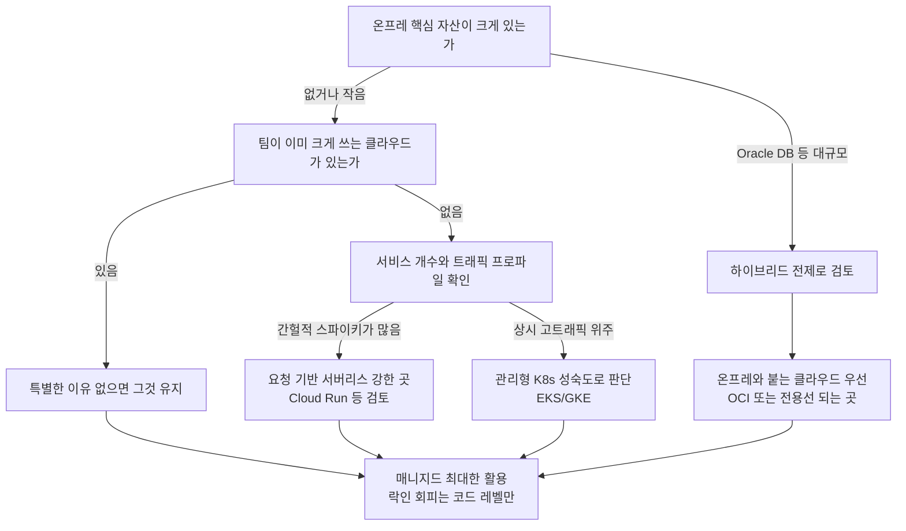

# MSA를 어떤 클라우드에 올릴 것인가

MSA 문서를 여러 개 썼는데 정작 "어느 클라우드에 올릴까"는 한 번도 정리한 적이 없다. [MSA_VPC_Network_Design.md](MSA_VPC_Network_Design.md)는 AWS VPC를 전제로 하고, [Oracle_MSA.md](Oracle_MSA.md)는 OCI를 전제로 한다. 개별 서비스 문서는 이미 클라우드가 정해진 다음 이야기다. 그 앞 단계, 클라우드 자체를 고르는 판단은 매번 회의실에서 목소리 큰 사람이 이겼고 기록이 남지 않았다.

이 문서는 그 회의를 대비한 것이다. 결론부터 말하면 "정답 클라우드"는 없고, 팀이 이미 뭘 쓰는지와 서비스 개수가 몇 개인지가 8할을 결정한다. 나머지 2할이 아래에서 다룰 관리형 서비스 성숙도, 네트워크 구성, 락인 지점, 요금 모델이다.

---

## 관리형 서비스 성숙도부터 본다

MSA에서 직접 굴려야 하는 인프라 컴포넌트는 대략 정해져 있다. 컨테이너 오케스트레이션, 로드밸런서, 서비스 디스커버리, API Gateway, 메시지 큐, 관측성 스택. 이걸 매니지드로 얼마나 덮어주느냐가 운영 인력을 얼마나 아끼느냐로 직결된다. 서비스 5개짜리 팀이 EKS 컨트롤 플레인을 직접 튜닝하고 있으면 그건 클라우드를 잘못 골랐거나 매니지드를 안 쓰는 것이다.

### 쿠버네티스 관리형: EKS / GKE / OKE

세 곳 다 관리형 쿠버네티스를 판다. 컨트롤 플레인은 다 감춰주는데, 노드 관리와 부가 기능 자동화 수준이 다르다.

GKE Autopilot이 이 중에서 손이 제일 덜 간다. 노드 자체를 안 보이게 감춘다. Pod 스펙만 던지면 노드 프로비저닝, 빈패킹, 오토스케일을 알아서 한다. 노드 SSH가 막혀서 커널 튜닝이 필요한 워크로드는 못 올리지만, 일반적인 stateless 서비스는 이게 편하다.

EKS는 컨트롤 플레인만 관리형이고 노드 그룹, CNI, 애드온을 상당 부분 직접 챙겨야 한다. Karpenter 붙이고 VPC CNI IP 관리하고 하는 데서 사람이 붙는다. 대신 생태계가 제일 넓어서 어지간한 Helm 차트, 오퍼레이터가 EKS 기준으로 검증돼 있다.

OKE(Oracle Kubernetes Engine)는 컨트롤 플레인이 무료다. 워커 노드 컴퓨트 비용만 낸다. 온프레 Oracle DB와 붙여야 하는 상황이면 후보에 올린다. 다만 서드파티 오퍼레이터 호환성 이슈를 종종 만난다. 커뮤니티에서 EKS/GKE만큼 밟아본 사람이 없어서 트러블슈팅에 시간이 더 든다.

```yaml
# GKE Autopilot - 노드 스펙을 아예 신경 쓰지 않는다
# resources.requests만 정확히 적으면 나머지는 플랫폼이 처리
apiVersion: apps/v1
kind: Deployment
metadata:
  name: order-service
spec:
  replicas: 3
  selector:
    matchLabels:
      app: order-service
  template:
    metadata:
      labels:
        app: order-service
    spec:
      containers:
        - name: order
          image: gcr.io/my-project/order-service:1.4.2
          resources:
            requests:
              cpu: "500m"
              memory: "512Mi"
            limits:
              cpu: "500m"
              memory: "512Mi"
```

```yaml
# EKS - 같은 배포를 하려면 노드/CNI 쪽 사전 작업이 별도로 필요하다
# Karpenter Provisioner를 미리 깔아둔 상태를 전제로 한다
apiVersion: karpenter.sh/v1beta1
kind: NodePool
metadata:
  name: default
spec:
  template:
    spec:
      requirements:
        - key: karpenter.k8s.aws/instance-category
          operator: In
          values: ["c", "m"]
        - key: karpenter.sh/capacity-type
          operator: In
          values: ["spot", "on-demand"]
      nodeClassRef:
        name: default
  limits:
    cpu: 1000
  disruption:
    consolidationPolicy: WhenUnderutilized
```

Deployment 하나 올리는 건 똑같아 보이지만, EKS는 그 밑에 NodePool, EC2NodeClass, VPC CNI 설정이 깔려 있어야 한다는 차이가 있다. 이 사전 작업의 무게가 팀 규모 판단으로 이어진다.

### 서버리스 컨테이너: Fargate / Cloud Run / Container Instances

쿠버네티스를 안 쓰고 컨테이너만 던지고 싶을 때 쓰는 쪽이다.

AWS Fargate는 ECS나 EKS 뒤에 붙는 컴퓨트다. 그 자체가 오케스트레이터는 아니다. ECS Task로 쓰면 Task Definition을 JSON으로 정의하고 서비스로 띄운다. 상주형이라 트래픽이 없어도 Task가 떠 있으면 과금된다.

GCP Cloud Run은 요청 기반이다. 트래픽이 없으면 0으로 스케일다운되고 그동안 과금이 안 된다(설정에 따라). 요청이 오면 콜드스타트로 컨테이너를 띄운다. 배치성/간헐적 트래픽 서비스에 이게 압도적으로 싸다. 대신 콜드스타트 지연이 있고, 요청-응답 모델에 최적화돼 있어서 백그라운드 워커 패턴은 억지로 끼워 맞춰야 한다.

Azure Container Instances는 앞의 둘보다 단순하다. 오케스트레이션 없이 컨테이너 하나를 그냥 띄운다. MSA 프로덕션 워크로드보다는 짧은 배치 잡, CI 러너 같은 데 맞는다. MSA 상시 서비스로 ACI를 메인에 두는 건 잘 안 한다.

```json
// ECS Fargate - Task Definition. 상주형이라 desiredCount만큼 항상 떠 있다
{
  "family": "payment-service",
  "networkMode": "awsvpc",
  "requiresCompatibilities": ["FARGATE"],
  "cpu": "512",
  "memory": "1024",
  "containerDefinitions": [
    {
      "name": "payment",
      "image": "123456789.dkr.ecr.ap-northeast-2.amazonaws.com/payment:2.1.0",
      "portMappings": [{ "containerPort": 8080, "protocol": "tcp" }],
      "logConfiguration": {
        "logDriver": "awslogs",
        "options": {
          "awslogs-group": "/ecs/payment-service",
          "awslogs-region": "ap-northeast-2",
          "awslogs-stream-prefix": "ecs"
        }
      }
    }
  ]
}
```

```yaml
# Cloud Run - 요청 기반. minScale 0이면 트래픽 없을 때 과금이 멈춘다
# 콜드스타트가 싫으면 minScale을 1 이상으로 올리는데 그 순간 상주 과금으로 돌아온다
apiVersion: serving.knative.dev/v1
kind: Service
metadata:
  name: payment-service
spec:
  template:
    metadata:
      annotations:
        autoscaling.knative.dev/minScale: "0"
        autoscaling.knative.dev/maxScale: "50"
    spec:
      containers:
        - image: asia-northeast3-docker.pkg.dev/my-project/repo/payment:2.1.0
          ports:
            - containerPort: 8080
          resources:
            limits:
              cpu: "1"
              memory: 1Gi
```

minScale 0과 desiredCount의 차이가 요금 모델 전체를 가른다. 뒤의 요금 절에서 이게 왜 MSA에서 폭발하는지 계산해본다.

### 로드밸런서·서비스 메시·API Gateway 매니지드 지원

| 컴포넌트 | AWS | GCP | OCI |
|---|---|---|---|
| L7 로드밸런서 | ALB | External HTTP(S) LB | Flexible LB |
| 서비스 메시 | App Mesh(종료 예정), 실질적으로 Istio 자체 운영 | Anthos Service Mesh(관리형 Istio) | 자체 운영(Istio 직접) |
| API Gateway | API Gateway(REST/HTTP/WebSocket) | API Gateway, Apigee | API Gateway |

여기서 갈리는 게 서비스 메시다. AWS App Mesh는 사실상 정리 수순이라 새로 시작하면 Istio를 직접 깐다. GCP는 Anthos Service Mesh로 관리형 Istio를 준다. 메시를 반드시 써야 하는 규모라면 이 차이가 운영 인력 한두 명 차이로 나타난다. 다만 메시 자체를 서비스 20개 미만에서 도입하는 건 대개 과하다. [서비스_메시_및_사이드카_패턴.md](서비스_메시_및_사이드카_패턴.md)에서 다뤘듯 사이드카 오버헤드와 디버깅 복잡도가 이득을 넘어서는 구간이 있다.

API Gateway는 세 곳 다 매니지드가 있는데, AWS API Gateway는 요청당 과금이라 트래픽 많은 내부 서비스 간 통신에 넣으면 요금이 튄다. 외부 진입점에만 쓰고 내부는 ALB나 메시로 붙이는 게 보통이다.

---

## 네트워크·리전·가용영역이 지연과 장애 격리에 미치는 영향

MSA는 서비스 간 호출이 네트워크를 탄다. 모놀리스에서 함수 호출이던 게 HTTP/gRPC 홉이 된다. 그래서 네트워크 토폴로지가 곧 지연이고 장애 반경이다.

### AZ 배치가 지연과 장애 격리를 동시에 정한다

멀티 AZ로 깔면 AZ 하나가 죽어도 서비스가 산다. 대신 서비스 A가 AZ-a에 있고 서비스 B가 AZ-c에 있으면 호출마다 AZ 간 홉이 붙는다. AZ 간 왕복은 보통 1~2ms 수준인데, 이게 한 요청에서 서비스 간 호출이 10번 체이닝되면 무시 못 할 지연으로 누적된다. 그리고 AWS 기준 AZ 간 트래픽은 GB당 과금된다. 지연과 비용이 같이 온다.

이걸 피하려고 zone-aware 라우팅을 쓴다. 같은 AZ 안의 인스턴스를 우선 호출하고, 그 AZ에 인스턴스가 없을 때만 다른 AZ로 넘긴다.

```yaml
# 쿠버네티스 topology-aware routing
# 같은 존의 엔드포인트를 우선 라우팅해서 AZ 간 홉과 비용을 줄인다
apiVersion: v1
kind: Service
metadata:
  name: inventory-service
  annotations:
    service.kubernetes.io/topology-mode: Auto
spec:
  selector:
    app: inventory
  ports:
    - port: 8080
      targetPort: 8080
```

주의할 점은 zone-aware를 켜면 특정 AZ에 트래픽이 쏠려서 그 AZ 인스턴스만 과부하가 걸리는 경우가 있다. 존별 replica가 고르게 분산돼 있지 않으면 오히려 한쪽이 죽는다. 켜기 전에 존별 Pod 분포를 podTopologySpreadConstraints로 강제해두는 게 안전하다.

### 리전 선택은 사용자 위치와 데이터 규제로 정해진다

한국 서비스면 서울 리전(AWS ap-northeast-2, GCP asia-northeast3, OCI ap-seoul-1)에 두는 게 기본이다. 리전이 사용자에게 멀면 그만큼 왕복 지연이 붙는다. 도쿄와 서울만 해도 30ms대 차이가 나고, 이게 매 요청 앞단에 붙는다.

리전 하나에 몰빵할지 멀티 리전으로 갈지는 뒤의 멀티 클라우드 절과 같은 논리다. 대부분은 단일 리전 + 멀티 AZ로 충분하고, 멀티 리전은 규제(데이터 현지화)나 진짜 글로벌 사용자 분포가 있을 때만 간다. 멀티 리전은 데이터 복제 지연, 일관성 문제, 운영 복잡도가 한 번에 딸려온다.

### 서비스 간 통신 경로를 어디로 뚫느냐

같은 VPC 안이면 사설 IP로 직접 통신한다. VPC가 갈리거나 계정이 갈리면 Peering, Transit Gateway, PrivateLink 중에 고른다. 이 부분은 [MSA_VPC_Network_Design.md](MSA_VPC_Network_Design.md)에서 상세히 다뤘다. 클라우드 선택 관점에서 볼 점은, GCP는 VPC가 글로벌 리소스라 리전이 달라도 같은 VPC 안에서 사설 통신이 되는데 AWS는 VPC가 리전 단위라 리전 넘어가면 반드시 Peering/TGW가 필요하다는 구조 차이다. 멀티 리전을 진지하게 고민한다면 이 차이가 설계를 바꾼다.

---

## 벤더 락인이 실제로 생기는 지점

"멀티 클라우드로 락인을 피한다"는 말은 대부분 실현되지 않는다. 락인은 컴퓨트에서 생기지 않는다. 컨테이너는 어디서든 돈다. 락인은 매니지드 주변부에서 생긴다.

### 메시지 큐가 제일 크게 잡는다

SQS, Pub/Sub, OCI Streaming은 API가 다 다르다. SQS는 폴링 기반에 표준/FIFO 큐가 있고, Pub/Sub은 푸시/풀에 토픽-구독 모델이다. 세만틱이 달라서 그냥 갈아끼울 수가 없다. [메시지_큐_및_분산_락.md](메시지_큐_및_분산_락.md)에서 다룬 것처럼 순서 보장, 중복 처리, DLQ 동작이 제품마다 미묘하게 달라서 여기에 로직이 붙는다.

이걸 피하려면 애플리케이션 코드가 벤더 SDK를 직접 호출하지 않게 인터페이스로 한 겹 감싼다.

```java
// 애플리케이션은 이 인터페이스만 안다. 벤더 SDK는 구현체 안에만 있다
public interface MessagePublisher {
    void publish(String topic, byte[] payload, Map<String, String> attributes);
}

// AWS 구현체
public class SqsMessagePublisher implements MessagePublisher {
    private final SqsClient sqs;
    private final String queueUrl;

    @Override
    public void publish(String topic, byte[] payload, Map<String, String> attributes) {
        // SQS는 topic 개념이 없어서 queueUrl로 매핑한다. 이 매핑 자체가 추상화 비용이다
        SendMessageRequest req = SendMessageRequest.builder()
            .queueUrl(queueUrl)
            .messageBody(new String(payload, StandardCharsets.UTF_8))
            .messageAttributes(toSqsAttributes(attributes))
            .build();
        sqs.sendMessage(req);
    }
}

// GCP 구현체
public class PubSubMessagePublisher implements MessagePublisher {
    private final Publisher publisher; // topic 단위로 생성됨

    @Override
    public void publish(String topic, byte[] payload, Map<String, String> attributes) {
        PubsubMessage msg = PubsubMessage.newBuilder()
            .setData(ByteString.copyFrom(payload))
            .putAllAttributes(attributes)
            .build();
        publisher.publish(msg);
    }
}
```

인터페이스로 감싸는 순간 두 제품의 공통 부분집합만 쓰게 된다. SQS FIFO의 MessageGroupId, Pub/Sub의 ordering key처럼 각자 고유 기능은 인터페이스 밖으로 밀려나거나 못 쓴다. 추상화가 곧 기능 하향 평준화라는 대가를 문다. 그래서 이 추상화는 정말 클라우드를 옮길 계획이 있을 때만 값을 한다. 옮길 일이 없으면 그냥 SDK 직접 쓰는 게 코드가 짧고 기능을 다 쓴다.

### IAM 모델은 코드보다 조직에 박힌다

IAM은 SDK 몇 줄이 아니라 조직 전체의 권한 구조로 박힌다. AWS IAM은 Role/Policy에 리소스 ARN 기반이고, GCP는 리소스 계층(조직-폴더-프로젝트)에 IAM 바인딩을 얹는다. OCI는 Compartment 기반 정책이다. 모델 자체가 다르다.

서비스 계정을 어떻게 발급하고, Pod가 클라우드 권한을 어떻게 얻는지(IRSA vs Workload Identity)가 다 다르게 짜인다. 이건 코드가 아니라 인프라 자동화(Terraform)와 온보딩 절차에 스며든다. 여기가 실질적으로 가장 옮기기 힘든 락인이다. 컴퓨트는 컨테이너라 옮기지만, 권한 체계 전체를 재설계하는 건 프로젝트 하나짜리 일이다.

### 관측성 스택도 락인이다

CloudWatch, Cloud Monitoring, OCI Monitoring은 쿼리 언어도 대시보드도 알림 규칙도 다 다르다. CloudWatch Logs Insights 쿼리를 Cloud Logging 쿼리로 옮기려면 그냥 새로 짜는 거다. 여기 대시보드 수십 개, 알림 수백 개가 쌓이면 그게 락인이다.

이걸 처음부터 피하려면 관측성을 벤더 중립 스택으로 깐다. OpenTelemetry로 계측하고, 메트릭은 Prometheus, 로그는 Loki나 ELK, 트레이스는 Tempo/Jaeger로 받는다. 계측 코드가 OTel 표준이면 백엔드를 갈아도 애플리케이션은 안 건드린다. [분산_추적_및_Observability.md](분산_추적_및_Observability.md)에서 다룬 구조다.

```yaml
# OpenTelemetry Collector - exporter만 바꾸면 백엔드가 갈린다
# 애플리케이션은 OTLP로만 뱉으니 벤더에 안 묶인다
receivers:
  otlp:
    protocols:
      grpc:
        endpoint: 0.0.0.0:4317
exporters:
  prometheus:
    endpoint: 0.0.0.0:8889
  otlp/tempo:
    endpoint: tempo:4317
    tls:
      insecure: true
service:
  pipelines:
    metrics:
      receivers: [otlp]
      exporters: [prometheus]
    traces:
      receivers: [otlp]
      exporters: [otlp/tempo]
```

대신 이 스택을 직접 운영하는 부담이 생긴다. CloudWatch는 켜면 그냥 돌아가는데, Prometheus + Loki + Tempo는 스토리지, 리텐션, 스케일을 직접 챙겨야 한다. 락인을 피하는 대가로 운영 부담을 진다. 서비스 몇 개짜리 팀이 이걸 자체 운영하면 배보다 배꼽이 크다. 락인 회피는 공짜가 아니다.

---

## 요금 모델 차이가 MSA에서 폭발하는 지점

요금은 서비스가 적을 때는 티가 안 나다가 개수가 늘면서 비선형으로 튄다. MSA는 구조적으로 서비스 개수와 서비스 간 통신량이 많아서 특정 과금 항목에 민감하다.

### egress 비용: 서비스 간 통신이 다 돈이다

인터넷으로 나가는 트래픽(egress)은 세 클라우드 다 GB당 과금한다. 문제는 AZ 간, 리전 간 트래픽도 과금된다는 점이다. MSA는 서비스 A→B→C 체이닝이 기본이라 내부 트래픽이 많다. 이게 AZ를 넘나들면 다 계산기에 찍힌다.

계산 예시를 들어본다. 서비스 간 평균 페이로드 4KB, 한 사용자 요청이 내부적으로 8번의 서비스 간 호출을 유발하고, 그중 절반이 AZ를 넘는다고 하자. 초당 1000요청이면:

- AZ 간 호출: 1000 req/s × 4 (AZ 넘는 호출) × 4KB = 16MB/s
- 한 달: 16MB/s × 2,592,000초 ≈ 41.5TB/월
- AWS AZ 간 트래픽 왕복 과금(방향당 약 $0.01/GB, 왕복이라 양방향)으로 대략 41,500GB × $0.02 ≈ 월 $830

컴퓨트도 아니고 순수 내부 네트워크 트래픽에 월 800달러가 넘게 나온다. 서비스가 8개에서 40개로 늘고 호출 체이닝이 깊어지면 이 숫자는 몇 배로 뛴다. 그래서 앞에서 zone-aware 라우팅을 얘기한 거다. AZ 넘는 호출을 줄이면 이 항목이 그대로 줄어든다.

GCP는 같은 리전 내 AZ(존) 간 트래픽 과금 정책이 AWS와 조금 다르고, egress 요율표도 다르다. 트래픽 패턴이 내부 통신 위주면 요율표를 실제 트래픽 프로파일에 대입해서 비교해야 한다. 카탈로그 가격만 보면 안 된다.

### per-request vs per-instance

Cloud Run 같은 요청 기반은 요청 수와 요청당 CPU·메모리 점유 시간으로 과금한다. 트래픽이 없으면 0이다. 간헐적으로만 호출되는 서비스가 많은 MSA면 이게 압도적으로 싸다. 30개 서비스 중 20개가 하루에 몇 번만 호출되는 관리성 서비스라면, Fargate로 상주시키면 20개가 24시간 떠서 과금되고 Cloud Run이면 호출된 순간만 과금된다.

반대로 상시 고트래픽 서비스는 per-instance가 싸다. 요청 기반은 요청이 많으면 그만큼 곱해진다. Cloud Run에서 초당 수천 요청을 상시로 받으면 minScale을 올려 상주시키게 되고, 그 순간 요청 기반의 이점이 사라지면서 상주 과금 + 요청 과금이 겹친다.

정리하면 트래픽 프로파일로 갈린다. 간헐적이고 스파이키한 서비스가 많으면 요청 기반, 상시 균일 고트래픽이면 상주형. MSA는 보통 이 둘이 섞여 있어서 서비스별로 다르게 배치하는 게 맞다. 전부 EKS나 전부 Cloud Run으로 통일하려는 강박이 요금을 키운다.

### 최소 과금 단위

작은 서비스가 많을 때 최소 과금 단위가 발목을 잡는다. Fargate는 최소 vCPU/메모리 조합이 정해져 있어서, 실제로 128MB면 충분한 초경량 서비스도 최소 스펙만큼 낸다. 서비스 40개가 각자 최소 스펙으로 떠 있으면 실사용률이 10%여도 최소 단위 × 40을 낸다.

이 지점에서 오히려 쿠버네티스가 유리해진다. 노드 하나에 작은 Pod 여러 개를 빈패킹하면 리소스를 촘촘히 채운다. 서비스가 많고 각각이 가벼우면 EKS/GKE에 몰아 담는 게 서버리스 컨테이너보다 싸질 수 있다. 서버리스가 항상 싼 게 아니다. 서비스 개수와 개별 무게로 손익분기가 갈린다.

---

## 멀티/하이브리드 클라우드: 대부분은 하지 마라

멀티 클라우드를 하고 싶다는 말은 자주 나온다. 실제로 해야 하는 경우는 드물다.

### 진짜 해야 하는 경우

- 규제로 특정 데이터를 특정 클라우드/리전에 둬야 하는데, 나머지는 다른 곳에 있는 경우. 선택이 아니라 강제다.
- 인수합병으로 A사는 AWS, B사는 GCP를 이미 크게 쓰고 있어서 당장 통합이 불가능한 경우. 이것도 선택이 아니라 현실이다.
- 특정 클라우드에만 있는 기능(예: 특정 관리형 AI 서비스, 특정 하드웨어)이 반드시 필요한데 메인은 다른 곳인 경우.
- 온프레 자산(Oracle DB, 레거시 메인프레임)이 크게 있어서 클라우드와 하이브리드로 붙여야 하는 경우. [Oracle_MSA.md](Oracle_MSA.md)에서 다룬 온프레-OCI 연동이 이 축이다.

공통점은 전부 "선택해서" 멀티가 되는 게 아니라 "어쩔 수 없이" 멀티가 된다는 거다.

### 대부분 하지 말아야 하는 이유

락인 회피를 이유로 처음부터 멀티 클라우드를 깔면, 앞에서 본 대로 두 클라우드의 공통 부분집합만 쓰게 된다. 각 클라우드의 매니지드를 제대로 못 쓰고, 관측성·IAM·네트워크를 두 벌로 운영한다. 운영 인력이 두 배로 든다. 락인 하나 피하려고 상시 운영 비용을 두 배로 내는 거다.

egress도 문제다. 두 클라우드에 걸친 서비스가 서로 호출하면 그 트래픽이 전부 인터넷 egress로 나간다. 앞의 계산 예시에서 AZ 간 트래픽이 월 800달러였는데, 클라우드 간 egress는 요율이 그보다 훨씬 비싸다. 서비스를 두 클라우드에 나눠 놓고 서로 호출시키면 요금이 그냥 터진다.

현실적인 답은 대부분 단일 클라우드로 가되, 락인이 무서우면 애플리케이션 코드를 벤더 중립으로 짜두는 정도다. 컨테이너로 배포하고, 관측성은 OTel로 계측하고, 메시지 큐는 인터페이스로 감싼다. 진짜 옮겨야 할 때 옮길 수 있는 여지만 남기고, 실제 운영은 한 클라우드에서 매니지드를 최대한 쓴다. 이게 락인과 운영 부담 사이의 현실적인 지점이다.

하이브리드는 결이 다르다. 온프레 자산이 크면 하이브리드는 선택이 아니라 필수다. 이건 멀티 클라우드와 별개로 판단한다. Oracle DB가 온프레에 크게 박혀 있고 마이그레이션이 몇 년짜리면, 그동안 신규 서비스는 클라우드에 올리되 DB는 온프레와 전용선으로 붙이는 하이브리드가 답이다.

---

## 팀·스택·온프레 제약 기반 의사결정 흐름

결국 클라우드 선택은 기술 비교표가 아니라 팀 상황으로 정해진다. 실제 판단 순서는 대략 이렇다.



### 순서대로 짚으면

먼저 온프레를 본다. Oracle DB 같은 핵심 자산이 크게 있고 몇 년 안에 못 걷어낸다면 하이브리드가 전제다. 이 경우 전용선(Direct Connect, Cloud Interconnect, FastConnect) 지연과 대역폭이 클라우드 선택을 좌우한다. OCI는 Oracle DB와의 통합이 강점이라 이 축에서 먼저 후보에 든다.

다음은 팀이 이미 뭘 쓰느냐다. 팀이 AWS를 3년 굴려왔으면 EKS 트러블슈팅 경험, Terraform 모듈, IAM 구조가 다 AWS에 맞춰져 있다. 여기서 "GKE Autopilot이 손이 덜 간다니까 GCP로 가자"는 대개 손해다. 새 클라우드 학습 비용, 자동화 재작성, 운영 노하우 재축적이 매니지드 편의성 이득을 넘어선다. 특별한 이유가 없으면 쓰던 걸 유지하는 게 맞다.

새로 시작하는 팀이라면 서비스 개수와 트래픽 프로파일을 본다. 간헐적이고 스파이키한 서비스가 많으면 요청 기반 서버리스가 강한 쪽이 요금에서 유리하다. 상시 고트래픽이 주면 관리형 쿠버네티스 성숙도로 판단한다. 팀 규모가 작으면(백엔드 5명 이하) 컨트롤 플레인·노드를 직접 안 챙겨도 되는 쪽(GKE Autopilot, Cloud Run)이 인력을 아낀다. 팀이 크고 쿠버네티스 운영 인력이 있으면 EKS의 넓은 생태계가 값을 한다.

어느 쪽으로 가든 공통 결론은 같다. 정한 클라우드의 매니지드를 최대한 쓰고, 락인 회피는 코드 레벨(컨테이너, OTel, 큐 인터페이스)에서만 남긴다. 인프라 레벨에서 두 클라우드를 다 대비하려 들면 그때부터 운영이 두 배가 된다.

---

## 정리하며 남기는 주의사항

- 클라우드 선택은 기능 비교표로 정해지지 않는다. 팀이 이미 쓰는 것과 온프레 제약이 대부분을 정한다.
- 매니지드 성숙도는 GKE Autopilot이 손이 제일 덜 가고, EKS는 생태계가 제일 넓다. OKE는 온프레 Oracle 연동이 축이다.
- AZ 간 트래픽은 지연이자 비용이다. 서비스 체이닝이 깊은 MSA는 zone-aware 라우팅으로 AZ 홉을 줄여야 요금이 안 튄다.
- 락인은 컴퓨트가 아니라 메시지 큐·IAM·관측성에서 생긴다. 이걸 피하려면 코드 레벨 추상화를 하는데, 그 대가로 기능 하향 평준화와 운영 부담을 문다.
- 요금은 서비스 개수와 트래픽 프로파일로 갈린다. 간헐적이면 요청 기반, 상시 고트래픽이면 상주형. 전부 하나로 통일하려는 강박이 요금을 키운다.
- 멀티 클라우드는 대부분 하지 마라. 어쩔 수 없이 하는 경우가 아니면, 단일 클라우드 + 코드 레벨 중립성이 현실적인 답이다. 하이브리드는 온프레 자산이 크면 별개로 필수다.
