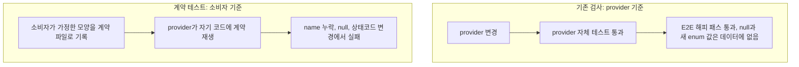
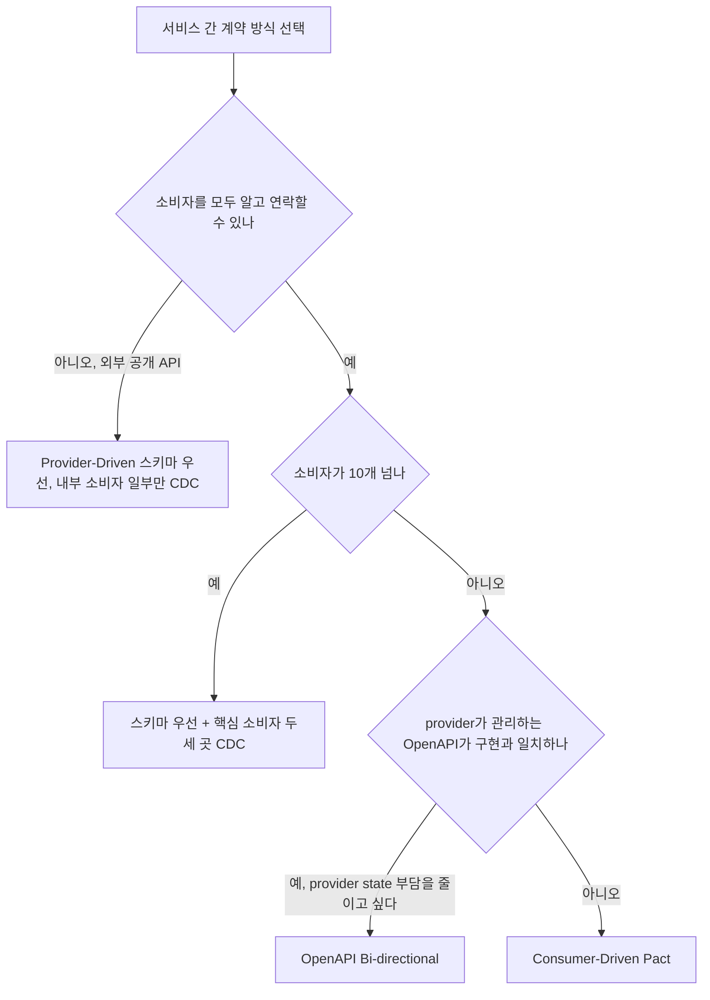
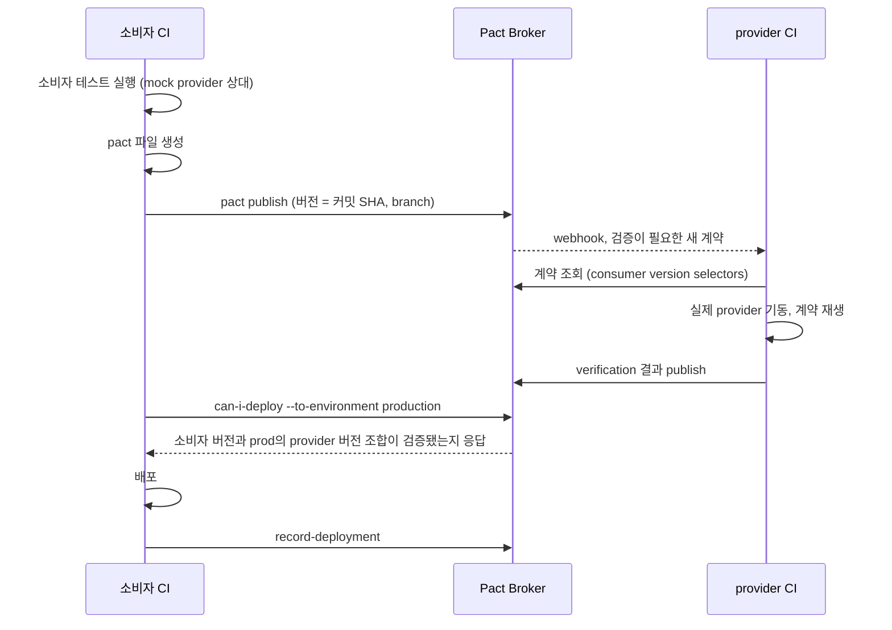
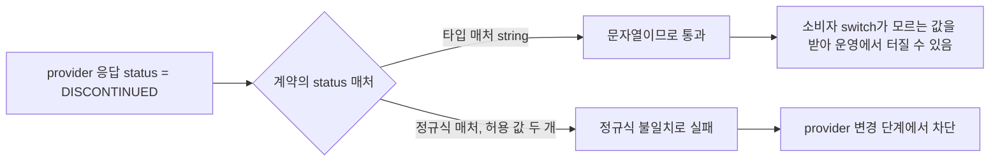
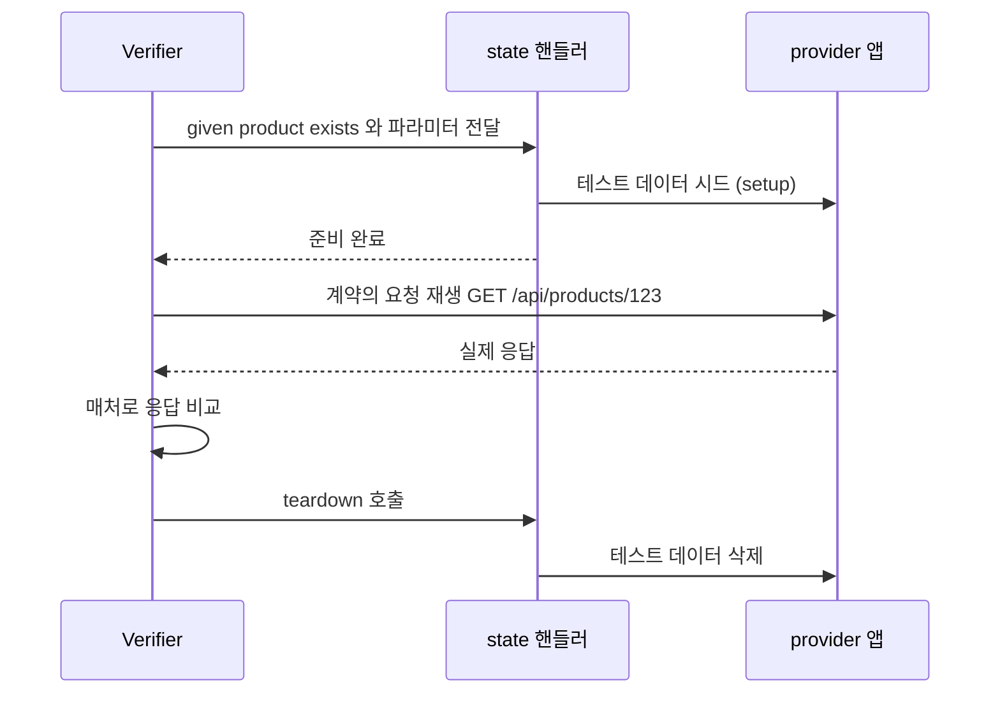
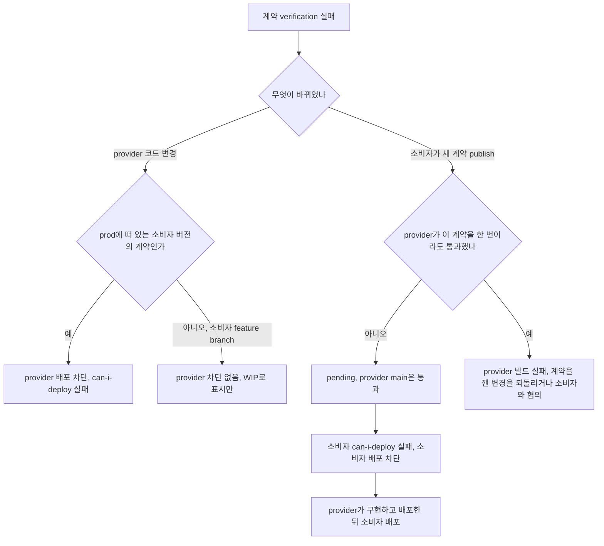
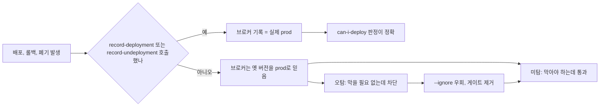

# Service Contract Testing

서비스 A와 서비스 B가 각자 테스트를 전부 통과하고, 각자 배포됐고, 붙인 순간 터지는 경우가 있다. 단위 테스트는 자기 코드만 보고 E2E는 서비스를 다 띄워야 해서 서비스 수가 늘수록 돌리기 어려워진다. 계약 테스트는 그 사이를 맡는다. 소비자가 실제로 보내는 요청과 기대하는 응답을 파일로 떨어뜨리고, provider가 그 파일을 자기 코드에 재생해서 맞는지 본다.

이 문서는 계약 테스트를 도입할지, 어떤 방식으로 할지, 도입하고 나서 어디서 막히고 어디서 조용히 깨지는지를 다룬다. Pact Java 코드(소비자 테스트, `@State`, `@PactBroker`)는 [MSA 테스트](MSA_테스트_전략.md)에 있어서 여기서는 반복하지 않는다. 스키마 변경을 단계로 나눠 배포하는 쪽은 [Expand Migrate Contract](Expand_Migrate_Contract.md)와 [API 버전 관리](API_버전_관리.md)가 다룬다.

## E2E와 통합 테스트가 못 잡는 어긋남

서비스 간 장애의 상당수는 로직 버그가 아니라 양쪽이 서로 다른 모양을 가정한 데서 나온다. 주로 이런 변경이다.

| 변경 | provider 쪽에서 보이는 모습 | consumer 쪽에서 터지는 모습 | E2E가 놓치는 이유 |
|---|---|---|---|
| 필드 이름 변경 (`name` → `productName`) | 자기 테스트는 새 이름으로 통과 | 역직렬화 후 `name`이 null, 또는 non-null 타입이면 파싱 예외 | 테스트 데이터로 그 필드를 화면까지 쓰는 시나리오가 없다 |
| nullable 변경 (필수 → null 가능) | 스키마상 "완화"라서 호환 변경처럼 보인다 | non-null로 선언한 소비자 DTO가 null 하나에 터진다 | 테스트 데이터에는 null인 행이 없다 |
| enum 값 추가 (`DISCONTINUED`) | 새 상태를 추가했을 뿐이다 | `switch`의 default가 없거나, enum 역직렬화가 모르는 값에서 예외 | 테스트 환경에 그 상태의 상품이 없다 |
| 상태코드 변경 (200 → 201, 200 → 204) | REST 관례에 맞게 고쳤다 | `status == 200`만 성공으로 보는 클라이언트가 실패 처리하거나, 204인데 본문을 파싱한다 | 해피 패스를 통과하는 쪽은 클라이언트가 어느 코드를 성공으로 보는지 검사하지 않는다 |

공통점이 있다. 전부 provider 입장에서는 "깨뜨린 게 아닌" 변경이고, E2E는 데이터 한 벌과 해피 패스 한 줄만 돌린다. 통합 환경의 테스트 데이터는 대개 정상 값만 들어 있어서 null이나 새 enum 값 같은 경계는 아예 재현되지 않는다. 운영 데이터가 그 경계를 밟는 순간 처음 터진다.

계약 테스트가 이 부류를 잡는 이유는 반대 방향에서 검사하기 때문이다. provider가 자기 테스트를 통과하는지가 아니라, 소비자가 가정한 모양을 provider가 실제로 내보내는지 본다.

두 검사의 방향 차이를 나란히 놓으면 아래와 같다. 위쪽은 provider가 자기 기준으로 확인하고, 아래쪽은 소비자의 기대가 기준이 된다.



## 계약 테스트가 맡는 범위

맡는 것은 **메시지의 모양**이다. 경로, 메서드, 필수 헤더, 상태코드, 응답 본문의 필드 이름과 타입, null 가능 여부, 값의 형식(날짜 포맷, enum 허용 값)이 여기에 든다. HTTP뿐 아니라 Kafka 같은 메시지 페이로드도 같은 방식으로 다룬다.

맡지 않는 것은 **비즈니스 로직**이다. "재고가 0이면 주문이 거절되는가", "쿠폰 두 개가 겹치면 어떻게 계산하는가"는 provider의 단위 테스트가 가져야 한다. 계약에 이런 걸 넣으면 provider 상태 셋업이 도메인 시나리오 재현으로 번지고, 계약이 provider 구현의 사본이 된다. 상품 가격이 1,500,000이어야 한다는 식의 정확한 값 비교도 같은 실수다. 계약은 `price`가 정수라는 것만 알면 된다.

성능, 동시성, 인증 토큰 만료, 네트워크 타임아웃도 범위 밖이다. 타임아웃과 재시도는 [장애 격리 패턴](장애_격리_패턴.md) 쪽에서 다룬다.

## 세 가지 방식과 고르는 기준

계약을 누가, 무엇으로 쓰는지에 따라 방식이 갈린다.

| 항목 | Consumer-Driven (Pact) | Provider-Driven (스키마 우선) | OpenAPI Bi-directional |
|---|---|---|---|
| 계약 작성자 | 소비자 | provider | provider(OpenAPI)와 소비자(Pact 파일) 양쪽 |
| 계약 형식 | Pact JSON (interaction 단위) | OpenAPI, JSON Schema, Protobuf | OpenAPI + Pact 파일 |
| provider가 아는 것 | 소비자가 실제로 쓰는 필드와 요청 | 소비자 사용 현황은 모름 | 소비자가 쓰는 필드를 스펙과 대조해서 앎 |
| 검증이 도는 곳 | provider가 소비자 계약을 재생 | 스펙 diff 린트로 breaking change 탐지 | 브로커가 스펙과 Pact 파일을 정적 비교 |
| provider 부담 | 소비자 수만큼 provider state 늘어남 | 스펙을 코드와 일치시킬 책임 | 스펙이 실제 구현과 맞는지는 provider가 따로 증명해야 함 |
| 약한 곳 | provider state 관리, 소비자 계약 품질 편차 | "이 필드 지워도 되나"에 답 못 함 | 스펙이 거짓말하면 같이 거짓 통과 |
| 도구 | Pact, Pact Broker | OpenAPI diff 도구, Spring Cloud Contract 등 | PactFlow (Pact Broker 오픈소스에는 없는 기능) |
| 잘 맞는 경우 | 소비자가 적고 팀이 가까운 내부 서비스 | 소비자를 다 알 수 없는 공개 API | provider가 이미 OpenAPI를 갖고 있고 provider state 부담을 줄이고 싶을 때 |

고르는 기준은 세 가지로 좁혀진다. 아래 분기는 그 기준을 질문 순서대로 이은 것이다.



**소비자 수.** 소비자가 한두 팀이면 Consumer-Driven이 가장 정확하다. 소비자가 열 개가 넘어가면 provider verification이 계약 열 벌을 재생하고 provider state가 합쳐져서 provider 팀이 감당하기 어려워진다. 이때는 스키마 우선으로 breaking change만 막고, 핵심 소비자 두세 곳만 CDC를 얹는 식으로 섞는 쪽이 현실적이다.

**팀 경계.** 소비자 팀과 provider 팀이 같은 슬랙 채널에서 얘기할 수 있으면 CDC가 돈다. 계약이 깨졌을 때 상대 팀을 찾아서 고쳐 달라고 해야 하는 구조라서 대화 비용이 높으면 CDC의 이득이 줄어든다. 팀이 갈라져 있을수록 스펙이 계약 역할을 하는 쪽이 마찰이 적다.

**외부 공개 API 여부.** 외부 고객이 소비자라면 그들이 Pact 파일을 쓰게 만들 수 없다. provider가 스펙을 공개하고 호환성 규칙을 스스로 지켜야 한다. 이 경우 CDC는 내부 소비자 일부에만 적용한다.

Bi-directional은 provider가 이미 OpenAPI를 잘 관리하고 있을 때만 쓸 만하다. 스펙이 코드에서 생성되지 않고 손으로 쓴 문서라면 스펙과 구현이 이미 어긋나 있고, 계약 검사는 그 어긋난 스펙을 기준으로 초록불을 낸다. provider가 자기 구현을 스펙에 대고 검증하는 테스트(응답 스키마 검증 등)를 별도로 가져야 의미가 있다.

## Pact 한 사이클의 시간 순서

Pact를 쓴다고 정했을 때 소비자 테스트부터 배포 기록까지 이어지는 순서를 시퀀스로 보면 이렇다. 이 그림에서 볼 것은 두 가지다. provider verification이 소비자 파이프라인 바깥에서 비동기로 돌고, can-i-deploy가 그 결과를 기다려서 읽는다는 점이다.



명령으로는 이 정도다.

```bash
# 소비자 CI: 테스트가 만든 pacts/ 디렉터리를 브로커에 올린다
pact-broker publish ./pacts \
  --consumer-app-version "$GIT_SHA" \
  --branch "$GIT_BRANCH" \
  --broker-base-url "$PACT_BROKER_URL" \
  --broker-token "$PACT_BROKER_TOKEN"

# 배포 직전: 환경 기준으로 물어본다
pact-broker can-i-deploy \
  --pacticipant order-service \
  --version "$GIT_SHA" \
  --to-environment production \
  --retry-while-unknown 12 --retry-interval 10

# 배포 직후: 이 버전이 prod에 떠 있다고 기록한다
pact-broker record-deployment \
  --pacticipant order-service \
  --version "$GIT_SHA" \
  --environment production
```

`--retry-while-unknown`이 필요한 이유는 publish 직후에는 provider verification이 아직 안 끝나 있어서다. 결과가 없는 상태를 "실패"로 보고 파이프라인이 즉시 빨개지면 소비자 쪽에서 불평이 나온다. 기다려 주는 옵션을 넣고, 상한이 지나면 실패시키는 게 맞다.

## 어떤 변경이 잡히는지 직접 돌려본 결과

앞에서 든 네 가지 변경이 실제로 잡히는지 확인했다. 환경은 pact-js 16.5.0, Node 20이고 브로커 없이 로컬 pact 파일로 verification을 돌렸다. 소비자 계약은 `GET /api/products/123`에 `id`(정수), `name`(문자열), `status`(문자열), `price`(정수)를 기대하는 interaction 하나다. provider는 응답만 바꿔 끼운 Express 서버다.

| provider 응답 변경 | 결과 | 메시지 |
|---|---|---|
| 필드 추가 (`brand`, `tags`) | 통과 | 계약에 없는 필드는 무시한다 |
| `name` → `productName` 이름 변경 | 실패 | `Actual map is missing the following keys: name` |
| `name`이 null | 실패 | `Expected null (Null) to be the same type as 'laptop' (String)` |
| `status`에 `DISCONTINUED` 추가 (타입 매처) | **통과** | 문자열이기만 하면 된다 |
| `status`에 `DISCONTINUED` 추가 (ON_SALE 또는 SOLD_OUT만 허용하는 정규식 매처) | 실패 | `Expected 'DISCONTINUED' to match` 정규식 |
| `price`가 문자열 `"1500000"` | 실패 | `Expected '1500000' (String) to be an integer` |
| `price`가 1500000.5 | 실패 | `Expected 1500000.5 (Decimal) to be an integer` |
| `id`가 문자열 `"123"` | 실패 | `Expected '123' (String) to be an integer` |
| 상태코드 200 → 201 | 실패 | `expected 200 but was 201` |
| 상태코드 200 → 404 | 실패 | `expected 200 but was 404` |

표에서 눈여겨볼 곳은 두 군데다.

첫째, enum 값 추가는 매처를 어떻게 쓰느냐에 따라 통과도 되고 실패도 한다. 소비자 코드가 `status`를 `ON_SALE`과 `SOLD_OUT` 두 값으로 `switch`한다면 계약에 그 사실이 들어가야 한다. 타입 매처로 `status: string('ON_SALE')`만 쓰면 예시 값은 `ON_SALE`로 남지만 검증은 "문자열이면 통과"라서, 새 값이 들어와 소비자가 터지는 상황을 계약 테스트가 못 본다. 아래처럼 허용 값을 정규식으로 좁히면 잡힌다.

```javascript
const { MatchersV3: { integer, string, regex } } = require('@pact-foundation/pact');

.willRespondWith(200, r => r.jsonBody({
  id: integer(123),
  name: string('laptop'),
  status: regex('ON_SALE|SOLD_OUT', 'ON_SALE'),
  price: integer(1500000),
}))
```

같은 응답이 매처 선택에 따라 어디서 갈리는지 그리면 이렇다. 봐야 할 곳은 타입 매처 쪽 가지가 통과로 끝나면서도 운영 위험이 남는다는 점이다.



좁히는 데도 대가가 있다. 소비자가 모르는 값을 방어적으로 처리하고 있다면(default 분기에서 "알 수 없음"으로 표시) 정규식으로 좁힐 이유가 없고, 오히려 provider가 값을 추가할 때마다 소비자 계약을 고치게 만든다. 소비자 코드가 모르는 값에 약한지 강한지를 기준으로 정한다.

둘째, 필드 추가가 통과한다는 점이다. 계약은 소비자가 쓰는 부분집합만 보기 때문에 provider는 필드를 자유롭게 추가할 수 있다. 이게 CDC의 핵심 이점이다. 단 소비자가 `FAIL_ON_UNKNOWN_PROPERTIES`를 켠 Jackson 설정처럼 모르는 필드에 예외를 내는 설정을 쓰고 있다면 계약은 통과하는데 운영에서 터진다. 계약 테스트가 소비자의 실제 클라이언트 클래스로 호출해야 하는 이유가 이것이다(운영 절에서 다시 나온다).

정확한 값(`stringValue`처럼 리터럴)으로 쓰면 provider의 테스트 데이터가 바뀔 때마다 실패한다. 이름이 "노트북"에서 "랩탑"으로 바뀌었다고 계약이 깨지는 건 계약의 목적과 맞지 않다. 값을 고정해야 하는 건 `status` 같은 소비자가 분기하는 값, 날짜 포맷처럼 형식 자체가 계약인 경우 정도다.

## Provider State가 비대해지는 문제

소비자 계약은 "상품 123이 존재한다"는 전제 아래 쓰이고, provider는 verification 직전에 그 전제를 만들어야 한다. 이 셋업 코드가 계약 테스트 운영의 비용 대부분을 차지한다.

interaction 하나가 재생될 때 state 핸들러가 끼어드는 지점은 요청 재생의 앞(setup)과 뒤(teardown)다. 아래 순서에서 핸들러가 호출되는 위치를 보면 뒤에 나오는 문제들이 어디서 생기는지 짚인다.



**state 핸들러가 늘어난다.** 소비자가 셋이면 state 이름이 서로 다르게 지어지고, 의미가 같은 state가 소비자별로 중복된다. 소비자마다 "product exists", "상품이 있음", "ProductExists"를 쓰는 식이다. state 이름은 소비자와 provider 사이의 공용 어휘라서 provider 팀이 이름 규칙을 먼저 정해야 한다. 이름에 값을 넣지 않고 파라미터로 넘기는 편이 핸들러 수를 줄인다.

```javascript
// 소비자: 상태 이름은 하나, 값은 파라미터
.given('product exists', { id: 123, status: 'ON_SALE' })

// provider: 핸들러 하나로 여러 interaction을 받는다
stateHandlers: {
  'product exists': {
    setup: async ({ id, status }) => { await seedProduct({ id, status }); },
    teardown: async () => { await truncateProducts(); },
  },
}
```

**테스트 DB에 의존한다.** state 핸들러가 repository로 실제 DB에 넣으면 verification이 DB를 필요로 한다. CI에서 Testcontainers로 띄우면 돌지만 verification 한 번에 수십 초가 늘고, 계약이 늘면 선형으로 느려진다. 반대로 서비스 계층을 mock으로 갈아 끼우고 컨트롤러와 직렬화만 검증하면 빠르지만, DB 컬럼과 응답 필드 사이의 매핑 오류(컬럼이 null인데 DTO는 non-null)는 계약 테스트가 못 본다. 우리는 컨트롤러 슬라이스에서 서비스를 mock하는 쪽을 기본으로 두고, 직렬화 단계에서 null이 새는 경우만 별도 통합 테스트로 둔다. 정답은 없고 계약이 보호하려는 범위를 어디까지로 보느냐의 문제다.

**teardown이 없으면 순서에 의존한다.** state 핸들러가 데이터를 만들기만 하고 지우지 않으면 interaction 실행 순서가 바뀔 때 결과가 달라진다. 로컬에서는 통과하고 CI에서만 간헐적으로 실패하는 형태로 나타난다. setup과 teardown을 쌍으로 두거나 매 interaction 전에 DB를 비운다.

**state 이름 오타는 조용히 넘어간다.** 직접 확인한 동작이다. 소비자 계약에 있는 state의 핸들러가 provider에 없으면 verification은 `no state handler found for state` 경고만 찍고 interaction을 그대로 실행한다. 데이터가 없으면 404로 실패해서 눈에 띄지만, 이전 테스트가 남긴 데이터가 우연히 맞으면 핸들러 없이 통과한다. verification 로그에서 이 경고를 CI 실패로 올리는 게 안전하다.

## 소비자가 실제로 쓰는 필드만 계약에 넣는다

소비자 테스트를 쓸 때 provider 응답 예시를 통째로 복사해서 매처를 달기 쉽다. 이렇게 만든 계약은 소비자가 안 쓰는 필드까지 provider가 영원히 유지하게 만든다. provider가 `legacyCode`를 지우려고 보니 계약에 걸린 소비자가 있는데, 정작 그 소비자 코드는 그 필드를 읽지 않는 경우가 흔하다.

기준은 소비자 코드가 읽는 필드, 그리고 소비자가 분기하는 상태코드와 에러 응답이다. 클라이언트 DTO에 있는 필드와 계약에 있는 필드가 일치해야 한다. 소비자 테스트에서 mock provider 응답을 실제 클라이언트로 역직렬화하고, 그 DTO의 필드를 읽는 단언을 두면 계약에 필드를 더 얹을 이유가 줄어든다.

에러 응답도 소비자가 다르게 처리하는 것만 넣는다. 404에서 "상품 없음" 화면을 보여 주고 409에서 재시도하는 소비자라면 두 interaction이 필요하다. 500은 소비자가 분기하지 않으므로 넣지 않는다.

## 새 소비자 계약이 provider main을 막을 때

CDC를 도입하고 첫 달에 가장 자주 겪는 상황이다. 소비자가 새 기능을 위해 provider에 아직 없는 엔드포인트나 필드를 계약에 넣고 publish한다. provider의 main 파이프라인이 그 계약을 가져와서 verification이 실패하고, 이 소비자와 상관없는 provider 변경이 전부 빨개진다.

해결에 쓰는 도구는 셋이다.

**Pending Pact.** 어떤 계약이 provider의 해당 branch에서 한 번도 성공적으로 검증된 적이 없으면 pending으로 본다. pending 계약의 verification 실패는 결과로 게시되지만 provider 빌드를 실패시키지 않는다. provider가 한 번이라도 통과시키면 그 계약은 pending에서 빠지고, 이후의 실패는 빌드를 깬다. 새 소비자가 계약을 올려도 provider 빌드가 안 막히고, 대신 소비자의 can-i-deploy가 실패해서 소비자가 배포되지 않는다. 의도한 방향이다.

**WIP Pact.** 소비자 feature branch에서 막 올린 계약처럼 selector에 안 걸려서 아직 아무도 검증하지 않는 pending 계약을 provider가 미리 보게 한다. `includeWipPactsSince` 날짜 이후에 올라온 pending 계약이 대상이다. provider 개발자가 자기 PR에서 "내가 이걸 구현하면 소비자 계약이 통과하는가"를 확인하는 용도다. `enablePending`을 켜야 같이 동작한다.

**branch 기반 selector.** 소비자 계약을 버전이 아니라 branch로 구분해서, provider가 어느 계약을 검증할지 고른다.

```javascript
new Verifier({
  provider: 'product-service',
  providerBaseUrl: 'http://127.0.0.1:8080',
  pactBrokerUrl: process.env.PACT_BROKER_URL,
  pactBrokerToken: process.env.PACT_BROKER_TOKEN,
  providerVersion: process.env.GIT_SHA,
  providerVersionBranch: process.env.GIT_BRANCH,
  publishVerificationResult: process.env.CI === 'true',
  enablePending: true,
  includeWipPactsSince: '2026-09-01',
  consumerVersionSelectors: [
    { mainBranch: true },        // 소비자 main의 최신 계약
    { matchingBranch: true },    // provider와 같은 이름의 소비자 branch
    { deployedOrReleased: true } // 지금 prod에 떠 있는 소비자 버전의 계약
  ],
}).verifyProvider();
```

옵션 이름은 pact-js 기준이고 JVM, Go는 설정 방식이 다르다. 의미는 같다.

`deployedOrReleased`가 빠지기 쉽다. 빠지면 provider가 prod의 소비자 구버전 계약을 재생하지 않는다. main 계약은 이미 provider 필드 제거를 반영한 새 모양일 수 있는데 prod의 구버전은 옛 필드를 쓰고 있는 상황이 생기고, 그 필드를 지우는 변경이 아무 경고 없이 지나간다.

세 도구가 맞물려서 어느 쪽 배포가 막히는지는 이 분기로 정리된다.



provider가 막히는 쪽(D, J)은 이미 약속이 있던 계약을 깼을 때고, 소비자가 막히는 쪽(H)은 약속이 아직 없는 새 요구를 올렸을 때다. 배포 순서도 여기서 나온다. 새 필드를 요구하는 소비자는 provider가 먼저 나가야 can-i-deploy를 통과한다.

pending은 provider branch 단위로 판단한다. provider에서 새 branch를 따면 그 branch에서는 같은 계약이 다시 pending일 수 있다. 계약 실패가 빌드에서는 통과로 보일 수 있으니, 배포 판단은 빌드 색이 아니라 can-i-deploy 결과로 한다.

## can-i-deploy가 틀리는 경우

can-i-deploy는 브로커에 기록된 정보만으로 답한다. 기록이 현실과 어긋나면 오탐(막을 필요 없는데 막음)과 미탐(막아야 하는데 통과)이 둘 다 난다.

| 상황 | 증상 | 원인 |
|---|---|---|
| prod 배포 후 `record-deployment`를 안 부름 | 소비자 can-i-deploy가 옛 provider 버전 기준으로 통과 (미탐) | 브로커는 prod에 있는 provider 버전을 이전 것으로 안다 |
| 같은 이유로 소비자 쪽 기록 누락 | provider가 이미 prod에서 내려간 구버전 소비자 계약 때문에 막힘 (오탐) | 브로커가 구버전을 prod에 있다고 믿는다 |
| 롤백했는데 기록 안 함 | 롤백 전 버전을 기준으로 판정 | 롤백도 배포이므로 `record-deployment`가 필요하다 |
| 한 환경에 인스턴스가 여러 개 (리전, 카나리) | 한 쪽 버전이 판정에서 빠짐 | 같은 환경에 다른 버전을 기록하면 이전 버전이 내려간 것으로 처리된다. `--application-instance`로 구분해야 한다 |
| provider가 `deployedOrReleased` selector 없이 verification 게시 | provider can-i-deploy가 `no verification result`로 계속 실패 (오탐처럼 보임) | prod 소비자 계약의 결과가 게시된 적이 없다 |

기록 누락이 어떻게 오탐과 미탐으로 갈라지고, 결국 게이트가 꺼지는 데까지 가는지는 아래 흐름으로 보인다. 분기의 출발점은 하나, 배포·롤백·폐기 때 기록을 남겼느냐다.



오탐이 반복되면 팀이 `--ignore`로 우회하거나 can-i-deploy 자체를 파이프라인에서 빼 버린다. 오탐을 방치하면 결국 미탐으로 바뀐다는 뜻이다. `no verification result`가 뜨면 우회하기 전에 selector와 publish 설정부터 본다.

통과가 나왔을 때도 출력 표에서 상대 서비스의 행이 있는지 한 번 본다. 행이 비어 있으면 그 통과는 아무것도 비교하지 않았을 수 있다. 처음 환경을 만들고 기록 없이 can-i-deploy만 붙인 직후에 이런 일이 생긴다.

배포 기록은 파이프라인의 배포 스텝 맨 끝에 `record-deployment`를 넣고, 롤백 절차에도 같은 호출을 넣어야 한다. 사람이 기억하는 절차로 두면 몇 달 안에 어긋난다.

## 운영에서 조용히 깨지는 지점

초록불이 켜져 있는데 보호하지 못하는 경우가 도입 몇 달 뒤부터 나온다.

### 계약이 낡아서 실제 호출과 어긋난다

계약 테스트가 소비자의 실제 클라이언트 클래스를 거치지 않고 테스트 안에서 HTTP 요청을 직접 만들면, 계약은 테스트 코드의 호출을 기록할 뿐 운영 코드의 호출과 무관해진다. 소비자가 클라이언트에 헤더를 추가하거나 쿼리 파라미터를 바꿔도 계약은 그대로다. 같은 방식으로 소비자가 필드 사용을 중단해도 계약에는 그 필드가 남아서 provider를 계속 묶는다.

계약 테스트는 운영과 같은 클라이언트 빈을 mock server URL로 향하게 해서 호출해야 한다. 오래된 계약을 찾는 데는 브로커의 interaction 목록과 소비자 DTO 필드를 분기마다 대조하는 방법이 가장 확실했다. 자동화하기 어려워서 소비자 팀이 클라이언트를 고칠 때 계약 diff도 PR 리뷰에 같이 보도록 하는 식으로 운영한다.

### provider가 verification을 건너뛰고 배포한다

우회 경로는 다양하다. 급한 hotfix 브랜치가 verification 스텝이 없는 별도 파이프라인을 타고, 테스트에 `@Disabled`가 붙은 채 남고, verification 결과 게시 옵션이 CI에서만 꺼져 있고, 스텝에 `|| true`가 붙어 실패가 삼켜진다. 게시된 결과가 없으면 can-i-deploy는 `no verification result`로 막히니 처음에는 드러나지만, 그 때문에 `--ignore`나 강제 배포 플래그를 쓰기 시작하면 그다음부터 안 보인다.

잡는 방법은 브로커에 prod 배포 기록이 있는 provider 버전 중 verification 결과가 없는 것을 주기적으로 뽑아 보는 것이다. selector가 오타로 계약을 하나도 못 가져오는데 verification이 "0개 검증, 성공"으로 끝나는 설정도 있어서, 계약을 못 찾았을 때 실패시키는 옵션이 있는 언어에서는 켜 둔다.

### 계약 파일이 너무 커진다

소비자 하나가 provider의 모든 엔드포인트를 interaction으로 올리고 응답 필드를 전부 매처로 적으면, 계약이 수백 개 interaction이 된다. 이 상태가 되면 계약 diff를 리뷰하는 사람이 없고, provider state가 수십 개로 늘어나 verification이 느려지며, 필드 하나를 지울 수 있는지 판단하려 해도 어느 계약이 그 필드를 진짜로 쓰는지 알 수 없다.

계약 하나는 소비자의 코드 경로 하나에 대응해야 한다. 한 interaction이 한 가지 이유로만 깨지는 크기로 쪼갠다. 계약 크기가 일정 수를 넘으면 알림을 주는 정도로도 효과가 있다. 소비자가 아직 쓰지도 않는 엔드포인트의 계약은 쓰는 순간에 추가한다.

### 삭제된 소비자의 계약이 provider를 계속 막는다

소비자 서비스를 폐기했는데 브로커에는 그 소비자의 main branch 계약과 prod 배포 기록이 남아 있다. provider의 selector가 계속 그 계약을 가져오고, provider가 필드를 지우려 할 때 이미 존재하지 않는 서비스 때문에 can-i-deploy가 실패한다. 반대로 `record-undeployment` 없이 소비자를 내리면 브로커는 그 버전이 아직 prod에 있다고 본다.

서비스 폐기 절차에 브로커 정리를 넣는다. prod에서 내릴 때 `record-undeployment`를 부르고, 더 쓰지 않는 소비자는 브로커에서 pacticipant 자체를 지운다. 폐기한 소비자의 계약을 provider 팀이 우연히 발견하는 형태로 알게 되는 일이 많으니, 폐기 PR의 완료 조건에 브로커 정리를 포함해야 한다.

이 네 가지는 전부 도구의 결함이 아니라 브로커에 쌓이는 기록이 현실과 어긋나는 문제다. 계약 테스트는 한 번 붙이고 끝나는 게 아니라, 배포·롤백·폐기마다 브로커에 사실을 남기는 일을 파이프라인에 넣었을 때 의미가 생긴다. Pact 개념과 도구 문서는 [docs.pact.io](https://docs.pact.io/)에 있고, OpenAPI Bi-directional 방식은 [PactFlow 문서](https://docs.pactflow.io/docs/bi-directional-contract-testing)에 정리돼 있다.
