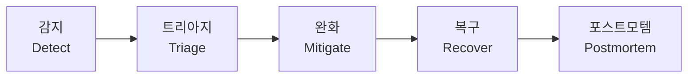
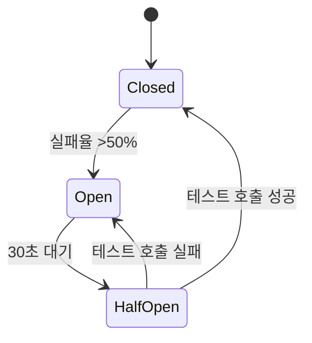
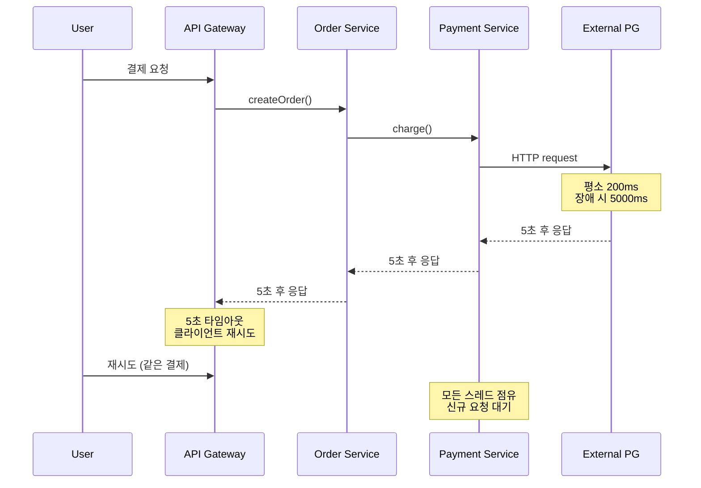
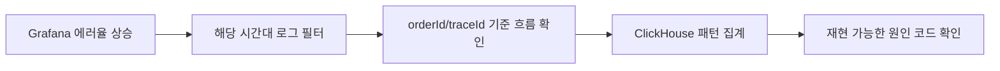

# 마이크로서비스 운영 및 장애 대응

## 시작하기 전에

운영을 처음 맡으면 대시보드부터 만든다. 그다음 알람을 건다. 그러면 끝난 줄 안다.
실제로 새벽 3시에 전화를 받아보면, 보이는 것과 행동해야 하는 것 사이에 큰 간격이 있다.

이 문서는 그 간격을 메우는 데 필요한 항목을 정리한다. 헬스체크와 SLO 같은 사전 준비,
온콜 로테이션과 인시던트 절차 같은 운영 흐름, 자원 고갈·캐시 스탬피드·연쇄 장애 같은
실제 사례별 대응까지 묶어서 다룬다. 로그 운영은 장애 진단의 토대라서 마지막에 별도로 둔다.

여기 나오는 수치(타임아웃 ms, 임계치, 보존기간)는 실제 서비스 규모에 맞춰 다시 잡아야 한다.
그대로 가져다 쓰면 안 된다.

---

## 헬스체크와 프로브 설계

쿠버네티스의 livenessProbe, readinessProbe, startupProbe는 이름만 비슷해 보여도 역할이 다르다.
한 엔드포인트에서 셋 다 처리하면 거의 항상 사고가 난다.

### 세 프로브의 차이

- **livenessProbe**: 컨테이너가 살아있는지 확인. 실패하면 재시작한다.
- **readinessProbe**: 트래픽을 받을 준비가 됐는지 확인. 실패하면 서비스에서 제외하지만 재시작은 안 한다.
- **startupProbe**: 부팅 시간이 긴 앱이 일정 시간 안에 뜨는지 확인. 통과 전까지 liveness/readiness가 잠긴다.

가장 흔한 실수는 liveness에서 DB 연결을 체크하는 것이다. DB가 잠시 흔들리면 모든 파드가
동시에 재시작되면서 진짜 장애가 시작된다. liveness는 프로세스가 자기 자신을 확인하는 데
그쳐야 한다.

```yaml
# Spring Boot 기준 예시
livenessProbe:
  httpGet:
    path: /actuator/health/liveness
    port: 8080
  initialDelaySeconds: 30
  periodSeconds: 10
  failureThreshold: 3

readinessProbe:
  httpGet:
    path: /actuator/health/readiness
    port: 8080
  initialDelaySeconds: 10
  periodSeconds: 5
  failureThreshold: 2

startupProbe:
  httpGet:
    path: /actuator/health/liveness
    port: 8080
  failureThreshold: 30
  periodSeconds: 5
```

`/actuator/health/liveness`는 메모리·디스크 같은 자체 상태만 본다.
`/actuator/health/readiness`는 의존성(DB, 캐시, 메시지 브로커) 상태를 본다.
의존성을 readiness에 묶어두면 의존성이 죽었을 때 트래픽이 끊긴다. 살아있는 파드를
재시작 시키지는 않는다. 이 분리가 운영 안정성의 시작이다.

### 의존성을 readiness에 넣을지 결정하는 기준

| 의존성 | readiness 포함 여부 | 이유 |
|---|---|---|
| 주 DB | 포함 | DB 없으면 어차피 요청 처리 불가 |
| 캐시 | 제외 | 캐시 없으면 느려져도 동작은 한다 |
| 외부 결제 API | 제외 | 일시 장애에 트래픽까지 끊으면 전체 다운 |
| 메시지 브로커 (소비자 역할) | 포함 | 메시지 못 받으면 의미 없음 |
| 메시지 브로커 (선택적 발행) | 제외 | 발행 못 해도 핵심 요청은 처리 가능 |

판단 기준 한 줄: "이게 죽었을 때 트래픽 자체를 끊는 게 맞느냐"

---

## SLO·SLI·에러버짓

### SLI는 측정 가능한 수치다

SLI(Service Level Indicator)는 "사용자가 느끼는 좋음/나쁨"을 숫자로 표현한 것이다.
"빠르다"가 아니라 "200ms 이내 응답한 비율"이다.

마이크로서비스에서 자주 쓰는 SLI:

- 가용성: `정상 응답 수 / 전체 응답 수`
- 지연: `p95 응답시간`, `p99 응답시간`
- 에러율: `5xx 응답 수 / 전체 응답 수`
- 처리량: `초당 처리 요청 수`

### SLO는 그 SLI의 목표치다

SLO(Service Level Objective)는 "30일 동안 가용성 99.9% 이상"처럼 기간과 함께 정의한다.
기간이 없으면 의미가 없다. 99.9%는 30일 기준으로 약 43분의 다운타임을 허용한다.

| SLO | 30일 허용 다운타임 | 90일 허용 다운타임 |
|---|---|---|
| 99% | 7시간 12분 | 21시간 36분 |
| 99.5% | 3시간 36분 | 10시간 48분 |
| 99.9% | 43분 12초 | 2시간 9분 |
| 99.95% | 21분 36초 | 1시간 4분 |
| 99.99% | 4분 19초 | 12분 58초 |

처음 시작할 때 99.99%를 잡지 마라. 그 숫자를 못 지키면 신뢰가 무너지고, 지키려고
하면 모든 변경이 막힌다. 99.5%로 시작해서 실제 측정치를 보고 조정해야 한다.

### 에러버짓이 운영을 좌우한다

에러버짓은 "허용된 실패의 양"이다. 99.9% SLO라면 30일에 0.1%, 즉 약 43분이 버짓이다.

이 개념이 중요한 이유는 배포 속도와 안정성 사이의 갈등을 수치로 해결할 수 있어서다.

- 버짓이 남아있으면: 새 기능 배포해도 된다. 실패해도 SLO 안에 들어온다.
- 버짓이 소진됐으면: 배포 동결한다. 신뢰성 개선 작업만 한다.

말로 하면 항상 PM과 싸우게 된다. 에러버짓이 0이라는 그래프 하나가 그 싸움을 끝낸다.

```promql
# Prometheus에서 7일 에러율
sum(rate(http_requests_total{status=~"5.."}[7d]))
/
sum(rate(http_requests_total[7d]))
```

### 번 레이트 알람

에러버짓이 다 떨어진 다음에 알람이 와봐야 늦다. 소진 속도(burn rate)로 알람을 건다.

- 5분 burn rate가 14.4 이상: 1시간 안에 한 달치 버짓 소진. 즉시 호출.
- 1시간 burn rate가 6 이상: 6시간 안에 한 달치 버짓 소진. 빠른 대응.
- 6시간 burn rate가 1 이상: 추세는 위험. 다음날까지는 본다.

세 단계로 나누면 알람 피로가 줄어든다. 모든 알람을 같은 우선순위로 두면 결국 다 무시한다.

---

## 알람 임계치 설계

알람을 처음 설계할 때 가장 흔한 실수는 절대값으로 거는 것이다.
"5xx가 분당 100건 이상이면 알람" 같은 식이다.

트래픽이 평소의 10배가 들어오는 시간대에는 100건이 정상일 수 있고,
새벽에는 10건도 큰 문제다. 절대값 임계치는 거의 항상 비율로 바꿔야 한다.

### 알람 종류와 임계치 예시

| 알람 | 측정 | 임계치 | 액션 |
|---|---|---|---|
| 에러율 급증 | 5xx 비율 | 5분 평균 >1% | 즉시 호출 |
| 지연 증가 | p99 latency | 10분 평균 평소의 3배 | 즉시 호출 |
| SLO 빠른 소진 | 1시간 burn rate | >6 | 즉시 호출 |
| SLO 느린 소진 | 6시간 burn rate | >1 | 영업시간 알림 |
| 트래픽 급감 | RPS | 5분 평균 평소의 50% 이하 | 즉시 호출 |
| 디스크 가득 | 사용률 | >85% | 영업시간 알림 |
| 디스크 위험 | 사용률 | >95% | 즉시 호출 |

### 알람이 울리지 않을 위험

이게 더 무섭다. 신규 가입 API가 새벽 2시부터 6시까지 모두 실패해도, 그 시간대에는 가입자가
적어서 절대 건수가 안 찬다. 비율로 보면 100%가 실패해도 알람이 안 운다.

대응:

- 비율 알람과 절대 건수 알람을 같이 건다. 둘 중 어느 쪽이든 충족하면 발화.
- "기대 트래픽 대비 부족"을 별도로 모니터링한다 (anomaly detection).

### 알람 피로 줄이기

알람이 분당 10개씩 오면 다 무시한다. 운영팀이 알람을 끄는 순간 모니터링은 끝난다.

- 같은 원인의 알람은 묶는다 (alert grouping).
- 일시적 깜빡임은 알람으로 보내지 않는다. 5분 지속 등 시간 조건을 건다.
- 즉시 호출 알람은 한 달에 사람당 5건 이하를 목표로 한다. 그 이상은 알람 설계가 잘못된 거다.

---

## 온콜 로테이션과 페이저듀티

### 온콜이란 무엇을 책임지는가

온콜은 "지금 이 시간 동안 알람이 오면 응답할 사람"이다.
24시간 동안 5분 안에 알람에 응답하고, 30분 안에 상황을 파악할 수 있어야 한다.

신입한테 단독 온콜을 맡기지 마라. 시니어 + 주니어 페어 로테이션이 표준이다.

### 로테이션 주기

- 1주: 가장 흔하지만 1주 내내 잠을 못 자기도 한다.
- 1일: 부담은 적지만 인계가 잦아서 컨텍스트가 끊긴다.
- 12시간 (낮/밤 분리): 팀이 크면 가능하지만, 작은 팀에서는 사람 갈아넣는 구조가 된다.

작은 팀(5명 이하)은 1주 + 백업 1명 구조가 현실적이다.
3명 이하면 온콜은 사실상 24/7 대기다. 채용을 먼저 해야 한다.

### 페이저듀티 같은 도구가 하는 일

- 알람을 사람에게 라우팅한다.
- 응답 안 하면 다음 사람으로 에스컬레이션한다.
- 누가 언제 온콜인지 스케줄을 관리한다.
- 인시던트 타임라인을 자동으로 기록한다.

직접 슬랙으로만 알람을 받는 구조는 한 명이 휴가 가면 무너진다.

### 에스컬레이션 정책

1단계: 1차 온콜 (5분 응답 없으면)
2단계: 2차 온콜 (5분 응답 없으면)
3단계: 팀 리드 (5분 응답 없으면)
4단계: 매니저 직접 호출

3차까지 응답이 없으면 알람 설계나 사람 배치를 다시 봐야 한다.

---

## 인시던트 대응 절차

### 5단계 흐름



각 단계의 목표가 다르다. 단계를 건너뛰면 같은 장애가 다시 난다.

### 1. 감지 (Detect)

알람이 울렸을 때 5분 안에 응답한다.

체크 항목:
- 진짜 장애인가 (알람 오작동 아닌가)
- 영향받는 서비스는 어디인가
- 사용자 영향은 어느 정도인가

5분 안에 판단이 안 서면 일단 인시던트로 선언한다. 오인이면 닫으면 된다.
선언을 안 하고 30분 끌다가 실제 장애였으면 그게 더 큰 문제다.

### 2. 트리아지 (Triage)

심각도(Severity)를 정한다.

| 등급 | 정의 | 대응 |
|---|---|---|
| SEV1 | 전체 서비스 다운, 결제 불가 | 즉시 모든 인력 동원 |
| SEV2 | 핵심 기능 영향, 일부 사용자 영향 | 1시간 내 대응 |
| SEV3 | 부수 기능 영향, 우회 가능 | 영업시간 내 대응 |
| SEV4 | 영향 없는 경고성 | 다음 스프린트 |

SEV1·SEV2는 인시던트 채널을 별도로 열고 IC(Incident Commander)를 지정한다.
IC는 의사결정자다. 같이 코드를 보면 안 된다. 상황을 정리하고, 누가 뭘 할지 정하고,
외부 커뮤니케이션을 책임진다.

### 3. 완화 (Mitigate)

근본 원인 찾기 전에 일단 출혈을 멈춘다.

- 최근 배포가 의심되면 롤백한다. 원인 분석은 나중에.
- 특정 엔드포인트 문제면 그 엔드포인트만 차단한다.
- 트래픽 폭주면 rate limit를 더 좁힌다.
- 의존성 장애면 fallback으로 전환한다.

여기서 흔한 실수: "근본 원인을 알아야 고친다"고 30분을 보낸다.
사용자 입장에서는 1분이라도 빨리 정상으로 보이는 게 중요하다.
원인은 완화 후 차분히 봐도 된다.

### 4. 복구 (Recover)

- 임시 완화 조치를 정식 수정으로 바꾼다.
- 영향받은 데이터가 있으면 복구·재처리한다 (예: 실패한 결제 재시도).
- 정상 상태 확인. 메트릭이 평상시 수준으로 돌아왔는지 본다.

복구 선언은 IC가 한다. 한 사람이 "괜찮은 거 같은데요"라고 말하는 걸로 끝내면 안 된다.

### 5. 포스트모템 (Postmortem)

장애 후 일주일 안에 작성한다. 한 달 지나면 아무도 기억 못 한다.

포스트모템 문서에 들어가야 할 것:

- 타임라인 (분 단위)
- 사용자 영향 (몇 명, 얼마나, 어떤 기능)
- 근본 원인
- 트리거 (왜 지금 터졌나)
- 탐지 지연 (왜 더 빨리 못 잡았나)
- 대응 잘한 점
- 대응 못한 점
- 액션 아이템 (담당자·기한 명시)

**비난 없이(blameless)** 작성해야 한다. "A가 잘못 배포했다"가 아니라 "배포 직전 카나리에서
이상을 감지 못 했다, 카나리 임계치를 다시 본다"로 쓴다. 사람을 잡으면 다음번에 아무도
포스트모템에 진실을 안 쓴다.

---

## 런북과 플레이북

런북은 "이 알람이 오면 이렇게 하라"는 매뉴얼이다.
새벽 3시에 깨어난 사람이 5분 안에 따라할 수 있어야 한다.

### 런북에 반드시 들어갈 항목

```markdown
# Payment Service - DB Connection Pool Exhausted

## 알람 조건
- HikariCP active connections / max connections > 0.9
- 5분 이상 지속

## 영향
- 신규 결제 요청이 50ms 후 즉시 실패
- 사용자 체크아웃 단계에서 에러 페이지 노출

## 즉시 확인할 것
1. Grafana 대시보드: https://grafana.example.com/d/payment-db
2. 슬로우 쿼리 확인:
   ```sql
   SELECT pid, now() - query_start AS duration, query
   FROM pg_stat_activity
   WHERE state = 'active'
   ORDER BY duration DESC LIMIT 10;
   ```
3. 최근 30분 배포 내역 확인

## 즉시 대응
- 슬로우 쿼리가 보이면: 해당 쿼리 PID로 `pg_cancel_backend(pid)` 실행
- 슬로우 쿼리 안 보이면: 결제 서비스 파드 1개씩 순차 재시작 (HPA에 맡기지 말 것)
- 그래도 안 풀리면: 결제 서비스 트래픽 30% 차단 (Istio VirtualService)

## 에스컬레이션
- 15분 안에 안정화 안 되면 DB 팀 호출
- SEV2 선언 후 매니저 통보
```

### 런북을 안 쓰는 이유와 그 결과

- "코드 보면 알 수 있다" → 새벽에 졸린 사람한테는 안 통한다.
- "복잡한 케이스는 매번 다르다" → 80% 케이스만 다뤄도 평균 대응시간이 절반이 된다.
- "쓸 시간 없다" → 같은 장애가 세 번 나기 전에 한 번 쓰면 그 후로 시간이 남는다.

장애 한 번 칠 때마다 런북을 갱신한다. 포스트모템의 액션 아이템에 "런북 작성/갱신"이
거의 항상 들어가야 한다.

### 플레이북과의 차이

용어를 혼용하기도 하지만 구분하면:
- 런북: 특정 알람에 대한 1대1 대응 절차
- 플레이북: 시나리오 단위(DB 마스터 페일오버, 리전 장애 등) 큰 흐름

플레이북은 정기적으로 모의 훈련(game day)을 돌려야 의미가 있다.
문서만 있고 실제로 못 돌리는 페일오버 절차는 없는 것과 같다.

---

## 트래픽 격리와 부분 차단

서비스 일부에 문제가 생겼을 때 전체를 죽이지 않는 방법이다.

### 엔드포인트 단위 차단

특정 API가 폭주하거나 의존성 장애로 실패할 때, 그 엔드포인트만 차단한다.

Istio VirtualService 예시:

```yaml
apiVersion: networking.istio.io/v1beta1
kind: VirtualService
metadata:
  name: payment-virtualservice
spec:
  hosts:
    - payment-service
  http:
    - match:
        - uri:
            prefix: /api/payments/legacy-card
      fault:
        abort:
          percentage:
            value: 100
          httpStatus: 503
    - route:
        - destination:
            host: payment-service
```

`/api/payments/legacy-card`만 503으로 차단하고 나머지는 정상 라우팅한다.
사용자 입장에서 결제 자체는 다른 카드로 가능하다.

### 사용자 단위 차단

특정 사용자나 IP가 시스템에 과부하를 주면 그 사용자만 막는다.
배치성 크롤러나 어뷰징 시도에 자주 쓴다.

### 리전·셀 단위 격리

큰 시스템은 셀(cell) 단위로 사용자를 격리한다. A 셀에 문제가 생기면 A 셀 사용자만 영향받고
B 셀은 멀쩡하다. AWS의 cell-based architecture 개념이다.

작은 서비스에서는 과한 구조지만, 어느 정도 규모가 되면 이 격리 없이는 한 번의 장애가
전체로 번진다.

---

## 카나리·블루그린 실패 시 대응

### 카나리 배포의 정상 흐름

1. 새 버전을 1% 트래픽에만 노출
2. 에러율·지연 메트릭 5~10분 관찰
3. 정상이면 5% → 25% → 50% → 100% 점진 증가
4. 단계마다 자동 메트릭 체크

문제는 자동 롤백 기준이 너무 느슨하면 실패한 배포가 100%까지 흘러간다는 점이다.

### 자동 롤백 임계치 예시

Argo Rollouts AnalysisTemplate:

```yaml
apiVersion: argoproj.io/v1alpha1
kind: AnalysisTemplate
metadata:
  name: success-rate
spec:
  metrics:
    - name: success-rate
      interval: 1m
      successCondition: result[0] >= 0.99
      failureLimit: 2
      provider:
        prometheus:
          address: http://prometheus.monitoring:9090
          query: |
            sum(rate(http_requests_total{service="payment-service",status!~"5.."}[2m]))
            /
            sum(rate(http_requests_total{service="payment-service"}[2m]))
```

성공률이 99% 미만이 2분 연속되면 자동 롤백한다.

### 카나리가 거짓 음성을 낼 때

1% 트래픽에서는 문제가 안 보이다가 100%에서 터지는 경우가 있다. 흔한 원인:

- 캐시 적중률: 1%일 때는 일부 사용자만 캐시 미스. 100%일 때는 캐시 전체가 비어 있어서 DB 폭주.
- 커넥션 풀: 1%일 때는 풀이 충분. 100%일 때 풀이 모자라서 대기.
- 백오프 동기화: 1%일 때는 클라이언트 재시도가 분산. 100%일 때는 동시 재시도로 thundering herd.

대응:
- 25%·50% 단계에서도 진짜 부하 테스트 임계치를 본다. 그냥 통과시키지 않는다.
- 부하 시뮬레이션을 카나리 단계에서 같이 돌린다.

### 블루그린 전환 실패

블루그린은 트래픽 스위치 한 번으로 100%가 옮겨가서, 실패 시 영향이 카나리보다 크다.

전환 직후 5분이 가장 위험하다. 이때 봐야 할 것:

- 새 버전(green)의 5xx율
- DB connection pool 사용률 (새 인스턴스 풀이 차오르는 중)
- 캐시 적중률 (새 인스턴스는 캐시 비어 있음)

5분 안에 임계치 위반하면 즉시 blue로 되돌린다.

문제: 데이터베이스 스키마 변경이 동반된 경우 되돌릴 수 없다.
스키마 변경은 항상 backward-compatible로 두 단계 배포한다.
- 1단계: 새 컬럼 추가 (구버전이 무시함)
- 2단계: 새 코드 배포 (새 컬럼 사용)
- 3단계: 안정 후 구 컬럼 제거 (별도 배포)

이걸 안 지키면 롤백 자체가 불가능해진다.

---

## 트래픽 쉐이핑

들어오는 트래픽을 모양을 잡아서 받는 게 쉐이핑이다.
다 받았다가 죽는 것보다 적정량만 받고 나머지를 거절하는 게 낫다.

### Rate Limiting

- IP 단위: 어뷰징 방지에는 효과적, NAT 뒤 다수 사용자에게는 부작용.
- 사용자 ID 단위: 인증된 API에 적합.
- API 키 단위: 외부 파트너 API에 적합.

Redis 기반 토큰 버킷이 표준이다.

```python
import redis
import time

def check_rate_limit(redis_client, key, max_tokens, refill_rate):
    now = time.time()
    pipe = redis_client.pipeline()
    pipe.hgetall(key)
    pipe.expire(key, 60)
    state, _ = pipe.execute()

    tokens = float(state.get('tokens', max_tokens))
    last_refill = float(state.get('last_refill', now))

    elapsed = now - last_refill
    tokens = min(max_tokens, tokens + elapsed * refill_rate)

    if tokens < 1:
        return False
    tokens -= 1
    redis_client.hset(key, mapping={'tokens': tokens, 'last_refill': now})
    return True
```

분산 환경에서는 Lua 스크립트로 원자성을 보장해야 한다. 위 코드는 동시 요청에 race condition이 있다.

### 큐잉과 백프레셔

요청을 즉시 거절하는 대신 큐에 잠시 대기시킨다. 큐가 가득 차면 그때 거절한다.
사용자 입장에서 약간의 지연은 에러보다 낫다.

다만 큐 길이를 작게 둬야 한다. 큐가 길면 거기 들어간 요청은 timeout으로 죽고
응답을 못 받는데 백엔드는 계속 처리한다. 처리해도 의미 없는 일을 하는 셈이다.

큐 길이 가이드: 평균 처리 시간 × 동시 처리 수 정도. 그 이상은 그냥 거절한다.

### 우선순위 큐

모든 요청이 같은 우선순위가 아니다.
- 결제 완료 처리 > 상품 목록 조회 > 추천 상품 조회

부하 상황에서 우선순위 낮은 요청부터 거절한다.
프로덕트 팀과 협의해서 미리 분류해두지 않으면 장애 시간에 못 정한다.

---

## Graceful Degradation과 Fallback

전체 기능을 유지하지 못한다면 핵심 기능만이라도 살린다는 개념이다.

### 단계별 degradation 예시 (이커머스)

| 단계 | 상태 | 동작 |
|---|---|---|
| 정상 | 모든 의존성 정상 | 풀 기능 제공 |
| 1단계 | 추천 서비스 다운 | 추천 영역만 인기상품으로 대체 |
| 2단계 | 검색 서비스 다운 | 검색창 비활성화, 카테고리 탐색만 |
| 3단계 | 리뷰 서비스 다운 | 리뷰 영역 숨김 |
| 4단계 | 재고 서비스 다운 | "재고 확인 중" 표시 후 주문 시 검증 |
| 비상 | 결제 다운 | 장바구니까지는 가능, 결제는 차단 |

비상 단계에서도 사용자가 사이트를 열 수는 있게 한다.
브라우저 캐시·CDN으로 정적 페이지는 살려둔다.

### Fallback 구현 패턴

Resilience4j 예시:

```java
@CircuitBreaker(name = "recommendationService", fallbackMethod = "popularProducts")
public List<Product> getRecommendations(String userId) {
    return recommendationClient.getFor(userId);
}

public List<Product> popularProducts(String userId, Throwable t) {
    return cache.get("popular-products", () -> productRepository.findTop10ByOrders());
}
```

fallback 자체가 또 의존성에 의존하면 의미가 없다. fallback은 가능한 한
정적이거나 로컬 캐시 기반이어야 한다.

### 캐시된 데이터로 살아남기

핵심 데이터는 stale-while-revalidate 패턴을 쓴다.
- 1시간 캐시인데 1시간 지났음 → 일단 stale 데이터 반환
- 백그라운드에서 갱신 시도
- 갱신 실패하면 다음 요청까지 또 stale 데이터 사용

DB 다운 상황에서도 사용자에게 5분~10분 전 데이터는 보여줄 수 있다.
완전한 다운보다는 낫다.

---

## 의존성 장애 시 우회 전략

마이크로서비스는 의존성으로 묶여있어서 한 서비스 장애가 다른 서비스로 번지기 쉽다.
이걸 막는 게 운영의 절반이다.

### 서킷 브레이커

호출 실패가 일정 비율 넘으면 일정 시간 호출 자체를 막는다.
실패하는 서비스를 계속 두드리면 그쪽도 회복을 못 한다.



상태:
- Closed: 정상. 모든 요청 통과.
- Open: 차단. 즉시 fallback 반환.
- HalfOpen: 일부 요청만 통과시켜 회복 여부 확인.

임계치 설정 주의:
- 실패율: 보통 50%지만, 트래픽 적은 야간에는 1~2건 실패로 50%가 된다. 최소 호출 수를 같이 건다.
- 대기 시간: 너무 짧으면 회복 안 됐는데 다시 두드린다. 30초~1분이 일반적.

### 타임아웃 계층

서비스 A → B → C 호출 사슬에서 타임아웃을 안 거면 A가 무한 대기한다.

원칙:
- 모든 외부 호출에 타임아웃을 건다.
- 상위 서비스의 타임아웃이 하위 서비스 타임아웃보다 길어야 한다.
- 예: A는 10초, B는 5초, C는 2초.

타임아웃 없는 호출 하나가 전체 시스템을 멈춘다. 코드 리뷰에서 가장 자주 봐야 할 부분이다.

### 격벽 패턴 (Bulkhead)

스레드 풀이나 커넥션 풀을 호출 대상별로 분리한다.

예: 결제 서비스 호출용 스레드 풀 10개, 추천 서비스 호출용 스레드 풀 5개.
추천 서비스가 느려져서 풀 5개가 다 차도, 결제 서비스 호출은 영향 없다.

같은 풀을 공유하면 한 의존성의 지연이 모든 호출을 마비시킨다.

### 재시도와 백오프

재시도는 양날의 검이다. 잘못 쓰면 장애를 키운다.

원칙:
- 멱등(idempotent) 호출에만 재시도한다. POST에 재시도 걸면 중복 결제 난다.
- 지수 백오프(exponential backoff) + 지터(jitter) 필수.
- 재시도 최대 횟수 명시 (보통 3회).
- 클라이언트 측 재시도와 서버 측 재시도를 동시에 걸면 부하가 곱셈으로 늘어난다.

지터 없는 백오프의 위험: 모든 클라이언트가 같은 시점에 동시 재시도한다. 회복 직전의
시스템이 다시 죽는다 (thundering herd).

---

## 자원 장애 대응

### 메모리 누수

OOM(Out Of Memory)로 컨테이너가 죽는다. 처음에는 한 파드만 죽지만,
HPA가 트래픽을 다른 파드로 옮기면서 그 파드도 OOM. 결국 다 죽는다.

탐지:
- JVM이면 G1GC 시간 비율, heap 사용률 추세
- Node.js면 RSS 메모리 추세
- 컨테이너 메모리 사용률 그래프가 톱니가 아니라 우상향이면 누수다.

대응:
- 즉시: 메모리 limit 늘리고 파드 재시작 (시간 벌기)
- 단기: heap dump 떠서 누수 객체 찾기
- 장기: 누수 코드 수정

JVM에서 heap dump 자동 생성:

```yaml
env:
  - name: JAVA_OPTS
    value: "-XX:+HeapDumpOnOutOfMemoryError -XX:HeapDumpPath=/dump/heap.hprof"
volumeMounts:
  - name: dump
    mountPath: /dump
```

dump 볼륨은 영구 볼륨이어야 한다. 컨테이너가 죽으면 ephemeral 볼륨은 같이 사라진다.

### CPU 스파이크

CPU가 100% 치면 대부분 두 종류다:
- 무한 루프 / 의도치 않은 busy loop
- 외부 입력에 의한 폭주 (대량 정규식, 큰 JSON 파싱 등)

탐지:
- thread dump (JVM)
- profile (py-spy, async-profiler 등)
- CPU 프로파일 그래프

즉시 대응:
- CPU limit 늘리거나 파드 추가 (HPA 임계치 임시 하향)
- 의심 엔드포인트 차단

근본 원인은 프로파일링 없이는 거의 못 찾는다.
async-profiler나 py-spy를 미리 컨테이너에 넣어두면 대응이 빠르다.

### 디스크 가득

- 로그 디렉토리 폭주 (가장 흔함)
- 임시 파일 미정리
- 데이터베이스 데이터 증가

대응 1순위는 logrotate와 디스크 모니터링이다.
85% 알람, 95% 즉시 호출로 두 단계 구성한다.

쿠버네티스 노드 디스크가 차면 그 노드의 모든 파드가 evict된다.
Pod 단위 ephemeral storage limit을 안 걸어두면 한 파드가 노드 전체를 죽인다.

---

## DB Connection Pool 고갈

### 왜 자주 터지는가

마이크로서비스에서 가장 흔한 단일 장애 원인이다.

흐름:
1. DB 슬로우 쿼리 한두 개 발생
2. 그 쿼리들이 connection을 잡고 있음
3. 신규 요청은 connection을 못 받아 대기
4. 대기 큐가 차오름, 요청 타임아웃
5. 클라이언트 재시도, 더 많은 connection 요청
6. 풀 완전 고갈, 서비스 멈춤

### 탐지 메트릭

- `hikaricp_connections_active` / `hikaricp_connections_max` 비율
- `hikaricp_connections_pending` (대기 중인 요청 수)
- DB의 `pg_stat_activity` 또는 `SHOW PROCESSLIST`

대기 요청이 0이 아니면 이미 풀이 부족한 상태다.

### 즉시 대응

```sql
-- PostgreSQL: 가장 오래된 쿼리 찾기
SELECT pid, now() - query_start AS duration, state, query
FROM pg_stat_activity
WHERE state != 'idle'
ORDER BY duration DESC LIMIT 20;

-- 해당 쿼리 강제 종료
SELECT pg_cancel_backend(12345);  -- 안전한 취소
SELECT pg_terminate_backend(12345);  -- 강제 종료
```

cancel이 먼저, terminate는 cancel 안 먹힐 때만.

### 근본 대응

- 슬로우 쿼리 인덱스 추가
- N+1 쿼리 제거
- 풀 크기 조정: 무조건 늘리는 게 답이 아니다. DB 측 max_connections와 균형 맞아야 한다.
  - 마이크로서비스 N개 × 파드 M개 × 풀 크기 P = 총 connection 수.
  - 이게 DB의 max_connections를 넘으면 DB가 거부한다.
- PgBouncer 같은 connection pooler를 DB 앞에 둔다.

### 풀 크기 계산

흔한 오해: 풀 크기는 크면 클수록 좋다.
실제: 너무 크면 DB에 부하가 더 가서 더 느려진다.

기준: CPU 코어 수 × 2 + 디스크 spindle 수 정도가 시작점.
PostgreSQL 공식 권장도 비슷하다 (코어 수 × 2~3).

24코어 DB면 풀 크기 50~70이 적정. 200, 500은 거의 항상 잘못된 설정이다.

---

## 캐시 스탬피드 대응

### 무엇이 문제인가

캐시가 만료된 순간 100명이 동시에 같은 키를 조회한다.
모두 캐시 미스 → 모두 DB 조회 → DB 폭주.

특히 인기 키(top 상품, 메인 페이지 데이터)에서 자주 발생한다.

### 대응 방법 1: Mutex Lock

캐시 미스 시 첫 번째 요청만 DB 조회하고, 나머지는 대기.

```python
def get_with_lock(key, db_loader):
    value = cache.get(key)
    if value:
        return value

    lock_key = f"lock:{key}"
    if cache.set(lock_key, "1", nx=True, ex=10):
        try:
            value = db_loader()
            cache.set(key, value, ex=300)
            return value
        finally:
            cache.delete(lock_key)
    else:
        time.sleep(0.05)
        return get_with_lock(key, db_loader)
```

락 보유자가 죽으면 다른 요청이 영원히 대기한다. 락에 TTL 필수.

### 대응 방법 2: Probabilistic Early Expiration

만료 시점에 가까워질수록 일부 요청이 미리 갱신한다.
모두가 만료 직후에 몰리는 걸 방지한다.

```python
import random
import math

def should_refresh(ttl_remaining, ttl_total, beta=1.0):
    delta = ttl_total * beta * math.log(random.random())
    return ttl_remaining + delta <= 0
```

TTL이 줄어들수록 갱신 확률이 올라간다.

### 대응 방법 3: 백그라운드 갱신

캐시 만료 시간보다 짧은 주기로 백그라운드 워커가 미리 갱신한다.
사용자 요청은 항상 캐시에서 받는다.

가장 안정적이지만, 갱신해야 할 키 목록을 유지해야 한다.
인기 키만 골라서 적용하는 게 현실적이다.

### 대응 방법 4: TTL 지터

만료 시간을 정확히 5분이 아니라 4분 30초 ~ 5분 30초 사이로 분산.
다수 키가 동시에 만료되는 걸 막는다.

```python
ttl = 300 + random.randint(-30, 30)
cache.set(key, value, ex=ttl)
```

이건 거의 모든 캐시에 기본으로 적용해야 한다. 비용 0, 효과 큼.

---

## 실제 장애 사례

### 사례 1. 결제 타임아웃 연쇄장애

#### 발생

PG사 응답이 느려지기 시작. 평소 200ms였던 응답이 5초까지 증가.

#### 흐름



문제 확산:
1. PG 응답 지연 → Payment Service 스레드 풀 고갈
2. Payment Service가 응답 못 함 → Order Service의 Payment 호출 타임아웃
3. Order Service도 스레드 풀 고갈
4. API Gateway에서 Order Service 호출도 타임아웃
5. 클라이언트 재시도 → 사이클이 가속됨
6. 결국 결제 외 다른 기능도 영향 (Order Service가 다른 도메인도 처리하던 경우)

#### 대응 절차

즉시 (0~5분):
- Payment Service에 PG 호출용 별도 스레드 풀 격벽 적용 (이미 있었다면 해당 풀만 차서 다른 호출은 살아남음)
- PG 호출에 서킷 브레이커 발동 → fallback으로 "결제 처리 중, 잠시 후 확인" 응답

단기 (5~30분):
- PG 측 상태 확인, 다른 PG로 전환 가능한지 검토
- 사용자에게 상태 페이지 공지
- 실패한 결제 트랜잭션 ID 수집

복구 (30분~):
- PG 정상화 후 실패 트랜잭션 재처리
- 결제 완료됐는데 응답 못 받은 케이스 reconcile

#### 사후 액션

- PG 응답 시간 임계치 알람 추가 (p99 > 1초)
- Payment Service 스레드 풀 격벽 확인·강화
- 결제 fallback 메시지 UX 개선
- 카오스 테스트로 PG 지연 시나리오 정기 점검

### 사례 2. DB 슬로우 쿼리로 인한 API Gateway 응답 지연

#### 발생

낮 12시 점심시간, API Gateway 응답 지연 알람.
하지만 어떤 마이크로서비스가 원인인지 즉시 안 보임.

#### 원인 추적

분산 트레이스(Jaeger)로 지연 발생 위치 확인. User Service의 `getUserProfile`에서
DB 쿼리가 3초 걸림.

```sql
-- 문제 쿼리
SELECT u.*, COUNT(o.id) AS order_count
FROM users u
LEFT JOIN orders o ON o.user_id = u.id AND o.created_at > NOW() - INTERVAL '90 days'
WHERE u.id = ?
GROUP BY u.id;
```

`orders` 테이블이 1억 건 넘어가면서 인덱스 조건이 안 맞는 경우 풀스캔.
`user_id, created_at` 복합 인덱스가 있었지만, 최근 데이터 삭제로 통계가 흔들려서
플래너가 다른 경로를 선택.

#### 대응 절차

즉시:
- `pg_stat_activity`에서 long running 쿼리 PID 확인, cancel
- User Service에 캐시 TTL 임시 연장 (5분 → 30분), DB 부담 완화
- `getUserProfile` 호출 빈도가 높은 클라이언트 식별

단기:
- 통계 재수집: `ANALYZE orders;`
- 쿼리 분할: profile과 order_count를 별도 호출로 분리
- API Gateway 측에서 User Service 호출에 타임아웃 더 엄격하게 (3초 → 1초)

장기:
- order_count는 별도 집계 테이블 또는 캐시로 분리
- 통계 자동 수집 주기 단축

#### 사후 액션

- 모든 마이크로서비스의 p99 쿼리 시간을 메트릭으로 노출
- 슬로우 쿼리 로그를 ClickHouse로 보내서 추적
- 분산 트레이스 샘플링 비율 상향 (장애 시 추적 용이)

### 사례 3. 신규 배포 후 메모리 누수로 점진적 OOM

#### 발생

배포 후 정상 동작. 6시간 뒤부터 파드가 1개씩 OOM으로 죽기 시작.

#### 흐름

- 배포 직후 메모리 1.5GB (정상 범위)
- 4시간 후 2.5GB
- 6시간 후 3GB (limit) 도달, OOM Kill
- HPA가 트래픽을 다른 파드로 옮김 → 다른 파드도 가속 OOM
- 결국 1시간 안에 모든 파드가 차례로 죽음

#### 원인

새로 추가된 캐시 코드가 maximumSize를 안 걸어둔 ConcurrentHashMap.
사용자별 데이터를 계속 누적.

#### 대응 절차

즉시:
- 직전 버전으로 롤백 (포스트모템에서 가장 중요한 첫 행동)
- 롤백 후 안정성 확인
- heap dump 1개 확보 (커밋한 운영자가 dump 볼륨에서 추출)

분석:
- Eclipse MAT으로 heap dump 분석
- 의심 객체: 사용자 ID 키의 거대 Map
- 코드에서 해당 캐시 위치 확인

수정:
- Caffeine 캐시로 교체, maximumSize 10000, expireAfterWrite 10분
- 재배포 후 24시간 메모리 추세 모니터링

#### 사후 액션

- 메모리 사용률 상승 추세 알람 추가 (4시간 동안 50% 이상 증가)
- 코드 리뷰 체크 항목에 "캐시는 항상 size limit과 TTL 둘 다 설정"
- 배포 후 24시간 메모리 추세 자동 점검

---

## 로그 운영

여기서부터는 장애 진단의 기반인 로그 운영을 다룬다. 메트릭과 트레이스만으로는
원인을 못 짚는 경우가 대부분이라서, 로그 설계가 사실상 대응 속도를 결정한다.

### 로그는 반드시 구조화한다

문자열 로그는 초기에 편하지만 운영 단계에서 바로 한계가 온다.

```json
{
  "timestamp": "2025-12-16T11:32:21.123Z",
  "service": "order-service",
  "level": "ERROR",
  "message": "payment timeout",
  "orderId": "ORD-20251216-9912",
  "userId": "U-10291",
  "latencyMs": 3200,
  "traceId": "abc123"
}
```

- grep 대신 필드 기반 검색이 된다
- 특정 주문·사용자 단위 추적이 가능하다
- ClickHouse·Elasticsearch 양쪽 모두 대응한다

운영 중 문자열 로그만 남겨둔 서비스는 결국 다시 손대게 된다.

### CloudWatch (AWS 기본 스택)

언제 쓰는가:
- ECS / EKS 초기 단계
- 로그 볼륨이 아직 크지 않은 경우
- 운영 인력 최소화 상태

로그 그룹 구조:

```
/ecs/order-service
/ecs/payment-service
/ecs/auth-service
```

서비스 단위로 반드시 분리한다. 환경(dev, stage, prod)은 로그 그룹 이름에 포함시킨다.

CloudWatch Logs Insights 실사용 쿼리:

```
fields @timestamp, message, orderId
| filter orderId = "ORD-20251216-9912"
| sort @timestamp asc
```

```
fields @timestamp, service, latencyMs
| filter message like /timeout/
| filter latencyMs > 3000
```

Insights를 안 쓰고 콘솔 검색만 하면 장애 분석 시간이 몇 배로 늘어난다.

한계:
- 대량 로그 조회 시 비용 증가
- 복잡한 집계 쿼리 부적합
- 장기 보관에 부적절

이 시점부터 ClickHouse나 Elasticsearch가 필요해진다.

### ClickHouse

ClickHouse를 선택하는 이유:
- 초당 수십만 로그 수집 가능
- 비용 대비 성능이 좋음
- 장애 시점 분석이 빠름

로그를 OLAP 데이터로 본다.

```sql
CREATE TABLE logs (
  timestamp DateTime,
  service String,
  level String,
  message String,
  orderId String,
  userId String,
  latencyMs UInt32,
  traceId String
)
ENGINE = MergeTree
ORDER BY (service, timestamp);
```

장애 분석 실전 쿼리:

```sql
-- 특정 시간대 에러 증가 확인
SELECT
  toStartOfMinute(timestamp) AS minute,
  count() AS error_count
FROM logs
WHERE level = 'ERROR'
  AND timestamp >= now() - INTERVAL 30 MINUTE
GROUP BY minute
ORDER BY minute;
```

```sql
-- 특정 서비스 응답 지연 원인 추적
SELECT
  message,
  count()
FROM logs
WHERE service = 'payment-service'
  AND latencyMs > 3000
GROUP BY message
ORDER BY count() DESC;
```

이 쿼리 하나로 장애 원인 로그 패턴이 바로 드러난다.

운영 시 주의사항:
- ORDER BY 키를 잘못 잡으면 성능이 급격히 떨어진다
- TTL 설정으로 오래된 로그 자동 삭제 필요
- raw 로그와 집계용 로그 테이블 분리

### Elasticsearch

언제 쓰는가:
- 로그 검색 UI가 중요한 경우
- 운영팀·CS팀이 로그를 직접 보는 환경
- 텍스트 검색 비중이 높은 경우

인덱스 구조:

```
logs-order-service-2025.12.16
logs-payment-service-2025.12.16
```

서비스 + 날짜 조합이 기본이다.

Kibana 실전 검색:

```
message: "timeout" AND service: "payment-service"
userId: "U-10291"
```

한계:
- 로그 볼륨이 커질수록 비용 증가
- 장기 보관 비용 부담
- 대규모 집계는 ClickHouse보다 느림

실무에서는 Elasticsearch + ClickHouse 병행 구조를 자주 쓴다. ES는 검색, CH는 분석.

### Grafana (AWS Grafana 포함)

Grafana는 메트릭만 보는 도구가 아니다. 로그 + 메트릭을 한 화면에서 본다.

Grafana + CloudWatch:
- 장애 시점에 메트릭 그래프 클릭
- 해당 시점의 로그가 자동 필터링됨
- 메트릭과 로그를 동시에 본다

Grafana + ClickHouse:

```sql
SELECT
  timestamp,
  service,
  message
FROM logs
WHERE timestamp BETWEEN $__from AND $__to
  AND level = 'ERROR'
```

Grafana Time Range와 쿼리를 직접 연결한다.

운영에서 자주 쓰는 패턴:
- 에러율 그래프 클릭 → 로그 패널 자동 필터
- 특정 서비스 선택 → 해당 서비스 로그만 표시
- 주문 ID 입력 → 전체 서비스 로그 연쇄 조회

### 로그 기반 장애 대응 흐름



로그 구조가 나쁘면 이 과정이 불가능하다.

### 실무에서 겪은 로그 관련 문제와 해결

문제 1. 로그는 많은데 원인이 안 보임
- 원인: message 문자열 위주, context 없음
- 해결: business key(orderId 등) 포함, latency·resultCode 같은 수치 필드 추가

문제 2. 장애 후 로그 조회가 너무 느림
- 원인: Elasticsearch 단독, 인덱스 설계 미흡
- 해결: ClickHouse 병행, 분석은 ClickHouse, 검색은 ES

문제 3. 로그 비용 폭증
- 원인: DEBUG 로그 상시 활성화, 성공 로그 무차별 수집
- 해결: ERROR/WARN 100%, INFO 선택적, 성공 로그 샘플링

---

## 마무리

마이크로서비스 운영은 결국 두 가지 능력 싸움이다.
사전에 깔아둔 안전 장치(헬스체크·SLO·서킷 브레이커·격벽)가 얼마나 촘촘한가,
장애가 났을 때 사람이 얼마나 빠르게 움직일 수 있는가(런북·온콜·인시던트 절차).

도구는 거들 뿐이다. ClickHouse가 있다고 장애가 안 나는 게 아니고, 페이저듀티가 있다고
대응이 빨라지는 게 아니다. 새벽 3시에 깨어난 사람이 5분 안에 첫 행동을 할 수 있는
구조를 만들어두는 게 핵심이다.

처음부터 모든 항목을 완벽하게 갖출 필요는 없다. 우선순위는 보통 이렇게 잡는다.

1. 헬스체크·readiness 분리 (가장 흔한 사고 원인)
2. 알람과 온콜 (장애 감지 자체가 안 되는 상황 방지)
3. 타임아웃·서킷 브레이커 (연쇄 장애 차단)
4. 런북 (포스트모템에서 매번 액션 아이템으로 등장)
5. SLO·에러버짓 (배포 속도와 안정성 사이의 합의 도구)
6. 카나리·자동 롤백 (배포 위험 감소)

여기까지 깔리면 큰 사고는 거의 막힌다. 그 다음 단계는 셀 격리·카오스 엔지니어링 같은
정교한 영역인데, 보통 그 수준에서는 이미 SRE 팀이 따로 있다.
