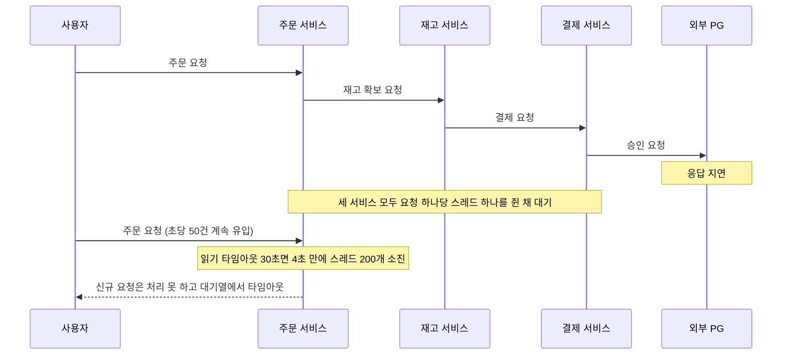
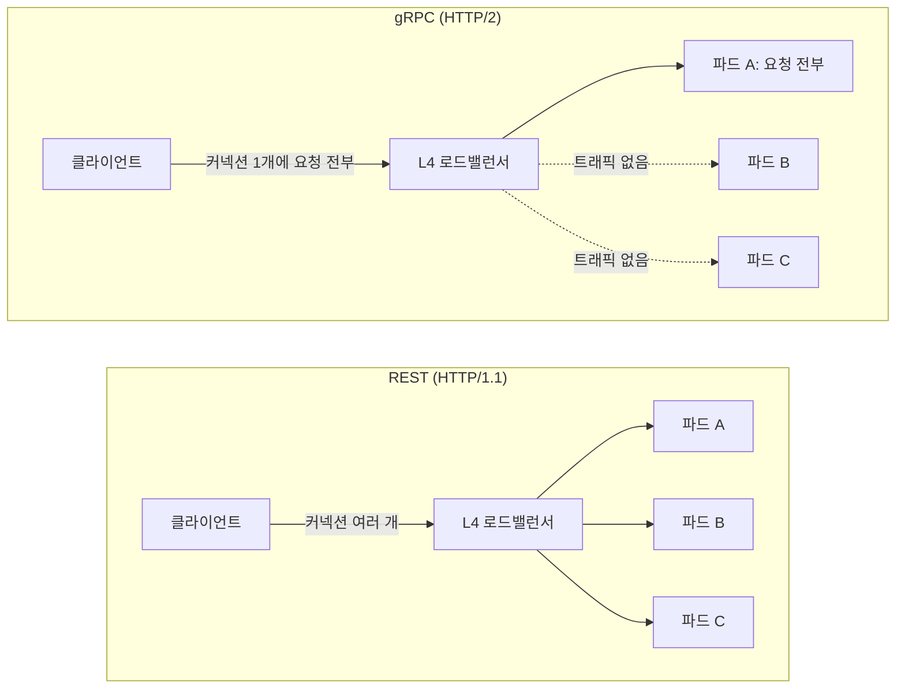
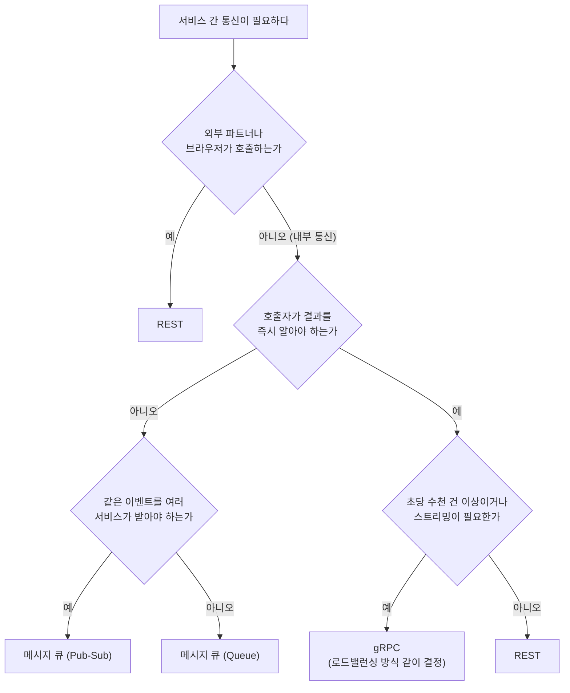
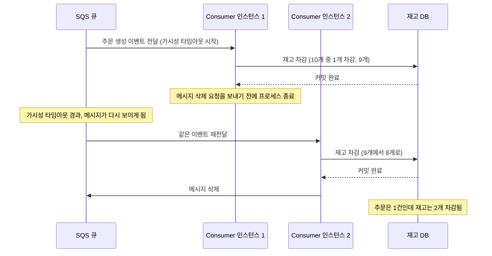

# 서버 간 통신 방식 실전 정리

서버 간 통신 방식은 시스템 구조를 사실상 결정한다. 초기에는 단순해 보이지만, 트래픽이 늘거나 장애가 생기면 그 선택의 결과가 고스란히 드러난다. 실무에서는 단일 방식으로 끝나는 경우가 거의 없다. HTTP로 시작하다가 병목이 생긴 구간만 메시지나 RPC로 분리하는 게 일반적이다.

## 동기, 비동기, 스트리밍 비교

동기 통신은 요청을 보내고 응답이 올 때까지 기다린다. HTTP와 gRPC 단건 호출이 여기 해당한다. 코드 흐름이 직관적이고 에러 처리가 명확하지만, 호출 체인이 길어질수록 지연이 쌓이고 한 서비스가 느려지면 그 영향이 위로 전파된다.

비동기 통신은 메시지를 큐에 넣고 처리 결과를 기다리지 않는다. 장애가 다른 서비스로 번지지 않고 소비자를 늘려 처리량을 조절할 수 있다. 대신 "지금 처리됐는가"를 즉시 알 수 없고, 메시지 중복, 순서 문제, DLQ 관리까지 신경 써야 할 게 늘어난다.

스트리밍은 연결 하나를 열어 두고 메시지를 계속 주고받는다. gRPC 서버 스트리밍, WebSocket, SSE가 여기 속한다. 알림 푸시나 주문 상태 추적처럼 결과가 여러 번에 나눠 도착하는 경우에 쓴다. 연결이 끊기면 그 사이 메시지가 사라지므로 재연결과 재전송을 직접 설계해야 한다.

| 기준 | 동기 (REST, gRPC 단건) | 비동기 (메시지 큐) | 스트리밍 (gRPC 스트림, WebSocket) |
|---|---|---|---|
| 지연 | 호출 체인 합산. 하위 서비스가 느리면 그대로 상위에 반영 | 발행은 빠르지만 처리 완료까지 수 초에서 수 분 걸릴 수 있음 | 연결이 맺어진 뒤에는 건당 지연이 가장 낮음 |
| 결합도 | 호출자가 대상 주소와 응답 스키마를 알아야 함. 시간적으로도 결합 | 발행자는 소비자를 모름. 이벤트 스키마만 공유 | 연결 단위로 강하게 결합. 양쪽이 같은 시점에 살아 있어야 함 |
| 순서 보장 | 호출자가 호출 순서를 직접 통제 | 표준 큐는 보장하지 않음. FIFO 큐나 Kafka는 그룹 키·파티션 안에서만 보장 | 한 스트림 안에서는 보장. 스트림이 둘 이상이면 서로 순서 무관 |
| 실패 전파 | 즉시 위로 전파. 타임아웃·스레드 고갈로 이어짐 | 큐에 쌓이고 DLQ로 격리. 호출자는 모름 | 연결 끊김으로 드러나며 끊긴 구간의 메시지는 유실 |
| 실패 감지 | 예외·상태 코드로 바로 알 수 있음 | DLQ 깊이와 소비 지연을 봐야 알 수 있음 | 하트비트나 재연결 이벤트로 감지 |

어느 쪽이 낫다고 단정 짓기 어렵다. 주문 직후 결제 요청처럼 즉각적인 결과가 필요한 흐름은 동기가 맞다. 반면 주문 완료 후 알림 발송, 포인트 적립, 통계 업데이트처럼 다음 단계가 지연되어도 되는 흐름은 비동기로 분리하는 게 낫다.

### 동기 호출 체인에서 지연과 장애가 번지는 과정

주문 → 재고 → 결제 순으로 동기 호출하는 구조를 예로 든다. 평소 응답 시간은 주문 50ms, 재고 100ms, 결제 200ms를 합쳐 350ms 정도다. 결제 서비스가 외부 PG 지연으로 응답하지 않는 상황이 되면 다음 순서로 문제가 커진다.



도식에서 볼 부분은 결제 서비스의 문제가 재고 서비스를 거쳐 주문 서비스의 스레드 풀까지 올라오는 경로다. 결제가 실패하는 것이 아니라 느려지는 것이 문제다. 실패는 바로 예외로 끝나지만 지연은 스레드를 붙잡는다. 주문 서비스 톰캣 스레드가 200개이고 초당 50건이 들어오면, 요청당 대기 시간이 4초만 넘어도 스레드 풀이 가득 찬다. 이 시점부터는 결제와 무관한 주문 조회 API까지 같은 스레드 풀을 쓰고 있다면 같이 멈춘다.

타임아웃은 상위가 하위보다 길어야 한다. 주문 서비스의 읽기 타임아웃이 3초인데 재고 서비스가 결제를 5초 기다리면, 주문 서비스는 이미 포기했는데 재고와 결제 쪽 작업은 계속 돌아간다. 하위 타임아웃을 상위보다 짧게 잡아야 위에서 포기하기 전에 아래에서 먼저 실패를 돌려준다.

재고 → 결제 구간만 메시지로 전환하면 주문은 재고의 즉각 응답만 기다린다. 결제가 느려져도 주문 API의 응답 시간은 달라지지 않는다.

## REST

REST는 HTTP를 활용한 아키텍처 스타일이다. 내부든 외부든 기본값에 가깝게 쓰인다. 모든 언어와 플랫폼에서 지원하고, 브라우저에서 직접 호출할 수 있고, curl로 바로 테스트할 수 있다는 점이 운영 현장에서 실질적인 장점이다.

내부 서비스 통신에 REST를 쓸 때 자주 만나는 문제는 타임아웃 기준이 제각각이라는 것이다. 주문 서비스는 5초, 결제 서비스는 10초, 재고 서비스는 3초로 각자 설정해두면 장애 원인을 추적할 때 어디서 먼저 터졌는지 파악하기 어렵다. 내부 통신은 1~3초로 통일하고, 타임아웃 발생 시 상관관계 ID와 함께 로그에 남기는 게 기본이다.

재시도도 한 곳에서만 해야 한다. 애플리케이션 레이어에서 3회, HTTP 클라이언트에서 2회, 로드밸런서에서 1회씩 재시도하면 최대 18번 요청이 나간다. 멱등하지 않은 API라면 중복 처리가 생긴다.

```java
// Spring Boot RestTemplate 타임아웃 설정
@Bean
public RestTemplate restTemplate() {
    HttpComponentsClientHttpRequestFactory factory = new HttpComponentsClientHttpRequestFactory();
    factory.setConnectTimeout(1_000);  // 1초
    factory.setReadTimeout(3_000);     // 3초
    return new RestTemplate(factory);
}

@Service
public class OrderService {
    private final RestTemplate restTemplate;
    private static final String PAYMENT_URL = "http://payment-service/internal/payments";

    public PaymentResponse requestPayment(String orderId, int amount) {
        PaymentRequest request = new PaymentRequest(orderId, amount);
        try {
            return restTemplate.postForObject(PAYMENT_URL, request, PaymentResponse.class);
        } catch (ResourceAccessException e) {
            // 타임아웃 발생 시 즉시 실패 처리, 재시도 없음
            throw new PaymentServiceUnavailableException("결제 서비스 응답 없음", e);
        }
    }
}
```

외부 연동에는 REST가 거의 유일한 선택지다. 파트너사 API, 공공 API, PG사 연동 모두 REST다.

## gRPC

gRPC는 내부 서비스 간 호출 빈도가 높을 때 선택된다. Protocol Buffers로 직렬화하고 HTTP/2로 전송한다. JSON 대비 페이로드가 작고 직렬화 속도가 빠르다. 초당 수천 건 이상 호출이 발생하는 구간에서 HTTP 대비 차이가 체감된다.

타입 안정성이 실질적인 이점이다. proto 파일에 요청/응답 구조를 정의하면 클라이언트와 서버 코드가 동일한 스키마를 공유한다. HTTP에서 필드 이름 오타나 타입 불일치로 런타임에 터지던 문제가 컴파일 타임으로 앞당겨진다.

```protobuf
// order.proto
syntax = "proto3";

package order;

service OrderService {
  rpc CreateOrder (CreateOrderRequest) returns (CreateOrderResponse);
  rpc GetOrder    (GetOrderRequest)    returns (GetOrderResponse);
  rpc StreamOrderStatus (StreamRequest) returns (stream OrderStatus);
}

message CreateOrderRequest {
  string user_id         = 1;
  repeated OrderItem items = 2;
  string idempotency_key = 3;
}

message OrderItem {
  string product_id = 1;
  int32  quantity   = 2;
  int64  price      = 3;
}

message CreateOrderResponse {
  string order_id = 1;
  string status   = 2;
}
```

```java
// gRPC 서버 구현
@GrpcService
public class OrderGrpcService extends OrderServiceGrpc.OrderServiceImplBase {
    private final OrderApplicationService orderService;

    @Override
    public void createOrder(CreateOrderRequest request,
                            StreamObserver<CreateOrderResponse> responseObserver) {
        try {
            String orderId = orderService.createOrder(
                request.getUserId(),
                request.getItemsList(),
                request.getIdempotencyKey()
            );

            responseObserver.onNext(CreateOrderResponse.newBuilder()
                .setOrderId(orderId)
                .setStatus("CREATED")
                .build());
            responseObserver.onCompleted();
        } catch (Exception e) {
            responseObserver.onError(
                Status.INTERNAL.withDescription(e.getMessage()).asRuntimeException()
            );
        }
    }
}
```

gRPC를 쓸 때 가장 많이 겪는 문제는 proto 변경 시 배포 순서다. 서버가 새 proto로 먼저 배포되고 클라이언트가 구 proto를 쓰면 필드 불일치로 에러가 난다.

필드 삭제가 가장 위험한 작업이다. 다른 서비스가 그 필드를 읽고 있는지 확인하려면 모든 소비자를 파악해야 한다. 필드 번호는 절대 재사용하지 않고, 삭제 대신 `[deprecated = true]`로 처리한 뒤 충분한 기간이 지난 뒤에 제거한다. 제거할 때는 `reserved 2;`로 번호를 묶어 두면 실수로 재사용했을 때 protoc이 컴파일 단계에서 막는다.

gRPC 로그는 바이너리라 사람이 읽을 수 없다. 장애 분석용 로그는 JSON으로 별도 변환해 남겨야 한다. 브라우저에서 직접 호출이 불가능하므로 외부 API나 파트너 연동에는 쓰지 않는다.

### HTTP/2 커넥션 재사용과 로드밸런싱

gRPC가 쓰는 HTTP/2는 커넥션 하나에 여러 요청을 다중화한다. 클라이언트는 서버와 커넥션을 하나 맺고 오래 재사용한다. HTTP/1.1 REST에서는 커넥션 풀의 여러 커넥션에 요청이 흩어지고 커넥션이 자주 새로 맺어졌기 때문에, L4 로드밸런서나 쿠버네티스 ClusterIP 같은 커넥션 단위 분산도 어느 정도 균등하게 동작했다.

gRPC에서는 이 전제가 깨진다. 커넥션 단위로 분산하는 장비는 커넥션을 맺는 순간에 백엔드를 한 번 고르고, 이후 그 커넥션 위의 모든 요청이 같은 백엔드로 간다.



도식 오른쪽이 실제로 겪는 상황이다. 파드를 늘려도 기존 클라이언트의 커넥션은 이미 한 파드에 붙어 있어 새 파드로 트래픽이 가지 않는다. 스케일 아웃을 했는데 CPU가 한 파드에만 몰리는 증상으로 나타난다. 해결 방법은 요청 단위로 분산하는 L7 프록시(Envoy 등)를 두거나, headless 서비스로 파드 IP 목록을 받아 클라이언트가 직접 `round_robin`으로 나누거나, 서비스 메시의 사이드카에 맡기는 것이다. 각 방식의 설정과 함정은 별도 문서로 나눠 정리할 주제라서 여기서는 원인만 짚는다. 서비스 메시 쪽은 [서비스 메시와 사이드카 패턴](서비스_메시_및_사이드카_패턴.md)에서 다룬다.

## 메시지 기반 비동기 통신

메시지 큐는 동기 호출의 부담을 줄이기 위해 도입한다. Producer가 메시지를 큐에 쓰고 바로 반환하면, Consumer가 독립적으로 가져가 처리한다.

Queue는 하나의 메시지를 하나의 Consumer가 처리한다. 이미지 리사이징, 배치 작업처럼 작업을 분산할 때 쓴다. Pub-Sub은 하나의 메시지를 여러 Consumer가 처리한다. 주문 완료 이벤트를 재고 서비스, 알림 서비스, 통계 서비스가 각자 소비하는 구조다.

```java
// Spring + SQS Producer
@Service
public class OrderEventPublisher {
    private final SqsTemplate sqsTemplate;

    public void publishOrderCreated(String orderId, String userId) {
        OrderCreatedEvent event = OrderCreatedEvent.builder()
            .eventId(UUID.randomUUID().toString())  // 멱등성 키
            .orderId(orderId)
            .userId(userId)
            .occurredAt(Instant.now())
            .version("1.0")
            .build();

        sqsTemplate.send("order-created-queue", event);
    }
}

// Consumer (멱등성 처리 포함)
@SqsListener("order-created-queue")
public void handleOrderCreated(OrderCreatedEvent event) {
    if (processedEventRepository.existsByEventId(event.getEventId())) {
        return;  // 중복 메시지 무시
    }

    try {
        inventoryService.decreaseStock(event.getOrderId());
        processedEventRepository.save(event.getEventId());
    } catch (Exception e) {
        // 예외를 던지면 SQS가 재시도 후 DLQ로 이동
        throw new MessageProcessingException("재고 차감 실패", e);
    }
}
```

메시지 통신을 도입하면 반드시 챙겨야 하는 것들이 있다.

멱등성 처리가 가장 중요하다. 네트워크 재시도, Consumer 장애 후 복구 등으로 같은 메시지가 여러 번 처리될 수 있다. 이벤트 ID를 처리 기록에 저장해 이미 처리된 메시지는 무시해야 한다. 위 예제처럼 재고 차감과 이벤트 ID 저장을 같은 트랜잭션으로 묶어야 원자적으로 처리된다. 예제에서 `existsByEventId`와 `save` 사이에 다른 인스턴스가 같은 메시지를 집어 가는 경우까지 막으려면 이벤트 ID 컬럼에 유니크 제약을 걸어 두어야 한다. 체크만으로는 동시 처리를 못 막는다.

DLQ는 반드시 모니터링해야 한다. DLQ에 메시지가 쌓여도 알람이 없으면 한참 지난 뒤에야 알게 된다. 처리 실패가 누적되면 결국 데이터 불일치로 이어진다. DLQ 메시지 수가 0보다 커지면 즉시 알람이 오도록 설정하는 게 기본이다.

이벤트 스키마와 소비 서비스는 문서로 남겨야 한다. 시간이 지나면 누가 이 이벤트를 발행했고, 어떤 서비스가 소비하는지 아는 사람이 없어진다. 이벤트 구조를 바꾸려 할 때 영향 범위를 파악하지 못하면 장애로 이어진다.

## REST, gRPC, 메시지 큐 선택 기준

세 가지 중 무엇을 고를지는 몇 가지 질문으로 좁혀진다. 아래 흐름은 위에서부터 순서대로 따라 내려가며 걸리는 첫 번째 조건에서 멈춘다.



외부 연동인지가 첫 분기인 이유는 이 조건이 선택지를 가장 많이 지우기 때문이다. 파트너사나 브라우저에서 호출하는 API는 REST다. gRPC와 메시지 큐는 내부 서비스 간 통신에만 쓴다.

즉각적인 응답이 필요하면 동기 통신(REST 또는 gRPC)이고, 처리 결과가 지연되어도 되면 메시지가 낫다. 내부 서비스 간 초당 수천 건 이상 호출이 발생하면 gRPC를 고려한다. HTTP JSON의 직렬화 비용이 누적된다. 주문 생성 후 재고, 알림, 통계가 각자 처리해야 한다면 Pub-Sub이다. REST로 각 서비스를 순차 호출하면 주문 서비스가 알 필요 없는 의존성을 떠안게 된다.

| | REST | gRPC | 메시지 큐 |
|---|---|---|---|
| 통신 방식 | 동기 | 동기/스트리밍 | 비동기 |
| 외부 연동 | 가능 | 어려움 | 어려움 |
| 타입 안정성 | 낮음 | 높음 | 낮음 |
| 장애 전파 | 있음 | 있음 | 없음 |
| 확장성 | 보통 | 보통 | 높음 |
| 운영 복잡도 | 낮음 | 중간 | 높음 |

실무에서는 세 가지를 섞어 쓴다. 외부 API는 REST, 내부 고빈도 서비스 간 통신은 gRPC, 후처리나 이벤트 전파는 메시지 큐로 가는 구조가 자주 등장한다.

## 서비스 간 인증

내부망이라는 이유로 서비스 간 호출을 인증 없이 열어 두면, 파드 하나만 뚫려도 다른 서비스를 마음대로 호출할 수 있다. 서비스 간 인증은 두 층으로 나눠서 본다. 호출한 서비스가 누구인지(서비스 신원)와, 그 호출을 시작시킨 사용자가 누구인지(사용자 신원)다.

서비스 신원은 mTLS로 확인한다. 클라이언트와 서버가 서로 인증서를 제시하고 검증하므로 인증서가 없는 호출은 연결 단계에서 끊긴다. 인증서 발급과 갱신을 직접 운영하면 만료로 인한 장애가 난다. 인증서 만료일을 놓쳐 서비스 간 호출이 한꺼번에 실패한 사례가 흔하다. 서비스 메시가 자동으로 발급·갱신하게 두는 편이 안전하다.

사용자 신원은 토큰 전파로 넘긴다. 주문 서비스가 받은 사용자의 JWT를 재고·결제 서비스 호출에 그대로 실어 보내면 하위 서비스도 같은 권한 검사를 할 수 있다. 다만 토큰을 그대로 전달하면 하위 서비스가 사용자 권한으로 해선 안 되는 작업까지 하게 될 수 있다. 서비스 간 전용 작업은 별도의 서비스 계정 토큰을 쓰고, 사용자 토큰은 사용자 행위를 대신하는 호출에만 전달한다. 비동기 메시지에 사용자 토큰을 실으면 소비 시점에 만료되어 있는 경우가 많아서, 메시지에는 사용자 ID만 담고 소비자는 서비스 계정으로 처리하는 쪽이 낫다.

## 실무 트러블슈팅 사례

### HTTP 타임아웃으로 주문 장애

결제 서비스가 외부 PG사 API 지연으로 느려졌다. 결제 서비스 타임아웃이 30초로 설정되어 있었고, 주문 서비스가 결제 응답을 기다리면서 스레드 풀이 모두 고갈됐다. 주문 버튼 자체가 응답하지 않았다. 앞의 동기 호출 체인 도식이 이 사고를 그대로 옮긴 것이다.

결제 요청을 비동기로 전환했다. 주문 상태를 `PENDING`으로 설정한 뒤 즉시 응답하고, 결제 완료 이벤트가 오면 주문 상태를 업데이트하는 방식이다. 결제 지연이 주문 API에 전파되지 않는다.

### 메시지 중복 처리로 재고 초과 차감

주문 생성 이벤트가 두 번 처리됐다. SQS는 메시지를 한 번 이상 전달하는 at-least-once 방식이라, Consumer가 처리를 끝내고 삭제 요청을 보내기 전에 프로세스가 죽거나 처리 시간이 가시성 타임아웃을 넘기면 같은 메시지를 다시 내보낸다. 이때 재고 차감은 이미 DB에 커밋되어 있었다. 멱등성 처리가 없어서 재고가 두 번 차감됐다.



도식에서 볼 부분은 C1이 일을 끝냈는데도 큐는 그 사실을 모른다는 점이다. 큐가 아는 것은 삭제 요청이 왔는지뿐이다. 그래서 재전달을 막을 방법은 없고, 두 번 받아도 결과가 같게 만드는 수밖에 없다.

처리 이력 테이블에 이벤트 ID를 저장하는 방식으로 해결했다. 재고 차감과 이벤트 ID 저장을 같은 트랜잭션으로 묶어 원자적으로 처리한다. 이벤트 ID 컬럼에는 유니크 제약을 걸어, 두 인스턴스가 동시에 같은 메시지를 처리하려 해도 한쪽의 커밋이 실패하게 했다.

### gRPC proto 필드 삭제로 데이터 오염

`user_name` 필드를 더 이상 쓰지 않는다고 판단해 proto에서 삭제했다. 삭제된 번호(2번)를 새 필드에 재사용했더니 클라이언트가 구 필드로 보낸 값을 서버가 새 필드로 읽었다. 장애까지는 아니었지만 데이터가 꼬였다.

이후로 필드 삭제는 `[deprecated = true]`로 먼저 마킹하고, 모든 클라이언트가 해당 필드를 안 쓰는 게 확인된 뒤에 제거한다. 제거할 때는 `reserved`로 번호를 막는다. 필드 번호 재사용은 절대 하지 않는다.

### WebSocket 연결 끊김으로 알림 유실

배포 시 서버 재시작으로 WebSocket 연결이 끊겼다. 클라이언트 재연결 로직이 없어서 연결이 끊긴 채로 남아 있었고, 그동안 발행된 알림이 모두 유실됐다.

클라이언트에 지수 백오프 재연결 로직을 추가했다. 알림은 WebSocket과 메시지 큐 양쪽으로 발행해, 재연결 후 미수신 알림을 큐에서 가져가도록 설계를 바꿨다.

## 테스트

REST 통합 테스트는 실제 서비스를 호출해야 한다. 타임아웃 시나리오, 500 에러 응답, 네트워크 단절 상황을 테스트하지 않으면 운영에서 만난다.

메시지 소비 로직은 단독으로 테스트할 수 있다. 메시지를 직접 생성해 Consumer를 호출하면 되고, 중복 메시지 시나리오와 DLQ 이동 동작을 반드시 확인해야 한다. 재고 초과 차감 사례처럼 같은 이벤트를 두 번 연속 넣고 재고가 한 번만 줄었는지 보는 테스트가 가장 값어치가 높다.

gRPC는 proto 파일 기반으로 클라이언트 코드를 생성해 테스트한다. 스키마 변경 시 컴파일 에러로 감지된다는 게 장점이다. 스트리밍 시나리오는 실제 gRPC 서버를 띄워서 확인한다.

어떤 통신 방식이든 실패 시나리오 테스트는 빠지면 안 된다. 서비스 장애, 네트워크 지연, 중복 메시지를 테스트하지 않으면 구현이 얼마나 견고한지 알 수 없다.

### 서비스 간 계약 테스트

서비스를 따로 배포하는 구조에서는 통합 테스트만으로 호환성을 잡기 어렵다. 제공자가 응답 필드의 이름이나 타입을 바꿔도 제공자의 테스트는 통과하고, 소비자는 배포한 뒤에야 깨진다. 계약 테스트는 소비자가 실제로 쓰는 요청과 응답 모양을 계약 파일로 남기고, 제공자의 CI가 그 계약을 그대로 재생해 검증하는 방식이다. 제공자가 소비자가 쓰는 필드를 지우거나 타입을 바꾸면 제공자 쪽 빌드가 먼저 실패한다. 앞서 본 proto 필드 삭제 사례처럼 소비자를 다 파악하지 못해서 생기는 사고를 배포 전에 잡는 용도다. REST는 Pact나 Spring Cloud Contract로, gRPC는 proto 호환성 검사 도구(`buf breaking` 등)로 같은 효과를 낸다. 전체 테스트 구성은 [MSA 테스트 전략](MSA_테스트_전략.md)에서 이어서 볼 수 있다.
