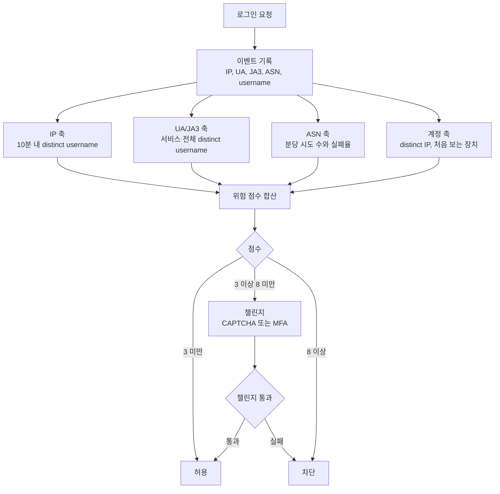
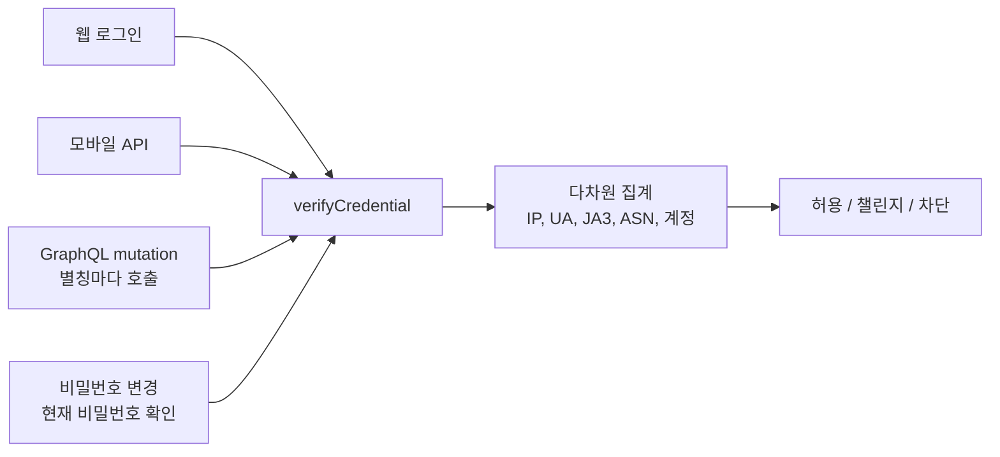
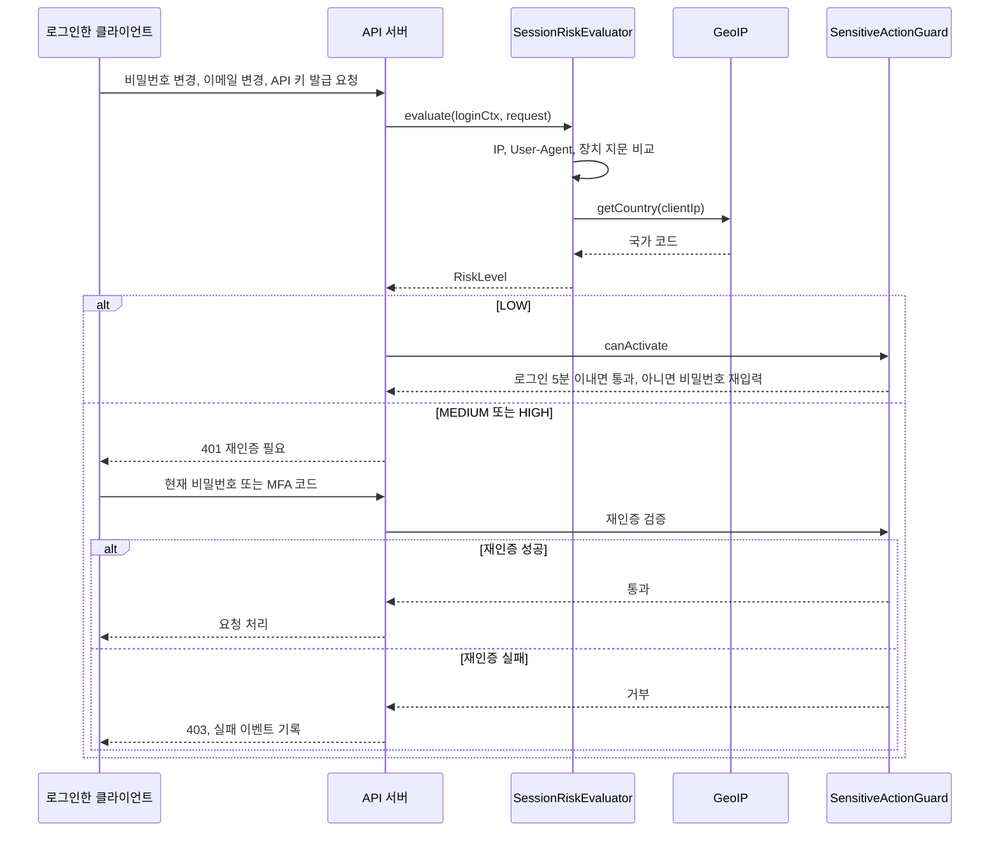
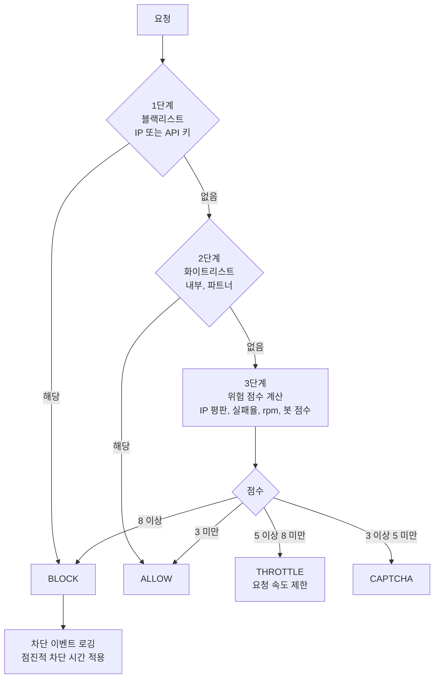

# API 남용 방지 실무 패턴

## Credential Stuffing 탐지

### 어디서 유출된 자격 증명이 들어온다

Credential Stuffing은 다른 서비스에서 유출된 이메일/비밀번호 조합을 대량으로 로그인 API에 쏘는 공격이다. 일반적인 brute force와 다른 점은 이미 유효한 자격 증명을 사용한다는 것이다. 비밀번호를 무작위로 때려 맞추는 게 아니라 실제로 동작하는 계정 정보를 쓰기 때문에 단순한 로그인 실패 횟수 제한으로는 막기 어렵다.

### 탐지 포인트

로그인 API에서 다음 지표를 추적한다:

```typescript
import { Injectable } from '@nestjs/common';
import { InjectRedis } from '@nestjs-modules/ioredis';
import Redis from 'ioredis';

@Injectable()
export class LoginAttemptTracker {
  constructor(@InjectRedis() private readonly redis: Redis) {}

  // IP 기반: 단일 IP에서 서로 다른 계정으로 로그인 시도
  async trackByIp(ip: string, username: string): Promise<void> {
    const key = 'login:ip:' + ip;
    await this.redis.sadd(key, username);
    await this.redis.expire(key, 600); // 10분
  }

  // 계정 기반: 단일 계정에 여러 IP에서 로그인 시도
  async trackByAccount(username: string, ip: string): Promise<void> {
    const key = 'login:account:' + username;
    await this.redis.sadd(key, ip);
    await this.redis.expire(key, 600); // 10분
  }

  async isCredentialStuffing(ip: string): Promise<boolean> {
    const distinctAccounts = await this.redis.scard('login:ip:' + ip);
    // 10분 내 한 IP에서 5개 이상 서로 다른 계정으로 시도하면 의심
    return distinctAccounts >= 5;
  }
}
```

핵심은 **실패 횟수가 아니라 시도 패턴**이다. 정상 사용자는 자기 계정 하나로 로그인을 시도하지, 10분 안에 서로 다른 계정 5개를 번갈아 시도하지 않는다.

공격의 원리, 로그 패턴, 봇넷 구성은 [크리덴션 스터핑](../../Security/Credential_Stuffing.md)에 따로 정리했다. 이 문서는 API 계층에서 어떤 신호를 모아 어떻게 판정하는지만 다룬다.

### 이벤트가 위험 점수가 되기까지

위 코드는 IP 하나만 본다. 실제로는 로그인 이벤트 하나를 IP, User-Agent, JA3, ASN, 계정 다섯 축으로 동시에 집계하고, 각 축의 이상 신호를 합산해 한 번에 판정한다. 축 하나가 회피당해도 다른 축이 잡도록 하기 위해서다.

아래 흐름도에서 볼 것은 집계 축이 병렬이라는 점과, 판정이 축별이 아니라 합산 점수로 나뉜다는 점이다.



점수 구간은 뒤의 [계층별 차단 구조](#계층별-차단-구조)와 같은 값을 쓴다. 탐지 로직과 차단 로직이 서로 다른 임계값을 들고 있으면 한쪽만 고쳤을 때 동작이 어긋난다.

### 위 탐지 코드가 놓치는 경우

`isCredentialStuffing`은 한 IP에서 10분 안에 서로 다른 계정 5개 이상을 시도해야 걸린다. 레지덴셜 프록시를 쓰는 공격은 IP 하나당 요청이 1~3건이라 `scard`가 5에 닿지 않는다. 키 TTL이 600초라서 요청을 느리게 보내면 집합이 비워지기도 한다. 이 코드는 서버 한 대에서 오는 단순한 스터핑만 잡는다고 보면 된다.

IP 축 대신 올려야 하는 건 IP보다 바꾸기 어려운 축이다. UA, JA3, ASN은 요청마다 바꾸기 어렵고, 서비스 전체를 한 키로 집계하면 분산돼도 합쳐진다. distinct 개수만 필요하므로 집합 대신 HyperLogLog를 쓰면 메모리가 고정된다.

```typescript
import { Injectable } from '@nestjs/common';
import { InjectRedis } from '@nestjs-modules/ioredis';
import Redis from 'ioredis';

@Injectable()
export class GlobalStuffingSignal {
  constructor(@InjectRedis() private readonly redis: Redis) {}

  // 분 단위 버킷에 username 을 HLL 로 쌓는다. dimension 은 'ua', 'ja3', 'asn' 중 하나
  async record(dimension: string, value: string, username: string, now = new Date()): Promise<void> {
    const key = `stuff:${dimension}:${value}:${this.minute(now)}`;
    await this.redis.pfadd(key, username);
    await this.redis.expire(key, 3600);
  }

  // 최근 windowMin 분 동안 이 값으로 시도된 distinct username 수
  async distinctUsers(dimension: string, value: string, windowMin: number, now = new Date()): Promise<number> {
    const keys: string[] = [];
    for (let i = 0; i < windowMin; i++) {
      keys.push(`stuff:${dimension}:${value}:${this.minute(new Date(now.getTime() - i * 60_000))}`);
    }
    return this.redis.pfcount(...keys);
  }

  private minute(d: Date): string {
    return d.toISOString().slice(0, 16);
  }
}
```

같은 JA3 해시에서 30분 동안 고유 username이 수천 개 나오면 IP가 몇 개로 나뉘어 있든 이상이다. 다만 사내망이나 학교처럼 한 ASN에 정상 사용자가 몰리는 곳, 모바일 앱이 같은 UA와 JA3를 쓰는 경우는 기준선이 높다. 축마다 평소 distinct 수를 먼저 재고 임계값을 정해야 한다. 모바일 앱처럼 사용자 전원이 같은 UA를 쓰는 경우 UA 축 임계값을 IP 축처럼 잡으면 앱 사용자 전체가 챌린지에 걸린다.

### 로그인 말고 다른 입구로 들어온다

로그인 API에만 방어를 쌓으면 공격자는 같은 자격 증명 검증이 일어나는 다른 엔드포인트로 옮겨간다. 비밀번호 검증과 계정 존재 확인이 일어나는 곳은 로그인만이 아니다.

| 우회 경로 | 공격자가 얻는 것 | 로그인 방어가 안 먹는 이유 |
|---|---|---|
| 비밀번호 재설정 요청 | 계정 존재 여부. 가입 안 된 이메일 목록을 걸러낸다 | 존재 여부에 따라 응답 문구나 응답 시간이 다르면 열거 수단이 된다. 로그인과 다른 rate limit 키를 쓴다 |
| 모바일 API | 로그인 성공 여부 | 구버전 앱 경로에 CAPTCHA 연동이 없고, 인증 방식이 달라 WAF 규칙이 안 걸린다 |
| GraphQL 로그인 mutation | 한 요청 안에서 수십 건 검증 | 별칭(alias)으로 mutation을 한 요청에 여러 번 넣으면 HTTP 요청 기준 카운터는 1만 오른다 |
| 비밀번호 변경의 현재 비밀번호 확인 | 이미 탈취한 세션으로 다른 비밀번호 검증 | 로그인이 아니라서 실패 카운터가 로그인과 분리돼 있다 |
| 소셜·SSO 전환 엔드포인트 | 이메일 기반 계정 연결 | 연결 시도가 로그인 이벤트로 기록되지 않는다 |

GraphQL 별칭 공격은 이런 요청으로 들어온다. 요청은 한 건이고 검증은 세 번이다.

```graphql
mutation {
  a: login(email: "user1@example.com", password: "pw1") { token }
  b: login(email: "user2@example.com", password: "pw2") { token }
  c: login(email: "user3@example.com", password: "pw3") { token }
}
```

HTTP 계층의 rate limit은 이 요청을 1건으로 센다. 카운터를 resolver 안에서 올려야 한다. 별칭 수 자체를 제한(쿼리 복잡도 또는 같은 mutation의 호출 수 상한)하는 방법도 같이 쓴다. 배열 형태 배치 요청을 허용하는 서버에서는 같은 문제가 생긴다.

그래서 시도 기록은 엔드포인트가 아니라 **자격 증명 검증 함수**에서 남긴다. 로그인, 재설정, 모바일, GraphQL이 모두 같은 `verifyCredential()`을 지나가게 하고 그 안에서 위의 다섯 축 집계를 호출하면 우회로를 하나씩 막으러 다닐 필요가 없다.



### 계정당 1회 저속 공격이 안 잡히는 이유

계정당 시도가 하루 한 번인 공격은 계정 축으로는 흔적이 없다. 실패 카운터는 1에서 TTL로 사라지고, 잠금 조건은 한 번도 충족되지 않는다. IP 축도 매번 다른 IP라 비어 있다. 개별 이벤트 하나는 오타를 낸 정상 사용자와 구분되지 않는다.

신호는 개별 이벤트가 아니라 **합계의 모양**에 있다.

- 서비스 전체 로그인 성공률이 평소 기준선보다 내려가서 시간이 지나도 회복되지 않는다.
- 존재하지 않는 username으로 시도한 비율이 오른다. 정상 사용자는 자기 계정을 쓰므로 이 비율이 낮다.
- 고유 username 수가 요청 수와 거의 같다. 정상 트래픽은 한 사용자가 여러 번 시도해서 요청 수가 고유 수보다 많다.
- 같은 UA/JA3 조합이 시간대와 무관하게 평탄한 분포로 들어온다.

이 수치들은 계정이나 IP가 아니라 서비스 단위 시계열로 봐야 한다. 뒤의 시계열 기반 이상 탐지 절처럼 시간대별 기준선을 두고, 개별 요청은 허용하되 점수에 가산해서 성공 이후의 단계(새 장치 확인, MFA)에 영향을 주는 방식이 현실적이다. 요청 단위로 차단하면 정상 사용자 오탐이 먼저 나온다.

### 유출 비밀번호 사전 차단

Have I Been Pwned의 Passwords API를 사용하면 회원가입이나 비밀번호 변경 시 이미 유출된 비밀번호인지 확인할 수 있다. k-Anonymity 모델을 써서 비밀번호 원문을 외부로 보내지 않는다.

```typescript
import { Injectable } from '@nestjs/common';
import { HttpService } from '@nestjs/axios';
import { createHash } from 'crypto';
import { firstValueFrom } from 'rxjs';

@Injectable()
export class BreachedPasswordChecker {
  constructor(private readonly httpService: HttpService) {}

  async isBreachedPassword(password: string): Promise<boolean> {
    const sha1 = createHash('sha1').update(password).digest('hex').toUpperCase();
    const prefix = sha1.substring(0, 5);
    const suffix = sha1.substring(5);

    // prefix만 전송 — 원문 비밀번호는 외부에 노출되지 않음
    const { data } = await firstValueFrom(
      this.httpService.get<string>(`https://api.pwnedpasswords.com/range/${prefix}`),
    );

    return data
      .split('\n')
      .some((line) => line.startsWith(suffix + ':'));
  }
}
```

이걸 로그인 시점에 쓰면 성능 이슈가 생긴다. 회원가입과 비밀번호 변경 시점에만 체크하고, 기존 사용자에게는 주기적으로 비밀번호 변경을 권유하는 방식이 현실적이다.


## Account Takeover 방어

### 로그인 이후가 더 위험하다

Credential Stuffing으로 실제 로그인에 성공한 경우, 공격자는 비밀번호 변경, 이메일 변경, API 키 발급 같은 민감한 작업을 바로 시도한다. 로그인 자체를 막는 것과 별개로, 로그인 이후 행동 기반 탐지가 필요하다.

### 세션 컨텍스트 비교

로그인 성공 시점의 환경 정보를 저장해두고, 이후 요청과 비교한다:

```typescript
export interface SessionContext {
  ip: string;
  userAgent: string;
  country: string;
  deviceFingerprint: string;
  loginTime: Date;
}

export enum RiskLevel {
  LOW = 'LOW',
  MEDIUM = 'MEDIUM',
  HIGH = 'HIGH',
}

import { Injectable } from '@nestjs/common';
import { Request } from 'express';

@Injectable()
export class SessionRiskEvaluator {
  constructor(private readonly geoIpService: GeoIpService) {}

  async evaluate(loginCtx: SessionContext, request: Request): Promise<RiskLevel> {
    let score = 0;

    const clientIp = this.getClientIp(request);

    // IP 변경
    if (loginCtx.ip !== clientIp) {
      score += 2;
    }

    // User-Agent 변경 — 같은 세션 내에서 브라우저가 바뀔 일은 없다
    if (loginCtx.userAgent !== request.headers['user-agent']) {
      score += 3;
    }

    // 국가 변경 — VPN을 쓰더라도 세션 중간에 국가가 바뀌면 의심
    const currentCountry = await this.geoIpService.getCountry(clientIp);
    if (loginCtx.country !== currentCountry) {
      score += 4;
    }

    if (score >= 4) return RiskLevel.HIGH;
    if (score >= 2) return RiskLevel.MEDIUM;
    return RiskLevel.LOW;
  }

  private getClientIp(request: Request): string {
    return (request.headers['x-forwarded-for'] as string)?.split(',')[0] ?? request.ip ?? '';
  }
}
```

위험도가 HIGH이면 민감한 작업(비밀번호 변경, 결제 등) 시 재인증을 요구한다. 세션을 즉시 끊는 건 정상 사용자도 영향받으니 신중해야 한다.

아래 시퀀스에서 볼 것은 위험도 평가가 민감 작업 요청 한복판에서 일어나고, LOW가 아니면 재인증이 끼어든다는 점이다. 세션을 끊지 않고 해당 요청만 보류한다.



### 아래 Guard 코드의 구멍

바로 아래 `SensitiveActionGuard`는 로그인 후 5분 이내면 재인증 없이 통과시킨다. 스터핑 공격자는 로그인에 성공하자마자 비밀번호와 이메일을 바꾼다. 로그인 직후 몇 분이 가장 위험한 구간인데, 이 코드는 그 구간을 가장 느슨하게 둔다. 위 시퀀스의 `RiskLevel`을 Guard가 전혀 쓰지 않는 것도 문제다.

처음 보는 장치에서의 로그인이거나 위험도가 LOW가 아니면 5분 면제를 적용하지 않아야 한다.

```typescript
const risk = await this.riskEvaluator.evaluate(ctx, request);
const trustedDevice = await this.deviceStore.isKnown(username, ctx.deviceFingerprint);

// 면제는 LOW 이면서 알려진 장치일 때만
if (risk === RiskLevel.LOW && trustedDevice && ctx.loginTime > fiveMinutesAgo) {
  return true;
}
```

이메일 변경은 변경 요청을 받은 시점이 아니라 기존 주소로 알림을 보내고 일정 시간 되돌릴 수 있게 두는 것까지 같이 설계해야 한다. 공격자가 이메일을 먼저 바꾸면 이후 재설정 메일이 전부 공격자에게 간다.

### 민감 작업 보호

비밀번호 변경, 이메일 변경, 2FA 해제 같은 작업에는 별도 보호가 필요하다:

```typescript
import {
  Injectable,
  CanActivate,
  ExecutionContext,
  UnauthorizedException,
} from '@nestjs/common';
import { Request } from 'express';
import * as bcrypt from 'bcrypt';

// @SensitiveAction() 데코레이터와 함께 사용하는 Guard
@Injectable()
export class SensitiveActionGuard implements CanActivate {
  constructor(
    private readonly sessionStore: SessionStore,
    private readonly userService: UserService,
  ) {}

  async canActivate(context: ExecutionContext): Promise<boolean> {
    const request = context.switchToHttp().getRequest<
      Request & { user: { username: string } }
    >();
    const username = request.user.username;
    const ctx = await this.sessionStore.get(username);

    // 로그인 후 5분 이내면 추가 검증 없이 통과
    const fiveMinutesAgo = new Date(Date.now() - 5 * 60 * 1000);
    if (ctx.loginTime > fiveMinutesAgo) {
      return true;
    }

    // 5분 이후라면 현재 비밀번호 재입력 필요
    const confirmPassword = request.headers['x-confirm-password'] as string | undefined;
    if (!confirmPassword) {
      throw new UnauthorizedException('재인증이 필요합니다.');
    }

    const hashedPassword = await this.userService.getHashedPassword(username);
    const isValid = await bcrypt.compare(confirmPassword, hashedPassword);
    if (!isValid) {
      throw new UnauthorizedException('비밀번호가 올바르지 않습니다.');
    }

    return true;
  }
}
```


## 봇 트래픽 식별

### User-Agent만으로는 부족하다

봇은 일반 브라우저의 User-Agent를 그대로 복사해서 보낸다. User-Agent 기반 차단은 선의의 크롤러(Googlebot 등)나 구형 브라우저 사용자만 걸러내고, 실제 악성 봇은 통과시킨다.

### 서버 사이드 핑거프린팅

브라우저 핑거프린팅은 클라이언트에서 하는 것(FingerprintJS 등)과 서버 사이드에서 하는 것이 있다. 서버에서는 HTTP 요청 자체의 특성을 본다:

```typescript
import { Injectable } from '@nestjs/common';
import { Request } from 'express';

/** IP 별 요청 간격의 표준편차. 값이 극도로 낮으면 기계적 요청이다. */
class RequestIntervalTracker {
  private readonly last = new Map<string, number>();
  private readonly gaps = new Map<string, number[]>();
  private static readonly KEEP = 20;

  record(ip: string, now = Date.now()): void {
    const prev = this.last.get(ip);
    this.last.set(ip, now);
    if (prev === undefined) return;
    const arr = this.gaps.get(ip) ?? [];
    arr.push((now - prev) / 1000);
    if (arr.length > RequestIntervalTracker.KEEP) arr.shift();
    this.gaps.set(ip, arr);
  }

  /** 표본이 모자라면 null — 판정하지 않는다는 뜻이다. */
  getStdDev(ip: string): number | null {
    const arr = this.gaps.get(ip);
    if (!arr || arr.length < 5) return null;
    const mean = arr.reduce((a, b) => a + b, 0) / arr.length;
    const variance = arr.reduce((a, b) => a + (b - mean) ** 2, 0) / arr.length;
    return Math.sqrt(variance);
  }
}

@Injectable()
export class BotDetector {
  private readonly knownBotJa3Set = new Set<string>(/* 알려진 봇 JA3 해시 */);
  // 아래 isSuspicious 가 쓴다. 선언이 없으면
  // TS2339: Property 'requestIntervalTracker' does not exist on type 'BotDetector'.
  private readonly requestIntervalTracker = new RequestIntervalTracker();

  isSuspicious(request: Request): boolean {
    let score = 0;

    // 1. TLS fingerprint (JA3) — HTTP/2 환경에서는 JA4로 대체
    // TLS 핸드셰이크 특성으로 클라이언트 종류를 식별한다
    // 프록시/로드밸런서에서 JA3 해시를 헤더로 전달받는 구조
    const ja3Hash = request.headers['x-ja3-hash'] as string | undefined;
    if (ja3Hash && this.knownBotJa3Set.has(ja3Hash)) {
      score += 5;
    }

    // 2. 헤더 순서와 존재 여부
    // 실제 브라우저는 Accept, Accept-Language, Accept-Encoding을 항상 보낸다
    if (!request.headers['accept-language']) {
      score += 3;
    }

    // 3. 요청 간격 분석
    // 사람은 요청 간격이 불규칙하다. 봇은 일정한 간격으로 요청한다
    const clientIp = this.getClientIp(request);
    const intervalStdDev = this.requestIntervalTracker.getStdDev(clientIp);
    if (intervalStdDev !== null && intervalStdDev < 0.05) {
      // 표준편차가 극도로 낮으면 기계적 요청
      score += 4;
    }

    return score >= 5;
  }

  private getClientIp(request: Request): string {
    return (request.headers['x-forwarded-for'] as string)?.split(',')[0] ?? request.ip ?? '';
  }
}
```

JA3/JA4 핑거프린팅은 Cloudflare, Nginx(OpenResty), HAProxy 등에서 모듈로 지원한다. 애플리케이션 레벨에서 직접 구현하려면 TLS 핸드셰이크 정보에 접근해야 해서 복잡해진다. 보통 리버스 프록시에서 추출해서 헤더로 전달하는 구조를 쓴다.

### CAPTCHA 연동

CAPTCHA는 모든 요청에 적용하면 사용자 경험이 나빠진다. 위험 점수 기반으로 조건부 적용한다:

```typescript
import { Injectable } from '@nestjs/common';
import { HttpService } from '@nestjs/axios';
import { ConfigService } from '@nestjs/config';
import { firstValueFrom } from 'rxjs';

export enum CaptchaDecision {
  SKIP = 'SKIP',
  INVISIBLE = 'INVISIBLE',
  CHALLENGE = 'CHALLENGE',
}

interface RecaptchaResponse {
  success: boolean;
  score: number;
}

@Injectable()
export class CaptchaGateway {
  private readonly recaptchaSecret: string;

  constructor(
    private readonly httpService: HttpService,
    private readonly configService: ConfigService,
  ) {
    this.recaptchaSecret = this.configService.get<string>('RECAPTCHA_SECRET') ?? '';
  }

  // risk score가 일정 수준 이상일 때만 CAPTCHA 검증 요구
  decide(riskScore: number): CaptchaDecision {
    if (riskScore < 3) {
      return CaptchaDecision.SKIP;
    }
    if (riskScore < 7) {
      // invisible reCAPTCHA — 사용자에게 보이지 않음
      return CaptchaDecision.INVISIBLE;
    }
    // 명시적 챌린지
    return CaptchaDecision.CHALLENGE;
  }

  async verify(captchaToken: string): Promise<boolean> {
    const params = new URLSearchParams({
      secret: this.recaptchaSecret,
      response: captchaToken,
    });

    const { data } = await firstValueFrom(
      this.httpService.post<RecaptchaResponse>(
        'https://www.google.com/recaptcha/api/siteverify',
        params.toString(),
        { headers: { 'Content-Type': 'application/x-www-form-urlencoded' } },
      ),
    );

    // reCAPTCHA v3는 0.0~1.0 점수를 반환한다
    // 0.5 미만이면 봇으로 판단하는 게 일반적
    return data.success && data.score >= 0.5;
  }
}
```

reCAPTCHA v3를 쓰면 사용자에게 챌린지를 보여주지 않고도 봇 여부를 판단할 수 있다. 다만 점수 기준값(threshold)은 서비스마다 다르게 튜닝해야 한다. 0.5가 기본이지만 로그인 API에서는 0.7 이상으로 올리는 경우가 많다.


## API 스크래핑 차단

### 데이터 대량 수집 패턴

API 스크래핑은 공개 API를 정상적으로 호출하되 대량으로 데이터를 수집하는 행위다. Rate Limiting만으로는 부족한 경우가 있다. 공격자가 여러 IP를 돌려가면서 rate limit 아래로 요청을 분산시키기 때문이다.

### 페이지네이션 남용 탐지

목록 API를 처음부터 끝까지 순차적으로 전부 조회하는 패턴을 잡는다:

```typescript
import { Injectable } from '@nestjs/common';
import { InjectRedis } from '@nestjs-modules/ioredis';
import Redis from 'ioredis';

@Injectable()
export class PaginationAbuseDetector {
  constructor(@InjectRedis() private readonly redis: Redis) {}

  // 사용자별 페이지네이션 패턴 추적
  async isSequentialScraping(userId: string, endpoint: string, page: number): Promise<boolean> {
    const key = `pagination:${userId}:${endpoint}`;

    // 최근 조회한 페이지 번호 기록
    await this.redis.rpush(key, String(page));
    await this.redis.expire(key, 1800); // 30분

    const pages = await this.redis.lrange(key, 0, -1);
    if (pages.length < 10) {
      return false;
    }

    // 최근 10개 페이지가 연속된 숫자인지 확인
    const recent = pages
      .slice(Math.max(0, pages.length - 10))
      .map((p) => parseInt(p, 10));

    for (let i = 1; i < recent.length; i++) {
      if (recent[i] - recent[i - 1] !== 1) {
        return false;
      }
    }

    return true;
  }
}
```

정상 사용자는 1페이지 보고 3페이지 보고 다시 1페이지 보는 식으로 불규칙하게 조회한다. 1, 2, 3, 4, 5, 6... 순서대로 끝까지 조회하면 스크래핑이다.

### 응답 데이터 워터마킹

API 응답에 사용자별 고유 마커를 심어두면 데이터가 유출됐을 때 출처를 추적할 수 있다:

```typescript
import { Injectable } from '@nestjs/common';

@Injectable()
export class ResponseWatermarker {
  // 텍스트 필드에 zero-width 문자로 사용자 ID를 인코딩
  watermark(text: string, userId: string): string {
    const encoded = this.toBinary(userId);

    // 텍스트 중간에 zero-width 문자 삽입
    const insertPos = Math.floor(text.length / 2);
    const beforeStr = text.substring(0, insertPos);
    const afterStr = text.substring(insertPos);

    const hidden = [...encoded]
      .map((bit) =>
        // U+200B (zero-width space) = 0, U+200C (zero-width non-joiner) = 1
        bit === '0' ? '\u200B' : '\u200C',
      )
      .join('');

    return beforeStr + hidden + afterStr;
  }

  private toBinary(str: string): string {
    return [...str]
      .map((c) => c.charCodeAt(0).toString(2).padStart(8, '0'))
      .join('');
  }
}
```

이 방식은 웹 페이지에서 텍스트를 복사해갈 때 유용하다. API 응답이 JSON인 경우에는 필드 순서를 사용자별로 다르게 하거나, 소수점 자릿수에 미세한 차이를 두는 방법도 있다.


## 비정상 요청 패턴 감지

### 시계열 기반 이상 탐지

단순히 분당 요청 수만 보면 놓치는 패턴이 있다. 정상 트래픽은 시간대별 패턴이 있고, 공격 트래픽은 그 패턴을 벗어난다.

```typescript
import { Injectable } from '@nestjs/common';
import { InjectRedis } from '@nestjs-modules/ioredis';
import { Cron } from '@nestjs/schedule';
import Redis from 'ioredis';

interface BaselineStats {
  mean: number;
  stdDev: number;
}

@Injectable()
export class AnomalyDetector {
  constructor(@InjectRedis() private readonly redis: Redis) {}

  // 시간대별 평균 요청량을 기준으로 이상치 탐지
  // 이동 평균(Moving Average)과 표준편차로 간단하게 구현
  async isAnomaly(apiKey: string, now: Date): Promise<boolean> {
    const seoulHour = new Intl.DateTimeFormat('ko-KR', {
      hour: 'numeric',
      hour12: false,
      timeZone: 'Asia/Seoul',
    }).format(now);

    const baselineKey = `baseline:${apiKey}:${seoulHour}`;
    const countKey = `count:${apiKey}:${this.formatMinute(now)}`;

    // 현재 분당 요청 수
    const currentCount = await this.redis.incr(countKey);
    await this.redis.expire(countKey, 120); // 2분

    // 같은 시간대의 과거 평균과 표준편차
    const stats = await this.getBaseline(baselineKey);
    if (!stats) {
      // 데이터가 충분하지 않으면 판단하지 않음
      return false;
    }

    // 평균 + 3 * 표준편차를 넘으면 이상치
    const threshold = stats.mean + 3 * stats.stdDev;
    return currentCount > threshold;
  }

  // 매일 같은 시간대의 요청량을 기록해서 baseline을 쌓는다
  @Cron('* * * * *') // 1분마다
  async updateBaseline(): Promise<void> {
    // 현재 시간대의 요청량을 baseline에 추가
    // 최근 7일 데이터로 이동 평균 계산
  }

  private formatMinute(date: Date): string {
    return `${date.getUTCFullYear()}${String(date.getUTCMonth() + 1).padStart(2, '0')}${String(date.getUTCDate()).padStart(2, '0')}${String(date.getUTCHours()).padStart(2, '0')}${String(date.getUTCMinutes()).padStart(2, '0')}`;
  }

  private async getBaseline(key: string): Promise<BaselineStats | null> {
    const data = await this.redis.get(key);
    return data ? (JSON.parse(data) as BaselineStats) : null;
  }
}
```

이 방식은 데이터가 쌓여야 동작한다. 서비스 초기에는 고정 threshold를 사용하고, 2주 정도 데이터가 쌓이면 동적 threshold로 전환하는 게 현실적이다.

### 요청 패턴 분류

같은 API를 호출하더라도 정상 사용과 남용은 패턴이 다르다:

| 지표 | 정상 사용자 | 봇/공격자 |
|------|-----------|----------|
| 요청 간격 | 불규칙 (0.5초~수분) | 일정함 (정확히 1초 간격 등) |
| 엔드포인트 다양성 | 여러 API를 섞어서 호출 | 특정 API만 반복 호출 |
| 에러율 | 낮음 (5% 미만) | 높거나 극단적으로 낮음 |
| 세션 깊이 | 로그인 -> 조회 -> 행동 | 바로 타겟 API 호출 |
| 응답 소비 | 일부만 조회 (페이지 1~3) | 전체 순차 조회 |

이 지표들을 조합해서 점수를 매기면 단일 지표로는 잡지 못하는 남용을 탐지할 수 있다.


## IP/계정 기반 차단 로직

### 단순 IP 차단의 한계

IP 차단은 가장 기본적인 방어인데, 실무에서는 몇 가지 문제가 있다:

- **NAT 환경**: 회사 전체가 하나의 공인 IP를 쓴다. IP를 차단하면 그 회사 직원 전체가 차단된다.
- **클라우드 IP**: AWS Lambda, GCP Cloud Functions 같은 서비스에서 오는 요청은 IP가 수시로 바뀐다.
- **프록시/VPN**: 공격자가 주거용 프록시(residential proxy)를 쓰면 매 요청마다 IP가 다르다.

그래서 IP 차단은 **단독으로 쓰지 않고** 다른 신호와 조합해서 사용한다.

### 계층별 차단 구조

요청은 블랙리스트, 화이트리스트, 점수 판정 순서로 내려간다. 블랙리스트가 화이트리스트보다 앞이라서 파트너 IP라도 블랙리스트에 올라가 있으면 막힌다. 점수 구간은 높은 쪽부터 BLOCK, THROTTLE, CAPTCHA 순이다.



```typescript
import { Injectable } from '@nestjs/common';
import { Request } from 'express';

export enum AccessDecision {
  ALLOW = 'ALLOW',
  CAPTCHA = 'CAPTCHA',
  THROTTLE = 'THROTTLE',
  BLOCK = 'BLOCK',
}

export interface RequestContext {
  ip: string;
  apiKey: string;
  request: Request;
}

@Injectable()
export class AccessController {
  constructor(
    private readonly ipReputationService: IpReputationService,
    private readonly botDetector: BotDetector,
  ) {}

  // 차단 레벨: ALLOW -> CAPTCHA -> THROTTLE -> BLOCK
  async evaluate(ctx: RequestContext): Promise<AccessDecision> {
    // 1단계: 블랙리스트 확인 (즉시 차단)
    if ((await this.isBlacklisted(ctx.ip)) || (await this.isBlacklisted(ctx.apiKey))) {
      return AccessDecision.BLOCK;
    }

    // 2단계: 화이트리스트 확인 (내부 서비스, 파트너 등)
    if ((await this.isWhitelisted(ctx.ip)) || (await this.isWhitelisted(ctx.apiKey))) {
      return AccessDecision.ALLOW;
    }

    // 3단계: 위험 점수 기반 판단
    const riskScore = await this.calculateRiskScore(ctx);

    if (riskScore >= 8) return AccessDecision.BLOCK;
    if (riskScore >= 5) return AccessDecision.THROTTLE; // 요청 속도 제한
    if (riskScore >= 3) return AccessDecision.CAPTCHA;  // 봇 확인
    return AccessDecision.ALLOW;
  }

  private async calculateRiskScore(ctx: RequestContext): Promise<number> {
    let score = 0;

    // IP 평판 점수
    score += await this.ipReputationService.getScore(ctx.ip);

    // 최근 실패율
    const failRate = await this.getRecentFailRate(ctx.apiKey);
    if (failRate > 0.5) score += 3;

    // 요청 빈도
    const rpm = await this.getRequestsPerMinute(ctx.apiKey);
    if (rpm > 100) score += 2;

    // 봇 탐지 점수
    if (this.botDetector.isSuspicious(ctx.request)) {
      score += 4;
    }

    return score;
  }
}
```

### 점진적 차단과 자동 해제

차단은 영구적이면 안 된다. 오탐(false positive)으로 정상 사용자가 차단될 수 있기 때문이다:

```typescript
import { Injectable, Logger } from '@nestjs/common';
import { InjectRedis } from '@nestjs-modules/ioredis';
import Redis from 'ioredis';

@Injectable()
export class AdaptiveBlocker {
  private readonly logger = new Logger(AdaptiveBlocker.name);

  constructor(@InjectRedis() private readonly redis: Redis) {}

  // 차단 시간을 점진적으로 늘린다 (초 단위 반환)
  async getBlockDurationSeconds(identifier: string): Promise<number> {
    const key = 'block:count:' + identifier;
    const blockCount = await this.redis.incr(key);
    await this.redis.expire(key, 7 * 24 * 3600); // 7일

    // 1차: 1분, 2차: 5분, 3차: 30분, 4차 이후: 24시간
    switch (blockCount) {
      case 1: return 60;
      case 2: return 300;
      case 3: return 1800;
      default: return 86400;
    }
  }

  async block(identifier: string, durationSeconds: number): Promise<void> {
    const key = 'blocked:' + identifier;
    await this.redis.setex(key, durationSeconds, '1');

    // 차단 이벤트 로깅 — 나중에 오탐 분석에 사용
    this.logger.warn(
      JSON.stringify({
        type: 'ACCESS_BLOCKED',
        identifier,
        durationSeconds,
        timestamp: new Date().toISOString(),
      }),
    );
  }
}
```

중요한 건 **차단 이벤트를 반드시 로깅**하는 것이다. 오탐이 발생했을 때 어떤 조건으로 차단됐는지 추적할 수 있어야 한다. 차단 로그 없이 운영하면 "왜 내 API가 안 되죠?"라는 문의에 답할 수 없다.

### 계정 수준 제어

API 키 기반 서비스에서는 IP보다 API 키 단위로 관리하는 게 정확하다:

```typescript
import { Injectable } from '@nestjs/common';
import { InjectRedis } from '@nestjs-modules/ioredis';
import Redis from 'ioredis';

export interface RateLimitResult {
  allowed: boolean;
  message?: string;
  limit?: number;
  remainingMinute?: number;
  remainingDaily?: number;
}

@Injectable()
export class ApiKeyManager {
  constructor(@InjectRedis() private readonly redis: Redis) {}

  // API 키별 사용량 추적과 제한
  async checkRateLimit(apiKey: string): Promise<RateLimitResult> {
    const config = await this.getConfig(apiKey);

    const now = new Date();
    const minuteKey = `rate:${apiKey}:${this.currentMinute(now)}`;
    const dailyKey = `rate:${apiKey}:${this.currentDate(now)}`;

    const minuteCount = await this.redis.incr(minuteKey);
    await this.redis.expire(minuteKey, 120); // 2분

    const dailyCount = await this.redis.incr(dailyKey);
    await this.redis.expire(dailyKey, 2 * 24 * 3600); // 2일

    if (minuteCount > config.rpmLimit) {
      return { allowed: false, message: '분당 요청 한도 초과', limit: config.rpmLimit };
    }
    if (dailyCount > config.dailyLimit) {
      return { allowed: false, message: '일일 요청 한도 초과', limit: config.dailyLimit };
    }

    return {
      allowed: true,
      remainingMinute: config.rpmLimit - minuteCount,   // 남은 분당 한도
      remainingDaily: config.dailyLimit - dailyCount,    // 남은 일일 한도
    };
  }

  private currentMinute(date: Date): string {
    return `${date.getUTCFullYear()}${String(date.getUTCMonth() + 1).padStart(2, '0')}${String(date.getUTCDate()).padStart(2, '0')}${String(date.getUTCHours()).padStart(2, '0')}${String(date.getUTCMinutes()).padStart(2, '0')}`;
  }

  private currentDate(date: Date): string {
    return `${date.getUTCFullYear()}${String(date.getUTCMonth() + 1).padStart(2, '0')}${String(date.getUTCDate()).padStart(2, '0')}`;
  }

  private async getConfig(apiKey: string): Promise<{ rpmLimit: number; dailyLimit: number }> {
    // API 키 설정 조회 로직
    return { rpmLimit: 100, dailyLimit: 10000 };
  }
}
```

Rate limit 정보는 응답 헤더로 내려줘야 한다. `X-RateLimit-Remaining`, `X-RateLimit-Reset` 헤더가 없으면 클라이언트 개발자가 limit에 걸렸을 때 원인을 파악하기 어렵다.


## 운영 시 주의사항

### 오탐 대응 체계

남용 방지 시스템에서 가장 큰 문제는 오탐이다. 정상 사용자를 공격자로 판단해서 차단하면 서비스 신뢰도에 직접적인 타격이 온다.

몇 가지 실무적인 대응 방법:

- **Shadow Mode 먼저 운영한다.** 차단하지 않고 로그만 남기면서 오탐률을 확인한다. 최소 1~2주는 shadow mode로 돌려야 한다.
- **화이트리스트 경로를 만든다.** 파트너사나 내부 서비스에서 오는 대량 요청을 남용으로 잡지 않도록 사전에 등록해둔다.
- **차단 시 사유를 알려준다.** 403 응답만 보내지 말고, 어떤 이유로 차단됐는지, 해제 방법은 무엇인지 응답에 포함한다.

```json
{
  "error": "rate_limited",
  "message": "분당 요청 한도를 초과했습니다.",
  "retry_after": 45,
  "support_url": "https://support.example.com/api-limits"
}
```

### 모니터링 지표

남용 방지 시스템은 배포하고 끝이 아니다. 지속적으로 봐야 하는 지표:

- **차단률**: 전체 요청 대비 차단 비율. 갑자기 높아지면 오탐이거나 실제 공격이다.
- **오탐률**: 차단 후 수동 해제 요청이 들어온 비율. 이게 높으면 규칙을 완화해야 한다.
- **탐지 우회율**: 알려진 공격 패턴인데 통과한 비율. 규칙을 강화해야 한다.
- **응답 시간 영향**: 남용 방지 로직이 API 응답 시간에 미치는 영향. Redis 조회가 늘어나면 p99 latency가 올라간다.

이 지표들을 대시보드로 만들어두고, 차단률이 평소 대비 2배 이상 변하면 알림이 오도록 설정한다.
