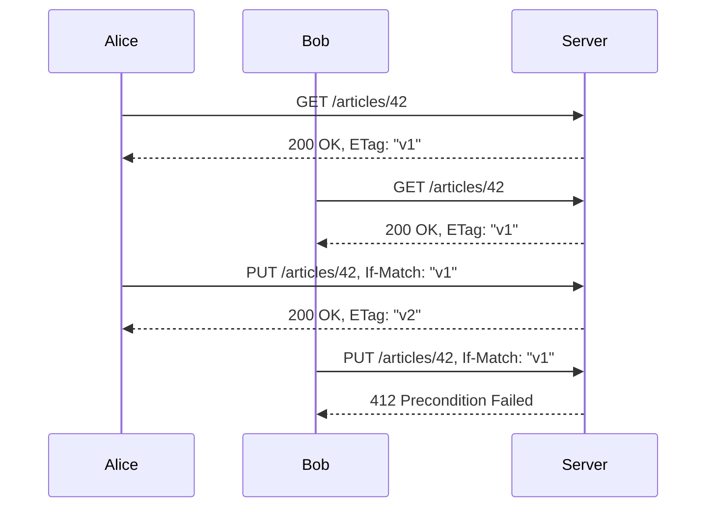

# HTTP 조건부 요청 심화

조건부 요청(Conditional Request)은 HTTP 헤더로 서버에 조건을 걸어 요청 처리 여부를 결정하는 메커니즘이다. 단순히 캐시에 쓰이는 기능이라고 생각하는 경우가 많은데, 실제로는 동시 수정 충돌을 막는 낙관적 잠금(Optimistic Locking)의 핵심 도구다.

---

## 조건부 헤더 종류

| 헤더 | 용도 | 대응 상태코드 |
|---|---|---|
| `If-None-Match` | 캐시 신선도 확인 (GET) | 304 Not Modified |
| `If-Match` | 쓰기 전 버전 확인 (PUT/PATCH/DELETE) | 412 Precondition Failed |
| `If-Modified-Since` | 날짜 기반 캐시 확인 (GET) | 304 Not Modified |
| `If-Unmodified-Since` | 날짜 기반 쓰기 전 확인 (PUT/PATCH) | 412 Precondition Failed |
| `If-Range` | 범위 요청 시 조건부 재다운로드 | 206 Partial Content / 200 OK |

---

## GET 캐싱과 쓰기 동시성 제어는 다른 문제다

가장 많이 혼동하는 부분이다. 겉보기에 둘 다 ETag를 쓰지만, 목적과 헤더가 다르다.

**GET 캐싱 흐름 — `If-None-Match`**

```
GET /articles/42
If-None-Match: "abc123"
```

서버는 현재 리소스의 ETag가 `"abc123"`이면 본문 없이 `304 Not Modified`를 반환한다. 클라이언트는 로컬 캐시를 그대로 쓴다. 네트워크 트래픽을 줄이는 게 목적이다.

**쓰기 동시성 제어 흐름 — `If-Match`**

```
GET /articles/42
→ 200 OK, ETag: "abc123"

PUT /articles/42
If-Match: "abc123"
Content-Type: application/json

{ "title": "수정된 제목" }
```

서버는 현재 ETag가 `"abc123"`인지 확인한 뒤 일치하면 수정을 진행한다. 다른 클라이언트가 먼저 수정해서 ETag가 `"xyz789"`로 바뀌었다면 `412 Precondition Failed`를 반환한다. 클라이언트는 이 응답을 받고 최신 데이터를 다시 읽어서 충돌을 처리해야 한다.

---

## If-Match를 이용한 낙관적 잠금

DB 레벨 잠금 없이 동시 수정을 막는 방식이다. 실제 트래픽이 많은 API에서 비관적 잠금(SELECT FOR UPDATE)을 쓰면 커넥션을 오래 붙잡는 문제가 생긴다. 조건부 요청으로 낙관적 잠금을 구현하면 이 부담을 피할 수 있다.



Bob은 412를 받은 후 최신 버전(`v2`)을 다시 GET해서 Alice의 변경 내용과 자신의 변경 내용을 합쳐야 한다. 이 병합 로직은 서버가 아닌 클라이언트 책임이다.

서버 구현에서 중요한 점은 ETag 비교를 실제 DB에서 하는 게 아니라 메모리나 캐시에서 할 수 있도록 설계하는 것이다. DB를 매번 조회하면 낙관적 잠금의 이점이 줄어든다.

```python
# Django/DRF 예시
class ArticleView(APIView):
    def put(self, request, pk):
        article = get_object_or_404(Article, pk=pk)
        current_etag = self._compute_etag(article)

        client_etag = request.META.get('HTTP_IF_MATCH', '')
        # 따옴표 제거: "abc123" → abc123
        client_etag = client_etag.strip('"')

        if client_etag and client_etag != current_etag:
            return Response(
                {"detail": "Resource has been modified by another request."},
                status=412
            )

        serializer = ArticleSerializer(article, data=request.data)
        serializer.is_valid(raise_exception=True)
        serializer.save()

        response = Response(serializer.data)
        response['ETag'] = f'"{self._compute_etag(serializer.instance)}"'
        return response

    def _compute_etag(self, article):
        import hashlib
        content = f"{article.id}:{article.updated_at.isoformat()}:{article.version}"
        return hashlib.md5(content.encode()).hexdigest()
```

---

## 와일드카드 ETag

`If-Match: *`와 `If-None-Match: *`는 특수한 의미를 가진다.

**If-Match: \***

리소스가 존재하면 조건을 만족한다. 구체적인 ETag 값이 없어도 "리소스가 있으면 수정하겠다"는 의사를 표현할 때 쓴다.

```http
PUT /articles/42
If-Match: *
Content-Type: application/json

{ "title": "수정 내용" }
```

리소스가 없으면 `412 Precondition Failed`가 반환된다. 동시 수정 제어가 목적이 아니라 "반드시 기존 리소스에만 적용하겠다"는 의미다.

**If-None-Match: \***

리소스가 존재하지 않을 때만 조건을 만족한다. PUT으로 새 리소스를 만들 때 중복 생성을 막기 위해 쓴다.

```http
PUT /articles/99
If-None-Match: *
Content-Type: application/json

{ "title": "새 글" }
```

이미 `/articles/99`가 존재하면 `412 Precondition Failed`를 반환한다. POST 없이 PUT으로 새 리소스를 만드는 API에서 멱등성 문제를 피하는 방법이다. 네트워크 재시도로 같은 요청이 두 번 들어와도 두 번째는 412가 나서 중복 생성이 막힌다.

---

## 여러 ETag 동시 전송

`If-None-Match`와 `If-Match`에 ETag를 여러 개 보낼 수 있다.

```http
GET /articles/42
If-None-Match: "abc123", "def456", "xyz789"
```

서버는 현재 ETag가 이 목록 중 하나라도 일치하면 `304 Not Modified`를 반환한다. 클라이언트가 같은 리소스의 여러 버전을 캐시로 갖고 있을 때 쓰는 패턴이다. CDN이나 프록시 서버에서 이 패턴을 쓰는 경우가 많다.

`If-Match`에도 여러 ETag를 보낼 수 있다. 허용 가능한 버전이 여러 개일 때다.

```http
PUT /articles/42
If-Match: "abc123", "def456"
```

현재 ETag가 `"abc123"` 또는 `"def456"`이면 수정을 허용한다. 마이그레이션 중에 두 버전의 데이터 형식을 모두 처리해야 하는 경우처럼 특수한 상황에서 쓴다.

---

## DELETE에서 If-Match 사용

DELETE에 If-Match를 쓰는 경우는 생각보다 많다. 낙관적 삭제라고 할 수 있다.

```http
DELETE /articles/42
If-Match: "abc123"
```

시나리오를 생각해보면 이해가 빠르다. A가 글을 읽고 삭제 버튼을 누르는 사이에 B가 같은 글을 수정했다면, A의 삭제 요청은 B의 수정 내용을 날려버린다. If-Match를 쓰면 A가 읽은 시점과 삭제 시점 사이에 변경이 있었는지 확인할 수 있다.

```typescript
// NestJS 예시
@Delete(':id')
async deleteArticle(
  @Param('id') id: string,
  @Headers('if-match') ifMatch: string,
  @Res() res: Response,
) {
  const article = await this.articleService.findOne(id);
  if (!article) {
    throw new NotFoundException();
  }

  if (ifMatch) {
    const clientEtag = ifMatch.replace(/"/g, '');
    const currentEtag = this.computeEtag(article);
    if (clientEtag !== '*' && clientEtag !== currentEtag) {
      return res.status(412).json({
        type: '/errors/conflict',
        detail: 'Resource was modified after you last fetched it.',
        current_etag: `"${currentEtag}"`,
      });
    }
  }

  await this.articleService.delete(id);
  return res.status(204).send();
}
```

어드민 도구나 CMS처럼 여러 사람이 같은 콘텐츠를 다루는 환경에서 특히 유용하다.

---

## If-Range 헤더와 범위 요청

대용량 파일을 내려받다가 연결이 끊긴 경우 처음부터 다시 받는 건 낭비다. `Range` 헤더로 이어 받기를 할 수 있는데, 이때 서버의 파일이 바뀌었으면 이어 받기가 의미 없다. If-Range가 이 문제를 처리한다.

첫 번째 요청과 응답은 이렇다.

```http
GET /files/video.mp4
Range: bytes=0-1048575
```

```http
HTTP/1.1 206 Partial Content
Content-Range: bytes 0-1048575/52428800
ETag: "file-v1"
Accept-Ranges: bytes
```

클라이언트가 1MB를 받다가 끊겼다. 이어 받기를 시도할 때 If-Range를 쓴다.

```http
GET /files/video.mp4
Range: bytes=1048576-2097151
If-Range: "file-v1"
```

서버는 ETag가 `"file-v1"`로 일치하면 `206 Partial Content`로 이어서 보낸다. ETag가 달라졌으면 `200 OK`로 처음부터 전체를 다시 보낸다. Range를 무시하고 전체를 내려주는 것이다.

If-Range는 If-Match와 다르게 ETag 불일치 시 412를 반환하지 않는다. 연결이 끊겨 이어 받기를 시도하는 클라이언트 입장에서 412를 받으면 실패로 처리하게 되는데, If-Range는 그 대신 전체를 다시 받는 쪽으로 동작한다.

If-Range에는 ETag 대신 Last-Modified를 쓸 수도 있다.

```http
GET /files/video.mp4
Range: bytes=1048576-2097151
If-Range: Sat, 26 Jul 2026 10:30:00 GMT
```

---

## ETag 생성 전략

ETag는 리소스의 특정 버전을 식별하는 값이다. 어떻게 만드느냐에 따라 트레이드오프가 달라진다.

### 해시 기반

리소스 본문 전체를 해시로 만드는 방식이다.

```python
import hashlib
import json

def generate_etag(resource: dict) -> str:
    content = json.dumps(resource, sort_keys=True, ensure_ascii=False)
    return hashlib.sha256(content.encode()).hexdigest()[:16]
```

직렬화한 내용이 달라지면 ETag도 달라진다. 실제로 변경된 경우에만 ETag가 바뀐다는 게 장점이다. 단점은 ETag를 만들려면 전체 리소스를 읽어야 한다는 것이다. 리소스가 크면 매번 해시 계산 비용이 든다.

### 버전 기반

DB에 버전 컬럼(`version`, `updated_at`)을 두고 이걸 ETag로 쓰는 방식이다.

```python
def generate_etag(article) -> str:
    # version은 UPDATE마다 1씩 증가하는 컬럼
    return f"{article.id}-{article.version}"

# 또는 updated_at 타임스탬프
def generate_etag_from_timestamp(article) -> str:
    ts = int(article.updated_at.timestamp() * 1000)  # milliseconds
    return f"{article.id}-{ts}"
```

본문을 읽지 않아도 ETag를 만들 수 있다. `SELECT id, version FROM articles WHERE id = ?` 한 번으로 충분하다. 반면 실제 내용이 달라지지 않아도 업데이트가 발생하면 ETag가 바뀐다.

### 실무 선택

DB에 `version` 컬럼을 이미 갖고 있다면 버전 기반이 훨씬 낫다. 해시 기반은 버전 관리를 안 하는 레거시 시스템이나 파일 서버처럼 내용 자체가 진실(source of truth)인 경우에 적합하다.

---

## Node.js/NestJS 구현

Express나 NestJS에서 조건부 요청을 처리하는 패턴이다. NestJS는 ETag 관련 인터셉터를 직접 만들어 쓰는 경우가 대부분이다.

### NestJS 인터셉터로 ETag 처리

```typescript
// etag.interceptor.ts
import {
  Injectable,
  NestInterceptor,
  ExecutionContext,
  CallHandler,
} from '@nestjs/common';
import { Observable, map } from 'rxjs';
import * as crypto from 'crypto';

@Injectable()
export class EtagInterceptor implements NestInterceptor {
  intercept(context: ExecutionContext, next: CallHandler): Observable<any> {
    const req = context.switchToHttp().getRequest();
    const res = context.switchToHttp().getResponse();

    return next.handle().pipe(
      map((data) => {
        if (req.method !== 'GET') return data;

        const etag = this.computeEtag(data);
        res.setHeader('ETag', `"${etag}"`);

        const ifNoneMatch = req.headers['if-none-match'];
        if (ifNoneMatch === `"${etag}"`) {
          res.status(304).send();
          return null;
        }

        return data;
      }),
    );
  }

  private computeEtag(data: any): string {
    return crypto
      .createHash('md5')
      .update(JSON.stringify(data))
      .digest('hex')
      .slice(0, 16);
  }
}
```

### PUT에서 If-Match 처리

```typescript
// article.controller.ts
import * as crypto from 'crypto';

function computeEtag(data: any): string {
  return crypto
    .createHash('md5')
    .update(JSON.stringify(data))
    .digest('hex')
    .slice(0, 16);
}

@Controller('articles')
export class ArticleController {
  constructor(private readonly articleService: ArticleService) {}

  @Get(':id')
  async findOne(@Param('id') id: string, @Res() res: Response) {
    const article = await this.articleService.findOne(id);
    if (!article) throw new NotFoundException();

    const etag = computeEtag(article);
    res.setHeader('ETag', `"${etag}"`);
    return res.json(article);
  }

  @Put(':id')
  async update(
    @Param('id') id: string,
    @Body() body: UpdateArticleDto,
    @Headers('if-match') ifMatch: string,
    @Res() res: Response,
  ) {
    const article = await this.articleService.findOne(id);
    if (!article) throw new NotFoundException();

    if (ifMatch) {
      const clientEtag = ifMatch.replace(/"/g, '');
      const currentEtag = computeEtag(article);
      if (clientEtag !== '*' && clientEtag !== currentEtag) {
        return res.status(412).json({
          type: '/errors/conflict',
          title: 'Precondition Failed',
          detail: 'Resource was modified after you last fetched it.',
          current_etag: `"${currentEtag}"`,
        });
      }
    }

    const updated = await this.articleService.update(id, body);
    const newEtag = computeEtag(updated);
    res.setHeader('ETag', `"${newEtag}"`);
    return res.json(updated);
  }
}
```

`@Res()`를 쓰면 NestJS 프레임워크의 응답 처리를 우회한다. 응답을 직접 제어해야 하는 경우에만 쓰고, 인터셉터와 혼용하면 응답이 두 번 전송되는 문제가 생긴다.

---

## CDN과 조건부 요청

CDN이 앞에 있으면 조건부 요청 동작이 달라질 수 있다. 알아두지 않으면 디버깅할 때 시간을 많이 쓴다.

**CDN이 304를 캐시하는 경우**

CDN은 보통 200 응답을 캐시한다. 304를 캐시하는 CDN은 거의 없다. 클라이언트가 If-None-Match를 보내면 CDN은 오리진 서버에 요청을 전달하거나, 자체 캐시에서 ETag를 비교한다.

Cloudflare나 CloudFront 같은 CDN은 ETag를 보존한다. 오리진 서버가 ETag를 내려주면 CDN도 같은 ETag를 클라이언트에 전달한다. 클라이언트가 If-None-Match로 재요청하면 CDN이 자체 캐시와 비교해서 304를 직접 반환할 수 있다. 오리진 서버까지 요청이 가지 않는다.

**CDN에서 ETag가 변형되는 경우**

일부 CDN은 gzip 압축을 적용할 때 ETag를 변형한다. 오리진이 `"abc123"`을 내려줬는데 CDN이 `W/"abc123"` 또는 완전히 다른 값으로 바꿔 보내는 경우가 있다. 쓰기 동시성 제어에 ETag를 쓰는데 CDN을 거쳐 ETag를 받았다면 이 가능성을 확인해야 한다.

AWS CloudFront는 gzip 압축 적용 시 ETag에 `-gzip` 접미사를 붙인다. 오리진에서 `"abc123"`이 나왔다면 CloudFront를 거치면 `"abc123-gzip"`이 된다. PUT에서 이 ETag를 If-Match로 그대로 보내면 서버는 `"abc123"`과 `"abc123-gzip"`이 다르다고 판단해서 412를 반환한다.

이 문제는 쓰기 API를 CDN 뒤에 두지 않는 것으로 해결한다. GET은 CDN을 거치고, PUT/PATCH/DELETE는 오리진 서버로 직접 보내는 구조가 일반적이다.

**Vary 헤더와 CDN 캐시**

`Vary` 헤더가 있으면 CDN은 해당 헤더 값에 따라 캐시를 분리한다.

```http
HTTP/1.1 200 OK
ETag: "abc123"
Vary: Accept-Encoding, Accept-Language
```

`Accept-Encoding: gzip`으로 받은 캐시와 `Accept-Encoding: br`로 받은 캐시는 별도로 저장된다. ETag 자체는 같아도 CDN 캐시 엔트리가 다르다. 조건부 요청이 CDN에서 처리되는지 확인하려면 CDN의 캐시 키 설정을 봐야 한다.

---

## 동시 수정 충돌 해결 패턴

412를 받은 클라이언트가 취할 수 있는 방법은 세 가지다.

**단순 재시도 거부**

API 응답에서 충돌 사실만 알리고, 사용자가 직접 최신 데이터를 다시 불러와서 편집하게 한다. 구현이 가장 단순하고 데이터 손실 위험이 없다. 동시 편집이 드문 어드민 도구 같은 곳에 적합하다.

```json
HTTP/1.1 412 Precondition Failed
Content-Type: application/problem+json

{
  "type": "/errors/conflict",
  "title": "Precondition Failed",
  "detail": "The resource was modified after you last fetched it. Please reload and try again.",
  "current_etag": "xyz789"
}
```

응답에 `current_etag`를 넣어주면 클라이언트가 불필요한 추가 GET 없이 최신 ETag를 알 수 있다.

**서버 사이드 3-way merge**

클라이언트가 원본(base), 자신의 수정본(mine), 현재 서버 상태(theirs)를 보내면 서버가 병합을 시도한다. 실제로 구현한 팀을 거의 못 봤다. 텍스트 diff/merge 라이브러리를 연동해야 하고, 충돌이 나는 필드 처리 정책을 별도로 정해야 한다.

**필드 단위 PATCH**

PUT 대신 변경된 필드만 PATCH로 보내는 방식이다. 서로 다른 필드를 수정한 경우라면 충돌 없이 둘 다 반영할 수 있다.

```http
PATCH /articles/42
If-Match: "abc123"
Content-Type: application/merge-patch+json

{
  "title": "새 제목"
}
```

같은 필드를 수정한 경우에는 여전히 412가 발생한다. Last Write Wins 정책이 필요한 경우엔 If-Match 없이 그냥 PATCH를 날리는 팀도 있는데, 그러면 동시 수정 제어 자체를 포기하는 것이다.

---

## Last-Modified vs ETag 선택 기준

둘 다 조건부 요청에 쓸 수 있지만 동작 방식이 다르다.

**Last-Modified의 문제**

```http
Last-Modified: Sat, 26 Jul 2026 10:30:00 GMT
```

시간 해상도가 1초다. 1초 안에 두 번 수정이 발생하면 두 번째 수정을 감지하지 못한다. 분산 환경에서 서버 간 시계 동기화가 맞지 않으면 오작동한다. 쓰기 동시성 제어에 쓰기에는 신뢰성이 부족하다.

1초 이내 다중 수정이 발생할 수 있는 리소스, 분산 서버 환경, 쓰기 동시성 제어, 동일한 타임스탬프라도 다른 내용을 가질 수 있는 경우에는 ETag를 써야 한다.

수정 빈도가 낮고 1초 해상도로 충분한 정적 콘텐츠, ETag 계산 비용이 부담스러운 대용량 파일 서버, 기존 시스템에 Last-Modified가 이미 있어서 ETag를 추가하기 어려운 경우에는 Last-Modified로 충분하다.

실제로는 ETag와 Last-Modified를 함께 내려보내는 경우가 많다. 클라이언트 호환성 때문이다. 서버는 둘 다 제공하고, 클라이언트가 더 정확한 ETag를 우선 사용하게 된다.

```http
HTTP/1.1 200 OK
ETag: "abc123"
Last-Modified: Sat, 26 Jul 2026 10:30:00 GMT
Cache-Control: max-age=0, must-revalidate
```

---

## 응답 헤더 설계 시 주의사항

ETag 값은 반드시 따옴표로 감싸야 한다. `abc123`이 아니라 `"abc123"`이다. RFC 7232 스펙이다. 파싱을 직접 하는 경우에 이걸 빠뜨리고 나중에 `If-Match` 비교가 계속 실패하는 상황이 생긴다.

Weak ETag(`W/"abc123"`)는 의미적으로 동일한 리소스에 쓴다. 예를 들어 gzip 압축 여부만 다른 경우처럼 표현 방식이 달라도 내용이 같다면 weak ETag를 쓴다. 쓰기 동시성 제어에는 strong ETag만 써야 한다. `If-Match`는 weak ETag를 허용하지 않는다.

```http
# Strong ETag
ETag: "abc123"

# Weak ETag — If-Match에 쓰면 안 됨
ETag: W/"abc123"
```

PATCH 응답에서도 ETag를 새로 내려줘야 한다. 수정이 성공했는데 ETag를 응답에 빠뜨리면 클라이언트가 다음 수정 때 오래된 ETag로 If-Match를 보내서 불필요한 412가 발생한다.

---

## 조건부 요청 테스트 방법

curl과 httpie로 조건부 요청을 테스트하는 방법이다.

### curl

```bash
# ETag 확인
curl -I http://localhost:3000/articles/42

# If-None-Match — 304 확인
curl -H 'If-None-Match: "abc123"' http://localhost:3000/articles/42

# If-Match — 정상 수정
curl -X PUT \
  -H 'Content-Type: application/json' \
  -H 'If-Match: "abc123"' \
  -d '{"title": "수정된 제목"}' \
  http://localhost:3000/articles/42

# If-Match — 412 확인 (일부러 틀린 ETag)
curl -X PUT \
  -H 'Content-Type: application/json' \
  -H 'If-Match: "wrong-etag"' \
  -d '{"title": "수정된 제목"}' \
  http://localhost:3000/articles/42

# If-None-Match: * — 중복 생성 방지
curl -X PUT \
  -H 'Content-Type: application/json' \
  -H 'If-None-Match: *' \
  -d '{"title": "새 글"}' \
  http://localhost:3000/articles/99

# If-Range — 범위 요청 이어받기
curl -H 'Range: bytes=0-1023' \
  -H 'If-Range: "file-v1"' \
  http://localhost:3000/files/video.mp4
```

### 자동화 테스트

jest로 NestJS 컨트롤러의 조건부 요청을 테스트하는 방식이다.

```typescript
describe('ArticleController - Conditional Requests', () => {
  it('PUT with matching ETag returns 200', async () => {
    const getRes = await request(app.getHttpServer()).get('/articles/1');
    const etag = getRes.headers['etag'];

    const putRes = await request(app.getHttpServer())
      .put('/articles/1')
      .set('If-Match', etag)
      .send({ title: '수정된 제목' });

    expect(putRes.status).toBe(200);
    expect(putRes.headers['etag']).toBeDefined();
    expect(putRes.headers['etag']).not.toBe(etag);
  });

  it('PUT with stale ETag returns 412', async () => {
    const putRes = await request(app.getHttpServer())
      .put('/articles/1')
      .set('If-Match', '"stale-etag"')
      .send({ title: '수정된 제목' });

    expect(putRes.status).toBe(412);
  });

  it('GET with matching ETag returns 304', async () => {
    const getRes = await request(app.getHttpServer()).get('/articles/1');
    const etag = getRes.headers['etag'];

    const conditionalRes = await request(app.getHttpServer())
      .get('/articles/1')
      .set('If-None-Match', etag);

    expect(conditionalRes.status).toBe(304);
  });

  it('PUT with If-None-Match: * fails if resource exists', async () => {
    const res = await request(app.getHttpServer())
      .put('/articles/1')
      .set('If-None-Match', '*')
      .send({ title: '중복 생성 시도' });

    expect(res.status).toBe(412);
  });
});
```

Postman에서 테스트할 때는 첫 번째 GET 요청의 응답 헤더에서 ETag를 복사해서 두 번째 요청의 If-Match에 붙여넣어야 한다. Postman 스크립트로 자동화할 수 있다.

```javascript
// Postman Tests (GET 응답 후 실행)
const etag = pm.response.headers.get('ETag');
if (etag) {
    pm.collectionVariables.set('article_etag', etag);
}

// Postman Pre-request Script (PUT 요청 전 실행)
const etag = pm.collectionVariables.get('article_etag');
if (etag) {
    pm.request.headers.add({ key: 'If-Match', value: etag });
}
```
