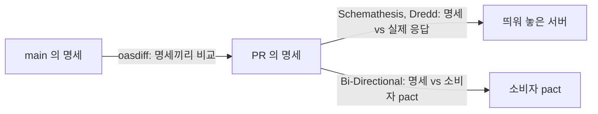
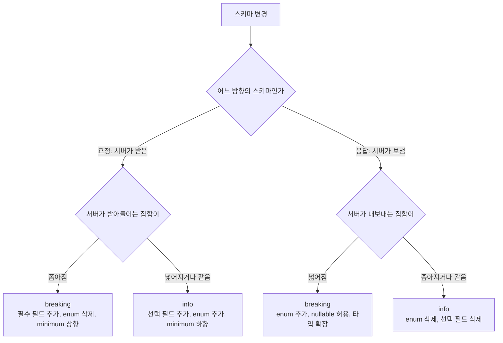
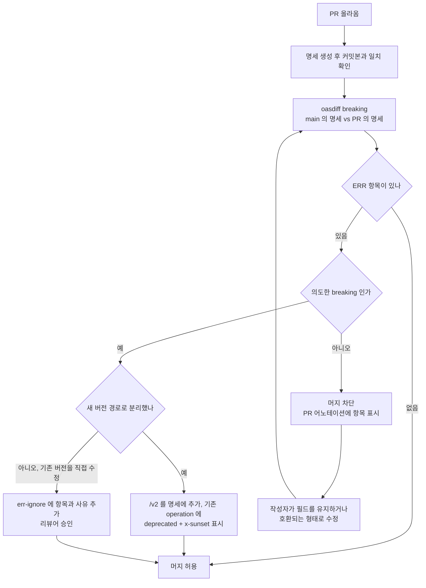
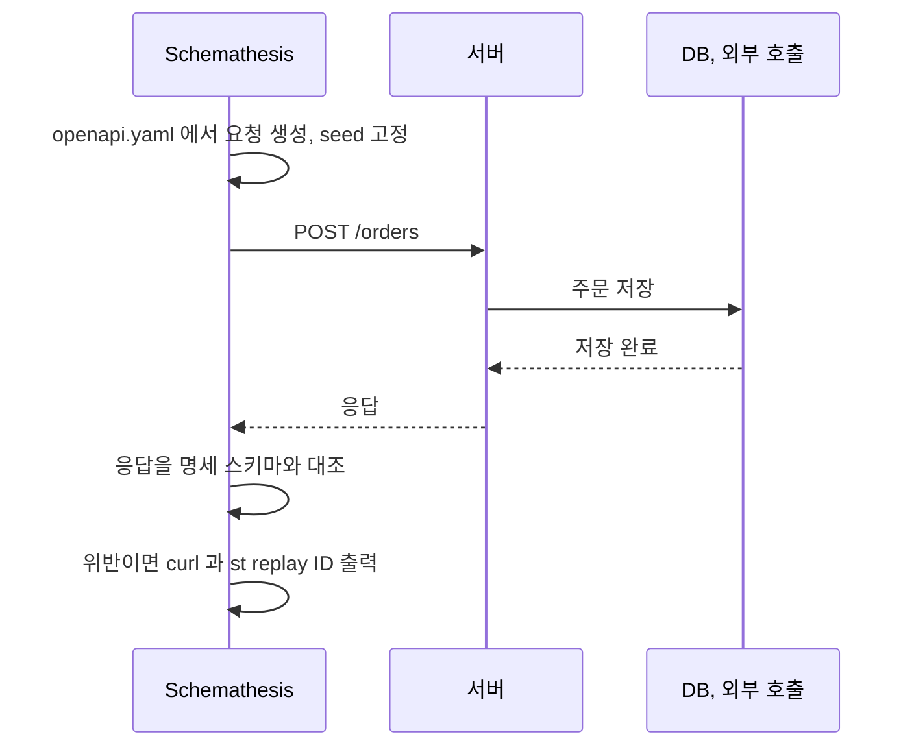
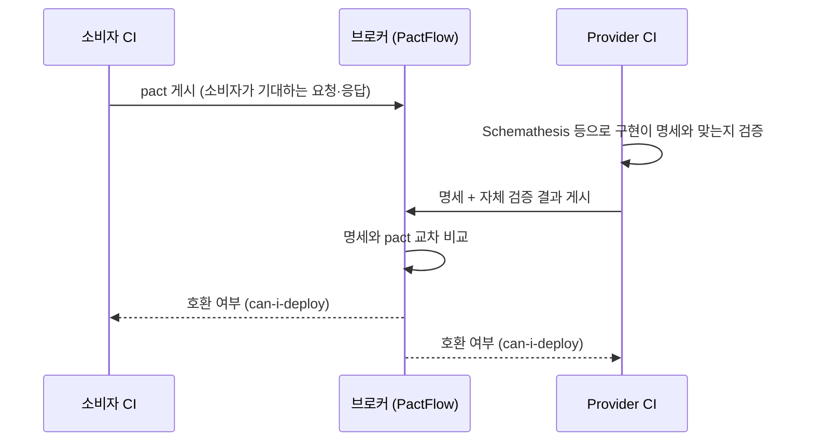
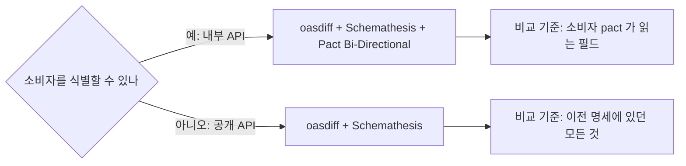

# OpenAPI 명세 기반 Breaking Change 검증 자동화

API가 깨지는 순간은 대개 코드 리뷰에서 눈에 안 띄는 한 줄에서 시작한다. 응답 DTO의 필드 하나를 `@JsonIgnore`로 가리거나, enum에서 쓰지 않는 값 하나를 정리하거나, 선택 파라미터를 필수로 바꾸는 변경이다. 리뷰어는 "내부 리팩터링"으로 읽고 승인하고, 며칠 뒤 모바일 앱 로그에 파싱 에러가 쌓인다.

버저닝 방식(URI, 헤더)과 폐기 절차는 [API 버저닝 실무](API_Versioning.md)와 [API 버전 관리](../../Architecture/MSA/API_버전_관리.md)에 있다. 소비자 주도 계약(Pact)의 한 사이클은 [Service Contract Testing](../../Architecture/MSA/Service_Contract_Testing.md)에 있다. 이 문서는 그 사이에 비어 있는 부분, 곧 OpenAPI 명세를 계약으로 놓고 비호환 변경을 CI가 자동으로 잡게 만드는 일을 다룬다. 아래 출력은 전부 직접 돌린 결과이고 버전은 oasdiff 1.33.0, Schemathesis 4.29.4, Dredd 14.1.0, swagger-mock-validator 12.0.0이다.

## 명세에 걸 수 있는 검증은 세 방향이다

명세를 계약으로 삼으면 검증 대상이 세 쌍으로 갈린다. 명세끼리 비교하는 것, 명세와 실제 서버를 비교하는 것, 명세와 소비자 기대를 비교하는 것이다. 이 셋은 서로 다른 사고를 막는다.



`oasdiff`는 "명세를 바꿨는데 하위 호환이 깨졌다"를 잡는다. 서버 코드는 보지 않는다. Schemathesis는 반대로 "명세는 그대로인데 코드가 명세와 다르게 응답한다"를 잡는다. 두 도구는 서로의 빈 곳을 메우는 관계라서 하나만 붙이면 반쪽이 된다. oasdiff만 붙이면 명세 자체가 거짓말인 상태에서 diff가 초록불을 내고, Schemathesis만 붙이면 명세를 일관되게 바꿔서 하위 호환을 깬 변경이 통과한다.

세 번째 방향(Bi-Directional)은 소비자가 식별되는 내부 API에서만 의미가 있다. 뒤에서 따로 다룬다.

## 변경 유형별 breaking 판정은 방향에 따라 갈린다

"필드 추가는 안전하다"는 말은 응답에서만 맞다. 요청에서는 필수 필드 추가가 곧바로 깨진다. 같은 변경이 요청이냐 응답이냐에 따라 판정이 뒤집히기 때문에, 규칙을 사람 머리로 외우면 리뷰에서 반드시 빠뜨린다. 아래 표는 기준 명세 하나(`Order`, `OrderCreate`)에서 변경을 하나씩 가한 뒤 `oasdiff changelog`가 낸 판정을 그대로 옮긴 것이다.

| 변경 | 요청 방향 (클라이언트가 보냄) | 응답 방향 (서버가 보냄) |
|---|---|---|
| 필수 필드·파라미터 추가 | error (`new-required-request-property`, `new-required-request-parameter`) | info (`response-required-property-added`) |
| 선택 필드·파라미터 추가 | info | info |
| 선택 필드 삭제 | warning (`request-property-removed`, `request-parameter-removed`) | info (`response-optional-property-removed`) |
| 필수 필드 삭제 | 해당 없음 | error (`response-required-property-removed`) |
| 필수 → 선택 | info (`request-property-became-optional`) | error (`response-property-became-optional`) |
| 타입 변경 `integer` → `string` | error (`request-property-type-changed`) | error (`response-property-type-changed`) |
| 타입 확장 `integer` → `number` | 해당 없음 | error (`response-property-type-generalized`) |
| enum 값 추가 | info (`request-parameter-enum-value-added`) | error (`response-property-enum-value-added`) |
| enum 값 삭제 | error (`request-parameter-enum-value-removed`) | info (`response-property-enum-value-removed`) |
| `minimum` 올림(1 → 5) | error (`request-property-min-increased`) | 해당 없음 |
| `minimum` 내림(1 → 0) | info (`request-property-min-decreased`) | 해당 없음 |
| `nullable: true` 로 변경 | 해당 없음 | error (`response-property-became-nullable`) |
| 엔드포인트 삭제(deprecated 없이) | error (`api-path-removed-without-deprecation`) | 같음 |
| 비성공 응답 코드(404 등) 추가·삭제 | info | info |

읽는 요령은 단순하다. 요청은 서버가 받아들이는 집합이 좁아지면 깨지고, 응답은 서버가 내보내는 집합이 넓어지면 깨진다. 필수 필드 추가, enum 삭제, `minimum` 상향은 요청 집합을 좁히는 변경이다. enum 값 추가, nullable 허용, 타입 확장은 응답 집합을 넓히는 변경이다. 응답 enum에 값을 추가하는 일이 breaking으로 분류되는 게 처음에는 낯설지만, 클라이언트가 `switch`에서 모르는 값을 받아 예외를 던지는 코드는 흔하다. 이 판정에 대한 논쟁은 뒤의 오탐 절에서 다시 나온다.

아래 도식은 이 읽는 요령을 분기로 옮긴 것이다. 방향을 먼저 가르고, 그 방향에서 서버가 다루는 값의 집합이 어느 쪽으로 움직이는지 보면 표의 대부분이 판정된다.



표의 마지막 줄이 보여주듯 검증 대상은 "스키마 모양"이다. 비즈니스 의미(금액 단위가 원에서 센트로 바뀜)는 어떤 도구도 못 잡는다.

## PR마다 이전 명세와 비교하기

oasdiff는 Go 단일 바이너리다. 릴리스 파일을 받아서 쓰고, git 리비전을 직접 받는다. 기준 브랜치의 파일과 PR의 파일을 따로 체크아웃해서 경로를 넘길 필요가 없다.

```bash
oasdiff breaking origin/main:openapi.yaml HEAD:openapi.yaml --fail-on ERR
```

이 명령이 돌려면 저장소 안에서 실행해야 하고 베이스 브랜치가 fetch되어 있어야 한다. `breaking` 서브커맨드는 `--fail-on`이 없으면 breaking을 찾아도 종료 코드 0을 돌려준다. 이걸 모르고 CI에 `oasdiff breaking a b`만 넣어두면 로그에는 에러가 찍히는데 잡은 항상 초록이다.

### 실행 결과

기준 명세에 아래 변경을 한 PR 명세와 비교했다. `GET /orders`에 필수 쿼리 파라미터 `region` 추가, 쿼리 `status`의 enum에서 `REFUNDED` 삭제, 응답 `Order`에서 필수 필드 `amount` 삭제, `POST /orders` 요청에 필수 필드 `channel` 추가, 응답 `status` enum에 `REFUNDED` 추가다.

```text
$ oasdiff breaking origin/main:openapi.yaml HEAD:openapi.yaml --fail-on ERR
9 changes: 9 error, 0 warning, 0 info
error	[new-required-request-parameter] at openapi.yaml
	in API GET /orders
		added the new required `query` request parameter `region`

error	[request-parameter-enum-value-removed] at openapi.yaml
	in API GET /orders
		removed the enum value `REFUNDED` from the `query` request parameter `status`

error	[response-property-enum-value-added] at openapi.yaml
	in API GET /orders
		added the new `REFUNDED` enum value to the `items/status` response property for the response status `200`
		The server may now return a value the previous contract excluded, so a client written against it may not handle the response. If the value set is meant to grow, declare it with x-extensible-enum.

error	[response-required-property-removed] at openapi.yaml
	in API GET /orders
		removed the required property `items/amount` from the response with the `200` status

error	[new-required-request-property] at openapi.yaml
	in API POST /orders
		added the new required request property `channel`
...
$ echo $?
1
```

변경은 5가지인데 9건이 나왔다. `Order` 스키마를 세 엔드포인트가 공유해서 같은 변경이 `GET /orders`, `POST /orders`, `GET /orders/{id}`에 각각 한 번씩 보고되기 때문이다. 공통 스키마를 건드린 PR은 항상 이렇게 부풀어서 나온다.

### GitHub Actions에 붙이기

```yaml
name: openapi-breaking-check
on:
  pull_request:
    paths: ["openapi.yaml"]

jobs:
  breaking:
    runs-on: ubuntu-latest
    steps:
      - uses: actions/checkout@v4
        with:
          fetch-depth: 0   # origin/main 리비전을 읽으려면 필요하다
      - name: Install oasdiff
        run: |
          curl -sL https://github.com/oasdiff/oasdiff/releases/download/v1.33.0/oasdiff_1.33.0_linux_amd64.tar.gz | tar xz
          sudo mv oasdiff /usr/local/bin/
      - name: Breaking change check
        run: |
          oasdiff breaking "origin/${{ github.base_ref }}:openapi.yaml" HEAD:openapi.yaml \
            --fail-on ERR \
            --format githubactions \
            --err-ignore .oasdiff-ignore.txt
```

바이너리 버전은 고정한다. `latest`를 쓰면 oasdiff가 규칙을 추가하는 날 PR이 갑자기 빨개진다. `--format githubactions`는 PR의 해당 줄에 어노테이션으로 박아주기 때문에 로그를 열어볼 필요가 없다.

명세 파일을 코드에서 생성하는 프로젝트(springdoc, NestJS Swagger 등)라면 생성된 `openapi.yaml`을 저장소에 커밋하고, CI에서 다시 생성해 커밋본과 다르면 실패시키는 단계를 앞에 하나 둔다. 명세를 생성만 하고 커밋하지 않으면 "이전 명세"를 가져올 곳이 없다. main 브랜치를 빌드해서 뽑는 방법도 있지만 느리고, 빌드 환경이 달라 diff에 잡음이 낀다.

### 판정 후의 분기

breaking이 나왔다고 무조건 막는 것은 아니다. 의도한 비호환 변경이면 새 버전으로 분리해서 통과시켜야 하고, 의도하지 않았으면 막아야 한다. 이 분기를 CI가 대신 내리지 못하는 부분이 있어서, 사람이 개입하는 지점은 PR 설명과 `err-ignore` 파일이다.



도식에서 볼 부분은 "의도한 breaking인가" 뒤에 한 번 더 갈리는 가지다. 새 버전으로 분리하면 `/v2` 경로가 명세에 추가될 뿐 `/v1`은 그대로라서 oasdiff가 breaking을 내지 않는다. 그래서 대부분의 의도한 breaking은 `err-ignore` 없이 통과한다. `err-ignore`는 "v1을 직접 고치되 소비자가 없음을 확인했다" 같은 예외용이다.

### deprecated 후 제거를 검사하는 방식

엔드포인트 삭제 검사는 `deprecated`와 `x-sunset`의 조합으로 판정이 갈린다. 같은 삭제를 네 가지 상태에서 돌렸다.

| 삭제 직전 상태 | 결과 |
|---|---|
| `deprecated` 표시 없음 | error `api-path-removed-without-deprecation` |
| `deprecated: true`, `x-sunset` 없음 | 통과 |
| `deprecated: true`, `x-sunset: 2026-12-31` (오늘 2026-10-08 기준 미래) | error `api-path-removed-before-sunset` |
| `deprecated: true`, `x-sunset: 2026-09-01` (과거) | 통과 |

두 번째 줄이 함정이다. `deprecated: true`만 달고 `x-sunset`을 안 적으면 삭제가 그냥 통과한다. 폐기 공고를 명세에 박는 규칙을 만들 거라면 `x-sunset` 필수까지 같이 정해야 이 검사가 의미를 갖는다. 헤더로 내려주는 `Sunset`/`Deprecation` 응답 헤더 운영은 [API 버저닝 실무](API_Versioning.md)의 폐기 절차 쪽 내용이다.

## oasdiff가 틀리는 경우와 놓치는 경우

도구를 믿고 CI에 물렸는데 PR마다 억울하게 막히면 팀이 `--fail-on`을 빼버린다. 이 도구에서 실제로 마주친 오탐과 누락을 정리한다.

### 응답 enum 값 추가를 breaking으로 본다

앞의 표에서 본 대로 응답 enum 값 추가는 error다. 클라이언트가 모르는 값을 무시하는 코드라면 오탐이다. 선택지는 둘이다.

- 값 집합이 계속 늘어나는 필드(주문 상태, 결제 수단)는 명세에서 `enum` 대신 `x-extensible-enum`을 쓴다. 같은 변경(`REFUNDED` 추가)을 이 방식으로 선언하고 돌리면 breaking이 안 나온다. 클라이언트 쪽에도 "모르는 값은 기본 처리"를 요구하는 약속이 된다는 점이 중요하다. 명세에 확장 가능하다고 적어놓고 클라이언트가 예외를 던지면 같은 사고가 난다.
- 닫힌 집합(성별, 고정 코드)은 그대로 둔다. enum 추가가 막히는 게 맞다.

`err-ignore`로 개별 항목을 덮을 수도 있다. 형식은 `메서드 경로 메시지` 한 줄이다.

```text
GET /orders added the new `REFUNDED` enum value to the `items/status` response property for the response status `200`
POST /orders added the new `REFUNDED` enum value to the `status` response property for the response status `201`
GET /orders/{id} added the new `REFUNDED` enum value to the `status` response property for the response status `200`
```

스키마 하나를 바꿨는데 세 줄이 필요하다. 이 세 줄을 넣고 다시 돌리면 9건이 6건으로 줄어든다. 공통 스키마가 여러 엔드포인트에서 쓰일수록 무시 파일이 길어지고, 길어진 파일은 아무도 안 읽는다. 무시 파일은 항목 위 줄에 `#` 로 사유와 날짜를 적어둬도 동작한다(주석 한 줄을 끼운 파일로 돌려서 확인했다). 사유가 없으면 반년 뒤 "이게 왜 여기 있지"가 된다.

### 경로 파라미터 이름 변경은 못 잡는다

`/orders/{id}`를 `/orders/{orderId}`로 바꾸면 oasdiff는 변경 없음(`none`)으로 본다. 경로 파라미터 이름은 URL 구조에 영향이 없으니 호출하는 쪽은 안 깨진다. 이건 맞다. 하지만 이 이름으로 코드를 생성하는 SDK 소비자는 메서드 인자 이름이 바뀐다. 생성 SDK를 배포하는 API라면 `--include-path-params`를 켠다. 켜고 돌리면 이름이 바뀐 경로를 다른 경로로 보고 `api-path-removed-without-deprecation` error로 막는다. 이름만 바꾼 변경과 경로를 지운 변경이 같은 error로 나오므로 메시지를 읽고 판단해야 한다.

### 형식 변경은 info로 지나간다

응답 `createdAt`의 `format`을 `date-time`에서 `date`로 바꿔도 `response-property-type-specialized` info 하나가 나오고 끝난다. 타입이 `string`으로 같아서 oasdiff는 호환으로 본다. 클라이언트가 `OffsetDateTime.parse`를 쓰고 있다면 파싱 예외가 난다. 오탐이 아니라 누락이고, 이 부류는 `format` 변경 info를 CI에서 별도로 grep해서 리뷰 대상으로 올리는 수밖에 없다.

### 설명이나 $ref 구조 변경은 잡음을 안 낸다

`description` 수정이나 인라인 스키마를 `$ref`로 빼는 리팩터링은 breaking이 없다고 나온다. 이 부분은 오탐이 없어서 마음 놓고 쓸 수 있다. 같은 의미의 스키마를 인라인으로 복사해서 `$ref`와 바꿔 넣고 돌려봤을 때도 `No changes detected`였다.

## 명세와 구현이 어긋나는 흔한 원인

oasdiff가 아무리 정확해도 명세가 구현과 다르면 초록불은 의미가 없다. 명세와 서버 응답을 직접 비교하는 도구가 Schemathesis와 Dredd다.

### Schemathesis로 돌려보기

Schemathesis는 명세에서 요청을 생성해서 서버에 쏘고, 응답이 명세와 맞는지 검사한다. 요청 값은 속성 기반 테스트(Hypothesis)로 만든다.

```bash
schemathesis run openapi.yaml --url http://localhost:8099 \
  --max-examples 50 --seed 1 --phases fuzzing
```

일부러 명세와 어긋나게 만든 Flask 서버(상태 `HOLD` 반환, `couponCode`에 `null`, `createdAt`에 공백 구분 날짜)를 대상으로 돌린 출력이다.

```text
 ❌  Fuzzing (in 4.21s)
     ❌ 3 failed

_________________________________ GET /orders __________________________________
- Response violates schema (3 violations)

    "2026-10-08 09:10:00" is not a "date-time"
    Schema at /components/schemas/Order/properties/createdAt:
        { "format": "date-time", "type": "string" }

    "HOLD" is not one of "PAID", "SHIPPED" or "CANCELLED"
    Schema at /components/schemas/Order/properties/status:
        { "enum": ["PAID", "SHIPPED", "CANCELLED"], "type": "string" }

    null is not of type "string"
    Schema at /components/schemas/Order/properties/couponCode:
        { "type": "string" }

Reproduce with:
    curl -X GET http://localhost:8099/orders
    st replay Gf1tfr
...
Failures:
  ❌ Response violates schema: 4
  ❌ Undocumented HTTP status code: 1
```

`--seed`를 고정하면 같은 입력이 재현된다. 실패마다 `curl`과 `st replay <ID>`가 붙어 나와서, CI 로그에서 바로 로컬로 가져와 디버깅할 수 있다.

아래 도식은 Schemathesis 한 번의 왕복이다. 요청이 서버를 거쳐 DB까지 실제로 닿는다는 점과, 검사가 응답을 받은 뒤 명세와 대조하는 단계에서 일어난다는 점을 보면 된다.



Schemathesis는 요청을 실제로 쏜다. `POST /orders`가 돌 때마다 서버의 주문이 늘어난다(위 서버는 id가 3, 4, 5, 6으로 계속 증가했다). 스테이징에 붙여놓으면 테스트 데이터가 쌓이거나, 결제 같은 부수효과가 있는 엔드포인트가 진짜로 실행된다. 전용 DB를 띄우고 부수효과 있는 외부 호출은 스텁으로 막은 환경에서만 돌려야 한다.

### 어긋남의 세 가지 단골 원인

위 실행에서 나온 것과 이어서 확인한 것을 원인별로 정리한다.

**nullable.** `couponCode`가 값이 없을 때 서버는 `null`을 내려주는데 명세는 `type: string`이다. OpenAPI 3.0에서는 `nullable: true`를 붙여야 하고, 3.1에서는 `type: [string, "null"]`로 쓴다. Jackson이 기본으로 `null`을 직렬화하기 때문에 DTO에 `String couponCode;`만 있으면 항상 이 어긋남이 생긴다. 반대로 `@JsonInclude(NON_NULL)`을 걸어서 필드가 응답에서 아예 빠지는 서비스라면 명세에서 `required`에 넣으면 안 된다. "null로 오는가, 키가 없는가"는 다른 문제인데 명세 작성자가 둘을 섞어 쓰는 일이 많다.

**additionalProperties.** 기본값은 허용이다. 응답에 명세에 없는 필드 `internalMemo`가 섞여 나가도 위 실행에서는 아무 에러가 없었다. 스키마에 `additionalProperties: false`를 넣고 같은 서버를 다시 돌리면 `Additional properties are not allowed ('internalMemo' was unexpected)`가 나온다. 응답에서 내부 필드가 새는 사고를 잡고 싶다면 응답 스키마에는 `false`를 거는 편이 낫다. 단 이걸 걸면 필드를 추가하는 모든 PR이 명세 수정을 동반해야 해서 팀 규칙이 같이 바뀌어야 한다.

요청 쪽은 반대 방향의 문제가 생긴다. 명세에 `additionalProperties`가 없으면 Schemathesis가 정의되지 않은 필드를 요청에 섞어 보낸다. 서버가 모르는 필드를 400으로 거절하는 구조(`FAIL_ON_UNKNOWN_PROPERTIES`를 켰거나 검증 미들웨어가 엄격한 경우)라면 이런 결과가 나온다.

```text
POST /orders
- API rejected schema-compliant request
    Valid data should have been accepted
    Hint: The request body contains 5 additional properties not defined in the schema
    The server likely rejects unexpected fields.
    Add `additionalProperties: false` to your schema to prevent this.
[400] Bad Request: {"error":"unknown field"}
```

서버 동작이 맞는지 명세가 맞는지는 판단 몫이다. 서버가 엄격하면 명세에 `additionalProperties: false`를 넣어서 사실을 맞추면 된다.

**날짜 포맷.** `format: date-time`은 RFC 3339라서 시간대 표기가 반드시 필요하다. 형식별로 검증기에 넣어본 결과다.

| 값 | 판정 |
|---|---|
| `2026-10-08T09:00:00Z` | 통과 |
| `2026-10-08T09:00:00+09:00` | 통과 |
| `2026-10-08T09:00:00.123456789Z` | 통과 |
| `2026-10-08T09:00:00` | 실패 |
| `2026-10-08T09:00:00+0900` | 실패 |
| `2026-10-08 09:10:00` | 실패 |

Java의 `LocalDateTime`은 시간대 없이 `2026-10-08T09:00:00`으로 직렬화되고, `SimpleDateFormat`의 `Z` 패턴은 `+0900`(콜론 없음)을 만든다. 둘 다 `date-time` 위반이다. 서비스가 내보내는 값을 바꾸면 클라이언트가 깨질 수 있으니, 보통은 명세의 `format`을 지우거나 `pattern`으로 실제 형식을 적어서 사실에 맞춘다. 명세가 틀렸다고 판단하는 쪽이 더 안전한 경우가 많다.

### 명세 쪽 오탐 하나

위 실행에서 `POST /orders`가 "Undocumented HTTP status code: Received 400, Documented 201"로 실패했다. 서버가 필수 필드가 없는 요청에 400을 주는 것은 정상 동작인데 명세에 400 응답이 없었기 때문이다. Schemathesis는 일부러 잘못된 요청도 보내므로, 4xx를 명세에 적지 않은 API는 항상 이 실패를 낸다. 명세에 `400` 응답을 추가해서 사실에 맞추는 게 정석이고, 정말 4xx 문서화를 안 할 거라면 `--exclude-checks status_code_conformance`로 이 검사만 끈다. 이렇게 명세를 고친 뒤 다시 돌리면 남는 실패는 진짜 서버 버그(`createdAt` 형식)만 남는다.

### Dredd는 어떻게 다른가

같은 서버, 같은 명세에 Dredd를 돌렸다. Dredd는 명세의 예제 값으로 요청을 만들고 응답 본문을 비교한다. 이 서버에서 확인한 차이는 이렇다.

- 경로 파라미터에 `example`이 없으면 시작도 못 한다(`Required URI parameter 'id' has no example or default value`).
- OpenAPI 3 파서가 `required`(요청 본문), `minimum`, `format`을 "unsupported key"로 경고하고 무시한다. `format: date-time` 위반은 잡지 못한다.
- `GET /orders/2`는 응답의 `status`가 `HOLD`(enum 밖)이고 `createdAt`이 공백 구분 형식인데도 통과했다. Schemathesis는 같은 응답에서 세 건의 위반을 보고했다.
- 응답 본문 예상값을 스키마의 모든 속성으로 만들어서, 선택 필드인 `couponCode`가 없다는 이유로 `POST /orders`를 실패시켰다(`Missing required property: couponCode`). 명세상 선택 필드이므로 오탐이다.
- `GET /orders/2` 404 응답 정의를 검사하려면 서버가 실제로 404를 내야 하는데, 예제 값 `2`는 존재하는 주문이라 200이 와서 실패한다. 404 시나리오는 훅으로 별도 준비가 필요하다.

Dredd는 예제 기반이라 재현성이 높고 결과가 결정적이라는 장점이 있지만, OpenAPI 3 지원이 얕아서 3.x 명세에는 Schemathesis 쪽이 더 많이 잡았다. 이미 Dredd 훅이 쌓여 있는 프로젝트가 아니면 새로 시작할 이유가 약하다.

## Pact Bi-Directional로 명세와 소비자를 교차 검증하기

소비자 계약(CDC)을 쓰려면 provider가 소비자의 테스트를 받아 실행해야 한다. provider 팀이 이미 OpenAPI를 관리한다면 Bi-Directional 방식은 이 부담을 덜어준다. provider는 명세를 올리고(자기 구현이 명세에 맞다는 Schemathesis 같은 테스트 결과와 함께), 소비자는 pact를 올리고, 브로커가 둘을 교차 비교한다. provider 쪽에 Pact 검증 코드를 추가하지 않는다.



도식에서 볼 부분은 provider가 소비자 계약을 직접 실행하지 않는다는 점이다. 브로커가 명세와 pact 두 문서를 읽어서 비교한다. "명세는 구현과 맞다"는 보증은 provider가 올린 자체 검증 결과가 맡는다. 앞 절의 Schemathesis 같은 도구가 이 자리다.

### 교차 검증 엔진을 로컬에서 돌려보기

PactFlow가 쓰는 교차 비교 엔진(swagger-mock-validator)은 오픈소스라서 로컬에서 같은 비교를 해볼 수 있다. 소비자가 기대하는 상호작용 세 개를 담은 pact를 기준 명세에 대고 돌렸다.

```text
$ swagger-mock-validator base.yaml pact.json
Mock file "pact.json" is not compatible with spec file "base.yaml"
2 error(s)

  response.body.incompatible  (주문 목록 조회)
    [root].interactions[0].response.body[0].status = 'REFUNDED'
    should be equal to one of the allowed values: [ 'PAID', 'SHIPPED', 'CANCELLED' ]

  response.body.incompatible  (주문 생성)
    [root].interactions[2].response.body.createdAt = '2026-10-08 09:00:00'
    should match format "date-time"
```

소비자가 기대하는 `REFUNDED` 상태가 명세에 없다는 점, 소비자가 pact에 적은 날짜가 `date-time`이 아니라는 점이 잡혔다. 다음은 앞 절의 PR 명세(`rev.yaml`: `region` 필수 추가, `REFUNDED` 쿼리 enum 삭제, `channel` 필수 추가, `amount` 필드 삭제)에 같은 pact를 돌린 결과다.

```text
$ swagger-mock-validator rev.yaml pact.json
4 error(s)
  request.query.incompatible   status=REFUNDED 가 enum 밖
  request.query.incompatible   필수 쿼리 파라미터 region 없음
  request.body.incompatible    필수 필드 channel 없음
  response.body.incompatible   createdAt 이 date-time 아님
```

필수 파라미터 추가와 enum 삭제 같은 요청 쪽 breaking은 소비자 pact와 부딪혀서 정확히 잡힌다. 누가 어떤 소비자를 깨는지까지 알려주는 점은 oasdiff보다 낫다.

### 한계: 응답 필드 삭제를 못 잡는다

위 4건에 빠진 것이 하나 있다. `rev.yaml`은 응답 `Order`에서 `amount`를 삭제했고 소비자 pact는 `amount`가 있는 응답을 기대한다. 그런데 에러가 없다. 앞의 `base.yaml` 실행에서도 같은 현상이 보인다. 소비자 pact에는 응답에 명세에 없는 `totalPrice`를, 요청에 명세에 없는 `giftWrap`을 넣어 두었는데 2건 오류 어디에도 없다. 둘 다 통과했다.

이유는 `additionalProperties` 기본값이 허용이기 때문이다. 명세 입장에서는 pact 응답에 추가 속성이 있는 것은 위반이 아니다. 하지만 소비자가 그 필드를 읽는다면 provider가 그 필드를 안 내보내는 순간 소비자는 깨진다. 이 교차 비교는 "pact의 값이 명세가 허용하는 범위 안인가"만 보고, "소비자가 읽는 필드를 명세가 보장하는가"는 보지 않는다.

그래서 응답 필드 삭제 같은 변경은 Bi-Directional이 아니라 앞 절의 oasdiff가 잡아야 한다. 두 도구를 같이 둬야 하는 이유다. 그 밖에 기억할 한계가 있다.

- 비교의 정확도는 명세의 품질에 묶인다. 손으로 쓴 명세가 구현과 어긋나 있으면 교차 비교는 어긋난 명세를 기준으로 초록불을 낸다. provider 쪽 자체 검증(Schemathesis)이 빠지면 보증이 성립하지 않는다.
- 소비자 pact는 모킹된 provider를 대상으로 만든 값이다. 상태 의존 시나리오(provider state)나 호출 순서는 교차 비교 대상이 아니다.
- 소비자가 모두 pact를 올려야 한다. 올리지 않는 소비자는 검증 밖에 있다.

## 공개 API에서는 CDC를 쓸 수 없다

외부 개발자에게 공개한 API는 소비자 주도 계약 방식을 적용할 수 없다. 이유는 기술이 아니라 구조에 있다.

- 소비자가 누구인지 모른다. API 키를 발급받은 수백 곳 중 어디가 어떤 필드를 읽는지 provider가 알 방법이 없다.
- 소비자에게 pact를 올리라고 요구할 수 없다. 내부 팀은 조직 규칙으로 강제할 수 있지만 외부 파트너는 계약서에 없는 일을 하지 않는다.
- provider가 소비자 테스트를 실행할 수 없다. 외부 소비자의 코드와 테스트 환경을 provider CI로 가져올 수 없다.
- 소비자가 읽는 필드의 합집합은 공개된 응답 전체에 가깝다. 어떤 소비자는 모든 필드를 읽는다고 가정해야 해서, "안 쓰는 필드는 지워도 된다"는 CDC의 핵심 이득이 사라진다.

공개 API에서는 명세 자체가 provider가 소비자에게 건네는 약속이 되고, provider는 명세에 적은 것을 모두 지켜야 한다. 그래서 비교 기준이 "이전 명세에 있던 모든 것"이 되고, oasdiff가 적용된다. 판정이 보수적인 이유도 여기에 있다. 응답 enum 값 추가를 breaking으로 보는 것이 공개 API에서는 합리적이다. 어떤 소비자가 모르는 값을 처리 못 할지 provider가 알 수 없기 때문이다. 내부 서비스끼리라면 그 소비자가 식별되니 같은 변경을 허용하고 pact로 확인하는 편이 현실적이다.

소비자를 아는 내부 API는 oasdiff, Schemathesis, 그리고 Pact(또는 Bi-Directional)를 같이 쓰고, 소비자를 모르는 공개 API는 oasdiff와 Schemathesis 두 개로 간다. 이 두 개가 빠지면 공개 API의 약속을 지키고 있는지 확인할 방법이 사실상 없다.

소비자를 식별할 수 있는지에 따라 도구 조합과 비교 기준이 갈리는 구조를 한 장으로 정리하면 아래와 같다.


