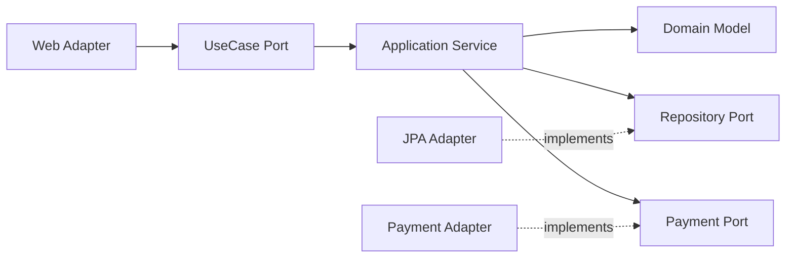

# 백엔드 레이아웃

## 개요

새 프로젝트를 시작할 때 가장 먼저 결정해야 하는 것이 디렉토리 구조다. 첫 주에 만든 패키지 트리가 1년 뒤에도 그대로 남아있는 경우가 대부분이고, 한 번 자리 잡은 의존성 방향은 거의 바꾸지 못한다. `controller/`, `service/`, `repository/`로 시작했다가 도메인이 커지면서 한 폴더에 파일 100개가 쌓이는 모습은 흔하다. 반대로 처음부터 헥사고날을 고집하다 팀이 적응 못해서 결국 일반 3-tier로 회귀하는 경우도 본다.

레이아웃 결정에는 정답이 없다. 다만 결정할 때 따져야 하는 것은 분명하다. 팀 인원, 도메인 복잡도, 변경 빈도, 테스트 수준, 빌드 시간, 그리고 이 코드베이스를 5년 뒤에도 유지할지 여부다. 이 문서는 실무에서 자주 마주치는 레이아웃 패턴과 그 결정 포인트를 정리한다.

## 계층형 아키텍처: Controller / Service / Repository

가장 익숙한 3계층 구조다. Spring을 한 번이라도 만져본 사람이라면 자연스럽게 이렇게 짠다.

```
src/main/java/com/example/shop
├── controller/
│   ├── UserController.java
│   ├── OrderController.java
│   └── ProductController.java
├── service/
│   ├── UserService.java
│   ├── OrderService.java
│   └── ProductService.java
├── repository/
│   ├── UserRepository.java
│   ├── OrderRepository.java
│   └── ProductRepository.java
├── domain/
│   ├── User.java
│   ├── Order.java
│   └── Product.java
└── dto/
    ├── UserDto.java
    └── OrderDto.java
```

이 구조의 장점은 명확하다. 새로 합류한 개발자가 `OrderController`를 찾고 싶으면 `controller/` 폴더만 열면 된다. 책임이 한눈에 보인다.

문제는 도메인이 늘어났을 때다. 한 폴더에 `Controller`가 30개, `Service`가 50개씩 쌓이면 같은 도메인에 속한 파일들이 폴더 4~5개에 흩어진다. `Order` 관련 작업을 하려고 하면 `controller/OrderController.java`, `service/OrderService.java`, `repository/OrderRepository.java`, `domain/Order.java`, `dto/OrderDto.java`를 매번 왔다 갔다 해야 한다. IDE의 즐겨찾기나 멀티 커서로 견딘다.

그리고 의외로 자주 발생하는 문제가 서비스 간 호출이다. `OrderService`가 `UserService`를 부르고, `UserService`가 다시 `OrderService`를 부르면 순환 의존이 생긴다. 계층형은 도메인 경계가 약해서 이런 사고가 잘 난다.

### 언제 쓰면 좋은가

- 도메인이 단순하고 5~10개 이하의 명확한 엔티티만 있는 경우
- CRUD 위주의 어드민, 사내 시스템
- 신규 개발자 온보딩이 잦고 학습 비용을 낮춰야 하는 팀

### 의존성 방향

계층형의 핵심 규칙은 단방향 의존이다. Controller → Service → Repository 순서로만 흐른다. 거꾸로 가면 안 된다. `Repository`가 `Service`를 import하면 그날 PR은 막아야 한다. Spring에서 `@Service`가 `@Repository`를 호출하는 건 자연스럽지만, 그 반대는 설계 사고다.

```java
// 정상
@Service
public class OrderService {
    private final OrderRepository orderRepository;  // OK
}

// 사고
@Repository
public class OrderRepository {
    private final OrderService orderService;  // 절대 금지
}
```

DTO와 Domain 객체의 위치도 자주 논쟁거리다. DTO를 Controller 계층에 두면 Service가 DTO를 모르게 만들 수 있다. 대신 변환 코드가 늘어난다. DTO를 Service 계층까지 끌어들이면 코드가 짧아지지만 외부 표현이 비즈니스 로직에 새어들어 간다. 5년차쯤 되면 이 결정 하나로 후회하는 일이 많다는 걸 안다. 일반적으로 외부 노출 DTO는 Controller 계층에 두고, Service는 도메인 객체나 별도의 Command/Result 객체로 받게 만든다.

## 패키지 구성: Layer-by-Type vs Layer-by-Feature

위에서 본 구조는 layer-by-type이다. 같은 종류의 클래스끼리 묶는 방식이다. layer-by-feature는 같은 도메인에 속한 클래스끼리 묶는다.

```
# Layer-by-Feature
src/main/java/com/example/shop
├── user/
│   ├── UserController.java
│   ├── UserService.java
│   ├── UserRepository.java
│   ├── User.java
│   └── UserDto.java
├── order/
│   ├── OrderController.java
│   ├── OrderService.java
│   ├── OrderRepository.java
│   ├── Order.java
│   └── OrderDto.java
└── product/
    ├── ProductController.java
    ├── ProductService.java
    ├── ProductRepository.java
    ├── Product.java
    └── ProductDto.java
```

domain별로 폴더가 나뉘니까 한 도메인 작업할 때 폴더 하나만 보면 된다. 도메인 경계도 패키지 경계와 일치해서 모듈 분리할 때 그대로 떼어내기 좋다. 패키지 private(`package-private`)을 활용해서 내부 구현을 숨기기도 쉽다.

단점도 있다. 신입 개발자에게 "Controller 어디 있어요?"라고 물으면 답하기 애매하다. 또 도메인 간 공통 컴포넌트(예: 공통 예외 처리, 공통 유틸)를 어디에 둘지 결정이 필요하다.

실무에서는 layer-by-feature가 거의 표준이 되어가고 있다. 처음부터 도메인이 4~5개 이상이면 무조건 feature로 가는 게 낫다. type 방식은 도메인이 늘어날수록 유지비가 커진다.

### 절충안: Feature 안에 Layer

도메인 폴더 안에 layer를 두는 하이브리드 구조도 흔하다.

```
src/main/java/com/example/shop
├── user/
│   ├── controller/
│   │   └── UserController.java
│   ├── service/
│   │   └── UserService.java
│   ├── repository/
│   │   └── UserRepository.java
│   └── domain/
│       └── User.java
└── order/
    ├── controller/
    ├── service/
    ├── repository/
    └── domain/
```

도메인 안에 파일이 많아질 때 유용하다. 단, 한 도메인의 파일이 5개 미만이면 이런 구조는 과하다. flat하게 두는 게 가독성에 좋다.

## 헥사고날 아키텍처 디렉토리 분할

헥사고날(포트와 어댑터) 아키텍처는 외부와 내부를 명확히 분리한다. 외부는 어댑터(Adapter)고, 내부는 도메인이다. 그 사이를 잇는 인터페이스가 포트(Port)다.

```
src/main/java/com/example/shop/order
├── domain/
│   ├── Order.java           // 도메인 모델, 비즈니스 로직
│   └── OrderStatus.java
├── application/
│   ├── port/
│   │   ├── in/
│   │   │   └── PlaceOrderUseCase.java   // 인바운드 포트
│   │   └── out/
│   │       ├── OrderRepository.java     // 아웃바운드 포트
│   │       └── PaymentGateway.java
│   └── service/
│       └── PlaceOrderService.java       // UseCase 구현
└── adapter/
    ├── in/
    │   └── web/
    │       └── OrderController.java     // 웹 어댑터
    └── out/
        ├── persistence/
        │   └── OrderJpaAdapter.java     // DB 어댑터
        └── payment/
            └── PaymentApiAdapter.java   // 외부 API 어댑터
```

핵심은 의존성 방향이다. `domain`은 어떤 외부 라이브러리도 import하지 않는다. JPA 어노테이션도, Spring 어노테이션도 없다. `application`은 `domain`만 안다. `adapter`는 `application`의 포트를 구현한다. 즉 외부에서 내부로만 의존이 흐른다.

이 구조의 강점은 도메인 로직을 외부와 분리해서 테스트할 수 있다는 점이다. `PlaceOrderService`를 테스트할 때 `OrderRepository`와 `PaymentGateway`를 가짜 구현체로 바꿔치면 DB나 외부 API 없이 비즈니스 로직만 검증한다.

비용도 만만치 않다. 클래스 수가 1.5~2배 늘어난다. JPA Entity와 Domain Model을 분리하면서 매핑 코드가 폭증한다. 작은 도메인에 헥사고날을 적용하면 보일러플레이트가 비즈니스 로직을 압도한다. 보통 도메인 핵심 비즈니스가 복잡한 모듈에만 헥사고날을 적용하고, 단순 CRUD는 일반 3-tier로 두는 절충이 현실적이다.



도메인은 화살표를 받기만 하고 보내지 않는다. 어댑터는 포트를 구현해서 의존성을 역전시킨다. 이 그림을 머릿속에 그려놓고 PR 리뷰하면 의존성 사고를 잡아내기 쉽다.

## 클린 아키텍처

클린 아키텍처는 헥사고날과 비슷하지만 계층을 더 명시적으로 나눈다. Entities, UseCases, Interface Adapters, Frameworks & Drivers의 4개 동심원으로 구성한다.

```
src/main/java/com/example/shop
├── entities/                          // 가장 안쪽 (비즈니스 규칙)
│   ├── Order.java
│   └── User.java
├── usecases/                          // 응용 비즈니스 규칙
│   ├── PlaceOrderUseCase.java
│   ├── CancelOrderUseCase.java
│   └── boundary/
│       ├── OrderInputBoundary.java
│       └── OrderOutputBoundary.java
├── interfaceadapters/                 // 어댑터 (변환)
│   ├── controller/
│   ├── presenter/
│   └── gateway/
└── frameworks/                        // 외부 프레임워크
    ├── web/
    ├── db/
    └── config/
```

실무에서 클린 아키텍처를 100% 따르는 프로젝트는 드물다. UseCase마다 Input/Output Boundary 인터페이스를 만들고 Presenter를 따로 두면 코드량이 3배 가까이 늘어난다. 대부분은 헥사고날에 가까운 형태로 변형해서 쓴다. 클린 아키텍처의 본질은 "프레임워크와 도메인의 분리"고, 이 원칙만 지키면 형태는 유연하게 바꿔도 된다.

## DDD 기반 도메인 모듈 분리

도메인이 진짜 복잡할 때 DDD가 빛을 발한다. 핵심은 Bounded Context로 도메인을 자르고, 각 컨텍스트가 자기 모델을 갖는 것이다.

```
src/main/java/com/example/shop
├── ordering/                          // Bounded Context: 주문
│   ├── domain/
│   │   ├── model/
│   │   │   ├── Order.java             // Aggregate Root
│   │   │   ├── OrderLine.java
│   │   │   └── OrderStatus.java
│   │   ├── repository/
│   │   │   └── OrderRepository.java
│   │   └── service/
│   │       └── OrderDomainService.java
│   ├── application/
│   │   └── PlaceOrderApplicationService.java
│   └── infrastructure/
│       ├── persistence/
│       └── messaging/
├── payment/                           // Bounded Context: 결제
│   ├── domain/
│   ├── application/
│   └── infrastructure/
└── shipping/                          // Bounded Context: 배송
    ├── domain/
    ├── application/
    └── infrastructure/
```

같은 "주문"이라는 단어도 ordering 컨텍스트에서는 `Order`(상품 목록과 합계)고, shipping 컨텍스트에서는 `Order`(배송지와 운송장)로 다르다. 컨텍스트가 다르면 모델이 달라도 된다. 이게 처음에는 어색하지만 도메인이 커질수록 진가가 드러난다.

컨텍스트 간 통신은 직접 호출이 아니라 도메인 이벤트나 ACL(Anti-Corruption Layer)로 한다. `OrderingService`가 `PaymentService`를 직접 호출하면 컨텍스트 경계가 무너진다. 보통 `OrderPlacedEvent`를 발행하고, `payment` 컨텍스트가 받아서 처리한다.

DDD 레이아웃에서 흔한 실수는 모든 클래스를 Aggregate, Entity, Value Object로 분류하려 드는 것이다. 도메인 전문가와 합의된 모델만 그렇게 분류하고, 단순 데이터 운반체는 그냥 클래스로 두는 게 실무적이다.

## 의존성 방향 규칙

레이아웃이 어떻든 의존성 방향은 단방향이어야 한다. 이것만 지켜도 코드베이스의 절반은 산다.

| 아키텍처 | 의존성 방향 |
|---------|-----------|
| 계층형 | Controller → Service → Repository → Domain |
| 헥사고날 | Adapter → Application → Domain |
| 클린 | Frameworks → Adapters → UseCases → Entities |
| DDD | Application → Domain ← Infrastructure |

DDD에서 Infrastructure가 Domain을 의존하는 건 Repository 인터페이스를 Domain에 두고 구현체를 Infrastructure에 두기 때문이다. 의존성 역전 원칙(DIP)이 적용된 결과다.

이 규칙을 컴파일 타임에 강제하려면 ArchUnit 같은 도구를 쓴다.

```java
// ArchUnit 예시
@AnalyzeClasses(packages = "com.example.shop")
class ArchitectureTest {

    @ArchTest
    static final ArchRule domain_should_not_depend_on_infrastructure =
        noClasses().that().resideInAPackage("..domain..")
            .should().dependOnClassesThat().resideInAPackage("..infrastructure..");

    @ArchTest
    static final ArchRule application_should_not_depend_on_adapter =
        noClasses().that().resideInAPackage("..application..")
            .should().dependOnClassesThat().resideInAPackage("..adapter..");
}
```

CI에서 이 테스트를 돌리면 누가 의존성 방향을 어겼는지 PR 단계에서 잡아낸다. 코드 리뷰만으로는 놓치는 경우가 많아서 자동화하는 게 안전하다.

## common, util, config 배치와 순환 참조 문제

`common`, `util`, `core` 같은 폴더는 거의 모든 프로젝트에 있다. 그리고 이 폴더가 순환 참조의 원흉이 되는 경우도 흔하다.

처음에는 `common/util/StringUtil.java` 같은 가벼운 헬퍼만 들어간다. 시간이 지나면 `common/exception/BusinessException.java`가 추가되고, 그 다음엔 `common/dto/PageResponse.java`가 들어간다. 어느 순간 `common/auth/CurrentUser.java`가 생기면서 도메인 의존성이 거꾸로 흐르기 시작한다.

```
# 위험한 패턴
common/
├── auth/
│   └── CurrentUser.java      // user 도메인을 알아야 함
├── exception/
│   └── BusinessException.java
└── dto/
    └── PageResponse.java
user/
├── User.java
└── UserService.java          // common.auth.CurrentUser 사용
```

여기서 `common`이 `user`의 정보를 알아야 하면 양방향 의존이 생긴다. 컴파일은 되지만 모듈 분리가 불가능해진다.

해결 방법은 두 가지다.

첫째, `common`은 도메인을 모르는 것만 둔다. `StringUtil`, `DateUtil`, `JsonUtils` 정도다. 도메인 개념이 들어가는 순간 그건 더 이상 common이 아니다.

둘째, 공통처럼 보이지만 도메인 로직인 것은 별도 모듈로 빼낸다. `auth` 모듈, `notification` 모듈처럼 독립시키면 의존 방향이 명확해진다.

config도 비슷한 함정이 있다. 모든 `@Configuration` 클래스를 `config/` 한 폴더에 모으면 처음에는 깔끔해 보인다. 하지만 도메인이 늘어나면 `config/RedisConfig`가 어떤 도메인을 위한 것인지, `config/KafkaConfig`가 어떤 컨텍스트의 메시징인지 추적이 어려워진다. 도메인별로 분산하는 게 낫다.

```
# 권장
ordering/
└── infrastructure/
    └── config/
        └── OrderingKafkaConfig.java
payment/
└── infrastructure/
    └── config/
        └── PaymentRedisConfig.java
```

전역 설정(`SecurityConfig`, `WebConfig` 등)만 최상위 `config/`에 둔다.

## Spring Boot 디렉토리 트리 예시

중간 규모(도메인 5~10개) Spring Boot 프로젝트의 표준적인 모습이다.

```
shop-api/
├── build.gradle
├── settings.gradle
└── src/
    ├── main/
    │   ├── java/com/example/shop/
    │   │   ├── ShopApplication.java
    │   │   ├── global/
    │   │   │   ├── config/
    │   │   │   │   ├── SecurityConfig.java
    │   │   │   │   ├── WebConfig.java
    │   │   │   │   └── JpaConfig.java
    │   │   │   ├── exception/
    │   │   │   │   ├── GlobalExceptionHandler.java
    │   │   │   │   └── BusinessException.java
    │   │   │   └── util/
    │   │   │       └── DateUtils.java
    │   │   ├── user/
    │   │   │   ├── api/
    │   │   │   │   ├── UserController.java
    │   │   │   │   └── dto/
    │   │   │   ├── application/
    │   │   │   │   └── UserService.java
    │   │   │   ├── domain/
    │   │   │   │   ├── User.java
    │   │   │   │   └── UserRepository.java
    │   │   │   └── infrastructure/
    │   │   │       └── UserJpaRepository.java
    │   │   ├── order/
    │   │   │   ├── api/
    │   │   │   ├── application/
    │   │   │   ├── domain/
    │   │   │   └── infrastructure/
    │   │   └── product/
    │   │       ├── api/
    │   │       ├── application/
    │   │       ├── domain/
    │   │       └── infrastructure/
    │   └── resources/
    │       ├── application.yml
    │       ├── application-local.yml
    │       └── application-prod.yml
    └── test/
        └── java/com/example/shop/
            ├── user/
            ├── order/
            └── product/
```

`global`은 정말 전역에 영향을 주는 것만 둔다. 도메인 폴더는 api / application / domain / infrastructure 4단으로 나눠서 헥사고날의 정신을 흉내 낸다. 완벽한 헥사고날까지는 아니지만 의존성 방향을 강제하기에 충분하다.

## Node.js / NestJS 디렉토리 트리 예시

NestJS는 모듈 시스템이 강해서 도메인별 모듈 분리가 자연스럽다.

```
shop-api/
├── package.json
├── tsconfig.json
├── nest-cli.json
└── src/
    ├── main.ts
    ├── app.module.ts
    ├── common/
    │   ├── filters/
    │   │   └── http-exception.filter.ts
    │   ├── interceptors/
    │   │   └── logging.interceptor.ts
    │   └── decorators/
    │       └── current-user.decorator.ts
    ├── config/
    │   ├── database.config.ts
    │   └── redis.config.ts
    ├── modules/
    │   ├── user/
    │   │   ├── user.module.ts
    │   │   ├── user.controller.ts
    │   │   ├── user.service.ts
    │   │   ├── user.repository.ts
    │   │   ├── entities/
    │   │   │   └── user.entity.ts
    │   │   └── dto/
    │   │       ├── create-user.dto.ts
    │   │       └── update-user.dto.ts
    │   ├── order/
    │   │   ├── order.module.ts
    │   │   ├── order.controller.ts
    │   │   ├── order.service.ts
    │   │   ├── order.repository.ts
    │   │   ├── entities/
    │   │   └── dto/
    │   └── product/
    └── infrastructure/
        ├── database/
        │   └── typeorm.module.ts
        └── messaging/
            └── kafka.module.ts
```

NestJS는 모듈 단위 의존성 주입이 명시적이다. `OrderModule`이 `UserModule`을 import하지 않으면 `UserService`를 사용할 수 없다. 이걸 잘 활용하면 도메인 경계를 코드 수준에서 강제할 수 있다.

순수 Express 기반 프로젝트는 정해진 구조가 없어서 팀마다 천차만별이다. 흔한 패턴은 다음과 같다.

```
src/
├── controllers/
├── services/
├── models/
├── routes/
├── middleware/
└── utils/
```

도메인이 커지면 NestJS 스타일의 도메인별 폴더 분리로 옮겨가는 게 보편적이다.

## Go 디렉토리 트리 예시

Go는 [golang-standards/project-layout](https://github.com/golang-standards/project-layout)이 사실상 표준처럼 쓰이지만, 공식은 아니다. 작은 프로젝트에는 과한 면이 있다. 핵심만 추리면 다음과 같다.

```
shop/
├── go.mod
├── go.sum
├── cmd/
│   ├── api/
│   │   └── main.go              // API 서버 진입점
│   └── worker/
│       └── main.go              // 백그라운드 워커 진입점
├── internal/                    // 외부에서 import 불가
│   ├── user/
│   │   ├── handler.go
│   │   ├── service.go
│   │   ├── repository.go
│   │   └── model.go
│   ├── order/
│   │   ├── handler.go
│   │   ├── service.go
│   │   ├── repository.go
│   │   └── model.go
│   └── product/
├── pkg/                         // 외부에서 import 가능한 라이브러리
│   └── httpx/
│       └── middleware.go
├── api/                         // OpenAPI, proto 정의
│   └── openapi.yaml
├── configs/
│   └── config.yaml
└── scripts/
    └── migrate.sh
```

`internal/`은 Go의 언어 차원 강제다. `internal/` 하위 패키지는 같은 모듈 내부에서만 import할 수 있다. 외부 노출용 라이브러리는 `pkg/`에 둔다. 대부분의 도메인 로직은 `internal/`에 들어간다.

Go는 Java보다 import 사이클에 민감하다. 컴파일러가 순환 import를 거부한다. 이게 처음에는 짜증나지만, 결과적으로 의존성을 깔끔하게 유지하게 만든다. `internal/user`와 `internal/order`가 서로를 import하는 순간 빌드가 깨지므로, 자연스럽게 인터페이스를 통한 의존성 역전을 강제한다.

## 모놀리스에서 모듈러 모놀리스로 분해

처음부터 MSA로 가는 경우는 드물다. 대부분 모놀리스로 시작해서 코드가 커지면 분해를 고민한다. 곧바로 MSA로 가지 말고 모듈러 모놀리스를 거치는 게 안전하다.

분해 절차는 보통 이렇다.

**1단계: 도메인 식별**

기존 코드에서 어떤 도메인이 있는지 정리한다. 패키지 구조가 layer-by-type이라면 먼저 layer-by-feature로 옮긴다. 이 작업만으로도 큰 노력이 든다. 도메인 경계가 명확하지 않은 코드들이 잔뜩 나올 것이다.

**2단계: 패키지 의존성 정리**

도메인 간 직접 호출을 인터페이스로 추상화한다. `OrderService`가 `UserService`를 직접 호출하던 것을 `UserPort` 인터페이스로 바꾼다.

```java
// Before
@Service
public class OrderService {
    private final UserService userService;

    public Order placeOrder(Long userId) {
        User user = userService.findById(userId);  // 직접 의존
        // ...
    }
}

// After
@Service
public class OrderService {
    private final UserPort userPort;  // 인터페이스 의존

    public Order placeOrder(Long userId) {
        UserInfo user = userPort.findById(userId);
        // ...
    }
}

// order 모듈 안에 정의
public interface UserPort {
    UserInfo findById(Long userId);
}

// user 모듈에서 구현
@Component
public class UserPortImpl implements UserPort {
    private final UserService userService;

    public UserInfo findById(Long userId) {
        return UserInfo.from(userService.findById(userId));
    }
}
```

이 시점에서 `UserInfo`라는 별도 DTO를 두는 이유는 `User` 엔티티의 모든 필드를 `order` 모듈에 노출하지 않기 위해서다. 컨텍스트 간 누설을 막는 ACL 역할이다.

**3단계: 멀티 모듈로 분리**

Gradle이나 Maven 멀티 모듈로 도메인을 별도 모듈로 분리한다. 이 단계에서 의존성 위반이 컴파일 에러로 드러난다. 한 번에 다 분리하지 말고 도메인 한두 개씩 점진적으로 한다.

**4단계: DB 분리(선택)**

진정한 모듈러 모놀리스는 도메인별로 DB 스키마도 분리한다. 같은 DB 인스턴스에 스키마만 나누거나, 도메인별로 별도 DataSource를 둔다. 이 단계까지 가면 MSA 분리가 한결 수월해진다.

**5단계: MSA 전환**

여기까지 온 코드는 MSA로 빼내기 쉽다. 이미 도메인 경계가 잡혀 있고, 인터페이스로 통신하고 있으므로 인터페이스 구현을 HTTP/gRPC 클라이언트로 바꾸기만 하면 된다.

대부분의 팀은 3단계나 4단계까지만 가도 충분하다. MSA는 운영 비용이 매우 크다. 도메인 분리가 잘 된 모듈러 모놀리스가 어설픈 MSA보다 훨씬 낫다.

## Gradle 멀티 모듈 구성

Gradle 멀티 모듈로 모듈러 모놀리스를 구성하는 방법이다.

```
shop/
├── build.gradle
├── settings.gradle
├── shop-api/                    // 진입점 모듈
│   ├── build.gradle
│   └── src/main/java/...
├── shop-user/                   // user 도메인 모듈
│   ├── build.gradle
│   └── src/main/java/...
├── shop-order/                  // order 도메인 모듈
│   ├── build.gradle
│   └── src/main/java/...
├── shop-product/
│   ├── build.gradle
│   └── src/main/java/...
└── shop-common/                 // 진짜 공통(도메인 없음)
    ├── build.gradle
    └── src/main/java/...
```

`settings.gradle`은 다음과 같다.

```groovy
rootProject.name = 'shop'

include 'shop-api'
include 'shop-user'
include 'shop-order'
include 'shop-product'
include 'shop-common'
```

각 모듈의 `build.gradle`에서 의존성을 명시한다.

```groovy
// shop-order/build.gradle
dependencies {
    implementation project(':shop-common')
    implementation project(':shop-user')   // user의 공개 API만 의존

    implementation 'org.springframework.boot:spring-boot-starter-web'
    implementation 'org.springframework.boot:spring-boot-starter-data-jpa'
}

// shop-api/build.gradle
dependencies {
    implementation project(':shop-user')
    implementation project(':shop-order')
    implementation project(':shop-product')
    implementation project(':shop-common')

    implementation 'org.springframework.boot:spring-boot-starter-web'
}
```

각 도메인 모듈이 노출하는 API 패키지를 분리하면 더 안전하다.

```
shop-user/
└── src/main/java/com/example/shop/user/
    ├── api/                     // 외부 노출 (다른 모듈이 의존 가능)
    │   ├── UserPort.java
    │   └── UserInfo.java
    └── internal/                // 내부 구현 (외부 의존 금지)
        ├── UserService.java
        ├── UserRepository.java
        └── User.java
```

ArchUnit이나 Java의 모듈 시스템(JPMS)으로 `internal` 패키지에 다른 모듈이 접근하지 못하게 강제할 수 있다.

Maven도 멀티 모듈을 지원한다. 부모 `pom.xml`에 `<modules>`를 정의하고 각 모듈에 자식 `pom.xml`을 둔다. Gradle보다 XML이 장황하지만 동작은 거의 같다.

## MSA 전환 시 레이아웃 변화

모듈러 모놀리스에서 MSA로 넘어가면 레이아웃이 단일 저장소에서 여러 저장소로 흩어지거나, 모노레포 안에서 서비스 단위로 분리된다.

```
# 멀티 레포
shop-user-service/         (별도 git 저장소)
shop-order-service/        (별도 git 저장소)
shop-product-service/      (별도 git 저장소)
shop-gateway/              (별도 git 저장소)

# 모노레포
shop/
├── services/
│   ├── user-service/
│   ├── order-service/
│   ├── product-service/
│   └── gateway/
├── shared/
│   ├── proto/             // gRPC proto 정의 공유
│   └── openapi/
└── infra/
    ├── kubernetes/
    └── terraform/
```

각 서비스는 내부적으로 위에서 본 헥사고날이나 계층형 구조를 그대로 쓴다. 차이점은 외부 통신이 모듈 의존이 아니라 HTTP/gRPC/메시지 큐로 바뀐다는 점이다. 이전에 `UserPort` 인터페이스로 추상화했던 부분이 `UserHttpClient`나 `UserGrpcClient`로 구현체만 바뀐다.

MSA 레이아웃에서 자주 골치 아픈 게 공유 코드다. 인증 미들웨어, 로깅 포맷, 에러 응답 포맷처럼 모든 서비스에 공통이 필요한 코드를 어떻게 공유할지 결정해야 한다. 옵션은 세 가지다.

첫째, 공유 라이브러리로 묶는다. Maven Central이나 사내 저장소에 올리고 각 서비스가 의존성으로 가져간다. 단점은 라이브러리 버전 업그레이드가 모든 서비스에 영향을 준다는 것이다.

둘째, 코드 복사를 허용한다. 각 서비스가 자기 버전을 갖는다. DRY 원칙을 어기지만 서비스 간 결합이 사라진다. 작은 유틸 코드는 이 방식이 합리적이다.

셋째, 사이드카나 서비스 메시로 처리한다. 인증, 로깅 같은 횡단 관심사는 서비스 코드 밖으로 빼낸다. Istio나 Envoy를 도입하면 가능한 방식이다.

대부분의 팀은 옵션 1과 2를 섞어 쓴다. 자주 바뀌지 않는 인프라 코드는 라이브러리로 묶고, 도메인 가까운 코드는 복사한다.

## 테스트 코드 디렉토리 배치

테스트 디렉토리는 보통 두 가지 방식 중 하나를 쓴다.

**방식 1: 소스 미러링**

```
src/
├── main/java/com/example/shop/
│   ├── user/
│   │   └── UserService.java
│   └── order/
│       └── OrderService.java
└── test/java/com/example/shop/
    ├── user/
    │   └── UserServiceTest.java
    └── order/
        └── OrderServiceTest.java
```

소스 디렉토리와 같은 패키지 구조를 거울처럼 따라간다. Maven/Gradle 표준이고 IDE 지원이 가장 좋다. `UserServiceTest`는 `UserService`와 같은 패키지에 있어서 package-private 메서드도 테스트할 수 있다.

**방식 2: 단위/통합 분리**

```
src/
├── main/java/...
├── test/java/...                // 단위 테스트
└── integration-test/java/...    // 통합 테스트
```

단위 테스트와 통합 테스트를 별도 소스 셋(SourceSet)으로 분리한다. Gradle에서는 `sourceSets` 설정으로 만든다.

```groovy
sourceSets {
    integrationTest {
        java.srcDir 'src/integration-test/java'
        resources.srcDir 'src/integration-test/resources'
        compileClasspath += sourceSets.main.output + sourceSets.test.output
        runtimeClasspath += sourceSets.main.output + sourceSets.test.output
    }
}

configurations {
    integrationTestImplementation.extendsFrom testImplementation
    integrationTestRuntimeOnly.extendsFrom testRuntimeOnly
}

task integrationTest(type: Test) {
    description = 'Runs integration tests.'
    group = 'verification'
    testClassesDirs = sourceSets.integrationTest.output.classesDirs
    classpath = sourceSets.integrationTest.runtimeClasspath
    shouldRunAfter test
}
```

CI에서 `./gradlew test`는 단위 테스트만, `./gradlew integrationTest`는 통합 테스트만 돌릴 수 있다. 단위 테스트는 PR마다 빠르게 돌리고 통합 테스트는 머지 후나 야간 빌드에 돌리는 식으로 운영한다.

방식 2는 통합 테스트가 많은 프로젝트에 적합하다. Testcontainers로 DB를 띄우는 테스트가 50개 이상이라면 분리하는 게 빌드 시간 관리에 유리하다.

테스트 픽스처 위치도 신경 써야 한다. 여러 테스트에서 공통으로 쓰는 객체 생성 코드를 `TestFixtures` 같은 클래스로 빼는데, 이걸 어느 모듈에 둘지 결정이 필요하다. Gradle에는 `java-test-fixtures` 플러그인이 있어서 모듈마다 `src/testFixtures/java`를 두고 다른 모듈의 테스트에서 의존성으로 가져갈 수 있다.

```groovy
// shop-user/build.gradle
plugins {
    id 'java-library'
    id 'java-test-fixtures'
}

// shop-order/build.gradle
dependencies {
    testImplementation testFixtures(project(':shop-user'))
}
```

이 기능을 모르고 별도 `test-common` 모듈을 만드는 팀이 많은데, 보통 `java-test-fixtures`로 충분하다.

## 마무리

레이아웃 결정에서 자주 빠지는 함정은 처음부터 완벽한 구조를 만들려고 하는 것이다. 헥사고날, 클린, DDD 모두 좋은 원칙이지만 작은 도메인에 과하게 적용하면 보일러플레이트가 비즈니스 로직을 압도한다. 반대로 단순한 3-tier로 시작했다가 도메인이 50개로 늘어났는데도 그대로 두면 유지보수가 지옥이 된다.

현실적인 접근은 작게 시작해서 필요할 때 분해하는 것이다. 처음에는 layer-by-feature 정도로 시작하고, 도메인이 늘어나면 도메인 폴더 안에 layer를 두는 하이브리드로 옮긴다. 진짜 복잡해지면 헥사고날로 내부를 정리하고, 그것도 부족하면 멀티 모듈로 쪼갠다. MSA는 마지막 수단이다.

의존성 방향만큼은 처음부터 엄격해야 한다. 한 번 양방향이 되면 분리가 거의 불가능하다. ArchUnit 같은 도구로 컴파일 타임에 강제하는 게 안전하다. PR 리뷰만으로는 반드시 새어 나간다.

마지막으로, 어떤 레이아웃을 선택하든 팀이 이해하고 일관되게 따르는 것이 가장 중요하다. 개인 취향에 맞춘 화려한 구조보다 팀원 모두가 한눈에 알아보는 평범한 구조가 5년 뒤에 살아남는다.
