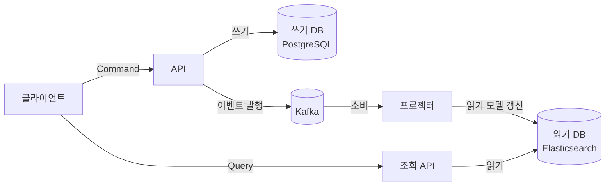

# CQRS 패턴

## 시작하기 전에

CQRS(Command Query Responsibility Segregation)는 이름은 거창한데 핵심은 단순하다. 데이터를 쓰는 모델과 읽는 모델을 분리하자는 거다. 같은 테이블, 같은 엔티티에 대고 INSERT/UPDATE/DELETE와 SELECT를 동시에 하지 말고, 쓰기는 쓰기대로 읽기는 읽기대로 따로 만들자는 얘기다.

이 패턴이 본격적으로 거론되는 시점은 보통 정해져 있다. 주문 목록 조회 API가 점점 느려져서 인덱스를 5개 더 박고, 페이지네이션을 커서 방식으로 바꾸고, Redis 캐시를 앞에 둬도 한계가 보이기 시작할 때다. 그 와중에 상품팀에서 "주문 상세에 상품 정보랑 배송지랑 결제 수단이랑 적립금 내역까지 한 번에 보고 싶다"고 하면 조인이 7개를 넘어간다. 이쯤 되면 누군가 "쓰기 모델이랑 읽기 모델 분리하는 게 어떠냐"고 말하면서 CQRS가 입에 오른다.

문제는 CQRS를 잘못 도입하면 단순한 CRUD 시스템에 이중 저장소와 동기화 코드만 잔뜩 붙어서 복잡도가 폭발한다는 거다. 이 문서는 CQRS를 왜 쓰는지, 어떻게 쓰는지, 그리고 가장 중요한 "언제 쓰지 말아야 하는지"를 정리한다. Event Sourcing과 묶어서 설명되는 경우가 많은데 둘은 별개의 패턴이다. 이 구분도 같이 다룬다.

## Command와 Query를 왜 분리하나

전통적인 CRUD 애플리케이션에서 하나의 모델이 두 가지 책임을 같이 진다. `Order` 엔티티를 보자.

```java
@Entity
public class Order {
    @Id
    private Long id;
    private Long userId;
    private OrderStatus status;
    private BigDecimal totalAmount;
    
    @OneToMany(cascade = CascadeType.ALL, orphanRemoval = true)
    private List<OrderItem> items;
    
    public void cancel() {
        if (status != OrderStatus.PAID) {
            throw new IllegalStateException("결제 완료 상태가 아니면 취소할 수 없다");
        }
        this.status = OrderStatus.CANCELLED;
    }
    
    public BigDecimal calculateTotal() {
        return items.stream()
            .map(item -> item.getPrice().multiply(BigDecimal.valueOf(item.getQuantity())))
            .reduce(BigDecimal.ZERO, BigDecimal::add);
    }
}
```

이 엔티티는 두 가지 일을 한다. 하나는 비즈니스 규칙을 강제하는 일(`cancel()`처럼 상태 전이 검증, 불변식 유지)이고, 다른 하나는 화면에 보여줄 데이터를 만드는 일이다. 둘이 합쳐져 있으면 다음 같은 문제가 생긴다.

쓰기 입장에서는 `items` 컬렉션을 다 들고 와야 한다. 취소할 때 환불 금액을 계산해야 하니까. 하지만 읽기 입장에서는 주문 목록을 보여줄 때 아이템 목록이 필요 없다. 주문 번호, 총액, 상태만 있으면 된다. 그런데 JPA에서 `@OneToMany`를 lazy로 걸어두면 N+1이 터지고, eager로 걸면 카르테시안 곱이 나오고, fetch join을 걸면 페이지네이션이 깨진다. 이 모든 게 "한 엔티티가 쓰기와 읽기를 같이 한다"는 전제에서 시작되는 문제다.

CQRS는 이걸 그냥 끊어버린다. 쓰기 쪽은 도메인 모델을 그대로 두되 외부에 노출하지 않고, 읽기 쪽은 화면에 딱 맞는 별도의 모델(DTO나 별도 테이블)을 만든다. 둘은 같은 객체를 공유하지 않는다.

```java
// 쓰기 모델: 비즈니스 규칙과 상태 전이만 책임
public class Order {
    private OrderId id;
    private CustomerId customerId;
    private OrderStatus status;
    private List<OrderLine> lines;
    
    public void cancel(CancellationReason reason) {
        if (!status.isCancellable()) {
            throw new OrderNotCancellableException(id, status);
        }
        this.status = OrderStatus.CANCELLED;
        DomainEvents.publish(new OrderCancelled(id, reason, Instant.now()));
    }
}

// 읽기 모델: 화면에 보여줄 형태 그대로
public class OrderListView {
    private String orderId;
    private String customerName;
    private String statusLabel;
    private BigDecimal totalAmount;
    private LocalDateTime orderedAt;
    private int itemCount;
}
```

`OrderListView`는 엔티티가 아니다. 그냥 조회 결과를 담는 객체다. 이 객체는 `Order` 테이블 하나에서 나올 수도 있고, 별도로 만든 `order_list_view` 테이블에서 한 방에 SELECT로 가져올 수도 있다. 어느 쪽이든 쓰기 모델과는 완전히 분리되어 있다.

## 단순한 분리: 같은 DB, 다른 모델

CQRS를 "이중 저장소 + 이벤트 동기화"로 처음부터 그리는 사람이 많은데, 그렇게 무겁게 갈 필요 없는 경우가 더 많다. 같은 DB를 그대로 쓰면서 쓰기는 JPA 엔티티로, 읽기는 별도 쿼리(QueryDSL이나 MyBatis나 JdbcTemplate)로 분리하는 것만으로도 CQRS의 절반은 이미 한 거다.

```java
@Service
@RequiredArgsConstructor
public class OrderCommandService {
    private final OrderRepository orderRepository;
    private final ApplicationEventPublisher eventPublisher;
    
    @Transactional
    public void cancelOrder(OrderId orderId, CancellationReason reason) {
        Order order = orderRepository.findById(orderId)
            .orElseThrow(() -> new OrderNotFoundException(orderId));
        order.cancel(reason);
        eventPublisher.publishEvent(new OrderCancelled(orderId, reason, Instant.now()));
    }
}

@Service
@RequiredArgsConstructor
public class OrderQueryService {
    private final JdbcTemplate jdbcTemplate;
    
    public Page<OrderListView> findOrders(Long customerId, OrderStatus status, Pageable pageable) {
        String sql = """
            SELECT o.id, o.status, o.total_amount, o.ordered_at,
                   c.name AS customer_name,
                   (SELECT COUNT(*) FROM order_line ol WHERE ol.order_id = o.id) AS item_count
            FROM orders o
            JOIN customer c ON c.id = o.customer_id
            WHERE o.customer_id = ? AND o.status = ?
            ORDER BY o.ordered_at DESC
            LIMIT ? OFFSET ?
            """;
        // ... 매핑 후 반환
    }
}
```

이 구조의 장점은 쓰기 쪽은 도메인 규칙에 집중하고, 읽기 쪽은 SQL을 자유롭게 짤 수 있다는 거다. JPA로 모든 조회를 짜다 보면 fetch join, EntityGraph, `@BatchSize` 같은 트릭에 시간을 다 쓰게 되는데, 조회는 그냥 SQL이 가장 직관적이다. 인덱스 힌트도 쓸 수 있고, 윈도우 함수도 쓸 수 있고, 통계 쿼리도 자연스럽게 짠다.

이 단계의 CQRS만으로도 다음 문제가 해결된다.

- 도메인 모델이 화면 요구사항에 끌려다니지 않는다. "이 화면에 필드 하나 추가해주세요"가 엔티티 수정으로 이어지지 않는다.
- N+1과 fetch join 지옥을 벗어난다. 읽기는 SQL을 직접 짜니까.
- 쓰기 트랜잭션이 짧아진다. 조회 때문에 `@OneToMany` 컬렉션을 불필요하게 끌고 다니지 않으니까.

이 정도로 끝낼 수 있는 시스템이 의외로 많다. 굳이 별도 읽기 DB를 만들고 이벤트로 동기화할 필요가 없다.

## 본격적인 분리: 별도 읽기 모델과 프로젝션

같은 DB로는 한계가 오는 시점이 있다. 대표적인 경우는 셋이다.

첫째, 읽기 부하가 쓰기 부하의 100배쯤 되는데 같은 DB를 쓰니까 OLAP성 쿼리가 OLTP 트랜잭션을 잠그는 경우. 둘째, 화면에 보여줄 데이터가 여러 마이크로서비스에 흩어져 있어서 매번 동기 호출로 조립하면 응답 시간이 안 나오는 경우. 셋째, 검색 요구사항이 RDB로 감당이 안 되는 경우(전문 검색, 패싯, 자동완성).

이때부터는 별도의 읽기 저장소를 둔다. 쓰기 DB는 PostgreSQL, 읽기 저장소는 Elasticsearch 또는 별도의 PostgreSQL read replica, 또는 MongoDB 같은 문서 DB. 쓰기 쪽에서 도메인 이벤트가 발생하면 그걸 받아서 읽기 저장소에 미리 계산된 뷰(프로젝션)를 만들어둔다.



프로젝션을 만든다는 건 미리 조인된 결과를 비정규화된 형태로 저장해두는 것이다. 예를 들어 주문 목록 조회를 위해 다음 같은 문서를 Elasticsearch에 미리 만들어둔다.

```json
{
  "orderId": "ORD-2026-00001234",
  "customerId": "CUST-99887",
  "customerName": "김주문",
  "customerGrade": "GOLD",
  "status": "PAID",
  "statusLabel": "결제 완료",
  "totalAmount": 127800,
  "itemCount": 3,
  "items": [
    {"productId": "P-001", "name": "키보드", "quantity": 1, "price": 89000},
    {"productId": "P-002", "name": "마우스", "quantity": 2, "price": 19400}
  ],
  "shippingAddress": "서울시 강남구 ...",
  "paymentMethod": "신용카드 (****-1234)",
  "orderedAt": "2026-05-11T14:32:11Z"
}
```

이 문서 하나에 고객 정보, 상품 정보, 배송지, 결제 수단이 다 들어 있다. 조회 시점에는 조인이 없다. ID로 한 번 가져오면 끝이다. 검색 API도 단순해진다. `customerName`이나 `status`로 필터링하는 게 그냥 ES 쿼리 한 줄이다.

대신 이 프로젝션을 누군가는 만들고 유지해야 한다. 그게 프로젝터의 역할이다.

```java
@Component
@RequiredArgsConstructor
public class OrderProjector {
    private final OrderViewRepository orderViewRepository;
    private final CustomerClient customerClient;
    
    @KafkaListener(topics = "order-events", groupId = "order-projector")
    public void onOrderEvent(OrderEvent event) {
        switch (event) {
            case OrderCreated e -> handleCreated(e);
            case OrderPaid e -> handlePaid(e);
            case OrderCancelled e -> handleCancelled(e);
            case OrderShipped e -> handleShipped(e);
        }
    }
    
    private void handleCreated(OrderCreated event) {
        Customer customer = customerClient.findById(event.customerId());
        OrderView view = OrderView.builder()
            .orderId(event.orderId())
            .customerId(event.customerId())
            .customerName(customer.name())
            .customerGrade(customer.grade())
            .status("PENDING")
            .statusLabel("결제 대기")
            .totalAmount(event.totalAmount())
            .items(event.items())
            .orderedAt(event.createdAt())
            .build();
        orderViewRepository.save(view);
    }
    
    private void handlePaid(OrderPaid event) {
        OrderView view = orderViewRepository.findById(event.orderId())
            .orElseThrow();
        view.setStatus("PAID");
        view.setStatusLabel("결제 완료");
        view.setPaymentMethod(event.paymentMethodLabel());
        orderViewRepository.save(view);
    }
    // ...
}
```

프로젝터는 도메인 이벤트를 받아서 읽기 모델을 차곡차곡 갱신한다. 이 코드에서 주의 깊게 봐야 할 부분이 몇 가지 있다.

`customerClient.findById()`로 고객 정보를 가져와서 프로젝션에 박는 부분이다. 이게 동기 호출이라 고객 서비스가 죽으면 프로젝터도 죽는다. 그래서 실무에서는 고객 정보도 별도 이벤트로 받아서 로컬 read store에 캐싱해두거나, 프로젝션 실패 시 재시도 큐로 빠지게 한다. 무엇보다 프로젝터가 외부 의존성에 매여 있으면 안 된다.

또 하나는 이벤트 순서 보장이다. `OrderCreated`가 도착하기 전에 `OrderPaid`가 먼저 오면 어떻게 되나. 위 코드는 그 경우 `findById().orElseThrow()`에서 터진다. Kafka 파티션을 `orderId`로 묶으면 같은 주문에 대한 이벤트는 순서대로 오긴 한다. 하지만 컨슈머 재시작이나 리밸런싱 중에 같은 이벤트가 두 번 들어올 수 있다. 그래서 프로젝터는 멱등하게 짜야 한다(같은 이벤트가 두 번 처리돼도 결과가 같아야 한다).

## Eventual Consistency, 즉 동기화 지연

읽기 모델을 별도로 두면 가장 먼저 부딪히는 게 일관성 문제다. 사용자가 주문을 취소했는데, "내 주문 목록"을 새로고침하면 여전히 PAID로 보인다. 왜냐하면 쓰기 DB에는 CANCELLED로 반영됐지만 읽기 DB에는 아직 이벤트가 전달되지 않았기 때문이다. 이 시간 간격이 보통 수십 밀리초에서 수 초 사이다. 시스템이 건강할 때는 100ms 이내지만, 컨슈머 lag이 쌓이면 분 단위까지 벌어진다.

이걸 받아들이는 게 CQRS의 정신적 비용이다. "방금 내가 한 일이 즉시 보이지 않을 수 있다"는 사실을 UX와 비즈니스 로직에 녹여야 한다. 몇 가지 접근법이 있다.

가장 흔한 방법은 **클라이언트 측 낙관적 업데이트**다. 사용자가 취소 버튼을 누르면, 서버 응답을 기다리지 않고 UI에서는 즉시 "취소됨"으로 표시한다. 서버는 백그라운드에서 처리하고, 실패하면 롤백 UI를 보여준다. 이 방식은 모바일 앱이나 SPA에서 자주 쓴다.

두 번째는 **본인 작업 결과는 쓰기 DB에서 직접 조회**하는 방식이다. 사용자가 주문을 취소하고 곧바로 "내 주문 상세"로 들어갈 때, 그 한 번의 조회는 쓰기 DB에서 가져온다. 다른 사용자의 조회나 목록 조회는 읽기 DB를 쓴다. 코드가 살짝 복잡해지지만 사용자 경험은 자연스럽다.

세 번째는 **읽기 모델 갱신을 트랜잭션과 함께 처리**하는 방식이다. 쓰기 트랜잭션 안에서 outbox 테이블에 이벤트를 기록하고, 별도 프로세스가 outbox를 폴링해서 Kafka로 보내고, 프로젝터가 그걸 받아서 읽기 모델을 갱신한다. 트랜잭션 outbox 패턴이라고 부른다. 이걸로 "이벤트 유실"은 막을 수 있지만 동기화 지연은 여전히 존재한다.

```java
@Transactional
public void cancelOrder(OrderId orderId, CancellationReason reason) {
    Order order = orderRepository.findById(orderId).orElseThrow();
    order.cancel(reason);
    
    // outbox에 이벤트 기록. 같은 트랜잭션 안에서.
    outboxRepository.save(OutboxEvent.builder()
        .aggregateId(orderId.value())
        .eventType("OrderCancelled")
        .payload(JsonUtils.toJson(new OrderCancelled(orderId, reason, Instant.now())))
        .createdAt(Instant.now())
        .build());
}
```

outbox 테이블에는 발행할 이벤트가 쌓이고, 별도 polling 프로세스(또는 Debezium 같은 CDC 도구)가 이걸 Kafka로 옮긴다. 이 구조의 핵심은 도메인 변경과 이벤트 기록이 같은 트랜잭션 안에서 일어난다는 것이다. 한쪽만 성공하고 다른 쪽이 실패하는 부분 실패를 막을 수 있다.

실무에서 동기화 지연을 다룰 때 가장 안 좋은 방법은 **"잠깐 기다렸다가 다시 조회"** 같은 코드를 짜는 거다. `Thread.sleep(500)` 다음에 읽기 DB 조회를 하는 코드를 본 적이 있는데, 그 500ms는 어떻게 정한 건지 묻고 싶다. 동기화 지연은 통계적 분포다. 평균이 100ms여도 p99는 2초가 나올 수 있다. 시간으로 기다리지 말고, 읽기 모델에 버전 번호를 두거나 쓰기 DB에서 가져오는 우회로를 만들어야 한다.

## Read Model 프로젝션 구축의 실제

읽기 모델을 처음부터 구축할 때 가장 큰 고민은 "기존 데이터는 어떻게 채우나"다. 시스템이 이미 운영 중이고 주문이 천만 건 쌓여 있는 상태에서 프로젝터를 새로 만든다면, 천만 건의 주문에 대한 이벤트를 다시 흘려보낼 수 있나? 보통은 못 한다. 처음 만들 때 이벤트를 저장해두지 않았으니까.

이걸 해결하는 두 가지 방법이 있다.

하나는 **백필(backfill) 잡**을 따로 짜는 것이다. 쓰기 DB를 처음부터 끝까지 스캔하면서 각 주문에 대해 "마치 그 시점에 이벤트가 발생한 것처럼" 프로젝션을 만든다. 운영 중에 백필을 돌리면 신규 이벤트와 백필 데이터가 충돌할 수 있으니, 시점 기준을 잘 잡아야 한다. 보통은 "오늘 새벽 3시 기준 스냅샷"을 백필로 만들고, 그 시점 이후 이벤트는 실시간 스트림에서 받는다.

다른 하나는 **Event Sourcing으로 가는 것**이다. 도메인 변경을 처음부터 이벤트로 기록해두면, 언제든 이벤트를 다시 재생해서 새로운 읽기 모델을 만들 수 있다. 새 화면이 필요하면 새 프로젝터를 만들고, 이벤트 스트림을 처음부터 다시 흘려보내면 끝이다. 이게 Event Sourcing이 CQRS와 자주 묶이는 이유다. 둘은 따로 쓸 수도 있지만 같이 쓰면 자연스럽다.

읽기 모델을 운영하면서 또 하나 마주치는 게 **스키마 변경**이다. 화면 요구사항이 바뀌어서 프로젝션에 필드를 추가해야 할 때, 기존 문서들에는 그 필드가 없다. 새 필드를 추가하면서 마이그레이션 잡을 돌리거나, 프로젝션을 통째로 다시 만들거나(이 경우 Event Sourcing이 있으면 편하다), 또는 조회 시점에 NULL을 적절히 처리하는 식으로 대응한다. 어느 쪽이든 "프로젝션은 언제든 다시 만들 수 있어야 한다"는 원칙을 지켜야 한다. 한 번 만들고 손 못 대는 프로젝션은 시간이 갈수록 빚이 된다.

## CQRS와 Event Sourcing은 다른 패턴이다

이 둘이 같이 거론되는 일이 많아서 한 패턴처럼 오해하는 사람이 많은데, 별개의 패턴이다. 정확히 말하면 다음과 같다.

**CQRS**는 쓰기 모델과 읽기 모델을 분리한다. 쓰기 쪽 저장 방식이 뭐든 상관없다. 그냥 RDB에 INSERT/UPDATE를 해도 되고, NoSQL을 써도 된다.

**Event Sourcing**은 도메인 상태를 직접 저장하지 않고, 상태를 만들어낸 이벤트들의 시퀀스를 저장한다. 현재 상태가 필요하면 이벤트들을 처음부터 재생해서 만든다(또는 스냅샷에서 시작해서 그 이후 이벤트만 재생한다).

```java
// Event Sourcing 방식의 Order
public class Order {
    private OrderId id;
    private OrderStatus status;
    private List<OrderLine> lines;
    
    // 이벤트를 받아서 상태를 만든다(replay).
    public static Order replay(List<DomainEvent> events) {
        Order order = new Order();
        for (DomainEvent event : events) {
            order.apply(event);
        }
        return order;
    }
    
    private void apply(DomainEvent event) {
        switch (event) {
            case OrderCreated e -> {
                this.id = e.orderId();
                this.lines = e.lines();
                this.status = OrderStatus.PENDING;
            }
            case OrderPaid e -> this.status = OrderStatus.PAID;
            case OrderCancelled e -> this.status = OrderStatus.CANCELLED;
            // ...
        }
    }
    
    // 명령을 실행하면 이벤트를 생성한다.
    public List<DomainEvent> cancel(CancellationReason reason) {
        if (!status.isCancellable()) {
            throw new OrderNotCancellableException(id, status);
        }
        return List.of(new OrderCancelled(id, reason, Instant.now()));
    }
}
```

Event Sourcing에서는 `orders` 테이블이 없다. 대신 `events` 테이블이 있고, 거기에 모든 도메인 이벤트가 append-only로 쌓인다. 주문 하나를 가져오려면 그 주문의 `aggregateId`에 해당하는 모든 이벤트를 가져와서 재생한다.

Event Sourcing의 장점은 명확하다. 모든 변경 이력이 보존된다. "이 주문이 어떻게 이 상태가 됐는지"를 100% 추적할 수 있다. 새 읽기 모델이 필요하면 이벤트를 처음부터 재생해서 만들 수 있다. 디버깅할 때도 시점을 거슬러 올라가서 그 시점의 상태를 재현할 수 있다.

단점도 명확하다. 학습 곡선이 가파르다. 이벤트 스키마 진화(예전에 만든 이벤트와 지금 만드는 이벤트가 호환되어야 한다)가 까다롭다. 단순 조회 한 번에도 이벤트 재생이 필요해서 스냅샷 전략이 필수다. 트랜잭션이 까다롭다(여러 애그리거트를 한 트랜잭션으로 묶기 어렵다).

CQRS는 Event Sourcing 없이도 충분히 쓸 수 있다. RDB에 그대로 저장하면서 읽기/쓰기 모델만 분리해도 CQRS다. 반대로 Event Sourcing은 거의 항상 CQRS와 같이 간다. 이벤트 저장소에서 직접 조회하면 너무 느리니까 별도 읽기 모델이 필요해진다.

실무 도입 우선순위는 이 순서로 생각한다. 먼저 단순 분리(같은 DB, 다른 쿼리 모델) → 그래도 안 되면 별도 읽기 DB와 프로젝션 → 그래도 부족하고 변경 이력 추적이 진짜 필요하면 Event Sourcing. 처음부터 Event Sourcing을 들고 가는 건 거의 항상 과도하다.

## 단순 CRUD에 CQRS를 도입하면 안 되는 이유

CQRS가 좋아 보이는 만큼 함부로 도입하면 안 되는 이유가 분명히 있다. 단순 CRUD 시스템에 CQRS를 박으면 다음이 일어난다.

코드량이 두세 배가 된다. `Order` 엔티티 하나 있던 자리에 `Order`(도메인), `OrderCreated`/`OrderPaid`/... 이벤트들, `OrderView`(읽기 모델), `OrderProjector`(프로젝터), `OrderCommandService`, `OrderQueryService`가 생긴다. 비즈니스 규칙이 단순한 게시판 같은 거라면 이 코드량을 정당화할 수 없다.

테스트가 복잡해진다. 쓰기 후에 읽으면 결과가 즉시 보이지 않는 시스템을 어떻게 테스트하나? 통합 테스트에서 `Awaitility`로 polling하면서 "프로젝션이 갱신될 때까지 기다리는" 코드를 짜야 한다. 단위 테스트는 mock으로 가능하지만, 실제 흐름을 검증하는 테스트는 비동기 동기화를 다뤄야 한다.

장애 면적이 늘어난다. 쓰기 DB, 메시지 브로커, 읽기 DB, 프로젝터 프로세스. 이 중 하나라도 망가지면 시스템 어딘가가 이상해진다. 모니터링할 대상이 늘어나고, 컨슈머 lag을 추적해야 하고, dead letter queue를 관리해야 한다.

운영자의 인지 부하가 늘어난다. CS 문의로 "내가 주문 취소했는데 목록에는 그대로 보여요"가 들어왔을 때, 그게 버그인지 동기화 지연인지 판단해야 한다. 신입 개발자가 들어오면 "왜 같은 데이터가 두 군데 있어요"부터 설명해야 한다.

그래서 CQRS를 도입하기 전에 다음 질문을 던져야 한다.

지금 시스템에서 읽기 부하와 쓰기 부하의 비율이 어떻게 되나. 비슷하다면 굳이 분리할 이유가 없다. 100:1 이상으로 읽기가 많다면 검토해볼 만하다.

읽기 요구사항이 쓰기 모델과 정말로 다르게 생겼나. 같은 도메인 모델로 조회 화면을 그릴 수 있다면 그냥 그대로 두는 게 낫다. 화면에 보여줄 데이터가 여러 도메인을 가로지르거나, 비정규화된 형태로 미리 준비해둬야 한다면 분리할 가치가 있다.

eventual consistency를 받아들일 수 있는 도메인인가. 금융 거래에서 잔액을 보여주는 화면이 5초 지연돼도 괜찮나? 보통은 안 괜찮다. 이런 화면은 CQRS의 읽기 모델이 아니라 쓰기 DB에서 직접 가져오게 해야 한다.

팀이 메시지 브로커와 비동기 시스템을 운영할 역량이 있나. Kafka 한 번도 안 써본 팀이 CQRS부터 도입하면 production 장애로 직행한다.

이 질문들에 대한 답이 "그렇다"가 많을 때만 CQRS를 도입한다. 답이 애매하면 단순 분리(같은 DB에 다른 쿼리 객체)에서 멈추는 게 낫다.

## 실무 도입 사례: 주문/결제 도메인

CQRS가 명확하게 의미 있는 도메인이 주문/결제다. 왜냐하면 이 도메인의 특성이 다음과 같기 때문이다.

쓰기 측: 비즈니스 규칙이 복잡하다. 재고 확인, 결제 승인, 쿠폰 적용, 적립금 사용, 배송지 검증, 부가세 계산 등이 한 트랜잭션에 얽힌다. 데이터 정합성이 가장 중요하고, 잘못된 상태가 되면 안 된다. 작은 트랜잭션과 명확한 도메인 모델이 필요하다.

읽기 측: 화면 종류가 많다. 주문 목록, 주문 상세, 관리자용 주문 검색, 정산 리포트, 사용자별 주문 통계, 상품별 판매 현황. 각 화면이 요구하는 데이터 형태가 완전히 다르다. 검색 조건도 다양하다(주문번호, 고객명, 상품명, 결제 수단, 기간, 상태). 

이런 도메인에서 단일 모델로 양쪽을 다 만족시키려고 하면 도메인 모델이 점점 화면 요구사항에 끌려다닌다. "주문 상세 화면에 결제 정보까지 다 보여줘야 하니까 `Order`에 `Payment` 관련 필드를 추가하자" 같은 결정이 누적되면 도메인 모델이 뚱뚱해진다.

실제 도입할 때 단계별로 어떻게 가는지 보자.

**1단계: 같은 DB, 다른 쿼리 모델**

처음에는 쓰기는 JPA 엔티티로, 읽기는 QueryDSL 또는 MyBatis로 분리한다. 쓰기 모델은 도메인 규칙에 집중하고, 읽기는 화면별 DTO를 직접 SQL로 빌드한다.

```java
@Service
@RequiredArgsConstructor
public class OrderQueryService {
    private final JPAQueryFactory queryFactory;
    
    public Page<OrderListItem> searchOrders(OrderSearchCondition cond, Pageable pageable) {
        QOrder order = QOrder.order;
        QCustomer customer = QCustomer.customer;
        
        List<OrderListItem> items = queryFactory
            .select(Projections.constructor(OrderListItem.class,
                order.id, customer.name, order.status, 
                order.totalAmount, order.orderedAt))
            .from(order)
            .join(customer).on(customer.id.eq(order.customerId))
            .where(
                eqCustomerId(cond.getCustomerId()),
                eqStatus(cond.getStatus()),
                betweenOrderedAt(cond.getFrom(), cond.getTo())
            )
            .offset(pageable.getOffset())
            .limit(pageable.getPageSize())
            .orderBy(order.orderedAt.desc())
            .fetch();
        
        long total = queryFactory.select(order.count())
            .from(order)
            .where(/* 같은 조건 */)
            .fetchOne();
        
        return new PageImpl<>(items, pageable, total);
    }
}
```

여기까지가 CQRS의 가장 가벼운 형태다. 의외로 많은 서비스가 이 단계에서 멈춰도 충분히 잘 돌아간다.

**2단계: 별도 읽기 DB로 분리**

서비스가 커지면 운영 DB의 부하가 문제가 된다. 정산 리포트나 통계 쿼리가 OLTP 트랜잭션을 잠근다. 이때 PostgreSQL의 read replica를 두거나, 별도의 분석용 DB로 이벤트를 흘려보낸다.

```java
@Service
@RequiredArgsConstructor
public class OrderEventHandler {
    private final OrderReadModelRepository readModelRepository;
    
    @TransactionalEventListener(phase = TransactionPhase.AFTER_COMMIT)
    public void onOrderCreated(OrderCreated event) {
        OrderReadModel model = OrderReadModel.from(event);
        readModelRepository.save(model);
    }
    
    @TransactionalEventListener(phase = TransactionPhase.AFTER_COMMIT)
    public void onOrderPaid(OrderPaid event) {
        OrderReadModel model = readModelRepository.findById(event.orderId()).orElseThrow();
        model.markAsPaid(event.paymentMethodLabel(), event.paidAt());
        readModelRepository.save(model);
    }
}
```

`@TransactionalEventListener(phase = AFTER_COMMIT)`가 핵심이다. 쓰기 트랜잭션이 커밋된 후에 읽기 모델을 갱신한다. 이렇게 하면 쓰기 트랜잭션이 롤백되었을 때 읽기 모델에 잘못된 데이터가 들어가는 걸 막을 수 있다.

다만 이 방식은 "쓰기 커밋 직후 프로세스가 죽으면 읽기 모델 갱신을 놓친다"는 약점이 있다. 이래서 진짜 일관성이 필요하면 outbox 패턴으로 가야 한다.

**3단계: 메시지 브로커와 프로젝터 분리**

서비스가 더 커지면 결제 서비스, 주문 서비스, 배송 서비스가 각자 분리된다. 이때부터는 같은 프로세스 안에서 이벤트를 처리하는 게 아니라, Kafka로 이벤트를 흘려보내고 각 서비스가 자기 read store를 관리한다.

```java
@Configuration
@RequiredArgsConstructor
public class OrderOutboxConfig {
    // outbox 패턴으로 트랜잭션 일관성 확보
}

@Service
public class OrderCommandService {
    @Transactional
    public void cancelOrder(OrderId orderId, CancellationReason reason) {
        Order order = orderRepository.findById(orderId).orElseThrow();
        order.cancel(reason);
        
        outboxRepository.save(OutboxEvent.of(
            order.getId(), "OrderCancelled", new OrderCancelled(orderId, reason)));
    }
}

// 별도 프로세스가 outbox를 폴링해서 Kafka로 발행한다.
// 또는 Debezium 같은 CDC 도구로 outbox 테이블을 캡처한다.
```

이 단계에서는 운영 복잡도가 확 늘어난다. Kafka, 컨슈머 그룹, lag 모니터링, dead letter queue, 스키마 레지스트리. 하지만 이걸 감당할 수 있다면 시스템이 매우 유연해진다. 새로운 화면이 필요하면 새로운 프로젝터를 만들면 되고, 기존 코드는 건드리지 않는다.

## Spring + JPA로 실제 구현해보기

지금까지 설명한 1단계(같은 DB, 다른 쿼리 모델) 수준의 CQRS를 Spring Boot + JPA로 어떻게 짜는지 보자. 실무에서 가장 먼저 도입하기 좋은 형태다.

쓰기 쪽 도메인 모델은 단순 JPA 엔티티지만 비즈니스 규칙을 메서드로 캡슐화한다.

```java
@Entity
@Table(name = "orders")
public class Order {
    @Id
    @GeneratedValue
    private Long id;
    
    private Long customerId;
    
    @Enumerated(EnumType.STRING)
    private OrderStatus status;
    
    private BigDecimal totalAmount;
    
    @OneToMany(mappedBy = "order", cascade = CascadeType.ALL, orphanRemoval = true)
    private List<OrderLine> lines = new ArrayList<>();
    
    @Column(nullable = false)
    private Instant createdAt;
    
    protected Order() {}
    
    public static Order place(Long customerId, List<OrderLineRequest> lineRequests) {
        Order order = new Order();
        order.customerId = customerId;
        order.status = OrderStatus.PENDING;
        order.createdAt = Instant.now();
        order.lines = lineRequests.stream()
            .map(req -> new OrderLine(order, req.productId(), req.quantity(), req.unitPrice()))
            .toList();
        order.totalAmount = order.lines.stream()
            .map(OrderLine::subtotal)
            .reduce(BigDecimal.ZERO, BigDecimal::add);
        return order;
    }
    
    public void markPaid() {
        if (status != OrderStatus.PENDING) {
            throw new IllegalStateException("결제 대기 상태에서만 결제 완료로 전환 가능");
        }
        this.status = OrderStatus.PAID;
    }
    
    public void cancel() {
        if (status != OrderStatus.PENDING && status != OrderStatus.PAID) {
            throw new IllegalStateException("취소할 수 없는 상태: " + status);
        }
        this.status = OrderStatus.CANCELLED;
    }
}
```

엔티티는 자기 상태 전이를 책임진다. setter는 노출하지 않고, 의미 있는 행동(`place`, `markPaid`, `cancel`)으로만 상태가 바뀐다.

Command 서비스는 비즈니스 흐름을 조정한다.

```java
@Service
@RequiredArgsConstructor
public class OrderCommandService {
    private final OrderRepository orderRepository;
    private final ApplicationEventPublisher eventPublisher;
    
    @Transactional
    public Long placeOrder(Long customerId, List<OrderLineRequest> lines) {
        Order order = Order.place(customerId, lines);
        orderRepository.save(order);
        eventPublisher.publishEvent(new OrderPlacedEvent(order.getId(), customerId, order.getTotalAmount()));
        return order.getId();
    }
    
    @Transactional
    public void payOrder(Long orderId) {
        Order order = orderRepository.findById(orderId)
            .orElseThrow(() -> new OrderNotFoundException(orderId));
        order.markPaid();
        eventPublisher.publishEvent(new OrderPaidEvent(orderId, Instant.now()));
    }
    
    @Transactional
    public void cancelOrder(Long orderId) {
        Order order = orderRepository.findById(orderId)
            .orElseThrow(() -> new OrderNotFoundException(orderId));
        order.cancel();
        eventPublisher.publishEvent(new OrderCancelledEvent(orderId, Instant.now()));
    }
}
```

Query 서비스는 도메인 엔티티를 거치지 않고 직접 DB에서 조회한다. JPA를 안 쓰고 JdbcTemplate이나 QueryDSL을 써도 되고, 이 예제에서는 JPQL의 `new` 키워드로 DTO에 직접 매핑한다.

```java
@Service
@RequiredArgsConstructor
public class OrderQueryService {
    private final EntityManager em;
    
    public List<OrderListItemDto> findOrdersByCustomer(Long customerId) {
        return em.createQuery("""
            SELECT new com.example.order.query.OrderListItemDto(
                o.id, o.status, o.totalAmount, o.createdAt, SIZE(o.lines)
            )
            FROM Order o
            WHERE o.customerId = :customerId
            ORDER BY o.createdAt DESC
            """, OrderListItemDto.class)
            .setParameter("customerId", customerId)
            .getResultList();
    }
    
    public OrderDetailDto findDetail(Long orderId) {
        // 상세 조회는 fetch join으로 한 번에. 트랜잭션은 readOnly로.
        return em.createQuery("""
            SELECT new com.example.order.query.OrderDetailDto(
                o.id, o.customerId, o.status, o.totalAmount, o.createdAt
            )
            FROM Order o
            WHERE o.id = :orderId
            """, OrderDetailDto.class)
            .setParameter("orderId", orderId)
            .getSingleResult();
    }
}

public record OrderListItemDto(
    Long orderId,
    OrderStatus status,
    BigDecimal totalAmount,
    Instant createdAt,
    Integer itemCount
) {}
```

DTO는 record로 만들어서 불변으로 둔다. 화면별로 다른 DTO를 만들고, 그 DTO에 맞는 쿼리를 SQL이나 JPQL로 직접 짠다. 한 도메인에 화면이 다섯 개 있으면 DTO도 다섯 개 만들고, 쿼리도 다섯 개 짠다. 처음엔 중복처럼 보이지만, 화면 요구사항이 바뀔 때 영향 범위가 그 화면 하나로 한정된다는 장점이 더 크다.

컨트롤러에서는 둘을 명확히 구분한다.

```java
@RestController
@RequiredArgsConstructor
@RequestMapping("/api/orders")
public class OrderController {
    private final OrderCommandService commandService;
    private final OrderQueryService queryService;
    
    @PostMapping
    public ResponseEntity<Map<String, Long>> placeOrder(@RequestBody PlaceOrderRequest request) {
        Long orderId = commandService.placeOrder(request.customerId(), request.lines());
        return ResponseEntity.ok(Map.of("orderId", orderId));
    }
    
    @PostMapping("/{id}/cancel")
    public ResponseEntity<Void> cancel(@PathVariable Long id) {
        commandService.cancelOrder(id);
        return ResponseEntity.noContent().build();
    }
    
    @GetMapping
    public List<OrderListItemDto> list(@RequestParam Long customerId) {
        return queryService.findOrdersByCustomer(customerId);
    }
    
    @GetMapping("/{id}")
    public OrderDetailDto detail(@PathVariable Long id) {
        return queryService.findDetail(id);
    }
}
```

`commandService`는 상태를 바꾸고, `queryService`는 상태를 읽기만 한다. 컨트롤러 메서드 시그니처만 봐도 어느 쪽인지 분명하다. 트랜잭션도 명령 쪽은 `@Transactional`, 조회 쪽은 `@Transactional(readOnly = true)`로 두는 게 일반적이다.

이게 가장 가벼운 CQRS 구현이다. 별도 DB도 없고, 메시지 브로커도 없고, 프로젝션도 없다. 하지만 도메인 모델은 비즈니스 규칙에 집중하고, 조회는 화면 요구에 맞춰 자유롭게 짠다. 시스템이 작을 때는 이 정도면 충분하고, 더 필요해지면 단계적으로 읽기 모델을 외부로 빼면 된다.

## 정리

CQRS는 "쓰기와 읽기의 책임이 다르다"는 인식에서 시작한다. 같은 모델로 둘 다 하려고 하면 한쪽이 다른 쪽을 망친다. 그래서 분리하는데, 분리의 강도는 시스템 규모와 요구사항에 따라 다르다.

가장 가벼운 형태는 같은 DB에 다른 쿼리 모델을 두는 것이다. 도메인 엔티티는 쓰기 전용으로, 조회는 별도 DTO와 직접 SQL로 한다. 이 정도만 해도 N+1과 fetch join 지옥을 벗어날 수 있다. 대부분의 서비스는 여기서 멈춰도 된다.

규모가 커지면 별도 읽기 저장소를 두고 이벤트로 동기화한다. 이때부터 eventual consistency를 받아들여야 한다. 동기화 지연을 시간으로 기다리지 말고, 사용자 본인 작업은 쓰기 DB에서 직접 조회하거나, 클라이언트 측 낙관적 업데이트로 우회한다.

Event Sourcing은 CQRS와 자주 묶이지만 별개의 패턴이다. 변경 이력을 보존하고 언제든 재생할 수 있다는 강력한 장점이 있지만, 학습 비용과 운영 복잡도가 매우 높다. 단순 도메인에 들이대면 시스템 자체가 무너진다.

가장 중요한 건 "지금 이걸 도입해야 하는가"를 묻는 것이다. 단순 CRUD에 CQRS를 박으면 코드량과 운영 복잡도가 두세 배가 된다. 읽기와 쓰기의 요구가 진짜로 다른지, eventual consistency를 받아들일 수 있는 도메인인지, 팀이 비동기 시스템을 운영할 수 있는지를 먼저 확인한다. 답이 분명할 때만 도입한다.
