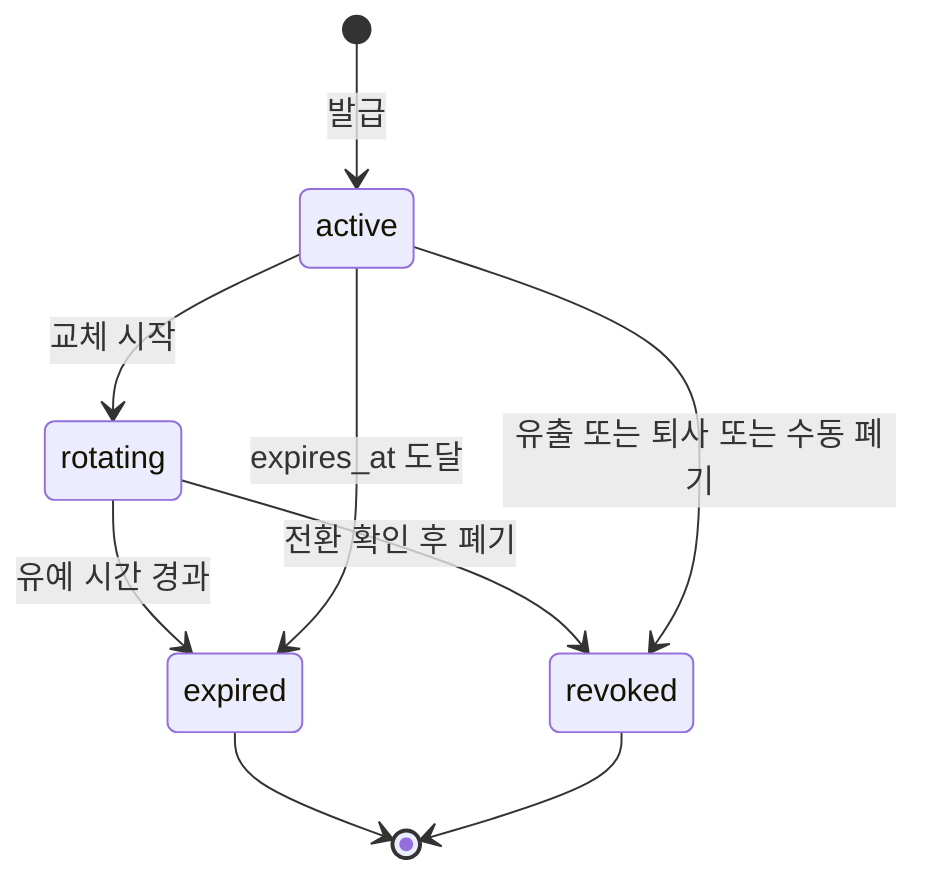
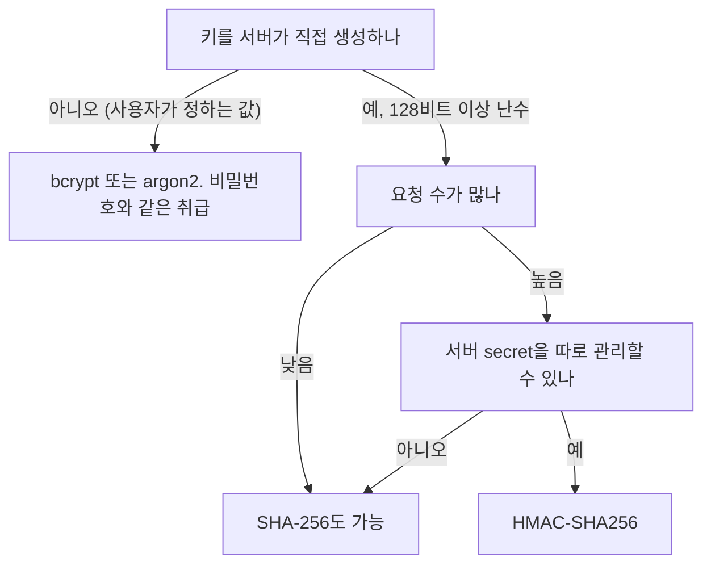
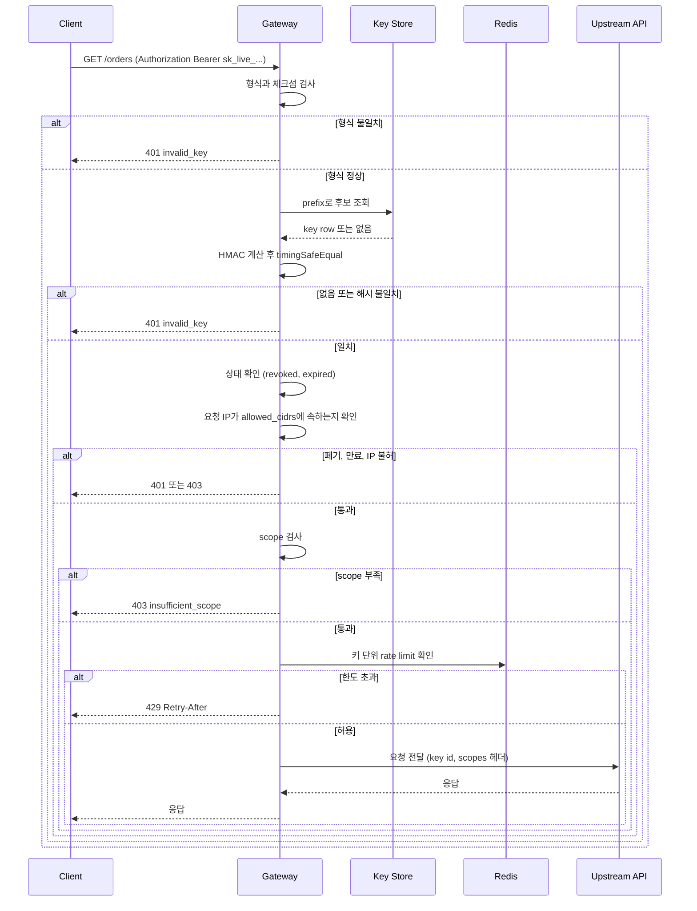
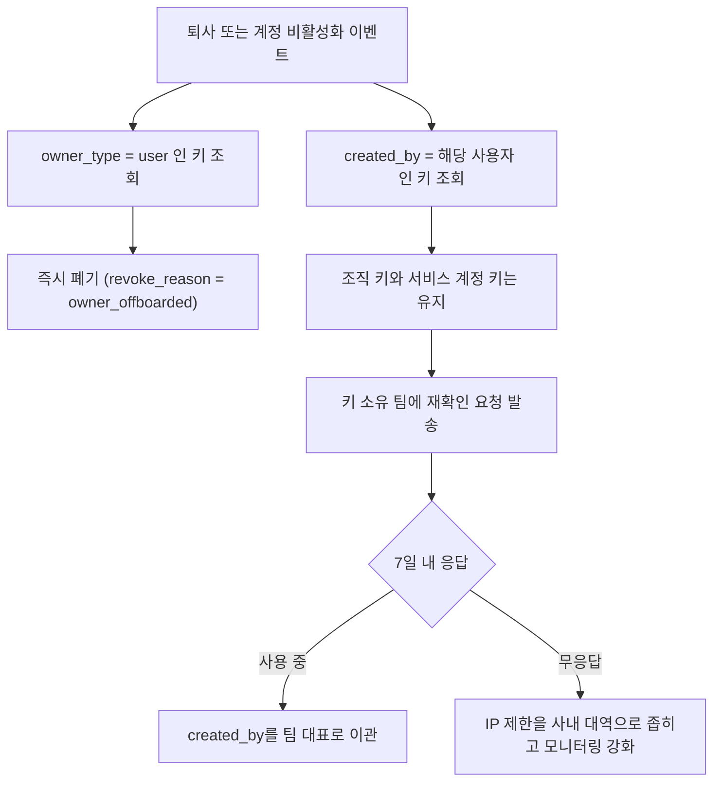
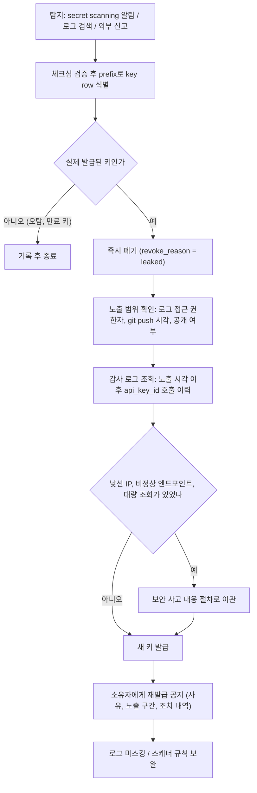

API 키는 사람이 아닌 클라이언트(서버, 봇, CLI 도구)를 식별할 때 쓴다. OAuth 토큰보다 단순하고 세션 기반보다 stateless하게 관리할 수 있어서 B2B API나 내부 서비스 간 통신에 여전히 많이 쓰인다.

이 문서는 키를 발급한 뒤의 운영을 다룬다. 포맷, 상태 전이, 소유 단위, 교체와 폐기, 유출 대응이 범위다. 해시 함수 선택, prefix 분리 조회, 스코프 검사 코드 같은 인증 구현은 [API Key 인증 구현](API_Key_Auth.md)에 있고, 여기서는 운영 판단에 필요한 만큼만 요약한다.

## 키 포맷 설계

키 문자열은 한 번 발급하면 고객 코드, CI 설정, 비밀 저장소에 퍼진다. 나중에 포맷을 바꾸려면 모든 키를 다시 발급해야 하니 처음에 정해야 한다. 아래 구조로 쓴다.

```
sk_live_L3W2zq5H{시크릿32자}11oEsn
```

54자 문자열 하나이고, 앞에서부터 `sk_`, `live_`, 공개 식별자 `L3W2zq5H`, 시크릿 32자, 체크섬 `11oEsn`이다.

| 구간 | 역할 | 운영에서 쓰는 곳 |
|---|---|---|
| `sk_` | 서비스 접두어 | 로그와 코드 검색에서 키를 grep으로 찾는다. 시크릿 스캐너 패턴의 앞부분이 된다 |
| `live_` / `test_` | 환경 구분자 | 운영 키가 테스트 환경 설정에 들어간 사고를 육안으로 잡는다. 게이트웨이에서 테스트 키를 운영 라우트로 보내지 않게 막는다 |
| 공개 식별자 8자 | DB 조회 키, 로그용 식별자 | 대시보드와 감사 로그에는 이 값만 표시한다 |
| 시크릿 32자 | 실제 비밀 | 해시해서 저장한다 |
| 체크섬 6자 | 형식 검증 | 오탈자를 DB 조회 전에 거른다. 스캐너 오탐을 줄인다 |

구분자로 `_`를 쓰고 본문은 base62만 쓴다. `base64url`은 본문에 `_`와 `-`가 들어가서 `_` 기준으로 split하면 가끔 구간이 어긋난다. 정규식으로 고정 길이를 자르는 쪽이 안전하다.

```javascript
import { randomInt } from 'crypto';
import { crc32 } from 'zlib'; // Node 20.15+ / 22.2+

const ALPHABET = '0123456789ABCDEFGHIJKLMNOPQRSTUVWXYZabcdefghijklmnopqrstuvwxyz';

function toBase62(n: number, width: number): string {
  let out = '';
  while (n > 0) { out = ALPHABET[n % 62] + out; n = Math.floor(n / 62); }
  return out.padStart(width, '0');
}

function randomBase62(len: number): string {
  let s = '';
  for (let i = 0; i < len; i++) s += ALPHABET[randomInt(62)];
  return s;
}

export function generateApiKey(env: 'live' | 'test') {
  const prefix = randomBase62(8);
  const body = `sk_${env}_${prefix}${randomBase62(32)}`;
  return { rawKey: body + toBase62(crc32(body), 6), prefix };
}

const KEY_RE = /^sk_(live|test)_([0-9A-Za-z]{8})([0-9A-Za-z]{32})([0-9A-Za-z]{6})$/;

export function parseApiKey(raw: string) {
  const m = KEY_RE.exec(raw);
  if (!m) return null;
  if (toBase62(crc32(raw.slice(0, -6)), 6) !== m[4]) return null;
  return { env: m[1] as 'live' | 'test', prefix: m[2] };
}
```

`randomInt(62)`는 범위 편향 없이 균등하게 뽑는다. `randomBytes`의 바이트를 `% 62`로 줄이면 앞쪽 문자가 약간 더 자주 나온다. 직접 돌려보니 키는 `sk_live_L3W2zq5H...` 형태로 54자가 나오고, 중간 한 글자를 바꾸면 `parseApiKey`가 null을 돌려준다. `crc32`는 암호학적 해시가 아니다. 위조 방지가 아니라 오타와 오탐을 거르는 용도이고, 인증은 여전히 HMAC 비교가 한다.

체크섬이 있으면 두 가지가 생긴다.

첫째, 게이트웨이가 형식이 틀린 키를 DB나 Redis에 묻기 전에 401로 돌려보낸다. 잘못된 키를 계속 보내는 클라이언트나 스캐닝 트래픽이 저장소 부하로 번지지 않는다. 복사 중에 한 글자가 빠진 고객도 "키 형식 오류"와 "폐기된 키"를 구분할 수 있다.

둘째, GitHub secret scanning 파트너 프로그램에 패턴을 등록할 수 있다. 정규식에 고정 접두어와 고정 길이가 있어야 오탐이 적고, 일치한 문자열을 받은 쪽이 체크섬으로 한 번 더 걸러서 실제로 발급된 형식인지 확인한다. 공개 저장소에 키가 push되면 GitHub이 등록된 수신 URL로 알려주고, 수신한 쪽이 해당 키를 즉시 폐기하는 구조다. 신청 절차와 수신 페이로드 형식은 GitHub 문서를 기준으로 정리한 것이고 직접 등록해 보지는 않았다. 파트너가 아니어도 조직의 custom pattern으로 같은 정규식을 private 저장소 스캔에 걸 수 있다.

## 키의 상태 전이

키는 `active`, `rotating`, `revoked`, `expired` 네 상태를 오간다. 상태 컬럼을 따로 두지 않고 `expires_at`, `revoked_at`, `replaced_by`에서 계산한다. 컬럼 하나가 다른 컬럼과 어긋나는 경우(`status = 'active'`인데 `revoked_at`이 채워진 행)를 만들지 않으려는 선택이다.



`rotating`은 신구 키가 동시에 유효한 구간이다. 새 키를 발급하면서 구 키에 `replaced_by`와 24시간 뒤 `expires_at`을 채우면 구 키가 이 상태가 된다. `revoked`는 되돌릴 수 없는 종단 상태로 취급한다. 폐기한 키를 "다시 켜는" 기능을 넣으면 유출 대응에서 폐기한 키가 누군가의 실수로 되살아난다.

테이블은 상태 계산과 이후 절의 기능에 필요한 컬럼을 모두 포함한다.

```sql
CREATE TABLE api_keys (
  id             BIGSERIAL PRIMARY KEY,
  prefix         CHAR(8)     NOT NULL,
  env            TEXT        NOT NULL CHECK (env IN ('live', 'test')),
  key_hash       CHAR(64)    NOT NULL,        -- HMAC-SHA256 hex
  owner_type     TEXT        NOT NULL CHECK (owner_type IN ('user', 'org', 'service_account')),
  owner_id       BIGINT      NOT NULL,
  created_by     BIGINT      NOT NULL,
  scopes         TEXT[]      NOT NULL DEFAULT '{}',
  allowed_cidrs  CIDR[]      NOT NULL DEFAULT '{}',  -- 빈 배열이면 제한 없음
  replaced_by    BIGINT      REFERENCES api_keys(id),
  last_used_at   TIMESTAMPTZ,
  created_at     TIMESTAMPTZ NOT NULL DEFAULT NOW(),
  expires_at     TIMESTAMPTZ,
  revoked_at     TIMESTAMPTZ,
  revoke_reason  TEXT
);

CREATE UNIQUE INDEX api_keys_prefix_uk ON api_keys (prefix);
CREATE INDEX api_keys_owner_idx ON api_keys (owner_type, owner_id) WHERE revoked_at IS NULL;

CREATE VIEW api_keys_with_state AS
SELECT *,
  CASE
    WHEN revoked_at IS NOT NULL                              THEN 'revoked'
    WHEN expires_at IS NOT NULL AND expires_at <= NOW()      THEN 'expired'
    WHEN replaced_by IS NOT NULL                             THEN 'rotating'
    ELSE 'active'
  END AS state
FROM api_keys;
```

`prefix`는 이제 유니크다. 8자리 base62면 약 47비트라 충돌이 거의 없지만 발급 시 유니크 위반이 나면 다시 뽑는다. 뷰의 `CASE` 순서가 중요하다. 폐기된 키가 `replaced_by`를 갖고 있어도 `revoked`가 먼저 걸려야 한다.

## 저장 방식 선택

키를 어떻게 해시해서 저장하는지는 [API Key 인증 구현](API_Key_Auth.md)이 코드로 다룬다. 운영 쪽에서 알아둘 차이만 정리한다.

| 방식 | 요청당 비용 | DB만 유출됐을 때 | 서버 secret | 운영에서 걸리는 점 |
|---|---|---|---|---|
| bcrypt | 수십 ms (cost에 비례) | 시크릿이 충분히 길면 역산 불가 | 불필요 | 수천 RPS에서 CPU가 먼저 한계에 닿는다. 인증 결과 캐시가 사실상 필수다 |
| SHA-256 | 수 마이크로초 | 시크릿이 충분히 길면 역산 불가 | 불필요 | 가장 단순하다. 짧거나 사람이 만든 키를 허용하면 바로 약점이 된다 |
| HMAC-SHA256 | 수 마이크로초 | 서버 secret 없이는 대조 자체가 불가 | 필요 | secret 로테이션 때 기존 해시를 전부 다시 계산할 수 없다 |



HMAC의 약점은 로테이션이다. 해시는 원문에서만 다시 계산할 수 있는데 원문은 서버에 없다. HMAC secret을 바꾸면 기존 키가 전부 인증에 실패한다. 그래서 `key_hash` 옆에 `hmac_version` 컬럼을 두고 검증 시 해당 버전의 secret으로 계산하게 한다. 새 secret은 새로 발급하는 키부터 쓰고, 이전 secret은 해당 버전 키가 모두 교체될 때까지 유지한다. 이 부분을 처음부터 넣지 않으면 secret이 유출됐을 때 모든 고객에게 키 재발급을 요청하는 수밖에 없다.

## 요청 검증 흐름

게이트웨이가 요청 하나를 처리하는 순서다. 앞 단계일수록 싸고 뒤 단계일수록 외부 저장소를 쓴다. 싼 검사로 먼저 거르는 것이 이 순서의 이유다.



세 가지를 정해 둔다.

401 응답 본문은 "없는 키", "해시 불일치", "폐기됨"을 구분하지 않는다. 구분해 주면 공격자가 prefix가 실제로 존재하는지 알아낸다. 정상 고객에게 필요한 구분은 서버 로그와 대시보드에서 키 소유자에게만 보여주면 된다. 체크섬 실패만 예외로 "형식 오류"를 알려줘도 된다. 체크섬은 발급 사실과 무관한 값이라 정보가 새지 않는다.

rate limit은 인증이 끝난 뒤에 키 단위로 건다. 인증 전 단계의 실패 요청은 키를 특정할 수 없으니 IP 단위로 별도 제한을 둔다. 둘을 하나로 합치면 한쪽 기준이 다른 쪽에 가려진다.

upstream에는 원문 키를 넘기지 않는다. 게이트웨이가 키 id와 스코프를 내부 헤더로 바꿔 전달하고, upstream 서비스는 이 헤더만 신뢰한다. 원문이 서비스 여러 개의 로그를 지나면 유출 경로가 늘어난다.

## 발급 직후 한 번만 보여주기

서버는 원문을 저장하지 않으니 재조회 기능을 만들 수 없다. 이게 UX 요구사항으로 바뀌면 곤란한 부분이 몇 개 생긴다.

발급 응답은 `Cache-Control: no-store`를 붙이고 본문에 `rawKey`를 한 번만 넣는다. 응답 로깅 미들웨어가 본문을 찍고 있으면 그 응답 한 건으로 비밀이 평문으로 로그에 남는다. 발급 엔드포인트는 응답 본문 로깅에서 제외해 둔다.

목록 화면에는 `sk_live_L3W2zq5H…` 같이 접두어, 공개 식별자, 마지막 사용 시각, 스코프만 보여준다. 사용자가 "키를 잃어버렸다"고 문의하면 방법은 새 키 발급과 구 키 폐기뿐이고, 이 흐름은 교체 절차와 같다. 지원 담당자도 키를 알려줄 수 없다는 점을 고객 문서에 미리 써 둔다.

발급 요청이 네트워크 문제로 응답을 못 받고 끝나면 서버에는 키가 생겼는데 고객은 값을 모른다. 같은 요청을 재시도해도 원문을 다시 줄 수 없으니 두 번째 키가 만들어진다. 이 중복을 막으려고 원문을 임시 저장하면 한 번만 보여준다는 원칙이 깨진다. 중복 발급을 허용하고, 발급 후 일정 기간 한 번도 쓰이지 않은 키를 뒤에서 설명하는 정리 배치가 지우게 한다.

## 소유 단위

키가 누구 것인지에 따라 폐기 조건이 달라진다. 소유자를 구분하지 않고 `user_id` 하나로 시작한 시스템은 퇴사자 처리에서 반드시 문제가 생긴다.

| 소유 단위 | 만드는 주체 | 폐기 조건 | 주 용도 |
|---|---|---|---|
| 사용자 키 | 개인 | 사용자 비활성화, 탈퇴 | 로컬 개발, 개인 스크립트 |
| 조직 키 | 조직 관리자 | 관리자가 폐기. 만든 사람이 퇴사해도 유지 | 고객사 시스템 연동 |
| 서비스 계정 키 | 팀 | 서비스 계정 삭제, 팀 해체 | 배치, CI/CD, 서버 간 호출 |

문제는 사용자 키를 운영 연동에 쓰는 경우다. 개발자가 자기 키로 운영 배치를 돌리다가 퇴사하면, 계정 비활성화 정책에 따라 키가 폐기되는 순간 새벽 정산 배치가 멈춘다. 반대로 키를 그대로 두면 퇴사자가 아직 유효한 키를 갖고 나간 셈이다. 운영 연동은 서비스 계정 키로만 발급하도록 막고, 사용자 키는 `test` 환경과 읽기 스코프로 제한하는 정책이 가장 단순하다.



사용자 키는 이벤트 시점에 즉시 폐기한다. 조직 키와 서비스 계정 키는 소유가 조직에 있으니 자동 폐기하지 않는다. 대신 `created_by`가 퇴사자인 키를 뽑아 소유 팀에 확인을 요청한다. 퇴사자가 만든 운영 키를 자동으로 끊으면 장애가 나고, 그냥 두면 방치된다. 그 사이를 메우는 것이 재확인 요청이다.

```sql
BEGIN;

UPDATE api_keys
SET revoked_at = NOW(), revoke_reason = 'owner_offboarded'
WHERE owner_type = 'user' AND owner_id = $1 AND revoked_at IS NULL;

SELECT id, prefix, owner_type, owner_id, last_used_at
FROM api_keys
WHERE created_by = $1 AND owner_type <> 'user' AND revoked_at IS NULL;

COMMIT;
```

두 번째 `SELECT` 결과는 폐기 대상이 아니라 확인 요청 대상이다. 이 쿼리를 오프보딩 배치에 넣지 않은 팀이 많고, 몇 달 뒤 감사에서 퇴사자 이름으로 만든 키가 살아 있는 것이 발견된다.

## 스코프

스코프 검사 코드와 와일드카드 처리는 [API Key 인증 구현](API_Key_Auth.md#scope-기반-권한)에 있다. 운영 단계에서 챙기는 부분은 발급 정책이다.

```
read:orders          주문 조회만
write:orders         주문 생성·수정
read:customers       고객 조회
admin:keys           키 발급·폐기 권한
```

와일드카드(`*`)는 내부 서비스끼리만 쓴다. 외부 클라이언트 키에 와일드카드를 주는 건 스코프를 안 쓰는 것과 같다.

`admin:keys` 스코프가 포함된 키는 별도 테이블로 분리하거나 발급 횟수를 극도로 제한한다. 이 스코프 키가 탈취되면 공격자가 새 키를 무한정 만들 수 있다. 권한 모델이 복잡해지면 키 스코프에 모든 규칙을 넣지 말고 [RBAC·ABAC](RBAC_ABAC.md)에서 다루는 역할 모델과 연결하는 쪽이 낫다.

## IP 허용 목록 바인딩

서버 간 호출 키는 호출하는 서버의 IP가 고정되어 있는 경우가 많다. 이런 키에 `allowed_cidrs`를 걸면 키가 유출돼도 허용 대역 밖에서는 쓸 수 없다. 키 하나만 탈취당한 상황에서 가장 싸게 피해를 줄이는 방법이다.

Node 기본 모듈의 `net.BlockList`로 CIDR 매칭을 한다. 별도 라이브러리가 필요 없다.

```javascript
import net from 'net';

function isAllowedIp(ip: string, cidrs: string[]): boolean {
  if (cidrs.length === 0) return true;

  const list = new net.BlockList();
  for (const cidr of cidrs) {
    const [addr, bits] = cidr.split('/');
    list.addSubnet(addr, Number(bits), net.isIPv6(addr) ? 'ipv6' : 'ipv4');
  }
  return list.check(ip, net.isIPv6(ip) ? 'ipv6' : 'ipv4');
}
```

직접 돌려보니 `203.0.113.0/24`를 등록했을 때 `203.0.113.7`은 통과하고 `198.51.100.1`은 막히며, `2001:db8::/32`는 `2001:db8::1`을 통과시킨다. IPv4-mapped 주소(`::ffff:203.0.113.7`)도 IPv4 대역으로 매칭됐다. 로드밸런서 뒤에서는 소켓의 원격 주소가 LB 주소이므로, 신뢰하는 프록시가 붙인 `X-Forwarded-For`의 맨 오른쪽에서 신뢰 홉 수만큼 건너뛴 값을 클라이언트 IP로 쓴다. 맨 왼쪽 값을 쓰면 요청자가 헤더를 위조해 허용 목록을 통과한다. 이 문제로 IP 제한이 있는 줄 알았던 키가 외부에서 쓰이는 사례가 흔하다.

매 요청마다 `BlockList`를 새로 만들면 낭비다. key row를 캐시할 때 `BlockList` 인스턴스를 같이 보관한다.

허용 목록을 기본값으로 비워 두면 대부분의 키가 제한 없이 나간다. 서비스 계정 키는 발급 시 CIDR을 필수 입력으로 하고, 사용자 키만 비어 있어도 되게 하는 편이 현실적이다. 고객사가 NAT 대역을 바꾸는 날 호출이 막히는 문제는 있다. 변경 절차를 문서에 적고, 임시로 대역을 추가할 수 있게 한다.

## 교체 절차

교체가 필요한 상황은 주기적 로테이션과 키 노출 사고 두 가지다. 노출 사고는 뒤의 절에서 따로 다룬다.

주기적 교체에서 기존 키를 바로 폐기하면 클라이언트 배포가 끝나기 전에 서비스가 끊긴다. 상태 전이의 `rotating` 구간이 이를 위한 것이다. 새 키를 발급하고 같은 트랜잭션에서 구 키에 유예 만료와 후속 키를 기록한다.

```sql
BEGIN;

-- $1 = 구 키 id, $2 = 새로 발급한 키 id
UPDATE api_keys
SET expires_at = NOW() + INTERVAL '24 hours', replaced_by = $2
WHERE id = $1 AND revoked_at IS NULL AND replaced_by IS NULL;

COMMIT;
```

`replaced_by IS NULL` 조건은 같은 키에 교체를 두 번 거는 요청을 막는다. 이미 `rotating`인 키에 다시 교체를 걸면 유예 시간이 계속 밀린다.

클라이언트가 새 키로 전환했는지는 `last_used_at`으로 판단한다. 구 키의 마지막 사용이 유예 시작 뒤로 한참 지났고 새 키 사용 기록이 있으면 전환된 것이다. 확인되면 만료를 기다리지 않고 폐기한다.

```sql
UPDATE api_keys SET revoked_at = NOW(), revoke_reason = 'rotated' WHERE id = $1;
```

행을 삭제하지 않고 `revoked_at`을 쓰는 이유는 감사 로그에 폐기 시점이 남아야 해서다. "이 키가 언제까지 유효했는가"는 나중에 보안 사고를 분석할 때 필요한 정보가 된다.

`last_used_at`을 요청마다 UPDATE하면 인기 키 한 행에 쓰기가 몰려 락 경합이 생긴다. 조건을 붙여 일정 간격으로만 갱신한다.

```sql
UPDATE api_keys
SET last_used_at = NOW()
WHERE id = $1 AND (last_used_at IS NULL OR last_used_at < NOW() - INTERVAL '10 minutes');
```

이 조건이면 같은 키로 초당 수천 건이 와도 10분에 한 번만 실제 쓰기가 일어난다. 정확한 마지막 호출 시각은 필요 없고 "최근에 썼는가"만 알면 되는 용도다.

## rate limiting 연동

rate limiting은 IP가 아니라 키 단위로 건다. IP 기반이면 NAT 뒤에 있는 정상 클라이언트들이 한도를 공유한다. Redis sliding window로 키 단위 한도를 관리한다.

```javascript
async function checkRateLimit(
  keyId: string,
  limit: number,
  windowSec: number
): Promise<{ allowed: boolean; remaining: number }> {
  const now = Date.now();
  const windowStart = now - windowSec * 1000;
  const redisKey = `rl:${keyId}`;

  const pipe = redis.pipeline();
  pipe.zremrangebyscore(redisKey, '-inf', windowStart);
  pipe.zadd(redisKey, now, `${now}-${Math.random()}`);
  pipe.zcard(redisKey);
  pipe.expire(redisKey, windowSec + 1);

  const results = await pipe.exec();
  const count = results[2][1] as number;

  return {
    allowed: count <= limit,
    remaining: Math.max(0, limit - count),
  };
}
```

이 구현은 한도를 넘은 요청도 `zadd`로 기록한다. 한도에 걸린 클라이언트가 계속 재시도하면 윈도우가 비지 않아서 영원히 429를 받는다. 재시도가 많은 고객에게서 "분당 한도를 지키는데도 막힌다"는 문의가 들어오면 이 부분부터 본다. 거부한 요청은 기록하지 않으려면 Lua 스크립트로 확인과 기록을 한 번에 처리해야 한다.

응답 헤더에 `X-RateLimit-Limit`, `X-RateLimit-Remaining`, `Retry-After`를 붙인다. 클라이언트가 재시도 타이밍을 모르면 바로 재시도해서 한도를 더 빨리 소진한다.

스코프별로 한도를 다르게 줄 수도 있다. 읽기 전용 키에 분당 10,000을 허용해도 쓰기 키는 분당 1,000으로 제한하는 식이다.

```javascript
const SCOPE_LIMITS: Record<string, number> = {
  'read:orders': 10_000,
  'write:orders': 1_000,
  'admin:keys': 100,
};

function getLimitForKey(scopes: string[]): number {
  const min = scopes.reduce((acc, scope) => {
    return Math.min(acc, SCOPE_LIMITS[scope] ?? 5_000);
  }, Infinity);
  return min === Infinity ? 5_000 : min;
}
```

## 휴면 키 정리

한 번도 쓰이지 않은 키, 반년째 호출이 없는 키는 공격 면적만 늘린다. 담당자가 바뀌면서 누구도 존재를 모르는 키가 가장 오래 살아남고, 유출 사고가 나면 그런 키가 먼저 쓰인다.

정리는 세 단계로 나눈다. 바로 폐기하지 않고 소유자에게 알린 뒤 유예를 둔다.

| 조건 | 조치 |
|---|---|
| 발급 후 7일 동안 한 번도 쓰이지 않음 | 소유자에게 알림. 14일이 더 지나면 폐기 (발급 응답을 못 받아 중복 발급된 키가 여기에 걸린다) |
| 마지막 사용 90일 전 | 소유자에게 "곧 폐기" 알림 |
| 알림 후 30일 동안 사용 없음 | 폐기. `revoke_reason = 'dormant'` |

```sql
-- 알림 대상
SELECT id, prefix, owner_type, owner_id
FROM api_keys
WHERE revoked_at IS NULL
  AND (expires_at IS NULL OR expires_at > NOW())
  AND COALESCE(last_used_at, created_at) < NOW() - INTERVAL '90 days'
  AND dormant_notified_at IS NULL;

-- 알림 후 30일 지난 키 폐기
UPDATE api_keys
SET revoked_at = NOW(), revoke_reason = 'dormant'
WHERE revoked_at IS NULL
  AND dormant_notified_at < NOW() - INTERVAL '30 days'
  AND COALESCE(last_used_at, created_at) < dormant_notified_at;
```

`dormant_notified_at` 컬럼은 위 DDL에 없다. 배치를 도입할 때 `ALTER TABLE api_keys ADD COLUMN dormant_notified_at TIMESTAMPTZ`로 추가한다. 마지막 조건 `last_used_at < dormant_notified_at`은 알림 뒤에 키를 다시 쓰기 시작한 경우를 지우지 않으려는 것이다. 이 조건이 없으면 알림 받은 고객이 키를 쓰기 시작했는데도 30일 뒤 폐기된다.

연 1회만 호출하는 정산 연동 같은 키가 있다. 90일 기준을 일괄 적용하면 이런 키가 폐기돼서 연말에 장애가 난다. 키 발급 시 "휴면 정리 제외" 플래그를 소유자가 요청할 수 있게 하고, 제외한 키는 만료일을 필수로 걸어 영구 키가 되지 않게 한다.

## 사용량 대시보드와 이상 징후

키별 사용량 화면은 고객에게도, 운영팀에게도 필요하다. 고객은 자기 키가 어디에 쓰이는지 확인하고, 운영팀은 키가 도용됐는지 판단한다. 집계 단위는 키 id, 시간대, 엔드포인트, 응답 코드다.

도용 징후 중 가장 잡기 쉬운 것은 평소 쓰지 않던 IP나 지역에서의 호출이다. 키마다 최근 30일간 관측한 국가(또는 ASN)를 Redis set으로 보관하고, 처음 보는 값이 나오면 알림을 보낸다.

```javascript
async function detectNewOrigin(keyId: string, ip: string): Promise<boolean> {
  const country = geoip.lookupCountry(ip); // MaxMind GeoLite2 DB
  if (!country) return false;

  const setKey = `seen:country:${keyId}`;
  const [size, added] = await Promise.all([
    redis.scard(setKey),
    redis.sadd(setKey, country),
  ]);
  await redis.expire(setKey, 30 * 24 * 3600);

  // 관측이 쌓이기 전에는 모든 값이 새 값이므로 알림을 보내지 않는다
  return added === 1 && size >= 3;
}
```

`scard`와 `sadd`를 병렬로 호출하므로 `size`는 추가 전 크기다. 관측값이 3개 미만인 신규 키는 학습 기간으로 보고 알림에서 뺀다. 이 기준이 없으면 발급 직후 키마다 알림이 나가서 곧 아무도 보지 않게 된다.

국가 단위 판정은 한계가 분명하다. 클라우드 NAT나 VPN 출구가 바뀌면 같은 고객 서버가 다른 국가로 잡힌다. 알림은 곧바로 폐기하지 않고 소유자에게 확인을 요청하고, 같은 키에서 새 국가 호출이 짧은 시간에 다른 신호(401 급증, 평소 안 쓰던 엔드포인트, 대량 조회)와 함께 나타날 때만 자동 정지로 올린다. 오탐 알림이 많아지면 소유자들이 무시하기 시작한다는 점은 사내 알림 채널을 운영해 본 사람이면 안다.

## 키가 로그에 찍혔을 때

가장 흔한 경로는 요청 전체를 로그에 찍는 미들웨어다. `Authorization: Bearer sk_live_...` 헤더가 access log에 그대로 들어간다. git에 `.env`를 커밋하거나 Slack에 붙여넣는 경우도 있다.

발견하는 즉시 교체를 기다리지 말고 해당 키를 먼저 폐기한다. 서비스 일부가 끊기더라도 폐기가 우선이다. 흐름은 탐지, 폐기, 영향 범위 조사, 재발급 공지 순서다.



폐기(D)는 탐지 후 몇 분 안에 끝나야 하는 단계다. 영향 범위 조사(E, F)는 몇 시간이 걸려도 폐기를 늦추는 이유가 되지 못한다. 순서를 거꾸로 해서 "누가 썼는지 보고 나서 폐기하자"고 하면 조사하는 동안 키가 계속 유효하다.

폐기는 prefix나 해시로 한다. 로그에서 원문이 나왔다면 그 값을 `hashApiKey`에 넣어 `key_hash`로 찾고, 공개 식별자만 알면 `prefix`로 찾는다.

```sql
UPDATE api_keys
SET revoked_at = NOW(), revoke_reason = 'leaked'
WHERE prefix = $1 AND revoked_at IS NULL;
```

저장소에 올라간 경우의 히스토리 정리, GitHub이 보관하는 캐시된 커밋, Push protection 설정은 [저장소에 시크릿을 커밋했을 때의 대응](../../Security/Git_Hub_Secret_Leak_Response.md)이 다룬다. 이 문서는 키 쪽(폐기, 영향 조사, 재발급)을 맡고, 그 문서는 git 쪽을 맡는다. 두 문서의 절차는 병렬로 진행한다.

git이라면 `git log --all --source`로 커밋 히스토리를 확인하고, 이미 GitHub에 올라갔다면 push 시각을 기록한다. GitHub secret scanning 알림이 오기를 기다리지 말고 직접 확인한다. 영향 조사에서는 access log에서 `api_key_id`로 필터링해 평소와 다른 IP, 비정상 엔드포인트 접근, 대량 조회가 있었는지 본다. 의심스러운 요청이 발견되면 보안 사고 대응 프로세스로 넘어간다.

재발급 공지에는 어느 키가 어느 시각부터 어느 시각까지 노출됐고 그 사이 의심 호출이 있었는지를 적는다. "보안상의 이유로 키를 폐기했다"는 한 줄만 보내면 고객은 자기 쪽 로그를 조사해야 하는지 판단하지 못한다.

로그 마스킹은 사후 대책이 아니라 미리 해두는 것이다.

```javascript
// morgan에서 Authorization 헤더 마스킹
morgan.token('masked-auth', (req) => {
  const auth = req.headers['authorization'];
  if (!auth) return '-';
  // 'Bearer sk_live_' + 공개 식별자까지만 남기고 나머지 마스킹
  return auth.slice(0, 23) + '****';
});
```

`Bearer sk_live_`가 15자, 공개 식별자 8자를 더해 23자까지만 남는다. 식별자는 비밀이 아니라서 로그에서 어떤 키인지 추적하는 데 쓴다. 로그 수집기에도 `sk_(live|test)_[0-9A-Za-z]{46}` 패턴 마스킹 규칙을 하나 더 둔다. 헤더가 아닌 곳(에러 메시지에 요청 본문이 통째로 들어간 경우, 예외 스택)으로 새는 키는 미들웨어 마스킹으로 못 막는다.

쿼리 파라미터로 API 키를 받는 설계는 피한다. URL은 프록시, CDN, 브라우저 히스토리에 전부 기록된다. 키는 헤더로만 받는다.
