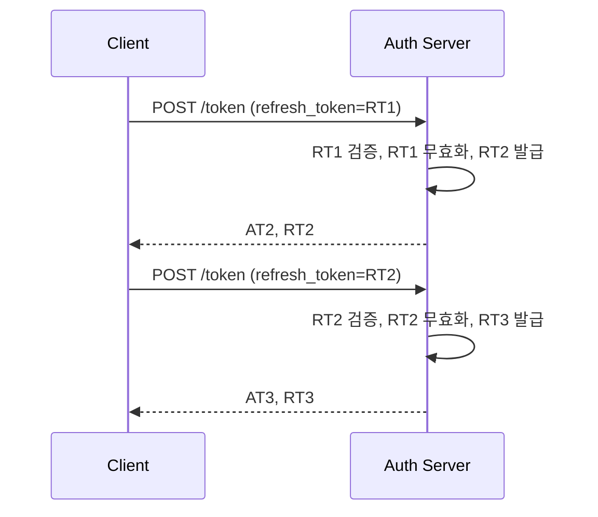

# 인증 전략 심화 - 보안 트레이드오프 관점

## 들어가며

`Authentication_Strategy.md`에서는 Session, JWT, OAuth2의 기본 동작과 장단점을 정리했다. 이 문서는 그 위에서 실제로 프로덕션에 올리려고 할 때 맞닥뜨리는 보안 트레이드오프를 다룬다.

경험상 인증 관련 사고는 두 가지 지점에서 터진다. 하나는 "JWT 쓰니까 stateless라서 안전하다"는 식의 잘못된 믿음, 다른 하나는 토큰 저장 위치를 깊게 고민하지 않고 localStorage에 넣어둔 프런트엔드 코드다. 둘 다 XSS 한 번이면 계정 탈취로 이어진다.

여기서는 네 가지 방식의 진짜 차이, 토큰을 어디에 둬야 안전한지, Refresh Token을 왜 회전시켜야 하는지, CSRF와 XSS를 어떻게 막는지, OIDC는 왜 OAuth2로 인증하면 안 되는 문제를 풀려고 나왔는지를 다룬다.

## Session vs JWT vs OAuth2 vs OIDC - 개념적 혼동 정리

이 네 개를 같은 축에 놓고 비교하면 안 된다. 애초에 범주가 다르다.

```
Session  : 인증 상태를 어디에 저장할지에 대한 선택 (서버 stateful)
JWT      : 클레임을 서명된 토큰으로 표현하는 포맷 (RFC 7519)
OAuth2   : 리소스 접근 권한을 위임받는 인가 프로토콜 (RFC 6749)
OIDC     : OAuth2 위에 얹힌 인증 레이어 (OpenID Connect)
```

Session은 저장 방식, JWT는 포맷, OAuth2는 인가 프로토콜, OIDC는 인증 프로토콜이다. 그래서 "JWT로 OAuth2를 구현한다"도 가능하고(Access Token을 JWT 포맷으로 발급), "Session 기반 OIDC 클라이언트"도 가능하다(BFF에서 ID Token 검증 후 서버 세션 생성).

### 왜 OIDC가 필요했나

OAuth2는 인가 프로토콜이다. 즉 "이 Access Token을 가진 자에게 /api/photos 접근 권한을 위임한다"가 본래 목적이다. 그런데 초기에 많은 서비스가 "Google OAuth로 로그인" 같은 용도로 OAuth2를 오용했다. 문제는 Access Token은 사용자 정보가 누구인지 증명하지 않는다는 것이다.

구체적으로 이런 공격이 가능했다:

```
1. 공격자 앱 A가 사용자 X로부터 Google OAuth로 Access Token을 받음
2. 공격자 앱 A가 정상 앱 B에 "내가 사용자 X다"라고 주장하며
   이 Access Token을 제출
3. 앱 B가 Google userinfo API에 Access Token으로 질의
4. Google은 "이 토큰은 사용자 X의 것"이라고 답함
5. 앱 B는 공격자 앱 A가 사용자 X라고 믿고 로그인 처리
```

이게 바로 Confused Deputy Problem이다. Access Token은 "누가 발급받았고 누구를 대상으로 하는지"를 검증할 수단이 약하다. 그래서 OIDC가 나왔다.

OIDC는 ID Token이라는 JWT를 추가한다. ID Token에는 `iss`(발급자), `sub`(사용자 ID), `aud`(토큰을 받을 대상 클라이언트), `nonce`(재생 공격 방지) 같은 클레임이 들어있고, 클라이언트는 이걸 검증해서 "이 토큰은 진짜로 우리 앱을 위해 발급된 것"임을 확인한다.

### 용도 분리가 핵심이다

```
ID Token     : 사용자가 누구인지 증명 (인증용)
               → 클라이언트가 검증하고 버림 또는 세션 생성용으로 사용
               → 리소스 서버에 보내면 안 됨
Access Token : 리소스 접근 권한 (인가용)
               → 리소스 서버가 검증
               → 사용자 정보 증명 용도로 쓰면 안 됨
Refresh Token: Access Token 갱신용
               → 인가 서버로만 전송, 절대 리소스 서버로 보내지 않음
```

이걸 섞어 쓰는 코드를 본 적 있다. ID Token을 그대로 API 호출에 사용하는 것인데, ID Token은 보통 수명이 길고(몇 시간~하루), `aud`가 클라이언트로 되어 있어서 리소스 서버 입장에서는 검증 기준이 애매하다. 꼭 용도를 분리해야 한다.

## 토큰 저장 위치별 트레이드오프

토큰을 프런트엔드 어디에 둘지가 보안의 절반이다. 각 위치마다 XSS와 CSRF 노출이 다르다.

### 저장 위치별 특성

| 위치 | XSS 노출 | CSRF 노출 | 새로고침 후 유지 | 서버 전송 방식 |
|------|---------|----------|----------------|---------------|
| JS 메모리 변수 | 스크립트 실행 시 탈취 | 없음(자동 전송 안 됨) | 사라짐 | `Authorization` 헤더 수동 |
| localStorage | `document` 접근 가능한 모든 스크립트가 탈취 | 없음 | 유지 | 수동 |
| sessionStorage | 동일 | 없음 | 탭 닫으면 사라짐 | 수동 |
| Cookie (일반) | JS로 접근 가능 → 탈취 | 있음(자동 전송) | 유지 | 자동 |
| Cookie (httpOnly) | JS 접근 불가 | 있음 | 유지 | 자동 |
| Cookie (httpOnly+Secure+SameSite) | JS 접근 불가 | SameSite에 따라 제한 | 유지 | 자동(동일 사이트) |
| BFF 세션 | 토큰이 브라우저에 없음 | 쿠키 기반이라 CSRF 대비 필요 | 유지 | 자동(동일 사이트) |

localStorage가 편하다고 토큰을 거기 넣는 코드는 지금도 흔하다. 그런데 XSS 한 번 터지면 공격자가 `localStorage.getItem('access_token')` 한 줄로 끝이다. "우리는 입력 sanitize 잘 하니까 XSS 안 터진다"는 믿음은 거의 항상 깨진다. 서드파티 스크립트 하나(예: 광고 SDK, 분석 도구)가 취약점을 갖고 있어도 동일 출처의 localStorage는 다 털린다.

### Cookie도 안전하지 않다 - 설정이 중요하다

쿠키에 토큰을 넣는 것 자체는 방향이 맞지만, 속성을 제대로 달지 않으면 의미 없다.

```
Set-Cookie: access_token=eyJ...;
  HttpOnly;           # JS에서 document.cookie로 읽을 수 없음
  Secure;             # HTTPS에서만 전송
  SameSite=Strict;    # 크로스 사이트 요청에서 전송 안 됨
  Path=/;
  Max-Age=900;        # 15분
```

`HttpOnly`만 붙어 있고 `Secure`가 없으면 중간자 공격에서 털린다. `SameSite=None`이면 CSRF에 그대로 노출된다. 셋 다 있어야 의미가 있다.

### BFF 패턴 - 토큰을 브라우저에 두지 않는다

가장 안전한 방향은 브라우저에 토큰을 아예 안 두는 것이다. Backend for Frontend(BFF) 패턴이다.

```
[SPA/Browser] ──쿠키(session_id)──▶ [BFF 서버] ──Access Token──▶ [API 서버]
                                        │
                                    세션 스토어
                                    (Access Token 보관)
```

브라우저는 BFF의 세션 쿠키만 가진다. 실제 Access Token, Refresh Token은 BFF 서버가 보관한다. XSS가 터져도 공격자가 훔쳐갈 수 있는 건 BFF 세션 쿠키인데, 이건 `HttpOnly`라 JS로 접근도 안 된다.

다만 트레이드오프가 있다. BFF를 유지해야 하고, 네이티브 모바일 앱에서는 이 패턴이 맞지 않는다. MSA에서 BFF를 두면 또 하나의 서비스 레이어가 늘어난다. 그래서 보통은 웹 클라이언트만 BFF를 쓰고 모바일은 짧은 수명의 토큰 + Refresh Rotation으로 간다.

### 실전 권장 조합

```
브라우저 SPA
  → BFF 세션 (httpOnly 쿠키)
  → 안 되면: Access Token은 JS 메모리 + Refresh Token은 httpOnly 쿠키

모바일 네이티브
  → Access Token: 메모리 또는 Keychain/Keystore
  → Refresh Token: Keychain/Keystore
  → 짧은 수명 + Rotation

서버-서버 (M2M)
  → Client Credentials Flow
  → 토큰은 메모리 캐시, 만료 직전 갱신
```

## Refresh Token Rotation과 재사용 감지

Refresh Token이 털리면 공격자가 무한히 Access Token을 갱신할 수 있다. 그래서 OAuth2.1부터는 Public Client(SPA, 모바일)는 Refresh Token Rotation이 사실상 필수다.

### Rotation이란

Refresh Token을 쓸 때마다 새 Refresh Token으로 교체한다. 즉 `POST /token`에 `grant_type=refresh_token&refresh_token=RT1`을 보내면, 응답에 새 Access Token + 새 Refresh Token RT2가 오고, RT1은 그 순간 무효화된다.



Rotation만으로는 부족하다. 공격자가 RT1을 훔쳤는데 정상 클라이언트보다 먼저 사용했다면, 공격자는 RT2를 얻고 정상 클라이언트가 RT1을 쓰려고 하면 실패한다. 정상 사용자는 로그아웃되지만 공격자는 RT2로 계속 살아남는다.

### 재사용 감지 (Reuse Detection)

핵심은 "이미 사용된 Refresh Token이 다시 들어오면 세션 전체를 죽인다"는 규칙이다.

```
RT1 → 사용 → RT2 발급 (RT1은 USED 상태로 기록)
이후 RT1이 다시 들어오면 → 재사용 감지 → 이 세션의 모든 토큰 체인 폐기
```

구현하려면 Refresh Token마다 식별자(jti 또는 토큰 해시)와 사용 상태를 저장해야 한다. 보통 세션 단위로 토큰 패밀리를 묶고, 재사용이 감지되면 패밀리 전체를 폐기한다.

```java
@Service
public class RefreshTokenService {

    private final RefreshTokenRepository repo;
    private final TokenFamilyRepository familyRepo;

    @Transactional
    public TokenPair rotate(String presentedToken) {
        RefreshToken current = repo.findByTokenHash(hash(presentedToken))
            .orElseThrow(() -> new InvalidTokenException("unknown token"));

        if (current.getStatus() == Status.USED) {
            // 재사용 감지 - 패밀리 전체 폐기
            familyRepo.revokeFamily(current.getFamilyId());
            throw new SecurityException("refresh token reuse detected");
        }

        if (current.getStatus() == Status.REVOKED) {
            throw new InvalidTokenException("revoked");
        }

        if (current.getExpiresAt().isBefore(Instant.now())) {
            throw new InvalidTokenException("expired");
        }

        // 현재 토큰을 USED로 마킹
        current.setStatus(Status.USED);
        repo.save(current);

        // 새 토큰 발급 (같은 패밀리)
        String newRefresh = generateToken();
        RefreshToken next = RefreshToken.builder()
            .tokenHash(hash(newRefresh))
            .familyId(current.getFamilyId())
            .userId(current.getUserId())
            .status(Status.ACTIVE)
            .expiresAt(Instant.now().plus(Duration.ofDays(30)))
            .build();
        repo.save(next);

        String newAccess = issueAccessToken(current.getUserId());
        return new TokenPair(newAccess, newRefresh);
    }
}
```

토큰 자체는 DB에 저장하지 말고 해시(SHA-256)만 저장해야 한다. DB가 털려도 토큰은 복원 불가여야 한다.

### Grace Period 문제

Rotation + 재사용 감지를 순진하게 구현하면 네트워크 재시도 때문에 정상 사용자가 자꾸 로그아웃되는 경우가 생긴다. 예를 들어 모바일에서 Refresh 요청이 나갔는데 응답이 유실되고 클라이언트가 재시도하면, 서버 입장에서는 두 번째 요청이 들어온 RT를 이미 USED로 본다.

해결 방법은 짧은 grace period다. 토큰을 USED로 전환한 직후 몇 초 정도는 같은 응답(이전에 발급한 새 토큰)을 돌려주는 식이다. 다만 이 로직이 공격자에게도 틈을 주기 때문에 윈도우를 짧게(5초 이내) 잡아야 한다.

## CSRF 방어 - 4가지 메커니즘 비교

CSRF는 "피해자의 브라우저가 자동으로 달고 보내는 인증 정보"를 노리는 공격이다. 쿠키 기반 인증이면 모두 고려 대상이다. JWT를 `Authorization` 헤더로만 보내면 CSRF 자체가 성립하지 않지만, 쿠키에 넣는 순간 CSRF 방어가 필수다.

### 1. SameSite Cookie

가장 먼저 적용해야 할 기본 방어선이다.

```
SameSite=Strict  : 크로스 사이트 요청에서 쿠키 전송 안 됨
                  → 외부 링크로 들어와도 쿠키가 안 붙어서 UX 불편
SameSite=Lax     : Top-level navigation의 GET만 허용
                  → 대부분의 서비스에 적합한 기본값
SameSite=None    : 크로스 사이트에서도 전송 (Secure 필수)
                  → 서드파티 위젯, OIDC iframe 등 필요할 때
```

Chrome은 기본값이 `Lax`다. 대부분의 CSRF는 `Lax`만으로도 막힌다. 다만 `Lax`는 GET 요청 중 일부를 허용하므로, 중요한 상태 변경은 반드시 POST로 해야 한다. GET으로 돈을 이체하는 API가 있다면 `SameSite=Lax`만으로는 부족하다.

### 2. Synchronizer Token Pattern

서버가 세션마다 고유한 CSRF 토큰을 생성해서 폼에 심고, 요청이 들어오면 서버가 세션의 토큰과 비교한다.

```
1. 서버: 세션 생성 시 CSRF 토큰 생성, 세션에 저장
2. 서버: HTML 폼에 hidden 필드로 토큰 포함
3. 클라이언트: 폼 제출 시 토큰 함께 전송
4. 서버: 폼 토큰 == 세션 토큰 검증
```

Spring Security, Django, Rails가 기본으로 쓰는 방식이다. 서버가 세션을 유지해야 하므로 stateful 세션 기반 앱에 적합하다.

### 3. Double Submit Cookie

서버가 세션 상태를 유지하지 않아도 되는 방식이다. 토큰을 쿠키와 헤더 양쪽에 넣고, 서버는 둘이 일치하는지만 본다.

```
1. 서버: CSRF 토큰 생성 → Set-Cookie: csrf_token=abc (HttpOnly 아님)
2. 클라이언트 JS: 쿠키에서 csrf_token 읽어서 X-CSRF-Token 헤더에 넣음
3. 서버: 쿠키의 csrf_token == 헤더의 X-CSRF-Token 검증
```

공격자 사이트는 피해자의 쿠키를 읽을 수 없으므로(Same-Origin Policy), 헤더에 토큰을 심을 수 없다. 서버 상태가 필요 없으니 SPA + Stateless API에서 자주 쓴다.

주의할 점은 토큰 쿠키는 `HttpOnly`가 아니어야 한다는 것(JS가 읽어야 하니까). 그래서 XSS에 토큰이 노출된다. 대신 토큰을 HMAC으로 서명하고 세션 ID를 포함시켜서, 공격자가 임의로 토큰을 만들어낼 수 없게 한다.

### 4. Origin/Referer 검사

`Origin` 헤더는 브라우저가 자동으로 붙이고 JS로 변조할 수 없다. 서버에서 `Origin`이 허용된 도메인인지 확인하면 CSRF를 막을 수 있다.

```java
public boolean isValidOrigin(HttpServletRequest req) {
    String origin = req.getHeader("Origin");
    if (origin == null) {
        origin = req.getHeader("Referer");
    }
    return origin != null && allowedOrigins.contains(extractOrigin(origin));
}
```

간단하지만 한계가 있다. 일부 구형 브라우저나 특정 요청(파일 업로드 등)에서 `Origin`이 빠질 수 있고, `Referer`는 프라이버시 설정에 따라 전송되지 않기도 한다. 그래서 Origin 검사는 보통 다른 방식과 함께 쓴다.

### 조합 권장

```
세션 기반 전통 웹앱     : Synchronizer Token + SameSite=Lax
Stateless API + SPA    : Double Submit + SameSite=Lax + Origin 검사
JWT in Authorization 헤더: CSRF 방어 불필요 (쿠키 안 씀)
BFF 패턴               : Synchronizer Token + SameSite=Lax + Origin 검사
```

## XSS 방어와 토큰 보호

CSRF는 쿠키를 노리고, XSS는 DOM/JS 전체를 장악한다. XSS가 터지면 어떤 토큰 저장 방식이든 위험하다. 다만 피해를 줄일 수는 있다.

### CSP (Content Security Policy)

XSS가 실행되려면 공격자의 스크립트가 로드되거나 인라인으로 실행되어야 한다. CSP로 이를 차단한다.

```
Content-Security-Policy:
  default-src 'self';
  script-src 'self' https://cdn.trusted.com 'nonce-{RANDOM}';
  style-src 'self' 'unsafe-inline';
  img-src 'self' data:;
  connect-src 'self' https://api.example.com;
  frame-ancestors 'none';
  object-src 'none';
```

`nonce` 기반 스크립트 허용이 중요하다. 인라인 스크립트를 허용하려면 `'unsafe-inline'` 대신 서버가 렌더링 시 `nonce="xyz"`를 붙이고, 정상 스크립트에도 같은 nonce를 달아서 매칭되는 것만 실행되도록 해야 한다.

`'unsafe-inline'`을 script-src에 넣어두면 XSS 방어가 무력화된다. 레거시 코드 때문에 어쩔 수 없이 넣은 경우도 많이 봤는데, 이건 CSP를 쓰는 의미가 거의 없어진다.

### Trusted Types

CSP 위에 얹는 브라우저 API다. `innerHTML`, `document.write` 같이 DOM에 임의 HTML을 주입하는 싱크로 들어가는 값은 반드시 `TrustedHTML` 객체여야 한다.

```javascript
// Trusted Types 정책 정의
const policy = trustedTypes.createPolicy('my-policy', {
    createHTML: (input) => DOMPurify.sanitize(input)
});

// 이제 innerHTML에는 이 정책을 거친 값만 들어갈 수 있음
element.innerHTML = policy.createHTML(userInput);

// 문자열을 바로 넣으면 브라우저가 막음
element.innerHTML = userInput;  // TypeError
```

CSP 헤더에 `require-trusted-types-for 'script'`를 추가하면 강제된다. 한 번의 실수로 XSS가 뚫리는 걸 브라우저 레벨에서 차단한다는 점이 크다.

### 짧은 수명 + Rotation

XSS가 뚫려서 토큰이 탈취됐다고 가정하자. 피해를 줄이려면 토큰 수명이 짧아야 한다.

```
Access Token  : 5~15분
Refresh Token : 14~30일 (Rotation + 재사용 감지)
Session (BFF) : 30분~2시간 idle timeout
```

Access Token을 5분으로 잡으면 공격자가 훔친 토큰은 길어야 5분 쓸 수 있다. Refresh Token은 Rotation + 재사용 감지 덕분에, 정상 클라이언트와 공격자 중 한쪽이 재사용을 일으키는 순간 세션이 폐기된다.

### Subresource Integrity

CDN에서 로드하는 외부 스크립트가 변조되면 XSS가 된다. SRI로 해시를 검증한다.

```html
<script
  src="https://cdn.example.com/lib.js"
  integrity="sha384-oqVuAfXRKap7fdgcCY5uykM6+R9GqQ8K/..."
  crossorigin="anonymous"></script>
```

해시가 안 맞으면 브라우저가 스크립트 실행을 거부한다. 광고 SDK나 분석 도구처럼 수시로 바뀌는 스크립트에는 SRI를 걸기 어렵다는 현실적 문제가 있지만, 최소한 고정 라이브러리에는 적용해야 한다.

## Silent Refresh vs BFF 패턴

Access Token이 만료됐을 때 어떻게 갱신할지가 실제 프런트엔드 구현의 핵심이다.

### Silent Refresh (인증 서버 iframe)

OIDC 세션이 인가 서버에 남아있다면, 숨겨진 iframe으로 `prompt=none`을 태워서 사용자 개입 없이 새 토큰을 받는다.

```
[SPA] ──iframe: /authorize?prompt=none──▶ [Auth Server]
                                             │ 세션 쿠키로 사용자 확인
       ◀──redirect_uri?code=...──────────────┘
       → 새 Access Token 획득
```

이 방식은 Third-party Cookie가 필수다. 그런데 Safari의 ITP, Chrome의 Third-party Cookie Phase-out 때문에 점점 동작하지 않는 환경이 늘고 있다. 2024년 이후로 Silent Refresh는 사실상 권장되지 않는다.

### Refresh Token in httpOnly Cookie

Refresh Token을 인가 서버 도메인에 `httpOnly` 쿠키로 저장하고, SPA는 Access Token만 메모리에 둔다. Access Token이 만료되면 SPA가 인가 서버로 `/token` 요청을 보내고, 브라우저가 자동으로 Refresh 쿠키를 붙여 보낸다.

```
[SPA] ──fetch /token──▶ [Auth Server]
  └ 메모리에 AT        브라우저가 Refresh Cookie 자동 첨부
                       Rotation + 재사용 감지
       ◀─ new AT + Set-Cookie: new RT ─┘
```

SPA 도메인과 인가 서버 도메인이 다르면 Cross-Origin이 되므로 CORS + `credentials: 'include'` + `SameSite=None; Secure` 조합이 필요하다. 이건 또 CSRF 노출이 생기므로 CSRF 방어가 필요해진다.

### BFF 패턴

앞서 설명한 대로, 토큰을 브라우저에 아예 두지 않는다.

```
[SPA] ──세션 쿠키──▶ [BFF]
                      └ Access Token, Refresh Token 보관
                      └ 만료 시 자동 Rotation
                   ──Access Token──▶ [Resource API]
```

장점:
- XSS로 토큰이 탈취될 여지 자체가 없음
- Silent Refresh 같은 브라우저 정책 변화에 영향 안 받음
- Third-party Cookie 정책과 무관

단점:
- BFF 인프라 유지 비용
- 네이티브 앱에는 맞지 않음
- BFF와 SPA 사이에 CSRF 방어 필요

### 실전에서는 어떻게 쓰나

최근 신규 프로젝트라면 웹은 BFF로 가는 게 기본 흐름이다. OAuth2.1 초안, OWASP, Auth0의 권장 방식 모두 BFF다. 레거시 시스템이라 BFF를 도입하기 어렵다면 Refresh Token in httpOnly Cookie + Rotation + 재사용 감지 조합으로 간다.

## 실제 사고 케이스

### 케이스 1: localStorage + 긴 JWT

한 서비스에서 Access Token을 localStorage에 넣고 만료 시간을 7일로 잡은 적이 있었다. 편의성 때문이었는데, 서드파티 분석 스크립트에 취약점이 있어서 XSS가 발생했고, 공격자가 대량의 토큰을 수집했다. 당시에는 블랙리스트를 운영하지 않아서 토큰을 무효화할 방법이 없었고, 결국 서명 키를 교체해서 모든 사용자를 로그아웃시켰다.

교훈:
- 토큰은 짧게 (15분 이내)
- localStorage에는 민감한 토큰 금지
- JWT라도 무효화 경로(블랙리스트, 키 로테이션)는 준비

### 케이스 2: Rotation 없이 긴 Refresh Token

Access Token은 15분으로 짧게 잡았는데 Refresh Token은 90일에 Rotation 없이 운영했다. 한 사용자의 디바이스가 도난당했고, 공격자가 Refresh Token을 탈취했다. 사용자가 비밀번호를 바꿔도 Refresh Token은 유효한 상태였고, 세션 강제 종료 기능이 없어서 한동안 계정이 털린 채로 있었다.

교훈:
- Refresh Token은 반드시 Rotation + 재사용 감지
- 비밀번호 변경 시 모든 Refresh Token 폐기
- 사용자 대시보드에 "모든 세션 종료" 기능 제공

### 케이스 3: ID Token을 API 호출에 사용

OIDC로 로그인을 구현하면서 ID Token을 그대로 API 호출에 사용한 코드가 있었다. ID Token의 `aud`는 클라이언트 ID여서, 리소스 서버가 `aud`를 엄격히 검증하지 않고 서명만 확인했다. 이 경우 ID Token 탈취 한 번으로 장기간 API 접근이 가능했다(ID Token 수명이 1시간).

교훈:
- ID Token은 로그인 시 한 번 쓰고 버린다 (또는 세션 생성용으로만)
- API 접근에는 Access Token만 사용
- 리소스 서버는 `aud`, `iss`, `exp`를 모두 검증

## 정리

인증 방식을 선택할 때는 "어떤 공격 표면을 받아들일 것인가"를 먼저 정해야 한다. Stateless JWT는 서버 간 공유가 편하지만 즉시 무효화가 어렵고, Session은 즉시 무효화가 쉽지만 스케일 아웃에 신경 써야 한다. OAuth2/OIDC는 외부 인증 위임이 목적이지 내부 인증 전부를 대체하는 게 아니다.

토큰을 어디 두느냐가 실제 보안의 절반 이상을 결정한다. 웹이라면 BFF가 정답에 가깝고, 차선책은 Access Token 메모리 + Refresh Token httpOnly 쿠키다. localStorage에 넣는 건 XSS 한 번에 끝난다.

Refresh Token은 반드시 Rotation + 재사용 감지가 있어야 한다. Rotation만으로는 탈취 이후 정상 사용자가 로그아웃되는 것으로 끝나고, 공격자는 계속 살아남는다.

CSRF와 XSS는 독립적인 공격이다. `SameSite=Lax` + Double Submit 또는 Synchronizer Token으로 CSRF를, CSP + Trusted Types + 짧은 토큰 수명으로 XSS 피해를 최소화한다. 어느 하나라도 빠지면 뚫린다.

## 참고

- RFC 6749 - OAuth 2.0 Authorization Framework
- RFC 7519 - JSON Web Token
- OpenID Connect Core 1.0
- OAuth 2.0 for Browser-Based Apps (draft, BFF 권장)
- OWASP Cheat Sheet - Session Management, CSRF Prevention, XSS Prevention
- OWASP ASVS v4 - V3 Session Management, V13 API
