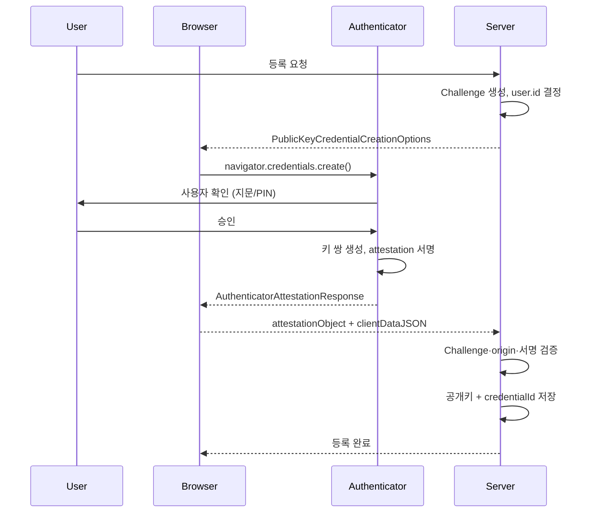
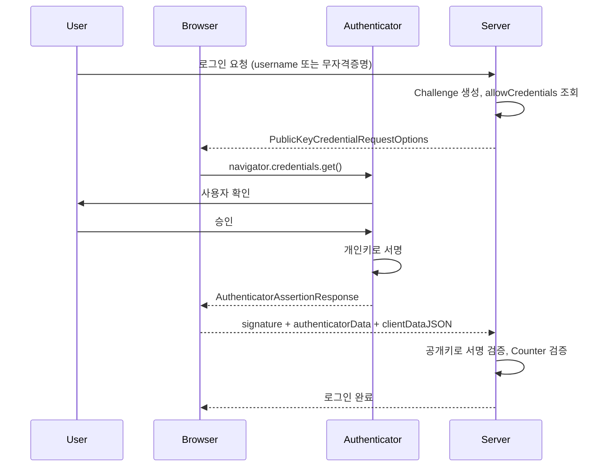
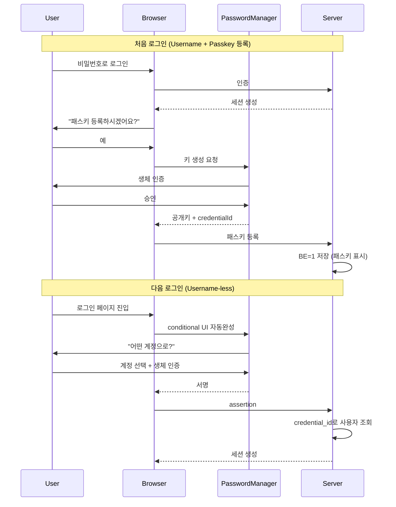

# 다중 인증과 패스키

## 시작하기 전에

비밀번호 하나만 믿고 인증하는 시대는 끝났다. 어떤 사이트에서 비밀번호가 털리면 같은 비밀번호를 쓰는 다른 사이트가 줄줄이 뚫린다. 크리덴셜 스터핑(credential stuffing) 공격이 그래서 끊이지 않는다. 그래서 두 번째 요소를 요구하는 다중 인증(MFA, Multi-Factor Authentication)이 사실상 표준이 됐다.

MFA의 인증 요소는 세 가지로 분류한다. 알고 있는 것(knowledge, 비밀번호), 가지고 있는 것(possession, 휴대폰·하드웨어 키), 자기 자신(inherence, 지문·얼굴). 각 카테고리에서 다른 요소를 조합하면 멀티팩터다. 비밀번호 두 개는 두 단계지만 멀티팩터가 아니다. 카테고리가 같아서 그렇다.

요즘은 이런 분류 자체를 흐리는 방향으로 인증이 진화했다. 패스키(Passkey)가 그것이다. 비밀번호도 OTP도 없이 디바이스에 잠긴 키 하나로 끝낸다. 5년 전과 비교하면 인증 설계가 완전히 다른 세계로 넘어왔다. 이 문서는 TOTP부터 패스키까지 백엔드 입장에서 어떻게 설계하고 검증하는지 정리한다.

## TOTP (Time-Based One-Time Password)

### 동작 원리 (RFC 6238)

TOTP는 RFC 6238에 정의된 시간 기반 OTP 알고리즘이다. 서버와 클라이언트(보통 Google Authenticator 같은 앱)가 비밀 키(shared secret)를 공유하고, 현재 시간을 기준으로 같은 코드를 독립적으로 계산한다. 서버가 코드를 전송하지 않기 때문에 네트워크 가로채기로 코드를 훔칠 수 없다.

계산 식은 RFC 4226의 HOTP를 기반으로 한다.

```
T = floor((현재 Unix time - T0) / X)
TOTP = HOTP(K, T)
HOTP(K, T) = Truncate(HMAC-SHA1(K, T))
```

`K`는 공유 비밀 키, `T0`는 보통 0(1970-01-01 UTC), `X`는 시간 단계로 보통 30초다. 30초마다 `T`가 1씩 증가하면서 새 코드가 생성된다. HMAC-SHA1을 돌리고 마지막 4비트로 시작 위치를 골라 4바이트를 추출한 뒤 10^6으로 나눈 나머지가 6자리 코드가 된다.

알고리즘은 SHA1뿐만 아니라 SHA256, SHA512도 지원한다. 하지만 Google Authenticator를 비롯한 대부분 클라이언트는 SHA1만 제대로 지원한다. RFC가 SHA256/512를 허용해도 실제로는 SHA1이 호환성 측면에서 안전한 선택이다. 보안 강도가 충분하다고 본 이유는, OTP는 30초만 유효하므로 SHA1의 충돌 공격이 의미가 없어서다.

### QR 코드 발급과 otpauth URI

사용자에게 비밀 키를 직접 입력하라고 하면 실수가 잦다. 그래서 `otpauth://` URI를 QR 코드로 만들어서 앱이 스캔하게 한다. URI 포맷은 Google이 사실상 표준으로 정착시켰다.

```
otpauth://totp/MyService:user@example.com?secret=JBSWY3DPEHPK3PXP&issuer=MyService&algorithm=SHA1&digits=6&period=30
```

`secret`은 base32로 인코딩한 공유 키다. base32를 쓰는 이유는 QR 인식 오류를 줄이고 사용자가 수동 입력할 때 헷갈리지 않도록 하기 위해서다(0/O, 1/I 같은 글자가 없다). 키 길이는 RFC 권장이 160비트(SHA1 출력 길이)지만, 128비트도 보안상 충분하다. 128비트 미만은 쓰지 마라.

```java
// Spring Boot에서 TOTP secret 생성과 QR URI
import org.apache.commons.codec.binary.Base32;
import java.security.SecureRandom;
import java.net.URLEncoder;
import java.nio.charset.StandardCharsets;

public class TotpRegistration {

    public TotpSetup createSecret(String userId, String issuer) {
        byte[] secretBytes = new byte[20]; // 160 bits
        new SecureRandom().nextBytes(secretBytes);
        String base32Secret = new Base32().encodeToString(secretBytes)
                .replace("=", ""); // padding 제거 권장

        String label = URLEncoder.encode(issuer + ":" + userId, StandardCharsets.UTF_8);
        String otpauthUri = String.format(
                "otpauth://totp/%s?secret=%s&issuer=%s&algorithm=SHA1&digits=6&period=30",
                label, base32Secret,
                URLEncoder.encode(issuer, StandardCharsets.UTF_8));

        return new TotpSetup(base32Secret, otpauthUri);
    }
}
```

QR 이미지는 클라이언트에서 그리거나 서버가 PNG로 만들어서 내려준다. ZXing 같은 라이브러리로 한 줄이면 된다. 단, QR 이미지를 외부 서비스(api.qrserver.com 같은 곳)에 위임하면 비밀 키가 외부로 새 나가니까 절대 그렇게 하지 마라. 실제로 그렇게 만들어진 서비스를 본 적이 있다.

### 검증 시 시간 동기화 문제

TOTP에서 가장 자주 만나는 문제가 시계 어긋남이다. 사용자 휴대폰 시계가 서버보다 30초 이상 앞서거나 뒤처져 있으면 코드가 안 맞는다. 이걸 해결하려고 시간 윈도(time skew)를 둔다. 보통 ±1 step(±30초) 정도를 허용한다.

```java
public boolean verify(String base32Secret, String userCode) {
    long currentStep = Instant.now().getEpochSecond() / 30;
    // 현재 step과 ±1 범위를 비교
    for (int offset = -1; offset <= 1; offset++) {
        String candidate = generateCode(base32Secret, currentStep + offset);
        if (constantTimeEquals(candidate, userCode)) {
            return true;
        }
    }
    return false;
}
```

문자열 비교는 반드시 상수 시간(`MessageDigest.isEqual` 또는 `constantTimeEquals` 직접 구현)으로 해야 한다. 안 그러면 타이밍 공격으로 한 자리씩 코드를 추측할 수 있다. 이론적인 공격 같지만, OTP 검증은 호출이 빈번해서 실측 가능한 영역이다.

윈도를 너무 넓게(예: ±5 step) 잡으면 보안이 약해진다. 코드가 동시에 유효한 시간이 길어지니까 무차별 시도가 쉬워진다. ±1이 표준이고 정 안되면 ±2까지만 허용하자. 대신 사용자에게 "휴대폰 시간 동기화를 켜라"고 안내하는 편이 낫다.

### Replay 방지

TOTP는 30초 동안 같은 코드가 유효하기 때문에 Replay 공격이 가능하다. 한 번 쓴 코드를 누가 가로채서 그 30초 안에 다시 쓰면 통과한다. 이걸 막으려면 사용한 step 번호를 저장해 두고 같은 step의 재사용을 거부한다.

```sql
CREATE TABLE totp_used_steps (
    user_id BIGINT NOT NULL,
    used_step BIGINT NOT NULL,
    used_at TIMESTAMP NOT NULL,
    PRIMARY KEY (user_id, used_step)
);
```

검증 성공 시 `used_step`을 INSERT한다. UNIQUE 제약으로 충돌하면 재사용이다. 오래된 row는 주기적으로 cleanup한다(예: 1분 이상 지난 step). Redis의 SET NX EX로도 같은 효과를 낼 수 있다.

### 백업 코드

휴대폰을 잃어버리거나 OTP 앱을 실수로 지우면 사용자가 영영 로그인 못 한다. 그래서 등록 시 일회용 백업 코드 8~10개를 발급한다. 사용자는 이걸 출력하거나 비밀번호 매니저에 저장한다.

백업 코드는 비밀번호와 같은 수준으로 보호해야 한다. DB에는 평문으로 저장하지 말고 해시(bcrypt나 argon2)해서 저장한다. 비교는 사용자가 입력한 코드를 같은 함수로 해시해서 매칭한다. 한 번 쓰면 즉시 무효화하고 새 코드를 발급한다.

```java
public class BackupCodeService {
    private static final int CODE_COUNT = 10;
    private static final int CODE_LENGTH = 10;

    public List<String> generate(Long userId) {
        SecureRandom random = new SecureRandom();
        List<String> plaintextCodes = new ArrayList<>();
        List<String> hashedCodes = new ArrayList<>();

        for (int i = 0; i < CODE_COUNT; i++) {
            String code = randomAlphanumeric(random, CODE_LENGTH);
            plaintextCodes.add(code);
            hashedCodes.add(BCrypt.hashpw(code, BCrypt.gensalt(12)));
        }
        // hashedCodes만 DB 저장, plaintextCodes는 사용자에게 한 번만 보여줌
        backupCodeRepo.saveAll(userId, hashedCodes);
        return plaintextCodes;
    }
}
```

생성된 평문은 DB에 절대 저장하지 말고 사용자에게 한 번만 보여준다. "복사하지 않으면 다시 볼 수 없다"고 명시해야 한다. 그렇게 안 하면 사용자가 캡처를 안 하고 닫아버린 뒤 항의가 들어온다.

## SMS OTP의 보안 한계

SMS OTP는 가장 흔하지만 가장 약한 MFA다. 안 쓸 수 있으면 안 쓰는 게 좋다.

### SIM Swap 공격

가장 유명한 공격이 SIM 스왑이다. 공격자가 통신사 고객센터에 피해자인 척 전화해서 "휴대폰을 잃어버렸으니 새 SIM으로 번호를 옮겨달라"고 요청한다. 통신사 직원이 본인 확인을 부실하게 하면 번호가 공격자 SIM으로 넘어간다. 이후 SMS OTP는 전부 공격자에게 간다. 비밀번호는 이미 다른 곳에서 유출됐으니 로그인 끝이다.

이 공격으로 트위터 CEO 계정이 털린 적도 있고, 가상화폐 거래소에서 수억 원이 빠져나간 사례도 잦다. 미국에서는 통신사를 상대로 한 집단 소송이 진행 중이다. 통신사 보안 절차에 100% 의존하는 인증이라는 게 SMS OTP의 본질적 한계다.

### SS7 공격과 메시지 가로채기

SS7(Signaling System 7)은 통신사 간 통신 신호를 주고받는 프로토콜이다. SS7은 1970년대 설계로 인증 개념이 거의 없다. 통신사 인프라에 접근 권한만 있으면 임의 번호의 SMS를 가로채거나 통화를 도청할 수 있다. 동유럽이나 일부 국가의 통신사를 통해 실제로 이뤄지는 공격이다. 일반인이 당하기는 어렵지만, 표적 공격(targeted attack)에서는 자주 보고된다.

### 결론

NIST는 SP 800-63B에서 SMS OTP를 "RESTRICTED" 등급으로 낮췄다. 완전히 금지는 아니지만 권장하지 않는다는 뜻이다. 새로 인증을 설계한다면 SMS는 마지막 fallback 정도로만 두자. 1차 권장은 TOTP 앱, 더 위로는 WebAuthn/패스키다.

## WebAuthn과 FIDO2

### 무엇이 다른가

WebAuthn(Web Authentication)은 W3C 표준이고, FIDO2는 WebAuthn + CTAP2(Client to Authenticator Protocol)를 묶은 FIDO Alliance의 프레임워크다. 백엔드 입장에서는 거의 같은 의미로 본다. 핵심은 공개키 암호 기반이라는 점이다.

기존 비밀번호와 OTP는 사용자와 서버가 같은 비밀(공유 시크릿)을 갖고 있다. 서버가 털리면 비밀이 새 나간다. WebAuthn은 사용자(정확히는 사용자의 디바이스)가 개인키를, 서버는 공개키만 저장한다. 서버 DB가 통째로 털려도 공격자는 공개키만 얻는다. 공개키로는 인증이 안 된다.

또 하나 결정적인 차이는 피싱 내성이다. WebAuthn은 인증 응답에 origin(요청한 사이트의 도메인)이 들어간다. 사용자가 `gooogle.com`(피싱 사이트)에 키를 등록한 적이 없으면 어떤 키도 응답을 만들지 못한다. 비밀번호처럼 사용자가 잘못 입력해서 새 나갈 일이 없다.

### Authenticator의 종류

WebAuthn에서 키를 보관하고 서명을 만드는 주체를 Authenticator라고 한다. 두 종류다.

플랫폼 Authenticator는 디바이스에 내장된 것이다. 맥북의 Touch ID, 윈도우의 Windows Hello, 안드로이드의 지문 센서, 아이폰의 Face ID가 여기에 해당한다. 사용자가 추가 디바이스를 들고 다닐 필요가 없다.

로밍(Roaming) Authenticator는 외부 디바이스다. YubiKey, SoloKey 같은 USB/NFC 보안 키가 대표적이다. 여러 디바이스에서 같은 키를 쓸 수 있다는 장점이 있고, 디바이스 자체가 잠겨 있어서 OS가 털려도 안전하다.

### 등록 플로우 (Registration / Attestation)

등록은 사용자가 처음 키를 만들어서 서버에 공개키를 저장하는 과정이다.



서버가 Challenge를 만들 때 주의할 점이 몇 가지 있다. Challenge는 충분히 큰 무작위 값이어야 한다(최소 16바이트, 권장 32바이트). 한 번 쓰면 무효화한다. TTL은 짧게(1~5분). 메모리나 Redis에 임시 저장하고 검증 후 즉시 삭제한다.

`user.id`는 사용자의 영구 식별자다. 여기서 함정 하나. 이 값은 base64url로 인코딩한 바이트 배열이고, 사용자에게 보이면 안 된다(이메일이나 username이 아니다). UUID 같은 내부 ID를 바이트로 변환해서 쓰자. 등록 시 `user.id`가 이미 다른 키를 갖고 있으면 추가 등록(또 하나의 디바이스 추가)으로 처리된다.

`pubKeyCredParams`로 어떤 알고리즘의 키를 받을지 정한다. ES256(-7, ECDSA P-256/SHA-256), RS256(-257, RSA/SHA-256)이 가장 호환성이 좋다. EdDSA(-8)도 모던 디바이스에서 지원한다. ES256만 받아도 대부분 디바이스가 동작하는데, 일부 윈도우 헬로 환경은 RS256만 만들어주는 경우가 있어서 두 개 다 받아두는 게 안전하다.

### 인증 플로우 (Authentication / Assertion)

등록된 사용자가 로그인할 때는 Assertion을 받는다.



서명 검증은 `authenticatorData || SHA256(clientDataJSON)`을 메시지로, 등록 시 저장한 공개키로 ECDSA/RSA 검증을 하면 된다. 검증 자체는 라이브러리가 다 해주니까 손으로 짤 일은 거의 없다.

### RP ID와 origin 검증

이 부분이 WebAuthn에서 가장 자주 실수하는 지점이다.

RP(Relying Party) ID는 키가 묶여 있는 도메인이다. 보통 호스트네임을 그대로 쓰지만 등록 가능한 상위 도메인까지만 가능하다. `login.example.com`에서 등록하면 RP ID로 `login.example.com` 또는 `example.com`을 쓸 수 있지만, `com`이나 `other.com`은 안 된다. RP ID를 `example.com`으로 잡으면 `login.example.com`, `app.example.com` 어디서든 같은 키가 쓸 수 있다. 서브도메인 여러 개에 걸친 SSO를 만들 때 자주 활용한다.

origin은 인증 요청이 발생한 사이트의 전체 origin(scheme + host + port)이다. 예를 들면 `https://app.example.com` 같은 값이다. 검증 시 서버는 `clientDataJSON.origin`이 자기가 허용하는 origin 목록에 포함되는지 확인한다.

```java
public void verifyOrigin(String clientDataJsonOrigin) {
    Set<String> allowedOrigins = Set.of(
            "https://app.example.com",
            "https://login.example.com");
    if (!allowedOrigins.contains(clientDataJsonOrigin)) {
        throw new SecurityException("Origin mismatch: " + clientDataJsonOrigin);
    }
}
```

여기서 자주 실수하는 게 `https://example.com`과 `https://example.com:443`을 다르게 비교하는 경우다. 표준 포트는 명시하지 않는 게 원칙이다. 또 staging/production 환경별로 origin 리스트를 분리해야 한다. 한 번에 다 받지 마라.

### Counter (Sign Count) 검증

Authenticator는 인증할 때마다 카운터를 1씩 올려서 서명 데이터에 포함시킨다. 서버는 이전에 저장한 카운터보다 새 값이 커야만 통과시킨다. 같거나 작으면 키가 복제됐을 가능성을 의심한다. 하드웨어 키를 누가 복사해서 쓰면 두 디바이스의 카운터가 어긋나면서 한 쪽이 거부된다.

```java
if (newSignCount != 0 && newSignCount <= storedSignCount) {
    throw new SecurityException("Possible cloned authenticator");
}
storedSignCount = newSignCount; // 검증 성공 시 갱신
```

다만 패스키(아래에서 다룬다) 시대에는 카운터가 항상 0으로 오는 경우가 많다. 키가 클라우드에 동기화되니까 더 이상 단일 디바이스의 단조 증가 카운터를 유지할 수 없어서다. `newSignCount == 0 && storedSignCount == 0`이면 정상 케이스로 받아들이는 분기를 두자. 이거 안 해두면 패스키 사용자가 두 번째 로그인부터 막힌다.

### Attestation은 어디까지 검증해야 하나

등록 시 Authenticator가 자기 자신이 어떤 디바이스인지 증명하는 데이터를 attestation이라고 한다. 형식은 `none`, `packed`, `tpm`, `android-key`, `apple` 등 여러 가지다.

일반 서비스에서는 `none`(증명 없음)을 받는 게 보통이다. 사용자가 어떤 디바이스를 쓰든 상관없으니까. 금융이나 정부 시스템처럼 "FIPS 140-2 인증 디바이스만 허용"같은 요구가 있을 때만 attestation을 강하게 검증한다. 이때는 FIDO Metadata Service(MDS)에서 디바이스의 신원 정보를 받아와서 매칭한다.

attestation을 검증할 때 prod에서 한 번 사고 친 적이 있는데, attestation 형식을 너무 좁게 잡아서 특정 안드로이드 디바이스 사용자가 등록을 못 하는 경우가 생겼다. 일반 서비스라면 `none`이 정답이다.

## 패스키 (Passkey)

### 기존 WebAuthn과 무엇이 다른가

패스키는 WebAuthn의 사용 패턴 중 하나다. 별도의 표준이 아니다. 차이점은 "키가 디바이스에 묶이느냐, 클라우드로 동기화되느냐"다.

전통적인 WebAuthn은 키가 한 디바이스에 갇혀 있었다. YubiKey를 잃어버리면 그 키로 등록한 모든 사이트에 접근 못 한다. 그래서 백업 키를 같이 등록하라고 안내했다. 사용자 입장에서 번거롭다.

패스키는 Apple iCloud Keychain, Google Password Manager, 1Password, Bitwarden 같은 패스워드 매니저가 키를 클라우드에 동기화한다. 아이폰에서 만든 패스키가 맥북에서도, 새로 산 아이폰에서도 그대로 쓰인다. 사용자가 디바이스를 잃어버려도 다른 디바이스에 동기화돼 있으니까 복구가 쉽다. 비밀번호를 대체할 만한 사용성에 도달한 셈이다.

기술적으로는 `authenticatorSelection.residentKey`와 `authenticatorAttachment` 옵션 조합으로 패스키 동작을 유도한다. 등록 응답의 `flags`에 BE(Backup Eligibility)와 BS(Backup State) 비트가 있다. BE=1이면 동기화 가능한 자격증명, BS=1이면 실제로 동기화된 상태다. 이걸 보면 "이 키는 패스키구나"를 백엔드가 판단할 수 있다.

### Resident Key (Discoverable Credential)

WebAuthn 키에는 두 종류가 있다.

비-resident 키(server-side credential)는 credentialId를 서버가 갖고 있어야 인증할 수 있다. 사용자가 username을 입력하면 서버가 해당 username의 credentialId 목록을 반환하고, 그 중 하나로 서명한다. 등록된 키 정보는 Authenticator에 저장되지 않고 서버 측 데이터에서 복원되는 형태다.

resident 키(discoverable credential)는 Authenticator 자체에 키와 함께 사용자 정보(`user.id`, `user.name`)가 저장된다. 사용자는 username을 입력할 필요도 없다. 로그인 페이지에 "패스키로 로그인" 버튼만 누르면 디바이스가 "어떤 계정으로 들어가시겠어요?"를 보여주고 끝낸다. 이걸 username-less 또는 usernameless 인증이라고 부른다.

패스키는 거의 항상 resident 키로 만든다. `residentKey: "required"` 또는 `"preferred"`로 옵션을 잡는다. 이러면 사용자 경험이 비밀번호 + OTP 조합과 비교가 안 될 정도로 매끄러워진다.

### 백엔드 설계가 바뀌는 점

패스키를 도입하면 백엔드 데이터 모델이 약간 바뀐다.

```sql
CREATE TABLE webauthn_credentials (
    id BIGSERIAL PRIMARY KEY,
    user_id BIGINT NOT NULL REFERENCES users(id),
    credential_id BYTEA NOT NULL UNIQUE,  -- base64url 디코드한 raw bytes
    public_key BYTEA NOT NULL,             -- COSE 형식 또는 PEM
    sign_count BIGINT NOT NULL DEFAULT 0,
    transports TEXT[],                     -- 'internal', 'usb', 'nfc', 'ble', 'hybrid'
    backup_eligible BOOLEAN NOT NULL,
    backup_state BOOLEAN NOT NULL,
    aaguid UUID,                           -- Authenticator 모델 식별자
    created_at TIMESTAMP NOT NULL,
    last_used_at TIMESTAMP
);

CREATE INDEX idx_credential_id ON webauthn_credentials(credential_id);
```

`backup_eligible`과 `backup_state` 컬럼이 핵심이다. BE=1이면 패스키, BE=0이면 단일 디바이스 키(YubiKey 같은 것). UI에서 "이 키는 클라우드에 백업됨"이라고 표시할 때 활용한다. 또 BE=1인 패스키 하나만 있으면 디바이스 분실 위험이 낮아 보안 정책을 약간 다르게 가져갈 수 있다.

`transports`는 `navigator.credentials.get()` 호출 시 `allowCredentials.transports` 옵션으로 다시 넘겨주는 게 좋다. 안 넘기면 브라우저가 USB/NFC를 다 검색하느라 인증이 느려진다.

`sign_count`는 위에서 말한 대로 패스키에서는 항상 0으로 올 수 있다. BE=1이면 카운터 검증을 건너뛰는 방식이 안전하다.

### 사용자 플로우



`navigator.credentials.get({mediation: "conditional"})`을 쓰면 username 입력 필드에 포커스가 갈 때 자동으로 사용 가능한 패스키가 뜬다. 사용자가 입력 필드에 손도 안 대고 패스키 한 번에 로그인이 끝난다. 진짜로 비밀번호가 필요 없는 시대가 가능해진 이유다.

## Spring Security 6.4+ WebAuthn 모듈

Spring Security가 6.4부터 WebAuthn을 정식 지원한다. 그 전에는 yubico의 `webauthn-server-core`를 직접 통합해야 했는데, 이제 framework가 보일러플레이트를 거의 다 처리해 준다.

```kotlin
@Configuration
@EnableWebSecurity
class SecurityConfig {

    @Bean
    fun securityFilterChain(http: HttpSecurity): SecurityFilterChain {
        http
            .formLogin { }
            .webAuthn { webAuthn ->
                webAuthn
                    .rpName("My Service")
                    .rpId("example.com")
                    .allowedOrigins("https://example.com", "https://app.example.com")
            }
        return http.build()
    }

    @Bean
    fun userCredentialRepository(): UserCredentialRepository {
        return JdbcUserCredentialRepository(jdbcTemplate)
    }
}
```

`UserCredentialRepository`가 자격증명 저장소 인터페이스다. JDBC 기반 구현체가 기본 제공되고, 커스텀 저장소를 만들고 싶으면 인터페이스 5개 메서드만 구현하면 된다.

엔드포인트는 자동으로 노출된다.
- `POST /webauthn/register/options`: 등록용 challenge 발급
- `POST /webauthn/register`: 등록 완료
- `POST /webauthn/authenticate/options`: 인증용 challenge 발급
- `POST /login/webauthn`: 인증 완료

비밀번호 로그인과 패스키 로그인을 함께 두는 일반적인 케이스는 이걸로 충분하다. 다만 conditional UI나 패스키 전용 단순 흐름을 원하면 컨트롤러를 직접 만들고 `WebAuthnRelyingPartyOperations`를 주입받아서 처리하는 편이 깔끔하다.

## SimpleWebAuthn (Node.js)

Node 진영에서는 SimpleWebAuthn이 사실상 표준이다. yubico WebAuthn-server-java의 노드 버전이라고 보면 된다.

```typescript
import {
  generateRegistrationOptions,
  verifyRegistrationResponse,
  generateAuthenticationOptions,
  verifyAuthenticationResponse,
} from '@simplewebauthn/server';

const rpName = 'My Service';
const rpID = 'example.com';
const origin = `https://${rpID}`;

// 등록 옵션 발급
app.post('/webauthn/register/options', async (req, res) => {
  const user = req.user;
  const userCredentials = await db.findCredentials(user.id);

  const options = await generateRegistrationOptions({
    rpName,
    rpID,
    userID: Buffer.from(user.id),
    userName: user.email,
    attestationType: 'none',
    excludeCredentials: userCredentials.map(c => ({
      id: c.credentialId,
      transports: c.transports,
    })),
    authenticatorSelection: {
      residentKey: 'preferred',
      userVerification: 'preferred',
    },
  });

  await redis.setex(`challenge:${user.id}`, 300, options.challenge);
  res.json(options);
});

// 등록 검증
app.post('/webauthn/register', async (req, res) => {
  const user = req.user;
  const expectedChallenge = await redis.get(`challenge:${user.id}`);

  const verification = await verifyRegistrationResponse({
    response: req.body,
    expectedChallenge,
    expectedOrigin: origin,
    expectedRPID: rpID,
  });

  if (!verification.verified) {
    return res.status(400).json({ error: 'verification failed' });
  }

  const { credentialID, credentialPublicKey, counter } = verification.registrationInfo;
  await db.saveCredential({
    userId: user.id,
    credentialId: credentialID,
    publicKey: credentialPublicKey,
    signCount: counter,
    backupEligible: verification.registrationInfo.credentialBackedUp,
  });

  await redis.del(`challenge:${user.id}`);
  res.json({ verified: true });
});
```

라이브러리가 challenge 검증, origin 검증, 서명 검증, attestation 검증까지 다 해 준다. 우리가 할 일은 challenge 저장/조회와 자격증명 영속화뿐이다.

`expectedOrigin`을 배열로 넘길 수 있어서 multi-domain 서비스도 쉽게 처리한다. `expectedRPID`도 배열로 가능해서 마이그레이션 중에 두 RP ID를 동시에 받아주는 식으로 쓸 수 있다.

## 운영하면서 만난 이슈

### Challenge 저장소 선택

challenge는 등록/인증 한 사이클 동안만 살아 있으면 된다. DB에 넣을 필요는 없다. Redis에 TTL 5분짜리 키로 저장하는 게 표준이다. 단일 노드 인메모리 맵은 절대 쓰지 마라. Auto-scaling 환경에서 challenge 발급 노드와 검증 노드가 다를 수 있어서 100% 깨진다. 한 번 그 함정에 빠진 적이 있다.

### user.id를 이메일로 쓰면 안 되는 이유

`user.id`는 프라이버시 식별자가 아니다. 등록 시 한 번 결정하면 평생 바꾸지 못하는 내부 ID다. 이메일을 `user.id`로 넣어버리면 사용자가 이메일을 바꿔도 키는 옛 이메일에 묶여 있다. 더 나쁜 건 일부 Authenticator가 `user.id`를 사용자에게 노출시키는 경우가 있다는 점이다(클라우드 동기화 패스키 관리 화면 등). 이메일은 변경되거나 노출되면 곤란한 정보다. UUID나 숫자 ID 같은 의미 없는 식별자를 써라.

### 패스키 추가 등록 시 충돌

같은 디바이스에서 같은 사이트에 두 번 등록을 시도하면 보통 `InvalidStateError`가 떨어진다. 이걸 막으려고 `excludeCredentials`에 이미 등록된 credentialId를 다 넘긴다. 사용자가 이미 등록된 키를 또 등록하려고 하면 브라우저가 "이미 등록됐다"고 알려준다. 이거 안 넣으면 사용자가 같은 키를 중복 등록해서 DB에 row가 두 개 생기는 사고가 난다.

### 패스키와 어카운트 복구

패스키 하나로 모든 게 끝났다고 좋아하면 안 된다. 사용자가 패스워드 매니저 자체를 잃을 수 있다(예: 애플 계정을 잠금당함). 그래서 어카운트 복구 경로를 따로 마련해야 한다. 일반적으로는 이메일 기반 복구 + 백업 코드 + 다른 디바이스의 패스키 조합으로 처리한다. 단일 인증 수단에만 의존하지 말고 적어도 두 가지 복구 경로를 두자.

### 모바일 브라우저에서 origin 미스매치

iOS Safari에서 같은 사이트를 PWA로 추가해서 쓰면 origin이 살짝 달라지는 경우가 있다. 안드로이드에서 Trusted Web Activity로 쓸 때도 `android:apk-key-hash:`로 시작하는 origin이 들어온다. 모바일을 지원할 거면 origin 화이트리스트를 모바일 케이스까지 포함해서 짜야 한다. 안 그러면 사용자는 "웹에서는 되는데 앱에서는 안 된다"고 항의한다.

### MFA 우회 경로 점검

MFA를 도입했는데 비밀번호 재설정 흐름이 MFA를 거치지 않으면 우회된다. 실제로 비밀번호 재설정 시 이메일 링크만 클릭하면 비밀번호를 바꿀 수 있고, 그 후 MFA가 다시 활성화되지 않는 식의 결함을 본 적이 있다. 비밀번호 재설정, 이메일 변경, 등록된 키 삭제 같은 민감한 액션은 모두 MFA 재인증을 강제해야 한다.
