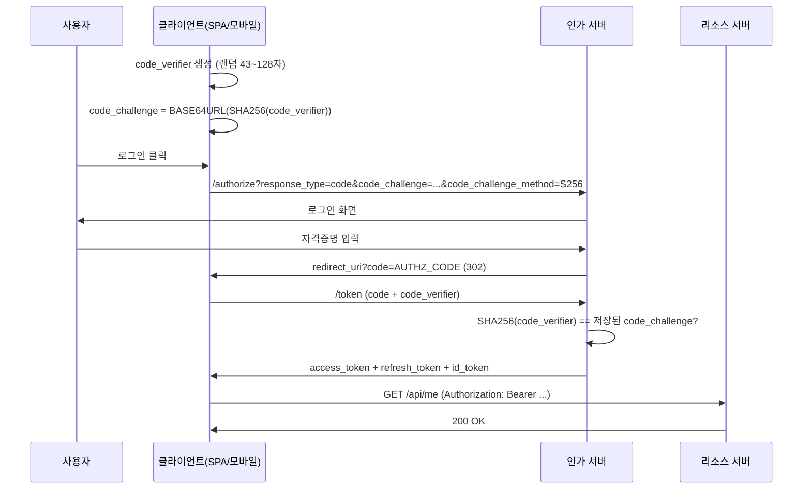
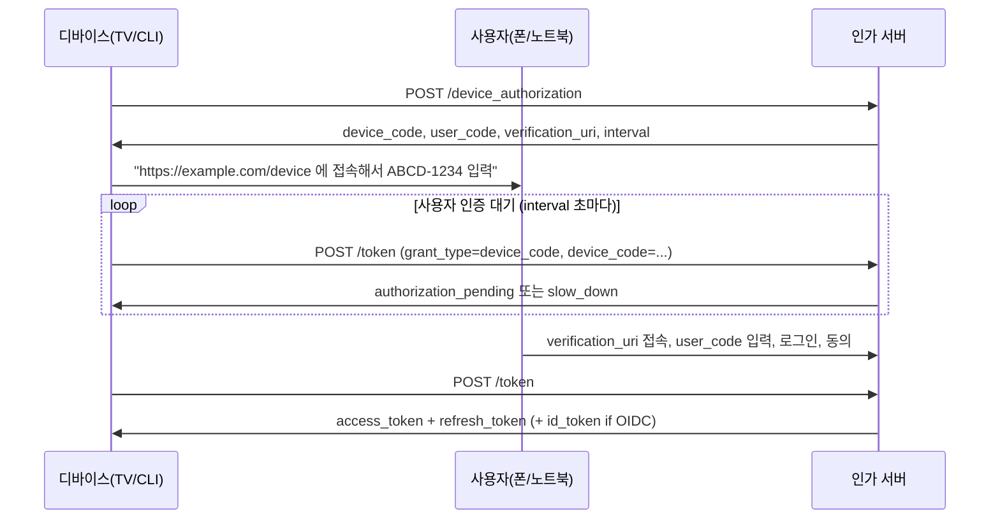

# OAuth 2.0 / OIDC Flow 종류별 심화 구현

## 들어가며

`Auth_Strategy_Deep_Dive.md`에서는 OAuth2와 OIDC가 왜 분리됐는지, ID Token과 Access Token을 왜 섞어 쓰면 안 되는지를 다뤘다. 이 문서는 그 다음 단계 - 실제로 어떤 Flow를 골라야 하고, 골랐으면 어디서 발이 걸리는지를 정리한다.

OAuth2 스펙은 RFC 6749 하나만 보면 끝나는 것처럼 보이지만, 실제 구현에서는 RFC 7636(PKCE), RFC 8628(Device Code), RFC 8414(Authorization Server Metadata), RFC 7517(JWK), OIDC Core 1.0까지 같이 봐야 한다. 그리고 2025년 기준으로 Implicit Flow와 ROPC는 이미 OAuth 2.1 초안에서 빠졌다. 즉 "공식적으로 쓰지 말라"가 됐다.

여기서는 살아있는 Flow 세 개(Authorization Code + PKCE, Client Credentials, Device Code)를 어떻게 구현하는지, 죽은 Flow 두 개(Implicit, ROPC)는 왜 죽었는지, ID Token 검증과 JWKS 키 회전을 실제로 어떻게 처리해야 하는지를 다룬다. 마지막에는 Keycloak으로 OAuth2 서버를 직접 띄우고 Spring Boot 클라이언트와 붙이는 예제까지 간다.

## Flow 선택 의사결정

먼저 어떤 Flow를 써야 하는지부터 정리한다. 클라이언트 종류와 사용자 개입 여부에 따라 갈린다.

```
사용자가 직접 로그인하는가?
├─ 예
│   ├─ 클라이언트가 Secret을 안전하게 보관할 수 있는가?
│   │   ├─ 예 (서버 사이드 웹앱) → Authorization Code
│   │   └─ 아니오 (SPA, 모바일 앱)  → Authorization Code + PKCE
│   └─ 입력 장치가 제한적인가? (TV, CLI, IoT)
│       └─ 예 → Device Code
└─ 아니오 (서버 → 서버)
    └─ Client Credentials
```

이 트리에 한 가지 가정이 깔려있다. 클라이언트가 신뢰할 수 있는 환경에서 도는지(Confidential Client) 아니면 사용자 단말에서 도는지(Public Client)에 따라 보안 모델이 완전히 달라진다.

- Confidential Client: 백엔드 서버처럼 Secret을 노출 없이 보관할 수 있는 환경. `client_secret`으로 자기 정체를 증명한다.
- Public Client: SPA, 모바일 앱처럼 코드와 메모리가 사용자에게 노출되는 환경. `client_secret`을 박아넣어도 디컴파일이나 DevTools로 추출된다. 그래서 PKCE가 필수다.

이 구분을 잘못하면 모바일 앱에 client_secret을 박아 배포하는 사고가 난다. 실제로 깃허브에 client_secret이 노출된 안드로이드 앱 APK를 디컴파일해 토큰 발급한 사례가 매년 여러 건 보고된다.

## Authorization Code + PKCE

가장 많이 쓰는 Flow다. 2025년 기준 SPA, 모바일 앱, 심지어 서버 사이드 웹앱에서도 PKCE를 항상 켜는 것이 사실상 표준이 됐다.

### 전체 흐름



### code_verifier와 code_challenge가 푸는 문제

Authorization Code Flow의 원래 위협 모델은 이렇다. 인가 서버가 `redirect_uri`로 인가 코드를 던질 때, 이 코드가 중간에 탈취될 수 있다. 모바일 환경에서는 더 심각하다. 안드로이드의 Custom URL Scheme(`myapp://callback?code=...`)은 같은 스킴을 등록한 다른 앱이 가로챌 수 있다.

코드만 탈취해도 공격자가 `/token` 엔드포인트로 가서 토큰을 받을 수 있냐? 원래는 `client_secret`이 막아줬다. 그런데 Public Client는 secret이 없다. 그래서 Authorization Code의 진정한 소유자임을 증명할 다른 수단이 필요했고, 그게 PKCE다.

PKCE 동작:

```python
import secrets
import hashlib
import base64

def generate_pkce_pair():
    # code_verifier: 43~128자 랜덤
    code_verifier = secrets.token_urlsafe(64)[:128]

    # code_challenge: SHA256 해시 + Base64URL
    digest = hashlib.sha256(code_verifier.encode()).digest()
    code_challenge = base64.urlsafe_b64encode(digest).decode().rstrip('=')

    return code_verifier, code_challenge
```

핵심은 단방향 해시다. 공격자가 `code_challenge`를 봐도 `code_verifier`를 역산할 수 없다. 그래서 인가 코드가 탈취돼도 `code_verifier`가 없으면 토큰 교환이 안 된다.

`code_challenge_method`는 두 가지가 있다.

- `plain`: `code_challenge = code_verifier`. 의미가 없으니 쓰지 마라.
- `S256`: SHA256 해시. 무조건 이걸 써라.

인가 서버가 `plain`만 받는다면 그 서버는 PKCE를 흉내만 낸 것이다.

### 인가 코드 재사용 방지

`/token` 호출에서 인가 코드는 1회만 사용 가능해야 한다. 두 번째 사용이 들어오면 인가 서버는 다음을 모두 해야 한다.

1. 두 번째 토큰 교환 거부
2. 첫 번째 교환에서 발급된 토큰 모두 무효화 (refresh token 포함)

이게 RFC 6749 §10.5에 권장으로 적혀있는데, 실제로는 거의 모든 인가 서버가 이렇게 한다. 인가 코드 재사용은 코드 탈취의 강한 신호다.

### redirect_uri는 정확히 일치해야 한다

흔한 함정이다. 인가 서버에 등록된 `redirect_uri`가 `https://app.example.com/callback`인데, `/authorize`에 `https://app.example.com/callback/`(슬래시 추가) 또는 `https://app.example.com/callback?foo=bar`(쿼리 추가)로 보내면 거부된다. RFC 6749는 정확한 문자열 일치를 요구한다.

이걸 느슨하게 처리하는 인가 서버는 Open Redirect 공격에 취약하다. 예를 들어 prefix 매칭을 한다면 `https://app.example.com/callback.attacker.com`으로 우회 가능하다.

### code_verifier 저장 위치

SPA에서 `/authorize`로 리다이렉트된 후 콜백이 돌아올 때까지 `code_verifier`를 보관해야 한다. 이걸 어디에 둘지가 문제다.

- `sessionStorage`: 가장 흔한 선택. 탭 닫으면 사라지고, 다른 탭과 격리된다.
- `localStorage`: 다른 탭에서도 접근 가능해 멀티탭 시나리오가 깔끔하지만 XSS에 더 취약하다.
- 메모리 변수: 새로고침이나 리다이렉트 후 사라지므로 OAuth 콜백에는 못 쓴다.

`sessionStorage`가 표준 선택이다. 단, OAuth 콜백 직후 `code_verifier`를 즉시 삭제해야 한다. 토큰 교환 끝나면 더 이상 필요 없다.

```javascript
// 콜백 페이지
async function handleCallback() {
  const params = new URLSearchParams(window.location.search);
  const code = params.get('code');
  const state = params.get('state');

  const savedState = sessionStorage.getItem('oauth_state');
  const codeVerifier = sessionStorage.getItem('pkce_verifier');

  if (state !== savedState) throw new Error('CSRF detected');

  try {
    const tokens = await fetch('/oauth/token', {
      method: 'POST',
      body: new URLSearchParams({
        grant_type: 'authorization_code',
        code,
        code_verifier: codeVerifier,
        client_id: CLIENT_ID,
        redirect_uri: REDIRECT_URI,
      }),
    }).then(r => r.json());

    return tokens;
  } finally {
    sessionStorage.removeItem('pkce_verifier');
    sessionStorage.removeItem('oauth_state');
  }
}
```

`state` 파라미터는 CSRF 방지용이다. `/authorize` 호출 시 랜덤 값을 넣고, 콜백에서 동일한지 확인한다. PKCE가 코드 탈취를 막는다면, `state`는 사용자가 의도하지 않은 OAuth 콜백을 막는다. OIDC에서는 `nonce`도 추가로 쓴다(이건 ID Token 검증 절에서 다룬다).

## Client Credentials (M2M)

서버가 다른 서버를 호출할 때, 사용자가 개입하지 않는 경우다. 배치 작업이 외부 API를 호출한다거나, 마이크로서비스끼리 토큰을 주고받을 때 쓴다.

### 흐름

```
POST /oauth/token
Authorization: Basic BASE64(client_id:client_secret)
Content-Type: application/x-www-form-urlencoded

grant_type=client_credentials&scope=read:orders write:invoices

→ 200 OK
{
  "access_token": "...",
  "token_type": "Bearer",
  "expires_in": 3600,
  "scope": "read:orders write:invoices"
}
```

Refresh Token이 없다는 점이 중요하다. 만료되면 그냥 Client Credentials로 다시 발급받는다. 사용자 컨텍스트가 없으니 `id_token`도 없다.

### 클라이언트 인증 방식

`client_secret`을 어떻게 보내느냐에 따라 종류가 갈린다.

- `client_secret_basic`: HTTP Basic 헤더로 전송. 가장 흔하다.
- `client_secret_post`: 본문에 `client_id`와 `client_secret`을 같이 넣음. 일부 서버에서만 지원.
- `client_secret_jwt`: HMAC으로 서명한 JWT를 `client_assertion`으로 보냄. Secret 자체를 네트워크에 노출하지 않음.
- `private_key_jwt`: RSA/EC 개인키로 서명한 JWT. Secret 자체가 없음. 가장 안전.
- `tls_client_auth` (mTLS): TLS 클라이언트 인증서로 인증.

금융권이나 헬스케어처럼 규제가 강한 환경에서는 `private_key_jwt`나 mTLS를 요구한다. 일반 서비스에서는 `client_secret_basic`으로 충분하다.

### Scope 설계가 핵심이다

Client Credentials의 가장 흔한 실수가 모든 클라이언트에게 같은 스코프를 주는 것이다. 그러면 토큰 하나가 유출됐을 때 피해 범위가 무제한이다.

서비스 단위로 클라이언트를 분리하고, 각 클라이언트별로 필요한 최소 scope만 부여해야 한다. 예를 들어 결제 정산 배치는 `read:payments`만, 알림 발송 서비스는 `write:notifications`만.

### 토큰 캐싱

Client Credentials 토큰은 만료까지 재사용 가능하다. 매 요청마다 발급받으면 인가 서버에 부하를 준다. 보통 만료 시간의 80% 정도까지 캐시하다가 갱신한다.

```java
public class TokenCache {
    private volatile CachedToken cache;

    public synchronized String getToken() {
        long now = System.currentTimeMillis();
        if (cache != null && cache.expiresAt > now + 60_000) {
            return cache.token;
        }
        TokenResponse fresh = fetchNewToken();
        cache = new CachedToken(
            fresh.accessToken,
            now + fresh.expiresIn * 1000L
        );
        return cache.token;
    }

    record CachedToken(String token, long expiresAt) {}
}
```

만료 60초 전에 갱신하는 이유는 시계 차이와 네트워크 지연을 흡수하려는 것이다. 너무 빠르게 갱신하면 토큰 발급이 잦아지고, 너무 늦게 갱신하면 만료된 토큰으로 호출했다가 401을 받는다.

## Device Code Flow

TV, 게임 콘솔, CLI 도구처럼 키보드가 없거나 입력이 불편한 장치에서 OAuth 로그인을 처리하는 Flow다. RFC 8628이다.

### 흐름



### 두 종류의 코드

- `device_code`: 디바이스가 토큰 폴링할 때 쓰는 긴 랜덤 문자열. 사람이 보지 않는다.
- `user_code`: 사용자가 폰에 입력하는 짧은 코드(예: `WDJB-MJHT`). 8자 정도가 표준.

`user_code`는 사람이 입력하므로 시각적으로 구분되는 문자만 써야 한다. `0/O`, `1/I/l` 같은 헷갈리는 문자는 빼는 것이 권장 사항이다(RFC 8628 §6.1).

### 폴링 간격과 백오프

디바이스는 `interval` 초마다 `/token`을 폴링한다. 이때 인가 서버 응답 두 가지를 처리해야 한다.

- `authorization_pending`: 사용자가 아직 인증 안 했다. 그대로 기다린다.
- `slow_down`: 폴링이 너무 빠르다. interval에 5초를 더한다(RFC 8628 §3.5).

너무 자주 폴링하면 `slow_down`을 받게 되고, 그래도 안 늘리면 차단당할 수 있다.

### 보안 고려사항

Device Code Flow는 피싱에 취약하다. 공격자가 자기 디바이스에서 인증 요청을 시작한 뒤, 거기서 받은 `user_code`를 피해자에게 보내 입력하게 만들 수 있다. 피해자가 입력하는 순간 공격자 디바이스가 토큰을 받는다.

이걸 막으려면 사용자 동의 화면에서 디바이스 정보를 명확히 보여줘야 한다. "Smart TV in living room이 당신의 계정에 접근하려 합니다" 같은 식으로. 그래도 사용자가 조심성 없으면 막기 어렵다.

추가로 `verification_uri_complete`라는 필드가 있다. `verification_uri?user_code=WDJB-MJHT` 형태로 사용자가 코드 입력 단계를 건너뛰게 해준다. QR 코드로 만들어 보여주기 좋다. 단, 이걸 쓰면 피싱이 더 쉬워진다는 점은 같다.

## 폐기된 Flow들

### Resource Owner Password Credentials (ROPC)

```
POST /oauth/token
grant_type=password&username=...&password=...&client_id=...
```

사용자의 ID/비번을 클라이언트가 직접 받아서 인가 서버에 넘기는 Flow다. OAuth 2.1에서 완전히 빠졌다. 이유는 명확하다.

- OAuth의 핵심 가치인 "비밀번호를 클라이언트에 노출하지 않는다"를 정면으로 위배한다.
- 클라이언트가 비밀번호를 메모리/로그/네트워크에 노출시킬 수 있다.
- MFA, 캡챠, 위험 기반 인증을 우회한다.
- SSO 시나리오와 호환되지 않는다.

그럼에도 레거시 모바일 앱 마이그레이션 같은 시나리오에서 임시로 쓰는 경우가 있다. 새로 짓는 코드라면 절대 선택하지 마라. Authorization Code + PKCE로 가야 한다.

### Implicit Flow

```
GET /authorize?response_type=token&client_id=...&redirect_uri=...
→ redirect_uri#access_token=...
```

토큰을 URL 프래그먼트로 직접 받는 Flow다. 인가 코드 단계가 없다. 한때는 SPA의 표준 Flow였다.

문제는 토큰이 브라우저 히스토리, Referer 헤더, 서버 액세스 로그 등 여러 곳에 새는 것이었다. 그리고 PKCE가 등장하면서 SPA도 Authorization Code + PKCE를 쓸 수 있게 됐다. 그래서 OAuth 2.0 Security Best Current Practice(RFC 8252의 후속)에서 권장하지 않는 것으로 분류됐고, OAuth 2.1에서 빠졌다.

OIDC에서는 Hybrid Flow(`response_type=code id_token`)에서 `id_token`을 프래그먼트로 받는 변형이 있긴 한데, 이것도 점점 줄어들고 있다.

### 정리

| Flow | 2025년 상태 | 대체재 |
|------|-----------|--------|
| Authorization Code | 권장 | 그대로 사용 |
| Authorization Code + PKCE | 권장 (사실상 표준) | 그대로 사용 |
| Client Credentials | 권장 | 그대로 사용 |
| Device Code | 권장 | 그대로 사용 |
| Refresh Token | 권장 | 그대로 사용 (회전 필수) |
| Implicit | 폐기 | Authorization Code + PKCE |
| Resource Owner Password | 폐기 | Authorization Code + PKCE |

## OIDC ID Token 검증 절차

OIDC를 쓰면 토큰 응답에 `id_token`이 포함된다. 이걸 검증하지 않고 그냥 `sub`만 꺼내 쓰는 코드가 의외로 많다. 검증 안 한 ID Token은 공격자가 만든 위조 토큰일 수도 있다.

### 검증 단계

```
1. JWT 구조 검증 (header.payload.signature)
2. signature 검증
   - header.alg 확인 (none, HS256은 거부 - 최소 RS256/ES256)
   - header.kid로 JWKS에서 공개키 조회
   - 공개키로 signature 검증
3. 클레임 검증
   - iss == 발급자 URL (인가 서버)
   - aud에 우리 client_id 포함
   - exp > 현재 시간
   - iat, nbf 정상 범위
   - nonce == 우리가 보낸 값 (Authorization Code Flow)
   - azp == client_id (aud가 여러 개일 때)
4. at_hash 검증 (Hybrid Flow에서)
```

각 단계가 왜 있는지 보자.

### iss 검증

`iss`(issuer)는 토큰 발급자 URL이다. Discovery 문서의 `issuer` 값과 정확히 일치해야 한다. 한 글자라도 다르면 거부.

흔한 실수는 trailing slash다. Discovery에서 `https://auth.example.com`인데 토큰의 `iss`가 `https://auth.example.com/`이면 거부해야 한다.

### aud 검증

`aud`(audience)는 토큰의 대상 클라이언트다. 여기에 우리 `client_id`가 없으면 다른 클라이언트용으로 발급된 토큰이 우리 시스템에 흘러들어온 것이다. 거부.

`aud`가 배열일 수 있다. 그럴 때는 `azp`(authorized party)도 확인해야 한다. `azp`는 실제로 토큰을 받은 클라이언트를 가리킨다.

### exp 검증

`exp`는 만료 시각(Unix timestamp). 현재 시각보다 작으면 만료. 단, 시계 차이를 흡수하려고 보통 ±60초 정도 leeway를 둔다. 이걸 너무 길게(예: 5분) 두면 만료된 토큰을 더 오래 받게 된다.

### nonce 검증

Authorization Code Flow에서 `/authorize` 호출 시 `nonce` 파라미터를 보낸다. 인가 서버는 이걸 ID Token의 `nonce` 클레임에 그대로 넣어준다. 클라이언트는 받은 ID Token의 nonce가 자기가 보낸 값과 같은지 확인한다.

이건 재생 공격(replay attack) 방지용이다. PKCE가 인가 코드 탈취를 막는다면, nonce는 ID Token 자체의 재사용을 막는다. PKCE와 nonce는 둘 다 켜야 한다.

```javascript
// /authorize 호출 전
const nonce = crypto.getRandomValues(new Uint8Array(32))
  .reduce((s, b) => s + b.toString(16).padStart(2, '0'), '');
sessionStorage.setItem('oidc_nonce', nonce);

const authUrl = `${ISSUER}/authorize?` + new URLSearchParams({
  response_type: 'code',
  client_id: CLIENT_ID,
  redirect_uri: REDIRECT_URI,
  scope: 'openid profile email',
  state,
  nonce,
  code_challenge,
  code_challenge_method: 'S256',
});

// 토큰 받은 후
const idTokenPayload = decodeIdToken(tokens.id_token);
if (idTokenPayload.nonce !== sessionStorage.getItem('oidc_nonce')) {
  throw new Error('Nonce mismatch');
}
```

### alg 검증

`header.alg`가 `none`이면 무조건 거부. 옛날 JWT 라이브러리 중에 `alg: none`을 그대로 받아들이는 버그가 있었다. 지금도 직접 검증 코드를 짜면 실수하기 쉽다.

`HS256`(HMAC)도 인가 서버 공개키를 모르는 외부 클라이언트 입장에서는 거부해야 한다. HS256은 대칭키라 검증할 수 있다는 건 서명도 만들 수 있다는 뜻이다. 인가 서버와 클라이언트 모두 같은 secret을 알아야 검증이 되니, 이런 secret을 노출시키지 않으려면 RS256/ES256을 써야 한다.

라이브러리 설정에서 허용 알고리즘을 명시적으로 지정하라.

```java
// jjwt 예시 - 허용 알고리즘 화이트리스트
JwtParser parser = Jwts.parser()
    .verifyWith(publicKey)
    .requireIssuer(EXPECTED_ISSUER)
    .requireAudience(EXPECTED_CLIENT_ID)
    .build();
```

## Discovery 엔드포인트

OIDC는 `.well-known/openid-configuration` 엔드포인트로 인가 서버의 모든 엔드포인트와 능력을 한 번에 알 수 있다. RFC 8414에 OAuth2 버전(`.well-known/oauth-authorization-server`)도 있다.

### Discovery 문서 예시

```bash
$ curl https://auth.example.com/.well-known/openid-configuration
```

```json
{
  "issuer": "https://auth.example.com",
  "authorization_endpoint": "https://auth.example.com/authorize",
  "token_endpoint": "https://auth.example.com/token",
  "userinfo_endpoint": "https://auth.example.com/userinfo",
  "jwks_uri": "https://auth.example.com/.well-known/jwks.json",
  "registration_endpoint": "https://auth.example.com/register",
  "scopes_supported": ["openid", "profile", "email", "offline_access"],
  "response_types_supported": ["code", "id_token", "code id_token"],
  "grant_types_supported": [
    "authorization_code",
    "refresh_token",
    "client_credentials",
    "urn:ietf:params:oauth:grant-type:device_code"
  ],
  "subject_types_supported": ["public"],
  "id_token_signing_alg_values_supported": ["RS256", "ES256"],
  "code_challenge_methods_supported": ["S256"],
  "token_endpoint_auth_methods_supported": [
    "client_secret_basic",
    "client_secret_post",
    "private_key_jwt"
  ]
}
```

### Discovery 활용

이걸 매번 파싱해서 쓰면 인가 서버 URL이 바뀌어도 클라이언트 코드를 안 고쳐도 된다. 단, Discovery 응답을 캐싱해야 한다. 매 요청마다 가져오면 인가 서버에 부하를 준다. 보통 1시간 정도 캐시한다.

캐싱과 키 회전이 충돌하는 경우가 있다. 예를 들어 Discovery는 1시간 캐시, JWKS도 1시간 캐시인데 인가 서버가 30분 만에 키를 회전시키면 그 사이 발급된 토큰을 클라이언트가 검증 못 한다. 이건 다음 절에서 다룬다.

### Spring Security OAuth2 Client 설정

Spring Security는 Discovery URL만 주면 알아서 모든 엔드포인트를 가져온다.

```yaml
spring:
  security:
    oauth2:
      client:
        registration:
          keycloak:
            client-id: my-app
            client-secret: ${OAUTH_CLIENT_SECRET}
            authorization-grant-type: authorization_code
            redirect-uri: "{baseUrl}/login/oauth2/code/keycloak"
            scope: openid, profile, email
        provider:
          keycloak:
            issuer-uri: https://auth.example.com/realms/myrealm
```

`issuer-uri`만 주면 Spring이 부팅 시 `${issuer-uri}/.well-known/openid-configuration`을 한 번 호출해서 나머지를 채운다. 이때 인가 서버가 다운되어 있으면 부팅이 실패한다. 운영에서 이게 골치 아플 때가 있어서, lazy initialization을 쓰거나 Discovery를 직접 캐시해서 주입하는 방식도 쓴다.

## JWKS 키 회전

JWKS(JSON Web Key Set)는 인가 서버의 공개키 모음이다. 클라이언트는 ID Token을 받으면 `header.kid`로 어떤 키로 서명됐는지 식별하고, JWKS에서 해당 키를 찾아 검증한다.

### 키 회전이 필요한 이유

서명 키는 정기적으로 교체해야 한다. 키 유출 시 피해를 제한하고, 알고리즘 침해(예: 누군가 RSA 2048을 깬다)에 대비하려는 것이다. 보통 6개월~1년 주기로 회전한다.

회전 시 문제는 이미 발급된 토큰들이다. 어제 발급한 ID Token은 어제 키로 서명됐는데, 오늘 키를 바꾸면 어제 토큰을 검증 못 한다. 그래서 이중화가 필요하다.

### 회전 동작

```
T0:    [key_A (active)]
T0+1d: [key_B (active), key_A (rotating)]  ← 새 토큰은 key_B로 서명. 이전 토큰 검증용으로 key_A 유지
T0+2d: [key_B (active), key_A (rotating)]  ← key_A로 서명된 토큰 만료까지 대기
T0+3d: [key_B (active)]                    ← key_A 제거
```

JWKS는 활성 키와 회전 중인 키를 모두 포함한다.

```json
{
  "keys": [
    {
      "kty": "RSA",
      "kid": "key-2026-05",
      "use": "sig",
      "alg": "RS256",
      "n": "...",
      "e": "AQAB"
    },
    {
      "kty": "RSA",
      "kid": "key-2025-11",
      "use": "sig",
      "alg": "RS256",
      "n": "...",
      "e": "AQAB"
    }
  ]
}
```

토큰의 `header.kid`가 `key-2025-11`이면 옛날 키로, `key-2026-05`이면 새 키로 검증한다.

### 클라이언트가 해야 할 일

JWKS를 캐시하되, 모르는 `kid`가 들어오면 즉시 갱신해야 한다. 단순히 1시간 캐시만 하면 회전 직후 새 `kid`로 서명된 토큰을 검증 못 한다.

```java
public class JwksCache {
    private volatile Map<String, PublicKey> keysByKid = Map.of();
    private volatile long lastFetched = 0;
    private static final long MIN_REFETCH_INTERVAL_MS = 5 * 60 * 1000;

    public PublicKey getKey(String kid) {
        PublicKey key = keysByKid.get(kid);
        if (key != null) return key;

        // 모르는 kid - 갱신 시도. 단, 갱신 폭주 방지
        long now = System.currentTimeMillis();
        if (now - lastFetched < MIN_REFETCH_INTERVAL_MS) {
            throw new IllegalStateException("Unknown kid: " + kid);
        }

        synchronized (this) {
            if (keysByKid.containsKey(kid)) return keysByKid.get(kid);
            refetchJwks();
            lastFetched = System.currentTimeMillis();
        }

        key = keysByKid.get(kid);
        if (key == null) throw new IllegalStateException("Unknown kid: " + kid);
        return key;
    }

    private synchronized void refetchJwks() {
        // 인가 서버에서 JWKS 가져와 keysByKid 업데이트
    }
}
```

`MIN_REFETCH_INTERVAL_MS`가 중요하다. 공격자가 가짜 `kid`를 가진 토큰을 대량으로 보내면 클라이언트가 매번 JWKS를 갱신하려 하고, 인가 서버에 DoS가 된다. 이걸 막으려고 갱신을 제한한다.

Spring Security의 `NimbusJwtDecoder`는 이미 이런 로직이 들어있어서 직접 짤 일은 거의 없다. 단, 자체 검증 코드를 짜면 빠뜨리기 쉬운 부분이다.

## Keycloak으로 OAuth2 서버 직접 띄우기

이론을 봤으니 실제로 띄워본다. Keycloak은 가장 흔한 오픈소스 인가 서버다. Spring Authorization Server도 옵션이지만 Keycloak이 관리 UI가 있어서 학습용으로 더 편하다.

### Docker로 띄우기

```bash
docker run -d \
  --name keycloak \
  -p 8080:8080 \
  -e KEYCLOAK_ADMIN=admin \
  -e KEYCLOAK_ADMIN_PASSWORD=admin \
  quay.io/keycloak/keycloak:25.0.0 \
  start-dev
```

`start-dev`는 개발용 모드다. HTTPS 없이 동작하고 메모리 DB를 쓴다. 운영에는 절대 쓰지 마라.

`http://localhost:8080`에 접속해 admin/admin으로 로그인. Realm을 만들고(예: `myrealm`), Client를 등록한다(예: `my-spring-app`).

### Realm과 Client 설정

Keycloak 용어:

- Realm: 격리된 인증 영역. 회사별, 환경별로 분리한다.
- Client: 인가 서버 입장에서 본 애플리케이션. SPA, 백엔드, 모바일 앱 각각이 별도 Client.
- User: Realm 안에 등록된 사용자.
- Role: 권한. Realm 단위, Client 단위로 정의 가능.

Client 만들 때 중요한 설정.

```
Client ID: my-spring-app
Client authentication: ON  (Confidential Client)
Authentication flow:
  - Standard flow: ON  (Authorization Code)
  - Direct access grants: OFF  (ROPC 차단)
  - Implicit flow: OFF
  - Service accounts roles: ON (Client Credentials 쓸 거면)
Valid redirect URIs: http://localhost:8081/login/oauth2/code/keycloak
Web origins: http://localhost:8081
```

Direct access grants를 OFF 하는 게 중요하다. ON으로 두면 ROPC가 활성화된다. 기본값이 ON인 Keycloak 버전이 있어서 매번 확인해야 한다.

### Discovery URL 확인

```bash
$ curl http://localhost:8080/realms/myrealm/.well-known/openid-configuration | jq
```

`issuer`, `authorization_endpoint`, `token_endpoint`, `jwks_uri`가 다 나온다. 이게 클라이언트 설정의 기준이다.

### Spring Boot 클라이언트

`build.gradle`:

```gradle
dependencies {
    implementation 'org.springframework.boot:spring-boot-starter-web'
    implementation 'org.springframework.boot:spring-boot-starter-security'
    implementation 'org.springframework.boot:spring-boot-starter-oauth2-client'
    implementation 'org.springframework.boot:spring-boot-starter-oauth2-resource-server'
}
```

`application.yml`:

```yaml
server:
  port: 8081

spring:
  security:
    oauth2:
      client:
        registration:
          keycloak:
            client-id: my-spring-app
            client-secret: ${KEYCLOAK_CLIENT_SECRET}
            authorization-grant-type: authorization_code
            scope: openid, profile, email
            redirect-uri: "{baseUrl}/login/oauth2/code/keycloak"
        provider:
          keycloak:
            issuer-uri: http://localhost:8080/realms/myrealm
            user-name-attribute: preferred_username
      resourceserver:
        jwt:
          issuer-uri: http://localhost:8080/realms/myrealm
```

`SecurityConfig`:

```java
@Configuration
@EnableWebSecurity
public class SecurityConfig {

    @Bean
    SecurityFilterChain filterChain(HttpSecurity http) throws Exception {
        http
            .authorizeHttpRequests(auth -> auth
                .requestMatchers("/", "/public/**").permitAll()
                .requestMatchers("/api/**").authenticated()
                .anyRequest().authenticated()
            )
            .oauth2Login(oauth2 -> oauth2
                .defaultSuccessUrl("/me", true)
            )
            .oauth2ResourceServer(oauth2 -> oauth2
                .jwt(jwt -> jwt.jwtAuthenticationConverter(jwtAuthConverter()))
            )
            .logout(logout -> logout
                .logoutSuccessUrl("/")
            );
        return http.build();
    }

    private Converter<Jwt, AbstractAuthenticationToken> jwtAuthConverter() {
        JwtGrantedAuthoritiesConverter authorities = new JwtGrantedAuthoritiesConverter();
        authorities.setAuthoritiesClaimName("realm_access.roles");
        authorities.setAuthorityPrefix("ROLE_");

        JwtAuthenticationConverter converter = new JwtAuthenticationConverter();
        converter.setJwtGrantedAuthoritiesConverter(authorities);
        return converter;
    }
}
```

`MeController`:

```java
@RestController
public class MeController {

    @GetMapping("/me")
    public Map<String, Object> me(@AuthenticationPrincipal OidcUser user) {
        return Map.of(
            "sub", user.getSubject(),
            "email", user.getEmail(),
            "name", user.getFullName(),
            "roles", user.getAuthorities().stream()
                .map(GrantedAuthority::getAuthority).toList()
        );
    }

    @GetMapping("/api/protected")
    @PreAuthorize("hasRole('user')")
    public String protectedEndpoint() {
        return "ok";
    }
}
```

부팅하고 `http://localhost:8081/me`에 접속하면 Keycloak 로그인 화면으로 리다이렉트되고, 로그인 후 사용자 정보가 나온다. 네트워크 탭에서 `/realms/myrealm/protocol/openid-connect/auth`로 가는 호출에 `code_challenge`가 붙어있는지 확인하라(Spring Security 6 이상은 PKCE를 자동 활성화).

### Client Credentials 테스트

Keycloak에서 별도 Client를 만들고 Service accounts roles를 ON 한 뒤:

```bash
$ curl -X POST http://localhost:8080/realms/myrealm/protocol/openid-connect/token \
  -d "grant_type=client_credentials" \
  -d "client_id=batch-service" \
  -d "client_secret=${BATCH_SECRET}"
```

응답으로 받은 `access_token`을 디코딩하면(`jwt.io`에서) `aud`, `azp`, `realm_access.roles`가 보인다. 이걸 다른 서비스에서 `Authorization: Bearer ...`로 호출하면 Spring Security의 Resource Server 부분이 자동으로 검증한다.

## Spring Authorization Server를 직접 쓰는 경우

Keycloak이 무겁다거나, JVM 안에서 인가 서버를 돌리고 싶을 때 Spring Authorization Server를 쓴다. 2023년 이후 정식 릴리즈됐고, OAuth2와 OIDC를 모두 지원한다.

```java
@Configuration
@EnableWebSecurity
public class AuthServerConfig {

    @Bean
    @Order(1)
    SecurityFilterChain authServerChain(HttpSecurity http) throws Exception {
        OAuth2AuthorizationServerConfiguration.applyDefaultSecurity(http);
        http.oidc(Customizer.withDefaults());
        return http.build();
    }

    @Bean
    RegisteredClientRepository registeredClientRepository() {
        RegisteredClient client = RegisteredClient.withId(UUID.randomUUID().toString())
            .clientId("my-spa")
            .clientAuthenticationMethod(ClientAuthenticationMethod.NONE) // Public Client
            .authorizationGrantType(AuthorizationGrantType.AUTHORIZATION_CODE)
            .authorizationGrantType(AuthorizationGrantType.REFRESH_TOKEN)
            .redirectUri("http://localhost:3000/callback")
            .scope(OidcScopes.OPENID)
            .scope(OidcScopes.PROFILE)
            .clientSettings(ClientSettings.builder()
                .requireProofKey(true)  // PKCE 강제
                .requireAuthorizationConsent(true)
                .build())
            .tokenSettings(TokenSettings.builder()
                .accessTokenTimeToLive(Duration.ofMinutes(15))
                .refreshTokenTimeToLive(Duration.ofDays(7))
                .reuseRefreshTokens(false)  // Refresh Token 회전
                .build())
            .build();
        return new InMemoryRegisteredClientRepository(client);
    }

    @Bean
    JWKSource<SecurityContext> jwkSource() {
        KeyPair keyPair = generateRsaKey();
        RSAKey rsaKey = new RSAKey.Builder((RSAPublicKey) keyPair.getPublic())
            .privateKey((RSAPrivateKey) keyPair.getPrivate())
            .keyID(UUID.randomUUID().toString())
            .build();
        JWKSet jwkSet = new JWKSet(rsaKey);
        return new ImmutableJWKSet<>(jwkSet);
    }
}
```

`requireProofKey(true)`가 PKCE 강제, `reuseRefreshTokens(false)`가 회전이다. 이 두 가지를 빠뜨리면 인가 서버를 직접 만들었음에도 보안이 약해진다.

운영 환경에서는 `InMemoryRegisteredClientRepository`를 `JdbcRegisteredClientRepository`로 바꾸고, JWK도 메모리 키쌍이 아니라 KMS나 HSM에서 관리되는 키를 써야 한다.

## 운영에서 자주 마주치는 문제

### Refresh Token Rotation이 깨진다

Refresh Token 회전을 켰는데 모바일 앱에서 가끔 토큰 갱신이 실패한다는 리포트가 들어온다. 원인은 보통 동시 요청이다. 두 개의 API 호출이 동시에 만료된 Access Token을 발견하면 둘 다 Refresh Token으로 갱신을 시도한다. 첫 번째 요청이 새 토큰을 받으면 두 번째 요청은 이미 회전된 옛 Refresh Token으로 갱신을 시도하다 거부된다.

해결은 클라이언트 쪽에서 갱신을 직렬화하는 것이다. Refresh 진행 중이면 다른 요청은 그 결과를 기다리게 한다.

```java
private final Object refreshLock = new Object();
private CompletableFuture<TokenResponse> refreshing = null;

public String getValidAccessToken() {
    if (!isExpired(currentAccessToken)) return currentAccessToken;

    CompletableFuture<TokenResponse> task;
    synchronized (refreshLock) {
        if (refreshing != null) {
            task = refreshing;
        } else {
            task = refreshing = CompletableFuture.supplyAsync(this::doRefresh);
            task.whenComplete((r, e) -> {
                synchronized (refreshLock) { refreshing = null; }
            });
        }
    }
    return task.join().accessToken;
}
```

### 시계 차이로 토큰이 거부된다

서버 시계가 5초 빠르면 막 발급된 토큰의 `iat`가 미래로 보인다. 그러면 `nbf` 검증에서 거부된다. NTP 동기화는 기본이고, 라이브러리 leeway 설정도 30~60초 정도 둬라.

### Discovery 호출이 부팅 시 실패한다

위에서 언급한 대로, Spring Security가 `issuer-uri`로 Discovery를 호출하는데 인가 서버가 다운이거나 네트워크 문제로 실패하면 클라이언트 부팅도 실패한다. 운영에서 인가 서버 장애가 곧 모든 클라이언트 장애로 번진다. 

방어 방법은 두 가지다. 하나는 Discovery 결과를 빌드 타임에 가져와 정적으로 설정하는 것. 다른 하나는 lazy 초기화로 첫 요청까지 미루는 것. Spring Boot에서는 `OAuth2AuthorizationServerMetadata`를 직접 빈으로 등록할 수도 있다.

### 토큰 크기가 너무 커진다

JWT 토큰에 권한 정보를 다 넣으면 헤더 사이즈가 8KB를 넘기도 한다. nginx 기본 헤더 버퍼는 8KB라 그대로 터진다. 권한이 많은 사용자(예: 관리자)에서 발견되는 패턴이다.

해결은 두 가지. 토큰에는 사용자 ID와 최소한의 권한만 넣고, 상세 권한은 캐시(Redis 등)에서 조회하는 방식. 또는 nginx 헤더 버퍼를 늘리는 방식. 전자가 정석이다.

## 기존 문서와의 관계

이 문서는 `Auth_Strategy_Deep_Dive.md`가 다룬 보안 트레이드오프 위에서 실제 구현 디테일을 채운다. 두 문서를 합치면 다음 흐름이 된다.

1. `Authentication_Strategy.md`: Session/JWT/OAuth2의 기본 동작
2. `Auth_Strategy_Deep_Dive.md`: 토큰 저장 위치, Refresh 회전, CSRF/XSS, OIDC 등장 배경
3. `O_Auth2_OIDC_Flows.md` (이 문서): Flow 종류별 구현, ID Token 검증, Discovery/JWKS, 인가 서버 직접 구축

OAuth2/OIDC를 처음부터 끝까지 한 호흡으로 가려면 1 → 2 → 3 순으로 읽으면 된다. 마이크로서비스 간 인증 시나리오는 `MSA_Auth.md`, 권한 모델은 `RBAC_ABAC.md`에서 이어진다.
