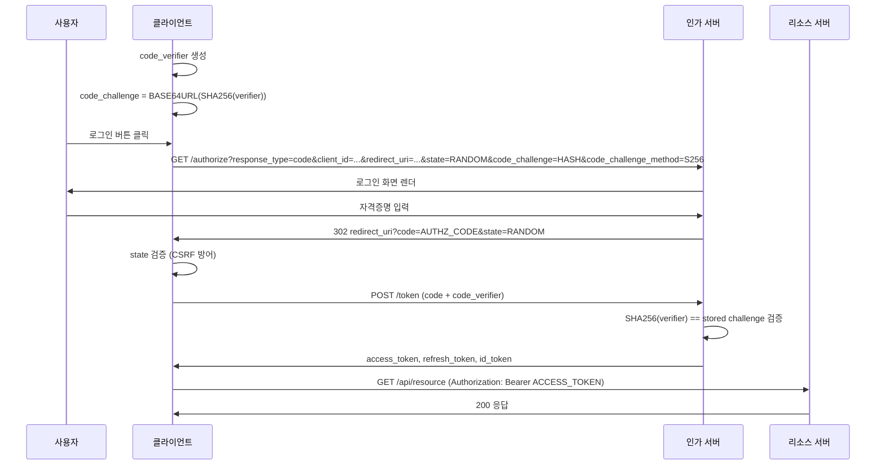

# OAuth2 Authorization Code + PKCE 구현

## 왜 PKCE가 필요한가

Authorization Code Flow는 원래 서버 사이드 앱 전용으로 설계됐다. 서버는 `client_secret`을 안전하게 보관할 수 있으니, authorization code를 탈취당해도 token endpoint에서 client_secret 없이는 교환이 안 된다.

SPA와 모바일 앱은 이 전제가 성립하지 않는다. SPA의 코드는 브라우저 DevTools로 전부 볼 수 있고, 안드로이드 APK는 디컴파일된다. `client_secret`을 넣어봤자 그냥 평문이다.

그래서 Implicit Flow가 나왔는데, 이건 더 나빴다. authorization code 교환 단계 자체를 없애고 redirect URI에 access token을 직접 박아서 돌려준다. URL fragment는 브라우저 히스토리에 남고, referrer 헤더에 실리고, 로그에 찍힌다. 2019년 RFC 8252 이후로 모바일 앱에서 Implicit 쓰지 말라는 게 공식 입장이고, OAuth 2.1 초안에서는 아예 빠졌다.

PKCE(Proof Key for Code Exchange, RFC 7636)는 다른 접근이다. client_secret 없이도 "이 authorization code는 내가 요청한 것"을 증명할 수 있게 한다. 요청 시점에 랜덤 값을 만들어서 그 해시를 서버에 보내고, 교환 시점에 원본 값을 보내는 방식이다. 중간에 code를 가로챈 공격자는 원본 값을 모르니 교환을 못 한다.

## Authorization Code Flow 전체 흐름

Public Client 기준으로 단계별로 뜯어본다.

```
[1] code_verifier 생성     클라이언트 로컬
[2] code_challenge 계산    클라이언트 로컬
[3] /authorize 요청        클라이언트 → 인가 서버
[4] 사용자 인증            브라우저 ↔ 인가 서버
[5] authorization code 발급 인가 서버 → redirect_uri
[6] /token 요청            클라이언트 → 인가 서버
[7] token 응답             인가 서버 → 클라이언트
[8] API 호출               클라이언트 → 리소스 서버
```



## PKCE 파라미터 생성

### code_verifier

43~128자의 URL-safe 랜덤 문자열이다. RFC 7636 스펙은 문자셋을 `[A-Z a-z 0-9 - . _ ~]`로 제한한다. Base64URL 인코딩을 직접 쓰는 것이 가장 쉽다.

```python
import secrets
import base64

def generate_code_verifier() -> str:
    token = secrets.token_bytes(32)  # 32바이트 = 43자 Base64URL
    return base64.urlsafe_b64encode(token).rstrip(b'=').decode('ascii')
```

```typescript
// 브라우저 Web Crypto API
async function generateCodeVerifier(): Promise<string> {
  const array = new Uint8Array(32);
  crypto.getRandomValues(array);
  return btoa(String.fromCharCode(...array))
    .replace(/\+/g, '-')
    .replace(/\//g, '_')
    .replace(/=/g, '');
}
```

`Math.random()` 쓰면 안 된다. 예측 가능한 값이라 공격자가 verifier를 추측할 수 있다.

### code_challenge

verifier를 SHA-256으로 해시한 뒤 Base64URL 인코딩한다. `S256` 방식이 필수다. `plain`은 스펙에 있지만 code를 탈취당하면 verifier와 동일하니 의미 없다. 인가 서버가 `plain`을 허용하면 PKCE가 없는 것과 같다.

```python
import hashlib
import base64

def generate_code_challenge(verifier: str) -> str:
    digest = hashlib.sha256(verifier.encode('ascii')).digest()
    return base64.urlsafe_b64encode(digest).rstrip(b'=').decode('ascii')
```

```typescript
async function generateCodeChallenge(verifier: string): Promise<string> {
  const encoder = new TextEncoder();
  const data = encoder.encode(verifier);
  const digest = await crypto.subtle.digest('SHA-256', data);
  return btoa(String.fromCharCode(...new Uint8Array(digest)))
    .replace(/\+/g, '-')
    .replace(/\//g, '_')
    .replace(/=/g, '');
}
```

## state 파라미터로 CSRF 방어

`state`는 선택 파라미터처럼 보이지만 생략하면 CSRF 공격에 노출된다.

공격 시나리오는 이렇다. 공격자가 자기 계정으로 로그인하다가 redirect 직전에 멈추고, 그 URL을 피해자에게 클릭하게 만든다. 피해자가 클릭하면 공격자의 authorization code가 피해자의 세션과 연결된다. 이후 피해자가 앱을 쓰면 공격자 계정으로 연결되는 상황이 생길 수 있다.

`state`는 요청 전에 클라이언트가 생성한 랜덤 값이고, 인가 서버가 그대로 돌려준다. redirect를 받은 클라이언트는 자신이 만든 값과 일치하는지 검증한다.

```python
import secrets

class AuthSession:
    def start_authorization(self, redirect_uri: str) -> str:
        state = secrets.token_urlsafe(32)
        code_verifier = generate_code_verifier()
        
        # 세션에 저장 (서버 사이드 세션 또는 브라우저 sessionStorage)
        session.set('oauth_state', state)
        session.set('code_verifier', code_verifier)
        
        params = {
            'response_type': 'code',
            'client_id': CLIENT_ID,
            'redirect_uri': redirect_uri,
            'scope': 'openid profile email',
            'state': state,
            'code_challenge': generate_code_challenge(code_verifier),
            'code_challenge_method': 'S256',
        }
        return f"{AUTHORIZATION_ENDPOINT}?{urlencode(params)}"
    
    def handle_callback(self, code: str, returned_state: str) -> TokenResponse:
        stored_state = session.get('oauth_state')
        
        if not stored_state or stored_state != returned_state:
            raise SecurityError("state mismatch — possible CSRF")
        
        # state는 일회용. 재사용 공격 차단
        session.delete('oauth_state')
        
        code_verifier = session.get('code_verifier')
        session.delete('code_verifier')
        
        return self.exchange_code(code, code_verifier)
```

SPA에서 `state`를 sessionStorage에 저장하는 경우가 많은데, localStorage는 쓰지 않는다. 같은 도메인의 다른 탭에서 읽힌다.

## Token Endpoint 교환

authorization code를 받은 뒤 token endpoint를 호출한다. 이 요청에는 `code_verifier`를 원문 그대로 보낸다.

```python
import httpx

async def exchange_code(
    code: str,
    code_verifier: str,
    redirect_uri: str
) -> dict:
    async with httpx.AsyncClient() as client:
        response = await client.post(
            TOKEN_ENDPOINT,
            data={
                'grant_type': 'authorization_code',
                'code': code,
                'redirect_uri': redirect_uri,
                'client_id': CLIENT_ID,
                'code_verifier': code_verifier,  # client_secret 대신
            },
            headers={'Content-Type': 'application/x-www-form-urlencoded'},
        )
        response.raise_for_status()
        return response.json()
```

Confidential Client(서버 사이드)는 `client_secret`과 PKCE를 같이 쓴다. 인가 서버가 두 가지를 모두 검증한다. Public Client는 `client_secret` 없이 `code_verifier`만 보낸다.

redirect_uri는 `/authorize` 요청 때 쓴 것과 정확히 같아야 한다. 쿼리 파라미터 하나만 달라도 인가 서버가 거부한다.

## SPA 구현 시 주의사항

### code와 verifier를 같은 곳에 저장하지 않는다

code는 URL에 노출된다. verifier는 안전한 곳에 있어야 한다. sessionStorage는 괜찮지만 동일 탭 한정이다. 탭을 새로 열면 code 교환이 실패한다.

실무에서는 code_verifier를 sessionStorage에 넣고, redirect 후 callback 페이지에서 꺼내 쓰는 패턴이 표준이다.

```typescript
// 로그인 시작
sessionStorage.setItem('pkce_verifier', codeVerifier);
sessionStorage.setItem('oauth_state', state);
window.location.href = authorizationUrl;

// callback 페이지
const urlParams = new URLSearchParams(window.location.search);
const code = urlParams.get('code');
const returnedState = urlParams.get('state');

const storedState = sessionStorage.getItem('oauth_state');
const verifier = sessionStorage.getItem('pkce_verifier');

// 검증 후 즉시 삭제
sessionStorage.removeItem('oauth_state');
sessionStorage.removeItem('pkce_verifier');

if (returnedState !== storedState) {
  throw new Error('CSRF detected');
}

const tokens = await exchangeCode(code, verifier);
```

### access token을 localStorage에 넣지 않는다

XSS 공격 한 번이면 전부 가져간다. 메모리에 두거나, HttpOnly 쿠키로 서버 사이드에서 관리하는 BFF(Backend for Frontend) 패턴을 쓴다.

BFF 패턴은 SPA → BFF 서버 → 인가 서버 구조로, token은 서버 세션에만 있고 브라우저에는 세션 쿠키만 내린다. SPA에서 직접 token을 다루는 복잡성이 없어지고, XSS로 token이 탈취되는 경로가 막힌다. 구현 복잡도가 올라가는 대신 보안 수준이 올라간다.

## 모바일 앱 구현 시 주의사항

### Custom URL Scheme 대신 Universal Link / App Link

모바일에서 redirect_uri로 `myapp://callback`처럼 custom scheme을 쓰면 다른 앱이 같은 scheme을 등록할 수 있다. 공격자 앱이 먼저 응답하면 authorization code가 그쪽으로 간다.

iOS는 Universal Link(`https://app.example.com/callback`), 안드로이드는 App Link를 쓴다. 도메인 소유권을 검증하기 때문에 다른 앱이 가로챌 수 없다. 앱 스토어 가이드라인도 이쪽을 요구하는 추세다.

### 인앱 브라우저(WebView)를 쓰지 않는다

WebView는 앱이 입력 내용을 볼 수 있고, cookie를 조작할 수 있다. 인가 서버 입장에서는 신뢰할 수 없는 환경이다. 구글은 WebView 기반 OAuth 요청을 2021년부터 차단하고 있다.

iOS는 `ASWebAuthenticationSession`, 안드로이드는 Custom Tabs를 쓴다. 시스템 쿠키를 공유하면서 앱과 격리된 환경에서 인증이 이뤄진다.

## 인가 서버 구현 (Spring Boot)

직접 인가 서버를 구현하는 경우다. Spring Authorization Server 1.x 기준이다.

```java
@Configuration
public class AuthorizationServerConfig {

    @Bean
    @Order(1)
    public SecurityFilterChain authorizationServerSecurityFilterChain(HttpSecurity http) throws Exception {
        OAuth2AuthorizationServerConfiguration.applyDefaultSecurity(http);
        
        http.getConfigurer(OAuth2AuthorizationServerConfigurer.class)
            .oidc(Customizer.withDefaults());
        
        return http.build();
    }

    @Bean
    public RegisteredClientRepository registeredClientRepository() {
        RegisteredClient spaClient = RegisteredClient.withId(UUID.randomUUID().toString())
            .clientId("my-spa")
            .clientAuthenticationMethod(ClientAuthenticationMethod.NONE)  // Public Client
            .authorizationGrantType(AuthorizationGrantType.AUTHORIZATION_CODE)
            .authorizationGrantType(AuthorizationGrantType.REFRESH_TOKEN)
            .redirectUri("https://app.example.com/callback")
            .scope(OidcScopes.OPENID)
            .scope(OidcScopes.PROFILE)
            .clientSettings(ClientSettings.builder()
                .requireProofKey(true)          // PKCE 필수
                .requireAuthorizationConsent(false)
                .build())
            .tokenSettings(TokenSettings.builder()
                .accessTokenTimeToLive(Duration.ofMinutes(15))
                .refreshTokenTimeToLive(Duration.ofDays(7))
                .reuseRefreshTokens(false)       // Refresh Token Rotation
                .build())
            .build();

        return new InMemoryRegisteredClientRepository(spaClient);
    }
}
```

`requireProofKey(true)`를 설정하면 PKCE 없는 요청은 인가 서버가 거부한다. Public Client에는 항상 켠다.

`reuseRefreshTokens(false)`는 Refresh Token을 사용할 때마다 새 토큰을 발급한다. 탈취된 refresh token으로 한 번 쓰면 기존 token이 무효화되어 정상 사용자가 다시 로그인하게 된다.

### PKCE 검증 로직

인가 서버가 내부에서 하는 일이다. 직접 구현할 때 참고한다.

```python
import hashlib
import base64

def verify_pkce(stored_challenge: str, received_verifier: str) -> bool:
    computed = hashlib.sha256(received_verifier.encode('ascii')).digest()
    computed_challenge = base64.urlsafe_b64encode(computed).rstrip(b'=').decode('ascii')
    
    # 타이밍 공격 방지를 위해 hmac.compare_digest 사용
    import hmac
    return hmac.compare_digest(stored_challenge, computed_challenge)
```

`==`로 비교하면 타이밍 공격에 취약하다. 두 문자열이 앞에서부터 달라지는 지점에서 비교가 끝나기 때문에 응답 시간으로 원본 값을 추측할 수 있다. `hmac.compare_digest`는 항상 전체를 비교한다.

## 자주 만나는 문제

**redirect_uri mismatch**: 인가 서버에 등록된 URI와 요청의 URI가 다를 때 난다. 쿼리 파라미터 유무, trailing slash, 대소문자가 전부 영향을 준다. 개발 환경에서 `localhost:3000`과 `localhost:3000/`을 둘 다 등록해두면 된다.

**state 재사용**: 같은 state를 두 번 쓰면 두 번째 요청이 mismatch로 실패한다. state는 요청마다 새로 만들어야 한다. sessionStorage를 쓰는데 탭 두 개로 동시에 로그인하면 두 번째 탭의 callback이 첫 번째 탭의 state를 덮어쓴다. 이런 경우 state에 탭 구분자를 넣거나 IndexedDB를 쓴다.

**code 재사용 시도**: authorization code는 일회용이고 짧은 시간(보통 60~600초) 안에 써야 한다. 같은 code로 두 번 교환을 시도하면 인가 서버가 발급한 토큰을 전부 취소하는 구현도 있다(RFC 6749 §4.1.2 권고 사항). 코드 재사용 감지 자체가 공격 징후다.

**PKCE 없이 요청하면 어떻게 되는가**: `requireProofKey(true)`가 설정된 서버는 `invalid_request` 에러를 돌려준다. Public Client에 PKCE가 없으면 받지 않는 것이 맞다.
