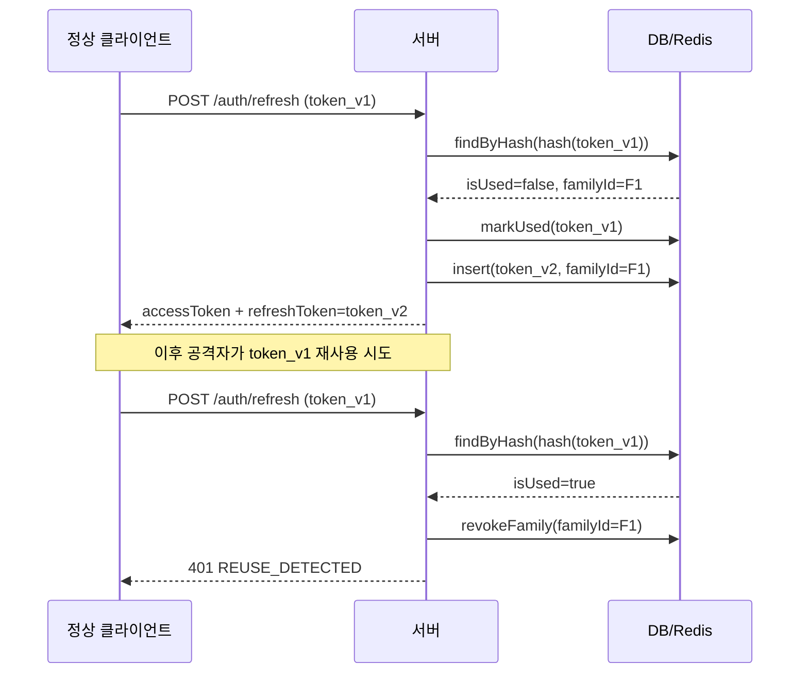

# Refresh Token Rotation

Refresh Token을 쓸 때마다 새 토큰을 발급하고 이전 토큰을 폐기하는 패턴이다. 단순 만료 방식과 달리 토큰 재사용 여부를 추적하기 때문에, 탈취된 토큰이 사용되는 순간 감지할 수 있다.

## 단순 만료 방식과의 차이

단순 만료 방식은 DB에 `(user_id, token, expires_at)`을 저장하고, 요청 시 만료 여부만 확인한다. 토큰이 탈취됐을 때가 문제다. 공격자가 Refresh Token을 훔쳐가면, 원래 사용자는 만료될 때까지 아무것도 알 수 없다.

```
단순 만료 방식:
클라이언트 → /refresh (token=abc) → Access Token 발급
공격자     → /refresh (token=abc) → Access Token 발급 (감지 불가)
```

RTR(Refresh Token Rotation)은 Refresh Token을 1회용으로 만든다. 사용할 때마다 새 토큰으로 교체하고, 이전 토큰은 즉시 폐기된다. 정상 사용자가 `token_v1`으로 갱신하면 `token_v2`를 받는다. 공격자가 폐기된 `token_v1`을 나중에 사용하면, 서버는 재사용을 감지하고 해당 사용자의 모든 토큰을 무효화한다.



재사용 감지 시 폐기 범위는 `familyId` 기준이다. 같은 로그인 세션에서 발급된 토큰들이 하나의 family를 이룬다. 공격자가 `token_v1`을 먼저 써서 `token_v2`를 받아갔다면, 정상 사용자가 뒤늦게 `token_v1`을 쓸 때 서버는 `token_v2`까지 폐기한다.

어느 쪽이 먼저 사용하든 탈취를 감지한다. 단, 감지 전까지 공격자가 활동한 짧은 시간의 피해는 막지 못한다.

## 탈취 시나리오별 대응

### Access Token 탈취

Access Token이 탈취돼도 RTR이 직접 막아주지는 않는다. 탈취된 Access Token은 만료 시간까지 그대로 쓸 수 있다. 방어 방법은 만료 시간을 15분 이하로 짧게 가져가는 것이다.

공격자가 Access Token을 훔쳤지만 Refresh Token은 못 훔쳤다면, 15분 뒤 접근이 끊긴다. 이 시나리오에서 피해는 제한된다.

`localStorage`에 Access Token을 저장하면 XSS 한 번에 바로 탈취된다. 메모리 변수에 저장하고, Refresh Token은 `httpOnly` 쿠키로 관리하는 것이 기본 구조다.

```javascript
// 프론트엔드 패턴
let accessToken = null; // 메모리 저장

async function getAccessToken() {
  if (!accessToken || isExpired(accessToken)) {
    // 쿠키의 Refresh Token으로 갱신 요청
    const res = await fetch('/auth/refresh', { method: 'POST', credentials: 'include' });
    const data = await res.json();
    accessToken = data.accessToken;
  }
  return accessToken;
}
```

페이지 새로고침 시 메모리가 초기화되므로, 갱신 요청을 자동으로 보내는 로직이 필요하다.

### Refresh Token 탈취

더 심각하다. Refresh Token은 수명이 길고(7일~30일), 탈취되면 지속적으로 Access Token을 발급할 수 있다.

단순 만료 방식에서는 사용자가 직접 "다른 기기에서 로그아웃"을 실행하거나 비밀번호를 변경해야만 대응이 가능하다. 탈취 사실을 사용자가 스스로 인지해야 한다는 전제다.

RTR에서는 정상 사용자가 다음 갱신 요청을 보낼 때 자동으로 감지된다. 사용자가 아무것도 몰랐어도, 오래된 토큰으로 갱신을 시도하는 시점에 재사용이 감지된다.

다만, 감지 즉시 `familyId` 전체를 폐기하므로 사용자도 강제 로그아웃된다. 사용자 입장에서는 갑자기 로그인이 풀리는 경험을 하게 된다. 이 상황에서 "보안상 재로그인이 필요합니다" 안내와 함께, 필요하다면 이메일/앱 푸시 알림으로 보안 이벤트를 알려주는 것이 좋다.

## 저장 구조

### PostgreSQL 스키마

```sql
CREATE TABLE refresh_tokens (
    id          UUID PRIMARY KEY DEFAULT gen_random_uuid(),
    family_id   UUID NOT NULL,
    user_id     BIGINT NOT NULL REFERENCES users(id) ON DELETE CASCADE,
    token_hash  CHAR(64) NOT NULL,      -- SHA-256 hex
    parent_id   UUID REFERENCES refresh_tokens(id),
    is_used     BOOLEAN NOT NULL DEFAULT FALSE,
    used_at     TIMESTAMPTZ,
    revoked_at  TIMESTAMPTZ,
    revoke_reason VARCHAR(50),
    created_at  TIMESTAMPTZ NOT NULL DEFAULT NOW(),
    expires_at  TIMESTAMPTZ NOT NULL
);

CREATE UNIQUE INDEX idx_rt_token_hash ON refresh_tokens(token_hash);
CREATE INDEX idx_rt_family_id ON refresh_tokens(family_id);
CREATE INDEX idx_rt_user_id ON refresh_tokens(user_id);
```

`token_hash`에 원문 대신 SHA-256 해시를 저장한다. DB가 유출되더라도 해시로는 실제 토큰을 복원할 수 없다. 클라이언트에게는 원문을 주고, 서버는 해시로만 조회한다.

`family_id`는 같은 로그인 세션에서 발급된 토큰들을 묶는다. 재사용 감지 시 이 단위로 일괄 폐기한다.

`revoke_reason`은 선택 사항이지만, 나중에 사고 추적 시 "왜 폐기됐는지" 기록이 있으면 유용하다.

여기서 SHA-256 을 쓰는 것이 비밀번호 해싱 관행과 어긋나 보일 수 있다. 비밀번호에는 bcrypt·argon2 같은 느린 해시를 쓰라고 하는데 왜 토큰에는 빠른 해시인가. 두 가지가 다르기 때문이다.

- **비밀번호는 엔트로피가 낮다.** 사람이 만든 문자열이라 사전 공격이 통하고, 그래서 일부러 느리게 만들어 시도 횟수를 줄인다. `randomBytes(40)` 은 추측 대상이 아니다.
- **토큰은 조회 키로 쓴다.** bcrypt 는 같은 입력에도 매번 다른 값이 나오므로 인덱스로 찾을 수 없다. 전체 행을 훑으며 하나씩 비교해야 한다. 위 스키마의 `idx_rt_token_hash` 유니크 인덱스가 성립하는 이유가 SHA-256 의 결정성이다.

**대신 솔트가 없으므로 같은 토큰은 항상 같은 해시가 된다.** 로그에 해시가 찍히면 그것만으로 어느 세션인지 식별된다. 토큰 해시도 식별자로 취급해서 로그·에러 리포트에 남기지 않는 편이 낫다.

### Redis 전용 구조

DB 없이 Redis만 쓸 수도 있다. 조회는 빠르지만 영구 기록이 없고, TTL이 지나면 데이터가 사라진다.

```
# 토큰별 메타데이터
key: rt:{tokenHash}
value: JSON {
  "familyId": "uuid",
  "userId": "123",
  "parentHash": "sha256...",
  "isUsed": false,
  "createdAt": 1722470400,
  "expiresAt": 1723075200
}
TTL: 7일

# family 구성원 목록 (재사용 감지 시 일괄 삭제용)
key: rt:family:{familyId}
members: Set["hash1", "hash2", "hash3"]
TTL: 30일
```

`rt:family:{familyId}`를 Redis Set으로 관리하면, 폐기 시 `SMEMBERS`로 목록을 가져와 `DEL` 일괄 처리가 가능하다.

### DB + Redis 혼합

실무에서 가장 많이 쓰는 구조다. 영구 기록은 DB에, 빠른 조회는 Redis 캐시로 처리한다.

```
요청 → Redis에서 tokenHash 조회
     → 캐시 히트: is_used 즉시 확인
     → 캐시 미스: DB 조회 후 5분 캐싱
```

Redis 장애 시 DB로 폴백한다. Redis와 DB 상태가 다를 때 DB를 원본으로 신뢰한다. 토큰 폐기 시 Redis 캐시도 즉시 삭제해야 한다.

## 재사용 감지 구현

### 기본 로직

```javascript
// token.service.js
const crypto = require('crypto');

async function rotateRefreshToken(rawToken) {
  const tokenHash = sha256(rawToken);

  const tokenRecord = await db.refreshTokens.findOne({ tokenHash });

  if (!tokenRecord) {
    throw new AuthError('INVALID_TOKEN');
  }

  if (tokenRecord.expiresAt < new Date()) {
    throw new AuthError('TOKEN_EXPIRED');
  }

  if (tokenRecord.isUsed) {
    // 재사용 감지: family 전체 폐기
    await db.refreshTokens.updateMany(
      { familyId: tokenRecord.familyId },
      {
        isUsed: true,
        revokedAt: new Date(),
        revokeReason: 'REUSE_DETECTED',
      }
    );
    throw new AuthError('REUSE_DETECTED');
  }

  // 현재 토큰 사용 처리
  await db.refreshTokens.updateOne(
    { id: tokenRecord.id },
    { isUsed: true, usedAt: new Date() }
  );

  // 새 토큰 발급
  const newRaw = crypto.randomBytes(40).toString('hex');
  await db.refreshTokens.insertOne({
    id: crypto.randomUUID(),
    familyId: tokenRecord.familyId,
    userId: tokenRecord.userId,
    tokenHash: sha256(newRaw),
    parentId: tokenRecord.id,
    isUsed: false,
    createdAt: new Date(),
    expiresAt: new Date(Date.now() + 7 * 24 * 60 * 60 * 1000),
  });

  const accessToken = issueAccessToken(tokenRecord.userId);
  return { accessToken, refreshToken: newRaw };
}

function sha256(raw) {
  return crypto.createHash('sha256').update(raw).digest('hex');
}
```

#### 스키마에 있는 `revoked_at` 을 아무도 보지 않는다

위 함수의 검사는 세 개다 — 레코드 존재, `expiresAt`, `isUsed`. `revoked_at` 은 읽지 않는다. 그래서 **관리자가 "이 기기 로그아웃"으로 세션을 폐기해도(`revoked_at` 만 채우고 `is_used` 는 그대로) 그 토큰이 계속 통과한다.** 스키마에 컬럼이 있고 폐기 API 가 그 컬럼을 채우고 있으면 다 된 것처럼 보이는데, 검증 경로가 그 컬럼을 안 본다는 것은 코드를 나란히 놓고 대조해야 드러난다.

`revokeFamily` 가 `isUsed: true` 를 함께 세팅하는 것도 그래서 나온 우회다. **한 컬럼이 "회전에 썼다"와 "폐기됐다" 두 가지를 겸하면** 나중에 둘을 구분해야 할 때(사고 조사, 재사용 통계) 구분할 수가 없다. 검사 조건에 `revokedAt` 을 명시적으로 넣는 편이 낫다.

```javascript
if (tokenRecord.revokedAt) throw new AuthError('TOKEN_REVOKED');
```

#### 세 개의 쿼리가 원자적이지 않다

`findOne` → `updateOne(isUsed: true)` → `insertOne(새 토큰)` 이 각각 별개다. 같은 토큰으로 두 요청이 동시에 오면 둘 다 `isUsed=false` 를 읽고, 둘 다 사용 처리하고, 둘 다 새 토큰을 발급한다. **한 family 에 유효한 토큰이 두 개 생기고**, 이후 둘 중 하나를 쓰는 순간 재사용으로 오탐된다. 아래 grace period 는 이 증상을 덮는 처치이지 원인 제거가 아니다.

원자적으로 만드는 것은 조건부 UPDATE 하나면 된다. 갱신된 행 수가 곧 승자 판정이다.

```javascript
const updated = await db.refreshTokens.updateOne(
  { id: tokenRecord.id, isUsed: false },        // 조건에 isUsed 를 넣는다
  { isUsed: true, usedAt: new Date() }
);
if (updated.modifiedCount === 0) {
  // 다른 요청이 먼저 가져갔다 — 재사용인지 동시 요청인지는 여기서 판단
}
```

`token_hash` 유니크 인덱스가 있으므로 새 토큰 삽입은 중복이 걸린다. 남은 것은 UPDATE 와 INSERT 를 한 트랜잭션에 묶는 일인데, 이건 아래 분산 락보다 싸고 Redis 도 필요 없다.

### Race Condition 처리

클라이언트가 동시에 두 번 갱신 요청을 보내면 오탐이 발생한다. 모바일 앱에서 네트워크 타임아웃 후 자동 재시도할 때 자주 생기는 상황이다. 두 번째 요청이 이미 폐기된 토큰으로 들어오면 탈취로 잘못 판단한다.

grace period로 처리한다. 토큰이 사용된 지 N초 이내의 재요청은 동시 요청으로 간주하고, 가장 최근에 발급된 유효 토큰을 반환한다.

```javascript
if (tokenRecord.isUsed) {
  const GRACE_MS = 10_000; // 10초
  const usedAgo = Date.now() - new Date(tokenRecord.usedAt).getTime();

  if (usedAgo < GRACE_MS) {
    // 동시 요청으로 판단 — 최신 유효 토큰 조회
    const latestValid = await db.refreshTokens.findOne({
      familyId: tokenRecord.familyId,
      isUsed: false,
    });

    if (latestValid) {
      // latestValid의 rawToken은 DB에 없으므로, 이 패턴은
      // 클라이언트가 직전 응답의 토큰을 다시 보내도록 유도하거나
      // Redis 분산 락 방식으로 대체하는 것이 더 안전하다
      throw new AuthError('CONCURRENT_REQUEST');
    }
  }

  await revokeFamily(tokenRecord.familyId);
  throw new AuthError('REUSE_DETECTED');
}
```

grace period보다 Redis 분산 락이 더 정확하다. 동일 토큰에 대한 요청을 직렬화하면 동시 요청 자체가 불가능해진다.

```javascript
// 값 비교 후 삭제를 원자적으로 처리한다 — 두 단계로 나누면 그 사이에 TTL 이 만료될 수 있다.
const UNLOCK = `if redis.call('get', KEYS[1]) == ARGV[1] then return redis.call('del', KEYS[1]) else return 0 end`;

async function rotateWithLock(rawToken) {
  const tokenHash = sha256(rawToken);
  const lockKey = `lock:rt:${tokenHash}`;

  // 값은 내 식별자다. 상수를 넣으면 해제할 때 누구 락인지 구분할 수 없다.
  const lockToken = randomUUID();
  const acquired = await redis.set(lockKey, lockToken, 'NX', 'EX', 5);
  if (!acquired) {
    throw new AuthError('CONCURRENT_REQUEST');
  }

  try {
    return await rotateRefreshToken(rawToken);
  } finally {
    // 내 락일 때만 지운다. rotate 가 TTL 5초를 넘기면 락이 이미 만료돼
    // 다른 요청이 잡고 있을 수 있는데, 무조건 del 하면 그 락을 푼다.
    // 그러면 같은 리프레시 토큰으로 동시 회전이 뚫린다.
    await redis.eval(UNLOCK, 1, lockKey, lockToken);
  }
}
```

락 TTL(5초)은 rotate 함수 처리 시간보다 넉넉하게 설정한다. DB 응답이 느린 경우를 고려해야 한다.

#### 설명과 코드가 다르다

본문은 "가장 최근에 발급된 유효 토큰을 반환한다"고 하는데, 코드는 `latestValid` 를 찾고도 `CONCURRENT_REQUEST` 를 던진다. 주석이 이유를 적어 뒀듯 **DB 에는 해시만 있어서 원문을 돌려줄 수 없다.** 그래서 grace period 가 실제로 바꾸는 것은 하나뿐이다 — **family 를 폐기하지 않는다.** 클라이언트는 어느 쪽이든 실패를 받는다.

작지만 중요한 차이다. 재시도 한 번으로 사용자가 전 기기에서 로그아웃되느냐 아니냐가 갈린다. 다만 클라이언트가 그 뒤 무엇을 해야 하는지는 정해 줘야 한다. `CONCURRENT_REQUEST` 를 받은 쪽은 **재로그인이 아니라 잠시 뒤 재시도**여야 하고, 그러려면 응답 코드가 `401` 과 구분돼야 한다. 위 라우터는 `err.status === 429` 를 보는데 `AuthError('CONCURRENT_REQUEST')` 에는 `status` 가 없으므로 그 분기는 타지 않고 401 로 떨어진다. 401 을 받은 클라이언트는 대개 로그인 화면으로 보낸다 — grace period 로 살려 둔 세션을 클라이언트가 버리는 셈이다.

`latestValid` 조회에 정렬이 없다는 것도 짚어 둔다. 정렬 없는 `findOne` 이 돌려주는 행은 "가장 최근"이 아니다. 이 값을 실제로 쓰게 될 구조라면 `ORDER BY created_at DESC` 가 필요하다.

락 방식에도 대가가 있다. **인증 경로가 Redis 에 의존하게 된다.** Redis 가 죽으면 `redis.set` 이 실패하고, 그때 어떻게 할지 정해야 한다 — 잠금 없이 진행하면(fail-open) 원래 문제로 돌아가고, 거부하면(fail-closed) Redis 장애가 곧 전체 로그인 불가다. 위의 조건부 UPDATE 방식은 이 선택 자체가 필요 없다.

## Node.js 전체 구현

```javascript
// 값 비교 후 삭제를 원자적으로 처리한다 — 두 단계로 나누면 그 사이에 TTL 이 만료될 수 있다.
const UNLOCK = `if redis.call('get', KEYS[1]) == ARGV[1] then return redis.call('del', KEYS[1]) else return 0 end`;

// services/token.service.js
const crypto = require('crypto');
const jwt = require('jsonwebtoken');

class TokenService {
  constructor({ db, redis, jwtSecret, jwtExpiresIn = '15m', refreshTTLDays = 7 }) {
    this.db = db;
    this.redis = redis;
    this.jwtSecret = jwtSecret;
    this.jwtExpiresIn = jwtExpiresIn;
    this.refreshTTLMs = refreshTTLDays * 24 * 60 * 60 * 1000;
  }

  async issueTokenPair(userId) {
    const familyId = crypto.randomUUID();
    const rawRefreshToken = this.#generateRaw();

    await this.db.refreshTokens.insertOne({
      id: crypto.randomUUID(),
      familyId,
      userId,
      tokenHash: this.#hash(rawRefreshToken),
      parentId: null,
      isUsed: false,
      createdAt: new Date(),
      expiresAt: new Date(Date.now() + this.refreshTTLMs),
    });

    return {
      accessToken: this.#issueAccess(userId),
      refreshToken: rawRefreshToken,
    };
  }

  async rotate(rawRefreshToken) {
    const tokenHash = this.#hash(rawRefreshToken);
    const lockKey = `lock:rt:${tokenHash}`;

    // 값은 내 식별자다. 상수를 넣으면 해제할 때 누구 락인지 구분할 수 없다.
    const lockToken = randomUUID();
    const acquired = await this.redis.set(lockKey, lockToken, 'NX', 'EX', 5);
    if (!acquired) {
      throw Object.assign(new Error('CONCURRENT_REQUEST'), { status: 429 });
    }

    try {
      return await this.#doRotate(tokenHash);
    } finally {
      // 내 락일 때만 지운다. rotate 가 TTL 5초를 넘기면 락이 이미 만료돼
      // 다른 요청이 잡고 있을 수 있는데, 무조건 del 하면 그 락을 푼다.
      // 그러면 같은 리프레시 토큰으로 동시 회전이 뚫린다.
      await this.redis.eval(UNLOCK, 1, lockKey, lockToken);
    }
  }

  async #doRotate(tokenHash) {
    const cacheKey = `rt:${tokenHash}`;
    let record = await this.#getCached(cacheKey);

    if (!record) {
      record = await this.db.refreshTokens.findOne({ tokenHash });
      if (record) {
        await this.redis.set(cacheKey, JSON.stringify(record), 'EX', 300);
      }
    }

    if (!record) {
      throw Object.assign(new Error('INVALID_TOKEN'), { status: 401 });
    }

    if (record.expiresAt < Date.now()) {
      await this.redis.del(cacheKey);
      throw Object.assign(new Error('TOKEN_EXPIRED'), { status: 401 });
    }

    if (record.isUsed) {
      await this.#revokeFamily(record.familyId);
      await this.redis.del(cacheKey);
      throw Object.assign(new Error('REUSE_DETECTED'), { status: 401 });
    }

    await this.db.refreshTokens.updateOne(
      { tokenHash },
      { isUsed: true, usedAt: new Date() }
    );
    await this.redis.del(cacheKey);

    const newRaw = this.#generateRaw();
    const newHash = this.#hash(newRaw);

    await this.db.refreshTokens.insertOne({
      id: crypto.randomUUID(),
      familyId: record.familyId,
      userId: record.userId,
      tokenHash: newHash,
      parentId: record.id,
      isUsed: false,
      createdAt: new Date(),
      expiresAt: new Date(Date.now() + this.refreshTTLMs),
    });

    return {
      accessToken: this.#issueAccess(record.userId),
      refreshToken: newRaw,
    };
  }

  async revokeByUser(userId) {
    await this.db.refreshTokens.updateMany(
      { userId, isUsed: false },
      { isUsed: true, revokedAt: new Date(), revokeReason: 'USER_LOGOUT' }
    );
  }

  async #revokeFamily(familyId) {
    await this.db.refreshTokens.updateMany(
      { familyId },
      { isUsed: true, revokedAt: new Date(), revokeReason: 'REUSE_DETECTED' }
    );
  }

  async #getCached(key) {
    const raw = await this.redis.get(key);
    return raw ? JSON.parse(raw) : null;
  }

  #issueAccess(userId) {
    return jwt.sign({ sub: String(userId) }, this.jwtSecret, {
      algorithm: 'HS256',
      expiresIn: this.jwtExpiresIn,
    });
  }

  #generateRaw() {
    return crypto.randomBytes(40).toString('hex');
  }

  #hash(raw) {
    return crypto.createHash('sha256').update(raw).digest('hex');
  }
}

module.exports = { TokenService };
```

```javascript
// routes/auth.js
const express = require('express');
const router = express.Router();

const COOKIE_OPTIONS = {
  httpOnly: true,
  secure: process.env.NODE_ENV === 'production',
  sameSite: 'strict',
  path: '/auth/refresh',
  maxAge: 7 * 24 * 60 * 60 * 1000,
};

router.post('/auth/login', async (req, res) => {
  const { email, password } = req.body;
  const user = await userService.verify(email, password);

  const { accessToken, refreshToken } = await tokenService.issueTokenPair(user.id);

  res.cookie('refreshToken', refreshToken, COOKIE_OPTIONS);
  res.json({ accessToken });
});

router.post('/auth/refresh', async (req, res) => {
  const rawToken = req.cookies?.refreshToken;
  if (!rawToken) {
    return res.status(401).json({ error: 'MISSING_TOKEN' });
  }

  try {
    const { accessToken, refreshToken } = await tokenService.rotate(rawToken);
    res.cookie('refreshToken', refreshToken, COOKIE_OPTIONS);
    return res.json({ accessToken });
  } catch (err) {
    res.clearCookie('refreshToken', { path: '/auth/refresh' });

    if (err.message === 'REUSE_DETECTED') {
      return res.status(401).json({ error: 'TOKEN_COMPROMISED' });
    }
    if (err.status === 429) {
      return res.status(429).json({ error: 'CONCURRENT_REQUEST' });
    }
    return res.status(401).json({ error: 'UNAUTHORIZED' });
  }
});

router.post('/auth/logout', authenticate, async (req, res) => {
  await tokenService.revokeByUser(req.user.id);
  res.clearCookie('refreshToken', { path: '/auth/refresh' });
  res.status(204).end();
});
```

## Spring 구현

```java
// domain/RefreshToken.java
@Entity
@Table(name = "refresh_tokens")
@Getter
@NoArgsConstructor(access = AccessLevel.PROTECTED)
public class RefreshToken {

    @Id
    private UUID id;

    @Column(nullable = false)
    private UUID familyId;

    @Column(nullable = false)
    private Long userId;

    @Column(nullable = false, unique = true, length = 64)
    private String tokenHash;

    private UUID parentId;

    @Column(nullable = false)
    private boolean isUsed = false;

    private LocalDateTime usedAt;
    private LocalDateTime revokedAt;
    private String revokeReason;

    @Column(nullable = false)
    private LocalDateTime createdAt;

    @Column(nullable = false)
    private LocalDateTime expiresAt;

    public static RefreshToken create(UUID familyId, Long userId, String tokenHash, UUID parentId, int ttlDays) {
        RefreshToken token = new RefreshToken();
        token.id = UUID.randomUUID();
        token.familyId = familyId;
        token.userId = userId;
        token.tokenHash = tokenHash;
        token.parentId = parentId;
        token.isUsed = false;
        token.createdAt = LocalDateTime.now();
        token.expiresAt = LocalDateTime.now().plusDays(ttlDays);
        return token;
    }

    public void markUsed() {
        this.isUsed = true;
        this.usedAt = LocalDateTime.now();
    }

    public boolean isExpired() {
        return this.expiresAt.isBefore(LocalDateTime.now());
    }
}
```

```java
// repository/RefreshTokenRepository.java
public interface RefreshTokenRepository extends JpaRepository<RefreshToken, UUID> {

    Optional<RefreshToken> findByTokenHash(String tokenHash);

    @Modifying
    @Query("""
        UPDATE RefreshToken t SET t.isUsed = true,
        t.revokedAt = :revokedAt, t.revokeReason = :reason
        WHERE t.familyId = :familyId
    """)
    void revokeAllByFamilyId(UUID familyId, LocalDateTime revokedAt, String reason);

    @Modifying
    @Query("""
        UPDATE RefreshToken t SET t.isUsed = true,
        t.revokedAt = :revokedAt, t.revokeReason = :reason
        WHERE t.userId = :userId AND t.isUsed = false
    """)
    void revokeAllByUserId(Long userId, LocalDateTime revokedAt, String reason);
}
```

```java
// service/TokenService.java
@Service
@RequiredArgsConstructor
public class TokenService {

    // 값 비교 후 삭제를 원자적으로 처리한다 — 두 단계로 나누면 그 사이에 TTL 이 만료될 수 있다.
    private static final RedisScript<Long> UNLOCK_SCRIPT = RedisScript.of("""
        if redis.call('get', KEYS[1]) == ARGV[1] then
          return redis.call('del', KEYS[1])
        else
          return 0
        end
        """, Long.class);

    private final RefreshTokenRepository tokenRepo;
    private final RedisTemplate<String, String> redis;
    private final JwtProvider jwtProvider;
    private final ObjectMapper objectMapper;

    private static final int REFRESH_TTL_DAYS = 7;
    private static final Duration CACHE_TTL = Duration.ofMinutes(5);
    private static final Duration LOCK_TTL = Duration.ofSeconds(5);

    public TokenPair issueTokenPair(Long userId) {
        String rawToken = generateRaw();
        UUID familyId = UUID.randomUUID();

        RefreshToken token = RefreshToken.create(
            familyId, userId, hash(rawToken), null, REFRESH_TTL_DAYS
        );
        tokenRepo.save(token);

        return new TokenPair(jwtProvider.issue(userId), rawToken);
    }

    @Transactional
    public TokenPair rotate(String rawToken) {
        String tokenHash = hash(rawToken);
        String lockKey = "lock:rt:" + tokenHash;

        // 호출마다 새로 만든다. 필드로 두면 @Service 싱글턴이라 그 JVM 의 모든
        // 요청이 같은 값을 쓰고, 소유자 검사가 같은 인스턴스 안에서는 무력해진다
        // — 스레드 A 가 만료된 락을 B 가 다시 잡아도 값이 같아 A 가 지워 버린다.
        // 리프레시 토큰 회전의 동시 요청은 대개 같은 인스턴스 안 경합이라
        // 정작 막아야 할 경우가 안 막힌다.
        String lockToken = UUID.randomUUID().toString();

        Boolean acquired = redis.opsForValue()
            .setIfAbsent(lockKey, lockToken, LOCK_TTL);

        if (!Boolean.TRUE.equals(acquired)) {
            throw new ConcurrentRequestException();
        }

        try {
            return doRotate(tokenHash);
        } finally {
            // 내 락일 때만 지운다 — 무조건 delete 하면 TTL 만료 뒤 남의 락을 푼다
            redis.execute(UNLOCK_SCRIPT, List.of(lockKey), lockToken);
        }
    }

    private TokenPair doRotate(String tokenHash) {
        String cacheKey = "rt:" + tokenHash;

        RefreshToken token = findToken(tokenHash, cacheKey);

        if (token.isExpired()) {
            redis.delete(cacheKey);
            throw new TokenExpiredException();
        }

        if (token.isUsed()) {
            tokenRepo.revokeAllByFamilyId(
                token.getFamilyId(), LocalDateTime.now(), "REUSE_DETECTED"
            );
            redis.delete(cacheKey);
            throw new TokenReuseDetectedException();
        }

        token.markUsed();
        tokenRepo.save(token);
        redis.delete(cacheKey);

        String newRaw = generateRaw();
        RefreshToken newToken = RefreshToken.create(
            token.getFamilyId(), token.getUserId(),
            hash(newRaw), token.getId(), REFRESH_TTL_DAYS
        );
        tokenRepo.save(newToken);

        return new TokenPair(jwtProvider.issue(token.getUserId()), newRaw);
    }

    public void revokeByUser(Long userId) {
        tokenRepo.revokeAllByUserId(userId, LocalDateTime.now(), "USER_LOGOUT");
    }

    private RefreshToken findToken(String tokenHash, String cacheKey) {
        String cached = redis.opsForValue().get(cacheKey);
        if (cached != null) {
            try {
                return objectMapper.readValue(cached, RefreshToken.class);
            } catch (JsonProcessingException ignored) {}
        }

        RefreshToken token = tokenRepo.findByTokenHash(tokenHash)
            .orElseThrow(InvalidTokenException::new);

        try {
            redis.opsForValue().set(cacheKey, objectMapper.writeValueAsString(token), CACHE_TTL);
        } catch (JsonProcessingException ignored) {}

        return token;
    }

    private String generateRaw() {
        byte[] bytes = new byte[40];
        new SecureRandom().nextBytes(bytes);
        return HexFormat.of().formatHex(bytes);
    }

    private String hash(String raw) {
        return Hashing.sha256()
            .hashString(raw, StandardCharsets.UTF_8)
            .toString();
    }
}
```

```java
// controller/AuthController.java
@RestController
@RequiredArgsConstructor
public class AuthController {

    private final TokenService tokenService;
    private static final String REFRESH_COOKIE = "refreshToken";
    private static final int COOKIE_MAX_AGE = 7 * 24 * 60 * 60;

    @PostMapping("/auth/refresh")
    public ResponseEntity<AccessTokenResponse> refresh(
        @CookieValue(name = REFRESH_COOKIE, required = false) String rawToken,
        HttpServletResponse response
    ) {
        if (rawToken == null) {
            return ResponseEntity.status(UNAUTHORIZED).build();
        }

        try {
            TokenPair pair = tokenService.rotate(rawToken);
            addRefreshCookie(response, pair.refreshToken());
            return ResponseEntity.ok(new AccessTokenResponse(pair.accessToken()));

        } catch (TokenReuseDetectedException e) {
            clearRefreshCookie(response);
            return ResponseEntity.status(UNAUTHORIZED)
                .body(new AccessTokenResponse(null));

        } catch (ConcurrentRequestException e) {
            return ResponseEntity.status(TOO_MANY_REQUESTS).build();

        } catch (InvalidTokenException | TokenExpiredException e) {
            clearRefreshCookie(response);
            return ResponseEntity.status(UNAUTHORIZED).build();
        }
    }

    @PostMapping("/auth/logout")
    public ResponseEntity<Void> logout(
        @AuthenticationPrincipal UserDetails user,
        HttpServletResponse response
    ) {
        tokenService.revokeByUser(Long.parseLong(user.getUsername()));
        clearRefreshCookie(response);
        return ResponseEntity.noContent().build();
    }

    private void addRefreshCookie(HttpServletResponse response, String value) {
        ResponseCookie cookie = ResponseCookie.from(REFRESH_COOKIE, value)
            .httpOnly(true)
            .secure(true)
            .sameSite("Strict")
            .path("/auth/refresh")
            .maxAge(COOKIE_MAX_AGE)
            .build();
        response.addHeader(HttpHeaders.SET_COOKIE, cookie.toString());
    }

    private void clearRefreshCookie(HttpServletResponse response) {
        ResponseCookie cookie = ResponseCookie.from(REFRESH_COOKIE, "")
            .httpOnly(true)
            .secure(true)
            .path("/auth/refresh")
            .maxAge(0)
            .build();
        response.addHeader(HttpHeaders.SET_COOKIE, cookie.toString());
    }
}
```

## 로테이션이 막아주지 않는 것

이 패턴을 넣으면 "탈취되면 감지된다"고 정리하기 쉬운데, 실제 보장은 그보다 좁다.

**감지는 사후이고 조건부다.** 재사용 감지는 **정상 사용자가 옛 토큰을 한 번 더 쓸 때** 발동한다. 공격자가 토큰을 훔쳐 계속 회전시키고 사용자가 그 사이 앱을 열지 않으면 아무 일도 일어나지 않는다. 반대로 사용자가 먼저 갱신하면 공격자의 토큰이 무효가 되어 사용자 쪽이 살아남는다. **누가 먼저 쓰느냐로 결정되는 경주**이지 탈취 자체를 막는 장치가 아니다.

**Access Token 은 폐기되지 않는다.** family 를 전부 폐기해도 이미 발급된 Access Token 은 만료 시각까지 유효하다. 재사용을 감지한 순간부터 실제 차단까지 Access Token 수명만큼 창이 남는다. 로그아웃도 마찬가지다 — 위 `/auth/logout` 은 Refresh Token 만 폐기한다. 이 창을 없애려면 Access Token 검증 때마다 서버에 물어봐야 하는데, 그러면 JWT 를 쓰는 이유가 사라진다.

| 원하는 것 | 대가 |
|---|---|
| 즉시 차단 | 요청마다 상태 조회 → 무상태 이점 소멸 |
| 창을 짧게 | Access Token 수명 단축 → 갱신 요청 증가 |
| 폐기 목록 유지 | 저장소 의존 + 목록 크기 관리 |
| 그대로 두기 | 감지 후 Access Token 수명만큼 노출 |

정답은 없고, **Access Token 수명이 곧 최대 노출 시간**이라는 사실을 알고 그 숫자를 고르는 것이 요점이다.

**Refresh Token 을 어디에 두느냐가 이 모든 것보다 크다.** 위 구현은 `httpOnly` 쿠키를 쓴다. 이걸 로컬 스토리지에 두면 XSS 한 번으로 토큰이 나가고, 그 뒤로는 회전이든 감지든 의미가 없다. 로테이션은 **토큰이 새어 나간 뒤의 피해를 줄이는 장치**이지 새어 나가는 것을 막는 장치가 아니다.

## 운영 시 주의사항

**토큰 원문은 DB에 저장하지 않는다.** SHA-256 해시만 저장한다. DB가 유출돼도 해시로는 실제 토큰을 복원할 수 없다.

**만료·폐기된 토큰 정리.** `is_used = true`이거나 `expires_at`이 지난 레코드가 계속 쌓인다. 배치 잡으로 주기적으로 삭제해야 한다. 보안 사고 추적을 위해 최근 30일치 폐기 이력은 남겨두는 경우도 있다.

```sql
-- 만료 후 30일 지난 토큰 삭제 (배치)
DELETE FROM refresh_tokens
WHERE expires_at < NOW() - INTERVAL '30 days';
```

**다중 기기 로그인 처리.** 기기별로 별도 `familyId`를 관리한다. 로그인 시 기존 family를 전부 폐기하면 단일 기기만 허용된다. 다중 기기를 허용하려면 로그인마다 새 family를 생성하고, 기기 정보(user_agent, device_id)를 저장해두면 관리 UI에서 "이 기기 로그아웃" 기능을 제공할 수 있다.

**Refresh Token 쿠키 path 설정.** `path=/`로 설정하면 모든 요청에 Refresh Token 쿠키가 포함된다. `path=/auth/refresh`로 좁히면 갱신 요청에만 전송되어 노출 범위가 줄어든다.

**재사용 감지 후 알림.** `REUSE_DETECTED`가 발생하면 사용자에게 보안 이메일을 발송하는 것이 좋다. "다른 기기에서 비정상적인 접근이 감지되어 보안상 재로그인이 필요합니다" 수준의 안내다. 탈취가 아닌 grace period 범위를 벗어난 클라이언트 버그인 경우도 있으므로, 알림 문구는 단정적이기보다 가능성 수준으로 표현한다.

---
이 문서는 [인증과 토큰 허브](../../_hub/인증과_토큰.md)의 일부입니다.
