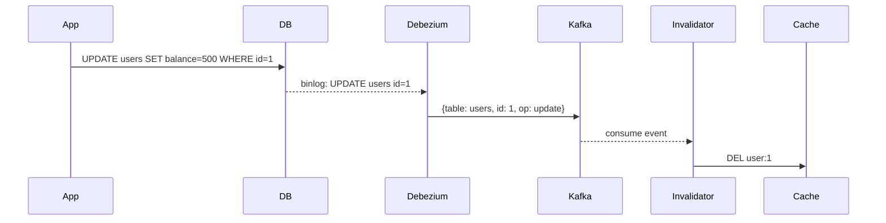

## TTL이 전부가 아닌 이유

캐시 무효화는 소프트웨어 공학에서 어렵기로 유명한 문제다. Phil Karlton의 말을 빌리면 "컴퓨터 과학에서 어려운 것은 두 가지뿐이다 — 캐시 무효화와 이름 짓기."

TTL을 설정하면 캐시가 자동 만료되니 충분해 보인다. 실제로는 두 가지 벽에 부딪힌다.

**정합성 문제**: TTL이 60초라면 그 60초 안에 원본 데이터가 바뀌어도 낡은 값이 계속 서빙된다. 상품 재고가 0이 됐는데 캐시가 살아 있으면 품절 상품을 계속 팔게 된다.

**TTL 딜레마**: TTL을 줄이면 정합성은 올라가지만 히트율이 떨어진다. 60초 TTL로 히트율 92%를 유지하던 서비스가 정합성 요구로 10초로 줄이자 히트율이 61%로 내려간 사례가 실제로 있다. DB 쿼리가 3배 늘어 피크 시간대에 커넥션 풀이 고갈됐다.

TTL은 "언제가 됐든 만료된다"는 보장을 줄 뿐, "변경 즉시 무효화된다"는 보장은 없다. 이 간극을 메우려면 변경 시점에 캐시를 직접 날리는 방법이 필요하다.

---

## 이벤트 기반 무효화

### Pub/Sub 패턴

가장 직관적인 방법은 데이터를 변경하는 코드에서 직접 캐시를 지우는 것이다. 단순한 구조에서는 잘 동작한다.

```python
def update_user(user_id: int, data: dict):
    db.execute("UPDATE users SET ... WHERE id = ?", user_id)
    redis.delete(f"user:{user_id}")
```

문제는 여러 서비스나 여러 서버가 같은 데이터를 변경할 때다. 결제 서비스에서 사용자 잔액을 바꿨는데, 사용자 서비스의 캐시는 아직 갱신이 안 된 상태가 생긴다.

이때 pub/sub를 쓴다. 데이터를 바꾼 쪽이 무효화 이벤트를 발행하고, 캐시를 들고 있는 쪽이 구독해서 지운다.

```python
# 발행 쪽
def update_user_balance(user_id: int, amount: int):
    db.execute("UPDATE users SET balance = ? WHERE id = ?", amount, user_id)
    redis.publish("cache-invalidation", json.dumps({
        "entity": "user",
        "id": user_id
    }))

# 구독 쪽 (별도 프로세스)
def listen():
    pubsub = redis.pubsub()
    pubsub.subscribe("cache-invalidation")
    for message in pubsub.listen():
        if message["type"] == "message":
            data = json.loads(message["data"])
            if data["entity"] == "user":
                redis.delete(f"user:{data['id']}")
```

Redis pub/sub는 fire-and-forget이라 구독자가 다운돼 있으면 이벤트를 놓친다. 이벤트 유실이 허용되지 않는 환경이라면 Kafka나 RabbitMQ로 대체한다.

### CDC (Change Data Capture)

pub/sub 방식의 근본적인 약점은 애플리케이션 코드가 무효화를 책임진다는 점이다. 개발자가 무효화 코드를 빠뜨리거나, 직접 DB를 수정하거나, 다른 팀의 배치 작업이 데이터를 건드리면 캐시가 오래된 상태로 남는다.

CDC는 DB의 변경 로그(MySQL binlog, PostgreSQL WAL)를 직접 읽어 무효화를 처리한다. 애플리케이션 코드와 완전히 분리된다.



Debezium을 쓰면 MySQL binlog를 Kafka 토픽으로 흘릴 수 있다. 별도의 Invalidator 서비스가 토픽을 소비하며 해당 키를 지운다.

```yaml
# Debezium MySQL Connector 설정 예시
name: mysql-connector
config:
  connector.class: io.debezium.connector.mysql.MySqlConnector
  database.hostname: mysql-host
  database.port: "3306"
  database.user: debezium
  database.password: secret
  database.include.list: mydb
  table.include.list: mydb.users,mydb.products
  database.server.name: mydb
```

CDC의 실제 주의점은 지연이다. DB 변경 → binlog → Kafka → Invalidator → Redis 삭제까지 보통 100ms~수 초가 걸린다. 그 사이에 요청이 들어오면 여전히 낡은 값을 가져간다. "곧 무효화될 것"이라는 최종 일관성(eventual consistency)을 받아들여야 한다.

---

## 태그 기반 무효화

하나의 캐시 항목이 여러 원본 데이터에 의존하는 경우가 있다. 상품 목록 페이지 캐시는 상품 테이블, 카테고리 테이블, 재고 테이블 모두를 조회해서 만든다. 재고가 바뀌면 상품 목록 캐시도 날려야 한다.

키를 일일이 추적하면 복잡해진다. 태그 기반 무효화는 캐시 항목에 태그를 붙이고, 태그 단위로 한 번에 무효화한다.

```python
# 태그와 키를 연결해두기
def set_with_tags(key: str, value: any, tags: list[str], ttl: int):
    redis.setex(key, ttl, json.dumps(value))
    for tag in tags:
        redis.sadd(f"tag:{tag}", key)

# 태그로 연결된 키 전부 무효화
def invalidate_by_tag(tag: str):
    keys = redis.smembers(f"tag:{tag}")
    if keys:
        redis.delete(*keys)
    redis.delete(f"tag:{tag}")

# 사용 예
set_with_tags(
    key="product-list:category:1",
    value=product_list,
    tags=["products", "category:1", "inventory"],
    ttl=300
)

# 재고 변경 시
invalidate_by_tag("inventory")  # 재고를 참조하는 캐시 전부 삭제
```

태그 집합 자체도 Redis에 저장되므로 태그 집합이 너무 커지지 않도록 관리해야 한다. 태그 하나에 키가 10만 개 달려 있으면 `SMEMBERS` 호출 자체가 블로킹이 된다.

또 한 가지 문제는 레이스 컨디션이다. 무효화가 진행되는 도중 새 항목이 태그에 추가되면 놓칠 수 있다. 무효화 빈도가 높은 태그라면 태그 집합 대신 버전 번호 방식이 낫다.

---

## 버전키 전략

키 자체에 버전을 포함시켜 무효화를 우회한다. 실제로 캐시를 지우지 않고, 새 버전 키로 읽게 만들어 기존 항목을 자연스럽게 무시한다.

```python
def get_user_cache_key(user_id: int) -> str:
    version = redis.get(f"user:{user_id}:version") or "1"
    return f"user:{user_id}:v{version}"

def get_user(user_id: int) -> dict:
    key = get_user_cache_key(user_id)
    cached = redis.get(key)
    if cached:
        return json.loads(cached)
    
    user = db.query("SELECT * FROM users WHERE id = ?", user_id)
    redis.setex(key, 300, json.dumps(user))
    return user

def invalidate_user(user_id: int):
    # 버전을 올리면 기존 캐시는 더 이상 조회되지 않음
    redis.incr(f"user:{user_id}:version")
```

이 방식은 `DEL` 대신 `INCR` 하나로 무효화가 끝난다. 분산 락 없이도 원자적으로 처리된다.

단점은 낡은 키가 메모리에 남는다는 것이다. 버전이 올라간 `user:1:v3`은 더 이상 읽히지 않지만 TTL이 만료되기 전까지 메모리를 차지한다. 트래픽이 많은 서비스에서 버전을 자주 올리면 메모리 사용량이 눈에 띄게 늘어난다.

대량 무효화에도 적합하다. 카테고리 전체를 날릴 때 개별 키를 찾아서 지우는 대신 카테고리 버전만 올리면 된다.

```python
def invalidate_category(category_id: int):
    redis.incr(f"category:{category_id}:version")
```

---

## Cache Stampede 방지

TTL이 만료된 순간 수백 개의 요청이 동시에 들어오면 전부 캐시 미스가 발생하고, DB에 수백 개의 동일한 쿼리가 쏟아진다. 이것이 Cache Stampede(또는 Thundering Herd)다.

피크 시간대에 TTL이 만료된 인기 상품 페이지 캐시 재생성 쿼리가 DB에 수백 번 날아가 DB CPU가 100%를 찍은 사례가 실제로 있다.

### 뮤텍스 잠금

가장 흔한 해결책이다. 첫 번째 요청만 DB를 조회하고, 나머지는 캐시가 채워질 때까지 기다린다.

```python
def get_with_lock(key: str, fetch_fn, ttl: int):
    cached = redis.get(key)
    if cached:
        return json.loads(cached)
    
    lock_key = f"{key}:lock"
    lock_acquired = redis.set(lock_key, "1", nx=True, ex=10)
    
    if lock_acquired:
        try:
            value = fetch_fn()
            redis.setex(key, ttl, json.dumps(value))
            return value
        finally:
            redis.delete(lock_key)
    else:
        # 잠금 획득 실패 — 캐시가 채워질 때까지 잠시 대기
        time.sleep(0.1)
        return get_with_lock(key, fetch_fn, ttl)
```

잠금을 기다리는 동안 지연이 생기고, fetch_fn이 오래 걸리면 잠금 시간 초과 문제가 생긴다.

### Probabilistic Early Expiration (PER)

캐시가 만료되기 전에 확률적으로 미리 갱신한다. 만료까지 시간이 얼마 남지 않을수록 갱신할 확률을 높이는 방식이다.

알고리즘은 단순하다.

```
현재 시간 - (beta * delta * ln(rand())) > 만료 시간
```

- `delta`: 캐시 재계산에 걸리는 시간(초)
- `beta`: 조기 만료 공격성 조절 (보통 1.0)
- `rand()`: 0~1 사이 난수

```python
import math
import random
import time

def get_with_per(key: str, fetch_fn, ttl: int, beta: float = 1.0):
    result = redis.get(key)
    
    if result:
        data = json.loads(result)
        expiry = redis.expiretime(key)  # Redis 7.0+
        delta = data.get("_delta", 0)
        
        # 조기 갱신 여부 판단
        if time.time() - beta * delta * math.log(random.random()) < expiry:
            return data["value"]
    
    # 캐시 미스 또는 조기 갱신 대상
    start = time.time()
    value = fetch_fn()
    delta = time.time() - start
    
    redis.setex(key, ttl, json.dumps({"value": value, "_delta": delta}))
    return value
```

PER의 장점은 잠금이 없다는 점이다. 여러 요청이 동시에 조기 갱신을 시도할 수 있지만, 확률이 낮게 분산돼 있어 동시 갱신 충돌이 드물다. DB 쿼리가 2~3개 중복 발생하는 것은 수백 개가 몰리는 것보다 훨씬 낫다.

---

## 분산 환경의 일관성 문제

단일 Redis 인스턴스면 무효화가 원자적이다. 여러 캐시 노드를 쓰거나, 로컬 인메모리 캐시와 Redis를 함께 쓰면 이야기가 달라진다.

### 레이스 컨디션: 쓰기 후 읽기 역전

```
시간 1: 요청 A가 user:1을 DB에서 읽음 (낡은 값 v1)
시간 2: 요청 B가 user:1을 업데이트, 캐시 무효화
시간 3: 요청 A가 낡은 값 v1을 캐시에 씀
```

요청 B가 무효화를 먼저 했지만, 요청 A가 뒤에 낡은 값으로 덮어썼다. 이 문제는 "read-through 후 set" 패턴에서 발생한다.

해결책은 조건부 쓰기다. 캐시에 쓸 때 버전을 확인하거나, 무효화 이벤트 이후의 쓰기를 막는다.

```python
def get_user(user_id: int) -> dict:
    cached = redis.get(f"user:{user_id}")
    if cached:
        return json.loads(cached)
    
    # DB 조회 전 무효화 버전 체크
    version_before = redis.get(f"user:{user_id}:invalidated_at")
    
    user = db.query("SELECT * FROM users WHERE id = ?", user_id)
    
    # 조회하는 동안 무효화가 발생했으면 캐시에 쓰지 않음
    version_after = redis.get(f"user:{user_id}:invalidated_at")
    if version_before == version_after:
        redis.setex(f"user:{user_id}", 300, json.dumps(user))
    
    return user

def invalidate_user(user_id: int):
    pipe = redis.pipeline()
    pipe.delete(f"user:{user_id}")
    pipe.set(f"user:{user_id}:invalidated_at", time.time())
    pipe.execute()
```

### 로컬 캐시와 분산 캐시 동기화

JVM 애플리케이션에서 Caffeine 같은 로컬 캐시를 앞단에 두고 Redis를 뒤에 두는 구조를 자주 쓴다. 성능은 좋지만, Redis를 무효화해도 각 서버의 로컬 캐시가 살아 있다.

Redis pub/sub로 무효화 브로드캐스트를 보내는 방법이 일반적이다.

```java
// Spring + Caffeine + Redis 조합 예시
@Component
public class CacheInvalidationSubscriber {
    
    private final Cache<String, Object> localCache;
    
    public CacheInvalidationSubscriber(Cache<String, Object> localCache) {
        this.localCache = localCache;
    }
    
    @RedisSubscription(channel = "cache:invalidation")
    public void onInvalidation(String key) {
        localCache.invalidate(key);
    }
}

// 무효화 발행
@Service
public class UserService {
    
    public void updateUser(long userId, UserDto dto) {
        userRepository.update(userId, dto);
        redisTemplate.delete("user:" + userId);
        // 모든 서버의 로컬 캐시 무효화
        redisTemplate.convertAndSend("cache:invalidation", "user:" + userId);
    }
}
```

pub/sub는 구독자가 오프라인이면 이벤트를 놓친다. 서버 재시작 중이거나 네트워크 순단이 있으면 로컬 캐시가 갱신되지 않은 채 요청을 처리한다. 허용 가능한 수준인지 서비스 특성에 맞게 판단해야 한다.

### Redis Cluster에서의 태그 무효화

Redis Cluster에서 `MGET`이나 `DEL`을 여러 키에 쓰려면 같은 슬롯에 있어야 한다. 태그 집합과 실제 캐시 키가 다른 노드에 있으면 한 번의 트랜잭션으로 처리할 수 없다.

해시 태그로 같은 슬롯에 묶을 수 있다.

```python
# {user:1} 부분이 슬롯을 결정한다
# 같은 슬롯에 배치됨
redis.sadd("{user:1}:tags", "user:1:profile", "user:1:settings")
redis.set("user:1:profile", profile_data)
redis.set("user:1:settings", settings_data)
```

단, 너무 많은 키를 한 슬롯에 몰면 특정 노드에 부하가 집중된다. 태그 범위를 좁게 유지해야 한다.

---

## 무효화 방식 선택 기준

| 상황 | 적합한 방식 |
|---|---|
| 변경 주체가 명확하고 단순한 구조 | 직접 삭제 + TTL 보조 |
| 여러 서비스가 같은 데이터를 변경 | pub/sub 또는 CDC |
| 직접 DB 수정(마이그레이션, 배치)이 잦음 | CDC (애플리케이션 코드 외 변경 감지) |
| 하나의 캐시가 여러 데이터에 의존 | 태그 기반 또는 버전키 |
| 피크 트래픽에서 Stampede가 걱정됨 | PER 또는 뮤텍스 잠금 |
| 서버별 로컬 캐시를 함께 운영 | pub/sub 브로드캐스트 |

단일 방식으로 모든 문제를 해결하려 하면 복잡해진다. TTL을 기본으로 깔고, 정합성이 중요한 데이터에만 이벤트 기반 무효화를 적용하는 식으로 조합하는 것이 현실적이다.
