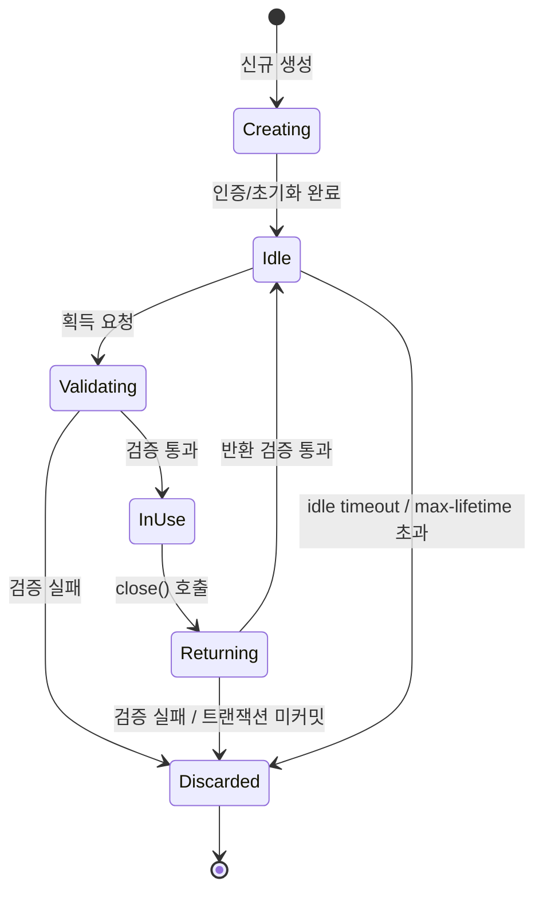
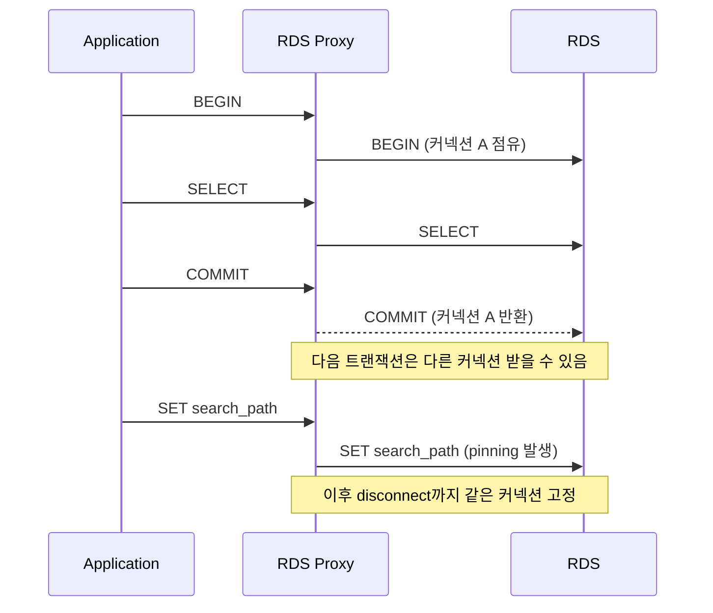

# DB Connection Pool 종합

## 왜 풀이 필요한가

TCP 핸드셰이크, TLS 협상, 인증, 세션 변수 초기화까지 합치면 PostgreSQL/MySQL 한 커넥션을 새로 만드는 데 보통 30~150ms 든다. 1초에 수백 건 들어오는 API에서 매번 새 커넥션을 열면 RDBMS 쪽 인증 스레드가 먼저 무너진다. 풀은 이걸 미리 만들어 놓고 빌려주는 캐시일 뿐이다.

문제는 풀이 캐시라는 점에서 출발하는 모든 골치 — 만료된 커넥션, 누수된 커넥션, 풀 안에서만 보이는 트랜잭션 상태, RDBMS가 끊었는데 풀은 모르는 상태 — 가 운영 사고의 90%를 차지한다. 풀 자체를 잘 모르고 디폴트만 쓰면 평소엔 문제없다가 트래픽 피크나 RDS failover 같은 한순간에 전부 터진다.

ECS Task의 풀 분배는 [Connection_Limit.md](../Resilience/Connection_Limit.md)에서 다뤘고, Node 진영의 풀 라이브러리(pg, mysql2, knex)는 별도 문서가 있다. 이 문서는 RDBMS 쪽 `max_connections` 관점, prepared statement 캐시, 트랜잭션 풀링 같은 일반론을 정리한다.

## 커넥션 라이프사이클

풀 안에서 커넥션은 다음 상태를 오간다.



각 단계마다 잘못 동작하는 케이스가 다르다.

- **Creating**: RDBMS의 `max_connections` 초과로 거절당하면 풀이 `acquire timeout`을 던진다. 클라이언트에선 DB 응답 지연으로 보이지만 실은 연결조차 못 한 상태다.
- **Idle → Validating**: 풀이 들고 있던 동안 DB가 idle session을 끊었거나, NAT/방화벽이 idle TCP를 회수한 경우. 검증을 안 하면 첫 쿼리에서 `Connection reset by peer`가 난다.
- **InUse → Returning**: 애플리케이션이 트랜잭션을 커밋/롤백하지 않고 close()만 호출하면 풀은 자동 롤백을 시도한다. 라이브러리에 따라 이 동작이 다르고, 안 하는 라이브러리도 있다.
- **Idle → Discarded**: max-lifetime을 안 걸어두면 한 커넥션이 며칠씩 살면서 메모리(prepared statement 캐시)를 누적한다.

## 풀 사이징 — Little's Law 기반

풀 크기를 키우면 처리량이 늘 거라 생각하지만 실제로는 일정 지점부터 떨어진다. RDBMS의 락, CPU, IO가 동시 처리 가능한 트랜잭션 수에 한계를 갖기 때문이다.

### Little's Law 적용

큐잉 이론의 기본 공식을 풀에 그대로 쓴다.

```
L = λ × W
```

- L: 동시에 풀 안에서 사용 중인 커넥션 수
- λ: 초당 도착하는 쿼리 수 (TPS)
- W: 쿼리 한 건의 평균 실행 시간 (초)

예시: TPS 200, 평균 쿼리 30ms면 동시에 필요한 커넥션은 `200 × 0.03 = 6`개. 여기에 안전 마진과 지연 변동을 감안해 보통 2~3배인 12~18을 풀 크기로 잡는다.

이 계산이 안 맞는 케이스가 셋 있다.

1. 평균이 아니라 p99이 문제다. 평균 30ms여도 p99이 500ms면 그 시간 동안 풀이 점유된다. p99 기준으로 다시 계산해야 한다.
2. 트래픽이 균일하지 않다. burst 트래픽 ×2~3배까지 고려해야 한다.
3. 트랜잭션을 끼고 외부 API를 호출하면 W가 외부 API 응답시간만큼 늘어난다. 이 패턴이 들어가면 풀이 순식간에 마른다.

### max_connections와의 관계

PostgreSQL의 `max_connections` 디폴트는 100, MySQL은 151. 이 한도는 RDBMS 한 인스턴스 전체에 대한 값이다. 백엔드 애플리케이션 인스턴스가 N개 떠 있으면 분배해야 한다.

```
인스턴스당 풀 크기 = (max_connections - 관리/모니터링용 여유분) / 인스턴스 수
```

PostgreSQL은 커넥션 하나당 백엔드 프로세스가 하나 뜨고, 프로세스당 메모리(work_mem 등 포함)를 점유한다. RDS db.r6g.large(16GB) 기준으로 max_connections=400을 넘기면 메모리 부족이 보인다. AWS는 `LEAST({DBInstanceClassMemory/9531392}, 5000)` 공식을 쓰니 인스턴스 클래스를 키울 게 아니라면 무작정 올릴 수 없다.

ECS에서 Auto Scaling이 도는 경우엔 더 복잡하다. 평소 N=4, 피크 N=20으로 늘어나는 환경이라면 풀 크기를 인스턴스당 5로 잡아도 피크에 100을 잡아먹는다. 이 부분은 [Connection_Limit.md](../Resilience/Connection_Limit.md)에서 자세히 다룬다.

### Hikari 저자의 공식

HikariCP 위키에 나온 경험식은 다음과 같다.

```
connections = ((core_count × 2) + effective_spindle_count)
```

DB 서버의 CPU 코어 수 × 2에 디스크 스핀들 수를 더한다. SSD/NVMe면 spindle은 1로 본다. 8코어 RDS면 17 정도가 나오는데, 실제로 이 정도가 처리량이 가장 좋다는 벤치마크가 있다. 의외로 작아서 처음 보면 놀라지만, 풀이 작을수록 RDBMS 내부 락 경합이 줄어 처리량이 올라간다는 게 핵심이다.

## 타임아웃 종류

타임아웃 이름이 라이브러리마다 다른데 기능은 다음 다섯 가지로 나뉜다.

| 종류 | 의미 | 보통 값 |
|------|------|---------|
| connection timeout | 풀에서 커넥션 획득 대기 한도 | 3~10초 |
| socket timeout | 쿼리 실행 중 네트워크 응답 대기 | 30~60초 |
| idle timeout | 풀에 놀고 있는 커넥션 회수 | 5~10분 |
| max lifetime | 커넥션 최대 수명, 강제 폐기 | 30분 |
| validation timeout | 검증 쿼리 응답 대기 | 1~3초 |

각각의 함정.

**connection timeout이 너무 길면** 풀 고갈 시 요청이 줄줄이 대기하다 동시에 깨어나 thundering herd가 된다. 짧게(3초) 잡고 빨리 실패시키는 게 낫다.

**socket timeout을 안 걸면** RDBMS가 멈춘 동안 워커 스레드가 무한 대기한다. JVM이면 스레드가 안 풀리고, Node면 이벤트 루프 동기 블로킹은 없지만 풀 안 커넥션이 모두 점유된다.

**idle timeout과 RDBMS의 `wait_timeout`/`idle_in_transaction_session_timeout` 충돌**. RDBMS가 먼저 끊으면 풀이 죽은 커넥션을 들고 있다가 다음 쿼리에서 깨진다. 풀의 idle timeout은 RDBMS의 idle 한도보다 짧게 잡아야 한다.

**max lifetime은 ELB/NLB의 idle timeout(350초)보다도 짧게**. NLB가 중간에 TCP를 끊는데 양쪽 다 모르면 풀이 좀비를 들고 있다. AWS RDS Proxy를 쓰지 않는 이상 max lifetime을 안 걸면 언젠가 터진다.

**validation timeout은 acquire 경로에 들어간다**. 검증 쿼리가 1초 걸리면 모든 획득이 1초씩 느려진다. `SELECT 1`이 1초 걸린다면 RDBMS가 이미 죽어가는 중이니, 차라리 `JDBC4 isValid()`처럼 ping 패킷만 보내는 검증을 쓰는 게 낫다.

## 검증 — validation의 진짜 비용

풀이 idle 커넥션을 빌려줄 때 정말 살아있는지 확인하는 단계다. 옵션이 둘이다.

```
1. test on borrow: 매번 빌려줄 때 검증 → 안전, 느림
2. background validation: 주기적으로 idle 검증 → 빠름, 가끔 깨진 거 빌려줌
```

HikariCP는 `connectionTestQuery`를 비우면 JDBC4 `isValid()`를 쓰는데, 이건 ping 레벨이라 거의 무료다. 하지만 일부 드라이버는 `isValid()`를 제대로 구현 안 했고, 그러면 어쩔 수 없이 `SELECT 1`로 폴백한다.

PostgreSQL에서 한 가지 함정이 있다. `SELECT 1`을 검증 쿼리로 쓰면 RDBMS의 `pg_stat_statements` 카운터가 폭증한다. 풀당 초당 수십 건씩 나가면 통계 테이블 자체가 무거워진다. `pg_stat_statements.max`가 5000이면 다른 쿼리가 밀려난다.

## 누수 탐지

풀 누수는 close()를 까먹은 코드 한 줄 때문에 일어난다. 1만 번에 한 번 일어나는 분기에서 누수가 있으면 평소엔 모르고 있다가 며칠 뒤 풀이 다 차서 장애가 난다.

### Leak Detection Threshold

HikariCP의 `leakDetectionThreshold`는 커넥션이 빌려진 채 임계 시간을 넘기면 stack trace를 로그로 찍는다. 디폴트는 0(꺼짐). 운영에선 보통 30초~2분으로 잡는다.

```yaml
spring:
  datasource:
    hikari:
      leak-detection-threshold: 60000
      maximum-pool-size: 20
```

찍히는 로그는 다음과 같다.

```
WARN HikariPool-1 - Connection leak detection triggered for
  ProxyConnection@1234, stack trace follows
  java.lang.Exception: Apparent connection leak detected
    at OrderService.processOrder(OrderService.java:142)
    at OrderController.create(OrderController.java:55)
```

이 stack trace는 커넥션을 **획득한 시점**의 것이다. 어디서 빌렸는지는 알아도 어디서 close를 빠뜨렸는지는 알 수 없다. 보통 획득한 함수가 close까지 책임지는 패턴이라 실무에선 이 정도로 충분하다.

### 진짜 누수 vs 느린 쿼리

leakDetectionThreshold에 걸렸다고 무조건 누수는 아니다. 진짜 오래 걸리는 쿼리(배치, 리포트)일 수도 있다. 구분 방법.

- 트랜잭션이 정상 종료되고 close가 호출되었는가 → 로그에 close 이벤트가 찍히는지 본다
- 같은 stack trace가 반복되는가 → 누수 가능성 높음
- 점유 시간이 분 단위로 늘어나는가 → 누수 (단순 느린 쿼리는 보통 30초 안에 끝나거나 socket timeout으로 끊긴다)

## 라이브러리별 동작 차이

JDBC 풀러 네 개를 운영해본 입장에서 정리한다.

### HikariCP

스프링 부트 2.0+ 기본값이고 사실상 표준이다. 코드 베이스가 작고 동시성 제어가 깔끔하다. ConcurrentBag이라는 자체 자료구조로 lock-free에 가깝게 동작한다.

특징:
- 스레드별 마지막 사용 커넥션을 우선 빌려주는 ThreadLocal 캐시 → 같은 스레드가 같은 커넥션을 재사용
- 풀 자동 확장만 지원, 축소 안 함 (idle timeout으로 회수)
- maxLifetime을 강제로 권장 (주석에서 "you should set this" 명시)

함정: maxLifetime + idleTimeout 조합이 잘못되면 커넥션이 계속 폐기/생성을 반복한다. maxLifetime은 idleTimeout보다 커야 하고, RDBMS의 `wait_timeout`보다 30초 이상 짧아야 한다.

### Tomcat JDBC Pool

Tomcat에 번들된 풀. DBCP를 대체할 목적으로 만들어졌다. 인터셉터(JdbcInterceptor)로 쿼리/연결 동작을 가로챌 수 있어 디버깅에 유용하다.

```xml
<Resource name="jdbc/db"
  factory="org.apache.tomcat.jdbc.pool.DataSourceFactory"
  jdbcInterceptors="ConnectionState;StatementFinalizer;SlowQueryReport(threshold=1000)"
/>
```

`SlowQueryReport`로 1초 이상 걸린 쿼리를 풀 레벨에서 로깅할 수 있다. 운영 트러블슈팅에 의외로 유용하다.

### c3p0

스프링 2.x 시절의 표준. 동시성 처리가 무거워서 부하가 높을 때 풀 자체가 병목이 된다. 신규 프로젝트엔 안 쓴다. 기존 레거시 유지보수에서만 본다.

특징적인 함정: `unreturnedConnectionTimeout`을 걸면 일정 시간 안 돌아온 커넥션을 강제 회수하는데, 이게 트랜잭션 중인 커넥션도 끊어버린다. 데이터 손실로 이어진 사례를 본 적 있다.

### DBCP / DBCP2

Apache Commons DBCP. 가장 오래된 풀 중 하나. 동기화 블록이 많아 멀티 스레드 환경에서 성능이 떨어진다. DBCP2에서 lock-free에 가깝게 개선됐지만 HikariCP보단 여전히 느리다.

`removeAbandoned` 기능이 c3p0의 `unreturnedConnectionTimeout`과 같은 위험을 가진다. 운영에서 켜면 안 된다.

### 정리

| 풀러 | 권장 환경 | 주요 함정 |
|------|-----------|-----------|
| HikariCP | 신규/모든 환경 | maxLifetime 미설정 시 좀비 |
| Tomcat JDBC | 톰캣 환경, 인터셉터 필요 | 인터셉터 잘못 끼면 메모리 누수 |
| c3p0 | 레거시만 | unreturnedConnectionTimeout |
| DBCP2 | 레거시만 | removeAbandoned |

## Prepared Statement 캐시

이 부분이 풀 운영에서 가장 빠뜨리기 쉬운 함정이다.

### 왜 캐시하는가

prepared statement는 SQL을 파싱·플래닝한 결과를 RDBMS가 들고 있다가 재사용하는 메커니즘이다. PostgreSQL의 경우 `PREPARE`로 만든 statement는 세션 내내 유지된다. 풀이 커넥션을 재사용하면 prepared statement도 같이 재사용되니 파싱 비용을 아낄 수 있다.

JDBC 드라이버는 `PreparedStatement` 객체를 캐시한다. PostgreSQL JDBC 드라이버의 `prepareThreshold`(디폴트 5)는 같은 SQL을 5번 실행하면 그제서야 서버 측 prepared statement를 만든다. 단발성 쿼리에 prepared statement 만들면 오히려 손해라서다.

### 캐시 폭주 사고

문제는 동적 쿼리. 다음 코드를 보자.

```java
// 안 좋은 패턴
String sql = "SELECT * FROM orders WHERE id = " + orderId;
```

이건 SQL injection이라 누구도 안 쓰지만, 다음은 흔하다.

```java
// 컬럼 동적 조립
String sql = "SELECT * FROM orders WHERE " + col + " = ?";
```

`col`이 50개 있으면 SQL 50종이 만들어지고, 각각이 prepared statement로 캐시된다. 커넥션 하나가 50개를 들고 있고 풀에 20개 커넥션이 있으면 1000개가 RDBMS 메모리에 산다. 더 큰 문제는 ORM이 자동 생성하는 SQL이다. 동적 WHERE 절이 많은 쿼리(MyBatis dynamic SQL, JPA Criteria)는 SQL 시그니처가 천 단위로 늘어난다.

PostgreSQL의 prepared statement는 `pg_prepared_statements` 뷰로 보인다. 한 세션에서 수천 개가 잡히면 해당 백엔드 프로세스 메모리가 GB 단위로 부풀고, OOM killer가 발동해 RDS가 강제 재시작된다. 실제로 RDS 인스턴스 전체가 4분간 다운된 사고를 겪었다.

### 방어법

```yaml
# PostgreSQL JDBC URL
jdbc:postgresql://host/db?prepareThreshold=0&preparedStatementCacheQueries=0
```

- `prepareThreshold=0`: 서버 측 prepared statement 비활성화. 클라이언트 측 plan만 사용
- `preparedStatementCacheQueries=0`: JDBC 드라이버 측 캐시도 비활성화

PgBouncer를 transaction pooling 모드로 쓸 때는 prepared statement가 작동하지 않으니 어차피 끄게 된다.

다른 방법으로 maxLifetime을 짧게(15분) 잡아 주기적으로 커넥션을 폐기하면 캐시도 초기화된다. 다만 이건 증상 완화일 뿐 근본 대책은 동적 SQL 자체를 줄이는 것이다.

## 외부 풀러 — PgBouncer / RDS Proxy

애플리케이션 풀과 별도로 RDBMS 앞단에 두는 풀러다. 마이크로서비스 환경에서 인스턴스 수가 급증하면 RDBMS의 `max_connections`로는 감당이 안 되니, 중간에 풀러를 두고 RDBMS 측 커넥션을 공유한다.

### Transaction Pooling vs Session Pooling

PgBouncer는 풀링 모드를 셋 지원한다.

| 모드 | 커넥션 반환 시점 | 사용 가능 기능 |
|------|-----------------|----------------|
| session | 클라이언트가 disconnect | 모든 PostgreSQL 기능 |
| transaction | 트랜잭션 종료 시 | prepared statement/세션 변수/advisory lock 못 씀 |
| statement | 쿼리 한 건 끝날 때 | 트랜잭션 못 씀 |

운영에서 99%는 transaction pooling을 쓴다. 한 RDBMS 커넥션을 트랜잭션 단위로 잘게 쪼개 여러 클라이언트가 공유한다. 100개 백엔드가 RDBMS 커넥션 20개로 처리되는 게 가능하다.

### Transaction Pooling의 함정

세션 상태에 의존하는 모든 게 깨진다.

```sql
-- 깨지는 패턴 1: prepared statement
PREPARE stmt AS SELECT * FROM users WHERE id = $1;
-- 다음 트랜잭션이 다른 백엔드 커넥션을 받으면 stmt가 없다

-- 깨지는 패턴 2: 세션 변수
SET search_path = 'tenant_42';
-- 다음 트랜잭션은 search_path가 default

-- 깨지는 패턴 3: advisory lock
SELECT pg_advisory_lock(123);
-- lock이 다른 트랜잭션으로 넘어가지 않는다
```

JDBC 드라이버의 prepared statement 자동 사용도 막아야 한다. Spring Boot + HikariCP + PgBouncer 조합에서 이걸 빠뜨려서 첫 배포 30초 만에 장애가 난 케이스를 본 적 있다.

```yaml
spring:
  datasource:
    url: jdbc:postgresql://pgbouncer:6432/db?prepareThreshold=0
```

### RDS Proxy

AWS의 매니지드 PgBouncer 격이다. PgBouncer 직접 운영의 단점(HA 구성, 모니터링, 버전 관리)을 AWS가 가져간 형태다.

특징:
- 트랜잭션 풀링이 기본. 세션 상태가 필요한 쿼리는 자동으로 "session pinning"으로 폴백
- IAM 인증 지원. Secrets Manager 연동
- failover 시 커넥션을 가로채 페일오버 시간을 줄여준다 (보통 30초 → 5~10초)

session pinning이 함정이다. 트랜잭션 풀링을 기대하고 도입했는데 prepared statement나 세션 변수 때문에 pinning이 발생하면 실질적으로 session pooling으로 동작한다. CloudWatch의 `DatabaseConnectionsBorrowLatency`와 `DatabaseConnectionsCurrentlySessionPinned`를 봐야 한다. pinning 비율이 높으면 RDS Proxy의 의미가 없다.



### 두 단계 풀

애플리케이션 풀과 PgBouncer/RDS Proxy를 같이 쓰면 풀이 두 단이 된다. 사이즈 계산이 까다롭다.

```
[App 1: pool 20] ─┐
[App 2: pool 20] ─┼─→ [PgBouncer: pool 100] ─→ [RDS: max_connections 200]
[App 3: pool 20] ─┘
```

App 풀은 인스턴스 안에서 발생하는 동시성에 맞춰 잡고, PgBouncer 풀은 RDBMS에 가하고 싶은 부하 한도에 맞춰 잡는다. App 쪽 풀을 너무 작게 잡으면 PgBouncer 앞에서 대기가 생긴다. 보통 App 풀 합 = PgBouncer 풀의 2~4배 정도가 적당하다.

## 실제 장애 사례

### 사례 1: 풀 고갈 → API 전체 다운

증상: 평소 응답시간 50ms인 API가 갑자기 모든 요청이 타임아웃.

원인: 새로 추가된 외부 결제 API 호출이 트랜잭션 안에 들어가 있었다.

```java
@Transactional
public void processOrder(Order order) {
    orderRepository.save(order);
    paymentClient.charge(order); // 5~30초 걸림, 트랜잭션 점유
    notificationService.send(order);
}
```

평균 결제 응답이 3초여서 처음엔 안 보였는데, 결제 API가 burst로 느려진 순간 풀(20개) 안 커넥션이 모두 외부 API 응답을 기다리며 잡혔다. 다른 API까지 풀을 못 받아 전부 타임아웃.

해결: 결제 API 호출을 트랜잭션 밖으로 빼고, 결제 결과는 별도 트랜잭션에서 반영했다. Little's Law로 다시 계산하면 W에 외부 API 시간이 빠지면서 필요 풀 크기가 5분의 1로 줄었다.

### 사례 2: prepared statement 캐시로 인한 RDS OOM

증상: RDS 인스턴스가 매주 토요일 새벽 1시에 재시작.

원인: 주간 리포트 배치가 동적 WHERE 절로 100여 종의 SQL을 생성. 각 쿼리가 prepared statement로 캐시되며 커넥션 하나가 100개를 들고 있었다. 풀이 30개니 RDBMS 측 prepared statement가 3000개. 토요일 새벽에 다른 배치들도 겹쳐 메모리가 한계를 넘어 OOM.

해결: `prepareThreshold=0`으로 서버 측 prepared statement 비활성화. 동적 SQL은 어차피 한 번 쓰고 버리는 거라 prepared statement 만들 가치가 없다.

### 사례 3: DNS 캐시로 RDS failover 미감지

증상: RDS Multi-AZ failover 후 5분간 모든 쿼리 실패.

원인: JVM의 DNS TTL 디폴트가 -1(영구 캐시). RDS endpoint는 failover 시 DNS 레코드가 바뀌는데 JVM이 옛 IP로 계속 연결 시도. 풀이 새 커넥션을 만들 때마다 `ConnectionRefused` 발생.

해결:

```java
// 애플리케이션 시작 시
java.security.Security.setProperty("networkaddress.cache.ttl", "60");
```

또는 JVM 옵션 `-Dsun.net.inetaddr.ttl=60`. AWS SDK는 자체 DNS resolution을 쓰지만 JDBC 드라이버는 JVM DNS 캐시에 의존한다. RDS 사용 시 필수 설정이다. RDS Proxy를 쓰면 이 문제가 사라지는 게 도입 이유 중 하나다.

### 사례 4: idle in transaction 누적

증상: 평일 점심시간만 되면 RDS의 `active_connections`가 max 직전까지 차오름.

원인: 사용자가 Excel 다운로드 화면에서 큰 쿼리를 띄워놓고 점심을 먹으러 감. 트랜잭션은 살아있고 커넥션은 `idle in transaction` 상태. PostgreSQL은 이 상태에서 vacuum을 못 돌리니 dead tuple이 누적되어 디스크 사용량까지 늘어남.

해결: `idle_in_transaction_session_timeout`을 RDBMS에서 설정.

```sql
ALTER SYSTEM SET idle_in_transaction_session_timeout = '5min';
```

PostgreSQL 9.6+ 기능. MySQL은 `wait_timeout`이 트랜잭션 중에는 안 먹어서 별도로 잡아야 한다. 풀 측의 `maxLifetime`은 idle 상태일 때만 적용되어 idle in transaction은 못 잡는다. RDBMS 설정과 풀 설정이 둘 다 필요한 이유다.

### 사례 5: HikariCP starvation - validateMBean

증상: 새벽에 모든 API가 일시적으로 5초씩 느려짐.

원인: HikariCP의 housekeeping 작업(maxLifetime 만료 커넥션 폐기, 부족분 충전)이 30초마다 돈다. RDBMS가 일시적으로 느려지면 이 housekeeping이 풀 락을 들고 새 커넥션 생성을 기다리는 동안 다른 acquire 요청이 모두 대기.

해결: HikariCP 설정 자체보단 RDBMS 측 인증 지연을 잡았다. RDS의 `pg_hba.conf`에서 reverse DNS lookup이 동작하고 있었고, DNS가 느려지면 인증이 1~2초씩 걸렸다. `hostnossl`을 `hostssl`과 IP 기반으로 바꿔 reverse DNS를 끊었다.

이 사고로 배운 것: 풀 문제처럼 보이는 것의 절반은 RDBMS 측 문제다. 풀 설정만 만지면 답이 안 나온다.

## 모니터링 지표

운영에서 봐야 하는 지표.

**애플리케이션 측 (HikariCP MBean / Micrometer)**
- `hikaricp.connections.active`: 사용 중. 풀 크기에 가까워지면 위험
- `hikaricp.connections.pending`: 획득 대기 중. 0이 정상, 1 이상 지속되면 풀 고갈
- `hikaricp.connections.usage`: 점유 시간 분포. p99이 평소보다 길어지면 누수 의심
- `hikaricp.connections.acquire`: acquire latency. 검증 비용도 여기 포함

**RDBMS 측 (PostgreSQL)**
- `pg_stat_activity`의 state별 카운트. `idle in transaction`이 0이 아니면 점검
- `pg_stat_database.numbackends`: 현재 커넥션 수. max_connections 대비 비율
- `pg_stat_statements`: 어떤 쿼리가 풀을 점유하는지

**RDS Proxy / PgBouncer**
- pinning 비율 (RDS Proxy `DatabaseConnectionsCurrentlySessionPinned`)
- waiting clients (PgBouncer `cl_waiting`)

## 마무리

풀은 단순한 캐시처럼 보여도 운영 사고의 진원지가 된다. 풀 크기, 타임아웃, 검증, 누수 탐지, 라이브러리별 동작, 외부 풀러와의 조합, RDBMS 측 한도까지 어느 한 단계가 어긋나면 평소엔 멀쩡하다가 트래픽 피크나 failover 같은 한순간에 터진다.

다음 문서에서 각론을 더 다룬다.

- 애플리케이션 인스턴스 분배 관점: [Connection_Limit.md](../Resilience/Connection_Limit.md)
- Node.js 풀 라이브러리 동작: [Framework/Node](../../Framework/Node/데이터베이스)
- 데이터베이스 일반: [Database_Deep_Dive.md](Database_Deep_Dive.md)
