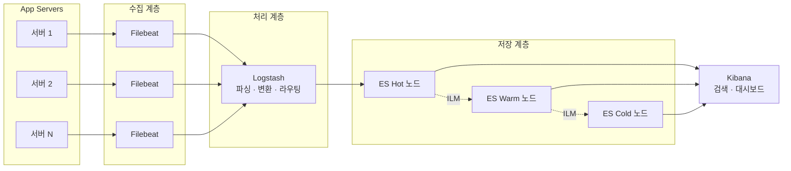
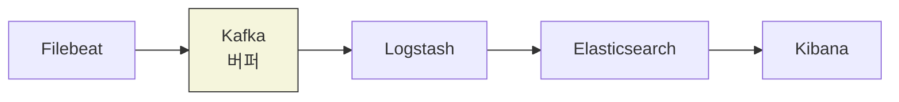
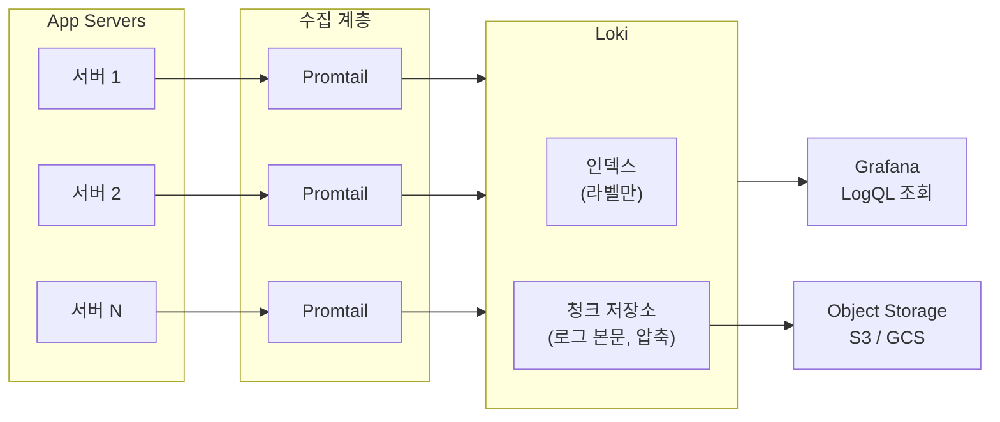
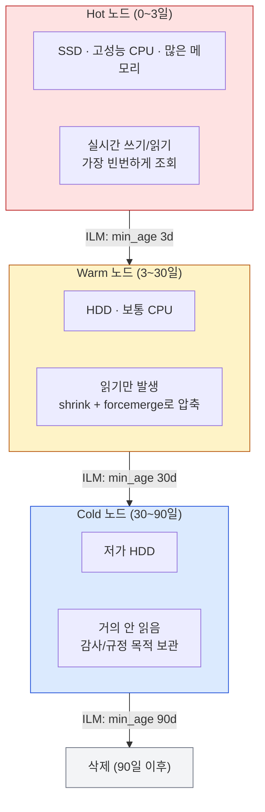

# 로그 수집 파이프라인

## 왜 파이프라인이 필요한가

서버가 1~2대일 때는 SSH 접속해서 `tail -f`로 로그를 본다. 서버가 10대, 50대로 늘어나면 이 방식은 불가능하다. 어떤 서버에서 에러가 났는지조차 모른다.

로그 수집 파이프라인은 세 단계로 나뉜다.

```
수집(Collection) → 처리(Processing) → 저장/조회(Storage & Query)
```

각 서버에 에이전트를 설치하고, 에이전트가 로그를 중앙 서버로 보내고, 중앙 서버에서 파싱·인덱싱한 뒤 검색할 수 있게 만드는 구조다.

---

## ELK 스택: Elasticsearch + Logstash + Kibana

가장 널리 쓰이는 조합이다. 2024년 기준으로 대부분의 중·대규모 서비스가 ELK 또는 ELK 변형을 사용한다.

### 전체 아키텍처



대규모 환경에서는 Filebeat와 Logstash 사이에 Kafka를 넣어서 버퍼링한다. Elasticsearch가 일시적으로 처리를 못 해도 Kafka에 로그가 남아있어서 유실을 막는다.



### 구성 요소별 역할

```
[App Server] → Filebeat → Logstash → Elasticsearch → Kibana
                (수집)      (파싱)       (저장/인덱싱)   (조회/시각화)
```

**Filebeat**: 각 서버에 설치하는 경량 에이전트. 로그 파일을 읽어서 Logstash나 Elasticsearch로 전송한다. 메모리 사용량이 적어서 프로덕션 서버에 부담이 거의 없다.

**Logstash**: 로그를 받아서 파싱하고 변환한다. 정규식으로 비정형 로그를 구조화하거나, 필드를 추가/삭제하거나, 여러 소스의 로그를 하나로 합친다.

**Elasticsearch**: 파싱된 로그를 저장하고 인덱싱한다. 전문 검색 엔진이라서 텍스트 검색이 빠르다. JSON 문서 기반이고 분산 저장을 지원한다.

**Kibana**: 웹 UI에서 로그를 검색하고 대시보드를 만든다. Discover 화면에서 KQL(Kibana Query Language)로 로그를 필터링한다.

### Filebeat 설정 예시

```yaml
# /etc/filebeat/filebeat.yml
filebeat.inputs:
  - type: log
    enabled: true
    paths:
      - /var/log/app/*.log
    # 멀티라인 처리: Java 스택트레이스는 한 줄이 아니다
    multiline.pattern: '^\d{4}-\d{2}-\d{2}'
    multiline.negate: true
    multiline.match: after

    # 필드 추가 - 어떤 서버에서 온 로그인지 구분용
    fields:
      service: order-api
      env: production

output.logstash:
  hosts: ["logstash-server:5044"]
  # 네트워크 끊겼을 때 로그 유실 방지
  bulk_max_size: 2048
  worker: 2
```

멀티라인 설정을 빠뜨리면 Java 스택트레이스가 줄마다 별개의 로그로 잡힌다. 에러 하나가 로그 50줄로 쪼개져서 검색이 안 되는 경우가 생긴다.

### Logstash 파이프라인 설정

```ruby
# /etc/logstash/conf.d/app-pipeline.conf
input {
  beats {
    port => 5044
  }
}

filter {
  # 로그 포맷: 2026-03-29 14:23:45.123 [http-nio-8080-exec-1] ERROR c.e.OrderService - 주문 처리 실패
  grok {
    match => {
      "message" => "%{TIMESTAMP_ISO8601:timestamp} \[%{DATA:thread}\] %{LOGLEVEL:level} %{DATA:logger} - %{GREEDYDATA:msg}"
    }
  }

  date {
    match => ["timestamp", "yyyy-MM-dd HH:mm:ss.SSS"]
    target => "@timestamp"
    timezone => "Asia/Seoul"
  }

  # 불필요한 필드 제거 (디스크 절약)
  mutate {
    remove_field => ["timestamp", "host", "agent"]
  }

  # ERROR 레벨만 별도 인덱스로 분리하고 싶을 때
  if [level] == "ERROR" {
    mutate {
      add_field => { "[@metadata][index_prefix]" => "error-logs" }
    }
  } else {
    mutate {
      add_field => { "[@metadata][index_prefix]" => "app-logs" }
    }
  }
}

output {
  elasticsearch {
    hosts => ["http://es-node-1:9200", "http://es-node-2:9200"]
    index => "%{[@metadata][index_prefix]}-%{+YYYY.MM.dd}"
    # 인증 설정
    user => "logstash_writer"
    password => "${LOGSTASH_ES_PASSWORD}"
  }
}
```

grok 패턴이 로그 포맷과 안 맞으면 `_grokparsefailure` 태그가 붙는다. 파이프라인 배포 전에 Kibana의 Grok Debugger로 패턴을 테스트해야 한다. 로그 포맷이 바뀌었는데 grok 패턴을 안 고치면 파싱이 깨진 로그가 쌓인다.

### Elasticsearch 인덱스 관리

일별 인덱스(`app-logs-2026.03.29`)를 쓰는 이유가 있다. 오래된 로그를 삭제할 때 인덱스 단위로 삭제하는 게 문서 단위 삭제보다 훨씬 빠르고 리소스를 덜 먹는다.

인덱스 템플릿으로 매핑을 미리 정의한다.

```json
PUT _index_template/app-logs-template
{
  "index_patterns": ["app-logs-*"],
  "template": {
    "settings": {
      "number_of_shards": 3,
      "number_of_replicas": 1,
      "index.refresh_interval": "5s"
    },
    "mappings": {
      "properties": {
        "level":   { "type": "keyword" },
        "logger":  { "type": "keyword" },
        "thread":  { "type": "keyword" },
        "msg":     { "type": "text" },
        "service": { "type": "keyword" },
        "env":     { "type": "keyword" }
      }
    }
  }
}
```

`keyword` 타입은 정확히 일치하는 검색과 집계에 쓴다. `text` 타입은 전문 검색(토큰 분석)에 쓴다. 로그 레벨이나 서비스명 같은 필드를 `text`로 잡으면 집계가 안 되거나 느려진다.

---

## Loki + Grafana 스택

Grafana Labs에서 만든 로그 수집 시스템이다. Elasticsearch와 근본적으로 다른 점은 **로그 본문을 인덱싱하지 않는다**는 것이다. 라벨(메타데이터)만 인덱싱하고, 로그 본문은 압축해서 저장한다.

### ELK와 비교

```
ELK:  로그 텍스트 전체를 인덱싱 → 빠른 전문 검색 가능 → 저장 비용 큼
Loki: 라벨만 인덱싱 → 전문 검색 느림 → 저장 비용 작음
```

하루에 로그가 수백 GB씩 쌓이는데 대부분 검색할 일이 없다면 Loki가 비용 면에서 유리하다. 반면 로그 본문에서 특정 문자열을 검색하는 일이 잦다면 ELK가 낫다.

### 구성



Promtail은 Loki 전용 에이전트다. Filebeat 역할을 한다고 보면 된다. Loki는 라벨 인덱스와 로그 청크를 분리해서 저장하는데, 청크는 S3 같은 오브젝트 스토리지에 넣을 수 있어서 저장 비용이 크게 줄어든다.

### Promtail 설정 예시

```yaml
# /etc/promtail/config.yml
server:
  http_listen_port: 9080

positions:
  filename: /tmp/positions.yaml

clients:
  - url: http://loki:3100/loki/api/v1/push

scrape_configs:
  - job_name: app-logs
    static_configs:
      - targets:
          - localhost
        labels:
          job: order-api
          env: production
          __path__: /var/log/app/*.log

    pipeline_stages:
      # 로그에서 레벨 추출해서 라벨로 붙이기
      - regex:
          expression: '^\d{4}-\d{2}-\d{2} \d{2}:\d{2}:\d{2}\.\d{3} \[\S+\] (?P<level>\w+)'
      - labels:
          level:
      # DEBUG 로그는 수집하지 않기 (볼륨 줄이기)
      - match:
          selector: '{level="DEBUG"}'
          action: drop
```

라벨을 너무 많이 만들면 Loki 성능이 급격히 나빠진다. 카디널리티가 높은 값(user_id, request_id 같은 것)을 라벨로 쓰면 안 된다. 라벨은 서비스명, 환경, 로그 레벨 정도만 쓰는 게 맞다.

### LogQL 쿼리

Grafana에서 Loki 로그를 조회할 때 LogQL을 쓴다. PromQL과 문법이 비슷하다.

```logql
# 특정 서비스의 ERROR 로그 조회
{job="order-api", level="ERROR"}

# 로그 본문에서 특정 문자열 필터링
{job="order-api"} |= "NullPointerException"

# 정규식 필터링
{job="order-api"} |~ "timeout|connection refused"

# 최근 1시간 동안 분당 에러 수
rate({job="order-api", level="ERROR"}[1m])

# JSON 로그 파싱 후 특정 필드 필터링
{job="order-api"} | json | response_time > 3000
```

`|=`는 문자열 포함 필터, `|~`는 정규식 필터다. 라벨 필터를 먼저 적용하고 그 다음에 본문 필터를 걸어야 한다. 라벨 필터 없이 본문 검색만 하면 전체 로그를 스캔해서 느리다.

---

## Fluentd vs Filebeat

둘 다 로그 수집 에이전트인데 성격이 다르다.

| 항목 | Filebeat | Fluentd |
|------|----------|---------|
| 언어 | Go | Ruby + C |
| 메모리 사용 | 약 10~30MB | 약 40~100MB |
| 플러그인 생태계 | Elastic 생태계 중심 | 700개 이상, 다양한 출력 지원 |
| 로그 변환 | 제한적 (프로세서) | 필터 플러그인으로 자유롭게 가능 |
| 주 사용처 | ELK 스택 연동 | 다양한 백엔드로 라우팅 |

Filebeat는 가볍고 설정이 단순하다. ELK 스택이면 Filebeat로 충분하다. Fluentd는 로그를 여러 곳으로 보내거나 복잡한 변환이 필요할 때 쓴다. Elasticsearch와 S3에 동시에 보내고 싶다거나, 로그 포맷을 크게 변환해야 하는 경우다.

### Fluentd 설정 예시

```xml
# /etc/fluentd/fluent.conf
<source>
  @type tail
  path /var/log/app/*.log
  pos_file /var/log/fluentd/app.log.pos
  tag app.log
  <parse>
    @type regexp
    expression /^(?<time>\d{4}-\d{2}-\d{2} \d{2}:\d{2}:\d{2}\.\d{3}) \[(?<thread>[^\]]+)\] (?<level>\w+) (?<logger>\S+) - (?<message>.*)$/
    time_key time
    time_format %Y-%m-%d %H:%M:%S.%L
  </parse>
</source>

# Elasticsearch로 전송
<match app.log>
  @type elasticsearch
  host es-node-1
  port 9200
  logstash_format true
  logstash_prefix app-logs

  <buffer>
    @type memory
    flush_interval 5s
    chunk_limit_size 8m
    retry_max_interval 30s
  </buffer>
</match>
```

Fluentd의 buffer 설정이 중요하다. `chunk_limit_size`를 너무 크게 잡으면 Elasticsearch가 bulk 요청을 거부한다. 너무 작게 잡으면 요청 횟수가 늘어서 오버헤드가 생긴다. 보통 5~8MB가 적당하다.

---

## 로그 파싱과 인덱싱 실무

### 비정형 로그 처리

레거시 시스템은 로그 포맷이 제각각인 경우가 많다. 같은 서비스에서도 모듈마다 로그 포맷이 다르다.

```ruby
# Logstash에서 여러 포맷 처리
filter {
  grok {
    match => {
      "message" => [
        # 포맷 1: 표준 Spring Boot 로그
        "%{TIMESTAMP_ISO8601:timestamp} \[%{DATA:thread}\] %{LOGLEVEL:level} %{DATA:logger} - %{GREEDYDATA:msg}",
        # 포맷 2: Nginx 액세스 로그
        "%{IPORHOST:client_ip} - - \[%{HTTPDATE:timestamp}\] \"%{WORD:method} %{URIPATHPARAM:uri} HTTP/%{NUMBER:http_version}\" %{NUMBER:status} %{NUMBER:bytes}",
        # 포맷 3: 레거시 시스템의 커스텀 포맷
        "\[%{DATA:timestamp}\]\[%{LOGLEVEL:level}\] %{GREEDYDATA:msg}"
      ]
    }
  }
}
```

grok 패턴은 위에서부터 순서대로 시도한다. 자주 들어오는 포맷을 위에 놓아야 한다. 안 그러면 매번 실패하고 다음 패턴으로 넘어가면서 CPU를 잡아먹는다.

### JSON 로그를 쓰면 파싱이 편하다

애플리케이션에서 로그를 JSON 형태로 찍으면 grok 없이 바로 파싱된다.

```ruby
# Logstash
filter {
  json {
    source => "message"
  }
}
```

Spring Boot에서 JSON 로그를 찍으려면 logback-logstash-encoder를 쓴다.

```xml
<!-- logback-spring.xml -->
<appender name="JSON" class="ch.qos.logback.core.ConsoleAppender">
  <encoder class="net.logstash.logback.encoder.LogstashEncoder">
    <includeMdcKeyName>traceId</includeMdcKeyName>
    <includeMdcKeyName>userId</includeMdcKeyName>
  </encoder>
</appender>
```

출력 결과:

```json
{
  "@timestamp": "2026-03-29T14:23:45.123+09:00",
  "level": "ERROR",
  "logger_name": "com.example.OrderService",
  "thread_name": "http-nio-8080-exec-1",
  "message": "주문 처리 실패",
  "traceId": "abc123def456",
  "userId": "user-789",
  "stack_trace": "java.lang.NullPointerException: ..."
}
```

이렇게 하면 Logstash에서 grok 파싱을 안 해도 되고, 필드가 정확하게 잡힌다. 새로운 서비스를 만들 때는 처음부터 JSON 로그를 쓰는 게 맞다.

---

## Kibana KQL 쿼리 작성법

Kibana Discover 화면에서 로그를 검색할 때 KQL을 쓴다.

```
# 기본 필드 검색
level: "ERROR"

# AND 조건
level: "ERROR" and service: "order-api"

# OR 조건
level: "ERROR" or level: "WARN"

# 와일드카드
msg: *NullPointer*

# NOT 조건
level: "ERROR" and not service: "batch-job"

# 중첩 조건
level: "ERROR" and (service: "order-api" or service: "payment-api")

# 숫자 범위
response_time >= 3000
```

자주 쓰는 검색 조건은 Kibana에서 저장해두면 된다. 장애 발생 시 매번 쿼리를 짜는 건 시간 낭비다.

Lucene 문법도 쓸 수 있는데, KQL이 더 직관적이다. 다만 정규식 검색은 KQL에서 안 되고 Lucene으로 전환해야 한다.

```
# Lucene 정규식 검색
msg: /timeout.*order.*/
```

---

## 로그 볼륨 증가 시 성능 문제

서비스가 커지면 하루 로그가 수십~수백 GB씩 쌓인다. 이때 흔히 겪는 문제들이 있다.

### 문제 1: Elasticsearch 인덱싱 지연

로그가 들어오는 속도보다 Elasticsearch가 인덱싱하는 속도가 느리면 Logstash에 로그가 쌓이고, 결국 로그 유실이 발생한다.

**대응 방법:**

- `refresh_interval`을 늘린다. 기본값은 1초인데, 로그 용도에서는 5~30초로 늘려도 된다. 검색 결과가 몇 초 늦게 반영되는 건 대부분 문제가 안 된다.
- Logstash와 Elasticsearch 사이에 Kafka를 넣는다. Kafka가 버퍼 역할을 해서 일시적인 처리량 차이를 흡수한다.

```
Filebeat → Kafka → Logstash → Elasticsearch
```

Kafka를 넣으면 구성이 복잡해지지만, 대규모 시스템에서는 거의 필수다. Elasticsearch가 잠깐 죽어도 Kafka에 로그가 남아있어서 유실이 없다.

### 문제 2: 디스크 부족

로그는 계속 쌓인다. 정리 안 하면 디스크가 찬다.

**ILM(Index Lifecycle Management) 설정:**

```json
PUT _ilm/policy/log-retention
{
  "policy": {
    "phases": {
      "hot": {
        "min_age": "0ms",
        "actions": {
          "rollover": {
            "max_size": "50gb",
            "max_age": "1d"
          }
        }
      },
      "warm": {
        "min_age": "3d",
        "actions": {
          "shrink": { "number_of_shards": 1 },
          "forcemerge": { "max_num_segments": 1 },
          "allocate": {
            "require": { "data": "warm" }
          }
        }
      },
      "cold": {
        "min_age": "30d",
        "actions": {
          "allocate": {
            "require": { "data": "cold" }
          }
        }
      },
      "delete": {
        "min_age": "90d",
        "actions": {
          "delete": {}
        }
      }
    }
  }
}
```

### 핫-웜-콜드 아키텍처

Elasticsearch 노드를 용도별로 나눈다.



```
Hot 노드:  SSD, 고성능 CPU → 최근 1~3일 로그 (읽기/쓰기 빈번)
Warm 노드: HDD, 보통 CPU   → 3~30일 로그 (읽기만, 쓰기 없음)
Cold 노드: 저가 HDD        → 30~90일 로그 (거의 안 읽음, 감사 목적 보관)
```

Hot 노드에만 SSD를 쓰고 나머지는 HDD를 쓰면 비용을 크게 줄일 수 있다. ILM 정책에서 `allocate` 액션으로 인덱스가 자동으로 옮겨진다.

노드 설정:

```yaml
# elasticsearch.yml (Hot 노드)
node.attr.data: hot
node.roles: [data_hot, data_content]

# elasticsearch.yml (Warm 노드)
node.attr.data: warm
node.roles: [data_warm]

# elasticsearch.yml (Cold 노드)
node.attr.data: cold
node.roles: [data_cold]
```

### 문제 3: 샤드 수 폭발

일별 인덱스를 쓰면 매일 새 인덱스가 생기고, 인덱스마다 샤드가 만들어진다. 샤드 하나당 Elasticsearch가 관리해야 하는 메타데이터와 메모리가 있다. 샤드가 수만 개를 넘으면 클러스터가 불안정해진다.

**대응:**

- 샤드 하나의 크기를 10~50GB 사이로 유지한다. 하루 로그가 5GB인데 샤드를 5개로 잡으면 샤드당 1GB밖에 안 되어서 낭비다.
- 작은 볼륨의 인덱스는 샤드를 1개로 잡는다.
- ILM의 rollover를 쓰면 인덱스 크기 기준으로 새 인덱스를 만들 수 있어서 시간 기반보다 샤드 관리가 편하다.

---

## 비용 산정 기준

### ELK 스택 비용 구성

**1. 인프라 비용 (자체 호스팅 기준)**

Elasticsearch 클러스터가 가장 비싸다. CPU, 메모리, 디스크 모두 많이 쓴다.

```
하루 로그량: 100GB 기준

Hot 노드 3대:   r5.xlarge (4 vCPU, 32GB) × 3 = 약 월 $600
Warm 노드 2대:  d2.xlarge (4 vCPU, 30GB, HDD 6TB) × 2 = 약 월 $400
Logstash 2대:   c5.large (2 vCPU, 4GB) × 2 = 약 월 $120
Filebeat:       각 서버에 설치, 추가 비용 거의 없음

총 인프라: 약 월 $1,100~1,500 (AWS 기준, 리전마다 다름)
```

**2. 관리형 서비스**

Elastic Cloud나 AWS OpenSearch를 쓰면 운영 부담이 줄지만 비용은 올라간다. 하루 100GB 기준으로 Elastic Cloud는 월 $2,000~3,000 정도 나온다. 인프라 관리 인력이 없으면 관리형이 나을 수 있다.

### Loki 스택 비용

Loki는 로그 본문을 인덱싱하지 않아서 저장 비용이 훨씬 적다.

```
하루 로그량: 100GB 기준

Loki 인스턴스:  r5.large (2 vCPU, 16GB) × 2 = 약 월 $200
오브젝트 스토리지 (S3): 100GB × 30일 = 3TB, 약 월 $70
Promtail:      각 서버에 설치, 추가 비용 거의 없음

총 인프라: 약 월 $300~500
```

ELK 대비 1/3~1/5 수준이다. 다만 전문 검색이 느리다는 트레이드오프가 있다.

### 비용 판단 기준

로그를 얼마나 자주, 어떻게 검색하는지가 기준이다.

- 장애 발생 시 특정 에러 메시지로 빠르게 검색해야 하고, 하루에 수십 번 로그를 뒤진다면 → ELK
- 로그는 보관용이고, 가끔 라벨 기준으로 필터링해서 보는 정도라면 → Loki
- 메트릭 모니터링에 이미 Prometheus + Grafana를 쓰고 있다면 → Loki가 통합이 쉽다
- 보안/감사 로그처럼 장기 보관이 필요하지만 검색 빈도가 낮다면 → Loki + S3

하이브리드도 가능하다. ERROR 이상 로그만 ELK로 보내고, 전체 로그는 Loki로 보내는 구성이다. 중요한 로그는 빠르게 검색하면서 전체 비용을 줄일 수 있다.

---

## 파이프라인 구축 시 주의사항

### 로그 유실 지점

파이프라인에서 로그가 빠지는 지점이 몇 군데 있다.

1. **에이전트 → 중앙 서버**: 네트워크 단절 시. Filebeat는 registry 파일로 어디까지 읽었는지 기록하기 때문에 재연결 후 이어서 보낸다. 하지만 에이전트가 죽으면 메모리에 있던 건 날아간다.
2. **Logstash → Elasticsearch**: Elasticsearch가 응답을 안 하면 Logstash의 내부 큐가 찬다. persistent queue를 켜야 디스크에 임시 저장된다.
3. **디스크 풀**: 어디든 디스크가 차면 로그가 날아간다. 모니터링 필수다.

```yaml
# Logstash persistent queue 설정
# logstash.yml
queue.type: persisted
queue.max_bytes: 4gb
```

### 타임존 문제

서버마다 타임존이 다르면 같은 시간의 로그가 다른 시간으로 찍힌다. Logstash나 Promtail에서 타임존을 명시적으로 지정해야 한다. UTC로 통일하고 Kibana/Grafana에서 보여줄 때만 로컬 타임존으로 변환하는 게 가장 깔끔하다.

### 민감 정보 필터링

로그에 주민번호, 카드번호, 비밀번호 같은 게 찍히는 경우가 있다. 파이프라인 단계에서 마스킹해야 한다.

```ruby
# Logstash에서 카드번호 마스킹
filter {
  mutate {
    gsub => [
      "msg", "\d{4}-\d{4}-\d{4}-\d{4}", "****-****-****-****"
    ]
  }
}
```

애플리케이션 코드에서 찍지 않는 게 가장 좋지만, 실수로 찍히는 경우가 있으니 파이프라인에서 한 번 더 걸러야 한다.
