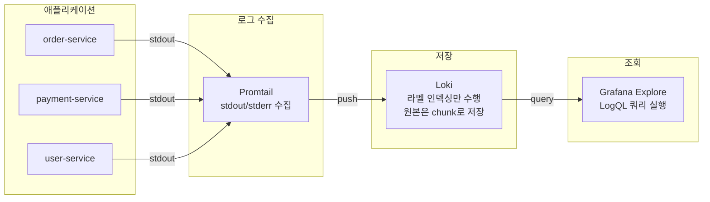
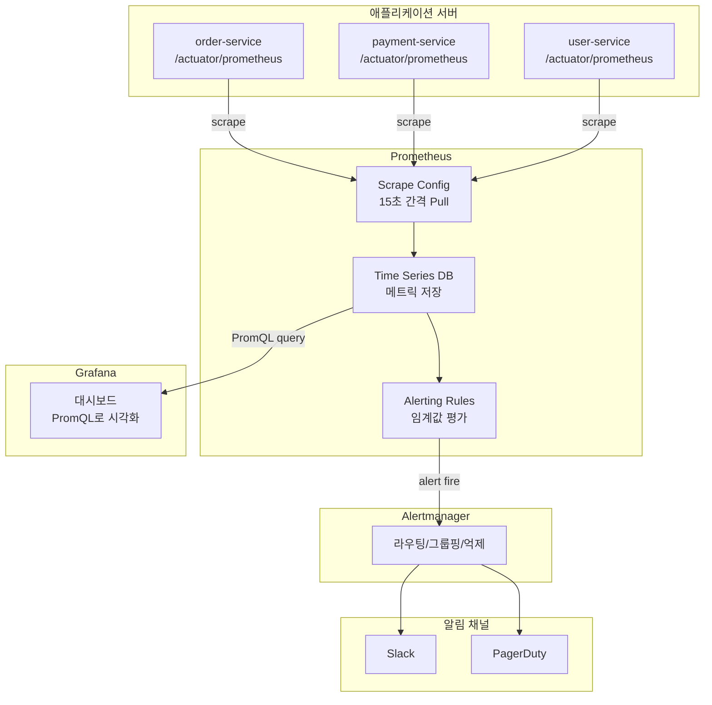
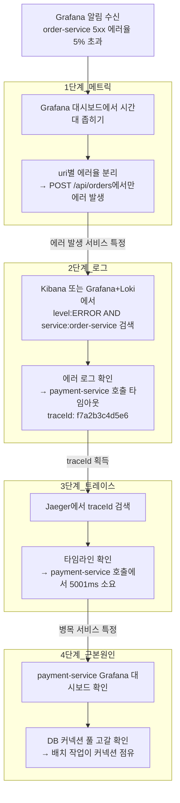

# 로깅 & 모니터링

## 관측 가능성(Observability)의 세 축

프로덕션에서 문제가 터졌을 때 원인을 찾으려면 세 가지 데이터가 필요하다.

```
Logs    → "무엇이 일어났는가" (이벤트 기록)
Metrics → "얼마나 발생하는가" (수치 측정)
Traces  → "어떤 경로로 흘러갔는가" (요청 추적)
```

셋 중 하나만 있으면 반쪽짜리다. 로그만 보면 "에러 났다"는 알지만 얼마나 자주 발생하는지 모른다. 메트릭만 보면 "에러율 5%"라는 숫자는 있지만 어떤 요청에서 터졌는지 모른다. 트레이스만 보면 개별 요청 흐름은 보이지만 전체 시스템 상태는 파악이 안 된다.

| 축 | 도구 | 주로 쓰는 상황 |
|---|------|------|
| **Logs** | ELK, EFK, Loki | 에러 원인 분석, 디버깅, 감사 로그 |
| **Metrics** | Prometheus + Grafana | 시스템 상태 확인, 이상 감지, 알림 |
| **Traces** | Jaeger, Zipkin, OpenTelemetry | MSA에서 서비스 간 요청 흐름 추적 |

---

## 구조화된 로깅 (Structured Logging)

### 텍스트 로그 vs JSON 로그

```
텍스트 방식:
2026-03-01 10:30:00 ERROR 주문 처리 실패 - 주문번호: 12345, 사용자: user@email.com

JSON 방식:
{
  "timestamp": "2026-03-01T10:30:00Z",
  "level": "ERROR",
  "message": "주문 처리 실패",
  "orderId": 12345,
  "userId": "user@email.com",
  "errorCode": "PAYMENT_FAILED",
  "traceId": "abc-123-def",
  "service": "order-service"
}
```

텍스트 로그는 사람이 눈으로 읽기엔 편하지만, Kibana나 Loki에서 검색할 때 문제가 된다. `orderId=12345`로 필터링하려면 JSON이어야 한다. 텍스트 로그에서 정규식으로 파싱하는 건 느리고 깨지기 쉽다.

### Spring Boot 설정

```xml
<!-- logback-spring.xml -->
<configuration>
    <appender name="JSON" class="ch.qos.logback.core.ConsoleAppender">
        <encoder class="net.logstash.logback.encoder.LogstashEncoder">
            <customFields>{"service":"order-service","env":"prod"}</customFields>
        </encoder>
    </appender>

    <root level="INFO">
        <appender-ref ref="JSON" />
    </root>
</configuration>
```

```java
@Slf4j
@Service
public class OrderService {

    public Order createOrder(CreateOrderRequest request) {
        log.info("주문 생성 시작: userId={}, items={}", request.getUserId(), request.getItems().size());

        try {
            Order order = processOrder(request);
            log.info("주문 생성 완료: orderId={}, totalPrice={}", order.getId(), order.getTotalPrice());
            return order;
        } catch (PaymentException e) {
            log.error("결제 실패: userId={}, errorCode={}", request.getUserId(), e.getCode(), e);
            throw e;
        }
    }
}
```

주의할 점이 하나 있다. `LogstashEncoder`를 쓰면 예외의 스택트레이스도 JSON 필드 안에 들어간다. 그런데 스택트레이스가 길면 Elasticsearch 인덱싱 시 필드 크기 제한에 걸리는 경우가 있다. `stackTraceMaxLength`를 설정해서 적당히 잘라야 한다.

---

## 로그 수준 기준

| 수준 | 언제 쓰는가 | 예시 |
|------|------------|------|
| **ERROR** | 즉시 확인이 필요한 상황 | 결제 실패, DB 커넥션 끊김, 외부 API 타임아웃 |
| **WARN** | 당장 장애는 아닌데, 방치하면 커지는 문제 | 디스크 80% 도달, 재시도 3회 발생, 응답 3초 초과 |
| **INFO** | 비즈니스 흐름 기록 | 주문 생성, 사용자 로그인, 배포 완료 |
| **DEBUG** | 개발/디버깅 용도 | 쿼리 파라미터, 캐시 히트 여부, 분기 조건 |
| **TRACE** | 거의 안 씀 | 메서드 진입/반환, 루프 내부 변수 |

실무에서 자주 하는 실수가 ERROR 남발이다. "외부 API 응답이 좀 느렸다" 수준을 ERROR로 찍으면 알림이 계속 울리고, 정작 진짜 장애 알림을 무시하게 된다. 재시도로 복구 가능한 건 WARN, 복구 불가능한 것만 ERROR로 찍어야 한다.

```yaml
# application.yml - 환경별 설정
logging:
  level:
    root: INFO
    com.example: INFO                  # 서비스 코드
    org.hibernate.SQL: WARN            # 프로덕션에서 쿼리 로그 끄기
    org.springframework.web: INFO
```

프로덕션에서 `hibernate.SQL`을 DEBUG로 켜두면 로그 양이 수십 배로 늘어난다. 장애 디버깅 때 일시적으로 켜야 하는 경우가 있는데, Spring Boot Actuator의 `/actuator/loggers` 엔드포인트로 런타임에 로그 레벨을 바꿀 수 있다. 재배포 없이 된다.

```bash
# 런타임에 Hibernate SQL 로그 활성화
curl -X POST http://localhost:8080/actuator/loggers/org.hibernate.SQL \
  -H 'Content-Type: application/json' \
  -d '{"configuredLevel": "DEBUG"}'
```

---

## 로그 수집 스택

### ELK (Elasticsearch + Logstash + Kibana)

```
App → Logstash → Elasticsearch → Kibana
      (수집/파싱)    (저장/검색)     (시각화)
```

전통적인 구성인데, Logstash가 JVM 기반이라 메모리를 많이 먹는다(기본 1GB). 소규모 서비스에서 Logstash만을 위해 1GB를 할당하는 건 부담이 크다.

### EFK (Elasticsearch + Fluentd + Kibana)

Kubernetes 환경에서는 Fluentd를 DaemonSet으로 배포해서 각 노드의 컨테이너 로그를 수집한다.

```
각 Node의 DaemonSet (Fluentd)
    │  ← 컨테이너 stdout/stderr 수집
    ▼
Elasticsearch Cluster
    │
    ▼
Kibana (시각화)
```

| 비교 | Logstash | Fluentd |
|------|----------|---------|
| **메모리** | ~1GB | ~40MB |
| **K8s 지원** | 별도 설정 필요 | DaemonSet 표준 |
| **설정** | 파이프라인 DSL | 태그 기반 라우팅 |

### Loki (경량 대안)

Grafana Labs에서 만든 로그 수집 시스템. Elasticsearch처럼 전문(Full-text) 인덱싱을 하지 않고 라벨 기반으로만 필터링한다.

```
App → Promtail → Loki → Grafana
      (수집)      (저장)   (시각화)
```

인덱싱을 안 하니까 저장 비용이 싸다. 대신 "에러 메시지에 특정 문자열이 포함된 로그"를 검색하면 느리다. Grafana를 이미 쓰고 있으면 대시보드 통합이 편하다는 장점이 있다.

### Grafana + Loki 로그 조회 흐름

실제로 Grafana에서 Loki 로그를 조회할 때 데이터가 어떤 경로로 흘러가는지 정리하면 다음과 같다.



Grafana Explore 화면에서 LogQL로 조회하는 구조다. 라벨 필터(`{service="order-service"}`)는 빠르고, 본문 필터(`|= "timeout"`)는 chunk를 스캔해야 해서 느리다. 라벨 필터로 범위를 먼저 좁히고 본문 필터를 거는 게 핵심이다.

```
# LogQL 조회 예시
{service="order-service", level="error"} |= "timeout" | json | duration > 5s
```

---

## 분산 트레이싱

마이크로서비스에서 하나의 API 요청이 3~4개 서비스를 거칠 때, 어디서 느려지고 어디서 실패했는지 추적하는 구조다.

```
사용자 요청 (traceId: abc-123)
    │
    ▼
API Gateway (spanId: 001)
    │
    ├──▶ User Service (spanId: 002, parentId: 001)
    │
    ├──▶ Order Service (spanId: 003, parentId: 001)
    │       │
    │       └──▶ Payment Service (spanId: 004, parentId: 003)
    │
    └──▶ Notification Service (spanId: 005, parentId: 001)
```

모든 Span이 같은 traceId를 공유하기 때문에, Jaeger UI에서 traceId 하나로 검색하면 전체 호출 흐름이 타임라인으로 나온다.

| 용어 | 의미 |
|------|------|
| **Trace** | 하나의 요청 전체 흐름. 여러 Span으로 구성된다 |
| **Span** | 단일 작업 단위. 서비스 호출 1회에 해당 |
| **Trace ID** | 요청 전체를 묶는 고유 ID |
| **Span ID** | 각 작업의 고유 ID |
| **Parent Span ID** | 이 작업을 호출한 부모의 ID |

### Spring Boot + OpenTelemetry

```gradle
// build.gradle
implementation 'io.micrometer:micrometer-tracing-bridge-otel'
implementation 'io.opentelemetry:opentelemetry-exporter-otlp'
```

```yaml
# application.yml
management:
  tracing:
    sampling:
      probability: 1.0    # 개발: 전체 샘플링, 프로덕션: 0.1~0.3
  otlp:
    tracing:
      endpoint: http://jaeger:4318/v1/traces
```

프로덕션에서 `probability: 1.0`으로 두면 모든 요청마다 트레이스 데이터가 생성되어 Jaeger 저장소가 빠르게 찬다. 보통 0.1(10%)로 시작해서, 특정 서비스만 높이는 방식으로 운영한다.

```java
// traceId가 자동으로 MDC에 들어감
// logback 패턴: %d{yyyy-MM-dd HH:mm:ss} [%X{traceId}] %-5level %msg%n

@Slf4j
@Service
public class OrderService {

    public Order createOrder(CreateOrderRequest request) {
        log.info("주문 생성 시작");
        // 출력: 2026-03-01 10:30:00 [abc-123] INFO 주문 생성 시작
        // 이 traceId로 Jaeger에서 검색하면 관련 서비스 호출 전부 나온다
    }
}
```

---

## 메트릭 & 알림

### Prometheus + Grafana 메트릭 대시보드 구성



Prometheus가 각 서비스의 `/actuator/prometheus` 엔드포인트를 주기적으로 긁어간다(Pull 방식). 수집된 메트릭은 TSDB에 저장되고, Grafana가 PromQL로 조회해서 대시보드에 그린다. 알림은 Prometheus의 alerting rule이 발화하면 Alertmanager를 거쳐 Slack이나 PagerDuty로 간다.

```yaml
# application.yml
management:
  endpoints:
    web:
      exposure:
        include: prometheus, health, info
  metrics:
    tags:
      application: order-service
```

### 봐야 하는 메트릭

| 카테고리 | 메트릭 | 의미 |
|---------|--------|------|
| **응답 시간** | `http_server_requests_seconds` | API 응답 시간. p50보다 p99를 봐야 한다 |
| **에러율** | `http_server_requests` (status=5xx) | 서버 에러 비율 |
| **처리량** | `http_server_requests_seconds_count` | 초당 요청 수. 급격한 변화가 이상 징후 |
| **JVM 메모리** | `jvm_memory_used_bytes` | 힙 사용량. Old Gen 위주로 본다 |
| **DB 커넥션** | `hikaricp_connections_active` | 활성 커넥션 수 |
| **GC** | `jvm_gc_pause_seconds` | GC 중단 시간. 500ms 넘으면 문제 |

p99를 보는 이유가 있다. 평균 응답 시간이 200ms여도, 100번 중 1번은 5초가 걸릴 수 있다. 그 1번이 결제 요청이면 사용자가 이탈한다. p50(중간값)은 시스템이 "대체로 괜찮은지" 볼 때, p99는 "최악의 경우가 얼마나 나쁜지" 볼 때 쓴다.

---

## 장애 상황에서 원인 추적하는 과정

이론은 여기까지고, 실제로 장애가 터졌을 때 로그/메트릭/트레이스를 어떻게 조합하는지 정리한다.

### 시나리오: 결제 성공률이 갑자기 떨어짐

오후 3시에 Grafana 알림이 왔다. "order-service 5xx 에러율 5% 초과".

**1단계: 메트릭으로 범위 좁히기**

Grafana 대시보드에서 시간대를 좁힌다. 3시 정각부터 에러가 치솟았다. `http_server_requests`를 uri 라벨로 그룹핑하면, `/api/orders` POST 요청에서만 에러가 나고 있다. GET은 정상이다.

```promql
# 에러율 확인 - uri별로 분리
sum(rate(http_server_requests_seconds_count{status=~"5.."}[5m])) by (uri)
/
sum(rate(http_server_requests_seconds_count[5m])) by (uri)
```

**2단계: 로그에서 에러 내용 확인**

Kibana(또는 Grafana+Loki)에서 시간 범위를 3시~3시 10분으로 잡고, `level:ERROR AND service:order-service`로 검색한다.

```json
{
  "timestamp": "2026-03-01T15:02:31Z",
  "level": "ERROR",
  "message": "결제 요청 타임아웃",
  "service": "order-service",
  "traceId": "f7a2b3c4d5e6",
  "targetService": "payment-service",
  "timeout": "5000ms"
}
```

payment-service 호출에서 타임아웃이 나고 있다.

**3단계: 트레이스로 병목 확인**

에러 로그에 찍힌 traceId `f7a2b3c4d5e6`를 Jaeger에서 검색한다. 타임라인을 보면:

```
order-service (총 5003ms)
  └── payment-service 호출 (5001ms) ← 여기서 타임아웃
```

payment-service 자체는 응답을 보냈는데 5초가 걸렸다. payment-service의 메트릭을 확인한다.

**4단계: 근본 원인 찾기**

payment-service의 Grafana 대시보드를 보니, 3시부터 DB 커넥션 풀(`hikaricp_connections_active`)이 최대치에 도달해 있다. `hikaricp_connections_pending`도 치솟았다.

payment-service 로그를 보면:

```json
{
  "level": "WARN",
  "message": "HikariPool-1 - Connection is not available, request timed out after 30000ms",
  "activeConnections": 10,
  "maxPoolSize": 10
}
```

커넥션 풀이 고갈된 거다. 이 시간대에 배치 작업이 돌면서 커넥션을 점유하고 있었다. 배치 작업과 API 서빙이 같은 커넥션 풀을 공유하는 게 원인이다.

이 과정을 다이어그램으로 정리하면 다음과 같다.



메트릭(에러율 급등 감지) → 로그(에러 내용 확인) → 트레이스(병목 서비스 특정) → 메트릭(근본 원인 확인)으로 이어지는 흐름이 Observability의 핵심이다.

---

## 로그 보관 정책

로그를 무기한 보관하면 저장 비용이 끝없이 늘어나고, 너무 빨리 지우면 장애 분석이 안 된다. 보관 기간은 로그 종류에 따라 다르게 잡아야 한다.

### 종류별 보관 기준

| 로그 종류 | 보관 기간 | 이유 |
|-----------|----------|------|
| **애플리케이션 로그 (INFO/DEBUG)** | 7~14일 | 디버깅 용도. 2주 이상 지난 INFO 로그를 뒤질 일은 거의 없다 |
| **에러 로그 (ERROR/WARN)** | 30~90일 | 간헐적으로 발생하는 문제는 한 달치 패턴을 봐야 원인이 보인다 |
| **감사 로그 (Audit)** | 1년 이상 | 보안 사고 조사, 컴플라이언스 요구사항. 금융권은 5년 이상 의무 |
| **접근 로그 (Access)** | 30~90일 | 트래픽 분석, 보안 이벤트 조사 |

### Elasticsearch ILM(Index Lifecycle Management) 설정

Elasticsearch를 쓰면 ILM으로 자동 관리할 수 있다.

```json
{
  "policy": {
    "phases": {
      "hot": {
        "actions": {
          "rollover": {
            "max_size": "50GB",
            "max_age": "1d"
          }
        }
      },
      "warm": {
        "min_age": "7d",
        "actions": {
          "shrink": { "number_of_shards": 1 },
          "forcemerge": { "max_num_segments": 1 }
        }
      },
      "cold": {
        "min_age": "30d",
        "actions": {
          "freeze": {}
        }
      },
      "delete": {
        "min_age": "90d",
        "actions": {
          "delete": {}
        }
      }
    }
  }
}
```

Hot(최근 7일) → Warm(7~30일, 압축) → Cold(30~90일, 동결) → Delete(90일 후 삭제) 흐름이다. Warm 단계에서 `forcemerge`를 하면 세그먼트 수가 줄어서 디스크를 30~50% 절약할 수 있다.

실무에서 자주 놓치는 부분이 있다. ILM 정책을 만들어놓고 인덱스 템플릿에 연결하지 않으면 새로 생기는 인덱스에 적용이 안 된다. 인덱스 템플릿의 `index.lifecycle.name`에 정책 이름을 지정해야 한다.

### 비용 관리

Elasticsearch 클러스터 비용의 대부분은 저장소다. 몇 가지 방법으로 줄일 수 있다.

- DEBUG/TRACE 로그는 프로덕션에서 수집하지 않는다. 필요할 때만 런타임에 켠다
- `_source`를 비활성화하면 원본 JSON을 저장하지 않아 용량이 줄지만, 로그 원문을 못 본다. 추천하지 않는다
- 인덱스 샤드 수를 적절히 설정한다. 일일 로그 10GB 미만이면 프라이머리 샤드 1개면 충분하다. 샤드가 너무 많으면 클러스터 오버헤드만 커진다

---

## 알림 임계값 튜닝

알림 설정에서 가장 고통스러운 문제가 **알림 피로(Alert Fatigue)**다. 알림이 하루에 수십 개씩 오면 아무도 안 본다. 중요한 알림까지 묻힌다.

### 알림 피로가 생기는 원인

**임계값을 너무 민감하게 잡은 경우.** 에러율 0.1% 초과로 알림을 걸면, 정상 운영 중에도 간헐적인 타임아웃 때문에 계속 울린다.

**고정 임계값만 쓰는 경우.** "응답 시간 p99 > 3초"로 걸어두면, 평소 p99가 2.8초인 서비스는 아주 사소한 변화에도 알림이 간다. 반면 평소 p99가 100ms인 서비스는 1초로 느려져도 알림이 안 온다.

**알림 수준 구분 없이 전부 Slack으로 보내는 경우.** Critical이든 Warning이든 같은 채널로 보내면 구분이 안 된다.

### 알림 구분하기

| 수준 | 기준 예시 | 알림 채널 | 대응 |
|------|----------|----------|------|
| **Critical** | 서비스 다운, 에러율 10% 초과 5분 지속 | PagerDuty (전화/SMS) | 즉시 대응 |
| **Warning** | 에러율 3% 초과, 응답 p99 평소 대비 3배 | Slack 알림 채널 | 업무 시간 내 확인 |
| **Info** | 배포 완료, 스케일링 이벤트 | Slack 일반 채널 | 기록용 |

Critical은 진짜 사람이 달려가야 하는 상황에만 써야 한다. "에러율 5%" 하나만 보는 게 아니라, "5분 이상 지속"같은 조건을 붙여야 일시적인 스파이크에 흔들리지 않는다.

### for 절로 일시적 스파이크 무시하기

Prometheus alerting rule에서 `for` 절을 반드시 넣어야 한다.

```yaml
# prometheus-rules.yml
groups:
  - name: order-service
    rules:
      - alert: HighErrorRate
        expr: |
          sum(rate(http_server_requests_seconds_count{status=~"5..", application="order-service"}[5m]))
          /
          sum(rate(http_server_requests_seconds_count{application="order-service"}[5m]))
          > 0.05
        for: 5m    # 5분간 지속될 때만 알림
        labels:
          severity: critical
        annotations:
          summary: "order-service 에러율 5% 초과 (5분 지속)"

      - alert: HighLatency
        expr: |
          histogram_quantile(0.99,
            sum(rate(http_server_requests_seconds_bucket{application="order-service"}[5m])) by (le)
          ) > 3
        for: 10m
        labels:
          severity: warning
        annotations:
          summary: "order-service p99 응답 시간 3초 초과"
```

`for: 5m`이 없으면, 1초간 에러가 몰려왔다가 복구된 경우에도 알림이 간다. 네트워크 순간 끊김이나 GC pause 같은 일시적 현상까지 다 알림이 오면 피로해진다.

### 대신 쓸 수 있는 방식: 이동 평균 비교

고정 임계값 대신, "평소 대비 얼마나 달라졌는가"로 판단하는 방법도 있다.

```promql
# 현재 에러율이 지난 7일 동일 시간대 평균의 3배 이상이면 알림
(
  sum(rate(http_server_requests_seconds_count{status=~"5.."}[5m]))
  /
  sum(rate(http_server_requests_seconds_count[5m]))
)
> 3 * (
  sum(rate(http_server_requests_seconds_count{status=~"5.."}[5m] offset 7d))
  /
  sum(rate(http_server_requests_seconds_count[5m] offset 7d))
)
```

이 방식은 서비스마다 다른 기준선을 자동으로 반영한다. 다만 PromQL이 복잡해지고, 데이터가 7일 이상 쌓여 있어야 동작한다.

---

## 로그 잘 남기는 법

```java
// 정보가 없는 로그 - 이걸로는 아무것도 할 수 없다
log.error("에러 발생");

// 민감 정보 노출 - user.toString()에 뭐가 들었는지 모른다
log.info("User: " + user.toString());

// 디버깅에 쓸 수 있는 로그
log.error("결제 실패: orderId={}, errorCode={}, pgResponse={}",
    orderId, e.getCode(), e.getPgResponseCode(), e);

// 민감 정보 없이 식별 가능한 로그
log.info("사용자 로그인: userId={}", user.getId());
```

몇 가지 실수하기 쉬운 부분이 있다.

**민감 정보 마스킹.** 카드 번호, 비밀번호, 주민번호가 로그에 찍히면 개인정보 유출 사고다. `toString()`을 호출할 때 어떤 필드가 포함되는지 반드시 확인해야 한다. Lombok의 `@ToString(exclude = {"password", "cardNumber"})` 같은 걸 쓰거나, 로그용 DTO를 따로 만들어야 한다.

**예외 로그에 스택트레이스 포함.** `log.error("실패: {}", e.getMessage())`로 남기면 스택트레이스가 안 찍힌다. `log.error("실패: {}", e.getMessage(), e)`처럼 마지막 인자로 예외 객체를 넘겨야 한다.

**로그에 요청 컨텍스트 포함.** MDC(Mapped Diagnostic Context)에 traceId, userId, requestId를 넣어두면, 모든 로그에 자동으로 포함된다. 서블릿 필터나 인터셉터에서 한 번 설정하면 된다.

```java
@Component
public class MdcFilter extends OncePerRequestFilter {

    @Override
    protected void doFilterInternal(HttpServletRequest request,
                                     HttpServletResponse response,
                                     FilterChain chain) throws ServletException, IOException {
        try {
            MDC.put("requestId", UUID.randomUUID().toString().substring(0, 8));
            MDC.put("clientIp", request.getRemoteAddr());
            chain.doFilter(request, response);
        } finally {
            MDC.clear();
        }
    }
}
```

---

## 스택 선택

| 상황 | 선택 | 이유 |
|------|------|------|
| 소규모, 빠르게 시작하고 싶다 | Loki + Grafana | 설정이 간단하고 리소스를 적게 먹는다 |
| 로그 전문 검색이 필요하다 | ELK / EFK | Elasticsearch의 전문 검색이 필요한 경우 |
| Kubernetes 환경 | EFK | Fluentd DaemonSet이 표준적인 구성 |
| Grafana를 이미 쓰고 있다 | Loki 추가 | 같은 대시보드에서 메트릭과 로그를 같이 본다 |
| AWS 네이티브로 가고 싶다 | CloudWatch 또는 OpenSearch | 인프라 관리 부담이 적다 |

---

## 참고

- [OpenTelemetry 공식 문서](https://opentelemetry.io/docs/)
- [Elasticsearch 공식 문서](https://www.elastic.co/guide/index.html)
- [Grafana Loki 공식 문서](https://grafana.com/docs/loki/latest/)
