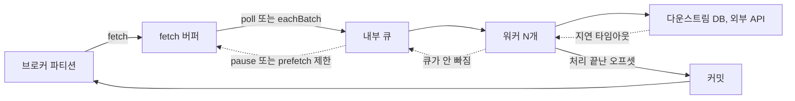
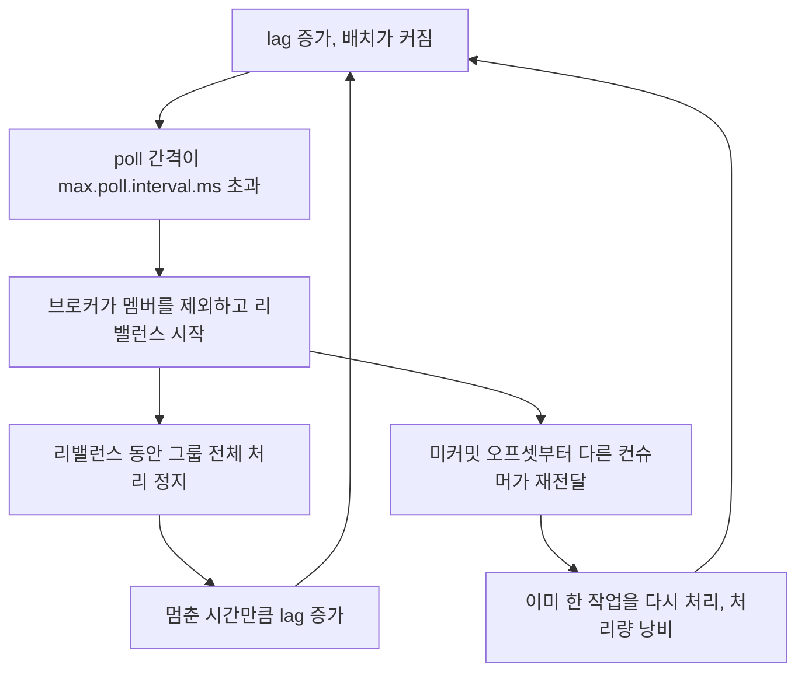
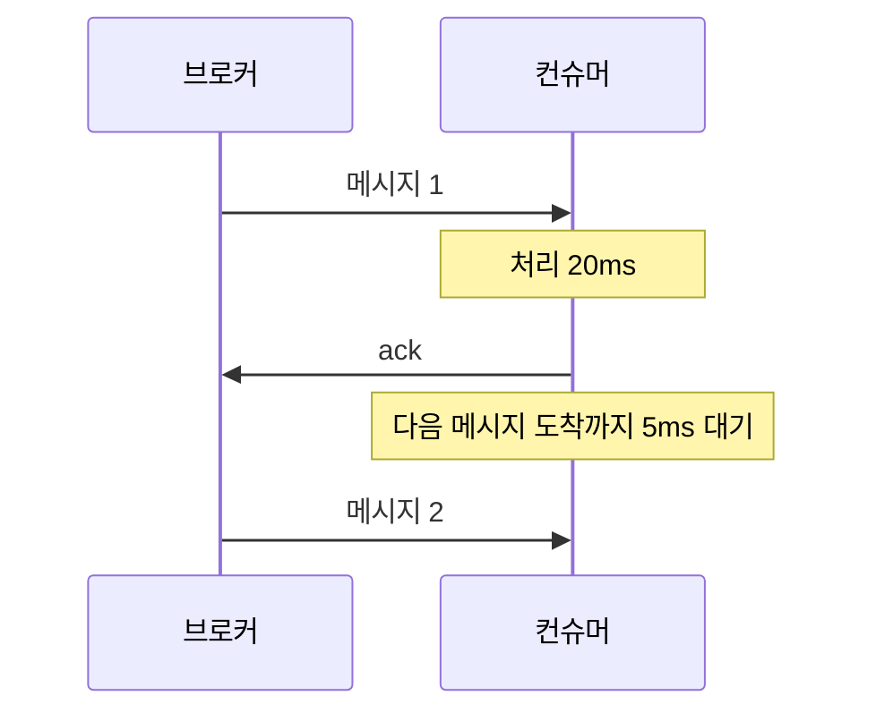
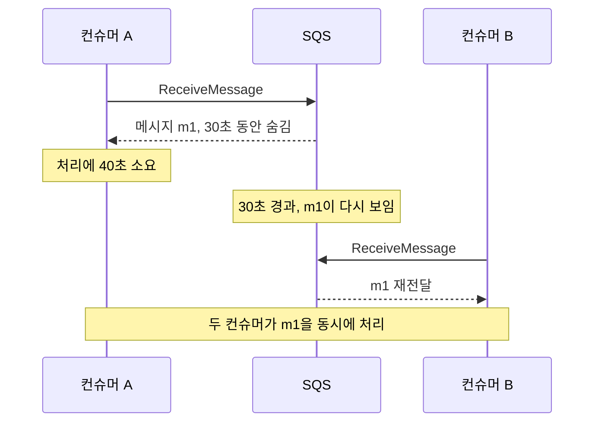
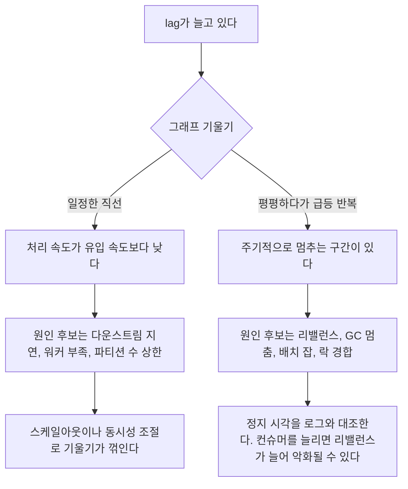
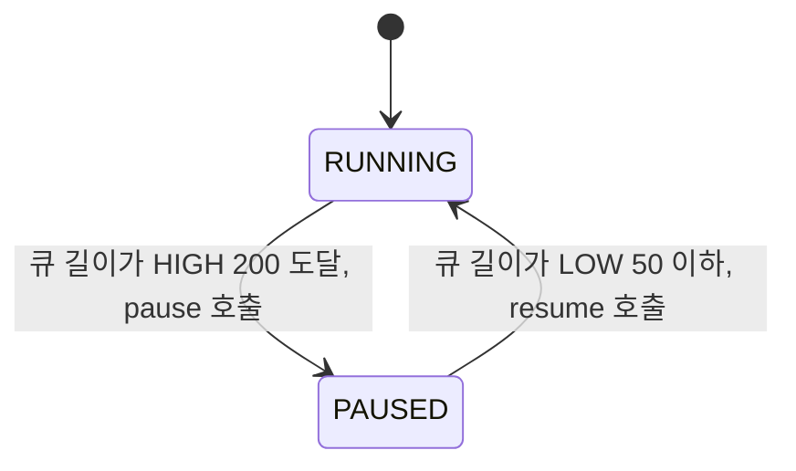
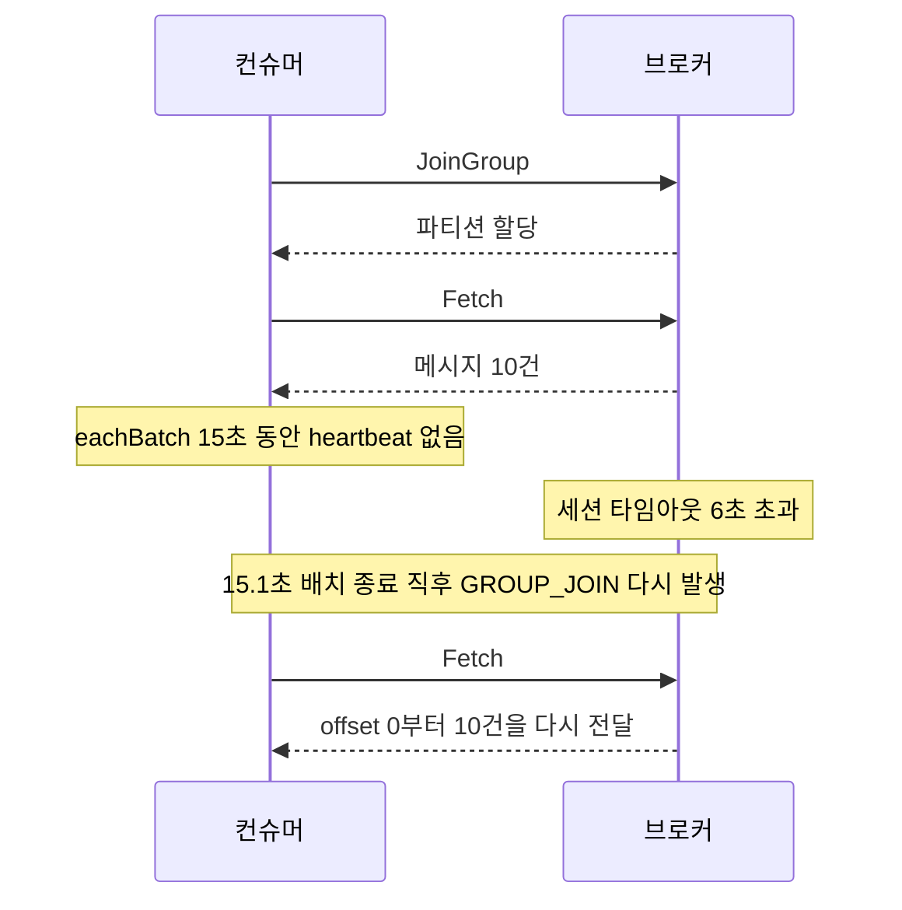
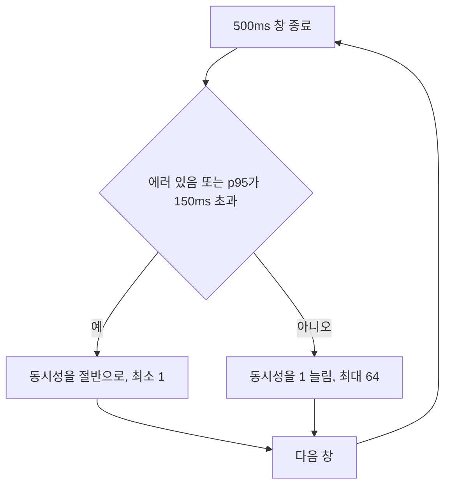
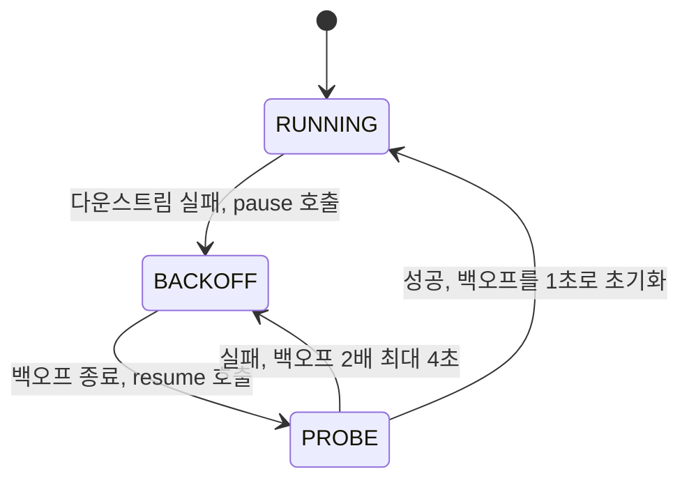

# 컨슈머 배압과 전달 보장 붕괴

배압(backpressure)은 컨슈머가 브로커가 밀어주는 속도를 따라가지 못할 때 생긴다. 브로커 설정을 아무리 잘 잡아도 컨슈머 처리 한계에 닿는 순간 전달 보장이 무너지기 시작한다.

at-least-once를 쓰고 있다면 "한 번 이상 전달"이 "무한정 재전달"로 변한다. exactly-once라고 생각했다면 사실 at-least-once에 멱등 처리를 얹은 구조일 텐데, 컨슈머가 처리를 완료하지 못한 채 타임아웃으로 이탈하면 그 멱등 레이어도 의미가 없어진다.

이 문서는 세 브로커의 설정값을 먼저 정리하고, 뒤쪽에서 애플리케이션 안에서 속도를 조절하는 방법을 kafkajs로 직접 돌려 본 수치와 함께 다룬다. 배압이 무너진 뒤 DLQ에 쌓인 메시지를 되돌리는 쪽은 [DLQ 재처리 자동화](DLQ_Reprocessing_Strategy.md), 실패 메시지를 DLQ로 보내기 전에 재시도 토픽으로 밀어내는 쪽은 [Kafka 논블로킹 재시도 토픽 패턴](Kafka_Retry_Topic_Pattern.md)에서 다룬다.

---

## 배압이 걸리는 자리

컨슈머 프로세스 안에는 큐가 두세 개 겹쳐 있다. 클라이언트 라이브러리의 fetch 버퍼, 개발자가 만든 내부 큐, 워커가 붙잡고 있는 in-flight 작업이다. 배압 문제는 대부분 이 중 어느 한 곳이 무한히 늘어나거나, 커밋이 그 큐보다 앞서 나가면서 시작된다.

도식에서 실선은 메시지와 커밋이 흐르는 방향이고, 점선은 막힘이 거꾸로 전파되는 방향이다. 점선이 끝까지 이어져 fetch 버퍼에서 멈춰야 브로커 쪽에 lag로 쌓이고 컨슈머 프로세스는 버틴다. 어느 한 구간에서 점선이 끊기면 그 앞 구간의 큐가 메모리에서 부푼다.



각 구간이 막혔을 때 보이는 증상과 끊는 수단은 다르다.

| 구간 | 막혔을 때 보이는 것 | 속도를 줄이는 수단 |
|---|---|---|
| fetch 버퍼 | 브로커에 lag가 쌓인다 | `pause()`, RabbitMQ prefetch 제한 |
| 내부 큐 | 힙이 늘고, 커밋 오프셋이 처리 위치보다 앞선다 | 높은/낮은 워터마크 |
| 워커 | 메시지당 처리 시간 증가 | 동시성 조절 |
| 다운스트림 | 타임아웃, 에러율 증가 | 동시성 자동 조절, 백오프 |
| 커밋 | 재전달로 인한 중복 처리 | 처리가 끝난 오프셋만 커밋 |

뒤의 절들은 이 표의 행을 위에서 아래로 하나씩 실제로 돌려 본 기록이다.

---

## Kafka: lag 폭증의 구조

Kafka lag는 "아직 처리하지 못한 메시지 수"다. lag = (파티션 최신 오프셋) - (컨슈머 커밋 오프셋). lag가 폭증한다는 건 프로듀서가 넣는 속도보다 컨슈머가 처리하는 속도가 느리다는 뜻이다.

문제는 lag 자체가 아니다. lag가 폭증할 때 컨슈머가 리밸런싱까지 겪으면 진행했던 작업이 전부 취소되고 다른 컨슈머가 같은 메시지를 다시 가져간다. 이때 두 가지가 동시에 일어난다.

1. `max.poll.interval.ms` 초과로 컨슈머가 그룹에서 떠난다
2. 떠난 컨슈머가 처리 중이던 메시지는 커밋이 안 됐으므로 다음 컨슈머가 같은 메시지를 받는다

`max.poll.interval.ms` 기본값은 5분이다. 컨슈머가 `poll()`을 5분 안에 다시 호출하지 않으면 브로커는 그 컨슈머가 죽었다고 판단하고 리밸런싱을 시작한다.

배치로 메시지를 DB에 넣거나 외부 API를 호출하는 경우, 메시지 수가 많으면 5분 안에 다음 `poll()`까지 못 돌아오는 상황이 발생한다.

이게 한 번으로 끝나면 다행이다. 리밸런스 중에는 그룹 전체가 처리를 멈추므로 멈춘 시간만큼 lag가 더 늘고, 늘어난 lag는 다음 배치를 키워서 다시 poll 간격을 넘긴다. 재전달된 메시지는 이미 한 번 처리한 작업이라 컨슈머 처리량만 낭비한다. 도식의 두 갈래가 모두 첫 노드로 돌아간다는 점이 이 고리의 성격이다. 한 번 시작하면 스스로 멈추지 않는다.



고리를 끊는 지점은 세 곳이다. 배치를 작게 해서 B로 가는 화살표를 끊거나(`max.poll.records`), poll 간격 제한을 늘리거나(`max.poll.interval.ms`), 처리 중에도 살아 있음을 알려서 C를 막는 방법이다. 뒤의 두 절이 앞의 둘이고, 세 번째는 kafkajs 절에서 다룬다. 리밸런스 자체의 동작은 [Consumer Group 재조정](Kafka_Consumer_Group_Rebalancing.md)에 있다.

### max.poll.records 조정

`max.poll.records`는 `poll()` 한 번에 가져올 메시지 수다. 기본값 500이다.

```java
props.put("max.poll.records", 50);
```

이 값을 줄이면 배치 크기가 작아져서 처리 시간이 짧아진다. 대신 처리량(throughput)도 줄어든다. 메시지 하나 처리에 100ms가 걸린다면 500개 배치는 50초다. `max.poll.interval.ms`가 5분이라면 여유가 있어 보이지만 GC 멈춤, 외부 API 응답 지연, DB 슬로우 쿼리가 겹치면 바로 초과한다.

실무 기준으로 `max.poll.records`는 "(max.poll.interval.ms × 0.7) / 메시지 하나 처리 시간 p99"로 산정한다. p99를 쓰는 건 평균으로 잡으면 느린 케이스에서 초과가 나기 때문이다.

```
메시지 처리 p99 = 800ms
max.poll.interval.ms = 300,000ms (5분)
안전 여유 70% 적용 → 300,000 × 0.7 = 210,000ms
max.poll.records = 210,000 / 800 ≈ 262 → 200으로 내림
```

### max.poll.interval.ms 조정

처리 시간이 길 수밖에 없는 작업(동영상 인코딩, 대용량 파일 처리 등)이라면 `max.poll.interval.ms`를 늘리는 쪽이 맞다.

```java
props.put("max.poll.interval.ms", 1800000); // 30분
props.put("max.poll.records", 1);           // 메시지 하나씩
```

단, 이 경우 컨슈머 장애 감지가 30분 지연된다는 트레이드오프가 있다. 컨슈머가 죽어도 30분 뒤에야 리밸런싱이 시작된다.

긴 작업에는 메시지를 `poll()`로 받은 뒤 별도 스레드로 처리를 위임하고, 메인 스레드는 `pause()` + `poll(keepAlive)` 패턴으로 하트비트를 유지하는 방법을 쓰기도 한다. Kafka Consumer의 `pause()`와 `resume()`은 파티션 단위로 동작하므로 처리 중인 파티션만 일시 정지해 브로커와 연결을 유지할 수 있다.

```java
// 처리 시작 시
consumer.pause(partitions);

// 처리 중 하트비트 유지 (빈 poll)
while (!done) {
    consumer.poll(Duration.ofMillis(100));
    Thread.sleep(100);
}

// 처리 완료 후
consumer.commitSync(offsets);
consumer.resume(partitions);
```

이 패턴을 내부 큐 크기에 연결해서 상시 배압 장치로 쓰는 방법과 Node 쪽 구현은 뒤에서 다룬다.

---

## RabbitMQ: prefetch_count 산정

RabbitMQ는 push 기반이라 브로커가 컨슈머로 메시지를 밀어넣는다. prefetch_count 없이 컨슈머를 연결하면 브로커가 큐에 있는 메시지를 전부 컨슈머의 TCP 버퍼로 밀어버린다. 컨슈머가 죽으면 TCP 버퍼에 있던 메시지는 모두 재큐잉된다.

prefetch_count는 "ack 없이 컨슈머가 들고 있을 수 있는 최대 메시지 수"다.

```python
channel.basic_qos(prefetch_count=10)
```

값이 너무 작으면 컨슈머가 처리 완료 → ack → 다음 메시지 대기 → 브로커 왕복 지연이 생겨 처리량이 떨어진다. 값이 너무 크면 컨슈머 하나가 메시지를 독점해서 다른 컨슈머가 놀게 된다.

### 산정 방법

prefetch가 1이면 컨슈머는 메시지 하나를 끝낼 때마다 ack가 나가고 다음 메시지가 도착할 때까지 기다린다. 아래 도식이 그 한 사이클이다. 처리 20ms 뒤에 5ms가 비어 있다.



네트워크 왕복이 5ms이고 메시지 처리가 20ms라면 25ms 중 20ms만 일하니 가동률은 80%다. 이 대기를 없애려면 다음 메시지가 ack 전에 이미 컨슈머에 와 있어야 하고, 필요한 최소값은 `ceil((왕복 + 처리) / 처리)`, 즉 `ceil(25 / 20) = 2`다. 이 식은 컨슈머가 단일 스레드로 순차 처리한다고 가정한 값이다.

실제로는 컨슈머 수와 큐 깊이를 같이 본다. 컨슈머 10개에 prefetch 100이면 브로커가 순간적으로 1,000개 메시지를 컨슈머에 분산시킨다. 처리 중 컨슈머 하나가 OOM으로 죽으면 그 컨슈머의 100개가 한꺼번에 재큐잉된다.

배압 관점에서 prefetch_count는 "컨슈머 하나의 in-flight 메시지 허용량"이기도 하다. 메모리 사용량이 올라간다면 prefetch를 낮춰 in-flight를 제한하는 게 첫 번째 조치다.

컨슈머 하나당 적정 prefetch는 테스트로 찾는 수밖에 없다. 처리 시간이 균일한 작업이라면 10~50이 흔한 범위다. 처리 시간 편차가 크거나(DB 조회가 있거나 외부 API가 섞이면 p50과 p99가 10배 이상 차이 나기도 한다) 메시지 처리 자체가 메모리를 많이 쓴다면 5 이하로 잡아야 할 수도 있다.

---

## SQS: visibility timeout과 처리 시간 불일치

SQS는 ack 개념이 없다. 컨슈머가 메시지를 받으면 그 메시지는 visibility timeout 동안 다른 컨슈머에게 보이지 않는다. 처리가 끝나면 `DeleteMessage`를 호출해 큐에서 지운다. 처리가 `visibility timeout` 안에 끝나지 않으면 메시지가 다시 큐에 보이게 되고, 다른 컨슈머가 같은 메시지를 받는다.



visibility timeout 기본값은 30초다. 처리가 30초를 넘기면 같은 메시지가 두 번 처리된다. at-least-once가 발생하는 가장 흔한 원인이다.

```python
# 메시지를 받고
response = sqs.receive_message(
    QueueUrl=queue_url,
    MaxNumberOfMessages=10,
    VisibilityTimeout=300  # 5분
)

# 처리하다가 오래 걸릴 것 같으면
sqs.change_message_visibility(
    QueueUrl=queue_url,
    ReceiptHandle=receipt_handle,
    VisibilityTimeout=300  # 연장
)
```

처리 시간이 가변적인 작업에서는 처리 중에 주기적으로 `ChangeMessageVisibility`를 호출해 타임아웃을 연장한다. 이 연장 호출을 별도 스레드에서 처리 시간의 40% 간격으로 호출하는 패턴을 쓴다.

visibility timeout이 30초고 처리 p99가 25초라면 처리가 완료되더라도 여유가 5초밖에 없다. 이 상태에서 네트워크 지연이나 GC 멈춤이 5초를 넘기면 중복 처리가 발생한다. visibility timeout은 처리 p99의 3배 이상으로 잡아야 안전하다.

SQS에서 또 자주 발생하는 상황은 `MaxReceiveCount` 도달이다. 메시지가 처리 실패 + 재표시(visibility timeout 초과)를 반복하다 `MaxReceiveCount`(redrive policy에서 1~1,000 사이로 지정)에 도달하면 DLQ로 이동한다. 이 경우 메시지가 실제로 처리하기 너무 오래 걸려서 visibility timeout을 계속 초과한 건지, 처리 자체가 실패한 건지 구분해야 한다. CloudWatch의 `ApproximateNumberOfMessagesNotVisible` 메트릭이 높다면 전자다.

---

## 배압 감지 메트릭

세 브로커 공통으로 다음 세 가지 메트릭을 본다.

**Consumer lag**: Kafka는 `kafka_consumer_group_lag`, RabbitMQ는 `rabbitmq_queue_messages_ready`, SQS는 `ApproximateNumberOfMessagesNotVisible + ApproximateNumberOfMessagesVisible`. 숫자 하나만 보면 원인을 알 수 없다. 그래프 모양이 직선인지 계단인지에 따라 원인이 갈리고, 이 부분은 바로 뒤 절에서 실측으로 확인한다.

**DLQ 증가율**: DLQ 메시지가 생기기 시작하면 컨슈머가 처리를 포기하고 있다는 뜻이다. lag 증가보다 더 심각한 신호다. lag는 "느리다"는 신호고 DLQ 증가는 "처리 불가 메시지가 생겼다"는 신호다. DLQ 증가율이 0이 아니면 즉시 알림을 받아야 한다.

**in-flight 메시지 수**: Kafka의 경우 `kafka_consumer_fetch_manager_records_lag_max`와 현재 처리 중인 메시지 수를 비교한다. RabbitMQ는 `rabbitmq_queue_messages_unacknowledged`. SQS는 `ApproximateNumberOfMessagesNotVisible`. in-flight가 prefetch_count(RabbitMQ) 또는 설정한 배치 크기(Kafka)에 근접하면 컨슈머가 포화 상태다.

---

## lag 그래프 모양으로 원인 가르기

이 절부터는 로컬에서 직접 돌린 결과다. 환경은 Kafka 3.7.1 KRaft 단일 노드, kafkajs 2.2.4, Node 20, 파티션 1개다. 프로듀서는 초당 200건을 넣고, 컨슈머는 20건씩 처리한 뒤 `resolveOffset`과 `heartbeat`를 호출한다. lag는 초당 한 번, 컨슈머가 실제로 끝낸 오프셋과 브로커 end offset의 차이로 쟀다.

두 컨슈머를 만들었다. 하나는 초당 150건을 처리해서 유입보다 50건 느리다. 다른 하나는 초당 205건을 처리해서 유입보다 5건 빠르지만, 10초마다 4초씩 멈춘다(GC 멈춤이나 락 대기를 흉내 낸 것이다).

| 경과 | 처리 150건/초 (상시 부족) | 처리 205건/초 + 4초 정지 반복 |
|---|---|---|
| 10초 | 540 | 20 |
| 14초 | 740 | 800 |
| 20초 | 1,040 | 800 |
| 25초 | 1,280 | 760 |
| 30초 | 1,520 | 1,560 |
| 40초 | 2,040 | 1,500 |

왼쪽은 1초에 약 50건씩 일정하게 오른다. 오른쪽은 정지 구간(10~14초, 26~30초)에 초당 200건 기울기로 800건이 한꺼번에 뛰고, 그 뒤에는 초당 5건씩 아주 천천히 줄면서 평평하게 유지된다. 그래프로 그리면 계단이다. 평평한 구간의 lag 800은 "지금 느리다"가 아니라 "과거 정지의 흔적"이다. 처리 속도가 유입보다 초당 5건 빠를 뿐이라 800건이 빠지려면 160초가 걸린다.



직선이면 용량 문제이고 계단이면 정지 시각을 찾는 문제다. 계단의 간격이 일정하면 크론 배치나 GC, 스케줄된 잡을 의심하고, 간격이 불규칙하면 리밸런스나 다운스트림 장애를 의심한다.

### 커밋 오프셋으로 재면 그래프가 거짓말을 한다

모니터링 익스포터가 보는 값은 커밋 오프셋 기준 lag다. 같은 컨슈머(처리 150건/초)를 그 기준으로 쟀더니 30초에 3,040이던 lag가 1초 뒤 1,860으로 떨어졌다. 실제로 1,180건이 줄어든 게 아니다.

커밋 이벤트를 찍어 보니 커밋이 배치 끝에서만 나갔다. 커밋 간격은 0.2초에서 시작해 백로그가 쌓일수록 벌어졌고, 8.2초, 11.1초, 15.0초, 20.3초, 27.2초에 나갔다. 11.1초에 커밋된 오프셋이 1,640, 15.0초가 2,220이라 그 사이 배치는 580건이고, 초당 150건으로 처리하면 3.9초다. 실제 간격 3.9초와 같다. 뒤처질수록 배치가 커지고, 커밋이 뜸해지고, 커밋 기준 lag는 톱니 모양이 된다.

그래서 직선인지 계단인지 볼 때는 커밋 lag의 톱니를 그대로 믿으면 안 된다. 톱니의 골(커밋 직후 값)만 이어서 보거나, 컨슈머가 자기 처리 위치를 직접 내보내는 메트릭을 따로 둔다.

---

## 시간 기반 lag

오프셋 lag는 개수라서 트래픽 규모를 모르면 해석이 안 된다. lag 100이 초당 1,000건 토픽에서는 0.1초치이고 초당 5건 토픽에서는 20초치다. 사용자가 실제로 겪는 건 뒤쪽이다. 그래서 가장 오래된 미처리 메시지의 나이(`now - timestamp`)를 같이 잰다.

같은 lag를 만들어 나이를 재 봤다. 커밋 오프셋을 고정해 둔 그룹에 한쪽은 초당 1,000건으로 100건, 다른 쪽은 초당 5건으로 100건을 넣었다.

| 토픽 | 유입 속도 | 오프셋 lag | 가장 오래된 미처리 메시지 나이 |
|---|---|---|---|
| burst | 1,000건/초 | 100 | 0.3초 |
| trickle | 5건/초 | 100 | 20.2초 |

lag 숫자는 같은데 나이는 60배 넘게 차이 난다. 알림 임계값을 lag 개수로 잡으면 trickle 토픽은 20초가 밀려도 조용하고, burst 토픽은 0.3초 밀렸는데 울린다.

나이는 커밋 오프셋 위치의 메시지를 읽어서 타임스탬프를 보면 된다.

```js
async function oldestUnprocessedAgeSec(admin, kafka, groupId, topic) {
  const [committed] = await admin.fetchOffsets({ groupId, topics: [topic] });
  const [end] = await admin.fetchTopicOffsets(topic);
  const off = Number(committed.partitions[0].offset);
  if (off >= Number(end.offset)) return 0;

  const startedAt = Date.now();
  const probe = kafka.consumer({ groupId: `probe-${startedAt}` });
  await probe.connect();
  await probe.subscribe({ topic, fromBeginning: true });
  let gotTs;
  const got = new Promise((r) => (gotTs = r));
  await probe.run({ eachMessage: async ({ message }) => gotTs(Number(message.timestamp)) });
  probe.seek({ topic, partition: 0, offset: String(off) });
  const ts = await got;
  await probe.disconnect();
  return (startedAt - ts) / 1000;
}
```

측정 중에 한 번 틀렸다. 처음에는 새 토픽에 첫 메시지를 그대로 넣고 오프셋 0부터 쟀는데 burst 토픽 나이가 5.3초, trickle이 25.0초로 나왔다. 첫 `send()`가 새 토픽 준비를 기다리며 5초 가까이 걸렸고, 타임스탬프는 호출 시각으로 찍힌 것으로 보인다. 워밍업 메시지를 먼저 보내고 오프셋 1부터 재서 위 표의 값이 나왔다. 새 토픽에서 재는 테스트라면 첫 메시지 타임스탬프를 믿지 않는다.

kafkajs에는 그룹에 가입하지 않고 파티션을 직접 지정하는 `assign`이 없어서 프로브가 임시 그룹을 만든다. 주기적으로 도는 익스포터라면 Java 클라이언트의 `assign()` + `seek()`로 만들어 그룹 가입 자체를 없애는 편이 낫다. 프로브가 그룹에 들어가면 그것도 리밸런스 후보다.

처리하는 쪽에서 `Date.now() - message.timestamp`를 찍는 방법도 있다. 이건 공짜지만 컨슈머가 살아서 메시지를 받을 때만 나온다. 컨슈머가 멈춰 있으면 아무 값도 안 나오므로, 멈춘 걸 잡으려면 프로브가 필요하다. DLQ에서 꺼낸 메시지를 다시 발행하면 새 타임스탬프가 붙어 나이가 0으로 리셋되니, 재처리 파이프라인에서는 원래 타임스탬프를 헤더에 남겨 둬야 한다.

---

## 내부 큐와 pause/resume 워터마크

컨슈머 핸들러가 메시지를 내부 큐에 넣고 바로 반환하는 구조는 흔하다. 핸들러가 빨리 끝나니 fetch가 계속 돌고, 워커는 느린 다운스트림을 따라 천천히 큐를 비운다. 이때 자동 커밋은 핸들러가 반환한 시점의 오프셋을 커밋한다. 큐에 있는 메시지는 커밋됐지만 처리는 안 된 상태다.

높은/낮은 워터마크로 이 구조에 브레이크를 건다. 큐 길이가 HIGH에 닿으면 `pause()`로 fetch를 멈추고, LOW까지 내려오면 `resume()`으로 다시 연다. 브로커에 쌓이는 건 lag라서 컨슈머 힙은 버틴다.



구현은 이렇다. 커밋은 자동 커밋을 끄고, 워커가 끝낸 오프셋이 끊김 없이 이어진 지점까지만 직접 커밋한다. 워커 10개가 각각 50ms 걸리는 작업을 하니 처리량은 초당 약 200건이다.

```js
const HIGH = 200, LOW = 50;
const queue = [];
const finished = new Set();
let paused = false;
let nextCommit = 0;                       // 끊김 없이 끝난 마지막 오프셋 + 1

await consumer.run({
  autoCommit: false,
  eachMessage: async ({ message }) => {
    queue.push({ offset: Number(message.offset), value: message.value });
    if (!paused && queue.length >= HIGH) {
      paused = true;
      consumer.pause([{ topic }]);
    }
  },
});

async function worker() {
  for (;;) {
    const m = queue.shift();
    if (!m) { await sleep(5); continue; }
    await handle(m);                       // 다운스트림 호출
    finished.add(m.offset);
    if (paused && queue.length <= LOW) {
      paused = false;
      consumer.resume([{ topic }]);
    }
  }
}
for (let i = 0; i < 10; i++) worker();

setInterval(async () => {
  let moved = false;
  while (finished.has(nextCommit)) { finished.delete(nextCommit); nextCommit++; moved = true; }
  if (moved) await consumer.commitOffsets([{ topic, partition: 0, offset: String(nextCommit) }]);
}, 300);
```

이 코드는 파티션 1개, 오프셋 0부터 시작하는 실험용이다. 파티션이 여럿이면 `nextCommit`과 `finished`를 파티션마다 따로 둬야 하고, 이미 커밋된 위치가 있으면 그 값에서 시작해야 한다. 워커들이 순서 없이 끝나기 때문에 "끊김 없이 이어진 지점"을 찾는 로직 자체는 필요하다. 이걸 빼고 완료된 최댓값을 커밋하면 아직 처리 중인 앞 오프셋이 커밋에 덮여 유실된다.

비교 대상은 워터마크 없이 큐에 넣고 반환하는 코드(자동 커밋)다. 프로듀서가 초당 300건으로 6초 동안 넣고, 컨슈머 프로세스를 7초 시점에 `SIGKILL`로 죽인 뒤 새 프로세스로 남은 걸 처리시켰다.

| 항목 | 워터마크 없음 | 워터마크 200/50 |
|---|---|---|
| 큐 최대 길이 | 650 이상, 초당 100건씩 증가 | 200에서 고정 |
| pause 횟수 (7초간) | 0 | 7 |
| 킬 시점 커밋 오프셋 | 1,890 (발행 전량) | 1,420 |
| 킬 시점까지 실제로 처리한 수 | 1,460 | 약 1,460 |
| 재기동 후 처리 못 한 메시지 | 430건 | 0건 |
| 중복 처리 | 0건 | 40건 |

워터마크가 없으면 큐에 쌓여 있던 430건이 커밋만 되고 처리는 안 된 채 영영 사라졌다. 커밋 오프셋 1,890과 처리한 1,460의 차이가 정확히 430이다. 브로커 쪽 lag는 0으로 보였을 것이고, DLQ에도 안 들어갔으니 알림도 울리지 않는다. 유실을 발견하는 방법이 "다운스트림 데이터가 모자라다"뿐이라는 점이 이 유형의 무서운 부분이다.

워터마크 쪽은 40건이 두 번 처리됐다. 킬 시점에 처리를 끝낸 오프셋(약 1,460)과 커밋한 오프셋(1,420)의 차이이고, 커밋 주기 300ms 안에 끝난 만큼이다. 유실 대신 중복을 받아들이는 구조라서 핸들러는 멱등이어야 한다. `pause()`가 걸린 뒤에도 배치의 나머지 메시지가 빠지거나 두 번 들어오는 일은 없었다. 재기동 후 처리한 고유 오프셋이 1,890개로 빈 곳이 없었다.

HIGH와 LOW를 잡을 때는 LOW가 워커 수보다 작으면 워커가 빈다. 10개인 워커가 놀지 않으려면 LOW는 최소 10, 여유를 두고 처리량 0.25초 분량인 50으로 뒀다. 이 실험에서는 200과 50 사이로 7초에 7번, 대략 1초에 한 번씩 pause와 resume이 오갔다. 이 측정은 파티션 1개다. 파티션이 여러 개이거나 fetch 크기가 큰 경우의 초과분은 재 보지 않았다.

---

## kafkajs eachBatch와 heartbeat

앞의 Kafka 절에서 리밸런스 고리를 끊는 세 번째 방법이 "처리 중에도 살아 있음을 알리기"였다. Java 클라이언트는 하트비트를 별도 스레드가 보내지만, kafkajs는 그렇지 않다.

`eachBatch` 핸들러가 도는 동안은 하트비트가 자동으로 나가지 않고, 핸들러 안에서 `heartbeat()`를 호출해야 한다. 소스를 보면 `heartbeat()`는 호출할 때마다 요청을 보내지 않고 마지막 요청으로부터 `heartbeatInterval`이 지났을 때만 브로커로 나간다. 그러니 메시지마다 호출해도 비용이 크지 않다.

세 가지 핸들러로 같은 상황을 돌렸다. 토픽에 10건을 미리 넣고, 메시지 하나당 1.5초가 걸리는 핸들러를 붙였다. 배치 하나가 15초다. `sessionTimeout`은 6초, `heartbeatInterval`은 1초다.

| 핸들러 | 재조인 | 28초 동안 두 번 이상 처리된 오프셋 |
|---|---|---|
| eachBatch, `heartbeat()` 호출 안 함 | 15.1초에 발생 | 8개 (0~7번) |
| eachBatch, 메시지마다 `heartbeat()` | 없음 | 0개 |
| eachMessage | 없음 | 0개 |

`heartbeat()`를 호출하지 않은 쪽은 배치가 끝난 15.1초에 그룹에 다시 조인했고, 이미 처리한 offset 0번부터 다시 받았다. 하트비트를 호출한 쪽은 같은 조건에서 재조인이 없었으므로, 원인은 배치가 도는 15초 동안 세션 타임아웃(6초)을 넘겨 하트비트가 끊긴 것이다. 처리를 끝낸 오프셋이 반영되지 않아서 처음부터 다시 받았다. 도식에서 재조인이 배치 중간이 아니라 배치가 끝난 직후에 나타난다는 점을 보면 된다.



`eachMessage`는 kafkajs가 메시지 사이에서 알아서 하트비트를 보내서 같은 조건에서도 문제가 없었다. `eachBatch`를 쓰는 이유는 배치 단위 처리(벌크 INSERT 같은 것)이거나 `resolveOffset`을 직접 다루기 위해서인데, 그 경우 하트비트도 직접 챙겨야 한다.

```js
await consumer.run({
  eachBatchAutoResolve: false,
  eachBatch: async ({ batch, resolveOffset, heartbeat }) => {
    for (const m of batch.messages) {
      await handle(m);
      resolveOffset(m.offset);
      await heartbeat();
    }
  },
});
```

메시지 하나가 세션 타임아웃보다 오래 걸리면 메시지 사이 호출로도 부족하다. 그때는 핸들러 안에서 `setInterval`로 `heartbeat()`를 주기 호출하고 `finally`에서 정리한다. 이 경우도 `rebalanceTimeout`(Java의 `max.poll.interval.ms`에 해당)은 별개의 제한이라 함께 확인해야 한다.

---

## 다운스트림이 포화됐을 때 컨슈머가 속도를 줄이는 방법

컨슈머를 아무리 빠르게 만들어도 병목이 다운스트림(DB, 외부 API)에 있으면 컨슈머 쪽 동시성이 오히려 문제를 키운다. 동시성을 고정해 두면 다운스트림이 느려지는 순간 대기열이 쌓이고 타임아웃이 늘어난다. 타임아웃은 재시도를 만들고, 재시도는 부하를 더 키운다.

### AIMD로 동시성 자동 조절

TCP 혼잡 제어와 같은 방식(AIMD, 덧셈으로 늘리고 곱셈으로 줄이기)을 컨슈머 동시성에 쓸 수 있다. 창(500ms)마다 에러가 있거나 p95가 목표를 넘으면 동시성을 절반으로 줄이고, 아니면 1 늘린다.



```js
const MIN = 1, MAX = 64, TARGET_P95_MS = 150, WINDOW_MS = 500;
let limit = 4;
let win = { err: 0, lat: [] };

setInterval(() => {
  const lat = win.lat.sort((a, b) => a - b);
  const p95 = lat[Math.floor(lat.length * 0.95)] || 0;
  limit = win.err > 0 || p95 > TARGET_P95_MS
    ? Math.max(MIN, Math.floor(limit / 2))
    : Math.min(MAX, limit + 1);
  win = { err: 0, lat: [] };
}, WINDOW_MS);

// eachBatch 안에서: inflight가 limit 미만일 때만 다음 메시지를 내보낸다
for (const m of batch.messages) {
  while (inflight >= limit) await new Promise((r) => (wake = r));
  inflight++;
  tasks.push(callDownstream(m).then((r) => {
    inflight--; wake && wake();
    win.lat.push(r.ms); if (!r.ok) win.err++;
  }));
}
await Promise.all(tasks);
resolveOffset(batch.messages.at(-1).offset);
```

다운스트림은 프로세스 안에서 흉내 냈다. 동시 처리 용량 16, 요청 하나에 50ms, 대기가 300ms를 넘으면 타임아웃이다. 실행 20초 시점에 용량을 6으로 떨어뜨려서 다른 배치 잡이 DB를 붙잡은 상황을 만들었다. 프로듀서는 초당 250건이다. 용량 16이면 초당 320건이라 여유가 있고, 6이면 초당 120건이라 어떤 방법으로도 못 따라간다.

| 방식 | 성공 | 타임아웃 | p50 | p95 | 40초 시점 lag |
|---|---|---|---|---|---|
| 동시성 64 고정 | 7,271 | 1,648 | 151ms | 306ms | 1,900 |
| 동시성 8 고정 | 5,507 | 1 | 50ms | 100ms | 6,525 |
| AIMD (시작 4) | 7,263 | 2 | 51ms | 105ms | 3,225 |

64 고정은 처리량이 좋지만 타임아웃이 1,648건이다. 이 메시지들은 재시도 토픽이나 DLQ로 가서 나중에 다시 다운스트림을 두드린다. 64 고정의 lag가 AIMD보다 낮게 나온 건 타임아웃으로 실패 처리한 1,648건이 빠졌기 때문이지 더 빨리 처리해서가 아니다. 성공 건수는 7,271과 7,263으로 같다. 8 고정은 타임아웃이 거의 없지만 처음부터 용량 16의 절반만 쓰니 초당 160건이고, 유입 250건을 못 따라가서 20초 전부터 lag가 쌓였다.

AIMD의 동시성은 4초에 12, 8초에 19, 12초에 27로 올라갔고, 용량이 6으로 떨어진 24초 이후에는 11에서 9로 내려와 머물렀다. 실제 용량 6보다 높은 값에서 멈춘 건 p95 목표를 150ms로 잡았기 때문이다. 서비스 시간이 50ms인데 목표가 150ms라서 어느 정도 대기를 허용한다. 목표를 더 낮췄을 때 용량에 얼마나 붙는지는 재 보지 않았다.

이 코드에는 함정이 하나 있다. 창 안에 표본이 없으면 `p95`가 0이고 에러도 없어서 동시성이 계속 1씩 올라간다. 한가한 시간대에 `limit`이 MAX까지 올라가 있다가 트래픽이 한꺼번에 몰리면 첫 창에 64개가 나간다. 실서비스에서는 표본이 없는 창은 건너뛰거나, 올라가는 상한을 최근 실제 사용한 동시성의 두 배 정도로 묶는 편이 안전하다.

AIMD도 lag를 줄여 주지는 않는다. 다운스트림 용량이 유입보다 작으면 lag는 늘고, AIMD가 하는 일은 그동안 실패를 만들지 않는 것이다. lag 알림과 스케일아웃 판단은 별개로 남는다.

### 다운스트림이 죽었을 때는 파티션을 멈춘다

용량이 줄어든 게 아니라 아예 응답이 없는 경우에는 동시성을 줄이는 걸로 부족하다. 실패한 메시지를 그대로 다음 메시지로 넘기면 다운스트림이 죽어 있는 동안 들어온 메시지가 전부 실패 처리된다.

실패가 나면 토픽을 `pause()`하고, 실패한 메시지는 커밋하지 않은 채 배치를 빠져나오고, 백오프 뒤에 `resume()`으로 그 메시지부터 다시 시도한다. 백오프는 1초에서 시작해 두 배씩 늘리고 4초에서 멈춘다. 다시 시도해서 성공하면 백오프를 1초로 되돌린다.



```js
await consumer.run({
  eachBatchAutoResolve: false,      // 이걸 끄지 않으면 실패한 메시지 오프셋도 자동 커밋된다
  eachBatch: async ({ batch, resolveOffset, heartbeat }) => {
    for (const m of batch.messages) {
      const r = await callDownstream(m);
      if (!r.ok) {
        consumer.pause([{ topic }]);
        setTimeout(() => consumer.resume([{ topic }]), backoff);
        backoff = Math.min(backoff * 2, 4000);
        return;                    // m은 resolve하지 않았으므로 resume 후 다시 온다
      }
      backoff = 1000;
      resolveOffset(m.offset);
      await heartbeat();
    }
  },
});
```

같은 시나리오로 비교했다. 프로듀서는 초당 100건으로 약 20초 동안 넣었고, 다운스트림은 5초부터 11초까지 6초간 전부 실패한다. 비교 대상은 실패한 메시지를 실패 건수로 세고 바로 다음 메시지로 넘어가는 코드다.

| 항목 | 실패하면 다음으로 넘김 | pause 후 백오프 |
|---|---|---|
| 발행 | 2,090 | 2,090 |
| 최종 성공 | 1,490 | 2,090 |
| 장애 동안 다운스트림 호출 | 600 | 3 |
| DLQ나 재시도 토픽으로 갈 메시지 | 600 | 0 |

넘기는 쪽은 장애 6초 동안 들어온 메시지 600건이 전부 실패로 처리됐다. 다운스트림은 이미 죽어 있는데 600번을 두드린 셈이고, 이 600건은 [DLQ 재처리 자동화](DLQ_Reprocessing_Strategy.md)에서 다루는 재처리 대상이 된다. pause 쪽은 5초, 6초, 8초 세 번만 시도해서 세 번 다 실패하고, 다음 시도(12초)에 성공했다. 발행한 2,090건이 전부 성공했다.

주의점이 몇 가지 있다. 이 측정의 `sessionTimeout`은 30초였고 최대 백오프는 4초라서, 백오프가 세션 타임아웃에 가까워지는 경우는 확인하지 않았다. 그 경우는 앞 절의 heartbeat 문제와 같은 이유로 리밸런스가 날 수 있다. 장애가 끝난 시각(11초)과 재개 시각(12초) 사이 1초는 손해다. 백오프 상한이 클수록 복구 뒤 지연이 길어진다. 파티션 전체가 멈추므로 lag는 장애 시간만큼 늘어나고, 그 상태를 놓치지 않으려면 앞 절의 시간 기반 lag 알림이 필요하다.

pause 방식은 다운스트림 전체가 죽은 경우에 맞는다. 특정 메시지만 계속 실패하는 poison 메시지에 쓰면 그 메시지 뒤의 모든 메시지가 멈춘다. 메시지 단위 문제는 [Kafka 논블로킹 재시도 토픽 패턴](Kafka_Retry_Topic_Pattern.md)처럼 재시도 토픽으로 밀어내야 한다. 실패의 성격이 어느 쪽인지는 에러율로 가른다. 최근 N건이 전부 실패하면 다운스트림 문제이니 pause하고, 몇 건만 실패하면 메시지 문제이니 재시도 토픽으로 보낸다.

---

## 자동 스케일아웃 트리거 설계

배압 메트릭을 기반으로 컨슈머를 자동으로 늘리는 건 Kubernetes HPA나 KEDA로 구현한다.

KEDA는 Kafka lag, RabbitMQ 큐 깊이, SQS 큐 길이를 직접 메트릭 소스로 지원한다.

```yaml
apiVersion: keda.sh/v1alpha1
kind: ScaledObject
metadata:
  name: kafka-consumer-scaler
spec:
  scaleTargetRef:
    name: order-consumer
  minReplicaCount: 2
  maxReplicaCount: 20
  triggers:
    - type: kafka
      metadata:
        bootstrapServers: kafka:9092
        consumerGroup: order-group
        topic: orders
        lagThreshold: "1000"        # 레플리카 하나가 감당할 lag
        offsetResetPolicy: latest
```

`lagThreshold`는 레플리카 하나가 감당할 lag 기준이다. [KEDA Kafka scaler 문서](https://keda.sh/docs/latest/scalers/apache-kafka/) 기준으로 전체 lag를 이 값으로 나눈 수만큼 레플리카를 원하고, `allowIdleConsumers`를 켜지 않으면 파티션 수를 넘겨 늘리지 않는다. 파티션 12개에 총 lag가 5,000이면 레플리카 5개, 총 lag가 30,000이면 30개가 아니라 12개에서 멈춘다. 이 환경에서 KEDA를 직접 돌리지는 않았고 문서 기준이다. 파티션당 lag 기준으로 오해하기 쉬운 값이다.

스케일아웃 트리거를 너무 민감하게 잡으면 lag 스파이크마다 파드가 생성·삭제를 반복한다. Kafka는 컨슈머가 새로 붙을 때마다 리밸런싱이 발생한다. 리밸런싱 자체가 처리를 멈추는 이벤트라서 스케일아웃이 오히려 처리를 더 느리게 만들 수 있다.

이를 피하려면 scaledown을 늦게 한다.

```yaml
spec:
  advanced:
    horizontalPodAutoscalerConfig:
      behavior:
        scaleDown:
          stabilizationWindowSeconds: 300  # 5분간 lag가 안정돼야 줄인다
          policies:
            - type: Percent
              value: 25                    # 한 번에 25%씩만 줄인다
              periodSeconds: 60
        scaleUp:
          stabilizationWindowSeconds: 30   # 올릴 때는 빠르게
```

`periodSeconds`는 `type`, `value`와 같은 항목 안에 있어야 한다. `- periodSeconds: 60`처럼 별도 항목으로 빼면 `type`과 `value`가 없는 정책이 하나 더 생겨 유효하지 않은 설정이 된다.

RabbitMQ 기반이라면 메시지 수가 줄어드는 게 빠르므로 scaleDown stabilization을 짧게 잡아도 된다. Kafka는 lag가 줄었더라도 프로듀서 트래픽이 다시 오를 수 있으니 5분은 유지한다.

SQS는 `ApproximateNumberOfMessagesVisible`을 KEDA trigger로 쓴다.

```yaml
triggers:
  - type: aws-sqs-queue
    metadata:
      queueURL: https://sqs.ap-northeast-2.amazonaws.com/123456789/orders
      targetQueueLength: "50"   # 컨슈머 하나당 허용 메시지 수
      awsRegion: ap-northeast-2
```

스케일아웃이 실제로 배압을 해소하는지 확인하는 지표는 **lag 감소 속도**다. 파드를 2배 늘렸는데 lag 감소 속도가 2배가 되지 않는다면 병목이 컨슈머 수가 아니라 다른 곳(DB 커넥션 풀, 외부 API rate limit)에 있다는 뜻이다. 스케일아웃 이후 lag 감소율을 항상 모니터링해야 한다.

처리가 DB 집약적인 경우 컨슈머를 늘리면 오히려 DB 커넥션이 고갈돼 처리 속도가 더 내려가는 상황도 있다. 스케일아웃 전에 컨슈머 하나의 처리량 상한이 어디서 막히는지 파악하는 게 먼저다. 앞 절의 실험이 그 경우다. 다운스트림 용량이 6이 된 뒤에는 컨슈머를 몇 개 늘려도 초당 120건을 넘지 못한다. 이때 스케일아웃은 리밸런스만 늘리므로, 컨슈머 안에서 AIMD로 실패를 막고 lag 알림으로 사람이 다운스트림을 보게 하는 쪽이 낫다.

---

## 배압이 DLQ 문제로 번지는 경로

배압 대응이 늦으면 그 결과는 DLQ에 남는다. 이 문서의 실험에서 동시성 64를 고정했을 때 다운스트림이 느려지자 1,648건이 타임아웃으로 실패했고, 다운스트림이 죽은 6초 동안 다음 메시지로 넘기는 코드는 600건을 실패로 돌렸다. 이 메시지들이 DLQ나 재시도 토픽으로 간다.

DLQ까지 온 메시지를 되돌리는 시점도 배압과 맞물린다. 다운스트림이 회복되기 전에 DLQ를 재처리하면 같은 배압을 만든다. 재처리 속도 제한과 회복 확인은 [DLQ 재처리 자동화](DLQ_Reprocessing_Strategy.md)에, 파티션 안에서 재시도하는 대신 시간 지연 tier로 밀어내는 방식과 그때의 순서 보장 문제는 [Kafka 논블로킹 재시도 토픽 패턴](Kafka_Retry_Topic_Pattern.md)에 있다. 실패의 범위가 전체인지 메시지 단위인지에 따라 이 문서의 pause와 재시도 토픽을 고른다.
