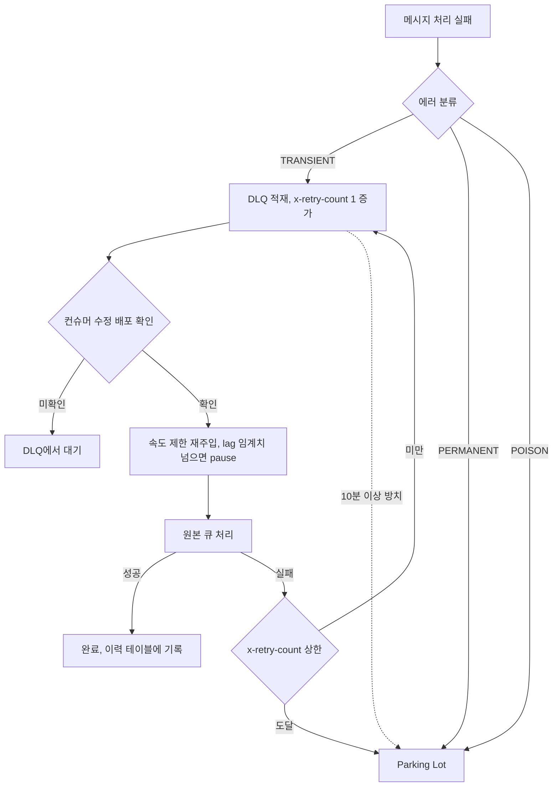
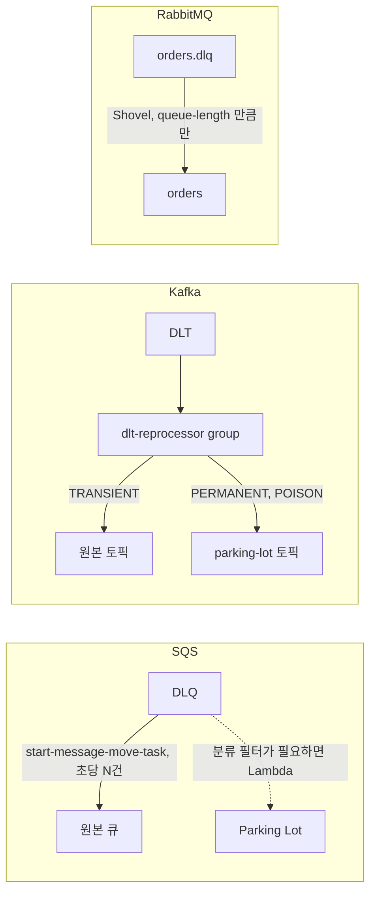
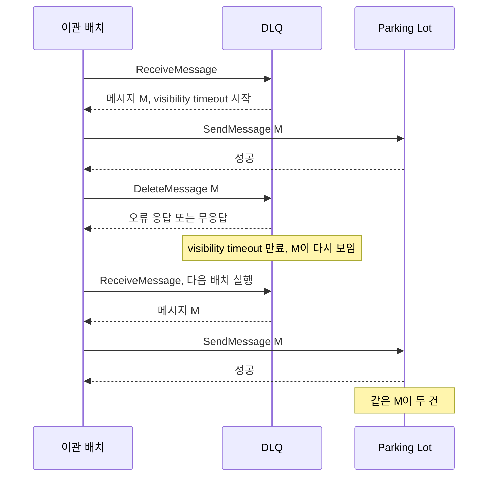
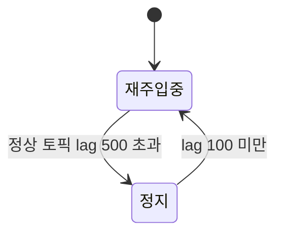
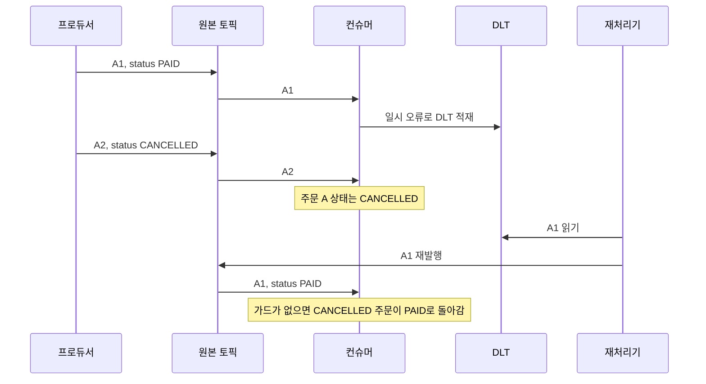
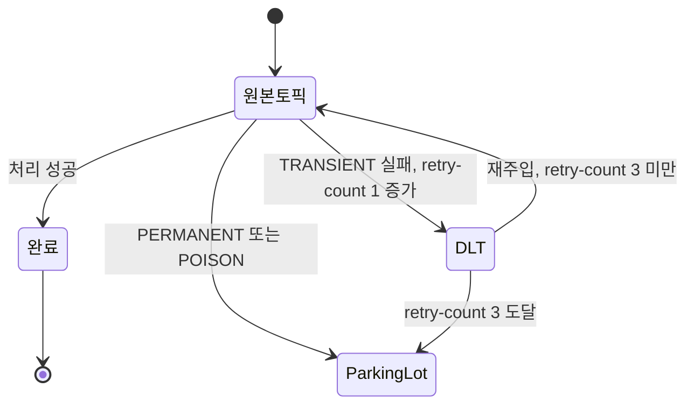

# DLQ 재처리 자동화

DLQ에 메시지가 쌓였을 때 나중에 보자고 넘기는 팀이 많다. 그런데 정작 재처리가 필요한 시점에 어떤 메시지가 왜 거기 있는지 파악하는 데 시간이 걸린다. 더 나쁜 건, 수정되지 않은 컨슈머로 재처리를 돌려서 같은 메시지가 다시 DLQ로 돌아오는 상황이다.

이 문서는 DLQ에 들어온 뒤의 운영을 다룬다. 분류, 브로커별 재주입 방법, Parking Lot 이관에서 시작해서 재주입 자체가 만드는 배압, 재처리로 뒤집히는 같은 key의 순서, 진행 상황 추적, 재처리 루프 차단까지 간다. 실패한 메시지를 DLQ로 보내기 전에 몇 번 더 시도하는 재시도 tier는 [Kafka 논블로킹 재시도 토픽 패턴](Kafka_Retry_Topic_Pattern.md)에서 다루므로 여기서는 반복하지 않는다. 컨슈머 쪽 배압 설정은 [컨슈머 배압과 전달 보장](Consumer_Backpressure.md)에 있다.

## DLQ 메시지 분류

DLQ에 들어온 메시지를 묻지도 따지지도 않고 전부 재처리하면 대부분 다시 DLQ로 돌아온다. 재처리 전에 원인을 분류하는 게 먼저다.

### 일시적 에러

컨슈머나 외부 의존성이 잠깐 불안정한 상황에서 발생한 실패다. 근본 원인이 해결되면 같은 메시지를 다시 처리했을 때 성공한다.

DB 연결 오류, 커넥션 풀 고갈, 외부 API 타임아웃이나 5xx 응답, 네트워크 단절이 여기에 해당한다. 배포 직후 연결이 초기화되기 전에 들어온 메시지가 실패하는 케이스도 흔하다. 이 유형은 배포 완료 확인 후 자동 재처리 파이프라인의 대상이 된다.

### 영구 에러

메시지 내용 자체에 문제가 있거나 비즈니스 규칙을 위반한 경우다. 컨슈머가 정상이어도 처리할 수 없다.

참조하는 주문 ID나 사용자 ID가 DB에서 이미 삭제된 경우, 환불 금액이 결제 금액을 초과하는 비즈니스 규칙 위반, 유효 기간이 지난 메시지(10분 안에 처리해야 하는데 1시간이 지남)가 여기에 해당한다. 자동 재처리 대상이 아니다. Parking Lot으로 이관 후 수동 검토한다.

### Poison Message

컨슈머가 역직렬화나 파싱 단계에서 예외를 던지는 메시지다. 재처리해도 즉시 다시 실패한다.

JSON 형식 오류, 스키마 버전 불일치, null 필드를 참조하는 역직렬화 로직이 원인이다. 프로듀서 쪽 코드가 변경되면서 기존 스키마와 호환되지 않는 메시지가 발행됐을 때 이런 일이 생긴다. 컨슈머 코드를 수정하지 않는 한 Parking Lot에서 대기한다.

### 분류 이후의 경로

세 분류가 어디로 흘러가는지를 한 장으로 그리면 이렇다. TRANSIENT만 원본 큐로 돌아갈 수 있고, 돌아간 뒤 또 실패하면 카운터를 올려서 상한에서 Parking Lot으로 빠진다. 문서 뒤쪽의 절은 이 그림의 각 화살표를 하나씩 다룬다.



### 분류 로직 구현

에러 타입을 컨슈머 레벨에서 태깅해서 DLQ 메시지 헤더나 속성으로 함께 저장해야 한다. 나중에 재처리할 때 분류 기준이 된다.

```typescript
type DlqErrorType = 'TRANSIENT' | 'PERMANENT' | 'POISON';

function classifyError(error: Error): DlqErrorType {
  if (error instanceof SyntaxError || error instanceof DeserializationError) {
    return 'POISON';
  }
  if (error instanceof NotFoundError || error instanceof BusinessRuleError) {
    return 'PERMANENT';
  }
  return 'TRANSIENT';
}

// SQS 메시지 속성으로 태깅
async function sendToDlq(
  originalMessage: SQSMessage,
  error: Error,
  dlqUrl: string
) {
  const errorType = classifyError(error);
  await sqs.send(new SendMessageCommand({
    QueueUrl: dlqUrl,
    MessageBody: originalMessage.Body ?? '',
    MessageAttributes: {
      'x-error-type': { DataType: 'String', StringValue: errorType },
      'x-error-message': { DataType: 'String', StringValue: error.message },
      'x-original-queue': { DataType: 'String', StringValue: SOURCE_QUEUE_URL }
    }
  }));
}
```

Kafka는 헤더로, RabbitMQ는 `message.properties.headers`로 같은 정보를 넘긴다.

## 브로커별 재처리 자동화

세 브로커는 메시지를 되돌리는 주체가 다르다. SQS는 관리형 태스크가, Kafka는 직접 만든 consumer group이, RabbitMQ는 브로커 플러그인이 옮긴다. 주체가 다르니 분류로 걸러낼 수 있는지, 속도를 어떻게 제한하는지, 중간에 어떻게 멈추는지도 갈린다.



| | SQS | Kafka | RabbitMQ |
|---|---|---|---|
| 옮기는 주체 | 관리형 move task (필터가 필요하면 Lambda) | 직접 만든 consumer group | Shovel 플러그인 |
| 분류별 선별 | move task는 전부 이동, 선별하려면 Lambda | 헤더 보고 코드에서 분기 | 큐 단위 이동, 선별 불가 |
| 속도 제한 | `MaxNumberOfMessagesPerSecond` | 직접 구현 (아래 토큰 버킷) | 초당 건수 옵션 없음, `src-prefetch-count`는 in-flight 상한 |
| 중단 | `CancelMessageMoveTask`, 이미 옮긴 건 그대로 | `consumer.pause`, offset 유지 | Shovel 삭제, 미확인 메시지는 DLQ에 남음 |

SQS와 RabbitMQ는 속도 제한과 중단 수단이 밖에서 주어지고, Kafka는 전부 코드로 만들어야 한다. 대신 Kafka는 헤더를 보고 메시지마다 다르게 다룰 수 있다.

### SQS — start-message-move-task

2023년부터 SQS가 지원하는 API다. DLQ에서 원본 큐로 메시지를 이동시키는 managed 작업을 생성한다. 콘솔에서 "Start DLQ redrive" 버튼과 같은 동작이지만 API를 쓰면 자동화할 수 있다.

```typescript
import { SQSClient, StartMessageMoveTaskCommand, ListMessageMoveTasksCommand } from '@aws-sdk/client-sqs';

const sqs = new SQSClient({ region: 'ap-northeast-2' });

async function redriveFromDlq(dlqArn: string, destinationArn?: string) {
  const command = new StartMessageMoveTaskCommand({
    SourceArn: dlqArn,
    DestinationArn: destinationArn, // 생략 시 원본 소스 큐로 자동 이동
    MaxNumberOfMessagesPerSecond: 10  // 낮게 시작하고 처리량 보면서 올린다
  });
  const result = await sqs.send(command);
  return result.TaskHandle;
}

// 태스크 진행 상황 확인
async function checkRedriveStatus(dlqArn: string) {
  const tasks = await sqs.send(new ListMessageMoveTasksCommand({ SourceArn: dlqArn }));
  return tasks.Results; // Status: 'RUNNING' | 'COMPLETED' | 'CANCELLING' | 'CANCELLED' | 'FAILED'
}
```

`MaxNumberOfMessagesPerSecond`를 높게 잡으면 컨슈머가 갑자기 대량 메시지를 받아서 DB 연결 풀이 고갈될 수 있다. 처음엔 5~10으로 시작하고 원본 큐의 소비 속도를 보면서 올린다.

TRANSIENT 메시지만 선별해서 재처리하려면 Lambda를 앞에 붙인다. DLQ 이벤트를 Lambda가 받아서 속성으로 분류한 뒤 원본 큐에 발행하고, PERMANENT·POISON은 Parking Lot으로 보내는 방식이다. `start-message-move-task`는 전체를 한꺼번에 이동시키기 때문에 필터링이 필요할 땐 이쪽을 쓴다.

### Kafka — DLT Consumer

Kafka에서 DLT(Dead Letter Topic)는 브로커 기능이 아니라 컨슈머 애플리케이션이 만드는 패턴이다. 재처리도 별도의 consumer group이 DLT를 소비해서 원본 토픽으로 다시 produce하는 방식이다.

```typescript
async function startDltReprocessor(
  dltTopic: string,
  originalTopic: string,
  kafka: Kafka
) {
  const consumer = kafka.consumer({ groupId: 'dlt-reprocessor' }); // 원본 group ID와 다르게
  const producer = kafka.producer({ idempotent: true });

  await consumer.connect();
  await producer.connect();
  await consumer.subscribe({ topic: dltTopic, fromBeginning: false });

  await consumer.run({
    eachMessage: async ({ message }) => {
      const errorType = message.headers?.['x-error-type']?.toString();

      if (errorType === 'PERMANENT' || errorType === 'POISON') {
        await producer.send({
          topic: 'parking-lot',
          messages: [{
            key: message.key,
            value: message.value,
            headers: {
              ...message.headers,
              'x-moved-from': Buffer.from(dltTopic),
              'x-moved-at': Buffer.from(Date.now().toString())
            }
          }]
        });
        return;
      }

      // TRANSIENT만 원본 토픽으로 재발행
      await producer.send({
        topic: originalTopic,
        messages: [{
          key: message.key,
          value: message.value,
          headers: {
            ...message.headers,
            'x-reprocessed-from': Buffer.from(dltTopic),
            'x-dlt-offset': Buffer.from(message.offset)
          }
        }]
      });
    }
  });
}
```

이 코드의 예전 버전은 `x-original-offset`에 `message.offset`을 넣었다. 그런데 이 offset은 DLT 안의 위치라서 원본 토픽의 offset이 아니다. 뒤의 멱등 키(`topic-partition-offset`)와 재처리 이력이 이 헤더에 기대므로, 원본 좌표는 실패한 컨슈머가 DLT로 보낼 때 한 번만 기록하고 재주입 때는 `...message.headers`로 그대로 넘긴다. DLT offset은 별도 이름(`x-dlt-offset`)으로 둔다. 헤더를 붙이는 쪽 코드는 [재처리 이력 추적](#재처리-이력-추적)에 있다.

DLT consumer group ID를 원본과 다르게 잡는 게 중요하다. 같은 group ID를 쓰면 offset 관리가 섞인다. 원본 토픽으로 produce 완료 후 DLT offset을 커밋한다. produce 실패 시 DLT offset을 커밋하지 않으면 재시작 시 같은 메시지를 다시 시도한다.

### RabbitMQ — Shovel Plugin

RabbitMQ에서 DLQ의 메시지를 다른 큐로 이동시키는 방법 중 Shovel Plugin이 안정적이다. 브로커 레벨에서 직접 이동시키기 때문에 별도 컨슈머 코드를 짤 필요가 없다.

```bash
# Shovel Plugin 활성화
rabbitmq-plugins enable rabbitmq_shovel
rabbitmq-plugins enable rabbitmq_shovel_management
```

HTTP API로 DLQ → 원본 큐 이동 태스크를 동적으로 생성한다:

```bash
curl -u admin:password -X PUT \
  http://rabbitmq:15672/api/parameters/shovel/%2F/dlq-to-orders \
  -H "Content-Type: application/json" \
  -d '{
    "value": {
      "src-protocol": "amqp091",
      "src-uri": "amqp://localhost",
      "src-queue": "orders.dlq",
      "dest-protocol": "amqp091",
      "dest-uri": "amqp://localhost",
      "dest-queue": "orders",
      "src-delete-after": "queue-length",
      "src-prefetch-count": 10
    }
  }'
```

`src-delete-after: "queue-length"`가 핵심이다. Shovel 생성 시점의 DLQ 메시지 수만큼 이동 후 자동으로 종료한다. 이게 없으면 Shovel이 계속 살아 있으면서 새로 들어오는 DLQ 메시지까지 원본 큐로 보내버린다.

Shovel 제거는 DELETE로 한다:

```bash
curl -u admin:password -X DELETE \
  http://rabbitmq:15672/api/parameters/shovel/%2F/dlq-to-orders
```

직접 consumer를 짤 때는 `basic_get`으로 DLQ에서 꺼내서 원본 exchange로 publish하고 ack하는 방식을 쓴다. 이때 publish 성공 여부를 confirm 후 ack해야 한다. publish가 실패한 상태에서 ack하면 메시지가 사라진다.

## Parking Lot 자동 이관 배치

DLQ에서 오래 방치된 메시지를 Parking Lot으로 옮기는 배치다. 10분 이상 DLQ에 있는 메시지는 일시적 에러가 아닐 가능성이 높다. 수동 검토가 필요한 메시지를 Parking Lot으로 격리하면 DLQ에 남은 것들만 재처리 대상으로 관리할 수 있다.

```typescript
async function evacuateStaleDlqMessages(
  dlqUrl: string,
  parkingLotUrl: string,
  maxAgeMinutes: number = 10
) {
  const maxAgeMs = maxAgeMinutes * 60 * 1000;
  const now = Date.now();
  let moved = 0;

  while (true) {
    const { Messages } = await sqs.send(new ReceiveMessageCommand({
      QueueUrl: dlqUrl,
      MaxNumberOfMessages: 10,
      MessageAttributeNames: ['All'],
      AttributeNames: ['SentTimestamp']
    }));

    if (!Messages?.length) break;

    for (const msg of Messages) {
      const sentAt = Number(msg.Attributes?.SentTimestamp ?? 0);
      const ageMs = now - sentAt;
      const errorType = msg.MessageAttributes?.['x-error-type']?.StringValue;
      const isOld = ageMs > maxAgeMs;
      const isPermanentOrPoison = errorType === 'PERMANENT' || errorType === 'POISON';

      if (!isOld && !isPermanentOrPoison) {
        continue; // 아직 재처리 대상
      }

      await sqs.send(new SendMessageCommand({
        QueueUrl: parkingLotUrl,
        MessageBody: msg.Body ?? '',
        MessageAttributes: {
          ...msg.MessageAttributes,
          'x-moved-from-dlq': { DataType: 'String', StringValue: dlqUrl },
          'x-dlq-message-id': { DataType: 'String', StringValue: msg.MessageId ?? '' },
          'x-dlq-age-minutes': {
            DataType: 'Number',
            StringValue: String(Math.floor(ageMs / 60000))
          }
        }
      }));

      await sqs.send(new DeleteMessageCommand({
        QueueUrl: dlqUrl,
        ReceiptHandle: msg.ReceiptHandle!
      }));

      moved++;
    }
  }

  return moved;
}
```

### SendMessage와 DeleteMessage 사이의 중복 구간

SQS에는 두 큐에 걸친 트랜잭션이 없어서 이관은 `SendMessage`와 `DeleteMessage` 두 호출이다. 첫 호출이 성공하고 둘째가 실패하면 메시지가 두 곳에 남는다. 배치가 그냥 죽는 게 아니라 visibility timeout이 지나 DLQ에서 다시 보이고, 다음 배치가 그 메시지를 또 Parking Lot으로 보낸다는 점이 문제다.



Parking Lot에 같은 메시지가 두 건 쌓이는 구간이 그림 아래쪽이다. FIFO 큐의 `MessageDeduplicationId`로 막으려 해도 중복 제거 창이 5분이라, 배치 주기가 5~10분이면 두 번째 전송은 창 밖에 있다. 그래서 위 코드처럼 원본 `MessageId`를 `x-dlq-message-id` 속성에 넣어 두고, Parking Lot을 읽는 쪽(검토 도구나 재처리 컨슈머)에서 이 값으로 중복을 걸러야 한다. 이관 배치가 `continue`로 건너뛴 메시지도 그 배치가 받은 순간 visibility timeout에 들어가므로, 같은 시간대에 move task를 돌려도 그 메시지는 잠시 보이지 않는다.

이 배치는 5~10분 간격으로 실행하면 충분하다. 너무 자주 돌리면 SQS API 호출 비용이 쌓인다. Parking Lot의 retention은 DLQ보다 길게 잡는다. DLQ가 7일이면 Parking Lot은 30일 이상으로 설정해서 검토 시간을 확보한다.

## 재처리 전 컨슈머 버전 확인

DLQ 재처리를 시작하기 전에 원본 큐의 컨슈머가 문제를 일으킨 버그가 수정된 버전인지 확인해야 한다. 수정되지 않은 상태에서 재처리하면 같은 메시지가 다시 DLQ로 돌아온다. 이걸 놓치고 재처리를 돌리는 실수가 생각보다 자주 발생한다.

자동화 파이프라인에 확인 단계를 강제로 넣는 게 현실적이다.

```typescript
interface DlqContext {
  failedSinceVersion: string;  // 이 버전 이후 메시지가 DLQ로 가기 시작
  failureReason: string;
  createdAt: Date;
}

async function assertConsumerFixed(
  consumerDeploymentName: string,
  dlqContext: DlqContext
): Promise<void> {
  const currentImage = await getDeployedImageTag(consumerDeploymentName);
  const currentVersion = extractVersionFromImage(currentImage);

  const [curMajor, curMinor, curPatch] = currentVersion.split('.').map(Number);
  const [reqMajor, reqMinor, reqPatch] = dlqContext.failedSinceVersion.split('.').map(Number);

  const isSameOrOlder =
    curMajor < reqMajor ||
    (curMajor === reqMajor && curMinor < reqMinor) ||
    (curMajor === reqMajor && curMinor === reqMinor && curPatch <= reqPatch);

  if (isSameOrOlder) {
    throw new Error(
      `Consumer ${consumerDeploymentName} is v${currentVersion}. ` +
      `DLQ started filling at v${dlqContext.failedSinceVersion}: ${dlqContext.failureReason}. ` +
      `Deploy a fix before redriving.`
    );
  }
}
```

버전 추적을 자동화하기 어려운 환경이면 재처리 스크립트에 확인 프롬프트를 넣는다:

```bash
#!/bin/bash
set -e

echo "DLQ: $DLQ_URL"
echo "현재 컨슈머 이미지:"
kubectl get deployment order-consumer \
  -o jsonpath='{.spec.template.spec.containers[0].image}'
echo ""
echo "DLQ가 쌓이기 시작한 시점의 장애 내용:"
echo "$FAILURE_REASON"
echo ""
read -p "해당 버그가 현재 버전에서 수정됐는지 확인했습니까? (yes/no): " confirmed
if [ "$confirmed" != "yes" ]; then
  echo "재처리를 중단합니다."
  exit 1
fi
```

자동화 여부와 상관없이 재처리 전에 DLQ의 메시지 몇 개를 꺼내서 payload를 직접 눈으로 확인하는 습관을 들이는 게 좋다. 예상과 다른 패턴이 보이면 재처리 전에 원인을 다시 파악해야 한다.

## 재주입이 만드는 배압

DLQ에 3,000건이 쌓여 있다고 버튼을 눌러 한꺼번에 되돌리면, 원본 큐는 정상 트래픽과 재주입분을 같은 컨슈머가 받는다. 컨슈머의 여유 처리량을 넘는 순간 lag가 솟고, 그 lag 때문에 정상 메시지의 처리 지연이 늘고, 지연이 타임아웃을 만들면 새 실패가 다시 DLQ로 들어온다. 재처리가 다음 DLQ를 만드는 경로다. [컨슈머 배압과 전달 보장](Consumer_Backpressure.md)에서 다룬 배압이 재처리를 시작한 쪽에서 재현되는 셈이다.

### 여유 처리량으로 속도를 정한다

재주입 속도의 상한은 컨슈머 최대 처리량에서 평상시 유입량을 뺀 여유분이다. 최대 120건/초를 처리하는 컨슈머에 평소 100건/초가 들어오면 여유는 20건/초이고, 50건/초로 재주입하면 lag가 초당 30건씩 쌓인다. 그래서 초당 N건 제한 하나로는 부족하고, 정상 토픽의 lag를 보고 멈추는 장치가 같이 필요하다. 여유분 추정이 틀렸을 때 잡아주는 안전장치다.



재개 기준을 정지 기준과 같게 잡으면 임계치 근처에서 정지와 재개를 반복한다. 정지는 500, 재개는 100처럼 간격을 벌려야 한다. lag 조회도 메시지마다 하지 않고 2초 정도 캐시해서 쓴다.

```typescript
interface GateOptions {
  ratePerSec: number;
  pauseAboveLag: number;
  resumeBelowLag: number;
  checkEveryMs?: number;
  readLag: () => Promise<number>;
  now?: () => number;
  sleep?: (ms: number) => Promise<void>;
}

export class ReplayGate {
  private tokens: number;
  private lastRefill: number;
  private lastCheck = -Infinity;
  private paused = false;
  private readonly now: () => number;
  private readonly sleep: (ms: number) => Promise<void>;
  private readonly checkEveryMs: number;

  constructor(private readonly o: GateOptions) {
    this.now = o.now ?? Date.now;
    this.sleep = o.sleep ?? ((ms) => new Promise((r) => setTimeout(r, ms)));
    this.checkEveryMs = o.checkEveryMs ?? 2000;
    this.tokens = o.ratePerSec;
    this.lastRefill = this.now();
  }

  private async refreshLag(): Promise<void> {
    if (this.now() - this.lastCheck < this.checkEveryMs) return;
    this.lastCheck = this.now();
    const lag = await this.o.readLag();
    if (!this.paused && lag > this.o.pauseAboveLag) this.paused = true;
    else if (this.paused && lag < this.o.resumeBelowLag) this.paused = false;
  }

  async acquire(heartbeat: () => Promise<void>): Promise<void> {
    for (;;) {
      await this.refreshLag();
      if (!this.paused) {
        const t = this.now();
        this.tokens = Math.min(
          this.o.ratePerSec,
          this.tokens + ((t - this.lastRefill) / 1000) * this.o.ratePerSec,
        );
        this.lastRefill = t;
        if (this.tokens >= 1) {
          this.tokens -= 1;
          return;
        }
      }
      await this.sleep(100);
      await heartbeat();
    }
  }
}
```

대기 루프에서 `heartbeat()`를 부르는 이유는 정지가 길어지면 `eachMessage` 하나가 세션 타임아웃보다 오래 걸리기 때문이다. 하트비트가 끊기면 그룹이 재조정되고, 재처리기가 아직 offset을 커밋하지 못한 메시지를 다시 받는다. 원리는 [Consumer_Backpressure의 heartbeat 절](Consumer_Backpressure.md#kafkajs-eachbatch와-heartbeat)에 있다.

원본 토픽 lag는 컨슈머 그룹이 커밋한 offset과 end offset의 차이다. kafkajs `admin`으로 이렇게 잰다.

```typescript
export async function getGroupLag(admin: Admin, groupId: string, topic: string): Promise<number> {
  const [ends, committed] = await Promise.all([
    admin.fetchTopicOffsets(topic),
    admin.fetchOffsets({ groupId, topics: [topic] }),
  ]);
  const done = new Map((committed[0]?.partitions ?? []).map((p) => [p.partition, Number(p.offset)]));
  return ends.reduce((sum, e) => {
    const c = done.get(e.partition) ?? -1;
    return sum + Number(e.high) - (c < 0 ? Number(e.low) : c);
  }, 0);
}
```

재처리기는 위 게이트를 `producer.send` 앞에 둔다. TRANSIENT가 아닌 메시지와 재처리 횟수가 찬 메시지는 게이트를 거치지 않고 Parking Lot으로 간다. 원본 토픽에 부담을 주지 않는 이동이기 때문이다.

```typescript
const MAX_REPROCESS = 3;
const h = (headers: IHeaders | undefined, k: string) => headers?.[k]?.toString();

export async function startThrottledReprocessor(
  kafka: Kafka, dltTopic: string, originalTopic: string, mainGroupId: string,
) {
  const admin = kafka.admin();
  const consumer = kafka.consumer({ groupId: 'dlt-reprocessor' });
  const producer = kafka.producer({ idempotent: true });
  await Promise.all([admin.connect(), consumer.connect(), producer.connect()]);
  await consumer.subscribe({ topic: dltTopic });

  const gate = new ReplayGate({
    ratePerSec: 10,
    pauseAboveLag: 500,
    resumeBelowLag: 100,
    readLag: () => getGroupLag(admin, mainGroupId, originalTopic),
  });

  await consumer.run({
    eachMessage: async ({ message, heartbeat }) => {
      const errorType = h(message.headers, 'x-error-type');
      const retryCount = Number(h(message.headers, 'x-retry-count') ?? 0);

      if (errorType !== 'TRANSIENT' || retryCount >= MAX_REPROCESS) {
        const reason = errorType !== 'TRANSIENT' ? errorType : 'REPROCESS_LIMIT';
        await producer.send({
          topic: 'parking-lot',
          messages: [{
            key: message.key,
            value: message.value,
            headers: { ...message.headers, 'x-park-reason': Buffer.from(String(reason)) },
          }],
        });
        return;
      }

      await gate.acquire(heartbeat);
      await producer.send({
        topic: originalTopic,
        messages: [{
          key: message.key,
          value: message.value,
          headers: { ...message.headers, 'x-reprocess-id': Buffer.from(`${dltTopic}-${message.offset}`) },
        }],
      });
    },
  });
}
```

### 시뮬레이션으로 본 차이

게이트 로직을 그대로 가상 시계에 올려 돌렸다. 실제 브로커를 쓴 실험이 아니라 모델이다. 정상 유입 100건/초, 컨슈머 처리량 120건/초, 재주입 5,000건, lag 조회 주기 2초로 두고, 재주입된 메시지는 즉시 lag에 더해진다고 가정했다.

| 재주입 방식 | lag 최고 | lag 500 초과 지속 | 정지 횟수 |
|---|---|---|---|
| 제한 없음 (한꺼번에) | 5,000 | 225초 | - |
| 50건/초, 정지 없음 | 3,020 | 210초 | 0 |
| 50건/초, 500 정지 / 100 재개 | 562 | 20초 | 6 |
| 50건/초, 500 정지 / 500 재개 | 602 | 175초 | 29 |
| 10건/초, 500 정지 / 100 재개 | 10 | 0초 | 0 |

읽을 점이 세 가지다. 처음 네 줄은 5,000건을 다 소화하는 데 모두 250초가 걸렸다. 여유가 20건/초라서 5,000건을 비우는 시간은 속도 제한과 무관하게 정해지고, 게이트가 하는 일은 그 시간 동안 lag를 낮게 묶는 것뿐이다. 셋째 줄의 최고 562는 500에서 정지를 판단하기까지 lag 조회 주기 2초 동안 재주입이 계속됐기 때문이다. 재개 기준을 500으로 둔 넷째 줄은 정지와 재개를 29번 반복하면서 lag가 500 근처를 175초 동안 맴돌았다. 마지막 줄처럼 여유(20건/초)보다 낮게 잡으면 게이트는 한 번도 발동하지 않지만, 5,000건에 499초가 걸린다.

### 브로커별 정지 방법

SQS move task에는 `MaxNumberOfMessagesPerSecond`만 있고 원본 큐 상태와의 연동은 없어서, 원본 큐의 `ApproximateNumberOfMessagesVisible`과 `ApproximateAgeOfOldestMessage`를 CloudWatch에서 보다가 임계치를 넘으면 태스크를 취소하고 더 낮은 속도로 다시 시작한다. 이미 옮긴 메시지는 되돌아가지 않는다.

```typescript
export async function cancelRedrive(sqs: SQSClient, taskHandle: string) {
  return sqs.send(new CancelMessageMoveTaskCommand({ TaskHandle: taskHandle }));
}
```

RabbitMQ Shovel은 삭제하면 멈춘다. 이때 `src-delete-after: "queue-length"`로 만든 Shovel은 재생성 시점의 큐 길이를 다시 잡으므로, 재개할 때는 남은 메시지 수를 기준으로 새로 만든다.

## 재처리로 뒤집히는 같은 key의 순서

DLT로 빠진 메시지는 원본 토픽의 맨 뒤로 다시 들어온다. 그 사이에 같은 key의 뒤 메시지가 이미 처리됐다면 처리 순서가 뒤집힌다. 재시도 tier에서 생기는 뒤집힘([같은 key의 순서가 깨진다](Kafka_Retry_Topic_Pattern.md#같은-key의-순서가-깨진다))이 분 단위라면, DLT 재처리는 몇 시간에서 며칠 뒤에 일어난다. 그동안 그 key의 상태가 몇 번이든 바뀌었을 수 있다.



DLT 적재 후 A2가 정상 처리되는 지점과, 재발행된 A1이 뒤늦게 덮어쓰는 마지막 단계를 보면 된다. 시뮬레이션으로 같은 두 메시지를 가드 없이 적용하면 최종 상태가 `PAID`, 가드를 켜면 A1이 `SKIPPED_STALE`로 버려지고 `CANCELLED`가 남는다.

같은 key를 DLT로 보낸 동안 뒤 메시지도 전부 DLT로 보내서 순서를 지키는 방법은 [Kafka_Retry_Topic_Pattern의 key별 재시도 중 표시](Kafka_Retry_Topic_Pattern.md#key별-재시도-중-표시)와 같은 구조다. 재처리 쪽에서는 이 방법을 쓰기 어렵다. DLT에 수천 건이 쌓인 상태에서 같은 key의 뒤 메시지까지 DLT로 몰면 정상 처리되던 key가 전부 재처리 대기열로 들어간다. 순서가 절대 조건인 토픽이면 DLT로 빼지 않고 파티션을 막는 쪽을 고르는 게 맞다.

### 소비 쪽에서 오래된 메시지를 버린다

현실적인 방법은 컨슈머가 엔티티별로 마지막에 반영한 순번을 저장하고, 그보다 오래된 메시지는 버리는 것이다. 순번으로는 프로듀서가 붙이는 엔티티 버전이 가장 정확하다. 없으면 원본 토픽 offset을 쓸 수 있다. 같은 key는 같은 파티션으로 가므로 그 파티션 안에서 offset 순서가 발행 순서와 같기 때문이다. 그래서 원본 좌표를 재주입 뒤에도 지키는 게 중요하다. 파티션 수를 늘려 key가 다른 파티션으로 옮겨간 뒤에는 offset을 비교할 수 없다.

```sql
UPDATE orders
   SET status = :status,
       last_applied_offset = :original_offset
 WHERE id = :order_id
   AND last_applied_offset < :original_offset;
```

영향받은 행이 0이면 이미 더 최신 메시지가 반영된 상태다. 이 메시지는 실패로 던지지 말고 이력에 `SKIPPED_STALE`로 남기고 정상 종료해야 한다. 던지면 이 메시지가 또 DLT로 돌아가서 재처리 루프가 된다. 이 방식은 마지막 값이 이기는 이벤트(상태 변경, 프로필 수정)에만 맞다. 잔액 증감처럼 모든 이벤트를 순서대로 적용해야 하는 경우는 오래된 것을 버리면 안 되고, 버전 갭을 보고 기다리거나 아예 DLT로 빼지 않아야 한다.

## 재처리 이력 추적

DLT에 남은 메시지가 지금 어느 단계인지 답하려면 원본 좌표가 필요하다. DLT의 offset은 재주입해도 바뀌지 않지만 원본 토픽의 offset은 재발행하면 새로 붙는다. 그래서 처음 실패했을 때의 `topic/partition/offset`을 헤더로 고정해 두고, 재처리가 몇 번 돌아도 같은 키로 이력을 이어 붙인다.

```typescript
const h = (headers: IHeaders | undefined, k: string) => headers?.[k]?.toString();

export async function sendToDlt(
  producer: Producer,
  dltTopic: string,
  src: { topic: string; partition: number; message: KafkaMessage },
  errorType: string,
  error: Error,
) {
  const prev = Number(h(src.message.headers, 'x-retry-count') ?? 0);
  await producer.send({
    topic: dltTopic,
    messages: [{
      key: src.message.key,
      value: src.message.value,
      headers: {
        ...src.message.headers,
        'x-error-type': Buffer.from(errorType),
        'x-error-message': Buffer.from(error.message.slice(0, 500)),
        'x-retry-count': Buffer.from(String(prev + 1)),
        // 이미 있으면 첫 실패 때의 좌표를 유지한다
        'x-original-topic': src.message.headers?.['x-original-topic'] ?? Buffer.from(src.topic),
        'x-original-partition': src.message.headers?.['x-original-partition'] ?? Buffer.from(String(src.partition)),
        'x-original-offset': src.message.headers?.['x-original-offset'] ?? Buffer.from(src.message.offset),
      },
    }],
  });
}
```

`x-original-*`를 덮어쓰지 않고 "있으면 유지"로 두는 게 핵심이다. 재주입된 메시지가 다시 실패했을 때 원본 토픽의 새 offset이 들어가면 첫 실패와 이력이 끊긴다. `x-error-message`를 잘라 두는 것도 이유가 있다. 스택트레이스 전체를 헤더로 넣으면 값이 작은 이벤트가 대량으로 실패할 때 DLT 용량이 원본보다 커진다([운영 비용](Kafka_Retry_Topic_Pattern.md#운영-비용) 참고). Spring Kafka의 `DeadLetterPublishingRecoverer`를 쓰면 원본 좌표 헤더는 자동으로 붙지만 이름이 버전마다 다르고 offset이 문자열이 아니라 바이너리로 들어가는 경우가 있어서, 실제 DLT 메시지의 헤더를 한 번 덤프해서 확인하고 이력 테이블 적재 코드에 맞춘다.

이력 테이블은 원본 좌표와 시도 횟수를 유니크 키로 잡는다.

```sql
CREATE TABLE dlq_reprocess_history (
  id               BIGSERIAL PRIMARY KEY,
  source_topic     TEXT      NOT NULL,
  source_partition INT       NOT NULL,
  source_offset    BIGINT    NOT NULL,
  msg_key          TEXT,
  error_type       TEXT      NOT NULL,
  attempt          INT       NOT NULL,          -- x-retry-count 값
  batch_id         TEXT      NOT NULL,          -- 재처리 실행 단위
  status           TEXT      NOT NULL,          -- REPLAYED, SUCCEEDED, FAILED_AGAIN, PARKED, SKIPPED_STALE
  created_at       TIMESTAMPTZ NOT NULL DEFAULT now(),
  updated_at       TIMESTAMPTZ NOT NULL DEFAULT now(),
  UNIQUE (source_topic, source_partition, source_offset, attempt)
);
```

기록 시점은 세 곳이다. 재처리기가 재주입할 때 `REPLAYED` 행을 넣는다. 원본 컨슈머가 `x-reprocess-id` 헤더가 붙은 메시지를 처리하고 나면 멱등 테이블(`processed_messages`)에 완료를 쓰는 같은 트랜잭션에서 그 행을 `SUCCEEDED`(또는 가드에서 버렸다면 `SKIPPED_STALE`)로 바꾼다. 또 실패해서 DLT로 돌아오면 재처리기가 이전 행을 `FAILED_AGAIN`으로 바꾸고, 상한에 걸렸다면 `PARKED`로 닫는다. 성공 기록을 멱등 기록과 같은 트랜잭션에 넣는 이유는 둘이 어긋나면 "처리는 됐는데 이력에는 재주입 상태로 남은" 행이 생기기 때문이다.

진행 상황은 배치 단위 집계로 본다.

```sql
SELECT status, count(*)
  FROM dlq_reprocess_history
 WHERE batch_id = :batch
 GROUP BY status;

-- 재주입했는데 결과가 안 돌아온 메시지
SELECT source_topic, source_partition, source_offset, created_at
  FROM dlq_reprocess_history
 WHERE status = 'REPLAYED' AND updated_at < now() - interval '30 minutes';
```

두 번째 쿼리에 걸리는 행이 재처리에서 가장 위험하다. 원본 토픽 lag에서 밀려 있거나, 컨슈머가 헤더를 못 읽고 이력을 갱신하지 못했거나, 재발행 자체가 유실된 경우다. 정지 중인 게이트 때문에 대기하는 메시지는 아직 `REPLAYED`가 아니라 DLT에 있으므로 여기에 걸리지 않는다.

## 재처리 루프 차단

컨슈머 버그를 고치지 않았거나 고쳤는데도 다른 원인이 남아 있으면, 재주입된 메시지는 실패해서 다시 DLT로 온다. 자동 재처리가 붙어 있으면 이 왕복이 끝없이 돈다. 왕복 횟수를 메시지에 실어 두고 상한에서 끊어야 한다.



그림에서 `원본토픽 → DLT → 원본토픽`이 루프이고, 카운터가 3에 닿으면 `ParkingLot`으로만 나갈 수 있다. 위에서 만든 `sendToDlt`가 DLT로 보낼 때마다 `x-retry-count`를 올리고, 재처리기가 `retryCount >= MAX_REPROCESS`를 보고 Parking Lot으로 보낸다. 첫 실패에서 이미 카운터가 1이 되므로, 매번 실패하는 메시지는 시뮬레이션에서 재주입 2번, 실패 3번을 겪고 Parking Lot으로 갔다. Parking Lot으로 갈 때는 `x-park-reason`에 `REPROCESS_LIMIT`을 넣는다. 처음부터 POISON이라서 온 것과 재처리를 세 번 돌리고도 안 되는 것은 조사 방향이 다르기 때문이다.

이 카운터에는 함정이 세 가지 있다.

첫째는 헤더가 끊기는 경우다. 컨슈머가 실패한 메시지로 새 메시지를 만들어 DLT에 보내면서 `...message.headers`를 복사하지 않으면 카운터가 0으로 돌아간다. 상한이 있는데도 루프가 계속되는 증상이면 이 지점부터 본다. 재시도 tier의 시도 횟수(`x-attempt`)와 이 카운터도 섞지 않는다. `x-attempt`는 재시도 토픽 안에서 도는 횟수이고 `x-retry-count`는 DLT를 다녀온 횟수라서, 하나로 합치면 상한이 의도보다 일찍 걸린다.

둘째는 SQS 네이티브 redrive policy다. `maxReceiveCount` 초과로 SQS가 직접 DLQ로 옮긴 메시지는 컨슈머가 손댈 기회가 없어서 카운터를 올릴 수 없다. 이 경우 카운터는 이력 테이블에서 세야 하고, 키는 메시지 본문의 비즈니스 ID(주문 ID 등)를 쓴다. 헤더가 아니라 본문에 있는 값이어야 옮겨져도 살아남는다.

셋째는 상한 값이다. 3이면 대부분 충분하다. 재처리 사이 간격이 수 시간이고 재주입이 원인 수정 후에 일어나는데도 처음 실패를 포함해 3번을 연속으로 실패하면 그 원인은 고쳐지지 않은 것이다. 5 이상으로 올리는 건 같은 실패를 더 오래 반복할 뿐이다. 재처리 자동화의 목적은 사람이 원인을 본 다음 다시 돌리게 만드는 것이다. 그래서 Parking Lot에서 나오는 메시지는 카운터를 0으로 되돌리는 절차를 사람이 명시적으로 거쳐야 한다.

## DLQ 모니터링 알람

알람 없는 DLQ는 블랙홀이다. 메시지가 쌓여도 아무도 모른다. 최소 두 가지 알람을 걸어야 한다.

**메시지 수 > 0**: DLQ에 메시지 하나라도 들어오면 즉시 알람을 받는다. 운영 초기에는 자주 울릴 수 있지만 DLQ에 메시지가 있다는 것 자체가 조사가 필요한 상태다.

**메시지 최고 나이 > 10분**: 메시지가 10분 이상 DLQ에 방치됐다면 일시적 에러가 아니다. 이 알람이 오면 Parking Lot 이관이나 수동 검토가 필요하다.

AWS CloudWatch에서 SQS DLQ 알람을 설정하면:

```typescript
async function createDlqAlarms(dlqName: string, snsTopicArn: string) {
  const cw = new CloudWatchClient({ region: 'ap-northeast-2' });

  await cw.send(new PutMetricAlarmCommand({
    AlarmName: `${dlqName}-has-messages`,
    Namespace: 'AWS/SQS',
    MetricName: 'ApproximateNumberOfMessagesVisible',
    Dimensions: [{ Name: 'QueueName', Value: dlqName }],
    Statistic: 'Sum',
    Period: 60,
    EvaluationPeriods: 1,
    Threshold: 0,
    ComparisonOperator: 'GreaterThanThreshold',
    AlarmActions: [snsTopicArn],
    TreatMissingData: 'notBreaching'
  }));

  await cw.send(new PutMetricAlarmCommand({
    AlarmName: `${dlqName}-age-over-10min`,
    Namespace: 'AWS/SQS',
    MetricName: 'ApproximateAgeOfOldestMessage',
    Dimensions: [{ Name: 'QueueName', Value: dlqName }],
    Statistic: 'Maximum',
    Period: 60,
    EvaluationPeriods: 1,
    Threshold: 600,
    ComparisonOperator: 'GreaterThanOrEqualToThreshold',
    AlarmActions: [snsTopicArn],
    TreatMissingData: 'notBreaching'
  }));
}
```

Kafka DLT는 consumer lag 메트릭으로 알람을 건다. Prometheus + kafka-exporter 조합이라면:

```yaml
groups:
  - name: dlq
    rules:
      - alert: KafkaDltHasMessages
        expr: kafka_consumer_group_lag{topic=~".*\\.DLT"} > 0
        for: 1m
        labels:
          severity: warning
        annotations:
          summary: "DLT {{ $labels.topic }}에 미처리 메시지 {{ $value }}개"

      - alert: KafkaDltMessageStale
        expr: >
          (time() - kafka_topic_partition_latest_offset_time{topic=~".*\\.DLT"}) > 600
          and kafka_consumer_group_lag{topic=~".*\\.DLT"} > 0
        for: 1m
        labels:
          severity: critical
        annotations:
          summary: "DLT {{ $labels.topic }} 메시지 10분 이상 미처리"
```

RabbitMQ는 `rabbitmq_prometheus` 플러그인을 활성화하면 `rabbitmq_queue_messages` 메트릭으로 DLQ 메시지 수를 수집할 수 있다. 최고 나이는 Management API의 `/api/queues/{vhost}/{name}` 엔드포인트의 `message_stats` 필드에서 가져온다.

DLQ 알람의 알림 대상을 팀 전체 슬랙 채널로 설정하는 게 좋다. 특정 개인에게만 오면 휴가 중이거나 부재 시 놓친다.

## 재처리 중 멱등 처리 연계

DLQ에서 원본 큐로 메시지를 되돌리면 컨슈머는 같은 메시지를 두 번 이상 받게 된다. 첫 번째 실패가 처리 도중에 일어났다면 일부 사이드이펙트가 이미 DB에 반영됐을 수 있다.

멱등 처리의 핵심은 같은 메시지 ID로 같은 작업을 두 번 실행해도 결과가 한 번 실행한 것과 같아야 한다는 점이다.

```typescript
async function processMessageIdempotently(
  messageId: string,
  db: Database,
  process: () => Promise<void>
): Promise<void> {
  // UPSERT로 레이스 컨디션 방지
  const result = await db.query<{ status: string }>(`
    INSERT INTO processed_messages (message_id, status, processed_at)
    VALUES ($1, 'processing', NOW())
    ON CONFLICT (message_id) DO UPDATE
      SET status = CASE
        WHEN processed_messages.status = 'completed' THEN 'completed'
        ELSE 'processing'
      END,
      processed_at = NOW()
    RETURNING status
  `, [messageId]);

  if (result.rows[0].status === 'completed') {
    return; // 이미 처리됨 — 중복 수신
  }

  try {
    await db.transaction(async (trx) => {
      await process(); // 실제 비즈니스 로직
      await trx.query(
        'UPDATE processed_messages SET status = $1 WHERE message_id = $2',
        ['completed', messageId]
      );
    });
  } catch (error) {
    await db.query(
      'UPDATE processed_messages SET status = $1, error = $2 WHERE message_id = $3',
      ['failed', String(error), messageId]
    );
    throw error;
  }
}
```

메시지 ID를 뭘로 쓸지는 브로커마다 다르다.

SQS 표준 큐는 `MessageId` 속성(브로커 자동 생성)을 쓴다. FIFO 큐에서는 프로듀서가 설정한 `MessageDeduplicationId`가 더 명확하다. Kafka는 `topic + partition + offset` 조합이 고유하다. DLT에서 재처리할 때 원본 offset을 헤더로 넘겨두면 중복 확인이 쉽다. RabbitMQ는 프로듀서가 `messageId` 속성을 직접 설정해야 한다. 브로커가 자동 생성하지 않아서 빠뜨리는 경우가 많다.

```typescript
function extractMessageId(msg: ConsumedMessage): string {
  switch (msg.broker) {
    case 'sqs':
      return msg.MessageAttributes?.['MessageDeduplicationId']?.StringValue
        ?? msg.MessageId;
    case 'kafka':
      // DLT에서 재처리 시 원본 식별자 사용
      const originalTopic = msg.headers?.['x-original-topic']?.toString();
      const originalOffset = msg.headers?.['x-original-offset']?.toString();
      if (originalTopic && originalOffset) {
        return `${originalTopic}-${msg.partition}-${originalOffset}`;
      }
      return `${msg.topic}-${msg.partition}-${msg.offset}`;
    case 'rabbitmq':
      if (!msg.properties.messageId) {
        throw new Error('RabbitMQ message is missing messageId property');
      }
      return msg.properties.messageId;
  }
}
```

`processed_messages` 테이블의 `message_id`에는 유니크 인덱스가 있어야 한다. 처리량이 많으면 이 테이블이 빠르게 커지므로 30일 이상 지난 `completed` 레코드를 정기적으로 삭제하는 배치도 함께 운영한다.
