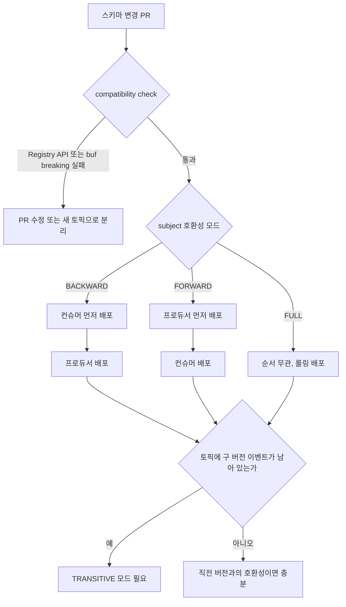
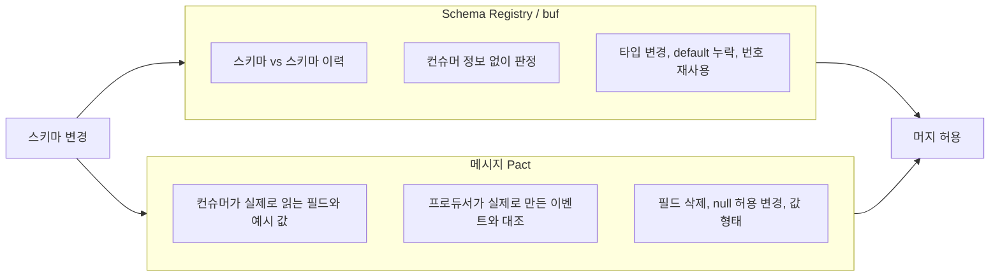
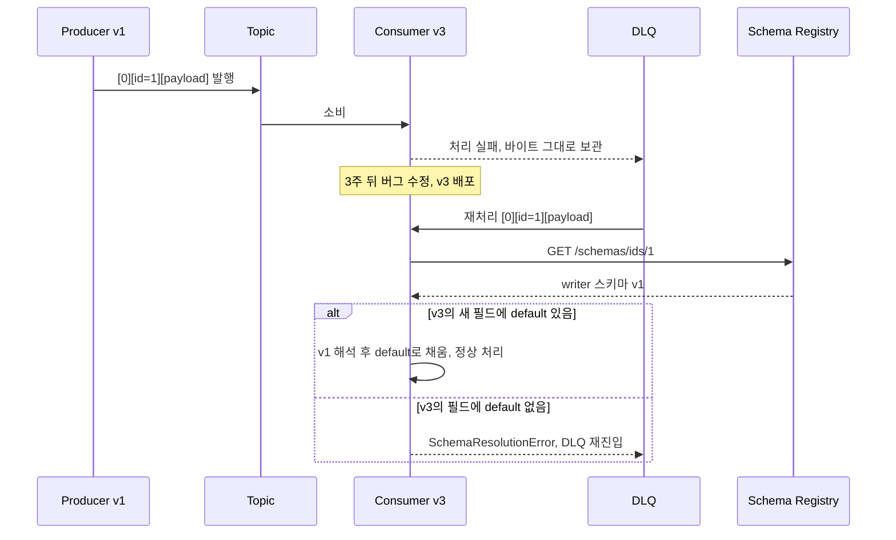

# Kafka 이벤트 스키마 호환성 검증

HTTP API는 provider가 바뀌면 호출하는 쪽이 바로 에러를 받는다. Kafka 이벤트는 다르다. 프로듀서가 필드를 하나 바꿔도 프로듀서 쪽에서는 아무 일도 안 일어나고, 컨슈머는 며칠 뒤 그 메시지를 읽을 때 터지거나, 더 나쁘면 터지지도 않고 틀린 값을 쓴다. 브로커 중간에 메시지가 retention 기간만큼 쌓여 있어서 깨지는 시점과 원인이 만들어진 시점이 떨어져 있다.

Schema Registry의 호환성 모드는 이 문제의 첫 번째 방어선이다. 다만 모드 이름(BACKWARD, FORWARD, FULL)만 알고 켜 두면 두 군데서 사고가 난다. 하나는 Registry가 막아 주는 범위를 실제보다 넓게 믿는 경우고, 다른 하나는 모드가 정하는 배포 순서를 지키지 않는 경우다. 이 문서는 Avro, JSON Schema, Protobuf 각각에 변경을 하나씩 넣어서 어떤 검사기가 무엇을 통과시키는지 직접 돌려 본 결과를 기준으로 쓴다.

측정 환경은 Avro 1.11.3의 `SchemaCompatibility`, Confluent `kafka-json-schema-provider` 7.6.0의 `isBackwardCompatible`, buf 1.47.2다. Registry 서버 버전이 다르면 세부 판정이 다를 수 있으니, 중요한 변경은 쓰는 Registry에 직접 검사를 돌려 봐야 한다.

호환성 모드별 직렬화 규칙과 포맷 자체의 차이는 [직렬화 포맷 심화](../../DataBase/DataRepresentation/Serialization_Formats_Deep_Dive.md)에서 다뤘다. 여기서는 그 규칙이 CI와 배포 순서, 재소비 상황에서 어떻게 작동하는지에 집중한다.

## 스키마 변경 PR이 배포까지 가는 길

스키마 파일이 바뀌는 PR에서 먼저 호환성 검사가 돌고, 통과하면 subject에 걸린 모드에 따라 프로듀서와 컨슈머의 배포 순서가 정해진다. 검사 실패와 배포 순서 결정이 서로 다른 단계라는 점을 보면 된다.



마지막 분기가 실무에서 가장 자주 빠진다. 모드가 정하는 순서는 롤링 배포 중 같이 떠 있는 두 버전 사이의 문제이고, 토픽에 남은 과거 이벤트를 다시 읽는 문제는 TRANSITIVE 여부가 정한다. 뒤에서 따로 다룬다.

## 모드별 허용 변경과 배포 순서

BACKWARD는 "새 스키마로 옛 데이터를 읽을 수 있다"이고 FORWARD는 "옛 스키마로 새 데이터를 읽을 수 있다"다. 이름만 보면 외우기 어려운데, 누가 reader이고 누가 writer인지로 풀면 순서가 저절로 나온다.

| 모드 | reader / writer | Avro에서 허용되는 변경 | 막히는 변경 | 배포 순서 |
|---|---|---|---|---|
| BACKWARD | 새 스키마가 reader, 직전 버전이 writer | default 있는 필드 추가, 필드 삭제, int→long, enum 심볼 추가 | default 없는 필드 추가, long→int | 컨슈머 먼저 |
| FORWARD | 직전 스키마가 reader, 새 스키마가 writer | 필드 추가(default 없어도), default 있는 필드 삭제, long→int | default 없는 필드 삭제, int→long, enum 심볼 추가 | 프로듀서 먼저 |
| FULL | 양쪽 모두 성립 | default 있는 필드 추가/삭제, 양쪽에 enum default가 있을 때 심볼 추가 | 타입 변경 거의 전부 | 순서 무관 |
| *_TRANSITIVE | 직전이 아니라 등록된 모든 버전과 비교 | 위와 같음 | 위와 같음, 이력 전체에 대해 | 위와 같음 |

BACKWARD에서 컨슈머를 먼저 올리는 이유는 롤링 배포 중의 상태를 그려 보면 나온다. 새 컨슈머는 새 데이터와 옛 데이터를 모두 읽어야 하는데 BACKWARD가 바로 그걸 보장한다. 반대로 옛 컨슈머는 새 데이터를 읽을 보장이 없다. 프로듀서를 먼저 올리면 아직 안 올라간 컨슈머가 새 데이터를 만난다. FORWARD는 정확히 반대여서 프로듀서가 먼저다.

FORWARD로 운영하는 팀에서 자주 나오는 오해가 있다. FORWARD는 "옛 컨슈머가 새 데이터를 읽는다"만 보장하고 "새 컨슈머가 옛 데이터를 읽는다"는 보장하지 않는다. 컨슈머를 업그레이드한 뒤 오프셋을 되감으면 BACKWARD가 아닌 모드에서는 읽기가 실패할 수 있다. 되감기를 하는 서비스, 즉 거의 모든 Kafka 컨슈머는 FORWARD 단독으로 쓰면 안 된다. 기본값이 BACKWARD인 이유가 이것이다.

## Avro에서 직접 돌려 본 판정

한 필드씩만 바꿔서 직전 버전과 비교한 결과다. 판정은 Avro 라이브러리의 reader/writer 해석 규칙을 그대로 쓴 값이고, Registry의 Avro 검사도 같은 규칙에 기대고 있다.

| 변경 | BACKWARD | FORWARD | FULL |
|---|---|---|---|
| default 없는 필드 추가 | 실패 | 통과 | 실패 |
| default 있는 필드 추가 | 통과 | 통과 | 통과 |
| default 없는 필드 삭제 | 통과 | 실패 | 실패 |
| default 있는 필드 삭제 | 통과 | 통과 | 통과 |
| enum 심볼 추가 | 통과 | 실패 | 실패 |
| enum 심볼 추가, 양쪽 모두 enum default 지정 | 통과 | 통과 | 통과 |
| int → long | 통과 | 실패 | 실패 |
| long → int | 실패 | 통과 | 실패 |
| 필드 이름 변경 (aliases 없음) | 실패 | 실패 | 실패 |
| 필드 이름 변경 (aliases 지정) | 통과 | 실패 | 실패 |
| string → [null, string] | 통과 | 실패 | 실패 |
| [null, string] → string | 실패 | 통과 | 실패 |

표에서 걸리는 건 enum이다. enum 심볼을 추가할 때 새 스키마에만 default를 달면 FORWARD는 여전히 실패한다. 옛 reader 스키마에 default가 없으면 모르는 심볼 `C`를 만났을 때 해석할 방법이 없다. 실제로 옛 컨슈머가 새 enum 값을 받으면 `SchemaResolutionError: C not found in reader symbol list`로 죽는다. enum은 처음 정의할 때부터 `UNKNOWN` 같은 심볼을 default로 박아 두지 않으면 나중에 FORWARD, FULL 모드에서 값을 추가할 수 없게 된다.

필드 삭제가 BACKWARD에서 default 없이도 통과하는 점도 눈여겨볼 만하다. 새 reader 입장에서는 writer가 보낸 필드를 그냥 버리면 되기 때문이다. 이 통과가 아래 "Registry가 못 막는 변경" 절에서 문제가 된다.

## JSON Schema는 기본값이 열린 모델이라 결과가 뒤집힌다

JSON Schema의 호환성 검사는 Avro와 방향 감각이 다르다. `additionalProperties`를 지정하지 않은 스키마는 모르는 프로퍼티를 전부 허용하는 open content model이고, Confluent의 검사기는 이 모델을 구분해서 판정한다. 같은 "optional 프로퍼티 추가"가 Avro에서는 BACKWARD 통과, JSON Schema에서는 BACKWARD 실패로 나온다.

| 변경 | BACKWARD | FORWARD |
|---|---|---|
| open 모델에서 optional 프로퍼티 추가 | 실패 (`PROPERTY_ADDED_TO_OPEN_CONTENT_MODEL`) | 통과 |
| closed 모델(`additionalProperties: false`)에서 optional 프로퍼티 추가 | 통과 | 실패 |
| open 모델에서 프로퍼티 삭제 | 통과 | 실패 |
| closed 모델에서 프로퍼티 삭제 | 실패 (`PROPERTY_REMOVED_FROM_CLOSED_CONTENT_MODEL`) | 통과 |
| integer → number | 통과 | 실패 |
| number → integer | 실패 (`TYPE_NARROWED`) | 통과 |
| 기존 프로퍼티에 `minimum: 0` 추가 | 실패 (`MINIMUM_ADDED`) | 통과 |

이유를 따라가면 이렇다. open 모델의 옛 스키마는 `channel`이라는 이름의 프로퍼티가 어떤 타입으로 와도 허용한다. 새 스키마가 `channel: string`을 명시하면 옛 데이터 중 `channel`에 숫자가 들어 있던 것은 새 스키마로 못 읽는다. 검사기는 그 가능성이 있다는 이유로 실패시킨다. 현실에서는 그런 데이터가 없을 가능성이 높지만, 검사기는 데이터를 보지 않고 스키마만 본다.

그래서 JSON Schema를 쓰는 토픽에서 BACKWARD 모드를 켜면 optional 필드 하나 추가하는 PR이 막힌다. 처음 이 상황을 만나면 Registry가 오작동한다고 생각하기 쉽다. 선택지는 둘이다. 하나는 스키마를 `additionalProperties: false`로 닫고 필드 추가를 BACKWARD로 통과시키는 것이다. 이 경우 옛 컨슈머가 새 필드가 든 이벤트를 검증하면 실패하므로 컨슈머를 먼저 올려야 한다. 다른 하나는 모드를 FORWARD로 두고 프로듀서를 먼저 올리는 것인데, 앞에서 본 것처럼 되감기 안전성을 잃는다. 되감기가 있는 토픽이라면 닫는 쪽이 낫다.

## Protobuf는 Registry 앞에서 buf breaking이 먼저다

Protobuf는 필드 번호와 wire type이 호환성을 정하고, 이름은 바이트에 들어가지 않는다. 그래서 "무엇이 깨지는가"의 답이 사용하는 계층에 따라 달라진다. buf는 이 계층을 `FILE`, `WIRE_JSON`, `WIRE` 세 카테고리로 나눠서 검사한다. 같은 변경을 세 카테고리에 각각 돌린 결과다.

| 변경 | WIRE | WIRE_JSON | FILE |
|---|---|---|---|
| 새 번호로 필드 추가 | 통과 | 통과 | 통과 |
| 필드 이름 변경 (`product_code` → `sku`) | 통과 | 실패 (json_name 변경) | 실패 |
| `int32` → `int64` | 통과 | 실패 | 실패 |
| `int32` → `string` | 실패 | 실패 | 실패 |
| 필드 삭제, reserved 없음 | 실패 (번호 reserve 안 됨) | 실패 (번호·이름 모두) | 실패 |
| 필드 삭제, `reserved 2;` + `reserved "product_code";` | 통과 | 통과 | 실패 |
| 삭제한 번호 2를 `int32`로 재사용 | 실패 | 실패 | 실패 |

이 표에서 읽을 것이 세 가지 있다. 첫째, `int32` → `int64`는 WIRE에서 통과한다. 바이트로는 같은 varint라서다. 그런데 같은 서비스가 이 이벤트를 JSON으로도 내보내거나 로그로 찍는다면 WIRE_JSON에서 걸린다. 카테고리는 이벤트가 어떤 경로로 소비되는지를 보고 골라야 하고, Kafka에 바이너리로만 흐른다고 확신하지 못하면 WIRE_JSON이 안전하다. 둘째, `FILE`은 reserved를 제대로 달아도 필드 삭제를 실패로 본다. 생성된 코드를 소스 레벨에서 깨기 때문이다. 이벤트 스키마를 여러 저장소가 코드 생성해서 쓰는 구조가 아니라면 FILE은 과하다. 셋째, 필드 삭제는 reserved를 달아야 통과한다. 이건 앞의 직렬화 문서에서 번호 재사용 사고로 다룬 내용을 CI가 기계적으로 강제하는 것이다.

buf는 `.proto` 파일만 비교하므로 Registry에 연결할 필요가 없다. PR 단계에서 base 브랜치와 비교한다.

```yaml
# buf.yaml
version: v1
breaking:
  use:
    - WIRE_JSON
```

```bash
buf breaking --against '.git#branch=main'
```

Registry에 Protobuf 스키마를 등록할 때도 Registry 자체의 호환성 검사가 돈다. 다만 `buf breaking`은 Registry가 필요 없고 `reserved` 누락 같은 소스 레벨 실수를 먼저 잡기 때문에, Protobuf를 쓰는 저장소에서는 이쪽을 PR 게이트로 두고 Registry 검사는 배포 직전에 한 번 더 두는 구성으로 쓴다.

## Registry가 못 막는 변경

여기까지의 모든 검사는 스키마의 구조만 비교한다. 구조가 같고 의미가 다른 변경은 어느 모드에서도 통과한다. 직접 확인한 것은 이렇다.

| 변경 | Avro BACKWARD/FORWARD/FULL | JSON Schema BACKWARD/FORWARD |
|---|---|---|
| `amount` 단위를 cents에서 원으로 변경 (타입은 long 그대로) | 전부 통과 | 해당 없음 |
| `amount`의 description만 `cents` → `won`으로 변경 | 해당 없음 | 둘 다 통과 |

실제로 이런 일이 생기는 경우를 몇 가지 본 적이 있다. 금액 필드의 단위를 바꾸거나, UTC로 보내던 타임스탬프를 로컬 시간대로 바꾸거나, `status`의 `CANCELED` 의미를 "사용자 취소"에서 "시스템 포함 모든 취소"로 넓히는 변경이다. 스키마 diff에는 `doc` 문자열 하나만 바뀌어 있고, 컨슈머는 기존 값을 그대로 읽어서 틀린 계산을 한다. cents로 만든 이벤트 `{"id": 8, "amount": 1500}`은 단위가 바뀐 컨슈머에게 그대로 `1500`으로 읽힌다. 에러가 없으니 모니터링에도 안 걸린다.

의미가 바뀌는 변경은 필드 이름을 새로 만들어서 가야 한다. `amount`를 건드리지 않고 `amount_won`을 추가하고, 두 필드를 병행 발행하다가 컨슈머가 다 넘어온 뒤 `amount`를 지운다.

default가 있는 필드 삭제도 같은 계열이다. Avro에서 default 있는 필드를 지우는 변경은 BACKWARD, FORWARD, FULL 전부 통과한다. 그런데 `memo`를 쓰는 옛 컨슈머가 `memo`가 없는 새 이벤트를 받으면 default인 빈 문자열이 채워진다. 직접 돌려 보면 `{'id': 5, 'memo': ''}`이 나온다. 에러가 아니라 빈 값이 정상 경로로 흘러가는 것이다. 스키마만 보는 검사기는 이게 호환성 위반인지 판단할 수 없다.

### 메시지 Pact와 Registry 검사의 역할 분담

두 도구는 같은 문제를 다른 방향에서 본다.



Registry는 컨슈머가 누구인지, 어떤 필드를 쓰는지 모른다. 그래서 스키마 이력만으로 판정할 수 있는 구조적 위반은 전부 잡지만, 위의 `memo` 삭제는 못 잡는다. 메시지 Pact는 컨슈머 핸들러가 실제로 읽는 필드를 계약에 올리기 때문에 `memo`를 읽는 컨슈머가 있으면 프로듀서 검증에서 바로 실패한다. 반대로 Pact는 컨슈머 한 팀이 계약을 올리지 않은 필드는 보호하지 않고, 토픽을 구독하는 모든 팀이 Pact를 쓴다는 보장도 없다. Registry는 모든 컨슈머를 대신해서 최소한의 구조를 지키는 쪽이다.

Registry는 아무 팀도 계약을 올리지 않았어도 동작하는 바닥이고, Pact는 그 위에서 실제 사용처를 보호하는 층이다. 메시지 Pact가 Kafka 브로커 없이 JSON 페이로드 모양만 검증하는 한계는 [NestJS 계약 테스트 Pact 실습](../../Framework/Node/Testing/Pact_Node_Contract_Testing.md)에, 계약 테스트 전반의 방식 선택은 [Service Contract Testing](../../Architecture/MSA/Service_Contract_Testing.md)에 있다. 단위 변경은 둘 다 못 잡으므로 `doc`이나 description만 바뀌는 PR은 리뷰어가 따로 봐야 한다. `doc`이 바뀐 diff가 나오면 PR 템플릿이 의미 변경 여부를 묻게 해 두면 그나마 걸러진다.

## CI에서 Registry 검사 붙이기

Registry는 스키마를 등록하지 않고 호환성만 물어보는 API를 제공한다. PR 단계에서는 이 API만 쓰고 등록은 하지 않는다.

```bash
#!/usr/bin/env bash
set -euo pipefail

SUBJECT="order-placed-value"
SCHEMA_FILE="schemas/order-placed.avsc"
REGISTRY="${SCHEMA_REGISTRY_URL:?}"

BODY=$(jq -Rs '{schema: .}' < "$SCHEMA_FILE")

HTTP=$(curl -s -o /tmp/compat.json -w '%{http_code}' -X POST \
  -H "Content-Type: application/vnd.schemaregistry.v1+json" \
  -d "$BODY" \
  "$REGISTRY/compatibility/subjects/$SUBJECT/versions/latest?verbose=true")

# subject 가 아직 없으면 404 (버전에 따라 error_code 40401)
if [ "$HTTP" = "404" ]; then
  echo "subject 없음: 첫 등록이라 비교 대상이 없다"
  exit 0
fi

jq -e '.is_compatible' /tmp/compat.json > /dev/null || {
  jq -r '.messages[]?' /tmp/compat.json
  exit 1
}
```

JSON Schema나 Protobuf는 body에 `"schemaType": "JSON"`, `"schemaType": "PROTOBUF"`를 같이 보내야 한다. 빠뜨리면 Avro 스키마로 파싱하려다 실패한다. `verbose=true`를 붙여야 실패 이유가 `messages`로 오는데, 앞에서 본 `PROPERTY_ADDED_TO_OPEN_CONTENT_MODEL` 같은 코드가 여기서 보인다. 이 옵션이 없으면 `is_compatible: false`만 오고 왜 막혔는지 알 수 없어서 개발자가 Registry 관리자에게 물으러 가게 된다.

주의할 점이 두 가지 있다. 호환성 검사 결과는 Registry에 걸린 subject 단위 설정을 따른다. 설정이 없으면 전역 기본값(BACKWARD)이 쓰이는데, 누군가 개발 편의로 전역을 NONE으로 내려놓은 환경에서는 검사가 항상 통과한다. CI 스크립트 첫 단계에서 `GET /config/$SUBJECT?defaultToGlobal=true`로 모드를 읽어 `NONE`이면 실패시키도록 해 두면 이 구멍이 막힌다.

또 하나는 프로듀서 클라이언트의 `auto.register.schemas`다. 기본값이 true라서 PR 검사를 건너뛰고 배포된 프로듀서가 기동하면서 스키마를 직접 등록한다. 등록 시점에도 호환성 검사는 돌지만, 그 시점은 이미 프로듀서가 배포되는 중이다. 운영 환경에서는 `auto.register.schemas=false`로 두고 스키마 등록을 CI의 배포 단계에서만 하게 해야 PR 검사가 우회되지 않는다. 이 값을 끄면 Registry에 없는 스키마로 직렬화하려는 프로듀서가 기동 시점이 아니라 첫 전송 시점에 실패하므로, 스테이징에서 먼저 기동 테스트를 하는 것이 좋다.

## 오래된 오프셋을 다시 읽을 때

Kafka 이벤트 호환성에서 가장 놓치기 쉬운 부분이다. 롤링 배포 중에 같이 떠 있는 두 버전 문제는 한 번 지나가면 끝나지만, 토픽에는 과거 스키마로 쓰인 이벤트가 retention 동안 남는다. 그리고 컨슈머는 그걸 다시 읽는다. 오프셋 리셋, 신규 컨슈머 그룹 추가, DLQ 재처리, 버그 수정 후 재소비가 전부 해당한다.

Confluent wire format의 메시지는 앞 5바이트에 매직 바이트 0과 4바이트 스키마 ID를 달고 있다. 컨슈머는 이 ID로 Registry에서 writer 스키마를 가져와서 자신의 reader 스키마와 맞춘다. 그래서 오래된 메시지도 읽을 수는 있지만, 두 스키마가 해석 규칙을 만족할 때만 그렇다.



그림에서 보듯 실패 지점은 컨슈머가 Registry에서 writer 스키마를 받은 뒤 두 스키마를 맞추는 한 곳이다. 이 단계가 통과하는지는 컨슈머를 배포하던 시점에 정해진 게 아니라 3주 전 프로듀서가 쓴 스키마와 오늘 컨슈머의 스키마 관계가 정한다.

### TRANSITIVE가 필요한 구체적인 경우

BACKWARD(비 TRANSITIVE)는 직전 버전과만 비교하기 때문에, 중간 버전을 거치면 두 단계 전 버전과는 호환되지 않는 스키마가 통과된다. 실제로 돌려 본 예는 이렇다.

- v1: `id`
- v2: `id`, `channel`(string, default `"WEB"`)
- v3: `id`, `channel`(string, default 없음)

v2 vs v1은 BACKWARD 통과, v3 vs v2도 BACKWARD 통과다. 그런데 v3 vs v1은 BACKWARD 실패다. v3 reader가 v1 이벤트를 만나면 `channel`을 채울 방법이 없어 `SchemaResolutionError: No default value for field channel in Order`가 난다. 처음 default를 달아 추가한 필드에서 나중에 default를 지우는 일은 "필수 필드로 확정"이라는 이유로 실제로 일어난다. 직전 버전 v2에서는 이미 모든 이벤트에 `channel`이 들어 있으니 괜찮아 보이지만, 토픽에는 v1 이벤트가 남아 있다. 이 변경은 BACKWARD_TRANSITIVE에서만 막힌다.

`*_TRANSITIVE`는 모든 변경에 거는 것이 아니라 retention 안에 오래된 버전 이벤트가 남아 있는 토픽에 건다. retention이 7일인 토픽이고 스키마가 한 달에 한 번 바뀐다면 직전 버전 비교로 충분하다. 반대로 compacted 토픽이거나 retention이 무제한이거나, 이벤트 소싱처럼 처음부터 다시 읽는 컨슈머가 있는 토픽은 TRANSITIVE가 사실상 필수다. 개발 환경에서 새 컨슈머 그룹을 띄워서 `earliest`부터 읽다가 터지는 것으로 처음 발견하는 경우가 많다.

### DLQ 재처리에서 같이 일어나는 일

DLQ 재처리가 이 상황을 가장 자주 만든다. 컨슈머가 이벤트를 처리하지 못해 DLQ로 보냈다가 버그 수정 후 다시 흘려보내는 동안 스키마가 한두 번 바뀌어 있을 수 있다. 재처리 시점의 컨슈머 버전과 DLQ 메시지의 writer 버전을 맞춰 보는 절차는 [DLQ 재처리 자동화](DLQ_Reprocessing_Strategy.md)의 "재처리 전 컨슈머 버전 확인"에서 다뤘다. 스키마 관점에서는 별도로 조심할 것이 하나 더 있다.

DLQ로 보낼 때 컨슈머가 역직렬화한 객체를 다시 직렬화해서 보내면 안 된다. v1 reader를 가진 컨슈머가 v2 이벤트(`channel: "APP"`)를 읽으면 `channel`은 reader 스키마에 없으므로 버려져 `{'id': 1, 'amount': 100}`만 남는다. 이걸 다시 직렬화해서 DLQ에 넣고 나중에 v2 reader로 읽으면 `channel`이 `"APP"`이 아니라 default `"WEB"`으로 채워진다. 실제로 돌려 보면 이렇게 나온다. 오류는 없고 값만 조용히 바뀐다. DLQ에는 원본 바이트와 헤더를 그대로 넣어야 한다. 직접 만든 DLQ 발행 코드에서 처리하던 객체를 다시 직렬화하는 실수가 나온다.

Registry에서 스키마를 지우는 것도 재소비를 깨뜨린다. 오래된 버전을 정리한다고 hard delete하면 그 ID가 박힌 이벤트는 writer 스키마를 찾지 못해 역직렬화 자체가 실패한다. 토픽에 해당 버전 이벤트가 남아 있는 동안은 스키마를 지우지 않는다.

재처리 과정에서 메시지가 중복 전달되거나 순서가 뒤집히는 문제는 스키마와 별개로 존재한다. 전달 보장의 기본 개념은 [Message Queue 심화](MQ_Delivery_Guarantee_Deep_Dive.md)에 있고, 이 문서의 호환성 검사는 그 위에서 "읽을 수 있는가"만 다룬다.

## 토픽 종류별로 정해 둘 것

작은 팀에서 시작한다면 Avro는 BACKWARD_TRANSITIVE를 기본으로 두고 enum에는 처음부터 default 심볼을 넣는다. JSON Schema는 `additionalProperties`를 어떻게 할지 먼저 정하고 모드를 그에 맞춘다. Protobuf는 `buf breaking`을 WIRE_JSON으로 PR에 붙이고 삭제 시 reserved를 강제한다. 구조 검사가 통과한 변경 중 의미가 바뀌는 것은 필드를 새로 만들어 병행 발행으로 옮긴다. 이 정도만 해도 호환성 사고의 대부분은 PR 단계에서 막히고, 남는 것은 의미 변경과 재소비 시점의 문제로 좁혀진다.
