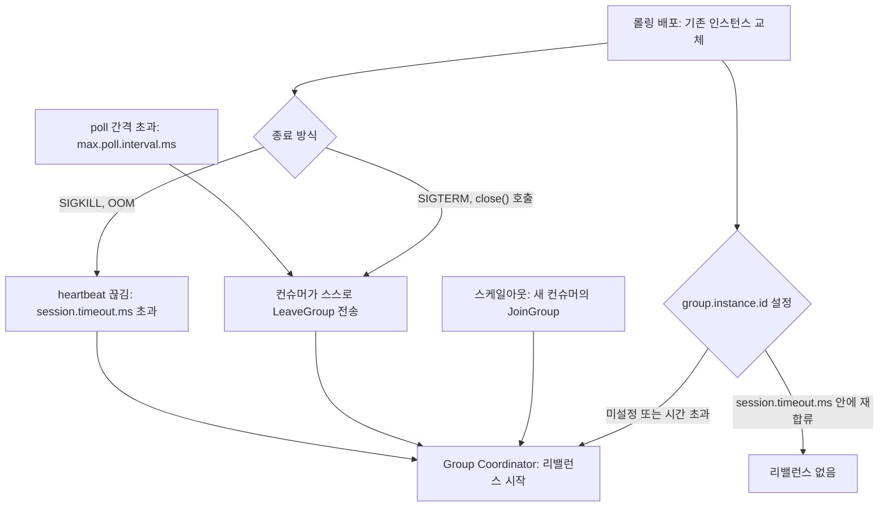
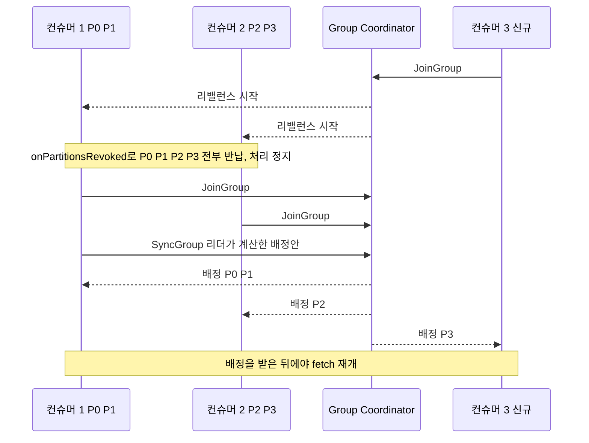
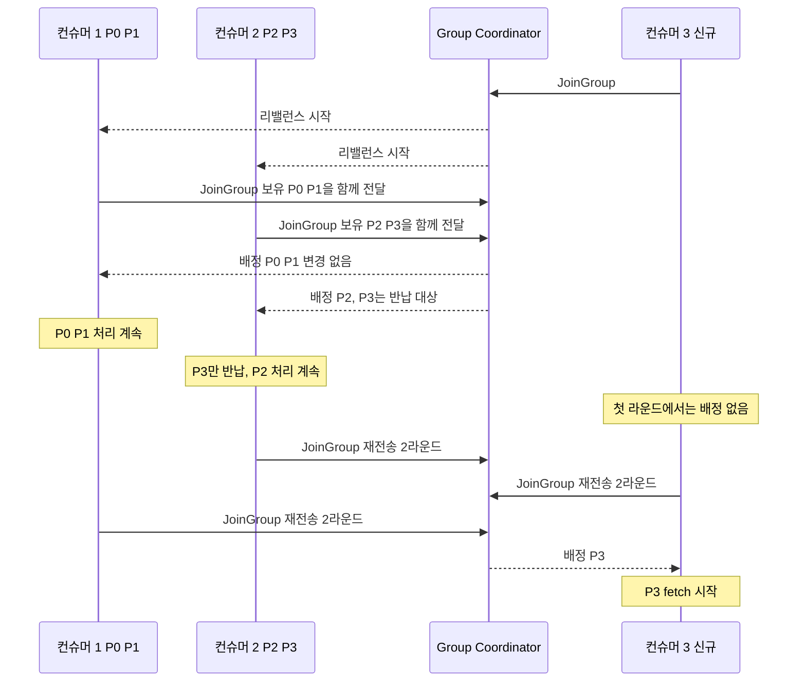
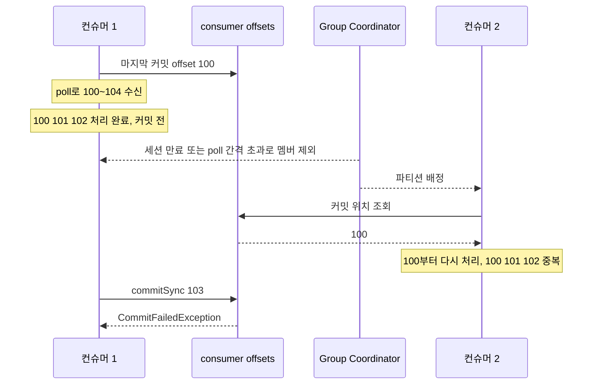
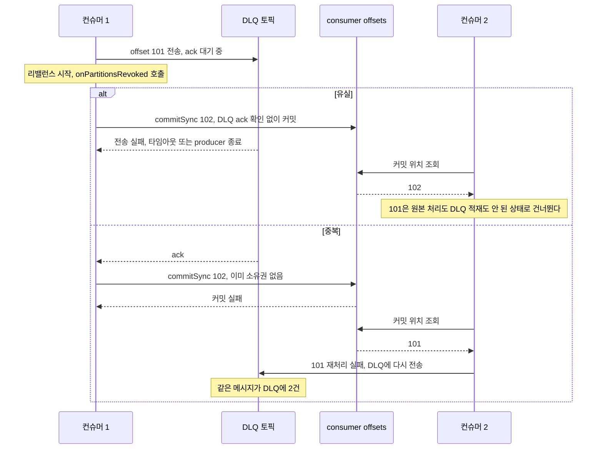
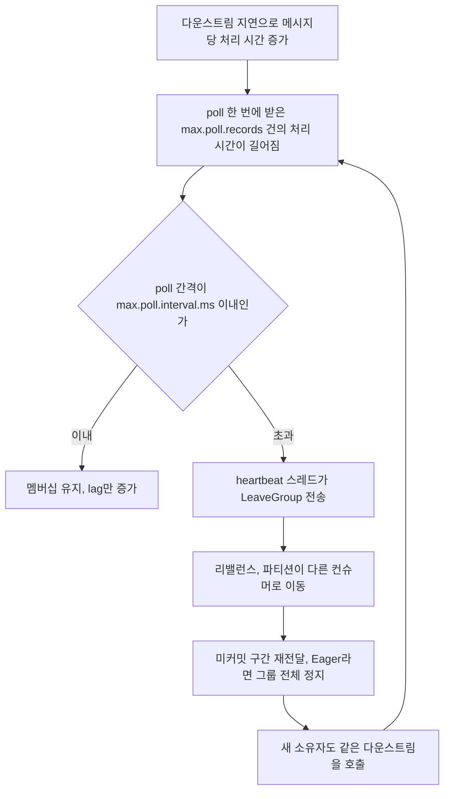

# Kafka Consumer Group Rebalancing

컨슈머 그룹 리밸런싱은 파티션 소유권을 재배분하는 과정이다. 리밸런싱 자체는 정상 동작이지만, 잦은 리밸런싱은 처리를 멈추게 해서 컨슈머 지연을 만든다.

리밸런스는 배압과 DLQ 문제에서 두 군데에 끼어든다. 배압으로 poll 간격이 늘어난 컨슈머가 그룹에서 쫓겨나는 입구가 되고, 쫓겨난 뒤에는 미커밋 구간의 재전달과 DLQ 전송 중이던 메시지의 유실·중복이라는 출구가 된다. 배압 쪽 원인은 [컨슈머 배압과 전달 보장 붕괴](Consumer_Backpressure.md), DLQ에 쌓인 메시지를 되돌리는 쪽은 [DLQ 재처리 자동화](DLQ_Reprocessing_Strategy.md)에서 다룬다. 이 문서는 그 사이에 있는 리밸런스의 동작을 다룬다.

## 리밸런스 트리거

리밸런스는 크게 세 가지 상황에서 발생한다.

**컨슈머 수 변경**

새 컨슈머가 그룹에 합류하거나, 컨슈머가 `consumer.close()`로 정상 종료하거나, 크래시·네트워크 단절로 heartbeat가 끊길 때 트리거된다. 크래시와 네트워크 단절은 Group Coordinator 입장에서 구분되지 않는다. 둘 다 `session.timeout.ms` 초과로 처리된다.

**파티션 수 변경**

토픽에 파티션을 추가하면 기존 파티션의 offset은 유지한 채 새 파티션을 재배분한다.

**세션/poll 타임아웃 초과**

`session.timeout.ms` 안에 heartbeat가 도착하지 않으면 Group Coordinator가 해당 컨슈머를 죽은 것으로 판단한다. `max.poll.interval.ms`를 초과해서 `poll()`을 호출하지 않으면 그룹에서 제외된다. 두 타이머가 독립적으로 동작하므로 heartbeat 스레드가 살아있어도 poll 간격이 길면 리밸런스가 발생한다.

트리거는 네 갈래로 들어오지만 Coordinator에서는 한곳으로 모인다. 도식에서 배포가 갈라지는 지점을 보면 된다. SIGTERM으로 `close()`가 불리면 LeaveGroup이 즉시 나가고, SIGKILL이나 OOM으로 죽으면 `session.timeout.ms`가 지난 뒤에야 감지된다. 같은 배포인데 리밸런스 시작 시점이 수십 초 차이 나는 이유가 여기 있다.



## Eager Rebalance vs Incremental Cooperative Rebalance

Kafka 2.4 이전까지 기본 방식은 Eager Rebalance다. 리밸런스가 시작되면 모든 컨슈머가 파티션 소유권을 즉시 반납하고, 새 배정을 받을 때까지 아무 메시지도 처리하지 않는다.

```
[Eager Rebalance 진행 순서]

1. Group Coordinator → 모든 컨슈머: 리밸런스 시작 공지
2. 모든 컨슈머: 보유 파티션 전부 revoke (처리 중단)
3. 모든 컨슈머 → Coordinator: JoinGroup 요청
4. 그룹 리더: 파티션 재배분 계산
5. 리더 → Coordinator: SyncGroup로 배정 결과 전파
6. 모든 컨슈머: 새 파티션으로 fetch 재개
```

3 → 6단계 사이에 전체 처리가 멈춘다. 컨슈머 10개인 그룹에서 컨슈머 1개만 추가해도 나머지 9개가 모두 멈춘다.

아래 도식은 파티션 4개(P0~P3)를 컨슈머 2개가 나눠 갖는 그룹에 컨슈머 3이 합류하는 경우다. 결과적으로 컨슈머 1은 P0·P1을 그대로 받고 컨슈머 2는 P3만 잃는다. 그런데 Note 구간에서 P0·P1·P2까지 전부 반납했다가 돌려받는다.



**Incremental Cooperative Rebalance**는 Kafka 2.4에서 도입됐다(KIP-429). 두 라운드로 진행된다.

```
[Incremental Cooperative Rebalance 진행 순서]

라운드 1:
1. 모든 컨슈머: 현재 파티션 배정 유지한 채로 JoinGroup 전송
2. 리더: 어떤 파티션을 이동할지 계산
3. revoke 대상 컨슈머만 해당 파티션 반납 (나머지는 계속 처리)

라운드 2:
4. revoke 완료된 컨슈머 → Coordinator: JoinGroup 재전송
5. 리더: 반납된 파티션을 새 컨슈머에게 배정
6. 이동 대상이 아닌 파티션은 처음부터 계속 처리 중
```

처리 중단은 파티션을 이동하는 컨슈머에서만 발생한다. 트래픽이 많은 환경에서 리밸런스가 자주 발생하면 Cooperative 방식이 눈에 띄게 차이가 난다.

같은 상황을 Cooperative로 돌리면 컨슈머 1의 Note에는 "처리 계속"만 남는다. 첫 라운드에서 P3만 반납되고, 두 번째 라운드에서 P3가 컨슈머 3으로 넘어간다.



두 방식의 차이는 처리 정지 범위다. 정지가 없어지는 것은 아니다. 이동하는 P3는 컨슈머 2가 반납한 시점부터 컨슈머 3이 fetch를 시작할 때까지 아무도 읽지 않는다.

| 항목 | Eager | Incremental Cooperative |
|---|---|---|
| 리밸런스 라운드 | 1회 | 2회 이상 |
| 멈추는 파티션 | 그룹 전체 | 이동 대상만 |
| `onPartitionsRevoked` 인자 | 보유한 전체 파티션 | 반납하는 파티션만 |
| `onPartitionsAssigned` 인자 | 배정받은 전체 파티션 | 새로 받은 파티션만 |
| 이동이 없는 컨슈머의 `onPartitionsRevoked` | 호출됨 | 호출되지 않음 |

**Java 클라이언트 설정:**

```java
props.put(
    ConsumerConfig.PARTITION_ASSIGNMENT_STRATEGY_CONFIG,
    CooperativeStickyAssignor.class.getName()
);
```

**kafkajs (Node.js):**

```typescript
import { Kafka, PartitionAssigners } from 'kafkajs'

const consumer = kafka.consumer({
  groupId: 'order-consumer-group',
  partitionAssigners: [PartitionAssigners.cooperativeSticky]
})
```

Eager에서 Cooperative로 전환할 때 주의점이 있다. 클러스터 내 모든 컨슈머 인스턴스가 동일한 assignor를 써야 한다. 롤링 배포 중 일부는 Eager, 일부는 Cooperative를 쓰면 호환 문제가 생긴다. Kafka는 이를 위한 마이그레이션 경로를 제공한다.

```java
// 마이그레이션 단계: Cooperative를 1순위, Range를 폴백으로
props.put(
    ConsumerConfig.PARTITION_ASSIGNMENT_STRATEGY_CONFIG,
    List.of(
        CooperativeStickyAssignor.class.getName(),
        RangeAssignor.class.getName()
    )
);
// 배포가 완료되고 모든 인스턴스가 Cooperative를 쓰게 되면 RangeAssignor를 제거
```

## Static Group Membership

기본적으로 컨슈머는 재시작할 때마다 새 member ID를 받는다. Group Coordinator는 이전 멤버가 떠나고 새 멤버가 들어온 것으로 인식해서 리밸런스를 두 번 트리거한다 — 종료 시 한 번, 재합류 시 한 번.

`group.instance.id`를 설정하면 이 동작이 달라진다.

```java
props.put(ConsumerConfig.GROUP_INSTANCE_ID_CONFIG, "order-consumer-instance-0");
props.put(ConsumerConfig.SESSION_TIMEOUT_MS_CONFIG, "60000");
```

같은 `group.instance.id`로 돌아온 컨슈머는 `session.timeout.ms` 안에 재합류하면 파티션 배정을 그대로 유지한다. 리밸런스 없이 이전 파티션으로 바로 fetch를 재개한다.

롤링 재시작으로 인스턴스가 10~30초 내에 재기동되는 환경에서 효과가 크다. `session.timeout.ms`를 60초로 설정하면 재시작 주기 안에 복귀가 완료되므로 배포 동안 리밸런스가 발생하지 않는다.

kafkajs는 `group.instance.id`를 공식 지원하지 않는다. Static Membership이 필요하다면 Java 클라이언트나 librdkafka 기반 클라이언트(node-rdkafka)를 검토해야 한다.

인스턴스 ID 관리 시 주의할 점: 같은 `group.instance.id`를 가진 인스턴스가 동시에 두 개 실행되면 Group Coordinator가 혼란을 겪는다. 쿠버네티스에서 StatefulSet 파드 이름을 그대로 쓰면 안전하지만, Deployment에서 파드가 교체될 때 이름이 바뀌는 경우가 있으므로 확인이 필요하다.

## 리밸런스 중 처리 중단 최소화

### max.poll.interval.ms 튜닝

`max.poll.interval.ms`는 `poll()` 호출 간격의 최대 허용 시간이다. 이 시간 안에 poll을 호출하지 않으면 Group Coordinator는 해당 컨슈머를 죽은 것으로 보고 리밸런스를 트리거한다.

기본값은 5분(300,000ms)이다. 처리 로직이 느릴 때 이 값을 무조건 늘리면 안 된다. 설정값을 올리면 실제로 죽은 컨슈머를 그룹에서 제거하는 시간도 같이 늘어나서 해당 파티션 처리 공백이 커진다.

처리 로직을 비동기로 분리하고 poll loop를 빠르게 유지하는 방향이 맞다.

```typescript
// 잘못된 패턴 — poll 루프 안에서 오래 걸리는 작업
await consumer.run({
  eachMessage: async ({ message }) => {
    await slowExternalApiCall(message) // 30초 걸리면 다음 poll이 30초 뒤
    await processMessage(message)
  }
})

// 긴 배치 처리 중에도 heartbeat를 명시적으로 유지하는 패턴
await consumer.run({
  eachBatch: async ({ batch, resolveOffset, heartbeat, commitOffsetsIfNecessary }) => {
    for (const message of batch.messages) {
      await processMessage(message)
      resolveOffset(message.offset)
      await heartbeat() // 각 메시지 처리 후 heartbeat
    }
    await commitOffsetsIfNecessary()
  }
})
```

`eachBatch`에서 `heartbeat()`를 명시적으로 호출하는 게 중요하다. `eachMessage`는 kafkajs가 자동으로 heartbeat를 관리하지만, `eachBatch`에서는 직접 호출해야 한다.

### poll loop 설계

메시지 처리 시간이 일정하지 않은 경우, 처리와 poll을 분리하는 구조가 안정적이다.

```typescript
import PQueue from 'p-queue'

const processingQueue = new PQueue({ concurrency: 5 })

await consumer.run({
  eachBatch: async ({ batch, resolveOffset, heartbeat }) => {
    const tasks = batch.messages.map((message) =>
      processingQueue.add(async () => {
        await processMessage(message)
        resolveOffset(message.offset)
      })
    )
    // 배치 내 모든 메시지가 큐에 들어가면 poll은 바로 다음 배치로 넘어감
    // heartbeat는 실제 처리 완료와 무관하게 계속 발생
    await heartbeat()
    await Promise.all(tasks)
  }
})
```

이 방식은 컨슈머가 비정상 종료할 때 큐에 쌓인 미완료 작업이 유실될 수 있다. offset 커밋 시점을 처리 완료 후로 명확히 맞춰야 한다.

### ConsumerRebalanceListener 활용 (Java)

리밸런스 발생 시 처리 중인 작업을 정리할 기회를 주는 콜백이다.

```java
consumer.subscribe(topics, new ConsumerRebalanceListener() {
    @Override
    public void onPartitionsRevoked(Collection<TopicPartition> partitions) {
        // 파티션이 revoke되기 전 호출 — 처리 중인 메시지가 있으면 여기서 커밋
        consumer.commitSync(currentOffsets);
    }

    @Override
    public void onPartitionsAssigned(Collection<TopicPartition> partitions) {
        // 새 파티션이 배정된 직후 호출 — 파티션별 초기화 작업이 필요하면 여기서
    }
});
```

`onPartitionsRevoked`에서 `commitSync`를 호출하면 파티션을 넘겨주기 전에 현재까지 처리한 offset을 커밋한다. 다음 컨슈머가 이어받을 때 중복 처리 범위가 줄어든다.

`onPartitionsRevoked`가 호출되는 것은 정상적인 revoke일 때다. 세션 만료나 poll 간격 초과로 파티션을 이미 빼앗긴 경우에는 `onPartitionsLost`가 호출된다. 두 콜백은 성격이 다르다. `onPartitionsLost`의 기본 구현은 `onPartitionsRevoked`를 그대로 부르는데, 이때는 파티션 소유권이 이미 없으므로 `commitSync`가 실패한다. 커밋 코드를 `onPartitionsRevoked`에만 넣어 두면 lost 상황에서 예외가 콜백 밖으로 올라온다. 두 콜백을 따로 구현해야 한다.

콜백은 `poll()` 호출 안에서, 컨슈머 스레드로 실행된다. 콜백에서 쓴 시간은 리밸런스 제한 시간(`max.poll.interval.ms`)에 포함되므로 콜백 안에서 오래 기다리면 그 자체가 다음 리밸런스의 원인이 된다.

## 리밸런스가 미커밋 구간의 재전달로 이어지는 경로

리밸런스 뒤에 중복 처리가 생기는 이유는 커밋된 offset과 실제 처리한 위치가 다르기 때문이다. `enable.auto.commit=true`에서는 커밋 주기(`auto.commit.interval.ms`, 기본 5초) 안에 처리한 메시지가 전부 이 구간에 들어간다. 수동 커밋을 배치 끝에서만 하면 구간이 배치 크기만큼 커진다.

도식은 컨슈머 1이 offset 100~104를 받아 102까지 처리한 시점에 파티션을 잃는 경우다. 컨슈머 2가 시작하는 위치는 마지막 커밋인 100이라서 100~102가 두 번 처리된다. 컨슈머 1은 뒤늦게 `commitSync(103)`을 시도하지만 이미 소유자가 아니라서 실패한다.



Eager와 Cooperative 모두 이 구간은 같다. `onPartitionsRevoked`가 정상 호출되는 리밸런스에서는 콜백에서 커밋해 구간을 0으로 줄일 수 있지만, lost로 빠지는 경로는 콜백으로 막을 수 없다. 그래서 컨슈머 로직은 중복 수신을 전제로 멱등하게 짜야 한다.

## DLQ로 보내는 중에 리밸런스가 걸릴 때

처리에 실패한 메시지를 DLQ 토픽에 보내는 코드는 보통 `producer.send()`를 비동기로 호출하고 다음 메시지로 넘어간다. 이 코드는 offset 추적을 어디서 하느냐에 따라 리밸런스 시점에 메시지를 잃거나 중복시킨다.



유실 쪽이 더 나쁘다. 원본 토픽에는 retention이 지나면 사라지는 메시지이고, DLQ에도 없으니 재처리 대상 목록에서도 빠진다. 실제로 발생했을 때 알아채기도 어렵다. DLQ 건수와 실패 로그 건수가 어긋나는 것으로 뒤늦게 발견하는 경우가 많다. 원인은 커밋할 offset을 "DLQ 전송을 요청한 시점"에 올려 둔 코드다. 커밋 대상은 "DLQ 전송이 ack된 시점"에 올려야 한다.

중복 쪽은 at-least-once에서 피할 수 없다. 대신 DLQ 메시지 헤더에 원본 토픽·파티션·offset을 넣어 두면 DLQ 재처리 쪽에서 같은 원본을 걸러낼 수 있다. 재처리 단계의 멱등 처리는 [DLQ 재처리 자동화](DLQ_Reprocessing_Strategy.md)의 뒷부분에 있다.

revoke 시점에 pending인 DLQ 전송을 기다렸다가 ack된 위치까지만 커밋하는 리스너는 이렇게 쓴다.

```java
public class DlqAwareListener implements ConsumerRebalanceListener {
    record PendingDlq(long offset, Future<RecordMetadata> ack) {}

    private final KafkaConsumer<String, String> consumer;
    // 파티션별로 "여기까지 끝났다"고 볼 수 있는 다음 offset
    private final Map<TopicPartition, Long> nextOffset = new HashMap<>();
    // DLQ 전송을 요청했지만 ack를 확인하지 못한 메시지, offset 오름차순
    private final Map<TopicPartition, Deque<PendingDlq>> pending = new HashMap<>();

    public DlqAwareListener(KafkaConsumer<String, String> consumer) {
        this.consumer = consumer;
    }

    @Override
    public void onPartitionsRevoked(Collection<TopicPartition> partitions) {
        Map<TopicPartition, OffsetAndMetadata> commit = new HashMap<>();
        for (TopicPartition tp : partitions) {
            Long next = nextOffset.remove(tp);
            Deque<PendingDlq> queue = pending.remove(tp);
            if (next == null) continue;
            if (queue != null) {
                for (PendingDlq p : queue) {
                    try {
                        p.ack().get(3, TimeUnit.SECONDS);
                    } catch (Exception e) {
                        // 이 메시지부터 다시 받는다. 중복은 생겨도 유실은 없다
                        next = Math.min(next, p.offset());
                        break;
                    }
                }
            }
            commit.put(tp, new OffsetAndMetadata(next));
        }
        if (!commit.isEmpty()) {
            consumer.commitSync(commit);
        }
    }

    @Override
    public void onPartitionsLost(Collection<TopicPartition> partitions) {
        // 소유권이 없으므로 커밋하지 않는다. 남은 상태만 버린다
        for (TopicPartition tp : partitions) {
            nextOffset.remove(tp);
            pending.remove(tp);
        }
    }
}
```

`nextOffset`은 원본 처리가 성공했거나 DLQ 전송을 요청한 메시지의 다음 offset으로 갱신하고, `pending`에는 DLQ 전송 요청마다 `producer.send()`가 돌려준 Future를 쌓는다. `get(3, SECONDS)`가 실패한 메시지 앞까지만 커밋하기 때문에 그 메시지는 새 소유자가 다시 받는다.

이 코드가 막지 못하는 경우가 세 가지 있다.

- Cooperative에서도 워커 스레드로 처리를 넘긴 구조(앞에서 본 `PQueue` 패턴)에서는 revoke된 파티션의 in-flight 작업이 콜백이 끝난 뒤에도 계속 돈다. 이 작업이 나중에 DLQ로 보내고 커밋하려 하면 새 소유자의 처리와 겹친다. revoke 시점에 해당 파티션의 워커를 멈추거나 완료를 기다려야 한다.
- `onPartitionsLost` 경로에서는 이미 보낸 DLQ 메시지를 취소할 방법이 없다. 새 소유자가 같은 메시지를 다시 처리해서 DLQ가 중복되는 것은 받아들이고 헤더의 원본 offset으로 걸러낸다.
- 콜백 안의 `get` 대기 시간은 위에서 말한 대로 리밸런스 제한 시간에 들어간다. 3초 타임아웃에 pending이 수백 건이면 대기 시간이 합쳐진다. pending 건수에 상한을 두거나 전체 대기에 데드라인을 걸어야 한다.

DLQ 전송과 offset 커밋을 원자적으로 묶고 싶으면 트랜잭션 프로듀서의 `sendOffsetsToTransaction`을 쓴다. 커밋과 DLQ 적재가 함께 성공하거나 함께 취소되므로 유실과 중복이 모두 사라진다. 대신 컨슈머를 `read_committed`로 맞추고 `transactional.id` 관리와 fencing을 감당해야 한다. 조건과 비용은 [Kafka Exactly-Once Semantics](Kafka_Exactly_Once_Semantics.md)에 정리했다.

## 배압이 컨슈머를 그룹 밖으로 밀어내는 흐름

배압이 리밸런스로 이어지는 경로는 산수로 확인된다. `max.poll.records`가 500이고 메시지당 처리 시간이 평소 50ms라면 poll 한 번 사이의 간격은 25초다. 다운스트림이 느려져 메시지당 700ms가 걸리면 350초가 되어 기본값 300초를 넘긴다. 컨슈머는 죽지 않았고 heartbeat도 정상이다. 어긋난 것은 poll 간격 하나뿐이다.

이 상황에서 컨슈머는 heartbeat 스레드가 poll 타이머 만료를 감지해서 스스로 LeaveGroup을 보낸다. 리밸런스가 끝난 뒤에야 다음 `poll()`이 호출되고, 그 사이 처리하던 배치의 커밋은 `CommitFailedException`으로 실패한다. 파티션은 다른 컨슈머로 넘어가지만 새 소유자도 같은 다운스트림을 호출하니 같은 지연을 겪는다. 원인이 컨슈머 개체가 아니라 다운스트림이라서 파티션을 옮겨도 낫지 않는다.



루프를 만드는 것이 G 단계다. 재전달된 메시지가 이미 처리했던 분량을 다시 다운스트림에 흘려 넣고, Eager에서는 정지 시간 동안 lag이 더 쌓여서 다음 배치가 커진다. 리밸런스가 배압을 푸는 것이 아니라 키운다.

끊는 자리는 세 곳이다. 세부 수치와 구현은 [컨슈머 배압과 전달 보장 붕괴](Consumer_Backpressure.md)에 있고, 여기서는 리밸런스 관점의 선택 기준만 적는다.

| 끊는 자리 | 동작 | 리밸런스 관점에서의 한계 |
|---|---|---|
| `max.poll.records` 축소 | poll 한 번의 처리량을 줄여 간격을 짧게 유지 | 처리 시간이 계속 늘면 결국 다시 초과 |
| `pause()`와 `poll()` 유지 | 다운스트림이 막힌 동안 fetch만 멈추고 멤버십 유지 | 내부 큐와 워터마크를 직접 관리해야 함 |
| `max.poll.interval.ms` 확대 | 초과 조건을 늦춤 | 죽은 컨슈머의 감지도 그만큼 늦어짐 |

DLQ 재처리를 돌릴 때도 같은 함정이 있다. 재주입 속도를 여유 처리량보다 높게 잡으면 재처리 컨슈머가 poll 간격을 넘겨 그룹에서 밀려난다. 이 경우 DLQ 메시지가 재전달되면서 재처리 이력에 같은 메시지가 여러 번 남는다. 재주입 속도를 정하는 방식은 [DLQ 재처리 자동화](DLQ_Reprocessing_Strategy.md)의 재주입 배압 절을 본다.

## 갑자기 리밸런스가 늘어날 때 진단

리밸런스가 예상보다 자주 발생하면 로그와 메트릭으로 원인을 좁혀야 한다.

### 브로커 로그 확인

Group Coordinator는 리밸런스 발생 시 사유를 로그에 남긴다. 브로커 로그에서 그룹 ID로 필터링한다.

```bash
grep "order-consumer-group" /var/log/kafka/server.log | grep -E "Rebalance|LeaveGroup|JoinGroup|heartbeat"
```

자주 보이는 패턴:

- `Member ... failed to respond to heartbeat request` — session timeout 초과. heartbeat 스레드가 막혔거나, JVM GC pause가 길거나, 컨슈머 프로세스가 과부하 상태
- `LeaveGroup ... reason: the consumer is being closed` — 정상 종료인데 자주 일어난다면 배포 주기가 짧거나 헬스체크 실패로 프로세스가 자주 재시작되는 것
- `Member ... has exceeded the maximum poll interval` — `max.poll.interval.ms` 초과. 처리 로직이 느리거나 poll loop가 블로킹되는 구간이 있음

### 컨슈머 메트릭 확인

JMX 또는 Prometheus exporter로 아래 메트릭을 확인한다.

```
kafka_consumer_rebalance_total             # 리밸런스 발생 횟수
kafka_consumer_last_rebalance_seconds      # 마지막 리밸런스로부터 경과 시간
kafka_consumer_rebalance_latency_avg       # 리밸런스 소요 시간
kafka_consumer_heartbeat_response_time_max # heartbeat 응답 지연
```

`rebalance_latency_avg`가 크면 리밸런스 자체가 오래 걸린다는 의미다. 컨슈머 수가 많거나 파티션이 많을 때 SyncGroup 단계에서 지연이 생기는 경우가 있다.

### GC pause 확인

JVM 기반 컨슈머라면 Full GC pause가 `session.timeout.ms`를 초과하면 heartbeat가 끊겨 리밸런스가 발생한다. GC 로그에서 pause 시간을 확인한다.

```
-Xlog:gc*:file=/var/log/app/gc.log:time,level,tags
```

`session.timeout.ms`를 기본값(10초)보다 길게 설정하거나, GC 튜닝으로 pause 시간을 줄이는 방향 중 하나를 선택한다. 두 방법을 동시에 쓰는 경우도 많다.

### 처리 시간 분포 확인

`max.poll.interval.ms` 초과가 원인이라면 메시지별 처리 시간을 측정해서 outlier를 찾는다.

```typescript
await consumer.run({
  eachMessage: async ({ message }) => {
    const start = Date.now()
    await processMessage(message)
    const elapsed = Date.now() - start
    if (elapsed > 10_000) {
      logger.warn({ elapsed, offset: message.offset, partition: message.partition },
        'slow message processing')
    }
  }
})
```

외부 API 타임아웃이 설정되지 않거나, DB 쿼리에 인덱스가 없거나, 특정 파티션의 메시지가 유독 큰 경우가 실제 현장에서 `max.poll.interval.ms` 초과를 만드는 원인으로 자주 나온다. slow 메시지의 offset과 partition을 기록해두면 어느 파티션에서 집중적으로 발생하는지 빠르게 파악할 수 있다.

함께 보면 좋은 글: [마이크로서비스 통신 패턴](../../Framework/Node/아키텍처/마이크로서비스_통신_패턴.md)에 파티션 키, 리밸런싱 중복, 아웃박스, 사례별 증상 색인이 있다.
