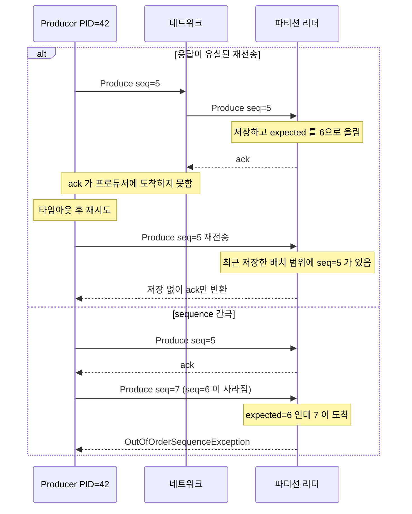
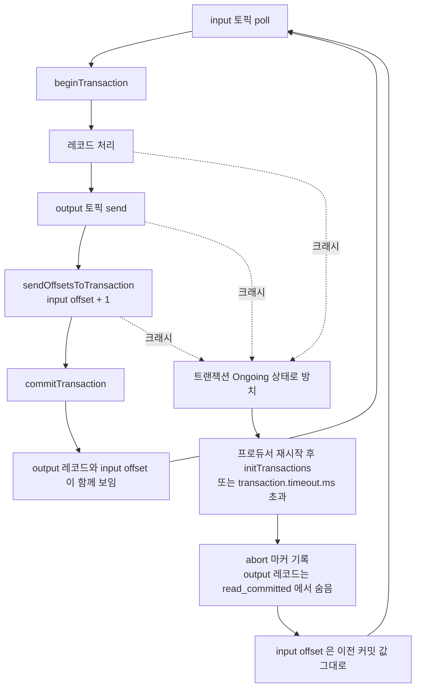
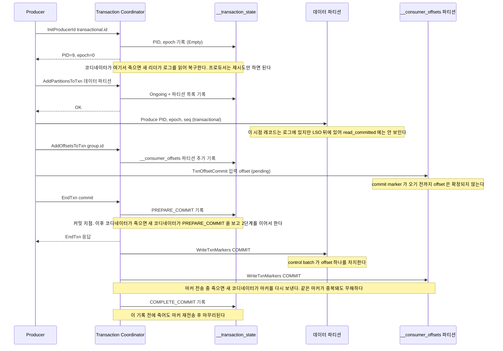
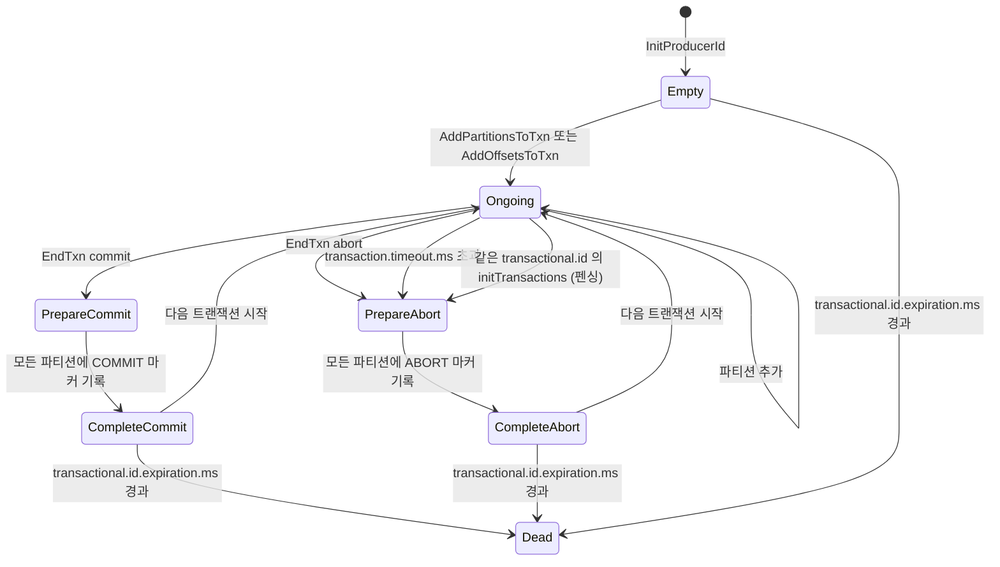
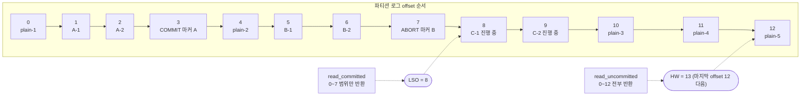
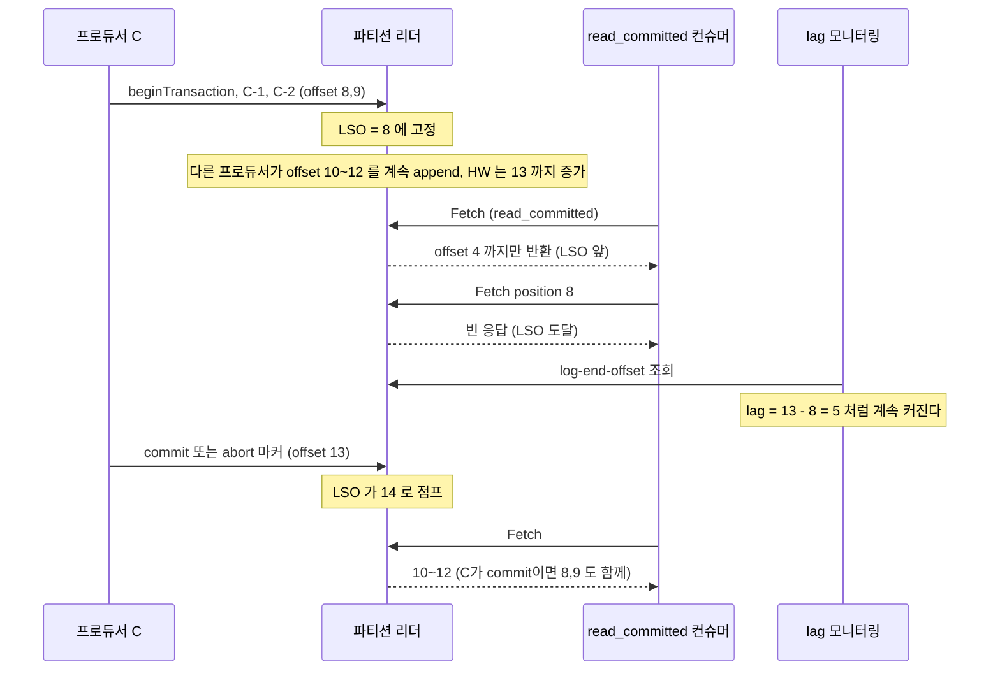
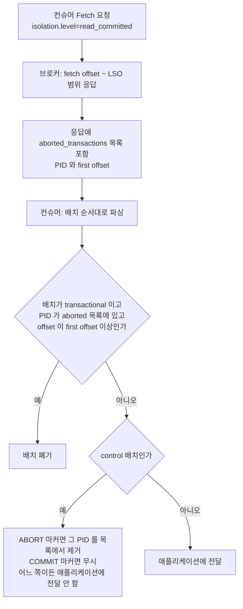
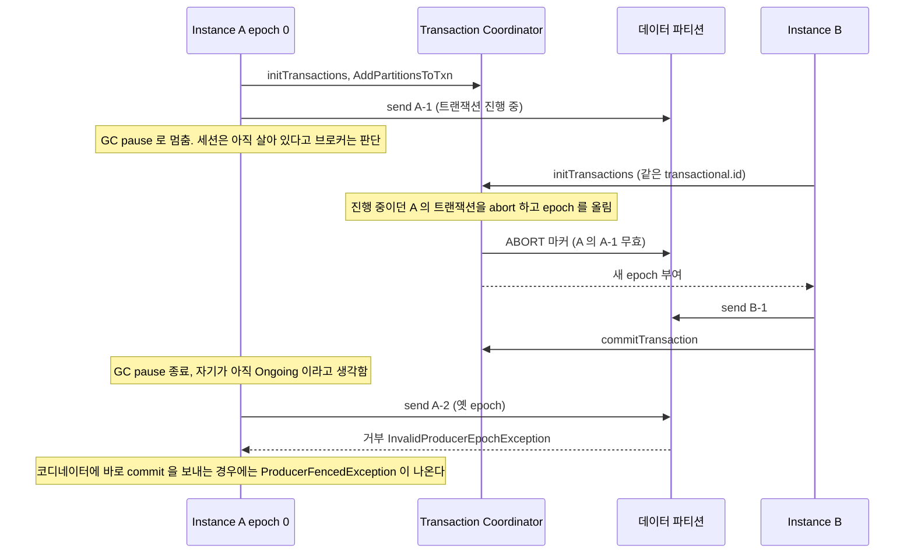

# Kafka Exactly-Once Semantics (EOS)

Kafka EOS는 두 개의 독립 기능이 합쳐진 결과다. 하나는 Idempotent Producer로 프로듀서 재시도로 인한 중복을 제거하는 것이고, 다른 하나는 트랜잭션 API로 읽기-처리-쓰기를 원자적으로 묶는 것이다. 이 둘을 이해하지 않고 `exactly-once`라는 단어만 믿으면, Kafka→DB 파이프라인에서 중복이 발생할 때 원인을 찾을 수 없다.

## Idempotent Producer: PID + sequence number

프로듀서가 `acks=all`로 메시지를 보내고 브로커로부터 응답을 받지 못하면 재시도한다. 브로커가 실제로는 메시지를 받아서 저장했는데 응답만 유실된 경우, 이 재시도는 중복이 된다.

Idempotent Producer는 각 프로듀서 인스턴스에 **PID(Producer ID)** 를 부여하고, 보내는 메시지마다 파티션별 **sequence number** 를 붙인다. 브로커는 `(PID, 파티션, sequence number)` 조합으로 이미 저장한 메시지인지 판단한다. 같은 조합이 오면 저장 대신 ack만 돌려보낸다.

그림의 alt 블록 앞쪽은 응답이 유실돼 재전송이 온 경우, 뒤쪽은 sequence에 구멍이 생긴 경우다. 브로커가 재전송은 조용히 흡수하고 구멍은 예외로 돌려준다는 차이를 보면 된다.



간극이 생기는 원인은 두 가지가 흔하다. 첫째, 배치 하나가 만료돼 프로듀서가 버렸는데 그 뒤 배치는 이미 나간 경우다. 둘째, 로그 보존이 지나서 브로커가 해당 PID의 상태를 지워 버린 경우다. 이 예외를 직접 재현하려면 네트워크를 끊고 배치를 만료시켜야 해서 이번 실험에서는 만들지 않았다. 대신 저장된 배치에 PID와 sequence가 실제로 붙어 있는지는 `kafka-dump-log.sh`로 확인했다(문서 끝의 실험 기록 참조).

브로커는 PID와 파티션 조합마다 **최근 배치 5개**의 sequence 범위만 기억한다. 재전송이 이 범위 안에 있어야 중복으로 판정하고 ack만 돌려줄 수 있다. `max.in.flight.requests.per.connection`이 5를 넘으면 안 되는 이유가 이 숫자다.

`enable.idempotence=true`를 켜면 자동으로 활성화된다. `acks=-1(all)`, `max.in.flight.requests.per.connection=5`도 자동 적용된다. 명시적으로 다른 값을 설정하면 충돌 오류가 난다.

```typescript
import { Kafka } from 'kafkajs'

const producer = kafka.producer({
  idempotent: true,
  // acks=-1, maxInFlightRequests=5가 자동 설정됨
})
```

Java 클라이언트:

```java
Properties props = new Properties();
props.put(ProducerConfig.ENABLE_IDEMPOTENCE_CONFIG, true);
// acks=-1, retries=Integer.MAX_VALUE, max.in.flight=5 자동 적용
```

PID는 브로커가 프로듀서 세션 단위로 발급한다. 프로듀서가 재시작하면 PID가 바뀐다. 같은 토픽에 이전과 같은 내용을 보내도 PID가 달라지기 때문에 중복으로 인식하지 않는다. Idempotent Producer가 막는 건 **같은 프로듀서 세션 내의 재시도 중복**이지, 애플리케이션 레벨에서 두 번 호출한 중복이 아니다.

sequence number는 파티션별로 따로 관리한다. 파티션 A에 seq=5를 보내고 파티션 B에도 seq=5를 보내는 건 각각 별개다.

### max.in.flight.requests.per.connection을 5로 놓는 이유

이전에는 idempotent producer를 쓰려면 이 값을 1로 제한해야 순서가 보장된다고 알려져 있었다. Kafka 1.0.0부터는 5까지 허용하고, 브로커가 sequence number로 순서를 보장한다. 5는 위에서 말한 브로커가 기억하는 배치 수와 같다. in-flight 배치가 5개를 넘으면 재전송이 왔을 때 중복인지 판정할 기록이 없어질 수 있어서, 클라이언트가 아예 6 이상을 받지 않는다.

이 제한은 브로커가 예외를 던지는 게 아니라 **프로듀서 생성 시점에 `ConfigException`** 으로 나온다. Kafka 3.7.1 클라이언트로 직접 확인한 결과다.

```
max.in.flight.requests.per.connection=6 -> ConfigException: Must set max.in.flight.requests.per.connection to at most 5 to use the idempotent producer.
acks=1 -> ConfigException: Must set acks to all in order to use the idempotent producer. Otherwise we cannot guarantee idempotence.
max.in.flight.requests.per.connection=5 -> ok
```

## 트랜잭션 API

Idempotent Producer가 단일 프로듀서의 재시도 중복을 막는다면, 트랜잭션 API는 **여러 파티션에 대한 write와 컨슈머 offset commit을 원자적으로 묶는다**. "원자적으로"의 의미는 모두 성공하거나, 모두 없었던 일이 되거나 둘 중 하나라는 뜻이다.

### transactional.id

트랜잭션 프로듀서는 반드시 `transactional.id`를 설정해야 한다. 이 값은 브로커가 같은 논리적 프로듀서를 식별하는 기준이다. PID는 세션마다 새로 발급되지만, `transactional.id`는 재시작 후에도 동일하게 유지된다. 브로커는 이 값으로 좀비 프로듀서의 진행 중인 트랜잭션을 중단시킨다.

`transactional.id`는 파티션이나 컨슈머 그룹처럼 **인스턴스별로 고유해야 한다**. 같은 id를 여러 프로듀서 인스턴스가 동시에 쓰면 그 중 하나는 `ProducerFencedException`이 발생한다.

### initTransactions / beginTransaction / commitTransaction / abortTransaction

`initTransactions()`는 프로듀서를 트랜잭션 모드로 등록하고, 이전에 완료되지 않은 트랜잭션이 있으면 정리한다. 프로듀서 인스턴스 생명주기에서 한 번만 호출한다. 재시작 후 다시 호출하면 브로커가 이전 PID를 무효화하고 새 PID를 발급한다. 이전 PID로 진행 중이던 트랜잭션은 abort로 처리된다.

```java
producer.initTransactions();  // 시작 시 한 번

try {
    producer.beginTransaction();

    // 여러 파티션에 메시지 전송
    producer.send(new ProducerRecord<>("orders", orderId, orderData));
    producer.send(new ProducerRecord<>("audit-log", orderId, auditData));

    // 컨슈머 offset도 트랜잭션에 포함
    producer.sendOffsetsToTransaction(
        Map.of(
            new TopicPartition("input-topic", 0),
            new OffsetAndMetadata(offset + 1)
        ),
        new ConsumerGroupMetadata("order-consumer-group")
    );

    producer.commitTransaction();
} catch (ProducerFencedException e) {
    // 좀비 프로듀서 상태. 복구 불가, 인스턴스 종료해야 함
    throw e;
} catch (KafkaException e) {
    producer.abortTransaction();
    // 재처리 로직 또는 상위로 예외 전파
}
```

kafkajs는 `transaction()` 메서드로 begin/commit/abort를 묶어서 처리한다.

```typescript
import { Kafka } from 'kafkajs'

const producer = kafka.producer({
  transactionalId: 'order-processor-0',
  idempotent: true,
  maxInFlightRequests: 1,  // kafkajs 트랜잭션은 in-flight 1 권장
})

await producer.connect()

const transaction = await producer.transaction()

try {
  await transaction.send({
    topic: 'orders',
    messages: [{ key: orderId, value: JSON.stringify(orderData) }],
  })

  await transaction.sendOffsets({
    consumerGroupId: 'order-consumer-group',
    topics: [{
      topic: 'input-topic',
      partitions: [{ partition: 0, offset: String(nextOffset) }],
    }],
  })

  await transaction.commit()
} catch (err) {
  await transaction.abort()
  throw err
}
```

### sendOffsetsToTransaction

컨슈머 offset을 커밋하는 작업을 트랜잭션 안에 넣는 메서드다. 메시지 처리와 offset 커밋이 원자적이 된다.

트랜잭션이 abort되면 offset 커밋도 없었던 일이 된다. 컨슈머는 이전 offset에서 다시 읽는다. 트랜잭션이 commit되면 offset이 저장된다.

이 동작을 위해 컨슈머 쪽에서도 `isolation.level` 설정이 필요하다.

```java
props.put(ConsumerConfig.ISOLATION_LEVEL_CONFIG, "read_committed");
// 기본값은 read_uncommitted — 아직 commit되지 않은 트랜잭션 메시지도 읽음
```

`read_committed`로 설정한 컨슈머는 abort된 트랜잭션의 메시지를 건너뛴다. `read_uncommitted` 상태에서는 나중에 abort될 메시지도 읽어서 처리해버릴 수 있다.

### consume-transform-produce 루프

`sendOffsetsToTransaction`이 들어가는 전형적인 루프다. 입력 offset 커밋과 출력 write가 같은 트랜잭션에 묶이므로, 중간에 죽으면 둘 다 없던 일이 된다. 그림에서 크래시 분기가 abort로 이어지고 input offset이 이전 값으로 남는 부분을 보면 된다.



offset 커밋은 컨슈머의 `enable.auto.commit`이 아니라 트랜잭션이 담당한다. 이 루프에서 컨슈머는 `enable.auto.commit=false`, `isolation.level=read_committed`로 두어야 한다. 자동 커밋이 켜져 있으면 트랜잭션과 무관하게 offset이 앞으로 가서, abort 후에도 입력 레코드를 다시 읽지 못한다.

## 트랜잭션 내부 동작

`commitTransaction()` 한 줄 뒤에서 일어나는 일을 알아야 코디네이터 장애나 타임아웃 때 상태가 어떻게 되는지 읽을 수 있다. 트랜잭션 상태는 `__transaction_state` 토픽에 기록되고, 이 토픽의 파티션 리더가 곧 그 `transactional.id`의 Transaction Coordinator다. `transactional.id`의 해시로 파티션이 정해진다.

### 커밋 2단계

1단계는 `__transaction_state`에 PREPARE_COMMIT을 쓰는 것이고, 2단계는 관련 파티션에 commit marker를 쓴 뒤 COMPLETE_COMMIT을 쓰는 것이다. PREPARE_COMMIT이 기록되는 순간이 커밋 지점이다. 이후에는 프로듀서나 코디네이터가 죽어도 커밋으로 끝난다.



코디네이터가 죽는 지점별로 남는 상태와 복구 동작을 표로 정리했다. 이 표는 KIP-98 설계를 기준으로 쓴 것이고, 단일 노드 실험 환경에서는 코디네이터를 강제로 죽여 보지 못했다.

| 죽은 시점 | 로그에 남은 상태 | 새 코디네이터가 하는 일 |
|---|---|---|
| InitProducerId 직후 | Empty | 아무것도 없다. 프로듀서가 요청을 재시도한다 |
| AddPartitionsToTxn 이후, EndTxn 이전 | Ongoing | 트랜잭션을 그대로 유지한다. 프로듀서가 재시도하거나 timeout 후 abort된다 |
| PREPARE_COMMIT 기록 후 | PrepareCommit | 관련 파티션에 COMMIT 마커를 (다시) 보내고 COMPLETE_COMMIT을 쓴다 |
| 일부 파티션에만 마커를 쓴 후 | PrepareCommit | 전체에 다시 보낸다. 이미 마커가 있는 파티션에는 중복 마커가 붙지만 결과는 같다 |
| 마커를 다 쓰고 COMPLETE_COMMIT 전 | PrepareCommit | 마커를 한 번 더 보내고 COMPLETE_COMMIT을 쓴다 |

마커가 파티션별로 따로 쓰이기 때문에, 커밋 직후 짧은 시간 동안 어떤 파티션에서는 레코드가 보이고 다른 파티션에서는 아직 안 보일 수 있다. "모두 보이거나 모두 안 보인다"는 보장은 마커가 다 쓰인 뒤에 성립한다. 컨슈머가 여러 파티션을 함께 읽는 조인 로직에서는 이 시차가 그대로 순서 어긋남으로 나타난다.

### 상태 머신

코디네이터가 `__transaction_state`에 기록하는 상태와 전이다. `Ongoing`에서 갈라지는 두 경로(commit, abort)와, 프로듀서가 아무것도 안 해도 타임아웃으로 PrepareAbort에 들어가는 경로를 보면 된다.



실제로 확인한 상태는 `kafka-transactions.sh describe`와 `list`로 본 `CompleteCommit`, `CompleteAbort` 두 가지다. `Ongoing`과 `Prepare*`는 순간적으로 지나가서 명령으로 잡기 어렵다.

타임아웃 경로는 즉시 발동하지 않는다. 브로커가 `transaction.abort.timed.out.transaction.cleanup.interval.ms`(기본 10초)마다 만료 트랜잭션을 훑는다. `transaction.timeout.ms=5000`으로 잡고 레코드를 하나 보낸 뒤 방치했더니, abort 마커는 첫 레코드에서 약 10.5초 뒤에 찍혔다. 타임아웃 값이 아니라 스캔 주기에 걸린 것이다. 그 뒤 같은 프로듀서가 `commitTransaction()`을 부르면 `ProducerFencedException`이 나온다. abort하면서 epoch가 올라가기 때문이다.

`transaction.timeout.ms`는 프로듀서가 정하고(기본 60초), 브로커의 `transaction.max.timeout.ms`(기본 15분)가 상한이다. 프로듀서 값이 상한을 넘으면 `send` 시점이 아니라 **`initTransactions()` 에서** 실패한다. 예외 타입이 `TimeoutException`이 아니라 `KafkaException`이라 재시도 로직에서 놓치기 쉽다.

```
transaction.timeout.ms=1000000 (브로커 max 900000)
-> KafkaException : Unexpected error in InitProducerIdResponse; The transaction timeout is larger than the maximum value allowed by the broker (as configured by transaction.max.timeout.ms).
transaction.timeout.ms=900000
-> init ok
```

Kafka Streams는 `commit.interval.ms`(EOS에서는 기본 100ms)마다 트랜잭션을 닫기 때문에 이 한도에 걸릴 일이 거의 없다. 직접 만든 배치 프로듀서가 트랜잭션 하나에 오래 걸리는 작업을 넣을 때 걸린다.

## read_committed와 LSO

트랜잭션 레코드는 커밋 전에도 이미 파티션 로그에 append되어 있다. `read_committed`는 로그에서 레코드를 지우는 게 아니라, 컨슈머가 읽는 **상한과 필터**를 바꾸는 방식이다. 읽는 상한이 High Watermark(HW)에서 Last Stable Offset(LSO)으로 내려가고, abort된 트랜잭션의 레코드는 걸러진다.

### 파티션 로그에 섞인 트랜잭션

파티션 하나에 일반 메시지, 커밋된 트랜잭션 A, abort된 트랜잭션 B, 진행 중인 트랜잭션 C를 섞어 넣고 덤프한 구조다. 오프셋 3과 7은 마커(control batch)가 하나씩 차지했다. LSO는 진행 중인 C의 첫 레코드(offset 8)에서 멈춘다.



| 구분 | read_uncommitted | read_committed |
|---|---|---|
| 읽는 상한 | HW | LSO |
| 이 로그에서 받는 offset | 0,1,2,4,5,6,8,9,10,11,12 | 0,1,2,4 |
| abort된 B(5,6) | 받는다 | 걸러진다 |
| 진행 중인 C(8,9) | 받는다 | 받지 못한다 |
| C 뒤의 일반 메시지(10~12) | 받는다 | 받지 못한다. C가 끝날 때까지 LSO 뒤에 있다 |
| control 마커(3,7) | 어느 모드에서도 애플리케이션에 안 나온다 | 동일 |

세 번째 행이 운영에서 문제가 되는 부분이다. B는 abort가 확정돼 건너뛰면 그만이지만, C는 끝나지 않았으니 C 뒤의 **이미 커밋된 일반 메시지까지** 읽을 수 없다. LSO는 "이 오프셋 앞은 모든 트랜잭션이 결론 났다"는 지점이라서 열린 트랜잭션 하나가 뒤 전체를 막는다.

### 열린 트랜잭션이 lag를 만드는 과정



이 현상은 컨슈머 코드에는 문제가 없고 CPU도 놀고 있는데 lag만 늘어나서 원인을 찾기 어렵다. 처음 겪으면 파티션 리더나 네트워크부터 의심하게 된다. 실제로 재현한 수치는 이렇다. 트랜잭션 C를 열어 둔 채 일반 메시지 3개를 뒤에 넣고 두 그룹을 읽혔다.

```
GROUP   TOPIC    PARTITION  CURRENT-OFFSET  LOG-END-OFFSET  LAG
g-rc    eos-lso  0          8               13              5      (read_committed)
g-ru    eos-lso  0          13              13              0      (read_uncommitted)
```

`g-rc`는 offset 8에서 멈췄다. 뒤에 쌓인 plain-3~5는 `g-ru`가 읽은 것과 같은 커밋 상태의 일반 메시지인데도 읽지 못했다. 원인은 `kafka-transactions.sh`로 확인한다. `list`에서 `Ongoing`이 남아 있거나 `find-hanging`이 결과를 내면 그 트랜잭션이 원인이다. 이번 실험에서는 프로세스가 `close()`를 부르며 종료하는 순간 미완료 트랜잭션을 프로듀서가 스스로 abort했고, 그 시점에 LSO가 풀렸다. 프로세스가 `kill -9`로 죽거나 네트워크가 끊겨 `close()`가 안 불리면 `transaction.timeout.ms`(최대 15분)와 스캔 주기가 지날 때까지 막힌다. 이 경우는 직접 재현하지 않았고, 아무 활동 없이 방치된 트랜잭션이 타임아웃 스캔에 abort되는 것까지만 위 타임아웃 실험으로 확인했다.

### control batch와 offset의 빈 자리

commit·abort 마커는 일반 레코드처럼 로그에 append되고 offset 하나를 쓴다. 컨슈머에게는 전달되지 않기 때문에 애플리케이션에서 보면 offset이 건너뛴 것처럼 보인다. 위 실험에서 `read_committed`가 받은 offset은 `0,1,2,4`이고 3이 없다. 실제로 3번은 `endTxnMarker: COMMIT`이다.

이 때문에 깨지는 가정이 있다. offset이 연속이라고 보고 "누락 검사"를 하는 코드, `endOffset - beginOffset`을 레코드 수로 쓰는 계산이 그렇다. 트랜잭션을 쓰는 토픽에서는 트랜잭션 하나마다 최소 1개(파티션마다) 빈 자리가 생기므로, 초당 수백 트랜잭션이면 offset 소모가 눈에 띈다. Streams처럼 100ms마다 커밋하는 애플리케이션은 파티션당 초당 10개의 offset이 마커로 나간다.

### abort된 레코드를 걸러내는 방식

브로커는 파티션 디렉터리에 `.txnindex` 파일을 두고 abort된 트랜잭션의 (PID, 시작 offset, 마지막 offset)을 기록한다. 이번 실험의 `eos-log-0` 디렉터리에도 이 파일이 생겼다.



컨슈머가 abort 여부를 판단하려고 마커를 직접 찾는 게 아니다. 브로커가 LSO 앞 범위에서 abort된 (PID, first offset) 목록을 함께 내려주고, 컨슈머는 그 PID의 배치를 마커가 나올 때까지 버린다. 덕분에 `read_committed`가 추가로 지불하는 비용은 LSO를 계산하는 브로커 쪽 메모리(열린 트랜잭션의 첫 offset 추적)와, 응답 크기가 약간 늘어나는 정도다. 실제 지연은 이 필터링이 아니라 위에서 본 LSO 대기에서 나온다.

## Kafka Streams EOS

Kafka Streams는 `Kafka → 처리 → Kafka` 파이프라인을 하나의 단위로 운영할 때 쓰는 스트리밍 라이브러리다. EOS 설정 하나로 읽기-처리-쓰기 전체를 트랜잭션으로 묶는다.

```java
Properties props = new Properties();
props.put(StreamsConfig.APPLICATION_ID_CONFIG, "order-processor");
props.put(StreamsConfig.BOOTSTRAP_SERVERS_CONFIG, "kafka:9092");
props.put(StreamsConfig.PROCESSING_GUARANTEE_CONFIG, StreamsConfig.EXACTLY_ONCE_V2);
// Kafka 2.6 이상. 이전에는 EXACTLY_ONCE (deprecated)
```

`exactly_once_v2`는 Kafka 2.5에서 도입된 두 번째 버전이다(KIP-447). 기존 `exactly_once`는 컨슈머 그룹 코디네이터와 트랜잭션 코디네이터 사이에 추가 통신이 필요했는데, v2에서는 불필요한 round-trip을 제거했다.

Kafka Streams가 내부적으로 하는 일:

- task별 프로듀서를 만들고 `transactional.id`를 `{applicationId}-{taskId}` 형태로 자동 생성한다
- 처리 interval마다 `commitTransaction` → `beginTransaction`을 반복한다
- 컨슈머 offset을 `sendOffsetsToTransaction`으로 같은 트랜잭션 안에 포함시킨다

Kafka Streams로 파이프라인을 구성하면 EOS 설정만으로 상당한 중복 처리 문제가 사라진다. 단, 처리 로직 안에서 외부 API를 호출하거나 DB에 쓰는 부분은 Kafka EOS 범위 밖이다.

`exactly_once` vs `exactly_once_v2` 선택: 브로커와 클라이언트가 모두 Kafka 2.5 이상이면 v2를 쓴다. 그 미만이면 `exactly_once`(deprecated)를 쓰는 수밖에 없다.

## Kafka→DB 쓰기가 EOS 범위 밖인 이유

Kafka 트랜잭션은 Kafka 내부에서만 성립한다. DB 쓰기는 별도의 트랜잭션 시스템이다. 두 시스템을 하나의 트랜잭션으로 묶으려면 2PC(Two-Phase Commit)가 필요하다. Kafka는 2PC를 지원하지 않는다.

실제로 어떤 일이 벌어지는지 보면 이해가 빠르다.

```
시나리오 1 — DB 성공, Kafka offset 실패:
  컨슈머가 메시지 읽음
  → DB INSERT 실행 후 commit 성공
  → Kafka offset commit 실패 (네트워크 오류)
  → 컨슈머 재시작
  → 같은 메시지를 다시 읽음
  → DB에 같은 INSERT 다시 실행 → 중복

시나리오 2 — DB 실패, Kafka offset 이미 커밋:
  컨슈머가 메시지 읽음
  → Kafka offset commit 성공
  → DB INSERT 실행 중 크래시
  → 컨슈머 재시작
  → offset이 앞으로 가 있어서 해당 메시지 영구 유실
```

DB commit과 Kafka commit 사이의 창이 존재하는 한 중복이나 유실 중 하나가 가능성으로 남는다. Kafka 트랜잭션을 켜도 이 창은 없어지지 않는다.

## at-least-once + 멱등으로 수렴하는 이유

브로커 수준의 exactly-once를 달성하더라도, 파이프라인 끝단에 Kafka 바깥의 시스템이 있는 한 at-least-once로 돌아온다. 선택지는 두 가지다.

**DB 쓰기에 멱등 처리 추가**: `INSERT ... ON CONFLICT DO NOTHING`처럼 같은 메시지가 두 번 들어와도 결과가 같게 만든다.

**Transactional Outbox**: DB와 메시지 발행을 같은 DB 트랜잭션 안에서 처리한다. 메시지는 Outbox 테이블에 먼저 저장하고, CDC나 폴링으로 Kafka로 발행한다.

실무에서는 대부분 전자로 해결한다. 로직이 단순하고 추가 인프라가 없어도 된다.

```java
@Transactional
public void handle(OrderEvent event) {
    jdbcTemplate.update(
        "INSERT INTO processed_orders(event_id, order_id, status) " +
        "VALUES (?, ?, ?) ON CONFLICT (event_id) DO NOTHING",
        event.getEventId(), event.getOrderId(), event.getStatus()
    );
    // ON CONFLICT DO NOTHING — 같은 event_id가 두 번 들어와도 두 번째는 insert 안 됨
}
```

`event_id`에 unique constraint를 걸어두면 컨슈머 로직 자체가 멱등해진다. Kafka EOS 설정 유무와 관계없이 중복 처리가 막힌다.

## transactional.id 관리

### 파티션 수에 맞춘 인스턴스 관리

트랜잭션 프로듀서를 직접 사용하는 경우(Kafka Streams 미사용), `transactional.id`를 인스턴스별로 고유하게 배정해야 한다. 일반적인 패턴은 파티션 번호를 suffix로 붙이는 방식이다.

```
transactional.id = {서비스명}-{파티션번호}
예: order-processor-0, order-processor-1, order-processor-2
```

컨슈머 인스턴스가 특정 파티션을 담당하고, 그 파티션에 대응하는 `transactional.id`를 쓴다. 리밸런스로 파티션 소유권이 바뀌면 `transactional.id`도 함께 이동해야 한다. 이 매핑을 직접 관리하는 게 복잡하면 Kafka Streams를 쓰는 게 낫다. Streams는 이 매핑을 자동으로 처리한다.

### KIP-447: 파티션별 transactional.id가 필요 없어진다

위에서 파티션 번호를 `transactional.id`에 붙이는 이유는 리밸런스 후 파티션 소유권이 바뀌어도 그 파티션의 옛 소유자를 같은 id로 펜싱하기 위해서다. Kafka 2.5(KIP-447)부터는 `sendOffsetsToTransaction`에 `ConsumerGroupMetadata`(group id, generation, member id)를 넘기면 펜싱을 컨슈머 그룹 generation이 맡는다. 그룹 코디네이터가 옛 generation의 `TxnOffsetCommit`을 거부하므로 옛 소유자가 offset을 확정하지 못한다.

| 구분 | 2.5 이전 방식 | KIP-447 이후 |
|---|---|---|
| `transactional.id` 단위 | 입력 파티션마다 하나 | 스레드나 인스턴스마다 하나 (파티션과 무관) |
| 프로듀서 수 | 입력 파티션 수만큼 | 인스턴스 수만큼 |
| 리밸런스 시 | 파티션이 옮겨지면 그 파티션용 프로듀서도 같이 옮겨야 함 | 신경 쓸 필요 없음. generation이 옛 소유자를 막음 |
| `sendOffsetsToTransaction` 인자 | group id 문자열 (deprecated) | `ConsumerGroupMetadata` (`consumer.groupMetadata()`) |
| Kafka Streams | `exactly_once` (task별 프로듀서) | `exactly_once_v2` (스레드별 프로듀서) |
| 요구 버전 | - | 브로커와 클라이언트 모두 2.5 이상 |

프로듀서를 파티션 수만큼 만들면 각각이 브로커와 별도 커넥션, 별도 배치 버퍼, 별도 트랜잭션 코디네이터 왕복을 갖는다. 파티션 수십 개짜리 토픽에서 `exactly_once_v1`이 느린 이유가 이것이다. v2로 옮기면 프로듀서와 커넥션 수가 줄어든다.

### 좀비 프로듀서 방어

`transactional.id`의 핵심 역할 중 하나가 좀비 프로듀서 방어다. 좀비 프로듀서는 네트워크 파티션이나 GC pause 등으로 죽었다고 간주되었지만 실제로는 살아있는 프로듀서 인스턴스다.

브로커는 `transactional.id`별로 **epoch** 값을 관리한다. 새 프로듀서가 같은 `transactional.id`로 `initTransactions()`를 호출하면 epoch가 올라간다. 이전 epoch의 프로듀서가 트랜잭션을 계속 진행하려 하면 브로커가 거부한다. 그림은 Instance A가 GC pause로 멈춘 사이 B가 넘겨받는 순서다.



Kafka 3.7.1 클라이언트로 이 순서를 그대로 재현했다. 실험 결과에서 눈여겨볼 점이 두 가지다. 첫째, 이미 트랜잭션에 등록된 파티션에 옛 epoch로 `send`하면 데이터 파티션 리더가 거부하고 예외는 `ProducerFencedException`이 아니라 `InvalidProducerEpochException`으로 나온다. `ProducerFencedException`은 코디네이터에 곧장 닿는 `commitTransaction()`에서 나온다(아래 타임아웃 실험에서 확인). `catch (ProducerFencedException e)` 한 가지만 잡는 코드는 `send` 경로에서 새는 경우가 있으므로 두 예외를 함께 치명 오류로 다뤄야 한다. 둘째, epoch는 0부터 시작해 A가 0, abort 마커가 1, B의 트랜잭션이 2로 올라갔다. abort 한 번에 epoch가 한 번 더 오른다.

`ProducerFencedException`을 받은 인스턴스는 복구가 불가능하다. 해당 프로듀서 인스턴스를 종료하고 새로 시작해야 한다. 이 예외를 잡아서 재시도하거나 무시하면 안 된다.

```java
try {
    producer.beginTransaction();
    // ... 처리 ...
    producer.commitTransaction();
} catch (ProducerFencedException e) {
    // 복구 불가 — 인스턴스를 종료하고 재시작
    log.error("Producer fenced. Shutting down.", e);
    System.exit(1);
} catch (KafkaException e) {
    try {
        producer.abortTransaction();
    } catch (KafkaException abortEx) {
        log.error("Failed to abort transaction", abortEx);
    }
    // 재처리 로직 또는 상위로 예외 전파
}
```

epoch는 브로커에서 증가만 하고 줄지 않는다. `initTransactions()` 호출이 잦으면 epoch가 빠르게 올라간다. 배포마다 새 프로듀서를 만들지 않고 프로세스 내에서 재사용하는 설계가 맞다.

## EOS가 성립하는 전제: 복제 설정

멱등 프로듀서와 트랜잭션은 리더 한 대의 로그에 기록이 남는다는 것까지만 보장한다. 리더가 죽고 팔로워가 승격됐을 때 그 기록이 있어야 EOS가 성립한다. 이 부분은 프로듀서가 아니라 토픽과 브로커 설정이 맡는다.

`acks=all`은 ISR 전원의 ack를 기다린다. 그런데 ISR이 리더 하나로 줄어든 상태에서는 리더 혼자 저장하면 ack가 나간다. `min.insync.replicas`가 1이면 이 상태가 허용되고, 그 리더가 죽으면 ack까지 받았던 레코드와 commit marker가 사라진다. 그래서 `min.insync.replicas=2`(복제 계수 3)를 함께 걸어야 `acks=all`이 의미가 있다. ISR이 그 아래로 내려가면 쓰기는 `NotEnoughReplicasException`으로 거절되므로, 유실 대신 가용성을 내놓는 설정이다.

`__transaction_state`도 같은 규칙을 받는다. 이 토픽의 기본값은 `transaction.state.log.replication.factor=3`, `transaction.state.log.min.isr=2`다. 함정이 되는 것은 개발 환경이다. 브로커 한 대짜리 로컬 클러스터를 기본값으로 띄우면 토픽이 만들어지지 않고 `initTransactions()`가 그냥 매달린다.

```
브로커 1대, transaction.state.log.* 기본값
-> TimeoutException : Timeout expired after 20000ms while awaiting InitProducerId (22011ms)
   (브로커 로그: "Sent auto-creation request for Set(__transaction_state) to the active controller" 반복)
   kafka-topics.sh --list 결과에 __transaction_state 없음
```

`max.block.ms`를 줄이지 않으면 기본 60초를 기다린 뒤에야 실패한다. 오류 메시지에 복제 계수 얘기가 나오지 않아서, 처음에는 코디네이터를 못 찾는 네트워크 문제로 오인하기 쉽다. 로컬 단일 브로커는 `transaction.state.log.replication.factor=1`, `transaction.state.log.min.isr=1`, `offsets.topic.replication.factor=1`을 함께 내려야 한다. 운영에서는 반대로 이 값을 1로 두면 브로커 한 대의 장애가 트랜잭션 상태 유실로 이어지므로 3/2를 유지한다.

## EOS를 써야 하는 경우

파이프라인이 `Kafka → 처리 → Kafka` 형태이고, 처리 결과가 다시 Kafka 토픽으로 가는 경우에 EOS가 의미 있다. 이벤트 집계, 스트림 조인, 토픽 간 데이터 변환이 여기에 해당한다.

`Kafka → DB`, `Kafka → 외부 API` 형태라면 EOS를 켜도 외부 시스템 쪽에서 중복이 발생한다. 이 경우에는 at-least-once로 두고 DB 멱등 처리 또는 API 멱등 키를 쓰는 게 현실적이다.

EOS를 켜면 처리량이 떨어진다. 트랜잭션 코디네이터와 추가 통신이 발생하고, `read_committed` 컨슈머는 트랜잭션이 닫힐 때까지 메시지를 읽지 않아서 지연이 생긴다. 지연 시간 요구사항이 엄격한 파이프라인에서는 트레이드오프를 검토해야 한다.

## 로컬 실험 기록

위 절에서 확인 표시를 한 동작은 로컬 Kafka에서 직접 돌려 본 결과다. 환경은 Kafka 3.7.1 KRaft 단일 노드(broker와 controller 겸용), Java 클라이언트 3.7.1, OpenJDK 17이다. 트랜잭션 상태 토픽 복제 계수는 1로 낮췄다.

### 로그에 섞인 트랜잭션과 마커

일반 메시지 → 트랜잭션 A 커밋 → 일반 메시지 → 트랜잭션 B abort → 트랜잭션 C 진행 중 순서로 한 파티션에 넣은 뒤 `kafka-dump-log.sh --print-data-log`로 세그먼트를 읽었다. 출력에서 필요한 필드만 남겼다.

```
baseOffset: 0  PID: 0 isTransactional: false isControl: false   | payload: plain-1
baseOffset: 1  PID: 1 isTransactional: true  isControl: false   | payload: A-1     (baseSequence: 0)
baseOffset: 2  PID: 1 isTransactional: true  isControl: false   | payload: A-2     (baseSequence: 1)
baseOffset: 3  PID: 1 isTransactional: true  isControl: true    | endTxnMarker: COMMIT coordinatorEpoch: 0
baseOffset: 4  PID: 2 isTransactional: false isControl: false   | payload: plain-2
baseOffset: 5  PID: 3 isTransactional: true  isControl: false   | payload: B-1
baseOffset: 6  PID: 3 isTransactional: true  isControl: false   | payload: B-2
baseOffset: 7  PID: 3 isTransactional: true  isControl: true    | endTxnMarker: ABORT coordinatorEpoch: 0
baseOffset: 8  PID: 4 isTransactional: true  isControl: false   | payload: C-1
baseOffset: 9  PID: 4 isTransactional: true  isControl: false   | payload: C-2
```

일반 메시지도 프로듀서가 PID를 받고 `baseSequence`를 달고 있다. 멱등 프로듀서는 기본값으로 켜진 3.x 클라이언트라서 `transactional.id`가 없어도 PID가 붙는다. 트랜잭션 프로듀서의 배치는 `isTransactional: true`이고, 마커는 `isControl: true`인 별도 배치로 offset 하나를 차지한다.

### isolation.level별 콘솔 컨슈머 출력

같은 파티션을 `kafka-console-consumer.sh --isolation-level`로 읽었다. 트랜잭션 C는 아직 열려 있던 시점이다.

```
== read_uncommitted
Offset:0  plain-1     Offset:5  B-1
Offset:1  A-1         Offset:6  B-2
Offset:2  A-2         Offset:8  C-1
Offset:4  plain-2     Offset:9  C-2

== read_committed
Offset:0  plain-1
Offset:1  A-1
Offset:2  A-2
Offset:4  plain-2
```

`read_uncommitted`에서도 offset 3, 7은 나오지 않는다. 마커는 어느 모드에서도 애플리케이션까지 올라오지 않는다. `read_committed`는 B(abort)와 C(진행 중)를 모두 받지 못하고 offset 4에서 끝난다.

### LSO 정체와 lag

C를 열어 둔 채 뒤에 일반 메시지 3개(offset 10~12)를 더 넣고 그룹 두 개로 읽었다.

```
g-rc  read_committed    CURRENT-OFFSET 8   LOG-END-OFFSET 13  LAG 5
g-ru  read_uncommitted  CURRENT-OFFSET 13  LOG-END-OFFSET 13  LAG 0
```

C의 프로세스가 `close()`로 종료되자 프로듀서가 미완료 트랜잭션을 abort했고 offset 13에 ABORT 마커가 찍혔다. 이때 `kafka-transactions.sh describe`는 `CompleteAbort`, `TransactionTimeoutMs 300000`을 보여 줬다. 타임아웃(300초)이 아니라 `close()` 때문에 끝난 것이다.

### 좀비 펜싱

같은 `transactional.id`로 A가 `send`한 뒤 B가 `initTransactions()`, `send`, `commitTransaction()`을 하고 A가 깨어나 `send`와 `commitTransaction()`을 호출했다.

```
A: sent A-1 -> offset 0
B: initTransactions done
B: sent B-1 -> offset 2, committed
A: send  -> InvalidProducerEpochException: Producer attempted to produce with an old epoch.
A: commit -> InvalidProducerEpochException
```

덤프에서는 offset 0(A-1, epoch 0), offset 1(ABORT 마커, epoch 1), offset 2(B-1, epoch 2), offset 3(COMMIT 마커, epoch 2) 순으로 나왔다. B의 `initTransactions()`가 A의 열린 트랜잭션을 abort하면서 A의 A-1이 무효가 됐다. 이 실험에서 A의 `commitTransaction()`은 앞선 `send`가 실패해 프로듀서가 이미 오류 상태였던 탓인지 `InvalidProducerEpochException`으로 다시 나왔다. 코디네이터까지 도달해 `ProducerFencedException`이 나온 경우는 다음 타임아웃 실험이다.

### transaction.timeout.ms 초과

`transaction.timeout.ms=5000`으로 레코드 1건을 보내고 35초간 아무것도 하지 않은 뒤 `commitTransaction()`을 호출했다.

```
offset 0  payload: T-1                                        CreateTime 1790755078999
offset 1  endTxnMarker: ABORT coordinatorEpoch: 0             CreateTime 1790755089529   (약 10.5초 뒤)
commit: ProducerFencedException : There is a newer producer with the same transactionalId which fences the current one.
describe: TransactionState CompleteAbort, TransactionTimeoutMs 5000
read_committed 컨슈머: 0건
```

타임아웃 5초인데 abort는 10.5초에 일어났다. 브로커의 만료 스캔 주기(`transaction.abort.timed.out.transaction.cleanup.interval.ms`, 기본 10000ms)에 걸린 결과다. 로그에서 확인한 브로커 설정은 `transaction.max.timeout.ms = 900000`이다.

---
이 문서는 [메시징과 전달 보장 허브](../../_hub/메시징과_전달_보장.md)의 일부입니다.
