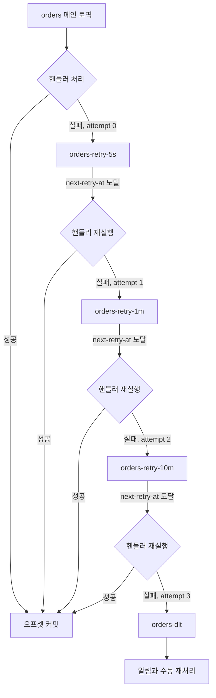
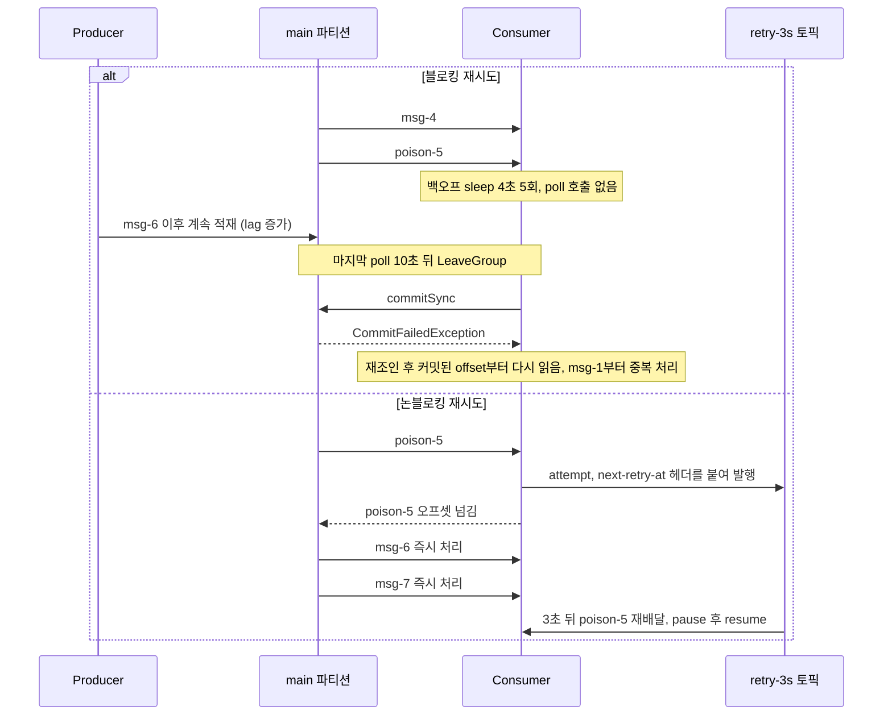
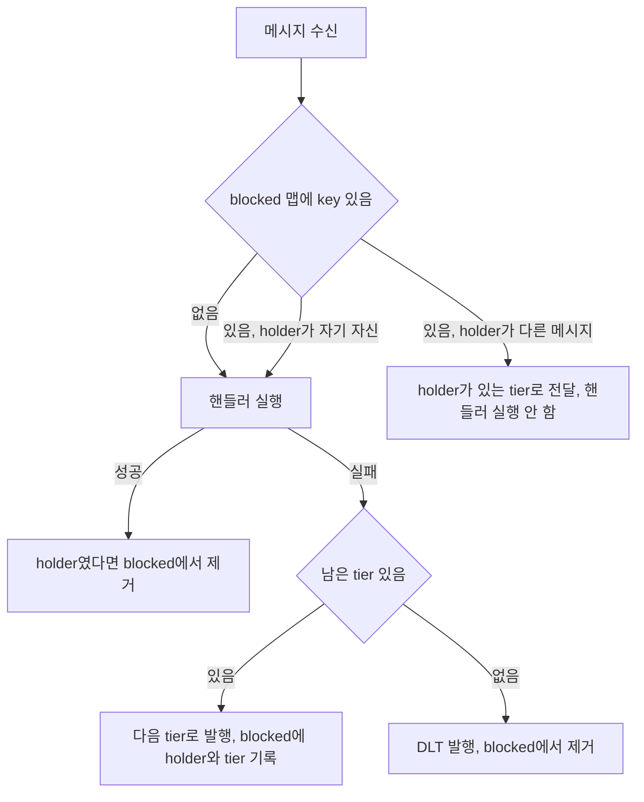
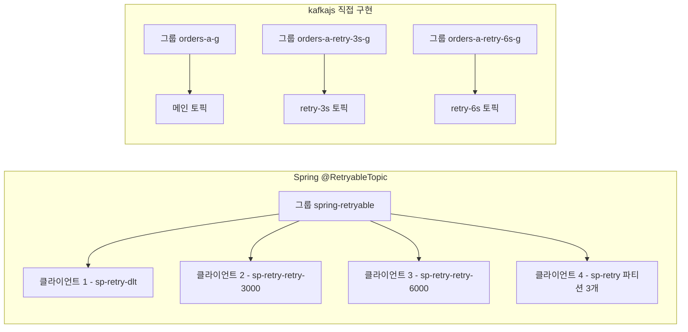

# Kafka 논블로킹 재시도 토픽 패턴

컨슈머 핸들러가 던지는 예외를 어디서 재시도하느냐에 따라 같은 파티션의 뒤 메시지 수천 건이 멈출 수도 있고 아무 일도 없을 수도 있다. 이 문서는 파티션 안에서 재시도할 때 실제로 어떤 로그가 찍히는지 재현하고, 재시도를 별도 토픽으로 밀어내는 방식을 kafkajs로 직접 구현해 본 뒤 Spring Kafka의 `@RetryableTopic`과 비교한다. 배압 자체는 [컨슈머 배압과 전달 보장](Consumer_Backpressure.md), DLT에 쌓인 메시지를 되돌리는 쪽은 [DLQ 재처리 자동화](DLQ_Reprocessing_Strategy.md)에서 다룬다. 여기서는 그 사이, 실패한 메시지를 DLT로 보내기 전에 몇 번 더 시도하는 구간만 본다.

본문의 로그와 수치는 전부 로컬에서 돌린 결과다.

| 항목 | 버전·설정 |
|---|---|
| 브로커 | Kafka 3.7.1, KRaft 단일 노드, 복제 계수 1 |
| Java 클라이언트 | kafka-clients 3.7.1, JDK 17 |
| Node 클라이언트 | kafkajs 2.2.4, Node 20 |
| Spring | Spring Boot 3.3.4, spring-kafka 3.2.4 |
| 공통 시나리오 | 250ms 간격으로 20건 발행, 5번째는 항상 실패(poison-5), 8번째는 첫 시도만 실패(flaky-8) |

지연 시간은 실험 속도를 위해 줄였다. 설계 절에서는 retry-5s, retry-1m, retry-10m을 쓰지만 실제로 돌린 tier는 3초와 6초(Spring은 3000ms, 6000ms)다.

## 파티션 안에서 재시도하면 생기는 일

가장 흔한 재시도 코드는 핸들러가 실패하면 컨슈머 스레드에서 sleep을 걸고 같은 메시지를 다시 처리하는 형태다. 단건 실패에는 문제가 없어 보이지만, 파티션은 오프셋 순서로만 읽히므로 재시도 중인 메시지 뒤의 메시지는 전부 기다린다. 이걸 head-of-line blocking이라고 부른다.

재현은 순수 Java 클라이언트로 했다. 파티션 1개, `max.poll.interval.ms=10000`, `max.poll.records=10`, 프로듀서는 250ms마다 1건이다. 5번째 메시지(offset 4)를 처리할 때 4초 sleep을 5번 돈다. 배치 처리가 끝난 뒤 `commitSync()`를 호출하는 평범한 구조다.

```java
for (ConsumerRecord<String, String> r : recs) {
  if (r.value().startsWith("poison")) {
    for (int attempt = 1; attempt <= 5; attempt++) {
      System.out.println(t() + " FAIL offset=" + r.offset() + " attempt=" + attempt + " backoff sleep 4s");
      Thread.sleep(4000);
    }
  }
  System.out.println(t() + " done offset=" + r.offset() + " " + r.value());
}
c.commitSync();
```

로그는 이렇게 나왔다. 시각은 프로그램 시작 기준이고 LAG는 별도 스레드가 2초마다 `end offset - committed offset`으로 계산한 값이다.

```
[+006.5s] done offset=3 msg-4
[+006.5s] FAIL offset=4 attempt=1 backoff sleep 4s
[+008.4s] LAG committed=0 end=21 lag=21
[+014.5s] FAIL offset=4 attempt=3 backoff sleep 4s
WARN  ConsumerCoordinator - consumer poll timeout has expired. This means the time between subsequent calls
      to poll() was longer than the configured max.poll.interval.ms ...
INFO  ConsumerCoordinator - Member consumer-hol-g2-1-... sending LeaveGroup request to coordinator ...
[+022.5s] FAIL offset=4 attempt=5 backoff sleep 4s
[+026.5s] done offset=4 poison-5
[+026.5s] done offset=9 msg-10
INFO  ConsumerCoordinator - Failing OffsetCommit request since the consumer is not part of an active group
[+026.5s] COMMIT FAILED CommitFailedException: Offset commit cannot be completed since the consumer is not
          part of an active group for auto partition assignment; it is likely that the consumer was kicked out
[+026.5s] LOST [hol-main-0]
[+026.5s] LAG committed=0 end=93 lag=93
[+029.5s] ASSIGNED [hol-main-0]
[+029.5s] done offset=0 msg-1
[+029.5s] FAIL offset=4 attempt=1 backoff sleep 4s
```

순서대로 보면 이렇다. poison을 만나 6.5초 시점에 sleep에 들어가고, 그동안 `poll()`이 한 번도 호출되지 않는다. 마지막 poll로부터 10초가 지난 16.4초 시점에 클라이언트가 스스로 LeaveGroup을 보내고 그룹에서 빠진다. sleep은 그 뒤로도 10초를 더 돌고, 배치를 끝낸 컨슈머가 `commitSync()`를 부르는 순간 `CommitFailedException`이 난다. 파티션은 LOST 처리되고 재조인해서 다시 할당받는데, 커밋된 오프셋이 하나도 없으니 offset 0부터 다시 읽는다. msg-1 ~ msg-4가 두 번 처리되고, poison-5는 attempt=1부터 다시 시작한다. 70초를 돌리는 동안 이 사이클이 두 번 관측됐고, 관측한 동안 커밋된 오프셋은 0에서 움직이지 않았다.

이 프로그램은 5번 sleep한 뒤 그냥 성공 처리하도록 짰기 때문에 한 사이클이 끝나긴 한다. 실제 서비스에서 poison이 계속 실패하면 리밸런스 후 재시도가 무한히 반복된다. 배포 직후 lag 알람이 울리는데 컨슈머 로그에는 같은 메시지 ID만 반복되는 상황이 이 모양이다. LAG 값이 poison 이전 메시지까지 포함해서 처음부터 0에서 올라가는 것도 이 때문이다. 커밋이 배치 끝에서만 일어나기 때문이다.

[Kafka Consumer Group 재조정](Kafka_Consumer_Group_Rebalancing.md)의 heartbeat 문제와는 원인이 다르다. heartbeat 스레드는 멀쩡히 살아 있었고 `session.timeout.ms`는 건드리지 않았다. `max.poll.interval.ms`는 poll 호출 간격만 본다. 핸들러가 느려지는 모든 경우(외부 API 타임아웃, 락 대기, 재시도 sleep)가 이 경로로 리밸런스를 만든다.

### Spring의 DefaultErrorHandler는 다르게 깨진다

Spring Kafka의 `DefaultErrorHandler`에 `FixedBackOff`를 주면 같은 문제가 조금 다른 모양으로 나온다. 같은 시나리오를 `FixedBackOff(4000, 4)`와 `DeadLetterPublishingRecoverer`로 돌렸다.

```java
@Bean DefaultErrorHandler errorHandler(KafkaTemplate<String, String> tpl) {
  var recoverer = new DeadLetterPublishingRecoverer(tpl,
      (r, e) -> new TopicPartition(r.topic() + "-dlt", r.partition()));
  return new DefaultErrorHandler(recoverer, new FixedBackOff(4000L, 4L));
}
```

```
[+015.4s] sp-block handle key=k5 value=poison-5 try=1
[+019.4s] sp-block handle key=k5 value=poison-5 try=2
[+023.4s] sp-block handle key=k5 value=poison-5 try=3
[+027.4s] sp-block handle key=k5 value=poison-5 try=4
[+031.4s] sp-block handle key=k5 value=poison-5 try=5
[+031.4s] DLT publish offset=4
[+032.0s] sp-block handle key=k6 value=msg-6 try=1
[+036.0s] sp-block handle key=k8 value=flaky-8 try=2
[+036.0s] sp-block handle key=k9 value=msg-9 try=1
```

`max.poll.interval.ms`는 똑같이 10초로 뒀는데 리밸런스가 나지 않았다. 재시도마다 오프셋을 되감고 poll 루프로 돌아오는 구조라서, 백오프 4초가 한도 10초를 넘지 않는 한 poll 간격이 한도에 걸리지 않는 것으로 보인다. 대신 k6은 k5가 처음 실패한 뒤 약 16.6초 후에야 처리됐고, flaky-8이 4초를 더 잡아먹어서 k9 ~ k20은 36.0초에 한꺼번에 처리됐다. 리밸런스가 안 났다고 문제가 없는 건 아니다.

백오프 간격을 `max.poll.interval.ms`보다 크게 잡으면 어떻게 되는지도 돌려봤다. `FixedBackOff(15000, 4)`, 같은 10초 한도다.

```
[+026.0s] sp-block2 handle key=k5 value=poison-5 try=1
14:37:18 WARN  ConsumerCoordinator - consumer poll timeout has expired. ...
14:37:18 INFO  ConsumerCoordinator - Member ... sending LeaveGroup request to coordinator ...
[+044.1s] sp-block2 handle key=k5 value=poison-5 try=2
14:37:36 WARN  ConsumerCoordinator - consumer poll timeout has expired. ...
[+062.2s] sp-block2 handle key=k5 value=poison-5 try=3
```

재시도마다 poll timeout 경고가 나고 LeaveGroup이 나간다. 재시도 간격은 15초가 아니라 18.1초로 늘었는데, 재조인 시간이 붙은 것으로 보인다. 블로킹 재시도를 쓴다면 백오프 간격을 `max.poll.interval.ms` 밑으로 잡는 것이 첫 번째 조건이다. 그래도 뒤 메시지가 막히는 문제는 그대로 남는다.

재시도 한 번마다 `Error handler threw an exception` 로그가 `KafkaException: Seek to current after exception`이라는 스택트레이스와 함께 ERROR로 찍혔다. `DefaultErrorHandler`가 재시도를 위해 오프셋을 되감는 정상 동작인데, 경보를 ERROR 로그 기준으로 걸어 두었다면 재시도 한 번마다 울린다.

## 재시도 토픽 계층

재시도를 메인 파티션 밖으로 빼면 컨슈머는 실패한 메시지를 다른 토픽에 다시 발행하고 오프셋을 넘긴다. 메인 토픽은 계속 흐르고, 실패한 메시지는 지연 tier를 따라 내려간다.



메인에서 실패한 메시지가 retry-5s, retry-1m, retry-10m을 차례로 내려가고, 마지막에도 실패하면 orders-dlt에 쌓인다. 그림에서 볼 것은 tier마다 지연이 하나뿐이라는 점이다. 토픽 하나에 지연이 다른 메시지를 섞으면 먼저 도착한 10분짜리 메시지가 뒤의 5초짜리 메시지를 막아서 같은 문제가 다시 생긴다. tier 안에서는 도착 순서와 재시도 시각 순서가 같으므로 맨 앞 메시지의 시각만 기다리면 된다.

### 지연을 만드는 방법

Kafka에는 메시지 지연 전달 기능이 없다. 재시도 tier의 컨슈머가 지연을 직접 만든다. 발행하는 쪽이 헤더에 `x-next-retry-at`(epoch ms)을 적고, tier 컨슈머는 메시지를 받으면 현재 시각과 비교해서 아직 도착 전이면 해당 파티션만 `pause()`하고 타이머로 `resume()`을 예약한다. 컨슈머는 계속 살아서 fetch 루프를 돌기 때문에 sleep과 달리 `max.poll.interval.ms`를 건드리지 않는다.

이건 Spring으로 확인했다. 재시도 지연을 15000ms로 주고(한도 10초보다 크다) `@RetryableTopic`을 돌렸는데, 대기하는 15초와 30초 동안 poll timeout 경고가 없었다.

```
[+018.1s] sp-long handle key=k5 value=poison-5 try=1
[+033.1s] sp-long-retry-15000 handle key=k5 value=poison-5 try=2
[+063.1s] sp-long-retry-30000 handle key=k5 value=poison-5 try=3
[+063.6s] DLT key=k5 value=poison-5 originalTopic=sp-long
```

kafkajs로 직접 구현한 tier 컨슈머는 이렇다. 발행할 때 남기는 헤더는 `x-attempt`, `x-next-retry-at`, `x-msg-id`, `x-error`다. 핵심은 아직 도착하지 않은 메시지를 resolve하지 않고 반환하는 것이다.

```javascript
const TIERS = [{ name: 'orders-retry-3s', delay: 3000 }, { name: 'orders-retry-6s', delay: 6000 }];

async function fail(key, value, headers, err) {
  const attempt = Number(headers['x-attempt'] || 0);
  const next = TIERS[attempt];
  if (!next) {
    await producer.send({ topic: 'orders-dlt',
      messages: [{ key, value, headers: { ...headers, 'x-error': err.message } }] });
    return;
  }
  await producer.send({ topic: next.name, messages: [{ key, value, headers: {
    'x-msg-id': headers['x-msg-id'],
    'x-attempt': String(attempt + 1),
    'x-next-retry-at': String(Date.now() + next.delay),
    'x-error': err.message } }] });
}

for (const t of TIERS) {
  const rc = kafka.consumer({ groupId: `${t.name}-g`, maxWaitTimeInMs: 200 });
  await rc.connect();
  await rc.subscribe({ topic: t.name, fromBeginning: true });
  rc.run({ eachBatchAutoResolve: false, eachBatch: async ({ batch, resolveOffset, heartbeat }) => {
    for (const message of batch.messages) {
      const h = hdr(message);
      const wait = Number(h['x-next-retry-at']) - Date.now();
      if (wait > 0) {
        const tp = [{ topic: batch.topic, partitions: [batch.partition] }];
        rc.pause(tp);
        setTimeout(() => rc.resume(tp), wait);
        return;
      }
      await process_(batch.topic, message.key.toString(), message.value.toString(), h);
      resolveOffset(message.offset);
      await heartbeat();
    }
  } });
}
```

실행 로그는 이렇다. k5는 메인에서 7.4초에 실패하고, 3초 tier를 거쳐 6초 tier에서 다시 실패한 뒤 DLT로 갔다. k8은 첫 재시도에서 성공했다.

```
[+007.4s] main  recv k5 poison-5
[+007.4s]   -> orders-e-retry-3s k5 poison-5
[+008.2s] main  recv k8 flaky-8
[+008.2s]   -> orders-e-retry-3s k8 flaky-8
[+010.6s] orders-e-retry-3s due   k5 poison-5
[+010.6s]   -> orders-e-retry-6s k5 poison-5
[+011.2s] orders-e-retry-3s due   k8 flaky-8
[+011.2s]   HANDLED k8 flaky-8 attempt=1
[+016.7s] orders-e-retry-6s due   k5 poison-5
[+016.7s]   -> DLT k5 poison-5
```

### maxWaitTimeInMs를 안 줄이면 지연이 어긋난다

처음에는 `maxWaitTimeInMs`를 기본값(5000)으로 뒀고, 결과가 예정보다 한참 늦었다. k5는 7.0초에 tier로 갔으니 10.0초에 처리돼야 하는데 `RESUME` 로그는 10.0초에 정확히 찍히고 실제 재배달은 12.8초에 왔다.

| 설정 | k5 tier 진입 | resume 시각 | 실제 재배달 |
|---|---|---|---|
| eachBatch, maxWaitTimeInMs 5000 | +7.0s | +10.0s | +12.8s |
| eachMessage에서 throw, maxWaitTimeInMs 5000 | +7.0s | +10.0s | +13.6s |
| eachBatch, maxWaitTimeInMs 200 | +7.4s | +10.4s | +10.6s |
| eachMessage에서 throw, maxWaitTimeInMs 200 | +7.5s | +10.4s | +10.5s |

`maxWaitTimeInMs`를 200으로 내리자 오차가 0.1 ~ 0.2초로 줄었다. 원인은 이미 나가 있던 fetch 요청이 끝나야 resume된 파티션이 다음 fetch에 들어가기 때문으로 보인다. 다른 파티션에 데이터가 없으면 그 요청이 기본값 기준 최대 5초까지 브로커에서 대기한다. 재시도 tier 컨슈머는 지연 정확도가 중요하고 처리량은 낮으니 이 값을 줄이는 쪽이 맞다. 대신 fetch 요청 주기가 그만큼 짧아진다. retry-10m 같은 긴 tier는 지연이 몇 초 어긋나도 문제가 안 되므로 tier마다 다른 값을 줘도 된다.

eachMessage에서 예외를 던지는 방식과 eachBatch에서 resolve하지 않고 반환하는 방식은 지연 정확도가 같았다. 예외 방식도 동작했지만 예외를 제어 흐름으로 쓰는 셈이라 문서 코드는 eachBatch로 적었다.

## 블로킹과 논블로킹의 파티션 타임라인

같은 poison 메시지를 두 방식으로 처리했을 때 메인 파티션이 어떻게 흘러가는지 나란히 놓았다. 위쪽은 앞의 Java 재현, 아래쪽은 kafkajs tier 실험이다.



블로킹 쪽에서는 poison 이후 컨슈머가 `poll()`을 부르지 못해 메인 파티션이 멈추고, 논블로킹 쪽에서는 poison-5 바로 뒤의 msg-6이 0.3초 뒤에 처리된다. 이 0.3초는 프로듀서 발행 간격(250ms)과 같아서 지연이 없다는 뜻이다. 실측으로도 kafkajs 실험의 k6 ~ k20은 수신한 그 밀리초에 처리됐다.

## 같은 key의 순서가 깨진다

재시도 토픽의 대가는 순서다. 메시지가 재시도 tier로 빠져나간 사이 같은 key의 다음 메시지는 메인에서 그대로 처리된다. key A에 A1(첫 시도 실패), A2, A3을 100ms 간격으로 보내고 B1을 하나 섞었다.

```
[+006.3s] main  recv A flaky-A1
[+006.3s]   -> orders-f-retry-3s A flaky-A1
[+006.4s] main  recv A A2
[+006.4s]   HANDLED A A2 attempt=0
[+006.5s] main  recv A A3
[+006.5s]   HANDLED A A3 attempt=0
[+006.6s] main  recv B B1
[+006.6s]   HANDLED B B1 attempt=0
[+009.4s] orders-f-retry-3s due   A flaky-A1
[+009.4s]   HANDLED A flaky-A1 attempt=1
```

처리 순서가 A2, A3, A1이다. 주문 생성(A1)이 재시도 중인데 주문 수정(A2)과 취소(A3)가 먼저 반영된 셈이라, 존재하지 않는 주문을 수정하려다 또 실패하거나 취소된 주문이 살아나는 결과가 나온다. Spring `@RetryableTopic`도 같은 시나리오에서 똑같이 깨졌다.

```
[+028.0s] sp-retry2 handle key=A value=flaky-A1 try=1
[+028.1s] sp-retry2 handle key=A value=A2 try=1
[+028.2s] sp-retry2 handle key=A value=A3 try=1
[+031.0s] sp-retry2-retry-3000 handle key=A value=flaky-A1 try=2
```

### key별 재시도 중 표시

메시지가 재시도 중인 key를 기억해 두었다가, 같은 key의 뒤 메시지는 핸들러를 실행하지 않고 앞선 메시지가 있는 tier 뒤로 붙이는 방법을 구현했다. 같은 key는 같은 파티션으로 가므로, 앞선 메시지 뒤에 발행하면 tier 안에서 오프셋 순서가 유지된다.



판정 기준은 메시지 ID(`key@offset`)다. blocked 맵에 같은 key가 있고 holder가 다른 메시지면, 그 메시지는 holder가 현재 있는 tier 토픽으로 넘어가고 `x-next-retry-at`도 holder의 시각 이후로 잡는다. 코드는 이만큼이다.

```javascript
const blocked = new Map(); // key -> { holder, tier, dueAt }

async function process_(topic, key, value, headers) {
  const id = headers['x-msg-id'];
  const attempt = Number(headers['x-attempt'] || 0);
  const b = blocked.get(key);
  if (b && b.holder !== id) {
    await producer.send({ topic: b.tier, messages: [{ key, value, headers: {
      'x-msg-id': id, 'x-attempt': String(attempt),
      'x-next-retry-at': String(Math.max(b.dueAt, Date.now())) } }] });
    return;
  }
  try {
    await handler(key, value, attempt);
    if (b && b.holder === id) blocked.delete(key);
  } catch (e) { await fail(topic, key, value, headers, e); } // 발행 후 blocked.set(key, { holder: id, tier, dueAt })
}
```

돌려본 결과, 첫 시나리오는 A1, A2, A3 순서로 3초 뒤 한꺼번에 처리됐고 B1은 6.6초에 바로 처리됐다. holder가 다음 tier로 넘어가는 경우도 확인했다. A1이 두 번 실패하는 `flaky2-A1`로 돌렸더니 retry-3s에 있던 A2, A3가 A1을 따라 retry-6s로 옮겨졌고 15.3초에 A1, A2, A3 순서로 처리됐다.

```
[+009.2s] orders-h-retry-3s due   A flaky2-A1
[+009.2s]   -> orders-h-retry-6s A flaky2-A1
[+009.2s] orders-h-retry-3s due   A A2
[+009.2s]   -> follow orders-h-retry-6s A A2
[+009.2s] orders-h-retry-3s due   A A3
[+009.2s]   -> follow orders-h-retry-6s A A3
[+015.3s] orders-h-retry-6s due   A flaky2-A1
[+015.3s]   HANDLED A flaky2-A1 attempt=2
[+015.3s] orders-h-retry-6s due   A A2
[+015.3s]   HANDLED A A2 attempt=0
[+015.3s] orders-h-retry-6s due   A A3
[+015.3s]   HANDLED A A3 attempt=0
```

이 구현에는 한계가 분명하다.

- blocked 맵이 프로세스 메모리다. 실험은 프로세스 하나로 돌렸다. 인스턴스가 여러 개면 메인 토픽 파티션을 잡은 인스턴스와 tier 토픽 파티션을 잡은 인스턴스가 다를 수 있어서 Redis 같은 공유 저장소로 옮겨야 한다. 이 부분은 실행해 보지 않았다.
- 재시작하면 맵이 비어서 재시도 중이던 key의 보호가 사라진다.
- A1이 DLT까지 가면 A2, A3는 정상 처리된다. A1 없이 A2를 처리해도 되는 도메인이 아니라면 holder가 DLT로 가는 순간 그 key 전체를 멈추는 정책이 따로 필요하다.
- follower가 붙는 만큼 A2, A3도 A1의 지연(이 실험에서 3초)을 그대로 기다린다.

이렇게까지 해야 한다면 재시도 토픽이 맞는 도구인지부터 다시 봐야 한다. 잔액 차감, 상태 전이, 이벤트 소싱처럼 같은 key의 순서가 곧 정합성인 도메인은 블로킹 재시도를 유지하는 편이 낫다. 대신 재시도 간격을 `max.poll.interval.ms` 아래로 두고 횟수를 짧게 제한한 뒤 lag 알람을 건다. 순서가 무관하거나 최종적으로 맞기만 하면 되는 알림 발송, 외부 API 호출, 로그 적재는 재시도 토픽이 맞다.

## Spring Kafka와 kafkajs 비교

같은 시나리오를 세 방식으로 돌린 결과를 정리했다.

| 항목 | DefaultErrorHandler + DLPR | @RetryableTopic | kafkajs 직접 구현 |
|---|---|---|---|
| 재시도 위치 | 같은 파티션 | 별도 토픽 | 별도 토픽 |
| poison 처리 중 뒤 메시지 | 대기 (k6이 약 16.6초 뒤 처리) | 즉시 처리 (k6이 0.3초 뒤) | 즉시 처리 |
| 같은 key 순서 | 유지 | 깨짐 (A2, A3, A1) | 깨짐, 보호 로직 직접 구현 |
| 재시도 토픽 생성 | 재시도 토픽 없음. DLT는 미리 만들어 둠 | 자동 생성 | 직접 생성 |
| 재시도 토픽 파티션 수 | 해당 없음 | 기본 1개 | 직접 지정 |
| 지연 정확도 | 백오프 값 그대로 | 3.0초, 6.0초 | maxWaitTimeInMs 200에서 3.0 ~ 3.2초 |
| 컨슈머 그룹 | 1개 | 1개 (컨슈머 클라이언트 4개) | tier마다 1개, 총 3개 |

### DefaultErrorHandler와 DeadLetterPublishingRecoverer

이 조합은 재시도 토픽이 아니다. 같은 파티션에서 오프셋을 되감고 백오프만큼 기다린 뒤 다시 실행하고, 횟수를 다 쓰면 recoverer가 DLT로 발행한 뒤 다음 오프셋으로 넘어간다. 순서는 유지되고 코드도 짧다. 앞 절에서 본 것처럼 재시도 총 시간만큼 뒤 메시지가 밀린다.

위 resolver는 원본 파티션 번호를 그대로 DLT 파티션으로 썼다. 실험에서는 메인과 DLT를 둘 다 파티션 1개로 만들어서 부딪히지 않았다. 파티션 수가 다를 때의 동작은 이 경로에서는 확인하지 않았다.

### @RetryableTopic

```java
@Component
class OrderListener {
  @RetryableTopic(attempts = "3", backoff = @Backoff(delay = 3000, multiplier = 2.0))
  @KafkaListener(topics = "sp-retry")
  void on(ConsumerRecord<String, String> r) { handle(r.value()); }

  @DltHandler
  void dlt(ConsumerRecord<String, String> r, @Header(KafkaHeaders.ORIGINAL_TOPIC) String orig) {
    log.info("DLT key={} value={} originalTopic={}", r.key(), r.value(), orig);
  }
}
```

`attempts = "3"`은 첫 시도를 포함한 횟수라서 메인 1번 + 재시도 토픽 2개다. 자동으로 생성된 토픽 이름은 다음과 같다.

```
sp-retry               (메인, 실험에서 미리 만든 파티션 3개)
sp-retry-retry-3000    (파티션 1개)
sp-retry-retry-6000    (파티션 1개)
sp-retry-dlt           (파티션 1개)
```

토픽 이름에 지연 값이 들어가고 파티션은 1개로 만들어진다. 메인이 3개일 때 재시도 토픽으로 발행하면서 이 경고가 찍혔다.

```
WARN DeadLetterPublishingRecoverer - Destination resolver returned non-existent partition
     sp-retry-retry-3000-2, KafkaProducer will determine partition to use for this topic
```

메인 파티션 2번의 실패 메시지가 파티션이 하나뿐인 재시도 토픽으로 흘러들어 간다. 경고에 적힌 대로 프로듀서가 파티션을 정한다. 재시도 토픽은 파티션이 하나라서 컨슈머 인스턴스를 늘려도 재시도를 읽는 쪽은 하나뿐이다. `@RetryableTopic`의 `numPartitions` 속성으로 지정할 수 있지만 이 실험에서는 돌려보지 않았다.

실행 타임라인은 이렇다. k5는 메인에서 17.2초에 실패했고 3000 tier에서 20.2초(3.0초 뒤), 6000 tier에서 26.2초(6.0초 뒤)에 처리된 뒤 26.7초에 `@DltHandler`가 호출됐다. 재시도 토픽 발행 메시지에는 `retry_topic-original-timestamp`, `retry_topic-attempts`, `retry_topic-backoff-timestamp` 헤더가 붙었고, 마지막 tier에서 DLT로 보낼 때는 `ERROR ... threw an error at topic sp-retry-retry-6000 and won't be retried. Sending to DLT with name sp-retry-dlt.`가 로그에 남았다. 재시도 토픽으로 나가는 중간 단계에서는 이 ERROR가 찍히지 않는다.

같은 key 순서는 위에서 보인 대로 깨진다. 이 설정으로는 key 보호가 되지 않았고, 필요하면 위 kafkajs 예제 같은 로직을 직접 얹거나 블로킹 재시도를 써야 한다.

### kafkajs 직접 구현

kafkajs에는 재시도 토픽 기능이 없어서 앞에서 본 대로 tier 토픽, 헤더 규약, pause/resume을 전부 직접 만든다. 토픽 이름, 파티션 수, tier 개수, 헤더, DLT 형식이 코드에 다 드러나서 문제가 생겼을 때 추적하기 쉽다. 대신 방금 본 `maxWaitTimeInMs` 같은 세부 값과 예외 처리를 전부 직접 챙겨야 하고, 앞선 순서 보호도 직접 짜야 한다.

Node 쪽에서 재시도 토픽을 쓰려면 이 구조를 직접 갖추는 수밖에 없었다. 위 코드를 모듈 하나로 묶어 두고 메인 핸들러만 주입받게 만들면 서비스마다 같은 구조를 다시 짜지 않아도 된다.

## 운영 비용

재시도 토픽은 코드보다 인프라 쪽에서 비용이 든다. 실험 환경에서 확인한 것과 산술로 따져야 하는 것을 구분해서 적는다.

### 토픽·파티션·그룹 수

메인 토픽 하나에 tier 3개(5초, 1분, 10분)와 DLT를 붙이면 토픽이 5개가 된다. 재시도 토픽 파티션을 메인과 똑같이 맞추면 토픽 한 벌의 파티션은 메인 몫의 다섯 곱절이다. 파티션 12개짜리 토픽이 30개면 메인만 360개이던 것이 1,800개가 된다. 이 산술은 브로커·컨트롤러 메타데이터와 복제 트래픽, 리밸런스 시간에 그대로 곱해진다. 이 값이 실제 브로커에서 얼마나 부담이 되는지는 측정하지 않았다.

재시도 토픽은 메인만큼 트래픽이 없는 경우가 많아서 파티션을 똑같이 맞추면 낭비다. 그렇다고 Spring 기본값처럼 1개로 두면 위에서 본 경고가 뜨고 재시도를 읽는 컨슈머가 하나로 제한된다. 실패 비율을 보고 토픽마다 정해야 한다.

디스크는 생각보다 부담이 아니다. 빈 파티션 디렉토리의 `.index`, `.timeindex` 파일은 `ls -l`로 보면 각각 10MB(10485760B, 10485756B)로 잡히지만 `du -sk`는 디렉토리 전체가 32KB였다. 파일 크기만 보고 파티션당 20MB가 든다고 계산하면 틀린다. 다만 파티션 하나당 세그먼트 파일이 세 개(`.log`, `.index`, `.timeindex`)씩 생기므로 파티션 수가 늘면 파일 수도 그만큼 늘어난다.

컨슈머 그룹 수는 구현마다 다르다. kafkajs tier마다 그룹을 하나씩 만든 실험에서는 `kafka-consumer-groups.sh --list`에 `orders-a-g`, `orders-a-retry-3s-g`, `orders-a-retry-6s-g`가 나왔다. 그룹이 늘면 오프셋 토픽에 저장되는 그룹 메타데이터와 lag 모니터링 대상도 늘어난다. Spring은 그룹을 하나(`spring-retryable`)만 쓰고 컨슈머 클라이언트 네 개가 각각 메인, 3000, 6000, DLT 토픽을 맡았다. 한 리스너에 tier가 늘수록 클라이언트도 함께 늘어난다.



Spring은 그룹 하나에 클라이언트 넷, kafkajs 구현은 그룹 셋에 클라이언트 하나씩이다. 그룹 단위로 lag를 모니터링하면 두 방식의 알람 대상 수가 달라진다.

### 메시지 크기

`@RetryableTopic`으로 발행된 재시도 메시지는 값이 8바이트짜리인데 `kafka_exception-stacktrace` 헤더가 4,543바이트였다. 헤더에는 그 밖에 `kafka_exception-fqcn`, `kafka_exception-cause-fqcn`, `kafka_exception-message`, `kafka_original-topic`, `kafka_original-partition`, `kafka_original-offset`, `kafka_original-timestamp`, `kafka_dlt-original-consumer-group`이 붙는다. 재시도 토픽 파일 크기도 메시지 2건이 10,551바이트였다. 값이 큰 메시지에서는 이 오버헤드가 문제가 안 되지만, 값이 작은 이벤트가 대량으로 실패하면 재시도 토픽 용량이 메인보다 훨씬 커질 수 있다. 스택트레이스가 필요 없으면 헤더에서 빼거나 retention을 메인보다 짧게 잡는다.

kafkajs 구현은 `x-error`에 메시지만 넣었기 때문에 이 문제가 없다. 대신 원인 추적에 필요한 정보를 직접 골라 넣어야 한다.

### 재시도 대기 중의 상태

tier 컨슈머는 메시지를 들고 대기한다. retry-10m tier의 맨 앞 메시지는 최대 10분 동안 pause 상태이고, 그 파티션 뒤 메시지도 같이 기다린다. tier 안의 메시지는 모두 같은 지연이라서 순서가 맞지만 재시도가 몰리면 10분짜리 tier에 메시지가 쌓인다. 이 tier의 lag에는 정상적으로 대기 중인 메시지가 포함되므로 일반 lag 알람 기준을 그대로 적용하면 울리기 쉽다. tier 토픽은 lag 대신 next-retry-at이 지난 뒤에도 처리되지 않은 메시지의 나이로 알람을 걸어야 한다.

실험에서 Spring의 `@DltHandler`는 로그만 남겼다. DLT에 쌓인 뒤의 처리는 [DLQ 재처리 자동화](DLQ_Reprocessing_Strategy.md)에서 다룬다.
