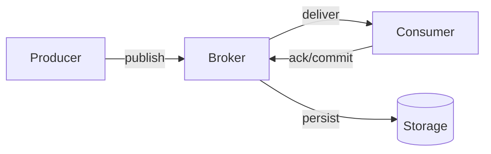
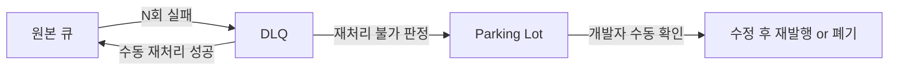

# Message Queue 심화: RabbitMQ vs Kafka vs SQS

## 들어가며

3개 브로커를 다 운영해 본 경험에서 얻은 결론부터 쓰면, 전달 보증과 순서 보장은 브로커가 공짜로 해주는 게 아니라 **프로듀서·컨슈머·설정 세 곳에서 같은 계약을 지켜야 완성**된다. 그리고 결국 어느 브로커를 써도 `at-least-once`에 **멱등 처리**를 얹어서 운영하는 패턴으로 수렴한다.

이 문서는 세 브로커를 나란히 놓고 다음 네 가지 축에서 차이를 정리한다.

- 전달 보증: at-most-once / at-least-once / exactly-once
- 순서 보장: FIFO, 파티션, Single Active Consumer
- DLQ 설계: redrive policy, parking lot, poison message
- 멱등성: Idempotent Producer, inbox pattern, dedup key

Message_Queue.md는 Kafka ↔ RabbitMQ 2자 비교만 있어서 SQS가 빠져 있는데, 실제로는 AWS 기반 서비스라면 SQS를 먼저 후보에 올리는 경우가 많다. 그래서 세 개를 같이 본다.

## 1. 세 브로커의 사고방식 차이

각 브로커가 "메시지 하나"를 바라보는 관점이 완전히 다르다. 이 차이를 이해하지 못하면 설정 항목 이름이 비슷해도 동작은 전혀 다르게 생각하게 된다.

### 1.1 RabbitMQ — 큐를 소비하면 사라진다

RabbitMQ는 전통적인 **스마트 브로커, 덤 컨슈머** 모델이다. Exchange가 라우팅을 담당하고, 큐는 메시지를 보관하며, 컨슈머가 ack를 주면 브로커가 큐에서 지운다. 큐 하나를 여러 컨슈머가 나눠 먹는(push 기반) 모델이고, 브로커가 컨슈머에게 메시지를 밀어넣는다.

중요한 건 **메시지가 큐를 떠나면 되돌릴 수 없다**는 점이다. requeue하거나 DLQ로 보내지 않는 한 소멸한다. 그래서 재처리가 필요한 시나리오라면 RabbitMQ보다 Kafka가 맞다.

### 1.2 Kafka — 로그를 읽는 위치만 기록한다

Kafka는 메시지가 **append-only 로그**로 디스크에 남고, 컨슈머가 자기 offset을 기록하면서 읽는다. 메시지를 "지운다"는 개념 자체가 기본 동작이 아니다. retention 기간이 지나거나 log compaction이 일어나야 사라진다.

같은 데이터를 여러 컨슈머 그룹이 각자 offset으로 읽을 수 있어서 **재처리, 시점 되감기, 이벤트 소싱**에 자연스럽게 맞는다. 대신 "작업 큐처럼 일 하나씩 나눠 가지기"는 살짝 어색하다. 파티션 수가 소비 병렬도의 상한이 된다.

### 1.3 SQS — 가시성 타임아웃이 모든 걸 결정한다

SQS는 AWS의 관리형 큐인데, 다른 둘과 가장 큰 차이는 **visibility timeout 기반 동작**이다. 컨슈머가 `ReceiveMessage`를 하면 메시지가 큐에서 사라지는 게 아니라, **일정 시간 다른 컨슈머에게 안 보이는 상태**가 된다. 그 시간 안에 `DeleteMessage`를 호출하지 않으면 다시 보이게 되고 다른 컨슈머가 받는다.

이 구조 때문에 SQS에서 중복은 거의 피할 수 없다. 컨슈머가 메시지를 잘 처리하고 DB 커밋까지 끝냈는데 DeleteMessage 호출이 네트워크 타임아웃으로 실패하면, 그 메시지는 visibility timeout이 지나고 다시 나타난다.

## 2. 전달 보증: 같은 단어, 다른 구현



전달 보증은 이 그림의 세 군데(publish, deliver, ack)에서 각각 손실과 중복이 발생할 수 있다는 걸 인정하는 데서 출발한다.

### 2.1 At-most-once — 실무에선 거의 안 쓴다

메시지 유실을 감수하는 모델이다. 로그 수집이나 메트릭처럼 1건이 사라져도 상관없는 경우에만 쓴다. Kafka에서는 `enable.auto.commit=true` + 짧은 commit interval + `acks=0` 같은 조합이고, RabbitMQ에서는 `autoAck=true`, SQS에서는 처리 전에 바로 삭제해 버리는 패턴이다. 대부분의 서비스에서는 선택지에서 제외된다.

### 2.2 At-least-once — 현실적인 기본값

실무에서 대부분의 비동기 파이프라인은 여기에 있다. 네트워크 타임아웃, 컨슈머 크래시, 중간에 재시작된 노드 같은 상황에서 **메시지가 여러 번 전달될 수 있음을 받아들이는** 모델이다.

**RabbitMQ at-least-once 계약**

프로듀서 쪽에서 `Publisher Confirms`를 켜고, 브로커 쪽에서 큐와 메시지를 모두 `durable`로 설정해야 한다. 컨슈머는 수동 ack를 쓴다.

```python
import pika

conn = pika.BlockingConnection(pika.ConnectionParameters('localhost'))
ch = conn.channel()
ch.confirm_delivery()
ch.queue_declare(queue='orders', durable=True)

try:
    ch.basic_publish(
        exchange='',
        routing_key='orders',
        body=payload,
        properties=pika.BasicProperties(delivery_mode=2),
        mandatory=True,
    )
except pika.exceptions.UnroutableError:
    # mandatory=True면 라우팅 실패 시 여기로 온다
    raise
```

컨슈머 쪽은 `auto_ack=False`로 두고, 처리가 성공한 뒤에만 `basic_ack`를 호출한다. 중간에 죽으면 브로커가 해당 메시지를 다른 컨슈머에게 다시 배달한다.

```python
def on_message(ch, method, properties, body):
    try:
        process(body)
        ch.basic_ack(delivery_tag=method.delivery_tag)
    except RetryableError:
        ch.basic_nack(delivery_tag=method.delivery_tag, requeue=True)
    except FatalError:
        ch.basic_nack(delivery_tag=method.delivery_tag, requeue=False)  # DLQ로

ch.basic_qos(prefetch_count=10)
ch.basic_consume(queue='orders', on_message_callback=on_message)
```

한 번씩 만나는 함정은 `prefetch_count`를 안 걸어두면 컨슈머 하나가 큐의 메시지를 싹쓸이해서 들고 있다가, 그 컨슈머가 죽을 때 모든 메시지가 한꺼번에 requeue되는 상황이다. 장애 복구 초반에 큐가 피크를 찍는 이유가 대부분 이거다.

**Kafka at-least-once 계약**

프로듀서는 `acks=all`, `retries=Integer.MAX_VALUE`, `max.in.flight.requests.per.connection`을 1 또는 5(+ idempotent)로 둔다. 브로커는 `min.insync.replicas=2` 이상. 컨슈머는 `enable.auto.commit=false`로 두고 처리 후 수동 커밋한다.

```java
Properties p = new Properties();
p.put("bootstrap.servers", "kafka:9092");
p.put("acks", "all");
p.put("retries", Integer.MAX_VALUE);
p.put("enable.idempotence", true);
p.put("max.in.flight.requests.per.connection", 5);

KafkaProducer<String, String> producer = new KafkaProducer<>(p);
producer.send(new ProducerRecord<>("orders", orderId, json), (meta, ex) -> {
    if (ex != null) {
        log.error("publish failed, offset={}, partition={}", meta.offset(), meta.partition(), ex);
    }
});
```

컨슈머에서 자주 실수하는 지점은 **커밋 타이밍**이다. `poll()`로 가져온 레코드들을 처리하기 전에 auto-commit이 돌아버리면, 처리가 실패해도 offset이 앞으로 가 버려서 메시지가 유실된다. 반대로 처리 후 커밋 사이에 죽으면 중복이 생긴다. at-least-once를 지키려면 **처리 → 커밋** 순서를 반드시 유지해야 한다.

**SQS at-least-once 계약**

SQS는 설정 없이도 기본적으로 at-least-once다. 오히려 exactly-once로 가는 게 FIFO 큐에서만 가능한 별도 옵션이다. 표준 큐는 중복과 순서 뒤집힘 둘 다 일상이다.

```python
import boto3

sqs = boto3.client('sqs')
QUEUE_URL = '...'

while True:
    resp = sqs.receive_message(
        QueueUrl=QUEUE_URL,
        MaxNumberOfMessages=10,
        WaitTimeSeconds=20,          # long polling
        VisibilityTimeout=60,
    )
    for msg in resp.get('Messages', []):
        try:
            process(msg['Body'])
            sqs.delete_message(
                QueueUrl=QUEUE_URL,
                ReceiptHandle=msg['ReceiptHandle'],
            )
        except Exception:
            # delete 안 하면 visibility timeout 후 자동 재시도
            log.exception("processing failed")
```

SQS에서 가장 흔한 이슈는 **visibility timeout이 처리 시간보다 짧은 경우**다. 예를 들어 처리에 90초 걸리는 작업인데 visibility timeout이 60초면, 작업이 아직 끝나기 전에 메시지가 다시 보이게 되고 다른 워커가 동시에 같은 메시지를 처리한다. 결과적으로 중복 실행이 일어난다.

```python
# 처리 중 주기적으로 visibility 연장
def heartbeat(queue_url, receipt_handle, extend_sec=60):
    sqs.change_message_visibility(
        QueueUrl=queue_url,
        ReceiptHandle=receipt_handle,
        VisibilityTimeout=extend_sec,
    )
```

오래 걸리는 작업에는 heartbeat 패턴이 필수다.

### 2.3 Exactly-once — 말은 쉬운데 실은 조건부

"정확히 한 번"은 **브로커 내부**에서 달성되더라도 **브로커 바깥의 사이드이펙트**까지 정확히 한 번인지는 별개 문제다. 이메일 발송, 결제 API 호출 같은 외부 시스템은 브로커의 트랜잭션 범위 밖이다. 이 사실을 놓치고 "exactly-once 모드를 켰으니 끝"이라고 생각하면 장애 때 중복 메일이 간다.

**Kafka의 exactly-once 세미틱스(EOS)**

Kafka는 두 가지를 묶어서 EOS를 제공한다.

- `enable.idempotence=true` — 프로듀서가 같은 메시지를 여러 번 보내도 브로커가 중복을 제거(PID + sequence number 기반)
- 트랜잭션 API — `initTransactions`, `beginTransaction`, `sendOffsetsToTransaction`, `commitTransaction`으로 **"읽고 처리하고 쓰는"** 작업을 원자적으로 묶음

이건 **Kafka → 처리 → Kafka** 파이프라인에서만 순수한 EOS가 성립한다. Kafka Streams가 여기에 해당한다. DB에 쓰는 경우에는 2PC가 아니라서 DB 커밋과 Kafka 커밋이 어긋날 수 있다. 그래서 실무에서는 EOS 대신 at-least-once + 멱등 처리로 가는 경우가 많다.

**SQS의 exactly-once(FIFO 큐 한정)**

SQS FIFO 큐는 5분 deduplication window 안에서 같은 `MessageDeduplicationId`의 중복 publish를 무시한다. 5분이 넘어가면 다시 받는다. 진짜 exactly-once라기보단 **"5분짜리 중복 제거 창"**이 있는 at-least-once로 보는 게 정확하다.

**RabbitMQ의 exactly-once**

RabbitMQ는 exactly-once 세미틱스를 공식적으로 제공하지 않는다. 프로듀서 쪽은 Publisher Confirms로 유실만 막고, 컨슈머 쪽은 ack로 유실만 막는다. 중복은 애플리케이션 레벨 멱등 처리로 해결해야 한다.

### 2.4 비교표

| 항목 | RabbitMQ | Kafka | SQS |
|------|----------|-------|-----|
| 기본 배달 보증 | At-most-once (autoAck) | At-least-once | At-least-once |
| 유실 방지 프로듀서 | Publisher Confirms | `acks=all` + `min.insync.replicas` | API 응답 200으로 확인 |
| 유실 방지 컨슈머 | Manual ack | Manual offset commit | 처리 후 DeleteMessage |
| 중복 방지 (브로커) | 없음 | Idempotent Producer + 트랜잭션 | FIFO 큐 5분 dedup window |
| Exactly-once 범위 | N/A | Kafka 내부 파이프라인만 | FIFO 큐 5분 내 publish만 |
| 현실적 운영 모드 | at-least-once + 멱등 | at-least-once + 멱등 | at-least-once + 멱등 |

결국 **셋 다 at-least-once에 멱등 처리**가 답이다.

## 3. 순서 보장

순서 보장은 전달 보증보다 더 까다롭다. 순서를 지키려면 대부분 **병렬성을 희생**해야 하기 때문이다. 모든 메시지를 한 줄로 세우면 처리량이 하나의 컨슈머에 묶인다.

### 3.1 RabbitMQ — 큐 하나 + 컨슈머 하나

RabbitMQ는 하나의 큐에 컨슈머가 여러 개 붙으면 브로커가 round-robin으로 메시지를 뿌린다. 이 순간 순서는 깨진다. 특정 주문의 이벤트를 순서대로 처리하고 싶다면 두 가지 중 하나다.

- 큐를 **엔티티별로 쪼갠다**(예: `orders.user.{user_id % 32}`) — 샤딩
- **Single Active Consumer**로 큐당 하나의 컨슈머만 실제로 처리하게 한다(3.8 이상)

Single Active Consumer는 여러 컨슈머가 큐에 붙더라도 한 놈만 `active` 상태가 되고 나머지는 대기한다. active가 죽으면 그 중 하나가 승격된다. 순서는 지키되 고가용성은 챙기는 구조다. 단, 처리량은 단일 컨슈머 속도로 제한된다.

```python
# Single Active Consumer 선언
ch.queue_declare(
    queue='orders.user.42',
    durable=True,
    arguments={'x-single-active-consumer': True},
)
```

### 3.2 Kafka — 파티션 키가 전부

Kafka의 순서 보장은 **파티션 내부**에서만이다. 같은 키의 메시지가 같은 파티션으로 가도록 해시되므로, **키를 `order_id`나 `user_id`로 지정**하면 해당 엔티티 단위의 순서가 지켜진다.

```java
producer.send(new ProducerRecord<>("order-events", orderId, event));
// orderId가 파티션 키가 된다
```

주의할 점:

1. **파티션 수를 바꾸면 해시 결과가 달라진다.** 운영 중에 파티션을 늘리면 새 메시지는 다른 파티션으로 갈 수 있고, 한동안 같은 key의 메시지가 서로 다른 파티션에 흩어져서 순서가 깨진다.
2. `max.in.flight.requests.per.connection > 1`이고 `enable.idempotence=false`인 상태에서 재시도가 일어나면 파티션 내부 순서도 깨진다. idempotent producer를 켜야 이게 보장된다.
3. 컨슈머 쪽에서 멀티스레드로 파티션 안의 메시지를 병렬 처리해 버리면 순서가 깨진다. **파티션 1개 = 스레드 1개** 원칙을 지켜야 한다.

### 3.3 SQS — 표준 큐는 순서 없음, FIFO 큐는 MessageGroupId 단위

SQS 표준 큐는 **순서를 아예 보장하지 않는다**. 심지어 먼저 보낸 메시지가 나중에 도착하는 일도 일상이다. 순서가 중요한 비즈니스라면 반드시 FIFO 큐를 써야 한다.

FIFO 큐의 순서 보장 단위는 `MessageGroupId`다. 같은 group 안에서는 순서가 지켜지고, 서로 다른 group은 병렬로 처리된다. 이 구조 덕분에 **"엔티티별 순서"와 "전체 병렬성"을 동시에** 얻을 수 있다.

```python
sqs.send_message(
    QueueUrl=FIFO_QUEUE_URL,
    MessageBody=json.dumps(event),
    MessageGroupId=str(order_id),
    MessageDeduplicationId=f"{order_id}:{event_seq}",
)
```

FIFO 큐 제약:

- 처리량 상한: 초당 300 메시지(기본), batch 사용 시 3,000. high throughput 모드는 그 이상.
- MessageGroupId가 너무 적으면 병렬성이 떨어진다. 반대로 너무 많으면 순서 보장의 의미가 약해진다.
- 그룹 안에서 메시지가 `in-flight` 상태로 묶여 있으면, 그 그룹의 다음 메시지는 앞 메시지가 Delete되기 전까지 **다른 컨슈머도 가져갈 수 없다**. 하나가 막히면 해당 group이 전부 막힌다.

### 3.4 비교표

| 순서 보장 방식 | RabbitMQ | Kafka | SQS |
|---------------|----------|-------|-----|
| 보장 단위 | 큐 + Single Active Consumer | 파티션 (key 기반) | FIFO 큐 MessageGroupId |
| 병렬성 | 큐 샤딩으로 확보 | 파티션 수만큼 | MessageGroupId 수만큼 |
| 순서가 깨지는 대표 케이스 | 멀티 컨슈머, requeue | 재시도 + in-flight>1, 파티션 재조정 | 표준 큐, in-flight 상태 |
| 처리량 제약 | 샤딩 설계에 의존 | 파티션 수 = 병렬도 상한 | 그룹당 초당 300 (기본 FIFO) |

## 4. Dead Letter Queue 설계

DLQ는 "실패한 메시지를 담아두는 곳"이라는 단순한 정의 뒤에 놓치기 쉬운 설계 포인트가 많다. 몇 번 실패하면 DLQ로 보낼지, DLQ에 쌓인 메시지를 누가 언제 다시 볼지, 영원히 쌓이게 둘지.

### 4.1 Poison Message와 재시도 폭주

가장 흔한 사고는 **독성 메시지**(poison message)가 재시도 루프에서 무한히 돌면서 다른 메시지의 처리를 막는 경우다. 역직렬화 실패나 null 필드 같은 **절대 성공하지 못할** 메시지가 있다. 이걸 즉시 걸러내서 DLQ로 보내지 않으면, 같은 메시지가 브로커 ↔ 컨슈머 사이를 수백 번 왕복하면서 로그를 가득 채우고 CPU를 태운다.

재시도 정책은 대략 이런 모양이 된다.

1. 일시적 에러(네트워크, DB 락) → 재시도 가능, 지수 백오프
2. 영구적 에러(스키마 불일치, 필수 필드 누락) → 즉시 DLQ
3. 최대 재시도 횟수 초과 → DLQ

### 4.2 RabbitMQ DLQ — Dead Letter Exchange

RabbitMQ는 큐에 `x-dead-letter-exchange` 인자를 걸면 다음 세 가지 경우에 메시지가 DLX로 라우팅된다.

- `basic.reject` 또는 `basic.nack`을 `requeue=false`로 호출
- TTL 만료
- 큐 길이 제한 초과

```python
# 원본 큐 선언 시 DLX 지정
ch.queue_declare(
    queue='orders',
    durable=True,
    arguments={
        'x-dead-letter-exchange': 'orders.dlx',
        'x-dead-letter-routing-key': 'orders.dead',
        'x-message-ttl': 60000,          # 60초 후 DLQ로 (일시 지연 재시도용으로도 활용)
    },
)

# DLX와 DLQ는 별도로 선언
ch.exchange_declare(exchange='orders.dlx', exchange_type='direct', durable=True)
ch.queue_declare(queue='orders.dead', durable=True)
ch.queue_bind(exchange='orders.dlx', queue='orders.dead', routing_key='orders.dead')
```

RabbitMQ는 브로커가 재시도 횟수를 세어주지 않기 때문에, 메시지 헤더에 `x-death` 배열이 누적되는 걸 직접 확인해서 판단해야 한다. 매 실패마다 `x-death`에 1건씩 추가된다.

```python
def should_dlq(properties):
    death = (properties.headers or {}).get('x-death', [])
    total = sum(d.get('count', 0) for d in death)
    return total >= 5
```

지연 재시도는 TTL + DLX 체인을 써서 구현한다. "60초 뒤 재처리" 같은 걸 하려면 대기용 큐를 하나 만들어 TTL을 걸고, 만료되면 원본 Exchange로 돌아가게 DLX를 설정한다.

### 4.3 Kafka DLQ — 토픽 이름 컨벤션

Kafka는 DLQ라는 내장 기능이 없다. 컨슈머 애플리케이션이 실패 시 **별도의 dead-letter 토픽으로 publish**하는 패턴이 표준이다. 보통 Spring Kafka의 `DeadLetterPublishingRecoverer`나 Kafka Connect의 `errors.deadletterqueue.topic.name` 설정을 쓴다.

```java
DeadLetterPublishingRecoverer recoverer = new DeadLetterPublishingRecoverer(
    kafkaTemplate,
    (record, ex) -> new TopicPartition(record.topic() + ".DLT", record.partition())
);

DefaultErrorHandler errorHandler = new DefaultErrorHandler(
    recoverer,
    new ExponentialBackOff(1000L, 2.0)  // 1s, 2s, 4s, ...
);
errorHandler.addNotRetryableExceptions(DeserializationException.class);
```

Kafka DLQ 설계에서 주의할 점:

- **원본 헤더와 에러 메타데이터를 보존**해야 한다. 재처리할 때 원본 topic, partition, offset, exception class, stacktrace가 없으면 디버깅이 어렵다.
- DLT 토픽은 **파티션 수를 원본과 동일하게** 두는 게 편하다. 같은 key로 라우팅되면 재처리 시 순서가 보존된다.
- DLT의 retention을 원본보다 길게 잡는다. 원본이 7일이면 DLT는 30일 이상.

### 4.4 SQS DLQ — Redrive Policy

SQS는 DLQ가 1급 기능이다. 원본 큐에 `RedrivePolicy`를 설정하면 `maxReceiveCount`를 넘긴 메시지가 자동으로 DLQ로 이동한다. 여기서 "receive count"는 메시지가 몇 번 받아졌는지가 아니라 **visibility timeout이 몇 번 만료됐는지**를 센다는 점을 이해해야 한다.

```python
sqs.set_queue_attributes(
    QueueUrl=ORDERS_QUEUE_URL,
    Attributes={
        'RedrivePolicy': json.dumps({
            'deadLetterTargetArn': DLQ_ARN,
            'maxReceiveCount': '5',
        }),
    },
)
```

SQS는 2021년부터 **DLQ Redrive**라는 관리 콘솔 기능이 생겨서 DLQ → 원본 큐로 메시지를 되돌리는 작업도 CLI/콘솔에서 바로 된다. 이전에는 직접 스크립트를 짜야 했다.

```bash
aws sqs start-message-move-task \
    --source-arn arn:aws:sqs:us-east-1:123:orders-dlq \
    --destination-arn arn:aws:sqs:us-east-1:123:orders
```

### 4.5 Parking Lot Queue 패턴

DLQ까지 간 메시지 중에서도 **사람의 판단이 필요한 것**들을 따로 모으는 큐를 parking lot이라고 부른다. DLQ는 자동 재시도 실패한 메시지가 모이는 곳인데, 여기서도 코드 수정 없이는 성공할 수 없는 메시지가 섞여 있다. 이런 걸 parking lot으로 한 번 더 분리해 두면 DLQ의 재처리가 깔끔해진다.

전형적인 흐름은 이렇다.



파킹 랏은 retention을 충분히 길게(30~90일) 잡고, 알람을 건다. DLQ의 나이가 오래되면 자동으로 파킹 랏으로 옮기는 배치를 돌리는 팀도 있다.

### 4.6 DLQ 운영 주의사항

- **DLQ에 알람 없는 DLQ는 블랙홀**이다. 적어도 "DLQ 메시지 수 > 0" 또는 "DLQ 최고 나이 > 10분" 같은 경보를 걸어둔다.
- **DLQ의 DLQ는 만들지 마라.** 체인이 길어지면 모두가 추적을 포기한다. DLQ → Parking Lot 정도에서 멈춘다.
- DLQ에 쌓인 메시지를 재처리할 때는 **원본 큐의 컨슈머가 버그가 고쳐진 버전**인지 반드시 먼저 확인한다. 안 고쳐진 상태에서 되돌리면 다시 DLQ로 간다.
- DLQ 메시지의 **payload를 기록·검색 가능한 저장소**(S3, Elasticsearch)에도 동시에 저장해 두면 디버깅이 빠르다.

## 5. 멱등성 처리

전달 보증이 at-least-once로 수렴한다는 건, **중복 처리를 컨슈머가 견뎌야 한다**는 뜻이다. 멱등성은 선택이 아니라 기본 설계다.

### 5.1 Dedup Key 기반

가장 단순하고 강력한 방법이다. 메시지에 **변하지 않는 고유 ID**를 부여하고, 컨슈머는 처리 전에 "이 ID를 이미 처리했는가?"를 확인한다.

```python
def handle(message):
    msg_id = message['id']
    with db.transaction():
        inserted = db.execute(
            "INSERT INTO processed_messages(id, processed_at) VALUES (%s, NOW()) "
            "ON CONFLICT (id) DO NOTHING RETURNING id",
            (msg_id,),
        ).fetchone()
        if inserted is None:
            return  # 이미 처리됨, 조용히 무시
        apply_business_logic(message)
```

`INSERT ... ON CONFLICT DO NOTHING`이 멱등성의 핵심이다. 이 한 줄 덕분에 동시에 같은 메시지가 두 번 들어와도 한 번만 처리된다.

주의할 점:

- `processed_messages` 테이블은 **본 처리 테이블과 같은 트랜잭션**에 포함돼야 한다. 분리하면 커밋 순서에 따라 중복 또는 유실이 생긴다.
- `msg_id`는 **비즈니스가 부여**해야 한다. 브로커가 주는 message ID는 재발행 시마다 바뀌는 경우가 많아서 쓰면 안 된다. 예: `order_id:version` 또는 UUIDv7.
- 테이블 크기가 계속 커진다. 주기적으로 오래된 ID를 파티션 드롭 방식으로 정리한다. 최소 retention은 "재시도가 가능한 최대 기간"보다 길게.

### 5.2 Inbox Pattern

outbox pattern의 반대쪽이다. 컨슈머가 받은 메시지를 **먼저 inbox 테이블에 저장**하고, 트랜잭션 안에서 비즈니스 로직을 실행한 뒤 커밋한다. inbox 저장이 충돌하면(같은 ID가 이미 있으면) 처리를 건너뛴다.

```sql
BEGIN;
INSERT INTO inbox(message_id, received_at, payload)
VALUES ($1, NOW(), $2)
ON CONFLICT (message_id) DO NOTHING;

-- 충돌로 영향받은 행이 0이면 이미 처리된 메시지
-- 영향받은 행이 1이면 이번이 처음, 비즈니스 로직 실행
UPDATE orders SET status = 'paid' WHERE id = $3;
INSERT INTO audit_log ...;
COMMIT;
```

Inbox는 5.1의 변형인데, **메시지 원본을 보존**한다는 차이가 있다. 나중에 장애 조사할 때 원본 payload가 남아 있으니 편하다. 대신 스토리지 비용이 붙는다.

### 5.3 자연 멱등성

가장 이상적인 건 **비즈니스 연산 자체가 멱등**인 경우다. "상태를 paid로 변경"은 몇 번을 실행해도 결과가 같다. "잔고에서 1000원 차감"은 멱등이 아니다. 후자를 멱등으로 바꾸려면 "트랜잭션 ID가 T123인 차감 적용"처럼 **연산의 식별자를 함께 보관**하는 구조가 필요하다.

```sql
-- 잔고 차감을 멱등으로 만들기
INSERT INTO ledger_transactions(tx_id, account_id, amount, created_at)
VALUES ($1, $2, -1000, NOW())
ON CONFLICT (tx_id) DO NOTHING;

-- 잔고는 원장을 집계해서 구함 (또는 트리거로 반영)
```

### 5.4 브로커별 중복 방지 보조 기능

**Kafka Idempotent Producer**

`enable.idempotence=true`를 켜면 브로커가 `(producer_id, sequence_number)` 단위로 중복을 감지해서 거른다. 이건 **프로듀서 측 재시도로 인한 중복**만 막는다. 컨슈머 처리 레벨의 중복은 관여하지 않는다.

```java
props.put("enable.idempotence", true);
// 자동으로 acks=all, max.in.flight=5, retries=Integer.MAX_VALUE가 됨
```

**SQS FIFO Deduplication**

`MessageDeduplicationId`가 같은 메시지를 5분간 거른다. 내용 기반 중복 제거(`ContentBasedDeduplication=true`)도 가능한데, 이건 body의 SHA-256 해시를 키로 쓴다. body에 타임스탬프 같은 게 들어 있으면 dedup이 안 되니 주의.

**RabbitMQ**

브로커 차원의 중복 제거는 없다. 애플리케이션에서 풀어야 한다.

### 5.5 분산 락을 남용하지 않기

동시성이 걱정되면 Redis 분산 락으로 "같은 메시지 ID가 처리 중이면 기다려"를 구현하고 싶어진다. 하지만 이건 안티패턴이다. 락 획득 실패 시 재큐잉하면 루프가 돌고, 락 TTL이 처리 시간보다 짧으면 락이 의미 없어진다. DB의 unique constraint가 멱등성을 제공하면 락이 필요 없다. 가능한 한 **DB의 원자적 제약조건**으로 해결한다.

## 6. 브로커 선택 기준

정답은 없지만, 의사결정 축은 꽤 명확하다.

### 6.1 질문 순서

1. **메시지를 나중에 다시 읽을 일이 있는가?** 있다면 Kafka. 이벤트 소싱, 신규 컨슈머 추가, 장애 후 재처리, 분석 파이프라인 등.
2. **AWS 생태계 안에서만 돌고, 직접 운영 부담을 피하고 싶은가?** SQS. Lambda 트리거와의 통합이 압도적으로 편하다.
3. **복잡한 라우팅(topic exchange, header exchange, fanout)이 필요한가?** RabbitMQ. 3개 중 라우팅 유연성은 RabbitMQ가 가장 좋다.
4. **처리량이 초당 수십만 건 이상인가?** Kafka. 다른 둘도 가능하긴 한데 비용과 튜닝 부담이 급격히 커진다.
5. **작업 큐인데 순서가 중요한가?** SQS FIFO 또는 RabbitMQ(Single Active Consumer).

### 6.2 구체적 케이스

| 상황 | 선택 | 이유 |
|------|------|------|
| 결제 이벤트 → 여러 하위 시스템(회계, 알림, 통계)에 fan-out | Kafka | 각 컨슈머가 자기 페이스로 읽고, 신규 컨슈머 추가 쉬움 |
| 이메일 발송 job queue | SQS 또는 RabbitMQ | 단순 작업 분배. SQS가 운영 편함 |
| 주문 상태 변경을 순서대로 정확히 반영 | Kafka (key=order_id) 또는 SQS FIFO | 엔티티별 순서 보장 |
| 규칙 기반 라우팅(VIP 유저 → 전용 큐) | RabbitMQ | topic/header exchange로 선언적 라우팅 |
| IoT 수백만 디바이스 telemetry 수집 | Kafka | 고처리량 + 장기 보관 |
| 서버리스 파이프라인 (Lambda 트리거) | SQS | Lambda ↔ SQS 연동이 가장 매끄러움 |
| 다중 리전에 데이터센터 걸쳐서 이벤트 공유 | Kafka (MirrorMaker) | cross-region replication 성숙도 |

### 6.3 세 개를 섞어 쓰는 경우

큰 조직에서는 셋을 다 쓴다. Kafka로 이벤트 백본을 깔고, 특정 작업 큐는 SQS나 RabbitMQ로 내려보낸다. Kafka 컨슈머가 처리하다가 비동기 작업이 필요하면 SQS로 밀고, 결과는 다시 Kafka로 올리는 식이다. 이때 각 단계마다 멱등성을 유지하는 게 핵심이다.

## 7. 실전 트러블슈팅 시나리오

### 7.1 "메시지가 사라진 것 같다"

유실 조사는 **publish → 브로커 수신 → 컨슈머 수신 → 처리** 네 지점에서 로그/메트릭을 찍어야 한다.

- Kafka: 프로듀서에서 `metadata.offset`과 `partition`을 로그에 남긴다. 컨슈머에서 `poll()` 직후 수신 로그, 처리 전후 로그, 커밋 후 로그를 남긴다. 유실이 의심되면 `kafka-console-consumer --from-beginning`으로 해당 offset이 실제로 존재하는지 확인.
- RabbitMQ: Publisher Confirms가 꺼져 있으면 publish 성공 여부 자체를 프로듀서가 모른다. 먼저 Confirms를 켠다. `rabbitmqctl list_queues name messages_ready messages_unacknowledged`로 큐 상태 확인.
- SQS: CloudWatch에서 `NumberOfMessagesSent`, `NumberOfMessagesReceived`, `NumberOfMessagesDeleted`의 차이를 본다. 받은 수와 삭제한 수의 차이가 크면 visibility timeout 문제.

### 7.2 "중복 처리가 생긴다"

컨슈머 ack/commit/delete 타이밍을 먼저 본다.

- Kafka: `enable.auto.commit`이 켜진 상태에서 poll 간격이 긴 작업이면, 처리 도중 rebalance가 일어나면서 중복이 생긴다. 수동 커밋으로 바꾸고 `max.poll.records`, `max.poll.interval.ms`를 조정.
- SQS: visibility timeout < 처리 시간이 가장 흔한 원인. heartbeat으로 늘리거나 배치 크기를 줄인다.
- RabbitMQ: prefetch가 너무 크면 컨슈머 장애 시 대량 requeue로 중복 폭증. prefetch를 10~50 수준으로 유지.

### 7.3 "DLQ가 갑자기 쌓인다"

- 최근 배포가 있었는지 먼저 확인. 역직렬화 변경이 가장 흔하다.
- DLQ의 앞쪽 몇 개 메시지를 꺼내서 payload와 에러를 본다. 패턴이 보이면 대응이 쉽다.
- DLQ 증가율이 원본 큐 처리량의 1%를 넘으면 즉시 조사. 5%를 넘으면 원본 큐 컨슈머를 멈추고 근본 원인 해결이 우선.

### 7.4 "순서가 깨졌다"

- Kafka: 프로듀서 로그에서 재시도가 일어났는지 본다. `enable.idempotence=false`에 `max.in.flight > 1`이면 재시도 중 순서가 뒤집힌다. 최근 파티션 수를 바꿨는지도 확인.
- SQS: 표준 큐를 쓰고 있다면 설계 단계 문제. FIFO 큐로 이관하거나 컨슈머에서 순서 복원 로직을 추가.
- RabbitMQ: 컨슈머가 여러 개 붙어 있는지 확인. Single Active Consumer로 전환하거나 큐 샤딩.

## 8. 정리

- 셋 다 결국 **at-least-once + 멱등 처리**로 수렴한다. exactly-once는 브로커 내부 파이프라인에 국한된 개념이다.
- 순서 보장은 **병렬성과의 트레이드오프**다. Kafka는 파티션 키, SQS는 MessageGroupId, RabbitMQ는 Single Active Consumer 또는 샤딩이 답이다.
- DLQ는 **알람이 걸려 있을 때만** 의미가 있다. 블랙홀 DLQ는 없는 것보다 위험하다.
- 멱등성은 가능한 한 **DB의 unique constraint**로 해결한다. 분산 락은 최후의 수단이다.
- 브로커 선택은 "재처리 필요성", "운영 부담", "라우팅 복잡도", "처리량" 네 축으로 판단한다.
