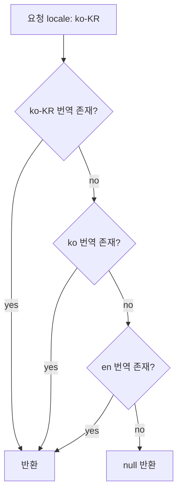

# 다국어 콘텐츠 DB 저장

## 언어 코드 표준

Translation 테이블을 설계하기 전에 언어 코드 형식부터 정해야 한다. 나중에 바꾸면 데이터 마이그레이션이 생긴다.

BCP 47이 사실상 표준이다. ISO 639-1 2자리 코드만 쓰는 방식(`ko`, `en`, `ja`)과 지역 코드를 붙이는 방식(`ko-KR`, `en-US`, `zh-TW`)이 있다. 지역 코드를 쓰면 `en-US`와 `en-GB`를 별도 번역으로 관리할 수 있는데, 실제로 이 수준의 구분이 필요한 서비스는 많지 않다. 처음에는 `ko`, `en` 수준으로 시작하고 실제로 필요할 때 확장하는 편이 낫다.

DB 컬럼은 넉넉하게 잡아둔다. BCP 47 최대 길이를 고려하면 10자 정도면 충분하다.

```sql
locale VARCHAR(10) NOT NULL  -- 'ko', 'en', 'ko-KR', 'zh-Hant-TW' 등
```

입력 단계에서 정규화를 빠뜨리면 `ko`, `KO`, `ko_KR`, `ko-KR`이 섞여서 같은 콘텐츠가 여러 언어로 조각나 저장된다. 저장 전에 소문자 변환과 언더스코어 → 하이픈 치환을 반드시 거쳐야 한다.

```java
private String normalizeLocale(String locale) {
    if (locale == null) return "en";
    // ko_KR → ko-KR, KO → ko
    String normalized = locale.replace('_', '-').toLowerCase(Locale.ROOT);
    String[] parts = normalized.split("-");
    if (parts.length == 2) {
        return parts[0] + "-" + parts[1].toUpperCase(Locale.ROOT);
    }
    return normalized;
}
```

## DB 저장 패턴 3가지

### Translation Table 패턴

메인 엔티티 테이블과 번역 테이블을 분리하는 방식이다. 다국어 서비스에서 가장 많이 쓰인다.

```sql
CREATE TABLE products (
    id         BIGINT         PRIMARY KEY AUTO_INCREMENT,
    sku        VARCHAR(100)   NOT NULL UNIQUE,
    price      DECIMAL(10, 2) NOT NULL,
    created_at DATETIME       NOT NULL DEFAULT CURRENT_TIMESTAMP
) ENGINE=InnoDB DEFAULT CHARSET=utf8mb4 COLLATE=utf8mb4_unicode_ci;

CREATE TABLE product_translations (
    id            BIGINT       PRIMARY KEY AUTO_INCREMENT,
    product_id    BIGINT       NOT NULL,
    locale        VARCHAR(10)  NOT NULL,
    name          VARCHAR(255) NOT NULL,
    description   TEXT,
    status        ENUM('draft', 'review', 'published') NOT NULL DEFAULT 'draft',
    translated_by VARCHAR(100),
    translated_at DATETIME,
    UNIQUE KEY uq_product_locale (product_id, locale),
    KEY idx_locale (locale),
    KEY idx_locale_status (locale, status),
    FOREIGN KEY (product_id) REFERENCES products(id) ON DELETE CASCADE
) ENGINE=InnoDB DEFAULT CHARSET=utf8mb4 COLLATE=utf8mb4_unicode_ci;
```

번역 가능한 컬럼과 그렇지 않은 컬럼이 명확히 분리된다. 새 언어를 추가할 때 스키마 변경 없이 행만 INSERT하면 된다. 특정 언어의 번역 현황을 쿼리하기도 쉽다.

단점은 조회할 때마다 JOIN이 필요하고, N+1 문제가 생기기 매우 쉽다는 것이다.

번역 현황 집계 쿼리는 이 패턴에서만 깔끔하게 나온다.

```sql
-- 한국어 번역이 없는 상품 목록
SELECT p.id, p.sku
FROM products p
WHERE NOT EXISTS (
    SELECT 1 FROM product_translations t
    WHERE t.product_id = p.id AND t.locale = 'ko'
);

-- 언어별 번역 현황
SELECT
    locale,
    COUNT(*)                                           AS translated,
    COUNT(*) FILTER (WHERE status = 'published')       AS published
FROM product_translations
GROUP BY locale;
```

MySQL에는 `FILTER` 절이 없으므로 `SUM(CASE WHEN status = 'published' THEN 1 ELSE 0 END)`로 대체한다.

번역팀이 개입하는 서비스에서는 상태 기반 모니터링 쿼리가 운영 도구로 쓰인다.

```sql
-- MySQL: 언어별 번역 상태 현황
SELECT
    locale,
    SUM(status = 'draft')     AS draft_count,
    SUM(status = 'review')    AS review_count,
    SUM(status = 'published') AS published_count,
    COUNT(*)                  AS total,
    ROUND(SUM(status = 'published') * 100.0 / COUNT(*), 1) AS published_pct
FROM product_translations
GROUP BY locale
ORDER BY locale;

-- 48시간 이상 review 상태로 멈춰 있는 번역 (검토 지연 감지)
SELECT
    product_id,
    locale,
    name,
    translated_by,
    translated_at
FROM product_translations
WHERE status = 'review'
  AND translated_at < NOW() - INTERVAL 48 HOUR
ORDER BY translated_at ASC
LIMIT 50;

-- 서비스에 노출할 published 번역이 없는 상품 (ko 기준)
SELECT DISTINCT p.id, p.sku
FROM products p
LEFT JOIN product_translations t
    ON t.product_id = p.id
   AND t.locale = 'ko'
   AND t.status = 'published'
WHERE t.product_id IS NULL;
```

`translated_at`이 NULL인 행이 있으면 review 체류 쿼리에 `AND translated_at IS NOT NULL` 조건을 추가해야 한다. 임포트된 번역이나 초기 데이터 마이그레이션 행에서 NULL이 들어오는 경우가 있다.

### JSONB 컬럼 방식

번역 데이터를 JSON으로 한 컬럼에 몰아넣는 방식이다. PostgreSQL의 JSONB가 대표적이다.

```sql
CREATE TABLE products (
    id           BIGINT         PRIMARY KEY GENERATED ALWAYS AS IDENTITY,
    sku          VARCHAR(100)   NOT NULL UNIQUE,
    price        DECIMAL(10, 2) NOT NULL,
    translations JSONB          NOT NULL DEFAULT '{}',
    created_at   TIMESTAMPTZ    NOT NULL DEFAULT now()
);

-- GIN 인덱스: 언어 존재 여부 필터링용
CREATE INDEX idx_products_translations_gin
    ON products USING GIN (translations);

-- 함수 인덱스: 한국어 이름으로 검색이 필요한 경우
CREATE INDEX idx_products_ko_name
    ON products ((translations -> 'ko' ->> 'name'));
```

저장 형태:
```json
{
  "ko": {"name": "무선 이어폰", "description": "고음질 블루투스 이어폰"},
  "en": {"name": "Wireless Earphone", "description": "High quality BT earphone"}
}
```

특정 언어만 추출하거나 조건 필터링할 때:

```sql
-- 단건 조회
SELECT id, translations -> 'ko' ->> 'name' AS name
FROM products
WHERE id = 1;

-- 한국어 번역이 없는 상품
SELECT id FROM products WHERE NOT (translations ? 'ko');

-- 한국어 번역이 있으면서 published 상태인 상품
-- (status를 JSONB 내부에 넣은 경우)
SELECT id FROM products
WHERE translations @> '{"ko": {"status": "published"}}';

-- 새 언어 추가 (기존 데이터는 유지하면서 ja 키만 추가)
UPDATE products
SET translations = translations || jsonb_build_object(
    'ja', jsonb_build_object('name', '...', 'description', '...')
)
WHERE id = 1;
```

단일 테이블 조회로 끝나고 스키마가 단순하다. MySQL 8.0의 JSON 타입은 이진 저장은 되지만 GIN 인덱스가 없어서 JSON 내부 키를 필터링하는 쿼리가 느리다. 이 방식은 PostgreSQL에서만 제대로 쓸 수 있다.

번역 현황 집계 쿼리가 EAV보다 불편하다는 단점이 있다.

```sql
-- JSONB에서 ko 번역 없는 상품 수 — 쿼리가 Translation Table보다 덜 직관적
SELECT COUNT(*) FROM products WHERE NOT (translations ? 'ko');
```

### 컬럼 분리 방식

언어별로 컬럼을 직접 만드는 방식이다.

```sql
CREATE TABLE products (
    id             BIGINT       PRIMARY KEY AUTO_INCREMENT,
    sku            VARCHAR(100) NOT NULL,
    name_ko        VARCHAR(255),
    name_en        VARCHAR(255),
    description_ko TEXT,
    description_en TEXT
);
```

지원 언어가 2~3개이고 앞으로도 늘어날 일이 없다고 확신하는 경우에만 고려할 수 있다. 새 언어 추가 시 `ALTER TABLE`이 필요하고, 언어가 늘어날수록 컬럼 수가 폭발한다. 번역 현황 집계도 불가능에 가깝다. 실무에서 이 방식을 선택하는 경우는 거의 없다.

### 패턴 비교

| 기준 | Translation Table | JSONB | 컬럼 분리 |
|---|---|---|---|
| 새 언어 추가 | 행 INSERT만 | 행 UPDATE만 | 스키마 변경 필요 |
| 조회 쿼리 복잡도 | JOIN 필요 | 단순 | 단순 |
| N+1 위험 | 높음 | 없음 | 없음 |
| 번역 현황 집계 | 쉬움 | 불편 | 불가능에 가까움 |
| 번역 상태 워크플로우 | 컬럼 추가로 처리 | JSON 내부 필드 | 구현 불가능 |
| MySQL 적합성 | 적합 | 비권장 | 적합 |
| PostgreSQL 적합성 | 적합 | 적합 | 비권장 |

## 스키마 선택 기준

패턴 비교 표만 보면 결정이 안 된다. 실제 선택 기준은 DB 종류, 서비스 특성, 운영 복잡도 세 가지로 좁힐 수 있다.

**DB 종류가 MySQL이면 Translation Table이 유일한 선택이다.** MySQL JSON 타입은 GIN 인덱스가 없어서 `WHERE translations ? 'ko'` 같은 쿼리가 풀 스캔으로 처리된다. 번역 테이블이 커지면 성능 문제가 생기지만, JSONB 방식보다는 낫다.

**PostgreSQL을 쓰고 번역 현황 관리나 번역 상태 워크플로우가 필요 없다면 JSONB가 낫다.** 조회 쿼리가 단순하고 ORM 레이어 코드도 줄어든다. N+1 걱정도 없다. 번역 담당팀 없이 개발팀 내부에서 직접 번역을 관리하는 규모라면 JSONB가 운영 부담이 적다.

**번역 상태 워크플로우(draft → review → published)가 필요하면 Translation Table을 선택해야 한다.** JSONB에서도 상태를 JSON 내부 필드로 넣을 수 있지만, 특정 상태의 번역을 집계하거나 번역 담당자를 추적하는 쿼리를 작성하기가 번거롭다.

**지원 언어가 10개 이상 늘어날 가능성이 있다면 Translation Table의 행 수 증가를 미리 계산해야 한다.** 콘텐츠 10만 건에 언어 10개면 번역 테이블이 최대 100만 행이다. 이 규모에서는 Redis 캐싱을 초기부터 고려해야 한다. JSONB는 테이블 행 수는 동일하게 유지되지만 한 행의 크기가 커진다.

**서비스 초기이고 지원 언어가 2개에서 시작한다면 Translation Table로 시작하고 나중에 JSONB로 마이그레이션하는 게 어렵지 않다.** 반대 방향(JSONB → Translation Table) 마이그레이션이 훨씬 복잡하다.

## MySQL: utf8 vs utf8mb4

MySQL에서 `utf8` 문자셋은 실제 UTF-8이 아니다. MySQL이 만든 변종으로 3바이트까지만 지원한다. 이모지나 일부 CJK 보충 문자처럼 4바이트가 필요한 유니코드를 저장하면 에러가 나거나 데이터가 잘린다. `utf8mb4`가 실제 UTF-8 완전 구현체다.

다국어 서비스라면 처음부터 `utf8mb4`를 써야 한다.

```sql
CREATE DATABASE mydb
    CHARACTER SET utf8mb4
    COLLATE utf8mb4_unicode_ci;

CREATE TABLE product_translations (
    id          BIGINT       PRIMARY KEY AUTO_INCREMENT,
    product_id  BIGINT       NOT NULL,
    locale      VARCHAR(10)  NOT NULL,
    name        VARCHAR(255) NOT NULL,
    description TEXT,
    UNIQUE KEY uq_product_locale (product_id, locale),
    FOREIGN KEY (product_id) REFERENCES products(id) ON DELETE CASCADE
) ENGINE=InnoDB DEFAULT CHARSET=utf8mb4 COLLATE=utf8mb4_unicode_ci;
```

Collation은 `utf8mb4_unicode_ci`를 권장한다. `utf8mb4_general_ci`보다 정확한 유니코드 비교를 한다. 대소문자 구분이 필요한 경우에만 `utf8mb4_bin`을 쓴다.

기존 테이블이 `utf8`로 생성되어 있다면 변환이 필요하다:

```sql
ALTER TABLE product_translations
    CONVERT TO CHARACTER SET utf8mb4 COLLATE utf8mb4_unicode_ci;
```

JDBC URL에도 인코딩을 명시해야 한다. 명시하지 않으면 드라이버 버전에 따라 연결 인코딩이 달라질 수 있다:

```
jdbc:mysql://host:3306/mydb?characterEncoding=UTF-8&useUnicode=true
```

MySQL 8.0부터는 기본 문자셋이 `utf8mb4`로 바뀌었다. 하지만 기존 레거시 DB를 운영 중이라면 서버 설정과 테이블 정의를 모두 확인해야 한다.

## Fallback 로직

사용자가 요청한 언어의 번역이 없을 때 처리 흐름이다.

```
ko-KR → ko → en → null
```



애플리케이션 레이어에서 처리하는 방식:

```java
public Optional<String> getTranslatedName(Long productId, String requestLocale) {
    List<String> chain = buildFallbackChain(requestLocale);
    Map<String, String> translations = translationRepository.findNamesByProductId(productId);

    return chain.stream()
        .map(translations::get)
        .filter(v -> v != null && !v.isBlank())
        .findFirst();
}

private List<String> buildFallbackChain(String locale) {
    List<String> chain = new ArrayList<>();
    chain.add(locale);                          // ko-KR

    if (locale.contains("-")) {                 // ko
        chain.add(locale.split("-")[0]);
    }

    if (!locale.startsWith("en")) {
        chain.add("en");                        // en
    }

    return chain;
}
```

DB에서 COALESCE로 처리하는 방식도 있다:

```sql
SELECT
    COALESCE(
        t_exact.name,
        t_lang.name,
        t_default.name
    ) AS name
FROM products p
LEFT JOIN product_translations t_exact
    ON t_exact.product_id = p.id AND t_exact.locale = 'ko-KR'
LEFT JOIN product_translations t_lang
    ON t_lang.product_id = p.id AND t_lang.locale = 'ko'
LEFT JOIN product_translations t_default
    ON t_default.product_id = p.id AND t_default.locale = 'en'
WHERE p.id = 1;
```

단건 조회라면 DB에서 처리해도 나쁘지 않다. 목록 조회처럼 여러 건을 한 번에 가져와야 하는 경우에는 애플리케이션 레이어에서 처리하고 결과를 캐싱하는 편이 낫다. DB에서 처리하면 실행 계획이 복잡해지고 인덱스 사용도 예측하기 어렵다.

## 번역 누락 처리

번역이 없는 상황은 반드시 생긴다. 새 콘텐츠를 등록하고 번역이 완료되기 전, 지원 언어를 추가하는 과도기, 번역 담당자의 누락 등이 원인이다.

null을 그대로 반환하는 방식은 클라이언트가 null을 처리해야 한다. API 설계가 명확하고 클라이언트 개발팀과 협의가 잘 되어 있는 경우에 쓴다.

fallback 체인의 마지막 결과를 반환하는 방식이 대부분의 서비스에서 쓰인다. `en` 번역이라도 보여주는 것이 아무것도 안 보이는 것보다 나은 경우가 많다.

placeholder(`"[번역 준비 중]"`)를 반환하는 방식은 서비스 품질 측면에서 좋지 않고, 번역 현황을 별도로 관리하지 않으면 언제 실제 번역으로 교체될지 추적하기도 어렵다.

운영 규모가 커지면 번역 누락 모니터링 시스템이 별도로 필요하다. fallback 체인마저 실패한 경우를 로그로 남기고, 번역 담당팀에 알림을 보내는 구조가 필요해진다.

```java
public String getTranslatedNameWithFallback(Long productId, String locale) {
    Optional<String> result = getTranslatedName(productId, locale);

    if (result.isEmpty()) {
        log.warn("Translation missing: productId={}, locale={}", productId, locale);
        translationAlertService.notifyMissing(productId, locale);
        return null;
    }

    return result.get();
}
```

`TranslationAlertService`에서 누락 건마다 Slack을 직접 보내면 트래픽이 몰리는 시간대에 채널이 노이즈로 가득 찬다. 메트릭만 실시간으로 기록하고, 알림은 배치로 분리한다.

```java
@Component
@RequiredArgsConstructor
public class TranslationAlertService {

    private final MeterRegistry meterRegistry;

    public void notifyMissing(Long entityId, String locale) {
        // 매 요청마다 알림 발송 금지 — 메트릭만 기록하고 배치에서 처리
        meterRegistry.counter("translation.fallback.exhausted",
                "locale", locale)
            .increment();
    }
}
```

`translation.fallback.exhausted` 카운터를 Grafana에 연결해두면 특정 locale의 누락 건수가 임계값을 초과하는 시점에 경보 조건을 설정할 수 있다.

번역팀에 보내는 일일 리포트는 스케줄러로 처리한다:

```java
@Component
@RequiredArgsConstructor
public class TranslationMissingReportJob {

    private final TranslationRepository translationRepo;
    private final SlackNotifier slackNotifier;

    @Scheduled(cron = "0 0 9 * * MON-FRI")
    public void reportMissingTranslations() {
        List<MissingLocaleCount> summary = translationRepo.countMissingPublished();
        if (summary.isEmpty()) return;

        StringBuilder sb = new StringBuilder("번역 published 누락 현황\n");
        for (MissingLocaleCount item : summary) {
            sb.append(String.format("- %s: %d건 누락 / 전체 %d건\n",
                item.locale(), item.missingCount(), item.totalCount()));
        }
        slackNotifier.send("#translation-ops", sb.toString());
    }
}
```

`countMissingPublished()`가 실행하는 쿼리:

```sql
-- MySQL: locale별 published 번역 누락 집계
SELECT
    required.locale,
    COUNT(p.id)                        AS total_count,
    COUNT(p.id) - COUNT(t.product_id)  AS missing_count
FROM (
    SELECT 'ko' AS locale
    UNION ALL SELECT 'en'
    UNION ALL SELECT 'ja'
) required
CROSS JOIN products p
LEFT JOIN product_translations t
    ON t.product_id = p.id
   AND t.locale = required.locale
   AND t.status = 'published'
GROUP BY required.locale
HAVING missing_count > 0
ORDER BY missing_count DESC;
```

지원 언어 목록을 DB 테이블로 관리 중이면 서브쿼리의 UNION ALL 대신 해당 테이블을 CROSS JOIN한다.

## 쿼리 성능과 인덱스 설계

### N+1 문제

Translation Table 패턴에서 N+1은 거의 필연적으로 발생한다. 목록 조회 후 각 아이템의 번역을 개별 쿼리로 가져오면 100개 상품 목록이 101번의 쿼리를 만든다.

IN 절로 한 번에 가져와야 한다:

```java
List<Product> products = productRepository.findAll(pageable).getContent();
List<Long> ids = products.stream().map(Product::getId).toList();

Map<Long, ProductTranslation> translationMap =
    translationRepository.findByProductIdInAndLocale(ids, "ko")
        .stream()
        .collect(Collectors.toMap(ProductTranslation::getProductId, t -> t));

return products.stream()
    .map(p -> {
        ProductTranslation t = translationMap.get(p.getId());
        return ProductResponse.of(p, t != null ? t.getName() : null);
    })
    .toList();
```

JPA를 쓴다면 `JOIN FETCH`로 처리할 수 있다:

```java
@Query("""
    SELECT p FROM Product p
    JOIN FETCH p.translations t
    WHERE t.locale = :locale
    """)
List<Product> findAllWithTranslation(@Param("locale") String locale);
```

페이징과 `JOIN FETCH`를 함께 쓰면 Hibernate가 메모리에서 페이징 처리하는 문제가 생긴다. 이 경우에는 ID 목록을 먼저 페이징으로 가져온 뒤 번역을 일괄 조회하는 방식을 써야 한다.

### 인덱스 설계

UNIQUE 제약 `(product_id, locale)`은 자동으로 인덱스가 생성된다. 특정 상품의 모든 번역을 가져오는 쿼리에서 쓰인다.

특정 locale의 번역 목록을 전체에서 조회하는 쿼리가 많다면 `locale`을 선행 컬럼으로 둔 별도 인덱스가 필요하다. 단순 locale 인덱스보다 자주 SELECT하는 컬럼까지 포함한 커버링 인덱스로 만들면 테이블 heap 접근이 없어진다.

```sql
-- 서비스 목록 조회 패턴
-- WHERE locale = 'ko' AND status = 'published' ORDER BY product_id
-- SELECT product_id, name → name까지 인덱스에 포함해 테이블 접근 제거
CREATE INDEX idx_pt_svc_covering
    ON product_translations (locale, status, product_id, name);

-- 워크플로우 모니터링 패턴
-- WHERE status = 'review' ORDER BY translated_at
-- SELECT product_id, locale, translated_by, translated_at
CREATE INDEX idx_pt_workflow
    ON product_translations (status, translated_at, product_id, locale);
```

인덱스 컬럼 순서 결정 기준: 등호 조건(`=`)이 먼저, 범위 조건(`<`, `>`) 다음, ORDER BY 컬럼 그 다음, SELECT 커버용 컬럼이 마지막이다.

`idx_pt_svc_covering`에서 `(locale, status, product_id, name)` 순서인 이유:
- `locale = 'ko'` 등호 → locale 선행
- `status = 'published'` 등호 → status 차선
- `ORDER BY product_id` 페이징 → product_id 그 다음
- `name` → SELECT 커버용으로 조건에 쓰이지 않으므로 마지막

```sql
-- EXPLAIN으로 커버링 인덱스 사용 여부 확인
EXPLAIN SELECT product_id, name
FROM product_translations
WHERE locale = 'ko' AND status = 'published'
ORDER BY product_id;
-- Extra = "Using index"           → 테이블 접근 없음
-- Extra = "Using index condition" → 인덱스 필터링은 됐으나 테이블 접근 있음
-- Extra = "Using filesort"        → ORDER BY에 인덱스 미적용, 정렬 추가 발생
```

`description TEXT` 컬럼은 인덱스에 포함할 수 없다. MySQL 인덱스 컬럼 합산 크기 제한(3072바이트)과 TEXT 타입 제약 때문이다. `name VARCHAR(255)` utf8mb4는 255 × 4 = 1020바이트로 단독 포함은 가능하지만, 컬럼을 여럿 조합할 때 제한에 걸릴 수 있어서 `name(100)`처럼 접두사 길이를 지정하기도 한다. 이 경우 100바이트를 초과하는 name 값은 커버링에서 빠진다.

번역이 없는 상품을 찾는 NOT EXISTS 쿼리는 테이블이 커질수록 느려진다. 번역 현황을 별도 컬럼이나 집계 테이블로 관리하는 편이 낫다.

## 실무 트러블슈팅

### utf8 컬럼에 이모지가 잘렸다

상품명에 이모지가 들어온 순간부터 INSERT 에러가 발생하거나 데이터가 잘려 저장되는 문제가 생긴다. `utf8` 문자셋은 4바이트 유니코드를 지원하지 않기 때문이다.

테이블 문자셋 확인:

```sql
SELECT TABLE_NAME, TABLE_COLLATION
FROM information_schema.TABLES
WHERE TABLE_SCHEMA = 'mydb';

SELECT COLUMN_NAME, CHARACTER_SET_NAME, COLLATION_NAME
FROM information_schema.COLUMNS
WHERE TABLE_SCHEMA = 'mydb' AND TABLE_NAME = 'product_translations';
```

`utf8`으로 나오면 변환이 필요하다:

```sql
-- 테이블 전체 변환 (운영 중 실행 시 락 주의)
ALTER TABLE product_translations
    CONVERT TO CHARACTER SET utf8mb4 COLLATE utf8mb4_unicode_ci;
```

`CONVERT TO`는 내부적으로 테이블을 재생성하기 때문에 운영 중 실행하면 테이블 락이 걸린다. 행이 많으면 pt-online-schema-change나 gh-ost를 써야 한다.

변환 후에도 기존에 잘려 저장된 데이터는 복구되지 않는다. 원본 데이터가 있다면 재삽입해야 한다.

### locale 정규화 빠뜨려서 데이터가 분산됐다

API 입력에서 `ko`, `KO`, `ko_KR`, `ko-KR`이 모두 들어오는데 정규화 로직이 없으면 translation 테이블에 네 가지 locale로 같은 언어의 데이터가 쌓인다. fallback 체인에서 `ko-KR`을 찾으면 `ko`로 저장된 데이터를 찾지 못하는 문제가 생긴다.

현황 파악 쿼리:

```sql
SELECT locale, COUNT(*) AS cnt
FROM product_translations
GROUP BY locale
ORDER BY cnt DESC;
```

예를 들어 `ko`, `ko-KR`, `ko_KR`이 섞여 있다면 정규화가 안 된 것이다. 정리 쿼리:

```sql
-- ko_KR을 ko-KR로 통일 (중복이 없는 경우)
UPDATE product_translations
SET locale = 'ko-KR'
WHERE locale = 'ko_KR';

-- 중복이 있는 경우 (ko-KR이 이미 있는 product_id는 ko_KR 행을 삭제)
DELETE t1
FROM product_translations t1
INNER JOIN product_translations t2
    ON t1.product_id = t2.product_id AND t2.locale = 'ko-KR'
WHERE t1.locale = 'ko_KR';

UPDATE product_translations SET locale = 'ko-KR' WHERE locale = 'ko_KR';
```

이 작업 이후에는 반드시 입력 레이어에 정규화 로직을 추가해야 한다. 그렇지 않으면 계속 분산된다.

### JSONB GIN 인덱스 생성 중 서비스 영향

운영 중인 PostgreSQL 테이블에 GIN 인덱스를 추가할 때 `CREATE INDEX CONCURRENTLY`를 쓰지 않으면 테이블 전체에 ShareLock이 걸린다. 인덱스 생성 시간 동안 테이블에 쓰기가 불가능해진다.

```sql
-- 잘못된 방법: 테이블 락 발생
CREATE INDEX idx_products_translations_gin
    ON products USING GIN (translations);

-- 올바른 방법: 동시 접근 허용
CREATE INDEX CONCURRENTLY idx_products_translations_gin
    ON products USING GIN (translations);
```

`CONCURRENTLY` 옵션을 쓰면 인덱스 생성 시간이 두 배 이상 걸리지만 테이블 락이 없다. 생성 중 트랜잭션이 실패하면 인덱스가 INVALID 상태로 남는다.

```sql
-- INVALID 인덱스 확인
SELECT indexname, indexdef
FROM pg_indexes
WHERE tablename = 'products' AND indexname LIKE '%gin%';

-- INVALID 상태 인덱스 삭제 후 재생성
DROP INDEX CONCURRENTLY idx_products_translations_gin;
```

### Translation Table N+1이 숨어 있는 경로

N+1이 코드에서 보이지 않는 경우가 있다. JPA `@OneToMany`로 translations를 매핑하고 `FetchType.LAZY`로 설정했을 때, 컨트롤러에서 JSON 직렬화 시점에 translation에 접근하면서 N+1이 생기는 경우다.

```java
// 서비스 레이어에서는 문제가 없어 보인다
List<Product> products = productRepository.findAll(pageable).getContent();
return products; // 컨트롤러로 반환

// 컨트롤러 (또는 Jackson 직렬화 시점)에서 N+1 발생
// Product 안에 translations 필드가 있고 직렬화 시 접근하면
// 각 Product마다 SELECT 쿼리가 나간다
```

이런 경우는 SlowQuery 로그나 APM 트레이스로 발견하게 된다. `HIBERNATE_SHOW_SQL=true`로 확인하면 동일한 쿼리가 N번 반복된다.

해결 방법은 엔티티를 컨트롤러까지 넘기지 않고 서비스 레이어에서 DTO로 변환하는 것이다. DTO 변환 시점에는 트랜잭션이 열려 있어서 N+1이 발생해도 제어하기 쉽다.

### JSONB 번역 데이터 크기 폭발

JSONB 컬럼에 번역 히스토리나 버전을 함께 저장하는 설계를 하면 한 행의 크기가 커진다. PostgreSQL은 행 크기가 8KB를 초과하면 TOAST 저장소에 나눠 저장하는데, 이 경우 조회 성능이 떨어진다.

```sql
-- 행 크기 확인
SELECT id, pg_column_size(translations) AS translation_size_bytes
FROM products
ORDER BY translation_size_bytes DESC
LIMIT 10;
```

번역 히스토리가 필요하다면 별도 히스토리 테이블로 분리해야 한다. JSONB 컬럼에는 현재 상태만 저장하는 것이 원칙이다.

```sql
-- 번역 히스토리는 별도 테이블로
CREATE TABLE product_translation_history (
    id           BIGINT      PRIMARY KEY GENERATED ALWAYS AS IDENTITY,
    product_id   BIGINT      NOT NULL,
    locale       VARCHAR(10) NOT NULL,
    name         VARCHAR(255),
    changed_by   VARCHAR(100),
    changed_at   TIMESTAMPTZ NOT NULL DEFAULT now(),
    FOREIGN KEY (product_id) REFERENCES products(id)
);
```

## Translation Table에서 흔히 빠지는 함정

**기본 언어 누락:** 신규 콘텐츠 등록 시 기본 언어 번역을 함께 INSERT하도록 강제하지 않으면, fallback 체인 마지막까지 실패하는 데이터가 쌓인다. 애플리케이션 레이어에서 기본 언어 번역 누락 시 예외를 던지거나, DB 레벨에서 트리거로 검사하는 방법으로 막을 수 있다.

**CASCADE DELETE 미설정:** `ON DELETE CASCADE`를 빠뜨리면 메인 엔티티를 삭제해도 번역 행이 남는다. orphan 데이터가 쌓이면서 디스크를 잡아먹는다.

**번역 테이블 크기 예측 실패:** 상품 10만 개에 지원 언어 10개면 번역 테이블은 최대 100만 행이 된다. 자주 조회되는 번역은 Redis에 캐싱하는 구조를 미리 고려해야 한다.

**번역 상태 관리 부재:** 기계 번역과 사람이 검토한 번역이 뒤섞이면 품질을 보장할 수 없다. 운영 규모가 커지면 상태 컬럼이 반드시 필요해진다.

스키마 초기 설계 단계에서 status 컬럼을 포함해두는 것이 나중에 ALTER보다 낫다. ALTER TABLE로 추가할 때 데이터가 많으면 MySQL은 테이블 복사가 발생한다.

```sql
-- 서비스 조회 시 published 상태만 반환
SELECT name FROM product_translations
WHERE product_id = ? AND locale = ? AND status = 'published';
```

**번역 수정 중 읽기 일관성 부재:** 운영자가 번역을 수정하는 중에도 서비스 요청은 들어온다. 반쯤 수정된 텍스트가 노출될 수 있다. 대부분의 서비스에서는 이 수준까지 필요하지 않지만, 법적 문서나 금융 약관을 다루는 경우라면 버전 관리나 publish 단계를 별도로 두어야 한다.
