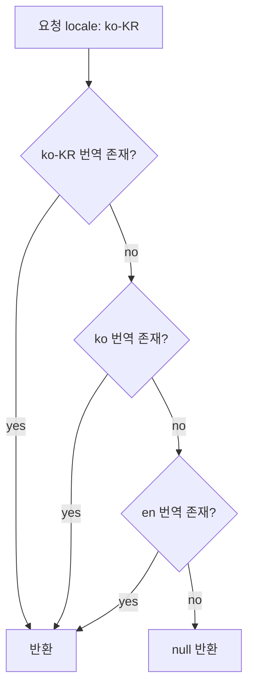

# 다국어 콘텐츠 DB 저장

## 언어 코드 표준

Translation 테이블을 설계하기 전에 언어 코드 형식부터 정해야 한다. 나중에 바꾸면 데이터 마이그레이션이 생긴다.

BCP 47이 사실상 표준이다. ISO 639-1 2자리 코드만 쓰는 방식(`ko`, `en`, `ja`)과 지역 코드를 붙이는 방식(`ko-KR`, `en-US`, `zh-TW`)이 있다. 지역 코드를 쓰면 `en-US`와 `en-GB`를 별도 번역으로 관리할 수 있는데, 실제로 이 수준의 구분이 필요한 서비스는 많지 않다. 처음에는 `ko`, `en` 수준으로 시작하고 실제로 필요할 때 확장하는 편이 낫다.

DB 컬럼은 넉넉하게 잡아둔다. BCP 47 최대 길이를 고려하면 10자 정도면 충분하다.

```sql
locale VARCHAR(10) NOT NULL  -- 'ko', 'en', 'ko-KR', 'zh-Hant-TW' 등
```

입력 단계에서 정규화를 빠뜨리면 `ko`, `KO`, `ko_KR`, `ko-KR`이 섞여서 같은 콘텐츠가 여러 언어로 조각나 저장된다. 저장 전에 소문자 변환과 언더스코어 → 하이픈 치환을 반드시 거쳐야 한다.

```java
private String normalizeLocale(String locale) {
    if (locale == null) return "en";
    // ko_KR → ko-KR, KO → ko
    String normalized = locale.replace('_', '-').toLowerCase(Locale.ROOT);
    String[] parts = normalized.split("-");
    if (parts.length == 2) {
        return parts[0] + "-" + parts[1].toUpperCase(Locale.ROOT);
    }
    return normalized;
}
```

## DB 저장 패턴 3가지

### Translation Table 패턴

메인 엔티티 테이블과 번역 테이블을 분리하는 방식이다. 다국어 서비스에서 가장 많이 쓰인다.

```sql
CREATE TABLE products (
    id         BIGINT       PRIMARY KEY AUTO_INCREMENT,
    sku        VARCHAR(100) NOT NULL UNIQUE,
    price      DECIMAL(10, 2) NOT NULL,
    created_at DATETIME     NOT NULL DEFAULT CURRENT_TIMESTAMP
);

CREATE TABLE product_translations (
    id          BIGINT       PRIMARY KEY AUTO_INCREMENT,
    product_id  BIGINT       NOT NULL,
    locale      VARCHAR(10)  NOT NULL,
    name        VARCHAR(255) NOT NULL,
    description TEXT,
    UNIQUE KEY uq_product_locale (product_id, locale),
    FOREIGN KEY (product_id) REFERENCES products(id) ON DELETE CASCADE
);
```

번역 가능한 컬럼과 그렇지 않은 컬럼이 명확히 분리된다. 새 언어를 추가할 때 스키마 변경 없이 행만 INSERT하면 된다. 특정 언어의 번역 현황을 쿼리하기도 쉽다. 단점은 조회할 때마다 JOIN이 필요하고, N+1 문제가 생기기 매우 쉽다는 것이다.

### JSONB 컬럼 방식

번역 데이터를 JSON으로 한 컬럼에 몰아넣는 방식이다. PostgreSQL의 JSONB가 대표적이다.

```sql
CREATE TABLE products (
    id           BIGINT         PRIMARY KEY GENERATED ALWAYS AS IDENTITY,
    sku          VARCHAR(100)   NOT NULL UNIQUE,
    price        DECIMAL(10, 2) NOT NULL,
    translations JSONB          NOT NULL DEFAULT '{}',
    created_at   TIMESTAMPTZ    NOT NULL DEFAULT now()
);
```

저장 형태:
```json
{
  "ko": {"name": "무선 이어폰", "description": "고음질 블루투스 이어폰"},
  "en": {"name": "Wireless Earphone", "description": "High quality BT earphone"}
}
```

특정 언어만 추출할 때:
```sql
SELECT id, translations->'ko'->>'name' AS name
FROM products
WHERE id = 1;
```

GIN 인덱스로 특정 키 존재 여부 필터링도 된다:
```sql
CREATE INDEX idx_products_translations_gin ON products USING GIN (translations);

-- 한국어 번역이 없는 상품 조회
SELECT id FROM products WHERE NOT (translations ? 'ko');
```

단일 테이블 조회로 끝나고 스키마가 단순하다. MySQL 8.0의 JSON 타입은 인덱스 효율이 PostgreSQL JSONB보다 많이 떨어지기 때문에 이 방식은 PostgreSQL에서만 제대로 쓸 수 있다. 번역 필드가 많아질수록 컬럼 크기가 커지고, 특정 언어 번역 현황 집계 쿼리가 번거롭다는 단점이 있다.

### 컬럼 분리 방식

언어별로 컬럼을 직접 만드는 방식이다.

```sql
CREATE TABLE products (
    id             BIGINT       PRIMARY KEY AUTO_INCREMENT,
    sku            VARCHAR(100) NOT NULL,
    name_ko        VARCHAR(255),
    name_en        VARCHAR(255),
    description_ko TEXT,
    description_en TEXT
);
```

지원 언어가 2~3개이고 앞으로도 늘어날 일이 없다고 확신하는 경우에만 고려할 수 있다. 새 언어 추가 시 `ALTER TABLE`이 필요하고, 언어가 늘어날수록 컬럼 수가 폭발한다. 번역 현황 집계도 불가능에 가깝다. 실무에서 이 방식을 선택하는 경우는 거의 없다.

### 패턴 비교

| 기준 | Translation Table | JSONB | 컬럼 분리 |
|---|---|---|---|
| 새 언어 추가 | 행 INSERT만 | 행 UPDATE만 | 스키마 변경 필요 |
| 조회 쿼리 복잡도 | JOIN 필요 | 단순 | 단순 |
| N+1 위험 | 높음 | 없음 | 없음 |
| 번역 현황 집계 | 쉬움 | 불편 | 불가능에 가까움 |
| MySQL 적합성 | 적합 | 비권장 | 적합 |
| PostgreSQL 적합성 | 적합 | 적합 | 비권장 |

PostgreSQL을 쓴다면 JSONB가 운영이 편하다. MySQL이라면 Translation Table이 대체로 낫다.

## MySQL: utf8 vs utf8mb4

MySQL에서 `utf8` 문자셋은 실제 UTF-8이 아니다. MySQL이 만든 변종으로 3바이트까지만 지원한다. 이모지나 일부 CJK 보충 문자처럼 4바이트가 필요한 유니코드를 저장하면 에러가 나거나 데이터가 잘린다. `utf8mb4`가 실제 UTF-8 완전 구현체다.

다국어 서비스라면 처음부터 `utf8mb4`를 써야 한다.

```sql
CREATE DATABASE mydb
    CHARACTER SET utf8mb4
    COLLATE utf8mb4_unicode_ci;

CREATE TABLE product_translations (
    id          BIGINT       PRIMARY KEY AUTO_INCREMENT,
    product_id  BIGINT       NOT NULL,
    locale      VARCHAR(10)  CHARACTER SET utf8mb4 COLLATE utf8mb4_unicode_ci NOT NULL,
    name        VARCHAR(255) CHARACTER SET utf8mb4 COLLATE utf8mb4_unicode_ci NOT NULL,
    description TEXT         CHARACTER SET utf8mb4 COLLATE utf8mb4_unicode_ci,
    UNIQUE KEY uq_product_locale (product_id, locale),
    FOREIGN KEY (product_id) REFERENCES products(id) ON DELETE CASCADE
);
```

Collation은 `utf8mb4_unicode_ci`를 권장한다. `utf8mb4_general_ci`보다 정확한 유니코드 비교를 한다. 대소문자 구분이 필요한 경우에만 `utf8mb4_bin`을 쓴다.

기존 테이블이 `utf8`로 생성되어 있다면 변환이 필요하다:

```sql
ALTER TABLE product_translations
    CONVERT TO CHARACTER SET utf8mb4 COLLATE utf8mb4_unicode_ci;
```

JDBC URL에도 인코딩을 명시해야 한다. 명시하지 않으면 드라이버 버전에 따라 연결 인코딩이 달라질 수 있다:

```
jdbc:mysql://host:3306/mydb?characterEncoding=UTF-8&useUnicode=true
```

MySQL 8.0부터는 기본 문자셋이 `utf8mb4`로 바뀌었다. 하지만 기존 레거시 DB를 운영 중이라면 서버 설정과 테이블 정의를 모두 확인해야 한다.

## Fallback 로직

사용자가 요청한 언어의 번역이 없을 때 처리 흐름이다.

```
ko-KR → ko → en → null
```



애플리케이션 레이어에서 처리하는 방식:

```java
public Optional<String> getTranslatedName(Long productId, String requestLocale) {
    List<String> chain = buildFallbackChain(requestLocale);
    Map<String, String> translations = translationRepository.findNamesByProductId(productId);

    return chain.stream()
        .map(translations::get)
        .filter(v -> v != null && !v.isBlank())
        .findFirst();
}

private List<String> buildFallbackChain(String locale) {
    List<String> chain = new ArrayList<>();
    chain.add(locale);                          // ko-KR

    if (locale.contains("-")) {                 // ko
        chain.add(locale.split("-")[0]);
    }

    if (!locale.startsWith("en")) {
        chain.add("en");                        // en
    }

    return chain;
}
```

DB에서 COALESCE로 처리하는 방식도 있다:

```sql
SELECT
    COALESCE(
        t_exact.name,
        t_lang.name,
        t_default.name
    ) AS name
FROM products p
LEFT JOIN product_translations t_exact
    ON t_exact.product_id = p.id AND t_exact.locale = 'ko-KR'
LEFT JOIN product_translations t_lang
    ON t_lang.product_id = p.id AND t_lang.locale = 'ko'
LEFT JOIN product_translations t_default
    ON t_default.product_id = p.id AND t_default.locale = 'en'
WHERE p.id = 1;
```

단건 조회라면 DB에서 처리해도 나쁘지 않다. 목록 조회처럼 여러 건을 한 번에 가져와야 하는 경우에는 애플리케이션 레이어에서 처리하고 결과를 캐싱하는 편이 낫다. DB에서 처리하면 실행 계획이 복잡해지고 인덱스 사용도 예측하기 어렵다.

## 번역 누락 처리

번역이 없는 상황은 반드시 생긴다. 새 콘텐츠를 등록하고 번역이 완료되기 전, 지원 언어를 추가하는 과도기, 번역 담당자의 누락 등이 원인이다.

처리 방식 세 가지:

첫 번째는 null을 그대로 반환하는 방식이다. 클라이언트가 null을 처리해야 한다. API 설계가 명확하고 클라이언트 개발팀과 협의가 잘 되어 있는 경우에 쓴다.

두 번째는 fallback 체인의 마지막 결과를 반환하는 방식이다. `en` 번역이라도 보여주는 것이 아무것도 안 보이는 것보다 나은 경우가 많다.

세 번째는 placeholder를 반환하는 방식이다. `"[번역 준비 중]"` 같은 문자열을 반환한다. 서비스 품질 측면에서 좋지 않고, 번역 현황을 별도로 관리하지 않으면 언제 실제 번역으로 교체될지 추적하기도 어렵다.

운영 규모가 커지면 번역 누락 모니터링 시스템이 별도로 필요하다. fallback 체인마저 실패한 경우를 로그로 남기고, 번역 담당팀에 알림을 보내는 구조가 필요해진다.

```java
public String getTranslatedNameWithFallback(Long productId, String locale) {
    Optional<String> result = getTranslatedName(productId, locale);
    
    if (result.isEmpty()) {
        log.warn("Translation missing: productId={}, locale={}", productId, locale);
        translationAlertService.notifyMissing(productId, locale); // 알림
        return null;
    }
    
    return result.get();
}
```

## 쿼리 성능과 인덱스 설계

### N+1 문제

Translation Table 패턴에서 N+1은 거의 필연적으로 발생한다. 목록 조회 후 각 아이템의 번역을 개별 쿼리로 가져오면 100개 상품 목록이 101번의 쿼리를 만든다.

IN 절로 한 번에 가져와야 한다:

```java
// 목록 조회
List<Product> products = productRepository.findAll(pageable).getContent();
List<Long> ids = products.stream().map(Product::getId).toList();

// 번역 일괄 조회
Map<Long, ProductTranslation> translationMap =
    translationRepository.findByProductIdInAndLocale(ids, "ko")
        .stream()
        .collect(Collectors.toMap(ProductTranslation::getProductId, t -> t));

// 조합
return products.stream()
    .map(p -> {
        ProductTranslation t = translationMap.get(p.getId());
        return ProductResponse.of(p, t != null ? t.getName() : null);
    })
    .toList();
```

JPA를 쓴다면 `JOIN FETCH`로 처리할 수 있다:

```java
@Query("""
    SELECT p FROM Product p
    JOIN FETCH p.translations t
    WHERE t.locale = :locale
    """)
List<Product> findAllWithTranslation(@Param("locale") String locale);
```

페이징과 `JOIN FETCH`를 함께 쓰면 Hibernate가 메모리에서 페이징 처리하는 문제가 생긴다. 이 경우에는 ID 목록을 먼저 페이징으로 가져온 뒤 번역을 일괄 조회하는 방식을 써야 한다.

### 인덱스 설계

UNIQUE 제약 `(product_id, locale)`은 자동으로 인덱스가 생성된다. 이 인덱스는 특정 상품의 모든 번역을 가져오는 쿼리에서 쓰인다.

특정 locale의 번역 목록을 전체에서 조회하는 쿼리가 많다면 `locale`을 선행 컬럼으로 둔 별도 인덱스가 필요하다:

```sql
CREATE INDEX idx_translations_locale ON product_translations (locale);

-- 또는 커버링 인덱스로
CREATE INDEX idx_translations_locale_name ON product_translations (locale, product_id, name);
```

번역이 없는 상품을 찾는 쿼리는 NULL 체크나 NOT EXISTS 패턴을 쓰게 되는데, 이런 쿼리는 테이블이 커질수록 느려진다. 번역 현황을 별도 컬럼이나 테이블로 관리하는 편이 낫다.

## Translation Table 실무에서 흔히 빠지는 함정

**기본 언어 누락:** 신규 콘텐츠 등록 시 기본 언어 번역을 함께 INSERT하도록 강제하지 않으면, fallback 체인 마지막까지 실패하는 데이터가 쌓인다. 애플리케이션 레이어에서 기본 언어 번역 누락 시 예외를 던지거나, DB 레벨에서 CHECK 제약을 걸어두는 방법으로 막아야 한다.

**CASCADE DELETE 미설정:** `ON DELETE CASCADE`를 빠뜨리면 메인 엔티티를 삭제해도 번역 행이 남는다. orphan 데이터가 쌓이면서 디스크를 잡아먹는다.

**번역 테이블 크기 예측 실패:** 상품 10만 개에 지원 언어 10개면 번역 테이블은 최대 100만 행이 된다. 서비스 규모가 커지면 번역 테이블이 성능 병목이 된다. 자주 조회되는 번역은 Redis에 캐싱하는 구조를 미리 고려해야 한다.

**번역 상태 관리 부재:** 기계 번역과 사람이 검토한 번역이 뒤섞이면 품질을 보장할 수 없다. 운영 규모가 커지면 상태 컬럼이 반드시 필요해진다:

```sql
ALTER TABLE product_translations
    ADD COLUMN status       ENUM('draft', 'review', 'published') NOT NULL DEFAULT 'draft',
    ADD COLUMN translated_by VARCHAR(100),
    ADD COLUMN translated_at DATETIME;

-- 서비스 조회 시 published 상태만 반환
SELECT name FROM product_translations
WHERE product_id = ? AND locale = ? AND status = 'published';
```

**locale 정규화 미적용:** 입력 단계에서 정규화를 빠뜨리면 동일한 언어가 여러 키로 분산 저장된다. 한번 분산되면 수정 쿼리를 돌려야 하는데, 이미 운영 데이터에 섞여 있으면 어떤 것이 올바른 형태인지 판단하기 어렵다.

**번역 수정 중 읽기 일관성 부재:** 운영자가 번역을 수정하는 중에도 서비스 요청은 들어온다. 반쯤 수정된 텍스트가 노출될 수 있다. 대부분의 서비스에서는 이 수준까지 필요하지 않지만, 법적 문서나 금융 약관을 다루는 경우라면 버전 관리나 publish 단계를 별도로 두어야 한다.
