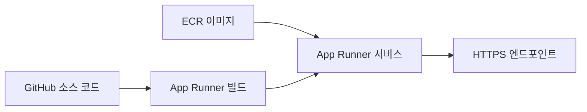
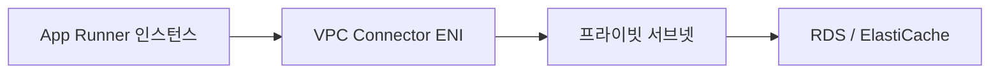

# AWS App Runner 심화
웹 API 하나를 배포하려고 ECS 클러스터, 태스크 정의, 서비스, ALB, 타깃 그룹, 오토스케일링 정책, 보안 그룹을 전부 손으로 짜본 사람이라면 "그냥 컨테이너 하나 올리는 건데 왜 이렇게 손이 많이 가나" 하는 생각을 한 번쯤 한다. App Runner는 그 중간 단계를 전부 감추고, 컨테이너 이미지나 소스 코드만 주면 HTTPS 엔드포인트가 달린 서비스를 띄워준다. 로드밸런서도, 인증서도, 오토스케일링도 따로 만들 필요가 없다.

내부적으로는 Fargate 위에서 돈다. 그래서 서버를 직접 관리하지 않고, 트래픽에 따라 인스턴스 개수가 자동으로 늘었다 줄었다 한다. ECS Fargate를 쓸 때 직접 조립해야 했던 것들을 App Runner가 묶어서 관리한다고 보면 된다.

## 두 가지 배포 소스

App Runner 서비스를 만들 때 소스를 두 가지 중에 고른다. 이 선택이 이후 배포 동작을 결정한다.



컨테이너 이미지 기반은 ECR에 올라간 이미지를 가리킨다. 빌드는 내가 알아서 하고, App Runner는 완성된 이미지를 받아서 실행만 한다. CI에서 빌드한 이미지를 ECR에 푸시하는 파이프라인이 이미 있다면 이 방식이 자연스럽다.

소스 코드 기반은 GitHub 저장소를 연결해두면 App Runner가 코드를 받아서 직접 빌드하고 배포한다. Dockerfile 없이도 런타임(Python, Node.js, Java 등)을 지정하면 알아서 빌드한다. 작은 프로젝트나 도커 빌드 환경을 따로 만들기 귀찮을 때 쓴다. 단점은 지원하는 런타임 버전이 제한적이고, 빌드 과정을 세밀하게 제어하기 어렵다는 점이다.

ECR 방식을 고를 때 한 가지 주의할 게 있다. ECR이 다른 계정에 있거나 퍼블릭 ECR이 아니면 App Runner가 이미지를 당겨올 수 있도록 액세스 역할을 만들어줘야 한다. 콘솔에서 만들면 자동으로 붙지만, IaC로 짤 때 이걸 빠뜨려서 "이미지를 못 가져온다"는 에러로 막히는 경우가 흔하다.

## IAM 역할: AccessRole과 InstanceRole

App Runner에서 IAM 역할은 두 개를 따로 만들어야 하는데, 이 둘의 역할이 완전히 다르다. 하나로 합치거나 둘 다 AdministratorAccess를 붙이는 식으로 대충 처리하다가 사고가 나는 경우가 있다.

### AccessRole

App Runner 서비스 자체가 ECR에서 이미지를 당겨올 때 쓰는 역할이다. 컨테이너가 아니라 App Runner 플랫폼이 assume한다. ECR 프라이빗 리포지터리를 소스로 쓸 때만 필요하고, 퍼블릭 ECR이면 없어도 된다.

이 역할의 Trust Policy는 `build.apprunner.amazonaws.com`을 principal로 잡아야 한다. `tasks.apprunner.amazonaws.com`이 아니다. 헷갈리기 쉬운 부분이고, 잘못 쓰면 "AccessDenied: Not authorized to pull image" 에러로 배포가 멈춘다.

```json
{
  "Version": "2012-10-17",
  "Statement": [
    {
      "Effect": "Allow",
      "Principal": {
        "Service": "build.apprunner.amazonaws.com"
      },
      "Action": "sts:AssumeRole"
    }
  ]
}
```

ECR 접근에 필요한 권한은 AWS 관리형 정책 `AWSAppRunnerServicePolicyForECRAccess`를 붙이면 된다. 직접 인라인 정책을 쓴다면 `ecr:GetDownloadUrlForLayer`, `ecr:BatchGetImage`, `ecr:GetAuthorizationToken`, `ecr:BatchCheckLayerAvailability`, `ecr:DescribeImages`가 필요하다.

### InstanceRole

실제로 돌아가는 컨테이너가 assume하는 역할이다. 애플리케이션 코드가 AWS 서비스를 쓸 때 이 역할의 권한으로 접근한다. S3에서 파일을 읽거나, Secrets Manager에서 값을 가져오거나, SQS 메시지를 보내는 작업이 전부 이 역할 아래서 돈다.

Trust Policy는 `tasks.apprunner.amazonaws.com`이다.

```json
{
  "Version": "2012-10-17",
  "Statement": [
    {
      "Effect": "Allow",
      "Principal": {
        "Service": "tasks.apprunner.amazonaws.com"
      },
      "Action": "sts:AssumeRole"
    }
  ]
}
```

최소 권한 원칙을 지키려면 리소스 ARN을 구체적으로 명시해야 한다. `"Resource": "*"`로 두는 건 개발 단계에서 빠르게 연결 테스트할 때만 쓰고, 운영 환경에서는 반드시 특정 ARN으로 좁혀야 한다.

```json
{
  "Version": "2012-10-17",
  "Statement": [
    {
      "Effect": "Allow",
      "Action": ["s3:GetObject", "s3:PutObject"],
      "Resource": "arn:aws:s3:::my-app-bucket/*"
    },
    {
      "Effect": "Allow",
      "Action": "secretsmanager:GetSecretValue",
      "Resource": "arn:aws:secretsmanager:ap-northeast-2:123456789012:secret:my-app/db-password-*"
    }
  ]
}
```

Secrets Manager ARN 끝에 `-*`를 붙이는 건 AWS가 시크릿 버전마다 뒤에 랜덤 문자를 붙이기 때문이다. 정확한 ARN만 쓰면 버전이 바뀔 때마다 접근이 거부된다.

## 환경 변수와 시크릿 관리

앱 설정값을 넘기는 방법이 두 가지다. 일반 환경 변수는 평문으로 컨테이너에 들어가고, 시크릿은 Secrets Manager나 SSM Parameter Store를 거쳐서 들어온다.

일반 환경 변수는 API 서버 주소, 타임존, 로그 레벨처럼 평문으로 봐도 상관없는 값에 쓴다. App Runner 설정에 직접 키-값으로 넣으면 된다.

민감한 값(DB 비밀번호, API 키, 인증서 등)은 Secrets Manager나 SSM Parameter Store에 저장하고 ARN 또는 파라미터 이름으로 참조한다. App Runner가 시작할 때 해당 값을 가져와서 환경 변수로 주입해준다. 애플리케이션 코드에서 AWS SDK를 써서 직접 가져오는 방식보다 훨씬 간단하다.

```json
{
  "EnvironmentVariables": [
    { "Name": "LOG_LEVEL", "Value": "info" },
    { "Name": "SERVER_TIMEOUT", "Value": "30" }
  ],
  "EnvironmentSecrets": [
    {
      "Name": "DB_PASSWORD",
      "Value": "arn:aws:secretsmanager:ap-northeast-2:123456789012:secret:my-app/db-password-AbCdEf"
    },
    {
      "Name": "API_KEY",
      "Value": "arn:aws:ssm:ap-northeast-2:123456789012:parameter/my-app/api-key"
    }
  ]
}
```

SSM Parameter Store에서 SecureString 타입을 쓰면 InstanceRole에 `ssm:GetParameters`와 `kms:Decrypt` 권한이 필요하다. KMS 권한을 빠뜨리면 "AccessDenied" 에러가 나는데, Secrets Manager 에러와 메시지가 비슷해서 혼동하기 쉽다.

한 가지 주의할 점이 있다. Secrets Manager에서 시크릿 값을 바꿔도 실행 중인 컨테이너는 새 값을 자동으로 받지 않는다. App Runner는 서비스가 시작될 때 한 번만 시크릿을 읽어서 환경 변수로 넣는다. 시크릿을 로테이션했을 때 서비스를 재배포해야 반영된다는 걸 모르면, 왜 아직도 구 비밀번호로 접속이 되는지 한참 헤매게 된다.

## 자동 배포 동작

`AutoDeploymentsEnabled`를 켜두면 소스가 바뀔 때마다 App Runner가 새 버전을 배포한다. ECR 기반이면 같은 태그로 이미지를 다시 푸시하는 순간 배포가 트리거되고, GitHub 기반이면 연결한 브랜치에 푸시할 때 배포가 돈다.

여기서 실무에서 자주 당하는 게 있다. ECR에서 `latest` 태그를 쓰고 자동 배포를 켜두면, 누가 의도치 않게 `latest`를 푸시했을 때 운영 서비스가 바로 갈아엎힌다. 이미지 태그를 커밋 해시나 버전으로 고정하고, 자동 배포 대신 배포 시점을 명시적으로 제어하는 편이 운영 환경에서는 안전하다.

배포는 롤링 방식으로 진행되고, 새 버전의 헬스체크가 통과해야 트래픽이 넘어간다. 헬스체크 경로 설정을 잘못하면 새 버전이 정상인데도 계속 실패로 판정돼서 롤백되는 일이 생긴다. 헬스체크는 기본이 TCP인데, 애플리케이션이 떠 있는지 제대로 보려면 HTTP로 바꾸고 실제 응답하는 경로를 지정해야 한다.

```json
{
  "HealthCheckConfiguration": {
    "Protocol": "HTTP",
    "Path": "/healthz",
    "Interval": 10,
    "Timeout": 5,
    "HealthyThreshold": 1,
    "UnhealthyThreshold": 5
  }
}
```

## 오토스케일링과 동시성

App Runner의 스케일링은 ECS나 EC2 오토스케일링과 기준이 다르다. CPU 사용률이 아니라 인스턴스당 동시 요청 수(concurrency)를 기준으로 스케일한다.

설정값은 세 가지다.

- `MaxConcurrency`: 인스턴스 하나가 동시에 처리하는 요청 수. 기본 100.
- `MinSize`: 항상 떠 있는 최소 인스턴스 수. 기본 1.
- `MaxSize`: 늘어날 수 있는 최대 인스턴스 수. 기본 25.

인스턴스 하나가 `MaxConcurrency`만큼 요청을 받고 있는데 그 이상이 들어오면, App Runner가 인스턴스를 하나 더 띄운다. 동시 요청이 250개이고 `MaxConcurrency`가 100이면 인스턴스는 3개로 늘어난다.

이 모델이 함정이 되는 경우가 있다. 요청 하나가 CPU를 많이 쓰는 작업(이미지 처리, 무거운 연산)인데 `MaxConcurrency`를 기본값 100으로 두면, 인스턴스 하나에 무거운 요청이 100개씩 몰리면서 CPU가 포화되는데도 동시 요청 수는 한계에 안 닿아서 스케일아웃이 안 일어난다. 이런 워크로드는 `MaxConcurrency`를 10~20 수준으로 낮춰서 인스턴스당 부하를 줄이고 인스턴스 개수로 분산시켜야 한다.

반대로 I/O 대기가 대부분인 가벼운 API라면 `MaxConcurrency`를 높여서 인스턴스 하나가 더 많은 요청을 받게 하는 게 비용 면에서 낫다. 워크로드 성격을 모르고 기본값으로 두면 둘 다 비효율적이다.

## VPC 커넥터

App Runner 인스턴스는 기본적으로 AWS가 관리하는 네트워크에서 돈다. 그래서 내 VPC 안에 있는 RDS, ElastiCache, 프라이빗 서브넷의 내부 서비스에는 그냥은 접근하지 못한다. 여기서 막히는 사람이 많다. 서비스는 떴는데 DB 연결이 타임아웃 나는 상황이다.

이걸 풀려면 VPC 커넥터를 만들어서 서비스에 붙여야 한다. VPC 커넥터는 지정한 서브넷에 ENI를 만들어서 App Runner 트래픽이 내 VPC를 거쳐 나가게 한다.



VPC 커넥터를 붙이면 아웃바운드 트래픽 전체가 VPC를 거쳐 나간다. 이전에는 App Runner가 자기 네트워크로 인터넷에 바로 나갔지만, 커넥터를 붙이는 순간 외부 API 호출도 VPC 경로를 탄다. 따라서 NAT 게이트웨이가 있는 프라이빗 서브넷에 커넥터를 두지 않으면, RDS는 붙는데 외부 인터넷(서드파티 API, 외부 OAuth 등)은 안 되는 상황이 생긴다.

RDS 쪽 보안 그룹에서 VPC 커넥터의 보안 그룹을 인바운드로 허용해야 한다. 이걸 빠뜨리면 ENI는 만들어졌는데 DB 포트가 막혀서 또 타임아웃이 난다.

서브넷의 가용 IP가 부족하면 커넥터 생성이 실패한다. ENI가 서브넷 IP를 잡아먹기 때문에, IP 여유가 빠듯한 서브넷을 골랐다가 생성 단계에서 막히는 경우가 있다.

## CloudWatch 로그와 X-Ray 트레이싱

### 로그 그룹 구조

App Runner 서비스를 만들면 CloudWatch에 두 개의 로그 그룹이 자동으로 생긴다.

- `/aws/apprunner/{서비스명}/{서비스ID}/service`: App Runner 플랫폼 로그. 배포 이벤트, 헬스체크 결과, 스케일링 이벤트가 여기 쌓인다.
- `/aws/apprunner/{서비스명}/{서비스ID}/application`: 컨테이너가 stdout으로 출력하는 애플리케이션 로그.

배포가 실패했을 때 service 로그를 먼저 보고, 애플리케이션 에러가 의심되면 application 로그를 봐야 한다. 처음엔 어느 로그를 봐야 하는지 몰라서 시간을 낭비하는 경우가 많다.

로그 보존 기간은 기본값이 "만료 없음(Never expire)"이다. CloudWatch 저장 비용이 은근히 쌓이므로, Terraform이나 콘솔에서 서비스를 만들 때 `retention_in_days`를 명시적으로 설정해야 한다.

App Runner가 로그 그룹을 자동으로 만들기 때문에, Terraform으로 먼저 만들어두면 충돌이 날 수 있다. 이미 App Runner가 만든 로그 그룹을 import하는 게 더 안전하다.

```bash
terraform import aws_cloudwatch_log_group.app_runner_application \
  /aws/apprunner/my-api/application
```

### X-Ray 트레이싱

`ObservabilityConfiguration`에서 `TracingVendor`를 `AWSXRAY`로 설정하면 X-Ray 데몬이 컨테이너 옆에 붙는다. 단, X-Ray SDK를 애플리케이션 코드에 추가해야 의미 있는 트레이스가 생긴다. 데몬만 켜고 SDK를 안 쓰면 App Runner가 생성하는 기본 트레이스만 나오고, 코드 안에서 무슨 일이 일어나는지는 보이지 않는다.

InstanceRole에 다음 권한을 추가해야 트레이스가 X-Ray 서비스로 올라간다. X-Ray 관련 API는 리소스 ARN을 특정할 수 없어서 `"Resource": "*"`가 불가피하다. 그래도 Action을 X-Ray 관련으로만 좁혀야 한다.

```json
{
  "Effect": "Allow",
  "Action": [
    "xray:PutTraceSegments",
    "xray:PutTelemetryRecords",
    "xray:GetSamplingRules",
    "xray:GetSamplingTargets",
    "xray:GetSamplingStatisticSummaries"
  ],
  "Resource": "*"
}
```

Python FastAPI 기준으로 SDK를 붙이는 예는 이렇다.

```python
from aws_xray_sdk.core import xray_recorder, patch_all
from aws_xray_sdk.ext.fastapi.middleware import XRayMiddleware

patch_all()  # boto3, requests 등 자동으로 계측

app = FastAPI()
app.add_middleware(XRayMiddleware, recorder=xray_recorder)
```

`patch_all()`은 임포트 초반에 호출해야 한다. 나중에 호출하면 이미 임포트된 라이브러리에는 패치가 안 붙는다.

## 커스텀 도메인 연결

App Runner가 제공하는 기본 도메인(`{id}.{region}.awsapprunner.com`)을 그대로 쓰는 경우는 드물다. 실제 서비스라면 커스텀 도메인을 연결해야 한다.

`AssociateCustomDomain` API를 호출하거나 콘솔에서 도메인을 등록하면 App Runner가 인증서 검증용 CNAME 레코드를 돌려준다. 이 레코드를 DNS에 추가해야 ACM 인증서가 발급된다.

```
도메인 등록 요청
    → App Runner가 ACM 인증서 발급 요청
    → ACM이 DNS 검증용 CNAME 레코드 반환
    → DNS에 CNAME 추가
    → ACM 인증서 발급 완료
    → App Runner가 커스텀 도메인으로 트래픽 수신 시작
```

Route 53을 쓴다면 Terraform으로 이 흐름을 자동화할 수 있다.

```hcl
resource "aws_apprunner_custom_domain_association" "main" {
  domain_name          = "api.example.com"
  service_arn          = aws_apprunner_service.main.arn
  enable_www_subdomain = false
}

resource "aws_route53_record" "app_runner_validation" {
  for_each = {
    for record in aws_apprunner_custom_domain_association.main.certificate_validation_records :
    record.name => record
  }

  zone_id = data.aws_route53_zone.main.zone_id
  name    = each.value.name
  type    = each.value.type
  ttl     = 60
  records = [each.value.value]
}

resource "aws_route53_record" "app_runner_cname" {
  zone_id = data.aws_route53_zone.main.zone_id
  name    = "api.example.com"
  type    = "CNAME"
  ttl     = 300
  records = [aws_apprunner_service.main.service_url]
}
```

`certificate_validation_records`는 `aws_apprunner_custom_domain_association`이 만들어진 뒤에 값이 채워진다. `for_each`로 동적으로 처리하지 않으면 plan 단계에서 개수를 모른다는 에러가 나온다.

ACM 인증서는 만료 전에 자동으로 갱신된다. 단, 갱신 시점에 DNS 검증 레코드가 DNS에 살아있어야 한다. 검증 레코드를 처음에만 추가하고 지우는 실수를 하면 나중에 갱신이 실패한다. Terraform 상태에서 레코드를 관리하면 이 문제를 피할 수 있다.

## Terraform으로 전체 구성

지금까지 설명한 내용을 하나의 Terraform 구성으로 합친 예다. VPC 커넥터, IAM 역할, Secrets Manager 연동, X-Ray 활성화, 오토스케일링까지 포함한다.

```hcl
locals {
  service_name = "my-api"
  region       = "ap-northeast-2"
  account_id   = data.aws_caller_identity.current.account_id
}

data "aws_caller_identity" "current" {}

# AccessRole: App Runner 플랫폼이 ECR 이미지를 당겨올 때 씀
resource "aws_iam_role" "access_role" {
  name = "${local.service_name}-apprunner-access-role"

  assume_role_policy = jsonencode({
    Version = "2012-10-17"
    Statement = [{
      Effect    = "Allow"
      Principal = { Service = "build.apprunner.amazonaws.com" }
      Action    = "sts:AssumeRole"
    }]
  })
}

resource "aws_iam_role_policy_attachment" "ecr_access" {
  role       = aws_iam_role.access_role.name
  policy_arn = "arn:aws:iam::aws:policy/service-role/AWSAppRunnerServicePolicyForECRAccess"
}

# InstanceRole: 실행 중인 컨테이너가 AWS 서비스를 쓸 때 씀
resource "aws_iam_role" "instance_role" {
  name = "${local.service_name}-apprunner-instance-role"

  assume_role_policy = jsonencode({
    Version = "2012-10-17"
    Statement = [{
      Effect    = "Allow"
      Principal = { Service = "tasks.apprunner.amazonaws.com" }
      Action    = "sts:AssumeRole"
    }]
  })
}

resource "aws_iam_role_policy" "instance_policy" {
  role = aws_iam_role.instance_role.id

  policy = jsonencode({
    Version = "2012-10-17"
    Statement = [
      {
        Effect = "Allow"
        Action = ["secretsmanager:GetSecretValue"]
        Resource = [
          "arn:aws:secretsmanager:${local.region}:${local.account_id}:secret:${local.service_name}/*"
        ]
      },
      {
        Effect   = "Allow"
        Action   = ["s3:GetObject", "s3:PutObject"]
        Resource = ["arn:aws:s3:::${local.service_name}-bucket/*"]
      },
      {
        Effect = "Allow"
        Action = [
          "xray:PutTraceSegments",
          "xray:PutTelemetryRecords",
          "xray:GetSamplingRules",
          "xray:GetSamplingTargets"
        ]
        Resource = "*"
      }
    ]
  })
}

# VPC 커넥터
resource "aws_security_group" "app_runner" {
  name   = "${local.service_name}-apprunner-sg"
  vpc_id = var.vpc_id

  egress {
    from_port   = 0
    to_port     = 0
    protocol    = "-1"
    cidr_blocks = ["0.0.0.0/0"]
  }
}

resource "aws_apprunner_vpc_connector" "main" {
  vpc_connector_name = "${local.service_name}-vpc-connector"
  subnets            = var.private_subnet_ids
  security_groups    = [aws_security_group.app_runner.id]
}

# X-Ray 관찰성 설정
resource "aws_apprunner_observability_configuration" "main" {
  observability_configuration_name = "${local.service_name}-observability"

  trace_configuration {
    vendor = "AWSXRAY"
  }
}

# 오토스케일링
resource "aws_apprunner_auto_scaling_configuration_version" "main" {
  auto_scaling_configuration_name = "${local.service_name}-scaling"
  max_concurrency                 = 50
  min_size                        = 1
  max_size                        = 10
}

# App Runner 서비스 본체
resource "aws_apprunner_service" "main" {
  service_name = local.service_name

  source_configuration {
    authentication_configuration {
      access_role_arn = aws_iam_role.access_role.arn
    }

    image_repository {
      image_identifier      = "${local.account_id}.dkr.ecr.${local.region}.amazonaws.com/${local.service_name}:${var.image_tag}"
      image_repository_type = "ECR"

      image_configuration {
        port = "8080"

        environment_variables = {
          LOG_LEVEL      = "info"
          SERVER_TIMEOUT = "30"
        }

        environment_secrets = {
          DB_PASSWORD = "arn:aws:secretsmanager:${local.region}:${local.account_id}:secret:${local.service_name}/db-password"
          API_KEY     = "arn:aws:secretsmanager:${local.region}:${local.account_id}:secret:${local.service_name}/api-key"
        }
      }
    }

    auto_deployments_enabled = false
  }

  instance_configuration {
    cpu               = "1 vCPU"
    memory            = "2 GB"
    instance_role_arn = aws_iam_role.instance_role.arn
  }

  auto_scaling_configuration_arn = aws_apprunner_auto_scaling_configuration_version.main.arn

  network_configuration {
    egress_configuration {
      egress_type       = "VPC"
      vpc_connector_arn = aws_apprunner_vpc_connector.main.arn
    }
  }

  observability_configuration {
    observability_configuration_arn = aws_apprunner_observability_configuration.main.arn
    observability_enabled           = true
  }

  health_check_configuration {
    protocol            = "HTTP"
    path                = "/healthz"
    interval            = 10
    timeout             = 5
    healthy_threshold   = 1
    unhealthy_threshold = 5
  }
}

# CloudWatch 로그 보존 기간 (App Runner 생성 후 import 권장)
resource "aws_cloudwatch_log_group" "app_runner_application" {
  name              = "/aws/apprunner/${local.service_name}/application"
  retention_in_days = 30
}

resource "aws_cloudwatch_log_group" "app_runner_service" {
  name              = "/aws/apprunner/${local.service_name}/service"
  retention_in_days = 30
}
```

`auto_deployments_enabled = false`로 두는 건 의도적이다. 운영 환경에서 자동 배포를 켜두면 ECR 이미지 푸시 순간 배포가 트리거되는데, CI 파이프라인 완료를 기다리지 않고 배포되는 타이밍 문제가 생길 수 있다. 배포는 파이프라인에서 `aws apprunner start-deployment` 명령으로 명시적으로 트리거하는 방식이 제어하기 쉽다.

## Fargate, Beanstalk과 비교

세 서비스 모두 "서버 관리 없이 애플리케이션을 띄운다"는 점에서 겹치지만 결이 다르다.

ECS Fargate는 조립식이다. 태스크 정의, 서비스, ALB, 오토스케일링을 직접 구성한다. 손은 많이 가지만 그만큼 세밀하게 제어한다. 사이드카 컨테이너를 붙이거나, 여러 컨테이너를 한 태스크에 묶거나, ALB 리스너 규칙으로 복잡한 라우팅을 짜는 건 App Runner로는 못 하고 Fargate로 가야 한다. App Runner는 사실상 단일 컨테이너 단일 포트 모델이다.

Elastic Beanstalk은 EC2 기반(Fargate가 아님)이고 더 오래된 서비스다. EC2 인스턴스, 오토스케일링 그룹, 로드밸런서를 Beanstalk이 추상화해서 관리하지만, 그 밑의 EC2가 그대로 노출돼서 SSH로 들어가거나 인스턴스를 커스터마이징할 여지가 있다. 반대로 말하면 OS 패치나 인스턴스 관리 책임이 일부 남는다. App Runner는 그 밑단까지 전부 감춰서 EC2를 의식할 일이 없다.

단일 컨테이너 웹 서비스를 최소한의 설정으로 빨리 띄우는 게 목적이면 App Runner, 복잡한 라우팅이나 멀티 컨테이너 구성이 필요하면 Fargate, 레거시 애플리케이션을 EC2 환경 그대로 올리면서 관리만 덜고 싶으면 Beanstalk이다.

## 운영에서 막히는 한계

App Runner는 시작이 쉬운 만큼, 규모가 커지거나 요구사항이 까다로워지면 벽에 부딪힌다. 도입 전에 알아둬야 할 것들이다.

### 콜드 스타트와 최소 인스턴스

`MinSize`를 1로 두면 항상 한 대는 떠 있어서 콜드 스타트가 없을 것 같지만, App Runner에는 유휴 상태(provisioned but idle) 개념이 있다. 트래픽이 없으면 인스턴스가 활성 상태에서 빠지고, 다시 요청이 오면 깨어나는 데 시간이 걸린다. 이 깨어나는 지연이 수백 ms에서 길게는 몇 초까지 나올 수 있어서, 트래픽이 띄엄띄엄 오는 서비스는 첫 요청이 느리다는 컴플레인을 받는다.

비용 구조도 여기서 갈린다. App Runner는 활성 인스턴스의 vCPU/메모리에 더해, 유휴 상태 인스턴스의 메모리(provisioned 요금)도 따로 과금한다. 콜드 스타트를 피하려고 인스턴스를 계속 깨어 있게 만들면 그만큼 비용이 붙는다.

### 비용이 역전되는 지점

App Runner는 트래픽이 적을 때는 싸지만, 꾸준히 높은 부하가 들어오는 서비스에서는 같은 사양의 ECS Fargate나 EC2보다 비싸지는 구간이 온다. 편의성에 대한 프리미엄을 얹어서 받기 때문이다. 트래픽이 안정적으로 높은 운영 서비스라면, 어느 시점부터는 ECS Fargate로 옮기거나 EC2 기반으로 가는 게 비용상 유리해진다. "처음엔 App Runner로 빨리 띄우고, 트래픽이 일정 규모를 넘으면 Fargate로 이전"하는 경로를 미리 염두에 두는 편이 낫다.

### 동시성과 요청 제약

요청 타임아웃은 최대 120초로 고정이다. 그보다 오래 걸리는 작업(대용량 파일 처리, 긴 배치)은 App Runner 요청-응답 모델에 안 맞는다. 이런 건 SQS + 별도 워커로 빼야 한다.

WebSocket 같은 장시간 양방향 연결도 App Runner의 모델과 잘 안 맞는다. 요청-응답 위주의 HTTP API에 맞춰진 서비스라고 보는 게 정확하다.

### 세밀한 제어의 부재

배포 전략을 카나리나 블루/그린으로 잘게 나눠서 트래픽을 퍼센트 단위로 흘리는 건 App Runner에서 못 한다. 롤링 배포만 지원한다. 특정 인스턴스 타입을 고른다거나, GPU를 붙인다거나, 스토리지를 마운트한다거나 하는 것도 안 된다. vCPU와 메모리 조합도 정해진 몇 가지 중에서만 고른다.

이런 제약들이 걸리기 시작하면 App Runner를 벗어날 시점이다. 반대로 단일 컨테이너 HTTP 서비스를 빠르게 띄우고 인프라 관리를 최소화하는 게 목적이라면, 직접 ECS를 조립하는 것보다 훨씬 적은 노력으로 같은 결과를 낸다. 도구의 적정 범위를 알고 쓰면 잘 맞는 서비스다.
