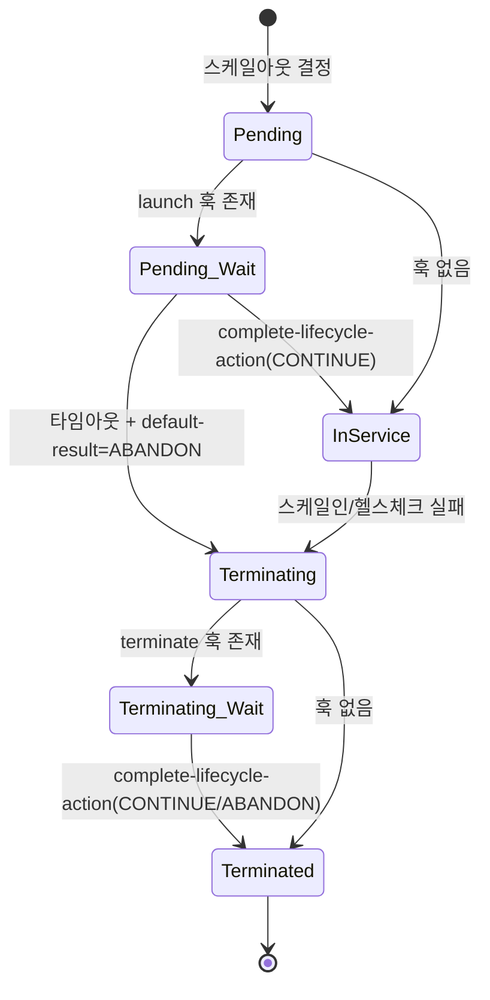

# ASG 라이프사이클 훅

Auto Scaling 그룹(ASG)이 인스턴스를 띄우거나 내릴 때, 그 사이에 내 코드를 끼워 넣는 장치가 라이프사이클 훅이다. 인스턴스가 InService로 넘어가기 직전, 혹은 종료되기 직전에 ASG가 상태 전이를 잠깐 멈춘다. 그동안 앱 초기화를 끝내거나, 커넥션을 빼내고 로그를 밀어내는 작업을 한다.

`Auto_Scaling.md`에는 스케일 정책, 대상 추적, 예측 스케일링까지 있지만 이 훅 부분이 통째로 빠져 있다. 실무에서 종료 시 데이터 유실이나 헬스체크 오탐으로 고생하는 지점이라 따로 정리한다.

## 왜 필요한가

ASG는 기본적으로 인스턴스를 무자비하게 다룬다. 스케일인이 결정되면 그냥 `TerminateInstances`를 호출한다. 인스턴스에서 아직 처리 중이던 요청, 버퍼에 남아 배치 전송을 기다리던 로그, 큐에서 꺼내와 작업 중이던 메시지 — 이런 게 있어도 신경 쓰지 않는다.

로드밸런서 뒤에 붙어 있으면 커넥션 드레이닝(등록 취소 지연)이 어느 정도 막아주지만, 그건 ELB로 들어오는 트래픽 한정이다. 다음 같은 건 드레이닝이 커버하지 못한다.

- SQS/Kafka 컨슈머가 처리 중이던 메시지
- CloudWatch Agent나 Fluent Bit이 아직 안 보낸 로그 버퍼
- 앱이 자체적으로 물고 있는 DB 트랜잭션
- 스팟 인스턴스가 아니라 스케일인으로 내려가는 경우의 정리 작업

반대로 인스턴스가 뜰 때도 문제다. EC2가 부팅되고 user-data가 끝났다고 해서 앱이 요청을 받을 준비가 된 건 아니다. JVM 워밍업, 캐시 프리로드, 커넥션 풀 예열이 안 끝난 상태에서 ELB 헬스체크가 통과해버리면 첫 요청 몇 초 동안 지연이 튄다.

라이프사이클 훅은 이 두 지점에 각각 대기 구간을 만들어준다.

## 상태 전이 흐름

인스턴스가 ASG 안에서 거치는 상태는 훅이 없으면 단순하다. Pending을 거쳐 InService로, 종료할 땐 Terminating을 거쳐 Terminated로 간다. 훅을 걸면 그 사이에 Wait 상태가 하나씩 추가된다.



여기서 핵심은 두 개의 Wait 상태다.

`Pending:Wait` — 인스턴스가 시작됐지만 ASG가 아직 InService로 승격시키지 않은 상태. 이 동안 ELB에 등록되지 않고, 트래픽도 안 들어온다. launch 훅에서 앱 준비가 끝났다고 신호를 보내야 넘어간다.

`Terminating:Wait` — ASG가 종료를 결정했지만 실제 `TerminateInstances`를 호출하기 전 멈춘 상태. 이미 ELB에서는 등록 취소가 진행된다. terminate 훅에서 정리 작업을 끝내고 신호를 보내야 실제 종료가 일어난다.

훅은 launch(`autoscaling:EC2_INSTANCE_LAUNCHING`)와 terminate(`autoscaling:EC2_INSTANCE_TERMINATING`) 두 종류다. 각각 독립적으로 걸 수 있고, 둘 다 걸거나 하나만 걸어도 된다. 실무에서는 종료 훅만 거는 경우가 제일 많다. 준비 완료 판정은 ELB 헬스체크로 대신하는 편이 간단해서다.

## 훅 생성

`put-lifecycle-hook`으로 ASG에 훅을 붙인다. 그룹이 이미 있다는 전제로 종료 훅을 하나 건다.

```bash
aws autoscaling put-lifecycle-hook \
  --lifecycle-hook-name graceful-shutdown \
  --auto-scaling-group-name my-api-asg \
  --lifecycle-transition autoscaling:EC2_INSTANCE_TERMINATING \
  --heartbeat-timeout 300 \
  --default-result CONTINUE
```

파라미터를 하나씩 본다.

`--lifecycle-transition` — launch 훅이면 `autoscaling:EC2_INSTANCE_LAUNCHING`, terminate 훅이면 `autoscaling:EC2_INSTANCE_TERMINATING`. 오타 내면 훅이 안 걸리는 게 아니라 엉뚱한 전이에 걸리니 주의.

`--heartbeat-timeout` — Wait 상태에 머물 수 있는 최대 시간(초). 기본 3600초(1시간), 최소 30초, 최대 172800초(48시간). 이 시간 안에 `complete-lifecycle-action`을 안 부르면 타임아웃이 나고 `default-result`대로 처리된다.

`--default-result` — 타임아웃 시 어떻게 할지. `CONTINUE`면 전이를 그대로 진행하고, `ABANDON`이면 launch 훅에서는 인스턴스를 종료해버리고 terminate 훅에서는 나머지 훅을 건너뛰고 즉시 종료한다.

default-result를 뭘로 둘지는 훅 성격에 따라 갈린다. 종료 훅이면 CONTINUE가 무난하다. 정리 작업이 좀 덜 끝났더라도 결국 종료는 시켜야 하니까. launch 훅이면 애매하다. ABANDON으로 두면 준비 안 된 인스턴스를 걸러내는 효과가 있지만, 훅 신호를 보내는 스크립트에 버그가 있으면 멀쩡한 인스턴스까지 계속 종료되고 재시작되는 루프에 빠진다. 실제로 이걸로 스케일아웃이 무한 반복되면서 인스턴스만 계속 갈리는 상황을 본 적 있다.

기존 훅의 타임아웃만 바꾸고 싶으면 같은 이름으로 다시 `put-lifecycle-hook`을 부르면 덮어쓴다.

## 훅 신호 보내기 — complete와 heartbeat

Wait 상태에 들어간 인스턴스가 스스로 "나 끝났어" 또는 "아직 하는 중이야"를 ASG에 알려야 한다. 두 개의 API를 쓴다.

`complete-lifecycle-action` — 작업을 끝냈으니 다음 상태로 넘어가라는 신호.

```bash
aws autoscaling complete-lifecycle-action \
  --lifecycle-hook-name graceful-shutdown \
  --auto-scaling-group-name my-api-asg \
  --instance-id i-0abc123def456 \
  --lifecycle-action-result CONTINUE
```

`--lifecycle-action-result`를 `CONTINUE`로 주면 전이를 진행하고, `ABANDON`으로 주면 launch에서는 인스턴스를 버리고 terminate에서는 나머지 훅을 스킵한다.

`record-lifecycle-action-heartbeat` — 아직 작업 중이니 타임아웃 시계를 리셋해달라는 신호. 정리 작업이 heartbeat-timeout보다 오래 걸릴 때 쓴다.

```bash
aws autoscaling record-lifecycle-action-heartbeat \
  --lifecycle-hook-name graceful-shutdown \
  --auto-scaling-group-name my-api-asg \
  --instance-id i-0abc123def456
```

이걸 한 번 부를 때마다 타임아웃이 heartbeat-timeout만큼 다시 늘어난다. 다만 무한정 늘릴 수는 없고 최대 48시간(글로벌 타임아웃)까지다. 그 이후에는 heartbeat를 아무리 보내도 default-result대로 강제 진행된다.

`--lifecycle-action-token`을 인자로 넘길 수도 있다. 토큰은 훅이 트리거될 때 EventBridge/SNS 이벤트에 담겨 오는데, 인스턴스 안에서 IMDS로 인스턴스 ID를 알아내서 `--instance-id`로 부르는 방식이면 토큰이 없어도 된다. 토큰 방식은 외부(Lambda 등)에서 훅을 처리할 때 주로 쓴다.

## 인스턴스 안에서 종료 처리 — user-data 예제

제일 흔한 패턴은 인스턴스 자기 자신이 종료 훅을 감지하고 정리한 뒤 complete를 부르는 것이다. 하지만 인스턴스는 자기가 Terminating:Wait에 들어갔는지 어떻게 알까? 두 가지 방법이 있다.

1. IMDS의 target-lifecycle-state를 폴링한다.
2. EventBridge → SSM/Lambda로 외부에서 알려준다.

인스턴스 자체 폴링 방식이 의존성이 적어서 간단하다. IMDSv2 기준으로 종료 감지 스크립트를 systemd 서비스로 띄운다.

```bash
#!/bin/bash
# /opt/lifecycle/watch-termination.sh
set -euo pipefail

ASG_NAME="my-api-asg"
HOOK_NAME="graceful-shutdown"
REGION="ap-northeast-2"

get_token() {
  curl -sf -X PUT "http://169.254.169.254/latest/api/token" \
    -H "X-aws-ec2-metadata-token-ttl-seconds: 300"
}

INSTANCE_ID=$(curl -sf -H "X-aws-ec2-metadata-token: $(get_token)" \
  http://169.254.169.254/latest/meta-data/instance-id)

while true; do
  TOKEN=$(get_token)
  STATE=$(curl -sf -H "X-aws-ec2-metadata-token: ${TOKEN}" \
    http://169.254.169.254/latest/meta-data/autoscaling/target-lifecycle-state || echo "")

  if [ "${STATE}" = "Terminated" ]; then
    echo "종료 감지, 정리 시작"

    # 1) 새 요청 받지 않도록 앱에 SIGTERM (systemd가 커넥션 드레이닝 처리)
    systemctl stop my-api || true

    # 2) 처리 중이던 작업이 끝날 때까지 대기하되 오래 걸리면 heartbeat
    for i in $(seq 1 20); do
      INFLIGHT=$(curl -sf http://localhost:8080/actuator/inflight || echo 0)
      [ "${INFLIGHT}" = "0" ] && break
      aws autoscaling record-lifecycle-action-heartbeat \
        --lifecycle-hook-name "${HOOK_NAME}" \
        --auto-scaling-group-name "${ASG_NAME}" \
        --instance-id "${INSTANCE_ID}" --region "${REGION}"
      sleep 10
    done

    # 3) 로그 버퍼 강제 flush
    systemctl kill -s SIGHUP fluent-bit || true
    sleep 3

    # 4) 종료 진행 신호
    aws autoscaling complete-lifecycle-action \
      --lifecycle-hook-name "${HOOK_NAME}" \
      --auto-scaling-group-name "${ASG_NAME}" \
      --instance-id "${INSTANCE_ID}" \
      --lifecycle-action-result CONTINUE --region "${REGION}"
    break
  fi
  sleep 5
done
```

`target-lifecycle-state` 메타데이터는 훅이 걸려 있을 때만 의미 있는 값이 뜬다. 훅 없이 그냥 종료되면 이 값을 잡을 새도 없이 인스턴스가 내려간다. 그리고 이 스크립트가 도는 인스턴스의 IAM 역할에 `autoscaling:CompleteLifecycleAction`, `autoscaling:RecordLifecycleActionHeartbeat` 권한이 있어야 한다. 이거 빼먹으면 스크립트는 잘 도는데 complete 호출에서 AccessDenied가 나고 인스턴스가 Terminating:Wait에 계속 걸려 있다.

systemd 서비스 등록은 user-data에서 한다.

```bash
#!/bin/bash
cat > /etc/systemd/system/lifecycle-watch.service <<'EOF'
[Unit]
Description=ASG termination lifecycle watcher
After=network-online.target

[Service]
ExecStart=/opt/lifecycle/watch-termination.sh
Restart=always
RestartSec=5

[Install]
WantedBy=multi-user.target
EOF

systemctl daemon-reload
systemctl enable --now lifecycle-watch.service
```

앱의 커넥션 드레이닝은 `systemctl stop`이 보내는 SIGTERM을 앱이 받아 우아하게 종료(graceful shutdown)하도록 만들어두면 자연스럽게 처리된다. Spring Boot면 `server.shutdown=graceful`에 `spring.lifecycle.timeout-per-shutdown-phase`를 잡아두는 식이다. 여기서 앱이 SIGTERM에 즉사하면 위의 inflight 대기 로직이 무의미해지니 앱 쪽 설정을 먼저 확인해야 한다.

## 외부에서 훅 처리 — EventBridge / SNS

인스턴스 안에서 처리하는 대신 훅 이벤트를 밖으로 빼서 Lambda나 SSM Automation으로 처리할 수도 있다. 인스턴스에 aws cli나 IAM 권한을 넣기 싫을 때, 혹은 종료 시 스냅샷 생성처럼 인스턴스 밖에서 해야 하는 작업일 때 쓴다.

훅이 트리거되면 ASG가 자동으로 EventBridge에 이벤트를 쏜다. `EC2 Instance-launch Lifecycle Action`, `EC2 Instance-terminate Lifecycle Action` 두 이벤트 타입이다. 이벤트 detail에 `LifecycleActionToken`, `EC2InstanceId`, `LifecycleHookName`이 들어 있다.

EventBridge 규칙으로 잡는다.

```bash
aws events put-rule \
  --name asg-terminate-hook \
  --event-pattern '{
    "source": ["aws.autoscaling"],
    "detail-type": ["EC2 Instance-terminate Lifecycle Action"],
    "detail": { "AutoScalingGroupName": ["my-api-asg"] }
  }'
```

Lambda를 타겟으로 붙이고, 핸들러에서 정리 작업 후 complete를 부른다.

```python
import boto3

asg = boto3.client("autoscaling")

def handler(event, context):
    detail = event["detail"]
    token = detail["LifecycleActionToken"]
    hook = detail["LifecycleHookName"]
    group = detail["AutoScalingGroupName"]
    instance_id = detail["EC2InstanceId"]

    # 여기서 스냅샷 생성, 외부 등록 해제 등 정리 작업 수행
    # 오래 걸리면 record_lifecycle_action_heartbeat 를 토큰으로 호출

    asg.complete_lifecycle_action(
        LifecycleHookName=hook,
        AutoScalingGroupName=group,
        LifecycleActionToken=token,   # 외부 처리는 토큰 방식이 편하다
        LifecycleActionResult="CONTINUE",
    )
```

외부 처리에서는 `--instance-id` 대신 `LifecycleActionToken`을 쓰는 게 자연스럽다. 토큰은 그 훅 발동 한 건에만 유효하다. 같은 인스턴스가 다음에 또 종료 훅을 타면 토큰이 새로 발급된다.

SNS로 받을 수도 있는데(put-lifecycle-hook에 `--notification-target-arn`, `--role-arn` 지정), EventBridge가 나온 뒤로는 SNS 직접 연동을 쓸 일이 거의 없다. 필터링과 다중 타겟이 EventBridge 쪽이 다루기 쉽다.

## launch 훅으로 워밍업

시작 훅은 앱이 트래픽 받을 준비가 될 때까지 InService 승격을 미룬다. Pending:Wait 동안 워밍업을 돌린다.

```bash
#!/bin/bash
# user-data 뒷부분
HOOK_NAME="warmup"
ASG_NAME="my-api-asg"
REGION="ap-northeast-2"
TOKEN=$(curl -sf -X PUT "http://169.254.169.254/latest/api/token" \
  -H "X-aws-ec2-metadata-token-ttl-seconds: 300")
INSTANCE_ID=$(curl -sf -H "X-aws-ec2-metadata-token: ${TOKEN}" \
  http://169.254.169.254/latest/meta-data/instance-id)

# 앱이 뜰 때까지 대기 + 캐시 프리로드 호출
until curl -sf http://localhost:8080/actuator/health/readiness | grep -q UP; do
  sleep 5
done
curl -sf -X POST http://localhost:8080/internal/cache/preload || true

aws autoscaling complete-lifecycle-action \
  --lifecycle-hook-name "${HOOK_NAME}" \
  --auto-scaling-group-name "${ASG_NAME}" \
  --instance-id "${INSTANCE_ID}" \
  --lifecycle-action-result CONTINUE --region "${REGION}"
```

launch 훅을 쓸 거면 ELB 헬스체크와 역할이 겹치는지 따져봐야 한다. Pending:Wait 동안은 어차피 ELB에 등록도 안 되니, 준비 완료 판정을 훅에서 할지 ELB readiness 헬스체크에서 할지 둘 중 하나로 정리하는 게 낫다. 둘 다 빡세게 걸면 인스턴스 하나 뜨는 데 시간만 늘어난다. 대개는 launch 훅 없이 ELB 헬스체크 grace period로 처리하고, 훅은 종료 쪽만 쓴다.

## Terminating:Wait에 멈추는 문제

실무에서 라이프사이클 훅 관련해 제일 자주 겪는 게 인스턴스가 Terminating:Wait(또는 Pending:Wait)에서 안 빠져나오는 상황이다. 콘솔에서 인스턴스가 계속 "Terminating:Wait" 상태로 떠 있고, ASG의 desired capacity는 못 맞춘 채 시간만 간다. heartbeat-timeout이 3600초로 크게 잡혀 있으면 한 시간을 그대로 멈춰 있다.

원인은 대부분 complete-lifecycle-action이 안 불린 것이다. 체크 순서:

**IAM 권한** — 인스턴스 역할에 `autoscaling:CompleteLifecycleAction`이 없다. 스크립트 로그에 AccessDenied가 찍힌다. 제일 흔하다.

**스크립트 자체가 죽음** — user-data나 systemd 서비스가 부팅 중 에러로 안 뜨거나, 종료 감지 루프가 예외로 빠져나갔다. `journalctl -u lifecycle-watch`로 확인한다.

**리전/이름 불일치** — `--auto-scaling-group-name`이나 `--lifecycle-hook-name` 오타, 또는 `--region`이 인스턴스 리전과 다르다. API는 성공한 것처럼 보이지만 엉뚱한 데를 친다.

**앱이 SIGTERM에 안 죽음** — inflight 대기 루프가 영원히 안 끝나서 complete까지 도달을 못 한다. 위에서 seq 20 같은 상한을 둔 이유다.

급하게 풀어야 하면 수동으로 complete를 쳐서 빼낸다.

```bash
aws autoscaling complete-lifecycle-action \
  --lifecycle-hook-name graceful-shutdown \
  --auto-scaling-group-name my-api-asg \
  --instance-id i-0abc123def456 \
  --lifecycle-action-result ABANDON
```

근본 원인을 못 찾겠고 서비스에 영향이 크면 일단 heartbeat-timeout을 짧게(예: 60초) 줄여둔다. 그러면 스크립트가 실패해도 1분 뒤 default-result대로 넘어간다. 정리 작업이 안 되는 건 감수하되 인스턴스가 물리는 것보다는 낫다는 판단이다.

Pending:Wait에 걸리는 경우도 같은 논리인데, 여기서 ABANDON으로 처리되면 인스턴스가 InService 못 가고 바로 종료된다. launch 훅 스크립트가 계속 실패하면 스케일아웃이 무한 반복되면서 인스턴스만 갈린다. CloudWatch에서 `GroupTerminatingInstances`가 비정상적으로 높으면 이걸 의심한다.

## ELB 헬스체크·스케일인 보호와의 관계

라이프사이클 훅은 ELB 헬스체크, 스케일인 보호와 각자 다른 층위에서 논다. 헷갈리기 쉬워 정리한다.

**ELB 헬스체크** — 인스턴스가 InService인 동안 건강한지 본다. unhealthy로 판정되면 ASG가 교체한다. 이 교체 과정에서 종료가 일어나면 terminate 훅이 탄다. 즉 헬스체크는 "언제 내릴지"를 정하고, 훅은 "내리기 직전에 뭘 할지"를 정한다. 층이 다르다. 다만 종료 훅에서 커넥션 드레이닝을 처리한다고 ELB 등록 취소 지연(deregistration delay)을 0으로 줄이면 안 된다. Terminating:Wait에 들어가는 순간 ELB 쪽 드레이닝과 훅 처리가 병렬로 도는데, ELB 드레이닝이 먼저 끝나 커넥션이 끊기면 훅에서 아무리 우아하게 처리해도 소용없다. 둘의 시간을 맞춰야 한다.

**스케일인 보호(instance scale-in protection)** — 스케일인 이벤트에서 이 인스턴스를 고르지 말라는 표시. 훅과 무관하게 종료 대상 선정 단계에서 작동한다. 보호가 걸린 인스턴스는 애초에 스케일인으로 안 뽑히니 terminate 훅도 안 탄다. 단, 스케일인 보호는 스케일인 한정이다. 헬스체크 실패로 인한 교체나 AZ 리밸런싱, 수동 종료는 보호와 상관없이 진행되고 이때는 훅이 탄다.

정리하면 종료가 일어나는 경로는 여럿(스케일인, 헬스체크 교체, AZ 리밸런스, 수동)인데, 그중 어느 경로든 terminate 훅은 공통으로 탄다. 스케일인 보호는 스케일인 경로만 막는다. 그래서 "스케일인 보호 걸어놨으니 종료 훅 필요 없다"는 틀린 생각이다. 헬스체크로 교체될 때도 정리 작업은 필요하다.

## 정리

종료 훅 하나만 제대로 걸어도 로그 유실과 커넥션 강제 종료 문제가 크게 준다. 걸 때 신경 쓸 것은 세 가지다. IAM 권한(CompleteLifecycleAction, RecordLifecycleActionHeartbeat), heartbeat-timeout을 정리 작업 시간보다 넉넉히 잡되 무한정은 아니게, default-result는 종료 훅이면 CONTINUE. 인스턴스가 Wait에 물리면 십중팔구 complete 호출이 IAM 권한이나 스크립트 오류로 안 나간 것이니 거기부터 본다.
