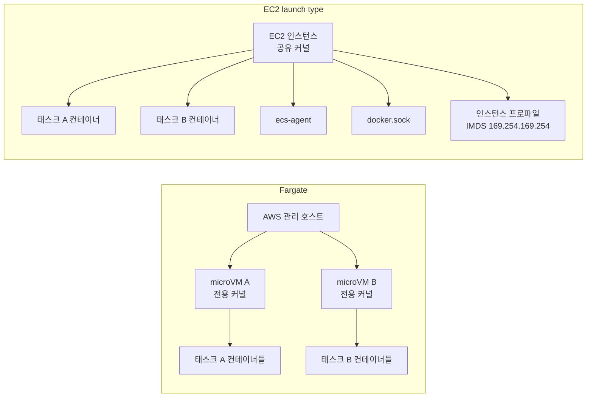
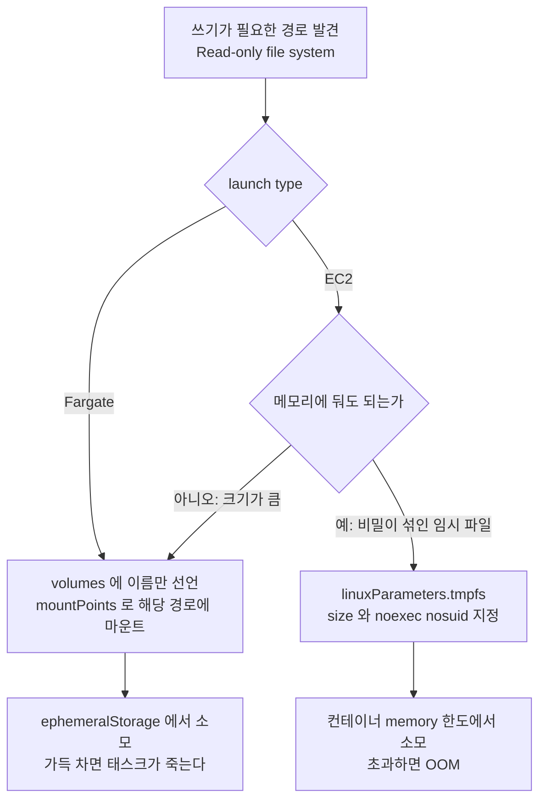
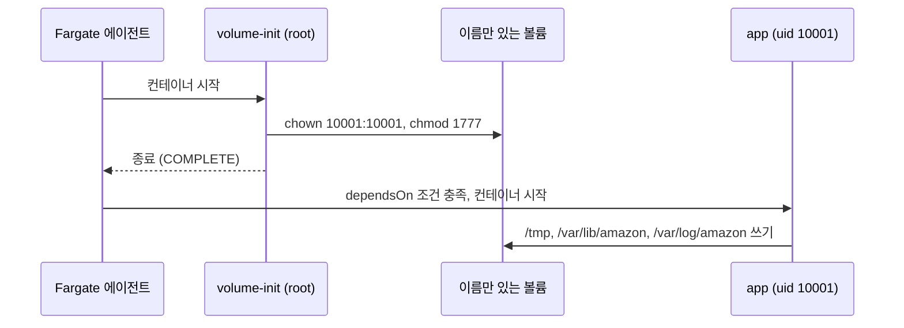
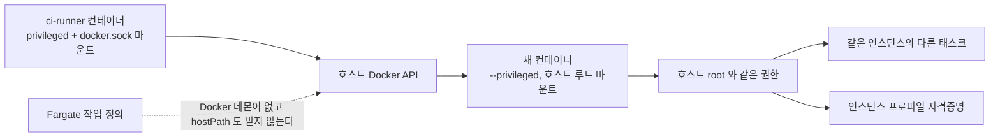
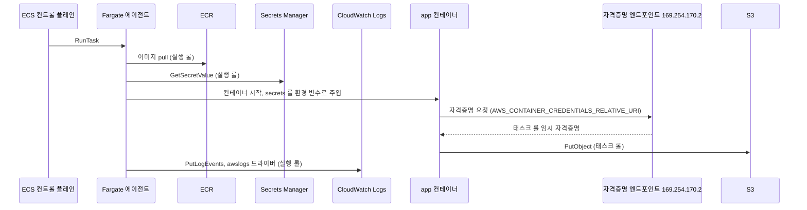
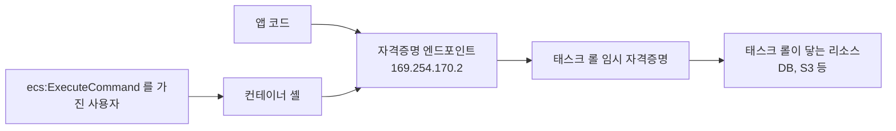
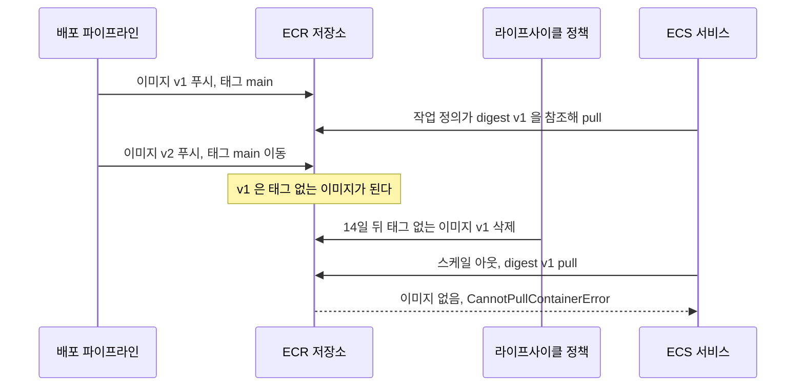

# ECS Fargate 컨테이너 하드닝

[Container Security](../../../Security/Container_Security.md)는 Docker와 쿠버네티스 기준이라 ECS 이야기가 없다. ECS 쪽 문서는 작업 정의([ECS Task Definition](ECS_Task_Definition.md)), 롤([ECS IAM Role 설정](ECS_IAM_Role_설정.md)), 접속([ECS Exec](ECS_Exec.md))이 각각 자기 주제 안에서 보안 필드를 한두 줄씩 언급할 뿐이고, 보안 설정만 모아서 "이 값을 켜면 무엇이 막히고 무엇이 깨지는가"를 정리한 곳이 없다. 이 문서는 ECS 작업 정의에 들어가는 보안 필드를 기준으로 그 빈칸을 채운다.

기준은 Fargate다. EC2 launch type은 Fargate에서 막혀 있는 것들이 열리는 쪽이라 별도 절에서 따로 다룬다.

---

## 격리 경계가 어디서 갈리는가

컨테이너 보안 설정을 얼마나 신경 써야 하는지는 컨테이너가 깨졌을 때 어디까지 번지는지에 달려 있다. Fargate와 EC2는 이 범위가 다르다.

Fargate는 태스크마다 전용 커널을 가진 microVM 안에서 돈다. AWS 문서는 Fargate 태스크가 다른 태스크와 커널, CPU, 메모리, ENI를 공유하지 않는다고 적고 있고, 구현에는 Firecracker가 쓰인다. 같은 태스크 안의 컨테이너끼리는 한 microVM을 공유한다. EC2 launch type은 인스턴스 하나의 커널 위에서 여러 태스크의 컨테이너가 같이 돈다.



왼쪽은 컨테이너 탈출에 성공해도 그 태스크의 microVM 안이다. 오른쪽은 탈출하면 같은 인스턴스의 다른 태스크 컨테이너, ecs-agent, 인스턴스 프로파일 자격증명까지 닿는다. 하드닝 항목 중 `privileged`, capability, 쓰기 가능한 루트 파일시스템은 전부 "탈출 경로를 줄이는 것"인데, EC2에서는 이게 인스턴스 전체를 지키는 일이고 Fargate에서는 태스크 하나를 지키는 일이다. Fargate에서 하드닝이 의미 없다는 뜻은 아니다. 태스크 롤 자격증명과 VPC 안의 네트워크 접근은 microVM 안에서 그대로 쓸 수 있기 때문에, 컨테이너 안에서 임의 코드가 실행되는 순간 문제가 되는 건 마찬가지다.

---

## 하드닝을 한 번에 적용한 작업 정의

필드별 설명 전에 전체 모양을 본다. 아래 JSON은 Fargate 전용이다. `register-task-definition --cli-input-json` 에 그대로 넣는 형태이고, botocore 의 `RegisterTaskDefinition` 입력 스키마 검증은 통과한다. 계정 ID, 롤 ARN, 시크릿 ARN, 이미지 digest는 자리 표시용 값이니 바꿔서 쓴다.

```json
{
  "family": "orders-api",
  "requiresCompatibilities": ["FARGATE"],
  "networkMode": "awsvpc",
  "cpu": "512",
  "memory": "1024",
  "runtimePlatform": {
    "cpuArchitecture": "X86_64",
    "operatingSystemFamily": "LINUX"
  },
  "executionRoleArn": "arn:aws:iam::123456789012:role/orders-api-execution",
  "taskRoleArn": "arn:aws:iam::123456789012:role/orders-api-task",
  "ephemeralStorage": { "sizeInGiB": 21 },
  "volumes": [
    { "name": "tmp" },
    { "name": "ssm-lib" },
    { "name": "ssm-log" }
  ],
  "containerDefinitions": [
    {
      "name": "app",
      "image": "123456789012.dkr.ecr.ap-northeast-2.amazonaws.com/orders-api@sha256:3f1c9a7b5d2e48c6a0b1f7e9d4c3a2b1e0f9d8c7b6a5948372615049382716ab",
      "essential": true,
      "user": "10001:10001",
      "privileged": false,
      "readonlyRootFilesystem": true,
      "stopTimeout": 30,
      "portMappings": [
        { "containerPort": 8080, "protocol": "tcp" }
      ],
      "linuxParameters": {
        "capabilities": { "drop": ["ALL"] },
        "initProcessEnabled": true
      },
      "mountPoints": [
        { "sourceVolume": "tmp", "containerPath": "/tmp", "readOnly": false },
        { "sourceVolume": "ssm-lib", "containerPath": "/var/lib/amazon", "readOnly": false },
        { "sourceVolume": "ssm-log", "containerPath": "/var/log/amazon", "readOnly": false }
      ],
      "secrets": [
        {
          "name": "DB_PASSWORD",
          "valueFrom": "arn:aws:secretsmanager:ap-northeast-2:123456789012:secret:prod/orders/db-AbCdEf:password::"
        }
      ],
      "logConfiguration": {
        "logDriver": "awslogs",
        "options": {
          "awslogs-group": "/ecs/orders-api",
          "awslogs-region": "ap-northeast-2",
          "awslogs-stream-prefix": "app"
        }
      }
    }
  ]
}
```

스키마 검증은 필드 이름과 타입만 본다. Fargate가 거부하는 조합(예를 들어 `tmpfs`)은 스키마 검증에서는 통과하고 실제 등록이나 실행 단계에서 걸린다. 그래서 이 문서의 JSON 은 "Fargate 에서 지원하지 않는 필드를 쓰지 않았는가"를 따로 따져서 만들었고, 그 판단 근거를 아래 절들에 적었다.

설정 항목마다 막는 것과 깨지는 것을 한 표로 정리하면 이렇다.

| 설정 | 막는 것 | 깨지는 것 | Fargate | EC2 |
|---|---|---|---|---|
| `readonlyRootFilesystem: true` | 웹쉘·악성 바이너리 쓰기, 설정 파일 변조 | `/tmp`, 캐시, pid 파일, 로그 디렉토리에 쓰는 앱. ECS Exec의 SSM agent | 가능 | 가능 |
| `user: "10001:10001"` | root 권한이 필요한 파일 조작, 패키지 설치 | 1024 미만 포트 바인딩, 볼륨 소유권이 root 인 경로 | 가능 | 가능 |
| `capabilities.drop: ["ALL"]` | raw socket(`NET_RAW`), 소유권 변경(`CHOWN`), uid 전환(`SETUID`) 같은 기본 capability 악용 | 위 capability 에 기대는 이미지(nginx 공식 이미지의 uid 전환 등) | drop 가능, add 는 `SYS_PTRACE` 만 | 가능 |
| `privileged: false` | 호스트 장치 접근, 커널 모듈 로드 | Docker-in-Docker, 장치 직접 접근 | 항상 false | 기본 false |
| `initProcessEnabled: true` | 좀비 프로세스 누적, SIGTERM 미전달 | 없음 (PID 1 이 tini 로 바뀜) | 가능 | 가능 |
| 이미지 digest 고정 | 태그 바꿔치기, 롤백 시 다른 이미지 | ECR 라이프사이클이 태그 없는 이미지를 지우면 pull 실패 | 가능 | 가능 |
| `awsvpc` + 태스크 SG | 같은 서브넷의 다른 태스크가 먼저 접근 | SG 를 안 좁히면 효과 없음 | 필수 | 선택 |
| `dockerSecurityOptions: no-new-privileges` | setuid 바이너리로 권한 상승 | setuid 에 기대는 이미지 | 사용 불가 | 가능 |

---

## 쓰기 가능한 경로를 어떻게 줄 것인가

`readonlyRootFilesystem: true` 는 켜는 건 한 줄이고 그 뒤가 일이다. 켜자마자 앱이 뜨다 죽는 경우가 많다. 로그에 `Read-only file system` 이 찍히면 어느 경로에 쓰려는지 찾아서 그 경로만 쓰기 가능한 볼륨으로 덮는다.

자주 걸리는 경로는 언어와 서버마다 정해져 있다.

| 런타임 | 쓰려는 경로 | 증상 |
|---|---|---|
| JVM | `/tmp/hsperfdata_*`, 임베디드 Tomcat 작업 디렉토리 | 경고만 나오거나, Spring Boot 업로드 처리에서 예외 |
| Node.js | `/tmp`, `~/.npm`, `~/.cache` | 라이브러리가 캐시 디렉토리를 못 만들어 기동 실패 |
| Python | `__pycache__`, `/tmp` | 예외 없이 느려진다. 매번 바이트코드를 다시 컴파일한다 |
| nginx | `/var/cache/nginx`, `/var/run/nginx.pid`, `/var/log/nginx` | 기동 직후 종료 |

Python 이 가장 조용하다. 에러가 없으니 read-only 때문이라고 의심하지 못하고 기동 시간이 늘어난 것만 보인다. `PYTHONDONTWRITEBYTECODE=1` 이나 이미지 빌드 시점의 `compileall` 로 미리 만들어 두면 해결된다.

### Fargate에는 tmpfs가 없다

쿠버네티스의 `emptyDir: medium: Memory` 같은 걸 기대하고 `linuxParameters.tmpfs` 를 쓰면 Fargate에서는 안 된다. ECS 문서의 `tmpfs` 항목에 Fargate launch type은 지원하지 않는다고 적혀 있다. `sharedMemorySize` 도 같다. Fargate 에서 쓰기 경로를 만드는 방법은 작업 정의 `volumes` 에 이름만 있는 볼륨을 선언하고 `mountPoints` 로 붙이는 것 하나다. 이 볼륨은 태스크의 임시 스토리지(`ephemeralStorage`, 기본 20GiB) 위에 만들어지고, 태스크가 끝나면 사라진다.



Fargate 쪽 선택지는 하나지만 EC2 쪽은 갈린다. tmpfs 는 디스크에 안 남아서 임시 파일에 비밀이 섞이는 앱에 맞고, 대신 사용량이 컨테이너 메모리 한도에서 빠진다. 볼륨은 디스크라 크기에 여유가 있고 대신 태스크 스토리지를 쓴다. 두 경우 모두 "가득 차면 어떻게 되는가"가 다르다. 볼륨이 차면 쓰기 실패나 태스크 종료로 이어지고, tmpfs 가 차면 OOM kill 로 이어진다.

### 마운트한 경로의 소유권

`user` 를 non-root 로 두고 볼륨을 마운트하면 두 번째로 막힌다. 새로 만든 빈 볼륨의 마운트 지점이 root 소유로 나와서 uid 10001 이 `Permission denied` 를 받는 경우가 있다. 이 동작은 플랫폼 버전과 이미지 안에 그 디렉토리가 이미 있는지에 따라 달라서, 문서에서 읽은 대로 가정하지 말고 한 번 띄워서 `ls -ld /tmp` 로 소유권을 확인해야 한다.

root 소유로 나오면 이미지 빌드 때 그 경로를 만들어 두고 `chown` 해도 소용없는 경우가 있다. 이때는 같은 볼륨을 root 로 먼저 마운트하는 init 컨테이너를 하나 두고 `dependsOn` 의 `COMPLETE` 조건으로 앱 컨테이너를 늦춘다.

```json
{
  "name": "volume-init",
  "image": "123456789012.dkr.ecr.ap-northeast-2.amazonaws.com/orders-api@sha256:3f1c9a7b5d2e48c6a0b1f7e9d4c3a2b1e0f9d8c7b6a5948372615049382716ab",
  "essential": false,
  "user": "0",
  "readonlyRootFilesystem": true,
  "entryPoint": ["sh", "-c"],
  "command": ["chown 10001:10001 /tmp /var/lib/amazon /var/log/amazon && chmod 1777 /tmp"],
  "mountPoints": [
    { "sourceVolume": "tmp", "containerPath": "/tmp", "readOnly": false },
    { "sourceVolume": "ssm-lib", "containerPath": "/var/lib/amazon", "readOnly": false },
    { "sourceVolume": "ssm-log", "containerPath": "/var/log/amazon", "readOnly": false }
  ]
}
```

`app` 컨테이너 정의에는 `"dependsOn": [{ "containerName": "volume-init", "condition": "COMPLETE" }]` 를 넣는다. 이 init 컨테이너에는 `capabilities.drop` 을 걸지 않았다. root 라도 `CHOWN` capability 가 없으면 소유권을 못 바꾸고, Fargate 는 `add` 로 `SYS_PTRACE` 만 되살릴 수 있어서 `ALL` 을 버린 뒤 `CHOWN` 만 남기는 조합이 불가능하기 때문이다. 몇 초 만에 끝나고 `essential: false` 인 컨테이너라 이 정도는 감수한다. 앱 컨테이너가 아니라 init 컨테이너만 root 로 도는 구조라서, 이 컨테이너에는 시크릿도 `taskRoleArn` 에 기대는 코드도 넣지 않는다. 같은 태스크 안이라 태스크 롤 자격증명 엔드포인트는 이 컨테이너에서도 닿는다.

아래 순서도에서 `volume-init` 이 끝나야 `app` 이 시작된다는 점, 그리고 소유권 변경이 `app` 시작 전에 끝난다는 점을 본다.



---

## capability, PID 1, privileged, user

### capabilities.drop

컨테이너는 아무것도 지정하지 않아도 기본 capability 묶음을 받는다. 목록은 ECS 문서의 `linuxParameters` 항목에 있고 `NET_RAW`, `SETUID`, `SETGID`, `CHOWN`, `DAC_OVERRIDE` 같은 것이 들어 있다. 웹 애플리케이션이 이 중 쓰는 건 거의 없다. `drop: ["ALL"]` 로 전부 버리고 시작해서 앱이 안 뜨면 그때 원인을 본다.

Fargate 에서 가장 먼저 부딪히는 제약은 `add` 로 되살릴 수 있는 capability 가 `SYS_PTRACE` 하나뿐이라는 점이다([ECS Task Definition](ECS_Task_Definition.md)에도 같은 내용이 있다). `ALL` 을 버린 뒤 `NET_BIND_SERVICE` 만 돌려놓는 방식이 안 된다. 그래서 컨테이너는 1024 이상 포트(8080 등)로 받고 80/443 은 ALB 가 맡게 한다. 이미지가 80 포트를 고정으로 쓰는 공식 nginx 같은 경우에는 `nginxinc/nginx-unprivileged` 처럼 8080 을 쓰는 변형을 고른다.

`NET_RAW` 를 버리는 것이 효과가 가장 눈에 보인다. 컨테이너 안에서 `ping` 이 안 되고 raw socket 을 여는 스캐너나 패킷 스푸핑 도구가 못 돈다. 대신 디버깅 때 `ping` 으로 연결을 확인하던 습관이 안 통한다. `nc` 나 `curl` 로 TCP 레벨에서 확인한다.

### initProcessEnabled

`initProcessEnabled: true` 는 PID 1 을 `tini` 로 바꾼다. 앱이 자식 프로세스를 띄우고 회수하지 않는 경우(셸 스크립트 엔트리포인트, 헬스체크용 서브프로세스)에 좀비가 쌓이는 것을 막고, 태스크 종료 때 SIGTERM 을 앱까지 전달한다. 보안 설정이라기보다 안정성 설정이지만, ECS Exec 을 켠 태스크에서는 사실상 필수다. 세션마다 SSM agent 가 프로세스를 띄우고, 세션이 끝난 뒤 남는 자식 프로세스를 PID 1 이 회수해야 한다. 앱이 PID 1 이면 회수 코드가 없어서 좀비가 쌓인다. 부작용은 없고 켜지 않을 이유도 없다.

### privileged 는 쓰지 않는다

Fargate 호환으로 등록하는 작업 정의에서 `privileged: true` 는 검증에서 걸린다. 명시적으로 `false` 를 적어 두면 EC2 로 옮길 때나 템플릿을 복사해 쓸 때 실수로 true 가 들어가는 걸 diff 에서 잡을 수 있다. 값이 생략된 것과 `false` 로 적힌 것은 동작이 같지만 리뷰에서 보이는 정도가 다르다.

### user

`user` 필드는 `"uid:gid"` 문자열이다. 이미지의 `USER` 지시어가 있어도 작업 정의의 값이 우선한다. 두 곳에서 따로 관리하면 어긋나므로 작업 정의에 명시해 둔다. 이미지가 root 로 빌드되어 파일이 root 소유 `700` 으로 들어 있으면 non-root 로 돌릴 때 앱 파일을 못 읽는다. `COPY --chown=10001:10001` 로 소유권을 맞춰서 빌드한다.

ECS Exec 으로 들어간 셸이 어떤 uid 로 열리는지는 문서마다 다르게 적혀 있다. [ECS Exec](ECS_Exec.md) 은 컨테이너 유저와 같다고 쓰고 있지만, 어떤 SSM agent 버전과 플랫폼 버전에서 그렇게 되는지는 직접 확인한 게 아니면 가정하지 않는 편이 안전하다.

```bash
aws ecs execute-command --cluster prod --task <task-id> --container app \
  --interactive --command "id"
```

`uid=0(root)` 가 나오면 `user` 설정으로 막으려던 것 상당수가 Exec 세션에서는 무력해진다. 그 경우 Exec 접근 권한 자체를 좁히는 쪽으로 방어선을 옮겨야 한다.

---

## Fargate에서 막혀 있는 것과 EC2에서 열리는 것

Fargate 에서는 호스트 자원에 닿는 필드가 작업 정의 단계에서 검증으로 걸러진다. 이유는 앞에서 본 구조 때문이다. 호스트가 없는 게 아니라 호스트가 AWS 소유이고 사용자 태스크와 다른 경계에 있다. `docker.sock` 은 호스트의 Docker 데몬에 붙는 소켓인데, Fargate 에는 사용자가 접근할 Docker 데몬이 없다. `hostPath` 도 같은 이유다. 호스트 디렉토리를 마운트하려면 `volumes.host.sourcePath` 를 써야 하는데 Fargate 는 이 필드를 받지 않는다. 이름만 있는 볼륨이 그나마 가능한 것이다.

EC2 launch type 에서는 이 필드들이 열린다. 아래는 EC2 에서 컨테이너를 호스트 root 와 같게 만드는 설정들이다.

```json
{
  "volumes": [
    { "name": "docker-sock", "host": { "sourcePath": "/var/run/docker.sock" } }
  ],
  "containerDefinitions": [
    {
      "name": "ci-runner",
      "privileged": true,
      "mountPoints": [
        { "sourceVolume": "docker-sock", "containerPath": "/var/run/docker.sock" }
      ]
    }
  ],
  "pidMode": "host"
}
```

`docker.sock` 을 마운트한 컨테이너는 Docker API 로 호스트에 다른 컨테이너를 `--privileged` 로 띄우고 호스트 루트를 마운트할 수 있다. 그 컨테이너는 호스트 root 와 같다. CI 러너에 흔히 쓰이는 패턴이라 "빌드 편하니까" 하고 넣었다가 운영 클러스터와 같은 인스턴스 풀에 태스크가 섞이면 인스턴스 전체가 열린다. 빌드는 Fargate 에서 Kaniko, BuildKit rootless 같은 데몬 없는 빌더로 옮기는 게 현실적인 대안이다([Rootless Containers](../../../Security/Rootless_Containers_User_Namespaces.md) 참고).

`docker.sock` 마운트가 호스트 전체로 번지는 경로와 Fargate 에서 그 경로가 시작점부터 없다는 점을 비교해서 본다.



EC2 에서 하드닝은 이 필드들을 쓰지 않는 것에서 끝나지 않는다. 인스턴스 프로파일의 IMDS 도 태스크에서 닿는다. 아래 두 줄이 모두 필요하다.

```bash
# /etc/ecs/ecs.config (awsvpc 모드 태스크의 IMDS 접근 차단)
ECS_AWSVPC_BLOCK_IMDS=true
```

그리고 시작 템플릿의 `MetadataOptions` 에 `HttpTokens: required`, `HttpPutResponseHopLimit: 1` 을 둔다. IMDSv2 토큰 응답이 hop 한 번까지만 가므로 브리지 네트워크를 건너는 컨테이너 쪽은 막힌다. 설정한 뒤에는 태스크 안에서 `curl -m 2 http://169.254.169.254/latest/meta-data/` 가 타임아웃이 나는지 직접 확인한다. awsvpc, bridge, host 모드마다 동작이 달라서 모드 하나만 확인하고 끝내면 놓친다.

EC2 에서 쓸 수 있는 하드닝 필드 조합은 이렇다. 위 Fargate 정의와 달리 `tmpfs` 와 `dockerSecurityOptions` 가 들어간다. 이 JSON 도 `RegisterTaskDefinition` 스키마 검증은 통과한다.

```json
{
  "family": "orders-worker",
  "requiresCompatibilities": ["EC2"],
  "networkMode": "awsvpc",
  "cpu": "512",
  "memory": "1024",
  "taskRoleArn": "arn:aws:iam::123456789012:role/orders-worker-task",
  "executionRoleArn": "arn:aws:iam::123456789012:role/orders-worker-execution",
  "containerDefinitions": [
    {
      "name": "worker",
      "image": "123456789012.dkr.ecr.ap-northeast-2.amazonaws.com/orders-worker@sha256:9c8b7a6f5e4d3c2b1a0f9e8d7c6b5a4938271605f4e3d2c1b0a998877665544a",
      "essential": true,
      "user": "10001:10001",
      "privileged": false,
      "readonlyRootFilesystem": true,
      "dockerSecurityOptions": ["no-new-privileges"],
      "linuxParameters": {
        "capabilities": { "drop": ["ALL"] },
        "initProcessEnabled": true,
        "tmpfs": [
          { "containerPath": "/tmp", "size": 64, "mountOptions": ["rw", "noexec", "nosuid"] }
        ]
      }
    }
  ]
}
```

`tmpfs.size` 단위는 MiB 다. `noexec` 를 붙이면 `/tmp` 에 내려받은 바이너리를 실행할 수 없다. JVM 이 `/tmp` 에 네이티브 라이브러리를 풀어서 로드하는 경우(Netty 의 epoll 라이브러리, Snappy 등)에는 `noexec` 때문에 기동이 실패하므로, 그런 앱에서는 `noexec` 를 빼거나 라이브러리를 이미지에 미리 넣는다.

---

## 태스크 롤과 실행 롤

롤 두 개를 하나로 합치면 편하지만 하드닝 관점에서는 가장 먼저 쪼개야 하는 부분이다. 둘은 쓰이는 시점도 쓰는 주체도 다르다.



세로로 보면 시점이 갈린다. 시작 전의 `pull` 과 `GetSecretValue` 는 에이전트가 실행 롤로 한다. 앱이 시작된 뒤의 `PutObject` 는 앱 코드가 태스크 롤로 한다. 로그 전송은 awslogs 드라이버가 실행 롤로 한다. 실행 롤의 자격증명은 컨테이너 안에서 받을 방법이 없다. 컨테이너가 받을 수 있는 건 태스크 롤뿐이다.

이 구분이 하드닝에서 중요한 이유는 컨테이너가 뚫렸을 때 가져갈 수 있는 권한이 태스크 롤뿐이라는 점이다. 둘을 합치면 이미지 pull 권한, 시크릿 읽기 권한이 모두 앱 코드 쪽으로 넘어간다. 실행 롤에는 시크릿 읽기가 들어간다. 이 시크릿들은 앱이 환경 변수로 받으니 앱 코드는 어차피 볼 수 있다. 하지만 시크릿 전체를 읽는 권한(`secretsmanager:GetSecretValue` 를 `*` 로 준 경우)과 이 앱이 쓰는 시크릿 하나를 읽는 권한은 다르다.

```json
{
  "Version": "2012-10-17",
  "Statement": [
    {
      "Effect": "Allow",
      "Action": ["secretsmanager:GetSecretValue"],
      "Resource": "arn:aws:secretsmanager:ap-northeast-2:123456789012:secret:prod/orders/db-*"
    },
    {
      "Effect": "Allow",
      "Action": ["kms:Decrypt"],
      "Resource": "arn:aws:kms:ap-northeast-2:123456789012:key/11111111-2222-3333-4444-555555555555"
    }
  ]
}
```

위가 실행 롤에 붙이는 인라인 정책이다. `AmazonECSTaskExecutionRolePolicy` 관리형 정책(ECR pull, 로그 쓰기)에 더한다. 시크릿 ARN 끝의 `-*` 는 Secrets Manager 가 ARN 끝에 붙이는 랜덤 6자리 때문에 필요하다. 이걸 빼먹고 정확한 ARN 만 쓰면 `AccessDeniedException` 이 나서 한참 헤맨다.

태스크 롤은 반대로 줄이는 방향이다. 앱 코드가 호출하는 API 만, 앱이 쓰는 리소스에만 준다. 태스크 롤에 `s3:*` 를 `*` 로 두면 컨테이너가 뚫린 순간 계정 전체의 버킷이 열린다. 태스크 롤 정책은 [ECS IAM Role 설정](ECS_IAM_Role_설정.md)에 예제가 있다.

---

## ECS Exec이 켜진 태스크

ECS Exec 을 쓰려면 태스크 롤에 `ssmmessages` 권한을 넣어야 하고, 그 태스크에 `ecs:ExecuteCommand` 를 가진 모든 사람이 컨테이너 안에서 셸을 얻는다. 셸을 얻은 사람은 앱과 똑같이 자격증명 엔드포인트를 칠 수 있다.

```bash
curl -s "http://169.254.170.2${AWS_CONTAINER_CREDENTIALS_RELATIVE_URI}"
```

그래서 `ecs:ExecuteCommand` 권한은 "그 태스크의 태스크 롤 권한을 줘도 되는 사람에게만" 주는 권한이다. 태스크 롤이 운영 DB 를 읽고 결제 버킷에 쓸 수 있으면, 개발자에게 디버깅용으로 준 Exec 권한이 곧 그 접근 권한이다. 태스크 롤이 좁을수록 Exec 도 안전해지니 두 설정은 같이 간다.

앱 코드와 Exec 세션이 같은 자격증명 엔드포인트로 합쳐지는 지점을 보면 된다.



### CloudTrail 에 남는 것

Exec 세션이 시작되면 ECS 가 CloudTrail 에 `ExecuteCommand` 이벤트를 남긴다. 호출한 IAM 주체, 클러스터, 태스크, 컨테이너, 넘긴 명령이 들어 있다. 대화형 세션(`--interactive --command "/bin/sh"`)이면 명령은 셸 실행 파일 이름 하나뿐이다. 세션 안에서 친 명령은 CloudTrail 에 없고, 그건 클러스터 설정의 `executeCommandConfiguration` 로 보내는 세션 로그에 있다([ECS Exec](ECS_Exec.md)의 감사 로그 절).

CloudTrail 을 CloudWatch Logs 로 보내고 있으면 Logs Insights 로 이렇게 찾는다. 필드 이름은 이벤트 한 건을 열어서 `requestParameters` 구조를 확인한 뒤 맞춘다.

```sql
fields @timestamp, userIdentity.arn, requestParameters.cluster,
       requestParameters.task, requestParameters.container, requestParameters.command
| filter eventSource = "ecs.amazonaws.com" and eventName = "ExecuteCommand"
| sort @timestamp desc
| limit 50
```

실시간으로 알림을 받으려면 EventBridge 규칙을 건다.

```json
{
  "source": ["aws.ecs"],
  "detail-type": ["AWS API Call via CloudTrail"],
  "detail": {
    "eventSource": ["ecs.amazonaws.com"],
    "eventName": ["ExecuteCommand"]
  }
}
```

### 구분되지 않는 것

가장 곤란한 건 Exec 세션 안에서 사람이 태스크 롤로 한 API 호출과 앱 코드가 한 호출이 CloudTrail 에서 구분되지 않는다는 점이다. 둘 다 `assumed-role/orders-api-task/<task-id>` 라는 같은 주체로 찍힌다. 세션 이름이 태스크 ID 이기 때문이다. 사고가 났을 때 알 수 있는 건 "Exec 이 이 시각에 열렸다"와 "그 시간대에 이 태스크의 롤로 이런 호출이 있었다" 두 가지이고, 둘을 시간 겹침으로 추정할 수밖에 없다.

```sql
fields @timestamp, eventName, requestParameters.bucketName
| filter userIdentity.arn like /assumed-role\/orders-api-task\/<task-id>/
| sort @timestamp asc
```

그래서 운영에서는 Exec 을 상시 켜 두지 않고 필요할 때만 켠다. 서비스를 `enable-execute-command` 로 갱신하면 새 태스크가 뜨는 롤링 배포가 일어나므로 급할 때는 느리다. 평소에 켜 두되 IAM 으로 접근 가능한 주체를 좁히는 방식을 쓰는 곳이 많다. 어느 쪽이든 Exec 이 켜진 서비스를 새로 만들거나 갱신하는 것 자체를 제한하는 정책을 건다.

```json
{
  "Effect": "Deny",
  "Action": ["ecs:RunTask", "ecs:StartTask", "ecs:CreateService", "ecs:UpdateService"],
  "Resource": "*",
  "Condition": {
    "Bool": { "ecs:enable-execute-command": "true" }
  }
}
```

이 정책은 개발자 롤에 붙여서 "스스로 Exec 을 켜는" 경로를 막고, 켜는 일은 별도 롤이나 파이프라인에서만 하게 한다.

---

## 이미지 digest 고정과 취약점 스캔

작업 정의의 `image` 를 `repo:tag` 로 쓰면 태그가 가리키는 이미지가 바뀌었는지 알 수 없다. 작업 정의 리비전은 태그 문자열만 기록한다. `repo@sha256:...` 로 쓰면 digest 가 같은 한 이미지가 같다. 이 부분은 [ECS Task Definition](ECS_Task_Definition.md)에도 있지만 하드닝 쪽에서 의미가 하나 더 붙는다. 취약점이 나왔을 때 "지금 돌고 있는 게 정확히 어떤 이미지인가"를 한 번에 답할 수 있다.

태그로 배포한 서비스도 실제로 받은 digest 를 `describe-tasks` 가 알려 준다.

```bash
aws ecs describe-tasks --cluster prod --tasks <task-id> \
  --query 'tasks[].containers[].[name,image,imageDigest]' --output table
```

### Inspector 연속 스캔

ECR 의 Enhanced 스캔은 Inspector 가 이미지를 스캔하는 방식이다. 푸시 시점에 한 번 스캔하는 Basic 과 달리, 연속 스캔(`CONTINUOUS_SCAN`)은 새 CVE 가 공개되면 이미 푸시된 이미지를 다시 평가한다. 두 달 전에 푸시한 이미지에 오늘 CVE 가 걸리는 일이 흔해서 푸시 시점 스캔만으로는 부족하다. 레지스트리 단위로 켠다.

```bash
aws ecr put-registry-scanning-configuration \
  --scan-type ENHANCED \
  --rules '[{"scanFrequency":"CONTINUOUS_SCAN","repositoryFilters":[{"filter":"orders-*","filterType":"WILDCARD"}]}]'
```

연속 스캔은 푸시 후 일정 기간(Inspector 설정의 재스캔 기간) 안의 이미지만 대상으로 한다. 그 기간보다 오래된 이미지가 아직 돌고 있으면 새 CVE 가 평가되지 않는다. 장기간 안 바뀌는 서비스가 있으면 설정된 기간을 확인한다.

Inspector 의 finding 은 EventBridge 로 나오고(`source: aws.inspector2`, `detail-type: Inspector2 Finding`), ECR 이미지 finding 에는 저장소 이름, 태그, 이미지 해시(digest)가 들어 있다. digest 로 고정해 둔 작업 정의가 있으면 이 해시로 작업 정의를 검색해서 어느 서비스가 영향을 받는지 바로 찾는다.

```bash
for td in $(aws ecs list-task-definitions --status ACTIVE --query 'taskDefinitionArns[]' --output text); do
  aws ecs describe-task-definition --task-definition "$td" \
    --query 'taskDefinition.[taskDefinitionArn, containerDefinitions[].image]' --output text
done | grep 3f1c9a7b5d2e
```

### 라이프사이클 정책과 digest 의 충돌

digest 고정 이미지를 쓸 때 한 번쯤 사고가 나는 지점이다. ECR 라이프사이클 정책에 "태그 없는 이미지는 14일 뒤 삭제" 를 걸어 두는 경우가 많다. 이미지를 digest 로만 참조하면 그 이미지에 태그가 붙어 있어야 한다는 보장이 없다. 같은 태그(`latest`, `main`)를 새 이미지로 옮기면 이전 이미지는 태그 없는 이미지가 되고, 작업 정의가 아직 그 digest 를 참조해도 정책이 지운다. 며칠 뒤 스케일 아웃이나 태스크 교체 때 `CannotPullContainerError` 가 나는 식으로 드러난다. 태스크가 계속 떠 있는 동안은 이미 받은 이미지가 있어서 문제가 안 보이기 때문에 발견이 늦다.

이미지가 지워진 시점과 오류가 드러나는 시점 사이가 벌어지는 순서를 아래에서 확인한다.



배포하는 이미지에는 불변 태그(커밋 SHA)를 항상 같이 붙이고, 라이프사이클 정책은 "태그 없는 이미지"가 아니라 "SHA 태그 이미지를 최근 N 개 유지" 로 짠다. 저장소의 태그 불변성(`imageTagMutability: IMMUTABLE`)도 켜 두면 같은 태그를 덮어쓰는 일 자체가 없어진다. cosign 서명을 쓰는 곳은 [ECR](ECR.md)에 있는 불변 태그와의 충돌 주의사항을 같이 본다.

---

## awsvpc 모드에서 태스크 단위로 격리하기

Fargate 는 `awsvpc` 만 지원하고 태스크마다 ENI 를 하나 받는다. 보안 그룹이 ENI 에 붙으니 SG 의 단위가 인스턴스가 아니라 태스크(정확히는 서비스에서 같이 만들어진 태스크 묶음)다. 같은 서브넷에서 돌아도 서비스별로 SG 를 따로 쓰면 다른 서비스의 태스크가 이 서비스의 8080 에 접근하는 걸 SG 로 막을 수 있다.

```bash
aws ecs create-service --cluster prod --service-name orders-api \
  --task-definition orders-api --desired-count 2 --launch-type FARGATE \
  --network-configuration 'awsvpcConfiguration={subnets=[subnet-0a1b2c3d,subnet-4e5f6a7b],securityGroups=[sg-0orders000api000],assignPublicIp=DISABLED}'
```

인바운드는 ALB 의 SG 에서 오는 8080 만 연다.

```bash
aws ec2 authorize-security-group-ingress --group-id sg-0orders000api000 \
  --protocol tcp --port 8080 --source-group sg-0alb0000000000
```

보안 그룹을 새로 만들면 아웃바운드가 전체 허용이다. 이걸 그대로 두면 컨테이너가 뚫렸을 때 외부로 데이터를 보내거나 외부에서 도구를 내려받는 길이 열려 있다. 기본 규칙을 지우고, 이 태스크가 실제로 나가는 곳만 허용한다.

```bash
aws ec2 revoke-security-group-egress --group-id sg-0orders000api000 \
  --ip-permissions 'IpProtocol=-1,IpRanges=[{CidrIp=0.0.0.0/0}]'

aws ec2 authorize-security-group-egress --group-id sg-0orders000api000 \
  --ip-permissions 'IpProtocol=tcp,FromPort=443,ToPort=443,UserIdGroupPairs=[{GroupId=sg-0vpce00000000}]'

S3_PL=$(aws ec2 describe-prefix-lists \
  --filters Name=prefix-list-name,Values=com.amazonaws.ap-northeast-2.s3 \
  --query 'PrefixLists[0].PrefixListId' --output text)
aws ec2 authorize-security-group-egress --group-id sg-0orders000api000 \
  --ip-permissions "IpProtocol=tcp,FromPort=443,ToPort=443,PrefixListIds=[{PrefixListId=$S3_PL}]"
```

이 상태에서 태스크가 뜨려면 나가야 하는 목적지가 여럿 있다. 하나라도 빠지면 태스크가 `PROVISIONING` 에서 멈추거나 `CannotPullContainerError` 로 죽는다.

| 목적지 | 용도 | 비고 |
|---|---|---|
| ECR API, ECR DKR 엔드포인트 | 이미지 manifest, 인증 | 인터페이스 엔드포인트 2개 |
| S3 | 이미지 레이어 다운로드 | 게이트웨이 엔드포인트. SG 에서는 프리픽스 리스트로 연다 |
| CloudWatch Logs 엔드포인트 | awslogs 드라이버 | 실행 롤 |
| Secrets Manager 엔드포인트 | `secrets` 주입 | 실행 롤 |
| `ssmmessages` 엔드포인트 | ECS Exec | Exec 을 쓰는 서비스만 |
| DB, 캐시 등 앱 의존성 | 앱 트래픽 | 해당 SG 를 대상으로 지정 |

ECR 이 레이어를 S3 에서 받는다는 점을 몰라서 ECR 엔드포인트만 만들고 S3 를 빼먹는 경우가 가장 흔하다. manifest 는 받아지는데 레이어에서 막혀서 증상이 `i/o timeout` 으로 나온다.

SG 가 못 하는 것도 있다. 같은 태스크 안의 컨테이너끼리는 `localhost` 로 붙고, 태스크에 SG 가 하나뿐이라 사이드카와 앱 사이는 SG 로 나눌 수 없다. 로그 수집 사이드카(Fluent Bit)나 프록시 사이드카(Envoy)가 같은 microVM, 같은 네트워크 네임스페이스에 있으므로, 사이드카 이미지도 앱 이미지와 같은 하드닝(non-root, capability drop, digest 고정)을 적용한다. 사이드카가 뚫리면 앱의 localhost 포트와 태스크 롤이 바로 열리기 때문이다([ECS Sidecar Patterns](ECS_Sidecar_Patterns.md)).

---

## 적용하다 보면 막히는 지점

적용 순서가 정해진 건 아니지만, 한 번에 다 켜면 어느 설정 때문에 죽었는지 모른다. 한 가지씩 켜고 태스크가 `RUNNING` 에서 안정되는지 본다. 증상별로 원인을 먼저 특정하는 쪽이 빠르다.

| 증상 | 가능성 높은 원인 | 확인 |
|---|---|---|
| 기동 직후 종료, 로그에 `Read-only file system` | `readonlyRootFilesystem` | 로그에서 경로를 찾아 볼륨 마운트 추가 |
| `Permission denied`, 파일은 존재 | `user` 와 파일·볼륨 소유권 불일치 | `ls -ld`, 이미지 `COPY --chown` |
| `bind: permission denied` (포트) | 1024 미만 포트 + `drop: ["ALL"]` | 앱 포트를 8080 으로 |
| `RegisterTaskDefinition` 거부 | Fargate 에서 `tmpfs`, `privileged`, `hostPath` 사용 | 필드 제거, 위 표 확인 |
| `execute-command` 가 `TargetNotConnected` | read-only 인데 SSM 경로 볼륨 없음, 또는 `ssmmessages` 엔드포인트 없음 | `describe-tasks` 의 `managedAgents` |
| 새 태스크만 `CannotPullContainerError` | 라이프사이클이 태그 없는 digest 이미지 삭제, 또는 S3 egress 누락 | ECR 에서 이미지 존재 확인, SG egress |
| 태스크 도중 갑자기 죽음, 종료 사유 불명 | `/tmp` 볼륨이 `ephemeralStorage` 를 가득 채움 | `ephemeralStorage` 크기, 임시 파일 정리 로직 |

증상이 여러 개 동시에 뜨면 가장 앞 단계의 것부터 본다. 기동 단계에서 죽은 앱은 헬스체크, ALB 타겟 등록 실패, 서비스 이벤트의 "unable to place a task" 같은 뒤쪽 증상을 줄줄이 만드는데, 앞 단계가 풀리면 그것들이 같이 사라진다.
