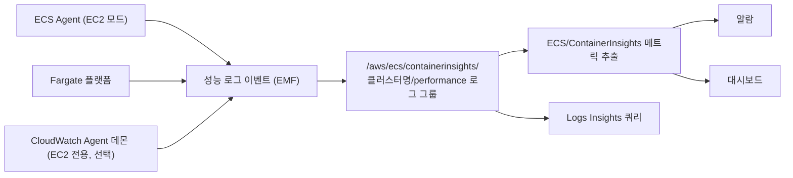
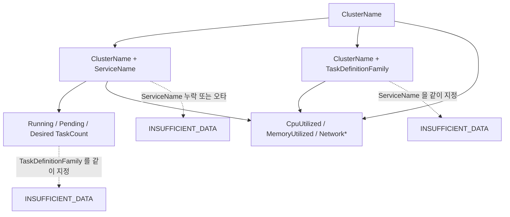
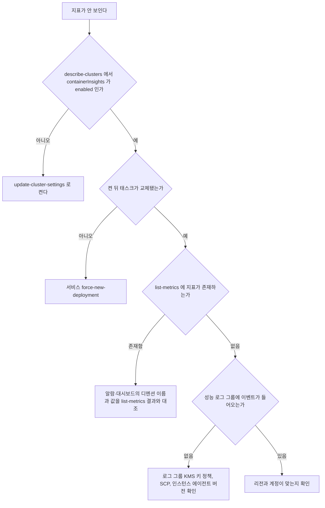
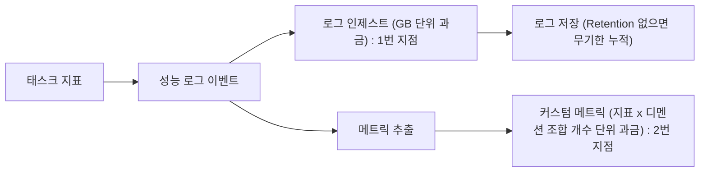

# ECS Container Insights

기본 `CPUUtilization`, `MemoryUtilization`은 예약량 대비 사용률이라 컨테이너가 실제로 몇 MiB를 쓰는지 알 수 없다. 이 간극을 메우는 게 Container Insights다.

이 문서는 메트릭과 알람만 다룬다. stdout/stderr 라우팅은 [ECS 로그 관리](ECS_로그_관리.md)에서, `enhanced` 모드의 태스크·컨테이너 단위 지표는 [Enhanced Observability](ECS_Container_Insights_Enhanced.md)에서 다룬다.

## 기본 지표로 안 보이는 것

기본 `AWS/ECS` 지표와 Container Insights가 채워주는 지표를 나란히 놓으면 차이가 분명하다.

| 보고 싶은 것 | `AWS/ECS` (기본) | `ECS/ContainerInsights` |
|---|---|---|
| CPU·메모리 사용률 | 예약 대비 %, 클러스터·서비스 단위 | 절대값(`CpuUtilized`, `MemoryUtilized`)과 예약값(`CpuReserved`, `MemoryReserved`) |
| 태스크 정의 패밀리 단위 | 없음 | 있음 (`TaskDefinitionFamily`) |
| Running / Pending / Desired 태스크 수 | 없음 | `RunningTaskCount`, `PendingTaskCount`, `DesiredTaskCount` |
| 네트워크 송수신 | 없음 | `NetworkRxBytes`, `NetworkTxBytes` |
| 스토리지 읽기·쓰기, 임시 스토리지 | 없음 | `StorageReadBytes`, `StorageWriteBytes`, `EphemeralStorageUtilized` |
| 배포 개수, 서비스 개수 | 없음 | `DeploymentCount`, `ServiceCount` |

분모가 문제다. `MemoryUtilization` 70%는 "컨테이너 메모리의 70%"가 아니라 Task Definition에 적어 둔 `memory`/`memoryReservation` 합 대비 비율이다.

```
MemoryUtilization = (서비스 내 태스크들이 실제 사용 중인 메모리 합)
                  / (서비스 내 태스크들이 예약한 메모리 합) × 100
```

2GB를 예약하고 앱이 500MB만 쓰면 25%다. 일시적으로 1.9GB까지 튀면 그제야 95%가 찍히고 곧 OOM이다. 과다 예약한 서비스는 메모리 기준 [Service Auto Scaling](ECS_Service_Auto_Scaling.md)(`ECSServiceAverageMemoryUtilization`)도 낮은 값만 봐서 스케일 아웃이 걸리지 않는다. 예약을 2GB에서 1GB로 줄여도 되는지도 실사용 최대치(절대값)를 봐야 판단된다.

`MemoryUtilized`와 `MemoryReserved`는 Megabytes로 표기되지만 실제 단위는 MiB다. Java ZGC 앱은 값이 부정확할 수 있다고 AWS 문서에 적혀 있다. 서비스 단위 값이 태스크 합계인지 평균인지는 문서 표현이 모호하니 태스크 1개짜리 서비스에서 맞춰 본 뒤 해석한다. 비율 알람은 이 모호함의 영향을 받지 않는다.

## 수집 경로

태스크 지표는 EC2 모드에서는 ECS Agent가, Fargate에서는 플랫폼이 수집해 EMF 형식 성능 로그 이벤트로 로그 그룹에 쌓고, CloudWatch가 거기서 지표를 뽑는다. 인스턴스 지표(`instance_*`)만 CloudWatch 에이전트를 데몬 서비스로 따로 올려야 나온다.



로그 그룹이 중간에 끼어 있어서 같은 데이터가 로그로도 남는다. 비용이 두 군데서 나오는 이유이고, `enabled`에서 태스크 ID 같은 세부 필드는 이 로그에서만 볼 수 있다.

## 활성화

Container Insights는 클러스터 설정이다. 기존 클러스터에 켜는 명령과 계정 기본값으로 켜는 명령이 따로 있다.

```bash
# 특정 클러스터
aws ecs update-cluster-settings \
  --cluster prod \
  --settings name=containerInsights,value=enabled

# 이후 생성되는 클러스터의 기본값
aws ecs put-account-setting-default \
  --name containerInsights \
  --value enabled

# 현재 설정 확인
aws ecs describe-clusters --clusters prod --include SETTINGS \
  --query 'clusters[0].settings'
```

운영 중인 서비스에 켠 경우 이미 떠 있던 태스크의 지표가 안 채워지는 경우가 있었다. 배포를 한 바퀴 돌려 태스크를 교체해야 채워졌다.

### 수집 지연과 시계열 단절

지표는 1분 단위이고 최신 포인트가 콘솔에 보이기까지 1~2분 더 걸린다. `evaluation-periods`를 1~2로 잡으면 마지막 포인트가 아직 없을 때 평가가 돌아 `INSUFFICIENT_DATA`가 끼는 경우가 있다. 3 이상으로 두고 `datapoints-to-alarm`으로 민감도를 맞춘다.

태스크가 교체되면 그 태스크의 시계열은 끝나고 성능 로그에 새 `TaskId`로 새 이벤트가 쌓인다. 서비스 단위 지표는 이어지지만 새 태스크의 첫 포인트가 들어오기 전 1~2분은 값이 낮게 나와 롤링 배포 중 대시보드에 톱니가 생긴다.

## EC2 모드와 Fargate 모드의 차이

같은 `ECS/ContainerInsights` 네임스페이스라도 모드에 따라 나오는 지표가 다르다. Fargate 서비스에서 인스턴스 지표 알람을 만들려다 막히는 경우가 흔하다.

| 지표 | EC2 | Fargate | 비고 |
|---|---|---|---|
| `CpuUtilized`, `MemoryUtilized`, `Running/Pending/DesiredTaskCount` | 가능 | 가능 | 공통 |
| `ContainerInstanceCount` | 가능 | 해당 없음 | 에이전트가 올라간 EC2 인스턴스 수 |
| `instance_cpu_utilization`, `instance_memory_utilization` 등 `instance_*` | 가능 (CloudWatch 에이전트 데몬 필요) | 해당 없음 | 인스턴스 단위 지표는 EC2 전용 |
| `InstanceOSFilesystemUtilization` 등 | 가능 | 해당 없음 | 디스크 사용률 |
| `EphemeralStorageUtilized/Reserved` | 해당 없음 | 가능 | Fargate Linux 플랫폼 1.4.0 이상 한정 |
| `NetworkRxBytes/TxBytes` | `awsvpc`, `bridge`만 | `awsvpc` | `host` 네트워크 모드 태스크는 수집 안 됨 |
| `EBSFilesystemUtilized` | 에이전트 1.79.0 이상 | 플랫폼 1.4.0 | EBS 볼륨을 붙인 태스크 한정 |

EC2 모드는 `PendingTaskCount` 상승과 `instance_cpu_reserved_capacity`가 100에 붙은 것을 같이 보면 용량 부족으로 판단한다. Fargate에서 Pending이 쌓이면 용량이 아니라 ENI, 서브넷 IP, 이미지 풀을 본다.

## 디멘션과 알람이 안 붙는 지점

AWS 문서 기준으로 `CpuUtilized`, `MemoryUtilized`, `NetworkRxBytes` 같은 리소스 지표의 디멘션 조합은 세 개뿐이다.

- `ClusterName`
- `ClusterName` + `ServiceName`
- `ClusterName` + `TaskDefinitionFamily`

`ServiceName`과 `TaskDefinitionFamily`를 같이 쓰는 조합은 없다. `RunningTaskCount`, `PendingTaskCount`, `DesiredTaskCount`는 `ClusterName` + `ServiceName` 하나뿐이라 클러스터 단위 Pending 합계도 지표에 없다.



점선이 알람이 데이터를 못 찾는 경로다. 없는 조합을 써도 알람은 오류 없이 만들어지고 영원히 `INSUFFICIENT_DATA`에 머문다. 알람을 만들기 전에 존재하는 조합을 조회해서 그대로 복사한다.

```bash
aws cloudwatch list-metrics \
  --namespace ECS/ContainerInsights \
  --metric-name PendingTaskCount \
  --dimensions Name=ClusterName,Value=prod
```

서비스 평균에 묻힌 태스크 하나는 `enabled` 지표로 안 잡힌다. 성능 로그를 쿼리하거나 `enhanced`의 `TaskId` 디멘션을 쓴다.

## 성능 로그를 Logs Insights로 보기

성능 로그 그룹(`/aws/ecs/containerinsights/{클러스터명}/performance`)은 애플리케이션 로그 그룹(`/ecs/prod/order-service` 등)과 별개다. 태스크 단위 추이는 이쪽을 쿼리한다.

```
fields @timestamp, TaskId, MemoryUtilized, CpuUtilized
| filter Type = "Task"
| filter ServiceName = "order-service"
| sort @timestamp desc
| limit 200
```

쿼리가 비어 나오면 `fields @message | limit 5`로 실제 필드와 `Type` 값부터 확인한다.

## CloudWatch 알람

### 메모리 사용 비율 (OOM 예방)

가장 먼저 걸어야 할 알람이다. `MemoryUtilized`와 `MemoryReserved`를 Metric Math로 나눠 비율을 만든다.

```bash
aws cloudwatch put-metric-alarm \
  --alarm-name ecs-order-service-mem-pressure \
  --alarm-description "order-service 메모리가 예약량의 85% 초과" \
  --metrics '[
    {
      "Id": "util",
      "MetricStat": {
        "Metric": {
          "Namespace": "ECS/ContainerInsights",
          "MetricName": "MemoryUtilized",
          "Dimensions": [
            {"Name": "ClusterName", "Value": "prod"},
            {"Name": "ServiceName", "Value": "order-service"}
          ]
        },
        "Period": 60,
        "Stat": "Average"
      },
      "ReturnData": false
    },
    {
      "Id": "rsv",
      "MetricStat": {
        "Metric": {
          "Namespace": "ECS/ContainerInsights",
          "MetricName": "MemoryReserved",
          "Dimensions": [
            {"Name": "ClusterName", "Value": "prod"},
            {"Name": "ServiceName", "Value": "order-service"}
          ]
        },
        "Period": 60,
        "Stat": "Average"
      },
      "ReturnData": false
    },
    {
      "Id": "ratio",
      "Expression": "100 * util / rsv",
      "Label": "MemoryUtilizedPercent",
      "ReturnData": true
    }
  ]' \
  --evaluation-periods 5 \
  --datapoints-to-alarm 4 \
  --threshold 85 \
  --comparison-operator GreaterThanThreshold \
  --alarm-actions arn:aws:sns:ap-northeast-2:123456789012:ops-alerts
```

서비스 평균 비율이라 태스크 하나만 튀는 경우는 놓친다. `Maximum` 통계는 시간 구간 안의 최댓값이지 태스크 중 최댓값이 아니어서 대안이 안 된다. 태스크별 비교는 `enhanced`의 `TaskId` 디멘션이 있어야 한다.

### Pending 태스크 (용량 부족)

```bash
aws cloudwatch put-metric-alarm \
  --alarm-name ecs-prod-pending-tasks \
  --namespace ECS/ContainerInsights \
  --metric-name PendingTaskCount \
  --dimensions Name=ClusterName,Value=prod Name=ServiceName,Value=order-service \
  --statistic Maximum \
  --period 60 \
  --evaluation-periods 5 \
  --threshold 0 \
  --comparison-operator GreaterThanThreshold \
  --treat-missing-data notBreaching \
  --alarm-actions arn:aws:sns:ap-northeast-2:123456789012:ops-alerts
```

Pending이 없을 때는 포인트가 0이거나 아예 없다. `notBreaching`이어야 Pending이 쌓일 때만 울린다.

### Running / Desired 비율

차이(`desired - running`)보다 비율이 서비스마다 태스크 수가 달라도 한 임계값을 쓰기 편하다. 야간에 Desired를 0으로 내리는 서비스는 0 나누기가 나므로 `IF`로 막는다.

```bash
aws cloudwatch put-metric-alarm \
  --alarm-name ecs-order-service-running-ratio \
  --metrics '[
    {"Id":"running","MetricStat":{"Metric":{"Namespace":"ECS/ContainerInsights","MetricName":"RunningTaskCount","Dimensions":[{"Name":"ClusterName","Value":"prod"},{"Name":"ServiceName","Value":"order-service"}]},"Period":60,"Stat":"Average"},"ReturnData":false},
    {"Id":"desired","MetricStat":{"Metric":{"Namespace":"ECS/ContainerInsights","MetricName":"DesiredTaskCount","Dimensions":[{"Name":"ClusterName","Value":"prod"},{"Name":"ServiceName","Value":"order-service"}]},"Period":60,"Stat":"Average"},"ReturnData":false},
    {"Id":"pct","Expression":"IF(desired > 0, 100 * running / desired, 100)","Label":"RunningPercent","ReturnData":true}
  ]' \
  --evaluation-periods 5 \
  --datapoints-to-alarm 5 \
  --threshold 80 \
  --comparison-operator LessThanThreshold \
  --alarm-actions arn:aws:sns:ap-northeast-2:123456789012:ops-alerts
```

롤링 배포 중에는 Running이 Desired보다 낮은 구간이 정상적으로 생긴다. 5분 연속 미달일 때만 울리게 했다. 1분으로 두면 배포할 때마다 운다.

### 이상 탐지 밴드 알람

낮에는 메모리를 많이 쓰고 새벽에는 거의 안 쓰는 서비스는 85% 고정 임계값으로 새벽 이상을 못 잡는다. CloudWatch 이상 탐지(Anomaly Detection)로 시간대별 기대 범위를 학습시키고 상단 밴드를 넘으면 울리게 한다.

```bash
aws cloudwatch put-metric-alarm \
  --alarm-name ecs-order-service-mem-anomaly \
  --metrics '[
    {"Id":"m1","MetricStat":{"Metric":{"Namespace":"ECS/ContainerInsights","MetricName":"MemoryUtilized","Dimensions":[{"Name":"ClusterName","Value":"prod"},{"Name":"ServiceName","Value":"order-service"}]},"Period":300,"Stat":"Average"},"ReturnData":true},
    {"Id":"ad1","Expression":"ANOMALY_DETECTION_BAND(m1, 2)","Label":"MemoryUtilized 기대 범위","ReturnData":true}
  ]' \
  --threshold-metric-id ad1 \
  --comparison-operator GreaterThanUpperThreshold \
  --evaluation-periods 3 \
  --datapoints-to-alarm 3 \
  --alarm-actions arn:aws:sns:ap-northeast-2:123456789012:ops-alerts
```

`ANOMALY_DETECTION_BAND`의 2는 표준편차 배수이고 작을수록 자주 울린다. 학습이 끝나기 전에는 밴드가 부정확하다. 오토스케일링으로 태스크 수가 크게 출렁이는 서비스는 `MemoryUtilized`가 태스크 수를 따라 움직여 밴드가 계속 깨지므로 비율 알람이 낫다.

## 대시보드 구성

서비스 하나에 위젯 네 개(Running vs Desired, 메모리 비율, Pending, 네트워크)를 둔다.

```bash
aws cloudwatch put-dashboard --dashboard-name ecs-prod-order-service \
  --dashboard-body file://dashboard.json
```

```json
{
  "widgets": [
    {
      "type": "metric", "x": 0, "y": 0, "width": 12, "height": 6,
      "properties": {
        "title": "Running vs Desired",
        "region": "ap-northeast-2", "view": "timeSeries", "period": 60, "stat": "Average",
        "metrics": [
          ["ECS/ContainerInsights", "RunningTaskCount", "ClusterName", "prod", "ServiceName", "order-service"],
          ["ECS/ContainerInsights", "DesiredTaskCount", "ClusterName", "prod", "ServiceName", "order-service"]
        ]
      }
    },
    {
      "type": "metric", "x": 12, "y": 0, "width": 12, "height": 6,
      "properties": {
        "title": "Memory utilized / reserved (%)",
        "region": "ap-northeast-2", "view": "timeSeries", "period": 60, "stat": "Average",
        "metrics": [
          ["ECS/ContainerInsights", "MemoryUtilized", "ClusterName", "prod", "ServiceName", "order-service", {"id": "m1", "visible": false}],
          ["ECS/ContainerInsights", "MemoryReserved", "ClusterName", "prod", "ServiceName", "order-service", {"id": "m2", "visible": false}],
          [{"expression": "100 * m1 / m2", "label": "memory %", "id": "e1"}]
        ],
        "yAxis": {"left": {"min": 0, "max": 100}}
      }
    },
    {
      "type": "metric", "x": 0, "y": 6, "width": 12, "height": 6,
      "properties": {
        "title": "Pending tasks",
        "region": "ap-northeast-2", "view": "timeSeries", "period": 60, "stat": "Maximum",
        "metrics": [
          ["ECS/ContainerInsights", "PendingTaskCount", "ClusterName", "prod", "ServiceName", "order-service"]
        ]
      }
    },
    {
      "type": "metric", "x": 12, "y": 6, "width": 12, "height": 6,
      "properties": {
        "title": "Network bytes/s",
        "region": "ap-northeast-2", "view": "timeSeries", "period": 60, "stat": "Average",
        "metrics": [
          ["ECS/ContainerInsights", "NetworkRxBytes", "ClusterName", "prod", "ServiceName", "order-service"],
          ["ECS/ContainerInsights", "NetworkTxBytes", "ClusterName", "prod", "ServiceName", "order-service"]
        ]
      }
    }
  ]
}
```

## 설정을 코드로 남기기

콘솔이나 CLI로 켠 설정은 클러스터를 다시 만들면 사라진다. IaC에서는 클러스터 리소스의 설정 블록에 넣는다.

```hcl
resource "aws_ecs_cluster" "prod" {
  name = "prod"

  setting {
    name  = "containerInsights"
    value = "enabled"
  }
}

resource "aws_cloudwatch_log_group" "ci_performance" {
  name              = "/aws/ecs/containerinsights/${aws_ecs_cluster.prod.name}/performance"
  retention_in_days = 7
}

resource "aws_ecs_account_setting_default" "ci" {
  name  = "containerInsights"
  value = "enabled"
}
```

CloudFormation은 `ClusterSettings`에 같은 이름과 값을 넣는다.

```yaml
Resources:
  Cluster:
    Type: AWS::ECS::Cluster
    Properties:
      ClusterName: prod
      ClusterSettings:
        - Name: containerInsights
          Value: enabled

  PerformanceLogGroup:
    Type: AWS::Logs::LogGroup
    Properties:
      LogGroupName: !Sub /aws/ecs/containerinsights/${Cluster}/performance
      RetentionInDays: 7
```

| 상황 | 증상 | 처리 |
|---|---|---|
| Container Insights가 이미 로그 그룹을 만든 클러스터에 `aws_cloudwatch_log_group` 추가 | `ResourceAlreadyExistsException` | `terraform import` 후 `apply` |
| 새 클러스터 | 로그 그룹이 나중에 생기면 Retention이 비어 있음 | 로그 그룹을 IaC가 먼저 만든다 |
| `disabled`에서 `enabled`로 `apply` | 클러스터는 그대로, 태스크도 그대로 | 배포를 한 번 돌려 태스크를 교체 |

## 켰는데 지표가 안 보일 때

순서대로 본다. 앞 단계에서 걸리는 경우가 대부분이라 뒤로 갈수록 확률이 낮다.



| 확인 항목 | 볼 것 | 명령·증상 |
|---|---|---|
| 태스크 교체 | 활성화 전부터 떠 있던 태스크는 지표가 안 채워지는 경우가 있다 | `aws ecs update-service --cluster prod --service order-service --force-new-deployment` |
| 디멘션 오타 | `list-metrics` 결과의 이름과 값을 알람에 그대로 붙인다 | 흔한 실수는 `ServiceName`에 클러스터 접두사, 대소문자, Running 계열에 `TaskDefinitionFamily` 병기 |
| 권한 | 태스크 지표 수집은 태스크 역할과 무관하다. AWS 설정 절차에 그런 요구가 없다 | 권한이 걸리는 곳은 CloudWatch 에이전트 데몬 태스크 역할(`CloudWatchAgentServerPolicy`), 성능 로그 그룹에 연결한 KMS 키 정책, 로그 그룹 생성을 막는 SCP, EC2 모드 ECS Agent 1.29 미만 |
| 리전 | 콘솔 리전과 클러스터 리전이 다른 경우가 의외로 많다 | 대시보드 JSON의 `region`, 알람이 만들어진 리전도 같이 본다 |

## 비용

과금은 두 군데서 나온다.



[CloudWatch 가격표](https://aws.amazon.com/cloudwatch/pricing/)의 us-east-1 표기는 커스텀 메트릭 첫 1만 개 구간이 개당 월 $0.30, 로그 인제스트가 GB당 $0.50이다. 서울은 단가가 달라서 로그 인제스트는 [ECS 로그 관리](ECS_로그_관리.md)의 서울 기준 GB당 약 $0.76 요율을 따른다. 메트릭 개수는 지표 종류 × 디멘션 조합 수라 서비스가 많은 클러스터는 켜는 순간 수백 개가 된다.

| 과금 지점 | 단위 | 불어나는 조건 | 줄이는 방법 |
|---|---|---|---|
| 커스텀 메트릭 | 지표 × 디멘션 조합 | 서비스 수, 패밀리 수 | 서비스가 많은 클러스터에서는 필요한 클러스터만 켠다 |
| 로그 인제스트 | GB | 태스크 수, 수집 주기 | 수집 대상 클러스터를 줄인다 |
| 로그 저장 | GB·월 | Retention 미설정 | 켠 직후 Retention을 건다 |

지표는 CloudWatch가 15개월 보관하므로 원본 로그 Retention은 켜자마자 7~14일로 건다.

```bash
aws logs put-retention-policy \
  --log-group-name /aws/ecs/containerinsights/prod/performance \
  --retention-in-days 7
```

`enhanced`는 과금 단위가 달라서 켜기 전에 [Enhanced Observability](ECS_Container_Insights_Enhanced.md)의 지표 개수 추산부터 한다. 일부 지표만 필요하면 EMF로 직접 내보내는 방법도 있지만 구현 부담이 있어, 처음에는 `enabled`로 켜고 청구서를 본 뒤 판단한다.

## enabled와 enhanced 요약

`enabled`는 서비스·패밀리 평균까지 보여주고, `enhanced`는 `TaskId`, `ContainerName` 디멘션과 `Task*Utilization`, `Container*`, 컨테이너 헬스 지표를 더한다. 태스크 간 편차나 사이드카 비중이 문제인 서비스가 아니면 `enabled`로 충분하다. 차이 표, 켜는 방법, 지표 개수 증가에 따른 비용은 [Enhanced Observability](ECS_Container_Insights_Enhanced.md)에 있다.

## 로그 관리와의 경계

| 대상 | 문서 |
|---|---|
| 지표, 알람, 대시보드, 라이트사이징 | 이 문서 |
| stdout/stderr, 로그 드라이버(awslogs/FireLens), 로그 라우팅 | [ECS 로그 관리](ECS_로그_관리.md) |
| 성능 로그 인제스트 비용 | 이 문서 (Container Insights를 켜서 생기는 비용) |
| "ERROR 로그가 분당 N건 넘으면 알람" 같은 메트릭 필터 알람 | [ECS 로그 관리](ECS_로그_관리.md) |

알람의 소스가 지표면 여기, 로그면 로그 문서다.

## 정리

Container Insights는 기본 지표가 못 주는 절대값(`MemoryUtilized`), 태스크 정의 패밀리 단위, Running·Pending·Desired 태스크 수를 준다. 켜면 성능 로그 그룹에 Retention부터 걸고, 알람은 메모리 비율, Pending, Running/Desired 비율 세 개를 기본으로 둔다. 알람이 `INSUFFICIENT_DATA`에 머물면 문서보다 먼저 `list-metrics`로 디멘션 조합을 확인한다.
