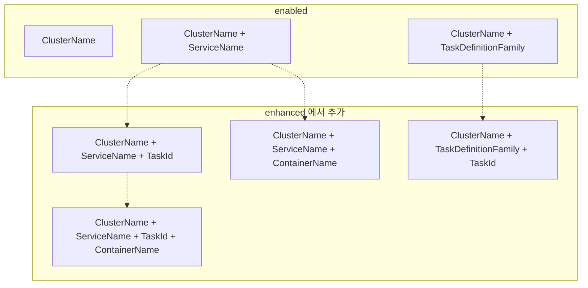
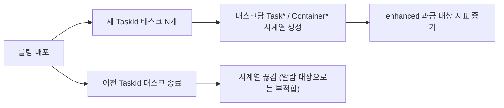
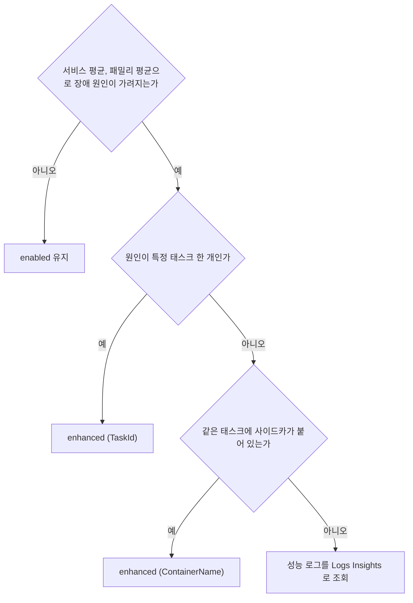

# ECS Container Insights Enhanced Observability

`containerInsights` 설정값은 `disabled`, `enabled`, `enhanced` 셋이다. `enabled`는 클러스터·서비스·태스크 정의 패밀리 단위까지만 보여준다. `enhanced`는 거기에 `TaskId`와 `ContainerName` 디멘션을 붙인다. 서비스 평균에 묻히던 태스크 한 개, 사이드카에 가려지던 앱 컨테이너 하나를 지표로 분리해서 볼 수 있게 된다. 대신 지표 개수가 태스크 수에 비례해서 늘고, 과금 단위도 달라진다.

`enabled`의 지표 목록, 알람, 비용 구조는 [ECS Container Insights](ECS_Container_Insights.md)에 있다. 이 문서는 `enhanced`에서 달라지는 부분만 다룬다.

## enabled와 enhanced의 차이

AWS 문서의 지표 표 두 개를 나란히 놓고 비교한 결과다. 같은 이름의 지표라도 쓸 수 있는 디멘션 조합이 다르다.

| 항목 | enabled | enhanced |
|---|---|---|
| 디멘션 범위 | Cluster / Service / TaskDefinitionFamily | 위에 더해 TaskId, ContainerName |
| 태스크 단위 `MemoryUtilized` | 없음 | `ClusterName, ServiceName, TaskId` 조합 |
| 컨테이너 단위 지표 | 없음 | `ContainerMemoryUtilized`, `ContainerCpuUtilized` 등 `Container*` 계열 |
| 사용률(%) 지표 | 직접 계산해야 함 | `TaskCpuUtilization`, `TaskMemoryUtilization`, `ContainerMemoryUtilization` |
| 컨테이너 헬스 | 없음 | `UnHealthyContainerHealthStatus` (헬스체크가 정의된 컨테이너만) |
| `RestartCount` | Cluster / Service / TaskDefinitionFamily | 위에 TaskId, ContainerName 조합 추가. 재시작 정책이 켜진 컨테이너만 수집 |
| GPU 지표 | 없음 | `ContainerGPUUtilization` 등. ECS Managed Instances의 NVIDIA GPU 인스턴스 한정 |

디멘션 조합이 어떻게 불어나는지는 그림으로 보는 편이 빠르다. 아래쪽 `enhanced 에서 추가` 묶음이 enhanced에서만 생기는 조합이고, 점선은 어느 조합에 무엇이 더 붙는지를 가리킨다.



`Service`와 `TaskDefinitionFamily`는 서로 포함 관계가 아니라 별개 축이다. 문서의 지표 표에도 `ServiceName + TaskDefinitionFamily`를 동시에 가진 조합은 없다.

## 켜는 방법과 확인

기존 클러스터에 `enabled`가 켜져 있으면 같은 명령으로 값만 `enhanced`로 바꾼다.

```bash
aws ecs update-cluster-settings \
  --cluster prod \
  --settings name=containerInsights,value=enhanced

aws ecs describe-clusters --clusters prod --include SETTINGS \
  --query 'clusters[0].settings'
```

계정 기본값은 `put-account-setting`으로 바꾼다. 이 명령은 기본적으로 호출한 IAM 주체에만 적용된다. 계정 전체에 걸려면 `--principal-arn`에 루트를 넣는다.

```bash
aws ecs put-account-setting --name containerInsights --value enhanced \
  --principal-arn arn:aws:iam::123456789012:root
```

계정 기본값은 이후 생성되는 클러스터에만 영향을 준다. 이미 있는 클러스터는 `update-cluster-settings`를 따로 불러야 한다.

## 태스크 단위로 보는 법

서비스 평균 대신 가장 높은 태스크 하나를 보고 싶을 때는 Metrics Insights 쿼리를 쓴다. 쿼리 하나가 여러 `TaskId` 시계열을 묶어서 `MAX`로 접는다.

```sql
SELECT MAX(TaskMemoryUtilization)
FROM SCHEMA("ECS/ContainerInsights", ClusterName, ServiceName, TaskId)
WHERE ClusterName = 'prod' AND ServiceName = 'order-service'
```

`TaskId`로 개별 알람을 만들면 안 된다. 태스크가 교체되면 `TaskId`가 바뀌고, 알람은 죽은 태스크의 시계열을 계속 쳐다보다가 `INSUFFICIENT_DATA`로 떨어진다. 위 쿼리처럼 `TaskId`를 접어서 서비스 단위 한 줄로 만든 뒤 그 결과에 알람을 거는 쪽이 맞다. 쿼리 기반 알람이 해당 리전에서 되는지는 콘솔에서 쿼리 결과가 나오는지부터 확인한다.

컨테이너 단위가 필요한 대표적인 경우는 사이드카가 붙은 태스크다. FireLens(Fluent Bit)나 Envoy가 같은 태스크에 있으면 태스크 단위 `MemoryUtilized`는 앱과 사이드카의 합이다. 어느 쪽이 메모리를 먹는지는 `ContainerMemoryUtilized`를 `ContainerName`으로 쪼개야 나온다.

## 지표 개수와 비용

`TaskId` 디멘션이 붙으면 태스크 하나가 뜰 때마다 새 시계열이 생긴다. 롤링 배포를 하루에 몇 번 하는 서비스는 배포마다 태스크 수만큼 시계열이 새로 만들어진다.



[CloudWatch 가격표](https://aws.amazon.com/cloudwatch/pricing/)에서 `enabled`는 커스텀 메트릭과 로그 인제스트로, `enhanced`는 별도 항목으로 나뉘어 적혀 있다. 이 문서를 쓰는 시점의 us-east-1 표기는 `enhanced`가 지표당 $0.07, `enabled`의 커스텀 메트릭이 $0.30이다. 단가만 보면 `enhanced`가 싸 보이지만 과금 대상 지표 개수가 다르다. 서울 단가와 과금 단위는 가격표에서 직접 확인하고, 태스크 수 × 지표 종류로 월 지표 개수를 추산한 뒤 켠다.

## 어느 쪽을 켤지

판단은 "평균으로 판단이 끝나는가"에서 갈린다. 아래 흐름은 서비스 단위로 따라가면 된다.



클러스터를 용도별로 나눠 두었다면 문제가 있는 클러스터만 `enhanced`로 올린다. 클러스터 단위로 설정이 갈리기 때문이다.
