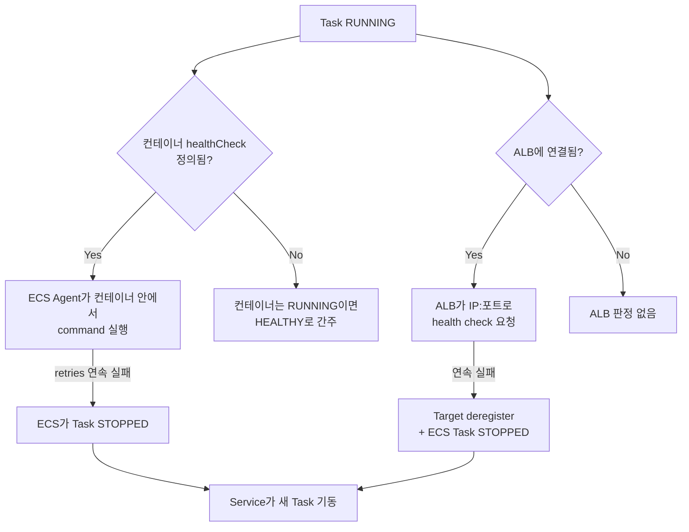

# ECS 헬스체크 3중 구조

ECS에서 태스크가 살았는지 죽었는지를 판단하는 주체는 하나가 아니다. 세 군데서 따로 본다.

1. **컨테이너 레벨 헬스체크** — Task Definition의 `containerDefinitions[].healthCheck`. ECS Agent가 컨테이너 안에서 직접 명령을 실행한다.
2. **ALB Target Group 헬스체크** — ELB가 태스크의 IP:포트로 HTTP 요청을 보내 응답 코드를 본다.
3. **ECS Service 헬스 판정** — 위 두 신호를 받아서 태스크를 STOPPED 처리할지, deregister할지, 새 태스크를 띄울지 결정한다.

이 셋이 따로 놀기 때문에 "한쪽은 통과인데 다른 쪽이 실패"하는 상황이 자주 생긴다. 무한 재시작 루프나 부팅 중 태스크가 죽는 사고는 대부분 이 셋의 상호작용을 잘못 잡아서 난다.



## 컨테이너 레벨 healthCheck

Task Definition 안에 이렇게 들어간다.

```json
{
  "containerDefinitions": [
    {
      "name": "app",
      "image": "myapp:1.2.3",
      "healthCheck": {
        "command": ["CMD-SHELL", "curl -f http://localhost:8080/actuator/health || exit 1"],
        "interval": 30,
        "timeout": 5,
        "retries": 3,
        "startPeriod": 60
      }
    }
  ]
}
```

각 필드의 실제 의미를 정확히 알아야 한다.

- **command**: `CMD-SHELL`을 쓰면 컨테이너의 셸로 실행된다. `curl`이나 `wget`이 컨테이너 이미지 안에 실제로 깔려 있어야 한다. `alpine` 베이스에 `curl`을 안 깔아 놓고 헬스체크 command에 `curl`을 쓰면 매번 `command not found`로 실패한다. 이미지에 도구가 없으면 셸 내장 기능으로 때우거나(`wget -q -O /dev/null`), 아예 앱에 헬스체크 전용 바이너리를 넣어야 한다.
- **interval**: 헬스체크 실행 주기(초). 기본 30. 너무 짧게(5초 등) 잡으면 부팅 직후 앱이 바쁜 시점에 체크가 몰려 부하를 준다.
- **timeout**: 한 번의 체크가 이 시간 안에 끝나야 한다. 기본 5. 앱이 헬스 엔드포인트에서 DB까지 확인하면 이 시간을 넘기기 쉽다.
- **retries**: 연속 몇 번 실패해야 UNHEALTHY로 판정할지. 기본 3. `interval=30, retries=3`이면 UNHEALTHY 확정까지 최소 90초가 걸린다.
- **startPeriod**: 컨테이너 시작 후 이 시간 동안은 헬스체크 실패를 retries 카운트에 넣지 않는다. 부팅 유예 시간이다.

`startPeriod`의 동작이 헷갈리는 지점인데, **이 시간 동안 체크가 실패해도 죽지 않지만, 한 번이라도 성공하면 그 즉시 startPeriod가 끝난 것으로 본다**. 즉 부팅이 빠르게 끝나면 startPeriod를 다 안 쓰고 정상 카운트로 넘어간다. 유예 한도일 뿐 고정 대기 시간이 아니다.

### 컨테이너 healthCheck를 정의하지 않으면

`healthCheck` 블록을 아예 안 넣으면 ECS는 컨테이너가 `RUNNING` 상태인 것만으로 HEALTHY로 본다. 프로세스가 떠 있기만 하면 통과다. 앱이 데드락에 빠져 요청을 못 받아도 프로세스만 살아 있으면 ECS는 모른다. 이 경우 판정은 전적으로 ALB 헬스체크에 의존하게 된다.

### Docker HEALTHCHECK와 Task Definition healthCheck 우선순위

Dockerfile에 `HEALTHCHECK` 지시어를 넣는 방법과 Task Definition에 `healthCheck` 블록을 넣는 방법이 있다. 둘 다 존재하면 Task Definition의 `healthCheck`가 이긴다. ECS Agent는 Task Definition에 `healthCheck` 블록이 있으면 이미지에 박힌 Docker HEALTHCHECK를 무시한다. Task Definition에 `healthCheck`를 안 넣은 경우에만 이미지의 HEALTHCHECK가 살아난다.

```dockerfile
# Dockerfile에 박힌 설정
HEALTHCHECK --interval=10s --timeout=3s --retries=5 \
  CMD curl -f http://localhost:8080/health || exit 1
```

```json
{
  "healthCheck": {
    "command": ["CMD-SHELL", "curl -f http://localhost:8080/actuator/health || exit 1"],
    "interval": 30,
    "timeout": 5,
    "retries": 3,
    "startPeriod": 60
  }
}
```

ECS에서는 Task Definition 설정만 적용된다. Dockerfile의 10초 간격은 무시된다.

개발팀이 Dockerfile에 HEALTHCHECK를 촘촘하게 넣었는데 인프라 팀이 Task Definition에 따로 정의해 두면, 로컬 `docker run`과 ECS 동작이 달라진다. 어디서 어떤 설정이 적용되는지 모르는 상태에서 트러블슈팅하면 시간을 허비한다. Task Definition에 `healthCheck`를 명시적으로 관리하고 Dockerfile의 HEALTHCHECK는 아예 안 쓰거나, 반대로 Task Definition에서는 안 정의하고 Dockerfile에만 두는 방식 중 하나로 통일하는 편이 낫다.

ECS Exec으로 컨테이너에 직접 들어가 healthCheck command를 손으로 돌려보면 설정이 맞는지 빠르게 확인된다.

```bash
aws ecs execute-command \
  --cluster my-cluster \
  --task <task-id> \
  --container app \
  --interactive \
  --command "curl -f http://localhost:8080/actuator/health"
```

## essential vs non-essential 컨테이너 전파

ECS 태스크에 컨테이너를 여러 개 넣을 때 `essential` 플래그가 헬스체크 실패의 전파 범위를 결정한다.

- **essential: true** 컨테이너가 UNHEALTHY로 판정되거나 종료되면 태스크 전체가 STOPPED된다.
- **essential: false** 컨테이너가 UNHEALTHY가 되거나 죽어도 태스크는 계속 RUNNING을 유지한다.

```json
{
  "containerDefinitions": [
    {
      "name": "app",
      "essential": true,
      "healthCheck": {
        "command": ["CMD-SHELL", "curl -f http://localhost:8080/actuator/health/liveness || exit 1"],
        "interval": 30,
        "timeout": 5,
        "retries": 3,
        "startPeriod": 120
      }
    },
    {
      "name": "log-collector",
      "essential": false,
      "healthCheck": {
        "command": ["CMD-SHELL", "pgrep fluent-bit || exit 1"],
        "interval": 30,
        "timeout": 5,
        "retries": 3,
        "startPeriod": 10
      }
    }
  ]
}
```

여기서 놓치기 쉬운 게 있다. healthCheck 실패와 프로세스 종료는 다른 개념이다. healthCheck가 UNHEALTHY 판정을 내려도 컨테이너 프로세스 자체는 살아 있다. ECS가 이 상태를 보고 태스크를 STOPPED 처리하는 거다. `essential: false` 컨테이너가 healthCheck 실패로 UNHEALTHY가 되면 태스크는 살아 있지만 그 컨테이너는 UNHEALTHY 상태로 방치된다. ECS가 non-essential 컨테이너를 자동 재시작해 주지 않는다. 태스크 단위로만 재시작한다.

실무 패턴:

- Fluent Bit, Datadog Agent 같은 로그/메트릭 수집기 → `essential: false`. 죽어도 앱은 살아야 한다.
- Envoy (App Mesh) → 트래픽이 Envoy를 거쳐야 하므로 `essential: true`. Envoy가 죽으면 앱도 요청을 못 받는다.
- X-Ray 데몬 → 트레이싱이 주 목적이고 앱이 X-Ray SDK에서 데몬 연결 실패를 무시하도록 설정했다면 `essential: false`로 둬도 무방하다.

## ALB Target Group 헬스체크

ALB는 Target Group에 등록된 각 타깃(awsvpc면 Task의 ENI IP, bridge면 인스턴스 IP:동적포트)으로 직접 요청을 쏜다. 설정은 Target Group 쪽에 있다.

```
Health check path:        /actuator/health/liveness
Health check port:        traffic-port  (또는 명시 포트)
Healthy threshold:        2
Unhealthy threshold:      3
Timeout:                  5
Interval:                 15
Success codes:            200
```

이건 컨테이너 healthCheck와 완전히 별개로 돈다. **컨테이너 healthCheck의 command가 치는 경로와 ALB가 치는 path가 달라도 ECS는 둘을 비교하지 않는다.** 한쪽은 `/actuator/health`, 다른 쪽은 `/health`를 쳐서 한쪽만 실패하는 패턴이 흔하다. 두 헬스체크를 둔다면 같은 경로를 보게 맞추거나, 역할을 명확히 나눠야 한다(아래 readiness/liveness 분리 참고).

`port`를 `traffic-port`로 두면 Target Group에 등록된 포트로 친다. awsvpc 모드에서 컨테이너 포트가 8080인데 Target Group의 포트를 80으로 잘못 박아두면, ALB가 80으로 요청을 쏘고 아무것도 안 떠 있으니 `Connection refused`가 난다. 이게 무한 재시작의 단골 원인이다.

## ECS Service 헬스 판정

Service는 위 두 신호를 종합해서 태스크 운명을 결정한다. 둘 중 **하나라도** UNHEALTHY면 ECS가 태스크를 STOPPED 처리하고 desiredCount를 맞추기 위해 새 태스크를 띄운다.

- 컨테이너 healthCheck가 UNHEALTHY → ECS가 직접 Task STOPPED
- ALB 헬스체크가 연속 실패 → Target deregister 후 ECS가 Task STOPPED (`Task failed ELB health checks` 이벤트)

여기서 핵심이 `healthCheckGracePeriodSeconds`다. ALB를 붙인 Service에만 적용되는 값으로, **태스크가 RUNNING이 된 뒤 이 시간 동안은 ALB 헬스체크 실패를 무시한다**. 부팅 중인 앱을 ALB가 죽이지 못하게 막는 안전장치다.

주의할 점은 grace period가 **ALB 헬스체크에만** 적용되고 컨테이너 레벨 healthCheck에는 적용되지 않는다는 것이다. 컨테이너 healthCheck의 부팅 유예는 `startPeriod`가 따로 담당한다. 그래서 부팅이 오래 걸리는 앱은 양쪽 다 챙겨야 한다.

| 신호 | 부팅 유예 파라미터 | 적용 위치 |
|------|------------------|----------|
| 컨테이너 healthCheck | `startPeriod` | Task Definition |
| ALB Target Group | `healthCheckGracePeriodSeconds` | Service Definition |

## 멀티컨테이너 사이드카 헬스체크 주의사항

X-Ray 데몬, Envoy 같은 사이드카는 앱 컨테이너와 헬스체크 설정이 다르게 돌아간다.

### X-Ray 데몬

X-Ray 데몬은 UDP 2000 포트로 세그먼트를 받는다. HTTP 기반 헬스체크로는 UDP를 확인할 방법이 없다. 데몬이 HTTP 관리 포트를 열지 않는 이미지가 많아서, 프로세스 존재 여부로 확인하는 편이 현실적이다.

```json
{
  "name": "xray-daemon",
  "image": "amazon/aws-xray-daemon",
  "essential": false,
  "healthCheck": {
    "command": ["CMD-SHELL", "pgrep xray || exit 1"],
    "interval": 30,
    "timeout": 5,
    "retries": 3,
    "startPeriod": 10
  }
}
```

X-Ray를 `essential: false`로 두면 데몬이 죽어도 앱은 계속 돈다. 다만 X-Ray SDK가 데몬에 세그먼트를 보내다 실패하면 에러 로그가 쌓이므로, SDK 설정에서 데몬 연결 실패를 무시하도록 잡아둬야 한다.

### Envoy (App Mesh)

Envoy는 9901 포트로 관리 인터페이스를 열고 `/ready` 엔드포인트를 제공한다.

```json
{
  "name": "envoy",
  "image": "840364872350.dkr.ecr.us-east-1.amazonaws.com/aws-appmesh-envoy:v1.27.3.0-prod",
  "essential": true,
  "healthCheck": {
    "command": ["CMD-SHELL", "curl -f http://localhost:9901/ready || exit 1"],
    "interval": 5,
    "timeout": 2,
    "retries": 3,
    "startPeriod": 10
  }
}
```

App Mesh를 쓰면 앱 컨테이너가 Envoy보다 나중에 시작해야 한다. `dependsOn`으로 순서를 강제한다.

```json
{
  "name": "app",
  "dependsOn": [
    {
      "containerName": "envoy",
      "condition": "HEALTHY"
    }
  ]
}
```

`condition: "HEALTHY"`를 쓰면 Envoy의 healthCheck가 통과돼야 앱이 시작한다. 전체 부팅 유예를 계산할 때 Envoy가 HEALTHY 되는 시간을 앱의 startPeriod에서 빼면 안 된다. `healthCheckGracePeriodSeconds`는 태스크가 RUNNING 상태로 전환된 시점부터 카운트하므로, Envoy가 HEALTHY 되고 나서 앱이 부팅하는 시간까지 전부 grace period 안에 들어오도록 잡아야 한다.

## CloudWatch Container Insights 모니터링

Container Insights를 켜면 클러스터, 서비스, 태스크 단위 메트릭이 `ECS/ContainerInsights` 네임스페이스로 들어온다. 헬스체크 실패를 직접 메트릭으로 주는 항목은 없지만, RUNNING 태스크 수가 급감하는 패턴으로 헬스체크 연쇄 실패를 잡는다.

클러스터에 Container Insights를 켜는 명령:

```bash
aws ecs update-cluster-settings \
  --cluster my-cluster \
  --settings name=containerInsights,value=enabled
```

헬스체크 실패로 죽은 태스크는 CloudWatch Logs Insights로 추적한다. ECS 태스크 상태 변경 이벤트가 `/aws/ecs/containerinsights/<cluster>/performance` 로그 그룹에 쌓인다.

```sql
fields @timestamp, TaskId, StoppedReason
| filter Type = "Task" and LastStatus = "STOPPED"
| filter StoppedReason like /health check/
| sort @timestamp desc
| limit 50
```

알람은 `RunningTaskCount`가 threshold 밑으로 내려갈 때 SNS로 쏘는 구성이 기본이다.

```hcl
resource "aws_cloudwatch_metric_alarm" "ecs_running_task_low" {
  alarm_name          = "${var.service_name}-running-task-low"
  comparison_operator = "LessThanThreshold"
  evaluation_periods  = 2
  metric_name         = "RunningTaskCount"
  namespace           = "ECS/ContainerInsights"
  period              = 60
  statistic           = "Average"
  threshold           = var.min_healthy_task_count

  dimensions = {
    ClusterName = var.cluster_name
    ServiceName = var.service_name
  }

  alarm_actions = [aws_sns_topic.alerts.arn]
  ok_actions    = [aws_sns_topic.alerts.arn]
}
```

`evaluation_periods = 2`에 `period = 60`이면 2분 연속 threshold 미달일 때 알람이 발생한다. 배포 중 롤링 교체로 태스크 수가 잠깐 줄어드는 상황에서 오탐이 나지 않도록 `evaluation_periods`를 조정한다. 배포 시간이 길다면 3~4로 올리는 편이 낫다.

## Terraform 3중 헬스체크 구성

컨테이너 healthCheck, ALB Target Group 헬스체크, ECS Service grace period를 Terraform으로 한 파일에서 관리하는 예제다. 세 레이어가 서로 어떤 값에 의존하는지 한눈에 보인다.

```hcl
# Layer 1: 컨테이너 레벨 헬스체크
resource "aws_ecs_task_definition" "app" {
  family                   = "${var.service_name}-task"
  network_mode             = "awsvpc"
  requires_compatibilities = ["FARGATE"]
  cpu                      = 256
  memory                   = 512
  execution_role_arn       = aws_iam_role.ecs_execution.arn
  task_role_arn            = aws_iam_role.ecs_task.arn

  container_definitions = jsonencode([
    {
      name  = var.service_name
      image = "${var.ecr_repository_url}:${var.image_tag}"
      portMappings = [
        {
          containerPort = 8080
          protocol      = "tcp"
        }
      ]
      healthCheck = {
        command     = ["CMD-SHELL", "curl -f http://localhost:8080/actuator/health/liveness || exit 1"]
        interval    = 30
        timeout     = 5
        retries     = 3
        startPeriod = 120
      }
      essential = true
    }
  ])
}

# Layer 2: ALB Target Group 헬스체크
resource "aws_lb_target_group" "app" {
  name        = "${var.service_name}-tg"
  port        = 8080
  protocol    = "HTTP"
  vpc_id      = var.vpc_id
  target_type = "ip"

  health_check {
    enabled             = true
    path                = "/actuator/health/liveness"
    port                = "traffic-port"
    healthy_threshold   = 2
    unhealthy_threshold = 3
    timeout             = 5
    interval            = 15
    matcher             = "200"
  }

  # Scale-In 시 ALB가 타깃을 deregister하기까지 기다리는 시간
  # 기본 300초를 그대로 두면 Scale-In 속도가 매우 느려짐
  deregistration_delay = 30
}

# Layer 3: ECS Service grace period
resource "aws_ecs_service" "app" {
  name                              = var.service_name
  cluster                           = aws_ecs_cluster.main.id
  task_definition                   = aws_ecs_task_definition.app.arn
  desired_count                     = 2
  launch_type                       = "FARGATE"
  # startPeriod(120) + 여유분 = 150
  health_check_grace_period_seconds = 150

  network_configuration {
    subnets          = var.private_subnet_ids
    security_groups  = [aws_security_group.ecs_task.id]
    assign_public_ip = false
  }

  load_balancer {
    target_group_arn = aws_lb_target_group.app.arn
    container_name   = var.service_name
    container_port   = 8080
  }

  # 연속 배포 실패 시 자동 롤백. 헬스체크 실패로 인한 무한 재시작을 조기에 차단함
  deployment_circuit_breaker {
    enable   = true
    rollback = true
  }
}
```

`deregistration_delay`를 기본값 300초로 두면 Scale-In 한 번에 5분씩 기다려야 한다. 앱의 `stopTimeout`과 맞춰서 30~60초로 줄이는 게 현실적이다. 단, `deregistration_delay`보다 `stopTimeout`이 짧으면 ALB가 deregister하기 전에 컨테이너가 SIGKILL로 죽으므로, `stopTimeout`을 `deregistration_delay`보다 5~10초 더 길게 준다.

## Scale-In과 Graceful Shutdown 상호작용

Auto Scaling Scale-In이 발생하거나 배포 중 구 태스크를 교체할 때 ECS는 ALB deregistration을 먼저 시작하고 나서 SIGTERM을 보낸다. 순서는 이렇다.

1. ECS가 태스크를 DRAINING 상태로 전환
2. ALB가 해당 타깃을 deregistration 시작 (`deregistration_delay` 동안 기존 연결은 계속 처리)
3. `deregistration_delay`가 끝나면 ECS가 SIGTERM을 컨테이너에 전송
4. `stopTimeout`(기본 30초) 안에 컨테이너가 종료하지 않으면 SIGKILL 전송

ALB는 deregistration 중에도 헬스체크를 계속 보낸다. 컨테이너가 SIGTERM을 받고 종료 시퀀스에 들어가 헬스 엔드포인트 응답을 멈추면, ALB는 이것을 헬스체크 실패로 찍는다. 로그에 불필요한 에러가 쌓이고 모니터링 알람이 오탐으로 뜨는 원인이 된다.

SIGTERM을 받았을 때 헬스 엔드포인트를 503으로 바꿔 ALB가 빨리 연결을 끊게 하는 패턴이 낫다.

```python
import signal

_shutting_down = False

@app.route('/actuator/health/liveness')
def liveness():
    if _shutting_down:
        return {'status': 'DOWN'}, 503
    return {'status': 'UP'}, 200

def _handle_sigterm(signum, frame):
    global _shutting_down
    _shutting_down = True

signal.signal(signal.SIGTERM, _handle_sigterm)
```

Go라면 `http.Server.Shutdown`으로 graceful shutdown을 처리하면서 health 엔드포인트만 먼저 503으로 내리는 방식을 쓴다.

```go
var shuttingDown atomic.Bool

func healthHandler(w http.ResponseWriter, r *http.Request) {
    if shuttingDown.Load() {
        w.WriteHeader(http.StatusServiceUnavailable)
        return
    }
    w.WriteHeader(http.StatusOK)
}

func main() {
    srv := &http.Server{Addr: ":8080", Handler: mux}

    sigCh := make(chan os.Signal, 1)
    signal.Notify(sigCh, syscall.SIGTERM)

    go func() {
        <-sigCh
        shuttingDown.Store(true)
        ctx, cancel := context.WithTimeout(context.Background(), 25*time.Second)
        defer cancel()
        srv.Shutdown(ctx)
    }()

    srv.ListenAndServe()
}
```

`stopTimeout`을 30초로 두고 `deregistration_delay`를 30초로 같게 맞추면 타이밍이 빠듯하다. ECS가 deregistration 완료를 확인한 뒤 SIGTERM을 보내는 과정에서 네트워크 전파 지연이 있다. `stopTimeout`을 `deregistration_delay`보다 5~10초 더 길게 잡는 편이 안전하다.

---

## 트러블슈팅

### startPeriod를 너무 짧게 잡아 부팅 중 태스크가 죽는 경우

Spring Boot 앱인데 클래스 로딩 + DB 커넥션 풀 초기화 + 캐시 워밍까지 하면 부팅에 80초가 걸린다. 그런데 healthCheck를 이렇게 잡았다.

```json
"healthCheck": {
  "command": ["CMD-SHELL", "curl -f http://localhost:8080/actuator/health || exit 1"],
  "interval": 15,
  "timeout": 5,
  "retries": 3,
  "startPeriod": 30
}
```

startPeriod가 30초인데 앱은 80초에 뜬다. 30초가 지나면 그때부터 retries 카운트가 시작되고, `interval=15, retries=3`이라 45초 후 UNHEALTHY 확정이다. 즉 75초 시점에 ECS가 태스크를 STOPPED 처리한다. 앱이 80초에 다 떠서 막 요청을 받으려는 찰나에 죽는다. 새 태스크가 또 떠서 똑같이 75초에 죽는다. CloudWatch에서 보면 태스크가 1~2분 주기로 계속 교체된다.

해결은 부팅 시간을 실측해서 startPeriod를 그보다 넉넉히 잡는 것이다. 80초 부팅이면 `startPeriod: 120` 정도. 다만 startPeriod를 무작정 길게(예: 600초) 잡으면 진짜로 망가진 컨테이너도 10분간 안 죽으니, 실측값에 여유 50% 정도가 적정선이다.

ECS 이벤트와 stopped 사유는 이렇게 확인한다.

```bash
aws ecs describe-tasks \
  --cluster my-cluster \
  --tasks <task-id> \
  --query 'tasks[0].{stopCode:stopCode,stoppedReason:stoppedReason,health:containers[0].healthStatus}'
```

`stoppedReason`이 `Task failed container health checks`면 컨테이너 healthCheck 쪽이다. startPeriod와 부팅 시간을 다시 본다.

### ALB 헬스체크 경로/포트 불일치로 무한 재시작 도는 경우

새 서비스를 배포했는데 태스크가 계속 뜨고 죽고를 반복한다. ECS 이벤트에는 이렇게 찍힌다.

```
service my-service (instance i-xxxx) (port 8080) is unhealthy in target-group my-tg
due to (reason Health checks failed)
```

원인은 보통 셋 중 하나다.

**경로 불일치**: 앱은 `/api/health`에 헬스 엔드포인트를 뒀는데 Target Group health check path가 `/`로 돼 있다. 앱이 `/`에 매핑을 안 해놨으면 404가 떨어지고, Success codes가 200이라 계속 실패한다. Target Group의 path와 앱이 실제로 200을 주는 경로를 맞춰야 한다.

**포트 불일치**: 컨테이너는 8080을 노출하는데 Target Group이 80을 친다. `Connection refused` 또는 `Request timed out`이 뜬다. awsvpc 모드라면 Target Group의 포트를 컨테이너 포트와 동일하게(8080) 맞추거나 `traffic-port`로 둔다.

**보안 그룹**: 포트와 경로가 맞는데도 `Request timed out`이면 ALB의 보안 그룹에서 Task 보안 그룹의 해당 포트로 가는 인바운드가 막힌 것이다. Task SG 인바운드에 ALB SG를 source로 하는 8080 허용 규칙을 넣어야 한다.

진단은 Target Group 콘솔의 Targets 탭에서 unhealthy 사유 코드를 먼저 본다. CLI로는 이렇게.

```bash
aws elbv2 describe-target-health \
  --target-group-arn <tg-arn> \
  --query 'TargetHealthDescriptions[].{target:Target.Id,port:Target.Port,state:TargetHealth.State,reason:TargetHealth.Reason,desc:TargetHealth.Description}'
```

- `Target.ResponseCodeMismatch` → 경로는 닿는데 응답 코드가 다름. path 또는 Success codes 확인.
- `Target.Timeout` → 보안 그룹 또는 앱이 응답을 안 줌.
- `Target.FailedHealthChecks` / `Connection refused` → 포트에 아무것도 안 떠 있음.

무한 재시작이 무서운 건 ALB 헬스체크 실패가 grace period 밖에서 나면 ECS가 멀쩡히 부팅된 태스크도 계속 죽인다는 점이다. 경로/포트 문제는 부팅과 무관하게 영구적으로 실패하므로 grace period를 늘려도 해결이 안 된다. 설정값 자체를 고쳐야 한다.

### awsvpc 모드에서 grace period 누락 트러블슈팅

awsvpc 모드 + ALB 조합에서 `healthCheckGracePeriodSeconds`를 안 주면(기본값 0 또는 null) 태스크가 RUNNING 되자마자 ALB 헬스체크가 곧장 적용된다. 부팅 60~80초짜리 앱이라면 ALB가 부팅 중인 앱에 헬스체크를 쏴서 연속 실패시키고, unhealthy threshold(보통 2~3회 × interval 15초 = 30~45초)를 넘기면 ECS가 태스크를 STOPPED 처리한다. 부팅이 끝나기도 전에 죽는다.

증상은 startPeriod 케이스와 비슷하게 태스크가 계속 교체되는데, 구분 포인트는 `stoppedReason`이다.

- `Task failed ELB health checks in (target-group ...)` → ALB 쪽. grace period를 의심한다.
- `Task failed container health checks` → 컨테이너 healthCheck 쪽. startPeriod를 의심한다.

grace period 설정 여부 확인:

```bash
aws ecs describe-services \
  --cluster my-cluster \
  --services my-service \
  --query 'services[0].healthCheckGracePeriodSeconds'
```

`null`이나 `0`이 나오면 누락이다. 부팅 시간을 실측해서 그보다 넉넉히 준다.

```bash
aws ecs update-service \
  --cluster my-cluster \
  --service my-service \
  --health-check-grace-period-seconds 120
```

주의할 점이 두 가지 있다.

첫째, grace period는 **ALB를 붙인 Service에서만 의미가 있다**. ALB가 없는 Service(내부 워커 등)에 이 값을 줘도 무시된다. 그런 태스크의 부팅 유예는 컨테이너 healthCheck의 startPeriod로만 잡는다.

둘째, grace period는 **태스크가 RUNNING이 된 순간부터** 카운트한다. awsvpc 모드는 ENI를 새로 붙이는 시간(PROVISIONING → PENDING)이 추가로 들기 때문에, 실제 앱 부팅 시간 외에 ENI 어태치 시간까지 감안하면 EC2 bridge 모드보다 유예를 조금 더 줘야 하는 경우가 있다.

### readiness와 liveness를 나누면 충돌이 줄어든다

세 헬스체크가 충돌하는 근본 원인은 "살아있냐(liveness)"와 "요청 받을 준비됐냐(readiness)"를 한 엔드포인트에서 다 보려고 하기 때문이다.

- **liveness** = 프로세스가 데드락 없이 돌고 있나. DB 같은 외부 의존성은 안 본다. 여기서 실패하면 재시작이 답이다.
- **readiness** = 외부 의존성까지 포함해 요청을 처리할 수 있나. DB가 잠깐 느리면 readiness는 실패하지만 재시작해봐야 소용없다.

ALB 헬스체크가 DB 연결까지 검사하는 readiness 경로를 치면, DB가 순간 느려질 때 멀쩡한 태스크들이 한꺼번에 UNHEALTHY로 빠지고 ECS가 대량 교체를 시작한다. 장애가 증폭된다. 그래서 보통 이렇게 나눈다.

- 컨테이너 healthCheck → liveness 경로 (`/actuator/health/liveness`). 프로세스 생존만 본다.
- ALB Target Group → liveness 경로 또는 가벼운 readiness. DB까지 검사하는 무거운 readiness는 피한다.

Spring Boot라면 `management.endpoint.health.probes.enabled=true`를 켜면 `/actuator/health/liveness`와 `/actuator/health/readiness`가 분리된다. 이 둘을 각각 알맞은 헬스체크에 물려야 충돌과 장애 증폭을 막는다.
