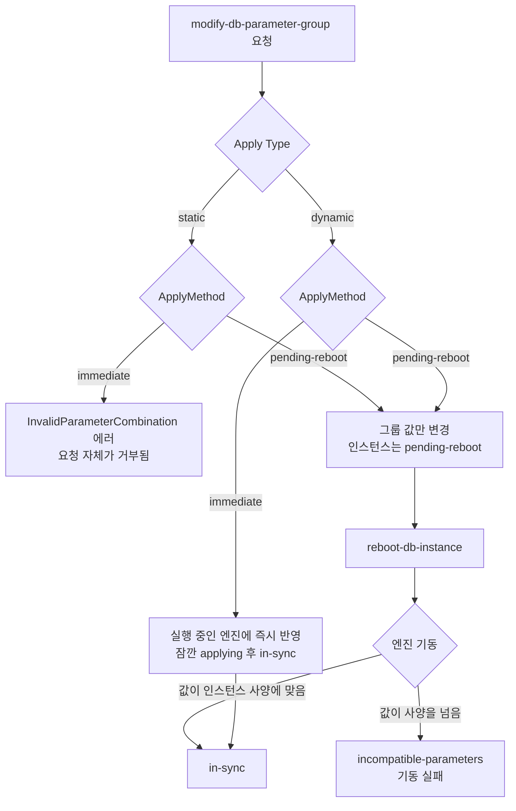
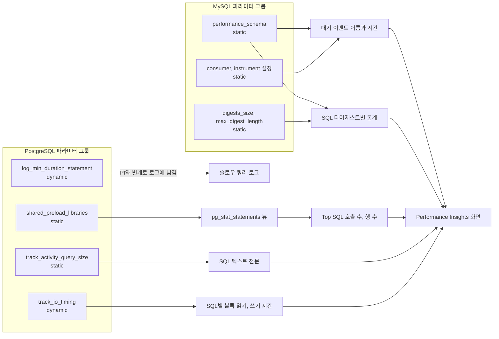
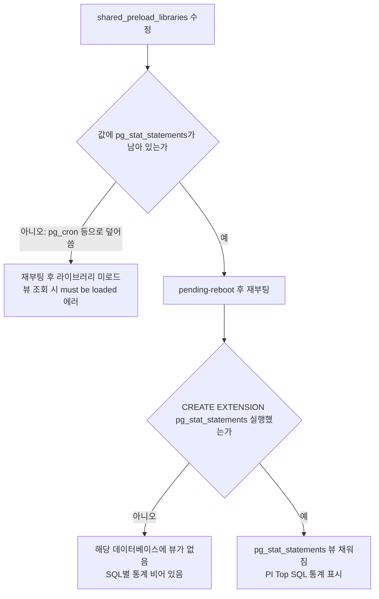
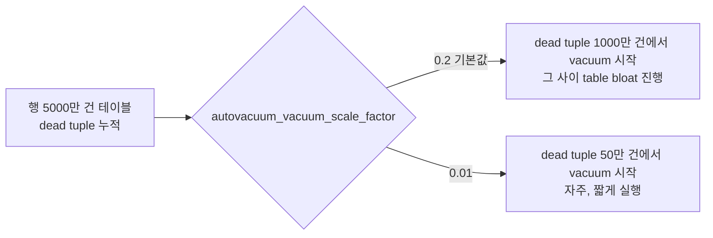
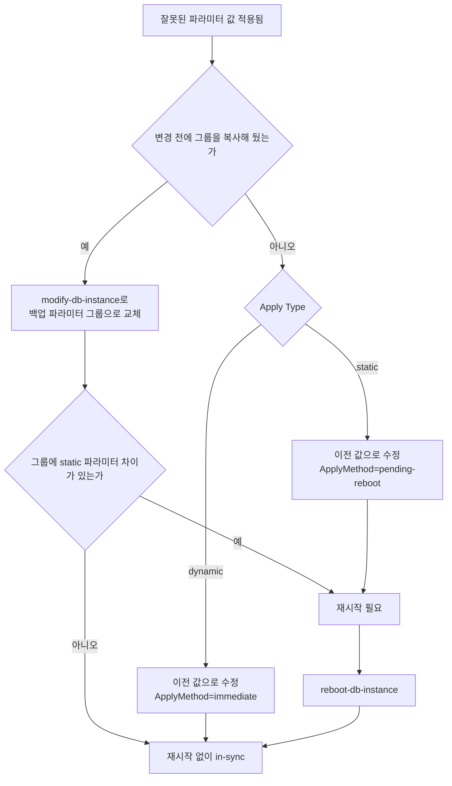
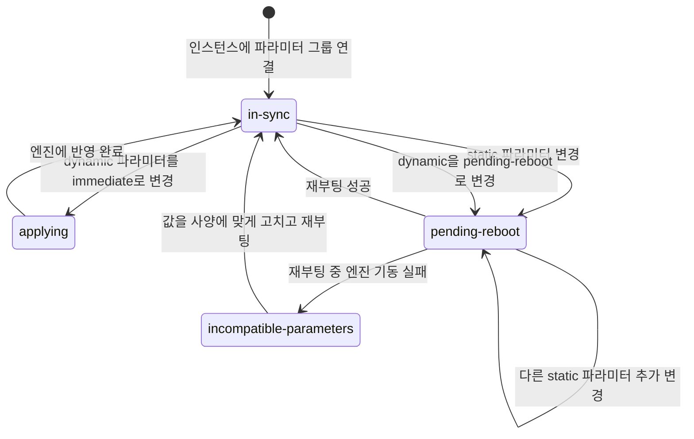

# RDS Parameter Groups

RDS에서 DB 엔진 동작을 바꾸려면 파라미터 그룹을 수정해야 한다. EC2에서 직접 `my.cnf`를 편집하던 것과 달리, RDS는 파라미터 그룹이라는 레이어를 거친다. 기본 파라미터 그룹은 수정이 불가능하기 때문에, 운영 환경에서는 반드시 커스텀 파라미터 그룹을 만들어서 인스턴스에 붙여야 한다.

## Static vs Dynamic 파라미터

파라미터는 적용 방식에 따라 두 가지로 나뉜다.

**Dynamic 파라미터**는 인스턴스 재시작 없이 즉시 반영된다. 파라미터 그룹에서 값을 바꾸고 "Apply Immediately"를 선택하면 DB 엔진에 바로 반영된다.

**Static 파라미터**는 파라미터 그룹 수정 후 인스턴스를 재시작해야 반영된다. 재시작 전까지는 기존 값이 계속 적용된다. RDS 콘솔에서 수정하면 인스턴스 상태가 "pending-reboot"으로 표시된다.

운영 중에 static 파라미터를 바꿔야 한다면 Multi-AZ 환경에서 순차 재시작하거나, 점검 시간에 맞춰 작업해야 한다. 어떤 파라미터가 static인지는 AWS 콘솔의 "Apply Type" 컬럼으로 확인한다.

변경 요청이 들어온 뒤 파라미터가 엔진에 닿기까지의 경로는 Apply Type이 가른다. 아래 흐름도에서 static 쪽은 선택지가 `pending-reboot` 하나뿐이고, dynamic 쪽만 즉시 적용과 다음 재시작 적용 중에서 고를 수 있다.



static 파라미터에 `immediate`를 주면 조용히 넘어가지 않고 에러가 난다. 콘솔에서는 만날 일이 드물고 CLI 스크립트에서 dynamic과 static을 한 번에 묶어 보낼 때 걸린다. 파라미터마다 ApplyMethod를 하드코딩하지 말고 `describe-db-parameters`의 `ApplyType`을 먼저 읽어서 분기하는 편이 안전하다.

### 재시작 없이 적용 가능한 주요 파라미터

**MySQL Dynamic 파라미터**

| 파라미터 | 기본값 | 설명 |
|---|---|---|
| max_connections | 자동 계산 | 최대 동시 커넥션 수 |
| slow_query_log | 0 | 슬로우 쿼리 로그 활성화 |
| long_query_time | 10 | 슬로우 쿼리 기준 시간(초) |
| innodb_lock_wait_timeout | 50 | 락 대기 타임아웃(초) |
| innodb_deadlock_detect | ON | 데드락 자동 감지 |
| innodb_print_all_deadlocks | OFF | 데드락 정보를 에러 로그에 기록 |
| read_only | 0 | 읽기 전용 모드 |

**PostgreSQL Dynamic 파라미터**

| 파라미터 | 기본값 | 설명 |
|---|---|---|
| work_mem | 4MB | 정렬/해시 작업 메모리 |
| effective_cache_size | 계산값 | 플래너가 인식하는 캐시 크기 |
| autovacuum_vacuum_scale_factor | 0.2 | vacuum 트리거 비율 |
| autovacuum_vacuum_cost_delay | 2ms | vacuum I/O 쉬는 간격 |
| log_min_duration_statement | -1 | 슬로우 쿼리 기준 시간(ms) |

**Static 파라미터 (재시작 필요)**

| 파라미터 | 엔진 | 설명 |
|---|---|---|
| innodb_buffer_pool_size | MySQL | InnoDB 버퍼 풀 크기 |
| innodb_log_file_size | MySQL | 리두 로그 파일 크기 |
| shared_buffers | PostgreSQL | 공유 메모리 크기 |
| max_connections | PostgreSQL | 최대 커넥션 수 |
| autovacuum_max_workers | PostgreSQL | autovacuum 워커 수 |

## Performance Insights가 의존하는 파라미터

Performance Insights(PI)는 인스턴스 밖에서 데이터를 가져오지 않는다. 엔진 안의 `performance_schema`, `pg_stat_activity`, `pg_stat_statements`를 읽어서 그린다. 그래서 PI를 켜도 이 원천이 비어 있으면 대시보드는 뜨는데 내용이 비는 상태가 된다. 원천을 켜고 끄는 스위치가 전부 파라미터 그룹에 있고, 그중 상당수가 static이라 재부팅 없이는 안 바뀐다. PI 쪽 해석은 [RDS_Performance_Insights.md](RDS_Performance_Insights.md)에, 이벤트별 의미는 [RDS_Wait_Events_Reference.md](RDS_Wait_Events_Reference.md)에 있다. 이 절은 파라미터를 어디서 바꾸고, 안 바꾸면 PI에서 무엇이 안 보이는지만 다룬다.



왼쪽 파라미터가 하나라도 빠지면 오른쪽 화면의 해당 칸이 비거나 0으로 나온다. `log_min_duration_statement`만 PI로 들어가지 않고 로그로 간다. 점선으로 따로 뺀 이유는 아래 PostgreSQL 쪽에서 설명한다.

### 엔진별 파라미터와 적용 방식

| 파라미터 | 엔진 | 적용 | 빠졌을 때 PI 증상 |
|---|---|---|---|
| `performance_schema` | MySQL | static | 대기 이벤트 대신 `sending data` 같은 스레드 상태 이름만 나오고, SQL별 통계가 없다. 샘플링도 1초가 아니라 5초로 거칠어진다 |
| `performance-schema-consumer-events-waits-current` 외 consumer, `performance-schema-instrument` | MySQL | static | `performance_schema`는 ON인데 대기 이벤트가 일부만 나오거나 비어 있다 |
| `performance_schema_digests_size`, `performance_schema_max_digest_length`, `performance_schema_max_sql_text_length` | MySQL | static | Top SQL에 `DIGEST IS NULL` 묶음이 크게 나오거나, 긴 쿼리 텍스트가 잘려서 서로 다른 쿼리가 같은 다이제스트로 합쳐진다 |
| `shared_preload_libraries` (`pg_stat_statements` 포함 여부) | PostgreSQL | static | SQL별 호출 수, 행 수, 평균 시간 같은 통계가 없다. 뷰를 직접 조회하면 에러가 난다 |
| `pg_stat_statements.max` | PostgreSQL | static | 추적 쿼리 수가 한도에 닿으면 오래된 항목이 밀려난다. 호출이 드문 쿼리가 Top SQL에서 사라진다 |
| `track_activity_query_size` | PostgreSQL | static | 기본값보다 긴 쿼리는 `pg_stat_activity`에서 잘려서 PI가 SQL을 매칭하지 못한다 |
| `track_io_timing` | PostgreSQL | dynamic | I/O 대기 이벤트는 나오는데 SQL별 블록 읽기·쓰기 시간 컬럼이 0이다 |
| `track_activities` | PostgreSQL | dynamic | OFF면 `pg_stat_activity`에 실행 중 쿼리와 대기 이벤트가 안 채워져 PI 그래프가 비어 있다 |
| `log_min_duration_statement` | PostgreSQL | dynamic | PI에는 영향이 없다. 로그에서 슬로우 쿼리가 안 보인다 |

PI 화면이 비는 문제는 대부분 이 표의 static 행에서 나온다. 파라미터 그룹을 바꿨는데 재부팅을 안 해서 `pending-reboot` 상태로 몇 주를 보내는 경우가 흔하다. 그동안 PI에는 아무 변화도 없어서, 처음에는 PI 자체가 고장났다고 의심하게 된다.

### MySQL: performance_schema와 consumer

`performance_schema`는 MySQL 서버가 뜰 때 한 번 결정되고 실행 중에는 못 바꾼다. 파라미터 그룹에서 `1`로 바꾸고 재부팅해야 한다. 인스턴스를 만들 때 PI를 같이 켜면 PI가 이 값을 알아서 관리한다. 문제는 `performance_schema`가 꺼진 채 만들어진 기존 인스턴스에서 PI만 나중에 켠 경우다. 이때는 자동으로 켜지지 않는다. 대시보드는 뜨지만 대기 이벤트가 상태 이름뿐이라 병목을 짚을 수 없다.

수동으로 관리할 때는 `performance_schema` 하나로 끝나지 않는다. 계측 대상(instrument)과 수집 위치(consumer)가 따로 켜져야 대기 이벤트 테이블이 채워진다. AWS 문서가 PI용으로 안내하는 최소 조합을 옮기면 이렇다. 이름이 하이픈 형태인 것은 `my.cnf` 시동 옵션 이름 그대로 파라미터 그룹에 노출되기 때문이다. 사용 중인 엔진 버전에서 파라미터 그룹에 실제로 보이는지 먼저 `describe-db-parameters`로 확인한다.

```ini
performance_schema = 1
performance-schema-consumer-events-waits-current = ON
performance-schema-instrument = 'wait/%=ON'
performance-schema-consumer-global-instrumentation = ON
performance-schema-consumer-thread-instrumentation = ON
```

`wait/%` 전체를 켜면 계측 오버헤드가 늘고 메모리도 더 쓴다. 메모리가 작은 인스턴스 클래스에서는 켠 뒤 CloudWatch의 `FreeableMemory`가 얼마나 내려가는지 본다. 일부 소형 클래스(t4g.medium 등)는 PI의 `performance_schema` 자동 관리가 지원되지 않아서 직접 파라미터를 설정해야 한다.

Top SQL의 쿼리 텍스트 길이는 `performance_schema_max_digest_length`와 `performance_schema_max_sql_text_length`가 정한다. 기본값은 둘 다 1024바이트다. ORM이 만드는 긴 `IN (...)` 쿼리는 이 길이를 넘어서 잘리는데, 잘린 앞부분이 같으면 다른 쿼리가 같은 다이제스트로 뭉친다. 둘 다 static이라 값을 올리려면 재부팅이 필요하다. `performance_schema_digests_size`도 마찬가지다. 한도가 차면 새 다이제스트는 `DIGEST IS NULL` 행 하나로 합쳐진다.

```sql
SHOW GLOBAL VARIABLES LIKE 'performance_schema';
SHOW GLOBAL VARIABLES LIKE 'performance_schema_max%';
SHOW GLOBAL VARIABLES LIKE 'performance_schema_digests_size';

-- consumer 활성화 여부는 setup_consumers 에서 본다
SELECT NAME, ENABLED FROM performance_schema.setup_consumers
WHERE NAME IN ('events_waits_current', 'global_instrumentation',
               'thread_instrumentation', 'statements_digest');
```

`performance_schema`가 `OFF`인데 파라미터 그룹에는 `1`로 보이면 `pending-reboot` 상태일 가능성이 높다. 위 `SHOW` 결과와 파라미터 그룹 값이 다르면 먼저 재부팅 여부를 확인한다.

### PostgreSQL: pg_stat_statements 로드

PI의 SQL별 통계는 `pg_stat_statements`에서 온다. 이 라이브러리가 `shared_preload_libraries`에 들어 있어야 하고, 이 파라미터는 static이다. 두 단계가 따로 필요하다.

1. `shared_preload_libraries`에 `pg_stat_statements`가 있고 재부팅이 끝났다.
2. 해당 데이터베이스에서 `CREATE EXTENSION pg_stat_statements`를 실행했다.

PostgreSQL 11 이상의 기본 파라미터 그룹은 라이브러리가 이미 로드되어 있어서 1번은 신경 쓸 일이 적다. 문제는 커스텀 그룹에서 이 값을 직접 편집할 때다. `pg_cron`이나 `pgaudit`를 추가하려고 값을 `pg_cron`으로 덮어쓰면 `pg_stat_statements`가 목록에서 빠진다. 재부팅하는 순간 PI의 SQL 통계가 사라지고, 뷰를 조회하면 `pg_stat_statements must be loaded via shared_preload_libraries` 에러가 난다. 값은 콤마로 이어진 문자열이라 기존 항목을 그대로 두고 뒤에 붙여야 한다.

아래 흐름도는 PI가 SQL별 통계를 읽기까지 통과해야 하는 두 관문과, 각 관문에서 막혔을 때 나오는 증상을 보여준다.



```bash
# 현재 값 확인 후 기존 항목을 유지한 채 추가
aws rds describe-db-parameters \
  --db-parameter-group-name prod-pg-params \
  --query 'Parameters[?ParameterName==`shared_preload_libraries`].[ParameterValue,ApplyType]' \
  --output text

aws rds modify-db-parameter-group \
  --db-parameter-group-name prod-pg-params \
  --parameters "ParameterName=shared_preload_libraries,ParameterValue='pg_stat_statements,pg_cron',ApplyMethod=pending-reboot"
```

```sql
SHOW shared_preload_libraries;
SELECT * FROM pg_extension WHERE extname = 'pg_stat_statements';

-- 한도 확인. 현재 항목 수가 max에 붙어 있으면 밀려나는 중이다
SHOW pg_stat_statements.max;
SELECT count(*) FROM pg_stat_statements;
```

### PostgreSQL: track_activity_query_size

`pg_stat_activity.query`에 담기는 SQL 텍스트의 최대 길이다. 기본값보다 긴 쿼리는 잘리고, PI는 잘린 텍스트로는 SQL을 식별하지 못해서 해당 쿼리의 통계를 못 모은다. static이라 올리려면 재부팅이 필요하다. 이 값이 PI 수집에 걸리는 시점은 쿼리가 실제로 잘리고 나서이고, 평소에는 증상이 없다. 배포 후에 ORM이 긴 `IN` 절을 만들기 시작하면서 특정 쿼리만 Top SQL에서 사라지는 식으로 드러난다.

값을 무작정 키우면 백엔드 슬롯마다 그 크기의 버퍼를 공유 메모리에 미리 잡는다. `max_connections`가 수천인 인스턴스에서는 가볍지 않다. 기본값에서 한 단계씩 올리면서 잘리는 쿼리가 얼마나 되는지 `length(query)`로 본다.

```sql
SHOW track_activity_query_size;

-- 현재 잘리고 있을 가능성이 있는 세션
SELECT pid, length(query) AS len, left(query, 60) AS head
FROM pg_stat_activity
WHERE length(query) >= current_setting('track_activity_query_size')::int - 1
ORDER BY len DESC;
```

### PostgreSQL: track_io_timing

dynamic이라 재부팅 없이 켤 수 있다. 꺼져 있으면 `IO:DataFileRead` 같은 I/O 대기 이벤트는 PI에 정상으로 나온다. 대기 이벤트는 `pg_stat_activity`에서 오기 때문이다. 대신 `pg_stat_statements`의 읽기·쓰기 시간 컬럼은 0으로 남는다. 그래서 "I/O 대기가 높다"까지는 알 수 있는데 어느 쿼리가 I/O 시간을 쓰는지 SQL별로 못 나눈다. 컬럼 이름은 PostgreSQL 16까지는 `blk_read_time`, 17부터는 `shared_blk_read_time`이다. 켜면 `EXPLAIN (ANALYZE, BUFFERS)`에도 `I/O Timings`가 붙는다.

I/O 시간을 재려면 쿼리 실행마다 시계를 읽는 비용이 든다. 대부분의 최신 인스턴스에서는 무시할 만하지만 확신이 없으면 `pg_test_timing`으로 시계 호출 비용을 먼저 재고 켠다.

### log_min_duration_statement와 PI의 관계

PI는 1초 간격 샘플링이라 1초보다 짧게 끝나는 쿼리는 잡힐 확률이 낮다. 초당 수천 번 도는 10ms 쿼리는 호출이 많아서 AAS에 기여하지만, 하루 몇 번 도는 500ms 쿼리는 샘플에 거의 안 걸린다. 이런 쿼리는 `log_min_duration_statement`가 로그에 남기는 쪽이 정확하다. dynamic이라 재부팅 없이 바꾼다.

```sql
-- 파라미터 그룹에서 1000(ms)으로. 0이면 모든 쿼리를 기록해서 로그가 폭증한다
SHOW log_min_duration_statement;
```

PI와 로그는 서로 대체재가 아니다. PI는 시간축에서 어느 구간에 무엇이 병목이었는지를, 로그는 개별 쿼리의 실제 소요 시간과 파라미터를 알려준다. 값을 너무 낮추면 CloudWatch Logs 수집 비용이 먼저 문제가 된다.

## MySQL 핵심 파라미터

### innodb_buffer_pool_size

InnoDB 버퍼 풀 크기다. 데이터와 인덱스를 메모리에 캐싱하는 영역이라 DB 성능에 가장 큰 영향을 미친다. Static 파라미터라 변경 후 재시작이 필요하다.

인스턴스 메모리의 70~80%를 설정한다. `db.r6g.large`(16GB)라면 약 12GB, `db.r6g.xlarge`(32GB)라면 약 24GB가 출발점이다.

```sql
-- 현재 설정 확인
SHOW VARIABLES LIKE 'innodb_buffer_pool_size';

-- 버퍼 풀 히트율 확인
SELECT 
    (1 - (SELECT VARIABLE_VALUE FROM information_schema.GLOBAL_STATUS WHERE VARIABLE_NAME = 'Innodb_buffer_pool_reads') 
       / (SELECT VARIABLE_VALUE FROM information_schema.GLOBAL_STATUS WHERE VARIABLE_NAME = 'Innodb_buffer_pool_read_requests')
    ) * 100 AS buffer_pool_hit_rate;
```

히트율이 95% 아래로 떨어지면 버퍼 풀 크기를 늘려야 한다는 신호다. RDS에서는 `{DBInstanceClassMemory*3/4}` 수식으로 인스턴스 메모리에 비례한 값을 설정할 수 있다.

### max_connections

동시 허용 최대 커넥션 수다. Dynamic 파라미터라 재시작 없이 바꿀 수 있다.

RDS MySQL 기본값은 인스턴스 메모리에 따라 자동 계산된다. `{DBInstanceClassMemory/12582880}` 수식이 기본값 계산에 쓰인다. 이 공식대로 나온 값이 실제 서비스 커넥션 수보다 작은 경우가 있다. 그럴 때는 직접 값을 올려야 한다.

커넥션 풀 없이 운영하면 max_connections에 금방 걸린다. RDS Proxy를 앞에 두면 실제 DB 커넥션 수를 줄일 수 있다.

```sql
-- 현재 커넥션 상태 확인
SHOW STATUS LIKE 'Threads_connected';
SHOW STATUS LIKE 'Max_used_connections';
SHOW PROCESSLIST;
```

### 데드락 관련 파라미터 조합

운영에서 데드락 문제가 생겼을 때 건드리게 되는 파라미터 조합이다.

**innodb_deadlock_detect**

기본값 `ON`. MySQL이 데드락을 자동으로 감지하고 롤백 대상 트랜잭션을 결정한다.

높은 동시성 환경에서 이 기능이 오히려 성능 병목이 되는 경우가 있다. 데드락 감지를 위해 내부적으로 잠금 목록을 순회하는데, 커넥션이 많을수록 이 비용이 커진다. 초당 수천 TPS 수준의 워크로드에서 `innodb_deadlock_detect=OFF`로 끄고 `innodb_lock_wait_timeout`을 짧게 잡아 타임아웃으로 처리하는 방식을 쓰기도 한다.

단, 이 조합을 쓰면 데드락 발생 시 자동 롤백 대신 타임아웃 에러가 클라이언트에 전달된다. 애플리케이션에 재시도 로직이 있어야 한다.

두 설정에서 데드락이 어떻게 풀리는지 비교하면 아래와 같다. 왼쪽은 감지가 즉시 한쪽을 롤백하고, 오른쪽은 `innodb_lock_wait_timeout`이 지날 때까지 양쪽이 대기한다는 점을 보면 된다.


**innodb_print_all_deadlocks**

기본값 `OFF`. `ON`으로 설정하면 데드락 발생 시마다 MySQL 에러 로그에 상세 정보를 기록한다. Dynamic 파라미터라 재시작 없이 켤 수 있다.

`SHOW ENGINE INNODB STATUS`는 마지막 데드락 정보만 보여줘서 간헐적으로 발생하는 데드락을 놓치는 경우가 있다. 이 파라미터를 켜두고 CloudWatch Logs로 수집하면 데드락 패턴을 분석할 수 있다.

**innodb_lock_wait_timeout**

기본값 `50`초. 락 획득 대기 시간이 이 값을 초과하면 에러를 반환한다. Dynamic 파라미터다.

OLTP 환경에서 50초는 너무 길다. 대부분 운영 환경에서 3~10초로 낮춰서 쓴다. 너무 짧게 잡으면 정상적인 트랜잭션도 에러가 날 수 있으니 서비스 특성에 맞는 값을 찾아야 한다.

```sql
-- 현재 설정 확인
SHOW VARIABLES LIKE 'innodb_deadlock_detect';
SHOW VARIABLES LIKE 'innodb_lock_wait_timeout';

-- 현재 락 대기 상태 확인
SELECT * FROM information_schema.INNODB_TRX ORDER BY trx_started;

-- 데드락 발생 이력 확인 (마지막 데드락만 보임)
SHOW ENGINE INNODB STATUS\G
```

### slow_query_log / long_query_time

둘 다 Dynamic 파라미터다. `slow_query_log` 기본값은 `0`(비활성화). `long_query_time` 기본값은 `10`초인데, 운영에서는 `1`초 또는 `0.5`초로 낮춰서 쓴다.

```ini
# 파라미터 그룹 설정
slow_query_log = 1
long_query_time = 1
log_output = FILE
```

CloudWatch Logs에서 슬로우 쿼리를 수집하려면 `log_output`을 `FILE`로 설정하고, RDS 콘솔에서 "Export logs to CloudWatch"를 활성화해야 한다.

## PostgreSQL 핵심 파라미터

### shared_buffers

PostgreSQL이 데이터 캐싱에 사용하는 공유 메모리 크기다. Static 파라미터라 변경 후 재시작이 필요하다.

PostgreSQL 공식 권고는 전체 메모리의 25% 정도다. MySQL과 달리 PostgreSQL은 OS 페이지 캐시에도 의존하기 때문에 너무 크게 잡으면 오히려 OS 캐시를 압박한다.

```sql
-- 현재 설정 확인
SHOW shared_buffers;

-- 버퍼 캐시 히트율 확인
SELECT 
    sum(heap_blks_hit) / nullif(sum(heap_blks_hit) + sum(heap_blks_read), 0) AS cache_hit_ratio
FROM pg_statio_user_tables;
```

RDS에서는 `{DBInstanceClassMemory/32768}` 수식으로 메모리에 비례한 값을 쓸 수 있다.

### work_mem

정렬, 해시 조인, 비트맵 스캔에 사용하는 메모리 크기다. Dynamic 파라미터다. 세션당, 작업당으로 적용된다. 커넥션이 100개고 쿼리 하나에 정렬 작업이 5개 있으면 이론상 `work_mem * 500`만큼의 메모리가 필요하다.

기본값 4MB는 복잡한 분석 쿼리 환경에서 작아서 임시 파일을 쓰게 된다. 무조건 크게 잡으면 OOM이 발생하니 OLTP 환경에서는 4~8MB를 유지하고, 분석 쿼리는 세션 레벨로 필요할 때만 높게 설정한다.

```sql
-- 임시 파일 사용 여부 확인 (값이 높으면 work_mem 부족)
SELECT sum(temp_bytes) FROM pg_stat_database;

-- 세션 레벨 임시 변경 (재시작 불필요)
SET work_mem = '64MB';
```

### autovacuum 관련 파라미터

autovacuum은 PostgreSQL에서 가장 자주 문제가 되는 영역이다. 잘못 설정하면 테이블이 부풀거나(table bloat), 트랜잭션 ID 감싸기(transaction ID wraparound) 문제로 DB가 읽기 전용이 되는 최악의 상황까지 간다.

**autovacuum_vacuum_scale_factor**

기본값 `0.2`. 테이블에 dead tuple이 전체 행의 20% 이상 쌓이면 vacuum을 실행한다는 뜻이다. 소규모 테이블에서는 괜찮지만 수천만 건 이상의 대형 테이블에서는 문제가 된다. 행이 5000만 건이면 1000만 건의 dead tuple이 쌓여야 vacuum이 실행된다.

대형 테이블이 많은 환경에서는 `0.01` 이하로 낮춰야 한다. RDS 파라미터 그룹에서 전역으로 설정하거나, 테이블별 스토리지 파라미터로 개별 설정할 수 있다.

행이 5000만 건인 테이블에서 설정값에 따라 vacuum이 시작되는 시점이 어떻게 달라지는지 비교한 그림이다.



```sql
-- 테이블 레벨로 개별 설정
ALTER TABLE large_table SET (
    autovacuum_vacuum_scale_factor = 0.01,
    autovacuum_analyze_scale_factor = 0.005
);

-- dead tuple 현황 확인
SELECT 
    schemaname,
    tablename,
    n_dead_tup,
    n_live_tup,
    round(n_dead_tup * 100.0 / nullif(n_live_tup + n_dead_tup, 0), 2) AS dead_pct,
    last_autovacuum,
    last_autoanalyze
FROM pg_stat_user_tables
ORDER BY n_dead_tup DESC
LIMIT 20;
```

**autovacuum_vacuum_cost_delay**

기본값 `2ms`. vacuum 작업이 I/O를 사용하다가 쉬는 간격이다. Dynamic 파라미터다. 값을 높이면 vacuum이 서버 I/O에 미치는 영향이 줄어들지만 vacuum 속도도 느려진다.

피크 타임에 vacuum이 I/O를 많이 잡아먹는다면 이 값을 높이고, dead tuple이 빠르게 쌓이는 테이블이 있다면 낮추는 쪽으로 조정한다. `0`으로 설정하면 딜레이 없이 최대 속도로 실행된다.

**autovacuum_max_workers**

기본값 `3`. 동시에 실행할 수 있는 autovacuum 워커 수다. Static 파라미터라 변경 후 재시작이 필요하다.

테이블이 많고 vacuum이 뒤처지는 상황이라면 워커 수를 늘릴 수 있다. 각 워커가 `maintenance_work_mem`만큼 메모리를 쓰기 때문에 무조건 늘린다고 좋은 게 아니다.

```sql
-- 현재 실행 중인 autovacuum 확인
SELECT pid, query, state, wait_event_type, wait_event, query_start
FROM pg_stat_activity
WHERE query LIKE 'autovacuum%';

-- 오래된 트랜잭션 ID 확인 (wraparound 위험 체크)
SELECT datname, age(datfrozenxid) AS xid_age
FROM pg_database
ORDER BY xid_age DESC;
```

xid_age가 20억에 가까워지면 wraparound 위험 상태다. RDS는 이 상태가 되면 강제 vacuum을 실행하는데, 이 과정에서 성능이 급격히 떨어질 수 있다.

### effective_cache_size

쿼리 플래너가 총 캐시 크기를 추정할 때 쓰는 힌트 값이다. 실제 메모리를 할당하지 않는다. Dynamic 파라미터다.

이 값이 크면 플래너가 인덱스 스캔을 더 선호한다. 전체 메모리의 50~75%를 잡는다. 잘못된 값을 넣으면 플래너가 비효율적인 실행 계획을 선택한다.

```sql
-- 파라미터 소스 확인 (어디서 설정됐는지)
SELECT name, setting, source
FROM pg_settings
WHERE name IN ('shared_buffers', 'work_mem', 'effective_cache_size', 'autovacuum_vacuum_scale_factor');
```

## 파라미터 그룹 diff 비교

환경별로 파라미터 그룹 설정이 다를 때, 어떤 값이 다른지 확인하는 방법이다.

```bash
# prod 파라미터 그룹 추출
aws rds describe-db-parameters \
  --db-parameter-group-name prod-mysql-params \
  --query 'Parameters[].[ParameterName,ParameterValue]' \
  --output text | sort > /tmp/prod_params.txt

# staging 파라미터 그룹 추출
aws rds describe-db-parameters \
  --db-parameter-group-name staging-mysql-params \
  --query 'Parameters[].[ParameterName,ParameterValue]' \
  --output text | sort > /tmp/staging_params.txt

# 차이 확인
diff /tmp/prod_params.txt /tmp/staging_params.txt
```

기본값 파라미터는 값이 `None`으로 나온다. 커스텀으로 설정한 파라미터만 보려면 `--source user` 옵션을 추가한다.

```bash
# 커스텀 설정된 파라미터만 확인
aws rds describe-db-parameters \
  --db-parameter-group-name prod-mysql-params \
  --source user \
  --query 'Parameters[].[ParameterName,ParameterValue]' \
  --output text
```

페이지네이션이 있어서 파라미터가 많으면 결과가 잘릴 수 있다. `--max-items`를 조정하거나 `NextToken`으로 전체를 가져와야 한다.

특정 파라미터만 골라서 확인할 때는 `--query`로 필터링한다.

```bash
# 특정 파라미터만 확인
aws rds describe-db-parameters \
  --db-parameter-group-name prod-mysql-params \
  --query 'Parameters[?ParameterName==`innodb_buffer_pool_size` || ParameterName==`max_connections` || ParameterName==`slow_query_log`].[ParameterName,ParameterValue,ApplyType]' \
  --output table
```

## 파라미터 변경 롤백

파라미터를 잘못 설정했을 때 되돌리는 방법이다. 아래 흐름도는 파라미터 종류와 사전 백업 여부에 따라 롤백 경로가 갈리는 것을 보여준다. 어느 경로든 static 파라미터가 걸려 있으면 마지막에 재부팅이 필요하다.



### Dynamic 파라미터 롤백

재시작 없이 값만 되돌리면 된다. 파라미터 그룹에서 해당 파라미터를 이전 값으로 수정하고 "Apply Immediately"를 선택한다.

```bash
# AWS CLI로 파라미터 값 되돌리기
aws rds modify-db-parameter-group \
  --db-parameter-group-name prod-mysql-params \
  --parameters "ParameterName=innodb_lock_wait_timeout,ParameterValue=50,ApplyMethod=immediate"
```

`ApplyMethod=immediate`를 써야 즉시 반영된다. `pending-reboot`으로 설정하면 다음 재시작 때 반영된다.

### Static 파라미터 롤백

값을 수정해도 재시작 전까지 기존 값이 유지된다. 값을 되돌리고 재시작해야 한다.

```bash
# Static 파라미터 롤백
aws rds modify-db-parameter-group \
  --db-parameter-group-name prod-mysql-params \
  --parameters "ParameterName=innodb_buffer_pool_size,ParameterValue=8589934592,ApplyMethod=pending-reboot"

# 인스턴스 재시작
aws rds reboot-db-instance \
  --db-instance-identifier prod-rds-instance
```

Multi-AZ 환경에서 재시작하면 페일오버가 발생한다. `--force-failover` 옵션 없이 재시작하면 인플레이스 재시작이 일어나면서 다운타임이 짧게 발생한다. 점검 시간을 잡거나 트래픽이 낮은 시간대에 작업해야 한다.

### 파라미터를 기본값으로 리셋

커스텀 설정을 지우고 엔진 기본값으로 돌리려면 `reset-db-parameter-group` 명령을 쓴다.

```bash
# 특정 파라미터만 기본값으로 리셋
aws rds reset-db-parameter-group \
  --db-parameter-group-name prod-mysql-params \
  --parameters "ParameterName=innodb_lock_wait_timeout,ApplyMethod=immediate"

# 전체 파라미터 그룹 리셋 (모든 파라미터를 기본값으로)
aws rds reset-db-parameter-group \
  --db-parameter-group-name prod-mysql-params \
  --reset-all-parameters
```

전체 리셋은 신중하게 써야 한다. 의도하지 않은 파라미터까지 기본값으로 돌아간다.

### 파라미터 그룹 교체 방식

파라미터 변경 전에 기존 그룹을 복사해두면 롤백이 쉽다. 문제가 된 파라미터 그룹 자체를 안전한 버전으로 교체하는 방식이다.

```bash
# 파라미터 그룹 복사 (변경 전 백업)
aws rds copy-db-parameter-group \
  --source-db-parameter-group-identifier prod-mysql-params \
  --target-db-parameter-group-identifier prod-mysql-params-backup-20260725 \
  --target-db-parameter-group-description "Backup before innodb_buffer_pool_size change"

# 롤백: 백업 파라미터 그룹으로 인스턴스 연결 변경
aws rds modify-db-instance \
  --db-instance-identifier prod-rds-instance \
  --db-parameter-group-name prod-mysql-params-backup-20260725 \
  --apply-immediately
```

파라미터 그룹 교체 자체는 Dynamic 파라미터만 있으면 재시작 없이 반영된다. Static 파라미터가 포함되어 있으면 교체 후에도 재시작이 필요하다.

## 파라미터 변경 후 적용 확인

파라미터 그룹을 수정한 뒤 실제 DB 엔진에 반영됐는지 반드시 확인해야 한다.

```sql
-- MySQL: 특정 파라미터 현재 값 확인
SHOW VARIABLES LIKE 'innodb_buffer_pool_size';
SHOW VARIABLES LIKE 'max_connections';
SHOW VARIABLES LIKE 'innodb_deadlock_detect';
SHOW VARIABLES LIKE 'innodb_lock_wait_timeout';

-- PostgreSQL: 재시작이 필요한 파라미터 변경 사항 확인
SELECT name, setting, pending_restart 
FROM pg_settings 
WHERE pending_restart = true;

-- PostgreSQL: 파라미터 소스 확인
SELECT name, setting, source
FROM pg_settings
WHERE name IN ('shared_buffers', 'work_mem', 'autovacuum_vacuum_scale_factor');
```

`pg_settings`의 `pending_restart` 컬럼이 `true`인 파라미터가 있으면 재시작이 필요한 상태다.

```bash
# AWS CLI로 pending-reboot 상태 확인
aws rds describe-db-instances \
  --db-instance-identifier prod-rds-instance \
  --query 'DBInstances[0].DBParameterGroups'
```

`ParameterApplyStatus`가 `pending-reboot`이면 static 파라미터 변경이 아직 반영되지 않은 상태다. `in-sync`이면 모두 적용된 상태다.

파라미터 그룹과 인스턴스의 적용 상태는 아래 상태 전이로 움직인다. 위험한 칸은 `pending-reboot`이다. 이 상태에서는 파라미터 그룹의 값과 엔진이 실제로 쓰는 값이 다르다. 다른 static 파라미터를 추가로 수정해도 상태는 그대로 `pending-reboot`이라서, 어떤 값이 밀려 있는지는 상태 이름만 봐서는 모른다.



`incompatible-parameters`는 `innodb_buffer_pool_size`를 인스턴스 메모리보다 크게 잡았을 때 나오는 식이다. 재부팅 전에는 `pending-reboot`로 멀쩡해 보이다가 재부팅 시점에 인스턴스가 못 올라온다. static 값을 바꿀 때 메모리 계산이 들어가는 파라미터는 점검 시간대에 바꾸고 바로 재부팅해서 결과를 확인한다.

PI에 필요한 파라미터를 바꿨다면 이 상태가 `in-sync`로 돌아온 다음에도 한 번 더 확인한다. MySQL은 `SHOW GLOBAL VARIABLES`, PostgreSQL은 `pg_settings`의 `pending_restart`와 `pg_stat_statements` 뷰 조회까지 해 봐야 PI 데이터가 채워질 조건이 갖춰졌는지 알 수 있다.

Static 파라미터 변경 후 재시작을 잊는 경우가 꽤 있다. 파라미터 그룹을 수정했는데 효과가 없다고 느낀다면 먼저 `pending_restart` 상태를 확인하는 게 맞다.
