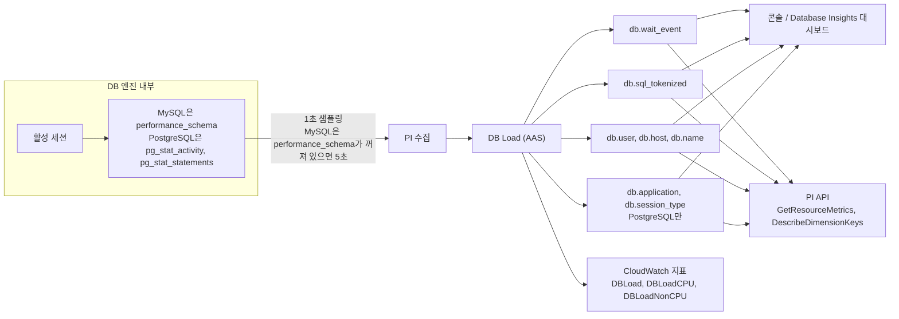
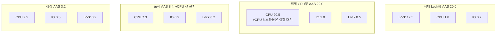
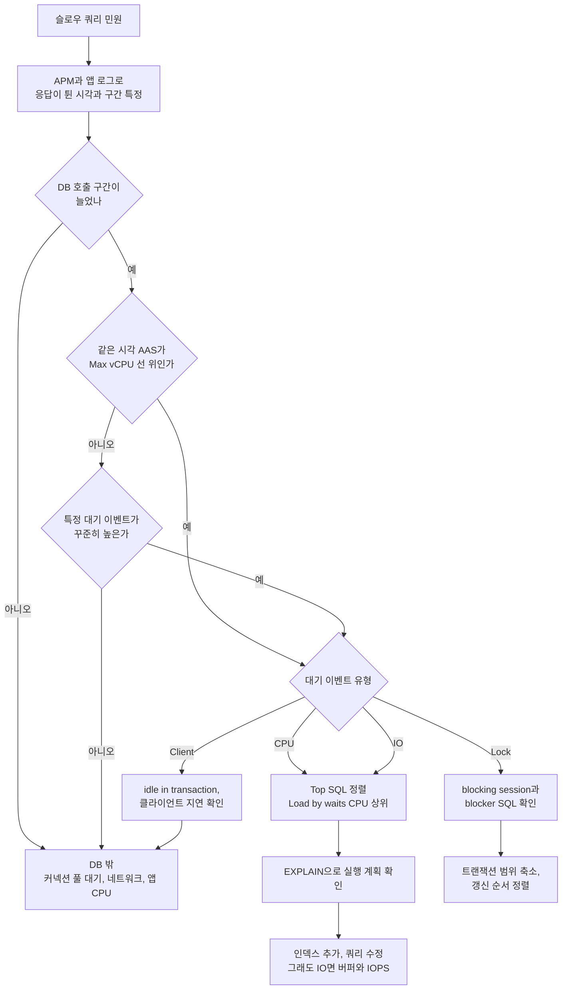
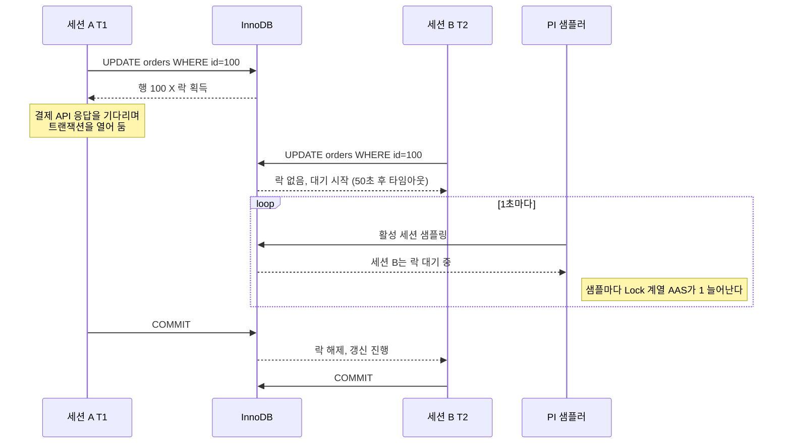
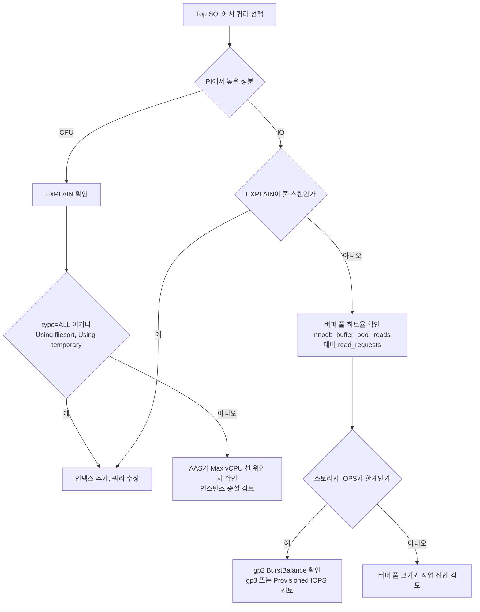
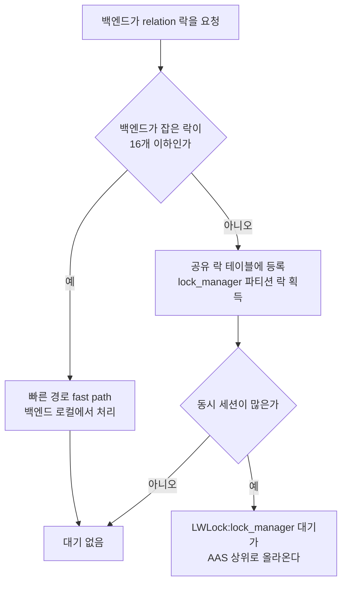
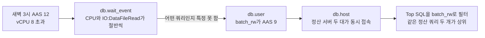
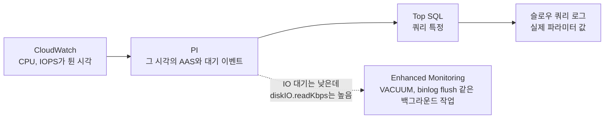
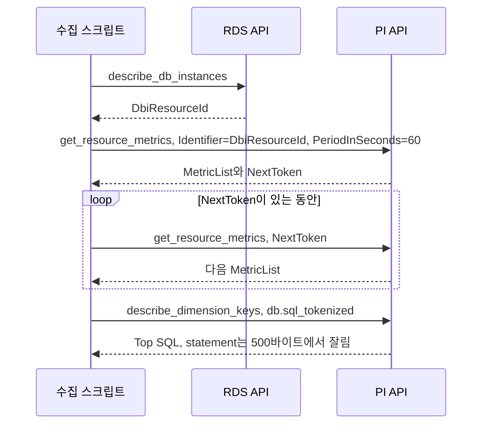

# RDS Performance Insights (쿼리 성능 분석과 대기 이벤트 해석)

RDS에서 쿼리가 느려졌을 때 CloudWatch 지표만 보면 CPU가 튀었다는 것까지는 알 수 있어도 누가 무엇을 기다리는지는 알 수 없다. CPU 70%가 문제인지 평소 수준인지도 판단하기 어렵다. Performance Insights(이하 PI)는 엔진 안에서 활성 세션이 무엇을 기다리는지 1초 단위로 샘플링해서 보여준다. 이 문서는 수집 구조, DB Load 해석, MySQL·PostgreSQL 대기 이벤트별 대응, PI가 틀리게 보이는 지점, API로 뽑을 때 걸리는 제약을 다룬다.

공식 문서 링크와 확인 시점이 붙은 항목은 AWS가 자주 바꾸는 부분이다(2026-10-05 확인). 이름·과금·콘솔 위치는 링크의 현재 내용이 우선한다.

---

## 1. 수집 구조와 켜는 조건

PI는 엔진 안에서 1초마다 활성 세션을 훑는다. 세션이 무슨 SQL을 실행 중이고 어떤 대기 이벤트에 걸려 있는지를 기록하고, 이 샘플의 합을 시간으로 나눈 값이 DB Load(AAS)다. 아래 그림은 샘플이 어떤 차원으로 쪼개져 어디로 나가는지 보여준다. 슬라이스 차원 중 `db.application`과 `db.session_type`은 PostgreSQL에만 있다는 점을 눈여겨봐야 한다.



### 1.1 켜기

CLI로 켜는 명령은 이렇다.

```bash
aws rds modify-db-instance \
    --db-instance-identifier mydb-instance \
    --enable-performance-insights \
    --performance-insights-retention-period 7 \
    --apply-immediately \
    --region ap-northeast-2
```

PI 자체를 켜고 끄는 데는 재시작이 필요 없다. 문제는 PI가 읽어 가는 원천이 엔진마다 따로 준비돼야 한다는 점이다. "켰더니 바로 다 보인다"가 항상 성립하지는 않는다.

| 엔진 | 선행 조건 | 재부팅 |
|---|---|---|
| RDS MySQL | `performance_schema`가 켜져 있어야 대기 이벤트와 SQL별 통계가 수집된다. 꺼져 있으면 대기 이벤트·SQL 통계 없이 5초 간격으로 세션 상태만 모은다 | performance_schema를 켜고 끄려면 파라미터 그룹 변경 후 재부팅이 필요하다 |
| RDS PostgreSQL | SQL 통계는 `pg_stat_statements` 라이브러리가 로드돼 있어야 한다. PostgreSQL 11 이상은 기본 로드, 10 이하는 `shared_preload_libraries`에 직접 추가한다 | 10 이하에서 추가할 때 재부팅이 필요하다 |

인스턴스를 만들 때 PI를 켜면 MySQL은 performance_schema도 같이 켜지고 PI가 파라미터를 알아서 관리한다. 이때 파라미터 그룹에는 값이 안 찍히고 실행 중인 인스턴스에만 반영돼서 `SHOW GLOBAL VARIABLES LIKE 'performance_schema'`로 봐야 안다. 문제가 생기는 건 기존 인스턴스 쪽이다. performance_schema가 꺼진 채 만들어진 인스턴스에서 PI만 켜면 performance_schema는 그대로 꺼져 있다. 대시보드는 뜨는데 대기 이벤트가 `CPU`나 `sending data` 같은 상태 이름뿐이라 병목을 못 짚는다. 이 상태로 한참 쓴 적이 있다. t4g.medium 클래스는 performance_schema 자동 관리가 지원되지 않는다.

```sql
-- MySQL: 켜져 있는지 확인
SHOW GLOBAL VARIABLES LIKE 'performance_schema';
-- ON이 아니면 파라미터 그룹의 performance_schema를 1로 바꾸고 재부팅
```

PostgreSQL은 `track_activity_query_size`도 걸린다. 기본값 4096바이트보다 긴 쿼리는 `pg_stat_activity`에서 잘려서 PI가 SQL 통계를 수집하지 못한다. 값을 올리려면 파라미터 그룹을 바꾸고 재부팅해야 한다. ORM이 만드는 긴 IN 절이 있는 서비스라면 켜기 전에 이 값부터 본다.

보존 기간은 7일이 기본이고 길게 잡으면 별도 과금이다. 허용 값은 7, 31×n(n은 1~23), 731이다. 94 같은 값은 InvalidParameterValue로 거절된다. 지원 엔진·리전·인스턴스 클래스는 [Database Insights 지원 범위](https://docs.aws.amazon.com/AmazonRDS/latest/UserGuide/USER_DatabaseInsights.Engines.html) 표로 확인한다. 에이전트가 DB 호스트의 CPU와 메모리를 조금 쓰고, 부하가 높으면 수집 빈도를 스스로 낮춘다고 공식 문서에 적혀 있다. 부하가 가장 높을 때 해상도가 떨어질 수 있다는 뜻이다.

Aurora는 클러스터 구조와 스토리지 쪽 대기 이벤트가 따로 있다. 그 부분은 [Aurora_DB.md](Aurora_DB.md)에서 이어서 본다.

---

## 2. Database Insights와의 관계

AWS는 PI 대시보드를 CloudWatch Database Insights로 흡수하고 있다. RDS 문서의 PI 페이지는 현재 "Monitoring DB load with Amazon CloudWatch Database Insights on Amazon RDS"라는 제목이고, 콘솔의 DB Load 차트·Top SQL은 Database Insights의 일부로 나온다. PI API(`pi:*`)는 별도 서비스 엔드포인트로 남아 있고 이 문서의 API 예제는 그대로 쓴다.

2026-10-05에 공식 문서에서 확인한 내용과 확인하지 못한 내용을 나눠 적는다.

| 항목 | 확인한 내용 | 출처 |
|---|---|---|
| 모드 | Standard와 Advanced 두 가지. Advanced는 락 진단, 실행 계획 수집, 플릿 단위 모니터링을 포함한다 | [Overview](https://docs.aws.amazon.com/AmazonRDS/latest/UserGuide/USER_PerfInsights.Overview.html) |
| 기본 모드 | 같은 RDS 문서 안에서 한 페이지는 Advanced가 기본, 다른 페이지는 Standard가 기본이라고 적혀 있다. 문서끼리 어긋나므로 인스턴스의 실제 설정을 본다 | [USER_DatabaseInsights](https://docs.aws.amazon.com/AmazonRDS/latest/UserGuide/USER_DatabaseInsights.html) |
| 보존·과금 | 기본 7일 이력과 월 100만 API 요청 포함. 더 길게 보존하면 별도 과금(1~24개월). 금액은 CloudWatch 요금 페이지 기준 | [Pricing and data retention](https://docs.aws.amazon.com/AmazonRDS/latest/UserGuide/USER_PerfInsights.Overview.cost.html), [CloudWatch Pricing](https://aws.amazon.com/cloudwatch/pricing/) |
| 콘솔 지원 종료·이관 일정 | 이번에 읽은 RDS 문서 본문에서 날짜를 찾지 못했다. 이 문서에는 날짜를 적지 않는다 | [CloudWatch Database Insights](https://docs.aws.amazon.com/AmazonCloudWatch/latest/monitoring/Database-Insights.html) |

기본 모드가 문서마다 다르니 인스턴스에서 직접 읽는 것이 빠르다.

```bash
aws rds describe-db-instances \
    --query 'DBInstances[].[DBInstanceIdentifier,PerformanceInsightsEnabled,DatabaseInsightsMode]' \
    --output table --region ap-northeast-2
```

`DatabaseInsightsMode` 열이 `None`으로 나오면 CLI 버전이 오래된 것일 수 있어 콘솔의 Modify 화면에서 같이 확인한다.

예전에 PI 보존 비용을 계산해 둔 문서나 스프레드시트가 있다면 다시 계산하는 편이 안전하다. API로 1분마다 폴링하는 스크립트가 여러 개 돌면 월 100만 요청 포함분을 넘길 수 있다. 알람은 API 폴링보다 CloudWatch의 `DBLoad` 지표에 거는 쪽이 요청 수를 아낀다.

---

## 3. DB Load(AAS)와 Max vCPU 선

DB Load의 단위는 AAS(Average Active Sessions)다. 샘플링 시점에 쿼리를 실행 중이거나 무언가를 기다리는 세션의 평균 수다. 연결만 열려 있고 쉬는 세션은 세지 않는다. 샘플링은 통계라서 100ms짜리 쿼리 한 번은 안 잡힐 수 있지만 같은 쿼리가 반복되면 실행 시간에 비례해서 AAS에 반영된다.

기준선은 차트의 Max vCPU 선이다. 한 vCPU에서는 한 번에 프로세스 하나만 돈다. 활성 세션이 vCPU 수를 넘으면 줄을 서기 시작하고, 줄이 길어질수록 응답이 늘어진다. 공식 문서도 DB Load가 Max vCPU 위에 자주 있고 주된 대기가 CPU면 CPU 과부하라고 설명한다. 반대로 선 아래여도 특정 대기 이벤트가 꾸준히 높으면 경합이 있다는 신호다. db.r6g.2xlarge(8 vCPU)에서 AAS가 3인데 전부 Lock이면 CPU는 한가한데 쿼리는 전부 서 있는 상태다.

아래 표는 vCPU 8인 인스턴스에서 같은 AAS라도 구간별로 대기 이벤트 구성이 어떻게 달라지는지 보여주는 예시 값이다. 실측값이 아니라 해석 연습용이다.

| 구간 | AAS | CPU | IO | Lock | 해석 |
|---|---|---|---|---|---|
| 정상 | 3.2 | 2.5 | 0.5 | 0.2 | vCPU 선 아래, CPU가 주성분 |
| 포화 | 8.4 | 7.3 | 0.9 | 0.2 | 선에 닿음. 한 칸만 더 늘면 줄이 생긴다 |
| 적체(CPU) | 22.0 | 20.5 | 1.0 | 0.5 | 선 위로 한참 넘고 거의 전부 CPU. 쿼리 튜닝이나 인스턴스 증설 |
| 적체(Lock) | 20.0 | 1.8 | 0.7 | 17.5 | AAS는 비슷한데 CPU는 비어 있다. 증설해도 안 풀린다 |

두 적체 구간의 AAS는 22와 20으로 비슷하다. 막대 높이만 보고 인스턴스를 올렸다면 CPU 적체에서는 맞고 Lock 적체에서는 돈만 쓴 셈이다. 아래 그림은 같은 네 구간을 막대로 쌓은 모양이다. 각 상자 안에서 위가 가장 큰 성분이고, 적체(Lock)만 성분의 모양이 완전히 다르다.



---

## 4. 슬로우 쿼리 민원이 들어왔을 때

민원을 받으면 먼저 PI를 열지 않는다. 응답 시간이 튄 시각과 구간부터 잡는다. APM에서 DB 호출 구간이 늘었는지, 커넥션을 얻는 데 걸린 시간이 늘었는지를 가른다. 이 구분을 건너뛰고 PI부터 열면 DB가 멀쩡한데 DB만 한 시간 들여다보게 된다.

그림은 그 분기 전체다. DB 밖으로 빠지는 출구가 둘 있다. DB 호출 구간이 안 늘었을 때와, AAS가 평소 수준이고 지배적인 대기 이벤트도 없을 때다.



경로마다 걸리는 시간이 다르다. CPU·IO 쪽은 Top SQL에서 쿼리를 하나 고르면 곧바로 EXPLAIN으로 이어진다. Lock 쪽은 Top SQL의 쿼리가 피해자일 뿐이라 막고 있는 세션을 따로 찾아야 한다. 피해자를 튜닝하는 데 시간을 쓰는 실수가 가장 흔하다.

---

## 5. MySQL 대기 이벤트

MySQL의 이벤트 이름은 performance_schema 계측 이름에서 `wait/` 접두사를 뗀 형태로 PI에 나온다. `io/`는 파일·테이블 I/O, `synch/`는 뮤텍스·컨디션, `lock/`은 메타데이터·테이블 락이다. 자주 만나는 것만 뽑으면 아래와 같다.

| 이벤트 | 의미 | 먼저 볼 것 |
|---|---|---|
| `io/table/sql/handler` | 스토리지 엔진이 테이블 행에 접근하는 시간 | Top SQL의 Rows examined 대비 Rows returned, 인덱스 |
| `io/file/innodb/innodb_data_file` | 버퍼 풀에 없는 페이지를 디스크에서 읽거나 쓴다 | 버퍼 풀 히트율, 스토리지 IOPS와 지연 |
| `io/file/innodb/innodb_log_file` | redo 로그 기록 대기. 커밋이 몰릴 때 높다 | 작은 트랜잭션 다발, `innodb_flush_log_at_trx_commit` |
| `io/file/sql/binlog` | binlog 기록 대기 | 커밋 빈도, `sync_binlog`, 스토리지 쓰기 지연 |
| `synch/cond/sql/MDL_context::COND_wait_status` | 메타데이터 락 대기 | 오래 열린 트랜잭션과 그 뒤에 선 DDL |
| `synch/sxlock/innodb/hash_table_locks` | 어댑티브 해시 인덱스 경합인 경우가 많다 | 동일 인덱스에 몰리는 읽기, `innodb_adaptive_hash_index` |
| `lock/table/sql/handler` | 테이블 수준 락 | `LOCK TABLES`, MyISAM 테이블 |

InnoDB 행 락 대기는 이벤트 이름이 엔진 구현과 버전에 따라 달라서 이름만 외워 두면 소용이 없다. Lock 성격의 이벤트가 AAS 대부분을 차지하는지를 보고, 아래 쿼리로 실제 막는 세션을 확인한다. Aurora MySQL은 row lock 대기를 `synch/mutex/innodb/aurora_lock_thread_slot_futex` 같은 Aurora 전용 이름으로 보여준다. Aurora 전용 이벤트(redo 전파, 스토리지 응답 대기 등)는 구조 설명이 있는 [Aurora_DB.md](Aurora_DB.md)와 [Aurora_DB_Cluster.md](Aurora_DB_Cluster.md)를 먼저 읽고, 이벤트 이름별 설명은 AWS 공식 Aurora 대기 이벤트 문서에서 찾는다.

### 5.1 행 락 충돌이 PI에 쌓이는 과정

두 트랜잭션이 같은 행을 건드리면 늦게 온 쪽이 기다린다. 기다리는 동안 그 세션은 계속 활성 세션이라 PI가 1초마다 한 번씩 센다. 먼저 잡은 쪽이 외부 API를 부르며 트랜잭션을 열어 둔 채 늘어지면 대기자가 하나씩 늘어난다. 대기자가 17명이면 AAS 17이 Lock으로 쌓인다.



대기 시간이 `innodb_lock_wait_timeout`(기본 50초)을 넘으면 세션 B는 1205 에러로 끝난다. PI 차트의 Lock 영역은 끝나지만 에러율이 올라가는 모양이 이어진다. 에러 로그와 같이 봐야 한다.

### 5.2 막는 세션 찾기

MySQL 8.0에서 `information_schema.innodb_lock_waits`와 `innodb_locks`는 제거됐다. RDS MySQL 8.0과 Aurora MySQL 3(8.0 호환)에서 이 뷰를 조인하는 쿼리를 그대로 돌리면 테이블이 없다는 에러가 난다. 예전 글에 많이 남아 있는 쿼리라서 주의해야 한다. 8.0에서는 `sys.innodb_lock_waits`를 쓴다.

```sql
-- RDS MySQL 8.0, Aurora MySQL 3
SELECT
    wait_age,
    waiting_pid,
    waiting_query,
    blocking_pid,
    blocking_query,
    blocking_trx_age,
    sql_kill_blocking_connection
FROM sys.innodb_lock_waits
ORDER BY wait_age DESC;
```

sys 스키마 없이 원천 테이블로 조인하려면 `performance_schema.data_lock_waits`를 쓴다.

```sql
-- RDS MySQL 8.0, Aurora MySQL 3
SELECT
    r.trx_id               AS waiting_trx_id,
    r.trx_mysql_thread_id  AS waiting_thread,
    r.trx_query            AS waiting_query,
    b.trx_id               AS blocking_trx_id,
    b.trx_mysql_thread_id  AS blocking_thread,
    b.trx_query            AS blocking_query
FROM performance_schema.data_lock_waits w
JOIN information_schema.innodb_trx r ON r.trx_id = w.REQUESTING_ENGINE_TRANSACTION_ID
JOIN information_schema.innodb_trx b ON b.trx_id = w.BLOCKING_ENGINE_TRANSACTION_ID;
```

5.7(RDS MySQL 5.7, Aurora MySQL 2)은 옛 방식이 그대로 동작한다.

```sql
-- RDS MySQL 5.7, Aurora MySQL 2
SELECT
    r.trx_id               AS waiting_trx_id,
    r.trx_mysql_thread_id  AS waiting_thread,
    r.trx_query            AS waiting_query,
    b.trx_id               AS blocking_trx_id,
    b.trx_mysql_thread_id  AS blocking_thread,
    b.trx_query            AS blocking_query
FROM information_schema.innodb_lock_waits w
JOIN information_schema.innodb_trx b ON b.trx_id = w.blocking_trx_id
JOIN information_schema.innodb_trx r ON r.trx_id = w.requesting_trx_id;
```

실제 장애에서 `blocking_query`가 NULL인 경우가 많다. 막는 쪽이 쿼리를 끝내고 커밋을 안 한 채 쉬고 있어서다. 이때는 `blocking_pid`로 그 스레드의 최근 문장을 찾는다. `events_statements_history` 소비자가 켜져 있어야 한다.

```sql
SELECT sql_text
FROM performance_schema.events_statements_history
WHERE thread_id = (SELECT thread_id FROM performance_schema.threads
                   WHERE processlist_id = 12345)
ORDER BY event_id DESC
LIMIT 5;
```

두 번째 패턴은 DDL이다. `ALTER TABLE`이 오래 열린 읽기 트랜잭션 뒤에서 메타데이터 락을 기다리면 그 뒤로 들어오는 모든 쿼리가 줄을 선다. PI에서 `MDL_context::COND_wait_status`가 갑자기 AAS를 채우면 이 경우다. 해결은 DDL을 죽이는 것이 아니라 DDL 앞에서 열려 있는 트랜잭션을 찾아 끝내는 것이다.

### 5.3 CPU인지 IO인지 가르기

CPU와 IO는 차트에서 색이 다르지만 원인을 섞어 보는 일이 많다. CPU가 높을 때는 Top SQL에서 해당 쿼리의 EXPLAIN을 먼저 본다. `type=ALL`이면 풀 스캔이고 `Using filesort`나 `Using temporary`가 보이면 인덱스 없이 정렬·임시 테이블을 쓰는 것이다. 인스턴스를 올리는 일은 그 다음이다.

IO가 높은데 EXPLAIN이 풀 스캔이 아니면 데이터 볼륨 문제다. 자주 읽는 데이터가 버퍼 풀보다 크거나 스토리지 IOPS 한계에 닿은 것이다. 버퍼 풀 히트율은 SHOW 명령 하나로 구한다.

```sql
SHOW GLOBAL STATUS LIKE 'Innodb_buffer_pool_read%';
-- hit_rate = 1 - Innodb_buffer_pool_reads / Innodb_buffer_pool_read_requests
```

`Innodb_buffer_pool_reads`는 디스크까지 내려간 읽기 수, `read_requests`는 논리 읽기 수다. 히트율이 몇 퍼센트면 위험한지는 워크로드마다 다르다. 평소 값을 기록해 두고 사고 시점과 비교하는 것이 의미 있다. IOPS가 한계면 gp2의 `BurstBalance`가 0에 가까운지 보고, gp3나 Provisioned IOPS로 바꾸는 것을 검토한다. 스토리지 종류별 한계는 [RDS_Storage.md](RDS_Storage.md)에 있다. 버퍼 풀 크기 조정은 [RDS_Parameter_Groups.md](RDS_Parameter_Groups.md)에서 다룬다.

아래 그림은 Top SQL에서 쿼리를 하나 고른 뒤 CPU와 IO가 각각 어떤 확인을 거쳐 조치로 이어지는지 보여준다. 두 갈래가 EXPLAIN의 풀 스캔 여부에서 같은 조치(인덱스, 쿼리 수정)로 합쳐지는 점을 보면 된다.



---

## 6. PostgreSQL 대기 이벤트

PostgreSQL은 `대기 유형:이벤트 이름` 형태로 나온다. 유형은 `Lock`(무거운 락), `LWLock`(내부 경량 락), `IO`, `Client`, `IPC`, `Timeout` 등이다. PI에서 `CPU`로 보이는 부분은 `pg_stat_activity`에서 `wait_event`가 NULL인 활성 세션이다.

| 이벤트 | 뜻 | 흔한 원인 | 대응 |
|---|---|---|---|
| `Lock:transactionid` | 다른 트랜잭션이 커밋·롤백하길 기다림. 행 락 충돌이 이 이름으로 보인다 | 긴 트랜잭션, 같은 행에 몰리는 UPDATE | 막는 pid 찾기, 트랜잭션 짧게 |
| `Lock:tuple` | 한 행의 락 대기열 앞자리를 두고 다툼 | 같은 행을 수십 세션이 동시에 갱신 | 갱신 직렬화, 카운터 행 분산 |
| `Lock:relation` | 테이블 수준 락 | `ALTER TABLE`, `VACUUM FULL`, `LOCK TABLE` | DDL 시간대 이동, `lock_timeout` |
| `LWLock:BufferMapping` | 데이터 블록을 shared buffer 슬롯에 연결하는 해시 테이블 경합 | 작업 집합이 shared_buffers보다 큼, 접속 세션 폭증 | 큰 스캔 제거, 세션 수 제한 |
| `LWLock:lock_manager` | 락 매니저 파티션 경합 | 한 쿼리가 락을 16개 넘게 잡음(파티션·인덱스 다수), 동시 세션 수 | 파티션 프루닝, 인덱스 정리, 풀링 |
| `IO:DataFileRead` | 블록을 데이터 파일에서 읽는 중 | 풀 스캔, 인덱스 부재, 캐시 이탈 | `EXPLAIN (ANALYZE, BUFFERS)`, 인덱스 |
| `IO:XactSync` | 커밋이 스토리지에 반영되길 기다림 | 작은 커밋 다발 | 커밋 묶기 |
| `Client:ClientRead` | 서버가 클라이언트의 다음 입력을 기다림 | 트랜잭션 안에서 앱이 지연, 네트워크 지연 | idle in transaction 정리 |
| `IPC:*` | 다른 프로세스가 끝나길 기다림 | 병렬 쿼리, 동기 복제 | 병렬도 조정, 복제 지연 확인 |

PostgreSQL 13부터 일부 이벤트 이름이 바뀌었다. 12 이하는 `buffer_mapping`, `lock_manager`이고 13 이상은 `BufferMapping`, `LockManager`로 나온다. 이전 글의 이벤트 이름을 검색할 때 대소문자와 밑줄이 다르면 같은 이벤트인지 의심해 봐야 한다.

### 6.1 Lock 계열

`Lock:transactionid`는 MySQL의 행 락 대기와 같은 역할이다. 테이블 락이 아니라 갱신하려는 행을 먼저 갱신한 트랜잭션의 ID를 기다린다는 점이 이름에 드러난다. 대응도 같다. 막는 세션을 찾는다.

```sql
-- 기다리는 세션과 막는 pid
SELECT
    a.pid,
    a.usename,
    a.application_name,
    a.state,
    a.wait_event_type,
    a.wait_event,
    now() - a.xact_start AS xact_age,
    pg_blocking_pids(a.pid) AS blocked_by,
    left(a.query, 80) AS query
FROM pg_stat_activity a
WHERE a.wait_event_type = 'Lock'
ORDER BY a.xact_start;

-- 막는 쪽이 무엇을 하고 있는지
SELECT pid, usename, state, now() - xact_start AS xact_age, left(query, 80) AS last_query
FROM pg_stat_activity
WHERE pid IN (
    SELECT unnest(pg_blocking_pids(pid))
    FROM pg_stat_activity
    WHERE wait_event_type = 'Lock'
);
```

막는 세션의 `state`가 `idle in transaction`이면 앱이 BEGIN 후에 외부 호출을 하며 쉬고 있는 것이다. `idle_in_transaction_session_timeout`을 걸어 두면 오래 쉬는 트랜잭션을 서버가 끊는다. 값은 서비스의 가장 긴 정상 트랜잭션보다 충분히 길게 잡아야 한다. 짧게 잡았다가 정상 배치가 끊긴 적이 있다.

`Lock:tuple`은 행 하나에 갱신이 몰릴 때 나온다. 조회수나 재고 카운터를 한 행에 두고 모든 요청이 UPDATE하는 구조에서 흔하다. 인덱스로 해결되지 않고 행을 N개로 나눠 쓰거나 큐로 모아 처리해야 한다.

`Lock:relation`은 DDL이 원인인 경우가 대부분이다. `ALTER TABLE`이 오래 열린 트랜잭션 뒤에서 `ACCESS EXCLUSIVE` 락을 기다리면 그 뒤의 읽기까지 전부 줄을 선다. DDL 세션에 `SET lock_timeout = '3s'`를 걸고 실패하면 다시 시도하는 쪽이 장애를 만들지 않는다.

### 6.2 LWLock 계열

LWLock은 엔진 내부 자료구조를 지키는 짧은 락이다. 이게 AAS 상위에 올라오면 쿼리가 느린 것이 아니라 동시성이 엔진 내부 한계에 닿은 것이다.

`LWLock:BufferMapping`은 shared buffer에서 블록을 찾고 바꾸는 해시 테이블 경합이다. 큰 테이블을 여러 세션이 동시에 훑어서 버퍼를 계속 갈아치우거나, 커넥션이 수백 개 한꺼번에 일할 때 오른다. 개별 쿼리를 고치는 것보다 동시 실행 수를 줄이는 쪽이 먼저 효과를 낸다. 애플리케이션 풀 크기를 줄이거나 [DB_Proxy.md](DB_Proxy.md)로 연결을 모은다.

`LWLock:lock_manager`(13 이상은 `LockManager`)는 락 매니저의 파티션 락 경합이다. 각 백엔드는 락 16개까지를 빠른 경로(fast path)로 잡고 그 이상은 공유 락 테이블에 올린다. 한 쿼리가 파티션 수십 개와 그 인덱스를 전부 열면 빠른 경로가 넘쳐서 이 경합이 생긴다. 파티션 키 조건이 빠져 프루닝이 안 되는 쿼리가 대표적이다.

아래 그림은 락 하나를 잡을 때 빠른 경로로 가는지 공유 락 테이블로 가는지의 갈림길이다. 경합은 오른쪽 아래 갈래에서만 생긴다.



```sql
-- 빠른 경로를 넘겨 공유 락 테이블을 쓰는 세션 찾기
SELECT pid,
       count(*) FILTER (WHERE fastpath)     AS fastpath_locks,
       count(*) FILTER (WHERE NOT fastpath) AS slowpath_locks
FROM pg_locks
WHERE locktype = 'relation'
GROUP BY pid
ORDER BY slowpath_locks DESC
LIMIT 10;
```

`slowpath_locks`가 높은 세션의 쿼리가 대개 문제의 쿼리다. EXPLAIN에서 파티션이 전부 나열되는지 본다.

### 6.3 IO 계열

`IO:DataFileRead`는 MySQL의 `innodb_data_file`과 대응한다. shared_buffers(와 OS 캐시)에 없는 블록을 디스크에서 읽는다. 원인이 풀 스캔인지 캐시 크기인지는 EXPLAIN이 가른다.

```sql
EXPLAIN (ANALYZE, BUFFERS)
SELECT * FROM orders WHERE user_id = 123 AND status = 'pending';
-- Buffers: shared hit=... read=... 에서 read가 크면 디스크를 읽은 것
-- Seq Scan이면 인덱스 문제, Index Scan인데 read가 크면 작업 집합 문제
```

테이블별 읽기 편중은 `pg_statio_user_tables`의 `heap_blks_read`로 본다. 인덱스를 탔는데도 `read`가 크면 테이블이 부풀어 있을 수 있어 `n_dead_tup`도 같이 확인한다.

`IO:XactSync`는 Aurora PostgreSQL에서 보이는 이벤트로, 커밋이 Aurora 스토리지 계층에 반영되길 기다린다. 쿼리 하나하나는 빠른데 건건이 커밋하는 구조에서 오른다. 1건씩 INSERT와 COMMIT을 반복하는 수집기를 500건 묶음 커밋으로 바꿔서 줄인 적이 있다. 일반 RDS PostgreSQL에서는 같은 자리에 `IO:WALSync`, `IO:WALWrite`, `LWLock:WALWrite`가 나온다. Aurora 스토리지 구조는 [Aurora_DB.md](Aurora_DB.md)의 6 copies 쿼럼 절을 본다. 이 커밋 대기는 쿼럼 응답을 기다리는 시간이다.

### 6.4 Client와 IPC

`Client:ClientRead`는 서버가 일을 안 하고 클라이언트 입력을 기다리는 시간이다. 트랜잭션 안에서 앱이 다음 쿼리를 보내기 전에 지연되면 쌓인다. DB가 느려서가 아니라 앱 쪽이 문제다. 여기서 AAS가 높게 나온다고 DB를 튜닝하면 아무 일도 일어나지 않는다. `pg_stat_activity`에서 `state = 'idle in transaction'`인 세션이 많은지부터 본다. COPY나 대량 바인드로 큰 데이터를 보내는 중에도 나타난다.

`IPC:*`는 다른 프로세스를 기다린다는 뜻이라 이름마다 대응이 다르다.

- `IPC:ParallelFinish`, `IPC:ExecuteGather`, `IPC:BgWorkerShutdown`: 병렬 쿼리의 리더가 워커를 기다린다. 병렬 워커도 별개 백엔드라서 쿼리 하나가 AAS를 여러 개 차지한다. `max_parallel_workers_per_gather`를 낮추고 OLTP 경로에서 병렬 쿼리가 도는지 본다.
- `IPC:SyncRep`: 동기 복제 응답을 기다린다. 복제본 지연이나 네트워크를 본다.
- `IPC:ProcArrayGroupUpdate`: 커밋이 몰릴 때 트랜잭션 목록을 갱신하는 대기. 동시 커밋 수가 원인이다.

PI 슬라이스에서 `db.session_type`이 `parallel worker`인 부하가 크면 위의 병렬 쿼리를 의심한다. 이 차원은 PostgreSQL에만 있다.

---

## 7. Top SQL과 슬라이스 차원 읽기

DB Load 차트 아래 Top SQL은 SQL 다이제스트(리터럴을 `?`로 바꾼 형태)별로 DB Load 기여도를 정렬한다. 정렬 기준 하나만 보면 틀린 결론에 이르기 쉬워서 열 두 개를 같이 읽는다. Load by waits는 이 쿼리가 AAS를 얼마나 먹는지, Executions(PostgreSQL은 `calls_per_sec`)는 초당 실행 횟수다. 쿼리당 평균 지연은 둘의 관계로 나온다. PostgreSQL은 `db.sql_tokenized.stats.avg_latency_per_call` 지표로 바로 볼 수 있다.

| Load by waits | Executions | 해석 | 손댈 곳 |
|---|---|---|---|
| 높음 | 낮음 | 한 번이 무거운 쿼리. 배치, 리포트, 인덱스 없는 조회 | 실행 계획 |
| 높음 | 높음, 쿼리당 지연 보통 | 쿼리는 빠른데 호출이 너무 많다. N+1, 캐시 부재 | 호출 횟수 줄이기 |
| 높음 | 높음, 쿼리당 지연 큼 | 자주 도는 쿼리가 느려졌다. 계획 변경, 통계 오래됨 | 실행 계획, ANALYZE |
| 낮음 | 높음 | 지금은 괜찮지만 트래픽이 늘면 병목 | 기록해 둠 |

두 번째 줄이 가장 놓치기 쉽다. 쿼리 하나는 1ms인데 초당 5,000번 불리면 AAS로는 5가 된다. 쿼리를 튜닝해서 0.8ms로 줄이는 것은 의미가 없고 호출 자체를 없애야 한다. Rows examined가 Rows returned보다 훨씬 크면 인덱스 문제로 의심하는 것은 그대로다. 10만 행을 훑어 10행을 돌려주는 쿼리는 인덱스가 의심된다.

특정 쿼리를 클릭하면 그 쿼리 안에서 대기 이벤트 분포가 보인다. 같은 쿼리가 어떤 시각에는 CPU 중심이고 어떤 시각에는 Lock 중심이라면 쿼리 자체가 아니라 그 시각의 동시 실행 환경이 문제다.

### 7.1 슬라이스로 배치 유저 하나를 찾는 경우

DB Load를 대기 이벤트가 아닌 다른 차원으로 쪼개면 누가 AAS를 쓰는지 보인다. 엔진별로 쓸 수 있는 차원이 다르다.

| 차원 | MySQL | PostgreSQL |
|---|---|---|
| `db.user` | 있음 | 있음 |
| `db.host` | 있음 | 있음 |
| `db.name` | 있음 | 있음 |
| `db.application` | 없음 | 있음 (`application_name`) |
| `db.session_type` | 없음 | 있음 (`client backend`, `parallel worker` 등) |

새벽 3시마다 AAS가 12까지 올라 vCPU 8을 넘는 인스턴스가 있었다고 하자. 대기 이벤트로 쪼개면 CPU와 `IO:DataFileRead`가 절반씩이다. 이것만으로는 어떤 쿼리를 고쳐야 할지 모른다. `db.user`로 바꾸면 `batch_rw` 하나가 AAS 9를 차지하고 있다. 거기서 `db.host`를 보면 정산 서버 두 대에서 동시에 접속 중이다. Top SQL을 `batch_rw` 필터로 좁히면 같은 정산 쿼리 두 개가 상위를 차지한다. 이 흐름은 쿼리를 보기 전에 일의 주인을 먼저 특정하는 순서다.



위 그림은 대기 이벤트로 쪼갠 첫 화면에서 막힌 분석이 `db.user`와 `db.host`로 차원을 바꾸면서 풀리는 순서다.

해결도 쿼리 튜닝만 있는 것이 아니다. 두 서버가 같은 시간에 도는 것을 시간대로 나누거나 동시성을 1로 제한하거나 읽기 위주면 리더 인스턴스로 옮긴다. PostgreSQL은 `application_name`을 서비스·배치별로 구분해 접속 설정에 넣어 두면 슬라이스가 훨씬 유용해진다. 모든 서비스가 기본값으로 접속하면 이 차원은 비어 있다.

### 7.2 쿼리 텍스트가 잘리는 지점

Top SQL에서 쿼리 끝이 사라져 있어 어떤 쿼리인지 알 수 없는 경우가 있다. 잘리는 층이 여러 개다.

| 층 | 한계 | 조정 |
|---|---|---|
| MySQL performance_schema | 다이제스트와 SQL 텍스트 길이가 기본 1024바이트 | `performance_schema_max_digest_length`, `performance_schema_max_sql_text_length`. 정적 파라미터라 재부팅 |
| PostgreSQL pg_stat_activity | 기본 4096바이트 초과분은 잘려서 SQL 통계를 못 모은다 | `track_activity_query_size`. 재부팅 |
| PI API 응답 | 응답 요소당 최대 500바이트 | 전체 문장은 `GetDimensionKeyDetails`로 가져온다 |

IN 절에 수백 개 값이 들어가는 ORM 쿼리는 텍스트가 길어서 앞 1024바이트가 전부 SELECT 컬럼 목록이다. WHERE 조건을 볼 수 없으니 EXPLAIN을 돌릴 수도 없다. 이런 경우는 슬로우 쿼리 로그나 앱 쪽 로그에서 원문을 찾는다. 배열 파라미터 하나로 바꾸면 다이제스트가 하나로 합쳐지는 부수 효과도 있다.

MySQL에서는 다이제스트 테이블이 가득 차는 경우도 있다. `performance_schema.events_statements_summary_by_digest`가 한도에 닿으면 새 다이제스트는 `DIGEST IS NULL`인 한 행에 합쳐진다. PI Top SQL에서 정체 모를 묶음이 크게 나오면 아래로 확인한다.

```sql
SELECT COUNT(*) AS digests FROM performance_schema.events_statements_summary_by_digest;
SELECT SUM_TIMER_WAIT, COUNT_STAR FROM performance_schema.events_statements_summary_by_digest
WHERE DIGEST IS NULL;
SHOW GLOBAL VARIABLES LIKE 'performance_schema_digests_size';
```

개수가 `performance_schema_digests_size`에 가깝고 `DIGEST IS NULL` 행이 크면 한도에 걸린 것이다. 이 값은 정적이라 올리려면 재부팅이 필요하다. 이 동작은 사용 중인 마이너 버전에서 직접 확인한 뒤 판단한다.

---

## 8. PI가 틀리게 보이는 지점

PI는 샘플링이고 엔진이 알려 주는 상태를 그대로 옮기므로 몇 가지는 구조적으로 틀리게 읽힌다. 이걸 모르고 보면 헛다리를 짚는다.

| 보이는 것 | 실제로 가능한 것 | 확인 방법 |
|---|---|---|
| 특정 쿼리가 `CPU` 대기 | 코어에서 도는 중이 아니라 실행 순서를 기다리는 중일 수 있다. 엔진은 OS 스케줄러 큐를 구분하지 못하고, 대기 이벤트가 없으면 CPU로 분류한다 | AAS CPU가 Max vCPU를 넘는지, Enhanced Monitoring의 `cpuUtilization`과 `loadAverageMinute` |
| `CPU`가 높은데 쿼리는 단순 | 계측되지 않은 코드 경로의 대기도 CPU로 합쳐진다 | EXPLAIN으로 CPU를 쓸 만한 쿼리인지 확인 |
| MySQL에서 대기 이벤트 없이 상태 이름만 보임 | performance_schema가 꺼져 있다 (5초 샘플링) | `SHOW GLOBAL VARIABLES LIKE 'performance_schema'` |
| 짧은 쿼리가 목록에 없음 | 1초 샘플에 안 걸렸다. 반복이 적은 쿼리는 빠질 수 있다 | 슬로우 쿼리 로그와 대조 |
| PostgreSQL에서 `Client:ClientRead`가 높음 | DB는 쉬고 있고 앱이 늦다 | `idle in transaction` 세션 수, 앱 로그 |
| 차원별 합이 전체 AAS보다 작음 | 반환 항목 수 한도(Limit)에 잘렸다 | Limit을 올리거나 `db.load.avg`(그룹 없이) 합계와 비교 |
| 쿼리 하나가 AAS 1을 넘음 | PostgreSQL 병렬 워커가 각각 센다 | `db.session_type`으로 분리 |
| 같은 다이제스트에 이상값이 안 보임 | `WHERE id = 1`과 `WHERE id = 2`가 하나로 합쳐져 특정 값에서만 느린 경우는 안 보인다 | 슬로우 쿼리 로그의 실제 파라미터 |
| failover 후 지표가 끊김 | 인스턴스 단위로 수집하므로 새 프라이머리 기준으로 다시 시작한다 | 인스턴스별 DbiResourceId로 따로 조회 |

첫 줄이 가장 비싼 오해다. 어떤 쿼리가 CPU 대기로 상위에 보이길래 튜닝에 시간을 썼는데, 실제로는 다른 쿼리들이 vCPU를 다 먹고 있어 그 쿼리가 줄을 서던 것이었다. 인덱스를 추가해도 그 쿼리의 대기는 줄지 않았다. Max vCPU 선을 넘은 구간의 CPU는 이 쿼리의 연산량이 아니라 인스턴스 전체 포화를 반영한다고 먼저 가정하는 쪽이 안전하다.

---

## 9. Enhanced Monitoring와 슬로우 쿼리 로그로 메우기

PI는 엔진 안쪽을, Enhanced Monitoring은 인스턴스 OS를 본다.

| | Performance Insights | Enhanced Monitoring |
|---|---|---|
| 수집 위치 | DB 엔진 내부 | 인스턴스 OS |
| 주요 지표 | DB Load, 대기 이벤트, SQL 통계 | CPU, 메모리, 디스크 I/O, 네트워크, 프로세스 목록 |
| 최소 간격 | 1초 | 1초 |
| 답하는 질문 | 어떤 쿼리가 무엇을 기다리나 | 인스턴스 자원이 얼마나 쓰이나 |

진단은 CloudWatch에서 CPU나 IOPS가 튄 시각을 잡고, PI에서 그 시각의 AAS와 대기 이벤트로 병목 유형을 좁힌 뒤, Top SQL로 쿼리를 특정하는 순서로 간다. Enhanced Monitoring의 `diskIO.readKbps`가 높은데 PI에서 IO 대기가 낮으면 VACUUM이나 binlog flush 같은 백그라운드 작업이 디스크를 쓰는 것이다.



실선이 기본 진단 순서이고 점선은 PI만으로 설명이 안 될 때 OS 쪽으로 넘어가는 갈래다.

PI가 못 보는 것은 다이제스트 뒤의 실제 파라미터 값이다. 특정 값에서만 느린 쿼리는 슬로우 쿼리 로그에서 찾는다. 파라미터 그룹만 바꿔서는 CloudWatch Logs로 올라가지 않는다. 로그 내보내기를 따로 켜야 한다.

```bash
# 슬로우 쿼리 로그를 CloudWatch Logs로 내보내기
aws rds modify-db-instance \
    --db-instance-identifier mydb-instance \
    --cloudwatch-logs-export-configuration '{"EnableLogTypes":["slowquery"]}' \
    --apply-immediately --region ap-northeast-2
```

```
# MySQL 파라미터 그룹
slow_query_log = 1
long_query_time = 1
log_output = FILE
```

`log_queries_not_using_indexes = 1`은 작은 테이블의 풀 스캔까지 전부 남겨서 로그가 순식간에 불어난다. 켤 거라면 `min_examined_row_limit`을 같이 걸어 둔다. PostgreSQL은 `log_min_duration_statement`로 같은 일을 한다.

---

## 10. API로 뽑을 때 걸리는 지점

콘솔 대신 API로 수집하거나 알람을 만들 때 실수가 몰리는 곳이 있다. 아래 표는 `GetResourceMetrics`와 `DescribeDimensionKeys`의 제약이다(2026-10-05, [GetResourceMetrics](https://docs.aws.amazon.com/performance-insights/latest/APIReference/API_GetResourceMetrics.html), [DimensionGroup](https://docs.aws.amazon.com/performance-insights/latest/APIReference/API_DimensionGroup.html) 기준).

| 항목 | 제약 |
|---|---|
| `Identifier` | 인스턴스 이름이 아니라 `DbiResourceId`(`db-ABCDEFGHIJKLMNOPQRSTU1VW2X`)다. `db:` 접두사 형태나 인스턴스 이름은 쓰지 않는다 |
| `GroupBy.Limit` | 1~25. 상위 10개를 기대하고 25를 넘게 요청하면 거절된다 |
| `PeriodInSeconds` | 1, 60, 300, 3600, 86400만 허용. 5나 10 같은 값은 안 된다. 생략하면 100~200 포인트가 되도록 서비스가 고른다 |
| `StartTime` | 보존 기간보다 오래된 시각은 못 쓴다. 기본 보존이면 7일 이내 |
| `MetricQueries` | 호출당 최대 15개 |
| `MaxResults` | 최대 25. 넘는 결과는 `NextToken`으로 이어서 가져온다 |
| 응답 요소 | 요소당 500바이트까지. 긴 SQL은 잘린다 |
| `EndTime` | 배타적(그 시각 직전까지) |

IAM 정책은 읽기 두 개로 시작한다. 전체 SQL 텍스트가 필요하면 `pi:GetDimensionKeyDetails`를 더한다. 리소스는 인스턴스 ARN이 아니라 PI 전용 ARN이다.

```json
{
  "Version": "2012-10-17",
  "Statement": [
    {
      "Effect": "Allow",
      "Action": [
        "pi:GetResourceMetrics",
        "pi:DescribeDimensionKeys"
      ],
      "Resource": "arn:aws:pi:ap-northeast-2:123456789012:metrics/rds/db-ABCDEFGHIJKLMNOPQRSTU1VW2X"
    }
  ]
}
```

인스턴스 ARN(`arn:aws:rds:...`)을 리소스에 넣고 권한을 줬다고 생각하면 NotAuthorizedException이 난다. 관리형 정책 `AmazonRDSPerformanceInsightsReadOnly`가 있지만 범위가 넓어서 운영 계정에는 위처럼 좁혀 쓴다.

아래 그림은 호출 순서다. 인스턴스 이름이 아니라 `DbiResourceId`로 PI를 부르기 때문에 RDS API 호출이 앞에 한 번 들어가고, 결과가 25개를 넘으면 `NextToken`으로 이어 받는다.



대기 이벤트별 AAS를 1분 단위로 가져오는 예제다. `DbiResourceId`는 `describe_db_instances`로 먼저 얻는다.

```python
from datetime import datetime, timedelta, timezone

import boto3

REGION = "ap-northeast-2"
rds = boto3.client("rds", region_name=REGION)
pi = boto3.client("pi", region_name=REGION)

resource_id = rds.describe_db_instances(
    DBInstanceIdentifier="mydb-instance"
)["DBInstances"][0]["DbiResourceId"]

end = datetime.now(timezone.utc).replace(second=0, microsecond=0)
start = end - timedelta(minutes=30)

kwargs = dict(
    ServiceType="RDS",
    Identifier=resource_id,
    MetricQueries=[{
        "Metric": "db.load.avg",
        "GroupBy": {
            "Group": "db.wait_event",
            "Dimensions": ["db.wait_event.name", "db.wait_event.type"],
            "Limit": 10,
        },
    }],
    StartTime=start,
    EndTime=end,
    PeriodInSeconds=60,
)

while True:
    resp = pi.get_resource_metrics(**kwargs)
    for result in resp["MetricList"]:
        dims = result["Key"].get("Dimensions", {})
        label = dims.get("db.wait_event.name", "total")
        values = [dp.get("Value", 0) for dp in result["DataPoints"]]
        print(f"{label}: max={max(values, default=0):.2f}")
    token = resp.get("NextToken")
    if not token:
        break
    kwargs["NextToken"] = token
```

`Dimensions` 없이 `Key`만 있는 항목은 그룹 전체 합계(`db.load.avg`)다. 이 값과 각 이벤트 값의 합을 비교하면 Limit에 잘려 나간 부분이 있는지 알 수 있다. 데이터 포인트의 `Value`가 빠져 있는 구간이 있어서 `dp.get("Value", 0)`처럼 받아야 한다.

Top SQL은 `describe_dimension_keys`로 가져온다.

```python
resp = pi.describe_dimension_keys(
    ServiceType="RDS",
    Identifier=resource_id,
    StartTime=start,
    EndTime=end,
    Metric="db.load.avg",
    GroupBy={
        "Group": "db.sql_tokenized",
        "Dimensions": ["db.sql_tokenized.statement", "db.sql_tokenized.id"],
        "Limit": 10,
    },
)

for key in resp["Keys"]:
    stmt = key["Dimensions"].get("db.sql_tokenized.statement", "N/A")
    print(f"AAS {key['Total']:.2f} | {stmt[:100]}")
```

`statement`는 500바이트에서 잘린 문장이다. 정확한 EXPLAIN 대상이 필요하면 `db.sql_tokenized.id`를 키로 `GetDimensionKeyDetails`나 슬로우 쿼리 로그에서 원문을 찾는다. 이 API로 AAS가 임계값을 넘을 때 Slack 알림을 보내거나 일별 Top SQL 리포트를 만들 수 있지만, 폴링 빈도가 곧 API 요청 수와 비용이라 알람은 CloudWatch `DBLoad` 지표로 거는 것이 낫다.

---

## 11. 정리해 두는 판단 기준

PI에서 AAS가 정상인데 응답이 느리면 DB가 아니라 커넥션 풀 고갈, 네트워크, 애플리케이션을 봐야 한다. 이 경우는 PI가 보여주는 것이 없다는 사실 자체가 답이다. AAS가 Max vCPU 선을 넘으면 CPU냐 Lock이냐를 먼저 가르고, Lock이면 피해자 쿼리가 아니라 막는 세션을 찾는다. CPU 대기가 단일 쿼리의 연산량인지 인스턴스 포화의 반영인지는 선 위에 있는지로 가른다. MySQL은 performance_schema, PostgreSQL은 pg_stat_statements와 `track_activity_query_size`가 맞게 설정돼 있어야 위 판단이 성립한다.

공식 문서 링크는 아래 순서로 열어 보면 현재 상태를 확인할 수 있다(확인 시점 2026-10-05).

- [Monitoring DB load with CloudWatch Database Insights on RDS](https://docs.aws.amazon.com/AmazonRDS/latest/UserGuide/USER_PerfInsights.html)
- [Pricing and data retention for Database Insights](https://docs.aws.amazon.com/AmazonRDS/latest/UserGuide/USER_PerfInsights.Overview.cost.html)
- [Performance Schema와 Database Insights (MySQL)](https://docs.aws.amazon.com/AmazonRDS/latest/UserGuide/USER_PerfInsights.EnableMySQL.html)
- [SQL statistics for RDS PostgreSQL](https://docs.aws.amazon.com/AmazonRDS/latest/UserGuide/USER_PerfInsights.UsingDashboard.AnalyzeDBLoad.AdditionalMetrics.PostgreSQL.html)
- [PI API GetResourceMetrics](https://docs.aws.amazon.com/performance-insights/latest/APIReference/API_GetResourceMetrics.html)

